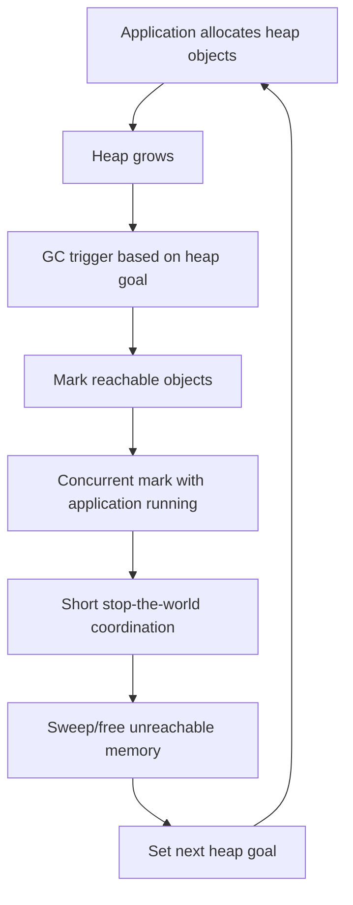
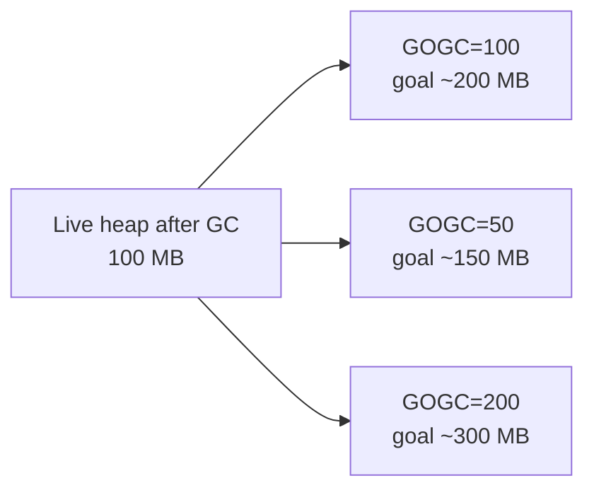
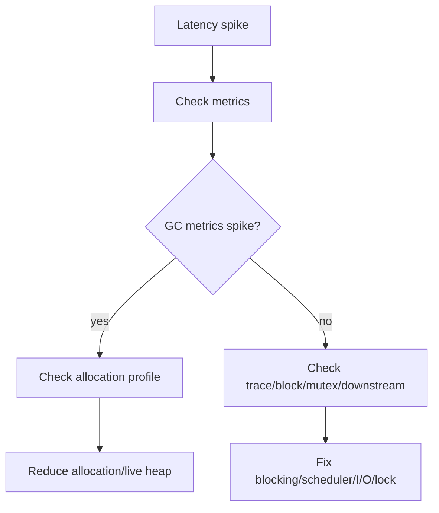
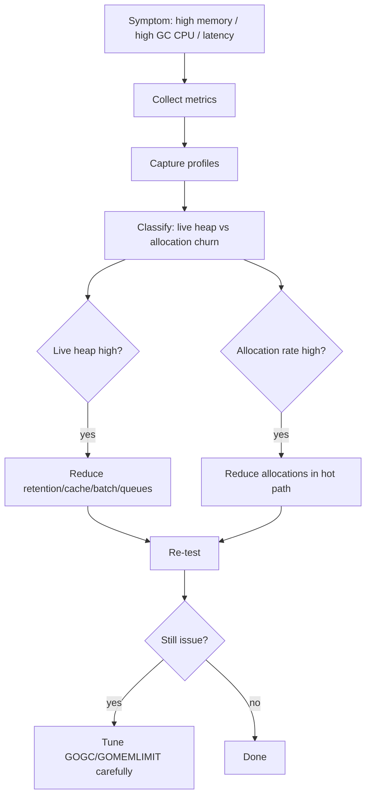
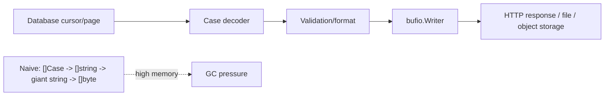

# learn-go-part-015.md

# Go Garbage Collector: Cost Model, Heap Goal, Latency, Allocation Strategy, and Tuning Boundaries

> Seri: `learn-go`  
> Part: `015` dari `034`  
> Target pembaca: Java software engineer yang ingin naik ke level production-grade Go engineer  
> Target Go: Go 1.26.x  
> Status seri: belum selesai

---

## 0. Tujuan Part Ini

Part sebelumnya membahas runtime Go secara luas: scheduler, goroutine, P/M/G, preemption, network poller, runtime metrics, profiling, dan tracing.

Part ini fokus pada satu komponen runtime yang sangat menentukan karakter production Go service: **Garbage Collector**.

Sebagai Java engineer, kamu mungkin terbiasa dengan diskusi:

```text
G1GC
ZGC
Shenandoah
heap sizing
young/old generation
pause time target
GC logs
object allocation rate
safepoints
```

Di Go, bentuk diskusinya berbeda. Go GC didesain dengan prinsip:

```text
low latency
concurrent marking
simple tuning model
fast allocation
small number of knobs
runtime-integrated observability
```

Tetapi Go GC tetap memiliki biaya. Top Go engineer tidak berpikir:

```text
"Go punya GC, jadi memory selesai."
```

Mereka berpikir:

```text
Allocation rate creates GC work.
Live heap creates GC work.
Pointer-rich graphs create scan work.
Heap goal controls frequency and memory growth.
GOGC trades CPU for memory.
Memory limit constrains runtime behavior.
Latency is affected by allocation assists, pauses, scheduling, and memory pressure.
```

Target part ini:

1. memahami cost model Go GC;
2. memahami heap goal;
3. memahami `GOGC`;
4. memahami soft memory limit;
5. memahami hubungan allocation rate, live heap, dan CPU;
6. memahami latency implication;
7. memahami kapan tuning layak;
8. memahami kapan tuning adalah distraction;
9. memahami metrics/profiles yang harus dilihat;
10. membangun checklist produksi untuk GC-aware Go services.

---

## 1. Sumber Resmi dan Rujukan Utama

Rujukan utama:

- A Guide to the Go Garbage Collector: https://go.dev/doc/gc-guide
- Go 1.26 Release Notes: https://go.dev/doc/go1.26
- Go 1.26 Blog: https://go.dev/blog/go1.26
- Package `runtime`: https://pkg.go.dev/runtime
- Package `runtime/debug`: https://pkg.go.dev/runtime/debug
- Package `runtime/metrics`: https://pkg.go.dev/runtime/metrics
- Package `runtime/pprof`: https://pkg.go.dev/runtime/pprof
- Go Diagnostics: https://go.dev/doc/diagnostics
- Go Memory Model: https://go.dev/ref/mem

Catatan Go 1.26:

- Go 1.26 menjadikan **Green Tea GC** sebagai default.
- Release notes menjelaskan bahwa Green Tea GC memperbaiki marking/scanning small objects melalui locality dan CPU scalability, dengan real-world GC overhead reduction untuk program yang heavily use GC.
- Ini bukan berarti allocation menjadi gratis. Cost model tetap berlaku.

---

## 2. Mental Model Besar GC Go

GC Go bertugas menemukan heap object yang masih reachable dan membebaskan object yang tidak reachable.

Simplified cycle:



Application engineer harus memahami empat besaran:

```text
live heap:
  memory reachable after GC

new allocation:
  heap allocated since previous GC

heap goal:
  target heap size before next GC

GC work:
  work needed to scan/mark live object graph and manage heap
```

---

## 3. GC Cost Model

### 3.1 Biaya GC Tidak Ditentukan oleh Total RAM Saja

GC cost terutama dipengaruhi oleh:

```text
1. live heap size
2. allocation rate
3. pointer density
4. object count and shape
5. mutation/write barrier activity
6. memory limit pressure
7. CPU availability
```

Jika service punya banyak object live yang pointer-rich, GC harus menelusuri banyak pointer.

Jika service allocate banyak object pendek umur, GC cycle menjadi sering.

Jika CPU terbatas di container, GC bersaing dengan request handling.

### 3.2 Live Heap

Live heap adalah object yang masih reachable setelah GC.

Contoh:

```go
var cache = map[string]*Case{}
```

Jika cache terus tumbuh, live heap tumbuh.

GC tidak bisa membebaskan object yang masih direferensikan, walaupun secara bisnis data itu sudah “tidak dibutuhkan”.

Memory leak di GC language biasanya bukan “lost pointer” seperti C, tetapi **unbounded retention**:

```text
map never evicted
slice retains backing array
goroutine retains closure
global registry keeps references
cache without TTL
channel queue grows
context values retain large objects
```

### 3.3 Allocation Rate

Allocation rate adalah seberapa cepat program membuat heap allocation.

Contoh high allocation:

```go
func Handler(w http.ResponseWriter, r *http.Request) {
    body, _ := io.ReadAll(r.Body)
    s := fmt.Sprintf("%s:%d", string(body), time.Now().UnixNano())
    _ = []byte(s)
}
```

Allocation rate tinggi memicu GC lebih sering.

### 3.4 Pointer Density

Object tanpa pointer lebih murah untuk GC scan daripada object dengan banyak pointer.

Pointer-rich:

```go
type Node struct {
    Next *Node
    Prev *Node
    Data *Payload
}
```

Value-dense:

```go
type Entry struct {
    Key   uint64
    Value uint64
}
```

Untuk GC, pointer adalah edge dalam object graph. Semakin banyak edge, semakin banyak scan/mark work.

### 3.5 Object Count and Shape

Banyak object kecil bisa mahal:

```go
type Item struct {
    Key   *string
    Value *string
}
```

Lebih banyak object, lebih banyak metadata/cache misses/pointer chasing.

Terkadang value-dense slice lebih baik:

```go
type Item struct {
    Key   string
    Value string
}

items := make([]Item, 0, n)
```

Ini bukan aturan absolut. Ukur dengan benchmark/profile.

---

## 4. Heap Goal

### 4.1 Apa Itu Heap Goal?

Heap goal adalah target ukuran heap berikutnya yang ditentukan runtime setelah GC cycle.

Secara konseptual:

```text
next heap goal = live heap + allowed growth
```

Allowed growth dipengaruhi `GOGC`.

Default `GOGC=100` berarti setelah GC menemukan live heap, runtime menargetkan heap boleh tumbuh kira-kira 100% dari live heap sebelum GC berikutnya, dengan detail tambahan dari runtime dan memory limit.

Simplified:

```text
live heap = 100 MB
GOGC = 100
next heap goal ≈ 200 MB
```

Jika `GOGC=50`:

```text
live heap = 100 MB
next heap goal ≈ 150 MB
```

Jika `GOGC=200`:

```text
live heap = 100 MB
next heap goal ≈ 300 MB
```

Visual:



### 4.2 Trade-off Heap Goal

Lower `GOGC`:

```text
less memory
more frequent GC
more CPU overhead
possibly lower memory footprint
possibly more latency impact
```

Higher `GOGC`:

```text
more memory
less frequent GC
less CPU overhead
possibly higher RSS/container memory
possibly risk OOM if limit tight
```

### 4.3 Heap Goal Is Not Hard Memory Limit

`GOGC` controls growth target, not hard cap.

For memory limit, use:

```text
GOMEMLIMIT
debug.SetMemoryLimit
```

But those are also runtime controls with trade-offs, not magic.

---

## 5. `GOGC`

### 5.1 Environment Variable

```bash
GOGC=100 ./service
```

Default is normally 100.

Disable GC:

```bash
GOGC=off ./service
```

Do not disable GC in normal production services unless you are doing very specific controlled workload and understand consequences.

### 5.2 Runtime API

```go
import "runtime/debug"

old := debug.SetGCPercent(100)
_ = old
```

Use dynamic changes cautiously.

### 5.3 Tuning Intuition

| Situation | Possible Direction |
|---|---|
| memory too high, CPU available | lower GOGC |
| GC CPU too high, memory available | raise GOGC |
| container near OOM | set memory limit, reduce live heap, lower GOGC carefully |
| latency spikes during allocation | reduce allocation, inspect assists, profile |
| huge cache live heap | fix cache policy before tuning GC |
| high alloc/op in hot path | optimize allocation before changing GOGC |

### 5.4 Tuning Without Measurement Is Guessing

Before changing `GOGC`, collect:

```text
heap live
heap goal
allocation rate
GC cycles/sec
GC CPU
pause histogram
request latency
RSS/container memory
OOM/restart data
alloc profile
heap profile
```

---

## 6. Memory Limit

### 6.1 `GOMEMLIMIT`

Go supports soft memory limit via environment variable:

```bash
GOMEMLIMIT=512MiB ./service
```

This tells runtime to try to keep memory usage under a limit.

### 6.2 Runtime API

```go
import "runtime/debug"

old := debug.SetMemoryLimit(512 << 20)
_ = old
```

### 6.3 Soft Limit, Not Absolute Safety

Memory limit is not a perfect hard isolation boundary.

The process can still exceed due to:

- non-Go memory;
- cgo;
- mmap;
- OS overhead;
- stacks;
- runtime metadata;
- fragmentation;
- sudden allocation bursts;
- external libraries;
- kernel accounting.

In Kubernetes, still set container memory limits appropriately and observe RSS.

### 6.4 Memory Limit Trade-off

If memory limit is too low relative to live heap:

```text
runtime may GC aggressively
CPU may increase
latency may degrade
application may still OOM
```

If live heap itself exceeds feasible memory, GC tuning cannot save you.

You need to reduce live data:

- evict cache;
- cap queues;
- stream large data;
- fix retention;
- split workload;
- reduce batch size;
- avoid storing unnecessary payloads.

---

## 7. Latency and GC

### 7.1 Go GC Is Low-Latency, Not Zero-Cost

Go GC is concurrent and designed for short pauses, but application can still feel GC through:

- allocation assists;
- CPU contention;
- short STW phases;
- cache/memory bandwidth pressure;
- heap growth;
- scheduler interaction;
- memory limit pressure.

### 7.2 Stop-the-World Phases

Go GC has short STW coordination phases.

For most applications, long latency issues are often not caused solely by STW, but by:

- allocation churn;
- blocked goroutines;
- lock contention;
- downstream timeouts;
- CPU saturation;
- GC assists;
- container CPU throttling.

### 7.3 Allocation Assist and Tail Latency

When allocation is heavy, goroutines may help with GC work before continuing allocation.

Request handler implication:

```text
A handler that allocates heavily may pay GC assist cost during user request.
```

Therefore optimizing allocation can reduce tail latency even when average CPU looks okay.

### 7.4 Latency Diagnosis

Do not assume GC. Correlate.



---

## 8. Allocation Strategy

### 8.1 Good Allocation Strategy Is Mostly API/Data Design

Optimization starts from design:

```text
Do not retain what you do not need.
Do not allocate what you can stream.
Do not convert formats repeatedly.
Do not represent dense data as pointer graph without reason.
Do not copy at every layer.
Do not expose mutable internals.
```

### 8.2 Preallocation

Slice:

```go
out := make([]CaseID, 0, len(cases))
for _, c := range cases {
    out = append(out, c.ID)
}
```

Map:

```go
index := make(map[OfficerID][]CaseID, len(assignments))
```

Preallocation reduces growth allocations.

### 8.3 Streaming

Bad:

```go
data, err := io.ReadAll(r.Body)
```

Better for large payloads:

```go
_, err := io.Copy(dst, io.LimitReader(r.Body, maxBytes))
```

For JSON, streaming decoder can help:

```go
dec := json.NewDecoder(r.Body)
for dec.More() {
    var item Item
    if err := dec.Decode(&item); err != nil {
        return err
    }
    process(item)
}
```

### 8.4 Avoid Accidental Retention

```go
small := large[:100]
```

If `small` escapes, it may retain entire backing array.

Fix:

```go
small := append([]byte(nil), large[:100]...)
```

### 8.5 Avoid Pointer Graphs by Default

Java style:

```go
type Case struct {
    Status *Status
    Owner  *Officer
    Meta   *Meta
}
```

Go style where appropriate:

```go
type Case struct {
    Status Status
    OwnerID OfficerID
    Meta   Meta
}
```

Pointers are useful when semantically needed. They should not be default.

### 8.6 Object Pools

`sync.Pool` can reduce allocation for temporary objects, but it is not a general cache.

Good candidates:

- temporary buffers;
- short-lived objects;
- high-throughput repeated allocation;
- objects safe to reset;
- no semantic dependency on pool retaining items.

Bad candidates:

- business objects with identity;
- objects containing sensitive data not cleared;
- objects with complex ownership;
- long-lived cache;
- required resource lifecycle.

Example:

```go
var bufPool = sync.Pool{
    New: func() any {
        return new(bytes.Buffer)
    },
}

func useBuffer() {
    b := bufPool.Get().(*bytes.Buffer)
    b.Reset()
    defer bufPool.Put(b)

    // use b
}
```

Security warning:

```text
Clear sensitive data before putting buffers back into pool.
```

### 8.7 Pool Trade-Offs

`sync.Pool` entries may be dropped by GC. Do not rely on it for correctness.

It can improve throughput but may complicate code and hide retention bugs.

Use benchmark and profile.

---

## 9. Observability for GC

### 9.1 `GODEBUG=gctrace=1`

For local diagnosis:

```bash
GODEBUG=gctrace=1 ./service
```

This prints GC trace lines to stderr.

Use for investigation, not as primary production observability.

### 9.2 Runtime Metrics

Use `runtime/metrics`.

Important categories:

```text
/gc/heap/live
/gc/heap/goal
/gc/heap/allocs
/gc/heap/frees
/gc/cycles
/gc/pauses
/cpu/classes/gc
/memory/classes
/sched/goroutines
```

Example:

```go
samples := []metrics.Sample{
    {Name: "/gc/heap/live:bytes"},
    {Name: "/gc/heap/goal:bytes"},
    {Name: "/sched/goroutines:goroutines"},
}
metrics.Read(samples)
```

### 9.3 pprof Heap Profile

Heap profile answers:

```text
what is live?
where was live memory allocated?
```

Allocation profile answers:

```text
where are allocations happening over time?
```

Commands:

```bash
go tool pprof http://localhost:6060/debug/pprof/heap
go tool pprof http://localhost:6060/debug/pprof/allocs
```

### 9.4 Benchmark Memory

```bash
go test -bench=. -benchmem ./...
```

Look at:

```text
B/op
allocs/op
```

### 9.5 Trace

Execution trace shows GC timing relative to goroutines.

```bash
go test -trace trace.out ./...
go tool trace trace.out
```

Use trace when latency issue needs timeline-level explanation.

---

## 10. GC Tuning Workflow

### 10.1 Correct Workflow



### 10.2 Diagnose Live Heap vs Allocation Churn

High live heap:

```text
heap profile shows retained objects
cache/map/slice/goroutine references
memory stays high after GC
```

High allocation churn:

```text
alloc profile hot
B/op high
GC cycles frequent
live heap moderate
```

Different fixes.

### 10.3 Tuning Order

Prefer:

```text
1. fix unbounded retention
2. reduce unnecessary allocation
3. improve data layout
4. bound concurrency/queues
5. set memory limit appropriate to container
6. tune GOGC
```

Do not start with:

```text
"Set GOGC randomly."
```

### 10.4 Before/After Evidence

For any GC optimization, capture before/after:

```text
p50/p95/p99 latency
CPU usage
GC CPU
heap live
heap goal
RSS
alloc rate
GC cycles/sec
B/op and allocs/op for hot benchmark
```

---

## 11. Kubernetes and Containers

### 11.1 Memory Limit Awareness

In containers, memory is finite. Go runtime can consider memory limit, but your service must still be designed correctly.

Typical production config:

```yaml
resources:
  requests:
    cpu: "500m"
    memory: "512Mi"
  limits:
    cpu: "1"
    memory: "1Gi"
```

And runtime:

```bash
GOMEMLIMIT=850MiB
```

Why below container limit?

Because process RSS includes more than Go heap:

- stacks;
- runtime metadata;
- non-Go memory;
- mmap;
- shared libraries;
- cgo;
- profiling overhead;
- fragmentation;
- kernel accounting.

### 11.2 CPU Limit Interaction

GC needs CPU. If container CPU is throttled, GC and application compete more intensely.

Symptoms:

- latency spikes under load;
- GC cycles slower;
- allocation assist more visible;
- CPU throttling metrics high.

Fix may involve:

- reduce allocation;
- increase CPU request/limit;
- reduce concurrency;
- tune workload;
- adjust GOGC/memory limit with measurement.

### 11.3 OOM Kill

If Kubernetes OOM kills process, Go may not get a chance to recover.

Investigate:

- container memory usage;
- heap live vs RSS;
- memory classes;
- cgo/non-Go memory;
- unbounded queues;
- large body read-all;
- cache growth;
- goroutine count;
- pprof heap.

---

## 12. Java-to-Go GC Translation

### 12.1 No Young/Old Generation Mental Model

Traditional Java GC often discusses young/old generations. Go GC model is different. Do not force Java generational intuition onto Go.

Go optimization usually focuses on:

```text
allocation rate
live heap
pointer density
object lifetime through references
data layout
```

### 12.2 Fewer Knobs, More Design Pressure

Java may expose many GC knobs. Go intentionally exposes fewer high-level knobs:

```text
GOGC
GOMEMLIMIT
debug.SetGCPercent
debug.SetMemoryLimit
```

This shifts responsibility toward application structure.

### 12.3 GC Logs vs Go Observability

Java GC logs are common first tool.

Go equivalent toolchain:

```text
runtime metrics
gctrace for local diagnosis
pprof heap/allocs
execution trace
application latency metrics
container metrics
```

### 12.4 Object Allocation Culture

Java frameworks often allocate heavily and rely on optimized JVM/JIT/GC.

Go services usually benefit from explicit low-allocation design:

- preallocate;
- stream;
- avoid reflection in hot path;
- avoid pointer-heavy graphs;
- avoid unnecessary interface boxing;
- avoid repeated conversions;
- avoid goroutine leaks;
- avoid retaining request data.

---

## 13. Production Example: Case Export Service

### 13.1 Problem

A regulatory system exports 1 million cases to CSV.

Naive implementation:

```go
func Export(cases []Case) ([]byte, error) {
    var rows []string

    for _, c := range cases {
        rows = append(rows, fmt.Sprintf("%s,%s,%s", c.ID, c.Status, c.OfficerID))
    }

    return []byte(strings.Join(rows, "\n")), nil
}
```

Problems:

- stores all rows;
- many string allocations;
- final giant string;
- converts string to []byte;
- memory spike proportional to full export;
- high GC pressure.

### 13.2 Streaming Implementation

```go
func Export(w io.Writer, cases []Case) error {
    bw := bufio.NewWriter(w)
    defer bw.Flush()

    for _, c := range cases {
        if _, err := bw.WriteString(string(c.ID)); err != nil {
            return err
        }
        if err := bw.WriteByte(','); err != nil {
            return err
        }
        if _, err := bw.WriteString(string(c.Status)); err != nil {
            return err
        }
        if err := bw.WriteByte(','); err != nil {
            return err
        }
        if _, err := bw.WriteString(string(c.OfficerID)); err != nil {
            return err
        }
        if err := bw.WriteByte('\n'); err != nil {
            return err
        }
    }

    return nil
}
```

Benefits:

- bounded memory;
- fewer temporary objects;
- no full output retained;
- backpressure through writer;
- easier to stream HTTP response/file.

### 13.3 Architecture Diagram



### 13.4 Even Better: Page From DB

Avoid loading all cases:

```go
func ExportAll(ctx context.Context, w io.Writer, repo Repository) error {
    bw := bufio.NewWriter(w)
    defer bw.Flush()

    var cursor Cursor
    for {
        page, next, err := repo.FetchPage(ctx, cursor, 1000)
        if err != nil {
            return err
        }

        for _, c := range page {
            if err := writeCaseCSVRow(bw, c); err != nil {
                return err
            }
        }

        if !next.Valid {
            return nil
        }
        cursor = next
    }
}
```

This improves:

- heap live;
- allocation rate;
- failure isolation;
- timeout/cancellation;
- backpressure.

---

## 14. Common GC-Related Anti-Patterns

### 14.1 Reading Entire Payload Unbounded

```go
body, err := io.ReadAll(r.Body)
```

Fix:

```go
r.Body = http.MaxBytesReader(w, r.Body, maxBytes)
```

or stream.

### 14.2 Cache Without Eviction

```go
cache[id] = value
```

forever.

Fix:

- TTL;
- size bound;
- LRU/LFU;
- explicit invalidation;
- segmented cache;
- metrics.

### 14.3 Goroutine Leak Retaining Objects

```go
go func() {
    <-ch
    use(large)
}()
```

If `ch` never receives, `large` remains reachable.

### 14.4 Context Value Abuse

```go
ctx = context.WithValue(ctx, "payload", largePayload)
```

Context values should carry request-scoped metadata, not large business payloads.

### 14.5 Pointer Graph Domain Model

```go
type Case struct {
    Applicant *Applicant
    Address   *Address
    License   *License
    Documents []*Document
}
```

Sometimes needed, but often Java-style overuse.

Prefer IDs/value snapshots where appropriate.

### 14.6 Excessive `fmt.Sprintf`

In hot path:

```go
key := fmt.Sprintf("%s:%s:%d", a, b, c)
```

May allocate and parse format.

Use struct key or builder if necessary.

### 14.7 Pooling Without Reset

```go
buf := pool.Get().(*bytes.Buffer)
defer pool.Put(buf)
// forgot Reset
```

Can leak previous data and grow memory.

Correct:

```go
buf := pool.Get().(*bytes.Buffer)
buf.Reset()
defer func() {
    buf.Reset()
    pool.Put(buf)
}()
```

For sensitive data, zero memory where necessary.

### 14.8 Tuning `GOGC` to Hide Leak

If live heap grows forever, changing `GOGC` only changes how soon you fail.

Fix retention.

---

## 15. Practical Commands

### 15.1 Benchmark Allocations

```bash
go test -bench=. -benchmem ./...
```

### 15.2 Heap Profile

```bash
go tool pprof http://localhost:6060/debug/pprof/heap
```

### 15.3 Allocation Profile

```bash
go tool pprof http://localhost:6060/debug/pprof/allocs
```

### 15.4 GC Trace

```bash
GODEBUG=gctrace=1 ./service
```

### 15.5 Runtime Metrics Probe

```go
package main

import (
    "fmt"
    "runtime/metrics"
)

func main() {
    names := []string{
        "/gc/heap/live:bytes",
        "/gc/heap/goal:bytes",
        "/sched/goroutines:goroutines",
    }

    samples := make([]metrics.Sample, len(names))
    for i, name := range names {
        samples[i].Name = name
    }

    metrics.Read(samples)

    for _, s := range samples {
        fmt.Println(s.Name, s.Value)
    }
}
```

### 15.6 Escape Analysis

```bash
go test -gcflags=all="-m=2" ./...
```

### 15.7 Trace

```bash
go test -trace trace.out ./...
go tool trace trace.out
```

---

## 16. Hands-On Labs

### Lab 1: GOGC Experiment

Write program that allocates many objects.

Run:

```bash
GOGC=50 go run .
GOGC=100 go run .
GOGC=200 go run .
```

Observe:

- memory;
- GC frequency;
- CPU;
- runtime metrics.

### Lab 2: Live Heap Leak

Create map cache without eviction.

Observe heap profile.

Then add size bound or TTL.

Compare live heap.

### Lab 3: Allocation Churn

Implement function using `fmt.Sprintf` in tight loop.

Benchmark with `-benchmem`.

Replace with struct key or builder.

Compare allocations.

### Lab 4: Streaming vs Buffering

Implement export:

1. build giant `[]byte`;
2. stream to `io.Writer`.

Compare:

```bash
go test -bench=. -benchmem
```

### Lab 5: Sub-Slice Retention

Create large `[]byte`, return small slice.

Observe retained heap.

Fix with copy.

### Lab 6: sync.Pool

Use `sync.Pool` for temporary `bytes.Buffer`.

Benchmark before/after.

Then remove pool and compare readability/complexity trade-off.

---

## 17. Review Questions

1. Apa yang dimaksud live heap?
2. Apa yang dimaksud allocation rate?
3. Apa itu heap goal?
4. Bagaimana `GOGC=100` secara konseptual menentukan heap goal?
5. Apa trade-off menaikkan `GOGC`?
6. Apa trade-off menurunkan `GOGC`?
7. Apa beda `GOGC` dan `GOMEMLIMIT`?
8. Kenapa memory limit bukan hard guarantee?
9. Kenapa pointer density memengaruhi GC work?
10. Kenapa banyak object kecil bisa mahal?
11. Apa itu allocation assist?
12. Kenapa GC bisa memengaruhi tail latency meskipun concurrent?
13. Apa perbedaan live heap tinggi vs allocation churn tinggi?
14. Kapan `sync.Pool` layak?
15. Kenapa cache tanpa eviction adalah GC problem?
16. Kenapa tuning GC tidak menyelesaikan memory leak?
17. Bagaimana mendiagnosis high GC CPU?
18. Bagaimana mendiagnosis OOM di Kubernetes Go service?
19. Kenapa streaming sering lebih GC-friendly daripada buffering?
20. Apa yang berubah di Go 1.26 terkait GC?

---

## 18. Code Review Checklist

Saat review kode Go terkait memory/GC:

```text
[ ] Apakah ada read-all payload besar?
[ ] Apakah ada cache/map tanpa bound/TTL?
[ ] Apakah ada slice kecil yang menahan backing array besar?
[ ] Apakah ada goroutine yang bisa leak dan retain object?
[ ] Apakah context membawa payload besar?
[ ] Apakah hot path memakai fmt.Sprintf/reflection berlebihan?
[ ] Apakah data layout terlalu pointer-heavy tanpa alasan?
[ ] Apakah output besar bisa distream?
[ ] Apakah slice/map dipreallocate saat ukuran diketahui?
[ ] Apakah pooling dipakai hanya setelah benchmark?
[ ] Apakah pooled object di-reset?
[ ] Apakah sensitive data dibersihkan sebelum reuse?
[ ] Apakah GOGC/GOMEMLIMIT diset berdasarkan evidence?
[ ] Apakah runtime metrics diekspor?
[ ] Apakah heap/alloc profiles tersedia untuk diagnosis?
[ ] Apakah memory container memberi headroom untuk non-heap?
```

---

## 19. Invariants

Pegang invariant berikut:

```text
GC frees unreachable heap objects, not business-unused objects.
Reachable cache entries are live heap.
Allocation rate drives GC frequency.
Live heap drives GC work and memory footprint.
Pointer-rich object graphs increase scan work.
GOGC trades memory for CPU.
GOMEMLIMIT is a soft runtime memory target, not an OOM shield.
Go GC is low-latency, not zero-cost.
Improved GC does not make allocation free.
Reduce retention before tuning GC.
Reduce allocation churn before tuning GC.
Measure with metrics, pprof, benchmark, and trace.
Streaming often beats buffering for memory.
Pools are optimization tools, not correctness tools.
```

---

## 20. Ringkasan

Go GC adalah salah satu alasan Go nyaman untuk membangun service production. Kamu tidak perlu manual free memory, tetapi kamu tetap harus mendesain data dan lifecycle dengan sadar.

Formula mental:

```text
GC pressure = function(live heap, allocation rate, pointer density, CPU availability)
```

Dan strategi production:

```text
Bound retention.
Stream large data.
Preallocate known sizes.
Avoid accidental pointer graphs.
Avoid unnecessary temporary objects.
Expose runtime metrics.
Use pprof and trace.
Tune GOGC/GOMEMLIMIT after evidence.
```

Sebagai Java engineer, jangan membawa dua kebiasaan ekstrem:

```text
1. "GC akan mengurus semuanya."
2. "Semua allocation harus dihindari."
```

Keduanya salah.

Yang benar:

```text
Allocation boleh jika semantic jelas dan biaya tidak signifikan.
Allocation harus dikurangi jika terbukti menjadi bottleneck.
Retention harus selalu dikontrol karena GC tidak bisa membebaskan reachable data.
```

Top Go engineer tidak sekadar tahu command `GOGC=50`. Mereka tahu kapan tidak menggunakannya.

---

## 21. Posisi Kita di Seri

Kita sudah menyelesaikan:

```text
000 - Orientation and Mental Model
001 - Toolchain, Workspace, Module, Build
002 - Syntax Core
003 - Functions
004 - Types
005 - Composition
006 - Interfaces
007 - Generics
008 - Error Handling
009 - Package Design
010 - Modules and Dependency Management
011 - Standard Library Mental Model
012 - Slices, Arrays, and Maps
013 - Memory Model for Application Engineers
014 - Runtime Deep Dive
015 - Go Garbage Collector
```

Berikutnya:

```text
016 - Concurrency Primitives:
      Goroutines, Channels, select, Close Semantics, Ownership, and Lifecycle
```

Status seri: **belum selesai**.

<!-- NAVIGATION_FOOTER -->
<div class="page-nav">
<a href="./learn-go-part-014.md">⬅️ Go Runtime Deep Dive: Goroutine Scheduler, P/M/G Model, Preemption, GC, and Runtime Metrics</a>
<a href="./index.md">📚 Kategori</a>
<a href="../../index.md">🏠 Home</a>
<a href="./learn-go-part-016.md">Go Concurrency Primitives: Goroutines, Channels, select, Close Semantics, Ownership, and Lifecycle ➡️</a>
</div>
