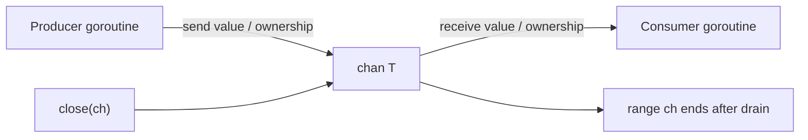
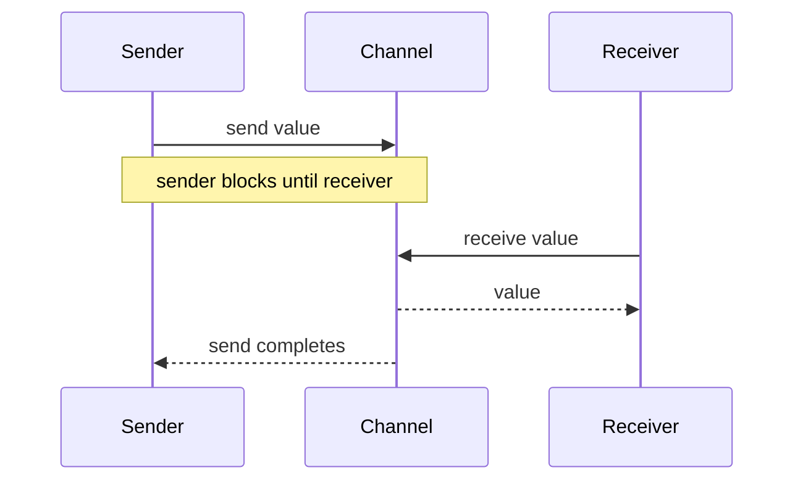
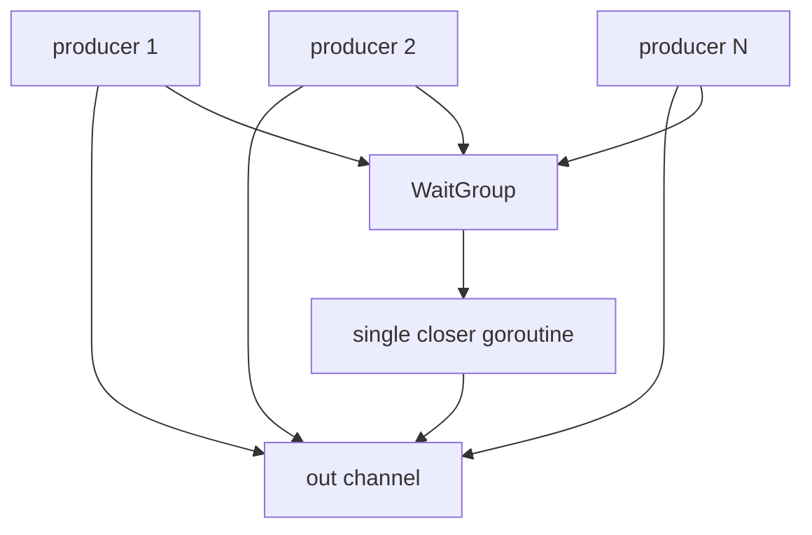
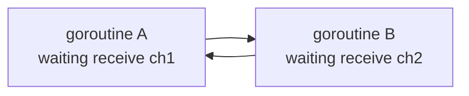
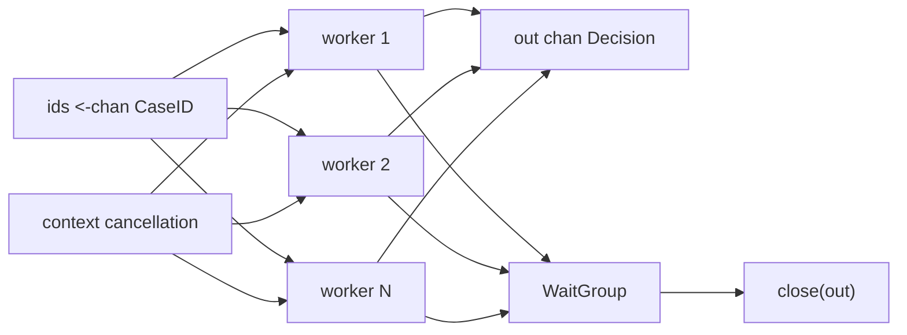

# learn-go-part-016.md

# Go Concurrency Primitives: Goroutines, Channels, select, Close Semantics, Ownership, and Lifecycle

> Seri: `learn-go`  
> Part: `016` dari `034`  
> Target pembaca: Java software engineer yang ingin naik ke level production-grade Go engineer  
> Target Go: Go 1.26.x  
> Status seri: belum selesai

---

## 0. Tujuan Part Ini

Part sebelumnya membahas runtime dan GC. Sekarang kita masuk ke primitive concurrency yang paling terlihat di Go:

```go
go f()
ch := make(chan T)
select { ... }
close(ch)
```

Untuk Java engineer, Go concurrency sering terlihat seperti:

```text
goroutine ≈ lightweight thread
channel ≈ blocking queue
select ≈ multiplexing wait
```

Analogi itu berguna sebagai awal, tetapi berbahaya jika berhenti di sana.

Di Go, concurrency primitive membawa ide desain yang lebih kuat:

```text
goroutine:
  unit of concurrent execution with explicit lifetime responsibility

channel:
  synchronization + data transfer + ownership handoff

select:
  coordinated waiting, cancellation, timeout, multiplexing

close:
  broadcast signal from sender side that no more values will be sent

context:
  cancellation tree and request lifecycle propagation
```

Tujuan part ini adalah membuat kamu mampu mendesain concurrency yang:

- tidak leak;
- tidak deadlock;
- tidak panic karena close/send salah;
- punya cancellation path;
- punya backpressure;
- punya ownership channel yang jelas;
- tidak overuse channel ketika mutex lebih sederhana;
- bisa dibaca, diuji, dan dioperasikan di production.

---

## 1. Sumber Resmi dan Rujukan Utama

Rujukan utama:

- Go Blog: Share Memory By Communicating — https://go.dev/blog/codelab-share
- Go Wiki: Use a sync.Mutex or a channel? — https://go.dev/wiki/MutexOrChannel
- The Go Memory Model — https://go.dev/ref/mem
- Package `sync` — https://pkg.go.dev/sync
- Package `context` — https://pkg.go.dev/context
- Package `runtime/pprof` — https://pkg.go.dev/runtime/pprof
- Go 1.26 Release Notes — https://go.dev/doc/go1.26
- Package `runtime/trace` — https://pkg.go.dev/runtime/trace
- Go Diagnostics — https://go.dev/doc/diagnostics

Catatan Go 1.26:

- Go 1.26 menambahkan experimental goroutine leak profile bernama `goroutineleak` di `runtime/pprof`, yang dapat diaktifkan dengan `GOEXPERIMENT=goroutineleakprofile`; jika aktif, profile juga muncul sebagai endpoint `/debug/pprof/goroutineleak` melalui `net/http/pprof`.
- Fitur ini experimental. Gunakan sebagai alat bantu investigasi, bukan sebagai pengganti desain lifecycle yang benar.

---

## 2. Mental Model Besar

### 2.1 Concurrency Is Structure, Not Decoration

Di Go, `go` keyword sangat murah secara syntax:

```go
go doWork()
```

Tetapi setiap `go` statement menambah struktur concurrency baru.

Pertanyaan yang wajib dijawab:

```text
Who owns this goroutine?
Who cancels it?
Who waits for it?
Where does its error go?
Can it block forever?
What happens during shutdown?
What resource does it retain?
```

Tanpa jawaban itu, kamu tidak sedang membuat concurrency; kamu sedang membuat leak yang tertunda.

### 2.2 Channel Is Not Just Queue

Channel bisa dipakai sebagai queue, tetapi mental model yang lebih kuat:

```text
channel = typed synchronization point
channel send = transfer value and possibly ownership
channel receive = acquire value and possibly ownership
channel close = no more values will be sent
```

Visual:



### 2.3 Share Memory by Communicating

Motto Go yang terkenal:

```text
Do not communicate by sharing memory;
share memory by communicating.
```

Maknanya bukan “jangan pernah pakai mutex”. Maknanya:

```text
Jika memungkinkan, transfer ownership data melalui channel
sehingga hanya satu goroutine yang memodifikasi data pada satu waktu.
```

Go Wiki sendiri menyarankan memakai channel atau mutex sesuai mana yang paling expressive dan simple. Jangan jadikan channel sebagai dogma.

---

## 3. Goroutine

### 3.1 Membuat Goroutine

```go
go func() {
    doWork()
}()
```

Atau:

```go
go doWork()
```

Argumen dievaluasi saat `go` statement dieksekusi.

```go
for _, id := range ids {
    go process(id)
}
```

Modern Go memperbaiki banyak masalah loop variable capture pada versi module baru, tetapi tetap baik membuat parameter eksplisit jika closure kompleks:

```go
for _, id := range ids {
    id := id
    go func() {
        process(id)
    }()
}
```

Atau lebih jelas:

```go
for _, id := range ids {
    go func(id CaseID) {
        process(id)
    }(id)
}
```

### 3.2 Goroutine Tidak Mengembalikan Value Langsung

Wrong mental model:

```go
result := go compute() // invalid
```

Gunakan channel, shared state dengan sync, errgroup-like pattern, atau callback.

Channel:

```go
ch := make(chan Result, 1)

go func() {
    ch <- compute()
}()

result := <-ch
```

### 3.3 Goroutine Error Handling

Bad:

```go
go func() {
    if err := doWork(); err != nil {
        log.Println(err)
    }
}()
```

Kadang cukup untuk best-effort background task, tetapi sering buruk karena caller tidak tahu gagal.

Better:

```go
errCh := make(chan error, 1)

go func() {
    errCh <- doWork()
}()

if err := <-errCh; err != nil {
    return err
}
```

For multiple workers, collect errors carefully.

### 3.4 Panic in Goroutine

Panic di goroutine yang tidak di-recover dapat crash program.

```go
go func() {
    panic("boom")
}()
```

Jika goroutine boundary adalah worker framework, recover di boundary:

```go
go func() {
    defer func() {
        if r := recover(); r != nil {
            logger.Error("worker panic", "panic", r)
        }
    }()

    doWork()
}()
```

Tetapi jangan pakai panic untuk normal error.

### 3.5 Goroutine Lifetime

Bad:

```go
func StartRefresher() {
    go func() {
        for {
            refresh()
            time.Sleep(time.Minute)
        }
    }()
}
```

No stop path.

Better:

```go
func StartRefresher(ctx context.Context) {
    go func() {
        ticker := time.NewTicker(time.Minute)
        defer ticker.Stop()

        for {
            select {
            case <-ctx.Done():
                return
            case <-ticker.C:
                refresh(ctx)
            }
        }
    }()
}
```

### 3.6 Waiting for Goroutines

Use `sync.WaitGroup`.

Classic pattern:

```go
var wg sync.WaitGroup

for _, job := range jobs {
    job := job
    wg.Add(1)

    go func() {
        defer wg.Done()
        process(job)
    }()
}

wg.Wait()
```

In Go 1.25+, `WaitGroup.Go` was added to simplify common pattern. With Go 1.26.x, you can use it when available in your codebase baseline:

```go
var wg sync.WaitGroup

for _, job := range jobs {
    job := job
    wg.Go(func() {
        process(job)
    })
}

wg.Wait()
```

Still understand the classic pattern because existing codebases and libraries use it heavily.

Important:

```text
WaitGroup waits; it does not cancel.
WaitGroup collects no error by itself.
WaitGroup does not limit concurrency.
```

---

## 4. Channels

### 4.1 Creating Channel

Unbuffered:

```go
ch := make(chan int)
```

Buffered:

```go
ch := make(chan int, 10)
```

Directional:

```go
func producer(out chan<- Item) {}
func consumer(in <-chan Item) {}
```

Directional channel types make API ownership clearer.

### 4.2 Unbuffered Channel

Unbuffered send blocks until receiver ready.

```go
ch := make(chan int)

go func() {
    ch <- 1
}()

v := <-ch
```

Synchronization:

```text
send and receive rendezvous
```

Visual:



### 4.3 Buffered Channel

Buffered send blocks only when buffer full.

```go
ch := make(chan int, 2)
ch <- 1
ch <- 2
// ch <- 3 would block if no receiver
```

Buffered receive blocks when buffer empty.

Buffer is not a performance magic. It changes backpressure and scheduling semantics.

### 4.4 Channel Zero Value

Zero value of channel is nil.

```go
var ch chan int
```

Send/receive on nil channel blocks forever:

```go
ch <- 1 // blocks forever
<-ch    // blocks forever
```

Close nil channel panics:

```go
close(ch) // panic
```

Nil channel is useful in select to disable case dynamically, but dangerous accidentally.

### 4.5 Send and Receive

Send:

```go
ch <- v
```

Receive:

```go
v := <-ch
```

Comma-ok receive:

```go
v, ok := <-ch
if !ok {
    // channel closed and drained
}
```

Range:

```go
for v := range ch {
    process(v)
}
```

Range ends when channel is closed and drained.

---

## 5. Close Semantics

### 5.1 What Does Close Mean?

```go
close(ch)
```

Means:

```text
No more values will be sent on this channel.
```

It does not mean:

```text
Receiver is done.
Cancel immediately.
Destroy channel.
Flush all consumers.
```

If channel has buffered values, receivers can still receive them after close.

### 5.2 Receive from Closed Channel

```go
v, ok := <-ch
```

If channel is closed and empty:

```text
v = zero value of T
ok = false
```

### 5.3 Send to Closed Channel Panics

```go
close(ch)
ch <- 1 // panic
```

### 5.4 Close Closed Channel Panics

```go
close(ch)
close(ch) // panic
```

### 5.5 Who Should Close?

Rule of thumb:

```text
The sender closes the channel.
The receiver does not close the channel unless receiver is also the sole sender/owner.
```

More precise:

```text
Close is a statement from the sending side:
"I will send no more values."
```

If multiple senders exist, coordinate close with a single owner.

Wrong:

```go
func consumer(ch chan int) {
    close(ch) // usually wrong
}
```

Correct:

```go
func producer(ch chan<- int) {
    defer close(ch)
    for _, v := range values {
        ch <- v
    }
}
```

### 5.6 Multiple Producers

Wrong:

```go
for _, source := range sources {
    go func(source Source) {
        defer close(out) // multiple close panic
        produce(source, out)
    }(source)
}
```

Correct:

```go
var wg sync.WaitGroup

for _, source := range sources {
    source := source
    wg.Add(1)
    go func() {
        defer wg.Done()
        produce(source, out)
    }()
}

go func() {
    wg.Wait()
    close(out)
}()
```

Visual:



---

## 6. `select`

### 6.1 Basic Select

```go
select {
case v := <-ch1:
    handle(v)
case ch2 <- x:
    sent()
case <-ctx.Done():
    return ctx.Err()
}
```

`select` waits until one case can proceed.

If multiple cases are ready, one is selected pseudo-randomly.

### 6.2 Cancellation with Select

```go
select {
case out <- v:
    return nil
case <-ctx.Done():
    return ctx.Err()
}
```

This prevents blocked send leak.

### 6.3 Timeout

```go
select {
case v := <-ch:
    return v, nil
case <-time.After(time.Second):
    return zero, errors.New("timeout")
}
```

For repeated loops, avoid creating many `time.After` timers; use `time.NewTimer` carefully.

### 6.4 Default Case

```go
select {
case v := <-ch:
    return v, true
default:
    return zero, false
}
```

Default makes select non-blocking.

Danger:

```go
for {
    select {
    default:
        // busy spin
    }
}
```

This can burn CPU.

### 6.5 Nil Channel to Disable Case

```go
var ch <-chan Item

if enabled {
    ch = realCh
}

select {
case v := <-ch:
    process(v)
case <-ctx.Done():
    return
}
```

If `ch` is nil, that case is disabled because receive on nil channel blocks forever.

Useful, but make nil channel state obvious.

---

## 7. Happens-Before and Synchronization

The Go Memory Model defines synchronization relationships. For channels, core intuition:

```text
A send on a channel synchronizes with the corresponding receive.
Closing a channel synchronizes with a receive that observes the close.
```

Practical example:

```go
done := make(chan struct{})
var x int

go func() {
    x = 42
    close(done)
}()

<-done
fmt.Println(x) // safe to observe 42
```

Why?

The close is observed by receive, creating synchronization.

Without synchronization:

```go
var x int

go func() {
    x = 42
}()

fmt.Println(x) // data race
```

### 7.1 Channel Is Synchronization, But Not Magic

This is safe:

```go
ch := make(chan *Case)

go func() {
    c := &Case{ID: "C-1"}
    c.Status = "READY"
    ch <- c
}()

c := <-ch
fmt.Println(c.Status)
```

The receiver sees writes before send.

But if both goroutines mutate `c` after handoff without synchronization, race returns.

```go
go func() {
    c.Status = "A"
}()

go func() {
    c.Status = "B"
}()
```

Channel handoff should imply ownership transfer or clear shared synchronization.

---

## 8. Channel Ownership Patterns

### 8.1 Producer Owns Output Channel

```go
func Generate(ctx context.Context, values []int) <-chan int {
    out := make(chan int)

    go func() {
        defer close(out)

        for _, v := range values {
            select {
            case out <- v:
            case <-ctx.Done():
                return
            }
        }
    }()

    return out
}
```

Contract:

```text
Generate owns sending side and closes out.
Caller receives only.
```

### 8.2 Consumer Does Not Close Input

```go
func Consume(ctx context.Context, in <-chan int) error {
    for {
        select {
        case v, ok := <-in:
            if !ok {
                return nil
            }
            process(v)
        case <-ctx.Done():
            return ctx.Err()
        }
    }
}
```

Consumer does not close `in`.

### 8.3 Done Channel

Historically:

```go
done := make(chan struct{})
```

Close as broadcast:

```go
close(done)
```

Receivers:

```go
select {
case <-done:
    return
case v := <-in:
    process(v)
}
```

Modern application code usually prefers `context.Context`, especially across request boundaries.

Done channel still appears in low-level packages or internal components.

### 8.4 Channel of Empty Struct

```go
chan struct{}
```

Used for signal without payload.

Example:

```go
ready := make(chan struct{})

go func() {
    initResource()
    close(ready)
}()

<-ready
```

---

## 9. Common Patterns

### 9.1 One-Shot Result

```go
type Result struct {
    Value Value
    Err   error
}

func Async(ctx context.Context) <-chan Result {
    ch := make(chan Result, 1)

    go func() {
        v, err := compute(ctx)

        select {
        case ch <- Result{Value: v, Err: err}:
        case <-ctx.Done():
        }

        close(ch)
    }()

    return ch
}
```

Buffer size 1 prevents goroutine from blocking forever if caller gives up before receiving, though context should still be used.

### 9.2 Fan-Out

```go
for i := 0; i < workerCount; i++ {
    go worker(ctx, jobs, results)
}
```

Multiple workers receive from same jobs channel.

### 9.3 Fan-In

Multiple producers send to one output channel, single closer after all producers done.

```go
func Merge[T any](ctx context.Context, inputs ...<-chan T) <-chan T {
    out := make(chan T)
    var wg sync.WaitGroup

    for _, in := range inputs {
        in := in
        wg.Add(1)

        go func() {
            defer wg.Done()

            for {
                select {
                case v, ok := <-in:
                    if !ok {
                        return
                    }

                    select {
                    case out <- v:
                    case <-ctx.Done():
                        return
                    }

                case <-ctx.Done():
                    return
                }
            }
        }()
    }

    go func() {
        wg.Wait()
        close(out)
    }()

    return out
}
```

### 9.4 Semaphore with Buffered Channel

```go
sem := make(chan struct{}, maxConcurrent)

for _, job := range jobs {
    job := job

    select {
    case sem <- struct{}{}:
    case <-ctx.Done():
        return ctx.Err()
    }

    go func() {
        defer func() { <-sem }()
        process(job)
    }()
}
```

Better with WaitGroup if caller must wait.

### 9.5 Bounded Queue

```go
queue := make(chan Job, 100)
```

Buffer size is capacity planning:

- too small: producers block too often;
- too large: memory grows and latency hides;
- unbounded: not possible with channel directly, and usually dangerous.

---

## 10. Deadlocks

### 10.1 Send Without Receiver

```go
ch := make(chan int)
ch <- 1 // deadlock in main goroutine
```

### 10.2 Receive Without Sender

```go
ch := make(chan int)
<-ch // deadlock
```

### 10.3 Range Over Never-Closed Channel

```go
for v := range ch {
    process(v)
}
```

If `ch` never closes, loop never ends.

### 10.4 WaitGroup Misuse

Wrong:

```go
wg.Add(1)
go func() {
    process()
    // forgot Done
}()
wg.Wait()
```

Correct:

```go
wg.Add(1)
go func() {
    defer wg.Done()
    process()
}()
```

### 10.5 Circular Wait



Fix with clear ownership, buffering where justified, or restructuring.

---

## 11. Goroutine Leaks

### 11.1 Blocked Send Leak

```go
func produce(out chan<- Item) {
    out <- load()
}
```

If receiver exits, producer leaks.

Fix:

```go
func produce(ctx context.Context, out chan<- Item) error {
    item := load()

    select {
    case out <- item:
        return nil
    case <-ctx.Done():
        return ctx.Err()
    }
}
```

### 11.2 Blocked Receive Leak

```go
func consume(in <-chan Item) {
    item := <-in
    process(item)
}
```

If sender never sends/closes, leak.

Fix with context:

```go
select {
case item, ok := <-in:
    if !ok {
        return
    }
    process(item)
case <-ctx.Done():
    return
}
```

### 11.3 Forgotten Ticker Stop

```go
ticker := time.NewTicker(time.Second)
```

Always stop when no longer needed:

```go
defer ticker.Stop()
```

### 11.4 Observing Leaks

Use:

```text
runtime metrics: /sched/goroutines:goroutines
pprof goroutine profile
Go 1.26 experimental goroutineleak profile
runtime trace
```

Command:

```bash
curl http://localhost:6060/debug/pprof/goroutine?debug=2
```

With experiment:

```bash
GOEXPERIMENT=goroutineleakprofile go build ./...
```

Then if pprof HTTP enabled:

```text
/debug/pprof/goroutineleak
```

Again: experimental, not a design substitute.

---

## 12. Channels vs Mutex

### 12.1 Use Channel When

Channel is good when:

```text
data ownership is transferred
work is queued
events are broadcast via close
pipeline stages communicate
goroutine lifecycle needs coordination
backpressure is desired
select cancellation is needed
```

Example:

```go
jobs <- job
```

### 12.2 Use Mutex When

Mutex is good when:

```text
protecting shared in-memory state
state has multiple operations/invariants
access is synchronous
no ownership transfer is needed
simpler critical section is clearer
```

Example:

```go
mu.Lock()
cache[id] = value
mu.Unlock()
```

### 12.3 Anti-Pattern: Channel as Overcomplicated Mutex

Bad:

```go
type Cache struct {
    ops chan func(map[string]Value)
}
```

This actor-like design can work, but if all you need is a simple map guard, mutex is clearer.

### 12.4 Go Wiki Principle

Use whichever is most expressive and/or simple.

A top Go engineer is not “channel-only”. A top Go engineer chooses the primitive that makes ownership and lifecycle easiest to reason about.

---

## 13. Context and Channel Together

`context.Context` is cancellation/lifecycle propagation. Channel is communication.

Use both:

```go
func worker(ctx context.Context, jobs <-chan Job, results chan<- Result) {
    for {
        select {
        case <-ctx.Done():
            return

        case job, ok := <-jobs:
            if !ok {
                return
            }

            result := process(ctx, job)

            select {
            case results <- result:
            case <-ctx.Done():
                return
            }
        }
    }
}
```

Important:

```text
Receiving job and sending result are two blocking points.
Both need cancellation awareness.
```

---

## 14. Production Example: Case Screening Pipeline

### 14.1 Requirements

A regulatory platform screens submitted cases.

Stages:

1. receive submitted case IDs;
2. load case;
3. run screening rules;
4. persist decision;
5. publish audit;
6. stop cleanly on shutdown;
7. bounded concurrency;
8. no goroutine leak;
9. backpressure when downstream slow.

### 14.2 Types

```go
package screening

import (
    "context"
    "sync"
)

type CaseID string

type Case struct {
    ID CaseID
}

type Decision struct {
    CaseID CaseID
    Result string
    Err    error
}

type Repository interface {
    Load(ctx context.Context, id CaseID) (Case, error)
    SaveDecision(ctx context.Context, d Decision) error
}

type Engine interface {
    Screen(ctx context.Context, c Case) (Decision, error)
}
```

### 14.3 Worker Pool

```go
func Run(
    ctx context.Context,
    ids <-chan CaseID,
    workerCount int,
    repo Repository,
    engine Engine,
) <-chan Decision {
    out := make(chan Decision)

    var wg sync.WaitGroup

    for i := 0; i < workerCount; i++ {
        wg.Add(1)

        go func() {
            defer wg.Done()

            for {
                select {
                case <-ctx.Done():
                    return

                case id, ok := <-ids:
                    if !ok {
                        return
                    }

                    decision := processOne(ctx, id, repo, engine)

                    select {
                    case out <- decision:
                    case <-ctx.Done():
                        return
                    }
                }
            }
        }()
    }

    go func() {
        wg.Wait()
        close(out)
    }()

    return out
}
```

### 14.4 Process One

```go
func processOne(ctx context.Context, id CaseID, repo Repository, engine Engine) Decision {
    c, err := repo.Load(ctx, id)
    if err != nil {
        return Decision{CaseID: id, Err: err}
    }

    d, err := engine.Screen(ctx, c)
    if err != nil {
        return Decision{CaseID: id, Err: err}
    }

    if err := repo.SaveDecision(ctx, d); err != nil {
        d.Err = err
        return d
    }

    return d
}
```

### 14.5 Pipeline Diagram



### 14.6 Why This Design Works

| Concern | Design |
|---|---|
| bounded concurrency | fixed worker count |
| backpressure | output channel send can block |
| cancellation | select on `ctx.Done()` |
| close ownership | only closer goroutine closes `out` |
| no receiver close | consumers only receive |
| worker shutdown | `ids` close or context cancel |
| no send leak | result send is cancellation-aware |
| error propagation | `Decision.Err` |

### 14.7 Consumer

```go
for d := range Run(ctx, ids, 16, repo, engine) {
    if d.Err != nil {
        logDecisionError(d)
        continue
    }
    publishAudit(ctx, d)
}
```

If consumer may stop early, it should cancel context.

```go
ctx, cancel := context.WithCancel(parent)
defer cancel()

for d := range Run(ctx, ids, 16, repo, engine) {
    if shouldStop(d) {
        cancel()
        break
    }
}
```

---

## 15. Testing Concurrent Code

### 15.1 Avoid Sleep-Based Tests

Bad:

```go
time.Sleep(100 * time.Millisecond)
```

Better:

- use channels as synchronization;
- use context deadlines;
- use fake clock where needed;
- use WaitGroup.

### 15.2 Test Goroutine Exit

```go
func TestWorkerStopsOnCancel(t *testing.T) {
    ctx, cancel := context.WithCancel(context.Background())
    jobs := make(chan Job)
    done := make(chan struct{})

    go func() {
        worker(ctx, jobs)
        close(done)
    }()

    cancel()

    select {
    case <-done:
    case <-time.After(time.Second):
        t.Fatal("worker did not stop")
    }
}
```

### 15.3 Race Detector

```bash
go test -race ./...
```

Race detector finds data races, not all deadlocks or goroutine leaks.

### 15.4 Leak Testing

For package-level tests, you can compare goroutine count cautiously, but tests are noisy because runtime/testing may spawn goroutines.

Better:

- design explicit done channel;
- use context;
- inspect goroutine profile for integration tests;
- use specialized leak test libraries if allowed;
- use Go 1.26 experimental profile in controlled environments.

---

## 16. Common Anti-Patterns

### 16.1 Fire-and-Forget Without Ownership

```go
go sendEmail(email)
```

Ask:

- what if it fails?
- what if request is canceled?
- what if process shuts down?
- how is retry handled?
- who observes it?

### 16.2 Closing Channel from Receiver

```go
func read(ch chan int) {
    close(ch)
}
```

Usually wrong.

### 16.3 Multiple Closers

```go
defer close(out)
```

inside multiple producer goroutines.

Use WaitGroup and single closer.

### 16.4 Sending on Channel Without Cancellation

```go
out <- v
```

If receiver can stop, this can leak.

### 16.5 Busy Select

```go
for {
    select {
    default:
    }
}
```

Burns CPU.

### 16.6 Huge Buffered Channel as Memory Dump

```go
jobs := make(chan Job, 1_000_000)
```

This hides backpressure and can explode memory.

### 16.7 Using Channel for Simple Lock

If shared state protection is clearer with mutex, use mutex.

### 16.8 Ignoring `ok` from Receive

```go
v := <-ch
```

If zero value is meaningful, closed channel can be ambiguous.

Use:

```go
v, ok := <-ch
```

### 16.9 Context Not Propagated Into Blocking I/O

```go
repo.Load(context.Background(), id)
```

inside request pipeline.

Use caller context.

### 16.10 Panic Recovery as Error Handling

Recover at worker boundary for containment, not for normal control flow.

---

## 17. Practical Commands

### 17.1 Race Detector

```bash
go test -race ./...
```

### 17.2 Goroutine Profile

```bash
curl http://localhost:6060/debug/pprof/goroutine?debug=2
```

### 17.3 Experimental Goroutine Leak Profile in Go 1.26

```bash
GOEXPERIMENT=goroutineleakprofile go test ./...
GOEXPERIMENT=goroutineleakprofile go build ./...
```

If `net/http/pprof` is enabled:

```text
/debug/pprof/goroutineleak
```

### 17.4 Execution Trace

```bash
go test -trace trace.out ./...
go tool trace trace.out
```

### 17.5 Runtime Metrics

Monitor:

```text
/sched/goroutines:goroutines
```

and correlate with request rate, queue depth, errors, and latency.

---

## 18. Hands-On Labs

### Lab 1: Unbuffered Rendezvous

Create unbuffered channel. Start sender goroutine before receiver. Log timing.

Explain when sender unblocks.

### Lab 2: Buffered Backpressure

Create buffered channel size 2. Send 3 values without receiver.

Observe third send blocks.

### Lab 3: Close Semantics

Create buffered channel, send 2 values, close it, receive 3 times with comma-ok.

Explain values and `ok`.

### Lab 4: Multiple Producer Close Bug

Implement multiple producers that each `defer close(out)`.

Observe panic.

Fix with WaitGroup and single closer.

### Lab 5: Cancellation-Aware Send

Create consumer that stops early. Producer sends without select and leaks.

Fix with `ctx.Done()` in select.

### Lab 6: Worker Pool

Implement worker pool processing 10,000 jobs with worker count 16.

Add context cancellation after first error.

### Lab 7: Channel vs Mutex

Implement counter with:

1. mutex;
2. channel actor.

Compare readability and benchmark.

Explain which one you would deploy.

### Lab 8: Goroutine Profile

Create a leak by receiving forever from never-closed channel.

Capture goroutine profile.

Fix it.

---

## 19. Review Questions

1. Apa beda goroutine dan OS thread?
2. Kenapa goroutine murah bukan berarti gratis?
3. Apa pertanyaan lifecycle wajib untuk setiap goroutine?
4. Apa beda unbuffered dan buffered channel?
5. Apa arti close channel?
6. Siapa yang seharusnya menutup channel?
7. Apa yang terjadi saat receive dari closed channel?
8. Apa yang terjadi saat send ke closed channel?
9. Apa yang terjadi saat send/receive pada nil channel?
10. Apa fungsi `select`?
11. Kenapa default case bisa menyebabkan busy loop?
12. Bagaimana channel menciptakan synchronization?
13. Apa perbedaan ownership transfer dan shared mutation?
14. Kapan channel lebih tepat daripada mutex?
15. Kapan mutex lebih tepat daripada channel?
16. Bagaimana mendesain multiple producers dengan single closer?
17. Bagaimana mencegah blocked send leak?
18. Bagaimana menguji goroutine berhenti?
19. Apa yang bisa dan tidak bisa ditemukan race detector?
20. Apa kegunaan experimental goroutine leak profile Go 1.26?

---

## 20. Code Review Checklist

Saat review kode concurrency primitive:

```text
[ ] Apakah setiap goroutine punya owner?
[ ] Apakah setiap goroutine punya stop condition?
[ ] Apakah error dari goroutine ditangani?
[ ] Apakah panic di worker boundary ditangani bila perlu?
[ ] Apakah channel close dilakukan oleh sender/owner?
[ ] Apakah hanya ada satu closer?
[ ] Apakah send/receive yang bisa block punya cancellation?
[ ] Apakah buffered channel size punya alasan?
[ ] Apakah channel dipakai untuk ownership/workflow, bukan dogma?
[ ] Apakah mutex lebih sederhana untuk shared state?
[ ] Apakah range channel pasti berakhir?
[ ] Apakah WaitGroup Done dijamin via defer?
[ ] Apakah context dipropagasi ke I/O?
[ ] Apakah goroutine count dimonitor?
[ ] Apakah tests menghindari sleep-based synchronization?
[ ] Apakah race detector dijalankan?
```

---

## 21. Invariants

Pegang invariant berikut:

```text
go statement starts concurrent execution but gives no lifecycle management by itself.
Every goroutine must have a stop path.
Channel send may block.
Channel receive may block.
Nil channel blocks forever on send/receive.
Closing nil channel panics.
Sending to closed channel panics.
Closing closed channel panics.
Sender/owner closes channel.
Receiver observes close via comma-ok or range termination.
select coordinates multiple blocking operations.
default makes select non-blocking and can cause busy spin.
Channel communication can synchronize memory visibility.
Channel handoff should clarify ownership.
WaitGroup waits; it does not cancel, limit concurrency, or collect errors.
Context cancels; it does not wait.
Mutex is not less idiomatic when it is simpler.
```

---

## 22. Ringkasan

Go concurrency primitive sangat powerful karena sederhana:

```go
go f()
ch <- v
v := <-ch
select {}
close(ch)
```

Tetapi simplicity ini menuntut disiplin desain.

Top Go engineer tidak sekadar tahu cara menulis channel. Mereka tahu:

- siapa owner channel;
- siapa closer;
- siapa receiver;
- bagaimana cancellation bekerja;
- bagaimana backpressure muncul;
- bagaimana goroutine berhenti;
- bagaimana error keluar;
- bagaimana shutdown selesai;
- kapan channel salah dan mutex benar;
- bagaimana menguji tanpa sleep;
- bagaimana mendiagnosis leak dengan metrics/pprof/trace.

Dari perspektif Java engineer, jangan hanya menerjemahkan channel menjadi `BlockingQueue`. Channel adalah primitive synchronization dan ownership handoff. Kadang ia memang queue. Kadang ia signal. Kadang ia boundary. Kadang ia justru overengineering.

Concurrency Go yang baik bukan yang paling “channel-heavy”. Concurrency Go yang baik adalah yang lifecycle-nya jelas.

---

## 23. Posisi Kita di Seri

Kita sudah menyelesaikan:

```text
000 - Orientation and Mental Model
001 - Toolchain, Workspace, Module, Build
002 - Syntax Core
003 - Functions
004 - Types
005 - Composition
006 - Interfaces
007 - Generics
008 - Error Handling
009 - Package Design
010 - Modules and Dependency Management
011 - Standard Library Mental Model
012 - Slices, Arrays, and Maps
013 - Memory Model for Application Engineers
014 - Runtime Deep Dive
015 - Go Garbage Collector
016 - Concurrency Primitives
```

Berikutnya:

```text
017 - Concurrency Patterns:
      Worker Pool, Fan-Out/Fan-In, Pipeline, Backpressure,
      Cancellation, and Bounded Concurrency
```

Status seri: **belum selesai**.


<!-- NAVIGATION_FOOTER -->
<div class="page-nav">
<a href="./learn-go-part-015.md">⬅️ Go Garbage Collector: Cost Model, Heap Goal, Latency, Allocation Strategy, and Tuning Boundaries</a>
<a href="./index.md">📚 Kategori</a>
<a href="../../index.md">🏠 Home</a>
<a href="./learn-go-part-017.md">Go Concurrency Patterns: Worker Pool, Fan-Out/Fan-In, Pipeline, Backpressure, Cancellation, and Bounded Concurrency ➡️</a>
</div>
