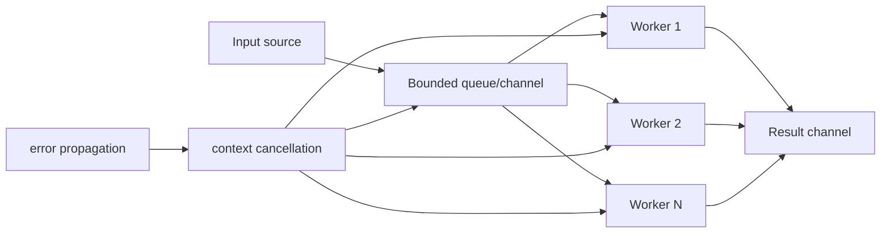
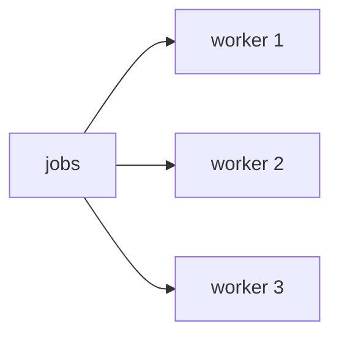
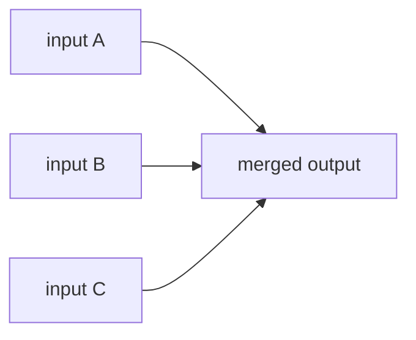
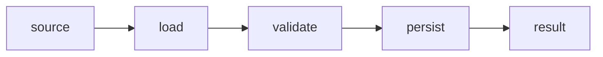
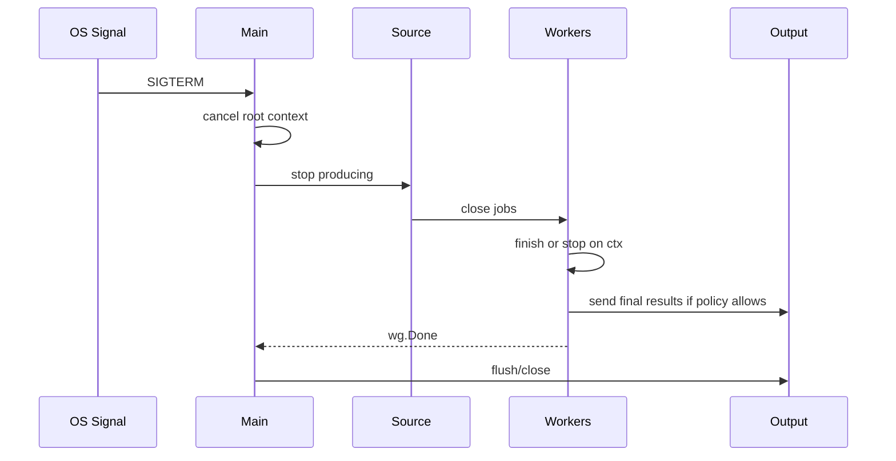
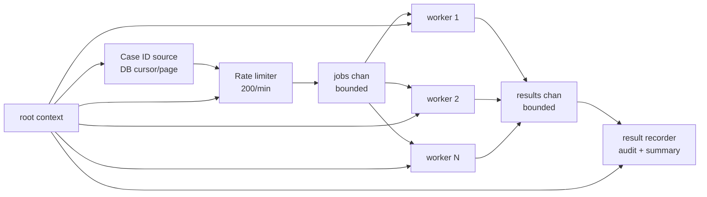

# learn-go-part-017.md

# Go Concurrency Patterns: Worker Pool, Fan-Out/Fan-In, Pipeline, Backpressure, Cancellation, and Bounded Concurrency

> Seri: `learn-go`  
> Part: `017` dari `034`  
> Target pembaca: Java software engineer yang ingin naik ke level production-grade Go engineer  
> Target Go: Go 1.26.x  
> Status seri: belum selesai

---

## 0. Tujuan Part Ini

Part 016 membahas primitive:

```go
go f()
chan T
select
close
context
WaitGroup
```

Part ini membahas bagaimana primitive itu disusun menjadi **pattern production**.

Di Go, masalah concurrency production biasanya bukan karena engineer tidak tahu syntax `go` atau `chan`, tetapi karena gagal mendesain:

```text
bounded concurrency
backpressure
cancellation propagation
error propagation
result ownership
close ownership
shutdown ordering
goroutine lifetime
queue capacity
failure isolation
```

Target part ini adalah membuat kamu mampu membangun pipeline dan worker system yang:

- tidak menciptakan goroutine tak terbatas;
- tidak leak saat caller berhenti;
- tidak deadlock saat downstream lambat;
- tidak kehilangan error;
- tidak membuat channel close panic;
- punya backpressure yang intentional;
- bisa berhenti saat context canceled;
- bisa diuji;
- bisa diobservasi;
- bisa dipakai di service production.

Sebagai Java engineer, kamu mungkin mengenali pattern ini sebagai kombinasi dari:

```text
ExecutorService
BlockingQueue
CompletableFuture
Reactive Streams
Semaphore
CountDownLatch
ThreadPoolExecutor rejection policy
structured concurrency
```

Di Go, kamu menyusun semua itu dengan primitive yang lebih kecil, lebih eksplisit, dan lebih mudah salah jika lifecycle tidak jelas.

---

## 1. Sumber Resmi dan Rujukan Utama

Rujukan utama:

- Go Blog: Pipelines and cancellation — https://go.dev/blog/pipelines
- Go Blog: Share Memory By Communicating — https://go.dev/blog/codelab-share
- Go Wiki: Use a sync.Mutex or a channel? — https://go.dev/wiki/MutexOrChannel
- Go Memory Model — https://go.dev/ref/mem
- Package `context` — https://pkg.go.dev/context
- Package `sync` — https://pkg.go.dev/sync
- Package `runtime/trace` — https://pkg.go.dev/runtime/trace
- Go Diagnostics — https://go.dev/doc/diagnostics
- Go 1.26 Release Notes — https://go.dev/doc/go1.26

Catatan:

- Go Blog tentang pipeline dan cancellation adalah rujukan klasik yang sangat penting. Ia menunjukkan bagaimana pipeline sederhana bisa leak jika downstream berhenti lebih awal.
- Go 1.26 punya experimental goroutine leak profile; tetap treat sebagai diagnostic tool, bukan design substitute.

---

## 2. Mental Model Besar

### 2.1 Concurrency Pattern Adalah Contract

Pattern concurrency bukan hanya struktur kode. Ia adalah contract:

```text
Who produces?
Who consumes?
Who owns each channel?
Who closes?
Who cancels?
Who waits?
Who reports errors?
Where is backpressure applied?
What is bounded?
What happens when one stage fails?
```

Mermaid besar:



### 2.2 Pattern Harus Menjawab Resource Limit

Concurrency tanpa limit adalah resource leak yang belum kelihatan.

Limit yang mungkin dibutuhkan:

```text
max goroutines
max in-flight requests
max queue size
max DB connections
max HTTP connections
max CPU parallelism
max memory buffered
max retry attempts
max processing time
```

### 2.3 Bounded Concurrency Adalah Default Production

Bad default:

```go
for _, job := range jobs {
    go process(job)
}
```

Good default:

```go
workerCount := 16
```

atau semaphore:

```go
sem := make(chan struct{}, 16)
```

Bounded concurrency membuat sistem punya:

- predictable resource usage;
- backpressure;
- easier failure handling;
- easier capacity planning;
- safer shutdown.

---

## 3. Worker Pool

### 3.1 Basic Worker Pool

Pattern:

```text
jobs channel
N workers
results channel
WaitGroup
single closer
context cancellation
```

Implementation:

```go
type Job struct {
    ID string
}

type Result struct {
    JobID string
    Err   error
}

type Processor interface {
    Process(ctx context.Context, job Job) error
}

func RunWorkers(
    ctx context.Context,
    jobs <-chan Job,
    workerCount int,
    p Processor,
) <-chan Result {
    results := make(chan Result)

    var wg sync.WaitGroup
    wg.Add(workerCount)

    for i := 0; i < workerCount; i++ {
        go func() {
            defer wg.Done()

            for {
                select {
                case <-ctx.Done():
                    return

                case job, ok := <-jobs:
                    if !ok {
                        return
                    }

                    err := p.Process(ctx, job)

                    select {
                    case results <- Result{JobID: job.ID, Err: err}:
                    case <-ctx.Done():
                        return
                    }
                }
            }
        }()
    }

    go func() {
        wg.Wait()
        close(results)
    }()

    return results
}
```

### 3.2 Why This Works

| Problem | Solved By |
|---|---|
| unlimited goroutines | fixed worker count |
| blocked result send | select with `ctx.Done()` |
| result channel close race | one closer goroutine |
| worker exit | jobs closed or context canceled |
| caller cancellation | context |
| completion signal | results channel close |

### 3.3 Worker Count Decision

Worker count should come from workload type.

CPU-bound:

```go
workerCount := runtime.GOMAXPROCS(0)
```

or slightly more if I/O mixed.

I/O-bound:

```go
workerCount := 16, 32, 64, ...
```

based on downstream capacity.

Database-bound:

```text
workerCount <= DB pool capacity
```

HTTP downstream-bound:

```text
workerCount <= per-host connection limit and rate limit
```

Regulatory batch job:

```text
workerCount chosen from SLA + DB + external API + memory + retry policy
```

### 3.4 Worker Pool Is Not Always Needed

If you have small fixed number of tasks:

```go
var wg sync.WaitGroup
```

may be enough.

If tasks are naturally tied to incoming HTTP requests, the HTTP server already provides concurrency. You may only need limits around downstream dependency calls.

---

## 4. Fan-Out

Fan-out means distributing work from one source to multiple workers.



In Go, fan-out occurs naturally when multiple goroutines receive from same channel:

```go
for i := 0; i < workerCount; i++ {
    go worker(jobs)
}
```

Each value is received by exactly one worker.

### 4.1 Fan-Out for CPU Work

```go
workers := runtime.GOMAXPROCS(0)
```

Avoid 10,000 CPU workers.

### 4.2 Fan-Out for I/O Work

For external API:

```go
workers := min(config.MaxWorkers, rateLimitCapacity)
```

Need backoff and retry.

### 4.3 Fan-Out and Ordering

Fan-out does not preserve order.

If input order matters, you need sequence numbers.

```go
type Job struct {
    Seq int
    Payload Payload
}

type Result struct {
    Seq int
    Value Value
    Err error
}
```

Then reorder downstream.

---

## 5. Fan-In

Fan-in means merging multiple input channels into one output channel.



Generic implementation:

```go
func Merge[T any](ctx context.Context, inputs ...<-chan T) <-chan T {
    out := make(chan T)

    var wg sync.WaitGroup

    for _, in := range inputs {
        in := in
        wg.Add(1)

        go func() {
            defer wg.Done()

            for {
                select {
                case <-ctx.Done():
                    return

                case v, ok := <-in:
                    if !ok {
                        return
                    }

                    select {
                    case out <- v:
                    case <-ctx.Done():
                        return
                    }
                }
            }
        }()
    }

    go func() {
        wg.Wait()
        close(out)
    }()

    return out
}
```

### 5.1 Fan-In Failure Modes

- one input never closes;
- downstream stops early;
- output send blocks forever;
- multiple closers;
- context not propagated.

The implementation above handles downstream cancellation if caller cancels context.

---

## 6. Pipeline

A pipeline is a sequence of stages connected by channels.



### 6.1 Simple Pipeline

```go
func Generate(ctx context.Context, ids []CaseID) <-chan CaseID {
    out := make(chan CaseID)

    go func() {
        defer close(out)

        for _, id := range ids {
            select {
            case out <- id:
            case <-ctx.Done():
                return
            }
        }
    }()

    return out
}
```

Load stage:

```go
func LoadCases(ctx context.Context, in <-chan CaseID, repo Repository) <-chan CaseResult {
    out := make(chan CaseResult)

    go func() {
        defer close(out)

        for {
            select {
            case <-ctx.Done():
                return

            case id, ok := <-in:
                if !ok {
                    return
                }

                c, err := repo.Load(ctx, id)
                r := CaseResult{CaseID: id, Case: c, Err: err}

                select {
                case out <- r:
                case <-ctx.Done():
                    return
                }
            }
        }
    }()

    return out
}
```

Validate stage:

```go
func ValidateCases(ctx context.Context, in <-chan CaseResult) <-chan CaseResult {
    out := make(chan CaseResult)

    go func() {
        defer close(out)

        for {
            select {
            case <-ctx.Done():
                return

            case r, ok := <-in:
                if !ok {
                    return
                }

                if r.Err == nil {
                    r.Err = Validate(r.Case)
                }

                select {
                case out <- r:
                case <-ctx.Done():
                    return
                }
            }
        }
    }()

    return out
}
```

### 6.2 Pipeline Cancellation Problem

If downstream reads only one result and exits, upstream goroutines can block sending.

Bad consumer:

```go
result := <-out
return result
```

Upstream may leak.

Fix:

```go
ctx, cancel := context.WithCancel(parent)
defer cancel()

result := <-out
return result
```

And every send in upstream must select on `ctx.Done()`.

### 6.3 Pipeline Close Ownership

Each stage closes only its own output channel.

```text
source closes source output
load closes load output
validate closes validate output
sink closes nothing unless it owns output
```

Never close input channel you do not own.

---

## 7. Backpressure

### 7.1 What Is Backpressure?

Backpressure means downstream slowness slows upstream instead of allowing unbounded buffering.

With unbuffered channel:

```go
out <- v
```

producer waits until consumer receives.

With bounded buffered channel:

```go
out := make(chan T, 100)
```

producer can get ahead by 100 items.

With unbounded queue:

```text
producer never waits until memory explodes
```

Go channels are bounded by design. This is good.

### 7.2 Buffer Size Is a Contract

```go
jobs := make(chan Job, 100)
```

This says:

```text
We allow at most 100 queued jobs in memory at this boundary.
```

Buffer size should be justified by:

- memory per item;
- downstream latency;
- burst tolerance;
- throughput target;
- shutdown drain behavior;
- SLA;
- retry policy.

### 7.3 Backpressure vs Dropping

Sometimes you do not want producer to wait. You want drop.

Example metrics/log event best-effort:

```go
select {
case events <- e:
default:
    dropped.Add(1)
}
```

This is explicit lossy behavior.

Never hide dropping.

### 7.4 Backpressure vs Timeout

```go
select {
case jobs <- job:
    return nil
case <-time.After(100 * time.Millisecond):
    return ErrQueueFull
case <-ctx.Done():
    return ctx.Err()
}
```

In production, prefer timer reuse for hot path; simple `time.After` is okay for rare operations.

---

## 8. Bounded Concurrency with Semaphore

Worker pool is not the only pattern. Use semaphore when tasks are discovered inline.

### 8.1 Channel Semaphore

```go
func ProcessAll(ctx context.Context, jobs []Job, limit int) error {
    sem := make(chan struct{}, limit)
    errCh := make(chan error, len(jobs))

    var wg sync.WaitGroup

    for _, job := range jobs {
        job := job

        select {
        case sem <- struct{}{}:
        case <-ctx.Done():
            return ctx.Err()
        }

        wg.Add(1)
        go func() {
            defer wg.Done()
            defer func() { <-sem }()

            if err := process(ctx, job); err != nil {
                errCh <- err
            }
        }()
    }

    wg.Wait()
    close(errCh)

    for err := range errCh {
        if err != nil {
            return err
        }
    }

    return nil
}
```

### 8.2 Problems with This Simple Version

- does not cancel remaining jobs on first error;
- errCh buffer sized by len(jobs), could be huge;
- launches goroutine for every job eventually, but bounded in-flight;
- if job list huge, worker pool may be better.

### 8.3 Better for Huge Streams

Use worker pool when input is stream or huge.

Use semaphore when input is moderate and natural loop is simpler.

---

## 9. Error Propagation

### 9.1 Error as Result

```go
type Result[T any] struct {
    Value T
    Err   error
}
```

Good when you want collect all results.

### 9.2 Stop on First Error

Pattern:

```go
ctx, cancel := context.WithCancel(parent)
defer cancel()

errCh := make(chan error, 1)
```

When worker sees fatal error:

```go
select {
case errCh <- err:
    cancel()
default:
}
```

Use `sync.Once` or buffered channel 1 to store first error.

### 9.3 First Error Helper

```go
type FirstError struct {
    once sync.Once
    err  error
}

func (f *FirstError) Set(err error) {
    if err == nil {
        return
    }
    f.once.Do(func() {
        f.err = err
    })
}

func (f *FirstError) Err() error {
    return f.err
}
```

Need synchronization if accessed concurrently after goroutines; `once` helps write once, but ensure read after `wg.Wait()` or protect with mutex for concurrent read.

### 9.4 Partial Failure

Batch systems often need partial success.

Result model:

```go
type BatchResult struct {
    Successes []CaseID
    Failures  []Failure
}
```

Do not collapse all failures into first error if domain requires auditability.

Regulatory systems usually need:

```text
which case failed
why failed
retryable or not
was side effect committed
correlation id
timestamp
```

---

## 10. Cancellation Propagation

### 10.1 Context Tree

```go
ctx, cancel := context.WithCancel(parent)
defer cancel()
```

Pass `ctx` to:

- repository;
- HTTP client;
- database query;
- channel send/receive select;
- worker process;
- retry loop;
- timers.

### 10.2 Cancellation Is Cooperative

Context cancellation does not kill goroutines automatically.

Goroutine must check:

```go
select {
case <-ctx.Done():
    return
default:
}
```

or pass context to blocking calls.

### 10.3 Cancellation and Results

If context canceled, decide whether to emit partial results.

Options:

1. stop immediately and close output;
2. drain in-flight and emit results;
3. mark in-flight as canceled;
4. return first error;
5. return aggregate.

This is domain policy.

### 10.4 Timeout Per Job vs Whole Batch

Whole batch:

```go
ctx, cancel := context.WithTimeout(parent, 5*time.Minute)
defer cancel()
```

Per job:

```go
jobCtx, cancel := context.WithTimeout(ctx, 10*time.Second)
err := process(jobCtx, job)
cancel()
```

Always call cancel to release timer resources.

---

## 11. Ordering

### 11.1 Worker Pool Loses Order

Input:

```text
A B C D
```

Output from workers may be:

```text
B A D C
```

If order matters, preserve sequence.

```go
type Job struct {
    Seq int
    ID  CaseID
}

type Result struct {
    Seq int
    Value Value
    Err error
}
```

Collect and sort:

```go
slices.SortFunc(results, func(a, b Result) int {
    return cmp.Compare(a.Seq, b.Seq)
})
```

Streaming ordered output is harder. You need buffer by sequence and emit when next expected is available.

### 11.2 Ordered Emitter

```go
func EmitOrdered(ctx context.Context, in <-chan Result, total int, out chan<- Result) error {
    defer close(out)

    next := 0
    pending := make(map[int]Result)

    for next < total {
        select {
        case <-ctx.Done():
            return ctx.Err()

        case r, ok := <-in:
            if !ok {
                return nil
            }

            pending[r.Seq] = r

            for {
                r, ok := pending[next]
                if !ok {
                    break
                }

                delete(pending, next)

                select {
                case out <- r:
                    next++
                case <-ctx.Done():
                    return ctx.Err()
                }
            }
        }
    }

    return nil
}
```

Memory risk:

```text
If early sequence is slow, pending grows.
```

Bound and monitor.

---

## 12. Rate Limiting

### 12.1 Simple Ticker Rate Limit

```go
ticker := time.NewTicker(time.Second / time.Duration(ratePerSecond))
defer ticker.Stop()

for _, job := range jobs {
    select {
    case <-ticker.C:
        process(job)
    case <-ctx.Done():
        return ctx.Err()
    }
}
```

### 12.2 Worker Pool + Rate Limit

For external API:

```go
tokens := time.NewTicker(time.Second / 10)
defer tokens.Stop()

for {
    select {
    case job := <-jobs:
        select {
        case <-tokens.C:
            callExternal(job)
        case <-ctx.Done():
            return
        }
    case <-ctx.Done():
        return
    }
}
```

For production-grade distributed rate limiting, use shared coordinator or external limiter if multiple replicas.

### 12.3 Rate Limit vs Concurrency Limit

They are different:

```text
concurrency limit:
  max in-flight at the same time

rate limit:
  max starts per time unit
```

You may need both.

---

## 13. Retry and Backoff in Concurrent Systems

### 13.1 Retry Can Amplify Load

If 100 workers all retry immediately, outage gets worse.

Use:

- bounded retries;
- exponential backoff;
- jitter;
- respect context;
- retry only retryable errors;
- idempotency.

### 13.2 Retry Loop

```go
func Retry(ctx context.Context, maxAttempts int, base time.Duration, fn func(context.Context) error) error {
    var last error

    for attempt := 1; attempt <= maxAttempts; attempt++ {
        if err := fn(ctx); err != nil {
            last = err
        } else {
            return nil
        }

        if attempt == maxAttempts {
            break
        }

        delay := base * time.Duration(1<<(attempt-1))

        timer := time.NewTimer(delay)
        select {
        case <-timer.C:
        case <-ctx.Done():
            if !timer.Stop() {
                <-timer.C
            }
            return ctx.Err()
        }
    }

    return last
}
```

Note: production backoff should add jitter and classify retryability.

---

## 14. Shutdown

### 14.1 Shutdown Ordering

Typical service shutdown:

```text
1. receive signal
2. stop accepting new work
3. cancel root context
4. close owned input channels if appropriate
5. wait for workers
6. flush outputs
7. close resources
8. exit
```

### 14.2 Worker Shutdown Diagram



### 14.3 Avoid Infinite Drain

If downstream is stuck, shutdown can hang.

Use shutdown timeout:

```go
shutdownCtx, cancel := context.WithTimeout(context.Background(), 30*time.Second)
defer cancel()

if err := srv.Shutdown(shutdownCtx); err != nil {
    return err
}
```

Apply same idea to workers.

---

## 15. Production Example: Regulatory Bulk Case Screening

### 15.1 Problem

A regulatory agency runs nightly screening for submitted cases.

Requirements:

- input: list of case IDs;
- load case from DB;
- call screening engine;
- persist decision;
- publish audit;
- external screening API max 200 requests/min;
- DB pool max 30 connections;
- job should stop on SIGTERM;
- errors must be recorded per case;
- system must not exceed memory;
- ordering not required;
- partial success allowed.

### 15.2 Architecture



### 15.3 Types

```go
type CaseID string

type Job struct {
    CaseID CaseID
}

type Result struct {
    CaseID    CaseID
    Success   bool
    Retryable bool
    Err       error
}

type Repository interface {
    Load(ctx context.Context, id CaseID) (Case, error)
    SaveDecision(ctx context.Context, d Decision) error
    SaveFailure(ctx context.Context, r Result) error
}

type ScreeningEngine interface {
    Screen(ctx context.Context, c Case) (Decision, error)
}

type AuditPublisher interface {
    Publish(ctx context.Context, d Decision) error
}
```

### 15.4 Source Stage

```go
func Source(ctx context.Context, ids []CaseID, out chan<- Job) error {
    defer close(out)

    for _, id := range ids {
        select {
        case out <- Job{CaseID: id}:
        case <-ctx.Done():
            return ctx.Err()
        }
    }

    return nil
}
```

### 15.5 Rate-Limited Worker Pool

```go
func RunScreening(
    ctx context.Context,
    jobs <-chan Job,
    workerCount int,
    rate <-chan time.Time,
    repo Repository,
    engine ScreeningEngine,
    audit AuditPublisher,
) <-chan Result {
    results := make(chan Result)

    var wg sync.WaitGroup
    wg.Add(workerCount)

    for i := 0; i < workerCount; i++ {
        go func() {
            defer wg.Done()

            for {
                select {
                case <-ctx.Done():
                    return

                case job, ok := <-jobs:
                    if !ok {
                        return
                    }

                    select {
                    case <-rate:
                    case <-ctx.Done():
                        return
                    }

                    r := processScreening(ctx, job, repo, engine, audit)

                    select {
                    case results <- r:
                    case <-ctx.Done():
                        return
                    }
                }
            }
        }()
    }

    go func() {
        wg.Wait()
        close(results)
    }()

    return results
}
```

### 15.6 Process Function

```go
func processScreening(
    ctx context.Context,
    job Job,
    repo Repository,
    engine ScreeningEngine,
    audit AuditPublisher,
) Result {
    c, err := repo.Load(ctx, job.CaseID)
    if err != nil {
        return classifyFailure(job.CaseID, err)
    }

    d, err := engine.Screen(ctx, c)
    if err != nil {
        return classifyFailure(job.CaseID, err)
    }

    if err := repo.SaveDecision(ctx, d); err != nil {
        return classifyFailure(job.CaseID, err)
    }

    if err := audit.Publish(ctx, d); err != nil {
        return classifyFailure(job.CaseID, err)
    }

    return Result{CaseID: job.CaseID, Success: true}
}
```

### 15.7 Result Sink

```go
func RecordResults(ctx context.Context, in <-chan Result, repo Repository) error {
    for {
        select {
        case <-ctx.Done():
            return ctx.Err()

        case r, ok := <-in:
            if !ok {
                return nil
            }

            if r.Success {
                continue
            }

            if err := repo.SaveFailure(ctx, r); err != nil {
                return err
            }
        }
    }
}
```

### 15.8 Why This Is Production-Grade

| Requirement | Mechanism |
|---|---|
| bounded memory | bounded channels, paged source |
| bounded concurrency | worker count |
| external API rate | rate channel |
| DB protection | worker count <= DB capacity |
| shutdown | context |
| partial success | per-case result |
| no result leak | cancellation-aware send |
| close safety | each stage closes its own output |
| auditability | result includes case ID and error classification |

---

## 16. Testing Patterns

### 16.1 Deterministic Fake Processor

```go
type FakeProcessor struct {
    Delay time.Duration
    ErrFor map[string]error
}

func (f FakeProcessor) Process(ctx context.Context, job Job) error {
    if f.Delay > 0 {
        timer := time.NewTimer(f.Delay)
        defer timer.Stop()

        select {
        case <-timer.C:
        case <-ctx.Done():
            return ctx.Err()
        }
    }

    return f.ErrFor[job.ID]
}
```

### 16.2 Test All Jobs Processed

```go
func TestWorkerPoolProcessesAllJobs(t *testing.T) {
    ctx := context.Background()
    jobs := make(chan Job)

    go func() {
        defer close(jobs)
        for i := 0; i < 10; i++ {
            jobs <- Job{ID: strconv.Itoa(i)}
        }
    }()

    results := RunWorkers(ctx, jobs, 3, FakeProcessor{})

    count := 0
    for r := range results {
        if r.Err != nil {
            t.Fatalf("unexpected error: %v", r.Err)
        }
        count++
    }

    if count != 10 {
        t.Fatalf("got %d results, want 10", count)
    }
}
```

### 16.3 Test Cancellation

```go
func TestWorkerPoolStopsOnCancel(t *testing.T) {
    ctx, cancel := context.WithCancel(context.Background())
    jobs := make(chan Job)

    results := RunWorkers(ctx, jobs, 3, SlowProcessor{})

    cancel()

    select {
    case _, ok := <-results:
        _ = ok
    case <-time.After(time.Second):
        t.Fatal("workers did not stop")
    }
}
```

### 16.4 Avoid Sleep-Based Assertions

Prefer:

- controlled fake;
- channels for readiness;
- context cancellation;
- deadlines only as test guard;
- WaitGroup/done channel.

---

## 17. Observability

Concurrency patterns need metrics.

Minimum:

```text
worker count
jobs queued
jobs processed/sec
job duration
job error count
in-flight jobs
dropped jobs
retry count
goroutine count
context cancellation count
downstream latency
```

Example conceptual metrics:

```go
type Metrics interface {
    IncProcessed(success bool)
    ObserveDuration(d time.Duration)
    SetQueueDepth(n int)
    IncDropped()
}
```

For channel depth:

```go
len(jobs)
cap(jobs)
```

`len(channel)` is instant snapshot, useful for metrics but not synchronization correctness.

---

## 18. Anti-Patterns

### 18.1 Unbounded Goroutine per Job

```go
for _, job := range jobs {
    go process(job)
}
```

Use worker pool or semaphore.

### 18.2 No Cancellation in Send

```go
results <- r
```

Can leak if receiver stops.

### 18.3 Receiver Closes Shared Channel

```go
close(jobs)
```

from worker when source owns jobs.

### 18.4 Multiple Producers Close Same Output

Use WaitGroup and single closer.

### 18.5 Huge Buffer as “Performance Optimization”

```go
make(chan Job, 1_000_000)
```

This hides overload.

### 18.6 Dropping Without Metrics

```go
select {
case ch <- v:
default:
}
```

If dropping is intentional, count it.

### 18.7 Ignoring Ordering Requirements

Worker pool changes ordering. Preserve sequence if required.

### 18.8 Retry Storm

Retry without backoff/jitter/classification can amplify outages.

### 18.9 Context Cancellation Not Propagated

Using `context.Background()` inside pipeline breaks shutdown.

### 18.10 Test with Arbitrary Sleep

Sleep-based tests are flaky and slow.

---

## 19. Practical Commands

### Race Detector

```bash
go test -race ./...
```

### Benchmark Worker Variants

```bash
go test -bench=. -benchmem ./...
```

### Trace Concurrency

```bash
go test -trace trace.out ./...
go tool trace trace.out
```

### Goroutine Profile

```bash
curl http://localhost:6060/debug/pprof/goroutine?debug=2
```

### Runtime Metrics to Watch

```text
/sched/goroutines:goroutines
```

Plus application metrics:

```text
queue_depth
in_flight
worker_errors
worker_duration
dropped_jobs
retry_count
```

---

## 20. Hands-On Labs

### Lab 1: Worker Pool

Implement worker pool processing 100 jobs with 5 workers.

Verify:

- all jobs processed;
- result channel closes;
- no goroutine leak.

### Lab 2: Fan-In

Merge 3 channels into 1.

Cancel context after receiving 5 values.

Verify upstream goroutines stop.

### Lab 3: Pipeline Leak

Build source → square → sink pipeline.

Make sink read only 1 value and return.

Observe leak if no cancellation.

Fix using context.

### Lab 4: Backpressure

Create producer faster than consumer.

Compare:

- unbuffered channel;
- buffer 10;
- buffer 10,000.

Measure memory and latency.

### Lab 5: Semaphore Limit

Process 100 HTTP-like fake calls with concurrency limit 10.

Verify max in-flight never exceeds 10.

### Lab 6: Ordered Results

Worker pool with random delays.

Preserve input order using sequence numbers.

### Lab 7: Retry Storm

Simulate downstream failure.

Show immediate retry storm.

Fix with exponential backoff and jitter.

### Lab 8: Shutdown

Start worker pool, cancel context, ensure workers exit within timeout.

---

## 21. Review Questions

1. Apa beda primitive concurrency dan concurrency pattern?
2. Kenapa worker pool adalah default production yang sering aman?
3. Apa yang dimaksud fan-out?
4. Apa yang dimaksud fan-in?
5. Kenapa fan-in butuh single closer?
6. Apa masalah utama pipeline jika downstream berhenti lebih awal?
7. Apa itu backpressure?
8. Kenapa channel buffer size adalah contract?
9. Apa beda concurrency limit dan rate limit?
10. Kapan memakai semaphore dibanding worker pool?
11. Bagaimana error dipropagasi dari worker?
12. Bagaimana menghentikan semua worker saat first fatal error?
13. Kenapa worker pool tidak preserve order?
14. Bagaimana preserve ordering?
15. Apa risiko retry dalam sistem concurrent?
16. Apa shutdown order yang sehat?
17. Kenapa `len(ch)` tidak boleh dipakai untuk correctness?
18. Metrics apa yang harus ada untuk worker system?
19. Kenapa sleep-based concurrency test buruk?
20. Bagaimana mendiagnosis goroutine leak di pipeline?

---

## 22. Code Review Checklist

Saat review concurrency pattern:

```text
[ ] Apakah jumlah goroutine bounded?
[ ] Apakah setiap channel punya owner jelas?
[ ] Apakah close dilakukan oleh owner/sender?
[ ] Apakah hanya ada satu closer?
[ ] Apakah setiap send yang bisa block punya cancellation path?
[ ] Apakah setiap receive yang bisa block punya cancellation path?
[ ] Apakah context dipropagasi ke semua stage?
[ ] Apakah worker count sesuai downstream capacity?
[ ] Apakah buffer size punya alasan?
[ ] Apakah backpressure intentional?
[ ] Apakah dropping jika ada dimonitor?
[ ] Apakah error propagation jelas?
[ ] Apakah partial failure policy jelas?
[ ] Apakah ordering requirement ditangani?
[ ] Apakah retry bounded dan memakai backoff/jitter?
[ ] Apakah shutdown order jelas?
[ ] Apakah tests tidak bergantung pada sleep?
[ ] Apakah goroutine count dan queue depth dimonitor?
```

---

## 23. Invariants

Pegang invariant berikut:

```text
Unbounded goroutines are unbounded resource usage.
Worker pool bounds execution concurrency.
Buffered channel bounds queue size.
Backpressure is a feature, not a bug.
Each stage closes only its own output.
Receivers do not close channels they do not own.
Fan-in needs a single closer after all producers finish.
Pipeline stages must respect cancellation on send and receive.
Context cancels; WaitGroup waits.
Concurrency limit and rate limit solve different problems.
Worker pool does not preserve order unless designed.
Retry can amplify failure.
Shutdown must stop input, cancel work, wait, and flush.
Observability is part of concurrency design.
```

---

## 24. Ringkasan

Part ini mengubah primitive concurrency menjadi pattern production.

Kunci utamanya:

```text
goroutine is execution
channel is synchronization and handoff
context is cancellation
WaitGroup is waiting
buffer is bounded queue
worker pool is bounded concurrency
rate limiter is time-based admission
backpressure is overload control
```

Sebagai Java engineer, kamu mungkin terbiasa mengandalkan framework concurrency seperti executor, queue, async future, reactive stream, atau scheduler. Di Go, building block lebih kecil dan explicit. Itu membuat kode bisa sangat jelas, tetapi hanya jika kamu mendesain contract-nya dengan benar.

Concurrency Go yang matang selalu menjawab:

```text
How much can run?
How much can queue?
How does it stop?
How do errors flow?
How is overload handled?
How is shutdown done?
How is it observed?
```

Jika jawaban itu tidak ada, pattern-nya belum production-ready.

---

## 25. Posisi Kita di Seri

Kita sudah menyelesaikan:

```text
000 - Orientation and Mental Model
001 - Toolchain, Workspace, Module, Build
002 - Syntax Core
003 - Functions
004 - Types
005 - Composition
006 - Interfaces
007 - Generics
008 - Error Handling
009 - Package Design
010 - Modules and Dependency Management
011 - Standard Library Mental Model
012 - Slices, Arrays, and Maps
013 - Memory Model for Application Engineers
014 - Runtime Deep Dive
015 - Go Garbage Collector
016 - Concurrency Primitives
017 - Concurrency Patterns
```

Berikutnya:

```text
018 - Shared Memory Concurrency:
      Mutex, RWMutex, Cond, Once, WaitGroup, Pool, Atomic, and Race Detector
```

Status seri: **belum selesai**.


<!-- NAVIGATION_FOOTER -->
<div class="page-nav">
<a href="./learn-go-part-016.md">⬅️ Go Concurrency Primitives: Goroutines, Channels, select, Close Semantics, Ownership, and Lifecycle</a>
<a href="./index.md">📚 Kategori</a>
<a href="../../index.md">🏠 Home</a>
<a href="./learn-go-part-018.md">Go Shared Memory Concurrency: Mutex, RWMutex, Cond, Once, WaitGroup, Pool, Atomic, and Race Detector ➡️</a>
</div>
