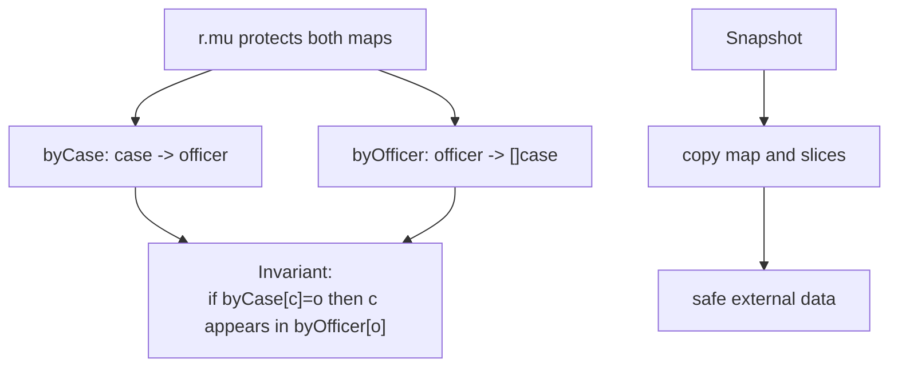

# learn-go-part-018.md

# Go Shared Memory Concurrency: Mutex, RWMutex, Cond, Once, WaitGroup, Pool, Atomic, and Race Detector

> Seri: `learn-go`  
> Part: `018` dari `034`  
> Target pembaca: Java software engineer yang ingin naik ke level production-grade Go engineer  
> Target Go: Go 1.26.x  
> Status seri: belum selesai

---

## 0. Tujuan Part Ini

Part 016 dan 017 membahas goroutine, channel, `select`, worker pool, pipeline, backpressure, dan cancellation. Sekarang kita masuk ke sisi lain concurrency Go: **shared memory concurrency**.

Go sering diasosiasikan dengan motto:

```text
Do not communicate by sharing memory;
share memory by communicating.
```

Tetapi ini bukan berarti:

```text
"Mutex tidak idiomatis."
"Atomic selalu lebih cepat."
"Channel harus dipakai untuk semua concurrency."
```

Itu pemahaman yang keliru.

Go production code yang matang memakai primitive yang paling sesuai:

```text
channel:
  ownership handoff, queue, pipeline, cancellation-aware coordination

mutex:
  protect shared state and invariants

atomic:
  simple lock-free counters/flags/pointers with very narrow contract

sync.Once:
  one-time initialization

WaitGroup:
  wait for goroutine completion

Cond:
  condition-based waiting under lock

Pool:
  temporary object reuse optimization

race detector:
  detect unsafe concurrent access during test/runtime instrumentation
```

Sebagai Java engineer, kamu bisa memetakan ini ke:

```text
synchronized / ReentrantLock / ReadWriteLock
AtomicInteger / AtomicReference
CountDownLatch
ConcurrentHashMap
Object.wait/notify or Condition
ThreadLocal/object pooling ideas
```

Tetapi Go punya idiom, batasan, dan failure mode sendiri.

Target part ini:

1. memahami kapan mutex lebih tepat daripada channel;
2. memahami `sync.Mutex` dan `sync.RWMutex`;
3. memahami starvation/lock scope/critical section;
4. memahami `sync.Cond`;
5. memahami `sync.Once` dan lazy initialization;
6. memahami `sync.WaitGroup`;
7. memahami `sync.Pool`;
8. memahami `sync/atomic`;
9. memahami Go Memory Model terkait synchronization;
10. memahami race detector;
11. membangun checklist code review shared-state concurrency.

---

## 1. Sumber Resmi dan Rujukan Utama

Rujukan utama:

- Go Memory Model — https://go.dev/ref/mem
- Package `sync` — https://pkg.go.dev/sync
- Package `sync/atomic` — https://pkg.go.dev/sync/atomic
- Data Race Detector — https://go.dev/doc/articles/race_detector
- Go Wiki: Mutex or Channel — https://go.dev/wiki/MutexOrChannel
- Go Blog: Share Memory By Communicating — https://go.dev/blog/codelab-share
- Package `runtime/pprof` — https://pkg.go.dev/runtime/pprof
- Go Diagnostics — https://go.dev/doc/diagnostics
- Go 1.26 Release Notes — https://go.dev/doc/go1.26

Catatan penting:

- Go Memory Model menyatakan bahwa program yang memodifikasi data secara concurrent harus melakukan serialisasi akses menggunakan synchronization.
- Race detector adalah alat runtime instrumentation untuk menemukan data race, bukan proof bahwa program bebas dari semua bug concurrency.
- Primitive `sync` tidak boleh dicopy setelah digunakan, kecuali dokumentasi type tertentu menyatakan aman.

---

## 2. Mental Model Besar

### 2.1 Data Race

Data race terjadi ketika:

```text
dua goroutine mengakses memory location yang sama secara concurrent,
setidaknya satu akses adalah write,
dan tidak ada synchronization yang membuat ordering jelas.
```

Contoh:

```go
var count int

go func() {
    count++
}()

go func() {
    count++
}()
```

Ini data race.

Go tidak menjamin hasilnya. Bisa terlihat “benar” saat test kecil, lalu rusak di production.

### 2.2 Synchronization Is About Visibility and Ordering

Mutex bukan hanya mencegah dua goroutine masuk bersamaan. Ia juga membuat visibility/order memory menjadi jelas.

```go
mu.Lock()
count++
mu.Unlock()
```

Goroutine lain:

```go
mu.Lock()
v := count
mu.Unlock()
```

Lock/unlock membangun synchronization.

### 2.3 Shared State Needs Ownership Story

Setiap shared state harus punya jawaban:

```text
Who owns it?
Which lock protects it?
Can it be read without lock?
Can it be mutated after publication?
Can it be accessed after close/shutdown?
Are invariants protected atomically?
```

Jika jawabannya tidak jelas, concurrency design lemah.

---

## 3. Mutex

### 3.1 Basic Mutex

```go
type Counter struct {
    mu sync.Mutex
    n  int64
}

func (c *Counter) Inc() {
    c.mu.Lock()
    defer c.mu.Unlock()

    c.n++
}

func (c *Counter) Value() int64 {
    c.mu.Lock()
    defer c.mu.Unlock()

    return c.n
}
```

### 3.2 What Mutex Protects

A mutex protects an invariant, not just a field.

Example:

```go
type Account struct {
    mu      sync.Mutex
    balance int64
    status  Status
}
```

Invariant:

```text
closed account cannot have negative balance
balance and status must be updated together
```

Correct:

```go
func (a *Account) Close() error {
    a.mu.Lock()
    defer a.mu.Unlock()

    if a.balance < 0 {
        return errors.New("cannot close account with negative balance")
    }

    a.status = StatusClosed
    return nil
}
```

Do not protect `balance` and `status` with separate locks if the invariant spans both.

### 3.3 Lock Scope

Keep critical section small but complete.

Bad:

```go
mu.Lock()
resp, err := http.Get(url)
state[id] = resp.Status
mu.Unlock()
```

This holds lock while doing network I/O.

Better:

```go
resp, err := http.Get(url)

mu.Lock()
state[id] = deriveStatus(resp, err)
mu.Unlock()
```

But do not shrink lock so much that invariant breaks.

### 3.4 Defer Unlock

Common idiom:

```go
mu.Lock()
defer mu.Unlock()
```

Good for correctness.

In extremely hot small functions, manual unlock may avoid defer overhead, but measure before sacrificing clarity.

### 3.5 Do Not Copy Mutex After Use

Wrong:

```go
type Store struct {
    mu sync.Mutex
    m  map[string]string
}

func (s Store) Put(k, v string) {
    s.mu.Lock()
    defer s.mu.Unlock()
    s.m[k] = v
}
```

Value receiver copies mutex. This is a serious bug.

Correct:

```go
func (s *Store) Put(k, v string) {
    s.mu.Lock()
    defer s.mu.Unlock()
    s.m[k] = v
}
```

Run:

```bash
go vet ./...
```

It can catch many copylock patterns.

### 3.6 Zero Value Mutex Is Usable

```go
var mu sync.Mutex
mu.Lock()
mu.Unlock()
```

No constructor needed.

---

## 4. RWMutex

### 4.1 Basic RWMutex

```go
type Registry struct {
    mu sync.RWMutex
    m  map[string]Handler
}

func (r *Registry) Get(name string) (Handler, bool) {
    r.mu.RLock()
    defer r.mu.RUnlock()

    h, ok := r.m[name]
    return h, ok
}

func (r *Registry) Register(name string, h Handler) {
    r.mu.Lock()
    defer r.mu.Unlock()

    r.m[name] = h
}
```

### 4.2 When RWMutex Helps

RWMutex can help when:

```text
many concurrent readers
rare writes
read critical section is not trivial
contention is significant
```

### 4.3 When RWMutex Hurts

RWMutex may hurt when:

```text
critical section is tiny
writes frequent
read/write mix complex
simplicity matters more
```

Do not replace every Mutex with RWMutex by default.

### 4.4 No Upgrade/Downgrade

Go `sync.RWMutex` does not support safe upgrade from read lock to write lock.

Wrong pattern:

```go
r.mu.RLock()
if missing {
    r.mu.Lock() // deadlock risk
}
```

Correct:

```go
r.mu.RLock()
_, ok := r.m[key]
r.mu.RUnlock()

if !ok {
    r.mu.Lock()
    defer r.mu.Unlock()

    // re-check under write lock
    if _, ok := r.m[key]; !ok {
        r.m[key] = value
    }
}
```

### 4.5 Read Lock Still Requires Discipline

Do not mutate under `RLock`.

```go
r.mu.RLock()
r.m[key] = value // wrong
r.mu.RUnlock()
```

---

## 5. sync.Once

### 5.1 One-Time Initialization

```go
type ClientProvider struct {
    once sync.Once
    c    *Client
    err  error
}

func (p *ClientProvider) Client() (*Client, error) {
    p.once.Do(func() {
        p.c, p.err = NewClient()
    })

    return p.c, p.err
}
```

`Once` ensures function runs once.

### 5.2 Panic Behavior

If function passed to `Do` panics, `Once` considers it done. Future calls will not retry.

Design implication:

```text
Do not put retryable initialization inside sync.Once unless that is intended.
```

### 5.3 Once for Lazy Global

```go
var (
    configOnce sync.Once
    configValue Config
    configErr error
)

func ConfigValue() (Config, error) {
    configOnce.Do(func() {
        configValue, configErr = LoadConfig()
    })
    return configValue, configErr
}
```

This is okay for immutable process-wide config.

Avoid hiding dependencies behind global `Once` in testable business logic.

### 5.4 Newer Once Helpers

Modern Go includes helper functions such as `sync.OnceFunc`, `sync.OnceValue`, and `sync.OnceValues`.

Example:

```go
loadConfig := sync.OnceValues(func() (Config, error) {
    return LoadConfig()
})

cfg, err := loadConfig()
```

Use when it improves clarity.

---

## 6. WaitGroup

### 6.1 WaitGroup Waits for Completion

Classic:

```go
var wg sync.WaitGroup

for _, job := range jobs {
    job := job
    wg.Add(1)

    go func() {
        defer wg.Done()
        process(job)
    }()
}

wg.Wait()
```

### 6.2 WaitGroup Does Not Cancel

If one goroutine fails, WaitGroup does not stop others.

You need context cancellation.

### 6.3 WaitGroup Does Not Collect Errors

Use:

- result channel;
- first error with mutex/once;
- errgroup-style helper;
- domain-specific aggregate.

### 6.4 Add Before Go

Correct:

```go
wg.Add(1)
go func() {
    defer wg.Done()
}()
```

Wrong:

```go
go func() {
    wg.Add(1)
    defer wg.Done()
}()
```

Race with `Wait`.

### 6.5 WaitGroup.Go

In Go 1.25+, `WaitGroup.Go` was added. With Go 1.26.x baseline, code can use:

```go
var wg sync.WaitGroup

for _, job := range jobs {
    job := job
    wg.Go(func() {
        process(job)
    })
}

wg.Wait()
```

Still understand classic Add/Done because it is ubiquitous.

### 6.6 Do Not Copy WaitGroup

Same rule: do not copy after use.

Pass pointer if needed.

---

## 7. sync.Cond

### 7.1 What Is Cond?

`sync.Cond` lets goroutines wait until a condition becomes true.

It is built around a Locker, usually `*sync.Mutex`.

Use cases:

- wait for queue not empty;
- wait for state transition;
- wait for capacity;
- broadcast condition change to many waiters.

### 7.2 Basic Pattern

```go
type Queue[T any] struct {
    mu   sync.Mutex
    cond *sync.Cond
    q    []T
    done bool
}

func NewQueue[T any]() *Queue[T] {
    q := &Queue[T]{}
    q.cond = sync.NewCond(&q.mu)
    return q
}
```

Push:

```go
func (q *Queue[T]) Push(v T) {
    q.mu.Lock()
    defer q.mu.Unlock()

    q.q = append(q.q, v)
    q.cond.Signal()
}
```

Pop:

```go
func (q *Queue[T]) Pop() (T, bool) {
    q.mu.Lock()
    defer q.mu.Unlock()

    for len(q.q) == 0 && !q.done {
        q.cond.Wait()
    }

    if len(q.q) == 0 && q.done {
        var zero T
        return zero, false
    }

    v := q.q[0]
    q.q = q.q[1:]
    return v, true
}
```

Close:

```go
func (q *Queue[T]) Close() {
    q.mu.Lock()
    defer q.mu.Unlock()

    q.done = true
    q.cond.Broadcast()
}
```

### 7.3 Always Wait in Loop

```go
for !condition {
    cond.Wait()
}
```

Never:

```go
if !condition {
    cond.Wait()
}
```

Because condition may not hold when goroutine wakes.

### 7.4 Cond vs Channel

Use channel when simple queue/handoff works.

Use Cond when:

- multiple conditions under same lock;
- you need precise condition wait over shared state;
- you need broadcast state change;
- queue semantics need custom behavior.

Many Go programs never need `sync.Cond`. That is okay.

---

## 8. sync.Pool

### 8.1 What Is Pool?

`sync.Pool` is a concurrency-safe pool of temporary objects.

It is mainly for reducing allocation pressure.

Example:

```go
var bufferPool = sync.Pool{
    New: func() any {
        return new(bytes.Buffer)
    },
}

func useBuffer() {
    b := bufferPool.Get().(*bytes.Buffer)
    b.Reset()
    defer func() {
        b.Reset()
        bufferPool.Put(b)
    }()

    // use b
}
```

### 8.2 Pool Is Not Cache

Objects in `sync.Pool` may be removed at any time, especially around GC.

Do not rely on Pool for correctness.

### 8.3 Good Uses

Good for:

- temporary buffers;
- encoding scratch space;
- high-throughput allocation hotspots;
- stateless reusable helpers.

Bad for:

- business objects with identity;
- DB connections;
- network connections;
- lifecycle-managed resources;
- cache entries;
- sensitive data not cleared;
- objects with unclear ownership.

### 8.4 Security

If pooled buffer may contain secrets/PII:

```go
b.Reset()
```

is not enough to zero underlying memory.

You may need to overwrite bytes before pooling or avoid pooling.

### 8.5 Pool Needs Benchmark

Do not add `sync.Pool` preemptively.

Run:

```bash
go test -bench=. -benchmem ./...
```

And profile real workload.

---

## 9. Atomic

### 9.1 Atomic Is for Narrow Cases

Atomic operations are useful for:

- counters;
- flags;
- immutable pointer publication;
- simple state machine;
- fast metrics;
- lock-free read-mostly path.

Atomic is not good for complex invariants.

Bad:

```go
// trying to protect a map with atomic flag
```

Use mutex.

### 9.2 Typed Atomics

Modern Go provides typed atomic types.

```go
type Counter struct {
    n atomic.Int64
}

func (c *Counter) Inc() {
    c.n.Add(1)
}

func (c *Counter) Value() int64 {
    return c.n.Load()
}
```

Boolean flag:

```go
type StopFlag struct {
    stopped atomic.Bool
}

func (s *StopFlag) Stop() {
    s.stopped.Store(true)
}

func (s *StopFlag) Stopped() bool {
    return s.stopped.Load()
}
```

Pointer:

```go
var current atomic.Pointer[Config]

func LoadConfig() *Config {
    return current.Load()
}

func StoreConfig(c *Config) {
    current.Store(c)
}
```

### 9.3 Atomic Publication Requires Immutability

This is safe if Config is immutable after Store:

```go
cfg := &Config{Timeout: time.Second}
current.Store(cfg)
```

If someone mutates `cfg` after Store without synchronization, race.

```go
cfg.Timeout = 2 * time.Second // unsafe if readers access concurrently
```

Use copy-on-write:

```go
old := current.Load()
next := *old
next.Timeout = 2 * time.Second
current.Store(&next)
```

### 9.4 Atomic Does Not Compose Easily

Two atomic fields:

```go
var a atomic.Int64
var b atomic.Int64
```

Reading both does not give atomic snapshot.

If invariant spans both, use mutex.

### 9.5 Atomic and Memory Ordering

Go atomic operations provide synchronization defined by the memory model. In normal application code, use typed atomic methods and do not attempt clever lock-free algorithms unless deeply justified.

---

## 10. Race Detector

### 10.1 Running Race Detector

```bash
go test -race ./...
```

Run program:

```bash
go run -race ./cmd/service
```

Build:

```bash
go build -race ./cmd/service
```

### 10.2 What It Finds

Race detector finds data races that occur during execution.

It does not prove absence of races in unexecuted paths.

### 10.3 Example Race

```go
func TestRace(t *testing.T) {
    var x int

    go func() {
        x = 1
    }()

    _ = x
}
```

Race detector can report concurrent read/write.

### 10.4 Fix with Mutex

```go
var (
    mu sync.Mutex
    x int
)

go func() {
    mu.Lock()
    x = 1
    mu.Unlock()
}()

mu.Lock()
_ = x
mu.Unlock()
```

### 10.5 Race Detector Cost

Race builds are slower and use more memory. Use in CI/test, not normal production, unless investigating.

### 10.6 Race Detector Is Not Deadlock Detector

It does not catch:

- all deadlocks;
- goroutine leaks;
- starvation;
- logical ordering bugs;
- missed cancellation;
- misuse of buffer size;
- lost wakeups if no race manifests.

---

## 11. Lock Contention and Profiling

### 11.1 Mutex Profile

Go can profile mutex contention.

Programmatically:

```go
runtime.SetMutexProfileFraction(1)
```

Then capture pprof mutex profile.

Use carefully; profiling has overhead.

### 11.2 Block Profile

Block profile records goroutine blocking on synchronization primitives.

```go
runtime.SetBlockProfileRate(1)
```

Useful for:

- channel blocking;
- mutex blocking;
- select blocking.

### 11.3 Execution Trace

Trace can show goroutine blocking/unblocking over time.

```bash
go test -trace trace.out ./...
go tool trace trace.out
```

### 11.4 Symptoms of Lock Contention

- high latency under load;
- CPU not fully used but throughput flat;
- many goroutines blocked;
- mutex profile hotspot;
- trace shows long wait to acquire lock.

### 11.5 Fix Options

- reduce critical section;
- shard lock;
- use copy-on-write immutable data;
- use channel ownership/actor;
- reduce shared state;
- batch operations;
- use RWMutex if read-heavy and measured;
- use atomic for simple counters/flags.

---

## 12. Production Example: Case Assignment Registry

### 12.1 Requirements

A regulatory case system maintains in-memory assignment registry:

- lookup officer for case;
- update assignment;
- list assignments;
- concurrent HTTP reads;
- occasional writes from event stream;
- deterministic snapshot for reporting;
- no data race;
- no internal map exposure.

### 12.2 Implementation with RWMutex

```go
package assignment

import (
    "cmp"
    "maps"
    "slices"
    "sync"
)

type CaseID string
type OfficerID string

type Registry struct {
    mu       sync.RWMutex
    byCase   map[CaseID]OfficerID
    byOfficer map[OfficerID][]CaseID
}

func NewRegistry() *Registry {
    return &Registry{
        byCase:    make(map[CaseID]OfficerID),
        byOfficer: make(map[OfficerID][]CaseID),
    }
}
```

### 12.3 Assign

```go
func (r *Registry) Assign(caseID CaseID, officerID OfficerID) {
    r.mu.Lock()
    defer r.mu.Unlock()

    oldOfficer, hadOld := r.byCase[caseID]
    if hadOld && oldOfficer == officerID {
        return
    }

    if hadOld {
        r.byOfficer[oldOfficer] = removeCaseID(r.byOfficer[oldOfficer], caseID)
        if len(r.byOfficer[oldOfficer]) == 0 {
            delete(r.byOfficer, oldOfficer)
        }
    }

    r.byCase[caseID] = officerID
    r.byOfficer[officerID] = append(r.byOfficer[officerID], caseID)
}
```

Helper:

```go
func removeCaseID(xs []CaseID, id CaseID) []CaseID {
    for i, x := range xs {
        if x == id {
            copy(xs[i:], xs[i+1:])
            var zero CaseID
            xs[len(xs)-1] = zero
            return xs[:len(xs)-1]
        }
    }
    return xs
}
```

### 12.4 Lookup

```go
func (r *Registry) OfficerFor(caseID CaseID) (OfficerID, bool) {
    r.mu.RLock()
    defer r.mu.RUnlock()

    officer, ok := r.byCase[caseID]
    return officer, ok
}
```

### 12.5 Snapshot

```go
func (r *Registry) Snapshot() map[OfficerID][]CaseID {
    r.mu.RLock()
    defer r.mu.RUnlock()

    out := make(map[OfficerID][]CaseID, len(r.byOfficer))
    for officer, cases := range r.byOfficer {
        copied := slices.Clone(cases)
        slices.SortFunc(copied, func(a, b CaseID) int {
            return cmp.Compare(string(a), string(b))
        })
        out[officer] = copied
    }

    return out
}
```

### 12.6 Why Snapshot Copies

Returning internal map/slices would let caller mutate internal state without lock.

Wrong:

```go
func (r *Registry) UnsafeSnapshot() map[OfficerID][]CaseID {
    return r.byOfficer
}
```

### 12.7 Invariant Diagram



### 12.8 Why One Lock?

The invariant spans both maps. Separate locks would complicate correctness.

---

## 13. Copy-On-Write with Atomic Pointer

### 13.1 Read-Mostly Config

Requirements:

- many reads;
- rare config reload;
- readers should not lock;
- config immutable after publication.

Use `atomic.Pointer`.

```go
type Config struct {
    Timeout time.Duration
    Limits  map[string]int
}

type ConfigStore struct {
    current atomic.Pointer[Config]
}
```

### 13.2 Store Immutable Snapshot

```go
func (s *ConfigStore) Store(c Config) {
    c.Limits = maps.Clone(c.Limits)
    s.current.Store(&c)
}
```

### 13.3 Load

```go
func (s *ConfigStore) Load() *Config {
    return s.current.Load()
}
```

### 13.4 Danger

If `Limits` map is returned and mutated, race.

Better make deep immutable copy or expose accessors.

```go
func (c *Config) Limit(name string) (int, bool) {
    v, ok := c.Limits[name]
    return v, ok
}
```

But map reads are safe only if no one mutates after publication.

### 13.5 Copy-On-Write Update

```go
func (s *ConfigStore) UpdateLimit(name string, value int) {
    old := s.current.Load()
    next := *old
    next.Limits = maps.Clone(old.Limits)
    next.Limits[name] = value
    s.current.Store(&next)
}
```

This is good for rare writes, many reads.

---

## 14. Channels vs Mutex Revisited

### 14.1 Use Mutex for Shared State

```go
cache.mu.Lock()
cache.m[key] = value
cache.mu.Unlock()
```

Simple and correct.

### 14.2 Use Channel for Ownership Handoff

```go
jobs <- job
```

One goroutine owns job at a time.

### 14.3 Actor Pattern

Sometimes channel-owned state is good:

```go
type request struct {
    op   string
    key  string
    val  Value
    resp chan Value
}
```

A single goroutine owns map and processes requests.

Useful when:

- operations are naturally serialized;
- state machine is complex;
- need event-loop semantics;
- avoid locks across callbacks.

Bad when:

- simple map guard would suffice;
- request/response channels make code unreadable;
- actor becomes bottleneck;
- shutdown is unclear.

---

## 15. Common Anti-Patterns

### 15.1 Copying Lock-Containing Struct

```go
func (s Store) Get(k string) string
```

if `Store` contains mutex.

Use pointer receiver.

### 15.2 Exposing Internal Map/Slice

```go
func (s *Store) Data() map[string]Value {
    return s.m
}
```

Caller can mutate without lock.

Return clone or provide callback.

### 15.3 Atomic for Complex State

```go
atomic balance
atomic status
```

If invariant spans balance/status, use mutex.

### 15.4 Holding Lock During Blocking I/O

Avoid network/database/channel send under lock unless designed.

### 15.5 RWMutex Everywhere

RWMutex is not automatic performance upgrade.

### 15.6 Ignoring Race Detector

Run `go test -race ./...` regularly.

### 15.7 Pooling Everything

`sync.Pool` without benchmark often adds complexity and bugs.

### 15.8 Cond Without Loop

Always wait in loop.

### 15.9 Once for Retryable Initialization

`Once` does not retry after panic and normally caches error if you write it that way.

### 15.10 Reading Shared Map Without Lock

Map concurrent read/write is unsafe.

---

## 16. Testing Shared-State Concurrency

### 16.1 Race Test

```go
func TestCounterConcurrent(t *testing.T) {
    var c Counter
    var wg sync.WaitGroup

    for i := 0; i < 100; i++ {
        wg.Add(1)
        go func() {
            defer wg.Done()
            c.Inc()
        }()
    }

    wg.Wait()

    if got := c.Value(); got != 100 {
        t.Fatalf("got %d, want 100", got)
    }
}
```

Run:

```bash
go test -race ./...
```

### 16.2 Stress Loop

```bash
go test -race -count=100 ./...
```

### 16.3 Avoid Time-Based Assumption

Use synchronization in test, not arbitrary sleep.

### 16.4 Test Copy Exposure

If method returns map/slice, test caller mutation does not affect internal state.

```go
snap := r.Snapshot()
snap[officer] = append(snap[officer], "BAD")

snap2 := r.Snapshot()
// verify BAD not present
```

---

## 17. Observability

For shared-memory concurrency, observe:

```text
mutex contention
block profile
goroutine count
queue depth
operation latency
critical section duration if instrumented
cache size
map size
pool hit/miss if relevant
```

Tools:

```bash
go test -race ./...
go test -trace trace.out ./...
go tool pprof mutex
go tool pprof block
```

In service:

- pprof admin endpoint;
- runtime metrics;
- application metrics;
- structured logs around state transitions only if not too noisy.

---

## 18. Practical Commands

Race detector:

```bash
go test -race ./...
```

Vet copylocks:

```bash
go vet ./...
```

Benchmark:

```bash
go test -bench=. -benchmem ./...
```

Trace:

```bash
go test -trace trace.out ./...
go tool trace trace.out
```

Mutex profile in code:

```go
runtime.SetMutexProfileFraction(10)
```

Block profile:

```go
runtime.SetBlockProfileRate(1)
```

pprof endpoint:

```go
import _ "net/http/pprof"
```

Protect pprof endpoint in production.

---

## 19. Hands-On Labs

### Lab 1: Data Race

Write counter without mutex.

Run:

```bash
go test -race
```

Fix with mutex.

### Lab 2: RWMutex Benchmark

Implement registry with Mutex and RWMutex.

Benchmark read-heavy workload.

Then benchmark write-heavy workload.

Explain results.

### Lab 3: Copylock Bug

Create struct with mutex and value receiver.

Run:

```bash
go vet
```

Fix with pointer receiver.

### Lab 4: Cond Queue

Implement blocking queue with `sync.Cond`.

Test:

- Pop blocks when empty;
- Push wakes one waiter;
- Close wakes all waiters.

### Lab 5: Once Initialization

Implement lazy config loader with `sync.Once`.

Test error behavior.

Then implement retryable loader without Once.

### Lab 6: sync.Pool

Benchmark JSON/buffer generation with and without `sync.Pool`.

Decide whether complexity is justified.

### Lab 7: Atomic Config

Implement atomic pointer config store.

Test copy-on-write update.

Verify old readers still see old config safely.

### Lab 8: Mutex Profile

Create artificial contention.

Enable mutex profile.

Inspect pprof.

---

## 20. Review Questions

1. Apa definisi data race?
2. Kenapa data race bukan sekadar hasil angka salah?
3. Apa yang dilindungi mutex: field atau invariant?
4. Kenapa struct berisi mutex tidak boleh dicopy?
5. Kapan RWMutex lebih baik dari Mutex?
6. Kapan RWMutex bisa lebih buruk?
7. Kenapa RWMutex tidak bisa di-upgrade langsung?
8. Apa kegunaan `sync.Once`?
9. Apa perilaku Once jika fungsi panic?
10. Apa yang dilakukan WaitGroup dan apa yang tidak?
11. Kenapa `Add` harus dilakukan sebelum `go`?
12. Kapan `sync.Cond` layak?
13. Kenapa `Cond.Wait` harus dalam loop?
14. Apa kegunaan `sync.Pool`?
15. Kenapa Pool bukan cache?
16. Kapan atomic tepat?
17. Kenapa atomic tidak cocok untuk invariant kompleks?
18. Apa yang bisa ditemukan race detector?
19. Apa keterbatasan race detector?
20. Kapan channel lebih tepat daripada mutex?

---

## 21. Code Review Checklist

Saat review shared-memory concurrency:

```text
[ ] Apakah shared state punya owner/lock jelas?
[ ] Apakah invariant dilindungi oleh lock yang sama?
[ ] Apakah tidak ada map read/write concurrent tanpa lock?
[ ] Apakah lock tidak dicopy setelah digunakan?
[ ] Apakah receiver method untuk lock-containing type memakai pointer?
[ ] Apakah internal map/slice tidak diekspos langsung?
[ ] Apakah RWMutex dipakai karena evidence, bukan asumsi?
[ ] Apakah tidak ada lock upgrade yang deadlock-prone?
[ ] Apakah blocking I/O tidak dilakukan di bawah lock?
[ ] Apakah Once tidak dipakai untuk retryable init secara salah?
[ ] Apakah WaitGroup Add dilakukan sebelum go?
[ ] Apakah Cond Wait dalam loop?
[ ] Apakah sync.Pool dipakai berdasarkan benchmark?
[ ] Apakah pooled object di-reset/cleared?
[ ] Apakah atomic hanya untuk state sederhana?
[ ] Apakah race detector dijalankan?
[ ] Apakah go vet dijalankan?
[ ] Apakah contention bisa diobservasi via pprof/trace?
```

---

## 22. Invariants

Pegang invariant berikut:

```text
Data race is a correctness bug.
Mutex protects invariants, not just variables.
Do not copy sync primitives after use.
Map concurrent read/write without synchronization is unsafe.
RWMutex is useful for read-heavy measured contention, not as default.
WaitGroup waits; it does not cancel or collect errors.
Cond.Wait must be in a loop checking condition.
Once runs once; design error/panic behavior intentionally.
Pool is temporary object reuse, not cache.
Atomic is for narrow simple state, not complex invariants.
Race detector finds races that execute under instrumentation.
No tool replaces clear ownership and synchronization design.
```

---

## 23. Ringkasan

Part ini menyeimbangkan pemahaman channel-based concurrency dengan shared-memory concurrency.

Go tidak dogmatis:

```text
Use channel when communication/ownership flow is the core.
Use mutex when protecting shared state/invariant is the core.
Use atomic when state is simple and contract is narrow.
Use Cond when condition waiting is truly needed.
Use Pool only for measured allocation reuse.
Use race detector as routine safety net.
```

Sebagai Java engineer, jangan menganggap Go adalah Java tanpa thread pool. Tetapi juga jangan menganggap channel menggantikan semua primitive shared memory.

Production Go concurrency yang matang biasanya sederhana:

```text
small locked state
bounded workers
clear cancellation
explicit ownership
race-tested code
observable contention
```

Jika concurrency code terasa terlalu pintar, kemungkinan besar ia terlalu rapuh.

---

## 24. Posisi Kita di Seri

Kita sudah menyelesaikan:

```text
000 - Orientation and Mental Model
001 - Toolchain, Workspace, Module, Build
002 - Syntax Core
003 - Functions
004 - Types
005 - Composition
006 - Interfaces
007 - Generics
008 - Error Handling
009 - Package Design
010 - Modules and Dependency Management
011 - Standard Library Mental Model
012 - Slices, Arrays, and Maps
013 - Memory Model for Application Engineers
014 - Runtime Deep Dive
015 - Go Garbage Collector
016 - Concurrency Primitives
017 - Concurrency Patterns
018 - Shared Memory Concurrency
```

Berikutnya:

```text
019 - Context Propagation:
      Deadlines, Cancellation Trees, Request Lifecycle, Graceful Shutdown, and Context Misuse
```

Status seri: **belum selesai**.


<!-- NAVIGATION_FOOTER -->
<div class="page-nav">
<a href="./learn-go-part-017.md">⬅️ Go Concurrency Patterns: Worker Pool, Fan-Out/Fan-In, Pipeline, Backpressure, Cancellation, and Bounded Concurrency</a>
<a href="./index.md">📚 Kategori</a>
<a href="../../index.md">🏠 Home</a>
<a href="./learn-go-part-019.md">Go Context Propagation: Deadlines, Cancellation Trees, Request Lifecycle, Graceful Shutdown, and Context Misuse ➡️</a>
</div>
