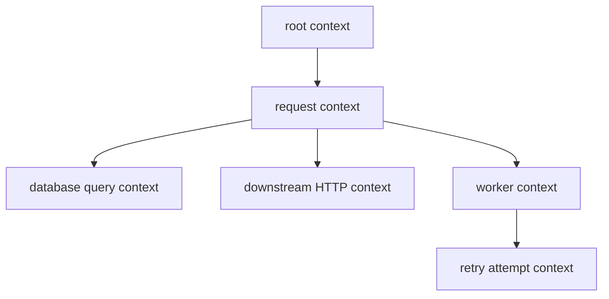
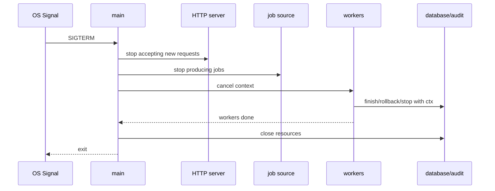
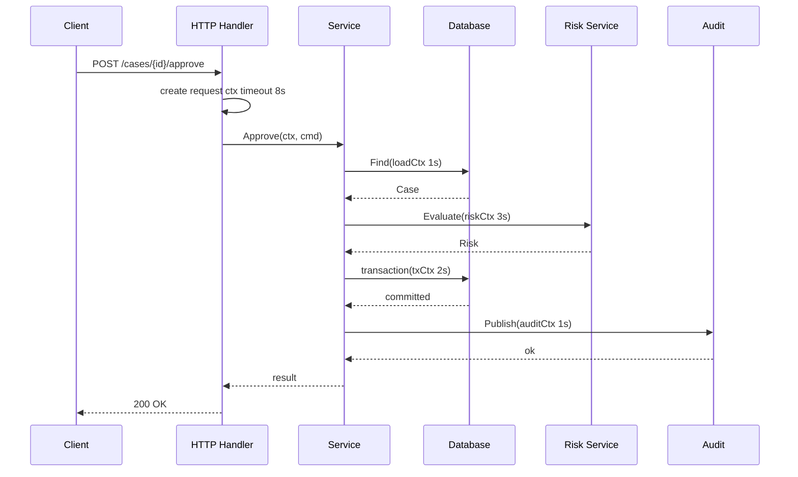

# learn-go-part-019.md

# Go Context Propagation: Deadlines, Cancellation Trees, Request Lifecycle, Graceful Shutdown, and Context Misuse

> Seri: `learn-go`  
> Part: `019` dari `034`  
> Target pembaca: Java software engineer yang ingin naik ke level production-grade Go engineer  
> Target Go: Go 1.26.x  
> Status seri: belum selesai

---

## 0. Tujuan Part Ini

Part 016 sampai 018 membangun fondasi concurrency:

```text
016 - goroutine, channel, select, close semantics
017 - worker pool, pipeline, fan-out/fan-in, backpressure
018 - mutex, RWMutex, Cond, Once, WaitGroup, Pool, atomic, race detector
```

Part ini membahas satu konsep yang mengikat semua itu dalam production service: **`context.Context`**.

Di Go, `context.Context` adalah mekanisme standar untuk:

```text
cancellation propagation
deadline propagation
timeout propagation
request-scoped values
cross-boundary lifecycle control
```

Sebagai Java engineer, kamu bisa membandingkannya dengan gabungan beberapa konsep:

```text
Thread interrupt
CompletableFuture cancellation
request-scoped metadata
deadline budget
MDC/correlation id
reactive context
structured concurrency cancellation token
```

Tetapi `context.Context` punya aturan idiomatik yang sangat spesifik.

Target part ini:

1. memahami apa itu `context.Context`;
2. memahami cancellation tree;
3. memahami deadline vs timeout;
4. memahami `context.Background`, `TODO`, `WithCancel`, `WithTimeout`, `WithDeadline`, `WithValue`;
5. memahami request lifecycle HTTP/gRPC/database;
6. memahami timeout layering yang benar;
7. memahami graceful shutdown;
8. memahami context misuse;
9. memahami desain API yang context-aware;
10. memahami observability dan testing context cancellation.

---

## 1. Sumber Resmi dan Rujukan Utama

Rujukan utama:

- Package `context`: https://pkg.go.dev/context
- Go Blog: Context: https://go.dev/blog/context
- Go Blog: Pipelines and cancellation: https://go.dev/blog/pipelines
- Package `net/http`: https://pkg.go.dev/net/http
- Package `database/sql`: https://pkg.go.dev/database/sql
- Go Memory Model: https://go.dev/ref/mem
- Go Diagnostics: https://go.dev/doc/diagnostics
- Effective Go: https://go.dev/doc/effective_go

Prinsip resmi penting dari package `context`:

- jangan simpan Context di struct;
- pass Context secara eksplisit sebagai parameter pertama, biasanya bernama `ctx`;
- jangan pass nil Context;
- gunakan `context.TODO()` jika belum tahu Context yang tepat;
- values di Context hanya untuk request-scoped data yang melintasi API/process boundary, bukan parameter opsional biasa;
- cancellation harus dipropagasi agar resource cepat dilepas.

---

## 2. Mental Model Besar

### 2.1 Context Adalah Cancellation Tree

Context membentuk tree.



Jika parent canceled, semua child ikut canceled.

```text
cancel parent
  -> child Done closes
  -> grandchild Done closes
  -> blocking operations should stop
```

### 2.2 Context Tidak Membunuh Goroutine Secara Paksa

Context cancellation bersifat cooperative.

```go
ctx, cancel := context.WithCancel(parent)
cancel()
```

Ini tidak membunuh goroutine otomatis.

Goroutine harus:

```go
select {
case <-ctx.Done():
    return ctx.Err()
default:
}
```

atau pass `ctx` ke API yang context-aware:

```go
req = req.WithContext(ctx)
db.QueryContext(ctx, query)
```

### 2.3 Context Adalah Lifecycle Signal

Context menjawab:

```text
Should this operation continue?
When must it stop?
Why did it stop?
What request-scoped metadata follows it?
```

Context bukan:

```text
general dependency container
optional argument bag
global config store
logger storage by default
business data carrier
mutable state
```

---

## 3. The `Context` Interface

Secara konseptual:

```go
type Context interface {
    Deadline() (deadline time.Time, ok bool)
    Done() <-chan struct{}
    Err() error
    Value(key any) any
}
```

### 3.1 `Deadline`

```go
deadline, ok := ctx.Deadline()
```

Menunjukkan waktu kapan context akan otomatis canceled.

### 3.2 `Done`

```go
<-ctx.Done()
```

Channel yang closed ketika context canceled/deadline exceeded.

### 3.3 `Err`

```go
err := ctx.Err()
```

Biasanya:

```go
context.Canceled
context.DeadlineExceeded
```

### 3.4 `Value`

```go
traceID := ctx.Value(traceIDKey{})
```

Untuk request-scoped metadata.

---

## 4. Root Context

### 4.1 `context.Background`

```go
ctx := context.Background()
```

Dipakai sebagai root context di:

- `main`;
- tests;
- initialization;
- top-level operations.

### 4.2 `context.TODO`

```go
ctx := context.TODO()
```

Dipakai ketika kamu belum tahu context yang tepat.

`TODO` lebih baik daripada `nil`, karena menunjukkan technical debt eksplisit.

### 4.3 Jangan Pass Nil Context

Wrong:

```go
service.Process(nil, req)
```

Correct:

```go
service.Process(context.Background(), req)
```

Atau di test:

```go
ctx := context.Background()
```

---

## 5. Creating Derived Contexts

### 5.1 `WithCancel`

```go
ctx, cancel := context.WithCancel(parent)
defer cancel()
```

Use when:

- you need to stop children manually;
- first error cancels remaining work;
- shutdown signal cancels work;
- consumer stops early.

### 5.2 `WithTimeout`

```go
ctx, cancel := context.WithTimeout(parent, 5*time.Second)
defer cancel()
```

Use when operation has max duration relative to now.

Always call cancel to release resources.

### 5.3 `WithDeadline`

```go
ctx, cancel := context.WithDeadline(parent, deadline)
defer cancel()
```

Use when absolute deadline known.

### 5.4 `WithValue`

```go
ctx = context.WithValue(ctx, requestIDKey{}, requestID)
```

Use sparingly.

Good:

- request ID;
- trace ID;
- auth principal identity metadata;
- tenant/agency ID if truly cross-cutting and request-scoped;
- observability baggage.

Bad:

- database handle;
- logger as hidden dependency in most business logic;
- optional method parameter;
- feature flags;
- large payload;
- mutable map;
- business entity.

---

## 6. Cancellation Tree

### 6.1 Parent Cancels Child

```go
parent, cancelParent := context.WithCancel(context.Background())
child, cancelChild := context.WithCancel(parent)

cancelParent()

<-child.Done()
fmt.Println(child.Err()) // context.Canceled

cancelChild() // safe, idempotent
```

### 6.2 Child Cancel Does Not Cancel Parent

```go
parent := context.Background()
child, cancel := context.WithCancel(parent)

cancel()

fmt.Println(parent.Err()) // nil
fmt.Println(child.Err())  // context.Canceled
```

### 6.3 Timeout Child

```go
parent := context.Background()
child, cancel := context.WithTimeout(parent, time.Second)
defer cancel()
```

Child cancels after timeout or parent cancellation.

### 6.4 Budget Propagation

If parent deadline is earlier than child timeout, parent wins.

```go
parent, cancel := context.WithTimeout(context.Background(), 100*time.Millisecond)
defer cancel()

child, cancelChild := context.WithTimeout(parent, 5*time.Second)
defer cancelChild()

deadline, _ := child.Deadline()
_ = deadline // effectively bounded by parent
```

---

## 7. Context in Function Signatures

### 7.1 Context First

Idiomatic:

```go
func (s *Service) Approve(ctx context.Context, cmd ApproveCommand) error
```

Not:

```go
func (s *Service) Approve(cmd ApproveCommand, ctx context.Context) error
```

### 7.2 Do Not Store Context in Struct

Wrong:

```go
type Service struct {
    ctx context.Context
}
```

Correct:

```go
type Service struct {
    repo Repository
}

func (s *Service) Process(ctx context.Context, cmd Command) error {
    return s.repo.Save(ctx, cmd)
}
```

Exception-like cases exist for request-scoped structs, but default rule: pass context explicitly.

### 7.3 Context Is Not Optional

If operation may block, do I/O, wait, acquire remote resource, or spawn work, accept context.

```go
func (r *Repository) Find(ctx context.Context, id CaseID) (Case, error)
func (c *Client) Call(ctx context.Context, req Request) (Response, error)
func (w *Worker) Run(ctx context.Context) error
```

For pure CPU local helper:

```go
func NormalizeName(s string) string
```

No context needed unless long-running and cancellable.

### 7.4 Do Not Add Context Everywhere Blindly

Do not write:

```go
func Add(ctx context.Context, a, b int) int
```

if no cancellation, I/O, blocking, or request-scoped value needed.

---

## 8. Context-Aware Blocking

### 8.1 Channel Send

Bad:

```go
out <- v
```

If receiver may stop.

Better:

```go
select {
case out <- v:
    return nil
case <-ctx.Done():
    return ctx.Err()
}
```

### 8.2 Channel Receive

Bad:

```go
v := <-in
```

If sender may stop.

Better:

```go
select {
case v, ok := <-in:
    if !ok {
        return zero, io.EOF
    }
    return v, nil
case <-ctx.Done():
    return zero, ctx.Err()
}
```

### 8.3 Mutex Lock

`sync.Mutex` lock is not context-aware.

If you need cancellable acquisition, redesign:

- avoid long lock hold;
- use channel/semaphore;
- use try-lock if available and appropriate;
- split state;
- avoid blocking under lock.

Do not expect context to cancel `mu.Lock()`.

### 8.4 CPU Loop

Context does not interrupt CPU loop.

```go
for i, item := range items {
    if i%1024 == 0 {
        select {
        case <-ctx.Done():
            return ctx.Err()
        default:
        }
    }

    process(item)
}
```

### 8.5 Timer

```go
timer := time.NewTimer(delay)
defer timer.Stop()

select {
case <-timer.C:
    return nil
case <-ctx.Done():
    return ctx.Err()
}
```

---

## 9. HTTP Server Request Context

### 9.1 Incoming Request Context

In `net/http`, each request has context:

```go
func (h *Handler) ServeHTTP(w http.ResponseWriter, r *http.Request) {
    ctx := r.Context()
    _ = ctx
}
```

This context is canceled when:

- client connection closes;
- request canceled;
- handler returns;
- server shuts down in relevant paths.

Use it for downstream operations:

```go
caseData, err := h.service.GetCase(r.Context(), id)
```

### 9.2 Do Not Use Background Inside Handler

Wrong:

```go
caseData, err := h.service.GetCase(context.Background(), id)
```

This loses cancellation and request deadline.

Correct:

```go
caseData, err := h.service.GetCase(r.Context(), id)
```

### 9.3 Outbound HTTP Request

```go
req, err := http.NewRequestWithContext(ctx, http.MethodGet, url, nil)
if err != nil {
    return nil, err
}

resp, err := h.client.Do(req)
```

Also configure `http.Client` and `Transport` timeouts appropriately. Context is not the only timeout layer.

### 9.4 Handler Timeout

Server-level timeouts:

```go
srv := &http.Server{
    ReadHeaderTimeout: 5 * time.Second,
    ReadTimeout:       30 * time.Second,
    WriteTimeout:      30 * time.Second,
    IdleTimeout:       120 * time.Second,
}
```

Application operation timeout:

```go
ctx, cancel := context.WithTimeout(r.Context(), 10*time.Second)
defer cancel()

err := h.service.Process(ctx, cmd)
```

---

## 10. Database Context

`database/sql` supports context-aware methods:

```go
db.QueryContext(ctx, query, args...)
db.ExecContext(ctx, query, args...)
db.BeginTx(ctx, opts)
```

Use request context:

```go
func (r *Repository) Find(ctx context.Context, id CaseID) (Case, error) {
    row := r.db.QueryRowContext(ctx, query, id)
    // scan...
}
```

### 10.1 DB Timeout

Use context deadline:

```go
ctx, cancel := context.WithTimeout(parent, 2*time.Second)
defer cancel()

rows, err := db.QueryContext(ctx, query)
```

### 10.2 Always Close Rows

Context cancellation does not replace resource cleanup.

```go
rows, err := db.QueryContext(ctx, query)
if err != nil {
    return err
}
defer rows.Close()
```

### 10.3 Transaction Context

```go
tx, err := db.BeginTx(ctx, nil)
if err != nil {
    return err
}
defer tx.Rollback()

// operations with ctx

if err := tx.Commit(); err != nil {
    return err
}
```

If context canceled before commit, transaction may be rolled back depending driver/DB behavior. Handle errors carefully.

---

## 11. Timeout Layering

### 11.1 Timeout Budget

A request may have total budget:

```text
user request budget: 10s
  auth: 500ms
  DB read: 2s
  external API: 3s
  DB write: 2s
  audit publish: 1s
  buffer: 1.5s
```

Do not independently set every layer to 10s.

### 11.2 Bad Timeout Layering

```go
func Handler(r *http.Request) {
    ctx := r.Context()

    callA(context.WithTimeout(ctx, 10*time.Second))
    callB(context.WithTimeout(ctx, 10*time.Second))
    callC(context.WithTimeout(ctx, 10*time.Second))
}
```

This can exceed user expectation if sequential.

### 11.3 Budget-Aware Timeout

```go
ctx, cancel := context.WithTimeout(r.Context(), 10*time.Second)
defer cancel()

if err := stepA(ctx); err != nil { return err }
if err := stepB(ctx); err != nil { return err }
if err := stepC(ctx); err != nil { return err }
```

Sub-step with tighter cap:

```go
dbCtx, cancel := context.WithTimeout(ctx, 2*time.Second)
err := repo.Find(dbCtx, id)
cancel()
```

### 11.4 Timeout Error Classification

Distinguish:

```go
errors.Is(err, context.Canceled)
errors.Is(err, context.DeadlineExceeded)
```

HTTP mapping example:

| Error | Possible HTTP |
|---|---|
| client canceled | often log as canceled/no response |
| deadline exceeded | 504 gateway timeout or 503 depending boundary |
| downstream timeout | 504 |
| internal operation timeout | 503/500 depending policy |

Do not treat all context errors as internal server errors.

---

## 12. Graceful Shutdown

### 12.1 Root Context from Signal

```go
ctx, stop := signal.NotifyContext(context.Background(), os.Interrupt, syscall.SIGTERM)
defer stop()
```

Use this as application root.

### 12.2 HTTP Server Shutdown

```go
srv := &http.Server{
    Addr:    ":8080",
    Handler: handler,
}

errCh := make(chan error, 1)

go func() {
    errCh <- srv.ListenAndServe()
}()

select {
case <-ctx.Done():
    shutdownCtx, cancel := context.WithTimeout(context.Background(), 30*time.Second)
    defer cancel()

    return srv.Shutdown(shutdownCtx)

case err := <-errCh:
    if err == http.ErrServerClosed {
        return nil
    }
    return err
}
```

### 12.3 Worker Shutdown

```go
root, stop := signal.NotifyContext(context.Background(), os.Interrupt, syscall.SIGTERM)
defer stop()

workersCtx, cancelWorkers := context.WithCancel(root)
defer cancelWorkers()

results := RunWorkers(workersCtx, jobs, 16, processor)

go func() {
    <-root.Done()
    cancelWorkers()
}()

for r := range results {
    record(r)
}
```

### 12.4 Shutdown Ordering



### 12.5 Shutdown Deadline

Do not wait forever.

```go
shutdownCtx, cancel := context.WithTimeout(context.Background(), 30*time.Second)
defer cancel()
```

At deadline, stop waiting and exit according to policy.

---

## 13. Context Values

### 13.1 Key Type

Do not use plain string keys.

Wrong:

```go
ctx = context.WithValue(ctx, "request_id", id)
```

Correct:

```go
type requestIDKey struct{}

func WithRequestID(ctx context.Context, id string) context.Context {
    return context.WithValue(ctx, requestIDKey{}, id)
}

func RequestID(ctx context.Context) (string, bool) {
    v, ok := ctx.Value(requestIDKey{}).(string)
    return v, ok
}
```

This avoids key collision.

### 13.2 What Belongs in Context Value

Good candidates:

```text
request id
trace id
correlation id
auth principal metadata
tenant/agency id when truly cross-cutting
locale if request-scoped and cross-boundary
```

Bad candidates:

```text
database connection
repository
service
logger as required dependency
large request body
case object
optional parameter
feature flag config
mutable map
```

### 13.3 Context Value and Logging

It is acceptable to extract request ID/trace ID from context at logging boundary.

Do not hide all business dependencies in context.

Good:

```go
logger.Info("case approved", "request_id", RequestID(ctx), "case_id", id)
```

Better with helper that handles absence.

### 13.4 Security

Context values can propagate widely.

Do not store:

- secrets;
- tokens unless absolutely necessary and carefully bounded;
- PII-heavy payloads;
- raw auth assertions;
- large documents.

---

## 14. Common Misuses

### 14.1 Storing Context in Struct

Wrong:

```go
type Repository struct {
    ctx context.Context
}
```

Correct:

```go
func (r *Repository) Find(ctx context.Context, id CaseID) (Case, error)
```

### 14.2 Using Context as Optional Parameter Bag

Wrong:

```go
ctx = context.WithValue(ctx, "sort", "created_at")
ctx = context.WithValue(ctx, "limit", 100)
service.List(ctx)
```

Correct:

```go
service.List(ctx, ListOptions{
    Sort: "created_at",
    Limit: 100,
})
```

### 14.3 Forgetting Cancel

Wrong:

```go
ctx, _ := context.WithTimeout(parent, time.Second)
```

Correct:

```go
ctx, cancel := context.WithTimeout(parent, time.Second)
defer cancel()
```

In loops, call cancel per iteration:

```go
for _, job := range jobs {
    jobCtx, cancel := context.WithTimeout(ctx, time.Second)
    err := process(jobCtx, job)
    cancel()
    if err != nil {
        return err
    }
}
```

Do not `defer cancel()` inside long loop unless loop count is tiny, because defers run only at function return.

### 14.4 Swallowing Context Error

Wrong:

```go
if err != nil {
    return errors.New("operation failed")
}
```

Correct:

```go
if err != nil {
    return fmt.Errorf("operation failed: %w", err)
}
```

So caller can:

```go
errors.Is(err, context.Canceled)
errors.Is(err, context.DeadlineExceeded)
```

### 14.5 Creating Background Context in Deep Layer

Wrong:

```go
func (r *Repo) Save(id CaseID) error {
    _, err := r.db.ExecContext(context.Background(), query, id)
    return err
}
```

Correct:

```go
func (r *Repo) Save(ctx context.Context, id CaseID) error {
    _, err := r.db.ExecContext(ctx, query, id)
    return err
}
```

### 14.6 Ignoring Context in Retry

Wrong:

```go
for {
    err := call()
    if err == nil {
        return nil
    }
    time.Sleep(time.Second)
}
```

Correct:

```go
for attempt := 0; attempt < max; attempt++ {
    err := call(ctx)
    if err == nil {
        return nil
    }

    timer := time.NewTimer(backoff(attempt))
    select {
    case <-timer.C:
    case <-ctx.Done():
        timer.Stop()
        return ctx.Err()
    }
}
```

### 14.7 Using Context for Lifecycle of Long-Lived Object Incorrectly

A service should not have one request context stored for its lifetime.

Use root application context for long-running `Run(ctx)` methods.

```go
func (w *Worker) Run(ctx context.Context) error
```

---

## 15. Production Example: Case Approval Request Lifecycle

### 15.1 Scenario

HTTP endpoint approves regulatory case.

Flow:

1. parse request;
2. authenticate principal from middleware;
3. load case from DB;
4. validate transition;
5. call downstream risk service;
6. update DB transaction;
7. publish audit event;
8. return response.

### 15.2 Timeout Budget

Total request budget: 8 seconds.

```text
DB load: 1s
risk service: 3s
DB transaction: 2s
audit publish: 1s
buffer: 1s
```

### 15.3 Handler

```go
func (h *Handler) ApproveCase(w http.ResponseWriter, r *http.Request) {
    ctx, cancel := context.WithTimeout(r.Context(), 8*time.Second)
    defer cancel()

    requestID := requestIDFromHeader(r)
    ctx = WithRequestID(ctx, requestID)

    cmd, err := parseApproveCommand(r)
    if err != nil {
        writeError(w, http.StatusBadRequest, err)
        return
    }

    result, err := h.service.Approve(ctx, cmd)
    if err != nil {
        writeDomainError(w, err)
        return
    }

    writeJSON(w, http.StatusOK, result)
}
```

### 15.4 Service

```go
func (s *Service) Approve(ctx context.Context, cmd ApproveCommand) (ApproveResult, error) {
    loadCtx, cancel := context.WithTimeout(ctx, time.Second)
    c, err := s.repo.Find(loadCtx, cmd.CaseID)
    cancel()
    if err != nil {
        return ApproveResult{}, fmt.Errorf("load case: %w", err)
    }

    if err := c.CanApprove(cmd.Actor); err != nil {
        return ApproveResult{}, err
    }

    riskCtx, cancel := context.WithTimeout(ctx, 3*time.Second)
    risk, err := s.risk.Evaluate(riskCtx, c)
    cancel()
    if err != nil {
        return ApproveResult{}, fmt.Errorf("evaluate risk: %w", err)
    }

    txCtx, cancel := context.WithTimeout(ctx, 2*time.Second)
    err = s.repo.InTransaction(txCtx, func(ctx context.Context, tx Tx) error {
        if err := tx.ApproveCase(ctx, c.ID, risk); err != nil {
            return err
        }
        return tx.InsertAudit(ctx, AuditRecord{
            CaseID: c.ID,
            Action: "APPROVE",
        })
    })
    cancel()
    if err != nil {
        return ApproveResult{}, fmt.Errorf("approve transaction: %w", err)
    }

    auditCtx, cancel := context.WithTimeout(ctx, time.Second)
    err = s.audit.Publish(auditCtx, AuditEvent{CaseID: c.ID})
    cancel()
    if err != nil {
        return ApproveResult{}, fmt.Errorf("publish audit: %w", err)
    }

    return ApproveResult{CaseID: c.ID, Status: "APPROVED"}, nil
}
```

### 15.5 Lifecycle Diagram



### 15.6 What Happens if Client Disconnects?

`r.Context()` is canceled.

The derived 8s context is canceled.

All child operations should stop:

- DB query;
- risk HTTP request;
- transaction if active;
- audit publish if not yet done.

This saves resources.

### 15.7 What Happens if Risk Service Times Out?

`riskCtx` returns `context.DeadlineExceeded`.

Service wraps error:

```text
evaluate risk: context deadline exceeded
```

Error mapper can classify as downstream timeout.

---

## 16. Context in Worker Systems

### 16.1 Worker Run Signature

```go
func (w *Worker) Run(ctx context.Context) error
```

### 16.2 Job Processing

```go
func (w *Worker) processJob(ctx context.Context, job Job) error {
    jobCtx, cancel := context.WithTimeout(ctx, w.jobTimeout)
    defer cancel()

    return w.processor.Process(jobCtx, job)
}
```

### 16.3 Queue Receive

```go
select {
case job := <-jobs:
    return w.processJob(ctx, job)
case <-ctx.Done():
    return ctx.Err()
}
```

### 16.4 Shutdown

Root context canceled by signal.

Workers finish current job or stop according to policy.

If current job should be interrupted, pass `ctx`.

If current job should finish despite shutdown, derive a separate context carefully and document policy.

---

## 17. Context and Observability

### 17.1 Correlation ID

```go
type correlationIDKey struct{}

func WithCorrelationID(ctx context.Context, id string) context.Context {
    return context.WithValue(ctx, correlationIDKey{}, id)
}

func CorrelationID(ctx context.Context) string {
    v, _ := ctx.Value(correlationIDKey{}).(string)
    return v
}
```

### 17.2 Logging

```go
logger.Info("case approved",
    "correlation_id", CorrelationID(ctx),
    "case_id", caseID,
)
```

### 17.3 Metrics

Classify context errors:

```go
switch {
case errors.Is(err, context.Canceled):
    metrics.IncCanceled()
case errors.Is(err, context.DeadlineExceeded):
    metrics.IncTimeout()
case err != nil:
    metrics.IncError()
}
```

### 17.4 Tracing

Tracing libraries propagate span context using `context.Context`. This is a legitimate use because trace metadata is request-scoped and cross-boundary.

---

## 18. Testing Context Behavior

### 18.1 Test Cancellation

```go
func TestServiceStopsOnCancel(t *testing.T) {
    ctx, cancel := context.WithCancel(context.Background())
    cancel()

    err := service.Process(ctx, cmd)

    if !errors.Is(err, context.Canceled) {
        t.Fatalf("got %v, want context.Canceled", err)
    }
}
```

### 18.2 Test Timeout

```go
ctx, cancel := context.WithTimeout(context.Background(), 10*time.Millisecond)
defer cancel()

err := slowOperation(ctx)

if !errors.Is(err, context.DeadlineExceeded) {
    t.Fatalf("got %v, want deadline exceeded", err)
}
```

### 18.3 Avoid Slow Tests

Use fake blocking dependency:

```go
type BlockingRepo struct {
    started chan struct{}
}

func (r BlockingRepo) Find(ctx context.Context, id CaseID) (Case, error) {
    close(r.started)

    select {
    case <-ctx.Done():
        return Case{}, ctx.Err()
    }
}
```

Test:

```go
ctx, cancel := context.WithCancel(context.Background())
repo := BlockingRepo{started: make(chan struct{})}

errCh := make(chan error, 1)
go func() {
    _, err := service.Find(ctx, id)
    errCh <- err
}()

<-repo.started
cancel()

err := <-errCh
if !errors.Is(err, context.Canceled) {
    t.Fatal(err)
}
```

---

## 19. Error Handling with Context

### 19.1 Preserve Context Errors

Wrong:

```go
return errors.New("query failed")
```

Correct:

```go
return fmt.Errorf("query failed: %w", err)
```

### 19.2 Classify at Boundary

```go
func writeDomainError(w http.ResponseWriter, err error) {
    switch {
    case errors.Is(err, context.Canceled):
        // client likely canceled; often no useful response
        return

    case errors.Is(err, context.DeadlineExceeded):
        http.Error(w, "request timed out", http.StatusGatewayTimeout)

    default:
        http.Error(w, "internal error", http.StatusInternalServerError)
    }
}
```

### 19.3 Avoid Wrapping `ctx.Err()` Without Need Inside Loop

If operation ended because ctx canceled:

```go
return ctx.Err()
```

At higher boundary, wrap with operation context.

---

## 20. Advanced: Detaching Work

Sometimes request triggers background work that must continue after request ends.

Do not blindly use `r.Context()` because it cancels when handler returns.

Options:

1. enqueue durable job;
2. use application root context;
3. create bounded background worker;
4. copy only needed metadata;
5. explicitly document lifecycle.

Bad:

```go
go sendEmail(r.Context(), email)
```

May cancel immediately after response.

Better:

```go
job := EmailJob{
    RequestID: RequestID(r.Context()),
    Email: email,
}

if err := h.queue.Enqueue(r.Context(), job); err != nil {
    // handle enqueue failure
}
```

Then worker:

```go
func (w *EmailWorker) Run(ctx context.Context) error {
    // app lifecycle context
}
```

If truly fire-and-forget in memory, use app context and bounded queue, but know it can be lost on crash.

---

## 21. Practical Commands and Diagnostics

### Race Detector

```bash
go test -race ./...
```

### Trace Cancellation/Blocking

```bash
go test -trace trace.out ./...
go tool trace trace.out
```

### Goroutine Profile

```bash
curl http://localhost:6060/debug/pprof/goroutine?debug=2
```

Look for goroutines blocked on:

```text
select
chan send
chan receive
database driver
net/http
time.Sleep
```

### Runtime Metrics

Monitor:

```text
/sched/goroutines:goroutines
```

Application metrics:

```text
request_timeout_total
request_canceled_total
downstream_timeout_total
job_canceled_total
shutdown_duration_seconds
```

---

## 22. Hands-On Labs

### Lab 1: Parent/Child Cancellation

Create parent and child contexts.

Cancel parent.

Verify child Done closes.

Cancel child only.

Verify parent not canceled.

### Lab 2: Forgetting Cancel

Create many `context.WithTimeout` in loop without cancel.

Observe resource behavior.

Fix by calling cancel each iteration.

### Lab 3: Context-Aware Channel Send

Build producer/consumer where consumer exits early.

Show producer leak without context-aware send.

Fix with select on `ctx.Done()`.

### Lab 4: HTTP Request Context

Build HTTP handler that calls slow downstream with `r.Context()`.

Cancel client request.

Verify downstream stops.

### Lab 5: Timeout Budget

Implement handler with total timeout 2s and sub-step timeout 500ms.

Classify errors.

### Lab 6: Graceful Shutdown

Build server with `signal.NotifyContext`.

On SIGTERM:

- stop HTTP server;
- cancel workers;
- wait with timeout.

### Lab 7: Context Value Key Collision

Use string key in two packages.

Show collision.

Fix with unexported typed key.

### Lab 8: Background Work

Start goroutine with request context after handler returns.

Observe cancellation.

Redesign with durable queue or app context.

---

## 23. Review Questions

1. Apa fungsi utama `context.Context`?
2. Kenapa context cancellation cooperative?
3. Apa beda `Background` dan `TODO`?
4. Kenapa tidak boleh pass nil context?
5. Kenapa context harus parameter pertama?
6. Kenapa context tidak disimpan di struct?
7. Apa beda timeout dan deadline?
8. Kenapa cancel function harus dipanggil?
9. Apa yang terjadi jika parent context canceled?
10. Apakah cancel child membatalkan parent?
11. Apa yang boleh disimpan di context value?
12. Apa yang tidak boleh disimpan di context value?
13. Bagaimana context dipakai di HTTP server?
14. Bagaimana context dipakai di HTTP client?
15. Bagaimana context dipakai di database/sql?
16. Apa itu timeout budget?
17. Kenapa `context.Background()` di deep layer buruk?
18. Bagaimana graceful shutdown memakai context?
19. Bagaimana menguji cancellation tanpa sleep?
20. Bagaimana membedakan `context.Canceled` dan `context.DeadlineExceeded`?

---

## 24. Code Review Checklist

Saat review context-related code:

```text
[ ] Apakah function blocking/I/O menerima ctx?
[ ] Apakah ctx parameter pertama?
[ ] Apakah tidak ada nil context?
[ ] Apakah tidak ada context disimpan di struct?
[ ] Apakah deep layer tidak membuat context.Background() sendiri?
[ ] Apakah WithTimeout/WithCancel cancel dipanggil?
[ ] Apakah cancel dalam loop tidak didefer sampai function return?
[ ] Apakah channel send/receive yang bisa block observe ctx.Done?
[ ] Apakah retry/backoff observe ctx.Done?
[ ] Apakah DB/HTTP downstream memakai ctx?
[ ] Apakah timeout budget masuk akal?
[ ] Apakah context errors dibungkus dengan %w?
[ ] Apakah context.Canceled/DeadlineExceeded diklasifikasi benar?
[ ] Apakah context values memakai typed key?
[ ] Apakah context values tidak berisi dependency/large payload/secret?
[ ] Apakah background work tidak memakai request ctx secara salah?
[ ] Apakah graceful shutdown punya root ctx dan deadline?
```

---

## 25. Invariants

Pegang invariant berikut:

```text
Context propagates cancellation, deadlines, and request-scoped values.
Context cancellation is cooperative.
Parent cancellation cancels children.
Child cancellation does not cancel parent.
Always call cancel for derived context when done.
Context is passed explicitly as first parameter.
Do not store Context in struct.
Do not pass nil Context.
Use Background for root, TODO for unknown.
Do not use Context as optional parameter bag.
Context values are for request-scoped cross-boundary metadata.
Blocking channel operations should select on ctx.Done when cancellation matters.
Context does not cancel mutex Lock.
Context does not kill CPU loops unless checked.
HTTP request context should propagate downstream.
Timeout budget should be designed, not randomly stacked.
Preserve context errors with wrapping.
```

---

## 26. Ringkasan

`context.Context` adalah salah satu API paling penting di Go production.

Ia bukan sekadar parameter tambahan. Ia adalah cara Go mengekspresikan:

```text
this operation belongs to this lifecycle
this work should stop when parent stops
this deadline must be respected
this metadata follows the request
```

Sebagai Java engineer, jangan memandang context hanya sebagai `ThreadLocal` atau cancellation token. Ia punya dua sisi:

```text
control plane:
  cancel, timeout, deadline

metadata plane:
  request-scoped values
```

Yang paling sering rusak di production:

- lupa pass `r.Context()`;
- membuat `context.Background()` di deep layer;
- lupa call cancel;
- send/receive channel tanpa cancellation;
- retry loop tidak observe ctx;
- menyimpan business data/dependency di context value;
- memakai request context untuk background work;
- tidak membedakan canceled vs deadline exceeded.

Go service yang matang punya context propagation yang rapi dari edge ke dependency:

```text
HTTP/gRPC request
  -> service
  -> repository
  -> database
  -> downstream HTTP
  -> worker/pipeline
  -> audit/log/trace
```

Jika context chain putus, cancellation, timeout, dan observability ikut putus.

---

## 27. Posisi Kita di Seri

Kita sudah menyelesaikan:

```text
000 - Orientation and Mental Model
001 - Toolchain, Workspace, Module, Build
002 - Syntax Core
003 - Functions
004 - Types
005 - Composition
006 - Interfaces
007 - Generics
008 - Error Handling
009 - Package Design
010 - Modules and Dependency Management
011 - Standard Library Mental Model
012 - Slices, Arrays, and Maps
013 - Memory Model for Application Engineers
014 - Runtime Deep Dive
015 - Go Garbage Collector
016 - Concurrency Primitives
017 - Concurrency Patterns
018 - Shared Memory Concurrency
019 - Context Propagation
```

Berikutnya:

```text
020 - File, Stream, and Filesystem I/O:
      os, io.Reader, io.Writer, fs.FS, embed, and Streaming Design
```

Status seri: **belum selesai**.


<!-- NAVIGATION_FOOTER -->
<div class="page-nav">
<a href="./learn-go-part-018.md">⬅️ Go Shared Memory Concurrency: Mutex, RWMutex, Cond, Once, WaitGroup, Pool, Atomic, and Race Detector</a>
<a href="./index.md">📚 Kategori</a>
<a href="../../index.md">🏠 Home</a>
<a href="./learn-go-part-020.md">Go File, Stream, and Filesystem I/O: os, io.Reader, io.Writer, fs.FS, embed, and Streaming Design ➡️</a>
</div>
