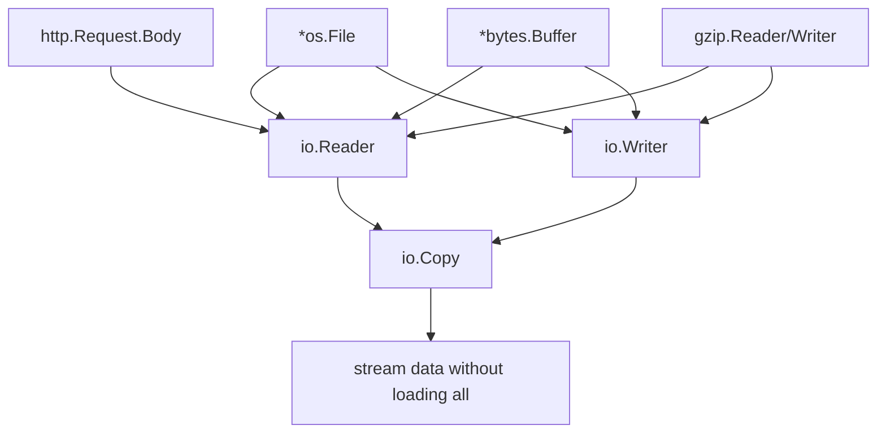
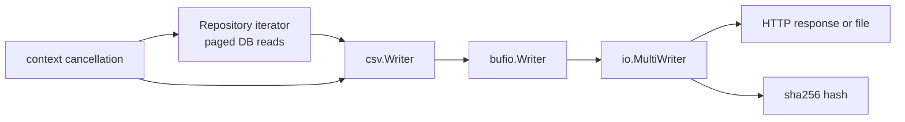

# learn-go-part-020.md

# Go File, Stream, and Filesystem I/O: os, io.Reader, io.Writer, fs.FS, embed, and Streaming Design

> Seri: `learn-go`  
> Part: `020` dari `034`  
> Target pembaca: Java software engineer yang ingin naik ke level production-grade Go engineer  
> Target Go: Go 1.26.x  
> Status seri: belum selesai

---

## 0. Tujuan Part Ini

Part sebelumnya membangun fondasi concurrency dan context. Sekarang kita masuk ke I/O: file, stream, filesystem, embedded files, dan desain streaming.

Di Go, I/O bukan sekadar “membaca file”. I/O adalah contract desain yang sangat penting karena hampir semua service production melakukan:

```text
read HTTP request body
write HTTP response
read config file
write audit file
stream export report
read uploaded document
copy object storage payload
compress/decompress stream
parse CSV/JSON/XML
serve static asset
walk filesystem
embed migration/template/config
```

Jika kamu membawa mental model Java seperti:

```java
InputStream
OutputStream
Reader
Writer
Files
Path
BufferedInputStream
try-with-resources
```

Go memiliki analog yang lebih kecil dan composable:

```go
io.Reader
io.Writer
io.Closer
io.ReaderAt
io.WriterAt
io.Seeker
io/fs.FS
os.File
bufio.Reader
bufio.Writer
embed.FS
```

Target part ini:

1. memahami `io.Reader`/`io.Writer` sebagai contract paling penting di Go I/O;
2. memahami stream vs buffer-all;
3. memahami lifecycle `Close`;
4. memahami file API `os`;
5. memahami `io/fs` dan `fs.FS`;
6. memahami `embed`;
7. memahami buffering;
8. memahami atomic-ish file write pattern;
9. memahami path safety dan traversal;
10. memahami large file handling;
11. memahami error handling I/O;
12. membangun mental model production untuk export/import/upload.

---

## 1. Sumber Resmi dan Rujukan Utama

Rujukan utama:

- Package `io`: https://pkg.go.dev/io
- Package `os`: https://pkg.go.dev/os
- Package `io/fs`: https://pkg.go.dev/io/fs
- Package `embed`: https://pkg.go.dev/embed
- Package `bufio`: https://pkg.go.dev/bufio
- Package `bytes`: https://pkg.go.dev/bytes
- Package `strings`: https://pkg.go.dev/strings
- Package `path/filepath`: https://pkg.go.dev/path/filepath
- Package `path`: https://pkg.go.dev/path
- Package `archive/zip`: https://pkg.go.dev/archive/zip
- Package `compress/gzip`: https://pkg.go.dev/compress/gzip
- Go Blog: File system interfaces for Go — https://go.dev/blog/io/fs
- Effective Go — https://go.dev/doc/effective_go

Catatan:

- `io.Reader` dan `io.Writer` adalah salah satu interface paling fundamental di Go.
- `io/fs.FS` memperkenalkan abstraction filesystem yang membuat kode bisa bekerja dengan OS directory, embedded files, zip-like FS, atau test FS.
- `embed` memungkinkan file dimasukkan ke binary saat compile time.
- Banyak API standard library menerima/return interface kecil daripada concrete file object. Ini adalah pola desain Go yang sangat penting.

---

## 2. Mental Model Besar

### 2.1 I/O di Go Berbasis Interface Kecil

Core:

```go
type Reader interface {
    Read(p []byte) (n int, err error)
}

type Writer interface {
    Write(p []byte) (n int, err error)
}

type Closer interface {
    Close() error
}
```

Composition:

```go
type ReadCloser interface {
    Reader
    Closer
}

type WriteCloser interface {
    Writer
    Closer
}

type ReadWriter interface {
    Reader
    Writer
}
```

Visual:



### 2.2 Reader/Writer Membuat Pipeline

```go
_, err := io.Copy(dst, src)
```

Ini bisa bekerja untuk:

```text
file -> file
HTTP body -> file
file -> HTTP response
gzip reader -> file
bytes buffer -> network
object storage stream -> hash writer
```

Karena semua diikat oleh interface kecil.

### 2.3 Streaming Is Default Production Bias

Untuk data besar, bias production harus:

```text
stream, don't buffer everything
```

Bad:

```go
data, err := os.ReadFile(path)
```

untuk file sangat besar.

Good:

```go
f, err := os.Open(path)
defer f.Close()

_, err = io.Copy(dst, f)
```

`os.ReadFile` benar untuk config kecil, template kecil, test fixture, bukan export 5GB.

---

## 3. `io.Reader`

### 3.1 Contract `Read`

```go
n, err := r.Read(buf)
```

Important rules:

```text
Read reads up to len(buf) bytes.
n may be > 0 even when err != nil.
EOF is reported by err == io.EOF.
Caller should process n bytes before handling err.
Read may return fewer bytes than buffer size.
```

Correct loop:

```go
buf := make([]byte, 32*1024)

for {
    n, err := r.Read(buf)
    if n > 0 {
        process(buf[:n])
    }

    if err != nil {
        if errors.Is(err, io.EOF) {
            break
        }
        return err
    }
}
```

### 3.2 Common Beginner Bug

Wrong:

```go
n, err := r.Read(buf)
if err != nil {
    return err
}
process(buf[:n])
```

If `n > 0` and `err == io.EOF`, data is lost.

### 3.3 `io.ReadAll`

```go
data, err := io.ReadAll(r)
```

Use when:

- data bounded and small;
- config/test fixture;
- protocol message size already limited;
- caller has enforced limit.

Do not use blindly on HTTP request body or large files.

### 3.4 Limit Reader

```go
limited := io.LimitReader(r, maxBytes)
data, err := io.ReadAll(limited)
```

For HTTP server, prefer `http.MaxBytesReader` at handler boundary.

### 3.5 `io.Reader` Implementations

Examples:

```go
strings.NewReader("hello")
bytes.NewReader(data)
bytes.NewBuffer(data)
os.Open(path)
http.Response.Body
gzip.NewReader(r)
bufio.NewReader(r)
```

### 3.6 Reader as Dependency Injection

Instead of:

```go
func ParseFile(path string) error
```

Prefer core parser:

```go
func Parse(r io.Reader) error
```

Then adapter:

```go
func ParseFile(path string) error {
    f, err := os.Open(path)
    if err != nil {
        return err
    }
    defer f.Close()

    return Parse(f)
}
```

Benefits:

- test with `strings.Reader`;
- parse from HTTP body;
- parse from embedded file;
- parse from gzip stream;
- parse from object storage stream.

---

## 4. `io.Writer`

### 4.1 Contract `Write`

```go
n, err := w.Write(p)
```

Writer should return `n < len(p)` with non-nil error.

Callers usually use helpers.

### 4.2 `io.WriteString`

```go
_, err := io.WriteString(w, "hello")
```

Useful for writing strings without manual `[]byte` conversion in some cases.

### 4.3 `fmt.Fprintf`

```go
_, err := fmt.Fprintf(w, "%s,%s\n", id, status)
```

Convenient, but can allocate and format slowly in hot path. For production export hot path, manual writes or `csv.Writer` may be better.

### 4.4 Writer as Output Abstraction

Instead of:

```go
func Export(path string, rows []Row) error
```

Prefer:

```go
func Export(w io.Writer, rows []Row) error
```

Then caller decides destination:

- file;
- HTTP response;
- bytes.Buffer;
- gzip writer;
- object storage writer;
- test buffer.

---

## 5. `io.Copy` and Friends

### 5.1 `io.Copy`

```go
n, err := io.Copy(dst, src)
```

Copies from Reader to Writer until EOF or error.

This is the canonical streaming primitive.

### 5.2 `io.CopyBuffer`

```go
buf := make([]byte, 64*1024)
n, err := io.CopyBuffer(dst, src, buf)
```

Use when:

- you want control over buffer size;
- you reuse buffer;
- hot path profiling says useful.

### 5.3 `io.TeeReader`

```go
r := io.TeeReader(src, hash)
_, err := io.Copy(dst, r)
```

Reads from `src`, writes same bytes to `hash`, and returns bytes to destination.

Use cases:

- compute checksum while streaming;
- audit payload hash;
- logging limited preview with careful cap.

### 5.4 `io.MultiWriter`

```go
w := io.MultiWriter(file, hash)
_, err := io.Copy(w, src)
```

Writes to multiple writers.

If one writer errors, operation fails.

### 5.5 `io.Pipe`

`io.Pipe` connects writer to reader in memory with synchronization.

Useful when API expects Reader but you produce data incrementally.

Example gzip stream:

```go
pr, pw := io.Pipe()

go func() {
    defer pw.Close()

    gz := gzip.NewWriter(pw)
    defer gz.Close()

    err := WriteReport(gz)
    if err != nil {
        pw.CloseWithError(err)
        return
    }
}()

_, err := io.Copy(dst, pr)
```

Be careful: pipe requires both sides to be consumed; otherwise goroutines can block.

---

## 6. `io.Closer` and Resource Lifecycle

### 6.1 Always Close Files

```go
f, err := os.Open(path)
if err != nil {
    return err
}
defer f.Close()
```

But if writing, close error matters.

### 6.2 Close Error on Write

For writers like files, gzip writers, buffered writers, close/flush can fail.

Wrong:

```go
f, err := os.Create(path)
if err != nil {
    return err
}
defer f.Close()

_, err = f.Write(data)
return err
```

If `Close` fails, you miss error.

Better:

```go
func WriteFileStrict(path string, data []byte) (err error) {
    f, err := os.Create(path)
    if err != nil {
        return err
    }

    defer func() {
        closeErr := f.Close()
        if err == nil {
            err = closeErr
        }
    }()

    _, err = f.Write(data)
    return err
}
```

### 6.3 Gzip Close Is Required

```go
gz := gzip.NewWriter(w)
_, err := gz.Write(data)
if err != nil {
    gz.Close()
    return err
}
if err := gz.Close(); err != nil {
    return err
}
```

`Close` writes footer. Forgetting it corrupts gzip output.

### 6.4 Buffered Writer Flush

```go
bw := bufio.NewWriter(w)

if _, err := bw.WriteString("hello"); err != nil {
    return err
}

if err := bw.Flush(); err != nil {
    return err
}
```

`Flush` error matters.

---

## 7. `os` File APIs

### 7.1 Open File for Reading

```go
f, err := os.Open(path)
if err != nil {
    return err
}
defer f.Close()
```

### 7.2 Create/Truncate File

```go
f, err := os.Create(path)
```

Equivalent to open for write, create if needed, truncate if exists.

Be careful: truncation is destructive.

### 7.3 Open with Flags

```go
f, err := os.OpenFile(path, os.O_WRONLY|os.O_CREATE|os.O_EXCL, 0o600)
```

Common flags:

| Flag | Meaning |
|---|---|
| `os.O_RDONLY` | read only |
| `os.O_WRONLY` | write only |
| `os.O_RDWR` | read/write |
| `os.O_CREATE` | create if not exists |
| `os.O_TRUNC` | truncate existing file |
| `os.O_APPEND` | append writes |
| `os.O_EXCL` | with create, fail if exists |

### 7.4 Permissions

```go
0o600 // owner read/write
0o644 // owner write, all read
0o755 // executable directory/binary
```

Remember umask may affect final permissions.

For secrets, prefer restrictive permissions.

### 7.5 Stat

```go
info, err := os.Stat(path)
```

Check not exists:

```go
if errors.Is(err, os.ErrNotExist) {
    // not found
}
```

### 7.6 Remove

```go
err := os.Remove(path)
err := os.RemoveAll(dir)
```

`RemoveAll` is dangerous if path construction is wrong.

### 7.7 Rename

```go
err := os.Rename(tmp, final)
```

Often used for atomic-ish replace on same filesystem.

Caveats:

- behavior varies across OS;
- must be same filesystem for atomic rename;
- Windows semantics differ for replacing existing files;
- fsync may be needed for durability-sensitive writes.

---

## 8. Atomic-ish File Write Pattern

### 8.1 Problem

Writing directly to final file can leave partial/corrupt file if process crashes.

Bad:

```go
os.WriteFile("config.json", data, 0o600)
```

For non-critical small files it may be okay, but not for durable state.

### 8.2 Safer Pattern

```text
write temp file in same directory
flush file
close file
rename temp to final
optionally fsync directory
```

Implementation sketch:

```go
func WriteFileAtomic(path string, data []byte, perm fs.FileMode) (err error) {
    dir := filepath.Dir(path)
    base := filepath.Base(path)

    tmp, err := os.CreateTemp(dir, "."+base+".tmp-*")
    if err != nil {
        return err
    }

    tmpName := tmp.Name()
    defer func() {
        if err != nil {
            _ = os.Remove(tmpName)
        }
    }()

    if _, err = tmp.Write(data); err != nil {
        _ = tmp.Close()
        return err
    }

    if err = tmp.Chmod(perm); err != nil {
        _ = tmp.Close()
        return err
    }

    if err = tmp.Sync(); err != nil {
        _ = tmp.Close()
        return err
    }

    if err = tmp.Close(); err != nil {
        return err
    }

    if err = os.Rename(tmpName, path); err != nil {
        return err
    }

    return nil
}
```

### 8.3 Durability Caveat

For strongest durability, fsync parent directory after rename on Unix-like systems. Cross-platform behavior is nuanced.

For many application config/report writes, temp + rename is already a big improvement.

For financial/regulatory durable logs, use database/object storage/durable queue designed for this.

---

## 9. `bufio`

### 9.1 Buffered Reader

```go
br := bufio.NewReader(r)
line, err := br.ReadString('\n')
```

### 9.2 Scanner

```go
scanner := bufio.NewScanner(r)
for scanner.Scan() {
    line := scanner.Text()
    process(line)
}
if err := scanner.Err(); err != nil {
    return err
}
```

Scanner default token size is limited. For large lines, configure buffer:

```go
scanner.Buffer(make([]byte, 64*1024), 10*1024*1024)
```

If input can have very long records, consider `bufio.Reader` instead.

### 9.3 Buffered Writer

```go
bw := bufio.NewWriter(w)
defer bw.Flush()
```

But if error matters, handle flush explicitly:

```go
if err := bw.Flush(); err != nil {
    return err
}
```

### 9.4 When Buffering Helps

Buffering helps when:

- many small reads/writes;
- syscall overhead matters;
- downstream writer benefits from batching.

Buffering may not help if underlying layer already buffers or operations are large.

---

## 10. `io/fs` and `fs.FS`

### 10.1 What Is `fs.FS`?

```go
type FS interface {
    Open(name string) (File, error)
}
```

It abstracts filesystem-like read access.

Implementations:

- `os.DirFS`;
- `embed.FS`;
- `fstest.MapFS`;
- zip-like or custom FS;
- sub filesystem via `fs.Sub`.

### 10.2 Read File from FS

```go
func LoadTemplate(fsys fs.FS, name string) ([]byte, error) {
    return fs.ReadFile(fsys, name)
}
```

Now caller can pass:

```go
os.DirFS("templates")
embeddedTemplates
fstest.MapFS{...}
```

### 10.3 Walk FS

```go
err := fs.WalkDir(fsys, ".", func(path string, d fs.DirEntry, err error) error {
    if err != nil {
        return err
    }
    if d.IsDir() {
        return nil
    }
    process(path)
    return nil
})
```

### 10.4 Test with `fstest.MapFS`

```go
fsys := fstest.MapFS{
    "config/app.json": {
        Data: []byte(`{"name":"test"}`),
    },
}

data, err := fs.ReadFile(fsys, "config/app.json")
```

This makes filesystem code testable without temp directories.

### 10.5 `os.DirFS` Caveat

```go
fsys := os.DirFS(root)
```

`os.DirFS` does not automatically prevent escape if caller uses path with `..` in certain usage patterns. Validate paths when accepting user input.

---

## 11. `embed`

### 11.1 Basic Embed

```go
import "embed"

//go:embed templates/*
var templates embed.FS
```

Use:

```go
data, err := templates.ReadFile("templates/email.html")
```

### 11.2 Embed Single File

```go
//go:embed schema.sql
var schema string
```

or:

```go
//go:embed default-config.json
var defaultConfig []byte
```

### 11.3 Use Cases

Good for:

- templates;
- static assets;
- migrations;
- default config;
- test fixtures;
- schema files;
- small lookup data.

Bad for:

- large frequently changing data;
- secrets;
- environment-specific config;
- user-uploaded files.

### 11.4 Embedded Files Are Build-Time Snapshot

Changing embedded file on disk does not affect binary until rebuild.

This is desirable for reproducibility, but can surprise during development.

### 11.5 Embed and `fs.FS`

Because `embed.FS` implements `fs.FS`, you can design code around `fs.FS` and use embed in production/tests.

---

## 12. Path Handling and Safety

### 12.1 `path` vs `path/filepath`

Use `path` for slash-separated paths, URLs, and `fs.FS` paths.

Use `path/filepath` for OS filesystem paths.

```go
path.Join("templates", "a.html")       // slash paths
filepath.Join("data", "file.txt")      // OS path
```

### 12.2 Clean

```go
clean := filepath.Clean(userPath)
```

But clean alone is not enough to prevent traversal.

### 12.3 Prevent Path Traversal

If user provides filename for file under root:

```go
func SafeJoin(root, name string) (string, error) {
    if filepath.IsAbs(name) {
        return "", errors.New("absolute path not allowed")
    }

    clean := filepath.Clean(name)
    if clean == "." || strings.HasPrefix(clean, ".."+string(filepath.Separator)) || clean == ".." {
        return "", errors.New("path traversal not allowed")
    }

    full := filepath.Join(root, clean)

    rootAbs, err := filepath.Abs(root)
    if err != nil {
        return "", err
    }

    fullAbs, err := filepath.Abs(full)
    if err != nil {
        return "", err
    }

    rel, err := filepath.Rel(rootAbs, fullAbs)
    if err != nil {
        return "", err
    }

    if rel == ".." || strings.HasPrefix(rel, ".."+string(filepath.Separator)) {
        return "", errors.New("path escapes root")
    }

    return fullAbs, nil
}
```

Symlinks add complexity. If attackers control filesystem entries, use stricter controls and OS-specific safe open patterns.

### 12.4 Do Not Trust Archive Paths

Zip/tar entries can contain:

```text
../evil
/absolute/path
C:\windows\...
symlink tricks
```

Validate before extraction.

---

## 13. Large File Design

### 13.1 Avoid Full Memory Load

Bad:

```go
data, err := os.ReadFile(path)
```

for large files.

Better:

```go
f, err := os.Open(path)
if err != nil {
    return err
}
defer f.Close()

_, err = io.Copy(dst, f)
```

### 13.2 Chunk Processing

```go
buf := make([]byte, 1024*1024)

for {
    n, err := f.Read(buf)
    if n > 0 {
        if err := process(buf[:n]); err != nil {
            return err
        }
    }
    if err != nil {
        if errors.Is(err, io.EOF) {
            break
        }
        return err
    }
}
```

### 13.3 CSV Streaming

Use `encoding/csv`.

```go
cw := csv.NewWriter(w)

for _, row := range rows {
    if err := cw.Write([]string{row.ID, row.Status}); err != nil {
        return err
    }
}

cw.Flush()
if err := cw.Error(); err != nil {
    return err
}
```

### 13.4 JSON Streaming

Encoder:

```go
enc := json.NewEncoder(w)

for _, item := range items {
    if err := enc.Encode(item); err != nil {
        return err
    }
}
```

For JSON array streaming:

```go
if _, err := io.WriteString(w, "["); err != nil {
    return err
}

for i, item := range items {
    if i > 0 {
        if _, err := io.WriteString(w, ","); err != nil {
            return err
        }
    }
    if err := enc.Encode(item); err != nil {
        return err
    }
}

_, err := io.WriteString(w, "]")
```

Need careful formatting because `Encode` writes newline. For production, define exact output expectations.

### 13.5 Hash While Streaming

```go
h := sha256.New()
mw := io.MultiWriter(dst, h)

if _, err := io.Copy(mw, src); err != nil {
    return err
}

sum := h.Sum(nil)
```

---

## 14. Error Handling in I/O

### 14.1 Wrap Errors with Operation and Path

Bad:

```go
return err
```

Better:

```go
return fmt.Errorf("open config %q: %w", path, err)
```

### 14.2 Check with `errors.Is`

```go
if errors.Is(err, os.ErrNotExist) {
    // handle missing
}
```

### 14.3 Permission Error

```go
if errors.Is(err, os.ErrPermission) {
    // permission denied
}
```

### 14.4 Partial Write/Read

High-level helpers handle most partial writes. If implementing Writer, respect contract.

### 14.5 Close/Flush Error

Do not ignore when writing durable output.

---

## 15. Production Example: Regulatory Case Export

### 15.1 Requirements

Export case records to CSV:

- support HTTP response;
- support file output;
- do not load all rows into memory;
- include SHA-256 hash for audit;
- cancellation-aware;
- deterministic order from repository;
- flush errors handled;
- path safe if writing file;
- large export safe.

### 15.2 Core Export Function

```go
type CaseRecord struct {
    ID      string
    Status  string
    Officer string
}

type CaseIterator interface {
    Next(ctx context.Context) (CaseRecord, bool, error)
}

func ExportCSV(ctx context.Context, w io.Writer, it CaseIterator) ([]byte, error) {
    h := sha256.New()
    mw := io.MultiWriter(w, h)

    bw := bufio.NewWriter(mw)
    cw := csv.NewWriter(bw)

    if err := cw.Write([]string{"id", "status", "officer"}); err != nil {
        return nil, err
    }

    for {
        select {
        case <-ctx.Done():
            return nil, ctx.Err()
        default:
        }

        rec, ok, err := it.Next(ctx)
        if err != nil {
            return nil, fmt.Errorf("next case record: %w", err)
        }
        if !ok {
            break
        }

        if err := cw.Write([]string{rec.ID, rec.Status, rec.Officer}); err != nil {
            return nil, fmt.Errorf("write csv record %q: %w", rec.ID, err)
        }
    }

    cw.Flush()
    if err := cw.Error(); err != nil {
        return nil, fmt.Errorf("flush csv: %w", err)
    }

    if err := bw.Flush(); err != nil {
        return nil, fmt.Errorf("flush buffer: %w", err)
    }

    return h.Sum(nil), nil
}
```

### 15.3 File Adapter

```go
func ExportCSVFile(ctx context.Context, path string, it CaseIterator) ([]byte, error) {
    f, err := os.Create(path)
    if err != nil {
        return nil, fmt.Errorf("create export file %q: %w", path, err)
    }

    var closeErr error
    defer func() {
        closeErr = f.Close()
    }()

    sum, err := ExportCSV(ctx, f, it)
    if err != nil {
        return nil, err
    }

    if closeErr != nil {
        return nil, fmt.Errorf("close export file %q: %w", path, closeErr)
    }

    return sum, nil
}
```

Note: This defer pattern as written cannot affect returned error because return already evaluated. In production, prefer named return or explicit close before return:

```go
func ExportCSVFileStrict(ctx context.Context, path string, it CaseIterator) ([]byte, error) {
    f, err := os.Create(path)
    if err != nil {
        return nil, fmt.Errorf("create export file %q: %w", path, err)
    }

    sum, exportErr := ExportCSV(ctx, f, it)
    closeErr := f.Close()

    if exportErr != nil {
        return nil, exportErr
    }
    if closeErr != nil {
        return nil, fmt.Errorf("close export file %q: %w", path, closeErr)
    }

    return sum, nil
}
```

### 15.4 HTTP Adapter

```go
func (h *Handler) DownloadCases(w http.ResponseWriter, r *http.Request) {
    ctx := r.Context()

    it, err := h.repo.IterCases(ctx)
    if err != nil {
        http.Error(w, "failed to start export", http.StatusInternalServerError)
        return
    }
    defer it.Close()

    w.Header().Set("Content-Type", "text/csv")
    w.Header().Set("Content-Disposition", `attachment; filename="cases.csv"`)

    sum, err := ExportCSV(ctx, w, it)
    if err != nil {
        // If response already started, cannot reliably change status.
        h.logger.Error("export failed", "err", err)
        return
    }

    h.logger.Info("export completed", "sha256", hex.EncodeToString(sum))
}
```

Important HTTP caveat:

```text
Once bytes are written, HTTP status/header may already be committed.
If generation can fail before first byte, validate early.
For high-integrity exports, consider staging file/object first, then serving completed artifact.
```

### 15.5 Diagram



---

## 16. Production Example: Safe Upload Save

### 16.1 Requirements

Save uploaded document:

- max size 25 MB;
- reject path traversal;
- stream to disk;
- compute hash;
- do not trust filename;
- close file and handle errors;
- write temp then rename;
- context-aware as much as possible.

### 16.2 Handler Sketch

```go
func (h *Handler) Upload(w http.ResponseWriter, r *http.Request) {
    ctx := r.Context()

    r.Body = http.MaxBytesReader(w, r.Body, 25<<20)
    defer r.Body.Close()

    file, header, err := r.FormFile("document")
    if err != nil {
        http.Error(w, "invalid upload", http.StatusBadRequest)
        return
    }
    defer file.Close()

    safeName := sanitizeFilename(header.Filename)

    sum, err := h.store.Save(ctx, safeName, file)
    if err != nil {
        writeUploadError(w, err)
        return
    }

    writeJSON(w, http.StatusCreated, map[string]string{
        "sha256": hex.EncodeToString(sum),
    })
}
```

### 16.3 Store Save

```go
func (s *Store) Save(ctx context.Context, name string, r io.Reader) ([]byte, error) {
    path, err := SafeJoin(s.root, name)
    if err != nil {
        return nil, err
    }

    dir := filepath.Dir(path)
    tmp, err := os.CreateTemp(dir, ".upload-*")
    if err != nil {
        return nil, fmt.Errorf("create temp upload: %w", err)
    }

    tmpName := tmp.Name()
    cleanup := true
    defer func() {
        if cleanup {
            _ = os.Remove(tmpName)
        }
    }()

    h := sha256.New()
    mw := io.MultiWriter(tmp, h)

    errCh := make(chan error, 1)
    go func() {
        _, err := io.Copy(mw, r)
        errCh <- err
    }()

    select {
    case <-ctx.Done():
        _ = tmp.Close()
        return nil, ctx.Err()

    case err := <-errCh:
        if err != nil {
            _ = tmp.Close()
            return nil, fmt.Errorf("copy upload: %w", err)
        }
    }

    if err := tmp.Sync(); err != nil {
        _ = tmp.Close()
        return nil, fmt.Errorf("sync upload: %w", err)
    }

    if err := tmp.Close(); err != nil {
        return nil, fmt.Errorf("close upload: %w", err)
    }

    if err := os.Rename(tmpName, path); err != nil {
        return nil, fmt.Errorf("rename upload: %w", err)
    }

    cleanup = false
    return h.Sum(nil), nil
}
```

Caveat:

- The goroutine around `io.Copy` introduces complexity; if `r.Read` cannot be interrupted by context, cancellation may not stop immediately.
- For HTTP request bodies, context/client cancellation usually affects underlying read.
- Simpler synchronous copy is often enough if underlying reader is context-aware.
- Do not add goroutines unless cancellation behavior is actually improved and tested.

---

## 17. Testing I/O Code

### 17.1 Use `strings.Reader`

```go
r := strings.NewReader("a,b,c\n")
err := ParseCSV(r)
```

### 17.2 Use `bytes.Buffer`

```go
var buf bytes.Buffer
err := Export(&buf, rows)
got := buf.String()
```

### 17.3 Use `fstest.MapFS`

```go
fsys := fstest.MapFS{
    "templates/a.txt": {Data: []byte("hello")},
}
```

### 17.4 Use `t.TempDir`

```go
dir := t.TempDir()
path := filepath.Join(dir, "out.txt")
```

### 17.5 Error Writer

Test error path:

```go
type errWriter struct{}

func (errWriter) Write(p []byte) (int, error) {
    return 0, errors.New("write failed")
}
```

### 17.6 Short Writer

```go
type shortWriter struct{}

func (shortWriter) Write(p []byte) (int, error) {
    return len(p) / 2, io.ErrShortWrite
}
```

### 17.7 Close Error

```go
type closeErrWriter struct {
    bytes.Buffer
}

func (w *closeErrWriter) Close() error {
    return errors.New("close failed")
}
```

---

## 18. Common Anti-Patterns

### 18.1 `io.ReadAll` on Unbounded Input

```go
data, err := io.ReadAll(r.Body)
```

Use limits/streaming.

### 18.2 Ignoring Close Error on Written File

Can miss data loss.

### 18.3 Forgetting Flush

`bufio.Writer`, `csv.Writer`, `gzip.Writer` need flush/close.

### 18.4 Returning Internal Buffer Bytes Unsafely

```go
b := buf.Bytes()
```

Caller sees data backed by buffer internals. If buffer reused, copy.

### 18.5 Path Join with User Input Without Validation

```go
filepath.Join(root, userProvided)
```

Can allow traversal if not checked.

### 18.6 Using `Scanner` for Huge Lines Without Buffer

Default scanner token limit can break large records.

### 18.7 Embedding Secrets

Do not use `embed` for secrets.

### 18.8 Loading All Export Rows into Memory

Stream from DB/page iterator to writer.

### 18.9 Not Handling Partial Read Contract

Ignoring `n > 0` when `err != nil`.

### 18.10 Using OS Path with `fs.FS` Slash Path Wrongly

`fs.FS` paths use slash-separated valid paths, not arbitrary OS paths.

---

## 19. Performance Notes

### 19.1 Buffer Size

Default `io.Copy` uses internal buffer unless optimized methods exist.

Custom buffer:

```go
buf := make([]byte, 64*1024)
io.CopyBuffer(dst, src, buf)
```

Benchmark before tuning.

### 19.2 Avoid Repeated Small Writes

Use `bufio.Writer` for many small writes.

### 19.3 Avoid Repeated Allocations

Reuse scratch buffers carefully in controlled loops.

### 19.4 Beware `fmt.Fprintf`

Convenient, but may be slower/allocate. Use when not hot or readability dominates.

### 19.5 Streaming Improves GC

Streaming keeps live heap low.

Bad shape:

```text
read all -> transform all -> write all
```

Better shape:

```text
read chunk/page -> transform -> write -> discard
```

---

## 20. Practical Commands

### Run Tests

```bash
go test ./...
```

### Race Detector for I/O Goroutine Code

```bash
go test -race ./...
```

### Benchmark I/O

```bash
go test -bench=. -benchmem ./...
```

### CPU/Memory Profile

```bash
go test -bench=. -cpuprofile=cpu.out -memprofile=mem.out ./...
go tool pprof cpu.out
go tool pprof mem.out
```

### Trace Pipeline I/O

```bash
go test -trace trace.out ./...
go tool trace trace.out
```

---

## 21. Hands-On Labs

### Lab 1: Reader Loop Contract

Implement manual `Read` loop.

Create custom reader that returns `n > 0` and `io.EOF`.

Verify your loop processes final bytes.

### Lab 2: Parser Accepts `io.Reader`

Write parser:

```go
func Parse(r io.Reader) ([]Record, error)
```

Test with:

- `strings.Reader`;
- `bytes.Reader`;
- file;
- embedded FS file.

### Lab 3: Export Accepts `io.Writer`

Write exporter:

```go
func Export(w io.Writer, records []Record) error
```

Test with `bytes.Buffer`.

Use same function for file output.

### Lab 4: Large File Streaming

Generate large file.

Copy using:

1. `os.ReadFile` + `os.WriteFile`;
2. `io.Copy`.

Compare memory with benchmark/profile.

### Lab 5: Safe Path Join

Implement `SafeJoin`.

Test:

```text
file.txt
a/b.txt
../evil
/absolute
a/../../evil
```

### Lab 6: Atomic Write

Implement temp + sync + close + rename.

Simulate write error with fake writer if you abstract enough.

### Lab 7: Embed Templates

Use `//go:embed` for template file.

Write function accepting `fs.FS`.

Test same function with `fstest.MapFS`.

### Lab 8: CSV Streaming Hash

Export CSV to writer while computing SHA-256 using `io.MultiWriter`.

Verify hash matches output bytes.

---

## 22. Review Questions

1. Apa contract `io.Reader.Read`?
2. Kenapa `n > 0` harus diproses walaupun `err != nil`?
3. Kapan `io.ReadAll` boleh dipakai?
4. Apa manfaat function menerima `io.Reader` daripada path?
5. Apa manfaat function menerima `io.Writer` daripada path?
6. Apa bedanya `Flush` dan `Close`?
7. Kenapa close error penting untuk written file?
8. Apa kegunaan `io.Copy`?
9. Kapan pakai `io.CopyBuffer`?
10. Apa kegunaan `io.TeeReader`?
11. Apa kegunaan `io.MultiWriter`?
12. Apa risiko `io.Pipe`?
13. Apa itu `fs.FS`?
14. Kenapa `embed.FS` berguna?
15. Kapan `os.ReadFile` buruk?
16. Apa risiko path traversal?
17. Apa beda `path` dan `path/filepath`?
18. Kenapa `bufio.Scanner` bisa gagal untuk line besar?
19. Bagaimana menulis file lebih aman daripada direct truncate?
20. Bagaimana streaming mengurangi GC pressure?

---

## 23. Code Review Checklist

Saat review I/O code:

```text
[ ] Apakah input besar distream, bukan ReadAll?
[ ] Apakah body/request/file size dibatasi?
[ ] Apakah Reader loop memproses n>0 sebelum err?
[ ] Apakah file/response/body Close dipanggil?
[ ] Apakah close error/flush error ditangani saat write?
[ ] Apakah gzip/csv/bufio writer di-close/flush?
[ ] Apakah path dari user divalidasi?
[ ] Apakah archive extraction aman dari traversal?
[ ] Apakah function core menerima io.Reader/io.Writer jika cocok?
[ ] Apakah fs.FS digunakan agar testable/embed-friendly?
[ ] Apakah os.ReadFile hanya untuk bounded small files?
[ ] Apakah large export memakai iterator/stream?
[ ] Apakah temp+rename dipakai untuk file penting?
[ ] Apakah error dibungkus dengan operation/path?
[ ] Apakah context cancellation dipropagasi di pipeline I/O?
[ ] Apakah tests mencakup error writer/reader?
[ ] Apakah embed tidak menyimpan secret?
```

---

## 24. Invariants

Pegang invariant berikut:

```text
io.Reader may return n>0 and err!=nil.
Always process bytes read before handling read error.
io.Writer may write partially only with error.
Close/Flush can fail and matters for writes.
Streaming keeps live heap low.
ReadAll requires bounded input.
Function accepting Reader/Writer is more reusable than path-only API.
fs.FS decouples code from OS filesystem.
embed is build-time snapshot, not runtime config.
User paths are untrusted.
Buffering changes syscall behavior, not business semantics.
Temp + rename reduces partial file risk.
Context cancellation must be designed around blocking I/O.
```

---

## 25. Ringkasan

Go I/O sangat kuat karena dibangun dari interface kecil.

Core mental model:

```text
Reader produces bytes.
Writer consumes bytes.
Closer releases resource.
fs.FS abstracts read-only filesystem.
embed puts files into binary.
bufio batches small operations.
io.Copy streams data.
```

Sebagai Java engineer, kamu mungkin terbiasa dengan hierarchy besar `InputStream`, `Reader`, `Path`, `Files`. Go mengambil pendekatan lebih kecil: interface minimal dan composition.

Production-grade Go I/O bias-nya:

```text
stream large data
limit untrusted input
close and flush correctly
wrap errors with operation context
validate paths
avoid retaining large buffers
make parser/exporter accept Reader/Writer
use fs.FS for testability and embed
```

I/O bug production sering bukan karena syntax salah, tetapi karena:

- membaca semua payload besar ke memory;
- lupa close/flush;
- path traversal;
- buffer retention;
- response sudah terkirim lalu error baru muncul;
- close error diabaikan;
- context cancellation tidak dipropagasi;
- tidak ada test untuk partial/error behavior.

---

## 26. Posisi Kita di Seri

Kita sudah menyelesaikan:

```text
000 - Orientation and Mental Model
001 - Toolchain, Workspace, Module, Build
002 - Syntax Core
003 - Functions
004 - Types
005 - Composition
006 - Interfaces
007 - Generics
008 - Error Handling
009 - Package Design
010 - Modules and Dependency Management
011 - Standard Library Mental Model
012 - Slices, Arrays, and Maps
013 - Memory Model for Application Engineers
014 - Runtime Deep Dive
015 - Go Garbage Collector
016 - Concurrency Primitives
017 - Concurrency Patterns
018 - Shared Memory Concurrency
019 - Context Propagation
020 - File, Stream, and Filesystem I/O
```

Berikutnya:

```text
021 - Networking Fundamentals:
      net.Conn, TCP/UDP, DNS, Deadlines, Timeouts, and Connection Lifecycle
```

Status seri: **belum selesai**.


<!-- NAVIGATION_FOOTER -->
<div class="page-nav">
<a href="./learn-go-part-019.md">⬅️ Go Context Propagation: Deadlines, Cancellation Trees, Request Lifecycle, Graceful Shutdown, and Context Misuse</a>
<a href="./index.md">📚 Kategori</a>
<a href="../../index.md">🏠 Home</a>
<a href="./learn-go-part-021.md">Go Networking Fundamentals: net.Conn, TCP/UDP, DNS, Deadlines, Timeouts, and Connection Lifecycle ➡️</a>
</div>
