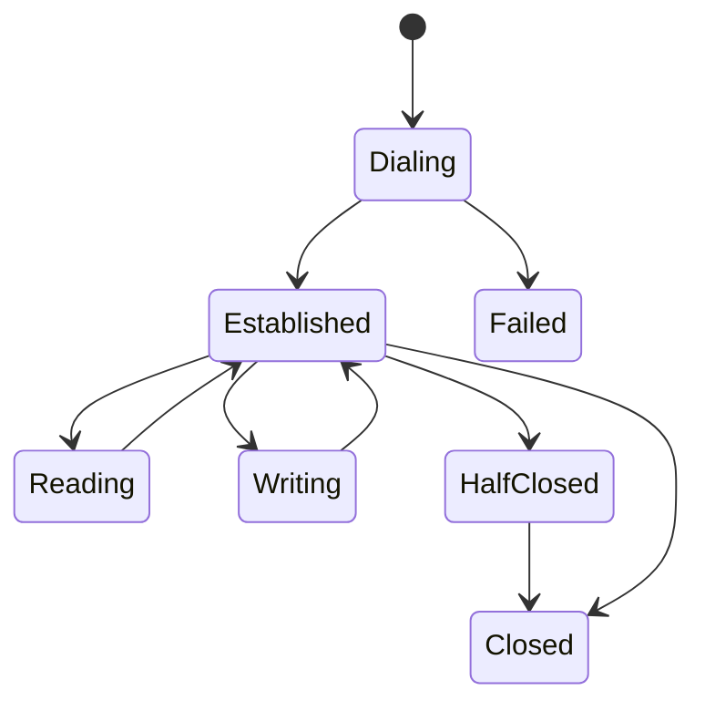
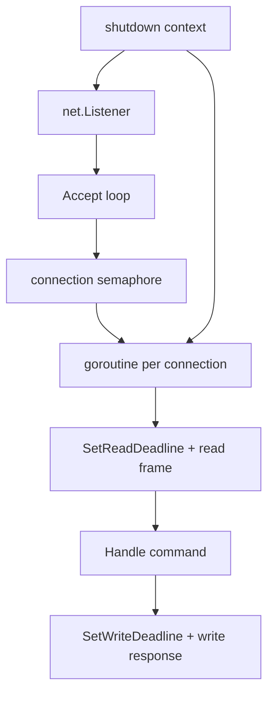

# learn-go-part-021.md

# Go Networking Fundamentals: net.Conn, TCP/UDP, DNS, Deadlines, Timeouts, and Connection Lifecycle

> Seri: `learn-go`  
> Part: `021` dari `034`  
> Target pembaca: Java software engineer yang ingin naik ke level production-grade Go engineer  
> Target Go: Go 1.26.x  
> Status seri: belum selesai

---

## 0. Tujuan Part Ini

Part 020 membahas file, stream, dan filesystem I/O. Part ini naik ke network I/O level rendah: `net.Conn`, TCP, UDP, DNS, deadline, timeout, connection lifecycle, dan failure mode jaringan.

Sebelum masuk HTTP server/client di part 022-023, kamu perlu paham bahwa HTTP di Go dibangun di atas prinsip network dasar:

```text
socket
connection
read/write
deadline
timeout
DNS resolution
listener
accept loop
backpressure
connection close
half-close
keepalive
error classification
```

Sebagai Java engineer, kamu bisa membandingkan dengan:

```text
java.net.Socket
ServerSocket
SocketChannel
DatagramSocket
InetAddress
connect timeout
read timeout
NIO selector
Netty event loop
```

Go approach berbeda:

```text
net.Conn is both io.Reader and io.Writer
goroutine-per-connection is normal
runtime network poller handles readiness
deadline is set on connection
context is used around dialing/resolution/higher-level APIs
```

Target part ini:

1. memahami `net.Conn` sebagai stream connection;
2. memahami TCP vs UDP dari perspektif Go;
3. memahami `net.Listener` dan accept loop;
4. memahami DNS resolution di Go;
5. memahami deadline vs timeout;
6. memahami connect/read/write timeout;
7. memahami connection lifecycle dan close;
8. memahami half-close TCP;
9. memahami keepalive;
10. memahami error handling network;
11. memahami backpressure;
12. membangun small TCP server/client production-style;
13. menyiapkan mental model untuk HTTP part berikutnya.

---

## 1. Sumber Resmi dan Rujukan Utama

Rujukan utama:

- Package `net`: https://pkg.go.dev/net
- Package `net/netip`: https://pkg.go.dev/net/netip
- Package `context`: https://pkg.go.dev/context
- Package `io`: https://pkg.go.dev/io
- Package `bufio`: https://pkg.go.dev/bufio
- Package `time`: https://pkg.go.dev/time
- Go Blog / Docs Diagnostics: https://go.dev/doc/diagnostics
- Go Runtime network poller context from runtime docs and diagnostics
- Go Memory Model: https://go.dev/ref/mem

Catatan:

- `net.Conn` mengimplementasikan `io.Reader`, `io.Writer`, dan `io.Closer`.
- Go network I/O terintegrasi dengan runtime network poller, sehingga goroutine yang block di network I/O tidak sama dengan satu OS thread dedicated per blocked connection pada normal net package usage.
- Deadline di `net.Conn` bersifat absolut, bukan durasi relatif per operasi.
- Higher-level APIs seperti `net.Dialer.DialContext`, HTTP request, dan database driver memakai `context.Context` untuk cancellation/lifecycle.

---

## 2. Mental Model Besar

### 2.1 Network Connection sebagai Stream

TCP connection di Go terlihat seperti stream:

```go
type Conn interface {
    Read(b []byte) (n int, err error)
    Write(b []byte) (n int, err error)
    Close() error
    LocalAddr() Addr
    RemoteAddr() Addr
    SetDeadline(t time.Time) error
    SetReadDeadline(t time.Time) error
    SetWriteDeadline(t time.Time) error
}
```

Karena `net.Conn` adalah `io.Reader` dan `io.Writer`, semua teknik part 020 berlaku:

```go
io.Copy(dst, conn)
bufio.NewReader(conn)
bufio.NewWriter(conn)
json.NewDecoder(conn)
binary.Read(conn, ...)
```

Visual:


### 2.2 TCP Memberi Byte Stream, Bukan Message

TCP tidak menjaga message boundary.

Jika peer menulis:

```text
HELLO
WORLD
```

receiver bisa membaca:

```text
HEL
LOWORLD
```

atau:

```text
HELLOWORLD
```

atau per byte.

Karena itu protocol di atas TCP harus punya framing:

```text
newline-delimited
length-prefix
fixed-size frame
delimiter
higher-level protocol like HTTP
```

### 2.3 UDP Memberi Datagram

UDP mempertahankan datagram boundary, tetapi:

```text
unreliable
unordered
duplicate possible
size-limited
no connection stream
no built-in backpressure
```

Use UDP when protocol semantics fit:

- DNS;
- metrics;
- realtime media;
- discovery;
- custom unreliable protocol;
- QUIC underneath is UDP but complex and handled by libraries.

---

## 3. Addresses

### 3.1 `net.Addr`

```go
type Addr interface {
    Network() string
    String() string
}
```

Examples:

```go
conn.LocalAddr()
conn.RemoteAddr()
```

### 3.2 TCP Address

```go
addr, err := net.ResolveTCPAddr("tcp", "127.0.0.1:8080")
```

### 3.3 UDP Address

```go
addr, err := net.ResolveUDPAddr("udp", "127.0.0.1:5353")
```

### 3.4 `netip`

Modern Go has `net/netip`, which provides value types for IP addresses and prefixes:

```go
addr, err := netip.ParseAddr("192.168.1.10")
prefix, err := netip.ParsePrefix("10.0.0.0/8")
```

`netip.Addr` is often preferable to older `net.IP` for new code because it is comparable, immutable-style value, and efficient.

Use cases:

- allowlist/blocklist;
- CIDR matching;
- network policy logic;
- parsing IP literals.

---

## 4. DNS Resolution

### 4.1 Lookup Host

```go
ips, err := net.LookupHost("example.com")
```

### 4.2 Resolver with Context

```go
resolver := net.Resolver{}

ips, err := resolver.LookupIPAddr(ctx, "example.com")
```

Use context for timeout/cancellation.

### 4.3 DNS Failure Modes

DNS can fail due to:

```text
NXDOMAIN
timeout
temporary resolver failure
network unreachable
misconfigured search domain
stale cache
split-horizon DNS
container DNS issues
CoreDNS overload
```

Do not assume DNS is instant or stable.

### 4.4 DNS and Production

In Kubernetes/cloud, DNS failure can manifest as:

- request latency spike;
- connection errors;
- intermittent timeout;
- dependency unavailable;
- thundering herd after cache expiry.

Mitigations:

- connection reuse;
- resolver timeout;
- proper HTTP transport pooling;
- avoid resolving per request manually;
- metrics around dial/DNS if possible;
- observe CoreDNS.

---

## 5. Dialing

### 5.1 Basic Dial

```go
conn, err := net.Dial("tcp", "example.com:80")
if err != nil {
    return err
}
defer conn.Close()
```

### 5.2 Dial with Timeout

```go
conn, err := net.DialTimeout("tcp", "example.com:80", 3*time.Second)
```

### 5.3 Dialer with Context

```go
d := net.Dialer{
    Timeout:   3 * time.Second,
    KeepAlive: 30 * time.Second,
}

conn, err := d.DialContext(ctx, "tcp", "example.com:80")
```

Prefer `DialContext` in context-aware code.

### 5.4 Connect Timeout vs Overall Timeout

Connect timeout only bounds connection establishment.

It does not bound:

- write;
- read;
- protocol handshake;
- server processing;
- response body read.

You need layered timeouts.

---

## 6. Deadlines and Timeouts

### 6.1 Deadline Is Absolute Time

```go
conn.SetReadDeadline(time.Now().Add(5 * time.Second))
```

This sets read deadline to an absolute time.

It is not “5 seconds per read forever”.

If you want per-operation timeout, set deadline before each operation.

### 6.2 SetDeadline

```go
conn.SetDeadline(t)
```

Applies to both read and write.

### 6.3 SetReadDeadline

```go
conn.SetReadDeadline(time.Now().Add(5 * time.Second))
```

Affects future/current reads.

### 6.4 SetWriteDeadline

```go
conn.SetWriteDeadline(time.Now().Add(5 * time.Second))
```

Affects writes.

### 6.5 Clear Deadline

```go
conn.SetDeadline(time.Time{})
```

Zero time disables deadline.

### 6.6 Timeout Error

Network timeout errors often satisfy:

```go
var ne net.Error
if errors.As(err, &ne) && ne.Timeout() {
    // timeout
}
```

For context:

```go
errors.Is(err, context.DeadlineExceeded)
errors.Is(err, context.Canceled)
```

Both may appear depending API layer.

### 6.7 Common Timeout Bug

Wrong:

```go
conn.SetReadDeadline(time.Now().Add(5 * time.Second))

for {
    n, err := conn.Read(buf)
    // after 5 seconds total, all reads timeout
}
```

If you want idle timeout:

```go
for {
    if err := conn.SetReadDeadline(time.Now().Add(5 * time.Second)); err != nil {
        return err
    }

    n, err := conn.Read(buf)
    if n > 0 {
        process(buf[:n])
    }
    if err != nil {
        return err
    }
}
```

### 6.8 Deadline as Cancellation Mechanism

If a goroutine is blocked in `Read`, closing the connection or setting a deadline can unblock it.

For connection handler shutdown:

```go
_ = conn.SetDeadline(time.Now())
_ = conn.Close()
```

Use carefully with ownership.

---

## 7. TCP Server

### 7.1 Basic Listener

```go
ln, err := net.Listen("tcp", ":9000")
if err != nil {
    return err
}
defer ln.Close()

for {
    conn, err := ln.Accept()
    if err != nil {
        return err
    }

    go handleConn(conn)
}
```

This is minimal but incomplete.

### 7.2 Production-Aware Accept Loop

Need:

- context cancellation;
- listener close on shutdown;
- temporary error handling;
- connection limit;
- panic boundary maybe;
- deadline inside handler;
- logging;
- WaitGroup for graceful shutdown.

Example:

```go
type Server struct {
    Addr        string
    MaxConns    int
    IdleTimeout time.Duration
    Handler     func(context.Context, net.Conn) error
}

func (s *Server) Run(ctx context.Context) error {
    ln, err := net.Listen("tcp", s.Addr)
    if err != nil {
        return fmt.Errorf("listen %s: %w", s.Addr, err)
    }
    defer ln.Close()

    go func() {
        <-ctx.Done()
        _ = ln.Close()
    }()

    sem := make(chan struct{}, s.MaxConns)
    var wg sync.WaitGroup

    for {
        conn, err := ln.Accept()
        if err != nil {
            select {
            case <-ctx.Done():
                wg.Wait()
                return ctx.Err()
            default:
            }

            if isTemporaryNetErr(err) {
                time.Sleep(100 * time.Millisecond)
                continue
            }

            wg.Wait()
            return fmt.Errorf("accept: %w", err)
        }

        select {
        case sem <- struct{}{}:
        case <-ctx.Done():
            _ = conn.Close()
            wg.Wait()
            return ctx.Err()
        }

        wg.Add(1)
        go func() {
            defer wg.Done()
            defer func() { <-sem }()
            defer conn.Close()

            if s.IdleTimeout > 0 {
                _ = conn.SetDeadline(time.Now().Add(s.IdleTimeout))
            }

            _ = s.Handler(ctx, conn)
        }()
    }
}
```

Helper:

```go
func isTemporaryNetErr(err error) bool {
    var ne net.Error
    return errors.As(err, &ne) && ne.Temporary()
}
```

`Temporary` exists on `net.Error`, but its practical use has changed over time; do not build elaborate retry policy only around it. Classify expected errors explicitly where possible.

### 7.3 Connection Limit

Without limit:

```go
go handleConn(conn)
```

A malicious/buggy client can open many connections and exhaust resources.

Limit with semaphore, listener wrapper, load balancer, OS limits, or protocol-level controls.

---

## 8. TCP Client

### 8.1 Simple Request/Response Protocol

Suppose newline-delimited protocol.

```go
func Query(ctx context.Context, address, request string) (string, error) {
    d := net.Dialer{Timeout: 3 * time.Second}

    conn, err := d.DialContext(ctx, "tcp", address)
    if err != nil {
        return "", fmt.Errorf("dial %s: %w", address, err)
    }
    defer conn.Close()

    if deadline, ok := ctx.Deadline(); ok {
        _ = conn.SetDeadline(deadline)
    } else {
        _ = conn.SetDeadline(time.Now().Add(5 * time.Second))
    }

    if _, err := io.WriteString(conn, request+"\n"); err != nil {
        return "", fmt.Errorf("write request: %w", err)
    }

    br := bufio.NewReader(conn)
    line, err := br.ReadString('\n')
    if err != nil {
        return "", fmt.Errorf("read response: %w", err)
    }

    return strings.TrimSuffix(line, "\n"), nil
}
```

### 8.2 Reuse Connections?

Raw TCP client may need pooling.

For HTTP, use `http.Transport` pooling instead of raw `net.Conn`.

If you implement custom protocol:

- define connection ownership;
- avoid concurrent writes without framing lock;
- handle reconnect;
- handle idle timeout;
- handle health check;
- handle backpressure;
- decide one request per conn vs multiplexing;
- avoid reinventing HTTP/2 unless necessary.

---

## 9. Framing Protocols

### 9.1 Newline-Delimited

Easy:

```go
line, err := br.ReadString('\n')
```

Risks:

- huge line memory;
- delimiter escaping;
- binary data issue.

Use limits.

### 9.2 Length-Prefix

Frame:

```text
uint32 length big endian
payload bytes
```

Read:

```go
func ReadFrame(r io.Reader, max uint32) ([]byte, error) {
    var lenBuf [4]byte

    if _, err := io.ReadFull(r, lenBuf[:]); err != nil {
        return nil, err
    }

    n := binary.BigEndian.Uint32(lenBuf[:])
    if n > max {
        return nil, fmt.Errorf("frame too large: %d", n)
    }

    payload := make([]byte, n)
    if _, err := io.ReadFull(r, payload); err != nil {
        return nil, err
    }

    return payload, nil
}
```

Write:

```go
func WriteFrame(w io.Writer, payload []byte) error {
    if len(payload) > math.MaxUint32 {
        return errors.New("payload too large")
    }

    var lenBuf [4]byte
    binary.BigEndian.PutUint32(lenBuf[:], uint32(len(payload)))

    if _, err := w.Write(lenBuf[:]); err != nil {
        return err
    }

    _, err := w.Write(payload)
    return err
}
```

Use `io.ReadFull` because `Read` can return partial.

### 9.3 Fixed-Size

Useful for binary protocols with known headers.

### 9.4 Framing Is Security

Always bound frame size.

Unbounded length prefix can allocate attacker-controlled memory.

---

## 10. UDP

### 10.1 Listen UDP

```go
addr, err := net.ResolveUDPAddr("udp", ":9001")
if err != nil {
    return err
}

conn, err := net.ListenUDP("udp", addr)
if err != nil {
    return err
}
defer conn.Close()
```

Read datagram:

```go
buf := make([]byte, 1500)

n, remote, err := conn.ReadFromUDP(buf)
if err != nil {
    return err
}

process(remote, buf[:n])
```

### 10.2 Write Datagram

```go
_, err = conn.WriteToUDP(payload, remote)
```

### 10.3 UDP Caveats

- packet loss;
- duplication;
- reordering;
- MTU fragmentation;
- no stream;
- no built-in connection state;
- spoofing considerations;
- amplification attack risk.

### 10.4 UDP Server Loop

Set read deadline for shutdown/idle:

```go
for {
    _ = conn.SetReadDeadline(time.Now().Add(time.Second))

    n, addr, err := conn.ReadFromUDP(buf)
    if err != nil {
        var ne net.Error
        if errors.As(err, &ne) && ne.Timeout() {
            select {
            case <-ctx.Done():
                return ctx.Err()
            default:
                continue
            }
        }
        return err
    }

    handle(addr, buf[:n])
}
```

---

## 11. Unix Domain Sockets

Go supports Unix sockets on Unix-like systems.

```go
ln, err := net.Listen("unix", "/tmp/service.sock")
```

Useful for:

- local sidecar communication;
- admin socket;
- local agent;
- Docker/container integrations.

Need filesystem permission management and cleanup of socket path.

---

## 12. Connection Lifecycle

### 12.1 States Conceptually



### 12.2 Close

```go
conn.Close()
```

Close unblocks pending Read/Write with error.

Close should be called by owner.

### 12.3 Half-Close TCP

For `*net.TCPConn`:

```go
tcpConn.CloseWrite()
tcpConn.CloseRead()
```

Useful when protocol says:

```text
client sends request then closes write side
server reads EOF then sends response
```

Example:

```go
tcp, ok := conn.(*net.TCPConn)
if ok {
    _ = tcp.CloseWrite()
}
```

Be careful. Many protocols do not expect half-close.

### 12.4 Keepalive

TCP keepalive can detect dead peers eventually.

In `net.Dialer`:

```go
d := net.Dialer{
    KeepAlive: 30 * time.Second,
}
```

Keepalive is not replacement for application-level timeout.

### 12.5 Idle Timeout

Use deadlines:

```go
conn.SetReadDeadline(time.Now().Add(idleTimeout))
```

Reset after each successful read/write depending protocol.

---

## 13. Backpressure

### 13.1 Write Can Block

If peer is slow or receive buffer full:

```go
conn.Write(data)
```

can block.

Use write deadline:

```go
conn.SetWriteDeadline(time.Now().Add(2 * time.Second))
```

### 13.2 Read Can Block

If peer sends nothing:

```go
conn.Read(buf)
```

can block.

Use read deadline.

### 13.3 Application Queues

If you have goroutine writing to a connection from channel:

```go
outgoing := make(chan []byte, 100)
```

This is bounded buffer. Decide what happens when full:

- block producer;
- drop;
- disconnect;
- return overload;
- apply priority.

### 13.4 Slow Client Problem

Server writing large response to slow client can consume goroutine and memory.

Mitigation:

- write deadline;
- bounded buffers;
- stream carefully;
- close slow clients;
- HTTP server write timeouts in higher-level part.

---

## 14. Error Handling

### 14.1 EOF

```go
if errors.Is(err, io.EOF) {
    // peer closed cleanly or stream ended
}
```

In connection protocols, EOF may mean normal close or unexpected close depending state.

### 14.2 Timeout

```go
var ne net.Error
if errors.As(err, &ne) && ne.Timeout() {
    // timeout
}
```

### 14.3 Connection Reset

Often appears as OS-specific error wrapped in `*net.OpError`.

Do not string-match unless no alternative.

Use logs with operation context:

```go
return fmt.Errorf("read from %s: %w", conn.RemoteAddr(), err)
```

### 14.4 `net.OpError`

Network errors often wrap in `*net.OpError` with fields like operation/network/address.

```go
var opErr *net.OpError
if errors.As(err, &opErr) {
    // inspect opErr.Op, opErr.Net, opErr.Addr if useful
}
```

### 14.5 Temporary Errors

Historically:

```go
ne.Temporary()
```

But modern code should be cautious; define retry policy based on operation and known errors/timeouts.

### 14.6 Error Classification Table

| Error | Meaning | Possible Action |
|---|---|---|
| `io.EOF` during idle read | peer closed | close handler |
| `io.EOF` mid-frame | truncated message | protocol error |
| timeout | slow/dead peer | close/retry depending operation |
| connection refused | service not listening | retry/backoff |
| DNS timeout | resolver/network issue | retry/backoff |
| reset by peer | peer aborted | retry if idempotent |
| broken pipe | writing to closed peer | stop writing |
| context canceled | caller canceled | stop |
| deadline exceeded | budget expired | stop/retry at higher layer if allowed |

---

## 15. Context and Networking

### 15.1 DialContext

```go
conn, err := dialer.DialContext(ctx, "tcp", addr)
```

### 15.2 Read/Write with Context

`net.Conn.Read` does not accept context directly.

Use deadlines or close connection on context cancellation.

Pattern:

```go
func SetDeadlineFromContext(ctx context.Context, conn net.Conn, fallback time.Duration) {
    if deadline, ok := ctx.Deadline(); ok {
        _ = conn.SetDeadline(deadline)
        return
    }
    if fallback > 0 {
        _ = conn.SetDeadline(time.Now().Add(fallback))
    }
}
```

For long-lived connection, do not set one deadline for entire lifetime unless intended. Use per-operation deadlines.

### 15.3 Cancel by Closing Conn

```go
go func() {
    <-ctx.Done()
    _ = conn.Close()
}()
```

This can unblock read/write. But it transfers ownership complexity: ensure only connection owner closes.

---

## 16. Production Example: TCP Line Protocol Server

### 16.1 Requirements

Build internal TCP service:

- accepts line-delimited commands;
- max line size 8 KB;
- idle timeout 30s;
- max connections 1000;
- graceful shutdown;
- context-aware handler;
- no unbounded memory;
- logs remote address;
- closes connection on protocol error.

### 16.2 Server

```go
type LineServer struct {
    Addr        string
    MaxConns    int
    IdleTimeout time.Duration
    MaxLineSize int
    Handler     func(context.Context, string) (string, error)
}

func (s *LineServer) Run(ctx context.Context) error {
    ln, err := net.Listen("tcp", s.Addr)
    if err != nil {
        return fmt.Errorf("listen %s: %w", s.Addr, err)
    }
    defer ln.Close()

    go func() {
        <-ctx.Done()
        _ = ln.Close()
    }()

    sem := make(chan struct{}, s.MaxConns)
    var wg sync.WaitGroup

    for {
        conn, err := ln.Accept()
        if err != nil {
            select {
            case <-ctx.Done():
                wg.Wait()
                return nil
            default:
            }
            return fmt.Errorf("accept: %w", err)
        }

        select {
        case sem <- struct{}{}:
        default:
            _ = conn.Close()
            continue
        }

        wg.Add(1)
        go func(conn net.Conn) {
            defer wg.Done()
            defer func() { <-sem }()
            defer conn.Close()

            s.handleConn(ctx, conn)
        }(conn)
    }
}
```

### 16.3 Handler

```go
func (s *LineServer) handleConn(ctx context.Context, conn net.Conn) {
    reader := bufio.NewReaderSize(conn, s.MaxLineSize)

    for {
        if err := conn.SetReadDeadline(time.Now().Add(s.IdleTimeout)); err != nil {
            return
        }

        line, err := reader.ReadString('\n')
        if err != nil {
            if errors.Is(err, io.EOF) {
                return
            }

            var ne net.Error
            if errors.As(err, &ne) && ne.Timeout() {
                return
            }

            return
        }

        if len(line) > s.MaxLineSize {
            _, _ = io.WriteString(conn, "ERR line too long\n")
            return
        }

        line = strings.TrimSuffix(line, "\n")
        line = strings.TrimSuffix(line, "\r")

        resp, err := s.Handler(ctx, line)
        if err != nil {
            resp = "ERR " + err.Error()
        } else {
            resp = "OK " + resp
        }

        if err := conn.SetWriteDeadline(time.Now().Add(5 * time.Second)); err != nil {
            return
        }

        if _, err := io.WriteString(conn, resp+"\n"); err != nil {
            return
        }
    }
}
```

### 16.4 Caveat on `ReadString`

`ReadString` can allocate up to line length. For strict max, use scanner with buffer or manual reading. Scanner has token limit behavior; configure it.

For robust protocol, length-prefix is often cleaner.

### 16.5 Diagram



---

## 17. Production Example: Length-Prefixed Client

### 17.1 Client

```go
type Client struct {
    Addr        string
    DialTimeout time.Duration
    OpTimeout   time.Duration
}

func (c *Client) Call(ctx context.Context, payload []byte) ([]byte, error) {
    d := net.Dialer{
        Timeout: c.DialTimeout,
    }

    conn, err := d.DialContext(ctx, "tcp", c.Addr)
    if err != nil {
        return nil, fmt.Errorf("dial %s: %w", c.Addr, err)
    }
    defer conn.Close()

    opDeadline := time.Now().Add(c.OpTimeout)
    if deadline, ok := ctx.Deadline(); ok && deadline.Before(opDeadline) {
        opDeadline = deadline
    }

    if err := conn.SetDeadline(opDeadline); err != nil {
        return nil, err
    }

    if err := WriteFrame(conn, payload); err != nil {
        return nil, fmt.Errorf("write frame: %w", err)
    }

    resp, err := ReadFrame(conn, 1<<20)
    if err != nil {
        return nil, fmt.Errorf("read frame: %w", err)
    }

    return resp, nil
}
```

This is one-request-per-connection. For high throughput, pooling/reuse may be needed.

---

## 18. Security Considerations

### 18.1 Always Bound Input

- max line length;
- max frame size;
- max connections;
- max request duration;
- max idle duration;
- max queue size.

### 18.2 Avoid Reflection-Based Protocol Without Limits

Parsing arbitrary payload can allocate heavily.

### 18.3 TLS

Raw TCP is unencrypted.

For secure transport:

```go
tls.DialWithDialer(...)
tls.Listen(...)
```

TLS deep dive appears in security/HTTP sections.

### 18.4 Do Not Log Raw Payloads

Network payload may contain secrets/PII.

Log:

- remote address;
- operation;
- size;
- error category;
- correlation id.

### 18.5 Rate Limit and Connection Limit

Low-level TCP server should protect itself.

---

## 19. Testing Networking Code

### 19.1 Use Localhost Listener

```go
ln, err := net.Listen("tcp", "127.0.0.1:0")
addr := ln.Addr().String()
```

Port `0` asks OS for free port.

### 19.2 `net.Pipe`

`net.Pipe` creates in-memory full-duplex connection pair.

```go
c1, c2 := net.Pipe()
defer c1.Close()
defer c2.Close()
```

Useful for testing protocol handlers without real network.

Caveat: behavior differs from TCP in buffering/addresses/deadlines details. Good for unit tests, not full integration.

### 19.3 Test Deadline

```go
c1, c2 := net.Pipe()
defer c1.Close()
defer c2.Close()

_ = c1.SetReadDeadline(time.Now().Add(10 * time.Millisecond))

buf := make([]byte, 1)
_, err := c1.Read(buf)

var ne net.Error
if !errors.As(err, &ne) || !ne.Timeout() {
    t.Fatalf("expected timeout, got %v", err)
}
```

### 19.4 Test Framing

Use `bytes.Buffer` for pure framing functions:

```go
var buf bytes.Buffer
err := WriteFrame(&buf, []byte("hello"))
got, err := ReadFrame(&buf, 1024)
```

Because framing depends on `io.Reader`/`io.Writer`, not network.

---

## 20. Observability

For networked services, track:

```text
connections accepted
active connections
connection duration
read timeout count
write timeout count
protocol error count
bytes read/written
DNS lookup errors
dial errors
connect latency
read/write latency
remote close count
connection reset count
```

For HTTP, many of these are handled at transport/server layer, but raw TCP services need explicit metrics.

### 20.1 pprof and Trace

Network issues may appear as goroutines blocked in:

```text
net.(*conn).Read
net.(*conn).Write
internal/poll
```

Use:

```bash
curl /debug/pprof/goroutine?debug=2
go test -trace trace.out ./...
```

### 20.2 Runtime Metrics

Goroutine count rising may indicate connection leak or blocked handlers.

---

## 21. Common Anti-Patterns

### 21.1 No Deadlines

```go
conn.Read(buf)
```

forever.

### 21.2 Assuming TCP Read Equals Message

Wrong.

Need framing.

### 21.3 Unbounded Goroutine per Connection Without Limit

Need connection limits.

### 21.4 No Max Frame Size

Attacker can force large allocation.

### 21.5 Ignoring Partial Reads

Use `io.ReadFull` for fixed/length-prefixed frames.

### 21.6 Writing Without Write Deadline

Slow peer can block writer.

### 21.7 String Matching Errors

Prefer `errors.As`, `net.Error`, `*net.OpError`, `errors.Is`.

### 21.8 Ignoring DNS Latency/Failure

DNS is a network dependency.

### 21.9 Reimplementing HTTP Poorly

If request/response semantics, headers, TLS, proxy, observability, and compatibility matter, use HTTP/gRPC instead of custom TCP.

### 21.10 No Graceful Shutdown

Closing listener stops accept loop, but active connections must be handled.

---

## 22. Practical Commands

### Inspect Listening Ports

Linux/macOS:

```bash
lsof -iTCP -sTCP:LISTEN
```

Linux:

```bash
ss -lntp
```

Windows PowerShell:

```powershell
Get-NetTCPConnection -State Listen
```

### Test TCP Manually

```bash
nc 127.0.0.1 9000
```

PowerShell:

```powershell
Test-NetConnection 127.0.0.1 -Port 9000
```

### Go Race Detector

```bash
go test -race ./...
```

### Trace

```bash
go test -trace trace.out ./...
go tool trace trace.out
```

### pprof Goroutine

```bash
curl http://localhost:6060/debug/pprof/goroutine?debug=2
```

---

## 23. Hands-On Labs

### Lab 1: Echo Server

Build TCP echo server:

- listener on `127.0.0.1:0`;
- goroutine per connection;
- read deadline;
- connection close;
- test with client.

### Lab 2: Message Framing

Implement length-prefixed `ReadFrame` and `WriteFrame`.

Test with `bytes.Buffer`.

Test max frame error.

### Lab 3: Deadline Behavior

Use `net.Pipe`.

Set read deadline and verify timeout.

Reset deadline and verify read works.

### Lab 4: Slow Client

Write server that writes large response.

Client reads slowly.

Add write deadline.

Observe behavior.

### Lab 5: Connection Limit

Add semaphore max connections.

Open more clients than limit.

Verify excess rejected/closed.

### Lab 6: Graceful Shutdown

Run server with context.

Cancel context.

Verify listener closes and active handlers finish or deadline.

### Lab 7: UDP Ping

Build UDP server responding `pong` to `ping`.

Add read deadline for shutdown.

### Lab 8: DNS Timeout

Use `net.Resolver.LookupIPAddr(ctx, host)` with short timeout.

Classify timeout/canceled errors.

---

## 24. Review Questions

1. Kenapa `net.Conn` bisa dipakai dengan `io.Copy`?
2. Apa bedanya TCP byte stream dan message protocol?
3. Kenapa TCP membutuhkan framing?
4. Apa beda TCP dan UDP?
5. Apa itu `net.Listener`?
6. Kenapa accept loop butuh shutdown handling?
7. Apa perbedaan connect timeout, read timeout, write timeout, dan overall timeout?
8. Kenapa deadline di Go bersifat absolute?
9. Bagaimana cara membuat idle timeout?
10. Bagaimana cara cancel read/write yang sedang block?
11. Apa itu half-close TCP?
12. Kenapa keepalive bukan pengganti application timeout?
13. Bagaimana menghindari unbounded connections?
14. Kenapa max frame size wajib?
15. Bagaimana DNS failure memengaruhi service?
16. Apa kegunaan `netip`?
17. Bagaimana mengklasifikasi network timeout?
18. Kapan menggunakan `net.Pipe` di test?
19. Metrics apa yang penting untuk raw TCP server?
20. Kapan sebaiknya tidak membuat custom TCP protocol?

---

## 25. Code Review Checklist

Saat review networking code:

```text
[ ] Apakah protocol punya framing jelas?
[ ] Apakah frame/line size dibatasi?
[ ] Apakah read deadline digunakan?
[ ] Apakah write deadline digunakan?
[ ] Apakah dial/connect timeout digunakan?
[ ] Apakah context dipakai untuk DialContext/resolution?
[ ] Apakah connection selalu Close?
[ ] Apakah accept loop bisa shutdown?
[ ] Apakah active connections ditunggu/dibatasi?
[ ] Apakah goroutine per connection bounded oleh connection limit?
[ ] Apakah partial read ditangani dengan io.ReadFull jika perlu?
[ ] Apakah TCP read tidak diasumsikan sama dengan message?
[ ] Apakah DNS failure/timeout diklasifikasi?
[ ] Apakah error dibungkus dengan operation/remote addr?
[ ] Apakah raw payload tidak dilog sembarangan?
[ ] Apakah metrics untuk connection/error/timeout ada?
[ ] Apakah custom protocol memang perlu dibanding HTTP/gRPC?
```

---

## 26. Invariants

Pegang invariant berikut:

```text
net.Conn is an io.Reader, io.Writer, and io.Closer.
TCP is a byte stream, not a message stream.
Protocol framing is application responsibility.
Read may return partial data.
Write may block on slow peer.
Deadline is absolute time.
Set per-operation deadline if you need per-operation timeout.
No deadline means operations may block indefinitely.
Dial timeout only covers connection establishment.
Context cancels DialContext, not arbitrary Conn.Read unless integrated via deadline/close.
Listener Close unblocks Accept.
Close unblocks pending operations with error.
UDP preserves datagram boundary but is unreliable.
DNS is a dependency and can fail/timeout.
Bound connections, frame size, queue size, and operation duration.
```

---

## 27. Ringkasan

Networking di Go terasa sederhana karena `net.Conn` menyatu dengan model `io.Reader`/`io.Writer`.

Kamu bisa menulis:

```go
io.Copy(conn, src)
io.Copy(dst, conn)
```

Tetapi production networking menuntut disiplin:

```text
frame your protocol
set deadlines
bound input
bound connections
handle DNS failure
close resources
classify errors
observe timeouts
design shutdown
avoid reinventing HTTP unless justified
```

Sebagai Java engineer, kamu mungkin terbiasa dengan socket/channel/NIO framework yang lebih berat. Go memungkinkan model goroutine-per-connection yang sederhana karena runtime network poller. Tetapi “sederhana” bukan berarti tanpa batas.

Networking bug production sering berasal dari:

- read/write tanpa deadline;
- asumsi TCP read sama dengan message;
- custom protocol tanpa max size;
- connection leak;
- DNS timeout tidak dipahami;
- slow client menahan goroutine;
- tidak ada graceful shutdown;
- error string matching;
- tidak ada metrics.

Part berikutnya akan membangun di atas ini untuk HTTP server engineering dengan `net/http`.

---

## 28. Posisi Kita di Seri

Kita sudah menyelesaikan:

```text
000 - Orientation and Mental Model
001 - Toolchain, Workspace, Module, Build
002 - Syntax Core
003 - Functions
004 - Types
005 - Composition
006 - Interfaces
007 - Generics
008 - Error Handling
009 - Package Design
010 - Modules and Dependency Management
011 - Standard Library Mental Model
012 - Slices, Arrays, and Maps
013 - Memory Model for Application Engineers
014 - Runtime Deep Dive
015 - Go Garbage Collector
016 - Concurrency Primitives
017 - Concurrency Patterns
018 - Shared Memory Concurrency
019 - Context Propagation
020 - File, Stream, and Filesystem I/O
021 - Networking Fundamentals
```

Berikutnya:

```text
022 - HTTP Server Engineering:
      net/http, Routing, Middleware, Timeouts, Graceful Shutdown, and Request Body Discipline
```

Status seri: **belum selesai**.


<!-- NAVIGATION_FOOTER -->
<div class="page-nav">
<a href="./learn-go-part-020.md">⬅️ Go File, Stream, and Filesystem I/O: os, io.Reader, io.Writer, fs.FS, embed, and Streaming Design</a>
<a href="./index.md">📚 Kategori</a>
<a href="../../index.md">🏠 Home</a>
<a href="./learn-go-part-022.md">Go HTTP Server Engineering: net/http, Routing, Middleware, Timeouts, Graceful Shutdown, and Request Body Discipline ➡️</a>
</div>
