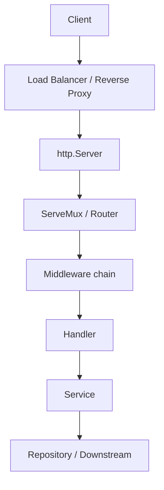
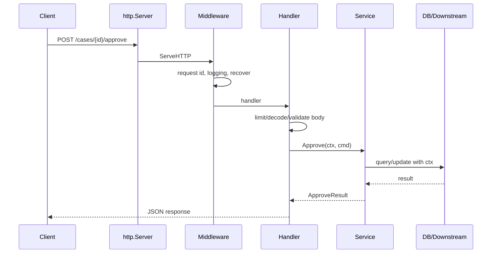

# learn-go-part-022.md

# Go HTTP Server Engineering: net/http, Routing, Middleware, Timeouts, Graceful Shutdown, and Request Body Discipline

> Seri: `learn-go`  
> Part: `022` dari `034`  
> Target pembaca: Java software engineer yang ingin naik ke level production-grade Go engineer  
> Target Go: Go 1.26.x  
> Status seri: belum selesai

---

## 0. Tujuan Part Ini

Part 021 membahas network fundamentals: `net.Conn`, TCP/UDP, DNS, deadline, timeout, connection lifecycle, framing, dan backpressure. Sekarang kita naik ke HTTP server.

Di Go, HTTP server bukan “framework wajib”. Standard library `net/http` sudah production-capable jika dipakai dengan benar.

Sebagai Java engineer, kamu mungkin terbiasa dengan:

```text
Servlet container
Spring MVC
JAX-RS
Netty
Tomcat/Jetty/Undertow
filters/interceptors
controller annotations
request scoped beans
exception mapper
```

Di Go, model dasarnya jauh lebih kecil:

```go
type Handler interface {
    ServeHTTP(ResponseWriter, *Request)
}
```

Core building blocks:

```text
http.Server
http.Handler
http.HandlerFunc
http.ServeMux
http.Request.Context
http.ResponseWriter
middleware as function composition
context propagation
explicit JSON decode/encode
explicit request body limit
explicit timeout configuration
explicit graceful shutdown
```

Target part ini:

1. memahami `net/http` server mental model;
2. memahami `http.Handler` dan `ServeMux`;
3. memahami routing dasar dan routing modern;
4. memahami middleware sebagai function composition;
5. memahami `ResponseWriter` lifecycle;
6. memahami request body discipline;
7. memahami JSON request/response handling;
8. memahami timeout server;
9. memahami graceful shutdown;
10. memahami context propagation;
11. memahami error mapping;
12. memahami security header dan input limit dasar;
13. memahami observability;
14. membangun production-grade HTTP endpoint.

---

## 1. Sumber Resmi dan Rujukan Utama

Rujukan utama:

- Package `net/http`: https://pkg.go.dev/net/http
- Package `encoding/json`: https://pkg.go.dev/encoding/json
- Package `context`: https://pkg.go.dev/context
- Package `errors`: https://pkg.go.dev/errors
- Package `log/slog`: https://pkg.go.dev/log/slog
- Go Blog: Context — https://go.dev/blog/context
- Go Blog: Routing Enhancements for Go 1.22 — https://go.dev/blog/routing-enhancements
- Go Blog: Pipelines and cancellation — https://go.dev/blog/pipelines
- Go Diagnostics — https://go.dev/doc/diagnostics
- Go Memory Model — https://go.dev/ref/mem

Catatan:

- Sejak Go 1.22, `http.ServeMux` mendukung method dan wildcard path patterns seperti `"GET /posts/{id}"`.
- `http.Request.Context()` adalah sumber cancellation untuk request.
- `http.Server` harus dikonfigurasi timeout-nya secara eksplisit untuk service production.
- `ResponseWriter` memiliki lifecycle penting: setelah header/body ditulis, status/header tidak bisa diubah secara normal.
- Request body harus dibatasi untuk mencegah memory exhaustion.

---

## 2. Mental Model Besar

### 2.1 HTTP Server Stack



Di Go, semua node dari router sampai middleware sampai handler biasanya hanya `http.Handler`.

### 2.2 Minimal HTTP Server

```go
package main

import (
    "fmt"
    "net/http"
)

func main() {
    http.HandleFunc("GET /healthz", func(w http.ResponseWriter, r *http.Request) {
        fmt.Fprintln(w, "ok")
    })

    if err := http.ListenAndServe(":8080", nil); err != nil {
        panic(err)
    }
}
```

Ini bagus untuk demo, tetapi belum production-grade karena:

- memakai default server tanpa timeout;
- tidak ada graceful shutdown;
- tidak ada structured logging;
- tidak ada body limit;
- tidak ada panic boundary;
- tidak ada observability;
- tidak ada explicit mux dependency;
- error handling belum rapi.

### 2.3 Production Bias

Production server bias:

```text
explicit http.Server
explicit timeouts
explicit mux
explicit handler dependencies
explicit context propagation
explicit request body limit
explicit response format
explicit error mapping
explicit shutdown
explicit logging/metrics
```

---

## 3. `http.Handler`

### 3.1 Interface

```go
type Handler interface {
    ServeHTTP(ResponseWriter, *Request)
}
```

Function adapter:

```go
type HandlerFunc func(ResponseWriter, *Request)
```

Example:

```go
func healthz(w http.ResponseWriter, r *http.Request) {
    w.WriteHeader(http.StatusOK)
    _, _ = w.Write([]byte("ok\n"))
}
```

Register:

```go
mux := http.NewServeMux()
mux.HandleFunc("GET /healthz", healthz)
```

### 3.2 Handler as Object with Dependencies

Avoid global variables.

```go
type CaseHandler struct {
    service *CaseService
    logger  *slog.Logger
}

func (h *CaseHandler) Approve(w http.ResponseWriter, r *http.Request) {
    // use h.service, h.logger
}
```

Register:

```go
handler := &CaseHandler{service: service, logger: logger}

mux.HandleFunc("POST /cases/{id}/approve", handler.Approve)
```

### 3.3 Handler Should Be Thin

Handler responsibilities:

```text
extract route/path/query/header/body
validate transport-level request
create/derive context if needed
call service
map service result/error to HTTP response
log/metrics at boundary
```

Handler should not contain domain workflow logic.

---

## 4. ServeMux and Routing

### 4.1 `http.NewServeMux`

```go
mux := http.NewServeMux()
```

Register:

```go
mux.HandleFunc("GET /cases/{id}", h.GetCase)
mux.HandleFunc("POST /cases/{id}/approve", h.ApproveCase)
```

Path value:

```go
id := r.PathValue("id")
```

### 4.2 Method-Specific Patterns

```go
mux.HandleFunc("GET /healthz", healthz)
mux.HandleFunc("POST /cases", createCase)
```

This is cleaner than manual method switch for simple routing.

### 4.3 Wildcards

Example:

```go
mux.HandleFunc("GET /files/{path...}", serveFile)
```

Use carefully. Validate user-controlled path.

### 4.4 Query Parameters

```go
q := r.URL.Query()
status := q.Get("status")
limit := q.Get("limit")
```

Convert and validate explicitly.

### 4.5 Route Design

Good route design:

```text
GET    /cases/{id}
POST   /cases
POST   /cases/{id}/approve
POST   /cases/{id}/reject
GET    /cases?status=submitted
```

Avoid leaking implementation:

```text
POST /executeCaseApprovalWorkflowService
```

### 4.6 When to Use Third-Party Router

Standard `ServeMux` is enough for many services.

Use third-party router when you need:

- advanced middleware ecosystem;
- route groups;
- complex path matching;
- OpenAPI integration;
- mature production conventions;
- team consistency.

Do not add router dependency automatically.

---

## 5. Middleware

### 5.1 Middleware Shape

```go
type Middleware func(http.Handler) http.Handler
```

Example:

```go
func RequestID(next http.Handler) http.Handler {
    return http.HandlerFunc(func(w http.ResponseWriter, r *http.Request) {
        requestID := r.Header.Get("X-Request-ID")
        if requestID == "" {
            requestID = generateRequestID()
        }

        ctx := WithRequestID(r.Context(), requestID)
        w.Header().Set("X-Request-ID", requestID)

        next.ServeHTTP(w, r.WithContext(ctx))
    })
}
```

### 5.2 Chain Middleware

```go
func Chain(h http.Handler, mws ...Middleware) http.Handler {
    for i := len(mws) - 1; i >= 0; i-- {
        h = mws[i](h)
    }
    return h
}
```

Usage:

```go
handler := Chain(
    mux,
    Recover(logger),
    RequestID,
    AccessLog(logger),
    SecurityHeaders,
)
```

Order matters.

### 5.3 Panic Recovery Middleware

```go
func Recover(logger *slog.Logger) Middleware {
    return func(next http.Handler) http.Handler {
        return http.HandlerFunc(func(w http.ResponseWriter, r *http.Request) {
            defer func() {
                if rec := recover(); rec != nil {
                    logger.Error("panic recovered",
                        "panic", rec,
                        "method", r.Method,
                        "path", r.URL.Path,
                    )
                    http.Error(w, "internal server error", http.StatusInternalServerError)
                }
            }()

            next.ServeHTTP(w, r)
        })
    }
}
```

Caveat:

If handler already wrote partial response, recovery cannot cleanly change status. More advanced response wrapper is needed to buffer status, but buffering all response bodies is not always acceptable.

### 5.4 Access Log Middleware

```go
type statusRecorder struct {
    http.ResponseWriter
    status int
    bytes  int
}

func (r *statusRecorder) WriteHeader(status int) {
    r.status = status
    r.ResponseWriter.WriteHeader(status)
}

func (r *statusRecorder) Write(p []byte) (int, error) {
    if r.status == 0 {
        r.status = http.StatusOK
    }
    n, err := r.ResponseWriter.Write(p)
    r.bytes += n
    return n, err
}
```

Middleware:

```go
func AccessLog(logger *slog.Logger) Middleware {
    return func(next http.Handler) http.Handler {
        return http.HandlerFunc(func(w http.ResponseWriter, r *http.Request) {
            start := time.Now()
            rec := &statusRecorder{ResponseWriter: w}

            next.ServeHTTP(rec, r)

            status := rec.status
            if status == 0 {
                status = http.StatusOK
            }

            logger.Info("http request",
                "method", r.Method,
                "path", r.URL.Path,
                "status", status,
                "bytes", rec.bytes,
                "duration_ms", time.Since(start).Milliseconds(),
                "request_id", RequestID(r.Context()),
            )
        })
    }
}
```

### 5.5 ResponseWriter Wrapper Caveat

Wrapping `ResponseWriter` can accidentally lose optional interfaces:

- `http.Flusher`;
- `http.Hijacker`;
- `http.Pusher` historically;
- `io.ReaderFrom`.

If your service uses streaming, websockets, SSE, or hijacking, wrapper must preserve needed interfaces.

---

## 6. Request Lifecycle

### 6.1 Request Context

```go
ctx := r.Context()
```

Canceled when client disconnects, request is canceled, or server context ends.

Pass it downstream:

```go
caseData, err := h.service.GetCase(ctx, id)
```

### 6.2 Do Not Use `context.Background` in Handler

Wrong:

```go
h.service.GetCase(context.Background(), id)
```

Correct:

```go
h.service.GetCase(r.Context(), id)
```

### 6.3 Body Lifecycle

For server requests, `net/http` manages body close after handler returns, but handler should still read/close appropriately depending usage. For multipart and streaming, be explicit.

Do not keep `r.Body` after handler returns.

### 6.4 Handler Return Ends Request

Once handler returns, request lifecycle ends. Background goroutine using `r.Context()` may be canceled immediately.

If work must continue, enqueue durable job or use application lifecycle context with bounded worker.

---

## 7. ResponseWriter Lifecycle

### 7.1 Headers Must Be Set Before Write

```go
w.Header().Set("Content-Type", "application/json")
w.WriteHeader(http.StatusCreated)
json.NewEncoder(w).Encode(resp)
```

If you call `Write` before `WriteHeader`, status defaults to 200.

### 7.2 WriteHeader Once

Multiple `WriteHeader` calls do not change status after first.

### 7.3 Error After Partial Response

If response body already started, you cannot reliably change status.

This affects streaming export:

```go
w.WriteHeader(http.StatusOK)
write part 1
error happens
```

You can only log/close connection or encode error in stream protocol if designed.

For operations likely to fail, validate before writing first byte.

### 7.4 JSON Response Helper

```go
func WriteJSON(w http.ResponseWriter, status int, v any) {
    w.Header().Set("Content-Type", "application/json")
    w.WriteHeader(status)

    if err := json.NewEncoder(w).Encode(v); err != nil {
        // usually only log; response may already be committed
    }
}
```

In production, return error to caller before writing status if you need logging.

Better:

```go
func writeJSON(w http.ResponseWriter, status int, v any) error {
    w.Header().Set("Content-Type", "application/json")
    w.WriteHeader(status)
    return json.NewEncoder(w).Encode(v)
}
```

But caller cannot recover HTTP status after write fails.

---

## 8. Request Body Discipline

### 8.1 Always Limit Body Size

Bad:

```go
data, err := io.ReadAll(r.Body)
```

Good:

```go
r.Body = http.MaxBytesReader(w, r.Body, 1<<20)
```

Then decode.

### 8.2 JSON Decoder

```go
dec := json.NewDecoder(r.Body)
dec.DisallowUnknownFields()

var req ApproveRequest
if err := dec.Decode(&req); err != nil {
    return err
}
```

### 8.3 Ensure Single JSON Document

`Decode` once may allow trailing JSON.

Pattern:

```go
if err := dec.Decode(&req); err != nil {
    return err
}

if dec.More() {
    return errors.New("unexpected extra JSON")
}
```

Better strict check:

```go
if err := dec.Decode(&req); err != nil {
    return err
}

var extra any
if err := dec.Decode(&extra); !errors.Is(err, io.EOF) {
    return errors.New("request body must contain a single JSON value")
}
```

### 8.4 MaxBytesError

```go
var maxErr *http.MaxBytesError
if errors.As(err, &maxErr) {
    // 413 Payload Too Large
}
```

### 8.5 Empty Body

Handle explicitly if endpoint requires body.

```go
if r.Body == nil {
    return errors.New("request body required")
}
```

### 8.6 Content-Type

Check when endpoint expects JSON:

```go
ct := r.Header.Get("Content-Type")
if ct != "" {
    mediaType, _, err := mime.ParseMediaType(ct)
    if err != nil || mediaType != "application/json" {
        return ErrUnsupportedMediaType
    }
}
```

Decide whether missing content type is allowed.

### 8.7 Streaming Request

For large upload/import:

- limit total size;
- stream decoder;
- context-aware processing;
- do not buffer all;
- validate record count;
- handle partial import policy.

---

## 9. JSON Request/Response

### 9.1 DTO Separate from Domain

```go
type ApproveCaseRequest struct {
    Reason string `json:"reason"`
}

type ApproveCaseResponse struct {
    CaseID string `json:"case_id"`
    Status string `json:"status"`
}
```

Do not expose domain struct blindly.

### 9.2 Validate Explicitly

```go
func (r ApproveCaseRequest) Validate() error {
    if strings.TrimSpace(r.Reason) == "" {
        return errors.New("reason is required")
    }
    if len(r.Reason) > 1000 {
        return errors.New("reason too long")
    }
    return nil
}
```

### 9.3 Decode Helper

```go
func DecodeJSON[T any](w http.ResponseWriter, r *http.Request, maxBytes int64) (T, error) {
    var zero T

    r.Body = http.MaxBytesReader(w, r.Body, maxBytes)

    dec := json.NewDecoder(r.Body)
    dec.DisallowUnknownFields()

    var v T
    if err := dec.Decode(&v); err != nil {
        return zero, err
    }

    var extra any
    if err := dec.Decode(&extra); !errors.Is(err, io.EOF) {
        return zero, errors.New("body must contain single JSON value")
    }

    return v, nil
}
```

### 9.4 Encode Helper

```go
func EncodeJSON(w http.ResponseWriter, status int, v any) error {
    w.Header().Set("Content-Type", "application/json")
    w.WriteHeader(status)
    return json.NewEncoder(w).Encode(v)
}
```

### 9.5 JSON Error Response Shape

Production APIs should use consistent error shape.

```go
type ErrorResponse struct {
    Error ErrorBody `json:"error"`
}

type ErrorBody struct {
    Code      string `json:"code"`
    Message   string `json:"message"`
    RequestID string `json:"request_id,omitempty"`
}
```

Avoid exposing internal error strings.

---

## 10. Error Mapping

### 10.1 Domain Error Types

```go
var (
    ErrCaseNotFound      = errors.New("case not found")
    ErrInvalidTransition = errors.New("invalid transition")
    ErrForbidden         = errors.New("forbidden")
)
```

### 10.2 HTTP Mapper

```go
func WriteError(w http.ResponseWriter, r *http.Request, err error) {
    status := http.StatusInternalServerError
    code := "internal_error"
    message := "internal server error"

    switch {
    case errors.Is(err, context.Canceled):
        // client canceled; often do not write
        return

    case errors.Is(err, context.DeadlineExceeded):
        status = http.StatusGatewayTimeout
        code = "timeout"
        message = "request timed out"

    case errors.Is(err, ErrCaseNotFound):
        status = http.StatusNotFound
        code = "case_not_found"
        message = "case not found"

    case errors.Is(err, ErrInvalidTransition):
        status = http.StatusConflict
        code = "invalid_transition"
        message = "case cannot transition to requested state"

    case errors.Is(err, ErrForbidden):
        status = http.StatusForbidden
        code = "forbidden"
        message = "forbidden"
    }

    _ = EncodeJSON(w, status, ErrorResponse{
        Error: ErrorBody{
            Code:      code,
            Message:   message,
            RequestID: RequestID(r.Context()),
        },
    })
}
```

### 10.3 Do Not Leak Internal Errors

Bad:

```go
http.Error(w, err.Error(), 500)
```

Could expose SQL, credentials, filesystem paths, internal hostnames, stack details.

Log internal. Return safe message.

### 10.4 Validation Errors

For field-level validation:

```go
type FieldError struct {
    Field   string `json:"field"`
    Message string `json:"message"`
}
```

Return 400 with structured details.

---

## 11. Timeouts

### 11.1 Why Timeouts Matter

Without timeouts:

- slowloris attack;
- slow client;
- stuck handler;
- body read forever;
- write block forever;
- shutdown hang;
- resource exhaustion.

### 11.2 `http.Server` Timeouts

```go
srv := &http.Server{
    Addr:              ":8080",
    Handler:           handler,
    ReadHeaderTimeout: 5 * time.Second,
    ReadTimeout:       30 * time.Second,
    WriteTimeout:      30 * time.Second,
    IdleTimeout:       120 * time.Second,
}
```

Important fields:

| Field | Meaning |
|---|---|
| `ReadHeaderTimeout` | time to read request headers |
| `ReadTimeout` | time to read entire request including body |
| `WriteTimeout` | time before response write times out |
| `IdleTimeout` | keep-alive idle connection timeout |

### 11.3 Handler Timeout

For per-operation budget:

```go
ctx, cancel := context.WithTimeout(r.Context(), 10*time.Second)
defer cancel()
```

Server timeouts and handler context timeouts solve different problems.

### 11.4 `http.TimeoutHandler`

`http.TimeoutHandler` wraps handler and returns timeout response, but handler continues running unless it observes cancellation. Use with care.

Prefer explicit context deadlines in service operations.

### 11.5 Streaming and WriteTimeout

Long streaming responses and `WriteTimeout` require careful configuration. If stream legitimately lasts long, a fixed write timeout may cut it off.

For streaming:

- use per-write deadlines if custom low-level;
- design heartbeat;
- understand proxy timeouts;
- use `http.Flusher`;
- configure server/proxy appropriately.

---

## 12. Graceful Shutdown

### 12.1 Signal Context

```go
ctx, stop := signal.NotifyContext(context.Background(), os.Interrupt, syscall.SIGTERM)
defer stop()
```

### 12.2 Server Run

```go
func Run(ctx context.Context, srv *http.Server) error {
    errCh := make(chan error, 1)

    go func() {
        errCh <- srv.ListenAndServe()
    }()

    select {
    case <-ctx.Done():
        shutdownCtx, cancel := context.WithTimeout(context.Background(), 30*time.Second)
        defer cancel()

        if err := srv.Shutdown(shutdownCtx); err != nil {
            return fmt.Errorf("shutdown: %w", err)
        }

        err := <-errCh
        if err != nil && err != http.ErrServerClosed {
            return err
        }

        return nil

    case err := <-errCh:
        if err == http.ErrServerClosed {
            return nil
        }
        return err
    }
}
```

### 12.3 Shutdown Behavior

`Shutdown`:

- stops accepting new connections;
- closes idle connections;
- waits for active handlers to return;
- uses provided context as max wait.

Active handlers must respect request context/deadlines.

### 12.4 Readiness During Shutdown

In Kubernetes, set readiness false before shutdown when possible.

Pattern:

```text
SIGTERM received
mark not ready
wait small drain period
shutdown server
wait active requests
exit
```

This prevents new traffic while load balancer drains.

---

## 13. Health and Readiness

### 13.1 Liveness

```go
mux.HandleFunc("GET /healthz", func(w http.ResponseWriter, r *http.Request) {
    w.WriteHeader(http.StatusOK)
    _, _ = w.Write([]byte("ok\n"))
})
```

Liveness should answer:

```text
Should the process be restarted?
```

Keep it simple.

### 13.2 Readiness

Readiness should answer:

```text
Can this instance serve traffic?
```

May check:

- dependencies initialized;
- not shutting down;
- DB connectivity maybe;
- queue connection maybe.

Do not make readiness too expensive or flaky.

### 13.3 Startup

Startup probe can differ from readiness for slow initialization.

---

## 14. Security Basics

### 14.1 Security Headers

Example middleware:

```go
func SecurityHeaders(next http.Handler) http.Handler {
    return http.HandlerFunc(func(w http.ResponseWriter, r *http.Request) {
        h := w.Header()
        h.Set("X-Content-Type-Options", "nosniff")
        h.Set("X-Frame-Options", "DENY")
        h.Set("Referrer-Policy", "no-referrer")
        next.ServeHTTP(w, r)
    })
}
```

For APIs, some browser headers may be less relevant, but still useful depending exposure.

### 14.2 Request Size Limit

Use `http.MaxBytesReader`.

### 14.3 Method Limit

Mux method pattern helps.

### 14.4 Content-Type Validation

Validate for JSON endpoints.

### 14.5 CORS

Do not allow `*` blindly if credentials or sensitive APIs.

### 14.6 TLS

Often terminated at load balancer/reverse proxy. If Go server terminates TLS, configure `http.Server` TLS settings carefully. TLS/crypto part covers deeper.

### 14.7 Sensitive Logs

Do not log:

- Authorization header;
- cookies;
- raw request body;
- tokens;
- PII-heavy payload.

---

## 15. Observability

### 15.1 Access Logs

Log:

```text
method
path template if possible
status
duration
bytes
request id
remote addr maybe
user/agency id if safe
error category
```

Avoid high-cardinality raw path with IDs if metrics labels.

### 15.2 Metrics

Minimum HTTP metrics:

```text
request count by method/route/status
request duration histogram
request body size
response size
in-flight requests
panic count
timeout count
canceled count
```

### 15.3 Tracing

Trace context typically propagates via request context.

Middleware starts span, injects context, downstream uses it.

### 15.4 pprof

Expose pprof only on admin interface or protected endpoint.

Do not expose publicly.

---

## 16. Production Example: Case Approval API

### 16.1 Domain Boundary

```go
type ApproveCommand struct {
    CaseID string
    Actor  string
    Reason string
}

type ApproveResult struct {
    CaseID string
    Status string
}

type CaseService interface {
    Approve(ctx context.Context, cmd ApproveCommand) (ApproveResult, error)
}
```

### 16.2 Handler

```go
type CaseHandler struct {
    service CaseService
    logger  *slog.Logger
}

type approveRequest struct {
    Reason string `json:"reason"`
}

type approveResponse struct {
    CaseID string `json:"case_id"`
    Status string `json:"status"`
}

func (h *CaseHandler) Approve(w http.ResponseWriter, r *http.Request) {
    ctx, cancel := context.WithTimeout(r.Context(), 8*time.Second)
    defer cancel()

    caseID := r.PathValue("id")
    if caseID == "" {
        WriteError(w, r, ErrBadRequest("case id is required"))
        return
    }

    req, err := DecodeJSON[approveRequest](w, r, 1<<20)
    if err != nil {
        WriteError(w, r, mapDecodeError(err))
        return
    }

    if strings.TrimSpace(req.Reason) == "" {
        WriteError(w, r, ErrBadRequest("reason is required"))
        return
    }

    actor := ActorFromContext(ctx)

    result, err := h.service.Approve(ctx, ApproveCommand{
        CaseID: caseID,
        Actor:  actor,
        Reason: req.Reason,
    })
    if err != nil {
        WriteError(w, r, err)
        return
    }

    if err := EncodeJSON(w, http.StatusOK, approveResponse{
        CaseID: result.CaseID,
        Status: result.Status,
    }); err != nil {
        h.logger.Error("write response failed",
            "err", err,
            "case_id", caseID,
            "request_id", RequestID(ctx),
        )
    }
}
```

### 16.3 Router Setup

```go
func NewRouter(h *CaseHandler, logger *slog.Logger) http.Handler {
    mux := http.NewServeMux()

    mux.HandleFunc("GET /healthz", healthz)
    mux.HandleFunc("GET /readyz", readyz)
    mux.HandleFunc("POST /cases/{id}/approve", h.Approve)

    return Chain(
        mux,
        Recover(logger),
        RequestID,
        AccessLog(logger),
        SecurityHeaders,
    )
}
```

### 16.4 Server Setup

```go
func NewServer(addr string, handler http.Handler) *http.Server {
    return &http.Server{
        Addr:              addr,
        Handler:           handler,
        ReadHeaderTimeout: 5 * time.Second,
        ReadTimeout:       30 * time.Second,
        WriteTimeout:      30 * time.Second,
        IdleTimeout:       120 * time.Second,
    }
}
```

### 16.5 Lifecycle Diagram



---

## 17. Streaming Responses

### 17.1 Basic Streaming

```go
func streamEvents(w http.ResponseWriter, r *http.Request) {
    flusher, ok := w.(http.Flusher)
    if !ok {
        http.Error(w, "streaming unsupported", http.StatusInternalServerError)
        return
    }

    w.Header().Set("Content-Type", "text/event-stream")

    ticker := time.NewTicker(time.Second)
    defer ticker.Stop()

    for {
        select {
        case <-r.Context().Done():
            return
        case t := <-ticker.C:
            _, _ = fmt.Fprintf(w, "data: %s\n\n", t.Format(time.RFC3339))
            flusher.Flush()
        }
    }
}
```

### 17.2 Streaming Caveats

- response status committed early;
- errors after write cannot be mapped normally;
- proxy buffering may interfere;
- write timeout can cut long stream;
- client disconnect via context;
- middleware wrapper must preserve `http.Flusher`.

---

## 18. Testing HTTP Handlers

### 18.1 `httptest`

```go
func TestApprove(t *testing.T) {
    svc := &FakeCaseService{}
    h := &CaseHandler{service: svc, logger: slog.Default()}

    body := strings.NewReader(`{"reason":"valid"}`)
    req := httptest.NewRequest(http.MethodPost, "/cases/C-1/approve", body)
    req.SetPathValue("id", "C-1")

    rec := httptest.NewRecorder()

    h.Approve(rec, req)

    if rec.Code != http.StatusOK {
        t.Fatalf("status=%d body=%s", rec.Code, rec.Body.String())
    }
}
```

### 18.2 Test Router

```go
srv := httptest.NewServer(NewRouter(h, logger))
defer srv.Close()

resp, err := http.Post(srv.URL+"/cases/C-1/approve", "application/json", strings.NewReader(`{"reason":"ok"}`))
```

### 18.3 Test Body Too Large

```go
body := strings.NewReader(strings.Repeat("x", 2<<20))
```

Expect 413 if helper maps `MaxBytesError`.

### 18.4 Test Cancellation

Use fake service that waits on context.

```go
func (s *BlockingService) Approve(ctx context.Context, cmd ApproveCommand) (ApproveResult, error) {
    close(s.started)
    <-ctx.Done()
    return ApproveResult{}, ctx.Err()
}
```

### 18.5 Avoid Real Network When Unit Testing

Use `httptest.NewRecorder` for handler unit tests.

Use `httptest.NewServer` for integration-ish HTTP tests.

---

## 19. Common Anti-Patterns

### 19.1 Using `http.ListenAndServe` Directly in Production

```go
http.ListenAndServe(":8080", nil)
```

No timeout control, default mux.

### 19.2 Default ServeMux Global Pollution

Using package-level `http.HandleFunc` can make tests and imports surprising.

Prefer explicit mux.

### 19.3 No Body Limit

DoS risk.

### 19.4 `io.ReadAll` on Request Body

Memory risk.

### 19.5 Logging Raw Body

Security/PII risk.

### 19.6 Writing Header After Body

Too late.

### 19.7 Returning Internal Error to Client

Leaks internals.

### 19.8 Starting Goroutine with Request Context for Background Job

Request context cancels after handler returns.

### 19.9 Middleware Breaking Flusher/Hijacker

Careful with ResponseWriter wrappers.

### 19.10 No Graceful Shutdown

Can drop in-flight requests on deploy.

### 19.11 No Timeout

Can be vulnerable to slowloris/slow client/stuck handlers.

---

## 20. Practical Commands

### Run Server

```bash
go run ./cmd/server
```

### Test with curl

```bash
curl -i http://localhost:8080/healthz
curl -i -X POST http://localhost:8080/cases/C-1/approve \
  -H 'Content-Type: application/json' \
  -d '{"reason":"validated"}'
```

### Slow Client Simulation

```bash
curl --limit-rate 1b http://localhost:8080/large
```

### Race Detector

```bash
go test -race ./...
```

### Handler Tests

```bash
go test ./...
```

### pprof Goroutine

```bash
curl http://localhost:6060/debug/pprof/goroutine?debug=2
```

---

## 21. Hands-On Labs

### Lab 1: Explicit Server

Build server with explicit `http.Server` and timeouts.

Avoid global default mux.

### Lab 2: Middleware Chain

Implement:

- request ID;
- access log;
- recover;
- security headers.

Verify order.

### Lab 3: Strict JSON Decode

Implement `DecodeJSON[T]`:

- body limit;
- disallow unknown fields;
- reject multiple JSON values;
- map MaxBytesError.

### Lab 4: Error Mapper

Define domain errors and map to:

- 400;
- 403;
- 404;
- 409;
- 504;
- 500.

Ensure internal error not leaked.

### Lab 5: Graceful Shutdown

Use `signal.NotifyContext`.

Send SIGTERM.

Verify server stops accepting new requests and waits for active handler.

### Lab 6: Streaming Response

Implement SSE-like endpoint.

Ensure `r.Context().Done()` stops loop.

Test with client disconnect.

### Lab 7: httptest

Write unit tests for handler and router.

Use fake service.

### Lab 8: Timeout Budget

Handler total timeout 3s.

Fake service sleeps 5s.

Verify deadline exceeded mapping.

---

## 22. Review Questions

1. Apa itu `http.Handler`?
2. Kenapa explicit `http.Server` lebih baik daripada `http.ListenAndServe` langsung?
3. Apa fungsi `ServeMux` modern?
4. Bagaimana mengambil path variable?
5. Apa bentuk middleware idiomatik di Go?
6. Kenapa middleware order penting?
7. Apa risiko membungkus `ResponseWriter`?
8. Kapan header HTTP committed?
9. Kenapa body harus dibatasi?
10. Apa risiko `io.ReadAll(r.Body)`?
11. Bagaimana decode JSON secara strict?
12. Bagaimana menghindari trailing JSON?
13. Kenapa domain struct tidak sebaiknya langsung jadi DTO?
14. Apa perbedaan server timeout dan handler timeout?
15. Apa fungsi `ReadHeaderTimeout`?
16. Apa yang dilakukan `Server.Shutdown`?
17. Kenapa request context harus dipropagasi?
18. Kenapa background job tidak boleh pakai request context sembarangan?
19. Apa metrics minimum HTTP server?
20. Bagaimana menguji handler tanpa real network?

---

## 23. Code Review Checklist

Saat review HTTP server code:

```text
[ ] Apakah memakai explicit http.Server?
[ ] Apakah server timeout dikonfigurasi?
[ ] Apakah mux explicit, bukan default global mux?
[ ] Apakah route method/path jelas?
[ ] Apakah request context dipropagasi?
[ ] Apakah body size dibatasi?
[ ] Apakah JSON decode strict jika perlu?
[ ] Apakah content-type divalidasi?
[ ] Apakah DTO terpisah dari domain?
[ ] Apakah validation eksplisit?
[ ] Apakah error response konsisten?
[ ] Apakah internal error tidak bocor?
[ ] Apakah ResponseWriter header/body lifecycle benar?
[ ] Apakah middleware tidak merusak Flusher/Hijacker jika diperlukan?
[ ] Apakah panic recovery ada di boundary?
[ ] Apakah access log/metrics/tracing ada?
[ ] Apakah graceful shutdown ada?
[ ] Apakah health/readiness endpoint jelas?
[ ] Apakah background work tidak memakai request ctx secara salah?
[ ] Apakah tests memakai httptest?
```

---

## 24. Invariants

Pegang invariant berikut:

```text
http.Handler is the core abstraction.
Handler should be thin and call service layer.
Use explicit http.Server in production.
Configure timeouts.
Request context is cancellation signal for request lifecycle.
Never use context.Background inside handler for downstream work.
Limit request body.
Decode JSON deliberately.
Set headers before writing body.
WriteHeader only matters before first write.
After response starts, error mapping is limited.
Middleware is function composition.
ResponseWriter wrappers must preserve optional behavior when needed.
Graceful shutdown stops accepting and waits for active handlers.
Do not expose internal errors to client.
Do not log raw sensitive request data.
```

---

## 25. Ringkasan

Go HTTP server engineering terlihat minimal karena `net/http` memakai abstraction kecil:

```go
http.Handler
http.ResponseWriter
*http.Request
http.Server
```

Tetapi production readiness tidak datang otomatis. Kamu harus secara eksplisit mendesain:

```text
routing
middleware
timeouts
body limits
context propagation
error mapping
observability
shutdown
security boundaries
```

Sebagai Java engineer, jangan mencari annotation/controller framework dulu. Pahami dulu mekanisme standard library. Banyak service Go yang matang tetap dibangun dengan `net/http` + middleware kecil + service layer eksplisit.

Bug HTTP production paling umum:

- server tanpa timeout;
- body tidak dibatasi;
- request context tidak dipakai;
- internal error bocor ke response;
- response sudah ditulis lalu mencoba ubah status;
- middleware wrapper rusak untuk streaming;
- no graceful shutdown;
- global default mux membuat test/side-effect aneh;
- background goroutine memakai request context secara salah.

Jika kamu menguasai part ini, kamu sudah punya fondasi kuat untuk part berikutnya: HTTP client engineering.

---

## 26. Posisi Kita di Seri

Kita sudah menyelesaikan:

```text
000 - Orientation and Mental Model
001 - Toolchain, Workspace, Module, Build
002 - Syntax Core
003 - Functions
004 - Types
005 - Composition
006 - Interfaces
007 - Generics
008 - Error Handling
009 - Package Design
010 - Modules and Dependency Management
011 - Standard Library Mental Model
012 - Slices, Arrays, and Maps
013 - Memory Model for Application Engineers
014 - Runtime Deep Dive
015 - Go Garbage Collector
016 - Concurrency Primitives
017 - Concurrency Patterns
018 - Shared Memory Concurrency
019 - Context Propagation
020 - File, Stream, and Filesystem I/O
021 - Networking Fundamentals
022 - HTTP Server Engineering
```

Berikutnya:

```text
023 - HTTP Client Engineering:
      Transport, Connection Pooling, Retries, Idempotency, and Timeout Layering
```

Status seri: **belum selesai**.


<!-- NAVIGATION_FOOTER -->
<div class="page-nav">
<a href="./learn-go-part-021.md">⬅️ Go Networking Fundamentals: net.Conn, TCP/UDP, DNS, Deadlines, Timeouts, and Connection Lifecycle</a>
<a href="./index.md">📚 Kategori</a>
<a href="../../index.md">🏠 Home</a>
<a href="./learn-go-part-023.md">Go HTTP Client Engineering: Transport, Connection Pooling, Retries, Idempotency, and Timeout Layering ➡️</a>
</div>
