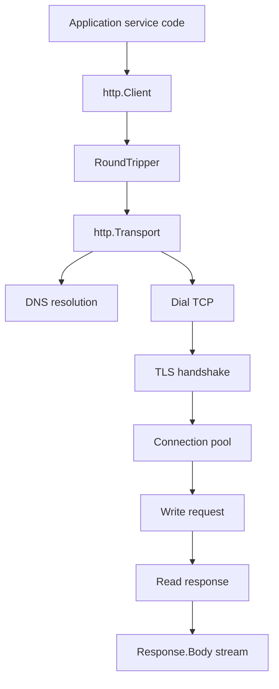
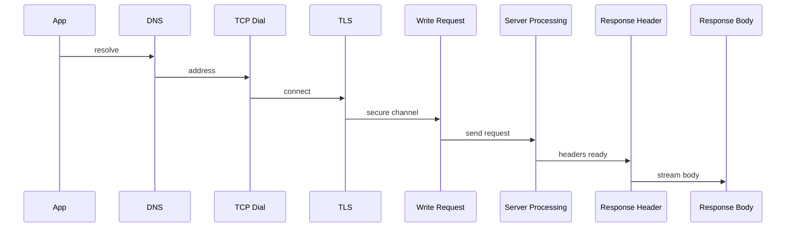
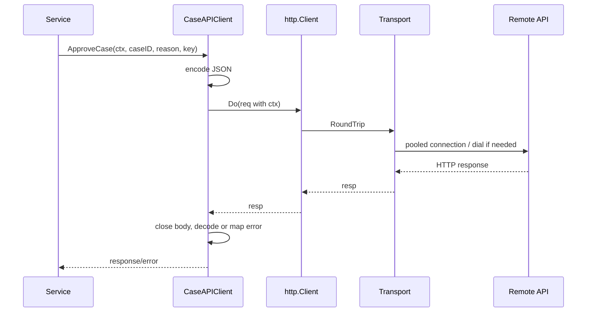

# learn-go-part-023.md

# Go HTTP Client Engineering: Transport, Connection Pooling, Retries, Idempotency, and Timeout Layering

> Seri: `learn-go`  
> Part: `023` dari `034`  
> Target pembaca: Java software engineer yang ingin naik ke level production-grade Go engineer  
> Target Go: Go 1.26.x  
> Status seri: belum selesai

---

## 0. Tujuan Part Ini

Part 022 membahas HTTP server engineering. Sekarang kita masuk sisi sebaliknya: **HTTP client engineering**.

Di production, HTTP client sering menjadi sumber masalah yang lebih berbahaya daripada HTTP server:

```text
no timeout
connection leak
response body not closed
retry storm
non-idempotent retry
connection pool exhaustion
DNS instability
TLS handshake latency
body read unbounded
wrong context propagation
incorrect error classification
no observability
```

Sebagai Java engineer, kamu mungkin terbiasa dengan:

```text
Apache HttpClient
OkHttp
Spring WebClient
RestTemplate
JDK HttpClient
connection pool
interceptor
retry policy
circuit breaker
read/connect timeout
```

Di Go, standard library `net/http` sudah sangat kuat, tetapi harus dikonfigurasi dengan benar:

```go
http.Client
http.Transport
http.Request
context.Context
Response.Body
RoundTripper
```

Target part ini:

1. memahami `http.Client` vs `http.Transport`;
2. memahami connection pooling;
3. memahami request lifecycle;
4. memahami timeout layering;
5. memahami response body close/drain;
6. memahami retry dan idempotency;
7. memahami custom `RoundTripper`;
8. memahami HTTP/1.1 vs HTTP/2 client behavior;
9. memahami streaming upload/download;
10. memahami error classification;
11. memahami observability;
12. membangun production-grade typed API client.

---

## 1. Sumber Resmi dan Rujukan Utama

Rujukan utama:

- Package `net/http`: https://pkg.go.dev/net/http
- Package `net`: https://pkg.go.dev/net
- Package `context`: https://pkg.go.dev/context
- Package `crypto/tls`: https://pkg.go.dev/crypto/tls
- Package `encoding/json`: https://pkg.go.dev/encoding/json
- Package `io`: https://pkg.go.dev/io
- Package `net/url`: https://pkg.go.dev/net/url
- Go 1.26 Release Notes: https://go.dev/doc/go1.26
- Go Blog / docs on diagnostics: https://go.dev/doc/diagnostics

Go 1.26 notes relevant to this part:

- `net/http.Client` cookie scoping behavior was improved: client uses and sets cookies scoped to URLs with host matching `Request.Host` when available.
- `net/http.ServeMux` trailing slash redirects changed to HTTP 307, server-side but relevant for client redirect behavior.
- `net/http` package documents HTTP/2 support and configuration via `Transport.Protocols` and advanced HTTP/2 configuration via `Transport.HTTP2`.
- `DefaultTransport` automatically enables HTTP/2 for HTTPS; a custom `Transport` behavior depends on configuration.

---

## 2. Mental Model Besar

### 2.1 HTTP Client Stack



### 2.2 `http.Client` Is High-Level

`http.Client` handles:

```text
redirect policy
cookies if Jar configured
timeout at high-level
calling RoundTripper
```

### 2.3 `http.Transport` Is Low-Level

`http.Transport` handles:

```text
connection pooling
dialing
TLS
proxy
HTTP/1.1 persistent connections
HTTP/2 behavior
idle connections
per-host limits
response header timeout
expect-continue timeout
```

### 2.4 Reuse Client, Do Not Create Per Request

Bad:

```go
func Call() error {
    client := &http.Client{}
    resp, err := client.Get(url)
    ...
}
```

Better:

```go
var client = &http.Client{
    Transport: configuredTransport(),
    Timeout:   10 * time.Second,
}
```

Or inject client into service.

Creating clients/transports per request prevents connection reuse and can exhaust resources.

---

## 3. `http.Client`

### 3.1 Basic Use

```go
resp, err := http.Get("https://example.com")
```

Convenient but not production default because it uses default client/transport and you cannot easily control all settings.

Production:

```go
client := &http.Client{
    Timeout: 10 * time.Second,
}
```

### 3.2 Client Timeout

```go
client := &http.Client{
    Timeout: 10 * time.Second,
}
```

This is an overall timeout for the entire request, including:

- connection time;
- redirects;
- reading response body.

It is blunt but useful as safety net.

### 3.3 Redirect Policy

```go
client := &http.Client{
    CheckRedirect: func(req *http.Request, via []*http.Request) error {
        if len(via) >= 5 {
            return errors.New("too many redirects")
        }
        return nil
    },
}
```

Security warning:

- redirects can change host;
- authorization headers may be stripped or preserved depending rules;
- do not blindly follow redirects for sensitive internal clients.

### 3.4 Cookie Jar

```go
jar, err := cookiejar.New(nil)
client := &http.Client{Jar: jar}
```

Most backend service-to-service clients do not need cookie jar. Browser-like clients may.

Go 1.26 changed cookie scoping behavior around `Request.Host`; understand if your client sets custom Host header and uses cookies.

---

## 4. `http.Transport`

### 4.1 Configured Transport

Example production baseline:

```go
func NewTransport() *http.Transport {
    return &http.Transport{
        Proxy: http.ProxyFromEnvironment,

        DialContext: (&net.Dialer{
            Timeout:   3 * time.Second,
            KeepAlive: 30 * time.Second,
        }).DialContext,

        TLSHandshakeTimeout:   3 * time.Second,
        ResponseHeaderTimeout: 5 * time.Second,
        ExpectContinueTimeout: 1 * time.Second,

        MaxIdleConns:        100,
        MaxIdleConnsPerHost: 20,
        MaxConnsPerHost:     100,
        IdleConnTimeout:     90 * time.Second,
    }
}
```

### 4.2 Important Fields

| Field | Meaning |
|---|---|
| `Proxy` | proxy function |
| `DialContext` | TCP connect behavior |
| `TLSHandshakeTimeout` | max TLS handshake time |
| `ResponseHeaderTimeout` | wait for response headers after request written |
| `ExpectContinueTimeout` | wait for `100-continue` |
| `MaxIdleConns` | total idle pool size |
| `MaxIdleConnsPerHost` | idle connections per host |
| `MaxConnsPerHost` | total connections per host |
| `IdleConnTimeout` | idle conn lifetime |
| `DisableKeepAlives` | disables connection reuse |
| `ForceAttemptHTTP2` | older way to force HTTP/2 attempt in some configs |
| `Protocols` | configure HTTP/1, HTTP/2, unencrypted HTTP/2 support in modern Go |
| `HTTP2` | advanced HTTP/2 configuration in modern Go |

### 4.3 Do Not Mutate Transport After Use

Treat `Transport` as immutable after first request.

If you need different configs, create separate transports/clients at startup.

### 4.4 Close Idle Connections

During shutdown or config reload:

```go
client.CloseIdleConnections()
```

or:

```go
transport.CloseIdleConnections()
```

This does not close active in-use connections.

---

## 5. Connection Pooling

### 5.1 Why Pooling Matters

HTTP client connection setup may include:

```text
DNS lookup
TCP handshake
TLS handshake
HTTP/2 setup
```

Pooling avoids repeating this per request.

### 5.2 Response Body Must Be Closed

Critical rule:

```go
resp, err := client.Do(req)
if err != nil {
    return err
}
defer resp.Body.Close()
```

If you do not close body, connection cannot be reused and resources leak.

### 5.3 Drain or Not Drain?

For connection reuse, response body generally needs to be read to EOF and closed.

If body is small:

```go
defer resp.Body.Close()
data, err := io.ReadAll(resp.Body)
```

If you do not need body but want reuse:

```go
io.Copy(io.Discard, resp.Body)
resp.Body.Close()
```

But never drain unbounded huge body blindly.

Safer bounded drain:

```go
func closeBody(resp *http.Response) {
    if resp == nil || resp.Body == nil {
        return
    }
    _, _ = io.CopyN(io.Discard, resp.Body, 64<<10)
    _ = resp.Body.Close()
}
```

Trade-off:

- draining helps reuse;
- draining huge/error body can waste bandwidth/time;
- closing without drain may close connection.

### 5.4 Pool Exhaustion

Symptoms:

- requests hang waiting for connection;
- goroutines blocked in transport;
- high latency;
- low throughput;
- many idle/active conns;
- MaxConnsPerHost too low or body leak.

Root causes:

- response body not closed;
- slow downstream;
- no timeout;
- MaxConnsPerHost too low;
- retry storm;
- long streaming responses occupying pool;
- HTTP/2 stream limits.

---

## 6. Request Construction

### 6.1 Use `NewRequestWithContext`

```go
req, err := http.NewRequestWithContext(ctx, http.MethodGet, url, nil)
if err != nil {
    return err
}
```

Do not create request without context then forget to attach.

### 6.2 Headers

```go
req.Header.Set("Accept", "application/json")
req.Header.Set("User-Agent", "case-service/1.0")
```

For auth:

```go
req.Header.Set("Authorization", "Bearer "+token)
```

Never log token.

### 6.3 Query Parameters

```go
u, err := url.Parse(baseURL)
if err != nil {
    return err
}

q := u.Query()
q.Set("status", "submitted")
q.Set("limit", strconv.Itoa(limit))
u.RawQuery = q.Encode()
```

Avoid manual string concatenation.

### 6.4 JSON Body

```go
var buf bytes.Buffer

if err := json.NewEncoder(&buf).Encode(reqBody); err != nil {
    return err
}

req, err := http.NewRequestWithContext(ctx, http.MethodPost, endpoint, &buf)
if err != nil {
    return err
}

req.Header.Set("Content-Type", "application/json")
req.Header.Set("Accept", "application/json")
```

For large body, stream instead of buffering.

---

## 7. Response Handling

### 7.1 Check Status Code

```go
if resp.StatusCode < 200 || resp.StatusCode >= 300 {
    return handleErrorResponse(resp)
}
```

### 7.2 Limit Error Body

```go
func readLimitedBody(r io.Reader, limit int64) ([]byte, error) {
    return io.ReadAll(io.LimitReader(r, limit))
}
```

Use for error response to avoid huge memory.

### 7.3 Decode JSON

```go
dec := json.NewDecoder(resp.Body)
var out Response
if err := dec.Decode(&out); err != nil {
    return Response{}, err
}
```

If strict external API needed, validate unknown fields depending compatibility. For client decoding, `DisallowUnknownFields` can be too strict if server adds fields.

### 7.4 Empty Body

Some status codes have no body:

```text
204 No Content
304 Not Modified
```

Handle explicitly.

### 7.5 Error Body Shape

External APIs may return structured error.

```go
type APIError struct {
    StatusCode int
    Code       string
    Message    string
    Body       string
}
```

Implement:

```go
func (e *APIError) Error() string {
    return fmt.Sprintf("api error status=%d code=%s", e.StatusCode, e.Code)
}
```

Do not include sensitive body in Error unless safe.

---

## 8. Timeout Layering

### 8.1 Timeout Types

HTTP client has multiple phases:



Timeout knobs:

| Phase | Mechanism |
|---|---|
| total operation | context timeout or `Client.Timeout` |
| TCP connect | `net.Dialer.Timeout` |
| TLS handshake | `Transport.TLSHandshakeTimeout` |
| response header wait | `Transport.ResponseHeaderTimeout` |
| expect continue | `ExpectContinueTimeout` |
| body read | context/client timeout or manual deadline at lower layer |
| idle connection | `IdleConnTimeout` |

### 8.2 Recommended Baseline

Use context deadline per operation plus transport phase timeouts.

```go
ctx, cancel := context.WithTimeout(parent, 5*time.Second)
defer cancel()

req, err := http.NewRequestWithContext(ctx, method, url, body)
```

Transport:

```go
DialContext timeout: 2s
TLSHandshakeTimeout: 2s
ResponseHeaderTimeout: 3s
```

Client Timeout can be safety net:

```go
client.Timeout = 10 * time.Second
```

Avoid contradictory values that make debugging hard.

### 8.3 Per-Retry Timeout

If retrying, each attempt needs budget.

Bad:

```go
for i := 0; i < 3; i++ {
    attemptCtx, cancel := context.WithTimeout(parent, 5*time.Second)
    ...
}
```

Total can become 15s+.

Better:

```go
ctx, cancel := context.WithTimeout(parent, 5*time.Second)
defer cancel()

// retries share total ctx
```

Then optionally per-attempt cap bounded by remaining total budget.

---

## 9. Retries

### 9.1 Retry Is Dangerous

Retries can:

- duplicate side effects;
- amplify outages;
- overload downstream;
- hide latency;
- violate ordering;
- create retry storms.

Retry only when:

```text
operation is idempotent or has idempotency key
error is retryable
budget remains
attempt count bounded
backoff+jitter used
observability exists
```

### 9.2 Retryable Conditions

Often retryable:

- timeout before response;
- connection reset before response;
- temporary network failure;
- HTTP 502/503/504;
- HTTP 429 with `Retry-After`;
- some 409 depending API.

Usually not retryable:

- 400;
- 401/403;
- 404 for stable lookup;
- validation error;
- non-idempotent POST without idempotency key;
- response body decode error after server processed successfully unless API contract says safe.

### 9.3 Idempotency

GET, HEAD, OPTIONS are generally safe/idempotent by HTTP semantics.

PUT/DELETE are idempotent by semantics but still can have business side effects.

POST is not idempotent unless designed.

For POST, use idempotency key:

```go
req.Header.Set("Idempotency-Key", key)
```

Server must support it. Client header alone does nothing.

### 9.4 Retry Loop

```go
type RetryPolicy struct {
    MaxAttempts int
    BaseDelay   time.Duration
    MaxDelay    time.Duration
}

func (p RetryPolicy) Delay(attempt int) time.Duration {
    d := p.BaseDelay * time.Duration(1<<(attempt-1))
    if d > p.MaxDelay {
        d = p.MaxDelay
    }
    // Add jitter in real production.
    return d
}
```

Attempt:

```go
func DoWithRetry(ctx context.Context, client *http.Client, build func(context.Context) (*http.Request, error), policy RetryPolicy) (*http.Response, error) {
    var last error

    for attempt := 1; attempt <= policy.MaxAttempts; attempt++ {
        req, err := build(ctx)
        if err != nil {
            return nil, err
        }

        resp, err := client.Do(req)
        if err == nil && !shouldRetryStatus(resp.StatusCode) {
            return resp, nil
        }

        if resp != nil {
            closeBody(resp)
        }

        if err != nil {
            last = err
        } else {
            last = fmt.Errorf("retryable status: %d", resp.StatusCode)
        }

        if attempt == policy.MaxAttempts {
            break
        }

        delay := policy.Delay(attempt)

        timer := time.NewTimer(delay)
        select {
        case <-timer.C:
        case <-ctx.Done():
            if !timer.Stop() {
                <-timer.C
            }
            return nil, ctx.Err()
        }
    }

    return nil, last
}
```

### 9.5 Body Replay Problem

Request body may not be reusable.

If body is `io.Reader` consumed once, retry cannot resend unless you can recreate body.

Good build pattern:

```go
build := func(ctx context.Context) (*http.Request, error) {
    var buf bytes.Buffer
    if err := json.NewEncoder(&buf).Encode(payload); err != nil {
        return nil, err
    }
    return http.NewRequestWithContext(ctx, http.MethodPost, endpoint, &buf)
}
```

For large streaming body, retry may not be feasible unless source supports seek/reopen.

### 9.6 Retry-After

For 429/503:

```go
ra := resp.Header.Get("Retry-After")
```

Can be seconds or HTTP date. Parse carefully.

Bound it by your max delay and context deadline.

---

## 10. Idempotency and Side Effects

### 10.1 Ambiguous Result

If client times out after sending request, server may have processed it.

```text
client writes POST
server commits transaction
network breaks before response
client sees timeout
```

Retry can duplicate side effect.

### 10.2 Idempotency Key Pattern

Client:

```go
req.Header.Set("Idempotency-Key", key)
```

Server:

```text
stores key + request hash + result
replays same result for duplicate key
rejects same key with different request hash
expires keys after retention period
```

### 10.3 Client Responsibility

Generate stable key for logical operation:

```go
key := "approve-case:" + caseID + ":" + commandID
```

Do not use random key per retry. That defeats idempotency.

### 10.4 Retry Matrix

| Method/Operation | Retry Default |
|---|---|
| GET lookup | yes for transient |
| POST create without key | no |
| POST create with idempotency key | yes for transient |
| PUT replace | maybe |
| DELETE | maybe, if API semantics support |
| payment/approval side effect | only with strong idempotency |

---

## 11. Custom RoundTripper

### 11.1 What Is RoundTripper?

```go
type RoundTripper interface {
    RoundTrip(*Request) (*Response, error)
}
```

`Transport` implements `RoundTripper`.

Middleware-like client behavior can wrap RoundTripper.

### 11.2 Header Injection

```go
type HeaderRoundTripper struct {
    Base http.RoundTripper
    Key  string
    Val  string
}

func (rt HeaderRoundTripper) RoundTrip(req *http.Request) (*http.Response, error) {
    clone := req.Clone(req.Context())
    clone.Header.Set(rt.Key, rt.Val)

    base := rt.Base
    if base == nil {
        base = http.DefaultTransport
    }

    return base.RoundTrip(clone)
}
```

Do not mutate request in-place if it may be reused or observed elsewhere.

### 11.3 Logging RoundTripper

```go
type LoggingRoundTripper struct {
    Base   http.RoundTripper
    Logger *slog.Logger
}

func (rt LoggingRoundTripper) RoundTrip(req *http.Request) (*http.Response, error) {
    start := time.Now()

    base := rt.Base
    if base == nil {
        base = http.DefaultTransport
    }

    resp, err := base.RoundTrip(req)

    status := 0
    if resp != nil {
        status = resp.StatusCode
    }

    rt.Logger.Info("http client request",
        "method", req.Method,
        "host", req.URL.Host,
        "path", req.URL.Path,
        "status", status,
        "duration_ms", time.Since(start).Milliseconds(),
        "err", err,
    )

    return resp, err
}
```

Do not log query strings if they may contain secrets.

### 11.4 Metrics RoundTripper

Track:

- duration;
- status;
- error category;
- in-flight;
- response size if known;
- retry count outside transport.

### 11.5 Auth RoundTripper

Token injection:

```go
type BearerTokenRoundTripper struct {
    Base  http.RoundTripper
    Token func(context.Context) (string, error)
}

func (rt BearerTokenRoundTripper) RoundTrip(req *http.Request) (*http.Response, error) {
    token, err := rt.Token(req.Context())
    if err != nil {
        return nil, err
    }

    clone := req.Clone(req.Context())
    clone.Header.Set("Authorization", "Bearer "+token)

    base := rt.Base
    if base == nil {
        base = http.DefaultTransport
    }

    return base.RoundTrip(clone)
}
```

---

## 12. HTTP/1.1 and HTTP/2

### 12.1 HTTP/1.1

HTTP/1.1 uses persistent connections but one in-flight request per connection unless pipelining, which Go client does not generally use for application behavior.

Connection pool per host matters.

### 12.2 HTTP/2

HTTP/2 multiplexes streams over a connection.

Implications:

- fewer TCP connections;
- concurrent streams;
- different head-of-line behavior at application layer;
- stream limits matter;
- connection-level failure can affect many streams.

### 12.3 Go Support

`net/http` has transparent HTTP/2 support. `DefaultTransport` automatically enables HTTP/2 for HTTPS. Modern Go exposes `Transport.Protocols` and `Transport.HTTP2` for enabling/disabling/configuring protocols.

For most applications:

```text
use default HTTP/2 behavior unless you have evidence to change it
```

### 12.4 When HTTP/2 Matters

- high concurrency to same host;
- gRPC;
- long-lived streams;
- proxy/load balancer compatibility;
- stream limits;
- head-of-line issues;
- connection reuse behavior.

---

## 13. Streaming Download

### 13.1 Download to Writer

```go
func Download(ctx context.Context, client *http.Client, url string, dst io.Writer, maxBytes int64) error {
    req, err := http.NewRequestWithContext(ctx, http.MethodGet, url, nil)
    if err != nil {
        return err
    }

    resp, err := client.Do(req)
    if err != nil {
        return err
    }
    defer resp.Body.Close()

    if resp.StatusCode != http.StatusOK {
        return handleErrorResponse(resp)
    }

    r := io.LimitReader(resp.Body, maxBytes+1)
    n, err := io.Copy(dst, r)
    if err != nil {
        return err
    }
    if n > maxBytes {
        return errors.New("response too large")
    }

    return nil
}
```

### 13.2 Content-Length

Check if present:

```go
if resp.ContentLength > maxBytes {
    return errors.New("response too large")
}
```

But `ContentLength` can be -1 or dishonest. Still enforce during read.

### 13.3 Hash While Download

```go
h := sha256.New()
mw := io.MultiWriter(dst, h)
_, err := io.Copy(mw, resp.Body)
sum := h.Sum(nil)
```

---

## 14. Streaming Upload

### 14.1 Upload Reader

```go
req, err := http.NewRequestWithContext(ctx, http.MethodPut, url, body)
```

If `body` is streaming, retry may not be possible.

### 14.2 Content Length

Set if known:

```go
req.ContentLength = size
```

Some servers require it.

### 14.3 Multipart Upload

Use `mime/multipart`, but avoid buffering huge file into memory.

Use `io.Pipe` to stream multipart if needed.

Caveat: `io.Pipe` can leak/block if HTTP request fails and writer goroutine does not observe error/cancellation.

---

## 15. Production Typed API Client

### 15.1 Client Struct

```go
type CaseAPIClient struct {
    baseURL *url.URL
    client  *http.Client
    logger  *slog.Logger
}

func NewCaseAPIClient(base string, client *http.Client, logger *slog.Logger) (*CaseAPIClient, error) {
    u, err := url.Parse(base)
    if err != nil {
        return nil, err
    }
    if u.Scheme != "https" && u.Scheme != "http" {
        return nil, errors.New("unsupported scheme")
    }

    if client == nil {
        client = NewDefaultHTTPClient()
    }

    return &CaseAPIClient{
        baseURL: u,
        client:  client,
        logger:  logger,
    }, nil
}
```

### 15.2 Default Client

```go
func NewDefaultHTTPClient() *http.Client {
    tr := &http.Transport{
        Proxy: http.ProxyFromEnvironment,
        DialContext: (&net.Dialer{
            Timeout:   3 * time.Second,
            KeepAlive: 30 * time.Second,
        }).DialContext,
        TLSHandshakeTimeout:   3 * time.Second,
        ResponseHeaderTimeout: 5 * time.Second,
        ExpectContinueTimeout: 1 * time.Second,
        MaxIdleConns:          100,
        MaxIdleConnsPerHost:   20,
        MaxConnsPerHost:       100,
        IdleConnTimeout:       90 * time.Second,
    }

    return &http.Client{
        Transport: tr,
        Timeout:   10 * time.Second,
    }
}
```

### 15.3 Build URL

```go
func (c *CaseAPIClient) endpoint(path string) string {
    u := *c.baseURL
    u.Path = strings.TrimRight(c.baseURL.Path, "/") + path
    return u.String()
}
```

Be careful with path escaping for dynamic segments:

```go
path := "/cases/" + url.PathEscape(caseID)
```

### 15.4 Approve Request

```go
type ApproveCaseRequest struct {
    Reason string `json:"reason"`
}

type ApproveCaseResponse struct {
    CaseID string `json:"case_id"`
    Status string `json:"status"`
}

func (c *CaseAPIClient) ApproveCase(ctx context.Context, caseID string, reason string, idempotencyKey string) (ApproveCaseResponse, error) {
    body := ApproveCaseRequest{Reason: reason}

    var buf bytes.Buffer
    if err := json.NewEncoder(&buf).Encode(body); err != nil {
        return ApproveCaseResponse{}, err
    }

    endpoint := c.endpoint("/cases/" + url.PathEscape(caseID) + "/approve")

    req, err := http.NewRequestWithContext(ctx, http.MethodPost, endpoint, &buf)
    if err != nil {
        return ApproveCaseResponse{}, err
    }

    req.Header.Set("Content-Type", "application/json")
    req.Header.Set("Accept", "application/json")
    if idempotencyKey != "" {
        req.Header.Set("Idempotency-Key", idempotencyKey)
    }

    resp, err := c.client.Do(req)
    if err != nil {
        return ApproveCaseResponse{}, classifyClientError(err)
    }
    defer resp.Body.Close()

    if resp.StatusCode < 200 || resp.StatusCode >= 300 {
        return ApproveCaseResponse{}, decodeAPIError(resp)
    }

    var out ApproveCaseResponse
    if err := json.NewDecoder(resp.Body).Decode(&out); err != nil {
        return ApproveCaseResponse{}, fmt.Errorf("decode approve response: %w", err)
    }

    return out, nil
}
```

### 15.5 API Error Decode

```go
func decodeAPIError(resp *http.Response) error {
    defer io.Copy(io.Discard, io.LimitReader(resp.Body, 64<<10))

    data, err := io.ReadAll(io.LimitReader(resp.Body, 64<<10))
    if err != nil {
        return &APIError{StatusCode: resp.StatusCode, Message: "read error response failed"}
    }

    var er ErrorResponse
    if err := json.Unmarshal(data, &er); err == nil && er.Error.Code != "" {
        return &APIError{
            StatusCode: resp.StatusCode,
            Code:       er.Error.Code,
            Message:    er.Error.Message,
        }
    }

    return &APIError{
        StatusCode: resp.StatusCode,
        Message:    string(data),
    }
}
```

Careful: the deferred drain after `ReadAll` is mostly redundant here because body is already consumed up to limit; if body is larger than limit, drain may not consume all. Choose clear policy:

- read bounded and close;
- or drain bounded for reuse;
- do not unbounded drain.

### 15.6 Client Diagram



---

## 16. Error Classification

### 16.1 Transport Error vs HTTP Error

`client.Do` returns error for transport-level failure:

```text
DNS failure
dial failure
TLS failure
context canceled
connection reset before response
protocol error
```

HTTP 500 is not `client.Do` error. It is a response with status code.

### 16.2 Classify Transport Error

```go
func classifyClientError(err error) error {
    if errors.Is(err, context.Canceled) {
        return err
    }
    if errors.Is(err, context.DeadlineExceeded) {
        return err
    }

    var urlErr *url.Error
    if errors.As(err, &urlErr) {
        var ne net.Error
        if errors.As(urlErr.Err, &ne) && ne.Timeout() {
            return fmt.Errorf("network timeout: %w", err)
        }
    }

    return fmt.Errorf("http transport error: %w", err)
}
```

### 16.3 HTTP Status Classification

```go
func shouldRetryStatus(status int) bool {
    switch status {
    case http.StatusTooManyRequests,
        http.StatusBadGateway,
        http.StatusServiceUnavailable,
        http.StatusGatewayTimeout:
        return true
    default:
        return false
    }
}
```

### 16.4 Preserve Wrapping

Always `%w` so callers can inspect.

---

## 17. Observability

### 17.1 Metrics

Track:

```text
outbound_http_requests_total{target,method,status_class}
outbound_http_request_duration_seconds{target,method}
outbound_http_errors_total{target,error_type}
outbound_http_retries_total{target}
outbound_http_in_flight{target}
outbound_http_response_bytes
outbound_http_timeout_total
```

Avoid path with IDs as metric labels.

Use route/template or target operation.

### 17.2 Logs

Log:

```text
target service
method
path template / operation
status
duration
attempt
error category
request id / trace id
```

Do not log:

- Authorization header;
- cookies;
- full query if secrets;
- raw body;
- tokens.

### 17.3 Tracing

Use request context for trace propagation.

RoundTripper instrumentation often injects trace headers.

### 17.4 httptrace

Standard package `net/http/httptrace` can trace DNS, connect, TLS, got first byte phases.

Useful for debugging latency decomposition.

---

## 18. Testing HTTP Clients

### 18.1 `httptest.Server`

```go
srv := httptest.NewServer(http.HandlerFunc(func(w http.ResponseWriter, r *http.Request) {
    w.Header().Set("Content-Type", "application/json")
    _, _ = io.WriteString(w, `{"case_id":"C-1","status":"APPROVED"}`)
}))
defer srv.Close()

client, _ := NewCaseAPIClient(srv.URL, srv.Client(), slog.Default())
```

### 18.2 Fake RoundTripper

```go
type roundTripFunc func(*http.Request) (*http.Response, error)

func (f roundTripFunc) RoundTrip(r *http.Request) (*http.Response, error) {
    return f(r)
}
```

Use:

```go
client := &http.Client{
    Transport: roundTripFunc(func(req *http.Request) (*http.Response, error) {
        return &http.Response{
            StatusCode: http.StatusOK,
            Body: io.NopCloser(strings.NewReader(`{"ok":true}`)),
            Header: make(http.Header),
        }, nil
    }),
}
```

### 18.3 Test Body Close

Use custom body that records close.

```go
type trackingBody struct {
    io.Reader
    closed bool
}

func (b *trackingBody) Close() error {
    b.closed = true
    return nil
}
```

### 18.4 Test Retry

Fake server:

- first request 503;
- second request 200;
- assert idempotency key reused;
- assert attempts count.

### 18.5 Test Timeout

Server sleeps longer than context timeout.

```go
srv := httptest.NewServer(http.HandlerFunc(func(w http.ResponseWriter, r *http.Request) {
    time.Sleep(time.Second)
}))
```

Client context 10ms.

---

## 19. Common Anti-Patterns

### 19.1 New Client Per Request

Kills pooling.

### 19.2 No Timeout

Can hang forever.

### 19.3 Not Closing Response Body

Leaks connections and goroutines.

### 19.4 Unbounded Error Body Read

DoS/memory risk.

### 19.5 Retrying POST Without Idempotency

Duplicate side effects.

### 19.6 Retrying Without Backoff

Retry storm.

### 19.7 Ignoring Context

No cancellation propagation.

### 19.8 Manual URL Concatenation

Encoding bugs and injection.

### 19.9 Logging Secrets

Auth headers, cookies, query tokens.

### 19.10 Mutating Request in RoundTripper

Clone request before modifying.

### 19.11 Sharing Mutable Request Body Across Retries

Body consumed once.

### 19.12 Overly Strict Decode Against External API

`DisallowUnknownFields` may break when external API adds fields.

---

## 20. Practical Commands

### curl Equivalent

```bash
curl -v --max-time 5 https://example.com
```

### Test

```bash
go test ./...
go test -race ./...
```

### Benchmark Client Code

```bash
go test -bench=. -benchmem ./...
```

### pprof Goroutine

```bash
curl http://localhost:6060/debug/pprof/goroutine?debug=2
```

Look for many goroutines blocked in `net/http.(*Transport)` or body reads.

### Trace

```bash
go test -trace trace.out ./...
go tool trace trace.out
```

---

## 21. Hands-On Labs

### Lab 1: Configured Client

Create `http.Client` with custom `Transport`:

- Dial timeout;
- TLS handshake timeout;
- response header timeout;
- connection pool settings.

### Lab 2: Body Close Leak

Write client that forgets `resp.Body.Close`.

Hit httptest server many times.

Observe connection/goroutine symptoms.

Fix it.

### Lab 3: Timeout Layering

Create server that delays:

- before header;
- during body.

Test `ResponseHeaderTimeout`, context timeout, and `Client.Timeout`.

### Lab 4: Retry with Idempotency

Implement retry for POST with idempotency key.

Fake server returns 503 then 200.

Assert same idempotency key across attempts.

### Lab 5: Error Body Limit

Server returns 10 MB error body.

Client reads max 64 KB.

Verify memory bounded.

### Lab 6: RoundTripper Middleware

Implement RoundTripper for:

- request ID header;
- metrics;
- logging.

Ensure it clones request before mutation.

### Lab 7: Streaming Download

Download large response to file with max bytes and SHA-256.

Do not load all into memory.

### Lab 8: httptrace

Use `net/http/httptrace` to log DNS, connect, TLS, first byte timings.

---

## 22. Review Questions

1. Apa perbedaan `http.Client` dan `http.Transport`?
2. Kenapa client/transport harus direuse?
3. Apa akibat tidak menutup `resp.Body`?
4. Kapan perlu drain body?
5. Apa risiko drain unbounded?
6. Apa fungsi `MaxIdleConnsPerHost`?
7. Apa fungsi `MaxConnsPerHost`?
8. Apa beda connect timeout dan response header timeout?
9. Apa beda context timeout dan `Client.Timeout`?
10. Kenapa retry bisa berbahaya?
11. Apa itu idempotency key?
12. Kenapa body replay menjadi masalah saat retry?
13. Apa itu `RoundTripper`?
14. Kenapa request harus di-clone di RoundTripper?
15. Apa beda transport error dan HTTP error status?
16. Status HTTP apa yang sering retryable?
17. Kenapa POST tidak boleh diretry sembarangan?
18. Bagaimana membatasi error response body?
19. Apa kegunaan `httptest.Server` untuk client test?
20. Apa fitur HTTP/2 client yang perlu dipahami?

---

## 23. Code Review Checklist

Saat review HTTP client code:

```text
[ ] Apakah http.Client direuse?
[ ] Apakah Transport dikonfigurasi eksplisit?
[ ] Apakah timeout tersedia di context/client/transport?
[ ] Apakah request dibuat dengan NewRequestWithContext?
[ ] Apakah URL dibangun dengan net/url, bukan string raw?
[ ] Apakah response body selalu ditutup?
[ ] Apakah body dibaca/drain secara bounded jika perlu?
[ ] Apakah status code dicek?
[ ] Apakah error body dibatasi?
[ ] Apakah retry hanya untuk retryable error/status?
[ ] Apakah retry memakai backoff+jitter?
[ ] Apakah non-idempotent operation memakai idempotency key?
[ ] Apakah request body bisa direplay untuk retry?
[ ] Apakah RoundTripper tidak mutate request in-place?
[ ] Apakah secrets tidak dilog?
[ ] Apakah metrics/log/tracing ada?
[ ] Apakah HTTP/2 behavior dipahami untuk target?
[ ] Apakah tests memakai httptest/fake RoundTripper?
```

---

## 24. Invariants

Pegang invariant berikut:

```text
Reuse http.Client and Transport.
Transport owns connection pooling.
Response.Body must be closed.
HTTP status >= 400 is still a response, not Do error.
Client.Do error means transport/protocol/cancellation failure.
Timeouts must be layered intentionally.
Context timeout should represent operation budget.
Connect timeout is not response timeout.
Retry requires idempotency, bounded attempts, backoff, and classification.
Request body may not be replayable.
RoundTripper is client-side middleware.
Clone request before mutating in RoundTripper.
Limit response bodies from untrusted servers.
Do not log secrets.
HTTP/2 changes connection and concurrency behavior.
```

---

## 25. Ringkasan

HTTP client production di Go adalah tentang controlling lifecycle and failure.

Kode ini mudah:

```go
resp, err := http.Get(url)
```

Tetapi production client yang matang harus menjawab:

```text
How long can this call take?
Can it be canceled?
How many connections can it use?
Is the body always closed?
Can this be retried safely?
What if server returns huge error body?
What if DNS fails?
What if TLS handshake hangs?
What if response header never arrives?
What if body stream is slow?
How is it observed?
```

Sebagai Java engineer, jangan mencari framework dulu. Pahami `http.Client` dan `http.Transport`. Banyak masalah yang di Java disembunyikan di library HTTP client, di Go harus kamu konfigurasi secara eksplisit.

Bug HTTP client production paling umum:

- no timeout;
- new client per request;
- response body leak;
- retry non-idempotent POST;
- retry storm;
- unbounded error body read;
- context tidak dipakai;
- pool setting tidak sesuai;
- logging secrets;
- tidak membedakan transport error vs HTTP status.

Jika kamu menguasai part ini, kamu siap masuk ke serialization part berikutnya.

---

## 26. Posisi Kita di Seri

Kita sudah menyelesaikan:

```text
000 - Orientation and Mental Model
001 - Toolchain, Workspace, Module, Build
002 - Syntax Core
003 - Functions
004 - Types
005 - Composition
006 - Interfaces
007 - Generics
008 - Error Handling
009 - Package Design
010 - Modules and Dependency Management
011 - Standard Library Mental Model
012 - Slices, Arrays, and Maps
013 - Memory Model for Application Engineers
014 - Runtime Deep Dive
015 - Go Garbage Collector
016 - Concurrency Primitives
017 - Concurrency Patterns
018 - Shared Memory Concurrency
019 - Context Propagation
020 - File, Stream, and Filesystem I/O
021 - Networking Fundamentals
022 - HTTP Server Engineering
023 - HTTP Client Engineering
```

Berikutnya:

```text
024 - Serialization:
      JSON, XML, Binary Encoding, Streaming Decode, Custom Marshalers, and Schema Evolution
```

Status seri: **belum selesai**.

<!-- NAVIGATION_FOOTER -->
<div class="page-nav">
<a href="./learn-go-part-022.md">⬅️ Go HTTP Server Engineering: net/http, Routing, Middleware, Timeouts, Graceful Shutdown, and Request Body Discipline</a>
<a href="./index.md">📚 Kategori</a>
<a href="../../index.md">🏠 Home</a>
<a href="./learn-go-part-024.md">Go Serialization: JSON, XML, Binary Encoding, Streaming Decode, Custom Marshalers, and Schema Evolution ➡️</a>
</div>
