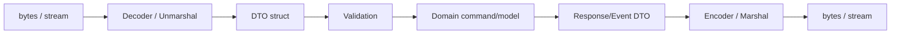
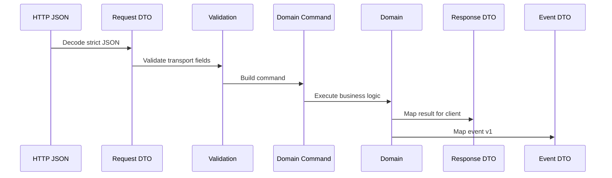

# learn-go-part-024.md

# Go Serialization: JSON, XML, Binary Encoding, Streaming Decode, Custom Marshalers, and Schema Evolution

> Seri: `learn-go`  
> Part: `024` dari `034`  
> Target pembaca: Java software engineer yang ingin naik ke level production-grade Go engineer  
> Target Go: Go 1.26.x  
> Status seri: belum selesai

---

## 0. Tujuan Part Ini

Part 020 sampai 023 membangun fondasi I/O, networking, HTTP server, dan HTTP client. Sekarang kita masuk ke serialization: mengubah data in-memory menjadi bytes/text dan sebaliknya.

Di service production, serialization muncul di hampir semua boundary:

```text
HTTP JSON request/response
event payload
database JSON column
audit metadata
config file
CSV export
XML integration
binary protocol
cache value
message queue payload
object storage artifact
```

Sebagai Java engineer, kamu mungkin terbiasa dengan:

```text
Jackson
Gson
JAXB
Java serialization
Protobuf
Avro
Kryo
ObjectMapper modules
@JsonProperty
@JsonCreator
@JsonIgnore
custom serializer/deserializer
```

Di Go, standard library menyediakan:

```go
encoding/json
encoding/xml
encoding/binary
encoding/csv
encoding/gob
encoding
```

Dan pola Go cenderung lebih eksplisit:

```text
DTO struct
struct tags
custom MarshalJSON / UnmarshalJSON
streaming Decoder / Encoder
explicit validation after decode
explicit schema compatibility policy
```

Target part ini:

1. memahami JSON mapping di Go;
2. memahami `Marshal`, `Unmarshal`, `Encoder`, `Decoder`;
3. memahami struct tags;
4. memahami zero value, missing field, null, pointer, optional field;
5. memahami unknown field dan strict decode;
6. memahami custom marshaler/unmarshaler;
7. memahami streaming decode/encode;
8. memahami number precision;
9. memahami time serialization;
10. memahami XML basics dan pitfalls;
11. memahami binary encoding;
12. memahami schema evolution;
13. memahami security/performance failure mode;
14. membangun production DTO boundary.

---

## 1. Sumber Resmi dan Rujukan Utama

Rujukan utama:

- Package `encoding/json`: https://pkg.go.dev/encoding/json
- Package `encoding/xml`: https://pkg.go.dev/encoding/xml
- Package `encoding/binary`: https://pkg.go.dev/encoding/binary
- Package `encoding`: https://pkg.go.dev/encoding
- Package `encoding/csv`: https://pkg.go.dev/encoding/csv
- Package `time`: https://pkg.go.dev/time
- Package `io`: https://pkg.go.dev/io
- Go Blog: JSON and Go: https://go.dev/blog/json
- Go 1.26 Release Notes: https://go.dev/doc/go1.26
- Experimental `encoding/json/v2`: https://pkg.go.dev/encoding/json/v2
- Experimental `encoding/json/jsontext`: https://pkg.go.dev/encoding/json/jsontext
- Go Blog: A new experimental Go API for JSON: https://go.dev/blog/jsonv2-exp

Catatan Go 1.26:

- `encoding/json` v1 tetap package stabil yang paling umum dipakai.
- Go 1.25 memperkenalkan experimental `encoding/json/v2` dan `encoding/json/jsontext`; di Go 1.26 konteks experimental ini masih perlu diperlakukan hati-hati untuk production API stabil.
- Part ini fokus pada `encoding/json` v1 sebagai baseline production compatibility, sambil memberi awareness terhadap JSON v2 sebagai arah evolusi.

---

## 2. Mental Model Besar

### 2.1 Serialization Is Boundary Design

Serialization bukan hanya “convert struct ke JSON”.

Serialization menentukan contract antar sistem:

```text
field name
type
nullability
missing field behavior
default value
enum representation
time format
number precision
unknown field tolerance
backward compatibility
forward compatibility
error format
schema version
```

Jika contract ini tidak jelas, bug akan muncul saat:

- client lama bicara dengan server baru;
- server baru membaca event lama;
- field baru ditambahkan;
- field lama dihapus;
- null dikirim padahal Go field non-pointer;
- angka besar kehilangan presisi;
- timezone berubah;
- unknown field diabaikan padahal typo;
- body besar menyebabkan memory spike.

### 2.2 DTO Boundary

Production Go biasanya memisahkan:

```text
transport DTO
domain model
persistence model
event schema
```

Bad:

```go
type Case struct {
    ID        string
    Status    string
    Internal  string
    CreatedAt time.Time
}
```

langsung dipakai sebagai HTTP response, DB model, event payload, dan domain object.

Better:

```go
type ApproveCaseRequest struct {
    Reason string `json:"reason"`
}

type ApproveCaseResponse struct {
    CaseID string `json:"case_id"`
    Status string `json:"status"`
}

type CaseApprovedEventV1 struct {
    EventID   string    `json:"event_id"`
    CaseID    string    `json:"case_id"`
    ApprovedAt time.Time `json:"approved_at"`
}
```

DTO adalah contract. Domain model adalah business behavior. Jangan campur tanpa alasan.

### 2.3 Encode/Decode Flow



---

## 3. JSON Basics

### 3.1 Marshal

```go
type Case struct {
    ID     string `json:"id"`
    Status string `json:"status"`
}

b, err := json.Marshal(Case{
    ID: "C-1",
    Status: "APPROVED",
})
```

Output:

```json
{"id":"C-1","status":"APPROVED"}
```

### 3.2 Unmarshal

```go
var c Case
err := json.Unmarshal(data, &c)
```

Important:

```text
Unmarshal needs pointer to target.
```

Wrong:

```go
json.Unmarshal(data, c)
```

### 3.3 Encoder

```go
enc := json.NewEncoder(w)
err := enc.Encode(v)
```

`Encode` writes JSON plus newline.

Good for HTTP response, logs, streams.

### 3.4 Decoder

```go
dec := json.NewDecoder(r)
err := dec.Decode(&v)
```

Good for streams and request bodies.

### 3.5 Marshal vs Encoder

| API | Use |
|---|---|
| `json.Marshal` | need `[]byte` in memory |
| `json.Unmarshal` | have full `[]byte` |
| `json.Encoder` | write to stream |
| `json.Decoder` | read from stream |

For HTTP handlers, prefer `Decoder` because body is stream.

---

## 4. Struct Tags

### 4.1 Field Names

```go
type User struct {
    FirstName string `json:"first_name"`
}
```

### 4.2 Omit Empty

```go
type Response struct {
    Message string `json:"message,omitempty"`
}
```

`omitempty` omits zero values:

```text
false
0
""
nil pointer
nil slice/map
len zero slice/map/string
```

Subtle:

```go
type Counter struct {
    Count int `json:"count,omitempty"`
}
```

If count is 0 but meaningful, field is omitted. That may be wrong.

### 4.3 Ignore Field

```go
Password string `json:"-"`
```

### 4.4 Name with No Options

```go
ID string `json:"id"`
```

### 4.5 Options

```go
Value int `json:"value,string"`
```

Encodes number as JSON string. Use only for compatibility need, not by default.

### 4.6 Exported Fields Only

Only exported fields are encoded/decoded.

```go
type User struct {
    name string `json:"name"` // ignored
}
```

Must be:

```go
type User struct {
    Name string `json:"name"`
}
```

---

## 5. Zero Value, Missing, Null, Optionality

This is one of the most important sections.

### 5.1 Missing Field

JSON:

```json
{}
```

Target:

```go
type Req struct {
    Count int `json:"count"`
}
```

Result:

```go
Count == 0
```

You cannot tell whether client sent:

```json
{"count":0}
```

or omitted `count`.

### 5.2 Null Field

JSON:

```json
{"name":null}
```

Target:

```go
type Req struct {
    Name string `json:"name"`
}
```

For non-pointer string, null becomes zero value.

For pointer:

```go
type Req struct {
    Name *string `json:"name"`
}
```

`Name == nil`.

### 5.3 Pointer Optional Field

```go
type PatchRequest struct {
    DisplayName *string `json:"display_name"`
}
```

Semantics:

```text
nil:
  absent or null depending decode behavior
non-nil:
  provided value
```

But pointer alone cannot always distinguish absent vs explicit null.

### 5.4 Three-State Optional

PATCH often needs:

```text
absent:
  do not change
null:
  clear value
value:
  set value
```

Implement custom optional:

```go
type OptionalString struct {
    Set   bool
    Null  bool
    Value string
}

func (o *OptionalString) UnmarshalJSON(data []byte) error {
    o.Set = true

    if string(data) == "null" {
        o.Null = true
        o.Value = ""
        return nil
    }

    var s string
    if err := json.Unmarshal(data, &s); err != nil {
        return err
    }

    o.Value = s
    return nil
}
```

Usage:

```go
type PatchCaseRequest struct {
    DisplayName OptionalString `json:"display_name"`
}
```

Caveat: if field absent, `UnmarshalJSON` is not called, so `Set` remains false.

### 5.5 Optional With Generics

```go
type Optional[T any] struct {
    Set   bool
    Null  bool
    Value T
}

func (o *Optional[T]) UnmarshalJSON(data []byte) error {
    o.Set = true

    if string(data) == "null" {
        o.Null = true
        var zero T
        o.Value = zero
        return nil
    }

    return json.Unmarshal(data, &o.Value)
}
```

Good for internal DTOs, but be careful with error messages and validation.

### 5.6 API Design Rule

For create request:

```text
required fields should be non-pointer and validated explicitly
```

For patch request:

```text
optional fields often need pointer or custom Optional
```

Do not rely on zero value alone unless zero is not meaningful.

---

## 6. Unknown Fields and Strict Decode

### 6.1 Default Behavior

`encoding/json` ignores unknown object fields by default.

JSON:

```json
{"id":"C-1","typo_status":"APPROVED"}
```

Target:

```go
type Case struct {
    ID     string `json:"id"`
    Status string `json:"status"`
}
```

No error; `Status` remains empty.

### 6.2 Disallow Unknown Fields

```go
dec := json.NewDecoder(r)
dec.DisallowUnknownFields()
```

Useful for public write APIs to catch client typos.

### 6.3 Strict Single JSON Value

```go
if err := dec.Decode(&req); err != nil {
    return err
}

var extra any
if err := dec.Decode(&extra); !errors.Is(err, io.EOF) {
    return errors.New("body must contain a single JSON value")
}
```

### 6.4 Strict Decode Helper

```go
func DecodeStrictJSON[T any](r io.Reader, maxBytes int64) (T, error) {
    var zero T

    limited := io.LimitReader(r, maxBytes+1)
    data, err := io.ReadAll(limited)
    if err != nil {
        return zero, err
    }
    if int64(len(data)) > maxBytes {
        return zero, errors.New("json body too large")
    }

    dec := json.NewDecoder(bytes.NewReader(data))
    dec.DisallowUnknownFields()

    var v T
    if err := dec.Decode(&v); err != nil {
        return zero, err
    }

    var extra any
    if err := dec.Decode(&extra); !errors.Is(err, io.EOF) {
        return zero, errors.New("json body must contain a single value")
    }

    return v, nil
}
```

For HTTP, use `http.MaxBytesReader` instead of only `io.LimitReader`.

### 6.5 Compatibility Trade-Off

Strict unknown field is good for client-to-server commands.

For server-to-client responses from external API, strict unknown field can break forward compatibility if upstream adds fields.

Rule:

```text
strict for commands you own
tolerant for events/responses that may evolve
```

---

## 7. Number Precision

### 7.1 JSON Number to float64

When decoding into `any`, JSON numbers become `float64` by default.

```go
var v any
json.Unmarshal([]byte(`{"id":9007199254740993}`), &v)
```

Large integer may lose precision.

### 7.2 Use Concrete Types

```go
type Req struct {
    ID int64 `json:"id"`
}
```

### 7.3 Use `UseNumber`

```go
dec := json.NewDecoder(r)
dec.UseNumber()

var v any
if err := dec.Decode(&v); err != nil {
    return err
}
```

Then numbers are `json.Number`.

```go
n := value.(json.Number)
i, err := n.Int64()
```

### 7.4 IDs Should Often Be Strings

For IDs that are not arithmetic quantities:

```json
{"case_id":"9007199254740993"}
```

Better than numeric if clients include JavaScript.

### 7.5 Money

Do not use float for money.

Use:

- integer minor units;
- decimal library;
- string decimal contract.

Example:

```go
type Amount struct {
    Currency string `json:"currency"`
    Minor    int64  `json:"minor"`
}
```

---

## 8. Time Serialization

### 8.1 Default `time.Time`

`time.Time` marshals to RFC3339-like string.

```go
type Event struct {
    CreatedAt time.Time `json:"created_at"`
}
```

### 8.2 Timezone

Prefer UTC at boundaries unless domain requires local time.

```go
t.UTC()
```

### 8.3 Date-Only Type

For date-only values, do not use `time.Time` without clear semantics.

Custom type:

```go
type Date struct {
    time.Time
}

func (d Date) MarshalJSON() ([]byte, error) {
    if d.Time.IsZero() {
        return []byte(`null`), nil
    }
    return json.Marshal(d.Format("2006-01-02"))
}

func (d *Date) UnmarshalJSON(data []byte) error {
    if string(data) == "null" {
        d.Time = time.Time{}
        return nil
    }

    var s string
    if err := json.Unmarshal(data, &s); err != nil {
        return err
    }

    t, err := time.Parse("2006-01-02", s)
    if err != nil {
        return err
    }

    d.Time = t
    return nil
}
```

### 8.4 Duration

`time.Duration` is int64 nanoseconds by default if encoded directly.

For API, use explicit string or seconds.

```go
type Config struct {
    Timeout string `json:"timeout"` // "5s"
}
```

Parse:

```go
d, err := time.ParseDuration(cfg.Timeout)
```

---

## 9. Custom Marshaler and Unmarshaler

### 9.1 Interfaces

```go
type Marshaler interface {
    MarshalJSON() ([]byte, error)
}

type Unmarshaler interface {
    UnmarshalJSON([]byte) error
}
```

### 9.2 Enum Type

```go
type Status string

const (
    StatusDraft    Status = "DRAFT"
    StatusApproved Status = "APPROVED"
)

func (s Status) Valid() bool {
    switch s {
    case StatusDraft, StatusApproved:
        return true
    default:
        return false
    }
}
```

Unmarshal with validation:

```go
func (s *Status) UnmarshalJSON(data []byte) error {
    var raw string
    if err := json.Unmarshal(data, &raw); err != nil {
        return err
    }

    st := Status(raw)
    if !st.Valid() {
        return fmt.Errorf("invalid status %q", raw)
    }

    *s = st
    return nil
}
```

### 9.3 Avoid Infinite Recursion

Wrong:

```go
func (c Case) MarshalJSON() ([]byte, error) {
    return json.Marshal(c) // recursive
}
```

Use alias:

```go
func (c Case) MarshalJSON() ([]byte, error) {
    type Alias Case
    return json.Marshal(struct {
        Alias
        Type string `json:"type"`
    }{
        Alias: Alias(c),
        Type:  "case",
    })
}
```

### 9.4 Custom Unmarshal with Alias

```go
func (c *Case) UnmarshalJSON(data []byte) error {
    type Alias Case

    var aux struct {
        Alias
    }

    if err := json.Unmarshal(data, &aux); err != nil {
        return err
    }

    *c = Case(aux.Alias)

    if c.ID == "" {
        return errors.New("id is required")
    }

    return nil
}
```

### 9.5 Validation Location

Custom unmarshal validation is useful for type-level invariant.

But request-level validation often belongs after decode.

Example:

```go
func (r ApproveRequest) Validate() error
```

Do not put cross-field business rules into low-level JSON unmarshal unless truly schema-level.

---

## 10. Streaming JSON

### 10.1 Decode Array Stream

Input:

```json
[
  {"id":"C-1"},
  {"id":"C-2"}
]
```

Streaming:

```go
dec := json.NewDecoder(r)

tok, err := dec.Token()
if err != nil {
    return err
}
if tok != json.Delim('[') {
    return errors.New("expected array")
}

for dec.More() {
    var item Case
    if err := dec.Decode(&item); err != nil {
        return err
    }

    if err := process(item); err != nil {
        return err
    }
}

tok, err = dec.Token()
if err != nil {
    return err
}
if tok != json.Delim(']') {
    return errors.New("expected end array")
}
```

### 10.2 NDJSON

Newline-delimited JSON:

```json
{"id":"C-1"}
{"id":"C-2"}
```

Decode loop:

```go
dec := json.NewDecoder(r)

for {
    var item Case
    err := dec.Decode(&item)
    if errors.Is(err, io.EOF) {
        break
    }
    if err != nil {
        return err
    }

    if err := process(item); err != nil {
        return err
    }
}
```

NDJSON is good for streaming logs/events because each line is independent.

### 10.3 Encode Stream

```go
enc := json.NewEncoder(w)

for _, item := range items {
    if err := enc.Encode(item); err != nil {
        return err
    }
}
```

This emits NDJSON style if multiple values.

### 10.4 Streaming JSON Array Encode

```go
func WriteJSONArray[T any](w io.Writer, items []T) error {
    if _, err := io.WriteString(w, "["); err != nil {
        return err
    }

    enc := json.NewEncoder(w)

    for i, item := range items {
        if i > 0 {
            if _, err := io.WriteString(w, ","); err != nil {
                return err
            }
        }

        b, err := json.Marshal(item)
        if err != nil {
            return err
        }
        if _, err := w.Write(b); err != nil {
            return err
        }
    }

    _, err := io.WriteString(w, "]")
    return err
}
```

This uses `Marshal` per item to avoid `Encoder.Encode` newline issue. For huge items, tune carefully.

### 10.5 Streaming and HTTP

If streaming response, once bytes are written you cannot change status code.

Validate as much as possible before first write.

---

## 11. XML

### 11.1 Basic XML Marshal

```go
type Case struct {
    XMLName xml.Name `xml:"case"`
    ID      string   `xml:"id"`
    Status  string   `xml:"status"`
}

b, err := xml.Marshal(Case{ID: "C-1", Status: "APPROVED"})
```

### 11.2 Attributes

```go
type Case struct {
    XMLName xml.Name `xml:"case"`
    ID      string   `xml:"id,attr"`
    Status  string   `xml:"status"`
}
```

Output:

```xml
<case id="C-1"><status>APPROVED</status></case>
```

### 11.3 Nested Elements

```go
type Envelope struct {
    Body Body `xml:"Body"`
}
```

### 11.4 XML Decode

```go
dec := xml.NewDecoder(r)
var v Case
if err := dec.Decode(&v); err != nil {
    return err
}
```

### 11.5 XML Security

XML has historical risks:

- entity expansion;
- external entity handling in some parsers;
- huge nested documents;
- namespace confusion;
- signature wrapping in security protocols;
- unbounded input.

Go's `encoding/xml` has its own behavior and limitations; still enforce size limits and schema-level validation.

### 11.6 XML Compatibility

XML integration often involves external agencies/legacy systems.

Be explicit about:

- namespace;
- element order;
- attributes vs elements;
- empty element vs missing;
- date format;
- encoding;
- canonicalization if signatures involved.

For complex signed XML/SOAP, prefer well-reviewed specialized libraries and security review.

---

## 12. Binary Encoding

### 12.1 `encoding/binary`

Use for fixed-layout binary protocols.

```go
var x uint32 = 42
err := binary.Write(w, binary.BigEndian, x)
```

Read:

```go
var x uint32
err := binary.Read(r, binary.BigEndian, &x)
```

### 12.2 Endianness

Always specify:

```go
binary.BigEndian
binary.LittleEndian
```

Network protocols often use big endian.

### 12.3 Struct Binary Encoding

```go
type Header struct {
    Version uint16
    Length  uint32
}
```

`binary.Read` can read fixed-size fields, but be careful with padding and unsupported types. Do not assume Go struct memory layout is wire format.

### 12.4 Manual Encoding Often Better

```go
var buf [6]byte
binary.BigEndian.PutUint16(buf[0:2], version)
binary.BigEndian.PutUint32(buf[2:6], length)
```

### 12.5 Bounds

Never trust length field.

```go
if length > maxFrameSize {
    return errors.New("frame too large")
}
```

### 12.6 Binary Protocol Versioning

Include:

```text
magic
version
flags
length
checksum maybe
```

Example frame:

```text
4 bytes magic
1 byte version
1 byte flags
4 bytes length
payload
```

---

## 13. Gob

### 13.1 What Is Gob?

`encoding/gob` is Go-specific binary serialization.

Good for:

- internal Go-to-Go tools;
- local cache;
- tests;
- quick internal RPC-like payload where Go-only is acceptable.

Bad for:

- public API;
- cross-language;
- long-term storage without version strategy;
- security-sensitive untrusted input without strict bounds.

### 13.2 Use Carefully

```go
enc := gob.NewEncoder(w)
err := enc.Encode(v)

dec := gob.NewDecoder(r)
err := dec.Decode(&v)
```

For public systems, JSON/Protobuf/Avro/etc. usually better.

---

## 14. Schema Evolution

### 14.1 Backward and Forward Compatibility

Backward compatible:

```text
new code can read old data
```

Forward compatible:

```text
old code can tolerate new data
```

### 14.2 Adding Field

Usually safe if:

- field optional;
- old readers ignore unknown;
- new reader handles missing with default;
- no semantic invariant broken.

### 14.3 Removing Field

Risky. Safer:

1. stop using field;
2. keep reading field;
3. stop writing field after clients migrate;
4. eventually remove in major version.

### 14.4 Renaming Field

Renaming is remove + add. It breaks compatibility unless both old and new names supported temporarily.

```go
type Req struct {
    NewName string `json:"new_name"`
    OldName string `json:"old_name,omitempty"`
}
```

Normalize after decode.

### 14.5 Changing Type

Dangerous.

Example:

```text
string -> number
number -> string
object -> array
```

Treat as new field/version.

### 14.6 Enum Evolution

Old clients may not know new enum value.

Design:

- server accepts only known values for commands;
- clients tolerate unknown status for display;
- use fallback `UNKNOWN`;
- avoid switch without default at external boundary.

### 14.7 Versioning Strategies

Options:

```text
URL version: /v1/cases
media type version: application/vnd.company.case.v1+json
field-level version
event type version
schema registry
topic per version
```

For event payloads, explicit event name/version is common:

```go
type CaseApprovedV1 struct {
    EventType string `json:"event_type"` // "case.approved.v1"
    EventID   string `json:"event_id"`
}
```

### 14.8 Event Evolution Rule

For event-driven systems:

```text
Never assume all consumers deploy at same time.
Never remove/rename field without migration.
Prefer additive changes.
Keep old event handlers.
Version breaking changes.
```

---

## 15. Validation Boundary

### 15.1 Decode Is Not Validate

This is valid JSON:

```json
{"reason":""}
```

Decode succeeds, but business validation fails.

Pattern:

```go
req, err := DecodeStrictJSON[ApproveRequest](r.Body, max)
if err != nil {
    return err
}

if err := req.Validate(); err != nil {
    return err
}
```

### 15.2 Transport Validation

Examples:

- content type;
- body size;
- JSON syntax;
- unknown fields;
- field type;
- required field presence if represented;
- max string length;
- enum value.

### 15.3 Domain Validation

Examples:

- case can transition to approved;
- actor has permission;
- deadline not passed;
- business rule consistency.

Do not put all validation into JSON tags.

### 15.4 Avoid Reflection-Heavy Validation Blindness

Validation libraries can help, but top engineer still understands exact contract.

For critical APIs, explicit validation is often clearer.

---

## 16. Security Considerations

### 16.1 Bound Input Size

Never decode unbounded body.

HTTP:

```go
r.Body = http.MaxBytesReader(w, r.Body, max)
```

Generic:

```go
io.LimitReader(r, max)
```

### 16.2 Bound Nesting/Complexity

JSON decoder can still spend CPU/memory on deeply nested input. Standard library does not expose all complexity controls in v1.

Mitigations:

- body size limit;
- request timeout;
- schema constraints;
- streaming where appropriate;
- gateway limits.

### 16.3 Avoid Deserializing to `map[string]any` by Default

It loses type safety and can cause precision issues.

Use typed DTO.

### 16.4 Sensitive Data

Do not log raw serialized payload if it may contain:

- tokens;
- personal data;
- secrets;
- credentials;
- documents.

### 16.5 XML

Be extra careful with XML security and signed XML. Do not hand-roll security-sensitive XML signature validation.

### 16.6 Duplicate JSON Fields

JSON with duplicate object names can be ambiguous. `encoding/json` v1 has historical behavior around duplicate names. If this matters for security, define policy and consider stricter parser/JSON v2 options after evaluation.

---

## 17. Performance Considerations

### 17.1 Reflection Cost

`encoding/json` v1 uses reflection. For many services, it is fine.

Optimize only if profiling shows serialization hot.

### 17.2 Allocation

Common allocation sources:

- `json.Marshal` to `[]byte`;
- map-based decode;
- string conversions;
- custom marshal building buffers;
- interface fields;
- large temporary DTOs.

### 17.3 Streaming Reduces Memory

For large arrays or NDJSON, use `Decoder`.

### 17.4 Alternative JSON Libraries

Third-party libraries may improve performance but can differ in semantics/security/compatibility.

Before switching:

- benchmark representative payloads;
- verify edge cases;
- verify escaping behavior;
- verify duplicate field behavior;
- verify number handling;
- verify maintenance and CVE history.

### 17.5 JSON v2 Awareness

Experimental `encoding/json/v2` and `encoding/json/jsontext` aim to address long-standing issues and configurability. Because experimental APIs may change, evaluate carefully before production adoption.

---

## 18. Production Example: Case Approval API DTO

### 18.1 Request Contract

```json
{
  "reason": "documents verified",
  "approved_at": "2026-06-22T10:00:00Z"
}
```

### 18.2 DTO

```go
type ApproveCaseRequest struct {
    Reason     string    `json:"reason"`
    ApprovedAt time.Time `json:"approved_at"`
}

func (r ApproveCaseRequest) Validate() error {
    if strings.TrimSpace(r.Reason) == "" {
        return errors.New("reason is required")
    }
    if len(r.Reason) > 1000 {
        return errors.New("reason must be at most 1000 characters")
    }
    if r.ApprovedAt.IsZero() {
        return errors.New("approved_at is required")
    }
    return nil
}
```

### 18.3 Decode Handler Boundary

```go
func DecodeApproveRequest(w http.ResponseWriter, r *http.Request) (ApproveCaseRequest, error) {
    r.Body = http.MaxBytesReader(w, r.Body, 1<<20)

    dec := json.NewDecoder(r.Body)
    dec.DisallowUnknownFields()

    var req ApproveCaseRequest
    if err := dec.Decode(&req); err != nil {
        return ApproveCaseRequest{}, err
    }

    var extra any
    if err := dec.Decode(&extra); !errors.Is(err, io.EOF) {
        return ApproveCaseRequest{}, errors.New("body must contain a single JSON object")
    }

    if err := req.Validate(); err != nil {
        return ApproveCaseRequest{}, err
    }

    return req, nil
}
```

### 18.4 Response DTO

```go
type ApproveCaseResponse struct {
    CaseID     string    `json:"case_id"`
    Status     string    `json:"status"`
    ApprovedAt time.Time `json:"approved_at"`
}
```

### 18.5 Event DTO

```go
type CaseApprovedEventV1 struct {
    EventType  string    `json:"event_type"`
    EventID    string    `json:"event_id"`
    CaseID     string    `json:"case_id"`
    ApprovedAt time.Time `json:"approved_at"`
    ActorID    string    `json:"actor_id"`
}

func NewCaseApprovedEventV1(eventID string, result ApproveResult) CaseApprovedEventV1 {
    return CaseApprovedEventV1{
        EventType:  "case.approved.v1",
        EventID:    eventID,
        CaseID:     result.CaseID,
        ApprovedAt: result.ApprovedAt.UTC(),
        ActorID:    result.ActorID,
    }
}
```

### 18.6 Diagram



---

## 19. Production Example: Streaming Case Import

### 19.1 Requirements

Import NDJSON file:

```json
{"case_id":"C-1","status":"SUBMITTED"}
{"case_id":"C-2","status":"APPROVED"}
```

Requirements:

- stream records;
- max body size 100 MB;
- per-record validation;
- partial failure report;
- line/record count limit;
- context cancellation;
- no full memory load.

### 19.2 Record DTO

```go
type ImportCaseRecord struct {
    CaseID string `json:"case_id"`
    Status Status `json:"status"`
}

func (r ImportCaseRecord) Validate() error {
    if r.CaseID == "" {
        return errors.New("case_id is required")
    }
    if !r.Status.Valid() {
        return errors.New("invalid status")
    }
    return nil
}
```

### 19.3 Streaming Decoder

```go
func ImportCases(ctx context.Context, r io.Reader, maxRecords int, process func(context.Context, ImportCaseRecord) error) error {
    dec := json.NewDecoder(r)

    for i := 0; ; i++ {
        if i >= maxRecords {
            return errors.New("too many records")
        }

        select {
        case <-ctx.Done():
            return ctx.Err()
        default:
        }

        var rec ImportCaseRecord
        err := dec.Decode(&rec)
        if errors.Is(err, io.EOF) {
            return nil
        }
        if err != nil {
            return fmt.Errorf("decode record %d: %w", i+1, err)
        }

        if err := rec.Validate(); err != nil {
            return fmt.Errorf("validate record %d: %w", i+1, err)
        }

        if err := process(ctx, rec); err != nil {
            return fmt.Errorf("process record %d: %w", i+1, err)
        }
    }
}
```

### 19.4 HTTP Handler

```go
func (h *Handler) Import(w http.ResponseWriter, r *http.Request) {
    ctx := r.Context()

    r.Body = http.MaxBytesReader(w, r.Body, 100<<20)
    defer r.Body.Close()

    err := ImportCases(ctx, r.Body, 1_000_000, h.service.ImportOne)
    if err != nil {
        WriteError(w, r, err)
        return
    }

    _ = EncodeJSON(w, http.StatusAccepted, map[string]string{
        "status": "accepted",
    })
}
```

### 19.5 Trade-Off

This stops on first failure.

Alternative:

- collect per-record failures;
- continue after validation error;
- write failure report;
- batch DB writes;
- transaction per record vs whole import.

Policy depends on domain.

---

## 20. XML Integration Example

### 20.1 DTO

```go
type LicenseXML struct {
    XMLName xml.Name `xml:"license"`
    ID      string   `xml:"id,attr"`
    Status  string   `xml:"status"`
    Holder  string   `xml:"holder"`
}
```

### 20.2 Decode with Limit

```go
func DecodeLicenseXML(r io.Reader, max int64) (LicenseXML, error) {
    limited := io.LimitReader(r, max+1)
    data, err := io.ReadAll(limited)
    if err != nil {
        return LicenseXML{}, err
    }
    if int64(len(data)) > max {
        return LicenseXML{}, errors.New("xml too large")
    }

    var v LicenseXML
    if err := xml.Unmarshal(data, &v); err != nil {
        return LicenseXML{}, err
    }

    if v.ID == "" {
        return LicenseXML{}, errors.New("id required")
    }

    return v, nil
}
```

For very large XML, use `xml.Decoder` streaming with tokens.

---

## 21. Testing Serialization

### 21.1 Golden Tests

Store expected JSON in `testdata`.

```go
func TestMarshalEvent(t *testing.T) {
    got, err := json.MarshalIndent(event, "", "  ")
    if err != nil {
        t.Fatal(err)
    }

    want := readTestdata(t, "case_approved_v1.json")

    if diff := cmpDiffJSON(want, got); diff != "" {
        t.Fatal(diff)
    }
}
```

You can compare semantic JSON instead of byte-for-byte if field order is not important.

### 21.2 Round Trip Tests

```go
data, err := json.Marshal(v)
if err != nil {
    t.Fatal(err)
}

var got T
if err := json.Unmarshal(data, &got); err != nil {
    t.Fatal(err)
}
```

Round trip is useful, but not enough. It may encode/decode same bug.

### 21.3 Compatibility Fixtures

Keep fixtures for:

```text
old version payload
new version payload
missing optional field
unknown field
null field
large number
invalid enum
invalid time
```

### 21.4 Fuzzing

Use Go fuzzing for parsers:

```go
func FuzzDecodeCase(f *testing.F) {
    f.Add([]byte(`{"case_id":"C-1","status":"APPROVED"}`))

    f.Fuzz(func(t *testing.T, data []byte) {
        var v ImportCaseRecord
        _ = json.Unmarshal(data, &v)
    })
}
```

For deeper fuzzing, assert no panic and validation behavior.

---

## 22. Common Anti-Patterns

### 22.1 Domain Struct as Public JSON Contract

Leaks internal fields and couples domain to transport.

### 22.2 No Body Limit Before Decode

DoS risk.

### 22.3 Using `map[string]any` Everywhere

Loses type safety and number precision.

### 22.4 Ignoring Unknown Fields for Commands

Client typo silently accepted.

### 22.5 Strict Unknown Fields for External Responses

Breaks forward compatibility.

### 22.6 `omitempty` on Meaningful Zero

Loses data.

### 22.7 Float for Money

Precision bug.

### 22.8 Numeric IDs for JavaScript Clients

Precision risk.

### 22.9 Custom Marshal Recursion

Calling `json.Marshal` on same type inside `MarshalJSON`.

### 22.10 Logging Raw Payload

Security/PII risk.

### 22.11 Unversioned Events

Event consumers break silently.

### 22.12 Changing Field Type In Place

Compatibility break.

---

## 23. Practical Commands

### Test

```bash
go test ./...
```

### Race Detector

```bash
go test -race ./...
```

### Fuzz

```bash
go test -fuzz=FuzzDecodeCase ./...
```

### Benchmark JSON

```bash
go test -bench=. -benchmem ./...
```

### CPU/Memory Profile

```bash
go test -bench=. -cpuprofile=cpu.out -memprofile=mem.out ./...
go tool pprof cpu.out
go tool pprof mem.out
```

### Validate JSON with jq

```bash
cat payload.json | jq .
```

---

## 24. Hands-On Labs

### Lab 1: Strict JSON Decoder

Implement `DecodeStrictJSON[T]`:

- max bytes;
- disallow unknown fields;
- single JSON value;
- typed result.

### Lab 2: Optional Field

Implement `Optional[T]` with:

- absent;
- null;
- value.

Test PATCH semantics.

### Lab 3: Enum Unmarshal

Implement `Status.UnmarshalJSON`.

Reject invalid enum.

### Lab 4: Number Precision

Decode large integer into:

- `any`;
- `int64`;
- `json.Number`;
- string ID.

Explain differences.

### Lab 5: Streaming NDJSON Import

Read NDJSON with `json.Decoder`.

Process record-by-record.

Add context cancellation.

### Lab 6: XML DTO

Implement XML encode/decode with attributes and nested fields.

Add max size limit.

### Lab 7: Binary Frame

Implement frame:

```text
magic uint32
version uint8
length uint32
payload
```

Bound payload length.

### Lab 8: Schema Evolution

Create `CaseApprovedEventV1`.

Add optional field in V2.

Ensure V1 reader tolerates V2 payload if policy says so.

### Lab 9: Golden Fixture

Create `testdata/case_approved_v1.json`.

Test marshaled event compatibility.

### Lab 10: Fuzz Parser

Fuzz JSON decode for import record.

Ensure no panic.

---

## 25. Review Questions

1. Apa beda `Marshal` dan `Encoder`?
2. Apa beda `Unmarshal` dan `Decoder`?
3. Kenapa DTO sebaiknya dipisah dari domain model?
4. Apa arti `omitempty`?
5. Kenapa `omitempty` berbahaya untuk angka 0 yang meaningful?
6. Bagaimana membedakan missing/null/value?
7. Apa kegunaan `DisallowUnknownFields`?
8. Kapan unknown field harus ditoleransi?
9. Kenapa decode ke `map[string]any` bisa kehilangan presisi angka?
10. Kenapa ID besar sebaiknya string?
11. Kenapa money tidak boleh float?
12. Bagaimana default `time.Time` dimarshal?
13. Kapan butuh custom `MarshalJSON`?
14. Bagaimana menghindari recursion di `MarshalJSON`?
15. Apa manfaat streaming decoder?
16. Apa beda JSON array streaming dan NDJSON?
17. Apa risiko XML integration?
18. Kapan memakai `encoding/binary`?
19. Apa itu schema evolution?
20. Kenapa event perlu versioning?

---

## 26. Code Review Checklist

Saat review serialization code:

```text
[ ] Apakah DTO terpisah dari domain untuk boundary penting?
[ ] Apakah input size dibatasi?
[ ] Apakah JSON command decode strict jika perlu?
[ ] Apakah unknown fields policy jelas?
[ ] Apakah body single JSON value jika endpoint mengharuskannya?
[ ] Apakah required fields divalidasi eksplisit?
[ ] Apakah optional/null/missing semantics jelas?
[ ] Apakah omitempty tidak menghilangkan meaningful zero?
[ ] Apakah numeric ID/money tidak memakai float?
[ ] Apakah time format/timezone jelas?
[ ] Apakah custom marshal/unmarshal tidak recursive?
[ ] Apakah streaming dipakai untuk data besar?
[ ] Apakah error payload tidak membocorkan internal detail?
[ ] Apakah raw payload tidak dilog sembarangan?
[ ] Apakah XML input dibatasi dan divalidasi?
[ ] Apakah binary frame punya max length/version/magic?
[ ] Apakah schema evolution/backward compatibility dipikirkan?
[ ] Apakah golden/compatibility tests ada untuk public/event schema?
```

---

## 27. Invariants

Pegang invariant berikut:

```text
Serialization is boundary contract, not just conversion.
Decode does not equal validation.
DTO and domain model often should be separate.
Unmarshal missing field gives zero value.
Null handling depends on target type.
Pointer optionality may not distinguish absent vs null.
Use custom optional type for PATCH three-state semantics.
Unknown field policy is a compatibility decision.
Use concrete numeric types or json.Number for precision.
Do not use float for money.
Stream large payloads.
Bound untrusted input size.
Custom MarshalJSON must avoid recursion.
Events need schema versioning.
Backward and forward compatibility are different.
```

---

## 28. Ringkasan

Serialization di Go terlihat sederhana:

```go
json.NewDecoder(r).Decode(&v)
json.NewEncoder(w).Encode(v)
```

Tetapi production serialization adalah desain contract.

Pertanyaan yang harus selalu dijawab:

```text
What is required?
What is optional?
What does null mean?
What does missing mean?
Are unknown fields allowed?
Can old readers read new payloads?
Can new readers read old payloads?
Are numbers precise?
Is time format clear?
Is input bounded?
Is the payload streamed or buffered?
Is this DTO stable as public/event schema?
```

Sebagai Java engineer, jangan mencari “ObjectMapper magic” dulu. Di Go, explicit DTO + validation + custom marshaler bila perlu sering lebih mudah dirawat dan lebih aman.

Bug serialization production paling umum:

- zero value dianggap valid;
- missing/null tidak dibedakan;
- unknown field typo diabaikan;
- `omitempty` menghapus data penting;
- float untuk uang;
- numeric ID kehilangan presisi di JS;
- event schema berubah tanpa versioning;
- body besar dibaca seluruhnya;
- raw payload sensitif dilog;
- domain struct bocor sebagai API contract.

Part berikutnya akan membahas CLI, daemon, dan configuration engineering.

---

## 29. Posisi Kita di Seri

Kita sudah menyelesaikan:

```text
000 - Orientation and Mental Model
001 - Toolchain, Workspace, Module, Build
002 - Syntax Core
003 - Functions
004 - Types
005 - Composition
006 - Interfaces
007 - Generics
008 - Error Handling
009 - Package Design
010 - Modules and Dependency Management
011 - Standard Library Mental Model
012 - Slices, Arrays, and Maps
013 - Memory Model for Application Engineers
014 - Runtime Deep Dive
015 - Go Garbage Collector
016 - Concurrency Primitives
017 - Concurrency Patterns
018 - Shared Memory Concurrency
019 - Context Propagation
020 - File, Stream, and Filesystem I/O
021 - Networking Fundamentals
022 - HTTP Server Engineering
023 - HTTP Client Engineering
024 - Serialization
```

Berikutnya:

```text
025 - CLI, Daemon, and Configuration Engineering:
      flags, env, config layering, signals, and process lifecycle
```

Status seri: **belum selesai**.


<!-- NAVIGATION_FOOTER -->
<div class="page-nav">
<a href="./learn-go-part-023.md">⬅️ Go HTTP Client Engineering: Transport, Connection Pooling, Retries, Idempotency, and Timeout Layering</a>
<a href="./index.md">📚 Kategori</a>
<a href="../../index.md">🏠 Home</a>
<a href="./learn-go-part-025.md">Go CLI, Daemon, and Configuration Engineering: flags, env, config layering, signals, and process lifecycle ➡️</a>
</div>
