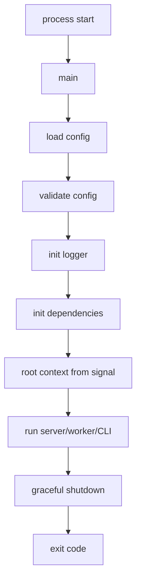
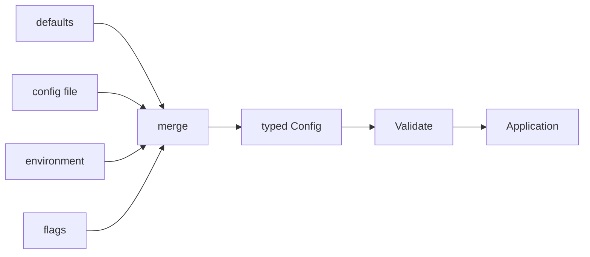
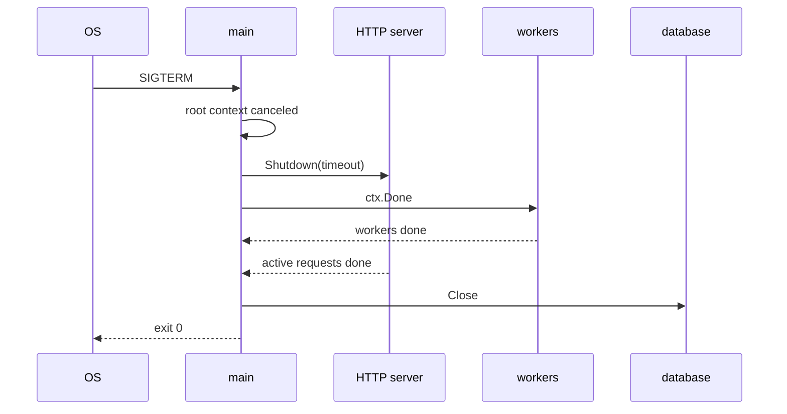
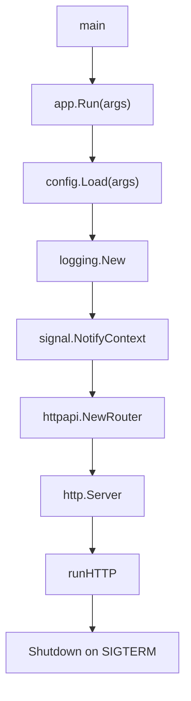

# learn-go-part-025.md

# Go CLI, Daemon, and Configuration Engineering: flags, env, config layering, signals, and process lifecycle

> Seri: `learn-go`  
> Part: `025` dari `034`  
> Target pembaca: Java software engineer yang ingin naik ke level production-grade Go engineer  
> Target Go: Go 1.26.x  
> Status seri: belum selesai

---

## 0. Tujuan Part Ini

Part 020 sampai 024 membahas I/O, networking, HTTP server/client, dan serialization. Sekarang kita membahas bagaimana program Go benar-benar dijalankan sebagai:

```text
CLI tool
daemon/service
batch job
worker
HTTP server
Kubernetes container
cron job
migration tool
admin utility
```

Banyak engineer fokus ke handler/service logic, tetapi production failure sering berasal dari hal yang terlihat “pinggiran”:

```text
config salah
env var tidak tervalidasi
secret bocor ke log
flag default tidak aman
SIGTERM tidak ditangani
exit code salah
shutdown menggantung
background worker tidak berhenti
readiness tetap true saat shutdown
config reload race
timezone/locale beda
working directory assumption salah
```

Sebagai Java engineer, kamu mungkin terbiasa dengan:

```text
Spring Boot properties
application.yml
profiles
System.getenv
-Dproperty
Picocli
systemd service
JVM shutdown hook
Kubernetes env/configmap/secret
Actuator health/readiness
```

Di Go, standard library menyediakan building block kecil:

```go
flag
os
os/signal
syscall
context
time
log/slog
runtime/debug
```

Dan kamu menyusun sendiri contract configuration dan lifecycle.

Target part ini:

1. memahami command structure Go;
2. memahami `flag` package;
3. memahami env var parsing;
4. memahami config layering;
5. memahami validation dan fail-fast config;
6. memahami secrets handling;
7. memahami signal handling;
8. memahami process lifecycle;
9. memahami exit code;
10. memahami daemon/service run pattern;
11. memahami graceful shutdown untuk HTTP/worker;
12. memahami CLI UX yang baik;
13. membangun production-grade `main` structure.

---

## 1. Sumber Resmi dan Rujukan Utama

Rujukan utama:

- Package `flag`: https://pkg.go.dev/flag
- Package `os`: https://pkg.go.dev/os
- Package `os/signal`: https://pkg.go.dev/os/signal
- Package `syscall`: https://pkg.go.dev/syscall
- Package `context`: https://pkg.go.dev/context
- Package `time`: https://pkg.go.dev/time
- Package `log/slog`: https://pkg.go.dev/log/slog
- Package `runtime/debug`: https://pkg.go.dev/runtime/debug
- Package `net/http`: https://pkg.go.dev/net/http
- Effective Go: https://go.dev/doc/effective_go

Prinsip umum:

- `main` sebaiknya tipis.
- Parsing config harus eksplisit.
- Config invalid harus fail fast.
- Secret tidak boleh dilog.
- Signal harus membatalkan root context.
- Shutdown harus bounded dengan timeout.
- Exit code harus merepresentasikan hasil proses.
- Program harus bisa dijalankan lokal, di CI, dan di container dengan perilaku konsisten.

---

## 2. Mental Model Besar

### 2.1 Program Go Production



### 2.2 `main` Is Composition Root

Di Go, package `main` biasanya menjadi composition root:

```text
parse config
create logger
create DB/client/repository/service/handler
wire dependencies
run lifecycle
handle exit
```

Business logic tidak boleh bergantung pada `os.Getenv` langsung di deep layer.

Bad:

```go
func (s *Service) Process(ctx context.Context) error {
    timeout := os.Getenv("TIMEOUT")
    ...
}
```

Good:

```go
type Config struct {
    Timeout time.Duration
}

type Service struct {
    timeout time.Duration
}
```

Config dibaca sekali di boundary, lalu diinjeksi.

### 2.3 Fail Fast

Jika config invalid, program harus gagal saat startup, bukan saat request pertama.

```text
missing DB URL -> startup fail
invalid duration -> startup fail
port invalid -> startup fail
secret missing -> startup fail
negative worker count -> startup fail
```

---

## 3. Program Structure

### 3.1 Minimal Structure

```text
cmd/
  server/
    main.go
  worker/
    main.go
internal/
  app/
    server.go
  config/
    config.go
  logging/
    logging.go
  case/
    service.go
```

### 3.2 `main.go`

```go
package main

import (
    "fmt"
    "os"

    "example.com/project/internal/app"
)

func main() {
    if err := app.Run(); err != nil {
        fmt.Fprintln(os.Stderr, err)
        os.Exit(1)
    }
}
```

This pattern prevents `defer` being skipped by `os.Exit` inside deep code.

### 3.3 Avoid `os.Exit` Deep Inside

Bad:

```go
func loadConfig() Config {
    if missing {
        os.Exit(1)
    }
}
```

Good:

```go
func LoadConfig() (Config, error) {
    if missing {
        return Config{}, errors.New("missing config")
    }
    return cfg, nil
}
```

Only `main` decides exit.

### 3.4 `Run` Function

```go
func Run() error {
    cfg, err := config.Load()
    if err != nil {
        return err
    }

    logger := logging.New(cfg.Log)

    ctx, stop := signal.NotifyContext(context.Background(), os.Interrupt, syscall.SIGTERM)
    defer stop()

    return run(ctx, cfg, logger)
}
```

---

## 4. Flags

### 4.1 Basic `flag`

```go
var addr = flag.String("addr", ":8080", "HTTP listen address")
var debug = flag.Bool("debug", false, "enable debug logging")

flag.Parse()

fmt.Println(*addr, *debug)
```

### 4.2 Custom FlagSet

For testable CLI/subcommands, avoid package-level default `flag.CommandLine`.

```go
func parseArgs(args []string) (Config, error) {
    fs := flag.NewFlagSet("server", flag.ContinueOnError)

    var cfg Config
    fs.StringVar(&cfg.Addr, "addr", ":8080", "HTTP listen address")
    fs.DurationVar(&cfg.ShutdownTimeout, "shutdown-timeout", 30*time.Second, "shutdown timeout")

    if err := fs.Parse(args); err != nil {
        return Config{}, err
    }

    return cfg, nil
}
```

Use:

```go
cfg, err := parseArgs(os.Args[1:])
```

### 4.3 Flag Error Handling

`flag.ExitOnError` exits automatically. For libraries/tests, prefer `flag.ContinueOnError`.

Suppress default output in tests:

```go
fs.SetOutput(io.Discard)
```

### 4.4 Duration Flag

```go
fs.DurationVar(&cfg.Timeout, "timeout", 5*time.Second, "operation timeout")
```

Accepts values like:

```text
5s
1m30s
250ms
```

### 4.5 Repeated Flag

Implement `flag.Value`.

```go
type stringList []string

func (s *stringList) String() string {
    return strings.Join(*s, ",")
}

func (s *stringList) Set(v string) error {
    *s = append(*s, v)
    return nil
}
```

Usage:

```go
var includes stringList
fs.Var(&includes, "include", "include pattern; can be repeated")
```

### 4.6 Subcommands

Basic pattern:

```go
func RunCLI(args []string) error {
    if len(args) == 0 {
        return errors.New("missing command")
    }

    switch args[0] {
    case "serve":
        return runServe(args[1:])
    case "migrate":
        return runMigrate(args[1:])
    default:
        return fmt.Errorf("unknown command %q", args[0])
    }
}
```

For complex CLI, a third-party package may help, but understand standard `flag` first.

---

## 5. Environment Variables

### 5.1 Read Env

```go
v := os.Getenv("PORT")
```

But `Getenv` cannot distinguish unset and empty.

Use:

```go
v, ok := os.LookupEnv("PORT")
```

### 5.2 Parse Env

```go
func envString(name, def string) string {
    if v, ok := os.LookupEnv(name); ok {
        return v
    }
    return def
}
```

Duration:

```go
func envDuration(name string, def time.Duration) (time.Duration, error) {
    v, ok := os.LookupEnv(name)
    if !ok || v == "" {
        return def, nil
    }

    d, err := time.ParseDuration(v)
    if err != nil {
        return 0, fmt.Errorf("parse %s as duration: %w", name, err)
    }

    return d, nil
}
```

Int:

```go
func envInt(name string, def int) (int, error) {
    v, ok := os.LookupEnv(name)
    if !ok || v == "" {
        return def, nil
    }

    n, err := strconv.Atoi(v)
    if err != nil {
        return 0, fmt.Errorf("parse %s as int: %w", name, err)
    }

    return n, nil
}
```

Bool:

```go
func envBool(name string, def bool) (bool, error) {
    v, ok := os.LookupEnv(name)
    if !ok || v == "" {
        return def, nil
    }

    b, err := strconv.ParseBool(v)
    if err != nil {
        return false, fmt.Errorf("parse %s as bool: %w", name, err)
    }

    return b, nil
}
```

### 5.3 Required Env

```go
func requiredEnv(name string) (string, error) {
    v, ok := os.LookupEnv(name)
    if !ok || strings.TrimSpace(v) == "" {
        return "", fmt.Errorf("required env %s is missing", name)
    }
    return v, nil
}
```

### 5.4 Env Naming

Common pattern:

```text
APP_HTTP_ADDR
APP_LOG_LEVEL
APP_DB_DSN
APP_SHUTDOWN_TIMEOUT
APP_WORKER_COUNT
```

Use prefix to avoid collision.

### 5.5 Env Is Stringly Typed

Always parse and validate into typed config once.

Do not pass raw strings deep into app.

---

## 6. Configuration Layering

### 6.1 Common Sources

```text
default values
config file
environment variables
flags
secret manager
runtime service discovery
```

### 6.2 Precedence

Common precedence:

```text
defaults < config file < environment < flags
```

But choose and document.

### 6.3 Typed Config Struct

```go
type Config struct {
    HTTP     HTTPConfig
    Log      LogConfig
    Database DatabaseConfig
    Worker   WorkerConfig
}

type HTTPConfig struct {
    Addr              string
    ReadHeaderTimeout time.Duration
    ReadTimeout       time.Duration
    WriteTimeout      time.Duration
    IdleTimeout       time.Duration
    ShutdownTimeout   time.Duration
}

type LogConfig struct {
    Level  string
    Format string
}

type DatabaseConfig struct {
    DSN             string
    MaxOpenConns    int
    MaxIdleConns    int
    ConnMaxLifetime time.Duration
}

type WorkerConfig struct {
    Count      int
    JobTimeout time.Duration
}
```

### 6.4 Defaults

```go
func DefaultConfig() Config {
    return Config{
        HTTP: HTTPConfig{
            Addr:              ":8080",
            ReadHeaderTimeout: 5 * time.Second,
            ReadTimeout:       30 * time.Second,
            WriteTimeout:      30 * time.Second,
            IdleTimeout:       120 * time.Second,
            ShutdownTimeout:   30 * time.Second,
        },
        Log: LogConfig{
            Level:  "info",
            Format: "json",
        },
        Worker: WorkerConfig{
            Count:      runtime.GOMAXPROCS(0),
            JobTimeout: 30 * time.Second,
        },
    }
}
```

### 6.5 Load Env Over Defaults

```go
func LoadFromEnv() (Config, error) {
    cfg := DefaultConfig()

    cfg.HTTP.Addr = envString("APP_HTTP_ADDR", cfg.HTTP.Addr)

    var err error

    cfg.HTTP.ReadHeaderTimeout, err = envDuration("APP_HTTP_READ_HEADER_TIMEOUT", cfg.HTTP.ReadHeaderTimeout)
    if err != nil {
        return Config{}, err
    }

    cfg.Worker.Count, err = envInt("APP_WORKER_COUNT", cfg.Worker.Count)
    if err != nil {
        return Config{}, err
    }

    cfg.Database.DSN, err = requiredEnv("APP_DB_DSN")
    if err != nil {
        return Config{}, err
    }

    if err := cfg.Validate(); err != nil {
        return Config{}, err
    }

    return cfg, nil
}
```

### 6.6 Validate

```go
func (c Config) Validate() error {
    var errs []error

    if strings.TrimSpace(c.HTTP.Addr) == "" {
        errs = append(errs, errors.New("http addr is required"))
    }
    if c.HTTP.ReadHeaderTimeout <= 0 {
        errs = append(errs, errors.New("http read header timeout must be positive"))
    }
    if c.HTTP.ShutdownTimeout <= 0 {
        errs = append(errs, errors.New("http shutdown timeout must be positive"))
    }
    if c.Database.DSN == "" {
        errs = append(errs, errors.New("database dsn is required"))
    }
    if c.Worker.Count <= 0 {
        errs = append(errs, errors.New("worker count must be positive"))
    }

    return errors.Join(errs...)
}
```

### 6.7 Config Diagram



---

## 7. Config Files

### 7.1 JSON Config

Because JSON is in standard library:

```json
{
  "http": {
    "addr": ":8080"
  },
  "log": {
    "level": "info"
  }
}
```

Decode:

```go
func LoadJSONConfig(path string) (FileConfig, error) {
    f, err := os.Open(path)
    if err != nil {
        return FileConfig{}, fmt.Errorf("open config %q: %w", path, err)
    }
    defer f.Close()

    dec := json.NewDecoder(f)
    dec.DisallowUnknownFields()

    var cfg FileConfig
    if err := dec.Decode(&cfg); err != nil {
        return FileConfig{}, fmt.Errorf("decode config %q: %w", path, err)
    }

    return cfg, nil
}
```

### 7.2 YAML/TOML

YAML/TOML require third-party packages.

Use only with clear dependency choice.

Config file complexity grows quickly. Keep schema stable and validated.

### 7.3 Config File vs Env

Kubernetes/cloud often prefers env/configmap/secret.

Config file is useful for:

- CLI tools;
- local dev;
- complex batch jobs;
- on-prem deployments;
- human-editable config.

### 7.4 Avoid Silent Unknown Config

Use strict decode for config files.

Unknown config should fail startup to catch typos.

---

## 8. Secrets

### 8.1 What Is Secret?

Examples:

```text
database password
API token
JWT signing key
TLS private key
encryption key
OAuth client secret
```

### 8.2 Do Not Log Secrets

Bad:

```go
logger.Info("config", "cfg", cfg)
```

If cfg contains DSN/token, leak.

### 8.3 Redacted Type

```go
type Secret string

func (s Secret) String() string {
    if s == "" {
        return ""
    }
    return "[REDACTED]"
}

func (s Secret) Value() string {
    return string(s)
}
```

Config:

```go
type DatabaseConfig struct {
    DSN Secret
}
```

Be careful: `%q`, JSON marshal, reflection logging may still expose if not controlled. Best: do not log config structs wholesale.

### 8.4 Secret Source

Options:

- environment variable;
- mounted file;
- cloud secret manager;
- SSM/Parameter Store;
- Vault;
- Kubernetes Secret.

Your app should receive secret as typed config; retrieval mechanism belongs at boundary.

### 8.5 Secret Rotation

If secret can rotate:

- understand whether app reloads it;
- support restart-based rotation;
- avoid caching forever unless intended;
- design reconnect.

Do not implement hot reload without race-free design.

---

## 9. Logging Initialization

### 9.1 `log/slog`

```go
func NewLogger(cfg LogConfig) (*slog.Logger, error) {
    var level slog.Level

    switch strings.ToLower(cfg.Level) {
    case "debug":
        level = slog.LevelDebug
    case "info", "":
        level = slog.LevelInfo
    case "warn":
        level = slog.LevelWarn
    case "error":
        level = slog.LevelError
    default:
        return nil, fmt.Errorf("invalid log level %q", cfg.Level)
    }

    opts := &slog.HandlerOptions{Level: level}

    var handler slog.Handler
    switch cfg.Format {
    case "json", "":
        handler = slog.NewJSONHandler(os.Stdout, opts)
    case "text":
        handler = slog.NewTextHandler(os.Stdout, opts)
    default:
        return nil, fmt.Errorf("invalid log format %q", cfg.Format)
    }

    return slog.New(handler), nil
}
```

### 9.2 Log to stdout/stderr in Containers

In containerized environments, write logs to stdout/stderr. Let platform collect.

### 9.3 Avoid Logging Before Logger?

Startup errors can go to stderr.

Once logger initialized, use structured logs.

---

## 10. Signal Handling

### 10.1 `signal.NotifyContext`

```go
ctx, stop := signal.NotifyContext(context.Background(), os.Interrupt, syscall.SIGTERM)
defer stop()
```

This creates context canceled on signal.

### 10.2 Why `stop()` Matters

Calling `stop()` unregisters signal notification. After graceful shutdown begins, you may want second Ctrl+C to terminate normally.

Pattern:

```go
ctx, stop := signal.NotifyContext(context.Background(), os.Interrupt, syscall.SIGTERM)
defer stop()

if err := run(ctx); err != nil {
    return err
}
```

### 10.3 Windows Signals

`syscall.SIGTERM` behavior differs across platforms. For cross-platform CLI, `os.Interrupt` is usually important.

For Linux containers/Kubernetes, handle SIGTERM.

### 10.4 Signal Is Not Shutdown By Itself

Signal should trigger cancellation. Your goroutines must observe context.

---

## 11. Process Lifecycle

### 11.1 CLI Lifecycle

```text
parse args
load config
execute command
print result
return exit code
```

### 11.2 Server Lifecycle

```text
parse config
init dependencies
start listeners/workers
wait for signal/error
shutdown with timeout
close dependencies
exit
```

### 11.3 Worker Lifecycle

```text
connect queue
start worker pool
consume jobs
handle cancellation
finish or abandon according to policy
close queue/db
exit
```

### 11.4 Exit Codes

Common:

```text
0 success
1 general error
2 usage/config error
>2 app-specific if documented
```

For CLI, usage error often returns 2.

Example:

```go
type ExitError struct {
    Code int
    Err  error
}

func (e *ExitError) Error() string {
    return e.Err.Error()
}

func main() {
    if err := app.Run(os.Args[1:]); err != nil {
        var exitErr *ExitError
        if errors.As(err, &exitErr) {
            fmt.Fprintln(os.Stderr, exitErr.Err)
            os.Exit(exitErr.Code)
        }

        fmt.Fprintln(os.Stderr, err)
        os.Exit(1)
    }
}
```

### 11.5 Do Not Panic for Expected Startup Error

Bad:

```go
panic(err)
```

for missing config.

Panic is for programmer bugs/unexpected impossible state, not user config error.

---

## 12. Graceful Shutdown

### 12.1 HTTP Server

```go
func runHTTP(ctx context.Context, srv *http.Server, shutdownTimeout time.Duration) error {
    errCh := make(chan error, 1)

    go func() {
        errCh <- srv.ListenAndServe()
    }()

    select {
    case <-ctx.Done():
        shutdownCtx, cancel := context.WithTimeout(context.Background(), shutdownTimeout)
        defer cancel()

        if err := srv.Shutdown(shutdownCtx); err != nil {
            return fmt.Errorf("http shutdown: %w", err)
        }

        err := <-errCh
        if err != nil && err != http.ErrServerClosed {
            return err
        }

        return nil

    case err := <-errCh:
        if err == http.ErrServerClosed {
            return nil
        }
        return err
    }
}
```

### 12.2 Worker

```go
func runWorkers(ctx context.Context, cfg WorkerConfig, processor Processor) error {
    jobs := make(chan Job)

    results := RunWorkers(ctx, jobs, cfg.Count, processor)

    for {
        select {
        case <-ctx.Done():
            return ctx.Err()

        case r, ok := <-results:
            if !ok {
                return nil
            }
            record(r)
        }
    }
}
```

### 12.3 Shutdown Timeout

Always bound shutdown.

```go
shutdownCtx, cancel := context.WithTimeout(context.Background(), 30*time.Second)
defer cancel()
```

### 12.4 Shutdown Diagram



---

## 13. Readiness and Draining

### 13.1 Shutdown State

```go
type AppState struct {
    shuttingDown atomic.Bool
}

func (s *AppState) MarkShuttingDown() {
    s.shuttingDown.Store(true)
}

func (s *AppState) Ready() bool {
    return !s.shuttingDown.Load()
}
```

Readiness handler:

```go
func (s *AppState) Readyz(w http.ResponseWriter, r *http.Request) {
    if !s.Ready() {
        http.Error(w, "shutting down", http.StatusServiceUnavailable)
        return
    }
    w.WriteHeader(http.StatusOK)
    _, _ = w.Write([]byte("ok\n"))
}
```

### 13.2 Kubernetes Drain Pattern

```text
SIGTERM
mark readiness false
sleep drain delay
shutdown server
exit before terminationGracePeriodSeconds
```

Implement:

```go
state.MarkShuttingDown()

select {
case <-time.After(cfg.DrainDelay):
case <-ctx.Done():
}
```

Caveat: root ctx is already canceled on SIGTERM, so use separate timer context if needed.

---

## 14. Dependency Lifecycle

### 14.1 Init Order

```text
config
logger
metrics/tracing
database
external clients
repositories
services
handlers
server
```

### 14.2 Close Order

Reverse dependency order:

```text
server stops accepting
workers stop
external clients idle close
database close
logger flush if needed
```

### 14.3 Close Errors

Handle close errors if meaningful.

```go
if err := db.Close(); err != nil {
    logger.Error("close db failed", "err", err)
}
```

### 14.4 Dependency Init Should Be Context-Aware?

Startup operations like DB ping may need timeout.

```go
ctx, cancel := context.WithTimeout(parent, 5*time.Second)
defer cancel()

if err := db.PingContext(ctx); err != nil {
    return err
}
```

Do not let startup hang forever.

---

## 15. CLI UX

### 15.1 Helpful Usage

```go
fs.Usage = func() {
    fmt.Fprintf(fs.Output(), "Usage: %s [flags]\n\n", fs.Name())
    fs.PrintDefaults()
}
```

### 15.2 Output Streams

Use:

```text
stdout:
  normal output

stderr:
  errors, diagnostics, logs
```

### 15.3 Machine-Readable Output

For CLI used in scripts:

```bash
tool status --output json
```

Design stable output.

### 15.4 Human-Friendly Errors

Bad:

```text
strconv.Atoi: parsing "abc": invalid syntax
```

Better:

```text
invalid --worker-count "abc": must be integer
```

### 15.5 Exit Code Consistency

Scripts depend on exit code.

---

## 16. Configuration Reload

### 16.1 Prefer Restart-Based Config

In containerized systems, config reload via restart is often simpler and safer.

### 16.2 Hot Reload Complexity

Hot reload requires:

- detecting config change;
- validating new config;
- applying only safe changes;
- synchronizing readers;
- rolling back on failure;
- updating dependencies;
- avoiding races.

### 16.3 Atomic Config Store

For read-mostly dynamic config:

```go
type ConfigStore struct {
    current atomic.Pointer[RuntimeConfig]
}

func (s *ConfigStore) Load() *RuntimeConfig {
    return s.current.Load()
}

func (s *ConfigStore) Store(cfg RuntimeConfig) {
    s.current.Store(&cfg)
}
```

Only if config is immutable after store.

### 16.4 Do Not Hot Reload Everything

Some changes require restart:

- DB DSN;
- TLS cert depending server;
- worker pool size maybe;
- log format maybe;
- feature flags maybe.

Classify.

---

## 17. Production Example: HTTP Service Main

### 17.1 Directory

```text
cmd/case-api/main.go
internal/app/app.go
internal/config/config.go
internal/logging/logging.go
internal/httpapi/router.go
internal/case/service.go
```

### 17.2 `cmd/case-api/main.go`

```go
package main

import (
    "fmt"
    "os"

    "example.com/caseapp/internal/app"
)

func main() {
    if err := app.Run(os.Args[1:]); err != nil {
        fmt.Fprintln(os.Stderr, err)
        os.Exit(1)
    }
}
```

### 17.3 `internal/app/app.go`

```go
package app

import (
    "context"
    "fmt"
    "net/http"
    "os"
    "os/signal"
    "syscall"

    "example.com/caseapp/internal/config"
    "example.com/caseapp/internal/httpapi"
    "example.com/caseapp/internal/logging"
)

func Run(args []string) error {
    cfg, err := config.Load(args)
    if err != nil {
        return fmt.Errorf("load config: %w", err)
    }

    logger, err := logging.New(cfg.Log)
    if err != nil {
        return fmt.Errorf("init logger: %w", err)
    }

    ctx, stop := signal.NotifyContext(context.Background(), os.Interrupt, syscall.SIGTERM)
    defer stop()

    handler := httpapi.NewRouter(logger)

    srv := &http.Server{
        Addr:              cfg.HTTP.Addr,
        Handler:           handler,
        ReadHeaderTimeout: cfg.HTTP.ReadHeaderTimeout,
        ReadTimeout:       cfg.HTTP.ReadTimeout,
        WriteTimeout:      cfg.HTTP.WriteTimeout,
        IdleTimeout:       cfg.HTTP.IdleTimeout,
    }

    logger.Info("server starting", "addr", cfg.HTTP.Addr)

    if err := runHTTP(ctx, srv, cfg.HTTP.ShutdownTimeout); err != nil {
        return err
    }

    logger.Info("server stopped")
    return nil
}
```

### 17.4 Router

```go
func NewRouter(logger *slog.Logger) http.Handler {
    mux := http.NewServeMux()

    mux.HandleFunc("GET /healthz", func(w http.ResponseWriter, r *http.Request) {
        w.WriteHeader(http.StatusOK)
        _, _ = w.Write([]byte("ok\n"))
    })

    return Chain(
        mux,
        Recover(logger),
        RequestID,
        AccessLog(logger),
    )
}
```

### 17.5 Lifecycle Diagram



---

## 18. Production Example: Batch CLI

### 18.1 Command

```bash
case-tool export --from 2026-01-01 --to 2026-01-31 --output cases.csv
```

### 18.2 Config

```go
type ExportConfig struct {
    From   time.Time
    To     time.Time
    Output string
}
```

### 18.3 Parse

```go
func parseExportArgs(args []string) (ExportConfig, error) {
    fs := flag.NewFlagSet("export", flag.ContinueOnError)

    var from, to, output string
    fs.StringVar(&from, "from", "", "start date YYYY-MM-DD")
    fs.StringVar(&to, "to", "", "end date YYYY-MM-DD")
    fs.StringVar(&output, "output", "", "output CSV path")

    if err := fs.Parse(args); err != nil {
        return ExportConfig{}, err
    }

    if from == "" || to == "" || output == "" {
        return ExportConfig{}, errors.New("--from, --to, and --output are required")
    }

    fromDate, err := time.Parse("2006-01-02", from)
    if err != nil {
        return ExportConfig{}, fmt.Errorf("invalid --from: %w", err)
    }

    toDate, err := time.Parse("2006-01-02", to)
    if err != nil {
        return ExportConfig{}, fmt.Errorf("invalid --to: %w", err)
    }

    if toDate.Before(fromDate) {
        return ExportConfig{}, errors.New("--to must be >= --from")
    }

    return ExportConfig{
        From:   fromDate,
        To:     toDate,
        Output: output,
    }, nil
}
```

### 18.4 Run With Signal

```go
func runExport(args []string) error {
    cfg, err := parseExportArgs(args)
    if err != nil {
        return &ExitError{Code: 2, Err: err}
    }

    ctx, stop := signal.NotifyContext(context.Background(), os.Interrupt, syscall.SIGTERM)
    defer stop()

    return exportCases(ctx, cfg)
}
```

### 18.5 CLI Design Points

- usage errors return code 2;
- runtime errors return code 1;
- output file write errors include path;
- SIGTERM cancels export;
- export streams data, not full memory.

---

## 19. Testing CLI and Config

### 19.1 Test Parse Args

```go
func TestParseExportArgs(t *testing.T) {
    cfg, err := parseExportArgs([]string{
        "--from", "2026-01-01",
        "--to", "2026-01-31",
        "--output", "cases.csv",
    })
    if err != nil {
        t.Fatal(err)
    }

    if cfg.Output != "cases.csv" {
        t.Fatalf("output=%q", cfg.Output)
    }
}
```

### 19.2 Test Env

Use `t.Setenv`:

```go
func TestLoadFromEnv(t *testing.T) {
    t.Setenv("APP_DB_DSN", "postgres://example")
    t.Setenv("APP_WORKER_COUNT", "4")

    cfg, err := LoadFromEnv()
    if err != nil {
        t.Fatal(err)
    }

    if cfg.Worker.Count != 4 {
        t.Fatal(cfg.Worker.Count)
    }
}
```

### 19.3 Test Invalid Config

```go
func TestInvalidWorkerCount(t *testing.T) {
    t.Setenv("APP_DB_DSN", "postgres://example")
    t.Setenv("APP_WORKER_COUNT", "0")

    _, err := LoadFromEnv()
    if err == nil {
        t.Fatal("expected error")
    }
}
```

### 19.4 Test Run Without os.Exit

Because `Run(args)` returns error, tests can call it directly.

Do not put `os.Exit` inside testable function.

---

## 20. Observability at Process Level

Track:

```text
build version
commit sha
start time
config summary without secrets
shutdown reason
shutdown duration
signal received
startup failure category
dependency init duration
```

Build info:

```go
info, ok := debug.ReadBuildInfo()
if ok {
    logger.Info("build info", "go_version", info.GoVersion)
}
```

Set version via build flags:

```bash
go build -ldflags "-X main.version=1.2.3 -X main.commit=$GIT_SHA"
```

In code:

```go
var version = "dev"
var commit = "unknown"
```

---

## 21. Common Anti-Patterns

### 21.1 Reading Env Deep in Business Logic

Makes tests and behavior unpredictable.

### 21.2 No Config Validation

Invalid config fails later under traffic.

### 21.3 Logging Full Config with Secrets

Security incident.

### 21.4 `os.Exit` in Library/Internal Package

Skips defers and makes tests hard.

### 21.5 Panic for User Error

Bad CLI UX.

### 21.6 No Signal Handling

Kubernetes deploy kills in-flight work.

### 21.7 Unbounded Shutdown

Process hangs until killed.

### 21.8 Ignoring Close Errors

May hide flush/cleanup failure.

### 21.9 Hot Reload Without Synchronization

Race and inconsistent config.

### 21.10 Working Directory Assumption

Relative paths break under systemd/container/cron.

Prefer explicit paths or embed.

### 21.11 Default FlagSet in Libraries

Global state makes tests and imports surprising.

### 21.12 Secret in Flag

Command-line args may be visible via process list. Prefer env/secret file/secret manager for sensitive values.

---

## 22. Practical Commands

### Build

```bash
go build -o case-api ./cmd/case-api
```

### Run

```bash
APP_DB_DSN='postgres://...' ./case-api --addr :8080
```

### Build with Version

```bash
go build -ldflags "-X main.version=1.0.0 -X main.commit=$(git rev-parse HEAD)" ./cmd/case-api
```

### Send SIGTERM

Linux/macOS:

```bash
kill -TERM <pid>
```

PowerShell:

```powershell
Stop-Process -Id <pid>
```

### Check Env

Linux/macOS:

```bash
env | grep APP_
```

PowerShell:

```powershell
Get-ChildItem Env:APP_*
```

### Test

```bash
go test ./...
go test -race ./...
```

---

## 23. Hands-On Labs

### Lab 1: Config Loader

Implement config loader:

- defaults;
- env override;
- flag override;
- validation.

### Lab 2: Required Secret

Require `APP_DB_DSN`.

Ensure missing value fails startup.

Ensure DSN not logged.

### Lab 3: CLI Subcommands

Implement:

```bash
tool serve
tool migrate
tool export
```

Use separate `FlagSet`.

### Lab 4: Signal Context

Create program that prints tick every second.

On SIGTERM/Ctrl+C, stop gracefully.

### Lab 5: HTTP Graceful Shutdown

Build server with `signal.NotifyContext`.

Send SIGTERM during long request.

Verify behavior.

### Lab 6: Exit Codes

Return:

- 0 on success;
- 2 on invalid flags;
- 1 on runtime error.

### Lab 7: Config File Strict Decode

Load JSON config with `DisallowUnknownFields`.

Test typo field fails.

### Lab 8: Readiness Drain

Implement readiness endpoint that returns 503 after shutdown begins.

### Lab 9: Build Info

Print version/commit/go version at startup.

### Lab 10: Test No os.Exit

Ensure all command logic is testable without exiting process.

---

## 24. Review Questions

1. Kenapa `main` sebaiknya tipis?
2. Apa itu composition root?
3. Kenapa config harus typed dan validated?
4. Apa precedence config yang umum?
5. Kenapa env var harus diparse sekali?
6. Apa beda `os.Getenv` dan `os.LookupEnv`?
7. Kenapa secret tidak boleh dilog?
8. Kenapa `os.Exit` tidak boleh di deep package?
9. Apa fungsi `signal.NotifyContext`?
10. Kenapa `stop()` dari NotifyContext harus dipanggil?
11. Apa lifecycle HTTP server production?
12. Apa itu shutdown timeout?
13. Kenapa readiness perlu berubah saat shutdown?
14. Apa exit code untuk usage error?
15. Kenapa `panic` buruk untuk config error?
16. Kapan config reload sebaiknya tidak dilakukan?
17. Bagaimana menguji env var di Go?
18. Kenapa default FlagSet bisa menyulitkan test?
19. Kenapa command-line flag tidak cocok untuk secret?
20. Apa saja process-level metrics/log yang berguna?

---

## 25. Code Review Checklist

Saat review CLI/daemon/config code:

```text
[ ] Apakah main tipis dan hanya handle exit?
[ ] Apakah app Run mengembalikan error?
[ ] Apakah tidak ada os.Exit di internal/library code?
[ ] Apakah config typed?
[ ] Apakah config divalidasi fail-fast?
[ ] Apakah defaults jelas?
[ ] Apakah env/flag precedence terdokumentasi?
[ ] Apakah required secret dicek?
[ ] Apakah secret tidak dilog?
[ ] Apakah flag parsing testable dengan FlagSet?
[ ] Apakah invalid args menghasilkan usage error/exit code benar?
[ ] Apakah signal handling memakai NotifyContext?
[ ] Apakah shutdown timeout ada?
[ ] Apakah HTTP server punya graceful shutdown?
[ ] Apakah workers observe context cancellation?
[ ] Apakah dependencies ditutup dalam urutan benar?
[ ] Apakah readiness berubah saat shutdown?
[ ] Apakah build version/commit bisa diketahui?
[ ] Apakah tests memakai t.Setenv dan tidak bergantung global state?
```

---

## 26. Invariants

Pegang invariant berikut:

```text
main should be thin.
Only main should decide os.Exit.
Configuration must be parsed at boundary.
Configuration must be typed before use.
Invalid config should fail fast.
Secrets must not be logged.
Flags/env are strings until parsed and validated.
Context from signal is root lifecycle for daemon.
Signal only cancels; goroutines must observe cancellation.
Shutdown must be bounded.
Exit codes are API for scripts.
Readiness should become false before/during shutdown.
Do not hot reload config without synchronization and policy.
Working directory is not a stable dependency.
```

---

## 27. Ringkasan

CLI, daemon, dan configuration engineering adalah fondasi operasional Go program.

Service yang bagus bukan hanya handler-nya benar. Ia juga harus:

```text
start predictably
fail fast on invalid config
hide secrets
log structured startup/shutdown
handle SIGTERM
stop accepting traffic
drain in-flight work
close dependencies
return meaningful exit code
be testable without os.Exit
```

Sebagai Java engineer, kamu mungkin terbiasa banyak hal ini disediakan Spring Boot atau container framework. Di Go, kamu harus menyusunnya secara eksplisit—tetapi hasilnya bisa jauh lebih sederhana, transparan, dan mudah diaudit.

Bug production yang sering terjadi:

- env typo tidak ketahuan;
- default timeout tidak aman;
- secret bocor saat log config;
- SIGTERM langsung mematikan process;
- worker tidak berhenti;
- shutdown menggantung;
- CLI exit code salah;
- config reload race;
- `os.Exit` membuat defer tidak jalan;
- relative path rusak di container.

Jika kamu menguasai part ini, kamu bisa membuat Go binary yang bukan hanya benar secara logic, tetapi juga layak dioperasikan.

---

## 28. Posisi Kita di Seri

Kita sudah menyelesaikan:

```text
000 - Orientation and Mental Model
001 - Toolchain, Workspace, Module, Build
002 - Syntax Core
003 - Functions
004 - Types
005 - Composition
006 - Interfaces
007 - Generics
008 - Error Handling
009 - Package Design
010 - Modules and Dependency Management
011 - Standard Library Mental Model
012 - Slices, Arrays, and Maps
013 - Memory Model for Application Engineers
014 - Runtime Deep Dive
015 - Go Garbage Collector
016 - Concurrency Primitives
017 - Concurrency Patterns
018 - Shared Memory Concurrency
019 - Context Propagation
020 - File, Stream, and Filesystem I/O
021 - Networking Fundamentals
022 - HTTP Server Engineering
023 - HTTP Client Engineering
024 - Serialization
025 - CLI, Daemon, and Configuration Engineering
```

Berikutnya:

```text
026 - Testing:
      Table Tests, Subtests, Mocks/Fakes, testdata, Golden Tests, Fuzzing, and Race Tests
```

Status seri: **belum selesai**.


<!-- NAVIGATION_FOOTER -->
<div class="page-nav">
<a href="./learn-go-part-024.md">⬅️ Go Serialization: JSON, XML, Binary Encoding, Streaming Decode, Custom Marshalers, and Schema Evolution</a>
<a href="./index.md">📚 Kategori</a>
<a href="../../index.md">🏠 Home</a>
<a href="./learn-go-part-026.md">Go Testing: Table Tests, Subtests, Mocks/Fakes, testdata, Golden Tests, Fuzzing, and Race Tests ➡️</a>
</div>
