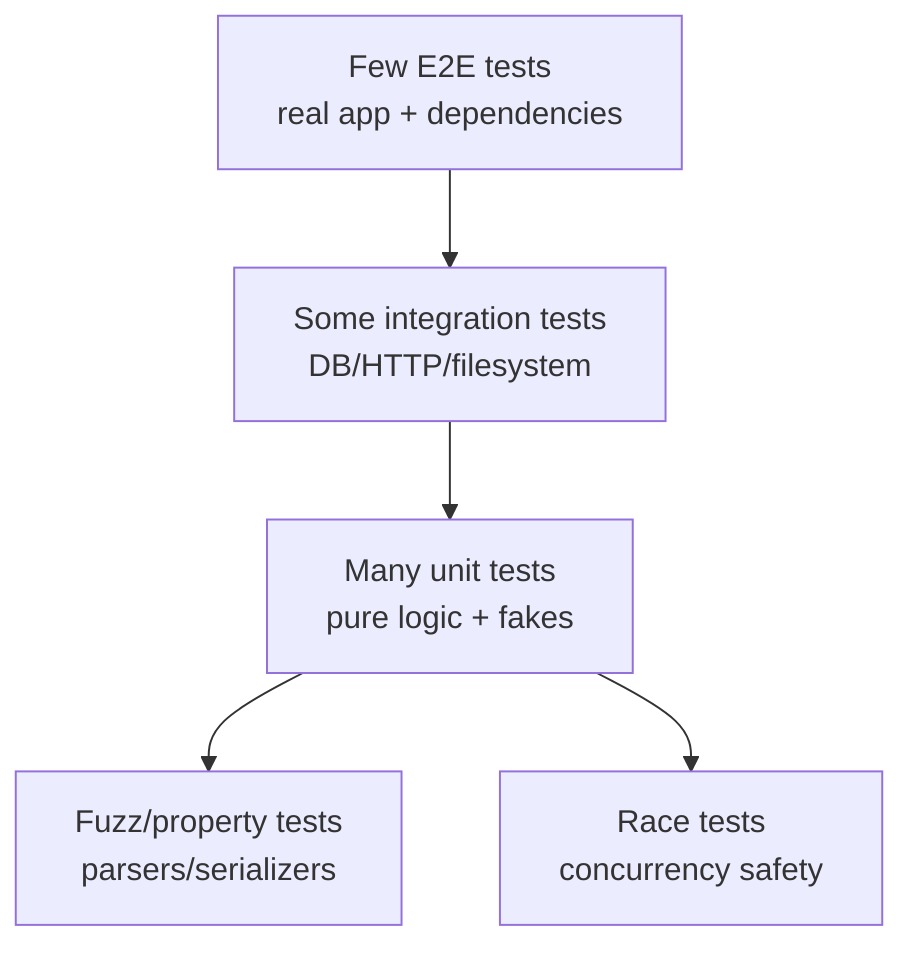

# learn-go-part-026.md

# Go Testing: Table Tests, Subtests, Mocks/Fakes, testdata, Golden Tests, Fuzzing, and Race Tests

> Seri: `learn-go`  
> Part: `026` dari `034`  
> Target pembaca: Java software engineer yang ingin naik ke level production-grade Go engineer  
> Target Go: Go 1.26.x  
> Status seri: belum selesai

---

## 0. Tujuan Part Ini

Part sebelumnya membahas CLI, daemon, configuration, signal, dan lifecycle. Sekarang kita masuk ke testing.

Di Go, testing bukan add-on framework besar. Testing adalah bagian dari toolchain:

```bash
go test ./...
go test -race ./...
go test -run TestName ./...
go test -bench=. -benchmem ./...
go test -fuzz=FuzzName ./...
```

Sebagai Java engineer, kamu mungkin terbiasa dengan:

```text
JUnit
Mockito
AssertJ
SpringBootTest
Testcontainers
JaCoCo
ParameterizedTest
Hamcrest
WireMock
Maven/Gradle test lifecycle
```

Di Go, style testing lebih sederhana, eksplisit, dan dekat dengan package:

```text
testing package
_test.go files
table-driven tests
subtests
fakes over mocks
httptest
testdata
golden files
fuzzing
race detector
benchmarks
```

Target part ini:

1. memahami filosofi testing Go;
2. memahami `testing.T`;
3. memahami table-driven tests;
4. memahami subtests;
5. memahami `t.Helper`, `t.Cleanup`, `t.TempDir`, `t.Setenv`;
6. memahami fakes, stubs, mocks, spies;
7. memahami `testdata`;
8. memahami golden tests;
9. memahami HTTP handler/client tests;
10. memahami filesystem/config tests;
11. memahami concurrency tests;
12. memahami fuzzing;
13. memahami race detector;
14. memahami integration test boundaries;
15. memahami test suite design production-grade.

---

## 1. Sumber Resmi dan Rujukan Utama

Rujukan utama:

- Package `testing`: https://pkg.go.dev/testing
- Data Race Detector: https://go.dev/doc/articles/race_detector
- Go Fuzzing tutorial: https://go.dev/doc/tutorial/fuzz
- Go Security: Fuzzing: https://go.dev/doc/security/fuzz/
- Package `net/http/httptest`: https://pkg.go.dev/net/http/httptest
- Package `testing/fstest`: https://pkg.go.dev/testing/fstest
- Package `testing/quick`: https://pkg.go.dev/testing/quick
- Package `os`: https://pkg.go.dev/os
- Package `context`: https://pkg.go.dev/context
- Package `cmp`: https://pkg.go.dev/cmp
- Package `slices`: https://pkg.go.dev/slices

Catatan Go 1.26:

- Go 1.26 memperluas dukungan race detector ke `linux/riscv64`.
- Fuzzing tetap bagian dari standard Go toolchain sejak Go 1.18.
- Package `testing` menyediakan helper seperti `Cleanup`, `TempDir`, `Setenv`, subtests, benchmarks, fuzzing, dan test lifecycle yang cukup untuk banyak kebutuhan tanpa framework besar.

---

## 2. Mental Model Besar

### 2.1 Test Is Design Feedback

Test bukan hanya verifikasi. Test memberi feedback apakah desainmu terlalu coupled.

Jika function sulit dites, biasanya ada masalah:

```text
hidden global state
direct os.Getenv in deep layer
direct time.Now everywhere
direct network call
direct database access in domain logic
large interface
side effect mixed with pure logic
goroutine lifecycle unclear
```

Testing yang baik sering mendorong desain:

```text
small interfaces
explicit dependencies
pure functions where possible
context propagation
Reader/Writer abstraction
fs.FS abstraction
httptest boundary
fake clock or injected time source
```

### 2.2 Pyramid Testing Go



Better mental model:

```text
test contracts at boundaries
test pure domain logic heavily
test integration points intentionally
avoid making every test boot the world
```

### 2.3 Confidence vs Fragility

Good test suite:

- catches regressions;
- runs fast enough for local dev;
- deterministic;
- isolates state;
- gives clear failure messages;
- avoids sleeping arbitrarily;
- minimizes reliance on test order;
- avoids over-mocking implementation details;
- has a few realistic integration tests.

Bad test suite:

- brittle to refactor;
- slow;
- flaky;
- depends on global env;
- uses real time/network unnecessarily;
- asserts logs too much;
- mocks every internal method;
- only tests happy path.

---

## 3. Basic Test Structure

### 3.1 File Naming

Test files end with:

```text
_test.go
```

Example:

```text
case_service.go
case_service_test.go
```

### 3.2 Test Function

```go
func TestAdd(t *testing.T) {
    got := Add(2, 3)
    want := 5

    if got != want {
        t.Fatalf("Add(2,3)=%d, want %d", got, want)
    }
}
```

### 3.3 Run Tests

```bash
go test ./...
```

Verbose:

```bash
go test -v ./...
```

Specific:

```bash
go test -run TestAdd ./...
```

### 3.4 Failure Methods

```go
t.Error(...)
t.Errorf(...)
t.Fatal(...)
t.Fatalf(...)
```

Use `Fatal` when test cannot continue.

Use `Error` when collecting multiple failures is useful.

### 3.5 `t.Helper`

Helper function:

```go
func requireNoError(t *testing.T, err error) {
    t.Helper()

    if err != nil {
        t.Fatalf("unexpected error: %v", err)
    }
}
```

`t.Helper()` makes failure line point to caller.

---

## 4. Table-Driven Tests

### 4.1 Basic Pattern

```go
func TestNormalizeStatus(t *testing.T) {
    tests := []struct {
        name string
        in   string
        want Status
        err  bool
    }{
        {
            name: "approved uppercase",
            in:   "APPROVED",
            want: StatusApproved,
        },
        {
            name: "approved lowercase",
            in:   "approved",
            want: StatusApproved,
        },
        {
            name: "invalid",
            in:   "???",
            err:  true,
        },
    }

    for _, tt := range tests {
        t.Run(tt.name, func(t *testing.T) {
            got, err := NormalizeStatus(tt.in)

            if tt.err {
                if err == nil {
                    t.Fatal("expected error")
                }
                return
            }

            if err != nil {
                t.Fatalf("unexpected error: %v", err)
            }

            if got != tt.want {
                t.Fatalf("got %v, want %v", got, tt.want)
            }
        })
    }
}
```

### 4.2 Why Table Tests Work Well in Go

They make edge cases explicit:

```text
input
expected output
expected error
case name
```

They reduce duplication without hiding logic in too much abstraction.

### 4.3 Subtest Names Matter

Bad:

```go
name: "case1"
```

Good:

```go
name: "empty reason rejected"
```

Subtest name appears in command:

```bash
go test -run 'TestApprove/empty_reason_rejected'
```

### 4.4 Avoid Over-Generic Table

If table fields become too many and each row uses only half of them, split tests.

Bad table smell:

```text
20 fields
many nils
complex setup function
assertion logic with many branches
```

Better:

- separate tests by behavior;
- use helper builders;
- keep each test readable.

---

## 5. Subtests

### 5.1 `t.Run`

```go
t.Run("valid", func(t *testing.T) {
    ...
})
```

Subtests help:

- isolate cases;
- run specific case;
- setup group;
- parallelize cases;
- clearer output.

### 5.2 Parent Setup

```go
func TestService(t *testing.T) {
    repo := NewFakeRepo()

    t.Run("approve", func(t *testing.T) {
        ...
    })

    t.Run("reject", func(t *testing.T) {
        ...
    })
}
```

Be careful sharing mutable state between subtests. Prefer fresh setup per subtest.

### 5.3 Parallel Subtests

```go
for _, tt := range tests {
    tt := tt

    t.Run(tt.name, func(t *testing.T) {
        t.Parallel()
        ...
    })
}
```

Important:

- capture loop variable;
- no shared mutable state unless synchronized;
- do not use `t.Setenv` in parallel tests;
- avoid global state.

### 5.4 Parallel Package Tests

Go can run packages in parallel. Tests within a package run sequentially unless `t.Parallel`.

Global resources can still collide across packages if using real DB/ports/files.

---

## 6. Test Lifecycle Helpers

### 6.1 `t.Cleanup`

```go
func TestTempResource(t *testing.T) {
    res := acquire()
    t.Cleanup(func() {
        res.Close()
    })
}
```

Cleanup runs after test and subtests complete.

Good for:

- closing fake server;
- deleting resource;
- restoring global state;
- stopping goroutine;
- closing DB.

### 6.2 `t.TempDir`

```go
dir := t.TempDir()
path := filepath.Join(dir, "config.json")
```

Automatically cleaned up.

### 6.3 `t.Setenv`

```go
t.Setenv("APP_WORKER_COUNT", "4")
```

Automatically restored.

Do not use in parallel tests.

### 6.4 Deadline

```go
deadline, ok := t.Deadline()
```

Useful to create context bounded by test timeout.

```go
ctx := context.Background()
if deadline, ok := t.Deadline(); ok {
    var cancel context.CancelFunc
    ctx, cancel = context.WithDeadline(ctx, deadline.Add(-time.Second))
    t.Cleanup(cancel)
}
```

---

## 7. Assertions Without Framework

Go standard style uses simple `if`.

```go
if got != want {
    t.Fatalf("got %q, want %q", got, want)
}
```

For complex diffs, use helper.

Standard library has `cmp` for ordering, not deep diff. For deep equality:

```go
if !reflect.DeepEqual(got, want) {
    t.Fatalf("got %#v, want %#v", got, want)
}
```

Caveat: `reflect.DeepEqual` has edge cases.

Many teams use `go-cmp` third-party for rich diffs, but standard library-only approach is enough for many cases.

### 7.1 Good Failure Message

Bad:

```go
t.Fatal("failed")
```

Good:

```go
t.Fatalf("Approve(%q) status=%q, want %q", caseID, got.Status, "APPROVED")
```

### 7.2 Compare Errors

```go
if !errors.Is(err, ErrNotFound) {
    t.Fatalf("got err %v, want ErrNotFound", err)
}
```

For typed errors:

```go
var apiErr *APIError
if !errors.As(err, &apiErr) {
    t.Fatalf("got %T, want *APIError", err)
}
```

Do not compare error strings unless message contract is intentionally public.

---

## 8. Fakes, Stubs, Mocks, Spies

### 8.1 Terms

```text
fake:
  working simplified implementation

stub:
  returns predefined values

mock:
  verifies expected calls/interactions

spy:
  records calls for later assertion
```

Go often prefers fakes and small interfaces.

### 8.2 Interface at Consumer Side

Define interface where used:

```go
type CaseRepository interface {
    Find(ctx context.Context, id CaseID) (Case, error)
    Save(ctx context.Context, c Case) error
}
```

Then fake in test:

```go
type FakeCaseRepository struct {
    cases map[CaseID]Case
    err   error
}

func (r *FakeCaseRepository) Find(ctx context.Context, id CaseID) (Case, error) {
    if r.err != nil {
        return Case{}, r.err
    }

    c, ok := r.cases[id]
    if !ok {
        return Case{}, ErrCaseNotFound
    }

    return c, nil
}

func (r *FakeCaseRepository) Save(ctx context.Context, c Case) error {
    if r.err != nil {
        return r.err
    }
    r.cases[c.ID] = c
    return nil
}
```

### 8.3 Spy

```go
type AuditSpy struct {
    Events []AuditEvent
}

func (s *AuditSpy) Publish(ctx context.Context, e AuditEvent) error {
    s.Events = append(s.Events, e)
    return nil
}
```

For concurrent use, add mutex.

### 8.4 Mocking Too Much Is Smell

If test verifies internal call sequence heavily, refactor may break tests without behavior change.

Prefer testing externally visible behavior:

```text
given state + command -> result + persisted state + emitted event
```

not:

```text
method A called before method B with exact internal object
```

### 8.5 When Mock Is Useful

Mocks can be useful for:

- external side effect boundary;
- verifying idempotency key sent;
- verifying retry count;
- verifying no call made;
- simulating hard-to-reproduce failures.

Keep interface small.

---

## 9. Testing Pure Domain Logic

### 9.1 Example

```go
func (c Case) CanApprove(actor Actor, now time.Time) error {
    if c.Status != StatusSubmitted {
        return ErrInvalidTransition
    }
    if !actor.CanApprove(c.AgencyID) {
        return ErrForbidden
    }
    if now.After(c.Deadline) {
        return ErrDeadlinePassed
    }
    return nil
}
```

Test:

```go
func TestCaseCanApprove(t *testing.T) {
    now := time.Date(2026, 6, 22, 10, 0, 0, 0, time.UTC)

    tests := []struct {
        name string
        c    Case
        a    Actor
        want error
    }{
        ...
    }

    for _, tt := range tests {
        t.Run(tt.name, func(t *testing.T) {
            err := tt.c.CanApprove(tt.a, now)
            if !errors.Is(err, tt.want) {
                t.Fatalf("got %v, want %v", err, tt.want)
            }
        })
    }
}
```

### 9.2 Inject Time

Bad:

```go
if time.Now().After(c.Deadline) { ... }
```

Hard to test.

Better:

```go
func (c Case) CanApprove(actor Actor, now time.Time) error
```

or service has clock dependency.

---

## 10. Testing HTTP Handlers

### 10.1 `httptest.NewRecorder`

```go
func TestApproveHandler(t *testing.T) {
    svc := &FakeService{}
    h := &CaseHandler{service: svc}

    body := strings.NewReader(`{"reason":"ok"}`)
    req := httptest.NewRequest(http.MethodPost, "/cases/C-1/approve", body)
    req.SetPathValue("id", "C-1")

    rec := httptest.NewRecorder()

    h.Approve(rec, req)

    if rec.Code != http.StatusOK {
        t.Fatalf("status=%d body=%s", rec.Code, rec.Body.String())
    }
}
```

### 10.2 Test Router with `httptest.NewServer`

```go
srv := httptest.NewServer(NewRouter(h))
defer srv.Close()

resp, err := http.Post(srv.URL+"/cases/C-1/approve", "application/json", strings.NewReader(`{"reason":"ok"}`))
if err != nil {
    t.Fatal(err)
}
defer resp.Body.Close()
```

### 10.3 Test JSON Response

```go
var got ApproveCaseResponse
if err := json.NewDecoder(rec.Body).Decode(&got); err != nil {
    t.Fatal(err)
}
```

### 10.4 Test Error Mapping

Test:

- invalid JSON -> 400;
- unknown field -> 400;
- too large -> 413;
- not found -> 404;
- conflict -> 409;
- timeout -> 504.

### 10.5 Handler Unit vs Server Test

Handler unit:

- fast;
- direct;
- good for logic.

Server test:

- route/middleware integration;
- headers;
- actual HTTP client behavior.

Use both selectively.

---

## 11. Testing HTTP Clients

### 11.1 `httptest.Server`

```go
srv := httptest.NewServer(http.HandlerFunc(func(w http.ResponseWriter, r *http.Request) {
    if r.URL.Path != "/cases/C-1" {
        http.NotFound(w, r)
        return
    }

    w.Header().Set("Content-Type", "application/json")
    _, _ = io.WriteString(w, `{"case_id":"C-1","status":"SUBMITTED"}`)
}))
defer srv.Close()

client := NewCaseClient(srv.URL, srv.Client())
```

### 11.2 Fake RoundTripper

```go
type roundTripFunc func(*http.Request) (*http.Response, error)

func (f roundTripFunc) RoundTrip(r *http.Request) (*http.Response, error) {
    return f(r)
}
```

Use for unit testing request construction without server.

### 11.3 Test Body Closed

Create body that tracks close in fake response.

### 11.4 Test Retries

Server counts attempts.

```go
var attempts atomic.Int32

srv := httptest.NewServer(http.HandlerFunc(func(w http.ResponseWriter, r *http.Request) {
    n := attempts.Add(1)
    if n == 1 {
        http.Error(w, "temporary", http.StatusServiceUnavailable)
        return
    }
    _, _ = io.WriteString(w, `{"ok":true}`)
}))
```

Assert attempts == 2.

---

## 12. `testdata`

### 12.1 Convention

Go tooling ignores directories named `testdata` for package builds.

Use:

```text
internal/case/testdata/
  case_approved_v1.json
  invalid_case.json
```

### 12.2 Read Fixture

```go
data, err := os.ReadFile("testdata/case_approved_v1.json")
if err != nil {
    t.Fatal(err)
}
```

Relative path is relative to package directory during test.

### 12.3 Good Uses

- JSON/XML fixtures;
- golden files;
- sample configs;
- certificates for test;
- input/output examples.

### 12.4 Do Not Hide Test Logic in Huge Fixtures

If fixture is huge, test failure becomes hard to understand.

Use focused fixtures.

---

## 13. Golden Tests

### 13.1 What Is Golden Test?

Golden test compares output to expected file.

Example:

```text
input -> renderer/exporter -> output
output == testdata/report.golden
```

### 13.2 Basic Golden Test

```go
func TestRenderReportGolden(t *testing.T) {
    got := RenderReport(sampleData())

    want, err := os.ReadFile("testdata/report.golden")
    if err != nil {
        t.Fatal(err)
    }

    if string(got) != string(want) {
        t.Fatalf("rendered report mismatch\n got:\n%s\nwant:\n%s", got, want)
    }
}
```

### 13.3 Update Flag

```go
var update = flag.Bool("update", false, "update golden files")
```

Test:

```go
if *update {
    if err := os.WriteFile("testdata/report.golden", got, 0o644); err != nil {
        t.Fatal(err)
    }
}
```

Run:

```bash
go test ./... -update
```

Caution: custom flags in tests are okay but document them.

### 13.4 Golden Test Risks

- snapshots accepted blindly;
- large diffs unreadable;
- output includes timestamps/random IDs;
- environment-specific output;
- update hides regression.

Make output deterministic.

---

## 14. Filesystem and Config Tests

### 14.1 `t.TempDir`

```go
dir := t.TempDir()
path := filepath.Join(dir, "config.json")
```

### 14.2 `fstest.MapFS`

For `fs.FS` APIs:

```go
fsys := fstest.MapFS{
    "config/app.json": {Data: []byte(`{"name":"test"}`)},
}

cfg, err := LoadConfigFS(fsys, "config/app.json")
```

### 14.3 Env Tests

```go
t.Setenv("APP_WORKER_COUNT", "4")
```

Do not use `t.Setenv` in parallel tests.

### 14.4 Avoid Real Home Directory

Do not write tests to:

```text
$HOME
current user config dir
real /tmp fixed path
```

Use `t.TempDir`.

---

## 15. Database and Integration Tests

### 15.1 Unit vs Integration

Unit test:

```text
fake repository
no real DB
fast
```

Integration test:

```text
real DB or test container
migrations
transaction cleanup
slower
```

### 15.2 Build Tags

Use build tags to separate integration tests.

At top:

```go
//go:build integration
```

Run:

```bash
go test -tags=integration ./...
```

### 15.3 Skip When Dependency Missing

```go
func TestPostgresIntegration(t *testing.T) {
    dsn := os.Getenv("TEST_POSTGRES_DSN")
    if dsn == "" {
        t.Skip("TEST_POSTGRES_DSN not set")
    }
}
```

### 15.4 Cleanup Strategy

Options:

- transaction rollback per test;
- truncate tables;
- unique schema/database per test;
- container per package;
- test data prefix.

Avoid tests depending on order.

### 15.5 Parallel Integration Tests

Be careful with shared DB state. Use isolated schemas/IDs.

---

## 16. Concurrency Tests

### 16.1 Avoid Arbitrary Sleep

Bad:

```go
time.Sleep(100 * time.Millisecond)
```

Better:

- channels;
- WaitGroup;
- context deadline;
- fake clock;
- explicit synchronization.

### 16.2 Test Worker Stops

```go
func TestWorkerStopsOnCancel(t *testing.T) {
    ctx, cancel := context.WithCancel(context.Background())
    done := make(chan struct{})

    go func() {
        defer close(done)
        worker.Run(ctx)
    }()

    cancel()

    select {
    case <-done:
    case <-time.After(time.Second):
        t.Fatal("worker did not stop")
    }
}
```

The timeout is guard, not synchronization mechanism.

### 16.3 Race Detector

```bash
go test -race ./...
```

Race detector only finds races that execute.

### 16.4 Stress

```bash
go test -race -count=100 ./...
```

Useful for flaky concurrency tests.

### 16.5 Goroutine Leak Tests

Prefer explicit done signal.

For broader leak checks, use pprof or specialized helpers. Be cautious: test runtime uses goroutines too.

---

## 17. Fuzzing

### 17.1 What Fuzzing Is

Fuzzing runs random/generated inputs against your function to find crashes, panics, invalid assumptions, or security issues.

Go fuzzing is coverage-guided and integrated with `go test`.

### 17.2 Fuzz Function Shape

```go
func FuzzParseCaseID(f *testing.F) {
    f.Add("C-1")
    f.Add("")
    f.Add("../../../etc/passwd")

    f.Fuzz(func(t *testing.T, s string) {
        _, _ = ParseCaseID(s)
    })
}
```

Run:

```bash
go test -fuzz=FuzzParseCaseID ./...
```

### 17.3 Good Fuzz Targets

- parsers;
- decoders;
- serializers;
- path sanitizers;
- protocol frame readers;
- compression wrappers;
- template processors;
- authorization expression parser;
- regex-heavy logic.

### 17.4 Fuzz Invariants

Example round-trip:

```go
func FuzzFrameRoundTrip(f *testing.F) {
    f.Add([]byte("hello"))

    f.Fuzz(func(t *testing.T, payload []byte) {
        if len(payload) > 1<<20 {
            t.Skip()
        }

        var buf bytes.Buffer
        if err := WriteFrame(&buf, payload); err != nil {
            t.Fatalf("write: %v", err)
        }

        got, err := ReadFrame(&buf, 1<<20)
        if err != nil {
            t.Fatalf("read: %v", err)
        }

        if !bytes.Equal(got, payload) {
            t.Fatalf("roundtrip mismatch")
        }
    })
}
```

### 17.5 Fuzz Corpus

When fuzz finds failure, Go stores failing input in testdata corpus.

Commit useful regression corpus if appropriate.

### 17.6 Fuzzing Safety

Fuzz function must be deterministic and bounded.

Avoid:

- real network;
- real DB;
- sleeping;
- huge memory allocation;
- unbounded loops;
- global mutation.

---

## 18. Race Tests

### 18.1 Run Race Detector

```bash
go test -race ./...
```

Go 1.26 expands race detector support on `linux/riscv64`.

### 18.2 Race Detector Finds Runtime Races

It instruments code and detects conflicting access that occurs during execution.

It cannot find unexecuted races.

### 18.3 Race Detector and CI

Recommended:

```text
fast unit tests every commit
race tests at least in CI
race tests on changed concurrency packages
periodic full -race ./...
```

Trade-off: slower and more memory.

### 18.4 Race Detector Is Not Enough

It does not prove:

- no deadlock;
- no goroutine leak;
- no starvation;
- correct cancellation;
- correct ordering;
- no logical race.

Use design + tests + pprof/trace.

---

## 19. Test Coverage

### 19.1 Run Coverage

```bash
go test -cover ./...
```

Profile:

```bash
go test -coverprofile=coverage.out ./...
go tool cover -html=coverage.out
```

### 19.2 Coverage Is Signal, Not Goal

High coverage can still miss:

- edge cases;
- concurrency;
- error paths;
- integration contract;
- security issues.

Low coverage on critical domain logic is risk.

### 19.3 Meaningful Coverage

Prioritize:

- domain invariants;
- error classification;
- serialization compatibility;
- authorization/authentication decisions;
- retry/idempotency behavior;
- concurrency lifecycle;
- config validation.

---

## 20. Benchmarks as Tests?

Benchmarks are covered in part 027, but testing suite may include allocation assertions carefully.

Run:

```bash
go test -bench=. -benchmem ./...
```

Do not make normal tests assert exact timing. Timing tests are flaky.

Allocation tests can be useful but fragile across Go versions.

---

## 21. Production Example: Case Approval Service Tests

### 21.1 Service

```go
type CaseService struct {
    repo  CaseRepository
    audit AuditPublisher
    clock Clock
}

func (s *CaseService) Approve(ctx context.Context, cmd ApproveCommand) (ApproveResult, error) {
    c, err := s.repo.Find(ctx, cmd.CaseID)
    if err != nil {
        return ApproveResult{}, err
    }

    now := s.clock.Now()

    if err := c.Approve(cmd.ActorID, cmd.Reason, now); err != nil {
        return ApproveResult{}, err
    }

    if err := s.repo.Save(ctx, c); err != nil {
        return ApproveResult{}, err
    }

    if err := s.audit.Publish(ctx, CaseApprovedEvent{
        CaseID: c.ID,
        At:     now,
    }); err != nil {
        return ApproveResult{}, err
    }

    return ApproveResult{CaseID: c.ID, Status: c.Status}, nil
}
```

### 21.2 Fake Clock

```go
type FixedClock struct {
    T time.Time
}

func (c FixedClock) Now() time.Time {
    return c.T
}
```

### 21.3 Fake Repo

```go
type FakeRepo struct {
    cases map[CaseID]Case
    errFind error
    errSave error
}

func (r *FakeRepo) Find(ctx context.Context, id CaseID) (Case, error) {
    if r.errFind != nil {
        return Case{}, r.errFind
    }

    c, ok := r.cases[id]
    if !ok {
        return Case{}, ErrCaseNotFound
    }

    return c, nil
}

func (r *FakeRepo) Save(ctx context.Context, c Case) error {
    if r.errSave != nil {
        return r.errSave
    }

    r.cases[c.ID] = c
    return nil
}
```

### 21.4 Audit Spy

```go
type AuditSpy struct {
    Events []CaseApprovedEvent
    Err    error
}

func (s *AuditSpy) Publish(ctx context.Context, e CaseApprovedEvent) error {
    if s.Err != nil {
        return s.Err
    }
    s.Events = append(s.Events, e)
    return nil
}
```

### 21.5 Tests

```go
func TestCaseServiceApprove(t *testing.T) {
    now := time.Date(2026, 6, 22, 10, 0, 0, 0, time.UTC)

    tests := []struct {
        name      string
        initial   Case
        cmd       ApproveCommand
        repoFind  error
        repoSave  error
        auditErr  error
        wantErr   error
        wantStatus Status
        wantEvents int
    }{
        {
            name: "submitted case approved",
            initial: Case{
                ID:     "C-1",
                Status: StatusSubmitted,
            },
            cmd: ApproveCommand{
                CaseID:  "C-1",
                ActorID: "U-1",
                Reason:  "verified",
            },
            wantStatus: StatusApproved,
            wantEvents: 1,
        },
        {
            name: "case not found",
            cmd: ApproveCommand{CaseID: "missing"},
            wantErr: ErrCaseNotFound,
        },
        {
            name: "invalid transition",
            initial: Case{
                ID:     "C-1",
                Status: StatusApproved,
            },
            cmd: ApproveCommand{
                CaseID: "C-1",
                Reason: "again",
            },
            wantErr: ErrInvalidTransition,
        },
    }

    for _, tt := range tests {
        t.Run(tt.name, func(t *testing.T) {
            repo := &FakeRepo{cases: map[CaseID]Case{}}
            if tt.initial.ID != "" {
                repo.cases[tt.initial.ID] = tt.initial
            }
            repo.errFind = tt.repoFind
            repo.errSave = tt.repoSave

            audit := &AuditSpy{Err: tt.auditErr}

            svc := &CaseService{
                repo:  repo,
                audit: audit,
                clock: FixedClock{T: now},
            }

            got, err := svc.Approve(context.Background(), tt.cmd)

            if tt.wantErr != nil {
                if !errors.Is(err, tt.wantErr) {
                    t.Fatalf("got err %v, want %v", err, tt.wantErr)
                }
                return
            }

            if err != nil {
                t.Fatalf("unexpected err: %v", err)
            }

            if got.Status != tt.wantStatus {
                t.Fatalf("status=%v, want %v", got.Status, tt.wantStatus)
            }

            if len(audit.Events) != tt.wantEvents {
                t.Fatalf("events=%d, want %d", len(audit.Events), tt.wantEvents)
            }
        })
    }
}
```

### 21.6 What This Test Demonstrates

- table-driven tests;
- fakes/spies;
- deterministic time;
- behavior testing;
- error assertions with `errors.Is`;
- no real DB;
- no global env;
- no sleep.

---

## 22. Production Example: Config Test

### 22.1 Loader

```go
func LoadConfigFromEnv() (Config, error) {
    cfg := DefaultConfig()

    cfg.HTTP.Addr = envString("APP_HTTP_ADDR", cfg.HTTP.Addr)

    var err error
    cfg.Worker.Count, err = envInt("APP_WORKER_COUNT", cfg.Worker.Count)
    if err != nil {
        return Config{}, err
    }

    cfg.Database.DSN, err = requiredEnv("APP_DB_DSN")
    if err != nil {
        return Config{}, err
    }

    if err := cfg.Validate(); err != nil {
        return Config{}, err
    }

    return cfg, nil
}
```

### 22.2 Tests

```go
func TestLoadConfigFromEnv(t *testing.T) {
    t.Run("valid", func(t *testing.T) {
        t.Setenv("APP_DB_DSN", "postgres://example")
        t.Setenv("APP_WORKER_COUNT", "4")

        cfg, err := LoadConfigFromEnv()
        if err != nil {
            t.Fatal(err)
        }

        if cfg.Worker.Count != 4 {
            t.Fatalf("worker count=%d, want 4", cfg.Worker.Count)
        }
    })

    t.Run("missing dsn", func(t *testing.T) {
        t.Setenv("APP_WORKER_COUNT", "4")

        _, err := LoadConfigFromEnv()
        if err == nil {
            t.Fatal("expected error")
        }
    })

    t.Run("invalid worker count", func(t *testing.T) {
        t.Setenv("APP_DB_DSN", "postgres://example")
        t.Setenv("APP_WORKER_COUNT", "abc")

        _, err := LoadConfigFromEnv()
        if err == nil {
            t.Fatal("expected error")
        }
    })
}
```

---

## 23. Production Example: Serialization Fuzz

### 23.1 Parser

```go
func ParseCaseID(s string) (CaseID, error) {
    if len(s) == 0 {
        return "", errors.New("empty case id")
    }
    if len(s) > 64 {
        return "", errors.New("case id too long")
    }
    for _, r := range s {
        if !(r == '-' || r == '_' || unicode.IsLetter(r) || unicode.IsDigit(r)) {
            return "", errors.New("invalid case id character")
        }
    }
    return CaseID(s), nil
}
```

### 23.2 Fuzz

```go
func FuzzParseCaseID(f *testing.F) {
    f.Add("C-1")
    f.Add("")
    f.Add("../etc/passwd")
    f.Add(strings.Repeat("A", 100))

    f.Fuzz(func(t *testing.T, s string) {
        id, err := ParseCaseID(s)
        if err != nil {
            return
        }

        if id == "" {
            t.Fatal("valid id must not be empty")
        }
        if len(id) > 64 {
            t.Fatal("valid id too long")
        }
    })
}
```

---

## 24. Test Suite Organization

### 24.1 Same Package Test

```go
package caseapp
```

Can access unexported identifiers.

Good for white-box package tests.

### 24.2 External Package Test

```go
package caseapp_test
```

Tests public API like external user.

Good for package contract.

### 24.3 Which One?

Use same package for internal behavior and edge cases.

Use external package for public API examples/contracts.

### 24.4 Example Tests

```go
func ExampleNormalizeStatus() {
    s, _ := NormalizeStatus("approved")
    fmt.Println(s)
    // Output:
    // APPROVED
}
```

Examples are compiled and can be run as tests. They also appear in docs.

---

## 25. CI Strategy

### 25.1 Typical CI Steps

```bash
go test ./...
go test -race ./...
go test -cover ./...
go vet ./...
```

For fuzz:

```bash
go test -run=^$ -fuzz=FuzzParseCaseID -fuzztime=30s ./...
```

Usually fuzzing is scheduled/targeted, not every PR for all packages.

### 25.2 Fast Local Loop

Developers need:

```bash
go test ./internal/case
go test -run TestCaseServiceApprove ./internal/case
```

### 25.3 Slow Tests

Use build tags or naming convention.

```bash
go test -short ./...
```

In tests:

```go
if testing.Short() {
    t.Skip("skipping integration test in short mode")
}
```

---

## 26. Common Anti-Patterns

### 26.1 Testing Implementation Instead of Behavior

Brittle mocks for every internal call.

### 26.2 Global State in Tests

Tests affect each other.

### 26.3 Sleeping as Synchronization

Flaky and slow.

### 26.4 No Error Path Tests

Only happy path.

### 26.5 Ignoring Race Detector

Data races escape to production.

### 26.6 Overusing Real Dependencies

Every test hits DB/network; suite slow and flaky.

### 26.7 Underusing Integration Tests

Everything fake; real contract broken.

### 26.8 Comparing Error Strings

Unless string is public contract.

### 26.9 Golden Files Updated Blindly

Snapshots can bless bugs.

### 26.10 Parallel Tests with Shared State

Race/flaky.

### 26.11 Test Names Not Descriptive

Hard to diagnose.

### 26.12 Fuzz Target Unbounded

OOM/slow fuzzing.

---

## 27. Practical Commands

Run all tests:

```bash
go test ./...
```

Verbose:

```bash
go test -v ./...
```

Specific test:

```bash
go test -run TestCaseServiceApprove ./internal/case
```

Specific subtest:

```bash
go test -run 'TestCaseServiceApprove/submitted_case_approved' ./internal/case
```

Race:

```bash
go test -race ./...
```

Coverage:

```bash
go test -coverprofile=coverage.out ./...
go tool cover -html=coverage.out
```

Fuzz:

```bash
go test -fuzz=FuzzParseCaseID ./internal/case
```

Short mode:

```bash
go test -short ./...
```

Count:

```bash
go test -count=100 ./internal/case
```

No cache:

```bash
go test -count=1 ./...
```

Benchmarks:

```bash
go test -bench=. -benchmem ./...
```

---

## 28. Hands-On Labs

### Lab 1: Table Test

Write table tests for `NormalizeStatus`.

Include valid/invalid/case-insensitive cases.

### Lab 2: Subtest Selection

Run one subtest with `-run`.

### Lab 3: Fake Repository

Build service test using fake repository and audit spy.

No real DB.

### Lab 4: HTTP Handler Test

Use `httptest.NewRecorder`.

Test:

- valid request;
- invalid JSON;
- body too large;
- service returns not found.

### Lab 5: HTTP Client Test

Use `httptest.NewServer`.

Test:

- success;
- 500 error;
- timeout;
- retry.

### Lab 6: Golden Test

Render report to string.

Compare to `testdata/report.golden`.

Add `-update` flag.

### Lab 7: Fuzz Parser

Fuzz `ParseCaseID`.

Add seeds.

Run fuzzing and inspect failing corpus if any.

### Lab 8: Race Test

Create intentionally unsafe counter.

Run `go test -race`.

Fix with mutex/atomic.

### Lab 9: Integration Build Tag

Create test with:

```go
//go:build integration
```

Run with and without tag.

### Lab 10: Test Context Cancellation

Write worker test that cancels context and asserts goroutine exits.

---

## 29. Review Questions

1. Apa filosofi testing Go dibanding framework-heavy testing?
2. Apa kegunaan table-driven tests?
3. Kenapa subtest name penting?
4. Apa fungsi `t.Helper`?
5. Apa fungsi `t.Cleanup`?
6. Apa fungsi `t.TempDir`?
7. Apa fungsi `t.Setenv`?
8. Kenapa fake sering lebih cocok daripada mock?
9. Kapan mock berguna?
10. Apa itu golden test?
11. Apa risiko golden test?
12. Apa kegunaan `testdata`?
13. Bagaimana menguji HTTP handler?
14. Bagaimana menguji HTTP client?
15. Apa itu fuzzing?
16. Target apa yang cocok untuk fuzzing?
17. Apa keterbatasan race detector?
18. Kenapa sleep-based test buruk?
19. Apa beda same-package test dan external-package test?
20. Bagaimana memisahkan integration tests?

---

## 30. Code Review Checklist

Saat review test code:

```text
[ ] Apakah test name menjelaskan behavior?
[ ] Apakah table test readable?
[ ] Apakah subtest cases punya nama jelas?
[ ] Apakah helper memakai t.Helper?
[ ] Apakah cleanup memakai t.Cleanup?
[ ] Apakah file temp memakai t.TempDir?
[ ] Apakah env test memakai t.Setenv?
[ ] Apakah tests tidak bergantung urutan?
[ ] Apakah tests tidak memakai sleep sebagai sinkronisasi utama?
[ ] Apakah error assertion memakai errors.Is/As?
[ ] Apakah fake lebih sederhana daripada mock?
[ ] Apakah real dependency hanya dipakai di integration test?
[ ] Apakah integration test dipisahkan build tag/short mode?
[ ] Apakah handler tests memakai httptest?
[ ] Apakah client tests memakai httptest.Server/fake RoundTripper?
[ ] Apakah golden tests deterministic?
[ ] Apakah fuzz targets bounded dan deterministic?
[ ] Apakah go test -race dijalankan untuk concurrency-sensitive code?
[ ] Apakah critical error paths diuji?
[ ] Apakah tests tetap cepat untuk local loop?
```

---

## 31. Invariants

Pegang invariant berikut:

```text
Tests are design feedback.
Prefer behavior tests over implementation tests.
Use table tests for input/output matrices.
Use subtests for named scenarios.
Use fakes for domain dependencies when possible.
Use httptest for HTTP boundaries.
Use testdata for stable fixtures.
Golden tests require deterministic output.
Fuzz parsers and decoders with bounded deterministic targets.
Race detector finds executed races, not all concurrency bugs.
Avoid sleep-based synchronization.
Do not use real DB/network in every test.
Do not compare error strings unless public contract.
Keep test suite fast, deterministic, and clear.
```

---

## 32. Ringkasan

Testing di Go sengaja dibuat sederhana:

```go
func TestXxx(t *testing.T)
```

Tetapi dari primitive sederhana ini, kamu bisa membangun suite yang sangat kuat:

```text
table tests
subtests
fakes/spies
httptest
testdata
golden fixtures
fuzzing
race detection
integration build tags
coverage
benchmarks
```

Sebagai Java engineer, transisi terbesar adalah mengurangi ketergantungan pada mock framework dan annotation-heavy test lifecycle. Di Go, desain yang baik biasanya membuat test sederhana:

```text
inject dependency
pass context
accept io.Reader/io.Writer
use fs.FS
separate DTO/domain
return errors
avoid globals
```

Bug testing paling umum:

- hanya happy path;
- terlalu banyak mock internal;
- sleep-based concurrency tests;
- no race test;
- no fuzz for parsers;
- no strict config tests;
- no body close tests in HTTP client;
- golden file updated tanpa review;
- integration tests tidak isolated;
- test suite terlalu lambat untuk dijalankan lokal.

Part berikutnya akan masuk ke benchmarking dan profiling, yaitu cara mengukur performa secara benar setelah correctness dijaga oleh tests.

---

## 33. Posisi Kita di Seri

Kita sudah menyelesaikan:

```text
000 - Orientation and Mental Model
001 - Toolchain, Workspace, Module, Build
002 - Syntax Core
003 - Functions
004 - Types
005 - Composition
006 - Interfaces
007 - Generics
008 - Error Handling
009 - Package Design
010 - Modules and Dependency Management
011 - Standard Library Mental Model
012 - Slices, Arrays, and Maps
013 - Memory Model for Application Engineers
014 - Runtime Deep Dive
015 - Go Garbage Collector
016 - Concurrency Primitives
017 - Concurrency Patterns
018 - Shared Memory Concurrency
019 - Context Propagation
020 - File, Stream, and Filesystem I/O
021 - Networking Fundamentals
022 - HTTP Server Engineering
023 - HTTP Client Engineering
024 - Serialization
025 - CLI, Daemon, and Configuration Engineering
026 - Testing
```

Berikutnya:

```text
027 - Benchmarking and Profiling:
      testing.B, pprof, trace, runtime metrics, allocation analysis, and PGO
```

Status seri: **belum selesai**.

<!-- NAVIGATION_FOOTER -->
<div class="page-nav">
<a href="./learn-go-part-025.md">⬅️ Go CLI, Daemon, and Configuration Engineering: flags, env, config layering, signals, and process lifecycle</a>
<a href="./index.md">📚 Kategori</a>
<a href="../../index.md">🏠 Home</a>
<a href="./learn-go-part-027.md">Go Benchmarking and Profiling: testing.B, pprof, trace, runtime metrics, allocation analysis, and PGO ➡️</a>
</div>
