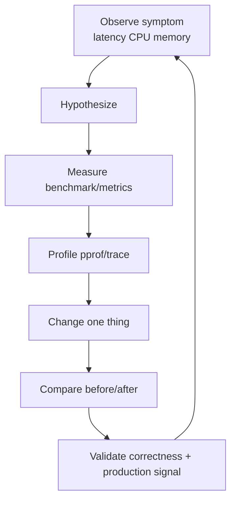
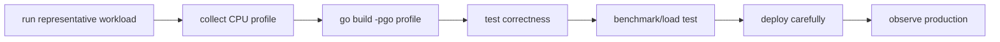

# learn-go-part-027.md

# Go Benchmarking and Profiling: testing.B, pprof, trace, runtime metrics, allocation analysis, and PGO

> Seri: `learn-go`  
> Part: `027` dari `034`  
> Target pembaca: Java software engineer yang ingin naik ke level production-grade Go engineer  
> Target Go: Go 1.26.x  
> Status seri: belum selesai

---

## 0. Tujuan Part Ini

Part 026 membahas testing: table tests, subtests, fakes, `testdata`, golden tests, fuzzing, race tests. Setelah correctness dijaga, baru kita bicara performa.

Top engineer tidak mengoptimasi berdasarkan feeling.

Mereka punya loop:

```text
observe
hypothesize
measure
profile
change
compare
validate
```

Di Go, toolchain performa sangat kuat karena built-in:

```bash
go test -bench
go test -benchmem
go test -cpuprofile
go test -memprofile
go tool pprof
go test -trace
go tool trace
runtime/metrics
net/http/pprof
go build -pgo
```

Sebagai Java engineer, kamu mungkin terbiasa dengan:

```text
JMH
JFR
async-profiler
VisualVM
Java Flight Recorder
GC logs
Micrometer metrics
JIT warmup
JMH Blackhole
```

Go punya model berbeda:

```text
ahead-of-time compiled binary
benchmark via testing.B
pprof profiles
runtime trace
runtime metrics
escape analysis
benchstat-style comparison
PGO using CPU profiles
```

Target part ini:

1. memahami benchmark Go;
2. memahami `testing.B` dan `B.Loop`;
3. memahami `-benchmem`;
4. memahami microbenchmark pitfalls;
5. memahami CPU profile;
6. memahami heap/inuse/alloc profiles;
7. memahami block/mutex/goroutine profiles;
8. memahami execution trace;
9. memahami runtime metrics;
10. memahami allocation analysis dan escape analysis;
11. memahami PGO;
12. memahami performance workflow production-grade;
13. membangun performance playbook.

---

## 1. Sumber Resmi dan Rujukan Utama

Rujukan utama:

- Package `testing`: https://pkg.go.dev/testing
- Diagnostics: https://go.dev/doc/diagnostics
- Package `runtime/pprof`: https://pkg.go.dev/runtime/pprof
- Package `net/http/pprof`: https://pkg.go.dev/net/http/pprof
- Package `runtime/trace`: https://pkg.go.dev/runtime/trace
- Package `runtime/metrics`: https://pkg.go.dev/runtime/metrics
- Profile-guided optimization: https://go.dev/doc/pgo
- Package `runtime`: https://pkg.go.dev/runtime
- Package `testing/fstest`: https://pkg.go.dev/testing/fstest
- Go 1.26 Release Notes: https://go.dev/doc/go1.26
- A Guide to the Go Garbage Collector: https://go.dev/doc/gc-guide

Catatan Go 1.26:

- `go tool pprof -http` web UI sekarang default ke flame graph view.
- `testing.B.Loop` adalah pattern benchmark modern yang direkomendasikan untuk benchmark baru.
- PGO sudah menjadi fitur production-ready sejak Go 1.21 dan memakai CPU profile representatif untuk memberi feedback ke compiler.
- Go 1.26 juga membawa banyak improvement runtime/compiler; karena itu benchmark harus selalu dibandingkan pada versi Go yang sama kecuali tujuanmu memang mengukur upgrade.

---

## 2. Mental Model Besar

### 2.1 Performance Engineering Loop



### 2.2 Benchmark vs Profile vs Metrics vs Trace

| Tool | Answers |
|---|---|
| Benchmark | how fast is this operation under controlled scenario? |
| `-benchmem` | how many bytes/op and allocs/op? |
| CPU profile | where is CPU time spent? |
| Heap profile | what memory is live? |
| Allocs profile | where are allocations created over time? |
| Block profile | where goroutines block? |
| Mutex profile | where lock contention happens? |
| Goroutine profile | where goroutines are stuck? |
| Trace | timeline of goroutines, scheduler, GC, network, blocking |
| Runtime metrics | continuous production health indicators |
| PGO | feed representative CPU profile back into compiler |

### 2.3 Performance Is Multi-Dimensional

Optimizing only one dimension can hurt another.

```text
lower latency may increase CPU
lower allocation may reduce readability
more concurrency may increase tail latency
higher GOGC may reduce CPU but increase memory
pooling may reduce allocations but increase retention/security risk
caching may reduce latency but increase live heap
```

Top engineer optimizes under explicit constraints.

---

## 3. Benchmarks with `testing.B`

### 3.1 Basic Benchmark

Benchmark functions:

```go
func BenchmarkXxx(b *testing.B) {
    ...
}
```

Classic style:

```go
func BenchmarkNormalizeStatus(b *testing.B) {
    for i := 0; i < b.N; i++ {
        _, _ = NormalizeStatus("approved")
    }
}
```

Modern style with `B.Loop`:

```go
func BenchmarkNormalizeStatus(b *testing.B) {
    for b.Loop() {
        _, _ = NormalizeStatus("approved")
    }
}
```

`B.Loop` is recommended for new benchmarks because it gives the testing package more control over benchmark timing and setup behavior.

### 3.2 Run Benchmarks

```bash
go test -bench=. ./...
```

Specific:

```bash
go test -bench=BenchmarkNormalizeStatus ./internal/case
```

### 3.3 Memory Metrics

```bash
go test -bench=. -benchmem ./...
```

Output example:

```text
BenchmarkNormalizeStatus-8    50000000    24.3 ns/op    0 B/op    0 allocs/op
```

Meaning:

```text
ns/op:
  average time per operation

B/op:
  bytes allocated per operation

allocs/op:
  allocation count per operation
```

### 3.4 Benchmark Name

Sub-benchmarks:

```go
func BenchmarkParseCaseID(b *testing.B) {
    cases := []string{
        "C-1",
        "CASE-2026-000001",
        "invalid/../../x",
    }

    for _, input := range cases {
        b.Run(input, func(b *testing.B) {
            for b.Loop() {
                _, _ = ParseCaseID(input)
            }
        })
    }
}
```

Run one:

```bash
go test -bench 'BenchmarkParseCaseID/CASE' ./...
```

---

## 4. Benchmark Setup and Timer Control

### 4.1 Exclude Setup

```go
func BenchmarkProcess(b *testing.B) {
    data := loadFixture(b)

    b.ResetTimer()

    for b.Loop() {
        Process(data)
    }
}
```

### 4.2 Stop/Start Timer

Use when setup must happen per iteration.

```go
func BenchmarkProcessWithFreshInput(b *testing.B) {
    for b.Loop() {
        b.StopTimer()
        input := makeInput()
        b.StartTimer()

        Process(input)
    }
}
```

But this can distort benchmark. Prefer designing benchmark where setup is outside.

### 4.3 Report Allocations

```go
func BenchmarkX(b *testing.B) {
    b.ReportAllocs()

    for b.Loop() {
        X()
    }
}
```

`-benchmem` globally reports memory, so `ReportAllocs` is optional if you always use `-benchmem`.

### 4.4 Set Bytes

For throughput:

```go
func BenchmarkCopy(b *testing.B) {
    data := make([]byte, 1<<20)
    b.SetBytes(int64(len(data)))

    for b.Loop() {
        dst := io.Discard
        _, _ = dst.Write(data)
    }
}
```

Output includes MB/s.

### 4.5 Avoid Measuring Compiler Optimized Away Work

Bad:

```go
func BenchmarkAdd(b *testing.B) {
    for b.Loop() {
        Add(1, 2)
    }
}
```

Compiler may eliminate result.

Use package-level sink:

```go
var sinkInt int

func BenchmarkAdd(b *testing.B) {
    for b.Loop() {
        sinkInt = Add(1, 2)
    }
}
```

For object:

```go
var sinkBytes []byte
```

### 4.6 Avoid Overusing Sink

Sinks can introduce global writes that affect benchmark. Use only to prevent elimination.

---

## 5. Microbenchmark Pitfalls

### 5.1 Benchmarking the Wrong Thing

Example:

```go
func BenchmarkJSON(b *testing.B) {
    for b.Loop() {
        data, _ := os.ReadFile("testdata/payload.json")
        json.Unmarshal(data, &v)
    }
}
```

This measures file read + JSON.

If you want JSON only:

```go
data := mustRead(b, "testdata/payload.json")
b.ResetTimer()

for b.Loop() {
    var v Payload
    if err := json.Unmarshal(data, &v); err != nil {
        b.Fatal(err)
    }
}
```

### 5.2 Unrealistic Input

Benchmark tiny input when production input is huge gives misleading results.

Use representative sizes:

```text
small
typical
large
worst accepted
```

### 5.3 Ignoring Allocations

A function with similar ns/op but fewer allocations may be better under load due to GC pressure.

### 5.4 Comparing Across Machines

Benchmark result depends on:

- CPU;
- OS;
- Go version;
- power mode;
- background load;
- container limits;
- compiler version;
- environment variables.

Compare before/after on same environment.

### 5.5 Single Run Noise

Run multiple counts:

```bash
go test -bench=. -benchmem -count=10 ./...
```

Then compare statistically with benchstat-like tooling.

### 5.6 Microbenchmark vs Production

Microbenchmark isolates operation. Production includes:

- network;
- DB;
- GC;
- scheduler;
- locks;
- caches;
- contention;
- payload variance;
- tail latency.

Use both micro and macro measurements.

---

## 6. Benchmark Example: JSON Decode

### 6.1 DTO

```go
type CasePayload struct {
    CaseID string `json:"case_id"`
    Status string `json:"status"`
    Reason string `json:"reason"`
}
```

### 6.2 Benchmark Unmarshal

```go
var sinkPayload CasePayload

func BenchmarkJSONUnmarshal(b *testing.B) {
    data := []byte(`{"case_id":"C-1","status":"APPROVED","reason":"verified"}`)

    b.ReportAllocs()
    b.ResetTimer()

    for b.Loop() {
        var p CasePayload
        if err := json.Unmarshal(data, &p); err != nil {
            b.Fatal(err)
        }
        sinkPayload = p
    }
}
```

### 6.3 Benchmark Decoder

```go
func BenchmarkJSONDecoder(b *testing.B) {
    data := []byte(`{"case_id":"C-1","status":"APPROVED","reason":"verified"}`)

    b.ReportAllocs()
    b.ResetTimer()

    for b.Loop() {
        var p CasePayload
        dec := json.NewDecoder(bytes.NewReader(data))
        if err := dec.Decode(&p); err != nil {
            b.Fatal(err)
        }
        sinkPayload = p
    }
}
```

### 6.4 Interpretation

`Unmarshal` may be better if you already have `[]byte`.

`Decoder` is better for streaming `io.Reader` boundaries.

Do not choose based only on benchmark if API boundary naturally gives stream.

---

## 7. Profiling Overview

### 7.1 Collect During Tests

CPU profile:

```bash
go test -bench=BenchmarkX -cpuprofile=cpu.out ./pkg
```

Memory profile:

```bash
go test -bench=BenchmarkX -memprofile=mem.out ./pkg
```

Block profile:

```bash
go test -bench=BenchmarkX -blockprofile=block.out ./pkg
```

Mutex profile:

```bash
go test -bench=BenchmarkX -mutexprofile=mutex.out ./pkg
```

### 7.2 Open pprof

```bash
go tool pprof cpu.out
```

Web UI:

```bash
go tool pprof -http=:0 cpu.out
```

In Go 1.26, pprof web UI defaults to flame graph view.

### 7.3 Common pprof Commands

Inside pprof:

```text
top
top -cum
list FunctionName
web
peek Name
```

### 7.4 Flat vs Cumulative

```text
flat:
  time spent directly in function

cum:
  time spent in function plus callees
```

If a high-level function has high cumulative but low flat, expensive work is inside callees.

### 7.5 Profile Is Sampling

CPU profile samples stack periodically. It is statistical, not exact tracing.

For timing timeline, use trace.

---

## 8. CPU Profiling

### 8.1 When to Use

Use CPU profile when:

- CPU high;
- throughput low;
- benchmark slow;
- service uses more CPU after deploy;
- p99 latency correlates with CPU saturation.

### 8.2 Test CPU Profile

```bash
go test -bench=BenchmarkExportCSV -cpuprofile=cpu.out ./internal/export
go tool pprof -http=:0 cpu.out
```

### 8.3 Production CPU Profile

With `net/http/pprof` enabled on protected admin port:

```bash
curl -o cpu.pprof 'http://localhost:6060/debug/pprof/profile?seconds=30'
go tool pprof -http=:0 cpu.pprof
```

### 8.4 Reading CPU Profile

Look for:

- unexpected hot functions;
- excessive formatting;
- regex compilation;
- JSON reflection hot spots;
- lock contention not visible as CPU sometimes;
- compression/encryption hot spots;
- allocation-heavy functions causing GC CPU.

### 8.5 CPU Profile Caveats

CPU profile does not show time waiting on I/O/locks as CPU. Use block/mutex/trace.

---

## 9. Heap and Allocation Profiling

### 9.1 Heap Profile

Heap profile shows live heap allocation sites.

```bash
go tool pprof http://localhost:6060/debug/pprof/heap
```

Use when:

- memory high;
- OOM;
- live heap grows;
- suspected retention.

### 9.2 Allocs Profile

Allocs profile shows allocation churn.

```bash
go tool pprof http://localhost:6060/debug/pprof/allocs
```

Use when:

- GC CPU high;
- B/op high;
- allocs/op high;
- latency affected by allocation.

### 9.3 Inuse vs Alloc Space

In pprof:

```text
inuse_space:
  currently live memory

alloc_space:
  total allocated over time
```

Interpretation:

```text
high inuse_space:
  retention / live heap

high alloc_space but low inuse:
  churn / temporary allocations
```

### 9.4 Example

If `bytes.Buffer.String()` appears high in allocs, maybe converting bytes to string repeatedly.

If `map[string]any` decode appears high, use typed DTO.

If `fmt.Sprintf` hot in allocs, consider manual formatting in hot path.

### 9.5 Memory Profile Rate

Runtime samples memory allocations. Very small allocations may be sampled statistically. Profiles are approximate.

---

## 10. Block and Mutex Profiles

### 10.1 Block Profile

Shows where goroutines block on synchronization.

Enable:

```go
runtime.SetBlockProfileRate(1)
```

Collect:

```bash
curl -o block.pprof http://localhost:6060/debug/pprof/block
go tool pprof -http=:0 block.pprof
```

Use for:

- channel blocking;
- select blocking;
- cond wait;
- network blocking may appear differently;
- contention symptoms.

### 10.2 Mutex Profile

Shows lock contention.

Enable:

```go
runtime.SetMutexProfileFraction(10)
```

Collect:

```bash
curl -o mutex.pprof http://localhost:6060/debug/pprof/mutex
```

Use for:

- hot lock;
- shared cache contention;
- registry lock;
- global map lock;
- logging lock.

### 10.3 Do Not Leave Max Profiling Always On Without Cost Awareness

Block/mutex profiling has overhead. Use sampling rates responsibly.

### 10.4 Fixing Contention

Options:

- reduce critical section;
- shard lock;
- use read-only snapshot;
- use copy-on-write;
- reduce shared state;
- use channel ownership if state machine fits;
- use `sync.Map` only if its use case matches;
- batch operations.

---

## 11. Goroutine Profile

### 11.1 Collect

```bash
curl http://localhost:6060/debug/pprof/goroutine?debug=2
```

or:

```bash
go tool pprof http://localhost:6060/debug/pprof/goroutine
```

Use when:

- goroutine count grows;
- shutdown hangs;
- deadlock suspected;
- blocked send/receive suspected;
- connection leak suspected.

### 11.2 What to Look For

Stacks blocked on:

```text
chan send
chan receive
select
net.(*conn).Read
net/http Transport
database driver
time.Sleep
sync.Mutex.Lock
sync.Cond.Wait
```

### 11.3 Go 1.26 Experimental goroutineleak Profile

Go 1.26 introduces experimental `goroutineleak` profile behind `GOEXPERIMENT=goroutineleakprofile`.

Use as additional diagnostic, not replacement for lifecycle design.

---

## 12. Runtime Trace

### 12.1 What Trace Shows

Trace shows timeline of:

- goroutine creation;
- goroutine blocking/unblocking;
- network blocking;
- syscall;
- GC;
- scheduler events;
- processor utilization;
- heap changes;
- user tasks/regions if annotated.

### 12.2 Collect from Test

```bash
go test -trace trace.out ./pkg
go tool trace trace.out
```

### 12.3 Collect Programmatically

```go
f, err := os.Create("trace.out")
if err != nil {
    return err
}
defer f.Close()

if err := trace.Start(f); err != nil {
    return err
}
defer trace.Stop()
```

### 12.4 When Trace Beats pprof

Use trace when issue is:

```text
latency timeline
goroutine scheduling
blocking behavior
network wait
GC interaction
too much concurrency
underutilized CPU
tail latency
```

CPU pprof says where CPU went. Trace says what happened over time.

### 12.5 User Regions

```go
ctx, task := trace.NewTask(ctx, "case-export")
defer task.End()

trace.WithRegion(ctx, "load-page", func() {
    loadPage(ctx)
})
```

Useful for connecting app phases to runtime trace.

---

## 13. Runtime Metrics

### 13.1 `runtime/metrics`

```go
samples := []metrics.Sample{
    {Name: "/sched/goroutines:goroutines"},
    {Name: "/gc/heap/live:bytes"},
    {Name: "/gc/heap/goal:bytes"},
}
metrics.Read(samples)
```

### 13.2 Why Runtime Metrics Matter

Profiles are snapshots/investigations.

Metrics are continuous signals.

Track:

```text
goroutine count
heap live
heap goal
GC cycles
GC pauses
GC CPU
memory classes
scheduler latency
```

Exact metric names should be read from `metrics.All()` for your Go version.

### 13.3 Exporting Metrics

Expose via your metrics system:

- Prometheus;
- OpenTelemetry;
- StatsD;
- custom.

Do not wait until incident to add runtime metrics.

### 13.4 Metrics vs Profiles

```text
metrics:
  "something is wrong"

profiles:
  "where it is wrong"

trace:
  "how it unfolded over time"
```

---

## 14. Escape Analysis

### 14.1 What Is Escape Analysis?

Compiler decides whether values can stay on stack or must escape to heap.

Heap allocation increases GC work.

### 14.2 Command

```bash
go test -gcflags=all="-m=2" ./pkg
```

or:

```bash
go build -gcflags=all="-m=2" ./cmd/service
```

### 14.3 Output Example

```text
x escapes to heap
moved to heap: buf
```

### 14.4 Common Escape Causes

- returning pointer to local;
- storing in interface;
- closure captures;
- large object;
- heap-requiring dynamic behavior;
- append growth;
- reflection;
- `fmt` usage;
- goroutine captures.

### 14.5 Do Not Fight Escape Analysis Blindly

Stack vs heap is compiler decision.

If profile says allocations matter, then inspect escape.

Do not contort code for zero allocation without evidence.

---

## 15. Allocation Optimization

### 15.1 Strategy

Order:

```text
measure allocs/op
profile alloc sites
understand lifetime
reduce unnecessary conversion
preallocate
stream
avoid retaining
consider pooling last
```

### 15.2 Preallocate Slice

```go
out := make([]Item, 0, len(in))
```

### 15.3 Preallocate Map

```go
m := make(map[string]Value, len(items))
```

### 15.4 Avoid `fmt.Sprintf` in Hot Path

```go
key := fmt.Sprintf("%s:%d", prefix, id)
```

Maybe replace with:

```go
var b strings.Builder
b.Grow(len(prefix) + 1 + 20)
b.WriteString(prefix)
b.WriteByte(':')
b.WriteString(strconv.FormatInt(id, 10))
key := b.String()
```

Measure.

### 15.5 Avoid `[]byte` <-> `string` Conversions

Conversions allocate in many cases.

If parsing bytes, keep bytes.

If map key is string, conversion may be necessary. Measure.

### 15.6 `sync.Pool`

Use for temporary buffers after benchmark/profile.

```go
var bufPool = sync.Pool{
    New: func() any {
        return new(bytes.Buffer)
    },
}
```

Remember:

- pool is not cache;
- items may be dropped;
- reset before reuse;
- clear sensitive data.

### 15.7 Data Layout

Pointer-heavy structures cost GC.

Value-dense slices can improve locality.

Before:

```go
[]*Item
```

After if semantics allow:

```go
[]Item
```

Measure CPU, memory, GC.

---

## 16. Benchmark Comparison

### 16.1 Run Multiple Counts

```bash
go test -bench=. -benchmem -count=10 ./internal/parser > old.txt
# change code
go test -bench=. -benchmem -count=10 ./internal/parser > new.txt
```

Use benchstat-like tooling to compare.

### 16.2 What to Compare

```text
ns/op
B/op
allocs/op
MB/s
p-values / confidence
variance
```

### 16.3 Avoid Benchmarking in Dirty Environment

Close heavy apps, pin environment if possible, avoid thermal throttling.

For serious benchmarking:

- same machine;
- same Go version;
- same CPU governor;
- same test data;
- multiple runs;
- no background load;
- compare statistically.

### 16.4 Benchmark in CI

Microbenchmarks in CI can be noisy. Use:

- trend tracking;
- dedicated perf environment;
- threshold only for stable benchmarks;
- avoid hard timing gates on shared CI.

---

## 17. PGO: Profile-Guided Optimization

### 17.1 What Is PGO?

Profile-guided optimization feeds representative CPU profile into compiler. Compiler can make better optimization decisions, such as inlining hot functions.

### 17.2 Collect Representative CPU Profile

From production-like workload:

```bash
curl -o default.pgo 'http://localhost:6060/debug/pprof/profile?seconds=30'
```

or benchmark/service load test.

### 17.3 Use PGO

Place `default.pgo` in main package directory, or pass:

```bash
go build -pgo=path/to/profile.pprof ./cmd/service
```

Disable:

```bash
go build -pgo=off ./cmd/service
```

### 17.4 PGO Workflow



### 17.5 Representative Profile Matters

Bad PGO profile:

```text
startup only
health checks only
synthetic tiny workload
debug endpoint workload
rare admin path
```

Good PGO profile:

```text
realistic traffic mix
hot endpoints
representative payload sizes
steady-state workload
production-like dependencies
```

### 17.6 PGO Is Not Magic

PGO does not fix:

- bad algorithms;
- unbounded allocations;
- lock contention;
- network latency;
- DB slowness;
- goroutine leaks;
- memory leaks.

Use after basic performance issues are understood.

### 17.7 PGO and Deployment

Treat profile as build input.

Version it carefully or generate in release pipeline.

Re-evaluate when workload changes significantly.

---

## 18. Production Profiling

### 18.1 Enable pprof Safely

Do not expose pprof publicly.

Pattern:

```go
go func() {
    mux := http.NewServeMux()
    mux.HandleFunc("/debug/pprof/", pprof.Index)
    mux.HandleFunc("/debug/pprof/cmdline", pprof.Cmdline)
    mux.HandleFunc("/debug/pprof/profile", pprof.Profile)
    mux.HandleFunc("/debug/pprof/symbol", pprof.Symbol)
    mux.HandleFunc("/debug/pprof/trace", pprof.Trace)

    srv := &http.Server{
        Addr:              "127.0.0.1:6060",
        Handler:           mux,
        ReadHeaderTimeout: 5 * time.Second,
    }

    _ = srv.ListenAndServe()
}()
```

In Kubernetes, expose via port-forward or admin network.

### 18.2 Security

pprof can expose:

- stack traces;
- paths;
- function names;
- query-like data in labels;
- sensitive metadata if labels include secrets.

Protect it.

### 18.3 Profile During Incident

Collect:

```bash
curl -o cpu.pprof 'http://host/debug/pprof/profile?seconds=30'
curl -o heap.pprof 'http://host/debug/pprof/heap'
curl -o goroutine.txt 'http://host/debug/pprof/goroutine?debug=2'
curl -o trace.out 'http://host/debug/pprof/trace?seconds=5'
```

Keep incident timestamp, version, traffic level.

### 18.4 Do Not Overprofile

Profiling has overhead. Use appropriate duration and sample rate.

---

## 19. Case Study: Slow CSV Export

### 19.1 Symptom

CSV export latency increased from 10s to 45s.

CPU high, memory moderate.

### 19.2 Bad Guess

```text
"DB is slow."
```

### 19.3 Measurement

Metrics:

```text
DB query duration normal
CPU high
allocs high
GC CPU increased
```

Benchmark export:

```bash
go test -bench=BenchmarkExportCSV -benchmem ./internal/export
```

CPU profile:

```bash
go test -bench=BenchmarkExportCSV -cpuprofile=cpu.out ./internal/export
```

### 19.4 Finding

pprof shows:

```text
fmt.Sprintf
strings.Join
encoding/csv escaping
bytes.Buffer growth
```

Heap profile shows large `[]string` retained.

### 19.5 Fix

Before:

```go
rows := make([]string, 0, len(cases))
for _, c := range cases {
    rows = append(rows, fmt.Sprintf("%s,%s,%s", c.ID, c.Status, c.Officer))
}
return strings.Join(rows, "\n")
```

After:

```go
func ExportCSV(w io.Writer, it Iterator) error {
    bw := bufio.NewWriter(w)
    defer bw.Flush()

    cw := csv.NewWriter(bw)
    defer cw.Flush()

    for it.Next() {
        c := it.Case()
        if err := cw.Write([]string{c.ID, c.Status, c.Officer}); err != nil {
            return err
        }
    }

    if err := it.Err(); err != nil {
        return err
    }

    cw.Flush()
    return cw.Error()
}
```

### 19.6 Validate

Run:

```bash
go test ./...
go test -bench=BenchmarkExportCSV -benchmem -count=10 ./internal/export
```

Compare:

```text
ns/op down
B/op down
allocs/op down
heap live down
```

Then production canary.

### 19.7 Lesson

Performance fix was not “use goroutines”. It was streaming and allocation reduction.

---

## 20. Case Study: High p99 Latency in Worker

### 20.1 Symptom

p99 job processing latency spikes under load.

CPU not maxed.

Goroutines high.

### 20.2 Tools

- goroutine profile;
- block profile;
- mutex profile;
- trace.

### 20.3 Finding

Goroutines blocked on sending result to unbuffered channel. Result consumer slow due to DB write.

### 20.4 Fix Options

- buffer result channel with bounded size;
- increase result writer concurrency;
- batch DB writes;
- apply backpressure intentionally;
- split critical path;
- monitor queue depth.

### 20.5 Validate

Metrics:

```text
queue depth
in-flight jobs
result write duration
worker blocked duration
p99 latency
```

Trace confirms less blocking.

---

## 21. Case Study: OOM in HTTP Client

### 21.1 Symptom

Service OOMs after downstream starts returning huge error responses.

### 21.2 Finding

Client error handling:

```go
data, _ := io.ReadAll(resp.Body)
return errors.New(string(data))
```

Reads unbounded body into memory.

### 21.3 Fix

```go
data, _ := io.ReadAll(io.LimitReader(resp.Body, 64<<10))
return &APIError{
    StatusCode: resp.StatusCode,
    BodyPreview: string(data),
}
```

Also:

- close body;
- cap logs;
- metrics for response size;
- gateway limit if possible.

### 21.4 Lesson

Performance/memory issue was serialization/client boundary bug.

---

## 22. Practical Commands

### Benchmark

```bash
go test -bench=. ./...
go test -bench=. -benchmem ./...
go test -bench=BenchmarkX -benchmem -count=10 ./pkg
```

### CPU Profile

```bash
go test -bench=BenchmarkX -cpuprofile=cpu.out ./pkg
go tool pprof -http=:0 cpu.out
```

### Memory Profile

```bash
go test -bench=BenchmarkX -memprofile=mem.out ./pkg
go tool pprof -http=:0 mem.out
```

### Trace

```bash
go test -trace trace.out ./pkg
go tool trace trace.out
```

### Escape Analysis

```bash
go test -gcflags=all="-m=2" ./pkg
```

### Production pprof

```bash
curl -o cpu.pprof 'http://localhost:6060/debug/pprof/profile?seconds=30'
curl -o heap.pprof 'http://localhost:6060/debug/pprof/heap'
curl -o trace.out 'http://localhost:6060/debug/pprof/trace?seconds=5'
```

### PGO

```bash
go build -pgo=default.pgo ./cmd/service
go build -pgo=off ./cmd/service
```

---

## 23. Hands-On Labs

### Lab 1: Basic Benchmark

Write benchmark for `ParseCaseID` with `b.Loop`.

Run:

```bash
go test -bench=. -benchmem
```

### Lab 2: Prevent Dead Code Elimination

Benchmark function returning value.

Compare result with and without package-level sink.

### Lab 3: JSON Benchmark

Compare:

- `json.Unmarshal`;
- `json.Decoder`;
- map decode;
- typed DTO decode.

Measure ns/op, B/op, allocs/op.

### Lab 4: CPU Profile

Create CPU-heavy function.

Collect `cpu.out`.

Open with pprof web UI.

Identify hotspot.

### Lab 5: Allocation Profile

Create function with repeated `fmt.Sprintf`.

Benchmark with `-benchmem`.

Profile allocs.

Optimize and compare.

### Lab 6: Block Profile

Create worker blocked on channel send.

Enable block profile.

Identify blocking site.

### Lab 7: Mutex Profile

Create contended map lock.

Enable mutex profile.

Shard lock and compare.

### Lab 8: Trace

Create pipeline with worker pool.

Collect trace.

Inspect goroutine blocking and scheduler behavior.

### Lab 9: Runtime Metrics

Write small program that prints:

```text
/sched/goroutines:goroutines
/gc/heap/live:bytes
/gc/heap/goal:bytes
```

### Lab 10: PGO

Run representative benchmark/server load.

Collect CPU profile.

Build with `-pgo`.

Benchmark before/after.

---

## 24. Review Questions

1. Apa beda benchmark, profile, trace, dan metrics?
2. Kenapa benchmark harus representative?
3. Apa fungsi `testing.B`?
4. Apa keuntungan `b.Loop`?
5. Apa arti `ns/op`, `B/op`, dan `allocs/op`?
6. Kenapa compiler dead-code elimination penting dalam benchmark?
7. Kapan memakai `b.ResetTimer`?
8. Apa beda flat dan cumulative pprof?
9. Kapan memakai CPU profile?
10. Apa beda heap profile dan allocs profile?
11. Kapan memakai block profile?
12. Kapan memakai mutex profile?
13. Kapan trace lebih baik daripada pprof?
14. Apa kegunaan runtime metrics?
15. Apa itu escape analysis?
16. Apa urutan yang sehat untuk mengurangi allocation?
17. Apa itu PGO?
18. Kenapa PGO butuh profile representatif?
19. Apa risiko membuka pprof endpoint publik?
20. Kenapa performa tidak boleh dioptimasi hanya dari feeling?

---

## 25. Code Review Checklist

Saat review benchmark/profiling/performance work:

```text
[ ] Apakah ada correctness test sebelum benchmark?
[ ] Apakah benchmark memakai input representative?
[ ] Apakah benchmark tidak mengukur setup yang tidak relevan?
[ ] Apakah benchmark mencegah dead-code elimination?
[ ] Apakah -benchmem digunakan?
[ ] Apakah hasil dibandingkan dengan multiple counts?
[ ] Apakah perubahan didukung profile, bukan feeling?
[ ] Apakah CPU profile dibaca flat dan cumulative?
[ ] Apakah heap vs allocs dibedakan?
[ ] Apakah trace dipakai untuk blocking/timeline issue?
[ ] Apakah runtime metrics tersedia di production?
[ ] Apakah optimization tidak mengorbankan readability tanpa bukti?
[ ] Apakah pooling punya benchmark dan security reset?
[ ] Apakah pprof endpoint terlindungi?
[ ] Apakah PGO profile representative?
[ ] Apakah benchmark dijalankan pada Go version yang sama?
[ ] Apakah production validation/canary dilakukan untuk perubahan besar?
```

---

## 26. Invariants

Pegang invariant berikut:

```text
Correctness first, performance second.
Benchmark answers controlled speed question.
Profile answers where cost happens.
Trace answers timeline and scheduling question.
Metrics answer continuous health question.
Measure before optimizing.
Change one variable at a time.
Use representative workload.
Do not trust single benchmark run.
B/op and allocs/op matter for GC pressure.
Heap profile is live memory.
Allocs profile is churn.
CPU profile does not show waiting time well.
Trace is powerful for goroutine/blocking latency.
PGO needs representative CPU profile.
pprof endpoint is sensitive.
```

---

## 27. Ringkasan

Benchmarking dan profiling di Go adalah superpower karena toolchain-nya built-in dan ringan.

Core workflow:

```text
go test -bench=. -benchmem
go test -cpuprofile cpu.out
go tool pprof -http=:0 cpu.out
go test -trace trace.out
go tool trace trace.out
runtime/metrics in production
```

Sebagai Java engineer, analoginya bukan persis JMH/JFR, tetapi mental modelnya sama:

```text
jangan optimasi tanpa data
pisahkan micro dan macro measurement
lihat allocation pressure
lihat CPU hotspot
lihat blocking/lock contention
lihat timeline
validasi dengan workload representatif
```

Bug performance engineering paling umum:

- benchmark tidak representative;
- setup ikut terukur;
- compiler menghapus kerja benchmark;
- hanya melihat ns/op dan lupa allocs/op;
- memakai CPU profile untuk masalah blocking;
- membaca heap profile padahal problem allocation churn;
- pprof endpoint terbuka publik;
- PGO memakai profile tidak representative;
- optimization membuat kode lebih kompleks tanpa benefit nyata.

Part berikutnya akan membahas database engineering dengan `database/sql`, connection pool, transaction boundaries, context timeout, dan scan/null handling.

---

## 28. Posisi Kita di Seri

Kita sudah menyelesaikan:

```text
000 - Orientation and Mental Model
001 - Toolchain, Workspace, Module, Build
002 - Syntax Core
003 - Functions
004 - Types
005 - Composition
006 - Interfaces
007 - Generics
008 - Error Handling
009 - Package Design
010 - Modules and Dependency Management
011 - Standard Library Mental Model
012 - Slices, Arrays, and Maps
013 - Memory Model for Application Engineers
014 - Runtime Deep Dive
015 - Go Garbage Collector
016 - Concurrency Primitives
017 - Concurrency Patterns
018 - Shared Memory Concurrency
019 - Context Propagation
020 - File, Stream, and Filesystem I/O
021 - Networking Fundamentals
022 - HTTP Server Engineering
023 - HTTP Client Engineering
024 - Serialization
025 - CLI, Daemon, and Configuration Engineering
026 - Testing
027 - Benchmarking and Profiling
```

Berikutnya:

```text
028 - Database Engineering:
      database/sql, pooling, transaction boundaries, context timeout, scan/null handling
```

Status seri: **belum selesai**.


<!-- NAVIGATION_FOOTER -->
<div class="page-nav">
<a href="./learn-go-part-026.md">⬅️ Go Testing: Table Tests, Subtests, Mocks/Fakes, testdata, Golden Tests, Fuzzing, and Race Tests</a>
<a href="./index.md">📚 Kategori</a>
<a href="../../index.md">🏠 Home</a>
<a href="./learn-go-part-028.md">Go Database Engineering: database/sql, pooling, transaction boundaries, context timeout, scan/null handling ➡️</a>
</div>
