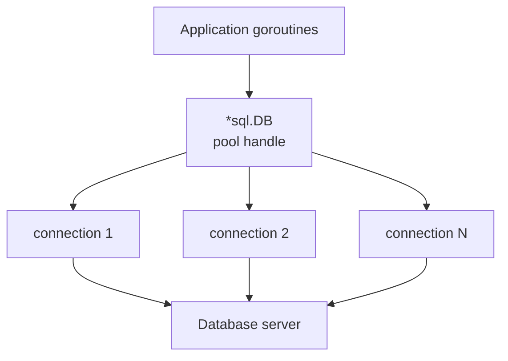
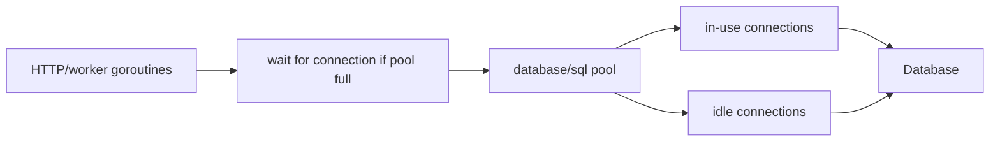
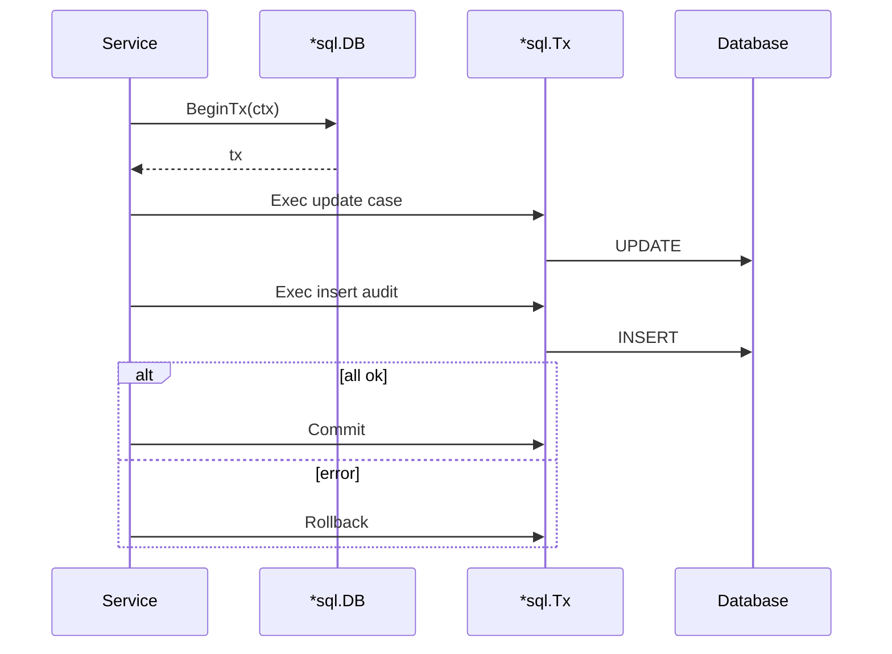
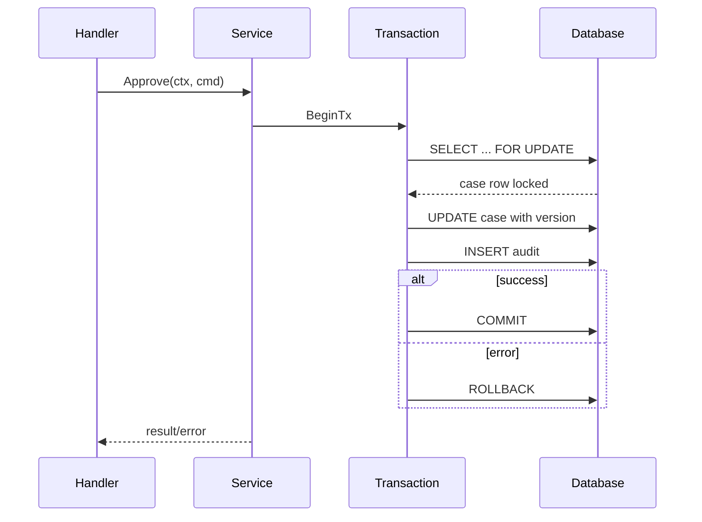

# learn-go-part-028.md

# Go Database Engineering: database/sql, pooling, transaction boundaries, context timeout, scan/null handling

> Seri: `learn-go`  
> Part: `028` dari `034`  
> Target pembaca: Java software engineer yang ingin naik ke level production-grade Go engineer  
> Target Go: Go 1.26.x  
> Status seri: belum selesai

---

## 0. Tujuan Part Ini

Part 027 membahas benchmarking dan profiling. Sekarang kita masuk ke database engineering dengan `database/sql`.

Di banyak service backend, database adalah pusat correctness dan bottleneck utama:

```text
connection pool
transaction boundary
isolation level
locking
deadlock
timeout
context cancellation
scan/null handling
prepared statement
SQL injection
pagination
N+1 query
connection leak
slow query
migration compatibility
```

Sebagai Java engineer, kamu mungkin terbiasa dengan:

```text
JDBC
DataSource
HikariCP
Spring Transaction
JPA/Hibernate
MyBatis
JdbcTemplate
@Transactional
ResultSet
PreparedStatement
Connection pool metrics
```

Di Go, standard library menyediakan package `database/sql`, yaitu abstraction umum untuk SQL driver. Ia bukan ORM. Ia adalah low-level-but-safe API untuk:

```go
sql.Open
DB.QueryContext
DB.QueryRowContext
DB.ExecContext
DB.BeginTx
Rows.Scan
Tx
Stmt
Conn
```

Target part ini:

1. memahami `database/sql` mental model;
2. memahami `*sql.DB` sebagai pool, bukan satu connection;
3. memahami connection pool tuning;
4. memahami query/exec/queryrow;
5. memahami `Rows` lifecycle;
6. memahami scan/null handling;
7. memahami context timeout/cancellation;
8. memahami transaction boundary;
9. memahami prepared statements;
10. memahami repository pattern tanpa ORM;
11. memahami pagination dan locking;
12. memahami error classification;
13. memahami observability;
14. membangun production-grade database access layer.

---

## 1. Sumber Resmi dan Rujukan Utama

Rujukan utama:

- Package `database/sql`: https://pkg.go.dev/database/sql
- Go Docs: Accessing relational databases: https://go.dev/doc/database/
- Go Docs: Executing transactions: https://go.dev/doc/database/execute-transactions
- Go Docs: Canceling in-progress operations: https://go.dev/doc/database/cancel-operations
- Go Docs: Using prepared statements: https://go.dev/doc/database/prepared-statements
- Package `context`: https://pkg.go.dev/context
- Package `errors`: https://pkg.go.dev/errors
- Package `time`: https://pkg.go.dev/time

Prinsip resmi yang penting:

- `*sql.DB` adalah database handle yang merepresentasikan pool connection, bukan satu connection.
- Gunakan `BeginTx`, `Commit`, dan `Rollback`; jangan mengirim SQL `BEGIN`/`COMMIT` manual melalui `DB.Exec`, karena bisa membuat state tidak konsisten terutama dalam program concurrent.
- Saat dalam transaction, jangan memanggil method non-transaction `sql.DB` untuk operasi yang harus berada di transaction yang sama.
- Context cancellation dapat digunakan untuk membatalkan operasi database yang sedang berjalan.
- Context yang diberikan ke `BeginTx` digunakan sampai transaction commit/rollback; jika context canceled, package `database/sql` akan rollback transaction dan `Tx.Commit` mengembalikan error.

---

## 2. Mental Model Besar

### 2.1 `*sql.DB` Bukan Connection

Nama `DB` sering menipu.

```go
db, err := sql.Open("postgres", dsn)
```

`db` bukan single connection. Ia adalah:

```text
handle
connection pool
driver coordinator
safe for concurrent use
long-lived object
```

Visual:



### 2.2 Operation Borrows Connection

Saat kamu melakukan:

```go
db.QueryContext(ctx, query)
```

`database/sql` akan:

```text
get available connection from pool
or open new one if allowed
or wait until one free
execute query
return rows/result
release connection when rows closed or operation done
```

### 2.3 Rows Hold Connection

`*sql.Rows` biasanya memegang connection sampai:

```go
rows.Close()
```

atau semua rows dibaca dan closed internally.

Rule:

```text
Always close Rows.
Always check rows.Err().
```

### 2.4 Transaction Pins One Connection

Transaction memakai satu connection selama transaction.

```go
tx, err := db.BeginTx(ctx, nil)
```

Semua operasi dalam `tx` berjalan pada connection yang sama.

Jika kamu memanggil `db.QueryContext` di tengah transaction, itu memakai connection lain dan keluar dari transaction. Ini bug besar.

---

## 3. Opening Database

### 3.1 Import Driver

`database/sql` membutuhkan driver.

Example PostgreSQL or MySQL depends on chosen driver:

```go
import (
    "database/sql"

    _ "github.com/lib/pq"
)
```

Blank import registers driver.

In production, choose driver based on maturity, maintenance, database features, and team standards.

### 3.2 `sql.Open`

```go
db, err := sql.Open("postgres", dsn)
if err != nil {
    return err
}
```

Important:

```text
sql.Open may not establish connection immediately.
Use PingContext to verify.
```

### 3.3 Ping with Timeout

```go
ctx, cancel := context.WithTimeout(context.Background(), 5*time.Second)
defer cancel()

if err := db.PingContext(ctx); err != nil {
    return fmt.Errorf("ping database: %w", err)
}
```

### 3.4 Close at Shutdown

```go
defer db.Close()
```

In server apps, close during shutdown after stopping incoming work.

### 3.5 Do Not Open Per Request

Bad:

```go
func handler(w http.ResponseWriter, r *http.Request) {
    db, _ := sql.Open(driver, dsn)
    defer db.Close()
}
```

This destroys pooling and overloads database.

Open once at startup, inject dependency.

---

## 4. Connection Pool Tuning

### 4.1 Important Settings

```go
db.SetMaxOpenConns(30)
db.SetMaxIdleConns(10)
db.SetConnMaxLifetime(30 * time.Minute)
db.SetConnMaxIdleTime(5 * time.Minute)
```

Meaning:

| Setting | Meaning |
|---|---|
| `MaxOpenConns` | max total open connections |
| `MaxIdleConns` | max idle connections kept |
| `ConnMaxLifetime` | max age of connection |
| `ConnMaxIdleTime` | max idle duration |

### 4.2 MaxOpenConns Is Backpressure

If all connections busy, new DB operations wait.

This is good if intentional.

But if too low:

```text
requests wait for DB connection
latency increases
context deadline exceeded
```

If too high:

```text
database overloaded
lock contention
memory/process pressure
more deadlocks
```

### 4.3 Pool Sizing

Start from database capacity and service replicas.

Example:

```text
DB max connections: 300
reserved admin/maintenance: 50
available for app: 250
service replicas: 10
max open conns per replica: 25
```

Then adjust based on workload.

### 4.4 Worker Count vs DB Pool

If worker count is 100 but DB pool is 10:

```text
90 workers may wait on connection
```

Maybe okay if you want backpressure. But it can waste goroutines and increase latency.

Align:

```text
worker concurrency <= DB pool capacity for DB-heavy jobs
```

### 4.5 DB Stats

```go
stats := db.Stats()
```

Important fields:

```text
OpenConnections
InUse
Idle
WaitCount
WaitDuration
MaxIdleClosed
MaxIdleTimeClosed
MaxLifetimeClosed
```

Metrics:

```text
db_open_connections
db_in_use_connections
db_idle_connections
db_wait_count_total
db_wait_duration_seconds_total
```

### 4.6 Pool Diagram



---

## 5. Exec, Query, QueryRow

### 5.1 ExecContext

Use for statements that do not return rows:

```go
res, err := db.ExecContext(ctx,
    `UPDATE cases SET status = ? WHERE id = ?`,
    status, id,
)
```

Check affected rows if needed:

```go
n, err := res.RowsAffected()
```

### 5.2 QueryContext

Use for multiple rows:

```go
rows, err := db.QueryContext(ctx,
    `SELECT id, status FROM cases WHERE status = ?`,
    status,
)
if err != nil {
    return nil, err
}
defer rows.Close()

for rows.Next() {
    var c Case
    if err := rows.Scan(&c.ID, &c.Status); err != nil {
        return nil, err
    }
    out = append(out, c)
}

if err := rows.Err(); err != nil {
    return nil, err
}
```

### 5.3 QueryRowContext

Use for single row:

```go
var c Case
err := db.QueryRowContext(ctx,
    `SELECT id, status FROM cases WHERE id = ?`,
    id,
).Scan(&c.ID, &c.Status)

if errors.Is(err, sql.ErrNoRows) {
    return Case{}, ErrCaseNotFound
}
if err != nil {
    return Case{}, err
}
```

### 5.4 QueryRow Defers Error

`QueryRowContext` returns `*Row`; actual error appears on `Scan`.

### 5.5 Placeholder Syntax Is Driver-Specific

Examples:

```text
PostgreSQL/libpq:
  $1, $2

MySQL/SQLite:
  ?, ?

Oracle:
  :1, :2 or named depending driver
```

Do not assume placeholder syntax across databases.

### 5.6 Never String-Concatenate User Input

Bad:

```go
query := "SELECT * FROM cases WHERE id = '" + id + "'"
```

Good:

```go
db.QueryRowContext(ctx, `SELECT * FROM cases WHERE id = ?`, id)
```

Parameter binding prevents SQL injection for values.

But table/column names cannot be parameterized normally. Whitelist dynamic identifiers.

---

## 6. Rows Lifecycle

### 6.1 Always Close Rows

```go
rows, err := db.QueryContext(ctx, query)
if err != nil {
    return err
}
defer rows.Close()
```

### 6.2 Always Check Rows Err

```go
if err := rows.Err(); err != nil {
    return err
}
```

Errors can happen during iteration.

### 6.3 Connection Leak

If rows not closed, connection may remain in use.

Symptoms:

```text
db.Stats().InUse increases
WaitCount increases
requests timeout waiting connection
```

### 6.4 Read All vs Stream

For small result:

```go
var out []Case
for rows.Next() { append }
```

For huge result:

- stream to writer;
- process row-by-row;
- paginate;
- avoid retaining all rows.

### 6.5 Limit Result Size

Always bound result size in APIs.

```sql
SELECT ... ORDER BY created_at DESC LIMIT ?
```

Unbounded query can destroy memory and DB.

---

## 7. Scan and Null Handling

### 7.1 Basic Scan

```go
var id string
var createdAt time.Time

err := row.Scan(&id, &createdAt)
```

Scan destination must be pointers.

### 7.2 Nullable Columns

Use `sql.NullString`, `sql.NullInt64`, `sql.NullTime`, etc.

```go
var note sql.NullString

if err := row.Scan(&note); err != nil {
    return err
}

if note.Valid {
    fmt.Println(note.String)
}
```

### 7.3 Domain Mapping

Do not leak `sql.NullString` everywhere.

Repository maps DB representation to domain/DTO.

```go
type CaseRecord struct {
    ID   string
    Note *string
}

func nullStringPtr(ns sql.NullString) *string {
    if !ns.Valid {
        return nil
    }
    return &ns.String
}
```

### 7.4 Custom Nullable Types

For better JSON and domain integration, you may define custom types, but be careful.

### 7.5 Zero Time vs Null Time

`time.Time{}` is not same as SQL NULL.

Use `sql.NullTime` or pointer.

### 7.6 Scan Column Order

Order must match query.

```go
SELECT id, status, created_at
Scan(&id, &status, &createdAt)
```

Column mismatch is common bug.

### 7.7 Avoid `SELECT *`

Use explicit columns.

Reasons:

- stable scan order;
- less data;
- compatibility;
- easier review;
- avoids unexpected columns.

---

## 8. Context and Timeouts

### 8.1 Query Timeout

```go
ctx, cancel := context.WithTimeout(parent, 2*time.Second)
defer cancel()

rows, err := db.QueryContext(ctx, query, args...)
```

### 8.2 HTTP Request Context

In handler:

```go
caseData, err := repo.Find(r.Context(), id)
```

Do not use `context.Background()` in repository.

### 8.3 Per-Operation Budget

Avoid giving every query same huge timeout.

```text
HTTP total budget: 8s
DB read: 1s
external call: 3s
DB write: 2s
```

### 8.4 Cancellation Behavior Is Driver-Dependent

`database/sql` supports context-aware operations, but actual cancellation behavior depends on driver/database.

Still use context. Test with your driver.

### 8.5 Transaction Context

From official docs: context passed to `BeginTx` is used until transaction commit/rollback; if canceled, `database/sql` rolls back, and `Tx.Commit` returns error.

Design transaction timeout carefully.

---

## 9. Transactions

### 9.1 Basic Pattern

```go
tx, err := db.BeginTx(ctx, nil)
if err != nil {
    return err
}
defer tx.Rollback()

// use tx.ExecContext / tx.QueryContext

if err := tx.Commit(); err != nil {
    return err
}

return nil
```

`defer tx.Rollback()` is safe. After successful commit, rollback returns error ignored.

### 9.2 Do Not Use DB Inside Tx

Wrong:

```go
tx, _ := db.BeginTx(ctx, nil)

tx.ExecContext(ctx, `UPDATE accounts SET ...`)
db.ExecContext(ctx, `INSERT INTO audit ...`) // outside tx
```

Correct:

```go
tx.ExecContext(ctx, `INSERT INTO audit ...`)
```

### 9.3 Transaction Helper

```go
func WithinTx(ctx context.Context, db *sql.DB, opts *sql.TxOptions, fn func(context.Context, *sql.Tx) error) (err error) {
    tx, err := db.BeginTx(ctx, opts)
    if err != nil {
        return err
    }

    defer func() {
        if err != nil {
            _ = tx.Rollback()
            return
        }
    }()

    if err = fn(ctx, tx); err != nil {
        return err
    }

    if err = tx.Commit(); err != nil {
        return err
    }

    return nil
}
```

This simple version rolls back on callback error but does not rollback if commit fails. Usually commit failure means transaction already failed/unknown; driver handles state. You can attempt rollback after commit failure, but semantics vary. Keep code explicit.

### 9.4 Better Helper with Rollback Error Awareness

```go
func WithTx(ctx context.Context, db *sql.DB, opts *sql.TxOptions, fn func(context.Context, *sql.Tx) error) error {
    tx, err := db.BeginTx(ctx, opts)
    if err != nil {
        return err
    }

    committed := false
    defer func() {
        if !committed {
            _ = tx.Rollback()
        }
    }()

    if err := fn(ctx, tx); err != nil {
        return err
    }

    if err := tx.Commit(); err != nil {
        return err
    }

    committed = true
    return nil
}
```

### 9.5 Isolation Level

```go
tx, err := db.BeginTx(ctx, &sql.TxOptions{
    Isolation: sql.LevelReadCommitted,
    ReadOnly:  false,
})
```

Isolation support is driver/database-dependent.

Common levels:

```text
Read Uncommitted
Read Committed
Repeatable Read
Serializable
```

Know your database behavior.

### 9.6 Transaction Duration

Keep transactions short.

Bad:

```text
begin tx
call external HTTP API
wait user input
process large file
commit
```

Long transaction causes:

- locks held longer;
- deadlocks;
- vacuum/undo pressure;
- pool connection pinned;
- latency.

### 9.7 Transaction Boundary Diagram



---

## 10. Repository Pattern

### 10.1 Repository Interface

Define interface at service side if useful:

```go
type CaseRepository interface {
    Find(ctx context.Context, id CaseID) (Case, error)
    Save(ctx context.Context, c Case) error
}
```

Concrete SQL implementation:

```go
type SQLCaseRepository struct {
    db *sql.DB
}
```

### 10.2 Query Method

```go
func (r *SQLCaseRepository) Find(ctx context.Context, id CaseID) (Case, error) {
    row := r.db.QueryRowContext(ctx, `
        SELECT id, status, reason, created_at
        FROM cases
        WHERE id = $1
    `, id)

    var c Case
    var reason sql.NullString

    err := row.Scan(&c.ID, &c.Status, &reason, &c.CreatedAt)
    if errors.Is(err, sql.ErrNoRows) {
        return Case{}, ErrCaseNotFound
    }
    if err != nil {
        return Case{}, fmt.Errorf("find case %s: %w", id, err)
    }

    if reason.Valid {
        c.Reason = reason.String
    }

    return c, nil
}
```

### 10.3 Save Method

```go
func (r *SQLCaseRepository) Save(ctx context.Context, c Case) error {
    res, err := r.db.ExecContext(ctx, `
        UPDATE cases
        SET status = $1, reason = $2, updated_at = $3
        WHERE id = $4
    `, c.Status, nullableString(c.Reason), c.UpdatedAt, c.ID)
    if err != nil {
        return fmt.Errorf("save case %s: %w", c.ID, err)
    }

    n, err := res.RowsAffected()
    if err != nil {
        return fmt.Errorf("save case %s rows affected: %w", c.ID, err)
    }
    if n == 0 {
        return ErrCaseNotFound
    }

    return nil
}
```

### 10.4 Transaction-Aware Repository

Problem: service needs multiple repo operations in one transaction.

Approaches:

1. repository methods accept interface implemented by `*sql.DB` and `*sql.Tx`;
2. transaction manager creates tx-bound repository;
3. unit of work pattern;
4. explicit callback with tx.

Define minimal executor:

```go
type DBTX interface {
    ExecContext(context.Context, string, ...any) (sql.Result, error)
    QueryContext(context.Context, string, ...any) (*sql.Rows, error)
    QueryRowContext(context.Context, string, ...any) *sql.Row
}
```

Repo:

```go
type SQLCaseRepository struct {
    q DBTX
}

func NewSQLCaseRepository(db *sql.DB) *SQLCaseRepository {
    return &SQLCaseRepository{q: db}
}

func (r *SQLCaseRepository) WithTx(tx *sql.Tx) *SQLCaseRepository {
    return &SQLCaseRepository{q: tx}
}
```

### 10.5 Transaction Service

```go
func (s *Service) Approve(ctx context.Context, cmd ApproveCommand) error {
    return WithTx(ctx, s.db, nil, func(ctx context.Context, tx *sql.Tx) error {
        repo := s.repo.WithTx(tx)

        c, err := repo.Find(ctx, cmd.CaseID)
        if err != nil {
            return err
        }

        if err := c.Approve(cmd.Actor, cmd.Reason); err != nil {
            return err
        }

        if err := repo.Save(ctx, c); err != nil {
            return err
        }

        return repo.InsertAudit(ctx, AuditRecord{CaseID: c.ID})
    })
}
```

### 10.6 Do Not Put Tx in Context by Default

Some code puts `*sql.Tx` in `context.Context`. This hides transaction boundary and makes call graph unclear.

Prefer explicit transaction-bound repository or callback.

Context should carry cancellation/deadline/request metadata, not core dependencies.

---

## 11. Prepared Statements

### 11.1 What Is Prepared Statement?

Prepared statement is parsed/saved SQL with placeholders, later executed with parameters.

### 11.2 DB Prepare

```go
stmt, err := db.PrepareContext(ctx, `
    SELECT id, status FROM cases WHERE id = $1
`)
if err != nil {
    return err
}
defer stmt.Close()

row := stmt.QueryRowContext(ctx, id)
```

### 11.3 When To Prepare

Potential benefits:

- repeated query;
- driver/database can reuse plan;
- clearer binding;
- performance in hot path.

But many drivers/databases already prepare/cache internally or handle query plans differently.

Do not prepare everything blindly.

### 11.4 Prepared Statement on DB vs Tx

A statement prepared on `DB` can be used concurrently and may be prepared on multiple underlying connections as needed.

A statement prepared on `Tx` is bound to that transaction/connection.

### 11.5 Statement Lifecycle

Always close statements you explicitly prepare.

### 11.6 SQL Injection

Prepared statements/parameters protect values, not identifiers.

For dynamic ORDER BY:

```go
switch sort {
case "created_at":
    orderBy = "created_at"
case "status":
    orderBy = "status"
default:
    return error
}
```

Then concatenate whitelisted identifier.

---

## 12. Error Handling and Classification

### 12.1 `sql.ErrNoRows`

```go
if errors.Is(err, sql.ErrNoRows) {
    return ErrCaseNotFound
}
```

### 12.2 Constraint Violations

Driver-specific.

PostgreSQL/MySQL/Oracle expose different error types/codes.

Wrap driver-specific mapping at repository boundary:

```go
if isUniqueViolation(err) {
    return ErrDuplicateCase
}
```

### 12.3 Deadlock/Serialization Failure

Retry may be valid for:

- serialization failure;
- deadlock detected;
- transient connection failure.

But only if operation is safe to retry.

### 12.4 Context Errors

```go
if errors.Is(err, context.Canceled) {
    return err
}
if errors.Is(err, context.DeadlineExceeded) {
    return err
}
```

Driver may wrap differently; inspect with `errors.Is/As` and driver docs.

### 12.5 Do Not Leak SQL Details

At API boundary, do not return raw SQL error to user.

Log internal detail. Return domain-safe error.

---

## 13. Pagination

### 13.1 Offset Pagination

```sql
SELECT id, status
FROM cases
ORDER BY created_at DESC, id DESC
LIMIT $1 OFFSET $2
```

Problems:

- slow for large offsets;
- inconsistent with concurrent inserts/deletes;
- expensive scan.

### 13.2 Keyset Pagination

```sql
SELECT id, status, created_at
FROM cases
WHERE (created_at, id) < ($1, $2)
ORDER BY created_at DESC, id DESC
LIMIT $3
```

Better for large datasets.

### 13.3 Stable Ordering

Always include deterministic tie-breaker:

```sql
ORDER BY created_at DESC, id DESC
```

### 13.4 Limit Max Page Size

```go
if limit <= 0 || limit > 100 {
    limit = 100
}
```

Avoid unbounded result.

---

## 14. Locking and Concurrency

### 14.1 Lost Update

Two requests:

```text
read case status SUBMITTED
both approve
both save
```

Need:

- optimistic locking;
- `SELECT ... FOR UPDATE`;
- version column;
- atomic update with condition.

### 14.2 Optimistic Locking

Table:

```sql
version integer not null
```

Update:

```sql
UPDATE cases
SET status = $1, version = version + 1
WHERE id = $2 AND version = $3
```

If rows affected 0, conflict.

### 14.3 Pessimistic Locking

Inside transaction:

```sql
SELECT id, status
FROM cases
WHERE id = $1
FOR UPDATE
```

Holds lock until commit/rollback.

Keep tx short.

### 14.4 Atomic Conditional Update

```sql
UPDATE cases
SET status = 'APPROVED'
WHERE id = $1 AND status = 'SUBMITTED'
```

Rows affected indicates success/conflict/not found depending additional checks.

### 14.5 Deadlocks

Deadlocks can occur when transactions acquire locks in different order.

Mitigation:

- consistent lock order;
- short transactions;
- retry deadlock if safe;
- indexes to avoid broad locks;
- monitor DB deadlocks.

---

## 15. N+1 Query

### 15.1 Problem

```go
cases := ListCases()
for _, c := range cases {
    c.Documents = ListDocuments(c.ID)
}
```

If 100 cases, 101 queries.

### 15.2 Batch Query

```sql
SELECT case_id, id, name
FROM documents
WHERE case_id = ANY($1)
```

or database-specific `IN`.

### 15.3 Map Results

```go
docsByCase := map[CaseID][]Document{}
for rows.Next() {
    var d Document
    rows.Scan(&d.CaseID, &d.ID, &d.Name)
    docsByCase[d.CaseID] = append(docsByCase[d.CaseID], d)
}
```

### 15.4 Trade-Off

One giant join can duplicate data.

Batching with bounded page size often best.

---

## 16. Bulk Operations

### 16.1 Single Insert Loop

```go
for _, item := range items {
    db.ExecContext(ctx, insertSQL, item...)
}
```

Simple but slow for many rows.

### 16.2 Transaction

```go
WithTx(ctx, db, nil, func(ctx context.Context, tx *sql.Tx) error {
    for _, item := range items {
        if _, err := tx.ExecContext(ctx, insertSQL, item...); err != nil {
            return err
        }
    }
    return nil
})
```

Better because one transaction.

### 16.3 Prepared Statement in Tx

```go
stmt, err := tx.PrepareContext(ctx, insertSQL)
if err != nil {
    return err
}
defer stmt.Close()

for _, item := range items {
    if _, err := stmt.ExecContext(ctx, item...); err != nil {
        return err
    }
}
```

### 16.4 Driver-Specific Bulk

For high volume, use database/driver-specific bulk load:

- PostgreSQL COPY;
- MySQL LOAD DATA;
- Oracle array binding;
- SQL Server bulk copy.

`database/sql` core is generic; driver extensions may be needed.

---

## 17. Migrations

### 17.1 Migration Is Separate Concern

`database/sql` does not manage migrations.

Use a migration tool/library or external migration process.

### 17.2 Migration Principles

- versioned;
- idempotency policy clear;
- forward compatible;
- rollback strategy;
- tested on realistic data;
- deploy order coordinated;
- avoid long locks;
- online migration for large tables.

### 17.3 App Compatibility

For zero-downtime deploy:

```text
expand:
  add nullable column / new table

deploy app:
  write both old/new if needed

backfill:
  background migration

contract:
  remove old column after all old app gone
```

---

## 18. Observability

### 18.1 Pool Metrics

From `db.Stats()`:

```go
func ObserveDBStats(db *sql.DB, observe func(name string, value float64)) {
    s := db.Stats()

    observe("db_open_connections", float64(s.OpenConnections))
    observe("db_in_use_connections", float64(s.InUse))
    observe("db_idle_connections", float64(s.Idle))
    observe("db_wait_count_total", float64(s.WaitCount))
    observe("db_wait_duration_seconds_total", s.WaitDuration.Seconds())
}
```

### 18.2 Query Metrics

Track:

```text
query duration by operation name
query error count by operation
rows returned maybe
timeout count
deadlock/retry count
transaction duration
pool wait duration if available
```

Do not use raw SQL as metric label. Use operation name:

```text
case.find_by_id
case.save
case.approve_tx
```

### 18.3 Logging

Log:

```text
operation
duration
rows affected
error category
request id
```

Avoid logging full SQL with parameters containing PII/secrets.

### 18.4 Slow Query

Database-side slow query logs are essential.

Application profile cannot replace database execution plan analysis.

### 18.5 Tracing

Use tracing instrumentation to show DB spans with operation names.

Sanitize statements.

---

## 19. Testing Database Code

### 19.1 Unit Test with Fake

Service tests use fake repository.

### 19.2 Repository Integration Tests

Test SQL repository against real DB or compatible test DB.

Use build tag:

```go
//go:build integration
```

### 19.3 Transaction Rollback Per Test

```go
tx, err := db.BeginTx(ctx, nil)
if err != nil {
    t.Fatal(err)
}
t.Cleanup(func() {
    _ = tx.Rollback()
})
```

Repository can be bound to tx.

### 19.4 Testcontainers/External DB

Not standard library, but common in production teams.

If using external DB in CI:

- isolate database/schema;
- run migrations;
- seed deterministic data;
- cleanup;
- avoid test order dependency.

### 19.5 Avoid Mocking `*sql.DB` Directly

`database/sql` interfaces are not tiny. Prefer:

- fake repository for service unit tests;
- real DB integration tests for SQL;
- small `DBTX` interface for repo internals.

### 19.6 `sqlmock`

Third-party sql mock can test generated SQL, but can become brittle. Use judiciously.

---

## 20. Production Example: Case Approval Transaction

### 20.1 Requirements

Approve case:

- case must exist;
- status must be SUBMITTED;
- update case status;
- insert audit row;
- all in one transaction;
- handle conflict;
- context timeout;
- no external HTTP inside tx.

### 20.2 SQL

```sql
SELECT id, status, version
FROM cases
WHERE id = $1
FOR UPDATE
```

Update:

```sql
UPDATE cases
SET status = $1, version = version + 1, updated_at = $2
WHERE id = $3 AND version = $4
```

Audit:

```sql
INSERT INTO audit_events(id, case_id, action, created_at)
VALUES ($1, $2, $3, $4)
```

### 20.3 Code

```go
func (s *Service) Approve(ctx context.Context, cmd ApproveCommand) error {
    ctx, cancel := context.WithTimeout(ctx, 3*time.Second)
    defer cancel()

    return WithTx(ctx, s.db, &sql.TxOptions{
        Isolation: sql.LevelReadCommitted,
    }, func(ctx context.Context, tx *sql.Tx) error {
        repo := s.repo.WithTx(tx)

        c, err := repo.FindForUpdate(ctx, cmd.CaseID)
        if err != nil {
            return err
        }

        if c.Status != StatusSubmitted {
            return ErrInvalidTransition
        }

        c.Status = StatusApproved
        c.UpdatedAt = s.clock.Now().UTC()

        if err := repo.UpdateWithVersion(ctx, c); err != nil {
            return err
        }

        return repo.InsertAudit(ctx, AuditEvent{
            ID:        NewID(),
            CaseID:    c.ID,
            Action:    "APPROVE",
            CreatedAt: c.UpdatedAt,
        })
    })
}
```

### 20.4 Repository Methods

```go
func (r *SQLCaseRepository) FindForUpdate(ctx context.Context, id CaseID) (Case, error) {
    row := r.q.QueryRowContext(ctx, `
        SELECT id, status, version
        FROM cases
        WHERE id = $1
        FOR UPDATE
    `, id)

    var c Case
    if err := row.Scan(&c.ID, &c.Status, &c.Version); err != nil {
        if errors.Is(err, sql.ErrNoRows) {
            return Case{}, ErrCaseNotFound
        }
        return Case{}, fmt.Errorf("find case for update %s: %w", id, err)
    }

    return c, nil
}

func (r *SQLCaseRepository) UpdateWithVersion(ctx context.Context, c Case) error {
    res, err := r.q.ExecContext(ctx, `
        UPDATE cases
        SET status = $1, version = version + 1, updated_at = $2
        WHERE id = $3 AND version = $4
    `, c.Status, c.UpdatedAt, c.ID, c.Version)
    if err != nil {
        return fmt.Errorf("update case %s: %w", c.ID, err)
    }

    n, err := res.RowsAffected()
    if err != nil {
        return fmt.Errorf("update case %s rows affected: %w", c.ID, err)
    }

    if n == 0 {
        return ErrConflict
    }

    return nil
}
```

### 20.5 Diagram



---

## 21. Production Example: Streaming Export from DB

### 21.1 Goal

Export cases to CSV without loading all rows.

```go
func (r *SQLCaseRepository) ExportCSV(ctx context.Context, w io.Writer, status Status) error {
    rows, err := r.db.QueryContext(ctx, `
        SELECT id, status, created_at
        FROM cases
        WHERE status = $1
        ORDER BY created_at DESC, id DESC
    `, status)
    if err != nil {
        return fmt.Errorf("query export cases: %w", err)
    }
    defer rows.Close()

    cw := csv.NewWriter(w)

    if err := cw.Write([]string{"id", "status", "created_at"}); err != nil {
        return err
    }

    for rows.Next() {
        var id string
        var status string
        var createdAt time.Time

        if err := rows.Scan(&id, &status, &createdAt); err != nil {
            return fmt.Errorf("scan export case: %w", err)
        }

        if err := cw.Write([]string{
            id,
            status,
            createdAt.Format(time.RFC3339),
        }); err != nil {
            return fmt.Errorf("write csv: %w", err)
        }
    }

    if err := rows.Err(); err != nil {
        return fmt.Errorf("iterate export cases: %w", err)
    }

    cw.Flush()
    if err := cw.Error(); err != nil {
        return fmt.Errorf("flush csv: %w", err)
    }

    return nil
}
```

### 21.2 Caveats

- long-running query holds connection;
- HTTP client disconnect should cancel context;
- DB cursor behavior driver-specific;
- consider pagination for very large export;
- consider background export to file/object storage for huge reports.

---

## 22. Common Anti-Patterns

### 22.1 Opening DB Per Request

Destroys pooling.

### 22.2 Not Closing Rows

Connection leak.

### 22.3 Ignoring `rows.Err`

Misses iteration errors.

### 22.4 `SELECT *`

Fragile scan and unnecessary data.

### 22.5 No Context Timeout

Query can run forever.

### 22.6 Transaction Too Wide

Holding locks while calling external service.

### 22.7 Mixing `db` and `tx`

Operations accidentally outside transaction.

### 22.8 SQL String Concatenation With User Input

SQL injection.

### 22.9 Unbounded Result Set

Memory and DB risk.

### 22.10 Pool Too Large

Overloads DB.

### 22.11 Pool Too Small Without Awareness

Creates hidden queue and timeouts.

### 22.12 Leaking `sql.Null*` to Domain Everywhere

Pollutes domain model.

### 22.13 Passing Tx in Context

Hides important boundary.

### 22.14 Retrying Non-Idempotent Transaction Blindly

Can duplicate side effects.

---

## 23. Practical Commands

Run tests:

```bash
go test ./...
```

Integration tests:

```bash
go test -tags=integration ./...
```

Race:

```bash
go test -race ./...
```

Benchmark repository method:

```bash
go test -bench=. -benchmem ./internal/repository
```

PostgreSQL example inspect connections:

```sql
SELECT state, count(*)
FROM pg_stat_activity
GROUP BY state;
```

MySQL example:

```sql
SHOW PROCESSLIST;
```

Database stats in app:

```go
fmt.Printf("%+v\n", db.Stats())
```

---

## 24. Hands-On Labs

### Lab 1: DB Config

Create config:

```text
dsn
max open conns
max idle conns
conn max lifetime
conn max idle time
```

Validate and apply to `*sql.DB`.

### Lab 2: QueryRow

Implement `FindCase`.

Map `sql.ErrNoRows` to `ErrCaseNotFound`.

### Lab 3: Rows Lifecycle

Implement `ListCases`.

Intentionally forget `rows.Close`, observe pool stats under load, then fix.

### Lab 4: Null Handling

Add nullable `reason`.

Map `sql.NullString` to domain pointer/string.

### Lab 5: Transaction Helper

Implement `WithTx`.

Test commit and rollback behavior with fake/integration.

### Lab 6: Optimistic Lock

Add `version` column.

Implement update with `WHERE version = ?`.

Return conflict if rows affected 0.

### Lab 7: Keyset Pagination

Implement list endpoint using cursor:

```text
created_at + id
```

### Lab 8: N+1 Fix

Implement list cases with documents.

First N+1, then batch query.

### Lab 9: Context Timeout

Create slow query.

Cancel context and verify error classification.

### Lab 10: DB Metrics

Expose `db.Stats()` metrics.

Load test and observe `WaitCount`.

---

## 25. Review Questions

1. Kenapa `*sql.DB` bukan single connection?
2. Apa yang terjadi jika `Rows` tidak ditutup?
3. Kenapa `rows.Err()` harus dicek?
4. Apa beda `ExecContext`, `QueryContext`, dan `QueryRowContext`?
5. Kenapa `QueryRow` error muncul saat `Scan`?
6. Kenapa placeholder SQL driver-specific?
7. Kenapa `SELECT *` buruk?
8. Bagaimana menangani SQL NULL?
9. Kenapa transaction pin satu connection?
10. Kenapa tidak boleh memakai `db.Exec` di dalam transaction?
11. Apa fungsi `BeginTx` context?
12. Kenapa transaction harus pendek?
13. Apa beda optimistic dan pessimistic locking?
14. Apa risiko N+1 query?
15. Apa itu keyset pagination?
16. Apa arti `MaxOpenConns` sebagai backpressure?
17. Metrics pool apa yang penting?
18. Kapan prepared statement berguna?
19. Kenapa dynamic ORDER BY harus whitelist?
20. Kenapa Tx dalam context sering buruk?

---

## 26. Code Review Checklist

Saat review database code:

```text
[ ] Apakah *sql.DB dibuat sekali dan direuse?
[ ] Apakah PingContext dilakukan saat startup?
[ ] Apakah pool dikonfigurasi?
[ ] Apakah db.Stats diexpose sebagai metrics?
[ ] Apakah semua QueryContext rows ditutup?
[ ] Apakah rows.Err dicek?
[ ] Apakah QueryRow ErrNoRows dimapping?
[ ] Apakah SQL memakai parameter binding?
[ ] Apakah dynamic identifiers di-whitelist?
[ ] Apakah query memakai explicit columns?
[ ] Apakah result set dibatasi/pagination?
[ ] Apakah context timeout dipakai?
[ ] Apakah transaction memakai BeginTx/Commit/Rollback API?
[ ] Apakah operasi dalam transaction memakai tx, bukan db?
[ ] Apakah transaction tidak melakukan external I/O?
[ ] Apakah isolation level dipilih sadar?
[ ] Apakah NULL dimapping jelas?
[ ] Apakah domain tidak dipenuhi sql.Null* tanpa alasan?
[ ] Apakah deadlock/serialization retry policy aman?
[ ] Apakah slow query/operation metrics ada?
```

---

## 27. Invariants

Pegang invariant berikut:

```text
*sql.DB is a pool handle, not one connection.
Open DB once; close on shutdown.
Rows must be closed.
Rows.Err must be checked.
QueryRow reports errors on Scan.
Use context-aware methods.
Use parameter binding for values.
Do not SELECT * for scanned structs.
Transaction pins a connection.
Do not mix db methods inside transaction.
Keep transactions short.
Map database errors to domain errors at repository boundary.
Pool sizing is part of system capacity design.
MaxOpenConns is backpressure.
Context cancellation behavior depends on driver but should always be used.
```

---

## 28. Ringkasan

`database/sql` adalah abstraction kecil tetapi sangat kuat. Ia tidak memberi ORM, tetapi memberi foundation untuk database access yang explicit, predictable, dan production-friendly.

Core mental model:

```text
*sql.DB = pool handle
Rows = connection held until closed
Tx = pinned connection
Context = cancellation/deadline
Repository = database boundary
Domain = business model, not SQL row
```

Sebagai Java engineer, mapping paling dekat adalah:

```text
*sql.DB ~ DataSource/Hikari pool handle
*sql.Tx ~ JDBC Connection with transaction
Rows ~ ResultSet
Exec/Query ~ PreparedStatement execution
```

Tetapi Go membuat lifecycle lebih eksplisit. Kamu harus menutup rows, memilih timeout, mengatur pool, dan menjaga transaction boundary.

Bug database production paling umum:

- membuka DB per request;
- rows tidak ditutup;
- pool tidak dikonfigurasi;
- query tanpa timeout;
- transaction terlalu lama;
- operasi keluar dari transaction tanpa sadar;
- unbounded result set;
- N+1 query;
- SQL injection via dynamic string;
- salah handling NULL;
- retry transaction non-idempotent;
- tidak ada metrics pool.

Part berikutnya akan membahas messaging dan async systems: Kafka/RabbitMQ-style consumers, retries, idempotency, ordering, dan poison messages.

---

## 29. Posisi Kita di Seri

Kita sudah menyelesaikan:

```text
000 - Orientation and Mental Model
001 - Toolchain, Workspace, Module, Build
002 - Syntax Core
003 - Functions
004 - Types
005 - Composition
006 - Interfaces
007 - Generics
008 - Error Handling
009 - Package Design
010 - Modules and Dependency Management
011 - Standard Library Mental Model
012 - Slices, Arrays, and Maps
013 - Memory Model for Application Engineers
014 - Runtime Deep Dive
015 - Go Garbage Collector
016 - Concurrency Primitives
017 - Concurrency Patterns
018 - Shared Memory Concurrency
019 - Context Propagation
020 - File, Stream, and Filesystem I/O
021 - Networking Fundamentals
022 - HTTP Server Engineering
023 - HTTP Client Engineering
024 - Serialization
025 - CLI, Daemon, and Configuration Engineering
026 - Testing
027 - Benchmarking and Profiling
028 - Database Engineering
```

Berikutnya:

```text
029 - Messaging and Async Systems:
      Kafka/RabbitMQ-style consumers, retries, idempotency, ordering, and poison messages
```

Status seri: **belum selesai**.


<!-- NAVIGATION_FOOTER -->
<div class="page-nav">
<a href="./learn-go-part-027.md">⬅️ Go Benchmarking and Profiling: testing.B, pprof, trace, runtime metrics, allocation analysis, and PGO</a>
<a href="./index.md">📚 Kategori</a>
<a href="../../index.md">🏠 Home</a>
<a href="./learn-go-part-029.md">Go Messaging and Async Systems: Kafka/RabbitMQ-style consumers, retries, idempotency, ordering, and poison messages ➡️</a>
</div>
