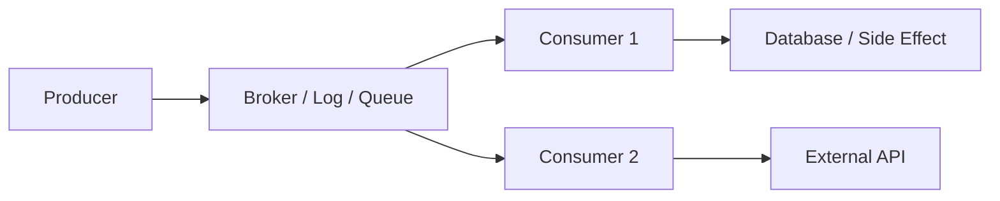
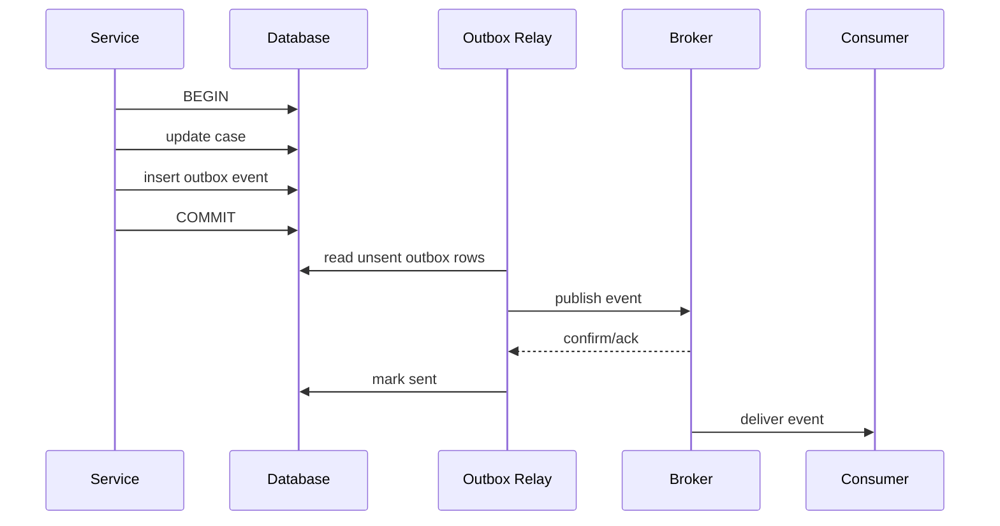
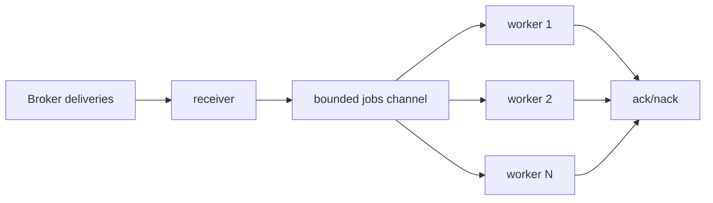
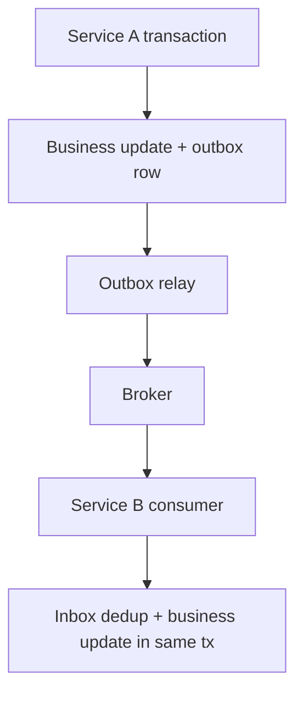
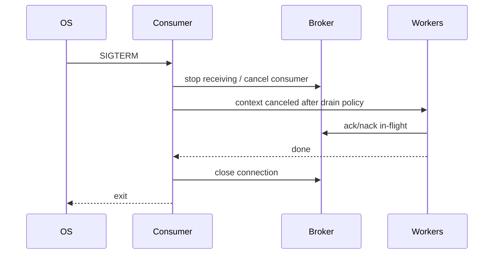
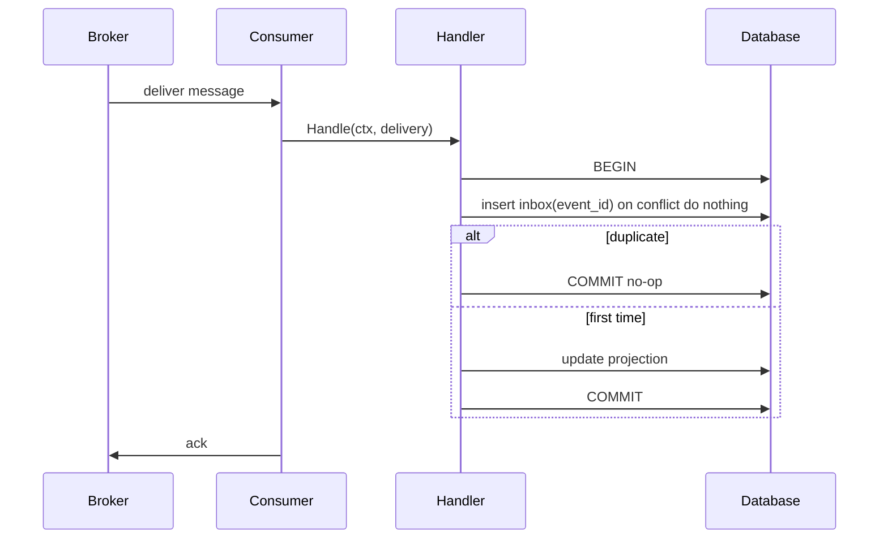

# learn-go-part-029.md

# Go Messaging and Async Systems: Kafka/RabbitMQ-style consumers, retries, idempotency, ordering, and poison messages

> Seri: `learn-go`  
> Part: `029` dari `034`  
> Target pembaca: Java software engineer yang ingin naik ke level production-grade Go engineer  
> Target Go: Go 1.26.x  
> Status seri: belum selesai

---

## 0. Tujuan Part Ini

Part 028 membahas database engineering. Sekarang kita masuk ke messaging dan asynchronous systems.

Di production backend, tidak semua pekerjaan cocok dilakukan synchronous request-response. Banyak proses lebih cocok menjadi asynchronous:

```text
send email
generate report
sync external system
process uploaded file
publish audit event
run screening engine
update search index
process webhook
retry failed downstream call
fan-out notification
event-driven integration
```

Sebagai Java engineer, kamu mungkin terbiasa dengan:

```text
Kafka Consumer/Producer
RabbitMQ listener
Spring Kafka
Spring AMQP
JMS
SQS
@KafkaListener
@TransactionalEventListener
outbox pattern
dead letter queue
consumer group
offset commit
manual ack
```

Di Go, standard library tidak menyediakan Kafka/RabbitMQ client. Tetapi Go menyediakan primitive untuk membangun consumer/producer lifecycle:

```go
context.Context
goroutine
channel
sync.WaitGroup
database/sql
net/http
log/slog
time
```

Dan library broker-specific akan mengikuti konsep yang sama:

```text
poll/deliver message
process
ack/commit
nack/requeue/dead-letter
retry
shutdown
```

Target part ini:

1. memahami mental model messaging;
2. memahami producer vs consumer;
3. memahami at-most-once, at-least-once, effectively-once;
4. memahami Kafka-style offset commit;
5. memahami RabbitMQ-style ack/nack;
6. memahami retry dan backoff;
7. memahami poison message dan DLQ;
8. memahami idempotency;
9. memahami ordering;
10. memahami outbox/inbox pattern;
11. memahami consumer worker pool;
12. memahami graceful shutdown;
13. memahami observability;
14. membangun production-grade async consumer di Go.

---

## 1. Sumber Resmi dan Rujukan Utama

Rujukan utama:

- Go Blog: Pipelines and cancellation — https://go.dev/blog/pipelines
- Go Blog: Context — https://go.dev/blog/context
- Package `context`: https://pkg.go.dev/context
- Package `sync`: https://pkg.go.dev/sync
- Package `time`: https://pkg.go.dev/time
- Apache Kafka Documentation — https://kafka.apache.org/documentation/
- Kafka delivery semantics — https://docs.confluent.io/kafka/design/delivery-semantics.html
- RabbitMQ Consumer Acknowledgements and Publisher Confirms — https://www.rabbitmq.com/docs/confirms
- RabbitMQ Dead Letter Exchanges — https://www.rabbitmq.com/docs/dlx
- RabbitMQ Reliability Guide — https://www.rabbitmq.com/docs/reliability

Prinsip dari sumber resmi:

- Kafka memisahkan producer dan consumer melalui log event, dan consumer membaca berdasarkan posisi/offset.
- Kafka default banyak dipakai dalam pola at-least-once; exactly-once membutuhkan desain transaction/idempotency dan sink yang tepat.
- RabbitMQ consumer acknowledgement mengonfirmasi ke broker bahwa delivery sudah diterima dan diproses; ini berbeda dari publisher confirm.
- RabbitMQ dead-letter exchange memindahkan pesan ke exchange lain ketika pesan ditolak, expired, melebihi delivery limit tertentu, atau kondisi dead-letter lain.
- Go context/pipeline pattern penting untuk cancellation dan shutdown consumer.

---

## 2. Mental Model Besar

### 2.1 Messaging Is Not Just Queue

Messaging system adalah boundary antar proses dengan waktu yang tidak sama.



Synchronous HTTP:

```text
caller waits for response now
```

Messaging:

```text
producer publishes intent/fact
consumer processes later
```

### 2.2 Messaging Decouples, But Adds New Failure Modes

Messaging helps:

```text
buffer spikes
decouple services
retry async work
fan-out events
improve availability
absorb slow downstream
```

But adds:

```text
duplicate delivery
out-of-order processing
poison messages
backlog
consumer lag
schema evolution
DLQ operations
offset/ack mistakes
idempotency burden
eventual consistency
```

### 2.3 Delivery Is a Contract

Every consumer must know:

```text
When is message considered done?
When do we ack/commit?
What if process crashes after side effect before ack?
What if ack succeeds but side effect failed?
What if same message appears twice?
What if message is invalid forever?
What if downstream is slow?
What if shutdown occurs mid-message?
```

If the answer is “broker handles it”, the design is incomplete.

---

## 3. Broker Models

### 3.1 Queue Model

RabbitMQ-like queue:

```text
message delivered to one consumer
consumer ack/nack
unacked messages can be redelivered
queue can have DLX/DLQ
prefetch controls in-flight deliveries
```

Good for:

- task queues;
- work distribution;
- command processing;
- per-message ack;
- routing via exchanges.

### 3.2 Log Model

Kafka-like log:

```text
messages appended to partition
consumer group reads offsets
offset commit tracks progress
retention independent of consumption
ordering per partition
```

Good for:

- event streams;
- replay;
- audit log;
- multiple independent consumers;
- high throughput;
- partitioned ordering.

### 3.3 Pub/Sub Model

One event may be delivered to multiple subscriptions/groups.

Each group/subscriber tracks its own progress.

### 3.4 In-Memory Channel Is Not Broker

Go channel:

```go
jobs := make(chan Job, 100)
```

is process-local. It does not provide:

- durability;
- replay;
- cross-process delivery;
- ack persistence;
- DLQ;
- consumer group rebalance;
- broker-level backpressure.

Use channel inside process. Use broker for inter-process durable messaging.

---

## 4. Delivery Semantics

### 4.1 At-Most-Once

Message processed zero or one time.

Pattern:

```text
commit/ack before processing
then process
```

If process crashes after ack before work, message lost.

Use for:

- metrics;
- best-effort notifications;
- non-critical telemetry.

### 4.2 At-Least-Once

Message processed one or more times.

Pattern:

```text
process
then ack/commit
```

If process crashes after side effect before ack, message redelivered.

This is common default.

Requires idempotent processing.

### 4.3 Exactly-Once

Strict exactly-once end-to-end is hard.

Broker may provide exactly-once semantics within certain boundaries, but your external side effects must also participate.

In practice, production systems often implement:

```text
effectively-once:
  at-least-once delivery + idempotent consumer + transactional state
```

### 4.4 Delivery Matrix

| Semantics | Loss? | Duplicate? | Typical Mechanism |
|---|---:|---:|---|
| at-most-once | possible | no/rare | ack before process |
| at-least-once | no if broker durable | possible | process before ack |
| effectively-once | no logical duplicate | physical duplicate possible | idempotency/dedup |
| exactly-once | constrained | constrained | broker + transaction + compatible sink |

### 4.5 Important Truth

If consumer writes to external system and then crashes before ack/commit, message may be processed again.

Therefore:

```text
Every at-least-once consumer must be idempotent.
```

---

## 5. Message Anatomy

A production message should have metadata.

```go
type Message struct {
    ID            string
    Key           string
    Topic         string
    Partition     int
    Offset        int64
    Attempt       int
    PublishedAt   time.Time
    Headers       map[string]string
    Body          []byte
}
```

Typical metadata:

```text
message_id
event_id
correlation_id
causation_id
traceparent
schema_version
event_type
aggregate_id / key
attempt
published_at
content_type
```

### 5.1 Message ID

Used for idempotency/dedup.

Must be stable across retries.

### 5.2 Key

Used for ordering/partitioning.

Example:

```text
case_id
agency_id
user_id
tenant_id
```

### 5.3 Event Type and Version

```json
{
  "event_type": "case.approved.v1",
  "event_id": "evt-123",
  "case_id": "C-1"
}
```

Breaking changes should create new version.

### 5.4 Headers vs Body

Headers:

- routing metadata;
- tracing;
- content type;
- schema version.

Body:

- business payload.

Do not put large business data in headers.

---

## 6. Producer Engineering

### 6.1 Producer Responsibilities

Producer must decide:

```text
what event/command means
message key
message id
schema version
durability requirements
retry policy
publisher confirmation
transaction/outbox
```

### 6.2 Fire-and-Forget Is Risky

Bad for critical event:

```go
producer.Publish(ctx, msg)
return nil
```

without knowing if broker accepted it.

For RabbitMQ-style systems, publisher confirms are used to know broker accepted/persisted message.

For Kafka-style producers, delivery reports/acks matter.

### 6.3 Idempotent Producer

Producer retry can duplicate messages if send result is unknown.

Use stable message ID:

```go
msg.ID = eventID
```

Consumer dedups by message ID.

Kafka producers can support idempotence/transactions depending client/broker config, but do not rely on that to make external DB side effects exactly-once automatically.

### 6.4 Transactional Outbox

Problem:

```text
update database
publish event
```

If DB commit succeeds but publish fails, state changed but event missing.

If publish succeeds but DB commit fails, event lies.

Outbox solves:

```text
same DB transaction:
  update business table
  insert outbox row

separate relay:
  reads outbox
  publishes broker message
  marks outbox sent
```

Diagram:



### 6.5 Outbox Relay Must Be Idempotent

Relay can crash after publish before mark sent.

Then it may republish same event.

Consumers still need idempotency.

### 6.6 Outbox Table

```sql
CREATE TABLE outbox_events (
    id              text primary key,
    event_type      text not null,
    aggregate_id    text not null,
    payload         jsonb not null,
    headers         jsonb not null,
    status          text not null,
    attempts        integer not null default 0,
    next_attempt_at timestamp not null,
    created_at      timestamp not null,
    published_at    timestamp null
);
```

---

## 7. Consumer Engineering

### 7.1 Consumer Responsibilities

Consumer must decide:

```text
decode
validate
deduplicate
process
commit/ack
retry
dead-letter
shutdown
metrics
```

### 7.2 Generic Consumer Interface

Broker-specific libraries differ, but application boundary can be generic.

```go
type Delivery struct {
    MessageID string
    Key       string
    Headers   map[string]string
    Body      []byte
    Attempt   int
}

type AckFunc func(context.Context) error
type NackFunc func(context.Context, NackAction) error

type NackAction int

const (
    NackRequeue NackAction = iota
    NackDeadLetter
    NackDrop
)
```

Handler:

```go
type MessageHandler interface {
    Handle(ctx context.Context, d Delivery) error
}
```

### 7.3 Process Then Ack

```go
err := handler.Handle(ctx, delivery)
if err != nil {
    nack(...)
    return
}
ack(...)
```

This gives at-least-once.

### 7.4 Ack Before Process

Only for at-most-once.

```go
ack()
handler.Handle(...)
```

Usually not acceptable for critical business events.

### 7.5 Consumer Loop

```go
func RunConsumer(ctx context.Context, source Source, handler MessageHandler) error {
    for {
        d, err := source.Receive(ctx)
        if err != nil {
            if errors.Is(err, context.Canceled) {
                return ctx.Err()
            }
            return err
        }

        if err := handler.Handle(ctx, d.Delivery); err != nil {
            _ = d.Nack(ctx, NackRequeue)
            continue
        }

        if err := d.Ack(ctx); err != nil {
            return err
        }
    }
}
```

This simple loop is sequential. For throughput, use bounded workers.

---

## 8. Bounded Consumer Worker Pool

### 8.1 Why Bound

If broker delivers faster than processing:

```text
unbounded goroutines
memory growth
DB overload
downstream overload
ack delay
consumer instability
```

Use bounded concurrency.

### 8.2 Worker Pool Shape



### 8.3 Implementation Sketch

```go
type ReceivedMessage struct {
    Delivery Delivery
    Ack      func(context.Context) error
    Nack     func(context.Context, NackAction) error
}

type Source interface {
    Receive(context.Context) (ReceivedMessage, error)
}

func RunConsumerPool(
    ctx context.Context,
    source Source,
    handler MessageHandler,
    workers int,
    queueSize int,
) error {
    jobs := make(chan ReceivedMessage, queueSize)

    var wg sync.WaitGroup

    for i := 0; i < workers; i++ {
        wg.Add(1)
        go func() {
            defer wg.Done()

            for {
                select {
                case <-ctx.Done():
                    return

                case msg, ok := <-jobs:
                    if !ok {
                        return
                    }

                    processOne(ctx, msg, handler)
                }
            }
        }()
    }

    recvErr := make(chan error, 1)

    go func() {
        defer close(jobs)

        for {
            msg, err := source.Receive(ctx)
            if err != nil {
                recvErr <- err
                return
            }

            select {
            case jobs <- msg:
            case <-ctx.Done():
                recvErr <- ctx.Err()
                return
            }
        }
    }()

    err := <-recvErr
    wg.Wait()

    if errors.Is(err, context.Canceled) {
        return nil
    }

    return err
}
```

### 8.4 Process One

```go
func processOne(ctx context.Context, msg ReceivedMessage, handler MessageHandler) {
    err := handler.Handle(ctx, msg.Delivery)
    if err != nil {
        action := classifyNack(err, msg.Delivery)
        _ = msg.Nack(ctx, action)
        return
    }

    _ = msg.Ack(ctx)
}
```

In production, ack/nack errors must be logged and classified.

### 8.5 Prefetch / Max Poll Records

Broker should also bound in-flight messages.

RabbitMQ:

```text
prefetch count
```

Kafka:

```text
max poll records / fetch size / max in-flight processing by app
```

Application worker count and broker prefetch must align.

---

## 9. Idempotent Consumer

### 9.1 Why Idempotency

At-least-once means duplicates happen.

Duplicate causes:

```text
consumer crash after DB write before ack
ack lost
broker redelivery
producer retry
outbox relay republish
rebalance
network split
manual replay
```

### 9.2 Dedup Table

```sql
CREATE TABLE processed_messages (
    consumer_name text not null,
    message_id    text not null,
    processed_at  timestamp not null,
    primary key (consumer_name, message_id)
);
```

### 9.3 Transactional Dedup

Inside same DB transaction as side effect:

```go
func (h *Handler) Handle(ctx context.Context, d Delivery) error {
    return WithTx(ctx, h.db, nil, func(ctx context.Context, tx *sql.Tx) error {
        inserted, err := h.inbox.TryInsertProcessed(ctx, tx, h.consumerName, d.MessageID)
        if err != nil {
            return err
        }

        if !inserted {
            return nil // duplicate; already processed
        }

        evt, err := DecodeEvent(d.Body)
        if err != nil {
            return PermanentError{Err: err}
        }

        return h.applyEvent(ctx, tx, evt)
    })
}
```

### 9.4 Try Insert

PostgreSQL-style:

```sql
INSERT INTO processed_messages(consumer_name, message_id, processed_at)
VALUES ($1, $2, $3)
ON CONFLICT DO NOTHING
```

Then rows affected tells if inserted.

### 9.5 Important

Dedup marker must be committed with side effect.

Bad:

```text
insert dedup
commit
do side effect
```

If side effect fails, message considered processed incorrectly.

Good:

```text
begin tx
insert dedup
apply side effect
commit
ack after commit
```

### 9.6 External Side Effects

If side effect is external HTTP API, DB transaction cannot include it.

Options:

- make external call idempotent with key;
- write local intent/outbox and separate worker calls external;
- accept at-least-once and external dedup;
- design compensation.

---

## 10. Retry Strategy

### 10.1 Classify Errors

Errors:

```text
transient:
  timeout, temporary downstream unavailable, deadlock, rate limited

permanent:
  invalid schema, validation failure, unknown enum, missing required field

poison:
  message always crashes/fails due to data/code incompatibility

infrastructure:
  DB down, broker down, network partition
```

### 10.2 Do Not Retry All Errors

Permanent invalid message should not retry forever.

```go
type PermanentError struct {
    Err error
}

func (e PermanentError) Error() string {
    return e.Err.Error()
}

func (e PermanentError) Unwrap() error {
    return e.Err
}
```

Classify:

```go
func classifyNack(err error, d Delivery) NackAction {
    var perr PermanentError
    if errors.As(err, &perr) {
        return NackDeadLetter
    }

    if d.Attempt >= 5 {
        return NackDeadLetter
    }

    return NackRequeue
}
```

### 10.3 Backoff

Immediate requeue can create hot loop.

Use:

- delayed retry queue;
- broker delay feature/plugin;
- scheduled retry topic;
- application delay with bounded worker only if safe;
- exponential backoff + jitter;
- max attempts.

### 10.4 Retry Topics Pattern

Kafka-style:

```text
main topic
retry-1m topic
retry-5m topic
retry-30m topic
DLQ topic
```

Consumer failure publishes to retry topic with attempt metadata.

Retry topic consumer republishes later or processes after delay depending system.

### 10.5 RabbitMQ DLX Retry Pattern

Common topology:

```text
main queue -> nack/dead-letter -> retry exchange/queue with TTL -> dead-letter back to main
after max attempts -> DLQ
```

But topology must be carefully designed to avoid stuck messages, retry storms, or ordering problems.

### 10.6 In-Process Sleep Retry

Bad in most consumers:

```go
time.Sleep(5 * time.Minute)
```

This holds worker slot and possibly broker delivery unacked.

Better:

- nack/requeue with broker delay;
- ack and publish retry message if safe;
- use retry topic/queue.

---

## 11. Poison Messages and DLQ

### 11.1 Poison Message

A poison message is a message that will never be successfully processed by current consumer logic.

Examples:

```text
invalid JSON
unsupported schema version
missing required field
references deleted entity
business invariant impossible
bug-triggering payload
```

### 11.2 DLQ Purpose

DLQ is not trash. It is operational quarantine.

DLQ should preserve:

```text
original message body
headers
error reason
attempt count
first failure time
last failure time
consumer name
stack/category if safe
correlation id
```

### 11.3 DLQ Operations

Need runbook:

```text
inspect
classify
fix code/data
replay
discard
alert if DLQ grows
```

### 11.4 DLQ Alert

Alert on:

```text
DLQ message count > 0 for critical topics
DLQ growth rate
oldest DLQ age
replay failures
```

### 11.5 Do Not Auto-Replay Blindly

If code bug caused DLQ, replay before fix causes loop.

Replay must be controlled.

---

## 12. Ordering

### 12.1 Ordering Scope

Ordering is rarely global.

Kafka ordering is per partition.

RabbitMQ queue can preserve queue order, but parallel consumers, redeliveries, priorities, retries, and requeue can affect observed processing order.

Define ordering requirement:

```text
per case_id
per account_id
per tenant
global
not required
```

### 12.2 Key-Based Ordering

Use message key:

```text
key = case_id
```

Kafka: same key goes to same partition, preserving order per partition.

Consumer must not process same key concurrently if order matters.

### 12.3 Parallelism vs Ordering

If you process partition messages concurrently, you can break ordering.

For Kafka-style partition:

```text
one goroutine per partition
process sequentially
commit offset after ordered processing
```

For per-key ordering in app:

```text
shard workers by key hash
same key -> same worker
```

### 12.4 Key-Sharded Worker Pool

```go
func shardFor(key string, n int) int {
    h := fnv.New32a()
    _, _ = h.Write([]byte(key))
    return int(h.Sum32() % uint32(n))
}
```

Send message to shard channel.

```go
shards[shardFor(msg.Key, len(shards))] <- msg
```

Each shard processes sequentially.

### 12.5 Retry and Ordering

If message N fails and N+1 succeeds, order broken.

Options:

- stop partition/shard until N resolved;
- send failed to retry and allow out-of-order;
- design idempotent state machine tolerant of order;
- use sequence numbers and reject out-of-order.

Ordering has cost.

---

## 13. Kafka-Style Consumer Concepts

### 13.1 Topic, Partition, Offset

```text
topic:
  named stream

partition:
  ordered append-only log shard

offset:
  position in partition
```

### 13.2 Consumer Group

Consumers in same group share partitions.

Each partition assigned to one consumer in group at a time.

### 13.3 Offset Commit

Commit says:

```text
consumer group has processed up to offset X
```

### 13.4 Commit Timing

At-most-once:

```text
commit before processing
```

At-least-once:

```text
process then commit
```

### 13.5 Rebalance

Consumer group rebalance can revoke partitions.

Consumer must handle:

- stop processing revoked partitions;
- commit processed offsets;
- avoid processing after revoke if unsafe;
- resume assigned partitions.

### 13.6 Offset with External DB

If processing writes to DB, ideally commit offset only after DB commit.

For stronger consistency, store consumed offset in same DB transaction as side effect, but then broker commit still must be coordinated. This is complex.

Practical approach:

```text
at-least-once + idempotent DB writes + commit after success
```

---

## 14. RabbitMQ-Style Consumer Concepts

### 14.1 Ack

Consumer ack tells broker message was processed.

### 14.2 Nack/Reject

Consumer can reject/nack and choose requeue or dead-letter depending broker config.

### 14.3 Prefetch

Prefetch controls unacked messages delivered to consumer.

If prefetch too high:

```text
one consumer can hold many messages
slow shutdown
memory pressure
poor fairness
```

If too low:

```text
throughput limited
```

Align prefetch with worker count.

### 14.4 Publisher Confirms

Publisher confirms are producer-side reliability mechanism. They are separate from consumer acknowledgements.

### 14.5 Dead Letter Exchange

Messages can be dead-lettered due to rejection, expiration, queue length limit, delivery limit, or other configured broker conditions.

Design DLX topology intentionally.

---

## 15. Inbox and Outbox Together

### 15.1 Outbox

Ensures local DB state change and event publication are not split.

### 15.2 Inbox

Ensures consumed message side effect is idempotent.

### 15.3 Combined Flow



### 15.4 This Is Common Production Backbone

For microservices, outbox/inbox gives reliable async integration without distributed transactions.

---

## 16. Consumer Shutdown

### 16.1 Shutdown Goals

On SIGTERM:

```text
stop receiving new messages
finish in-flight messages if possible
ack/nack appropriately
commit offsets safely
close broker connection
exit before grace period
```

### 16.2 Do Not Just Kill Process

If process dies mid-message, broker redelivers. That may be okay if idempotent, but can increase duplicate work.

### 16.3 Bounded Drain

```text
cancel receiver
close jobs channel
wait workers with timeout
nack/requeue unfinished if broker library requires
close connection
```

### 16.4 Shutdown Diagram



### 16.5 Context Use

Consumer process root context from signal.

Per-message context with timeout:

```go
msgCtx, cancel := context.WithTimeout(ctx, h.messageTimeout)
err := handler.Handle(msgCtx, delivery)
cancel()
```

Do not `defer cancel()` inside long loop; call after each message.

---

## 17. Backpressure and Lag

### 17.1 Backpressure Points

```text
broker backlog
consumer prefetch/max poll
app jobs channel
worker count
DB pool
external API rate limit
retry queue
DLQ
```

### 17.2 Lag

Kafka-style:

```text
latest offset - committed offset
```

Queue-style:

```text
ready messages + unacked messages
```

### 17.3 Lag Is Not Always Bad

Lag can be normal during spike if system catches up.

Danger signals:

```text
lag continuously grows
oldest message age exceeds SLA
retry rate high
DLQ grows
consumer error rate high
processing latency high
```

### 17.4 Scaling Consumers

Scale carefully:

- Kafka limited by partition count per group;
- RabbitMQ can scale consumers but ordering changes;
- DB/downstream may become bottleneck;
- more consumers can amplify retry storm.

---

## 18. Observability

### 18.1 Metrics

Minimum:

```text
messages_received_total
messages_processed_total
messages_failed_total
messages_retried_total
messages_dead_lettered_total
processing_duration_seconds
message_age_seconds
consumer_lag
in_flight_messages
worker_queue_depth
ack_errors_total
nack_errors_total
decode_errors_total
idempotency_duplicates_total
```

### 18.2 Labels

Use bounded labels:

```text
consumer
topic/queue
event_type
status
error_class
```

Avoid high-cardinality:

```text
message_id
case_id
user_id
raw error string
```

### 18.3 Logs

Log per failure with:

```text
message_id
event_type
attempt
error_class
correlation_id
consumer
```

Do not log full body by default.

### 18.4 Tracing

Propagate trace context through headers.

Consumer starts new span from message context.

### 18.5 Dashboards

Show:

- lag/queue depth;
- throughput;
- failure rate;
- retry rate;
- DLQ count;
- processing latency;
- message age;
- consumer restarts;
- DB/external dependency errors.

---

## 19. Schema Evolution in Events

### 19.1 Events Live Longer Than Requests

Events may be replayed months later.

Keep compatibility.

### 19.2 Version Event Type

```json
{
  "event_type": "case.approved.v1",
  "event_id": "evt-1"
}
```

### 19.3 Additive Changes

Adding optional fields is usually safe.

Removing/renaming/changing type is breaking.

### 19.4 Consumer Tolerance

Consumers should:

- ignore unknown fields if forward compatibility needed;
- validate required fields;
- reject unsupported version to DLQ or compatibility handler.

### 19.5 Replay

If events are replayable, handlers must be idempotent and compatible with old payloads.

---

## 20. Testing Messaging Code

### 20.1 Unit Test Handler

Use fake repo, fake external client.

```go
func TestHandlerDuplicateMessage(t *testing.T) {
    // arrange inbox already has message id
    // handle same message
    // assert no duplicate side effect
}
```

### 20.2 Test Error Classification

```go
tests := []struct {
    err  error
    want NackAction
}{
    {PermanentError{Err: errors.New("bad json")}, NackDeadLetter},
    {context.DeadlineExceeded, NackRequeue},
}
```

### 20.3 Test Consumer Loop with Fake Source

```go
type FakeSource struct {
    messages chan ReceivedMessage
}

func (s *FakeSource) Receive(ctx context.Context) (ReceivedMessage, error) {
    select {
    case m, ok := <-s.messages:
        if !ok {
            return ReceivedMessage{}, context.Canceled
        }
        return m, nil
    case <-ctx.Done():
        return ReceivedMessage{}, ctx.Err()
    }
}
```

### 20.4 Test Ack After Success

Fake delivery records ack/nack.

```go
type AckSpy struct {
    Acked bool
    Nacked bool
}
```

### 20.5 Integration Tests

Use real broker only in integration tests.

- Kafka test container;
- RabbitMQ test container;
- local Docker;
- CI service.

Test:

- publish/consume;
- ack/nack;
- retry route;
- DLQ route;
- consumer restart;
- duplicate delivery.

### 20.6 Avoid Sleeping

Use channels/conditions to know message processed.

Timeout only as guard.

---

## 21. Production Example: Case Approved Consumer

### 21.1 Event

```go
type CaseApprovedEventV1 struct {
    EventType  string    `json:"event_type"`
    EventID    string    `json:"event_id"`
    CaseID     string    `json:"case_id"`
    ApprovedAt time.Time `json:"approved_at"`
    ActorID    string    `json:"actor_id"`
}
```

### 21.2 Handler

```go
type CaseApprovedHandler struct {
    db           *sql.DB
    inbox        InboxRepository
    projection   ProjectionRepository
    consumerName string
}

func (h *CaseApprovedHandler) Handle(ctx context.Context, d Delivery) error {
    var evt CaseApprovedEventV1
    if err := json.Unmarshal(d.Body, &evt); err != nil {
        return PermanentError{Err: fmt.Errorf("decode event: %w", err)}
    }

    if evt.EventType != "case.approved.v1" {
        return PermanentError{Err: fmt.Errorf("unsupported event type %q", evt.EventType)}
    }

    if evt.EventID == "" || evt.CaseID == "" {
        return PermanentError{Err: errors.New("missing required event fields")}
    }

    return WithTx(ctx, h.db, nil, func(ctx context.Context, tx *sql.Tx) error {
        inserted, err := h.inbox.TryMarkProcessed(ctx, tx, h.consumerName, evt.EventID)
        if err != nil {
            return err
        }

        if !inserted {
            return nil
        }

        return h.projection.MarkApproved(ctx, tx, evt.CaseID, evt.ApprovedAt)
    })
}
```

### 21.3 Projection Update

Make update idempotent:

```sql
UPDATE case_projection
SET status = 'APPROVED',
    approved_at = $2
WHERE case_id = $1
  AND (approved_at IS NULL OR approved_at <= $2)
```

or upsert:

```sql
INSERT INTO case_projection(case_id, status, approved_at)
VALUES ($1, 'APPROVED', $2)
ON CONFLICT (case_id)
DO UPDATE SET
    status = EXCLUDED.status,
    approved_at = EXCLUDED.approved_at
```

### 21.4 Consumer Setup

```go
func RunCaseApprovedConsumer(ctx context.Context, source Source, handler *CaseApprovedHandler, cfg ConsumerConfig) error {
    return RunConsumerPool(ctx, source, handler, cfg.Workers, cfg.QueueSize)
}
```

### 21.5 Flow



---

## 22. Production Example: Outbox Relay

### 22.1 Relay Loop

```go
type OutboxRelay struct {
    repo      OutboxRepository
    producer  Producer
    batchSize int
    interval  time.Duration
}

func (r *OutboxRelay) Run(ctx context.Context) error {
    ticker := time.NewTicker(r.interval)
    defer ticker.Stop()

    for {
        if err := r.publishBatch(ctx); err != nil {
            // log and continue unless context canceled
        }

        select {
        case <-ticker.C:
        case <-ctx.Done():
            return ctx.Err()
        }
    }
}
```

### 22.2 Publish Batch

```go
func (r *OutboxRelay) publishBatch(ctx context.Context) error {
    events, err := r.repo.LockNextBatch(ctx, r.batchSize)
    if err != nil {
        return err
    }

    for _, e := range events {
        msg := Message{
            ID:      e.ID,
            Key:     e.AggregateID,
            Headers: e.Headers,
            Body:    e.Payload,
        }

        if err := r.producer.Publish(ctx, msg); err != nil {
            _ = r.repo.MarkFailed(ctx, e.ID, err)
            continue
        }

        if err := r.repo.MarkPublished(ctx, e.ID); err != nil {
            return err
        }
    }

    return nil
}
```

### 22.3 Relay Caveat

If publish succeeds but MarkPublished fails, event will republish later.

Consumers must dedup by event ID.

---

## 23. Common Anti-Patterns

### 23.1 Assuming Exactly Once Because Broker Says So

End-to-end exactly-once requires sink and side effects.

### 23.2 No Idempotency

At-least-once consumer without dedup causes duplicate business effects.

### 23.3 Ack Before Processing Critical Message

Message loss on crash.

### 23.4 Infinite Retry

Poison message loops forever.

### 23.5 Immediate Requeue Hot Loop

Consumes CPU and overloads dependency.

### 23.6 Sleeping Inside Consumer Worker for Long Retry

Holds worker and unacked message.

### 23.7 No DLQ Runbook

DLQ fills but nobody knows what to do.

### 23.8 Ignoring Ordering Requirement

Parallel consumers break business sequence.

### 23.9 Publishing Event Outside DB Transaction

State/event inconsistency.

### 23.10 No Backpressure

Unbounded goroutines or queues.

### 23.11 Logging Full Message Body

PII/secret leak.

### 23.12 High-Cardinality Metrics

Message ID as label destroys metrics system.

### 23.13 No Graceful Shutdown

Messages half-processed; more duplicates.

---

## 24. Practical Commands and Operations

Kafka examples are tool-dependent, but operational checks usually include:

```text
consumer lag
topic partitions
consumer group status
retry topic size
DLQ topic size
oldest message age
```

RabbitMQ checks usually include:

```text
queue ready count
unacked count
consumer count
redelivered rate
DLQ count
publisher confirm errors
```

Go test:

```bash
go test ./...
go test -race ./...
```

Run consumer locally:

```bash
APP_CONSUMER_WORKERS=8 go run ./cmd/case-approved-consumer
```

Inspect goroutines:

```bash
curl http://localhost:6060/debug/pprof/goroutine?debug=2
```

---

## 25. Hands-On Labs

### Lab 1: In-Memory Consumer Source

Implement fake `Source` using channel.

Run `RunConsumerPool`.

Verify ack on success.

### Lab 2: Error Classification

Implement `PermanentError`.

Map permanent errors to DLQ and transient to retry.

### Lab 3: Idempotent Consumer

Create `processed_messages` table.

Handle duplicate message and ensure side effect runs once.

### Lab 4: Outbox

Inside case approval transaction, insert outbox row.

Implement relay that publishes unsent rows.

Simulate publish success + mark sent failure.

Verify duplicate publish and consumer dedup.

### Lab 5: Ordering

Implement key-sharded worker pool.

Send messages with same key and different key.

Verify same key preserves order.

### Lab 6: Retry Backoff

Implement retry metadata:

```text
attempt
next_attempt_at
last_error
```

Move to DLQ after max attempts.

### Lab 7: Poison Message

Send invalid JSON.

Verify it goes to DLQ without infinite retry.

### Lab 8: Graceful Shutdown

Start consumer with fake slow handler.

Cancel context.

Verify receiver stops and workers drain within timeout.

### Lab 9: Metrics

Expose counters:

```text
processed
failed
retried
dead_lettered
duplicates
```

### Lab 10: Integration Broker

With local RabbitMQ/Kafka, test real publish/consume/ack/DLQ flow.

---

## 26. Review Questions

1. Apa beda queue model dan log model?
2. Apa beda at-most-once dan at-least-once?
3. Kenapa exactly-once end-to-end sulit?
4. Kenapa at-least-once consumer harus idempotent?
5. Apa itu message ID?
6. Apa itu message key?
7. Apa fungsi outbox pattern?
8. Kenapa outbox relay masih bisa publish duplicate?
9. Apa fungsi inbox/dedup table?
10. Kenapa dedup harus satu transaction dengan side effect?
11. Kapan ack dilakukan?
12. Apa risiko ack sebelum process?
13. Apa itu poison message?
14. Apa fungsi DLQ?
15. Kenapa immediate requeue berbahaya?
16. Bagaimana ordering dijaga?
17. Apa beda Kafka offset commit dan RabbitMQ ack?
18. Apa itu prefetch?
19. Metrics apa yang penting untuk consumer?
20. Bagaimana graceful shutdown consumer?

---

## 27. Code Review Checklist

Saat review messaging/async code:

```text
[ ] Apakah delivery semantics jelas?
[ ] Apakah ack/commit dilakukan setelah processing sukses?
[ ] Apakah idempotency tersedia untuk at-least-once?
[ ] Apakah message ID stabil?
[ ] Apakah dedup dilakukan satu transaction dengan side effect?
[ ] Apakah producer critical memakai outbox atau publisher confirm/acks?
[ ] Apakah retry error diklasifikasi?
[ ] Apakah retry bounded dan memakai backoff?
[ ] Apakah poison message masuk DLQ?
[ ] Apakah DLQ menyimpan metadata cukup?
[ ] Apakah ordering requirement didefinisikan?
[ ] Apakah worker concurrency bounded?
[ ] Apakah broker prefetch/max poll selaras dengan worker count?
[ ] Apakah context cancellation dipropagasi?
[ ] Apakah shutdown stop receive lalu drain in-flight?
[ ] Apakah message body tidak dilog sembarangan?
[ ] Apakah metrics lag/queue/dead-letter/retry tersedia?
[ ] Apakah event schema versioned?
[ ] Apakah integration tests mencakup broker behavior?
```

---

## 28. Invariants

Pegang invariant berikut:

```text
Messaging moves work across time and process boundaries.
At-least-once means duplicate delivery is normal.
Idempotency is not optional for critical consumers.
Ack/commit timing defines loss/duplicate behavior.
Outbox solves DB state + publish atomicity.
Inbox/dedup solves duplicate consumption.
DLQ is operational quarantine, not trash.
Retry must be bounded and classified.
Ordering is scoped, usually by key/partition.
Parallelism can break ordering.
Backpressure exists at broker, app queue, worker, DB, and downstream.
Graceful shutdown stops receiving before draining workers.
Metrics and runbooks are part of messaging design.
```

---

## 29. Ringkasan

Messaging dan async system bukan sekadar “pakai Kafka/RabbitMQ”.

Top engineer mendesain contract:

```text
delivery semantics
idempotency
ack/commit timing
retry policy
DLQ policy
ordering scope
schema evolution
backpressure
observability
shutdown
```

Sebagai Java engineer, banyak konsep akan terasa familiar dari Spring Kafka/JMS/Rabbit listener. Bedanya, di Go kamu biasanya menulis lifecycle dan boundary lebih eksplisit:

```go
context
goroutine
worker pool
repository transaction
outbox relay
inbox dedup
ack/nack decision
```

Bug async production paling umum:

- mengira broker memberi exactly-once end-to-end;
- consumer tidak idempotent;
- ack sebelum side effect;
- infinite retry;
- poison message tidak masuk DLQ;
- outbox tidak dipakai sehingga event hilang;
- ordering requirement dilanggar oleh worker pool;
- prefetch terlalu tinggi;
- no graceful shutdown;
- no lag/DLQ metrics;
- event schema berubah tanpa versioning.

Part berikutnya akan membahas security engineering: TLS, x509, crypto APIs, FIPS 140 mode, secret handling, dan secure defaults.

---

## 30. Posisi Kita di Seri

Kita sudah menyelesaikan:

```text
000 - Orientation and Mental Model
001 - Toolchain, Workspace, Module, Build
002 - Syntax Core
003 - Functions
004 - Types
005 - Composition
006 - Interfaces
007 - Generics
008 - Error Handling
009 - Package Design
010 - Modules and Dependency Management
011 - Standard Library Mental Model
012 - Slices, Arrays, and Maps
013 - Memory Model for Application Engineers
014 - Runtime Deep Dive
015 - Go Garbage Collector
016 - Concurrency Primitives
017 - Concurrency Patterns
018 - Shared Memory Concurrency
019 - Context Propagation
020 - File, Stream, and Filesystem I/O
021 - Networking Fundamentals
022 - HTTP Server Engineering
023 - HTTP Client Engineering
024 - Serialization
025 - CLI, Daemon, and Configuration Engineering
026 - Testing
027 - Benchmarking and Profiling
028 - Database Engineering
029 - Messaging and Async Systems
```

Berikutnya:

```text
030 - Security Engineering:
      TLS, x509, crypto APIs, FIPS 140 mode, secret handling, and secure defaults
```

Status seri: **belum selesai**.

<!-- NAVIGATION_FOOTER -->
<div class="page-nav">
<a href="./learn-go-part-028.md">⬅️ Go Database Engineering: database/sql, pooling, transaction boundaries, context timeout, scan/null handling</a>
<a href="./index.md">📚 Kategori</a>
<a href="../../index.md">🏠 Home</a>
<a href="./learn-go-part-030.md">Go Security Engineering: TLS, x509, crypto APIs, FIPS 140 mode, secret handling, and secure defaults ➡️</a>
</div>
