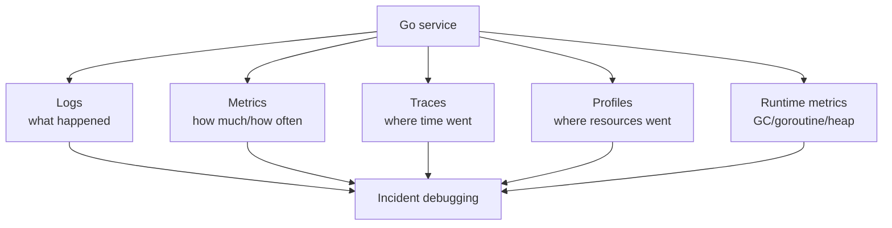

# learn-go-part-031.md

# Go Observability: structured logging with slog, metrics, tracing, pprof in production, and incident debugging

> Seri: `learn-go`  
> Part: `031` dari `034`  
> Target pembaca: Java software engineer yang ingin naik ke level production-grade Go engineer  
> Target Go: Go 1.26.x  
> Status seri: belum selesai

---

## 0. Tujuan Part Ini

Part 030 membahas security engineering. Sekarang kita masuk ke observability.

Observability bukan sekadar “ada log”. Observability adalah kemampuan menjawab pertanyaan saat sistem berjalan:

```text
Apakah service sehat?
Apa yang berubah?
Request mana yang lambat?
Dependency mana yang error?
Goroutine bocor?
Heap naik karena apa?
DB pool penuh?
Consumer lag tumbuh?
Timeout terjadi di layer mana?
Apakah deployment baru menyebabkan regresi?
```

Sebagai Java engineer, kamu mungkin terbiasa dengan:

```text
SLF4J
Logback
Log4j2
Micrometer
OpenTelemetry
Actuator
Prometheus
Grafana
JFR
async-profiler
MDC
traceId/spanId
structured logging
```

Di Go, standard library menyediakan beberapa fondasi penting:

```go
log/slog
runtime/metrics
runtime/pprof
net/http/pprof
runtime/trace
expvar
context
```

Untuk metrics/tracing production, biasanya dipakai library ecosystem seperti OpenTelemetry/Prometheus client. Namun mental modelnya tetap sama.

Target part ini:

1. memahami observability sebagai engineering discipline;
2. memahami structured logging dengan `log/slog`;
3. memahami request ID/correlation ID;
4. memahami metrics RED/USE;
5. memahami runtime metrics;
6. memahami tracing dan context propagation;
7. memahami pprof production;
8. memahami log/metric/trace relationship;
9. memahami incident debugging workflow;
10. memahami alert design;
11. memahami dashboard design;
12. memahami observability anti-patterns;
13. membangun production observability baseline untuk Go service.

---

## 1. Sumber Resmi dan Rujukan Utama

Rujukan utama:

- Package `log/slog`: https://pkg.go.dev/log/slog
- Package `runtime/metrics`: https://pkg.go.dev/runtime/metrics
- Package `runtime/pprof`: https://pkg.go.dev/runtime/pprof
- Package `net/http/pprof`: https://pkg.go.dev/net/http/pprof
- Package `runtime/trace`: https://pkg.go.dev/runtime/trace
- Go Diagnostics: https://go.dev/doc/diagnostics
- Package `expvar`: https://pkg.go.dev/expvar
- Package `context`: https://pkg.go.dev/context
- OpenTelemetry Go: https://opentelemetry.io/docs/languages/go/
- Google SRE Book: Monitoring Distributed Systems
- USE Method by Brendan Gregg
- RED Method for request-driven services

Catatan Go modern:

- `log/slog` adalah structured logging package di standard library.
- `runtime/metrics` menyediakan API stabil untuk membaca runtime metrics.
- `net/http/pprof` menyediakan endpoint profil runtime; harus dilindungi dan tidak diekspos publik.
- Go 1.26 mengubah default `go tool pprof -http` web UI menjadi flame graph view, berguna saat membaca profile.

---

## 2. Mental Model Besar

### 2.1 Observability Pillars

Umumnya disebut tiga pilar:

```text
logs
metrics
traces
```

Tetapi untuk Go production, tambahkan:

```text
profiles
runtime metrics
debug endpoints
events/audit
```

Visual:



### 2.2 Logs vs Metrics vs Traces vs Profiles

| Signal | Best For | Example |
|---|---|---|
| Logs | discrete events and context | “case approval failed due to invalid transition” |
| Metrics | aggregate health and alerting | request rate, error rate, latency |
| Traces | cross-service request path | API -> service -> DB -> external API |
| Profiles | resource usage root cause | CPU hot function, heap retention |
| Runtime metrics | Go runtime health | goroutines, heap goal, GC cycles |

### 2.3 Observability Is Designed Before Incident

Jika observability baru ditambahkan setelah incident, biasanya sudah terlambat.

Production baseline harus ada sebelum traffic:

```text
structured logs
request ID
metrics
tracing propagation
runtime metrics
pprof protected
health/readiness
version/build info
dependency metrics
error classification
```

---

## 3. Structured Logging with `slog`

### 3.1 Basic Logger

```go
logger := slog.New(slog.NewJSONHandler(os.Stdout, &slog.HandlerOptions{
    Level: slog.LevelInfo,
}))
```

Use:

```go
logger.Info("server started", "addr", ":8080")
logger.Error("request failed", "err", err, "request_id", requestID)
```

### 3.2 Why Structured Logging

Unstructured:

```text
failed to approve case C-1: invalid transition
```

Structured:

```json
{
  "time": "2026-06-22T10:00:00Z",
  "level": "ERROR",
  "msg": "approve case failed",
  "case_id": "C-1",
  "err": "invalid transition",
  "request_id": "req-123"
}
```

Structured logs enable:

- filtering by field;
- indexing;
- alert correlation;
- dashboard;
- joining with trace/request ID;
- safer redaction policy.

### 3.3 Log Levels

Typical:

```text
DEBUG:
  detailed diagnostic, disabled in prod by default

INFO:
  lifecycle and important business/technical event

WARN:
  unexpected but handled condition

ERROR:
  operation failed and needs attention or is important for debugging
```

Avoid using ERROR for expected validation failures at high volume.

### 3.4 Logger in Dependencies

Inject logger:

```go
type Service struct {
    logger *slog.Logger
}
```

Or use context-aware logger wrapper carefully.

Do not create new global logger everywhere.

### 3.5 Logger With Attributes

```go
serviceLogger := logger.With(
    "service", "case-api",
    "version", version,
)
```

In handler:

```go
reqLogger := serviceLogger.With(
    "request_id", RequestID(ctx),
    "method", r.Method,
    "path", r.URL.Path,
)
```

### 3.6 `slog.Group`

```go
logger.Info("db query",
    slog.Group("db",
        "operation", "case.find",
        "duration_ms", duration.Milliseconds(),
    ),
)
```

### 3.7 Error Logging

`slog` treats errors as values. Convention:

```go
logger.Error("db query failed", "err", err)
```

If using structured error classification:

```go
logger.Error("db query failed",
    "err", err,
    "error_class", ClassifyError(err),
)
```

### 3.8 Do Not Log Raw Request Body

Security rule:

```text
Do not log secrets, tokens, password, cookies, raw PII payload.
```

Log safe identifiers and counts.

---

## 4. Request ID and Correlation ID

### 4.1 Why Request ID

Request ID lets you connect all logs for one request.

```text
HTTP access log
handler log
service log
DB error log
outbound client log
```

### 4.2 Middleware

```go
type requestIDKey struct{}

func WithRequestID(ctx context.Context, id string) context.Context {
    return context.WithValue(ctx, requestIDKey{}, id)
}

func RequestID(ctx context.Context) string {
    v, _ := ctx.Value(requestIDKey{}).(string)
    return v
}

func RequestIDMiddleware(next http.Handler) http.Handler {
    return http.HandlerFunc(func(w http.ResponseWriter, r *http.Request) {
        id := r.Header.Get("X-Request-ID")
        if id == "" {
            id = newRequestID()
        }

        w.Header().Set("X-Request-ID", id)

        ctx := WithRequestID(r.Context(), id)
        next.ServeHTTP(w, r.WithContext(ctx))
    })
}
```

### 4.3 Request ID Generation

Use secure/random or sufficiently unique ID.

```go
func newRequestID() string {
    b := make([]byte, 16)
    if _, err := rand.Read(b); err != nil {
        return strconv.FormatInt(time.Now().UnixNano(), 36)
    }
    return hex.EncodeToString(b)
}
```

Fallback should be rare.

### 4.4 Correlation vs Trace ID

```text
request_id:
  often one inbound request

correlation_id:
  business workflow across async/sync boundaries

trace_id:
  distributed tracing identifier
```

For async message, propagate correlation ID in message headers.

### 4.5 Context Value Discipline

Context values are okay for request-scoped metadata like request ID, trace context, actor identity.

Do not use context as dependency injection container.

---

## 5. Access Logging Middleware

### 5.1 Status Recorder

```go
type statusRecorder struct {
    http.ResponseWriter
    status int
    bytes  int
}

func (r *statusRecorder) WriteHeader(status int) {
    if r.status != 0 {
        return
    }
    r.status = status
    r.ResponseWriter.WriteHeader(status)
}

func (r *statusRecorder) Write(p []byte) (int, error) {
    if r.status == 0 {
        r.status = http.StatusOK
    }
    n, err := r.ResponseWriter.Write(p)
    r.bytes += n
    return n, err
}
```

### 5.2 Middleware

```go
func AccessLog(logger *slog.Logger) func(http.Handler) http.Handler {
    return func(next http.Handler) http.Handler {
        return http.HandlerFunc(func(w http.ResponseWriter, r *http.Request) {
            start := time.Now()
            rec := &statusRecorder{ResponseWriter: w}

            next.ServeHTTP(rec, r)

            status := rec.status
            if status == 0 {
                status = http.StatusOK
            }

            logger.Info("http request",
                "method", r.Method,
                "path", r.URL.Path,
                "status", status,
                "bytes", rec.bytes,
                "duration_ms", time.Since(start).Milliseconds(),
                "request_id", RequestID(r.Context()),
            )
        })
    }
}
```

### 5.3 Route Template vs Raw Path

Raw path:

```text
/cases/C-123
/cases/C-124
```

High cardinality in metrics. Logs can include raw path if safe, but metrics should use route template:

```text
/cases/{id}
```

If using standard `ServeMux`, route template capture may need your own wrapper/registration metadata.

### 5.4 Preserve ResponseWriter Optional Interfaces

If streaming/hijacking is used, wrapper must preserve:

- `http.Flusher`;
- `http.Hijacker`;
- `io.ReaderFrom`.

Otherwise middleware can break behavior.

---

## 6. Metrics Mental Model

### 6.1 Metrics Are For Aggregates

Metrics answer:

```text
How many?
How often?
How slow?
How full?
How many errors?
Is it getting worse?
```

### 6.2 Metric Types

Common types:

```text
counter:
  monotonically increasing count

gauge:
  current value up/down

histogram:
  distribution of values

summary:
  client-side quantiles in some systems
```

### 6.3 RED Method

For request-driven services:

```text
Rate:
  requests per second

Errors:
  failed requests per second or ratio

Duration:
  latency distribution
```

HTTP metrics:

```text
http_server_requests_total{method,route,status}
http_server_request_duration_seconds{method,route,status_class}
http_server_in_flight_requests{method,route}
```

### 6.4 USE Method

For resources:

```text
Utilization:
  how busy

Saturation:
  queued/waiting work

Errors:
  failures
```

Examples:

```text
DB pool:
  utilization = in_use / max_open
  saturation = wait_count/wait_duration
  errors = query errors

worker:
  utilization = active workers / total
  saturation = queue depth
  errors = job failures
```

### 6.5 High Cardinality

Avoid labels like:

```text
user_id
case_id
request_id
message_id
raw_path_with_id
raw_error_string
```

High cardinality can break metrics systems.

Use bounded labels:

```text
method
route_template
status_class
operation
dependency
error_class
consumer_name
topic
```

---

## 7. Runtime Metrics

### 7.1 `runtime/metrics`

```go
samples := []metrics.Sample{
    {Name: "/sched/goroutines:goroutines"},
    {Name: "/gc/heap/live:bytes"},
    {Name: "/gc/heap/goal:bytes"},
}

metrics.Read(samples)
```

### 7.2 Useful Runtime Signals

Common categories:

```text
goroutine count
heap live bytes
heap goal bytes
GC cycles
GC pause distribution
scheduler latencies
memory classes
```

Metric names can evolve. Use `metrics.All()` for your Go version.

### 7.3 Runtime Dashboard

Track:

```text
goroutines
heap live
heap goal
GC CPU/pause
allocation rate
open file descriptors if available from OS/exporter
process CPU
process RSS
```

### 7.4 Interpretation

Goroutines rising forever:

```text
goroutine leak or traffic growth
```

Heap live rising forever:

```text
memory retention or cache growth
```

GC frequency high:

```text
allocation churn
```

Heap goal much larger after spike:

```text
GC pacer adjusted; check GOGC/memory limit
```

### 7.5 Go Memory Limit

Go supports runtime memory limit via `GOMEMLIMIT` / `debug.SetMemoryLimit`.

In containers, configure intentionally. Too low can increase GC CPU heavily.

---

## 8. Application Metrics

### 8.1 HTTP Server

Metrics:

```text
request count
request duration histogram
request size
response size
in-flight requests
panic count
timeout count
canceled count
```

Labels:

```text
method
route
status_class
```

### 8.2 HTTP Client

Metrics:

```text
outbound request count
outbound duration
outbound error count
retry count
timeout count
response size
in-flight outbound
```

Labels:

```text
target_service
operation
status_class
error_class
```

### 8.3 Database

From `db.Stats()`:

```text
open connections
in-use connections
idle connections
wait count
wait duration
max idle closed
max lifetime closed
```

Query metrics:

```text
operation duration
operation error count
rows affected/returned if bounded
transaction duration
deadlock/retry count
```

### 8.4 Messaging

Metrics:

```text
messages received
messages processed
messages failed
messages retried
messages dead-lettered
processing duration
message age
consumer lag
in-flight messages
worker queue depth
duplicates
```

### 8.5 Business Metrics

Examples:

```text
cases approved
cases rejected
applications submitted
payment callbacks processed
screening jobs completed
```

Business metrics should not replace audit logs.

---

## 9. Tracing

### 9.1 What Trace Is

Distributed trace follows one logical operation across services.

```text
client -> API -> service -> DB -> external API -> broker
```

Trace consists of spans.

### 9.2 Trace Context

Trace context is propagated through:

```text
HTTP headers
message headers
context.Context in process
```

### 9.3 Span Model

```text
trace:
  whole request/workflow

span:
  one operation segment

attributes:
  method, route, db operation, status

events:
  important timestamped events
```

### 9.4 Go Context

In Go, trace span context is carried through `context.Context`.

```go
func (s *Service) Approve(ctx context.Context, cmd Command) error {
    // tracing instrumentation reads/writes span in ctx
}
```

### 9.5 OpenTelemetry Shape

Conceptual example:

```go
ctx, span := tracer.Start(ctx, "case.approve")
defer span.End()

span.SetAttributes(
    attribute.String("case.id", string(cmd.CaseID)),
)
```

Use caution with attributes: do not add high-cardinality or sensitive values unless policy allows.

### 9.6 Tracing and Async Messaging

On produce:

```text
inject trace context into message headers
```

On consume:

```text
extract trace context from headers
start consumer span
```

This connects async workflows.

### 9.7 Sampling

Tracing every request may be expensive.

Strategies:

- head sampling;
- tail sampling;
- always sample errors;
- sample high-latency;
- lower rate for high-volume endpoints.

---

## 10. pprof in Production

### 10.1 Why pprof

Metrics say:

```text
CPU high
heap high
goroutines high
```

pprof says:

```text
which functions/stacks caused it
```

### 10.2 Protected pprof Server

```go
func RunPprofServer(addr string, logger *slog.Logger) *http.Server {
    mux := http.NewServeMux()

    mux.HandleFunc("/debug/pprof/", pprof.Index)
    mux.HandleFunc("/debug/pprof/cmdline", pprof.Cmdline)
    mux.HandleFunc("/debug/pprof/profile", pprof.Profile)
    mux.HandleFunc("/debug/pprof/symbol", pprof.Symbol)
    mux.HandleFunc("/debug/pprof/trace", pprof.Trace)

    srv := &http.Server{
        Addr:              addr,
        Handler:           mux,
        ReadHeaderTimeout: 5 * time.Second,
    }

    go func() {
        logger.Info("pprof server starting", "addr", addr)
        if err := srv.ListenAndServe(); err != nil && err != http.ErrServerClosed {
            logger.Error("pprof server failed", "err", err)
        }
    }()

    return srv
}
```

Bind to:

```text
127.0.0.1:6060
```

or internal/admin network only.

### 10.3 Collect Profiles

CPU:

```bash
curl -o cpu.pprof 'http://localhost:6060/debug/pprof/profile?seconds=30'
go tool pprof -http=:0 cpu.pprof
```

Heap:

```bash
curl -o heap.pprof 'http://localhost:6060/debug/pprof/heap'
go tool pprof -http=:0 heap.pprof
```

Goroutine:

```bash
curl 'http://localhost:6060/debug/pprof/goroutine?debug=2' > goroutine.txt
```

Trace:

```bash
curl -o trace.out 'http://localhost:6060/debug/pprof/trace?seconds=5'
go tool trace trace.out
```

### 10.4 Security

pprof can leak implementation details and sometimes sensitive context.

Never expose publicly.

### 10.5 When To Collect

Collect during symptom, not after it disappears.

Keep metadata:

```text
service version
pod/host
time
traffic level
incident id
profile duration
```

---

## 11. Logs + Metrics + Traces + Profiles Together

### 11.1 Example Incident

Alert:

```text
p95 latency high on POST /cases/{id}/approve
```

Metrics:

```text
HTTP duration high
DB query duration normal
outbound CPDS client duration high
timeout count rising
```

Trace:

```text
span shows external API call consumes 90% time
```

Logs:

```text
error_class=external_timeout target=cpds
request_id=req-123
```

Profile:

```text
CPU normal, goroutine profile shows many waiting on HTTP client
```

Conclusion:

```text
downstream CPDS slow; tune timeout/retry/circuit/backpressure; communicate dependency incident
```

### 11.2 Another Incident

Alert:

```text
memory high, pod restarting
```

Metrics:

```text
heap live rises
goroutines stable
GC CPU rising
```

Heap profile:

```text
large retention in cache map
```

Logs:

```text
cache warming after deploy
```

Fix:

```text
bounded cache / TTL / memory limit / reduce retained values
```

---

## 12. Error Classification

### 12.1 Why Classify

Raw errors are too noisy.

Classify into bounded categories:

```text
validation
not_found
conflict
permission
authn
authz
timeout
canceled
dependency
database
serialization
rate_limited
internal
```

### 12.2 Error Class Function

```go
func ErrorClass(err error) string {
    switch {
    case err == nil:
        return ""
    case errors.Is(err, context.Canceled):
        return "canceled"
    case errors.Is(err, context.DeadlineExceeded):
        return "timeout"
    case errors.Is(err, ErrValidation):
        return "validation"
    case errors.Is(err, ErrNotFound):
        return "not_found"
    case errors.Is(err, ErrConflict):
        return "conflict"
    default:
        return "internal"
    }
}
```

Use class in:

- logs;
- metrics labels;
- traces;
- error responses.

### 12.3 Avoid Raw Error as Metric Label

Bad:

```text
error="dial tcp 10.1.2.3:443: i/o timeout"
```

Good:

```text
error_class="timeout"
target="cpds"
```

---

## 13. Alerting

### 13.1 Alert on User Impact

Good alerts:

```text
high error rate
high latency
consumer lag exceeds SLA
DLQ growing
database pool saturated
pod crash loop
certificate expires soon
disk full
```

Bad alerts:

```text
single 500
CPU > 80% for 1 minute without impact
log contains "error" once
```

### 13.2 SLO-Based Alert

Example:

```text
99% of requests to /cases submit succeed under 1s over 30 days
```

Alert when burn rate too high.

### 13.3 Multi-Window Alert

Example concept:

```text
fast burn:
  high error budget burn over 5m and 1h

slow burn:
  moderate burn over 6h and 3d
```

This reduces noise.

### 13.4 Alert Must Have Runbook

Every page-worthy alert should answer:

```text
What does it mean?
How to verify?
Common causes?
First actions?
Rollback conditions?
Escalation?
Dashboards?
Queries?
```

---

## 14. Dashboard Design

### 14.1 Service Overview

Panels:

```text
request rate
error rate
latency p50/p95/p99
in-flight requests
CPU/memory
goroutines
restarts
dependency errors
```

### 14.2 Dependency Dashboard

For each dependency:

```text
outbound request rate
error rate
latency
timeout count
retry count
circuit state if any
DB pool stats
consumer lag
```

### 14.3 Runtime Dashboard

```text
heap live
heap goal
allocation rate
GC pauses
GC cycles
goroutine count
thread count if available
```

### 14.4 Messaging Dashboard

```text
lag
oldest message age
processed/sec
failed/sec
retry/sec
DLQ count
worker queue depth
in-flight messages
```

### 14.5 Deployment Overlay

Show version/deployment timestamp on graphs.

Many incidents are “what changed?”

---

## 15. Incident Debugging Workflow

### 15.1 First 5 Minutes

Ask:

```text
What is impacted?
When did it start?
What changed?
Is it one endpoint or all?
Is it one dependency or all?
Is it one pod/zone or all?
Is error rate or latency the problem?
```

### 15.2 Use RED

For request issue:

```text
Rate
Errors
Duration
```

### 15.3 Use USE

For resource issue:

```text
Utilization
Saturation
Errors
```

### 15.4 Gather Evidence

```text
dashboards
logs around request_id
traces for slow request
pprof if CPU/memory/goroutine
DB pool stats
downstream metrics
deployment events
```

### 15.5 Stabilize Before Root Cause

Actions:

```text
rollback
scale out
disable feature flag
increase timeout only if safe
reduce traffic
pause consumer
drain queue
switch dependency
clear bad config
```

Then root-cause.

### 15.6 Avoid Guess-Driven Changes

One change at a time if possible.

Record timestamp.

---

## 16. Production Example: Observability Baseline

### 16.1 App Info

```go
type BuildInfo struct {
    Service string
    Version string
    Commit  string
}

func LogStartup(logger *slog.Logger, info BuildInfo, cfg SafeConfigSummary) {
    logger.Info("service starting",
        "service", info.Service,
        "version", info.Version,
        "commit", info.Commit,
        "addr", cfg.Addr,
        "log_level", cfg.LogLevel,
    )
}
```

Do not include secrets.

### 16.2 HTTP Middleware Chain

```go
handler := Chain(
    mux,
    Recover(logger),
    RequestIDMiddleware,
    AccessLog(logger),
    MetricsMiddleware(metrics),
    TracingMiddleware(tracer),
    SecurityHeaders,
)
```

Order matters.

### 16.3 Dependency Instrumentation

HTTP client RoundTripper:

```go
type ObservedRoundTripper struct {
    Base   http.RoundTripper
    Logger *slog.Logger
}

func (rt ObservedRoundTripper) RoundTrip(req *http.Request) (*http.Response, error) {
    start := time.Now()

    base := rt.Base
    if base == nil {
        base = http.DefaultTransport
    }

    resp, err := base.RoundTrip(req)

    status := 0
    if resp != nil {
        status = resp.StatusCode
    }

    rt.Logger.Info("outbound http request",
        "method", req.Method,
        "host", req.URL.Host,
        "path", req.URL.Path,
        "status", status,
        "duration_ms", time.Since(start).Milliseconds(),
        "error_class", ErrorClass(err),
    )

    return resp, err
}
```

### 16.4 DB Metrics Poller

```go
func PollDBStats(ctx context.Context, db *sql.DB, interval time.Duration, observe func(sql.DBStats)) {
    ticker := time.NewTicker(interval)
    defer ticker.Stop()

    for {
        observe(db.Stats())

        select {
        case <-ticker.C:
        case <-ctx.Done():
            return
        }
    }
}
```

### 16.5 Runtime Metrics Poller

```go
func ReadRuntimeBasics() map[string]uint64 {
    samples := []metrics.Sample{
        {Name: "/sched/goroutines:goroutines"},
        {Name: "/gc/heap/live:bytes"},
        {Name: "/gc/heap/goal:bytes"},
    }

    metrics.Read(samples)

    out := map[string]uint64{}
    for _, s := range samples {
        switch s.Value.Kind() {
        case metrics.KindUint64:
            out[s.Name] = s.Value.Uint64()
        }
    }

    return out
}
```

---

## 17. Production Example: Debugging Goroutine Leak

### 17.1 Symptom

Metrics:

```text
goroutines rising from 200 to 20,000
memory slowly rising
latency increasing
```

### 17.2 First Check

Collect goroutine profile:

```bash
curl 'http://localhost:6060/debug/pprof/goroutine?debug=2' > goroutine.txt
```

### 17.3 Finding

Many stacks:

```text
goroutine ...
net/http.(*persistConn).readLoop
...
```

or:

```text
goroutine ...
chan send
internal/worker.processOne
```

### 17.4 Possible Causes

HTTP client:

```text
response body not closed
too many clients/transports
hanging requests without timeout
```

Channel:

```text
producer sends to channel after consumer exits
unbounded goroutine per message
no context cancellation
```

### 17.5 Fix

Depending cause:

- close response body;
- reuse client;
- add timeout;
- close channel on shutdown;
- bounded worker pool;
- context-aware send/receive.

### 17.6 Regression Test

Add test for cancellation and body close if possible.

---

## 18. Production Example: DB Pool Saturation

### 18.1 Symptom

Metrics:

```text
db_in_use_connections = max
db_wait_count increasing
db_wait_duration increasing
HTTP latency high
DB CPU normal
```

### 18.2 Meaning

App goroutines wait for DB connection.

Causes:

- MaxOpenConns too low;
- rows leak;
- long transactions;
- slow queries;
- too many concurrent workers;
- DB pool shared by streaming export.

### 18.3 Investigation

Check:

- rows.Close coverage;
- transaction duration metrics;
- slow query logs;
- goroutine profile;
- route causing DB saturation;
- recent deployment.

### 18.4 Fix Options

- fix rows leak;
- reduce transaction scope;
- tune pool;
- reduce worker concurrency;
- paginate/stream carefully;
- isolate export DB pool/read replica;
- add query timeout.

---

## 19. Production Example: High CPU

### 19.1 Symptom

```text
CPU 95%
latency high
RPS same
errors low
```

### 19.2 Collect CPU Profile

```bash
curl -o cpu.pprof 'http://localhost:6060/debug/pprof/profile?seconds=30'
go tool pprof -http=:0 cpu.pprof
```

### 19.3 Finding Examples

```text
encoding/json
regexp.Compile
fmt.Sprintf
crypto/tls
compress/gzip
runtime.gcBgMarkWorker
```

### 19.4 Interpretation

- `runtime.gcBgMarkWorker` high: allocation pressure.
- `regexp.Compile` high: compiling regex per request.
- `fmt.Sprintf` high: formatting hot path.
- `encoding/json` high: serialization bottleneck.
- `crypto/tls` high: no connection reuse / handshakes.

### 19.5 Fix

Evidence-based:

- reuse regex;
- reduce allocations;
- stream JSON;
- connection pooling;
- cache carefully;
- optimize hot path only.

---

## 20. Testing Observability

### 20.1 Test Logger Output

For critical logs, use buffer handler:

```go
var buf bytes.Buffer
logger := slog.New(slog.NewJSONHandler(&buf, nil))

logger.Info("test", "request_id", "req-1")

if !strings.Contains(buf.String(), "req-1") {
    t.Fatal("missing request_id")
}
```

Do not over-test log exact formatting unless contract.

### 20.2 Test Metrics

Expose metrics recorder interface:

```go
type Recorder interface {
    Inc(name string, labels ...string)
    Observe(name string, value float64, labels ...string)
}
```

Use fake recorder in tests.

### 20.3 Test Request ID Middleware

```go
req := httptest.NewRequest(http.MethodGet, "/", nil)
rec := httptest.NewRecorder()

handler := RequestIDMiddleware(http.HandlerFunc(func(w http.ResponseWriter, r *http.Request) {
    if RequestID(r.Context()) == "" {
        t.Fatal("missing request id")
    }
}))

handler.ServeHTTP(rec, req)
```

### 20.4 Test No Secret Logging

For security-sensitive code, test that token does not appear in logs.

```go
if strings.Contains(buf.String(), secret) {
    t.Fatal("secret leaked in log")
}
```

---

## 21. Common Anti-Patterns

### 21.1 Logs Only, No Metrics

Cannot alert or aggregate well.

### 21.2 Metrics Only, No Logs

Hard to debug individual failures.

### 21.3 Traces Without Sampling Strategy

Cost explosion.

### 21.4 Request ID Not Propagated

Logs cannot be correlated.

### 21.5 High-Cardinality Metric Labels

Metrics backend overload.

### 21.6 Raw Error String as Label

Unbounded cardinality.

### 21.7 Logging Secrets

Security incident.

### 21.8 pprof Public

Information disclosure and possible DoS.

### 21.9 No Runtime Metrics

Go-specific issues invisible.

### 21.10 No Deployment Annotation

Hard to answer “what changed?”

### 21.11 Alert on Symptoms Nobody Cares About

Alert fatigue.

### 21.12 No Runbook

On-call wakes up but has no action path.

---

## 22. Practical Commands

### Run Tests

```bash
go test ./...
```

### pprof CPU

```bash
curl -o cpu.pprof 'http://localhost:6060/debug/pprof/profile?seconds=30'
go tool pprof -http=:0 cpu.pprof
```

### pprof Heap

```bash
curl -o heap.pprof 'http://localhost:6060/debug/pprof/heap'
go tool pprof -http=:0 heap.pprof
```

### Goroutine Dump

```bash
curl 'http://localhost:6060/debug/pprof/goroutine?debug=2'
```

### Trace

```bash
curl -o trace.out 'http://localhost:6060/debug/pprof/trace?seconds=5'
go tool trace trace.out
```

### Build Info

```bash
go version
go env GOVERSION
```

---

## 23. Hands-On Labs

### Lab 1: slog JSON Logger

Create logger with JSON handler.

Add service/version fields.

### Lab 2: Request ID Middleware

Implement request ID propagation.

Log request ID in handler.

### Lab 3: Access Log Middleware

Record method, path, status, bytes, duration.

### Lab 4: Error Classification

Implement `ErrorClass(err)` and use it in logs/metrics.

### Lab 5: Runtime Metrics

Read:

```text
/sched/goroutines:goroutines
/gc/heap/live:bytes
/gc/heap/goal:bytes
```

Expose or print periodically.

### Lab 6: DB Stats Metrics

Poll `db.Stats()` and emit metrics.

### Lab 7: pprof Protected Server

Run pprof on `127.0.0.1:6060`.

Collect CPU/heap/goroutine.

### Lab 8: Goroutine Leak Debug

Create intentional goroutine leak.

Detect with goroutine metric and profile.

Fix leak.

### Lab 9: Trace Propagation

Pass request ID/correlation ID from HTTP request to outbound HTTP request and async message header.

### Lab 10: Incident Runbook

Write runbook for:

```text
high HTTP latency
high DB pool wait
consumer lag high
memory leak
```

---

## 24. Review Questions

1. Apa beda logs, metrics, traces, profiles?
2. Kenapa structured logging lebih baik dari plain text logs?
3. Apa fungsi request ID?
4. Apa beda request ID, correlation ID, dan trace ID?
5. Apa itu RED method?
6. Apa itu USE method?
7. Kenapa metric label high-cardinality berbahaya?
8. Runtime metrics Go apa yang penting?
9. Kapan memakai pprof?
10. Kenapa pprof tidak boleh publik?
11. Kapan trace lebih berguna daripada CPU profile?
12. Apa itu error classification?
13. Kenapa raw error string buruk sebagai metric label?
14. Apa dashboard minimum untuk HTTP service?
15. Apa dashboard minimum untuk messaging consumer?
16. Apa yang harus dilakukan saat DB pool saturated?
17. Apa yang harus dicek saat goroutine count naik?
18. Apa alert yang baik?
19. Kenapa alert harus punya runbook?
20. Bagaimana menguji secret tidak bocor di log?

---

## 25. Code Review Checklist

Saat review observability code:

```text
[ ] Apakah logs structured?
[ ] Apakah service/version/environment ditambahkan?
[ ] Apakah request ID dibuat dan dipropagasi?
[ ] Apakah correlation ID/trace context dipropagasi ke outbound call/message?
[ ] Apakah access log mencatat status/duration/bytes?
[ ] Apakah error diklasifikasi?
[ ] Apakah raw error string tidak dipakai sebagai metric label?
[ ] Apakah metrics RED tersedia untuk HTTP?
[ ] Apakah metrics USE tersedia untuk resource penting?
[ ] Apakah DB pool stats diexpose?
[ ] Apakah messaging lag/DLQ/retry metrics tersedia?
[ ] Apakah runtime metrics Go tersedia?
[ ] Apakah pprof tersedia tapi terlindungi?
[ ] Apakah logs tidak membocorkan secret/token/body sensitif?
[ ] Apakah metrics labels bounded?
[ ] Apakah tracing tidak memasukkan PII/high-cardinality tanpa policy?
[ ] Apakah dashboards menjawab health/dependency/runtime?
[ ] Apakah alert punya runbook?
[ ] Apakah deployment/version terlihat di observability?
```

---

## 26. Invariants

Pegang invariant berikut:

```text
Logs explain events.
Metrics explain aggregate health.
Traces explain request path.
Profiles explain resource cost.
Runtime metrics expose Go-specific health.
Request ID must be present in every request log.
Metric labels must be bounded.
Do not log secrets.
Do not expose pprof publicly.
Alert on user impact and actionable symptoms.
Every page-worthy alert needs a runbook.
Observability must exist before incident.
```

---

## 27. Ringkasan

Observability adalah kemampuan memahami sistem saat berjalan.

Di Go, fondasi pentingnya:

```go
log/slog
runtime/metrics
net/http/pprof
runtime/trace
context
```

Dan dalam production biasanya ditambah:

```text
Prometheus/OpenTelemetry metrics
distributed tracing
centralized logs
dashboards
alerts
runbooks
```

Sebagai Java engineer, analoginya:

```text
slog ~ SLF4J structured logger
runtime/metrics ~ JVM/runtime metrics
pprof ~ async-profiler/JFR-like profiling capability
trace ~ distributed tracing + runtime timeline
```

Bug observability production paling umum:

- log tidak structured;
- request ID tidak ada;
- metrics high-cardinality;
- secrets bocor di logs;
- pprof publik;
- no runtime metrics;
- no DB pool metrics;
- no consumer lag/DLQ metrics;
- alerts noisy dan tanpa runbook;
- tidak ada deployment annotation;
- trace tidak dipropagasi ke async message.

Part berikutnya akan membahas service architecture: REST/gRPC boundaries, hexagonal architecture, package layering, dan clean dependency graph.

---

## 28. Posisi Kita di Seri

Kita sudah menyelesaikan:

```text
000 - Orientation and Mental Model
001 - Toolchain, Workspace, Module, Build
002 - Syntax Core
003 - Functions
004 - Types
005 - Composition
006 - Interfaces
007 - Generics
008 - Error Handling
009 - Package Design
010 - Modules and Dependency Management
011 - Standard Library Mental Model
012 - Slices, Arrays, and Maps
013 - Memory Model for Application Engineers
014 - Runtime Deep Dive
015 - Go Garbage Collector
016 - Concurrency Primitives
017 - Concurrency Patterns
018 - Shared Memory Concurrency
019 - Context Propagation
020 - File, Stream, and Filesystem I/O
021 - Networking Fundamentals
022 - HTTP Server Engineering
023 - HTTP Client Engineering
024 - Serialization
025 - CLI, Daemon, and Configuration Engineering
026 - Testing
027 - Benchmarking and Profiling
028 - Database Engineering
029 - Messaging and Async Systems
030 - Security Engineering
031 - Observability
```

Berikutnya:

```text
032 - Service Architecture:
      REST/gRPC boundaries, hexagonal architecture, package layering, and clean dependency graph
```

Status seri: **belum selesai**.

<!-- NAVIGATION_FOOTER -->
<div class="page-nav">
<a href="./learn-go-part-030.md">⬅️ Go Security Engineering: TLS, x509, crypto APIs, FIPS 140 mode, secret handling, and secure defaults</a>
<a href="./index.md">📚 Kategori</a>
<a href="../../index.md">🏠 Home</a>
<a href="./learn-go-part-032.md">Go Service Architecture: REST/gRPC boundaries, hexagonal architecture, package layering, and clean dependency graph ➡️</a>
</div>
