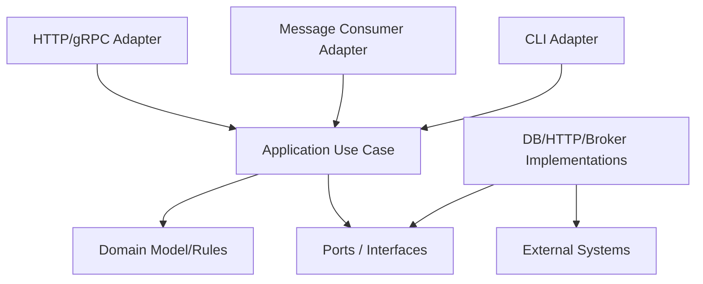
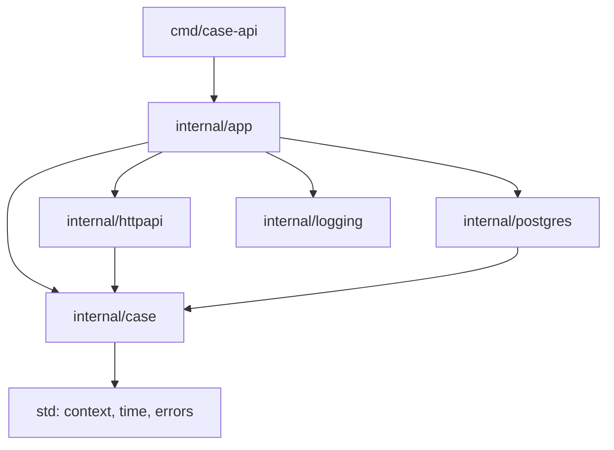
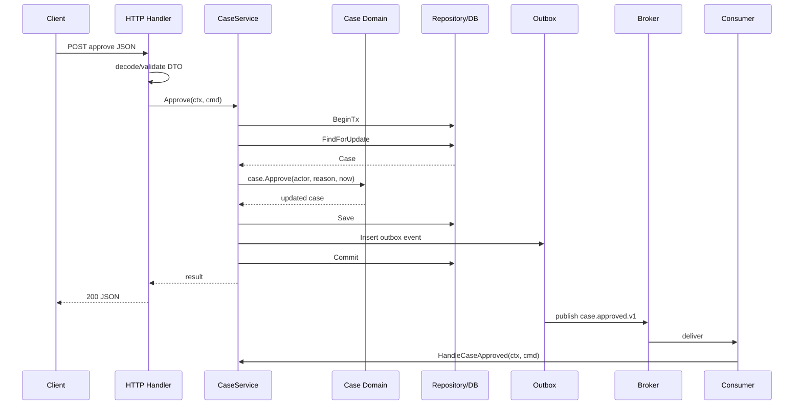

# learn-go-part-032.md

# Go Service Architecture: REST/gRPC boundaries, hexagonal architecture, package layering, and clean dependency graph

> Seri: `learn-go`  
> Part: `032` dari `034`  
> Target pembaca: Java software engineer yang ingin naik ke level production-grade Go engineer  
> Target Go: Go 1.26.x  
> Status seri: belum selesai

---

## 0. Tujuan Part Ini

Part 031 membahas observability. Sekarang kita masuk ke service architecture: bagaimana menyusun aplikasi Go backend agar tetap mudah dikembangkan, dites, dioperasikan, dan diubah saat kompleksitas meningkat.

Sebagai Java engineer, kamu mungkin terbiasa dengan istilah:

```text
layered architecture
clean architecture
hexagonal architecture
ports and adapters
DDD tactical patterns
controller-service-repository
Spring Bean
JPA entity
DTO
transaction script
domain service
application service
```

Di Go, banyak ide tersebut tetap relevan, tetapi implementasinya harus idiomatik Go:

```text
small packages
explicit dependencies
interfaces near consumers
composition root in main/app
thin transport handlers
domain/application logic independent from HTTP/DB
repository implemented by infrastructure
context propagated explicitly
errors mapped at boundaries
no framework magic required
```

Target part ini:

1. memahami architecture sebagai dependency management;
2. memahami package layering Go;
3. memahami REST/gRPC boundary;
4. memahami DTO vs domain vs persistence model;
5. memahami hexagonal architecture di Go;
6. memahami ports/adapters tanpa overengineering;
7. memahami repository dan transaction orchestration;
8. memahami dependency direction;
9. memahami package naming dan import graph;
10. memahami modular monolith vs microservice;
11. memahami anti-pattern umum Go service;
12. membangun reference architecture production-grade.

---

## 1. Sumber Resmi dan Rujukan Utama

Rujukan utama:

- Effective Go: https://go.dev/doc/effective_go
- Go Code Review Comments: https://go.dev/wiki/CodeReviewComments
- Organizing a Go module: https://go.dev/doc/modules/layout
- Package names: https://go.dev/blog/package-names
- Package `context`: https://pkg.go.dev/context
- Package `net/http`: https://pkg.go.dev/net/http
- Package `database/sql`: https://pkg.go.dev/database/sql
- Package `errors`: https://pkg.go.dev/errors
- gRPC Go: https://grpc.io/docs/languages/go/
- Go project layout discussions from official docs and community practice

Catatan penting:

- Go tidak memiliki satu official enterprise architecture layout.
- Go mendorong package kecil, dependency eksplisit, dan API minimal.
- Jangan menyalin struktur Java/Spring secara mekanis ke Go.
- Architecture yang baik bukan jumlah folder; architecture yang baik adalah dependency direction yang bersih, boundary jelas, dan perubahan lokal.

---

## 2. Mental Model Besar

### 2.1 Architecture Is Dependency Control

Architecture bukan diagram indah. Architecture adalah kontrol dependency.

Pertanyaan utama:

```text
Jika database berubah, apakah domain logic ikut berubah?
Jika HTTP route berubah, apakah service logic ikut berubah?
Jika Kafka diganti RabbitMQ, apakah use case ikut berubah?
Jika DTO response berubah, apakah persistence model ikut berubah?
Jika auth provider berubah, apakah business rule ikut berubah?
```

Architecture yang baik membuat perubahan di satu boundary tidak menyebar liar.

### 2.2 Dependency Direction

Dependency harus mengarah ke kebijakan yang lebih stabil.



Application/domain tidak import HTTP framework, SQL driver, Kafka client, etc.

### 2.3 Boundary Types

Common boundaries:

```text
transport boundary:
  HTTP, gRPC, CLI, message

application boundary:
  use case orchestration

domain boundary:
  business rules/invariants

infrastructure boundary:
  DB, cache, broker, external API, filesystem

configuration/lifecycle boundary:
  main/app composition root
```

### 2.4 Do Not Overabstract Too Early

Clean architecture bukan berarti semua hal harus interface.

Use interface when:

- you need multiple implementations;
- you need fake in tests;
- boundary crosses infrastructure;
- dependency direction requires inversion;
- behavior contract is stable.

Do not create interface just because “repository must be interface”.

---

## 3. Java Layering vs Go Layering

### 3.1 Java/Spring Common Structure

```text
controller
service
repository
entity
dto
mapper
config
```

This can work, but in Go it often becomes anemic and package names become generic.

Bad Go layout:

```text
controllers/
services/
repositories/
models/
utils/
```

Problems:

- packages by technical layer only;
- `models` becomes dumping ground;
- `utils` becomes chaos;
- circular dependency risk;
- domain concepts scattered.

### 3.2 Go Prefers Package by Capability/Domain

Better:

```text
internal/case/
  service.go
  domain.go
  repository.go
  errors.go

internal/httpapi/
  router.go
  case_handler.go

internal/postgres/
  case_repository.go

internal/outbox/
  relay.go
```

or domain module style:

```text
internal/case/
  domain/
  app/
  http/
  postgres/
```

Choose based on size.

### 3.3 Package Name Should Communicate Concept

Bad:

```go
package util
package common
package models
package services
```

Better:

```go
package caseapp
package approval
package postgres
package httpapi
package outbox
package authz
package config
```

### 3.4 Avoid Java-Style Getter/Setter Everywhere

Go structs can expose fields when simple DTO.

Domain invariants may need methods.

```go
func (c *Case) Approve(actor ActorID, reason string, now time.Time) error
```

not just:

```go
c.SetStatus("APPROVED")
```

---

## 4. Reference Layout

### 4.1 Medium Service Layout

```text
cmd/
  case-api/
    main.go
  case-worker/
    main.go

internal/
  app/
    app.go
    lifecycle.go

  config/
    config.go

  logging/
    logging.go

  httpapi/
    router.go
    middleware.go
    case_handler.go
    dto.go

  case/
    domain.go
    service.go
    ports.go
    errors.go

  postgres/
    db.go
    case_repository.go
    outbox_repository.go

  messaging/
    consumer.go
    producer.go

  outbox/
    relay.go

  auth/
    identity.go
    middleware.go

  authz/
    policy.go
```

### 4.2 Why This Works

```text
cmd:
  binary entrypoints

internal/app:
  composition and lifecycle

internal/config/logging:
  operational support

internal/httpapi:
  transport adapter

internal/case:
  application/domain capability

internal/postgres:
  database adapter

internal/messaging/outbox:
  async infrastructure

internal/auth/authz:
  security boundary
```

### 4.3 Import Direction

Expected:

```text
cmd/case-api -> internal/app
internal/app -> config/logging/httpapi/case/postgres/messaging
httpapi -> case
case -> no http/sql driver
postgres -> case
messaging -> case/outbox
```

Forbidden:

```text
case -> httpapi
case -> postgres
case -> kafka client
case -> concrete config/env
```

### 4.4 Import Graph Diagram



---

## 5. Domain Model

### 5.1 Domain Represents Business Invariants

```go
type Status string

const (
    StatusDraft     Status = "DRAFT"
    StatusSubmitted Status = "SUBMITTED"
    StatusApproved  Status = "APPROVED"
    StatusRejected  Status = "REJECTED"
)

type Case struct {
    ID        CaseID
    Status    Status
    AgencyID  AgencyID
    Version   int64
    UpdatedAt time.Time
}

func (c *Case) Approve(actor Actor, reason string, now time.Time) error {
    if c.Status != StatusSubmitted {
        return ErrInvalidTransition
    }
    if !actor.CanApprove(c.AgencyID) {
        return ErrForbidden
    }
    if strings.TrimSpace(reason) == "" {
        return ErrReasonRequired
    }

    c.Status = StatusApproved
    c.UpdatedAt = now.UTC()
    return nil
}
```

### 5.2 Domain Should Not Know HTTP

Bad:

```go
func (c *Case) Approve(r *http.Request) error
```

Good:

```go
func (c *Case) Approve(actor Actor, reason string, now time.Time) error
```

### 5.3 Domain Should Not Know SQL

Bad:

```go
type Case struct {
    ID sql.NullString
}
```

Good:

```go
type Case struct {
    ID CaseID
}
```

SQL null mapping belongs in repository adapter.

### 5.4 Value Objects

```go
type CaseID string

func ParseCaseID(s string) (CaseID, error) {
    if s == "" {
        return "", errors.New("case id required")
    }
    if len(s) > 64 {
        return "", errors.New("case id too long")
    }
    return CaseID(s), nil
}
```

Use value types where validation/invariants matter.

---

## 6. Application Service / Use Case

### 6.1 Application Service Orchestrates

Application service:

```text
starts transaction
loads aggregate
calls domain method
saves
publishes outbox/audit
calls policy
handles idempotency
maps domain error upward
```

Example:

```go
type CaseService struct {
    db       TxRunner
    repo     CaseRepository
    audit    AuditRepository
    clock    Clock
    authz    Authorizer
}

func (s *CaseService) Approve(ctx context.Context, cmd ApproveCaseCommand) (ApproveCaseResult, error) {
    actor, err := s.authz.ActorFromContext(ctx)
    if err != nil {
        return ApproveCaseResult{}, err
    }

    now := s.clock.Now()

    var result ApproveCaseResult

    err = s.db.WithTx(ctx, func(ctx context.Context, tx Tx) error {
        repo := s.repo.WithTx(tx)

        c, err := repo.FindForUpdate(ctx, cmd.CaseID)
        if err != nil {
            return err
        }

        if err := c.Approve(actor, cmd.Reason, now); err != nil {
            return err
        }

        if err := repo.Save(ctx, c); err != nil {
            return err
        }

        if err := s.audit.Insert(ctx, tx, AuditEvent{
            CaseID: c.ID,
            Action: "APPROVE",
            Actor:  actor.ID,
            At:     now,
        }); err != nil {
            return err
        }

        result = ApproveCaseResult{
            CaseID: c.ID,
            Status: c.Status,
        }

        return nil
    })
    if err != nil {
        return ApproveCaseResult{}, err
    }

    return result, nil
}
```

### 6.2 Command and Result

```go
type ApproveCaseCommand struct {
    CaseID CaseID
    Reason string
}

type ApproveCaseResult struct {
    CaseID CaseID
    Status Status
}
```

Application command should be transport-agnostic.

No `json` tags required unless reused intentionally.

### 6.3 Keep Use Case Explicit

Avoid hiding too much behind generic `Execute`.

Explicit methods are readable:

```go
Approve(ctx, cmd)
Reject(ctx, cmd)
Submit(ctx, cmd)
```

---

## 7. Ports and Interfaces

### 7.1 Define Interfaces Where Consumed

In `internal/case/ports.go`:

```go
type CaseRepository interface {
    FindForUpdate(ctx context.Context, id CaseID) (Case, error)
    Save(ctx context.Context, c Case) error
    WithTx(tx Tx) CaseRepository
}

type AuditRepository interface {
    Insert(ctx context.Context, tx Tx, e AuditEvent) error
}

type Clock interface {
    Now() time.Time
}

type Authorizer interface {
    ActorFromContext(ctx context.Context) (Actor, error)
}
```

### 7.2 Small Interfaces

Good:

```go
type Clock interface {
    Now() time.Time
}
```

Bad:

```go
type Platform interface {
    Now() time.Time
    Log(...)
    Query(...)
    Publish(...)
    Authorize(...)
    ReadConfig(...)
}
```

### 7.3 Interface Should Express Use

Do not create giant repository:

```go
type Repository interface {
    FindCase(...)
    SaveCase(...)
    FindUser(...)
    SaveUser(...)
    ListDocuments(...)
    PublishEvent(...)
}
```

Split by capability.

### 7.4 Interface Pollution

If there is only one implementation and no need to invert dependency, concrete type is okay.

Go proverb style:

```text
Accept interfaces, return structs.
```

But not dogma.

---

## 8. Transport Adapter: HTTP

### 8.1 Handler Is Adapter

HTTP handler should:

```text
parse path/query/header/body
validate transport DTO
build application command
call service
map result to response DTO
map error to status
```

### 8.2 DTO

```go
type approveCaseRequest struct {
    Reason string `json:"reason"`
}

type approveCaseResponse struct {
    CaseID string `json:"case_id"`
    Status string `json:"status"`
}
```

### 8.3 Handler

```go
func (h *CaseHandler) Approve(w http.ResponseWriter, r *http.Request) {
    caseID, err := caseapp.ParseCaseID(r.PathValue("id"))
    if err != nil {
        WriteError(w, r, ErrBadRequest)
        return
    }

    req, err := DecodeJSON[approveCaseRequest](w, r, 1<<20)
    if err != nil {
        WriteError(w, r, ErrBadRequest)
        return
    }

    result, err := h.service.Approve(r.Context(), caseapp.ApproveCaseCommand{
        CaseID: caseID,
        Reason: req.Reason,
    })
    if err != nil {
        WriteError(w, r, err)
        return
    }

    _ = EncodeJSON(w, http.StatusOK, approveCaseResponse{
        CaseID: string(result.CaseID),
        Status: string(result.Status),
    })
}
```

### 8.4 Error Mapping

Transport maps application/domain errors to HTTP.

```go
switch {
case errors.Is(err, caseapp.ErrNotFound):
    status = http.StatusNotFound
case errors.Is(err, caseapp.ErrForbidden):
    status = http.StatusForbidden
case errors.Is(err, caseapp.ErrInvalidTransition):
    status = http.StatusConflict
default:
    status = http.StatusInternalServerError
}
```

Domain should not know HTTP status.

---

## 9. Transport Adapter: gRPC

### 9.1 gRPC Boundary

gRPC generated code is transport adapter.

Do not let generated protobuf types become domain model everywhere.

Pattern:

```text
pb request -> application command -> domain -> application result -> pb response
```

### 9.2 Service Implementation

```go
type GRPCCaseServer struct {
    pb.UnimplementedCaseServiceServer
    service *caseapp.CaseService
}

func (s *GRPCCaseServer) Approve(ctx context.Context, req *pb.ApproveCaseRequest) (*pb.ApproveCaseResponse, error) {
    caseID, err := caseapp.ParseCaseID(req.GetCaseId())
    if err != nil {
        return nil, status.Error(codes.InvalidArgument, "invalid case id")
    }

    result, err := s.service.Approve(ctx, caseapp.ApproveCaseCommand{
        CaseID: caseID,
        Reason: req.GetReason(),
    })
    if err != nil {
        return nil, mapGRPCError(err)
    }

    return &pb.ApproveCaseResponse{
        CaseId: string(result.CaseID),
        Status: string(result.Status),
    }, nil
}
```

### 9.3 gRPC Error Mapping

```go
func mapGRPCError(err error) error {
    switch {
    case errors.Is(err, caseapp.ErrNotFound):
        return status.Error(codes.NotFound, "case not found")
    case errors.Is(err, caseapp.ErrForbidden):
        return status.Error(codes.PermissionDenied, "forbidden")
    case errors.Is(err, caseapp.ErrInvalidTransition):
        return status.Error(codes.FailedPrecondition, "invalid transition")
    default:
        return status.Error(codes.Internal, "internal error")
    }
}
```

### 9.4 REST vs gRPC

| Aspect | REST/HTTP JSON | gRPC |
|---|---|---|
| Browser friendliness | high | lower |
| Schema | OpenAPI optional | protobuf required |
| Streaming | possible | first-class |
| Internal service calls | good | excellent |
| Public API | common | possible but needs tooling |
| Human debugging | curl-friendly | needs grpcurl/tooling |
| Evolution | JSON tolerant | protobuf rules |

### 9.5 Boundary Principle

Whether REST or gRPC, application/domain should not depend on transport generated types.

---

## 10. Infrastructure Adapter: Database

### 10.1 Postgres Repository Implements Port

In `internal/postgres/case_repository.go`:

```go
type CaseRepository struct {
    q DBTX
}

func NewCaseRepository(db *sql.DB) *CaseRepository {
    return &CaseRepository{q: db}
}

func (r *CaseRepository) WithTx(tx caseapp.Tx) caseapp.CaseRepository {
    sqlTx := tx.(*SQLTx)
    return &CaseRepository{q: sqlTx.Tx}
}
```

A simpler design may use `*sql.Tx` directly in port if you accept SQL dependency in application layer. But if keeping domain/application DB-agnostic, define your own Tx abstraction carefully.

### 10.2 Avoid Overcomplicated Tx Abstraction

Sometimes simplest production Go service:

```go
type Service struct {
    db *sql.DB
    repo *postgres.CaseRepository
}
```

Then service imports postgres. This is less pure but may be acceptable in small service.

Architecture is trade-off.

Use stricter hexagonal boundaries when:

- multiple adapters;
- complex domain;
- testability pain;
- long-lived codebase;
- independent infrastructure evolution.

### 10.3 Repository Maps SQL to Domain

```go
func scanCase(row scanner) (caseapp.Case, error) {
    var c caseapp.Case
    var reason sql.NullString

    if err := row.Scan(&c.ID, &c.Status, &reason, &c.Version); err != nil {
        return caseapp.Case{}, err
    }

    if reason.Valid {
        c.Reason = reason.String
    }

    return c, nil
}
```

SQL null should not leak into domain unless domain explicitly models optional.

---

## 11. Infrastructure Adapter: External HTTP Client

### 11.1 Port

```go
type IdentityClient interface {
    GetActor(ctx context.Context, token string) (Actor, error)
}
```

### 11.2 HTTP Implementation

```go
type HTTPIdentityClient struct {
    baseURL *url.URL
    client  *http.Client
}

func (c *HTTPIdentityClient) GetActor(ctx context.Context, token string) (caseapp.Actor, error) {
    req, err := http.NewRequestWithContext(ctx, http.MethodGet, c.endpoint("/me"), nil)
    if err != nil {
        return caseapp.Actor{}, err
    }
    req.Header.Set("Authorization", "Bearer "+token)

    resp, err := c.client.Do(req)
    if err != nil {
        return caseapp.Actor{}, err
    }
    defer resp.Body.Close()

    // map response DTO to domain Actor
}
```

### 11.3 Error Mapping

External HTTP errors should be mapped to application-level errors:

```text
401 from identity -> unauthenticated
403 -> forbidden
timeout -> dependency timeout
5xx -> dependency unavailable
```

Do not leak external raw response to domain.

---

## 12. Infrastructure Adapter: Messaging

### 12.1 Consumer Adapter

Broker delivery -> application command.

```go
func (h *CaseApprovedMessageHandler) Handle(ctx context.Context, d Delivery) error {
    var evt CaseApprovedEventV1
    if err := json.Unmarshal(d.Body, &evt); err != nil {
        return PermanentError{Err: err}
    }

    return h.service.HandleCaseApproved(ctx, caseapp.CaseApprovedCommand{
        EventID: evt.EventID,
        CaseID:  caseapp.CaseID(evt.CaseID),
    })
}
```

### 12.2 Producer Adapter

Application outbox event -> broker message.

```go
type Producer interface {
    Publish(ctx context.Context, msg Message) error
}
```

### 12.3 Domain Should Not Know Kafka/RabbitMQ

Domain may create domain event object, but not broker-specific message.

---

## 13. Composition Root

### 13.1 Wire Dependencies in `internal/app`

```go
func Run(ctx context.Context, cfg Config) error {
    logger := logging.New(cfg.Log)

    db, err := postgres.Open(ctx, cfg.Database)
    if err != nil {
        return err
    }
    defer db.Close()

    caseRepo := postgres.NewCaseRepository(db)
    auditRepo := postgres.NewAuditRepository(db)

    caseService := caseapp.NewService(caseapp.ServiceDeps{
        DB:     postgres.NewTxRunner(db),
        Repo:   caseRepo,
        Audit:  auditRepo,
        Clock:  systemClock{},
        Authz:   authz.NewPolicy(...),
        Logger: logger,
    })

    router := httpapi.NewRouter(httpapi.Deps{
        CaseService: caseService,
        Logger:      logger,
    })

    srv := &http.Server{
        Addr:    cfg.HTTP.Addr,
        Handler: router,
    }

    return runHTTP(ctx, srv, cfg.HTTP.ShutdownTimeout)
}
```

### 13.2 Why Composition Root Matters

Only one place knows full dependency graph.

Benefits:

- easier startup;
- easier testing;
- easier replacement;
- fewer globals;
- explicit lifecycle.

### 13.3 Avoid Service Locator

Bad:

```go
global.Container.Get("caseService")
```

This hides dependencies.

Prefer constructor injection.

---

## 14. Transaction Orchestration

### 14.1 Transaction Belongs to Application Service

Handler should not begin transaction.

Domain should not begin transaction.

Repository should not usually decide entire use case transaction.

Application service knows use case boundary.

### 14.2 Good Boundary

```text
HTTP handler:
  parse request -> call service

Service:
  begin tx -> load -> domain -> save -> audit/outbox -> commit

Repository:
  SQL operations only
```

### 14.3 Example

```go
func (s *CaseService) Approve(ctx context.Context, cmd ApproveCaseCommand) error {
    return s.tx.WithTx(ctx, func(ctx context.Context, tx Tx) error {
        c, err := s.repo.WithTx(tx).FindForUpdate(ctx, cmd.CaseID)
        if err != nil {
            return err
        }

        if err := c.Approve(...); err != nil {
            return err
        }

        if err := s.repo.WithTx(tx).Save(ctx, c); err != nil {
            return err
        }

        return s.outbox.WithTx(tx).Add(ctx, NewCaseApprovedEvent(c))
    })
}
```

### 14.4 Avoid Transaction Spanning External Calls

Bad:

```text
begin tx
call external HTTP
commit
```

External call can hang and hold DB locks.

Use outbox or call external before/after with clear consistency trade-off.

---

## 15. Error Architecture

### 15.1 Error Layers

```text
domain error:
  ErrInvalidTransition

application error:
  ErrForbidden, ErrConflict

infrastructure error:
  sql timeout, duplicate key

transport error:
  HTTP 409, gRPC FailedPrecondition
```

### 15.2 Domain Errors

```go
var (
    ErrInvalidTransition = errors.New("invalid transition")
    ErrReasonRequired    = errors.New("reason required")
)
```

### 15.3 Repository Mapping

```go
if errors.Is(err, sql.ErrNoRows) {
    return Case{}, ErrNotFound
}
if isUniqueViolation(err) {
    return ErrDuplicate
}
return fmt.Errorf("insert case: %w", err)
```

### 15.4 Transport Mapping

HTTP/gRPC maps errors to protocol.

### 15.5 Preserve Cause But Return Safe Message

Internal logs can include wrapped error.

Client gets safe response.

---

## 16. Configuration Architecture

### 16.1 Config Is Boundary

Config package should parse env/file/flags into typed config.

Deep packages should receive typed values.

Bad:

```go
func NewRepository() *Repo {
    dsn := os.Getenv("DB_DSN")
}
```

Good:

```go
func NewRepository(db *sql.DB) *Repo
```

or:

```go
postgres.Open(ctx, cfg.Database)
```

### 16.2 Feature Flags

Feature flags should have:

- owner;
- default;
- expiry/removal plan;
- metrics;
- safe rollout;
- test coverage.

Do not scatter `if os.Getenv("FEATURE_X")` everywhere.

---

## 17. Package Boundaries and Cycles

### 17.1 Import Cycles Are Compile Errors

Go forbids import cycles.

This is good. It forces cleaner dependency direction.

### 17.2 Cycle Example

```text
case imports postgres
postgres imports case
```

If both import each other, cycle.

Fix:

- move shared types to stable package;
- invert dependency via interface;
- restructure package;
- merge packages if separation artificial.

### 17.3 Do Not Create `common` Too Quickly

`common` often becomes cycle escape hatch.

Better:

- put type where it belongs;
- create small focused package;
- accept duplication if simpler;
- merge packages if too entangled.

### 17.4 Package Size

Too small:

```text
one file per tiny concept causing import noise
```

Too large:

```text
god package with everything
```

Aim for cohesive package with clear reason to change.

---

## 18. Modular Monolith vs Microservices

### 18.1 Modular Monolith

Single deployable, modular internal packages.

Benefits:

- simple deployment;
- local transactions;
- easier refactor;
- less distributed complexity.

Risks:

- poor boundaries if not disciplined;
- large codebase build/test complexity;
- ownership conflicts.

### 18.2 Microservices

Multiple deployables.

Benefits:

- independent scaling/deploy;
- team autonomy;
- bounded context isolation;
- technology independence.

Costs:

- network failure;
- eventual consistency;
- observability burden;
- data duplication;
- contract testing;
- distributed transactions hard;
- operational overhead.

### 18.3 Top Engineer Rule

Do not choose microservices to solve code organization problem.

First build modular boundaries in code.

Split service when:

```text
clear bounded context
independent lifecycle
independent scaling
team ownership
data ownership
operational maturity
```

### 18.4 Go Fits Both

Go binary simplicity makes microservices easy to deploy, but architecture still matters.

---

## 19. REST Boundary Design

### 19.1 Resource-Oriented

Good:

```text
GET /cases/{id}
POST /cases
POST /cases/{id}/approve
GET /cases?status=SUBMITTED
```

### 19.2 Command Endpoints

For domain commands, action endpoint can be valid:

```text
POST /cases/{id}/approve
```

This is clearer than forcing approval into generic PATCH if business operation is significant.

### 19.3 Idempotency

For create/command APIs:

```text
Idempotency-Key
```

especially if retry possible.

### 19.4 API Versioning

Options:

```text
/v1
Accept: application/vnd.company.v1+json
field-level compatibility
```

Version breaking changes.

### 19.5 DTO Evolution

Use additive changes. Do not expose domain struct directly.

---

## 20. gRPC Boundary Design

### 20.1 Proto as Contract

Protobuf schema is explicit.

Follow evolution rules:

- do not reuse field numbers;
- reserve removed fields;
- add optional fields carefully;
- avoid changing field type;
- version services/messages when breaking.

### 20.2 Method Design

```proto
service CaseService {
  rpc GetCase(GetCaseRequest) returns (GetCaseResponse);
  rpc ApproveCase(ApproveCaseRequest) returns (ApproveCaseResponse);
}
```

### 20.3 Streaming

gRPC is strong for:

- server streaming;
- client streaming;
- bidirectional streaming;
- internal service APIs.

### 20.4 Error Details

Use gRPC status codes and optionally error details.

Map domain errors consistently.

---

## 21. Testing Architecture

### 21.1 Domain Tests

No HTTP/DB.

```go
func TestCaseApprove(t *testing.T)
```

### 21.2 Application Service Tests

Use fake repos/clock/authz.

```go
func TestCaseServiceApprove(t *testing.T)
```

### 21.3 Adapter Tests

HTTP handler with fake service.

Repository with real DB integration test.

Message handler with fake service/source.

### 21.4 Contract Tests

For public APIs/events:

- golden JSON fixtures;
- OpenAPI/proto validation;
- consumer-driven contract if needed;
- event compatibility fixtures.

### 21.5 Architecture Tests

You can write lightweight import rule tests or use tooling, but often package structure + Go import cycle prevention is enough.

Manual code review checklist is still important.

---

## 22. Production Example: End-to-End Flow

### 22.1 Request

```text
POST /cases/C-1/approve
```

### 22.2 Flow



### 22.3 Why This Architecture Is Clean

- HTTP does not contain business rule.
- Domain does not know HTTP/SQL/broker.
- Service owns transaction.
- Outbox protects DB + event consistency.
- Consumer reuses application boundary.
- Errors mapped at boundary.
- Observability can wrap each layer.

---

## 23. Anti-Patterns

### 23.1 Framework-Shaped Go

Copying Spring layers mechanically.

```text
controllers/services/repositories/models/utils
```

without domain cohesion.

### 23.2 Fat Handler

Handler contains DB transaction, business rule, SQL, JSON, audit.

### 23.3 Anemic Service with All Logic in Repository

Repository decides business transitions.

### 23.4 Domain Imports Infrastructure

Domain imports `net/http`, `database/sql`, Kafka client.

### 23.5 Interface for Everything

Hundreds of one-implementation interfaces.

### 23.6 No Interfaces at Boundaries

Service cannot be tested without real DB/broker.

### 23.7 Global Container / Service Locator

Hidden dependencies.

### 23.8 `context.Context` as Dependency Bag

Putting DB/Tx/logger/config arbitrarily into context.

### 23.9 `common` and `utils` Dumping Ground

No ownership.

### 23.10 DTO == Domain == DB Model

Every change leaks everywhere.

### 23.11 Transaction in Handler

Transport owns business transaction accidentally.

### 23.12 External Call Inside DB Transaction

Locks held during network wait.

### 23.13 Microservice Split Without Boundary

Distributed monolith.

---

## 24. Practical Commands

List imports:

```bash
go list -deps ./...
```

Find import graph manually:

```bash
go list -f '{{.ImportPath}} -> {{.Imports}}' ./...
```

Run tests:

```bash
go test ./...
go test -race ./...
```

Detect cycles:

```bash
go test ./...
```

Go will fail compile on import cycle.

Check package docs:

```bash
go doc ./internal/case
```

Generate dependency graph with third-party tools if needed, but keep import direction understandable without tools.

---

## 25. Hands-On Labs

### Lab 1: Refactor Fat Handler

Start from handler that does JSON, SQL, business rule.

Refactor into:

```text
http handler
application service
domain method
repository
```

### Lab 2: DTO Separation

Create separate:

```text
ApproveCaseRequest
ApproveCaseCommand
Case
CaseRecord
ApproveCaseResponse
```

Map explicitly.

### Lab 3: Repository Port

Define `CaseRepository` in application package.

Implement PostgreSQL adapter.

Test service with fake repository.

### Lab 4: Transaction Boundary

Move `BeginTx` from handler to service.

Ensure all repository calls use tx-bound repo.

### Lab 5: Outbox Integration

Inside use case transaction, insert outbox event.

Keep broker publish outside transaction.

### Lab 6: gRPC Adapter

Create gRPC method that maps protobuf request to same application command used by HTTP.

### Lab 7: Import Direction Review

Draw import graph.

Identify any domain -> infra import.

Fix it.

### Lab 8: Modular Monolith Boundary

Create two capabilities:

```text
case
notification
```

Ensure interaction happens through application ports/events, not direct DB table access everywhere.

### Lab 9: Error Mapping

Map same domain error to:

```text
HTTP 409
gRPC FailedPrecondition
message retry/drop decision
```

### Lab 10: Architecture Review Checklist

Apply checklist to an existing Go service.

---

## 26. Review Questions

1. Apa arti architecture sebagai dependency control?
2. Kenapa domain tidak boleh import HTTP/SQL?
3. Apa beda DTO, domain model, dan persistence model?
4. Kapan interface diperlukan di Go?
5. Kenapa interface sebaiknya didefinisikan di consumer side?
6. Apa tugas HTTP handler?
7. Apa tugas application service?
8. Apa tugas domain model?
9. Apa tugas repository?
10. Siapa yang sebaiknya mengelola transaction boundary?
11. Kenapa external call di dalam transaction berbahaya?
12. Apa itu composition root?
13. Kenapa service locator buruk?
14. Apa risiko package `common`?
15. Apa beda modular monolith dan microservice?
16. Kapan microservice split masuk akal?
17. Bagaimana gRPC generated types diperlakukan?
18. Kenapa event schema perlu versioning?
19. Apa anti-pattern DTO == domain == DB model?
20. Bagaimana testing mengikuti architecture layer?

---

## 27. Code Review Checklist

Saat review service architecture Go:

```text
[ ] Apakah package punya responsibility jelas?
[ ] Apakah import direction bersih?
[ ] Apakah domain bebas dari HTTP/SQL/broker?
[ ] Apakah handler tipis?
[ ] Apakah application service mengorkestrasi use case?
[ ] Apakah transaction boundary ada di service/use case?
[ ] Apakah external call tidak dilakukan di dalam DB transaction?
[ ] Apakah DTO/domain/persistence model dipisah untuk boundary penting?
[ ] Apakah error dimapping di boundary yang tepat?
[ ] Apakah interface kecil dan berada dekat consumer?
[ ] Apakah tidak ada interface hanya demi interface?
[ ] Apakah dependency wiring ada di composition root?
[ ] Apakah tidak ada service locator/global container?
[ ] Apakah context tidak dipakai sebagai dependency bag?
[ ] Apakah package common/utils tidak menjadi dumping ground?
[ ] Apakah tests mengikuti layer?
[ ] Apakah outbox/inbox digunakan jika async consistency penting?
[ ] Apakah REST/gRPC schema tidak bocor sebagai domain model?
```

---

## 28. Invariants

Pegang invariant berikut:

```text
Architecture controls dependency direction.
Domain should be independent from transport and infrastructure.
Handlers adapt protocol to application commands.
Application service owns use case orchestration.
Repository adapts persistence to domain/application.
DTO is boundary contract.
Transaction boundary belongs to use case/application layer.
Interfaces are useful at boundaries, not everywhere.
Composition root wires concrete dependencies.
Go import cycles are design feedback.
Do not solve code organization problem with microservices first.
```

---

## 29. Ringkasan

Service architecture di Go bukan tentang meniru Spring tanpa Spring.

Architecture Go yang kuat biasanya terlihat seperti:

```text
small cohesive packages
explicit dependencies
thin adapters
domain/application logic independent from infrastructure
repository adapters
clear transaction boundary
DTO/domain separation
composition root
no magic container
```

Sebagai Java engineer, kamu bisa membawa mental model Clean/Hexagonal Architecture, tetapi implementasinya harus Go-native:

```text
less annotation
less framework magic
smaller interfaces
explicit constructors
plain functions/methods
package-level boundaries
```

Bug architecture production paling umum:

- handler terlalu gemuk;
- domain import SQL/HTTP;
- DTO/domain/entity dicampur;
- transaction di tempat salah;
- interface terlalu banyak;
- interface tidak ada di boundary penting;
- global service locator;
- `common` jadi tempat sampah;
- microservice dipakai untuk menutupi modularity buruk;
- event/API schema berubah tanpa boundary.

Part berikutnya akan membahas cloud-native Go: container images, Kubernetes probes, resource limits, signals, config, dan rollout safety.

---

## 30. Posisi Kita di Seri

Kita sudah menyelesaikan:

```text
000 - Orientation and Mental Model
001 - Toolchain, Workspace, Module, Build
002 - Syntax Core
003 - Functions
004 - Types
005 - Composition
006 - Interfaces
007 - Generics
008 - Error Handling
009 - Package Design
010 - Modules and Dependency Management
011 - Standard Library Mental Model
012 - Slices, Arrays, and Maps
013 - Memory Model for Application Engineers
014 - Runtime Deep Dive
015 - Go Garbage Collector
016 - Concurrency Primitives
017 - Concurrency Patterns
018 - Shared Memory Concurrency
019 - Context Propagation
020 - File, Stream, and Filesystem I/O
021 - Networking Fundamentals
022 - HTTP Server Engineering
023 - HTTP Client Engineering
024 - Serialization
025 - CLI, Daemon, and Configuration Engineering
026 - Testing
027 - Benchmarking and Profiling
028 - Database Engineering
029 - Messaging and Async Systems
030 - Security Engineering
031 - Observability
032 - Service Architecture
```

Berikutnya:

```text
033 - Cloud-native Go:
      container images, Kubernetes probes, resource limits, signals, config, and rollout safety
```

Status seri: **belum selesai**.

<!-- NAVIGATION_FOOTER -->
<div class="page-nav">
<a href="./learn-go-part-031.md">⬅️ Go Observability: structured logging with slog, metrics, tracing, pprof in production, and incident debugging</a>
<a href="./index.md">📚 Kategori</a>
<a href="../../index.md">🏠 Home</a>
<a href="./learn-go-part-033.md">Go Cloud-native Engineering: container images, Kubernetes probes, resource limits, signals, config, and rollout safety ➡️</a>
</div>
