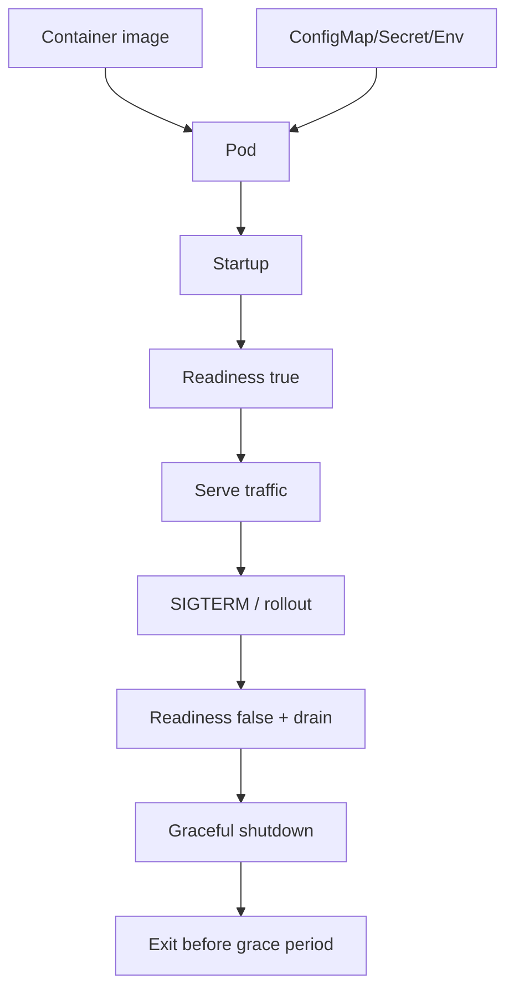
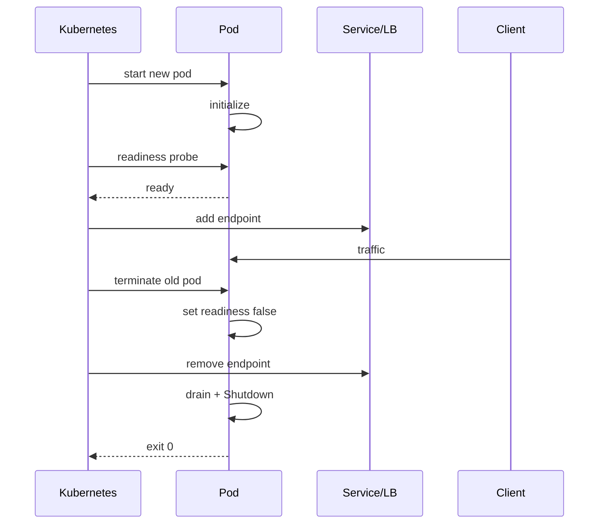

# learn-go-part-033.md

# Go Cloud-native Engineering: container images, Kubernetes probes, resource limits, signals, config, and rollout safety

> Seri: `learn-go`  
> Part: `033` dari `034`  
> Target pembaca: Java software engineer yang ingin naik ke level production-grade Go engineer  
> Target Go: Go 1.26.x  
> Status seri: belum selesai

---

## 0. Tujuan Part Ini

Part 032 membahas service architecture. Sekarang kita masuk ke cloud-native Go: bagaimana Go binary dikemas, dijalankan, diobservasi, dan di-rollout dengan aman di container/Kubernetes.

Go sangat cocok untuk cloud-native karena:

```text
single binary
fast startup
low runtime dependency
simple concurrency model
built-in HTTP server
built-in profiling
easy cross-compilation
small container image possible
```

Namun cloud-native production bukan hanya “buat Dockerfile”.

Banyak incident terjadi karena:

```text
SIGTERM tidak ditangani
readiness salah
liveness terlalu agresif
resource limit salah
GOMEMLIMIT tidak diset
container jalan sebagai root
CA cert/timezone hilang di scratch image
config/secret bocor
rollout memutus in-flight request
probe menyebabkan restart loop
DB pool tidak disesuaikan jumlah replica
CPU throttling tidak terlihat
OOMKilled karena heap/cache
```

Sebagai Java engineer, kamu mungkin terbiasa dengan:

```text
Spring Boot container
Actuator health/readiness/liveness
JVM container awareness
-Xmx / MaxRAMPercentage
Kubernetes Deployment
ConfigMap/Secret
HPA
rolling update
preStop
terminationGracePeriodSeconds
readiness gates
```

Di Go, kamu harus eksplisit mengatur:

```go
signal.NotifyContext
http.Server.Shutdown
/readiness state
/liveness state
runtime/debug.SetMemoryLimit or GOMEMLIMIT
timeouts
pprof
config validation
resource metrics
```

Target part ini:

1. memahami container image untuk Go;
2. memahami static vs dynamic binary;
3. memahami scratch/distroless/alpine trade-off;
4. memahami Kubernetes probes;
5. memahami graceful termination;
6. memahami resource requests/limits;
7. memahami Go runtime memory dalam container;
8. memahami config/secret injection;
9. memahami rollout safety;
10. memahami autoscaling;
11. memahami cloud-native observability;
12. membangun deployment baseline production-grade.

---

## 1. Sumber Resmi dan Rujukan Utama

Rujukan utama:

- Kubernetes Probes: https://kubernetes.io/docs/concepts/workloads/pods/probes/
- Configure Liveness, Readiness and Startup Probes: https://kubernetes.io/docs/tasks/configure-pod-container/configure-liveness-readiness-startup-probes/
- Kubernetes Pod Lifecycle: https://kubernetes.io/docs/concepts/workloads/pods/pod-lifecycle/
- Kubernetes Container Lifecycle Hooks: https://kubernetes.io/docs/concepts/containers/container-lifecycle-hooks/
- Kubernetes Resource Management for Pods and Containers: https://kubernetes.io/docs/concepts/configuration/manage-resources-containers/
- Kubernetes Deployment: https://kubernetes.io/docs/concepts/workloads/controllers/deployment/
- Go Runtime metrics: https://pkg.go.dev/runtime/metrics
- Go Runtime debug memory limit: https://pkg.go.dev/runtime/debug#SetMemoryLimit
- Go Diagnostics: https://go.dev/doc/diagnostics
- Package `os/signal`: https://pkg.go.dev/os/signal
- Package `net/http`: https://pkg.go.dev/net/http

Catatan dari dokumentasi Kubernetes:

- Kubernetes probe adalah diagnostic periodik oleh kubelet; liveness dapat menyebabkan restart, readiness dapat menghentikan traffic ke Pod yang belum siap, startup probe menunda liveness/readiness sampai startup selesai.
- Jika startup probe dikonfigurasi, liveness/readiness tidak dijalankan sampai startup probe berhasil.
- `PreStop` hook dieksekusi sebelum TERM signal dikirim, dan waktu hook termasuk dalam `terminationGracePeriodSeconds`.
- Saat grace period habis, Kubernetes akan memaksa terminasi container.

---

## 2. Mental Model Besar

### 2.1 Cloud-native Runtime Contract

Aplikasi cloud-native harus memenuhi contract dengan platform:

```text
start:
  initialize quickly and predictably

ready:
  signal when safe to receive traffic

live:
  signal when process should be restarted

shutdown:
  stop receiving traffic, finish in-flight work, exit within grace period

resource:
  respect CPU/memory limits

config:
  load explicit config/secrets safely

observe:
  expose logs/metrics/traces/profiles safely
```

Visual:



### 2.2 Go Binary Is Not Enough

A correct Go app in local dev can fail in Kubernetes if:

- it ignores SIGTERM;
- readiness always returns OK;
- liveness depends on DB and restarts during DB outage;
- memory limit lower than heap/cache behavior;
- HTTP server has no timeouts;
- image lacks CA certs;
- app writes to read-only filesystem;
- logs to file instead of stdout;
- config missing but app falls back insecurely.

Cloud-native readiness is part of application design.

---

## 3. Building Go Container Images

### 3.1 Multi-Stage Dockerfile

Baseline:

```dockerfile
# syntax=docker/dockerfile:1

FROM golang:1.26 AS build
WORKDIR /src

COPY go.mod go.sum ./
RUN go mod download

COPY . .
RUN CGO_ENABLED=0 GOOS=linux GOARCH=amd64 \
    go build -trimpath -ldflags="-s -w" -o /out/case-api ./cmd/case-api

FROM scratch
COPY --from=build /out/case-api /case-api
ENTRYPOINT ["/case-api"]
```

This creates small image, but scratch caveats matter.

### 3.2 scratch Caveats

`scratch` has almost nothing:

```text
no shell
no CA certificates
no timezone database
no passwd/group
no package manager
no debugging tools
```

If your app makes HTTPS outbound calls, it needs CA roots.

Add CA certs:

```dockerfile
FROM golang:1.26 AS build
# build binary...

FROM alpine:3.20 AS certs
RUN apk --no-cache add ca-certificates tzdata

FROM scratch
COPY --from=build /out/case-api /case-api
COPY --from=certs /etc/ssl/certs/ca-certificates.crt /etc/ssl/certs/
COPY --from=certs /usr/share/zoneinfo /usr/share/zoneinfo
ENTRYPOINT ["/case-api"]
```

### 3.3 Distroless

Distroless images provide minimal runtime with common files like CA certificates and non-root user variants, while excluding shell/package manager.

Example concept:

```dockerfile
FROM golang:1.26 AS build
WORKDIR /src
COPY go.mod go.sum ./
RUN go mod download
COPY . .
RUN CGO_ENABLED=0 go build -trimpath -o /out/case-api ./cmd/case-api

FROM gcr.io/distroless/static-debian12:nonroot
COPY --from=build /out/case-api /case-api
ENTRYPOINT ["/case-api"]
```

### 3.4 Alpine

Alpine is small but uses musl libc.

If `CGO_ENABLED=1`, musl/glibc compatibility can matter.

For pure Go static binary, Alpine is often only used as builder/certs source.

### 3.5 Debian/Ubuntu Runtime

Larger but easier debugging/compatibility.

Useful if:

- CGO dynamic libs required;
- enterprise scanner/policy requires distro;
- shell/debug tools needed in special image;
- cert/timezone/user setup easier.

### 3.6 Static vs Dynamic

Static:

```bash
CGO_ENABLED=0 go build
```

Pros:

- simpler runtime;
- scratch/distroless static works;
- no libc dependency.

Cons:

- some packages/features may require CGO;
- DNS resolver behavior differs from cgo resolver in some environments;
- SQLite/native drivers may need CGO.

Dynamic:

```bash
CGO_ENABLED=1
```

Need runtime libs.

### 3.7 Image Security

Baseline:

```text
run non-root
read-only root filesystem if possible
drop Linux capabilities
no shell if possible
minimal image
pin base image versions/digests
scan image
do not bake secrets
```

---

## 4. Go Build for Containers

### 4.1 Useful Build Flags

```bash
go build -trimpath -ldflags="-s -w" -o app ./cmd/app
```

Meaning:

```text
-trimpath:
  remove local filesystem paths

-s -w:
  strip symbol/debug tables, smaller binary
```

Caveat: stripping can reduce debugging detail. Keep unstripped artifact if needed for symbolization/debug.

### 4.2 Version Injection

```bash
go build -ldflags "\
  -X main.version=1.2.3 \
  -X main.commit=$(git rev-parse HEAD) \
  -X main.date=$(date -u +%Y-%m-%dT%H:%M:%SZ)" \
  -o app ./cmd/app
```

In code:

```go
var (
    version = "dev"
    commit  = "unknown"
    date    = "unknown"
)
```

Log at startup.

### 4.3 Multi-Arch

```bash
GOOS=linux GOARCH=amd64 go build ./cmd/app
GOOS=linux GOARCH=arm64 go build ./cmd/app
```

Or Docker buildx:

```bash
docker buildx build --platform linux/amd64,linux/arm64 .
```

### 4.4 Reproducibility

Record:

```text
Go version
GOOS/GOARCH
module versions
commit SHA
base image digest
build flags
CGO_ENABLED
```

---

## 5. Container Runtime Behavior

### 5.1 PID 1

In container, your Go process is often PID 1.

PID 1 behavior around signals/zombies is different in Linux.

Go service that runs as single process usually okay if it handles signals and does not spawn unmanaged child processes.

If spawning child processes, consider init wrapper or manage reaping.

### 5.2 Logs to stdout/stderr

Cloud-native logs should go to stdout/stderr.

Do not write application logs to local files unless sidecar/agent design requires it.

### 5.3 Filesystem

Containers may have read-only root filesystem.

Write only to:

```text
/tmp
mounted volume
emptyDir
persistent volume
```

Make paths configurable.

### 5.4 Timezone

Prefer UTC.

If local timezone required, ensure timezone data exists in image.

### 5.5 CA Certificates

If outbound HTTPS fails in scratch image:

```text
x509: certificate signed by unknown authority
```

you likely forgot CA certs.

---

## 6. Kubernetes Probes

### 6.1 Liveness

Question:

```text
Should Kubernetes restart this container?
```

Liveness should detect unrecoverable stuck state.

It should not fail because DB is temporarily down.

If liveness depends on DB, DB outage can restart all pods and worsen incident.

### 6.2 Readiness

Question:

```text
Should this pod receive traffic now?
```

Readiness can check:

- startup complete;
- app not shutting down;
- critical dependencies if serving requires them;
- local queue not overloaded maybe.

When readiness fails, Pod is removed from Service endpoints but not restarted.

### 6.3 Startup Probe

Question:

```text
Has app finished startup?
```

If configured, Kubernetes does not run liveness/readiness until startup probe succeeds.

Useful for slow initialization/migration/cache warmup.

### 6.4 Probe Table

| Probe | Failure Action | Use |
|---|---|---|
| startup | delays other probes, may restart if fails too long | slow startup |
| readiness | remove from traffic | dependency/init/shutdown |
| liveness | restart container | deadlocked/broken process |

### 6.5 Go Handlers

```go
type HealthState struct {
    ready        atomic.Bool
    shuttingDown atomic.Bool
}

func (s *HealthState) Liveness(w http.ResponseWriter, r *http.Request) {
    w.WriteHeader(http.StatusOK)
    _, _ = w.Write([]byte("ok\n"))
}

func (s *HealthState) Readiness(w http.ResponseWriter, r *http.Request) {
    if s.shuttingDown.Load() || !s.ready.Load() {
        http.Error(w, "not ready", http.StatusServiceUnavailable)
        return
    }

    w.WriteHeader(http.StatusOK)
    _, _ = w.Write([]byte("ok\n"))
}
```

### 6.6 Kubernetes YAML

```yaml
livenessProbe:
  httpGet:
    path: /healthz
    port: http
  initialDelaySeconds: 10
  periodSeconds: 10
  timeoutSeconds: 2
  failureThreshold: 3

readinessProbe:
  httpGet:
    path: /readyz
    port: http
  periodSeconds: 5
  timeoutSeconds: 2
  failureThreshold: 2

startupProbe:
  httpGet:
    path: /healthz
    port: http
  periodSeconds: 5
  failureThreshold: 30
```

### 6.7 Probe Anti-Patterns

Bad:

```text
liveness checks DB
readiness always OK even during shutdown
startup probe absent for slow-start app
probe timeout too low for overloaded node
liveness failureThreshold too aggressive
probe endpoint requires auth
probe does expensive work
```

Probe endpoints should be cheap and reliable.

---

## 7. Graceful Termination

### 7.1 Kubernetes Termination Flow

Conceptual flow:

```text
Pod marked Terminating
PreStop hook runs if configured
TERM signal sent to container process
app should stop accepting and shutdown
after terminationGracePeriodSeconds, KILL if still running
```

Kubernetes documentation notes that PreStop hook time counts within termination grace period.

### 7.2 Go Signal Handling

```go
ctx, stop := signal.NotifyContext(context.Background(), os.Interrupt, syscall.SIGTERM)
defer stop()
```

### 7.3 HTTP Shutdown

```go
func runHTTP(ctx context.Context, srv *http.Server, state *HealthState, shutdownTimeout time.Duration) error {
    errCh := make(chan error, 1)

    go func() {
        errCh <- srv.ListenAndServe()
    }()

    select {
    case <-ctx.Done():
        state.shuttingDown.Store(true)
        state.ready.Store(false)

        shutdownCtx, cancel := context.WithTimeout(context.Background(), shutdownTimeout)
        defer cancel()

        if err := srv.Shutdown(shutdownCtx); err != nil {
            return err
        }

        err := <-errCh
        if err != nil && err != http.ErrServerClosed {
            return err
        }

        return nil

    case err := <-errCh:
        if err == http.ErrServerClosed {
            return nil
        }
        return err
    }
}
```

### 7.4 Drain Delay

Sometimes readiness false needs time to propagate to load balancers.

Pattern:

```text
on SIGTERM:
  readiness false
  wait drain delay
  server shutdown
```

Implementation:

```go
state.shuttingDown.Store(true)
state.ready.Store(false)

timer := time.NewTimer(cfg.DrainDelay)
select {
case <-timer.C:
case <-forceCtx.Done():
}
```

Important: total drain + shutdown must fit within `terminationGracePeriodSeconds`.

### 7.5 Avoid Relying Only on PreStop Sleep

Some teams use:

```yaml
preStop:
  exec:
    command: ["sh", "-c", "sleep 10"]
```

This can work but has caveats:

- no shell in scratch/distroless;
- PreStop time counts against grace period;
- app still must handle SIGTERM;
- readiness should also become false.

Prefer app-level readiness and shutdown logic.

### 7.6 Worker Shutdown

For consumers/workers:

```text
stop receiving
finish/nack in-flight
close connections
exit
```

Do not accept new messages after shutdown begins.

---

## 8. Resource Requests and Limits

### 8.1 Requests

Kubernetes request:

```text
scheduler reservation
```

CPU/memory request influences placement and QoS.

### 8.2 Limits

Limit:

```text
hard-ish maximum
```

CPU limit can throttle.

Memory limit can cause OOMKill.

### 8.3 Example

```yaml
resources:
  requests:
    cpu: "250m"
    memory: "256Mi"
  limits:
    cpu: "1"
    memory: "512Mi"
```

### 8.4 CPU in Go

Go scheduler uses `GOMAXPROCS`.

Modern Go is container-aware, but still observe CPU throttling and runtime behavior.

CPU limit too low can cause:

- latency spikes;
- GC slower;
- goroutine scheduling delay;
- request timeout.

### 8.5 Memory in Go

Go heap can grow based on GC target. Container memory includes:

```text
Go heap
stacks
runtime metadata
mmap
CGO/native memory
page cache
buffers
TLS
other process memory
```

Set memory limit intentionally:

```bash
GOMEMLIMIT=450MiB
```

or in code:

```go
debug.SetMemoryLimit(450 << 20)
```

Set below container memory limit to leave headroom.

### 8.6 GOGC

`GOGC` controls heap growth target.

Default commonly 100.

Lower GOGC:

```text
less memory, more GC CPU
```

Higher GOGC:

```text
more memory, less GC CPU
```

Use metrics before tuning.

### 8.7 OOMKilled

If Pod killed by OOM:

Check:

- container memory limit;
- heap live;
- allocation rate;
- cache size;
- response body buffering;
- large file processing;
- goroutine stacks;
- CGO/native memory;
- pprof heap.

---

## 9. Go Runtime Metrics in Kubernetes

Expose:

```text
goroutines
heap live
heap goal
GC pause
allocation rate
process RSS
CPU usage
GOMAXPROCS
memory limit
```

Use:

- runtime/metrics;
- Prometheus client;
- OpenTelemetry metrics;
- node/cAdvisor/container metrics.

### 9.1 App Metrics + Container Metrics

Application says:

```text
heap live = 200MiB
```

Container says:

```text
RSS = 480MiB
```

Difference may be stacks, runtime, mmap, fragmentation, CGO, page cache.

Need both.

### 9.2 CPU Throttling

If CPU throttled:

- app latency can rise;
- pprof may show less obvious issue;
- GC assist can hurt latency.

Observe container CPU throttling metrics where available.

---

## 10. Config and Secrets in Kubernetes

### 10.1 ConfigMap

For non-secret config:

```yaml
env:
  - name: APP_HTTP_ADDR
    value: ":8080"
```

or:

```yaml
envFrom:
  - configMapRef:
      name: case-api-config
```

### 10.2 Secret

For secrets:

```yaml
env:
  - name: APP_DB_DSN
    valueFrom:
      secretKeyRef:
        name: case-api-secret
        key: db_dsn
```

### 10.3 Mounted Secret

```yaml
volumeMounts:
  - name: certs
    mountPath: /var/run/certs
    readOnly: true
volumes:
  - name: certs
    secret:
      secretName: case-api-certs
```

### 10.4 Env vs File

Env:

- simple;
- common;
- restart needed to change in app;
- can leak via process/env tooling depending environment.

File:

- useful for certs/keys;
- can be rotated by mounted secret update;
- app must reload if needed;
- file permissions matter.

### 10.5 Config Validation

App should fail startup if config invalid.

Kubernetes restart loop with clear log is better than app running insecurely.

### 10.6 Do Not Bake Config/Secrets into Image

Image should be environment-agnostic.

---

## 11. Security Context

### 11.1 Non-Root

```yaml
securityContext:
  runAsNonRoot: true
  runAsUser: 65532
  runAsGroup: 65532
```

### 11.2 Read-Only Root Filesystem

```yaml
securityContext:
  readOnlyRootFilesystem: true
```

Mount writable dirs:

```yaml
volumeMounts:
  - name: tmp
    mountPath: /tmp
volumes:
  - name: tmp
    emptyDir: {}
```

### 11.3 Drop Capabilities

```yaml
securityContext:
  allowPrivilegeEscalation: false
  capabilities:
    drop: ["ALL"]
```

### 11.4 Bind Port

Non-root cannot bind ports below 1024 unless capability added.

Use high port like 8080 and let Service/Ingress map external port 443/80.

### 11.5 pprof/Admin Port

Bind admin/pprof to localhost or separate internal port and protect via network policy/port-forward.

---

## 12. Deployment and Rollout Safety

### 12.1 Deployment Strategy

```yaml
strategy:
  type: RollingUpdate
  rollingUpdate:
    maxUnavailable: 0
    maxSurge: 1
```

For critical services, `maxUnavailable: 0` avoids reducing ready replicas during rollout.

### 12.2 Readiness Controls Traffic

Rolling update depends on readiness.

If readiness is wrong, rollout can send traffic to broken pods.

### 12.3 minReadySeconds

```yaml
minReadySeconds: 10
```

Requires Pod to be ready for some time before considered available.

### 12.4 Progress Deadline

```yaml
progressDeadlineSeconds: 600
```

Deployment fails progress if rollout stuck.

### 12.5 PodDisruptionBudget

```yaml
apiVersion: policy/v1
kind: PodDisruptionBudget
spec:
  minAvailable: 2
```

Protects against voluntary disruptions evicting too many pods.

### 12.6 Rollback

Kubernetes Deployment supports rollout history/undo, but config/data migrations may not be rollback-safe.

App design should support:

```text
backward-compatible DB migration
compatible config
safe feature flags
versioned APIs/events
```

### 12.7 Canary

For high-risk changes:

- deploy small percentage;
- observe RED metrics;
- compare error/latency;
- expand gradually.

---

## 13. Autoscaling

### 13.1 HPA

Horizontal Pod Autoscaler scales replicas based on metrics.

Common:

```text
CPU utilization
memory
custom metrics
external metrics
```

### 13.2 CPU-Based Scaling

Works if CPU correlates with load.

Bad if bottleneck is DB, external API, lock contention, or queue lag.

### 13.3 Queue-Based Scaling

For consumers, scale by:

```text
consumer lag
queue depth
oldest message age
```

But cap scaling to protect DB/downstream.

### 13.4 Go Worker Count and HPA

If each pod has worker count 20 and HPA scales from 5 to 20:

```text
total workers 100 -> 400
```

DB/downstream may be overloaded.

Coordinate:

```text
per-pod concurrency
replica count
DB pool size
downstream rate limits
```

### 13.5 Cold Start

Go starts fast, but app initialization may not:

- DB ping;
- cache warmup;
- config fetch;
- migrations;
- TLS cert load;
- large model/file load.

Use startup probe if needed.

---

## 14. Cloud-native HTTP Server Baseline

### 14.1 Server Config

```go
srv := &http.Server{
    Addr:              cfg.HTTP.Addr,
    Handler:           handler,
    ReadHeaderTimeout: 5 * time.Second,
    ReadTimeout:       30 * time.Second,
    WriteTimeout:      30 * time.Second,
    IdleTimeout:       120 * time.Second,
}
```

### 14.2 Health Routes

```go
mux.HandleFunc("GET /healthz", state.Liveness)
mux.HandleFunc("GET /readyz", state.Readiness)
```

### 14.3 Signal + Drain

```go
ctx, stop := signal.NotifyContext(context.Background(), os.Interrupt, syscall.SIGTERM)
defer stop()

err := runHTTP(ctx, srv, state, cfg.DrainDelay, cfg.ShutdownTimeout)
```

### 14.4 Complete Run Pattern

```go
func Run() error {
    cfg, err := LoadConfig()
    if err != nil {
        return err
    }

    logger := NewLogger(cfg.Log)

    if cfg.Runtime.MemoryLimitBytes > 0 {
        debug.SetMemoryLimit(cfg.Runtime.MemoryLimitBytes)
    }

    state := &HealthState{}
    state.ready.Store(false)

    deps, err := InitDependencies(cfg, logger)
    if err != nil {
        return err
    }
    defer deps.Close()

    handler := NewRouter(deps, state, logger)

    srv := &http.Server{
        Addr:              cfg.HTTP.Addr,
        Handler:           handler,
        ReadHeaderTimeout: cfg.HTTP.ReadHeaderTimeout,
        ReadTimeout:       cfg.HTTP.ReadTimeout,
        WriteTimeout:      cfg.HTTP.WriteTimeout,
        IdleTimeout:       cfg.HTTP.IdleTimeout,
    }

    state.ready.Store(true)

    ctx, stop := signal.NotifyContext(context.Background(), os.Interrupt, syscall.SIGTERM)
    defer stop()

    return RunServer(ctx, srv, state, cfg.DrainDelay, cfg.ShutdownTimeout)
}
```

---

## 15. Kubernetes YAML Baseline

### 15.1 Deployment

```yaml
apiVersion: apps/v1
kind: Deployment
metadata:
  name: case-api
spec:
  replicas: 3
  minReadySeconds: 10
  strategy:
    type: RollingUpdate
    rollingUpdate:
      maxUnavailable: 0
      maxSurge: 1
  selector:
    matchLabels:
      app: case-api
  template:
    metadata:
      labels:
        app: case-api
    spec:
      terminationGracePeriodSeconds: 45
      containers:
        - name: case-api
          image: registry.example.com/case-api:1.2.3
          imagePullPolicy: IfNotPresent
          ports:
            - name: http
              containerPort: 8080
          env:
            - name: APP_HTTP_ADDR
              value: ":8080"
            - name: GOMEMLIMIT
              value: "450MiB"
            - name: APP_DB_DSN
              valueFrom:
                secretKeyRef:
                  name: case-api-secret
                  key: db_dsn
          resources:
            requests:
              cpu: "250m"
              memory: "256Mi"
            limits:
              cpu: "1"
              memory: "512Mi"
          startupProbe:
            httpGet:
              path: /healthz
              port: http
            periodSeconds: 5
            failureThreshold: 30
          readinessProbe:
            httpGet:
              path: /readyz
              port: http
            periodSeconds: 5
            timeoutSeconds: 2
            failureThreshold: 2
          livenessProbe:
            httpGet:
              path: /healthz
              port: http
            periodSeconds: 10
            timeoutSeconds: 2
            failureThreshold: 3
          securityContext:
            runAsNonRoot: true
            runAsUser: 65532
            runAsGroup: 65532
            allowPrivilegeEscalation: false
            readOnlyRootFilesystem: true
            capabilities:
              drop: ["ALL"]
          volumeMounts:
            - name: tmp
              mountPath: /tmp
      volumes:
        - name: tmp
          emptyDir: {}
```

### 15.2 Service

```yaml
apiVersion: v1
kind: Service
metadata:
  name: case-api
spec:
  selector:
    app: case-api
  ports:
    - name: http
      port: 80
      targetPort: http
```

### 15.3 Notes

Adjust:

- CPU/memory based on profiling/load test;
- GOMEMLIMIT below memory limit;
- termination grace based on max request/worker duration;
- startup probe based on actual startup;
- securityContext based on image/user.

---

## 16. Database Pool and Replicas

### 16.1 Capacity Formula

If DB max app connections = 200 and replicas = 10:

```text
max open per pod <= 20
```

Reserve capacity for:

- admin;
- migrations;
- background jobs;
- other services;
- failover.

### 16.2 HPA Changes Total Connections

If HPA can scale to 30 replicas:

```text
per pod 20 -> total 600
```

DB may collapse.

Set per-pod pool based on max replicas, not current replicas.

### 16.3 Separate Workloads

HTTP API and worker may need separate deployments and DB pools.

Do not let batch export consume all API pool.

---

## 17. Background Workers in Kubernetes

### 17.1 Worker Deployment

Workers need:

- graceful shutdown;
- bounded concurrency;
- queue lag metrics;
- idempotency;
- resource limits;
- HPA based on queue lag if appropriate.

### 17.2 CronJob

For scheduled tasks:

```yaml
apiVersion: batch/v1
kind: CronJob
```

Go CLI/batch should:

- exit 0 on success;
- nonzero on failure;
- handle SIGTERM;
- use context;
- avoid infinite server pattern unless intended.

### 17.3 Job Idempotency

Kubernetes Job may retry Pod.

Batch tasks must be idempotent or checkpointed.

### 17.4 Leader Election

If only one replica should run task, use proper leader election or external scheduler/lock. Do not rely on “replicas: 1” alone for all correctness.

---

## 18. Files, Volumes, and Ephemeral Storage

### 18.1 Ephemeral Files

Use `emptyDir` or `/tmp` for temporary files.

Clean up after use.

### 18.2 Ephemeral Storage Limits

Large temp files can evict Pod.

Set and monitor ephemeral storage if needed.

### 18.3 Persistent Volume

Use for durable local state only if architecture requires it.

Most Go services should be stateless unless explicitly stateful.

### 18.4 Upload/Export

For large file processing:

- stream;
- use object storage;
- avoid writing entire file to container disk if possible;
- enforce size limits;
- clean temp files.

---

## 19. Network and Service Mesh

### 19.1 Timeouts Still Matter

Even if service mesh handles retries/timeouts, app should still have:

- HTTP server timeouts;
- outbound client timeouts;
- context deadlines;
- DB timeouts.

### 19.2 Retries

Avoid retry multiplication:

```text
client retries 3
service mesh retries 3
downstream retries 3
= 27 attempts
```

Coordinate retry policy.

### 19.3 mTLS

Service mesh may provide mTLS. App-level authz still needed.

### 19.4 Probes and Mesh

Some meshes intercept traffic. Configure probes correctly if mesh affects them.

---

## 20. Observability in Kubernetes

### 20.1 Logs

Write structured logs to stdout.

Include:

```text
service
version
pod name if injected
namespace if injected
request_id
trace_id
```

Pod metadata can be added by log collector.

### 20.2 Metrics

Expose `/metrics` if using Prometheus.

Protect if metrics contain sensitive labels.

### 20.3 pprof

Expose only internal/admin.

Options:

- separate localhost port and kubectl port-forward;
- sidecar/auth proxy;
- disabled by default but enable via secure config;
- network policy.

### 20.4 Events

Kubernetes events are useful but short-lived. During crash loops, evidence can disappear quickly. Export important app lifecycle logs yourself.

### 20.5 Essential Dashboards

```text
pod restarts
OOMKilled
CPU throttling
memory RSS
Go heap live/goal
goroutines
HTTP RED
DB pool
consumer lag
rollout version
```

---

## 21. Rollout Failure Modes

### 21.1 CrashLoopBackOff

Causes:

- config missing;
- secret missing;
- DB unavailable during required startup;
- panic on startup;
- port bind failure;
- permission issue with non-root/read-only FS.

Debug:

```bash
kubectl logs
kubectl describe pod
kubectl get events
```

### 21.2 Ready But Broken

Readiness too shallow.

Pod receives traffic but dependencies/config broken.

Fix readiness to check required startup state and critical serving dependency if appropriate.

### 21.3 Never Ready

Readiness too strict or startup too slow.

Use startup probe and better readiness logic.

### 21.4 Restart Loop From Liveness

Liveness checks dependency. Dependency outage restarts all pods.

Make liveness only check process health.

### 21.5 OOMKilled

Memory limit too low, leak, cache, large request/response buffering, missing GOMEMLIMIT.

### 21.6 Slow Rollout

New pods take long to become ready.

Check startup probe, image pull time, DB migrations, cache warmup, CPU throttling.

---

## 22. Production Example: Graceful API Deployment

### 22.1 Scenario

Kubernetes rolling update from v1 to v2.

Goal:

```text
no dropped in-flight approval requests
no traffic to unready pods
no stuck rollout
```

### 22.2 App Behavior

On startup:

```text
load config
connect DB
init router
ready=false until dependencies ready
ready=true
```

On SIGTERM:

```text
ready=false
wait 5s drain
http.Server.Shutdown with 30s timeout
close DB
exit
```

### 22.3 Kubernetes

```yaml
terminationGracePeriodSeconds: 45
readinessProbe:
  periodSeconds: 5
strategy:
  rollingUpdate:
    maxUnavailable: 0
    maxSurge: 1
```

### 22.4 Timeline



---

## 23. Testing Cloud-native Behavior

### 23.1 Unit Test Health State

```go
func TestReadinessDuringShutdown(t *testing.T) {
    state := &HealthState{}
    state.ready.Store(true)

    rec := httptest.NewRecorder()
    req := httptest.NewRequest(http.MethodGet, "/readyz", nil)

    state.Readiness(rec, req)
    if rec.Code != http.StatusOK {
        t.Fatalf("status=%d", rec.Code)
    }

    state.shuttingDown.Store(true)

    rec = httptest.NewRecorder()
    state.Readiness(rec, req)
    if rec.Code != http.StatusServiceUnavailable {
        t.Fatalf("status=%d", rec.Code)
    }
}
```

### 23.2 Test Graceful Shutdown

Use real `http.Server` with local listener.

Send long request, cancel context, assert shutdown waits or times out as configured.

### 23.3 Test Config Validation

Missing secret should fail startup.

### 23.4 Test Signal Handling

Harder in unit tests; prefer extracting run logic around context and testing context cancellation.

### 23.5 Load Test Before Sizing

Use realistic load test to set:

- CPU request/limit;
- memory request/limit;
- GOMEMLIMIT;
- DB pool;
- HPA target;
- probe timeouts.

---

## 24. Common Anti-Patterns

### 24.1 No Signal Handling

Pod killed during rollout; in-flight requests dropped.

### 24.2 Readiness Always OK

Traffic goes to broken/shutting-down Pod.

### 24.3 Liveness Checks DB

DB outage causes restart storm.

### 24.4 No Startup Probe for Slow App

Liveness kills app before startup completes.

### 24.5 Memory Limit Without GOMEMLIMIT

Go heap may grow too close to container limit; OOM risk.

### 24.6 DB Pool Not Adjusted for Replicas

HPA overloads DB.

### 24.7 Running as Root

Unnecessary risk.

### 24.8 scratch Without CA Certs

Outbound HTTPS fails.

### 24.9 Logs to File

Platform log collector misses logs.

### 24.10 Secret Baked into Image

Credential leak and rotation pain.

### 24.11 preStop Sleep Requires Shell in Distroless

Distroless/scratch may not have shell.

### 24.12 Rollout with Breaking DB Migration

Old/new pods incompatible.

### 24.13 Probe Endpoint Does Expensive Work

Probe itself causes load.

---

## 25. Practical Commands

Build image:

```bash
docker build -t case-api:dev .
```

Run container:

```bash
docker run --rm -p 8080:8080 \
  -e APP_HTTP_ADDR=:8080 \
  case-api:dev
```

Kubernetes rollout:

```bash
kubectl rollout status deployment/case-api
kubectl rollout history deployment/case-api
kubectl rollout undo deployment/case-api
```

Inspect pod:

```bash
kubectl describe pod <pod>
kubectl logs <pod>
kubectl get events --sort-by=.metadata.creationTimestamp
```

Port-forward pprof:

```bash
kubectl port-forward pod/<pod> 6060:6060
```

Check resources:

```bash
kubectl top pod
kubectl top node
```

Check previous crash logs:

```bash
kubectl logs <pod> --previous
```

---

## 26. Hands-On Labs

### Lab 1: Multi-Stage Dockerfile

Build Go service into scratch or distroless image.

Verify HTTPS outbound works.

### Lab 2: Non-Root Container

Run as non-root.

Use port 8080.

Enable read-only root filesystem and `/tmp` emptyDir.

### Lab 3: Health Probes

Implement `/healthz` and `/readyz`.

Make readiness false during shutdown.

### Lab 4: Graceful Shutdown

Deploy to Kubernetes.

Start long request.

Rollout restart.

Verify request completes or fails according to policy.

### Lab 5: GOMEMLIMIT

Set container memory limit 512Mi and `GOMEMLIMIT=450MiB`.

Observe heap live/goal and OOM behavior under load.

### Lab 6: DB Pool Sizing

Set replicas and MaxOpenConns.

Calculate total max DB connections.

Test HPA max replica scenario.

### Lab 7: Probe Failure

Misconfigure liveness to check DB.

Simulate DB outage.

Observe restart storm, then fix.

### Lab 8: Startup Probe

Create slow startup.

Without startup probe observe failure.

Add startup probe.

### Lab 9: Rollout Safety

Set `maxUnavailable: 0`, `maxSurge: 1`, `minReadySeconds`.

Deploy bad version and observe rollout behavior.

### Lab 10: pprof Port-Forward

Enable pprof on localhost/admin port.

Port-forward and collect CPU profile.

---

## 27. Review Questions

1. Kenapa Go cocok untuk cloud-native?
2. Apa beda scratch, distroless, alpine, dan Debian runtime?
3. Kenapa scratch sering butuh CA certs?
4. Apa beda liveness, readiness, startup probe?
5. Kenapa liveness tidak boleh mengecek DB?
6. Apa yang terjadi saat Kubernetes terminate Pod?
7. Kenapa PreStop time dihitung dalam termination grace period?
8. Bagaimana Go menangani SIGTERM?
9. Apa fungsi `http.Server.Shutdown`?
10. Kenapa readiness harus false saat shutdown?
11. Apa beda resource request dan limit?
12. Kenapa memory limit perlu dikaitkan dengan GOMEMLIMIT?
13. Apa dampak CPU throttling?
14. Kenapa DB pool harus dihitung dengan max replicas?
15. Apa itu rollout safety?
16. Apa fungsi `maxUnavailable: 0`?
17. Kenapa secret tidak boleh baked into image?
18. Kenapa pprof harus protected?
19. Apa risiko preStop sleep di distroless?
20. Bagaimana menginvestigasi OOMKilled?

---

## 28. Code Review Checklist

Saat review cloud-native Go deployment:

```text
[ ] Apakah image minimal tapi masih punya CA/timezone jika perlu?
[ ] Apakah binary build flags dan version info jelas?
[ ] Apakah container run non-root?
[ ] Apakah root filesystem read-only jika memungkinkan?
[ ] Apakah logs ke stdout/stderr?
[ ] Apakah config/secrets tidak baked into image?
[ ] Apakah config divalidasi saat startup?
[ ] Apakah /healthz dan /readyz benar maknanya?
[ ] Apakah liveness tidak mengecek dependency eksternal?
[ ] Apakah startup probe ada jika startup lambat?
[ ] Apakah SIGTERM ditangani?
[ ] Apakah readiness false saat shutdown?
[ ] Apakah drain + shutdown timeout muat dalam terminationGracePeriodSeconds?
[ ] Apakah resource requests/limits berdasarkan load test?
[ ] Apakah GOMEMLIMIT diset dengan headroom?
[ ] Apakah DB pool dihitung terhadap max replica/HPA?
[ ] Apakah pprof/admin endpoint terlindungi?
[ ] Apakah rollout strategy aman?
[ ] Apakah PDB/minReadySeconds/progressDeadline sesuai kebutuhan?
[ ] Apakah dashboards mencakup pod restarts/OOM/CPU throttle/runtime metrics?
```

---

## 29. Invariants

Pegang invariant berikut:

```text
Container image is part of production contract.
A Go binary must handle SIGTERM.
Readiness controls traffic.
Liveness controls restart.
Startup probe protects slow startup.
Do not make liveness depend on external dependencies.
Graceful shutdown must fit termination grace period.
Resource limits must align with Go runtime memory behavior.
GOMEMLIMIT should leave container headroom.
DB pool size must account for max replicas.
Logs go to stdout/stderr.
Secrets come from runtime config, not image.
pprof is powerful and must be protected.
Rollout safety depends on readiness, compatibility, and observability.
```

---

## 30. Ringkasan

Cloud-native Go bukan hanya membuat Dockerfile kecil.

Production-grade Go service harus memenuhi runtime contract:

```text
start correctly
signal readiness
stay live
handle SIGTERM
drain traffic
respect resources
load config safely
protect secrets
observe runtime
roll out safely
```

Sebagai Java engineer, analoginya:

```text
Go signal.NotifyContext + http.Server.Shutdown
  ~ JVM shutdown hook + graceful server shutdown

GOMEMLIMIT/GOGC
  ~ JVM heap tuning, tapi modelnya beda

/healthz /readyz
  ~ Actuator liveness/readiness, tapi harus kamu desain eksplisit
```

Bug cloud-native Go production paling umum:

- liveness mengecek DB;
- readiness always OK;
- SIGTERM diabaikan;
- scratch image tanpa CA certs;
- memory limit tanpa GOMEMLIMIT/headroom;
- DB pool dikalikan replica sampai overload;
- pprof terbuka;
- rollout dengan breaking migration;
- config fallback insecure;
- logs ditulis ke file;
- app jalan sebagai root tanpa alasan.

Part berikutnya adalah part terakhir seri ini: advanced production mastery & capstone.

---

## 31. Posisi Kita di Seri

Kita sudah menyelesaikan:

```text
000 - Orientation and Mental Model
001 - Toolchain, Workspace, Module, Build
002 - Syntax Core
003 - Functions
004 - Types
005 - Composition
006 - Interfaces
007 - Generics
008 - Error Handling
009 - Package Design
010 - Modules and Dependency Management
011 - Standard Library Mental Model
012 - Slices, Arrays, and Maps
013 - Memory Model for Application Engineers
014 - Runtime Deep Dive
015 - Go Garbage Collector
016 - Concurrency Primitives
017 - Concurrency Patterns
018 - Shared Memory Concurrency
019 - Context Propagation
020 - File, Stream, and Filesystem I/O
021 - Networking Fundamentals
022 - HTTP Server Engineering
023 - HTTP Client Engineering
024 - Serialization
025 - CLI, Daemon, and Configuration Engineering
026 - Testing
027 - Benchmarking and Profiling
028 - Database Engineering
029 - Messaging and Async Systems
030 - Security Engineering
031 - Observability
032 - Service Architecture
033 - Cloud-native Go
```

Berikutnya:

```text
034 - Advanced Production Mastery & Capstone:
      performance, unsafe/cgo boundaries, Go 1.26 features, code review rubric, and Java-to-Go migration strategy
```

Status seri: **belum selesai**.


<!-- NAVIGATION_FOOTER -->
<div class="page-nav">
<a href="./learn-go-part-032.md">⬅️ Go Service Architecture: REST/gRPC boundaries, hexagonal architecture, package layering, and clean dependency graph</a>
<a href="./index.md">📚 Kategori</a>
<a href="../../index.md">🏠 Home</a>
<a href="./learn-go-part-034.md">Go Advanced Production Mastery & Capstone: performance, unsafe/cgo boundaries, Go 1.26 features, code review rubric, and Java-to-Go migration strategy ➡️</a>
</div>
