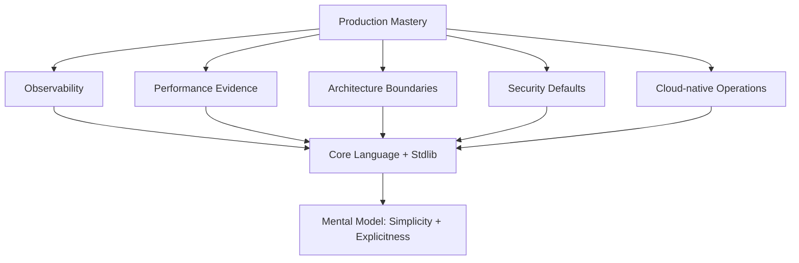
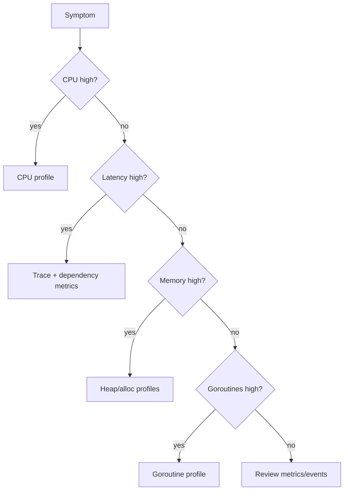
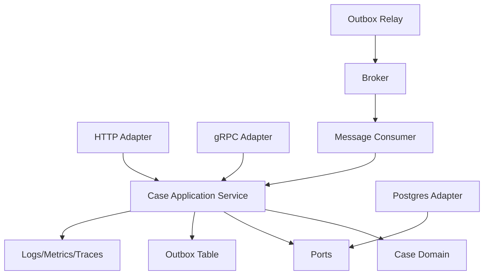

# learn-go-part-034.md

# Go Advanced Production Mastery & Capstone: performance, unsafe/cgo boundaries, Go 1.26 features, code review rubric, and Java-to-Go migration strategy

> Seri: `learn-go`  
> Part: `034` dari `034`  
> Target pembaca: Java software engineer yang ingin naik ke level production-grade Go engineer  
> Target Go: Go 1.26.x  
> Status seri: selesai

---

## 0. Tujuan Part Ini

Ini adalah part terakhir dari seri `learn-go`.

Dari part 000 sampai 033, kita sudah membangun fondasi sampai production engineering:

```text
language mental model
toolchain
types
interfaces
generics
errors
packages
modules
standard library
memory/runtime/GC
concurrency
context
I/O
networking
HTTP
serialization
CLI/config/lifecycle
testing
benchmarking/profiling
database
messaging
security
observability
architecture
cloud-native deployment
```

Part ini adalah capstone: bagaimana menggabungkan semuanya menjadi engineering judgement.

Top 1% Go engineer bukan orang yang hafal semua package. Mereka unggul karena mampu membuat keputusan trade-off dengan evidence:

```text
simplicity vs abstraction
latency vs memory
throughput vs ordering
retry vs duplicate side effect
transaction vs external call
interface vs concrete type
generics vs simple function
unsafe vs safe code
cgo vs pure Go
framework vs standard library
microservice vs modular monolith
strict decode vs forward compatibility
performance vs maintainability
```

Target part ini:

1. menyatukan mental model seluruh seri;
2. memahami advanced performance decision-making;
3. memahami batas penggunaan `unsafe`;
4. memahami batas penggunaan cgo;
5. memahami Go 1.26 features yang relevan untuk production;
6. memahami production code review rubric;
7. memahami capstone architecture;
8. memahami Java-to-Go migration strategy;
9. memahami learning roadmap setelah seri ini;
10. menutup seri dengan checklist mastery.

---

## 1. Sumber Resmi dan Rujukan Utama

Rujukan utama:

- Go 1.26 Release Notes: https://go.dev/doc/go1.26
- Effective Go: https://go.dev/doc/effective_go
- Go Code Review Comments: https://go.dev/wiki/CodeReviewComments
- Package `unsafe`: https://pkg.go.dev/unsafe
- Command cgo: https://pkg.go.dev/cmd/cgo
- Profile-guided optimization: https://go.dev/doc/pgo
- Go Diagnostics: https://go.dev/doc/diagnostics
- Go FIPS 140-3 Compliance: https://go.dev/doc/security/fips140
- Package `runtime/metrics`: https://pkg.go.dev/runtime/metrics
- Package `runtime/pprof`: https://pkg.go.dev/runtime/pprof
- Package `testing`: https://pkg.go.dev/testing
- Package `context`: https://pkg.go.dev/context

Catatan penting dari rujukan resmi:

- Package `unsafe` secara eksplisit “steps around the type safety of Go programs”; package yang mengimpor `unsafe` dapat non-portable dan tidak dilindungi oleh Go 1 compatibility guidelines.
- cgo memungkinkan package Go memanggil C dengan pseudo-package `C`; ini membuka interoperability tetapi membawa konsekuensi build, portability, memory ownership, scheduler, dan deployment.
- PGO memakai profile dari run representatif sebagai input compiler untuk keputusan optimasi seperti inlining hot functions.
- Go 1.26 menambahkan/meningkatkan area runtime/tooling/security seperti experimental goroutine leak profile, pprof web UI flame graph default, FIPS 140-3 module updates, dan beberapa perubahan standard library yang relevan untuk production.

---

## 2. Final Mental Model: Go Is Explicit Systems Engineering

Go bukan Java tanpa class. Go juga bukan C dengan GC.

Go adalah bahasa untuk membangun software production dengan prinsip:

```text
simplicity
composition
explicit error handling
explicit concurrency
explicit dependency
explicit lifecycle
small interfaces
standard tooling
fast build
readable code
```

Go menolak banyak “magic” yang umum di enterprise frameworks:

```text
hidden DI container
annotation-driven transaction
runtime proxy
reflection-heavy mapping
exception propagation
deep inheritance hierarchy
AOP everywhere
```

Sebagai gantinya, Go memberi:

```text
plain functions
plain structs
interfaces by behavior
context cancellation
goroutines/channels
standard library
testing/benchmarking/profiling tools
single binary
```

Top engineer mampu memanfaatkan explicitness ini tanpa membuat kode verbose dan repetitif berlebihan.

---

## 3. The Go Production Pyramid



Core idea:

```text
No production mastery without language/runtime/tooling mastery.
No language mastery is complete without production failure awareness.
```

---

## 4. Cross-Series Synthesis

### 4.1 Error Handling

From part 008, 022, 023, 028, 029, 031:

```text
errors are values
wrap with context
classify at boundary
map to transport status
use errors.Is/As
do not compare strings
```

Production flow:

```go
repo error -> domain/app error -> transport mapping -> safe response -> structured log + metric label
```

### 4.2 Context

From part 019, 022, 023, 025, 028, 029, 033:

```text
context carries cancellation/deadline/request metadata
not dependency bag
must be propagated
must be observed
must be bounded
```

Every production operation should answer:

```text
What context controls this?
What is the deadline?
What happens on cancellation?
```

### 4.3 Interfaces

From part 006, 009, 032:

```text
interfaces are behavior contracts
small interfaces
consumer-side interfaces
do not create interface for every struct
use interfaces at infrastructure boundary
```

### 4.4 Concurrency

From part 016-018, 029, 033:

```text
goroutine needs owner
channel needs close policy
worker pool must be bounded
shared state must be synchronized
race detector is required but not sufficient
shutdown must drain or cancel
```

### 4.5 I/O and HTTP

From part 020-023:

```text
stream when data large
close bodies
set timeouts
limit input
use context
reuse clients/transports
do not retry blindly
```

### 4.6 Data and Serialization

From part 024:

```text
DTO is boundary
decode is not validation
null/missing/zero must be explicit
schema evolution must be designed
```

### 4.7 Database and Messaging

From part 028-029:

```text
DB transaction protects local consistency
outbox protects local state + event publication
inbox/idempotency protects duplicate consumption
retry without idempotency is dangerous
```

### 4.8 Security and Observability

From part 030-031:

```text
secure defaults
no secret logs
verify TLS
bounded input
classify errors
observe runtime
protect debug endpoints
```

### 4.9 Cloud-native

From part 033:

```text
readiness controls traffic
liveness controls restart
SIGTERM must be handled
resource limits must match runtime behavior
rollout safety is application design
```

---

## 5. Advanced Performance Decision-Making

### 5.1 Performance Work Must Start With Question

Bad:

```text
"Let's optimize this code."
```

Good:

```text
p95 latency for approval endpoint increased from 300ms to 900ms after v1.9.
CPU is stable, DB wait duration increased, and db.Stats().WaitCount grows.
Hypothesis: pool saturation due to rows leak or long transaction.
```

### 5.2 Performance Decision Tree



### 5.3 Optimize in This Order

1. Correctness.
2. Algorithm/data structure.
3. I/O and boundary behavior.
4. Concurrency/backpressure.
5. Allocation reduction.
6. Lock contention.
7. Runtime/GC tuning.
8. PGO.
9. `unsafe`/cgo only if justified.

### 5.4 Algorithm Beats Micro-Optimization

Example:

```text
O(n^2) duplicate check -> map-based O(n)
```

beats:

```text
replace fmt.Sprintf with strconv
```

unless profile proves otherwise.

### 5.5 Streaming Beats Buffering

If payload is large:

```text
stream rows -> csv.Writer -> response/object storage
```

instead of:

```text
load all rows -> build []string -> join -> write
```

### 5.6 Backpressure Beats Unbounded Goroutines

Bad:

```go
for _, job := range jobs {
    go process(job)
}
```

Better:

```go
bounded worker pool
queue size limit
context cancellation
metrics
```

### 5.7 Allocation Reduction Requires Evidence

Do not rewrite readable code into obscure code for imagined allocation savings.

Use:

```bash
go test -bench=. -benchmem
go test -memprofile=mem.out
go tool pprof mem.out
```

### 5.8 PGO Is Practical Late-Stage Optimization

PGO can improve performance by giving compiler representative CPU profile information. It is not replacement for algorithmic fixes, but it is valuable after you have a stable representative workload.

Workflow:

```text
collect CPU profile under representative workload
build with -pgo
benchmark/load test
deploy canary
observe
```

---

## 6. `unsafe`: Boundary, Not Lifestyle

### 6.1 What `unsafe` Means

`unsafe` bypasses Go type safety.

It can be legitimate for:

```text
syscall boundary
memory-mapped files
zero-copy conversion in extreme hot path
custom serialization
interoperability
runtime/library-level code
```

But it can break:

```text
memory safety
portability
GC assumptions
future compatibility
string immutability
alignment rules
race safety
```

### 6.2 `unsafe` Decision Rule

Use `unsafe` only if all true:

```text
[ ] benchmark/profile proves safe code is bottleneck
[ ] algorithmic/design alternatives exhausted
[ ] scope is tiny and isolated
[ ] API remains safe for callers
[ ] invariants documented
[ ] tests include race/fuzz/bounds cases
[ ] code review by senior engineer
[ ] fallback safe implementation exists if possible
[ ] no secret/memory lifetime issue
```

### 6.3 Unsafe Wrapper Pattern

Bad:

```go
func BytesToString(b []byte) string {
    return *(*string)(unsafe.Pointer(&b))
}
```

This can violate immutability assumptions if bytes later mutate.

Better approach in production:

- avoid unless proven necessary;
- isolate;
- document lifetime;
- do not expose mutable alias;
- prefer `unsafe.String` / `unsafe.Slice` APIs if applicable and understood;
- use safe conversion if not hot.

### 6.4 Example Documentation

```go
// bytesViewToString returns a string view over b without allocation.
//
// Invariants:
//   - b must not be mutated while returned string is in use.
//   - b must remain alive while string is in use.
//   - caller must not store returned string beyond b lifetime.
//   - this function is only used in parser hot path proven by benchmark.
//
// Prefer string(b) outside this package.
func bytesViewToString(b []byte) string {
    ...
}
```

### 6.5 Safer Architecture

Put unsafe in package like:

```text
internal/fastpath
internal/zerocopy
internal/sys
```

and expose safe API.

Do not spread unsafe across business code.

### 6.6 Red Flags

```text
unsafe in handler/service/domain code
unsafe without benchmark
unsafe without tests
unsafe pointer arithmetic on untrusted input
uintptr stored across GC point
mutating string data
assuming struct layout as wire format
```

---

## 7. cgo: Interop With Consequences

### 7.1 What cgo Provides

cgo allows Go code to call C code through pseudo-package `C`.

Use cases:

```text
database/native driver
OS-specific library
hardware SDK
crypto library
image/audio/video codec
legacy C library
performance-critical native library
```

### 7.2 cgo Costs

cgo affects:

```text
build complexity
cross-compilation
container image dependencies
linking
runtime scheduler boundary
memory ownership
pointer passing rules
debugging
race detector coverage
portability
security patching of native libs
```

### 7.3 cgo Decision Rule

Use cgo only if:

```text
[ ] no mature pure-Go alternative meets requirements
[ ] native dependency is well-maintained
[ ] build pipeline supports it
[ ] container runtime includes required libs
[ ] memory ownership rules are clear
[ ] performance tested including call overhead
[ ] security patching process exists
[ ] cross-platform targets are known
```

### 7.4 cgo Boundary Pattern

Isolate:

```text
internal/nativefoo/
  foo.go       // safe Go API
  foo_cgo.go   // cgo implementation
  foo_stub.go  // optional non-cgo build
```

Use build tags:

```go
//go:build cgo
```

### 7.5 Avoid cgo in Core Domain

Domain should not depend on cgo.

If native library fails or cannot build, domain tests should still run.

### 7.6 Container Impact

With cgo, scratch static build may not work.

Need:

```text
runtime libc
shared libraries
CA certs
correct architecture
matching distro
```

### 7.7 cgo and Performance

cgo call overhead can matter if called per small item in hot loop.

Batch calls if possible.

Bad:

```text
call C once per byte/row
```

Better:

```text
call C once per batch/buffer
```

---

## 8. Go 1.26 Production-Relevant Features

### 8.1 Runtime/Diagnostics

Go 1.26 release notes include an experimental `goroutineleak` profile enabled with `GOEXPERIMENT=goroutineleakprofile`. When enabled, it is available through `runtime/pprof` and `net/http/pprof` as `/debug/pprof/goroutineleak`.

Use case:

```text
investigate goroutine leaks in advanced diagnostics
```

Caveat:

```text
experimental, not replacement for lifecycle design and goroutine profile
```

### 8.2 pprof Web UI

Go 1.26 changes `go tool pprof -http` web UI default to flame graph view.

Why it matters:

```text
faster visual hotspot analysis
better production incident workflow
```

### 8.3 FIPS 140-3

Go 1.26 includes FIPS 140-3 module updates and crypto/fips140 API changes. In FIPS mode, TLS ignores non-approved protocols/ciphers/signature algorithms/key exchanges.

Use case:

```text
regulated environments
government/compliance deployments
```

Caveat:

```text
FIPS mode is not whole-system compliance
test integration compatibility
```

### 8.4 `testing.B.Loop`

Modern Go benchmark style recommends `B.Loop` for new benchmarks.

Use:

```go
func BenchmarkX(b *testing.B) {
    for b.Loop() {
        X()
    }
}
```

This should be your default for new benchmark code.

### 8.5 JSON v2 Awareness

Experimental `encoding/json/v2` and `encoding/json/jsontext` are part of the Go JSON evolution story. For production, baseline remains `encoding/json` v1 unless your organization explicitly evaluates experimental APIs.

Decision rule:

```text
do not rewrite production serialization just because v2 exists
evaluate semantics, compatibility, and stability
```

### 8.6 Standard Library Incremental Changes

Every Go release includes small standard library changes that may matter in production. For Go 1.26 examples from earlier parts:

- `net/http` updates around protocol configuration and behavior;
- cookie scoping behavior involving `Request.Host`;
- ServeMux trailing slash redirects now use 307;
- diagnostics and runtime updates.

Upgrade policy:

```text
read release notes
run tests/race/fuzz
run benchmarks
canary
watch runtime metrics
```

---

## 9. Production Code Review Rubric

### 9.1 Top-Level Review Questions

For any Go production change:

```text
Is the behavior correct?
Is the boundary clear?
Is the failure mode safe?
Is cancellation respected?
Is resource usage bounded?
Is observability sufficient?
Is security preserved?
Is the code simpler than alternatives?
```

### 9.2 Correctness

Check:

```text
business invariants
error paths
nil/zero/null handling
concurrency safety
transaction boundaries
idempotency
ordering
schema compatibility
```

### 9.3 API and Boundary

Check:

```text
DTO/domain separation
transport mapping
error mapping
versioning
input validation
backward compatibility
```

### 9.4 Concurrency

Check:

```text
goroutine owner
bounded worker pool
channel close policy
context cancellation
WaitGroup correctness
race safety
shutdown behavior
```

### 9.5 I/O and Resources

Check:

```text
body close
rows close
file close
timeouts
size limits
streaming for large data
connection pool reuse
memory limits
```

### 9.6 Database

Check:

```text
context timeout
transaction boundary
no external call in tx
rows.Err
ErrNoRows mapping
SQL injection prevention
pool sizing
N+1 risk
locking strategy
```

### 9.7 Messaging

Check:

```text
ack/commit timing
idempotency
outbox/inbox
retry classification
DLQ
ordering
backpressure
lag metrics
```

### 9.8 Security

Check:

```text
TLS verification
no secret logs
secure random
constant-time compare
body limits
authn/authz separation
JWT validation
dependency scanning
debug endpoint protection
```

### 9.9 Observability

Check:

```text
structured logs
request/correlation/trace ID
metrics labels bounded
error classification
runtime metrics
pprof protected
runbook/dashboard impact
```

### 9.10 Maintainability

Check:

```text
package cohesion
import direction
small interfaces
no generic abstraction without payoff
clear names
tests readable
no hidden globals
no magic config
```

---

## 10. Capstone Reference System

Imagine building a production service:

```text
Case Management Service
```

Capabilities:

```text
HTTP REST API
gRPC internal API
PostgreSQL database
Kafka/RabbitMQ event publishing
background worker
outbox/inbox
structured logs
metrics/traces/pprof
Kubernetes deployment
TLS/mTLS
config/secrets
```

### 10.1 Architecture



### 10.2 Use Case: Approve Case

```text
HTTP POST /cases/{id}/approve
decode strict JSON
authorize actor
begin DB transaction
select case for update
domain Approve
save case
insert audit
insert outbox event
commit
return response
outbox relay publishes event
consumer updates projection idempotently
```

### 10.3 Failure Modes and Controls

| Failure | Control |
|---|---|
| client retries POST | idempotency key |
| DB deadlock | safe retry if transaction idempotent |
| broker publish fails | outbox relay |
| consumer duplicate | inbox dedup |
| invalid message | DLQ |
| external API timeout | context timeout + retry budget |
| memory growth | streaming + GOMEMLIMIT + heap profile |
| deployment shutdown | readiness false + graceful shutdown |
| cert expiry | metric/alert |
| high latency | RED metrics + trace + pprof |

### 10.4 This Is Top-Level Engineering

The code is not just Go syntax. It is a set of contracts across:

```text
language
runtime
database
broker
network
security
Kubernetes
humans on-call
```

---

## 11. Java-to-Go Migration Strategy

### 11.1 Stop Looking for Spring Replacement First

Common mistake:

```text
I need DI framework, annotation framework, ORM, validation annotations, AOP.
```

In Go, start with:

```text
constructor injection
interfaces at boundaries
database/sql or explicit query library
plain validation
middleware functions
composition root
```

### 11.2 Translate Concepts, Not Mechanisms

| Java/Spring Concept | Go Translation |
|---|---|
| Controller | HTTP handler adapter |
| Service | application service/use case |
| Entity | domain model or persistence record, not both blindly |
| Repository | interface + SQL adapter |
| DTO | request/response struct |
| `@Transactional` | explicit `WithTx` |
| DI container | composition root constructors |
| Exception | explicit error return |
| MDC | request ID in context/log attrs |
| JMH | `testing.B` benchmark |
| JFR/async-profiler | pprof/trace/runtime metrics |
| Actuator | health/readiness/metrics/pprof endpoints |
| HikariCP | `database/sql` pool |
| CompletableFuture/reactive | goroutines/channels/context, only when needed |

### 11.3 Avoid Java Habits That Hurt Go

```text
deep inheritance
abstract factory everywhere
interfaces for every class
generic service/repository base class
annotation-driven hidden behavior
package names controllers/services/models/utils
exception-style error flow
reflection mapper everywhere
global application context
```

### 11.4 Keep Java Strengths

Good Java habits to keep:

```text
clear boundaries
transaction discipline
database indexing awareness
observability
security review
schema evolution
testing pyramid
capacity planning
runbook thinking
```

### 11.5 Rebuild Muscle Memory

In Go, write:

```go
if err != nil {
    return fmt.Errorf("do thing: %w", err)
}
```

without resentment.

Explicit error flow is design clarity.

---

## 12. Mature Go Design Heuristics

### 12.1 Prefer Boring Code

Boring code wins production.

```text
clear loops
clear errors
clear structs
clear dependencies
clear tests
```

### 12.2 Abstraction Must Pay Rent

Every abstraction must justify itself:

```text
does it reduce duplication?
does it isolate volatility?
does it improve testability?
does it express domain?
does it prevent misuse?
```

If not, remove.

### 12.3 Small Interface, Concrete Implementation

Use concrete types until boundary needs inversion.

### 12.4 Do Not Hide I/O

Function doing I/O should make it obvious via:

```text
context parameter
error return
name
dependency
```

### 12.5 Make Failure Explicit

Every external boundary should have:

```text
timeout
retry policy
error classification
observability
resource limit
```

### 12.6 Design for Shutdown

Every goroutine and resource needs lifecycle.

If you start it, you must know how it stops.

### 12.7 Do Not Optimize Away Readability Prematurely

Readable correct code plus pprof beats clever unmeasured code.

### 12.8 Use Standard Library First, But Not Religiously

Standard library is excellent. But for:

- metrics;
- tracing;
- Kafka/RabbitMQ;
- migrations;
- password hashing;
- JWT;
- database drivers;

you need external libraries. Choose carefully.

---

## 13. Advanced Anti-Patterns Final List

### 13.1 Goroutine as Fire-and-Forget

```go
go doSomething()
```

without context, owner, error handling, shutdown.

### 13.2 Context Ignored

Accepts context but calls `context.Background()` internally.

### 13.3 Hidden Global State

Config/logger/DB accessed through globals everywhere.

### 13.4 Retry Without Idempotency

Duplicates side effects.

### 13.5 Unbounded Everything

Unbounded body, rows, goroutines, queues, retries, cache.

### 13.6 Interface Inflation

Java-style interfaces for every struct.

### 13.7 Generics Abuse

Generic framework where simple functions would do.

### 13.8 Reflection Mapper Everywhere

Hides contract and makes errors runtime-only.

### 13.9 `unsafe` for Cosmetic Performance

No benchmark, no isolation.

### 13.10 cgo Without Build/Runtime Plan

Works locally, fails in container/CI/cross-compile.

### 13.11 Domain Leaks Infrastructure

Domain imports SQL/HTTP/broker/protobuf.

### 13.12 Observability After Incident

No metrics, no trace, no pprof, no request ID.

### 13.13 Liveness Checks Dependency

Restart storm.

### 13.14 Security Fallbacks

Missing cert/secret disables security silently.

---

## 14. Final Production Checklist

Before calling a Go service production-ready:

```text
Language/API:
[ ] package boundaries clear
[ ] errors wrapped/classified
[ ] context propagated
[ ] no unnecessary globals
[ ] tests cover important paths

HTTP:
[ ] server timeouts
[ ] body limits
[ ] graceful shutdown
[ ] request ID
[ ] access logs
[ ] error mapping

Client:
[ ] reused http.Client/Transport
[ ] timeouts
[ ] body close
[ ] retry budget
[ ] idempotency where needed

Database:
[ ] pool configured
[ ] context timeout
[ ] rows closed
[ ] rows.Err checked
[ ] transaction boundaries correct
[ ] no SQL injection
[ ] observability

Messaging:
[ ] idempotency
[ ] ack/commit timing correct
[ ] DLQ
[ ] bounded retry
[ ] ordering understood
[ ] lag metrics

Security:
[ ] TLS verification
[ ] secrets protected
[ ] no secret logs
[ ] authn/authz separated
[ ] dependency scanning
[ ] debug endpoints protected

Observability:
[ ] structured logs
[ ] RED/USE metrics
[ ] traces
[ ] runtime metrics
[ ] pprof protected
[ ] dashboards/runbooks

Cloud:
[ ] non-root image
[ ] readiness/liveness/startup probes
[ ] SIGTERM handling
[ ] resource limits/requests
[ ] GOMEMLIMIT/headroom
[ ] rollout safety
[ ] DB pool vs replicas calculated
```

---

## 15. Learning Roadmap After This Series

### 15.1 Build Capstone Project

Build a real service:

```text
case-api
case-worker
postgres
outbox relay
message broker
Kubernetes manifests
observability
tests/benchmarks
```

Do not just read.

### 15.2 Deepen Runtime

Study:

```text
scheduler traces
GC guide
escape analysis
runtime metrics
pprof case studies
memory model
```

### 15.3 Deepen Distributed Systems

Study:

```text
idempotency
sagas
outbox/inbox
exactly-once myths
leader election
consensus basics
backpressure
rate limiting
circuit breakers
```

### 15.4 Deepen Security

Study:

```text
OAuth/OIDC
mTLS identity
JWT/JWS/JWE
key rotation
KMS/envelope encryption
OWASP ASVS
threat modeling
supply-chain security
```

### 15.5 Deepen Data

Study:

```text
PostgreSQL/MySQL internals
isolation levels
index design
query plans
connection pooling
CDC/Debezium
schema migration
```

### 15.6 Deepen Go Ecosystem

Evaluate:

```text
database drivers
migration tools
OpenTelemetry
Prometheus client
Kafka/RabbitMQ clients
gRPC ecosystem
code generation
linters/static analysis
```

---

## 16. Final Self-Assessment

You are approaching advanced Go capability if you can answer these without memorized template:

1. Why is `*sql.DB` a pool and how does `Rows` leak affect latency?
2. What happens if HTTP client does not close response body?
3. How do you gracefully stop HTTP server and worker on SIGTERM?
4. Why is at-least-once messaging impossible without idempotency?
5. When do you choose keyset pagination over offset?
6. Why should liveness not check DB?
7. How do you distinguish missing/null/zero in JSON?
8. How do you debug high goroutine count?
9. How do you read CPU vs heap profile?
10. When is `unsafe` justified?
11. Why can cgo break your container build?
12. How does outbox solve DB+event consistency?
13. What should be in metrics labels and what should not?
14. How do you design transaction boundary?
15. How do you map Java `@Transactional` to Go?
16. Why should domain not import HTTP/SQL?
17. How do you size DB pool with HPA?
18. What is PGO and when is it useful?
19. What is FIPS mode and what does it not solve?
20. How do you review Go code for production readiness?

If you can reason through these with trade-offs, not slogans, this series did its job.

---

## 17. Closing Summary

Go mastery is not about writing clever code.

Go mastery is about writing code that is:

```text
simple enough to read
explicit enough to debug
bounded enough to survive production
observable enough to operate
secure enough to trust
tested enough to change
fast enough based on evidence
architected enough to evolve
```

As a Java engineer, your advantage is that you already understand large-system concerns:

```text
transactions
pooling
security
observability
deployment
testing
distributed systems
```

Your task in Go is to express those concerns with less framework magic and more explicit design.

The highest-level Go skill is judgement:

```text
when to keep it simple
when to abstract
when to stream
when to retry
when to refuse retry
when to add interface
when to delete interface
when to profile
when to ignore micro-optimization
when to use unsafe
when to avoid unsafe forever
```

This is the mindset that separates someone who “can write Go” from someone who can own production Go systems.

---

## 18. Seri Selesai

Kita sudah menyelesaikan seluruh seri:

```text
000 - Orientation and Mental Model
001 - Toolchain, Workspace, Module, Build
002 - Syntax Core
003 - Functions
004 - Types
005 - Composition
006 - Interfaces
007 - Generics
008 - Error Handling
009 - Package Design
010 - Modules and Dependency Management
011 - Standard Library Mental Model
012 - Slices, Arrays, and Maps
013 - Memory Model for Application Engineers
014 - Runtime Deep Dive
015 - Go Garbage Collector
016 - Concurrency Primitives
017 - Concurrency Patterns
018 - Shared Memory Concurrency
019 - Context Propagation
020 - File, Stream, and Filesystem I/O
021 - Networking Fundamentals
022 - HTTP Server Engineering
023 - HTTP Client Engineering
024 - Serialization
025 - CLI, Daemon, and Configuration Engineering
026 - Testing
027 - Benchmarking and Profiling
028 - Database Engineering
029 - Messaging and Async Systems
030 - Security Engineering
031 - Observability
032 - Service Architecture
033 - Cloud-native Go
034 - Advanced Production Mastery & Capstone
```

Status seri: **selesai**.


<!-- NAVIGATION_FOOTER -->
<div class="page-nav">
<a href="./learn-go-part-033.md">⬅️ Go Cloud-native Engineering: container images, Kubernetes probes, resource limits, signals, config, and rollout safety</a>
<a href="./index.md">📚 Kategori</a>
<a href="../../index.md">🏠 Home</a>
<span></span>
</div>
