# learn-go-data-model-part-000.md

# Part 000 — Orientation: Go Data Model untuk Java Engineer

> Seri: **learn-go-data-model**  
> Fokus: **Data Types, Text, Number, Collections, Struct, Interface, Nil, Generics, Reflection, Unsafe, Boundary, Memory, dan API Design di Go**  
> Target pembaca: **Java software engineer / tech lead** yang ingin memahami Go bukan hanya sebagai syntax, tetapi sebagai **model berpikir engineering**.  
> Baseline versi: **Go 1.26.x**  
> Status seri: **Bagian 0 dari 35** — seri **belum selesai**.

---

## 0. Sumber Resmi dan Baseline Faktual

Materi ini disusun dengan baseline Go modern sampai **Go 1.26.x** dan memakai sumber primer dari dokumentasi resmi Go:

| Area | Sumber resmi |
|---|---|
| Spesifikasi bahasa | <https://go.dev/ref/spec> |
| Go 1.26 release notes | <https://go.dev/doc/go1.26> |
| Release history | <https://go.dev/doc/devel/release> |
| Built-in identifiers | <https://pkg.go.dev/builtin> |
| Go memory model | <https://go.dev/ref/mem> |
| Effective Go | <https://go.dev/doc/effective_go> |
| Reflection model | <https://go.dev/blog/laws-of-reflection> |
| Slice internals | <https://go.dev/blog/slices-intro> |
| Strings, bytes, runes | <https://go.dev/blog/strings> |

Catatan penting baseline:

1. Spesifikasi Go yang dipakai adalah **language version go1.26**.
2. Go 1.26 mempertahankan **Go 1 compatibility promise**, sehingga program valid pada versi Go sebelumnya tetap ditargetkan bisa compile dan berjalan pada versi berikutnya, kecuali area yang memang dikecualikan oleh compatibility policy.
3. Go 1.26 menambahkan perubahan relevan untuk data modeling: built-in `new` sekarang dapat menerima operand berupa **expression** untuk membuat pointer ke nilai awal, misalnya `new(123)` atau `new(yearsSince(born))`. Ini berguna untuk optional field pada JSON/protobuf-style data model.
4. Materi ini tidak hanya membaca dokumentasi, tetapi menurunkannya menjadi mental model, design rule, failure mode, dan production checklist.

---

## 1. Tujuan Part 000

Part ini bukan katalog semua tipe Go. Itu akan dibahas di part berikutnya. Part ini adalah **peta navigasi**.

Setelah menyelesaikan part ini, Anda harus mampu menjawab pertanyaan-pertanyaan berikut:

1. Apa sebenarnya yang dimaksud dengan “data” di Go?
2. Mengapa Go sering terlihat sederhana, tetapi bug-nya banyak muncul dari **copy, aliasing, nil, interface, map iteration, zero value, dan boundary conversion**?
3. Apa perbedaan paling fundamental antara Java object model dan Go value model?
4. Mengapa `struct`, `slice`, `map`, `interface`, dan `pointer` tidak boleh dipikirkan seperti class/reference Java?
5. Bagaimana type design memengaruhi correctness, API compatibility, serialization, memory allocation, GC pressure, concurrency safety, dan performance?
6. Apa yang harus di-unlearn dari Java agar tidak menulis Go bergaya Java?
7. Apa roadmap pembelajaran data model Go yang efisien agar tidak mengulang materi basic?

---

## 2. Kontrak Seri Ini: Tidak Mengulang `learn-go`

Karena Anda sudah menyelesaikan seri dasar `learn-go`, seri ini tidak akan mengulang:

- cara install Go;
- `go run`, `go build`, `go test` basic;
- syntax dasar `if`, `for`, `switch`;
- package/module intro;
- function declaration dasar;
- goroutine/channel intro;
- HTTP CRUD intro;
- “apa itu struct” secara permukaan;
- “apa itu interface” secara permukaan;
- “apa itu slice/map” secara permukaan.

Yang akan dilakukan adalah menaikkan level:

```text
syntax familiarity
→ semantic precision
→ runtime representation
→ ownership and aliasing
→ boundary conversion
→ invariant design
→ failure modeling
→ performance consequence
→ production review habit
```

Mermaid view:

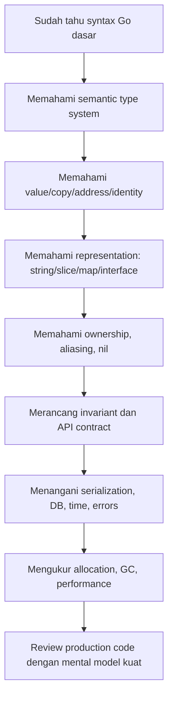

---

## 3. Core Premise: Di Go, Data Model Adalah Architecture

Di banyak codebase Java, “data model” sering berarti:

- class;
- DTO;
- entity;
- record;
- enum;
- collection;
- annotation;
- JSON mapping;
- JPA mapping.

Di Go, istilah “data model” lebih luas dan lebih dekat ke architecture. Ia mencakup:

| Dimensi | Pertanyaan |
|---|---|
| Type identity | Apakah dua nilai boleh dianggap tipe yang sama? |
| Value semantics | Apakah operasi ini menyalin data atau hanya descriptor/reference? |
| Addressability | Apakah nilai bisa diambil alamatnya? |
| Mutability | Siapa yang boleh mengubah? |
| Ownership | Setelah data dikirim ke fungsi lain, apakah caller masih boleh memodifikasi? |
| Aliasing | Apakah dua variabel menunjuk backing storage yang sama? |
| Nilability | Apakah nilai ini bisa `nil`? Kalau bisa, apa artinya? |
| Zero value | Apakah nilai default valid? |
| Comparability | Apakah bisa dipakai dengan `==` atau sebagai key map? |
| Serialization | Apakah zero value hilang saat `omitempty`? |
| Boundary | Apakah data dari JSON/DB/API masih valid untuk domain? |
| Runtime cost | Berapa allocation, pointer density, cache locality, GC scan cost? |
| API evolution | Apakah tipe ini bisa berevolusi tanpa breaking change? |

Dalam sistem production, bug sering tidak muncul karena “tidak tahu syntax”, tetapi karena salah menjawab salah satu pertanyaan di atas.

Contoh:

```go
func normalize(tags []string) []string {
    tags = append(tags, "system")
    return tags
}
```

Secara syntax benar. Tetapi secara data model, pertanyaannya:

- Apakah `tags` memiliki backing array yang dibagi dengan caller?
- Jika `append` tidak reallocate, apakah caller melihat perubahan?
- Apakah function ini mengambil ownership atas `tags`?
- Apakah return slice boleh disimpan jangka panjang?
- Apakah elemen lama yang tidak dipakai masih menahan memory besar?

Top 1% Go engineer tidak berhenti di “append menambahkan elemen”. Mereka melihat **descriptor, capacity, aliasing, ownership, allocation, dan contract**.

---

## 4. Mental Model Utama: Go Bukan Java Tanpa Class

Kalimat yang perlu dipegang:

> Go bukan Java dengan syntax lebih kecil. Go adalah bahasa dengan **value-first semantics**, structural interface, explicit pointer, built-in composite types, dan runtime yang menyeimbangkan simplicity, performance, GC, dan concurrency.

Effective Go secara eksplisit memperingatkan bahwa menerjemahkan program Java/C++ secara langsung ke Go biasanya tidak menghasilkan Go yang baik. Cara berpikirnya harus berubah.

### 4.1 Java Object Model: Identity-First

Di Java, hampir semua domain object biasa dipikirkan sebagai reference ke object di heap.

```java
User a = new User("u-1", "Alice");
User b = a;
b.setName("Bob");
```

Mental model:

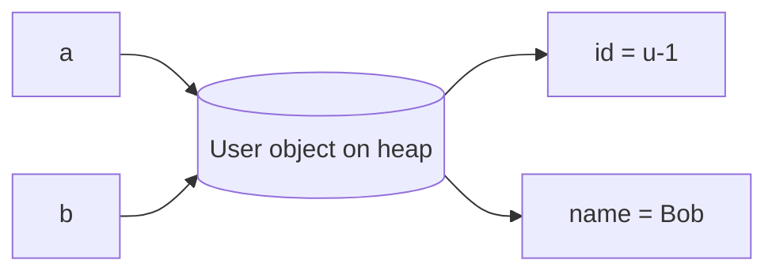

`a` dan `b` adalah dua reference ke object yang sama. Identity object dominan. Mutasi via `b` terlihat via `a`.

### 4.2 Go Value Model: Copy-First

Di Go, assignment pada value biasa menyalin value.

```go
type User struct {
    ID   string
    Name string
}

func example() {
    a := User{ID: "u-1", Name: "Alice"}
    b := a
    b.Name = "Bob"

    // a.Name tetap "Alice"
    // b.Name menjadi "Bob"
}
```

Mental model:

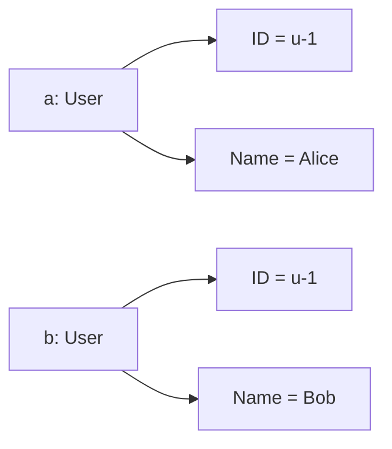

Assignment `b := a` menyalin struct value. Ini bukan reference copy ala Java object.

Namun, Go menjadi lebih menarik karena beberapa value berisi descriptor ke storage lain.

Contoh slice:

```go
a := []string{"A", "B", "C"}
b := a
b[0] = "X"

// a[0] juga "X"
```

`a` dan `b` adalah dua slice descriptor berbeda, tetapi menunjuk backing array yang sama.

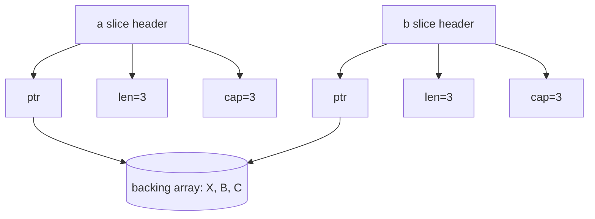

Ini bukan “slice adalah reference” secara sederhana. Lebih tepat:

> Slice adalah value kecil yang berisi descriptor ke backing array.

Jika Anda membawa mental model Java `List` ke Go slice tanpa memahami descriptor/backing array, bug aliasing akan sering terjadi.

---

## 5. Vocabulary Dasar yang Harus Presisi

Di seri ini kita akan memakai istilah secara ketat.

### 5.1 Value

Value adalah data yang memiliki type. Contoh:

```go
42
"hello"
User{ID: "u-1"}
[]int{1, 2, 3}
map[string]int{"a": 1}
```

Di Go, setiap expression menghasilkan value atau bukan value bergantung konteks. Misalnya `x + y` menghasilkan value, tetapi statement assignment bukan value.

### 5.2 Variable

Variable adalah storage location yang menyimpan value.

```go
var x int = 10
```

`x` adalah variable. `10` adalah value.

### 5.3 Type

Type mendeskripsikan set of values dan operasi yang valid atas values tersebut.

```go
var x int
var y string
```

`int` dan `string` punya set values dan operasi berbeda.

### 5.4 Defined Type

Defined type adalah type baru dengan identitas sendiri.

```go
type UserID string
type OrderID string
```

Meskipun underlying type-nya sama-sama `string`, `UserID` dan `OrderID` adalah type berbeda. Ini sangat penting untuk domain modeling.

### 5.5 Alias Type

Alias bukan type baru.

```go
type Byte = uint8
```

`Byte` hanya nama lain untuk `uint8`.

Go sendiri mendefinisikan:

```go
type byte = uint8
type rune = int32
type any = interface{}
```

### 5.6 Underlying Type

Setiap defined type memiliki underlying type.

```go
type UserID string
```

Underlying type `UserID` adalah `string`, tetapi `UserID` bukan `string`.

### 5.7 Identity

Identity adalah “apakah dua hal dianggap tipe/nilai/lokasi yang sama”.

Di Go, kita perlu membedakan:

| Bentuk identity | Contoh |
|---|---|
| Type identity | `UserID` berbeda dari `OrderID` |
| Variable identity | `x` dan `y` adalah storage berbeda |
| Object/storage identity | dua pointer bisa menunjuk lokasi sama |
| Domain identity | dua `User` memiliki `ID` sama |

### 5.8 Address

Address adalah lokasi memory dari variable/value yang addressable.

```go
x := 10
p := &x
```

`p` adalah pointer ke `x`.

### 5.9 Pointer

Pointer adalah value yang menyimpan address.

```go
var p *int
```

Pointer bisa `nil`.

### 5.10 Nil

`nil` adalah zero value untuk beberapa kategori type:

- pointer;
- slice;
- map;
- channel;
- function;
- interface.

`nil` bukan value universal untuk semua type. `int`, `bool`, `string`, struct biasa tidak bisa `nil`.

### 5.11 Addressability

Tidak semua value bisa diambil alamatnya.

```go
x := 10
_ = &x      // OK
// _ = &10  // tidak OK
```

Addressability penting untuk pointer receiver, reflection, mutation, dan composite literal.

### 5.12 Comparability

Tidak semua value bisa dibandingkan dengan `==`.

Bisa:

```go
1 == 1
"a" == "a"
[2]int{1, 2} == [2]int{1, 2}
```

Tidak bisa:

```go
// []int{1} == []int{1}      // invalid
// map[string]int{} == nil  // map hanya bisa dibandingkan dengan nil
// func(){} == nil          // function hanya bisa dibandingkan dengan nil
```

### 5.13 Aliasing

Aliasing terjadi ketika dua access path dapat mengubah atau mengamati storage yang sama.

```go
a := []int{1, 2, 3}
b := a
b[0] = 99
fmt.Println(a[0]) // 99
```

### 5.14 Ownership

Ownership bukan fitur syntax formal di Go seperti Rust, tetapi ia adalah **contract design**.

Pertanyaan ownership:

- Siapa yang boleh mutate?
- Siapa yang boleh retain reference?
- Apakah caller masih boleh memakai slice setelah diserahkan?
- Apakah function menyimpan pointer ke input?
- Apakah returned value berbagi storage dengan input?

### 5.15 Invariant

Invariant adalah aturan yang harus selalu benar agar value valid.

Contoh:

```go
type DateRange struct {
    Start time.Time
    End   time.Time
}
```

Invariant:

```text
Start <= End
```

Struct field public tanpa constructor/validation dapat membuat invalid state mudah terjadi.

---

## 6. Peta Besar Data Types di Go

Secara kasar, tipe Go dapat dipahami dalam kelompok berikut.

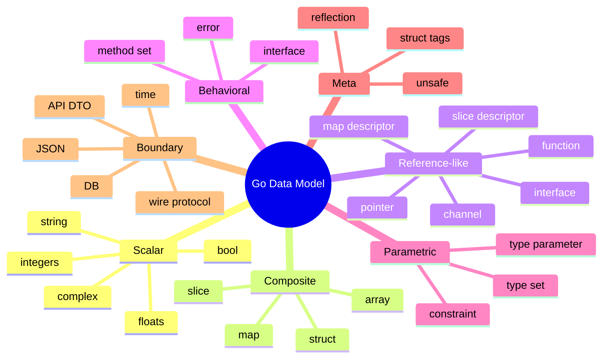

Tetapi taxonomy di atas belum cukup. Untuk production engineering, kita perlu melihat dari beberapa axis.

---

## 7. Axis #1 — Value vs Descriptor vs Pointer

Banyak kesalahpahaman Go muncul karena semua assignment terlihat sama:

```go
b := a
```

Tetapi konsekuensinya berbeda tergantung shape value.

### 7.1 Plain Value

```go
type Point struct {
    X int
    Y int
}

a := Point{1, 2}
b := a
b.X = 99
```

`b := a` menyalin seluruh `Point`.

### 7.2 Pointer Value

```go
a := &Point{1, 2}
b := a
b.X = 99
```

`b := a` menyalin pointer value. Kedua pointer menunjuk object yang sama.

### 7.3 Descriptor Value

Slice:

```go
a := []int{1, 2, 3}
b := a
b[0] = 99
```

`b := a` menyalin slice header, bukan backing array.

Map:

```go
a := map[string]int{"x": 1}
b := a
b["x"] = 99
```

`b := a` menyalin map descriptor, tetapi keduanya menunjuk runtime hash table yang sama.

Interface:

```go
var r io.Reader = bytes.NewBufferString("x")
s := r
```

`s := r` menyalin interface value, yang membawa dynamic type dan dynamic value.

### 7.4 Ringkasan

| Shape | Assignment menyalin apa? | Storage dibagi? | Mutasi terlihat dari copy? |
|---|---:|---:|---:|
| `int`, `bool`, `float64` | nilai scalar | tidak | tidak |
| `struct` tanpa pointer/slice/map field | seluruh field | tidak | tidak |
| `struct` dengan pointer/slice/map field | field value | sebagian bisa | ya, untuk referenced storage |
| `*T` | alamat | ya | ya |
| `[]T` | slice header | backing array ya | ya, untuk elemen yang sama |
| `map[K]V` | map descriptor | hash table ya | ya |
| `chan T` | channel descriptor | channel ya | ya |
| `func` | function value | closure state bisa | tergantung closure |
| `interface` | interface pair | dynamic value bisa | tergantung dynamic value |

Production rule:

> Jangan bertanya “apakah Go pass by value atau reference?” Jawaban formalnya: Go passes values. Pertanyaan engineering yang benar: **value yang disalin itu berisi data langsung, pointer, atau descriptor ke storage lain?**

---

## 8. Axis #2 — Zero Value as API Contract

Go memberi zero value untuk setiap type.

```go
var n int        // 0
var s string     // ""
var p *int       // nil
var xs []int     // nil
var m map[string]int // nil
var u User       // User dengan field zero value
```

Di Java, Anda sering berpikir dengan constructor:

```java
User user = new User(...);
```

Di Go, banyak type idealnya usable tanpa constructor.

Contoh standard library:

```go
var b bytes.Buffer
b.WriteString("hello")
```

`bytes.Buffer` zero value usable.

Tetapi tidak semua domain type bisa aman dengan zero value.

```go
type Percentage struct {
    value int // basis points maybe
}
```

Apakah zero value `0` berarti 0%, unknown, unset, atau invalid?

Pertanyaan desain:

1. Apakah zero value harus valid?
2. Jika valid, apa semantic-nya?
3. Jika invalid, bagaimana mencegah pemakaian sebelum valid?
4. Apakah `nil` berarti absent atau empty?
5. Apakah field optional harus pointer, `sql.NullX`, custom option type, atau tagged union style?

Diagram:

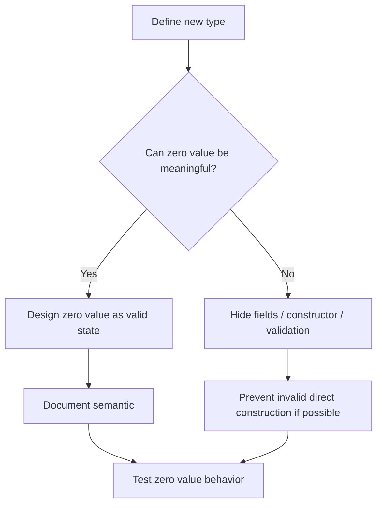

Production rule:

> Zero value bukan detail kecil. Zero value adalah bagian dari public contract.

---

## 9. Axis #3 — Nilability Is Not Optionality

Java memiliki `null` untuk reference. Go memiliki `nil`, tetapi hanya untuk beberapa type.

```go
var p *int = nil
var xs []int = nil
var m map[string]int = nil
var ch chan int = nil
var fn func() = nil
var r io.Reader = nil
```

Tapi:

```go
var n int = nil       // invalid
var s string = nil    // invalid
var u User = nil      // invalid
```

Masalahnya, banyak engineer Java melihat `nil` sebagai `null`. Itu terlalu dangkal.

### 9.1 Nil Pointer

`nil` pointer berarti tidak menunjuk ke object.

```go
var p *User
```

Membaca field dari nil pointer menyebabkan panic:

```go
// p.Name // panic
```

### 9.2 Nil Slice

Nil slice bisa dibaca `len`-nya dan bisa di-append.

```go
var xs []int
fmt.Println(len(xs)) // 0
xs = append(xs, 1)   // OK
```

### 9.3 Nil Map

Nil map bisa dibaca, tetapi tidak bisa ditulis.

```go
var m map[string]int
fmt.Println(m["x"]) // 0
m["x"] = 1          // panic
```

### 9.4 Nil Interface Trap

Interface nil bukan hanya “dynamic value nil”. Interface value nil jika **type dan value component** sama-sama nil.

```go
type MyError struct{}

func (*MyError) Error() string { return "boom" }

func maybeErr() error {
    var e *MyError = nil
    return e
}

func example() {
    err := maybeErr()
    fmt.Println(err == nil) // false
}
```

Conceptual representation:

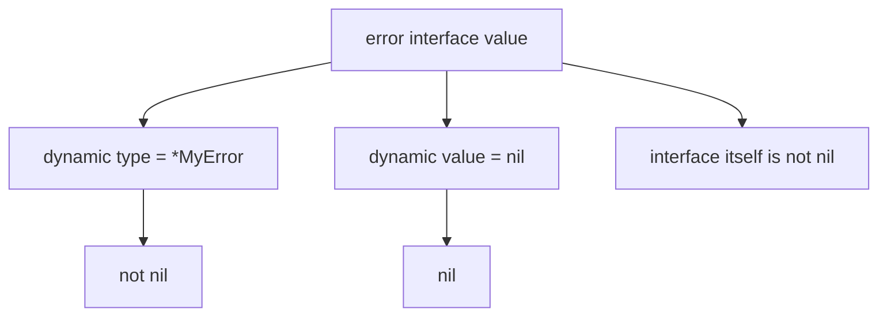

Production rule:

> Optionality adalah domain concept. `nil` hanyalah salah satu encoding. Jangan samakan keduanya.

---

## 10. Axis #4 — Type Identity as Domain Defense

Java engineer sering memakai class untuk domain identity.

```java
record UserId(String value) {}
record OrderId(String value) {}
```

Di Go, defined type memberi lightweight nominal separation.

```go
type UserID string
type OrderID string

func LoadUser(id UserID) (*User, error) { /* ... */ }
```

Sekarang ini compile-time safe:

```go
var orderID OrderID = "ord-1"
// LoadUser(orderID) // compile error
```

Tanpa defined type:

```go
func LoadUser(id string) (*User, error) { /* ... */ }
```

Maka semua string bisa masuk:

```go
LoadUser("ord-1")
LoadUser("email@example.com")
LoadUser("not-even-id")
```

Production rule:

> Jangan overuse primitive untuk domain concept. Go memberi defined type murah; gunakan untuk mencegah cross-entity mix-up.

Namun jangan juga berlebihan. Defined type berguna jika:

- ada invariant domain;
- ada boundary API;
- ada risiko tertukar;
- ada method domain;
- ada serialization/scanning khusus;
- ada security/safety concern.

Tidak perlu defined type untuk setiap local variable sementara.

---

## 11. Axis #5 — Interface Is Behavior, Not Inheritance Slot

Java interface sering dibuat di producer side:

```java
public interface UserService {
    User getUser(String id);
}

public class UserServiceImpl implements UserService { ... }
```

Di Go, interface biasanya lebih baik didefinisikan di consumer side.

```go
type UserReader interface {
    GetUser(ctx context.Context, id UserID) (User, error)
}

func RenderProfile(ctx context.Context, users UserReader, id UserID) error {
    user, err := users.GetUser(ctx, id)
    if err != nil {
        return err
    }
    // render
    return nil
}
```

Implementasi tidak perlu deklarasi `implements`.

```go
type PostgresUserStore struct{}

func (s *PostgresUserStore) GetUser(ctx context.Context, id UserID) (User, error) {
    // query
    return User{}, nil
}
```

Jika method set cocok, type tersebut satisfy interface.

Mermaid:

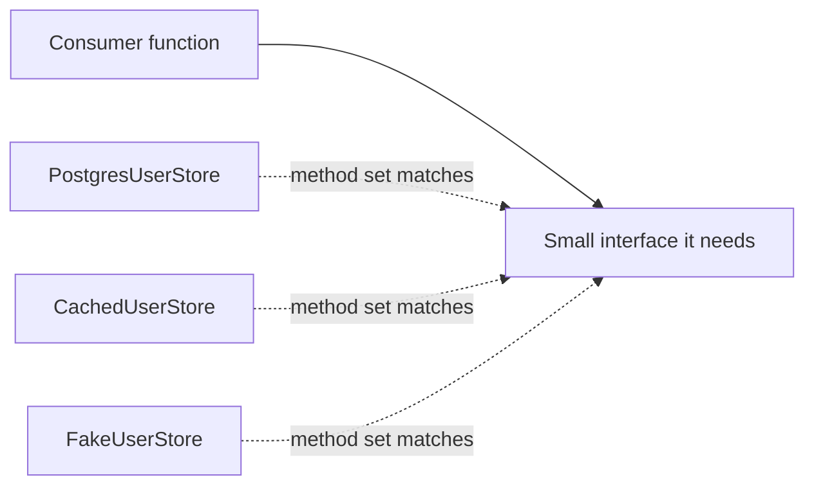

Production rule:

> Interface di Go seharusnya muncul dari kebutuhan consumer, bukan dari kebiasaan membuat abstraction layer seperti Java enterprise code.

---

## 12. Axis #6 — Struct Is Not Class

Struct adalah aggregate of fields. Struct tidak punya inheritance. Struct bisa punya methods, tetapi method tidak berada “di dalam” struct seperti Java class secara conceptual.

```go
type User struct {
    ID   UserID
    Name string
}

func (u User) DisplayName() string {
    return u.Name
}
```

Method receiver adalah parameter khusus.

Secara mental, ini lebih dekat ke:

```go
func DisplayName(u User) string {
    return u.Name
}
```

Daripada Java:

```java
class User {
    String displayName() { return this.name; }
}
```

Tentu Go method punya method set dan dispatch behavior, tetapi memahami receiver sebagai parameter membantu menghindari kebingungan value receiver vs pointer receiver.

### 12.1 Embedding Is Not Inheritance

```go
type AuditFields struct {
    CreatedAt time.Time
    UpdatedAt time.Time
}

type User struct {
    AuditFields
    ID UserID
}
```

Embedding mempromosikan field/method. Tetapi `User` bukan subtype dari `AuditFields` seperti inheritance Java.

Production rule:

> Jangan memakai embedding untuk mensimulasikan inheritance hierarchy. Pakai embedding untuk composition dan forwarding yang memang jelas.

---

## 13. Axis #7 — Collections Are Built-In, But Not Magic

Go memiliki built-in array, slice, map. Tetapi perilakunya sangat spesifik.

### 13.1 Array

Array adalah fixed-size value. Panjang array bagian dari type.

```go
var a [3]int
var b [4]int
// a = b // invalid: different types
```

### 13.2 Slice

Slice adalah descriptor ke backing array.

```go
xs := []int{1, 2, 3}
```

Conceptual shape:

```text
slice header = { pointer to array, length, capacity }
```

### 13.3 Map

Map adalah reference-like hash table managed by runtime.

```go
m := map[string]int{"a": 1}
```

Important properties:

- key harus comparable;
- iteration order tidak dijamin;
- read dari nil map OK;
- write ke nil map panic;
- concurrent read/write tanpa synchronization adalah bug.

### 13.4 Collection Design Questions

Saat memilih collection, jangan hanya bertanya “butuh list atau map”. Tanyakan:

| Pertanyaan | Implikasi |
|---|---|
| Apakah order penting? | Map iteration tidak stabil; butuh slice sorted key |
| Apakah lookup dominan? | Map mungkin cocok |
| Apakah jumlah elemen kecil? | Slice linear scan bisa lebih sederhana dan cepat |
| Apakah key comparable? | Map key butuh comparability |
| Apakah mutation dibagi? | Perlu ownership/sync |
| Apakah data long-lived? | Perhatikan retention dan GC |
| Apakah output harus deterministic? | Jangan output langsung dari map |

---

## 14. Axis #8 — Boundary Conversion Is Where Domain Dies

Banyak bug enterprise terjadi saat data melewati boundary:

```text
HTTP JSON → DTO → validation → domain → DB → event → API response
```

Di Java, annotation-heavy framework sering menyembunyikan boundary conversion:

```java
@NotNull
@JsonProperty("user_id")
private String userId;
```

Di Go, boundary conversion sebaiknya eksplisit.

```go
type CreateUserRequest struct {
    Email string `json:"email"`
    Name  string `json:"name"`
}

type Email string

type CreateUserCommand struct {
    Email Email
    Name  string
}

func (r CreateUserRequest) ToCommand() (CreateUserCommand, error) {
    email, err := ParseEmail(r.Email)
    if err != nil {
        return CreateUserCommand{}, err
    }
    return CreateUserCommand{Email: email, Name: strings.TrimSpace(r.Name)}, nil
}
```

Boundary principle:

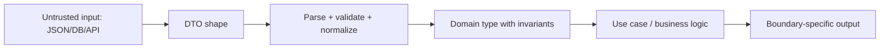

Production rule:

> Jangan membiarkan DTO menjadi domain model hanya karena field-nya sama.

---

## 15. Axis #9 — Allocation and GC Are Data Shape Problems

Go memiliki garbage collector. Tetapi bukan berarti Anda boleh mengabaikan object graph.

Data shape memengaruhi:

- allocation count;
- heap pressure;
- GC scan work;
- cache locality;
- pointer chasing;
- false sharing risk;
- serialization cost;
- copy cost.

Bandingkan dua model:

```go
type UserA struct {
    ID    string
    Name  string
    Email string
    Roles []string
}
```

versus:

```go
type UserB struct {
    ID    UserID
    Name  Name
    Email Email
    Roles RoleSet
}
```

Model kedua mungkin lebih aman domain-wise, tetapi bisa punya cost jika abstraction-nya membuat banyak allocation. Namun sering cost-nya tetap kecil jika defined type hanya wrapper atas scalar.

Bandingkan pointer-heavy model:

```go
type Node struct {
    ID       *string
    Parent   *Node
    Children []*Node
    Meta     map[string]*string
}
```

Dengan compact value model:

```go
type Node struct {
    ID       NodeID
    ParentID NodeID
    Children []NodeID
    Meta     map[string]string
}
```

Pointer-heavy model bisa meningkatkan:

- nil checks;
- object fragmentation;
- GC scan work;
- cache miss;
- accidental shared mutation.

Production rule:

> Performance Go sering dimulai dari data shape, bukan micro-optimization function.

---

## 16. Axis #10 — Concurrency Safety Is Data Ownership

Go memory model menekankan bahwa program yang memodifikasi data yang juga diakses goroutine lain harus melakukan serialization menggunakan channel atau synchronization primitives seperti `sync`/`sync/atomic`.

Jadi concurrency safety bukan hanya “pakai mutex” atau “pakai channel”. Pertanyaan paling awal adalah:

> Siapa memiliki data ini sekarang?

### 16.1 Shared Mutable Data

```go
type Cache struct {
    m map[string]string
}

func (c *Cache) Set(k, v string) {
    c.m[k] = v
}
```

Jika dipakai multi-goroutine, ini bug tanpa lock.

### 16.2 Mutex-Protected Data

```go
type Cache struct {
    mu sync.RWMutex
    m  map[string]string
}

func (c *Cache) Set(k, v string) {
    c.mu.Lock()
    defer c.mu.Unlock()
    c.m[k] = v
}
```

### 16.3 Ownership Transfer

```go
type Job struct {
    Payload []byte
}

jobs <- job
```

Jika `job.Payload` masih dimutasi oleh sender setelah dikirim, receiver bisa melihat race/corruption. Channel mengirim value, tetapi value itu bisa berisi descriptor ke shared backing array.

Production rule:

> Channel tidak otomatis membuat data immutable. Channel hanya memberi synchronization pada send/receive. Ownership contract tetap harus jelas.

---

## 17. Why Java Experience Helps — and Hurts

Sebagai Java engineer, Anda punya keuntungan besar:

| Java skill | Relevansi di Go |
|---|---|
| Strong typing | Mudah memahami compile-time contract |
| Interface abstraction | Berguna, tetapi harus diperkecil dan dipindah ke consumer side |
| Collections | Berguna untuk memilih struktur data, tetapi Go collection semantics berbeda |
| JVM memory awareness | Berguna untuk GC/performance thinking |
| Concurrency | Berguna untuk race/synchronization, tetapi Go primitives berbeda |
| Enterprise boundary modeling | Sangat berguna untuk DTO/domain/API/DB split |

Tetapi beberapa kebiasaan Java harus diwaspadai.

## 17.1 Kebiasaan Java yang Perlu Di-unlearn

### 17.1.1 Membuat Interface untuk Semua Service

Java style:

```text
UserService interface
UserServiceImpl class
```

Go style yang lebih umum:

```go
type UserStore struct { ... }

func (s *UserStore) Find(...) (...) { ... }
```

Buat interface hanya saat consumer butuh abstraction.

### 17.1.2 Menganggap Semua Assignment Object sebagai Shared Reference

Di Go, struct assignment copy value.

```go
b := a
```

Ini bisa copy seluruh struct.

### 17.1.3 Menganggap `nil` Sama dengan `null`

Go punya typed nil, nil slice, nil map, nil interface, nil channel — semua punya behavior berbeda.

### 17.1.4 Membawa Annotation-Driven Domain Model

Go struct tag berguna untuk serialization, tetapi jangan jadikan tag sebagai pusat domain invariant.

```go
type User struct {
    Email string `json:"email" db:"email" validate:"required,email"`
}
```

Ini terlihat praktis, tetapi bisa membuat domain, transport, DB, dan validation boundary bercampur.

### 17.1.5 Membuat Object Graph Terlalu Pointer-Heavy

Di Java, reference object lazim. Di Go, value type dan compact struct sering lebih natural.

### 17.1.6 Mengandalkan Framework untuk Lifecycle

Go lebih eksplisit. Initialization, validation, dependency passing, ownership, dan error handling sering terlihat langsung di code.

---

## 18. Java vs Go Data Model: Tabel Komparatif

| Topic | Java | Go | Consequence |
|---|---|---|---|
| Default domain shape | class/object | struct/value | copy semantics lebih penting di Go |
| Object identity | dominan | eksplisit via pointer/domain ID | jangan asumsikan identity pada struct value |
| Nullability | reference bisa `null` | hanya type tertentu bisa `nil` | optionality harus didesain |
| Interface implementation | explicit `implements` | implicit method set | interface kecil dan consumer-side |
| Generics | type erasure model | type parameter + constraint/type set | constraint design berbeda |
| Collections | class library | built-in array/slice/map | semantics built-in lebih dekat runtime |
| String | UTF-16-ish abstraction | immutable byte sequence, UTF-8 convention | `len` string = bytes, bukan karakter manusia |
| Exception | throwable control flow | `error` value | error adalah data contract |
| Annotation | sangat dominan | struct tag sederhana | jangan over-framework |
| Reflection | framework-heavy | tersedia, tetapi eksplisit dan tajam | reflect bukan default abstraction |
| Memory | heap object reference heavy | value + pointer + descriptor mix | data layout lebih terlihat |
| Concurrency | threads/executors/locks | goroutine/channel/sync | ownership tetap kunci |

---

## 19. Reading Model: Dari Spec ke Engineering Rule

Cara membaca Go yang benar bukan hanya “cari contoh StackOverflow”. Untuk level senior/top-tier, gunakan pipeline ini:

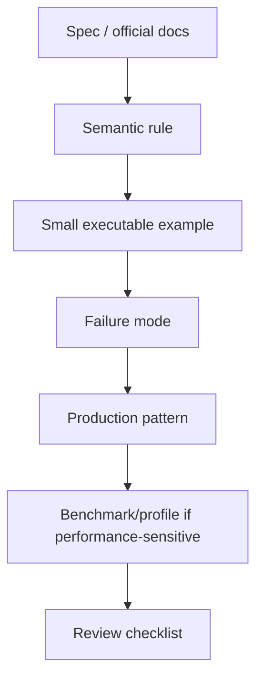

Contoh penerapan:

### Topic: Map Iteration

1. Spec/documentation: map iteration order tidak dijamin.
2. Semantic rule: jangan bergantung pada order map.
3. Example:

```go
m := map[string]int{"a": 1, "b": 2, "c": 3}
for k := range m {
    fmt.Println(k)
}
```

4. Failure mode: API response nondeterministic, flaky test, inconsistent signature generation.
5. Production pattern: extract keys, sort, lalu emit deterministic output.
6. Benchmark only if hot path.
7. Review checklist: “Apakah output dari map harus stable?”

---

## 20. Taxonomy Bug yang Akan Sering Kita Bahas

Seri ini akan sering kembali ke taxonomy bug berikut.

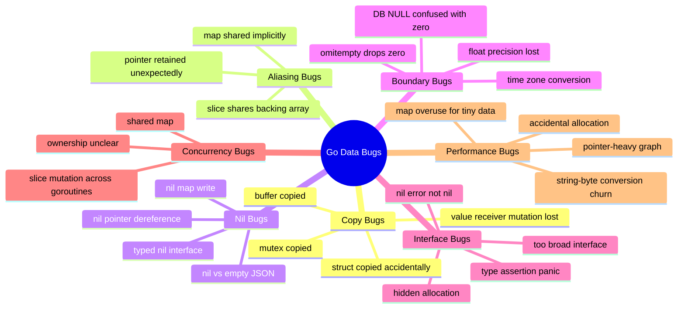

---

## 21. Data Model Decision Tree

Saat mendesain tipe Go, gunakan decision tree berikut.

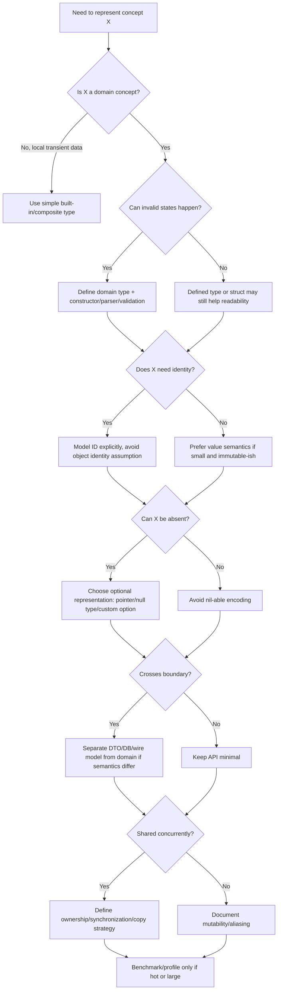

---

## 22. Preview: Seri 35 Part dan Dependency-nya

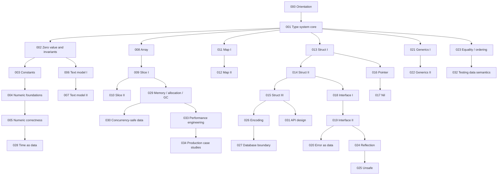

---

## 23. The Five-Layer Mental Model

Untuk setiap tipe atau fitur data Go, kita akan melihat lima layer.

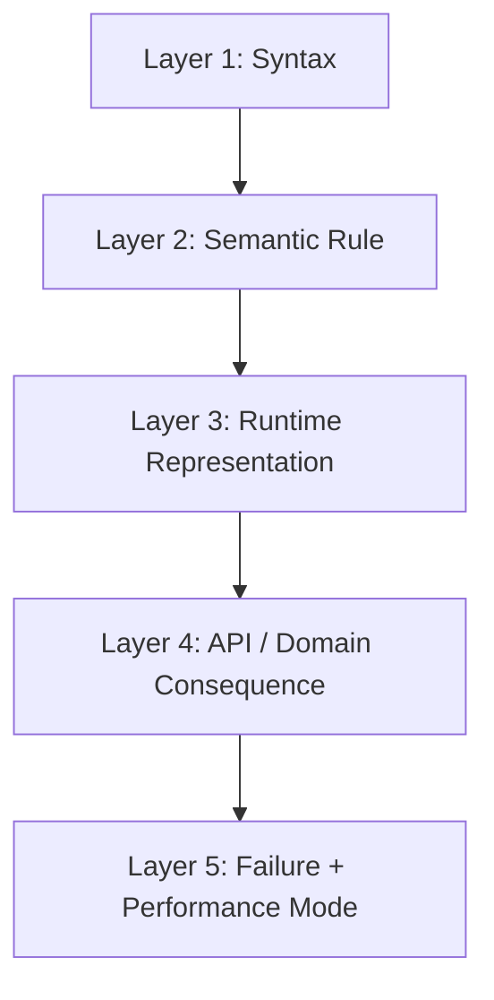

Contoh pada `string`:

| Layer | Pertanyaan |
|---|---|
| Syntax | Bagaimana membuat string literal? |
| Semantic | Apakah string mutable? Apa arti `len(s)`? |
| Runtime | Apakah string menyimpan bytes? Apakah copy terjadi? |
| API/domain | Apakah input text sudah normalized? Apakah boleh invalid UTF-8? |
| Failure/perf | Apakah konversi `[]byte ↔ string` membuat allocation? Apakah concatenation quadratic? |

Contoh pada `interface`:

| Layer | Pertanyaan |
|---|---|
| Syntax | Bagaimana mendefinisikan interface? |
| Semantic | Method set apa yang harus dipenuhi? |
| Runtime | Apa dynamic type dan dynamic value? |
| API/domain | Apakah interface terlalu luas? Apakah consumer-side? |
| Failure/perf | Apakah typed nil menyebabkan `err != nil`? Apakah boxing allocate? |

---

## 24. Production Principle #1 — Prefer Semantic Types at Boundaries

Boundary adalah tempat risiko tertinggi.

Contoh buruk:

```go
type PaymentRequest struct {
    UserID string  `json:"user_id"`
    Amount float64 `json:"amount"`
}
```

Masalah:

- `UserID` raw string bisa tertukar dengan `OrderID`;
- `Amount float64` buruk untuk money;
- tidak jelas currency;
- tidak jelas validasi amount > 0;
- request DTO mungkin langsung masuk domain.

Lebih baik:

```go
type UserID string

type Currency string

const CurrencySGD Currency = "SGD"

type Money struct {
    Currency Currency
    Minor    int64 // cents
}

type PaymentRequest struct {
    UserID   string `json:"user_id"`
    Currency string `json:"currency"`
    Amount   string `json:"amount"` // decimal text from client, parsed explicitly
}

type CreatePaymentCommand struct {
    UserID UserID
    Amount Money
}
```

Boundary parsing:

```go
func (r PaymentRequest) ToCommand() (CreatePaymentCommand, error) {
    userID, err := ParseUserID(r.UserID)
    if err != nil {
        return CreatePaymentCommand{}, err
    }

    amount, err := ParseMoney(r.Currency, r.Amount)
    if err != nil {
        return CreatePaymentCommand{}, err
    }

    return CreatePaymentCommand{
        UserID: userID,
        Amount: amount,
    }, nil
}
```

Rule:

> Raw external data boleh sederhana. Internal domain data harus semantic.

---

## 25. Production Principle #2 — Make Invalid States Hard to Represent

Go tidak punya private constructor seperti Java dalam bentuk class, tetapi kita bisa menyembunyikan fields dan memberikan constructor/parser.

```go
type Email struct {
    value string
}

func ParseEmail(s string) (Email, error) {
    s = strings.TrimSpace(s)
    if s == "" {
        return Email{}, errors.New("email is required")
    }
    if !strings.Contains(s, "@") {
        return Email{}, errors.New("invalid email")
    }
    return Email{value: strings.ToLower(s)}, nil
}

func (e Email) String() string {
    return e.value
}
```

Trade-off:

- Lebih aman;
- butuh parser;
- zero value `Email{}` masih mungkin ada;
- perlu putuskan apakah zero value valid/invalid;
- perlu method untuk serialization jika melewati JSON/DB.

Go tidak membuat invalid state mustahil total seperti beberapa bahasa dengan algebraic data type kuat. Tetapi Go memungkinkan invalid state menjadi **lebih sulit** dan lebih terlokalisir.

---

## 26. Production Principle #3 — Separate Shape from Meaning

Dua data bisa punya shape sama tetapi meaning berbeda.

```go
type UserID string
type OrderID string
type Email string
type CountryCode string
```

Semuanya shape-nya `string`. Meaning-nya berbeda.

Kesalahan umum:

```go
func FindUser(id string) {}
func FindOrder(id string) {}
func SendEmail(email string) {}
```

Semua menerima string. Compiler tidak membantu.

Lebih baik:

```go
func FindUser(id UserID) {}
func FindOrder(id OrderID) {}
func SendEmail(email Email) {}
```

Rule:

> Shape adalah representasi. Meaning adalah domain contract. Jangan biarkan representasi menghapus meaning.

---

## 27. Production Principle #4 — Document Ownership When Returning or Accepting Slices

API slice yang buruk:

```go
func (s *Store) Users() []User {
    return s.users
}
```

Pertanyaan:

- Apakah caller boleh modify returned slice?
- Apakah caller boleh append?
- Apakah returned slice shared dengan internal state?
- Apakah concurrent safe?

Lebih jelas:

```go
func (s *Store) Users() []User {
    out := make([]User, len(s.users))
    copy(out, s.users)
    return out
}
```

Atau document:

```go
// Users returns a snapshot copy of users.
func (s *Store) Users() []User
```

Atau:

```go
// UsersView returns an internal read-only view.
// The caller must not modify or retain it after the next Store mutation.
func (s *Store) UsersView() []User
```

Tetapi Go tidak punya readonly slice. Jadi “read-only” adalah contract, bukan compiler-enforced.

Rule:

> Slice API tanpa ownership documentation adalah future bug.

---

## 28. Production Principle #5 — Avoid Nil Ambiguity in Public API

Contoh:

```go
func FindRoles(userID UserID) ([]Role, error)
```

Jika user tidak punya role, return apa?

```go
return nil, nil
```

atau:

```go
return []Role{}, nil
```

Keduanya `len == 0`, tetapi berbeda untuk JSON:

```json
null
```

vs

```json
[]
```

Decision harus eksplisit.

Guideline umum:

| Situation | Bias |
|---|---|
| Internal computation | nil slice sering OK |
| JSON response list | empty slice sering lebih baik agar output `[]` |
| Optional object | pointer bisa sesuai |
| Optional scalar | pointer/null type/custom option tergantung boundary |
| Map output | empty map vs nil map harus diputuskan |

Rule:

> `nil` boleh dipakai, tetapi semantic-nya harus satu arti.

---

## 29. Production Principle #6 — Treat Error as Structured Data

Di Go, `error` adalah interface:

```go
type error interface {
    Error() string
}
```

Ini berarti error bukan exception stack unwinding seperti Java. Error adalah returned value dan bagian dari function contract.

Buruk:

```go
if err != nil {
    return fmt.Errorf("failed: %v", err)
}
```

Ini kehilangan wrapping semantics.

Lebih baik:

```go
if err != nil {
    return fmt.Errorf("load user %s: %w", id, err)
}
```

Tetapi untuk domain error, string saja tidak cukup.

```go
type NotFoundError struct {
    Resource string
    ID       string
}

func (e NotFoundError) Error() string {
    return e.Resource + " not found: " + e.ID
}
```

Rule:

> Error message untuk manusia. Error type/classification untuk program.

---

## 30. Production Principle #7 — Use Generics for Algorithms and Containers, Not for Abstracting Everything

Go generics sangat berguna untuk:

- reusable algorithms;
- collection helpers;
- typed set/map wrappers;
- constraints berbasis underlying type;
- avoiding `interface{}` + type assertion.

Tetapi generics tidak menggantikan interface kecil.

Generic bagus:

```go
func Contains[T comparable](xs []T, target T) bool {
    for _, x := range xs {
        if x == target {
            return true
        }
    }
    return false
}
```

Interface bagus:

```go
type Reader interface {
    Read(p []byte) (n int, err error)
}
```

Pertanyaan:

| Butuh | Bias |
|---|---|
| Operasi sama atas banyak concrete type | generics |
| Behavior contract runtime | interface |
| Domain type safety | defined type |
| Dynamic unknown data | interface/reflection, hati-hati |

Rule:

> Generics menyelesaikan masalah type-parametric code, bukan masalah architecture yang kabur.

---

## 31. Production Principle #8 — Reflection Is a Boundary Tool, Not Core Domain Tool

Reflection memungkinkan program memeriksa struktur type/value saat runtime. Ini berguna untuk:

- encoder/decoder;
- validation library;
- ORM/query mapper;
- dependency injection container;
- generic test/helper tools.

Tetapi reflection mahal secara complexity:

- runtime panic lebih mungkin;
- compile-time safety berkurang;
- field/tag typo bisa silent;
- refactor lebih berisiko;
- performance lebih sulit diprediksi.

Rule:

> Reflection boleh dipakai untuk boundary framework, tetapi domain logic sebaiknya tetap explicit dan typed.

---

## 32. Production Principle #9 — Unsafe Requires Object Lifetime Thinking

`unsafe` membuka akses ke memory representation. Ini bukan sekadar “fast mode”. Saat memakai `unsafe`, Anda harus paham:

- pointer validity;
- object lifetime;
- GC visibility;
- alignment;
- aliasing;
- immutability contract;
- Go version/runtime assumptions.

Rule:

> Jika alasan memakai `unsafe` hanya “biar cepat” tanpa benchmark dan lifetime proof, jangan pakai.

Part unsafe nanti akan memakai checklist review ketat.

---

## 33. Production Principle #10 — Test Data Semantics, Not Just Behavior Happy Path

Contoh function:

```go
func NormalizeTags(tags []string) []string
```

Test bukan hanya:

```go
input := []string{" B ", "a"}
want := []string{"a", "b"}
```

Tapi juga:

- apakah input dimutasi?
- apakah output berbagi backing array dengan input?
- bagaimana nil input?
- bagaimana empty input?
- apakah order stable?
- apakah duplicate dihapus?
- apakah Unicode case folding benar?
- apakah allocation acceptable?

Data semantic test template:

```go
func TestNormalizeTags_DoesNotMutateInput(t *testing.T) {
    input := []string{" B ", "a"}
    snapshot := append([]string(nil), input...)

    _ = NormalizeTags(input)

    if !slices.Equal(input, snapshot) {
        t.Fatalf("input mutated: got %v want %v", input, snapshot)
    }
}
```

Rule:

> Untuk data-heavy code, test invariant, ownership, nil/empty, equality, order, dan boundary conversion.

---

## 34. Running Example Domain untuk Seri Ini

Agar materi tidak abstrak, seri ini akan sering memakai domain mini berikut.

```text
Regulatory Case Management
```

Entities/concepts:

- `CaseID`
- `ApplicationID`
- `OfficerID`
- `AgencyCode`
- `CaseStatus`
- `RiskScore`
- `Deadline`
- `Money`
- `Email`
- `PostalCode`
- `AuditEvent`
- `AttachmentID`
- `Decision`
- `EscalationRule`

Kenapa domain ini cocok?

1. Banyak ID yang raw shape-nya sama-sama string tetapi tidak boleh tertukar.
2. Banyak status/enum yang perlu compatibility.
3. Banyak waktu/deadline yang rentan timezone bug.
4. Banyak optional field dari form/API/DB.
5. Banyak collection: parties, documents, audit events, transitions.
6. Banyak boundary: JSON, DB, event, report, external API.
7. Banyak invariant: deadline tidak boleh sebelum created time, status transition harus valid, risk score harus range tertentu.
8. Banyak concurrency concern: workflow update, audit append, notification dispatch.

Contoh awal:

```go
type CaseID string
type OfficerID string
type AgencyCode string

type CaseStatus string

const (
    CaseStatusDraft      CaseStatus = "DRAFT"
    CaseStatusSubmitted  CaseStatus = "SUBMITTED"
    CaseStatusInReview   CaseStatus = "IN_REVIEW"
    CaseStatusEscalated  CaseStatus = "ESCALATED"
    CaseStatusClosed     CaseStatus = "CLOSED"
)

type Case struct {
    ID        CaseID
    Agency    AgencyCode
    Status    CaseStatus
    OfficerID *OfficerID
    CreatedAt time.Time
    UpdatedAt time.Time
}
```

Pertanyaan data model:

- Apakah `OfficerID *OfficerID` tepat, atau butuh explicit assignment state?
- Apakah `CaseStatus` string enum cukup?
- Apakah status transition divalidasi di method?
- Apakah `CreatedAt` harus selalu UTC?
- Apakah zero value `Case{}` valid?
- Apakah field harus exported?
- Apakah `Case` domain sama dengan JSON response?
- Apakah `UpdatedAt` memakai monotonic clock?

---

## 35. Example: From Naive Model to Stronger Model

### 35.1 Naive Model

```go
type Case struct {
    ID        string    `json:"id" db:"id"`
    Agency    string    `json:"agency" db:"agency"`
    Status    string    `json:"status" db:"status"`
    OfficerID string    `json:"officer_id" db:"officer_id"`
    CreatedAt time.Time `json:"created_at" db:"created_at"`
    UpdatedAt time.Time `json:"updated_at" db:"updated_at"`
}
```

Masalah:

1. `ID`, `Agency`, `Status`, `OfficerID` semua string.
2. Empty string ambiguous: unknown, unassigned, invalid, or absent?
3. Status bebas diisi apa pun.
4. Domain model tercampur JSON dan DB tag.
5. Tidak ada invariant transition.
6. Zero value `Case{}` tampak valid secara type, tetapi invalid secara domain.
7. Time zone policy tidak terlihat.

### 35.2 Improved Boundary Split

```go
type CaseResponse struct {
    ID        string `json:"id"`
    Agency    string `json:"agency"`
    Status    string `json:"status"`
    OfficerID string `json:"officer_id,omitempty"`
    CreatedAt string `json:"created_at"`
    UpdatedAt string `json:"updated_at"`
}
```

Domain:

```go
type Case struct {
    id        CaseID
    agency    AgencyCode
    status    CaseStatus
    officerID Option[OfficerID]
    createdAt time.Time
    updatedAt time.Time
}
```

Note: `Option[T]` bukan built-in Go. Ini bisa dibuat generic type jika memang cocok, atau optionality bisa direpresentasikan dengan pointer/null type. Seri ini nanti akan membahas trade-off-nya.

Constructor/parser:

```go
func NewCase(id CaseID, agency AgencyCode, now time.Time) (Case, error) {
    if id == "" {
        return Case{}, errors.New("case id is required")
    }
    if agency == "" {
        return Case{}, errors.New("agency is required")
    }
    if now.IsZero() {
        return Case{}, errors.New("created time is required")
    }

    now = now.UTC()

    return Case{
        id:        id,
        agency:    agency,
        status:    CaseStatusDraft,
        createdAt: now,
        updatedAt: now,
    }, nil
}
```

Method transition:

```go
func (c *Case) Submit(now time.Time) error {
    if c.status != CaseStatusDraft {
        return fmt.Errorf("submit case from %s: invalid status", c.status)
    }
    c.status = CaseStatusSubmitted
    c.updatedAt = now.UTC()
    return nil
}
```

Trade-off:

- Lebih banyak code;
- invariant lebih jelas;
- boundary lebih terkontrol;
- test lebih meaningful;
- API evolution lebih aman;
- DB/JSON tidak mengendalikan domain model.

---

## 36. Go 1.26 Note: `new(expression)` and Optional Field Ergonomics

Sebelum Go 1.26, `new` digunakan dengan type:

```go
p := new(int)
*p = 42
```

Go 1.26 memungkinkan operand expression untuk membuat pointer ke nilai awal:

```go
p := new(42)
```

Contoh optional JSON field:

```go
type Person struct {
    Name string `json:"name"`
    Age  *int   `json:"age"`
}

func NewPersonResponse(name string, age int) Person {
    return Person{
        Name: name,
        Age:  new(age),
    }
}
```

Ini mengurangi helper kecil seperti:

```go
func Ptr[T any](v T) *T { return &v }
```

Namun perubahan ergonomics ini tidak menghapus pertanyaan desain:

- Apakah pointer tepat untuk optionality?
- Apakah `nil` artinya unknown, absent, not applicable, atau intentionally omitted?
- Apakah field pointer membuat domain model terlalu pointer-heavy?
- Apakah JSON/protobuf DTO sebaiknya dipisahkan dari domain type?

Rule:

> Go 1.26 membuat pointer-to-value lebih mudah ditulis, tetapi tidak otomatis membuat pointer optional sebagai pilihan domain terbaik.

---

## 37. Anti-Pattern Gallery Awal

Bagian ini hanya preview. Detailnya akan dibedah di part terkait.

### 37.1 Primitive Obsession

```go
func AssignOfficer(caseID string, officerID string) error
```

Lebih baik:

```go
func AssignOfficer(caseID CaseID, officerID OfficerID) error
```

### 37.2 DTO as Domain

```go
type Case struct {
    ID string `json:"id" db:"id"`
}
```

Ini bisa valid untuk aplikasi kecil, tetapi pada domain kompleks mudah bocor.

### 37.3 Big Interface

```go
type CaseService interface {
    Create(...)
    Submit(...)
    Approve(...)
    Reject(...)
    Escalate(...)
    Reopen(...)
    Export(...)
    Import(...)
}
```

Lebih baik consumer-specific small interface.

### 37.4 Hidden Mutation Through Slice

```go
func AddSystemTag(tags []string) {
    tags = append(tags, "system")
}
```

Bug: caller tidak menerima returned slice, dan append mungkin reallocate.

### 37.5 Map Output Without Ordering

```go
for k, v := range m {
    fmt.Fprintf(w, "%s=%s\n", k, v)
}
```

Jika output dipakai untuk signature/config/test golden file, ini berbahaya.

### 37.6 `omitempty` Drops Meaningful Zero

```go
type Score struct {
    Value int `json:"value,omitempty"`
}
```

Jika `0` adalah score valid, `omitempty` bisa menghapus data meaningful.

### 37.7 Typed Nil Error

```go
func f() error {
    var e *MyError = nil
    return e
}
```

Caller melihat `err != nil`.

### 37.8 Pointer Receiver on Small Immutable Value Without Reason

```go
type Money struct {
    cents int64
}

func (m *Money) Add(other Money) Money { ... }
```

Jika tidak mutating dan kecil, value receiver mungkin lebih tepat.

### 37.9 Copying Lock-Containing Struct

```go
type Cache struct {
    mu sync.Mutex
    m  map[string]string
}

func (c Cache) Set(k, v string) { // bad: copies mutex
    c.mu.Lock()
    defer c.mu.Unlock()
    c.m[k] = v
}
```

### 37.10 Reflection for Simple Domain Logic

```go
func Validate(x any) error {
    // reflect all fields, tags, dynamic rules
}
```

Kadang valid untuk framework, tetapi terlalu mahal untuk domain rule yang seharusnya explicit.

---

## 38. Checklist Awal untuk Review Code Go Data Model

Gunakan checklist ini setiap kali melihat tipe baru.

### 38.1 Type Identity

- Apakah raw primitive cukup?
- Apakah butuh defined type?
- Apakah alias dipakai dengan benar?
- Apakah dua domain concept dengan shape sama bisa tertukar?

### 38.2 Zero Value

- Apakah zero value valid?
- Jika valid, apa artinya?
- Jika invalid, apakah field disembunyikan?
- Apakah constructor/parser wajib?

### 38.3 Nilability

- Apakah type bisa `nil`?
- Apakah `nil` punya satu arti yang jelas?
- Apakah nil vs empty memengaruhi JSON/API?
- Apakah typed nil interface mungkin terjadi?

### 38.4 Ownership and Aliasing

- Apakah slice/map/pointer dibagikan?
- Apakah function mutate input?
- Apakah returned slice/map copy atau view?
- Apakah caller boleh retain?

### 38.5 Interface

- Apakah interface dibuat di consumer side?
- Apakah interface terlalu besar?
- Apakah concrete type lebih tepat?
- Apakah nil interface trap mungkin?

### 38.6 Boundary

- Apakah DTO/domain/DB model tercampur?
- Apakah parse/validate/normalize eksplisit?
- Apakah `omitempty` aman?
- Apakah null/zero/empty dibedakan?

### 38.7 Performance

- Apakah data shape pointer-heavy tanpa alasan?
- Apakah banyak allocation tersembunyi?
- Apakah map dipakai untuk data kecil dan hot path?
- Apakah string/byte conversion churn?
- Apakah benchmark ada untuk jalur hot?

### 38.8 Concurrency

- Apakah data dibagi antar goroutine?
- Apakah map protected?
- Apakah slice backing array bisa dimutasi bersamaan?
- Apakah ownership transfer terdokumentasi?

---

## 39. Practical Lab 000

Buat file `main.go` kecil dan jalankan eksperimen berikut. Tujuannya bukan syntax, tetapi melihat semantic.

### 39.1 Struct Copy

```go
package main

import "fmt"

type User struct {
    Name string
}

func main() {
    a := User{Name: "Alice"}
    b := a
    b.Name = "Bob"

    fmt.Println("a:", a.Name)
    fmt.Println("b:", b.Name)
}
```

Expected:

```text
a: Alice
b: Bob
```

Pertanyaan:

- Kenapa `a` tidak berubah?
- Apa yang terjadi jika field `Name` diganti pointer?

### 39.2 Slice Aliasing

```go
package main

import "fmt"

func main() {
    a := []int{1, 2, 3}
    b := a
    b[0] = 99

    fmt.Println("a:", a)
    fmt.Println("b:", b)
}
```

Expected:

```text
a: [99 2 3]
b: [99 2 3]
```

Pertanyaan:

- Apa yang dicopy oleh `b := a`?
- Apa yang tidak dicopy?

### 39.3 Append and Capacity

```go
package main

import "fmt"

func main() {
    a := make([]int, 0, 3)
    a = append(a, 1, 2)
    b := a

    b = append(b, 99)

    fmt.Println("a:", a, "len", len(a), "cap", cap(a))
    fmt.Println("b:", b, "len", len(b), "cap", cap(b))

    a = append(a, 77)

    fmt.Println("after append a")
    fmt.Println("a:", a)
    fmt.Println("b:", b)
}
```

Pertanyaan:

- Apakah `a` dan `b` berbagi backing array?
- Kenapa `b` bisa berubah/tidak berubah tergantung append berikutnya?

### 39.4 Nil Map

```go
package main

import "fmt"

func main() {
    var m map[string]int
    fmt.Println(m["x"])
    m["x"] = 1
}
```

Expected:

```text
0
panic: assignment to entry in nil map
```

Pertanyaan:

- Kenapa read OK tetapi write panic?
- Apa API implication untuk map field?

### 39.5 Nil Interface

```go
package main

import "fmt"

type MyError struct{}

func (*MyError) Error() string { return "boom" }

func maybeErr() error {
    var e *MyError = nil
    return e
}

func main() {
    err := maybeErr()
    fmt.Printf("err == nil? %v\n", err == nil)
    fmt.Printf("err type: %T\n", err)
}
```

Expected:

```text
err == nil? false
err type: *main.MyError
```

Pertanyaan:

- Apa isi interface value?
- Kenapa dynamic value nil tidak membuat interface nil?

---

## 40. Mental Exercises

Jawab tanpa menjalankan code dulu.

### Exercise 1

```go
type AccountID string
type UserID string

func LoadAccount(id AccountID) {}

func main() {
    var u UserID = "u-1"
    LoadAccount(u)
}
```

Apakah compile?

Jawaban: tidak. `UserID` dan `AccountID` adalah defined type berbeda meskipun underlying type sama-sama `string`.

### Exercise 2

```go
func f(xs []int) {
    xs = append(xs, 1)
}

func main() {
    xs := []int{}
    f(xs)
    fmt.Println(xs)
}
```

Apakah caller melihat elemen baru?

Jawaban: tidak, karena slice header dicopy. Jika function mengubah elemen existing, caller bisa melihat. Tetapi perubahan len akibat append tidak masuk ke caller kecuali returned slice dipakai.

### Exercise 3

```go
type Config struct {
    Timeout time.Duration
}

var c Config
```

Apakah `c` valid?

Jawaban: tergantung domain. Secara Go valid. Secara aplikasi, `Timeout == 0` bisa berarti no timeout, default timeout, immediate timeout, atau invalid. Harus didesain.

### Exercise 4

```go
type Reader interface {
    Read([]byte) (int, error)
}
```

Apakah suatu type harus menulis `implements Reader`?

Jawaban: tidak. Jika method set-nya cocok, type tersebut satisfy interface secara implicit.

### Exercise 5

```go
type Response struct {
    Items []string `json:"items,omitempty"`
}
```

Apa risiko `omitempty`?

Jawaban: nil/empty slice bisa hilang dari JSON, padahal API contract mungkin membutuhkan `items: []`.

---

## 41. How to Study the Next Parts

Untuk setiap part berikutnya, gunakan pola belajar:

1. Baca konsep.
2. Jalankan contoh kecil.
3. Ubah contoh untuk memunculkan bug.
4. Tulis ulang menjadi production-safe pattern.
5. Buat checklist review.
6. Hubungkan dengan Java mental model.
7. Ukur hanya jika ada klaim performance.

Jangan menghafal snippet. Hafalkan **pertanyaan desain**.

Contoh pertanyaan desain untuk slice:

```text
- Who owns the backing array?
- Is returned slice a copy or a view?
- Is nil distinct from empty?
- Is append result assigned back?
- Could unused capacity retain large memory?
- Is concurrent mutation possible?
```

Contoh pertanyaan desain untuk interface:

```text
- Who needs the abstraction?
- Is the interface minimal?
- Does nil dynamic value leak through interface?
- Is concrete type simpler?
- Does assertion/switch indicate missing polymorphism or acceptable dynamic boundary?
```

---

## 42. Final Orientation Summary

Inti part 000:

1. Go data model harus dipahami sebagai gabungan dari **type, value, storage, address, descriptor, nil, interface, boundary, ownership, dan runtime cost**.
2. Go adalah pass-by-value, tetapi value yang disalin bisa berupa scalar, struct besar, pointer, descriptor slice/map/channel/function, atau interface pair.
3. Java engineer harus mengubah mental model dari **identity-first object graph** ke **value-first explicit representation**.
4. Zero value adalah API contract, bukan detail default.
5. Nilability tidak sama dengan optionality.
6. Defined type adalah alat murah untuk domain safety.
7. Slice/map/interface adalah sumber bug besar jika hanya dipahami secara syntax.
8. Boundary conversion harus eksplisit agar domain invariant tidak mati di DTO/DB/JSON.
9. Performance sering dipengaruhi data shape, bukan hanya algoritma.
10. Concurrency safety dimulai dari ownership, bukan hanya primitive synchronization.

---

## 43. Apa yang Akan Dibahas di Part 001

Part berikutnya:

```text
learn-go-data-model-part-001.md
```

Judul:

```text
Type System Core: Defined Type, Alias, Underlying Type, Assignability
```

Fokus:

- perbedaan defined type vs alias;
- underlying type;
- assignability;
- convertibility;
- untyped constants;
- method binding pada defined type;
- type identity;
- domain type design;
- API compatibility implication.

Contoh yang akan dibedah:

```go
type UserID string
type OrderID string
type RawJSON = []byte
type Status string
type Cents int64
```

Kita akan membedah kapan memakai defined type, kapan memakai alias, kapan memakai struct wrapper, kapan raw primitive cukup, dan bagaimana keputusan kecil ini memengaruhi correctness jangka panjang.

---

## 44. Status Seri

```text
Seri: learn-go-data-model
Part saat ini: 000 / 034
Status: belum mencapai bagian terakhir
Next: learn-go-data-model-part-001.md
```


<!-- NAVIGATION_FOOTER -->
<div class="page-nav">
<span></span>
<a href="./index.md">📚 Kategori</a>
<a href="../../index.md">🏠 Home</a>
<a href="./learn-go-data-model-part-001.md">Part 001 — Type System Core: Defined Type, Alias, Underlying Type, Assignability ➡️</a>
</div>
