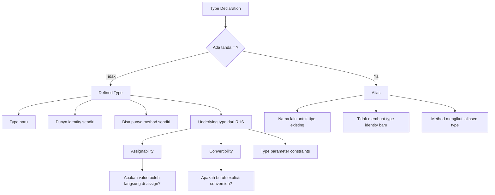
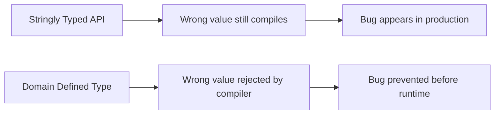
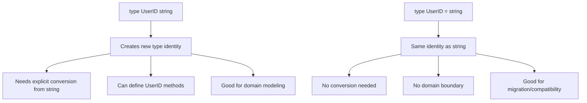
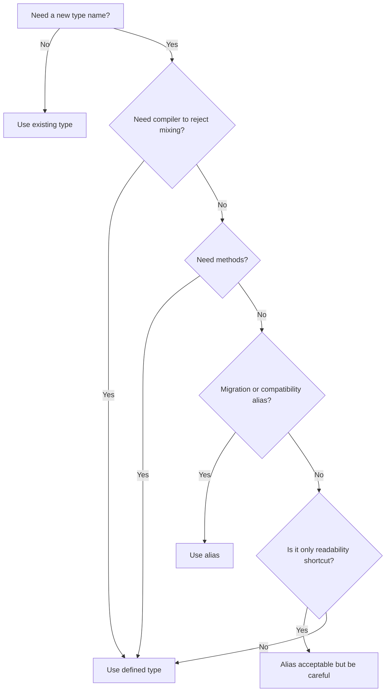
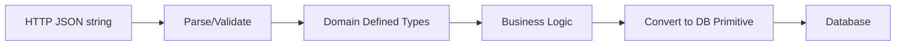
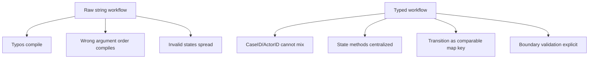

# learn-go-data-model-part-001.md
# Part 001 — Type System Core: Defined Type, Alias, Underlying Type, Assignability

> Seri: `learn-go-data-model`  
> Target pembaca: Java software engineer yang ingin memahami Go data model secara production-grade  
> Baseline: Go 1.26.x  
> Status seri: Part 001 dari 034 — **belum selesai**

---

## 0. Posisi Part Ini dalam Seri

Part 000 membangun peta besar: Go bukan sekadar bahasa dengan syntax sederhana, tetapi bahasa dengan model data yang sangat eksplisit: value, type identity, pointer, descriptor, interface, nil, zero value, allocation, ownership, dan API boundary.

Part 001 mulai masuk ke fondasi formal pertama: **type system core**.

Kita akan membahas:

1. Apa arti `type` di Go.
2. Perbedaan **defined type** dan **alias**.
3. Apa itu **underlying type**.
4. Apa itu **named type**.
5. Bagaimana aturan **assignability**.
6. Bagaimana aturan **convertibility**.
7. Bagaimana **untyped constant** memengaruhi compile-time behavior.
8. Bagaimana semua itu diterjemahkan menjadi design API production.

Part ini penting karena banyak bug Go di sistem besar bukan berasal dari goroutine, HTTP, atau database, tetapi dari model tipe yang terlalu longgar atau terlalu asal:

```go
func FindUser(id string) {}
func FindOrder(id string) {}
func Refund(amount int64) {}
func SetStatus(status string) {}
```

Secara syntax ini legal. Secara domain, ini rapuh.

Go memberi alat untuk membuat tipe domain yang lebih defensif:

```go
type UserID string
type OrderID string
type MoneyCents int64
type OrderStatus string
```

Tetapi alat ini hanya efektif jika kita paham perbedaan antara:

```go
type UserID string      // defined type: type baru
type RawJSON = []byte   // alias: nama lain untuk tipe yang sama
```

---

## 1. Mental Model Utama

Di Java, ketika kita membuat class:

```java
final class UserId {
    private final String value;
}
```

kita langsung mendapatkan:

- identitas tipe baru,
- kemungkinan encapsulation,
- method,
- object allocation,
- reference semantics,
- nullability,
- runtime class metadata.

Di Go, ketika kita menulis:

```go
type UserID string
```

kita mendapatkan **tipe baru** dengan underlying representation `string`, tetapi bukan wrapper object. Tidak otomatis heap allocation. Tidak otomatis reference identity. Tidak otomatis nullable.

Mental modelnya:

```text
Java class wrapper:
    UserId object
      └── field String value

Go defined type:
    UserID
      └── represented like string, but statically distinct from string
```

Artinya, Go memungkinkan domain typing yang murah secara runtime tetapi kuat secara compile-time.

---

## 2. Diagram Besar Type System Core



---

## 3. Terminologi Formal yang Harus Dikuasai

Kita pakai istilah berikut sepanjang seri.

| Istilah | Makna praktis |
|---|---|
| Type | Set nilai dan operasi yang valid atas nilai tersebut |
| Predeclared type | Tipe bawaan seperti `int`, `string`, `bool`, `byte`, `rune` |
| Defined type | Tipe baru yang dideklarasikan dengan `type T U` |
| Alias | Nama lain untuk tipe yang sama, dideklarasikan dengan `type A = T` |
| Named type | Tipe bernama: predeclared type, defined type, type parameter; alias bisa menunjuk named type |
| Underlying type | Representasi dasar yang menjadi basis assignability/conversion/constraint |
| Type identity | Apakah dua tipe dianggap tipe yang sama |
| Assignability | Apakah value bisa langsung di-assign tanpa conversion eksplisit |
| Convertibility | Apakah value bisa dikonversi eksplisit dengan `T(x)` |

---

## 4. Defined Type

### 4.1 Bentuk Dasar

```go
type UserID string
type Age int
type MoneyCents int64
type Tags []string
type Attributes map[string]string
```

Ini semua adalah **defined types**.

Defined type membuat tipe baru yang berbeda dari tipe sumbernya.

```go
type UserID string

var s string = "u-123"
var id UserID = s // compile error
```

Kenapa error? Karena `UserID` dan `string` adalah tipe berbeda, walaupun underlying type-nya sama-sama `string`.

Harus eksplisit:

```go
var id UserID = UserID(s)
```

### 4.2 Defined Type Bukan Wrapper Object

Ini poin sangat penting untuk Java engineer.

```go
type UserID string
```

Tidak sama dengan:

```java
final class UserID {
    private final String value;
}
```

Lebih dekat ke:

```text
new static type name over the same representation
```

`UserID` secara runtime membawa data string. Ia tidak otomatis menjadi struct wrapper.

### 4.3 Defined Type Bisa Punya Method

```go
type UserID string

func (id UserID) String() string {
    return string(id)
}

func (id UserID) IsZero() bool {
    return id == ""
}
```

Method ini hanya milik `UserID`, bukan milik `string`.

```go
var s string = "u-123"
// s.IsZero() // compile error

var id UserID = "u-123"
_ = id.IsZero()
```

### 4.4 Defined Type untuk Domain Boundary

Contoh buruk:

```go
func AssignCase(userID string, caseID string) error {
    // ...
    return nil
}
```

Pemanggilan berikut legal tetapi salah domain:

```go
AssignCase(caseID, userID)
```

Compiler tidak membantu karena keduanya `string`.

Lebih baik:

```go
type UserID string
type CaseID string

func AssignCase(userID UserID, caseID CaseID) error {
    return nil
}
```

Sekarang salah urutan akan ditolak:

```go
var userID UserID = "u-123"
var caseID CaseID = "c-999"

AssignCase(caseID, userID) // compile error
```

### 4.5 Defined Type sebagai Compile-Time Guardrail

Defined type mengubah bug runtime menjadi bug compile-time.



Dalam sistem regulasi, enforcement, payment, workflow, approval, audit, dan case management, ini sangat bernilai karena banyak field tampak sama secara teknis tetapi beda secara domain:

```go
type CaseID string
type InvestigationID string
type OfficerID string
type ApplicantID string
type AppealID string
type TaskID string
type WorkflowState string
type PermissionCode string
type RoleCode string
type AgencyCode string
```

Semua mungkin berbentuk string, tetapi tidak boleh dianggap interchangeable.

---

## 5. Alias

### 5.1 Bentuk Dasar

```go
type RawJSON = []byte
type UserName = string
type Handler = func(ctx context.Context) error
```

Tanda `=` berarti alias. Alias tidak membuat tipe baru. Ia hanya memberi nama lain.

```go
type UserName = string

var s string = "alice"
var name UserName = s // ok

var s2 string = name // ok
```

`UserName` adalah `string`.

### 5.2 Alias Tidak Memberi Domain Safety

```go
type UserID = string
type CaseID = string

func AssignCase(userID UserID, caseID CaseID) error {
    return nil
}
```

Ini terlihat lebih rapi, tetapi tidak memberi keamanan tipe.

```go
var userID UserID = "u-123"
var caseID CaseID = "c-999"

AssignCase(caseID, userID) // compile? yes, because both are string aliases
```

Untuk domain identifier, alias biasanya salah.

### 5.3 Kapan Alias Berguna?

Alias berguna ketika tujuan kita bukan membuat domain type baru, tetapi:

1. migrasi package,
2. menjaga compatibility,
3. memberi nama lokal untuk tipe panjang,
4. transitional refactoring,
5. re-export tipe dari package lain,
6. menyederhanakan generic constraint atau function signature internal.

Contoh migrasi package:

```go
// oldpkg
package oldpkg

type Client = newpkg.Client
```

Dengan ini, kode lama yang memakai `oldpkg.Client` tetap kompatibel dengan `newpkg.Client`.

### 5.4 Alias vs Defined Type: Diagram



---

## 6. Underlying Type

### 6.1 Definisi Praktis

Underlying type adalah tipe dasar yang menjadi fondasi representasi dan aturan konversi.

```go
type UserID string
```

Underlying type `UserID` adalah `string`.

```go
type CaseIDs []string
```

Underlying type `CaseIDs` adalah `[]string`.

```go
type Metadata map[string]string
```

Underlying type `Metadata` adalah `map[string]string`.

### 6.2 Underlying Type Tidak Sama dengan Type Identity

```go
type UserID string
type CaseID string
```

Keduanya punya underlying type `string`, tetapi identity berbeda.

```go
var u UserID = "u-1"
var c CaseID = "c-1"

u = c // compile error
u = UserID(c) // ok, explicit conversion
```

### 6.3 Underlying Type Chain

```go
type A string
type B A
type C B
```

Underlying type semuanya akhirnya `string`.

```text
C -> B -> A -> string
```

Tetapi `A`, `B`, dan `C` tetap type identity berbeda.

```go
var a A = "x"
var b B = "x"

// a = b // compile error
a = A(b) // ok
```

### 6.4 Kenapa Underlying Type Penting?

Underlying type memengaruhi:

- explicit conversion,
- generic constraints dengan `~T`,
- composite literal behavior,
- operasi yang tersedia,
- comparability,
- representasi runtime,
- API design.

Contoh generic constraint:

```go
type StringLike interface {
    ~string
}

func Normalize[T StringLike](v T) string {
    return strings.TrimSpace(string(v))
}
```

`~string` berarti menerima semua tipe yang underlying type-nya `string`, seperti:

```go
type UserID string
type Email string
type RoleCode string
```

Ini akan dibahas lebih dalam di part generics, tetapi fondasinya dimulai di sini.

---

## 7. Named Type

### 7.1 Apa Itu Named Type?

Secara praktis, named type adalah tipe yang punya nama. Contoh:

```go
int
string
bool
UserID
CaseID
MoneyCents
```

Predeclared types seperti `int`, `string`, `bool` juga named types.

Defined types yang kita buat juga named types.

```go
type UserID string
```

`UserID` adalah named type.

Type parameter juga termasuk named type dalam konteks generics.

### 7.2 Tipe Literal Bukan Named Type

```go
[]string
map[string]int
struct { Name string }
func(int) string
interface { Read([]byte) (int, error) }
```

Itu type literals, bukan named type.

Kita bisa memberi nama:

```go
type Names []string
type Scores map[string]int
type User struct { Name string }
type Transformer func(int) string
type Reader interface { Read([]byte) (int, error) }
```

### 7.3 Kenapa Named Type Penting?

Karena method hanya bisa didefinisikan pada tipe tertentu yang dideklarasikan di package kita.

```go
type Names []string

func (n Names) Contains(target string) bool {
    for _, v := range n {
        if v == target {
            return true
        }
    }
    return false
}
```

Tidak bisa menambahkan method langsung ke `[]string`.

```go
// invalid: cannot define method on non-local type or unnamed type
// func (s []string) Contains(target string) bool { ... }
```

---

## 8. Type Identity

### 8.1 Type Identity Bukan Sekadar Bentuk Sama

Dua tipe bisa punya struktur sama tetapi identity berbeda.

```go
type User struct {
    ID   string
    Name string
}

type Customer struct {
    ID   string
    Name string
}
```

`User` dan `Customer` punya underlying struct yang sama secara bentuk, tetapi keduanya defined type berbeda.

```go
var u User
var c Customer

// u = c // compile error
u = User(c) // possible if identical underlying struct tags and fields
```

### 8.2 Struct Tags Mempengaruhi Type Identity

```go
type A struct {
    ID string `json:"id"`
}

type B struct {
    ID string `db:"id"`
}
```

Field sama, tetapi tag berbeda. Dalam banyak konteks, struct tag menjadi bagian dari identitas tipe struktural untuk underlying type. Ini penting saat conversion antar struct.

### 8.3 Function Type Identity

```go
type Handler func(context.Context) error

type Job func(context.Context) error
```

`Handler` dan `Job` berbeda sebagai defined type, walau signature sama.

```go
var h Handler
var j Job

// h = j // compile error
h = Handler(j) // ok if underlying function type identical
```

### 8.4 Interface Type Identity

Interface literal yang method set-nya sama dapat dianggap equivalent secara struktural.

```go
type Reader interface {
    Read([]byte) (int, error)
}

type DataReader interface {
    Read([]byte) (int, error)
}
```

Tetapi sebagai named defined types, `Reader` dan `DataReader` tetap nama berbeda. Interface satisfaction di Go bersifat implicit dan structural, sehingga yang penting untuk implementasi adalah method set, bukan deklarasi `implements`.

---

## 9. Assignability

### 9.1 Definisi Praktis

Assignability menjawab pertanyaan:

> Bolehkah value `x` diberikan ke variable/parameter/field bertipe `T` tanpa explicit conversion?

Contoh:

```go
var s string = "abc"
var id UserID = s // not assignable
```

Harus:

```go
var id UserID = UserID(s)
```

### 9.2 Assignment Biasa

```go
var a int = 10
var b int = a // ok
```

Tipe sama, assignable.

### 9.3 Defined Type Tidak Otomatis Assignable ke Underlying Type

```go
type UserID string

var id UserID = "u-1"
var s string = id // compile error
```

Harus:

```go
var s string = string(id)
```

### 9.4 Untyped Constant Bisa Langsung Assigned Jika Representable

```go
type UserID string
type Age int8

var id UserID = "u-1" // ok, untyped string constant assignable
var age Age = 100     // ok, untyped integer constant representable by int8
```

Tetapi:

```go
var age Age = 1000 // compile error: overflows int8
```

Ini salah satu fitur Go yang sering membingungkan.

Kenapa ini boleh?

```go
type UserID string
var id UserID = "u-1"
```

Karena `"u-1"` adalah untyped string constant. Ia belum menjadi `string` variable.

Tetapi ini tidak boleh:

```go
var s string = "u-1"
var id UserID = s // compile error
```

Karena `s` sudah punya tipe konkret `string`.

### 9.5 Assignment ke Interface

```go
type Stringer interface {
    String() string
}

type UserID string

func (id UserID) String() string { return string(id) }

var id UserID = "u-1"
var s Stringer = id // ok
```

`UserID` assignable ke `Stringer` karena method set-nya memenuhi interface.

### 9.6 Nil Assignability

`nil` bisa diberikan ke tipe yang nil-able:

```go
var p *int = nil
var s []string = nil
var m map[string]int = nil
var ch chan int = nil
var fn func() = nil
var r io.Reader = nil
```

Tetapi tidak bisa ke tipe non-nil-able:

```go
// var i int = nil      // compile error
// var b bool = nil     // compile error
// var st struct{} = nil // compile error
```

Ini akan dibahas mendalam di part nil.

---

## 10. Convertibility

### 10.1 Definisi Praktis

Convertibility menjawab:

> Apakah value `x` bisa dikonversi eksplisit menjadi tipe `T` dengan `T(x)`?

Contoh:

```go
type UserID string

var s string = "u-1"
var id = UserID(s) // ok
```

### 10.2 Conversion Bukan Casting Java

Di Java, casting sering berarti runtime type check atau reference reinterpretation dalam hierarchy:

```java
Object x = "hello";
String s = (String) x;
```

Di Go, conversion biasanya compile-time operation antar tipe yang secara aturan bisa dikonversi.

```go
var i int = 10
var f float64 = float64(i)
```

Untuk interface dynamic type check, Go memakai **type assertion**, bukan conversion:

```go
var x any = "hello"
s, ok := x.(string)
```

### 10.3 Conversion antar Defined Type dengan Underlying Sama

```go
type UserID string
type CaseID string

var c CaseID = "c-1"
var u UserID = UserID(c) // technically allowed
```

Ini legal karena underlying type sama-sama `string`.

Tetapi secara domain mungkin salah.

Compiler hanya tahu struktur, bukan meaning. Domain meaning tetap tanggung jawab designer.

### 10.4 Conversion Bisa Mengubah Nilai

```go
var i int64 = 300
var b byte = byte(i)
fmt.Println(b) // 44, because 300 mod 256
```

Conversion numerik bisa truncate/wrap sesuai aturan bahasa. Jangan menganggap conversion selalu safe.

Production guideline:

```go
func ToByteChecked(v int64) (byte, error) {
    if v < 0 || v > math.MaxUint8 {
        return 0, fmt.Errorf("out of byte range: %d", v)
    }
    return byte(v), nil
}
```

### 10.5 Conversion Slice Element Type Tidak Otomatis

```go
type UserID string

var ss []string = []string{"u-1", "u-2"}
// var ids []UserID = []UserID(ss) // compile error
```

Walaupun `string` convertible ke `UserID`, `[]string` tidak otomatis convertible ke `[]UserID`.

Harus element-wise:

```go
func ToUserIDs(values []string) []UserID {
    ids := make([]UserID, len(values))
    for i, v := range values {
        ids[i] = UserID(v)
    }
    return ids
}
```

Kenapa? Karena slice punya backing array, aliasing, mutability, dan element type safety. Kalau conversion antar slice element type diizinkan sembarangan, type safety bisa bocor.

### 10.6 Conversion Map Value/Key Type Tidak Otomatis

```go
type UserID string

var m map[string]int
// var byUser map[UserID]int = map[UserID]int(m) // compile error
```

Harus copy:

```go
func ToUserIDMap(in map[string]int) map[UserID]int {
    out := make(map[UserID]int, len(in))
    for k, v := range in {
        out[UserID(k)] = v
    }
    return out
}
```

---

## 11. Untyped Constants

### 11.1 Konsep

Go punya konstanta yang belum punya tipe final sampai konteks memaksa tipe tertentu.

```go
const x = 10
```

`x` adalah untyped integer constant.

Ia bisa dipakai di banyak konteks:

```go
var a int = x
var b int8 = x
var c float64 = x
var d complex128 = x
```

Asal nilainya representable.

### 11.2 Untyped String Constant

```go
type UserID string

const raw = "u-1"
var id UserID = raw // ok
```

`raw` belum menjadi `string` konkret.

Tetapi:

```go
var rawString string = "u-1"
// var id UserID = rawString // error
```

### 11.3 Untyped Numeric Precision

Konstanta numerik Go punya precision tinggi di compile-time.

```go
const Big = 1 << 100
```

Ini valid sebagai constant, tetapi tidak bisa dimasukkan ke `int64`.

```go
// var x int64 = Big // compile error
```

Bisa dipakai jika konteks mendukung atau dikurangi:

```go
const Small = Big >> 90
var x int64 = Small
```

### 11.4 Typed Constant

```go
type Status string

const Pending Status = "PENDING"
```

`Pending` sekarang typed constant bertipe `Status`.

```go
var s Status = Pending // ok
var raw string = Pending // compile error, needs string(Pending)
```

Ini berguna untuk domain enum.

### 11.5 Untyped Constant sebagai Ergonomic Feature

```go
type TimeoutSeconds int

const DefaultTimeout TimeoutSeconds = 30

func WithTimeout(seconds TimeoutSeconds) {}

WithTimeout(5) // ok because 5 is untyped integer constant

x := 5
// WithTimeout(x) // compile error, x is int
```

Ini bagus karena literal tetap ergonomis, tetapi variable konkret harus eksplisit.

---

## 12. Type Declaration Patterns

### 12.1 Domain Identifier

```go
type UserID string

type CaseID string

type ApplicationID string
```

Tambahkan method minimal:

```go
func (id UserID) IsZero() bool {
    return id == ""
}

func (id UserID) String() string {
    return string(id)
}
```

Pertanyaan desain:

- Apakah empty string valid?
- Apakah format perlu divalidasi?
- Apakah ID boleh dibuat dari external input langsung?
- Apakah perlu constructor?

Contoh lebih defensif:

```go
type UserID string

func ParseUserID(s string) (UserID, error) {
    s = strings.TrimSpace(s)
    if s == "" {
        return "", errors.New("user id is empty")
    }
    if !strings.HasPrefix(s, "usr_") {
        return "", fmt.Errorf("invalid user id format: %q", s)
    }
    return UserID(s), nil
}
```

### 12.2 Domain Enum

```go
type CaseStatus string

const (
    CaseStatusDraft     CaseStatus = "DRAFT"
    CaseStatusSubmitted CaseStatus = "SUBMITTED"
    CaseStatusApproved  CaseStatus = "APPROVED"
    CaseStatusRejected  CaseStatus = "REJECTED"
)

func (s CaseStatus) IsValid() bool {
    switch s {
    case CaseStatusDraft,
        CaseStatusSubmitted,
        CaseStatusApproved,
        CaseStatusRejected:
        return true
    default:
        return false
    }
}
```

Kenapa bukan alias?

```go
type CaseStatus = string // too weak
```

Karena semua string akan dianggap `CaseStatus`.

### 12.3 Numeric Domain Type

```go
type MoneyCents int64

func NewMoneyCents(v int64) (MoneyCents, error) {
    if v < 0 {
        return 0, fmt.Errorf("money cannot be negative: %d", v)
    }
    return MoneyCents(v), nil
}
```

Jangan langsung memakai `int64` untuk semua angka domain.

```go
func Refund(amount int64) error
func AddScore(score int64) error
func SetTimeout(seconds int64) error
```

Lebih baik:

```go
type MoneyCents int64
type Score int64
type TimeoutSeconds int64
```

### 12.4 Collection Domain Type

```go
type UserIDs []UserID

func (ids UserIDs) Contains(target UserID) bool {
    for _, id := range ids {
        if id == target {
            return true
        }
    }
    return false
}
```

Perhatikan: `UserIDs` sebagai defined type atas slice tetap membawa slice descriptor behavior. Copy variable `UserIDs` tetap copy descriptor, bukan deep copy backing array.

```go
ids1 := UserIDs{"u-1", "u-2"}
ids2 := ids1
ids2[0] = "u-999"
fmt.Println(ids1[0]) // u-999
```

Defined type tidak mengubah semantics underlying slice.

### 12.5 Function Type

```go
type Authorizer func(ctx context.Context, actor UserID, action Action, resource ResourceID) (Decision, error)
```

Function type bisa diberi method:

```go
func (a Authorizer) Require(ctx context.Context, actor UserID, action Action, resource ResourceID) error {
    decision, err := a(ctx, actor, action, resource)
    if err != nil {
        return err
    }
    if !decision.Allowed {
        return ErrForbidden
    }
    return nil
}
```

Ini pattern Go yang sering elegan: function sebagai behavior, defined type sebagai semantic wrapper.

---

## 13. Design Decision: Defined Type atau Alias?

### 13.1 Rule of Thumb

Gunakan **defined type** ketika ingin:

- membuat domain boundary,
- mencegah pencampuran value,
- menambahkan method,
- menyatakan invariant,
- mengontrol conversion,
- membuat public API lebih eksplisit,
- membedakan konsep yang underlying-nya sama.

Gunakan **alias** ketika ingin:

- migrasi package,
- kompatibilitas source-level,
- re-export tipe,
- mengurangi verbosity tipe panjang,
- tidak ingin type boundary baru.

### 13.2 Matrix

| Situasi | Pilihan | Alasan |
|---|---:|---|
| `UserID` vs `OrderID` | Defined type | Harus tidak interchangeable |
| `MoneyCents` | Defined type | Butuh semantic dan validation |
| `CaseStatus` | Defined type | Enum domain |
| `RawJSON` internal helper | Bisa alias | Jika hanya nama semantik ringan |
| Migrasi `oldpkg.Client` ke `newpkg.Client` | Alias | Menjaga compatibility |
| `type Handler = http.Handler` | Alias | Re-export/compatibility |
| `type Headers map[string]string` dengan method helper | Defined type | Perlu method dan semantic |
| `type StringMap = map[string]string` | Alias | Hanya shortcut, tidak domain-safe |

### 13.3 Decision Tree



---

## 14. Java Comparison: Class, Record, Type Alias, Primitive Wrapper

### 14.1 Java Tidak Punya Type Alias Bawaan seperti Go

Java tidak punya syntax native seperti:

```java
using UserID = String; // not Java
```

Untuk membuat tipe domain, Java biasanya butuh wrapper class/record:

```java
public record UserId(String value) {
    public UserId {
        if (value == null || value.isBlank()) {
            throw new IllegalArgumentException("empty user id");
        }
    }
}
```

Ini kuat, tapi berarti object wrapper.

Go:

```go
type UserID string
```

Lebih murah, tapi invariant tidak otomatis. Constructor hanya convention.

### 14.2 Java Enum vs Go String Enum

Java:

```java
public enum CaseStatus {
    DRAFT, SUBMITTED, APPROVED, REJECTED
}
```

Go:

```go
type CaseStatus string

const (
    CaseStatusDraft     CaseStatus = "DRAFT"
    CaseStatusSubmitted CaseStatus = "SUBMITTED"
    CaseStatusApproved  CaseStatus = "APPROVED"
    CaseStatusRejected  CaseStatus = "REJECTED"
)
```

Go tidak punya closed enum set di type system. Compiler tidak melarang:

```go
var s CaseStatus = "SOMETHING_ELSE"
```

Karena untyped string constant representable sebagai `CaseStatus`.

Jadi validasi tetap perlu:

```go
func ParseCaseStatus(s string) (CaseStatus, error) {
    status := CaseStatus(s)
    if !status.IsValid() {
        return "", fmt.Errorf("invalid case status: %q", s)
    }
    return status, nil
}
```

### 14.3 Java Class Hierarchy vs Go Explicit Conversion

Java sering memakai inheritance atau interface hierarchy.

Go lebih sering memakai:

- defined type untuk domain distinction,
- interface untuk behavior,
- explicit conversion untuk boundary crossing,
- composition bukan inheritance.

---

## 15. Practical Boundary Design

### 15.1 External Input Boundary

Input dari HTTP, JSON, message queue, database, atau CLI biasanya masuk sebagai primitive:

```go
type CreateCaseRequest struct {
    ApplicantID string `json:"applicant_id"`
    Type        string `json:"type"`
}
```

Jangan langsung menyebarkan primitive ke domain layer.

```go
func Handle(req CreateCaseRequest) error {
    // bad: primitive leakage
    return service.CreateCase(req.ApplicantID, req.Type)
}
```

Lebih baik konversi di boundary:

```go
func Handle(req CreateCaseRequest) error {
    applicantID, err := ParseApplicantID(req.ApplicantID)
    if err != nil {
        return err
    }

    caseType, err := ParseCaseType(req.Type)
    if err != nil {
        return err
    }

    return service.CreateCase(applicantID, caseType)
}
```

### 15.2 Domain Layer Signature

```go
func (s *CaseService) CreateCase(applicantID ApplicantID, caseType CaseType) error {
    // domain-safe
    return nil
}
```

### 15.3 Persistence Boundary

Database driver mungkin butuh primitive:

```go
_, err := db.ExecContext(ctx,
    `insert into cases (applicant_id, type) values (?, ?)`,
    string(applicantID),
    string(caseType),
)
```

Jangan merasa conversion ini noise. Ini adalah boundary marker.



Konversi eksplisit membuat boundary terlihat.

---

## 16. Anti-Patterns

### 16.1 Alias untuk Domain ID

```go
type UserID = string
type CaseID = string
```

Masalah: tidak ada type safety.

Gunakan:

```go
type UserID string
type CaseID string
```

### 16.2 Primitive Obsession

```go
func Approve(caseID string, officerID string, reason string, priority int) error
```

Lebih baik:

```go
type CaseID string
type OfficerID string
type ApprovalReason string
type Priority int

func Approve(caseID CaseID, officerID OfficerID, reason ApprovalReason, priority Priority) error
```

### 16.3 Over-Typing Internal Temporary Values

Tidak semua string butuh defined type.

```go
func join(parts []string) string {
    type Separator string // unnecessary
    var sep Separator = ","
    return strings.Join(parts, string(sep))
}
```

Defined type berguna untuk boundary dan domain distinction, bukan untuk setiap local variable.

### 16.4 Conversion Spam karena Boundary Salah

Jika terlalu banyak:

```go
UserID(string(id))
string(UserID(x))
CaseID(string(y))
```

mungkin desain layer kacau. Tipe domain seharusnya masuk domain layer, primitive seharusnya tertahan di boundary.

### 16.5 Exposing Alias in Public API without Reason

```go
type Params = map[string]string
```

Jika diekspor, user menganggap `Params` punya semantic khusus, padahal hanya map biasa. Jika tidak ada alasan compatibility, lebih baik:

```go
type Params map[string]string
```

atau jangan expose nama baru.

---

## 17. Production Example: Case Management Data Model

### 17.1 Bad Version

```go
package caseapp

type Service struct{}

func (s *Service) Assign(caseID string, officerID string, assignedBy string) error {
    if caseID == "" || officerID == "" || assignedBy == "" {
        return errors.New("missing required fields")
    }
    return nil
}
```

Bug yang mungkin lolos:

```go
svc.Assign(officerID, caseID, assignedBy)
```

Semua `string`, compiler tidak tahu.

### 17.2 Better Version

```go
package caseapp

import (
    "errors"
    "fmt"
    "strings"
)

type CaseID string
type OfficerID string
type ActorID string

func ParseCaseID(s string) (CaseID, error) {
    s = strings.TrimSpace(s)
    if s == "" {
        return "", errors.New("case id is empty")
    }
    if !strings.HasPrefix(s, "case_") {
        return "", fmt.Errorf("invalid case id: %q", s)
    }
    return CaseID(s), nil
}

func ParseOfficerID(s string) (OfficerID, error) {
    s = strings.TrimSpace(s)
    if s == "" {
        return "", errors.New("officer id is empty")
    }
    if !strings.HasPrefix(s, "officer_") {
        return "", fmt.Errorf("invalid officer id: %q", s)
    }
    return OfficerID(s), nil
}

func ParseActorID(s string) (ActorID, error) {
    s = strings.TrimSpace(s)
    if s == "" {
        return "", errors.New("actor id is empty")
    }
    return ActorID(s), nil
}

type Service struct{}

func (s *Service) Assign(caseID CaseID, officerID OfficerID, assignedBy ActorID) error {
    return nil
}
```

Sekarang salah urutan ditangkap compiler:

```go
var caseID CaseID = "case_123"
var officerID OfficerID = "officer_456"
var actorID ActorID = "user_789"

svc := &Service{}

_ = svc.Assign(caseID, officerID, actorID) // ok
// _ = svc.Assign(officerID, caseID, actorID) // compile error
```

### 17.3 Boundary Handler

```go
type AssignRequest struct {
    CaseID    string `json:"case_id"`
    OfficerID string `json:"officer_id"`
}

func HandleAssign(req AssignRequest, actor string, svc *Service) error {
    caseID, err := ParseCaseID(req.CaseID)
    if err != nil {
        return err
    }

    officerID, err := ParseOfficerID(req.OfficerID)
    if err != nil {
        return err
    }

    actorID, err := ParseActorID(actor)
    if err != nil {
        return err
    }

    return svc.Assign(caseID, officerID, actorID)
}
```

Pattern:

```text
external primitive → parse/validate → domain type → service → primitive persistence
```

---

## 18. Production Example: Permission Code and Action

### 18.1 Weak Model

```go
func Can(actorID string, action string, resource string) bool
```

Bug:

```go
Can(resource, actorID, action)
```

### 18.2 Stronger Model

```go
type ActorID string
type Action string
type ResourceID string

type PermissionCode string

const (
    ActionRead   Action = "read"
    ActionCreate Action = "create"
    ActionUpdate Action = "update"
    ActionDelete Action = "delete"
)

func (a Action) IsValid() bool {
    switch a {
    case ActionRead, ActionCreate, ActionUpdate, ActionDelete:
        return true
    default:
        return false
    }
}

func Permission(action Action, resourceType string) PermissionCode {
    return PermissionCode(string(action) + ":" + resourceType)
}
```

### 18.3 What Compiler Guarantees and What It Does Not

Compiler guarantees:

- `ActorID` tidak tertukar dengan `ResourceID`.
- `Action` tidak tertukar dengan `PermissionCode` tanpa conversion.
- function signature lebih self-documenting.

Compiler does not guarantee:

- `Action("explode")` valid atau tidak.
- `ActorID("case_123")` benar secara domain.
- string format sesuai database.

Jadi type system mengurangi kelas bug, bukan menggantikan validation.

---

## 19. Cross-Package Design

### 19.1 Exported Defined Type

```go
package identity

type UserID string

func ParseUserID(s string) (UserID, error) { ... }
```

Package lain memakai:

```go
func LoadUser(id identity.UserID) (*User, error)
```

Ini membuat ownership domain jelas: `UserID` berasal dari package `identity`.

### 19.2 Unexported Defined Type

```go
package token

type rawToken string
```

Unexported type berguna untuk internal invariant.

```go
func parseRawToken(s string) (rawToken, error) { ... }
```

### 19.3 Avoid Circular Domain Dependency

Misal:

```go
package caseapp
import "app/identity"

type Case struct {
    Owner identity.UserID
}
```

Ini wajar jika `identity.UserID` memang shared kernel.

Tetapi hati-hati jika semua domain package saling import. Kadang perlu package kecil untuk shared primitive domain types:

```text
/internal/domain/id
    UserID
    CaseID
    OfficerID
```

Atau domain aggregate memiliki tipe masing-masing dan boundary melakukan mapping.

Decision tergantung arsitektur.

---

## 20. Type Declaration and Method Locality

Go hanya mengizinkan method didefinisikan pada type yang package-nya sama dengan method tersebut. Artinya, kita tidak bisa menambahkan method ke tipe dari package lain.

```go
// Cannot define method on time.Time in our package.
// func (t time.Time) IsBusinessDay() bool { ... } // invalid
```

Solusi:

### 20.1 Function Helper

```go
func IsBusinessDay(t time.Time) bool {
    weekday := t.Weekday()
    return weekday != time.Saturday && weekday != time.Sunday
}
```

### 20.2 Defined Type Wrapper

```go
type BusinessDate time.Time

func (d BusinessDate) IsBusinessDay() bool {
    t := time.Time(d)
    weekday := t.Weekday()
    return weekday != time.Saturday && weekday != time.Sunday
}
```

Tetapi wrapper butuh conversion dan method forwarding jika ingin behavior `time.Time` lengkap.

### 20.3 Struct Wrapper

```go
type BusinessDate struct {
    time.Time
}
```

Ini memberi embedding, tetapi mengubah shape data.

Pilih berdasarkan kebutuhan:

| Kebutuhan | Pilihan |
|---|---|
| Helper sederhana | function |
| Domain distinction murah | defined type |
| Perlu compose behavior dan field | struct wrapper |

---

## 21. Composite Literal and Defined Type

### 21.1 Defined Slice Type

```go
type UserIDs []UserID

ids := UserIDs{"u-1", "u-2"}
```

Literal element `"u-1"` adalah untyped string constant, jadi assignable ke `UserID`.

Jika dari variable:

```go
s := "u-1"
// ids := UserIDs{s} // error: string not assignable to UserID
ids := UserIDs{UserID(s)}
```

### 21.2 Defined Map Type

```go
type UserScores map[UserID]int

scores := UserScores{
    "u-1": 10,
    "u-2": 20,
}
```

Key literal bisa assignable ke `UserID` karena untyped string constant.

### 21.3 Defined Struct Type

```go
type User struct {
    ID   UserID
    Name string
}

u := User{
    ID:   "u-1",
    Name: "Alice",
}
```

`"u-1"` assignable ke `UserID` karena untyped string constant.

Tetapi:

```go
rawID := "u-1"

u := User{
    ID: rawID, // compile error
}
```

Harus:

```go
u := User{
    ID: UserID(rawID),
}
```

atau lebih baik parse:

```go
id, err := ParseUserID(rawID)
if err != nil { return err }

u := User{ID: id, Name: "Alice"}
```

---

## 22. Type Safety vs Ergonomics

Defined type menambah safety tetapi juga menambah explicit conversion.

### 22.1 Terlalu Lemah

```go
func Pay(userID string, orderID string, amount int64) error
```

Mudah dipanggil, rawan salah.

### 22.2 Terlalu Kuat tetapi Berisik

```go
type NonEmptyTrimmedLowercaseEmailAddressWithVerifiedMXRecord string
```

Nama dan boundary terlalu berat untuk value yang mungkin berubah state.

### 22.3 Seimbang

```go
type UserID string
type OrderID string
type MoneyCents int64

type Email string

func ParseEmail(s string) (Email, error) { ... }
```

Tipe cukup spesifik untuk mencegah bug besar, tetapi tidak membuat semua operasi kecil menjadi sulit.

### 22.4 Heuristic

Buat defined type jika:

- value melewati boundary antar layer,
- field sering tertukar dengan field lain,
- ada invariant domain,
- value muncul di public API,
- value dipakai sebagai key penting,
- kesalahan mixing akan mahal,
- value punya behavior/method sendiri,
- value perlu validasi parsing.

Jangan buat defined type jika:

- hanya local temporary,
- tidak ada domain distinction,
- tidak ada invariant,
- hanya membuat kode berisik,
- tipe tidak keluar dari fungsi kecil,
- conversion akan lebih banyak dari manfaat safety.

---

## 23. Public API Stability

### 23.1 Mengubah Alias ke Defined Type adalah Breaking Change

Awal:

```go
type UserID = string

func LoadUser(id UserID) {}
```

User bisa memanggil:

```go
var s string = "u-1"
LoadUser(s)
```

Jika kemudian diubah:

```go
type UserID string
```

Kode user rusak karena butuh explicit conversion.

Jadi, untuk public API, keputusan alias vs defined type harus hati-hati dari awal.

### 23.2 Mengubah Defined Type Underlying Type Juga Breaking

Awal:

```go
type UserID string
```

Kemudian:

```go
type UserID struct {
    value string
}
```

Ini perubahan besar:

- literal assignment berubah,
- conversion berubah,
- JSON behavior berubah,
- comparability mungkin berubah,
- database scanner mungkin berubah,
- method behavior berubah,
- memory layout berubah.

### 23.3 Exported Struct Field Type

```go
type User struct {
    ID string
}
```

Jika nanti diubah:

```go
type User struct {
    ID UserID
}
```

Ini bisa breaking untuk user package.

Karena itu, pada public package, domain type sebaiknya dipikirkan sejak awal.

---

## 24. Testing Type Semantics

### 24.1 Compile-Time Test via Intentional API

Tidak semua type-safety bisa diuji runtime. Banyak justru dijamin compiler.

Tetapi kita bisa menulis test untuk parser/validator.

```go
func TestParseUserID(t *testing.T) {
    tests := []struct {
        name    string
        input   string
        want    UserID
        wantErr bool
    }{
        {name: "valid", input: "usr_123", want: "usr_123"},
        {name: "empty", input: "", wantErr: true},
        {name: "wrong prefix", input: "case_123", wantErr: true},
    }

    for _, tt := range tests {
        t.Run(tt.name, func(t *testing.T) {
            got, err := ParseUserID(tt.input)
            if tt.wantErr {
                if err == nil {
                    t.Fatalf("expected error")
                }
                return
            }
            if err != nil {
                t.Fatalf("unexpected error: %v", err)
            }
            if got != tt.want {
                t.Fatalf("got %q want %q", got, tt.want)
            }
        })
    }
}
```

### 24.2 Interface Satisfaction Check

```go
var _ fmt.Stringer = UserID("")
```

Ini compile-time assertion bahwa `UserID` memenuhi `fmt.Stringer`.

### 24.3 API Misuse as Documentation

Kadang dokumentasi internal mencatat contoh yang sengaja tidak dikompilasi:

```go
// This must not compile:
// var u UserID = CaseID("case_123")
```

Untuk test otomatis compile-fail, biasanya butuh tooling terpisah atau contoh dokumentasi. Jangan memaksakan runtime test untuk hal yang tugasnya compiler.

---

## 25. Performance Implications

### 25.1 Defined Type Biasanya Zero-Cost

```go
type UserID string
```

Operasi conversion antara `string` dan `UserID` biasanya tidak membuat copy data string karena representation sama. Tetapi tetap jangan membuat klaim absolut untuk semua tipe dan semua konteks; compiler optimization, escape, interface boxing, dan inlining bisa memengaruhi hasil akhir.

Yang penting: defined type bukan wrapper heap object.

### 25.2 Struct Wrapper Bisa Berbeda

```go
type UserID struct {
    value string
}
```

Ini mengubah layout. Bisa tetap murah, tetapi berbeda dari `type UserID string`.

### 25.3 Interface Assignment Bisa Boxing

```go
type UserID string

func Log(v any) {}

var id UserID = "u-1"
Log(id)
```

Saat masuk ke `any`, value menjadi interface value. Ini bisa berdampak pada allocation tergantung konteks. Akan dibahas di part interface dan allocation.

### 25.4 Domain Type Jangan Dihapus Demi Micro-Optimization Tanpa Bukti

Jika defined type mencegah bug domain, jangan menghapusnya hanya karena “takut overhead”. Ukur dulu dengan benchmark dan profiling.

---

## 26. Deep Example: Strongly Typed Workflow State

### 26.1 Problem

Workflow engine sering punya state dan transition:

```go
func Transition(caseID string, from string, to string, actor string) error
```

Bug:

- `from` dan `to` tertukar,
- invalid state masuk,
- actor ID tertukar dengan case ID,
- string typo tidak tertangkap,
- transition matrix tidak terpusat.

### 26.2 Stronger Type Model

```go
type CaseID string
type ActorID string

type WorkflowState string

const (
    StateDraft      WorkflowState = "DRAFT"
    StateSubmitted  WorkflowState = "SUBMITTED"
    StateScreening  WorkflowState = "SCREENING"
    StateApproved   WorkflowState = "APPROVED"
    StateRejected   WorkflowState = "REJECTED"
    StateWithdrawn  WorkflowState = "WITHDRAWN"
)

func (s WorkflowState) IsTerminal() bool {
    switch s {
    case StateApproved, StateRejected, StateWithdrawn:
        return true
    default:
        return false
    }
}

func (s WorkflowState) IsValid() bool {
    switch s {
    case StateDraft,
        StateSubmitted,
        StateScreening,
        StateApproved,
        StateRejected,
        StateWithdrawn:
        return true
    default:
        return false
    }
}
```

### 26.3 Transition Type

```go
type Transition struct {
    From WorkflowState
    To   WorkflowState
}
```

### 26.4 Transition Rules

```go
var allowedTransitions = map[Transition]struct{}{
    {From: StateDraft, To: StateSubmitted}:       {},
    {From: StateSubmitted, To: StateScreening}:   {},
    {From: StateScreening, To: StateApproved}:    {},
    {From: StateScreening, To: StateRejected}:    {},
    {From: StateSubmitted, To: StateWithdrawn}:   {},
}

func CanTransition(from, to WorkflowState) bool {
    _, ok := allowedTransitions[Transition{From: from, To: to}]
    return ok
}
```

### 26.5 Service Boundary

```go
func TransitionCase(caseID CaseID, from WorkflowState, to WorkflowState, actor ActorID) error {
    if !from.IsValid() {
        return fmt.Errorf("invalid source state: %q", from)
    }
    if !to.IsValid() {
        return fmt.Errorf("invalid target state: %q", to)
    }
    if !CanTransition(from, to) {
        return fmt.Errorf("transition not allowed: %s -> %s", from, to)
    }
    return nil
}
```

### 26.6 What Improved?



---

## 27. Checklist: Type Design Review

Gunakan checklist ini saat review PR.

### 27.1 Domain Type

- Apakah field ini sekadar primitive, atau punya meaning domain?
- Apakah dua primitive dengan tipe sama bisa tertukar?
- Apakah ada invariant yang harus dijaga?
- Apakah value ini melewati boundary layer?
- Apakah value ini masuk public API?
- Apakah kesalahan value ini bisa menyebabkan incident?

Jika ya, pertimbangkan defined type.

### 27.2 Alias

- Apakah alias dipakai untuk migration/compatibility?
- Apakah alias membuat pembaca mengira ada domain safety padahal tidak?
- Apakah alias diekspor?
- Apakah alias akan sulit diubah menjadi defined type nanti?

Jika alias hanya untuk “biar kelihatan rapi”, hati-hati.

### 27.3 Conversion

- Apakah conversion terjadi di boundary yang tepat?
- Apakah conversion dari external input disertai validation?
- Apakah conversion numerik dicek overflow/range?
- Apakah terlalu banyak conversion menandakan layering salah?

### 27.4 Constants

- Apakah constant perlu typed?
- Apakah enum punya `IsValid` atau parser?
- Apakah untyped constant membuat API ergonomis tanpa melemahkan safety?

### 27.5 Public API

- Apakah keputusan defined type/alias sudah stabil?
- Apakah perubahan tipe nanti akan breaking?
- Apakah exported struct field terlalu primitive?
- Apakah package ownership type jelas?

---

## 28. Exercises

### Exercise 1 — Replace Primitive Obsession

Ubah signature berikut menjadi lebih type-safe:

```go
func SubmitAppeal(userID string, caseID string, reason string, priority int) error
```

Pertimbangkan:

- `UserID`
- `CaseID`
- `AppealReason`
- `Priority`
- validation boundary
- apakah `priority` sebaiknya enum/range type

### Exercise 2 — Alias or Defined Type?

Untuk masing-masing kasus, pilih alias atau defined type:

1. `CustomerID` yang underlying-nya string.
2. `OldClient` sebagai nama lama untuk `newpkg.Client`.
3. `RawMessage` untuk `json.RawMessage` re-export.
4. `PermissionCode` string.
5. `Headers` map yang butuh method `GetLower`.
6. `RequestID` untuk observability correlation.

Jelaskan alasan.

### Exercise 3 — Untyped Constant Behavior

Prediksi mana yang compile:

```go
type Age int8

const A = 10
const B = 200

var a Age = A
var b Age = B

x := 10
var c Age = x
```

Lalu jelaskan kenapa.

### Exercise 4 — Workflow State

Buat tipe:

```go
type WorkflowState string
```

Lalu desain:

- constants,
- `IsValid`,
- `IsTerminal`,
- `ParseWorkflowState`,
- transition matrix,
- service function yang menerima typed state.

### Exercise 5 — Public API Breaking Change

Bayangkan library v1 punya:

```go
type UserID = string
func LoadUser(id UserID) (*User, error)
```

Lalu v2 ingin:

```go
type UserID string
```

Analisis breaking change yang terjadi dan strategi migrasi.

---

## 29. Mini Lab

Buat module kecil:

```text
learn-go-data-model-lab/
  go.mod
  internal/domain/identity/user_id.go
  internal/domain/caseapp/case_id.go
  internal/domain/workflow/state.go
  internal/app/assign.go
```

### 29.1 `user_id.go`

```go
package identity

import (
    "errors"
    "strings"
)

type UserID string

func ParseUserID(s string) (UserID, error) {
    s = strings.TrimSpace(s)
    if s == "" {
        return "", errors.New("user id is empty")
    }
    return UserID(s), nil
}

func (id UserID) String() string {
    return string(id)
}

func (id UserID) IsZero() bool {
    return id == ""
}
```

### 29.2 `case_id.go`

```go
package caseapp

import (
    "errors"
    "strings"
)

type CaseID string

func ParseCaseID(s string) (CaseID, error) {
    s = strings.TrimSpace(s)
    if s == "" {
        return "", errors.New("case id is empty")
    }
    return CaseID(s), nil
}

func (id CaseID) String() string {
    return string(id)
}
```

### 29.3 `state.go`

```go
package workflow

import "fmt"

type State string

const (
    StateDraft     State = "DRAFT"
    StateSubmitted State = "SUBMITTED"
    StateApproved  State = "APPROVED"
    StateRejected  State = "REJECTED"
)

func (s State) IsValid() bool {
    switch s {
    case StateDraft, StateSubmitted, StateApproved, StateRejected:
        return true
    default:
        return false
    }
}

func ParseState(raw string) (State, error) {
    s := State(raw)
    if !s.IsValid() {
        return "", fmt.Errorf("invalid workflow state: %q", raw)
    }
    return s, nil
}
```

### 29.4 `assign.go`

```go
package app

import (
    "learn-go-data-model-lab/internal/domain/caseapp"
    "learn-go-data-model-lab/internal/domain/identity"
)

type AssignmentService struct{}

func (s *AssignmentService) Assign(caseID caseapp.CaseID, userID identity.UserID) error {
    return nil
}
```

Coba sengaja tukar argument:

```go
// svc.Assign(userID, caseID)
```

Pastikan compiler menolak.

---

## 30. Key Takeaways

1. `type T U` membuat **defined type** baru.
2. `type A = T` membuat **alias**, bukan tipe baru.
3. Defined type memberi type identity baru tanpa otomatis membuat wrapper object.
4. Underlying type menjelaskan representasi dasar dan aturan conversion.
5. Dua defined type dengan underlying sama tetap berbeda secara static type.
6. Untyped constant membuat literal tetap ergonomis untuk domain type.
7. Assignability adalah izin assignment tanpa conversion.
8. Convertibility adalah izin conversion eksplisit.
9. Alias berguna untuk migration/compatibility, bukan domain safety.
10. Domain type yang baik mengubah bug runtime menjadi compile-time failure.
11. Type system tidak menggantikan validation; ia mempersempit ruang bug.
12. Public API harus hati-hati: alias → defined type adalah breaking change.
13. Conversion eksplisit di boundary adalah fitur, bukan noise.
14. Terlalu banyak conversion bisa menjadi smell bahwa boundary/layering salah.
15. Untuk sistem besar, type design adalah bagian dari architecture, bukan detail syntax.

---

## 31. Referensi Resmi dan Bacaan Lanjutan

- Go Language Specification — Type declarations, type identity, assignability, constants: https://go.dev/ref/spec
- Go 1.26 Release Notes: https://go.dev/doc/go1.26
- Go Blog — What's in an Alias Name?: https://go.dev/blog/alias-names
- Go Blog — The Laws of Reflection: https://go.dev/blog/laws-of-reflection
- Effective Go: https://go.dev/doc/effective_go

---

## 32. Penutup Part 001

Part ini adalah fondasi formal pertama dari Go data model.

Jika diringkas dalam satu kalimat:

> Di Go, type declaration adalah alat arsitektural untuk mengontrol identitas, assignability, conversion, method ownership, dan domain boundary — bukan sekadar memberi nama baru pada bentuk data.

Part berikutnya:

```text
learn-go-data-model-part-002.md
Zero Value, Initialization, Valid State, dan Invariant Design
```

Status seri: **belum selesai**. Ini adalah **part 001 dari 034**.


<!-- NAVIGATION_FOOTER -->
<div class="page-nav">
<a href="./learn-go-data-model-part-000.md">⬅️ Part 000 — Orientation: Go Data Model untuk Java Engineer</a>
<a href="./index.md">📚 Kategori</a>
<a href="../../index.md">🏠 Home</a>
<a href="./learn-go-data-model-part-002.md">Part 002 — Zero Value, Initialization, Valid State, dan Invariant Design ➡️</a>
</div>
