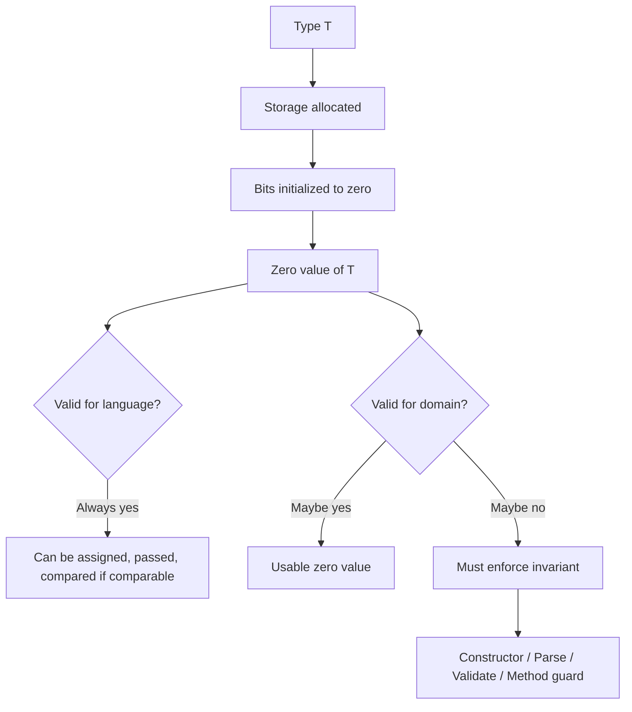
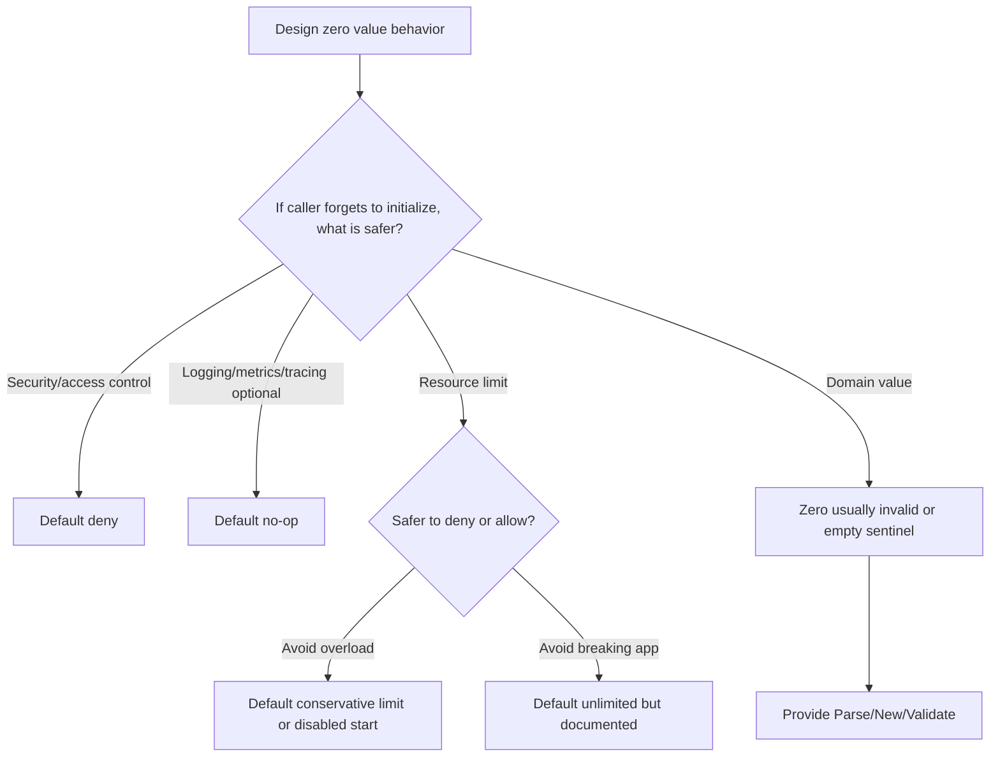
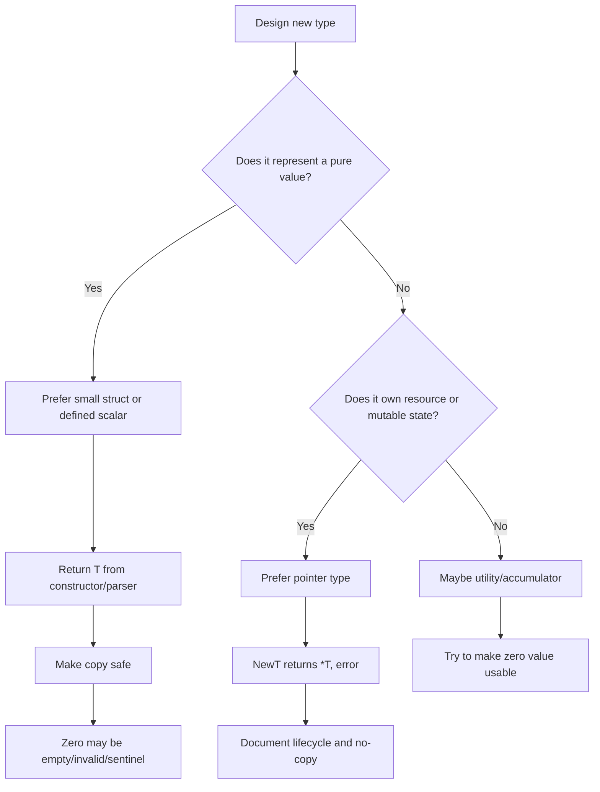

# learn-go-data-model-part-002.md

# Part 002 — Zero Value, Initialization, Valid State, dan Invariant Design

> Seri: `learn-go-data-model`  
> Target pembaca: Java software engineer yang ingin memahami Go pada level production/system design  
> Scope: Go 1.26.x  
> Status seri: Part 002 dari 034 — **belum selesai**

---

## 0. Posisi Part Ini Dalam Seri

Pada Part 001 kita membahas fondasi type system Go:

- defined type,
- alias,
- underlying type,
- assignability,
- convertibility,
- untyped constant,
- dan konsekuensi type design terhadap API contract.

Part 002 masuk ke fondasi desain yang sering terlihat sederhana tetapi sangat menentukan kualitas kode Go: **zero value**.

Di Java, object biasanya masuk ke dunia melalui constructor. Di Go, semua variable selalu punya nilai awal. Bahkan ketika tidak diberi initializer, ia tetap memiliki **zero value** sesuai tipenya. Ini bukan detail kecil. Ini membentuk:

- cara kita mendesain struct,
- cara kita membuat config,
- cara kita mendesain invariant,
- cara kita menghindari `nil` panic,
- cara kita membangun API yang aman,
- cara kita membuat type yang ergonomic,
- cara kita menghindari hidden invalid state,
- dan cara kita mengelola concurrency primitive seperti `sync.Mutex`.

Part ini bukan sekadar daftar `int = 0`, `string = ""`, `bool = false`. Fokusnya adalah **bagaimana zero value memengaruhi desain sistem**.

---

## 1. Sumber Resmi dan Baseline Faktual

Materi ini mengacu pada dokumentasi resmi Go:

1. Go Language Specification — menjelaskan bahwa ketika storage dialokasikan untuk variable tanpa explicit initialization, variable tersebut diberi zero value sesuai tipenya.  
   <https://go.dev/ref/spec>

2. Effective Go — menjelaskan idiom initialization, composite literal, `new`, dan pola zero value pada banyak tipe standar.  
   <https://go.dev/doc/effective_go>

3. Go 1.26 Release Notes — baseline versi seri ini. Go 1.26 tetap menjaga Go 1 compatibility promise.  
   <https://go.dev/doc/go1.26>

4. `sync` package documentation — contoh penting bahwa zero value `sync.Mutex` adalah unlocked mutex dan siap digunakan, dengan catatan tidak boleh dicopy setelah first use.  
   <https://pkg.go.dev/sync>

5. Go Memory Model — penting saat kita membahas zero-value synchronization primitive dan publikasi state antar goroutine.  
   <https://go.dev/ref/mem>

---

## 2. Core Mental Model

### 2.1 Java Constructor-Centric Model

Di Java, objek domain biasanya lahir melalui constructor:

```java
public final class UserId {
    private final String value;

    public UserId(String value) {
        if (value == null || value.isBlank()) {
            throw new IllegalArgumentException("invalid user id");
        }
        this.value = value;
    }
}
```

Mental model-nya:

```text
allocation -> constructor -> initialized object -> usable object
```

Kalau constructor tidak dipanggil, object normalnya tidak ada. Java memang punya default value untuk field, tetapi untuk object domain yang baik, constructor sering menjadi gerbang invariant.

### 2.2 Go Zero-Value-Centric Model

Di Go, variable bisa langsung ada tanpa constructor:

```go
type UserID string

var id UserID
fmt.Println(id) // ""
```

Mental model-nya:

```text
storage allocated -> bits zeroed -> typed zero value exists -> may or may not be semantically valid
```

Perhatikan perbedaan penting:

- Go selalu memberikan nilai awal.
- Nilai awal itu valid secara type system.
- Tetapi belum tentu valid secara domain.

Contoh:

```go
type Email string

var e Email // ""
```

Secara Go, `e` valid sebagai `Email`. Secara domain, email kosong mungkin invalid.

Inilah pusat desain part ini:

> Zero value selalu valid secara bahasa, tetapi tidak selalu valid secara domain.

---

## 3. Apa Itu Zero Value?

Ketika variable dideklarasikan tanpa initializer, Go memberi zero value berdasarkan type-nya.

Contoh:

```go
var i int
var f float64
var b bool
var s string
var p *int
var xs []int
var m map[string]int
var ch chan int
var fn func()
var a [3]int
var st struct{ Name string; Age int }
```

Nilainya:

```text
int                 -> 0
float64             -> 0
bool                -> false
string              -> ""
pointer             -> nil
slice               -> nil
map                 -> nil
channel             -> nil
function            -> nil
array               -> semua elemen zero value
struct              -> semua field zero value
interface           -> nil interface value
```

Dalam Go, initialization bukan privilege constructor. Initialization adalah konsekuensi dari allocation.

---

## 4. Diagram: Dari Type ke Zero Value ke Domain Validity



Go tidak otomatis tahu domain invariant. Kita yang harus mendesainnya.

---

## 5. Tiga Kategori Zero Value Dalam Production Design

Tidak semua type harus memperlakukan zero value dengan cara yang sama. Dalam production code, biasanya ada tiga kategori.

---

### 5.1 Category A — Zero Value Is Fully Usable

Tipe seperti ini aman langsung dipakai setelah deklarasi kosong.

Contoh dari standard library:

```go
var b bytes.Buffer
b.WriteString("hello")
fmt.Println(b.String())
```

`bytes.Buffer` didesain agar zero value siap digunakan.

Contoh lain:

```go
var mu sync.Mutex
mu.Lock()
mu.Unlock()
```

`sync.Mutex` zero value adalah unlocked mutex.

Karakteristik:

```text
- Tidak butuh constructor wajib
- Zero value memiliki semantic default yang masuk akal
- Method bisa dipanggil dengan aman
- Cocok untuk embedded field
- Cocok untuk struct internal yang sering dialokasikan sebagai value
```

Contoh custom type:

```go
type Counter struct {
    n int64
}

func (c *Counter) Inc() {
    c.n++
}

func (c Counter) Value() int64 {
    return c.n
}
```

`var c Counter` valid dan usable. `c.Value()` mengembalikan `0`, `c.Inc()` aman.

Desain seperti ini sangat idiomatik untuk tipe utility.

---

### 5.2 Category B — Zero Value Is Meaningful Sentinel

Tipe seperti ini punya zero value yang berarti, tetapi belum tentu “normal business value”.

Contoh:

```go
var t time.Time
fmt.Println(t.IsZero()) // true
```

Zero `time.Time` sering berarti “not set”. Itu usable, tetapi perlu interpretasi.

Contoh custom:

```go
type Deadline struct {
    at time.Time
}

func (d Deadline) IsSet() bool {
    return !d.at.IsZero()
}
```

Karakteristik:

```text
- Zero value bukan error
- Zero value berarti absent/default/unset
- API harus menjelaskan semantic-nya
- Consumer harus tahu apakah zero berarti valid value atau missing value
```

Risiko utama: sentinel disalahartikan sebagai data real.

Contoh buruk:

```go
type User struct {
    DeletedAt time.Time // zero means not deleted
}
```

Ini bisa valid. Tetapi jika data keluar ke JSON/database/API tanpa aturan jelas, zero time dapat bocor sebagai tanggal aneh atau value yang membingungkan.

Lebih eksplisit:

```go
type User struct {
    DeletedAt *time.Time // nil means not deleted
}
```

Tetapi pointer punya trade-off: allocation, nil handling, GC scanning, dan mutability risk.

Tidak ada satu jawaban absolut. Yang penting adalah contract.

---

### 5.3 Category C — Zero Value Is Invalid Domain State

Contoh:

```go
type Email string

var e Email // "" — invalid domain email
```

Atau:

```go
type Port int

var p Port // 0 — kadang invalid untuk app port, tapi valid untuk OS auto-bind
```

Atau:

```go
type Percentage int

var discount Percentage // 0 may be valid
var taxRate Percentage  // 0 may or may not be valid
```

Karakteristik:

```text
- Zero value valid secara bahasa
- Zero value invalid secara domain
- Harus ada constructor/parser/validator
- Jangan expose field mentah jika invariant penting
- Method harus defensif jika mungkin menerima zero value
```

Contoh desain:

```go
type Email struct {
    value string
}

func ParseEmail(s string) (Email, error) {
    if s == "" {
        return Email{}, ErrInvalidEmail
    }
    // simplified; real email validation requires more nuance
    if !strings.Contains(s, "@") {
        return Email{}, ErrInvalidEmail
    }
    return Email{value: s}, nil
}

func (e Email) String() string {
    return e.value
}

func (e Email) IsZero() bool {
    return e.value == ""
}
```

Di sini `Email{}` tetap bisa dibuat karena Go tidak punya private constructor seperti Java. Tetapi field `value` unexported, sehingga dari package lain invariant lebih terlindungi.

---

## 6. Zero Value Bukan “Default Constructor”

Java engineer sering mengira zero value mirip default constructor. Ini kurang tepat.

Java default constructor:

```java
class Config {
    int timeout;
}
```

Go zero value:

```go
type Config struct {
    Timeout time.Duration
}

var cfg Config
```

Perbedaannya:

| Aspek | Java default constructor | Go zero value |
|---|---:|---:|
| Dipanggil sebagai mekanisme runtime constructor | Ya | Tidak |
| Bisa menjalankan logic validasi | Ya | Tidak |
| Bisa menolak object invalid | Ya | Tidak |
| Berlaku untuk semua variable | Tidak persis | Ya |
| Field auto default | Ya | Ya |
| Menjadi idiom API utama | Kadang | Sangat sering |

Zero value adalah **state hasil zero-initialization**, bukan procedure.

Karena itu, kalau invariant butuh logic, harus diletakkan di:

```text
- constructor-like function: NewX(...)
- parser: ParseX(...)
- validator: Validate()
- method guard
- unexported fields
- package boundary
- runtime checks at boundary
```

---

## 7. Initialization Mechanisms di Go

Go memiliki beberapa cara membentuk value.

---

### 7.1 `var` Declaration

```go
var cfg Config
```

Menghasilkan zero value.

Cocok bila:

```text
- zero value usable
- akan diisi field-nya bertahap dalam scope kecil
- tipe standard library mendukung zero value
- temporary accumulator
```

Contoh:

```go
var b strings.Builder
for _, p := range parts {
    b.WriteString(p)
}
return b.String()
```

---

### 7.2 Short Variable Declaration

```go
cfg := Config{}
```

Ini juga menghasilkan zero value untuk struct tersebut.

```go
var cfg Config
cfg := Config{}
```

Secara semantic, keduanya menghasilkan value dengan field zero value. Perbedaan praktisnya pada style, scope, dan readability.

---

### 7.3 Composite Literal Dengan Field

```go
cfg := Config{
    Timeout: 5 * time.Second,
}
```

Field yang tidak disebut tetap zero value.

```go
type Config struct {
    Timeout time.Duration
    Retries int
    Debug   bool
}

cfg := Config{
    Timeout: 5 * time.Second,
}

// Retries = 0
// Debug = false
```

Ini sering berguna, tetapi juga sumber bug jika zero default tidak sengaja.

---

### 7.4 `new(T)`

```go
p := new(Config)
```

Menghasilkan `*Config` yang menunjuk ke zero value `Config`.

Secara konseptual:

```go
p := &Config{}
```

Untuk banyak kasus, `&Config{...}` lebih ekspresif karena field terlihat.

---

### 7.5 Constructor-Like Function

Go tidak punya constructor language-level. Idiomnya:

```go
func NewClient(cfg Config) (*Client, error) {
    cfg = cfg.withDefaults()
    if err := cfg.Validate(); err != nil {
        return nil, err
    }
    return &Client{cfg: cfg}, nil
}
```

Constructor-like function dibutuhkan ketika:

```text
- perlu validasi
- perlu default non-zero
- perlu resource allocation
- perlu dependency injection
- perlu normalization
- perlu mengunci invariant
```

---

## 8. Mermaid: Initialization Decision Flow

```mermaid
flowchart TD
    A[Need a value of T] --> B{Is zero value safe and meaningful?}
    B -->|Yes| C[Allow var T / T{}]
    C --> D[Document zero value behavior]
    B -->|No| E{Can invalid zero be tolerated internally?}
    E -->|Yes| F[Use unexported fields + Validate/IsZero]
    E -->|No| G[Provide NewT/ParseT and keep fields unexported]
    G --> H[Reject invalid input at boundary]
    F --> I[Guard methods that require valid state]
    H --> J[Return T, error or *T, error]
```

---

## 9. Valid State vs Initialized State

A value can be initialized but invalid.

```go
type Range struct {
    Min int
    Max int
}

var r Range // Min=0, Max=0
```

Is this valid?

Depends on the domain.

If range `[0,0]` is valid, zero value is usable.

If `Max` must be greater than `Min`, zero value is invalid.

```go
func (r Range) Validate() error {
    if r.Max <= r.Min {
        return fmt.Errorf("max must be greater than min")
    }
    return nil
}
```

Important distinction:

```text
initialized state = memory contains legal Go value
valid state       = value satisfies domain invariant
```

Go guarantees the first. You design the second.

---

## 10. Invariant Design

An invariant is a condition that must remain true for a value to be correct.

Examples:

```text
- Email must contain normalized valid address
- Money currency must be non-empty
- Amount must not overflow internal representation
- Range Min <= Max
- PageSize must be within allowed bounds
- Token expiry must be after issued-at
- State transition must be allowed
- ID must not be empty
```

In Java, invariant is often protected with private fields and constructor. In Go, package boundary matters more than class boundary.

---

## 11. Struct Field Export Controls Invariant Strength

### 11.1 Weak Invariant: Exported Fields

```go
type Email struct {
    Value string
}
```

Any package can do:

```go
e := Email{Value: "not-an-email"}
```

This is fine for DTOs, not fine for strong domain values.

---

### 11.2 Stronger Invariant: Unexported Field

```go
type Email struct {
    value string
}

func ParseEmail(s string) (Email, error) {
    if !isValidEmail(s) {
        return Email{}, ErrInvalidEmail
    }
    return Email{value: normalizeEmail(s)}, nil
}

func (e Email) String() string {
    return e.value
}
```

External packages cannot directly set `value`.

But they can still create zero value:

```go
var e Email
```

Therefore strong Go invariant design often needs both:

```text
- unexported fields
- constructor/parser
- zero-state handling
- method-level validation or documented precondition
```

---

## 12. Constructor Return Shape: `T` vs `*T`

When should constructor return value or pointer?

### 12.1 Return Value

```go
func ParseEmail(s string) (Email, error) {
    if !isValidEmail(s) {
        return Email{}, ErrInvalidEmail
    }
    return Email{value: s}, nil
}
```

Good when:

```text
- type is small
- immutable or value-like
- copying is cheap and safe
- nil is not needed
- zero value can represent invalid/empty fallback
```

Examples:

```text
Email, UserID, Money, Percentage, DateRange, Version
```

### 12.2 Return Pointer

```go
func NewClient(cfg Config) (*Client, error) {
    // validate, allocate resources
    return &Client{cfg: cfg}, nil
}
```

Good when:

```text
- type has identity/resource/lifecycle
- type has mutex/atomic state
- type is large or should not be copied
- methods mutate internal state
- nil is useful to express absence
```

Examples:

```text
Client, Server, Cache, Pool, Store, Repository, Worker
```

Rule of thumb:

```text
Domain value -> usually return T
Resource/service/stateful object -> usually return *T
```

---

## 13. Zero Value and Method Safety

A key design question:

> Can methods be called on the zero value?

Example safe:

```go
type Counter struct {
    n int64
}

func (c *Counter) Inc() { c.n++ }
func (c Counter) Value() int64 { return c.n }
```

Zero value works.

Example unsafe:

```go
type Client struct {
    baseURL string
    http    *http.Client
}

func (c *Client) Get(ctx context.Context, path string) error {
    req, err := http.NewRequestWithContext(ctx, http.MethodGet, c.baseURL+path, nil)
    if err != nil {
        return err
    }
    _, err = c.http.Do(req) // panic if c.http nil
    return err
}
```

`var c Client; c.Get(...)` may panic.

Better:

```go
func NewClient(baseURL string, httpClient *http.Client) (*Client, error) {
    if baseURL == "" {
        return nil, fmt.Errorf("baseURL is required")
    }
    if httpClient == nil {
        httpClient = http.DefaultClient
    }
    return &Client{baseURL: baseURL, http: httpClient}, nil
}
```

Optionally defensive method:

```go
func (c *Client) Get(ctx context.Context, path string) error {
    if c == nil {
        return fmt.Errorf("nil Client")
    }
    if c.baseURL == "" {
        return fmt.Errorf("uninitialized Client: baseURL is empty")
    }
    if c.http == nil {
        return fmt.Errorf("uninitialized Client: http client is nil")
    }
    // ...
    return nil
}
```

But excessive defensive checks can make code noisy. For internal types, documented preconditions may be enough. For public libraries, defensive errors are often better than panic.

---

## 14. Zero Value Usability Matrix

| Type category | Zero value | Usually usable? | Common contract |
|---|---:|---:|---|
| `int`, `bool`, `string` | `0`, `false`, `""` | Depends | Language valid, domain depends |
| `[]T` | `nil` | Often yes for read/append | Treat nil like empty unless JSON distinction matters |
| `map[K]V` | `nil` | Read yes, write no | Must initialize before write |
| `chan T` | `nil` | Dangerous | Blocks forever on send/receive; useful in select gating |
| `func` | `nil` | No | Must check before call |
| `*T` | `nil` | No unless method handles nil | Optional/reference/lifecycle |
| `struct` | all fields zero | Depends | Design-specific |
| `sync.Mutex` | unlocked | Yes | Must not copy after use |
| `bytes.Buffer` | empty buffer | Yes | Good zero-value design |
| `time.Time` | zero time | Sentinel | Check `IsZero()` |
| `interface` | nil interface | Depends | Beware typed nil |

---

## 15. `nil` Slice vs Empty Slice in Initialization

Slice zero value is `nil`.

```go
var xs []int
fmt.Println(xs == nil) // true
fmt.Println(len(xs))   // 0
```

But append works:

```go
xs = append(xs, 1, 2, 3)
```

Therefore nil slice is often perfectly usable.

### 15.1 Nil Slice as Empty Collection

Good for internal algorithms:

```go
func FilterEven(in []int) []int {
    var out []int
    for _, x := range in {
        if x%2 == 0 {
            out = append(out, x)
        }
    }
    return out
}
```

If no even number, returns nil slice. For many internal uses, that is fine.

### 15.2 Empty Slice for API Output

But JSON differs:

```go
var nilSlice []int = nil
emptySlice := []int{}
```

Common JSON behavior:

```json
null
[]
```

For public API, difference may matter.

If API contract says list must be array, return empty slice:

```go
func UsersResponse(users []User) UsersPayload {
    if users == nil {
        users = []User{}
    }
    return UsersPayload{Users: users}
}
```

Production rule:

```text
Internal algorithm: nil slice is usually fine.
External JSON/API: decide explicitly whether null or [] is allowed.
```

---

## 16. Nil Map: Readable but Not Writable

Map zero value is nil.

```go
var m map[string]int
fmt.Println(m["x"]) // 0
```

Lookup works. Write panics:

```go
m["x"] = 1 // panic: assignment to entry in nil map
```

Initialize with `make`:

```go
m := make(map[string]int)
m["x"] = 1
```

### 16.1 Map Field Initialization Trap

```go
type Counter struct {
    byName map[string]int
}

func (c *Counter) Inc(name string) {
    c.byName[name]++ // panic if byName nil
}
```

Make zero value usable:

```go
type Counter struct {
    byName map[string]int
}

func (c *Counter) Inc(name string) {
    if c.byName == nil {
        c.byName = make(map[string]int)
    }
    c.byName[name]++
}
```

Now:

```go
var c Counter
c.Inc("a")
```

works.

Trade-off:

```text
Pros: zero-value usable
Cons: method mutates lazy internal state; needs synchronization if concurrent
```

If concurrent, add mutex.

```go
type Counter struct {
    mu     sync.Mutex
    byName map[string]int
}

func (c *Counter) Inc(name string) {
    c.mu.Lock()
    defer c.mu.Unlock()

    if c.byName == nil {
        c.byName = make(map[string]int)
    }
    c.byName[name]++
}
```

Zero value remains usable because both `sync.Mutex` and nil map with lazy init can be handled.

---

## 17. Nil Channel: Useful but Dangerous

Channel zero value is nil.

Send or receive on nil channel blocks forever.

```go
var ch chan int
ch <- 1 // blocks forever
<-ch    // blocks forever
```

This is dangerous accidentally, but useful intentionally in `select`.

```go
var out chan<- int
if ready {
    out = realOut
}

select {
case out <- value:
    // only enabled if out != nil
case <-ctx.Done():
    return ctx.Err()
}
```

Nil channel can disable a select case.

Production rule:

```text
Nil channel should almost always be intentional and local.
If a struct stores a channel field, define whether nil means disabled, uninitialized, or bug.
```

Bad:

```go
type Worker struct {
    jobs chan Job
}

func (w *Worker) Submit(job Job) {
    w.jobs <- job // may block forever if jobs nil
}
```

Better:

```go
func NewWorker(buffer int) *Worker {
    return &Worker{jobs: make(chan Job, buffer)}
}
```

Or defensive:

```go
func (w *Worker) Submit(ctx context.Context, job Job) error {
    if w.jobs == nil {
        return fmt.Errorf("worker is not initialized")
    }
    select {
    case w.jobs <- job:
        return nil
    case <-ctx.Done():
        return ctx.Err()
    }
}
```

---

## 18. Nil Function: Optional Hook Pattern

Function zero value is nil.

```go
var fn func()
fn() // panic
```

Optional callback:

```go
type Server struct {
    OnError func(error)
}

func (s *Server) handle(err error) {
    if s.OnError != nil {
        s.OnError(err)
    }
}
```

For high-safety code, prefer no-op default if callback is hot path:

```go
func noopError(error) {}

type Server struct {
    onError func(error)
}

func NewServer(onError func(error)) *Server {
    if onError == nil {
        onError = noopError
    }
    return &Server{onError: onError}
}
```

Trade-off:

| Pattern | Pros | Cons |
|---|---|---|
| nil optional callback | explicit absence, no allocation | must check before call |
| no-op callback | call site simpler | hidden default, constructor needed |

---

## 19. Zero Value for Interface: Nil Interface vs Typed Nil

This will be covered deeply in Part 017 and Part 019, but part ini perlu memberi orientasi.

```go
var r io.Reader
fmt.Println(r == nil) // true
```

A nil interface has no dynamic type and no dynamic value.

But:

```go
var b *bytes.Buffer = nil
var r io.Reader = b
fmt.Println(r == nil) // false
```

The interface is not nil because it contains a dynamic type `*bytes.Buffer`, even though the dynamic value is nil.

This matters for constructors and zero state:

```go
func NewProcessor(r io.Reader) (*Processor, error) {
    if r == nil {
        return nil, fmt.Errorf("reader is required")
    }
    return &Processor{r: r}, nil
}
```

This check does not catch typed nil values assigned to an interface.

In public APIs, if typed nil matters, design carefully.

---

## 20. Zero Value and Copy Hazards

Some zero-value usable types become unsafe to copy after use.

Classic example:

```go
type SafeCounter struct {
    mu sync.Mutex
    n  int
}
```

This zero value is usable:

```go
var c SafeCounter
```

But copying after use is problematic:

```go
c1 := SafeCounter{}
c1.Inc()

c2 := c1 // copies mutex state too; bad after use
```

Standard library docs explicitly state that `sync.Mutex` must not be copied after first use.

### 20.1 Preventing Accidental Copy

Use pointer receivers:

```go
func (c *SafeCounter) Inc() {
    c.mu.Lock()
    defer c.mu.Unlock()
    c.n++
}
```

But pointer receiver does not prevent copying the value itself.

For public APIs, document:

```go
// SafeCounter is safe for concurrent use.
// A SafeCounter must not be copied after first use.
type SafeCounter struct {
    mu sync.Mutex
    n  int
}
```

Can also embed a no-copy sentinel for vet-like tooling patterns, but that is advanced and not a language guarantee.

---

## 21. Zero Value and Config Design

Config is one of the hardest places to design zero value.

Example:

```go
type ClientConfig struct {
    Timeout time.Duration
    Retries int
}
```

What does zero mean?

```go
ClientConfig{} // Timeout=0, Retries=0
```

Possible interpretations:

```text
Timeout=0 means no timeout
Timeout=0 means use default timeout
Timeout=0 means invalid
Retries=0 means no retry
Retries=0 means use default retry
Retries=0 means invalid
```

If not explicit, production behavior becomes fragile.

---

## 22. Config Default Strategies

### 22.1 Strategy A — Zero Means Default

```go
type ClientConfig struct {
    Timeout time.Duration
    Retries int
}

func (c ClientConfig) withDefaults() ClientConfig {
    if c.Timeout == 0 {
        c.Timeout = 5 * time.Second
    }
    if c.Retries == 0 {
        c.Retries = 3
    }
    return c
}
```

Problem: cannot express “zero retries” if zero means default.

### 22.2 Strategy B — Zero Means Disabled

```go
type ClientConfig struct {
    Timeout time.Duration // 0 means no timeout
    Retries int           // 0 means no retry
}
```

Problem: no way to distinguish absent vs explicit zero unless caller uses pointer/option.

### 22.3 Strategy C — Pointer Means Optional

```go
type ClientConfig struct {
    Timeout *time.Duration
    Retries *int
}
```

Now:

```text
nil -> use default
0   -> explicitly zero
```

But:

```text
- More nil handling
- More allocation or helper functions
- Less ergonomic
- More pointer fields for GC to scan
```

### 22.4 Strategy D — Explicit Option Type

```go
type OptionalDuration struct {
    set   bool
    value time.Duration
}

func SomeDuration(v time.Duration) OptionalDuration {
    return OptionalDuration{set: true, value: v}
}

func (o OptionalDuration) IsSet() bool { return o.set }
func (o OptionalDuration) Value() time.Duration { return o.value }
```

Useful when contract must be precise and pointer-heavy config is undesirable.

### 22.5 Strategy E — Functional Options

```go
type Client struct {
    timeout time.Duration
    retries int
}

type Option func(*Client)

func WithTimeout(d time.Duration) Option {
    return func(c *Client) { c.timeout = d }
}

func WithRetries(n int) Option {
    return func(c *Client) { c.retries = n }
}

func NewClient(opts ...Option) *Client {
    c := &Client{
        timeout: 5 * time.Second,
        retries: 3,
    }
    for _, opt := range opts {
        opt(c)
    }
    return c
}
```

Good for service/resource objects. Less ideal for pure data structs that must be serialized/deserialized.

---

## 23. Config Strategy Decision Table

| Requirement | Recommended strategy |
|---|---|
| Zero means natural default | Plain field with documented zero behavior |
| Need distinguish absent vs explicit zero | Pointer or optional wrapper |
| Public library with many optional settings | Functional options or config struct with defaults |
| Data loaded from JSON/YAML | Pointer fields or custom decode if absence matters |
| Hot-path small struct | Avoid pointer-heavy optional fields |
| Strong validation required | `Validate()` + constructor |
| Need stable external schema | Explicit fields; avoid clever option-only APIs |

---

## 24. Example: Production-Grade Config Design

Bad ambiguous config:

```go
type RetryConfig struct {
    MaxAttempts int
    Backoff     time.Duration
}
```

Better:

```go
type RetryConfig struct {
    MaxAttempts int           // 0 means no retry
    Backoff     time.Duration // 0 means no delay between attempts
}

func (c RetryConfig) Validate() error {
    if c.MaxAttempts < 0 {
        return fmt.Errorf("max attempts must be >= 0")
    }
    if c.Backoff < 0 {
        return fmt.Errorf("backoff must be >= 0")
    }
    if c.MaxAttempts > 0 && c.Backoff == 0 {
        // maybe valid, maybe not; domain decision
    }
    return nil
}
```

Alternative where zero means default:

```go
type RetryConfig struct {
    MaxAttempts int           // 0 means default
    Backoff     time.Duration // 0 means default
}

func (c RetryConfig) WithDefaults() RetryConfig {
    if c.MaxAttempts == 0 {
        c.MaxAttempts = 3
    }
    if c.Backoff == 0 {
        c.Backoff = 100 * time.Millisecond
    }
    return c
}

func (c RetryConfig) Validate() error {
    if c.MaxAttempts < 0 {
        return fmt.Errorf("max attempts must be >= 0")
    }
    if c.Backoff < 0 {
        return fmt.Errorf("backoff must be >= 0")
    }
    return nil
}
```

But this version cannot express “explicitly no retry” using `MaxAttempts: 0`.

If that distinction matters:

```go
type RetryConfig struct {
    MaxAttempts *int
    Backoff     *time.Duration
}
```

Or:

```go
type RetryPolicy struct {
    enabled     bool
    maxAttempts int
    backoff     time.Duration
}
```

and expose constructors:

```go
func NoRetry() RetryPolicy {
    return RetryPolicy{}
}

func Retry(maxAttempts int, backoff time.Duration) (RetryPolicy, error) {
    if maxAttempts <= 0 {
        return RetryPolicy{}, fmt.Errorf("maxAttempts must be > 0")
    }
    if backoff < 0 {
        return RetryPolicy{}, fmt.Errorf("backoff must be >= 0")
    }
    return RetryPolicy{enabled: true, maxAttempts: maxAttempts, backoff: backoff}, nil
}
```

This makes zero value mean `NoRetry`.

---

## 25. Designing Zero Value as Safe Default

The best Go types often make zero value useful.

Example: limiter-like type.

```go
type Limiter struct {
    max int
}

func (l Limiter) Allow(n int) bool {
    if l.max == 0 {
        return true // zero limiter means unlimited
    }
    return n <= l.max
}
```

This design is ergonomic:

```go
var l Limiter
l.Allow(1000000) // true
```

But must be documented:

```go
// Limiter limits a count. The zero value permits all counts.
type Limiter struct {
    max int
}
```

Alternative:

```go
// Zero means deny all.
```

Both can be valid. Pick based on failure mode.

### 25.1 Default Allow vs Default Deny

For security-sensitive domains, zero-as-allow may be dangerous.

```go
type PermissionSet struct {
    allowed map[Action]bool
}

func (p PermissionSet) Allows(a Action) bool {
    return p.allowed[a]
}
```

Here nil map returns false, so zero value denies all. That is safer for authorization.

Production rule:

```text
Choose zero value based on safest failure mode.
For security: default deny.
For optional instrumentation: default no-op.
For performance limiter: default unlimited may be acceptable if documented.
For retry: default no retry or default standard retry must be explicit.
```

---

## 26. Mermaid: Safe Default Selection



---

## 27. Lazy Initialization

Lazy initialization makes zero value usable by initializing internal state on first use.

Example:

```go
type Labels struct {
    values map[string]string
}

func (l *Labels) Set(k, v string) {
    if l.values == nil {
        l.values = make(map[string]string)
    }
    l.values[k] = v
}

func (l Labels) Get(k string) string {
    return l.values[k]
}
```

This is ergonomic:

```go
var l Labels
l.Set("env", "prod")
```

But thread-unsafe if used concurrently.

Concurrency-safe version:

```go
type Labels struct {
    mu     sync.RWMutex
    values map[string]string
}

func (l *Labels) Set(k, v string) {
    l.mu.Lock()
    defer l.mu.Unlock()

    if l.values == nil {
        l.values = make(map[string]string)
    }
    l.values[k] = v
}

func (l *Labels) Get(k string) string {
    l.mu.RLock()
    defer l.mu.RUnlock()

    return l.values[k]
}
```

Now zero value is usable and concurrent safe.

But the type must not be copied after first use because it contains mutex.

---

## 28. Lazy Initialization and Publication Risk

This is unsafe:

```go
type Registry struct {
    items map[string]Handler
}

func (r *Registry) Register(name string, h Handler) {
    if r.items == nil {
        r.items = make(map[string]Handler)
    }
    r.items[name] = h
}
```

If multiple goroutines call `Register` concurrently, map initialization and writes race.

Use mutex:

```go
type Registry struct {
    mu    sync.Mutex
    items map[string]Handler
}

func (r *Registry) Register(name string, h Handler) {
    r.mu.Lock()
    defer r.mu.Unlock()

    if r.items == nil {
        r.items = make(map[string]Handler)
    }
    r.items[name] = h
}
```

Zero value can be usable, but the moment state is shared, zero-value design must include synchronization design.

---

## 29. Invalid Zero Value: What Can and Cannot Be Prevented

In Go, you cannot fully prevent creation of zero value of an exported type.

Even with unexported field:

```go
type Token struct {
    value string
}
```

External package can still do:

```go
var t yourpkg.Token
```

or:

```go
t := yourpkg.Token{}
```

You cannot stop that. You can only:

```text
- make it harmless
- make it detectably invalid
- make methods return error on invalid state
- keep fields unexported
- document constructor requirement
- design API so invalid value cannot do dangerous work
```

---

## 30. Pattern: `IsZero()` Method

For domain values where zero is possible but semantically important:

```go
type UserID struct {
    value string
}

func ParseUserID(s string) (UserID, error) {
    if s == "" {
        return UserID{}, fmt.Errorf("empty user id")
    }
    return UserID{value: s}, nil
}

func (id UserID) IsZero() bool {
    return id.value == ""
}

func (id UserID) String() string {
    return id.value
}
```

Use cases:

```go
if id.IsZero() {
    return fmt.Errorf("user id is required")
}
```

Good for:

```text
- ID
- optional domain value
- time-like wrapper
- state machine marker
```

Caution:

`IsZero()` should not become an excuse to skip validation at boundary.

---

## 31. Pattern: `Validate()` Method

For compound structs:

```go
type CreateUserCommand struct {
    Email string
    Name  string
    Age   int
}

func (c CreateUserCommand) Validate() error {
    if c.Email == "" {
        return fmt.Errorf("email is required")
    }
    if c.Name == "" {
        return fmt.Errorf("name is required")
    }
    if c.Age < 0 {
        return fmt.Errorf("age must be >= 0")
    }
    return nil
}
```

Good for DTO/command/request objects.

But for domain value objects, prefer constructor/parser returning valid type.

```go
email, err := ParseEmail(input.Email)
```

instead of passing raw string everywhere.

---

## 32. Pattern: Unexported Concrete + Exported Constructor

When you want stronger control:

```go
type Client struct {
    baseURL string
    http    *http.Client
}

func NewClient(baseURL string, hc *http.Client) (*Client, error) {
    if baseURL == "" {
        return nil, fmt.Errorf("baseURL is required")
    }
    if hc == nil {
        hc = http.DefaultClient
    }
    return &Client{baseURL: baseURL, http: hc}, nil
}
```

This does not prevent `Client{}` if type is exported and fields are unexported but same package can create it. External packages can create `Client{}` only if type exported, even if fields unexported:

```go
var c yourpkg.Client
```

They cannot set fields but can get zero value.

If you want to prevent external direct concrete usage more strongly, expose interface and keep concrete unexported:

```go
type Store interface {
    Get(ctx context.Context, key string) ([]byte, error)
    Put(ctx context.Context, key string, value []byte) error
}

type store struct {
    db *sql.DB
}

func NewStore(db *sql.DB) (Store, error) {
    if db == nil {
        return nil, fmt.Errorf("db is required")
    }
    return &store{db: db}, nil
}
```

Trade-off:

```text
Pros: external caller cannot create zero store
Cons: returning interface has API/test/performance/design trade-offs
```

Do not return interface reflexively. Use this only when abstraction boundary is real.

---

## 33. Pattern: Panic vs Error on Invalid Initialization

Constructor-like functions can return error:

```go
func NewClient(cfg Config) (*Client, error) {
    if err := cfg.Validate(); err != nil {
        return nil, err
    }
    return &Client{cfg: cfg}, nil
}
```

Or panic:

```go
func MustParseEmail(s string) Email {
    e, err := ParseEmail(s)
    if err != nil {
        panic(err)
    }
    return e
}
```

Use panic only when invalid input indicates programmer error or package initialization constant problem.

Common pattern:

```go
var SystemUserID = MustParseUserID("system")
```

Do not use panic for normal runtime user input.

---

## 34. Zero Value and JSON/API Boundaries

Zero value can accidentally leak into API.

```go
type UserResponse struct {
    ID        string    `json:"id"`
    Name      string    `json:"name"`
    CreatedAt time.Time `json:"created_at"`
}
```

If `CreatedAt` is zero, external API may receive a meaningless timestamp.

Options:

### 34.1 Validate Before Response

```go
func NewUserResponse(u User) (UserResponse, error) {
    if u.ID == "" {
        return UserResponse{}, fmt.Errorf("missing id")
    }
    if u.CreatedAt.IsZero() {
        return UserResponse{}, fmt.Errorf("missing created_at")
    }
    return UserResponse{ID: u.ID, Name: u.Name, CreatedAt: u.CreatedAt}, nil
}
```

### 34.2 Pointer for Optional Field

```go
type UserResponse struct {
    DeletedAt *time.Time `json:"deleted_at,omitempty"`
}
```

### 34.3 Custom Marshal

Use custom marshal when zero has domain-specific encoding behavior.

Production rule:

```text
Never let zero value accidentally define external API semantics.
Make it intentional.
```

---

## 35. Zero Value and Database Boundaries

Database null and Go zero value are not the same.

```go
type UserRow struct {
    Name string
}
```

If DB column is nullable, scanning NULL into string is not equivalent to empty string unless intentionally mapped.

Use:

```go
sql.NullString
```

or pointer:

```go
*string
```

or custom domain nullable type.

Decision:

| DB meaning | Go representation |
|---|---|
| Required text | `string` with validation |
| Optional text | `sql.NullString` or `*string` |
| Required timestamp | `time.Time` with non-zero validation |
| Optional timestamp | `sql.NullTime` or `*time.Time` |
| Required number | numeric type with validation |
| Optional number | nullable wrapper or pointer |

This will be expanded in Part 027.

---

## 36. Zero Value and `omitempty`

This topic will be deeper in Part 026, but conceptually important now.

`omitempty` can drop meaningful zero values.

```go
type Payload struct {
    RetryCount int `json:"retry_count,omitempty"`
}
```

If `RetryCount` is `0`, field omitted.

But maybe `0` means explicitly no retry and should be sent.

Bad when absence and zero differ.

Better:

```go
type Payload struct {
    RetryCount *int `json:"retry_count,omitempty"`
}
```

Now:

```text
nil -> omitted
0   -> included as 0
```

But pointer trade-offs apply.

---

## 37. Zero Value and Domain State Machines

In regulatory/case management systems, zero value can become dangerous if it maps accidentally to a state.

Bad:

```go
type CaseStatus int

const (
    CaseStatusDraft CaseStatus = iota
    CaseStatusSubmitted
    CaseStatusUnderReview
    CaseStatusClosed
)
```

Zero value is `CaseStatusDraft`.

Is that safe?

Maybe. But if missing data defaults to Draft, a corrupted/uninitialized object can look like a real Draft.

Alternative:

```go
type CaseStatus int

const (
    CaseStatusUnknown CaseStatus = iota
    CaseStatusDraft
    CaseStatusSubmitted
    CaseStatusUnderReview
    CaseStatusClosed
)
```

Now zero is Unknown.

This may be safer if unknown should not be processed.

Validation:

```go
func (s CaseStatus) Valid() bool {
    switch s {
    case CaseStatusDraft, CaseStatusSubmitted, CaseStatusUnderReview, CaseStatusClosed:
        return true
    default:
        return false
    }
}
```

Production rule:

```text
For state machine enums, consider reserving zero for Unknown/Invalid unless default state is truly safe.
```

---

## 38. Zero Value and Authorization

For security model:

```go
type PermissionSet struct {
    allowed map[string]struct{}
}

func (p PermissionSet) Allows(permission string) bool {
    _, ok := p.allowed[permission]
    return ok
}
```

If `allowed` is nil, lookup returns false. Zero value denies all.

This is good.

Bad security design:

```go
type PermissionSet struct {
    denied map[string]struct{}
}

func (p PermissionSet) Allows(permission string) bool {
    _, denied := p.denied[permission]
    return !denied
}
```

Nil map means no denied permissions, so zero value allows all.

This may be catastrophic if an uninitialized permission set reaches decision point.

Security-oriented rule:

```text
For authorization data, zero value should usually be fail-closed, not fail-open.
```

---

## 39. Zero Value and Observability

For logging/metrics/tracing, zero value can often be no-op.

```go
type Logger interface {
    Info(msg string, attrs ...any)
    Error(msg string, attrs ...any)
}
```

Instead of nil logger checks everywhere, use no-op logger:

```go
type NopLogger struct{}

func (NopLogger) Info(string, ...any)  {}
func (NopLogger) Error(string, ...any) {}
```

Config:

```go
type Service struct {
    logger Logger
}

func NewService(logger Logger) *Service {
    if logger == nil {
        logger = NopLogger{}
    }
    return &Service{logger: logger}
}
```

Alternative zero-value service design:

```go
type Service struct {
    logger Logger
}

func (s Service) loggerOrDefault() Logger {
    if s.logger == nil {
        return NopLogger{}
    }
    return s.logger
}
```

Trade-off:

```text
No-op default prevents nil panic.
But in some systems, missing logger should be visible during setup.
```

---

## 40. Zero Value and Resource Lifecycle

Some types should not be zero-value usable because they represent resources.

Examples:

```text
- DB connection pool
- HTTP client wrapper with base URL
- Kafka producer
- file writer
- external API client
- background worker
- scheduler
```

For resource types, zero value often lacks dependencies.

Design:

```go
type Producer struct {
    conn *Connection
    topic string
}

func NewProducer(conn *Connection, topic string) (*Producer, error) {
    if conn == nil {
        return nil, fmt.Errorf("connection is required")
    }
    if topic == "" {
        return nil, fmt.Errorf("topic is required")
    }
    return &Producer{conn: conn, topic: topic}, nil
}
```

Method guard:

```go
func (p *Producer) Send(ctx context.Context, msg Message) error {
    if p == nil || p.conn == nil || p.topic == "" {
        return fmt.Errorf("producer is not initialized")
    }
    return p.conn.Send(ctx, p.topic, msg)
}
```

Whether to guard every method depends on public API exposure and failure impact.

---

## 41. Zero Value and Value Object Design

Value object example:

```go
type Money struct {
    amountMinor int64
    currency    string
}
```

Zero value:

```go
Money{} // amountMinor=0, currency=""
```

Is it valid?

Probably not, because currency missing.

Option A: zero invalid.

```go
func NewMoney(amountMinor int64, currency string) (Money, error) {
    if currency == "" {
        return Money{}, fmt.Errorf("currency is required")
    }
    return Money{amountMinor: amountMinor, currency: currency}, nil
}

func (m Money) Validate() error {
    if m.currency == "" {
        return fmt.Errorf("currency is required")
    }
    return nil
}
```

Option B: default currency.

```go
type Money struct {
    amountMinor int64
    currency    string // empty means IDR
}

func (m Money) Currency() string {
    if m.currency == "" {
        return "IDR"
    }
    return m.currency
}
```

This is usually dangerous in multi-currency systems because missing currency silently becomes IDR.

Production rule:

```text
For financial values, avoid implicit default currency unless domain is truly single-currency and boundary validates it.
```

---

## 42. Zero Value and ID Types

Simple ID type:

```go
type UserID string
```

Zero value is `""`.

If empty ID is invalid, use parser:

```go
func ParseUserID(s string) (UserID, error) {
    if s == "" {
        return "", fmt.Errorf("empty user id")
    }
    return UserID(s), nil
}
```

But because underlying type is string, package users can still write:

```go
var id UserID
id = ""
```

If stronger invariant needed:

```go
type UserID struct {
    value string
}

func ParseUserID(s string) (UserID, error) {
    if s == "" {
        return UserID{}, fmt.Errorf("empty user id")
    }
    return UserID{value: s}, nil
}

func (id UserID) String() string { return id.value }
func (id UserID) IsZero() bool   { return id.value == "" }
```

Trade-off:

| Representation | Pros | Cons |
|---|---|---|
| `type UserID string` | simple, comparable, easy JSON | weak invariant |
| `struct{ value string }` | stronger invariant, methods | custom JSON/DB likely needed |
| `[16]byte` UUID-style | compact, comparable | parsing/formatting required |

---

## 43. Zero Value and Embedded Types

Embedding zero-value usable types is powerful.

```go
type Cache struct {
    mu sync.RWMutex
    m  map[string]string
}
```

Because `sync.RWMutex` zero value is usable, `Cache{}` can be usable if methods handle nil map.

```go
func (c *Cache) Get(k string) (string, bool) {
    c.mu.RLock()
    defer c.mu.RUnlock()
    v, ok := c.m[k]
    return v, ok
}

func (c *Cache) Set(k, v string) {
    c.mu.Lock()
    defer c.mu.Unlock()
    if c.m == nil {
        c.m = make(map[string]string)
    }
    c.m[k] = v
}
```

This gives excellent ergonomics:

```go
var c Cache
c.Set("a", "b")
```

But document non-copy:

```go
// Cache is safe for concurrent use. A Cache must not be copied after first use.
```

---

## 44. Zero Value and Object Identity

Java developers often think object identity is default. In Go, many values are copied freely.

```go
type Config struct {
    Timeout time.Duration
}

func Use(cfg Config) { ... }
```

Copying config is normal.

But for types with identity:

```go
type Session struct {
    id string
    mu sync.Mutex
    state map[string]any
}
```

Copying is harmful.

Zero value design must decide:

```text
Is this a value or an object with identity/lifecycle?
```

If value:

```text
- make zero useful or detectably empty
- use value receiver where appropriate
- allow copying
```

If identity/lifecycle:

```text
- use constructor
- use pointer receiver
- document no-copy
- avoid exposing struct fields
```

---

## 45. Mermaid: Value Type vs Resource Type



---

## 46. Zero Value and Public API Compatibility

Once you publish a type, changing zero value semantics can break users.

Example v1:

```go
// Timeout 0 means no timeout.
type Config struct {
    Timeout time.Duration
}
```

Later v2 desire:

```go
// Timeout 0 means default timeout.
```

This is a breaking semantic change. Existing users relying on no-timeout behavior may get timeout unexpectedly.

Production rule:

```text
Document zero value semantics at the moment a public type is introduced.
Treat zero behavior as API contract.
```

Good doc:

```go
// Config controls the client.
// The zero value is valid and uses no timeout and no retries.
type Config struct {
    Timeout time.Duration
    Retries int
}
```

Or:

```go
// Config controls the client.
// A zero Config is valid and uses package defaults.
type Config struct {
    Timeout time.Duration
    Retries int
}
```

Ambiguous doc is technical debt.

---

## 47. Anti-Patterns

### 47.1 Constructor Exists but Type Still Allows Dangerous Zero

```go
type Client struct {
    http *http.Client
}

func NewClient() *Client {
    return &Client{http: http.DefaultClient}
}

func (c *Client) Do(req *http.Request) (*http.Response, error) {
    return c.http.Do(req)
}
```

`var c Client; c.Do(req)` panics.

Fix options:

```text
- guard method
- make zero value usable by defaulting internally
- document constructor requirement
- expose unexported concrete behind interface if necessary
```

### 47.2 Zero Means Too Many Things

```go
type Config struct {
    Timeout time.Duration
}
```

Zero cannot simultaneously mean:

```text
- default timeout
- no timeout
- not configured
- invalid
```

Pick one.

### 47.3 Exported Fields Destroy Invariant

```go
type Percentage struct {
    Value int
}
```

Anyone can create `Percentage{Value: 10000}`.

Better:

```go
type Percentage struct {
    value int
}
```

with constructor/validator.

### 47.4 Nil Map Write Panic Hidden in Method

```go
func (r *Registry) Add(k string, v Handler) {
    r.handlers[k] = v
}
```

Fix lazy init or constructor.

### 47.5 Security Fail-Open Zero Value

```go
func (p Policy) Allow(action string) bool {
    return !p.denied[action]
}
```

Zero policy allows everything. Usually bad.

### 47.6 Copyable Type With Mutex

```go
type Cache struct {
    sync.Mutex
    data map[string]string
}
```

If copied after use, broken synchronization semantics.

Document no-copy and avoid value-passing APIs.

---

## 48. Production Design Checklist

For every new type, ask:

```text
1. What is its zero value?
2. Is the zero value valid for the language? Always yes.
3. Is the zero value valid for the domain?
4. Is the zero value safe to use?
5. If caller forgets initialization, should behavior fail-open, fail-closed, no-op, or error?
6. Should fields be exported?
7. Is a constructor/parser needed?
8. Should constructor return T or *T?
9. Can this type be copied safely?
10. Does it contain mutex, map, slice, pointer, file, network connection, or resource handle?
11. Does nil have special meaning?
12. Does JSON/database encoding distinguish zero from absent?
13. Is zero value behavior documented?
14. Are methods safe on zero value or do they return clear errors?
15. Does zero value create security, compliance, or financial risk?
```

---

## 49. Mini Lab 1 — Design a Zero-Value-Usable Counter

Goal:

```text
Design a counter whose zero value is usable and safe for concurrent use.
```

Implementation:

```go
package counter

import "sync"

// Counter is safe for concurrent use.
// The zero value is ready to use.
// A Counter must not be copied after first use.
type Counter struct {
    mu sync.Mutex
    n  int64
}

func (c *Counter) Inc() {
    c.mu.Lock()
    defer c.mu.Unlock()
    c.n++
}

func (c *Counter) Add(delta int64) {
    c.mu.Lock()
    defer c.mu.Unlock()
    c.n += delta
}

func (c *Counter) Value() int64 {
    c.mu.Lock()
    defer c.mu.Unlock()
    return c.n
}
```

Usage:

```go
var c counter.Counter
c.Inc()
fmt.Println(c.Value())
```

Review:

```text
- zero value works
- no constructor required
- contains mutex, so must not be copied after use
- pointer receivers communicate mutation
```

---

## 50. Mini Lab 2 — Design a Domain ID With Invalid Zero

Goal:

```text
Design UserID where empty value is invalid but zero state is detectable.
```

Implementation:

```go
package identity

import (
    "encoding/json"
    "fmt"
)

type UserID struct {
    value string
}

func ParseUserID(s string) (UserID, error) {
    if s == "" {
        return UserID{}, fmt.Errorf("user id is empty")
    }
    return UserID{value: s}, nil
}

func MustParseUserID(s string) UserID {
    id, err := ParseUserID(s)
    if err != nil {
        panic(err)
    }
    return id
}

func (id UserID) IsZero() bool {
    return id.value == ""
}

func (id UserID) String() string {
    return id.value
}

func (id UserID) MarshalJSON() ([]byte, error) {
    if id.IsZero() {
        return nil, fmt.Errorf("cannot marshal zero UserID")
    }
    return json.Marshal(id.value)
}

func (id *UserID) UnmarshalJSON(data []byte) error {
    var s string
    if err := json.Unmarshal(data, &s); err != nil {
        return err
    }
    parsed, err := ParseUserID(s)
    if err != nil {
        return err
    }
    *id = parsed
    return nil
}
```

Discussion:

```text
- External package cannot set value directly.
- External package can still create UserID{}.
- MarshalJSON prevents accidental leak of invalid ID.
- UnmarshalJSON enforces invariant at boundary.
```

---

## 51. Mini Lab 3 — Config With Explicit Zero Semantics

Goal:

```text
Design retry config where zero means no retry, not default.
```

Implementation:

```go
package retry

import (
    "fmt"
    "time"
)

type Config struct {
    MaxAttempts int           // 0 means no retry
    Backoff     time.Duration // 0 means no delay
}

func (c Config) Validate() error {
    if c.MaxAttempts < 0 {
        return fmt.Errorf("max attempts must be >= 0")
    }
    if c.Backoff < 0 {
        return fmt.Errorf("backoff must be >= 0")
    }
    if c.MaxAttempts == 0 && c.Backoff > 0 {
        return fmt.Errorf("backoff has no effect when retry is disabled")
    }
    return nil
}

func (c Config) Enabled() bool {
    return c.MaxAttempts > 0
}
```

Usage:

```go
cfg := retry.Config{}
fmt.Println(cfg.Enabled()) // false
```

Review:

```text
- zero value is valid
- zero means no retry
- absence and explicit zero are same
- if caller needs default retry, use separate constructor
```

Alternative default constructor:

```go
func DefaultConfig() Config {
    return Config{
        MaxAttempts: 3,
        Backoff:     100 * time.Millisecond,
    }
}
```

---

## 52. Mini Lab 4 — Authorization Fail-Closed Zero Value

Goal:

```text
Design permission set where zero value denies everything.
```

Implementation:

```go
package authz

type Permission string

type PermissionSet struct {
    allowed map[Permission]struct{}
}

func (p PermissionSet) Allows(permission Permission) bool {
    _, ok := p.allowed[permission]
    return ok
}

func NewPermissionSet(perms ...Permission) PermissionSet {
    allowed := make(map[Permission]struct{}, len(perms))
    for _, p := range perms {
        allowed[p] = struct{}{}
    }
    return PermissionSet{allowed: allowed}
}
```

Usage:

```go
var p PermissionSet
fmt.Println(p.Allows("case.approve")) // false
```

Review:

```text
- zero value denies all
- nil map lookup is safe
- security failure mode is conservative
```

---

## 53. Common Review Comments You Should Learn to Make

When reviewing Go PRs, these comments are common and valuable:

```text
- What does the zero value of this type mean?
- Is this struct safe to use as T{}?
- If constructor is required, can callers still accidentally use zero value?
- Should this method return error instead of panic on uninitialized receiver?
- Does zero mean default, disabled, absent, or invalid?
- This config cannot distinguish absent from explicit zero.
- This nil map will panic on write.
- This nil channel can block forever.
- This exported field allows invalid domain state.
- This enum uses zero as a real state; is that intentional?
- For authz, should zero value deny all instead of allow all?
- This type contains sync.Mutex; avoid copying after first use.
- Please document zero value behavior in the type comment.
```

---

## 54. Deep Comparison: Java vs Go Initialization

| Concern | Java | Go |
|---|---|---|
| Object creation | `new` + constructor | value declaration, composite literal, `new`, factory |
| Constructor enforcement | strong | convention/package-boundary-based |
| Field default | yes | yes |
| Uninitialized local variable | compile error for use | Go variable declaration initializes |
| Null default for references | yes | nil for nil-able kinds |
| Primitive zero | yes for fields/arrays | yes for all variables |
| Domain invariant | constructor/setter/validation | constructor-like func, unexported fields, validation |
| Value copying | references copied mostly | values copied unless pointer/reference-like descriptor |
| Zero-value idiom | less central | central |
| Public API doc | constructor contract | zero value contract + constructor contract |

Important Java-to-Go shift:

```text
In Java, prevent invalid object construction.
In Go, design what happens if a zero value exists anyway.
```

---

## 55. Practical Heuristics

### 55.1 Make Zero Value Usable When

```text
- Type is utility/accumulator/container
- Safe default exists
- Failure mode is harmless or conservative
- Type is likely embedded in other structs
- Type has no required external dependency
```

Examples:

```text
Counter, Buffer, PermissionSet, Labels, Cache, Limiter, MetricsCollector no-op
```

### 55.2 Make Zero Value Invalid but Detectable When

```text
- Domain value requires input
- Empty value would corrupt business logic
- Boundary validation is expected
- Type should not silently default
```

Examples:

```text
Email, UserID, Money, CaseNumber, ExternalReference, Currency
```

### 55.3 Avoid Zero Value Direct Use When

```text
- Type owns resource
- Type needs dependency injection
- Type starts goroutines
- Type wraps network/database/file handles
- Type has lifecycle Close/Start/Stop
```

Examples:

```text
Client, Server, Store, Producer, Consumer, Scheduler
```

---

## 56. Exercises

### Exercise 1

Design `CaseID` for a regulatory case system.

Requirements:

```text
- Empty case ID is invalid
- Case ID must be comparable
- Case ID must be JSON serializable
- Zero value must not silently marshal as empty string
```

Questions:

```text
1. Use defined string type or struct wrapper?
2. What does IsZero mean?
3. Should MarshalJSON fail on zero value?
4. Should ParseCaseID normalize input?
```

---

### Exercise 2

Design `Decision` enum.

Requirements:

```text
- Valid values: Approve, Reject, RequestInfo
- Missing/uninitialized decision must not become Approve
- JSON should use string values
```

Questions:

```text
1. Should zero be Unknown?
2. Should Unknown be marshalable?
3. Should parser reject unknown string?
4. Should database allow unknown?
```

---

### Exercise 3

Design `RetryPolicy`.

Requirements:

```text
- Caller must express Default, Disabled, or Custom
- Custom requires max attempts > 0
- Zero value should be safe
```

Question:

```text
Should zero mean Disabled, Default, or Invalid?
```

Defend your choice based on failure mode.

---

### Exercise 4

Review this code:

```go
type AccessPolicy struct {
    denied map[string]bool
}

func (p AccessPolicy) Allow(action string) bool {
    return !p.denied[action]
}
```

Questions:

```text
1. What does zero value do?
2. Is that safe?
3. How would you redesign it?
```

---

### Exercise 5

Review this code:

```go
type Worker struct {
    jobs chan Job
}

func (w Worker) Submit(job Job) {
    w.jobs <- job
}
```

Questions:

```text
1. What happens for zero Worker?
2. Why is value receiver suspicious?
3. How should constructor/method contract change?
```

---

## 57. Summary

Zero value is one of Go's deepest design constraints.

Key conclusions:

```text
1. Every Go variable has a value immediately after declaration.
2. Zero value is always valid according to the language.
3. Zero value may be invalid according to your domain.
4. Good Go APIs document zero value behavior.
5. Best utility types often make zero value usable.
6. Domain types often need Parse/New/Validate because zero may be invalid.
7. Resource/lifecycle types usually require constructor-like functions.
8. Config structs must define whether zero means default, disabled, absent, or invalid.
9. Security-sensitive types should usually fail closed on zero value.
10. Types containing sync primitives may be zero-value usable but must not be copied after use.
11. nil slice, nil map, nil channel, nil function, nil pointer, and nil interface all have different operational semantics.
12. External API/database boundaries must not accidentally inherit internal zero semantics.
```

The mental model to keep:

```text
Go does not ask: “Was the constructor called?”
Go asks: “What does this value mean right now?”
```

---

## 58. What Comes Next

Part 003 will cover:

```text
Constants, Untyped Values, iota, dan Compile-Time Semantics
```

We will discuss:

```text
- typed vs untyped constants
- constant precision
- overflow rules
- iota pattern
- enum design
- string enum vs integer enum
- compile-time domain guardrails
- why const is not the same as immutable variable
```

Status seri: **belum selesai**. Ini adalah **part 002 dari 034**.


<!-- NAVIGATION_FOOTER -->
<div class="page-nav">
<a href="./learn-go-data-model-part-001.md">⬅️ Part 001 — Type System Core: Defined Type, Alias, Underlying Type, Assignability</a>
<a href="./index.md">📚 Kategori</a>
<a href="../../index.md">🏠 Home</a>
<a href="./learn-go-data-model-part-003.md">Part 003 — Constants, Untyped Values, `iota`, dan Compile-Time Semantics ➡️</a>
</div>
