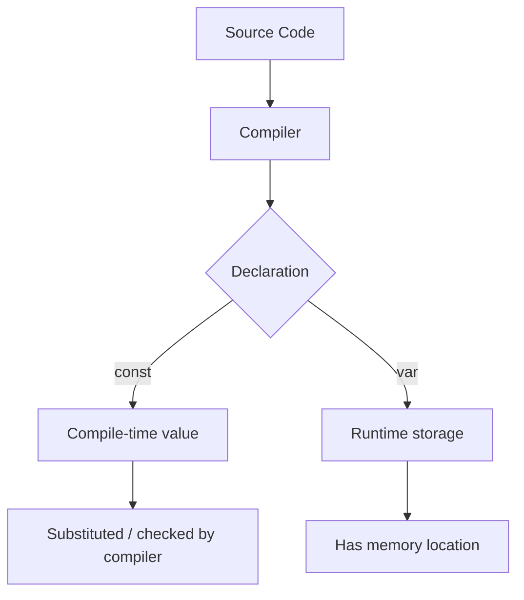
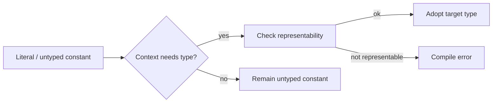
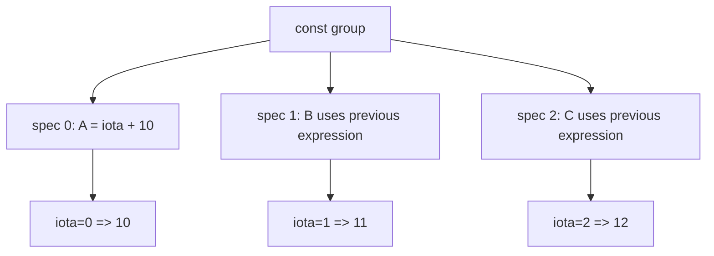
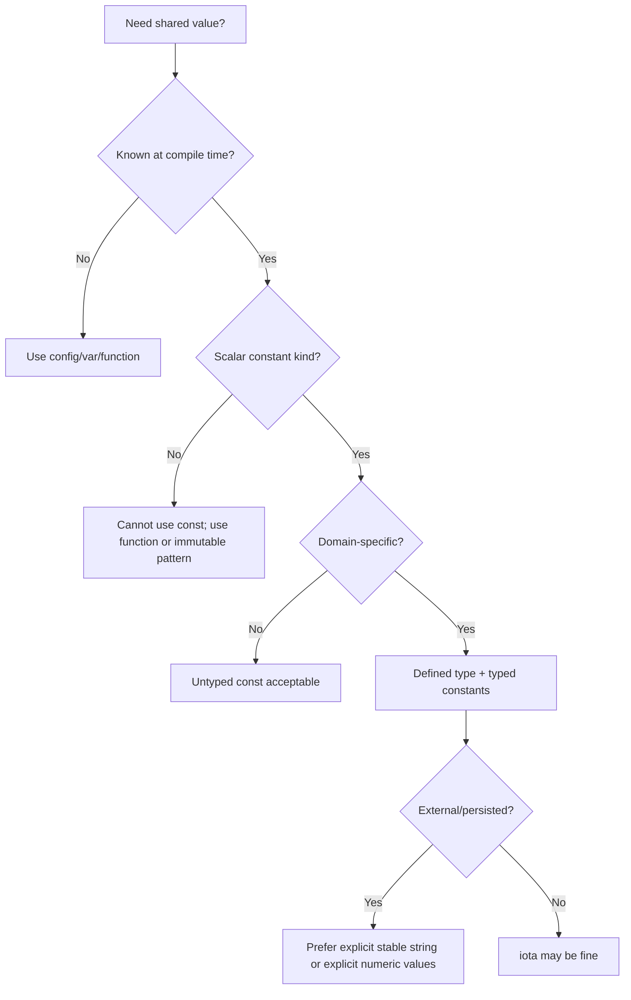

# learn-go-data-model-part-003.md

# Part 003 — Constants, Untyped Values, `iota`, dan Compile-Time Semantics

> Seri: `learn-go-data-model`  
> Target pembaca: Java software engineer yang ingin memahami Go sampai level desain sistem, correctness, API contract, dan performance engineering.  
> Baseline versi: Go 1.26.x.  
> Status seri: Part 003 dari 034. Seri belum selesai.

---

## 0. Posisi Part Ini dalam Seri

Pada part sebelumnya kita membahas:

- Part 000: peta besar data model Go.
- Part 001: defined type, alias, underlying type, assignability, convertibility.
- Part 002: zero value, initialization, valid state, dan invariant design.

Part ini membahas **constants**. Sekilas terlihat sederhana, tetapi di Go konstanta adalah salah satu bagian paling unik dari type system. Banyak engineer yang berasal dari Java mengira `const` di Go mirip dengan:

```java
public static final int MaxRetry = 3;
```

atau:

```java
enum Status { Pending, Approved, Rejected }
```

Itu hanya sebagian kecil analoginya. Di Go, konstanta punya semantik yang lebih dekat ke **compile-time mathematical value** daripada variable yang immutable.

Part ini akan membedah:

```text
constant declaration
→ untyped constant
→ typed constant
→ default type
→ representability
→ overflow at compile time
→ iota
→ enum-like pattern
→ bitmask/flag pattern
→ domain modeling
→ API stability
→ anti-pattern
```

Tujuannya bukan sekadar bisa menulis `const`, tetapi memahami bagaimana konstanta membantu membuat API lebih kuat, lebih aman, dan lebih eksplisit.

---

## 1. Mental Model Utama

### 1.1 Constant bukan variable immutable

Di Go, `const` bukan sekadar variable yang tidak bisa diubah. Constant adalah **value yang diketahui compiler**.

Contoh:

```go
const MaxRetry = 3
```

`MaxRetry` bukan lokasi memory yang menyimpan integer `3`. Ia adalah nama untuk compile-time value `3`.

Bandingkan dengan:

```go
var MaxRetry = 3
```

`var` membuat variable runtime. Variable punya address, storage, bisa diambil alamatnya jika addressable, dan bisa berubah kecuali tidak diekspor atau dijaga secara desain. Constant tidak punya address.

```go
const MaxRetry = 3

func main() {
    // _ = &MaxRetry // compile error
}
```

Mental model:



Konsekuensi:

- constant tidak bisa di-address.
- constant tidak bisa diubah.
- constant tidak punya lifetime runtime.
- constant dapat dipakai di tempat yang membutuhkan compile-time expression.
- constant dapat berperilaku “lebih fleksibel” daripada variable karena banyak constant di Go bisa **untyped**.

---

## 2. Bentuk Constant Declaration

### 2.1 Single declaration

```go
const TimeoutSeconds = 30
const ServiceName = "case-management"
const Enabled = true
```

### 2.2 Grouped declaration

```go
const (
    TimeoutSeconds = 30
    ServiceName     = "case-management"
    Enabled         = true
)
```

Grouped declaration bukan hanya style. Ia menjadi sangat penting saat memakai `iota`.

### 2.3 Typed constant

```go
const MaxRetry int = 3
const ServiceName string = "case-management"
```

Di sini tipe ditetapkan eksplisit.

### 2.4 Untyped constant

```go
const MaxRetry = 3
const Pi = 3.14159265358979323846264338327950288419716939937510
const Name = "aceas"
```

Jika tidak diberi tipe eksplisit, constant biasanya tetap **untyped** sampai dipakai dalam konteks yang membutuhkan tipe.

Ini salah satu hal paling penting dalam Go.

---

## 3. Untyped Constants

### 3.1 Apa itu untyped constant?

Untyped constant adalah constant yang punya **kind** tetapi belum punya concrete type runtime.

Kind utama:

```text
- untyped boolean
- untyped integer
- untyped rune
- untyped floating-point
- untyped complex
- untyped string
```

Contoh:

```go
const A = 10        // untyped integer
const B = 10.5      // untyped floating-point
const C = 'x'       // untyped rune
const D = "hello"   // untyped string
const E = true      // untyped boolean
const F = 1 + 2i    // untyped complex
```

Untyped bukan berarti “dynamic typing”. Go tetap statically typed. Untyped constant adalah mekanisme compile-time agar literal dan constant bisa digunakan secara ergonomis tanpa kehilangan safety.

Contoh:

```go
const N = 10

var a int = N
var b int8 = N
var c int64 = N
var d float64 = N
```

`N` bisa masuk ke berbagai tipe karena `N` belum dikunci sebagai `int`. Compiler hanya mengecek apakah value `10` bisa direpresentasikan oleh target type.

Jika `N` dikunci sebagai `int`, maka assignability berubah:

```go
const N int = 10

var a int = N
// var b int8 = N // compile error tanpa conversion eksplisit
```

### 3.2 Kenapa Go punya untyped constant?

Karena Go tidak mengizinkan operasi numeric lintas tipe secara bebas.

```go
var x int = 10
var y int64 = 20

// _ = x + y // compile error
```

Namun Go tetap ingin literal sederhana bisa dipakai natural:

```go
var timeout int64 = 30
var ratio float64 = 0.75
var mask uint32 = 1 << 10
```

Tanpa untyped constant, kode seperti itu akan sangat noisy.

Mental model:



---

## 4. Default Type

Untyped constant akan mendapat **default type** jika konteks membutuhkan concrete type tetapi tidak memberi target type eksplisit.

Contoh:

```go
x := 10       // x has type int
y := 10.5     // y has type float64
z := 'a'      // z has type rune, alias int32
s := "hello"  // s has type string
b := true     // b has type bool
c := 1 + 2i   // c has type complex128
```

Default type umum:

```text
untyped boolean        → bool
untyped integer        → int
untyped rune           → rune
untyped floating-point → float64
untyped complex        → complex128
untyped string         → string
```

Contoh jebakan:

```go
const Big = 1 << 62

func main() {
    x := Big // on 64-bit int usually ok; on 32-bit int not representable
    _ = x
}
```

Karena `:=` membutuhkan concrete type, untyped integer `Big` akan default ke `int`. Jika value tidak muat dalam `int`, compile error.

Lebih aman:

```go
const Big = 1 << 62

var x int64 = Big
```

Atau:

```go
x := int64(Big)
```

---

## 5. Representability: Compile-Time Safety

Typed constant harus dapat direpresentasikan oleh tipe target.

```go
const A int8 = 127
// const B int8 = 128 // compile error
```

Untyped constant juga harus representable ketika dipakai dalam konteks typed.

```go
const N = 300

var a int16 = N
// var b int8 = N // compile error: 300 overflows int8
```

Ini berbeda dari banyak operasi runtime integer yang bisa overflow secara wrap-around tergantung tipe.

```go
var x uint8 = 255
x++ // x becomes 0 at runtime
```

Tetapi constant overflow ditolak:

```go
// const Bad uint8 = 255 + 1 // compile error
```

Mental model:

```text
constant arithmetic → infinite/very high precision compile-time domain
typed assignment    → representability check
runtime arithmetic  → concrete machine type semantics
```

---

## 6. Constant Arithmetic

Constant expression dihitung di compile time.

```go
const A = 10
const B = 20
const C = A * B
```

Compiler mengevaluasi `C` sebagai constant.

### 6.1 Precision tinggi

Go constants dapat memiliki precision yang lebih tinggi daripada tipe runtime biasa.

```go
const Huge = 1 << 100
```

Ini legal sebagai untyped integer constant.

Tetapi tidak bisa dimasukkan ke tipe yang tidak cukup besar:

```go
const Huge = 1 << 100

// var x int64 = Huge // compile error
```

Namun bisa dipakai untuk constant expression lain selama akhirnya representable.

```go
const Huge = 1 << 100
const Smaller = Huge >> 98

var x int = Smaller // 4
```

### 6.2 Integer division pada constants

```go
const A = 10 / 3    // untyped integer, value 3
const B = 10.0 / 3  // untyped floating-point, value 3.333...
```

Perhatikan bahwa operasi mengikuti jenis operand constant.

```go
const Ratio = 1 / 2

func main() {
    var x float64 = Ratio
    // x == 0, bukan 0.5
}
```

Benar:

```go
const Ratio = 1.0 / 2
```

### 6.3 Shift expression

Shift expression adalah sumber banyak kebingungan.

```go
const KiB = 1 << 10
const MiB = 1 << 20
const GiB = 1 << 30
```

Selama `1` masih untyped integer, ini aman sebagai compile-time constant.

Namun ketika operand kiri typed, hasil dan aturan berubah.

```go
var n uint8 = 1
_ = n << 7 // type uint8 result if assigned accordingly
```

Dalam desain constant, biasakan menulis unit size sebagai untyped constant terlebih dahulu, lalu convert pada boundary.

---

## 7. Typed Constants

Typed constant digunakan ketika kita ingin constant menjadi bagian dari domain type.

```go
type RetryCount int

const DefaultRetry RetryCount = 3
```

Sekarang `DefaultRetry` bukan sekadar angka `3`, tetapi value domain `RetryCount`.

Keuntungan:

- API lebih eksplisit.
- Mengurangi accidental mixing antar domain.
- Dokumentasi lebih kuat.
- Completion/IDE lebih baik.
- Method bisa ditempel pada defined type.

Contoh:

```go
type CaseStatus string

const (
    CaseStatusDraft     CaseStatus = "draft"
    CaseStatusSubmitted CaseStatus = "submitted"
    CaseStatusApproved  CaseStatus = "approved"
    CaseStatusRejected  CaseStatus = "rejected"
)
```

Typed constant cocok untuk enum-like domain.

---

## 8. `const` dan Domain Modeling

### 8.1 Poor model: raw string everywhere

```go
func Transition(status string, action string) string {
    if status == "draft" && action == "submit" {
        return "submitted"
    }
    return status
}
```

Masalah:

- typo tidak terdeteksi compiler.
- domain tersebar dalam string literal.
- tidak ada namespace domain.
- refactor sulit.
- invalid value bisa menyebar.

### 8.2 Better model: defined type + typed constants

```go
type CaseStatus string

type CaseAction string

const (
    CaseStatusDraft     CaseStatus = "draft"
    CaseStatusSubmitted CaseStatus = "submitted"
    CaseStatusApproved  CaseStatus = "approved"
    CaseStatusRejected  CaseStatus = "rejected"

    CaseActionSubmit  CaseAction = "submit"
    CaseActionApprove CaseAction = "approve"
    CaseActionReject  CaseAction = "reject"
)

func Transition(status CaseStatus, action CaseAction) CaseStatus {
    switch status {
    case CaseStatusDraft:
        if action == CaseActionSubmit {
            return CaseStatusSubmitted
        }
    case CaseStatusSubmitted:
        switch action {
        case CaseActionApprove:
            return CaseStatusApproved
        case CaseActionReject:
            return CaseStatusRejected
        }
    }
    return status
}
```

Ini belum membuat enum tertutup sempurna seperti beberapa bahasa lain, karena Go masih memungkinkan:

```go
var s CaseStatus = "unknown"
```

Tetapi desain ini tetap jauh lebih baik karena public API mengkomunikasikan domain secara eksplisit.

### 8.3 Stronger validation

```go
func (s CaseStatus) Valid() bool {
    switch s {
    case CaseStatusDraft,
        CaseStatusSubmitted,
        CaseStatusApproved,
        CaseStatusRejected:
        return true
    default:
        return false
    }
}
```

Gunakan validation pada boundary:

```go
func ParseCaseStatus(raw string) (CaseStatus, error) {
    s := CaseStatus(raw)
    if !s.Valid() {
        return "", fmt.Errorf("invalid case status %q", raw)
    }
    return s, nil
}
```

Prinsip:

```text
inside domain: use typed constants
at boundary: parse/validate raw values
outside boundary: never trust string/integer input
```

---

## 9. `iota`: Enumerator Generator

### 9.1 Apa itu `iota`?

`iota` adalah predeclared identifier yang dipakai dalam constant declaration. Nilainya adalah index constant specification dalam sebuah `const` group, dimulai dari 0.

Contoh:

```go
const (
    A = iota // 0
    B        // 1
    C        // 2
)
```

Ini equivalent secara konseptual dengan:

```go
const (
    A = 0
    B = 1
    C = 2
)
```

Tetapi `iota` lebih kuat karena expression bisa diulang otomatis.

### 9.2 Repeated expression rule

Dalam grouped constant declaration, jika expression dihilangkan, Go mengulang expression sebelumnya.

```go
const (
    A = iota + 10 // 10
    B             // 11
    C             // 12
)
```

Mental model:



### 9.3 Skipping values

Gunakan blank identifier `_`.

```go
const (
    _ = iota
    StatusDraft
    StatusSubmitted
    StatusApproved
)
```

Hasil:

```text
StatusDraft     = 1
StatusSubmitted = 2
StatusApproved  = 3
```

Kenapa skip 0?

Karena zero value kadang ingin dianggap invalid/unknown.

```go
type Status int

const (
    StatusUnknown Status = iota
    StatusDraft
    StatusSubmitted
    StatusApproved
)
```

Atau:

```go
type Status int

const (
    _ Status = iota
    StatusDraft
    StatusSubmitted
    StatusApproved
)
```

Pilihan tergantung domain:

- Jika zero value harus valid sebagai unknown: pakai `StatusUnknown`.
- Jika zero value harus ditolak: skip dengan `_` dan validasi.

### 9.4 `iota` reset per const group

```go
const (
    A = iota // 0
    B        // 1
)

const (
    C = iota // 0
    D        // 1
)
```

`iota` tidak global.

---

## 10. Enum-like Pattern di Go

Go tidak punya `enum` keyword. Pattern umum adalah defined type + constants.

### 10.1 Integer enum

```go
type Severity int

const (
    SeverityUnknown Severity = iota
    SeverityInfo
    SeverityWarning
    SeverityError
    SeverityCritical
)
```

Keuntungan:

- compact.
- cepat dibandingkan string comparison.
- cocok untuk internal state.
- mudah digunakan sebagai array index jika hati-hati.

Kekurangan:

- serialized value kurang readable jika langsung diekspos.
- ordering bisa bocor ke domain padahal tidak selalu bermakna.
- penambahan di tengah bisa merusak persistence jika angka disimpan.

### 10.2 String enum

```go
type Severity string

const (
    SeverityInfo     Severity = "info"
    SeverityWarning  Severity = "warning"
    SeverityError    Severity = "error"
    SeverityCritical Severity = "critical"
)
```

Keuntungan:

- readable di JSON/log/database.
- lebih stabil untuk external contract.
- tidak bergantung pada urutan deklarasi.

Kekurangan:

- lebih besar daripada integer.
- comparison string lebih mahal daripada integer meski sering tidak signifikan.
- typo raw string masih mungkin jika tidak divalidasi.

Rule of thumb:

```text
Internal state machine       → integer enum boleh
External API / JSON / config → string enum sering lebih aman
Database persisted enum      → string enum jika contract readability/stability penting
Hot-loop classification      → integer enum bisa lebih baik
```

---

## 11. Exhaustiveness: Go Tidak Menjamin Switch Lengkap

Java modern punya `enum` dan switch expression yang bisa memberi exhaustiveness checking dalam beberapa konteks. Go tidak otomatis memastikan semua constants tercakup.

```go
func Label(s Severity) string {
    switch s {
    case SeverityInfo:
        return "info"
    case SeverityWarning:
        return "warning"
    }
    return "unknown"
}
```

Jika nanti ditambah:

```go
const SeverityCritical Severity = "critical"
```

Compiler tidak otomatis memaksa `Label` diperbarui.

Strategi:

1. Gunakan `default` hanya jika memang domain unknown perlu ditangani.
2. Tambahkan test table untuk semua known constants.
3. Simpan daftar canonical values.
4. Gunakan lint/tooling jika tersedia di pipeline.

Contoh canonical values:

```go
var allSeverities = [...]Severity{
    SeverityInfo,
    SeverityWarning,
    SeverityError,
    SeverityCritical,
}

func AllSeverities() []Severity {
    out := make([]Severity, len(allSeverities))
    copy(out, allSeverities[:])
    return out
}
```

Kenapa copy?

Agar caller tidak bisa mutate backing array internal jika kita mengembalikan slice langsung.

---

## 12. String Method untuk Enum-like Type

Untuk logging/debugging, implementasikan `String()`.

```go
type Severity int

const (
    SeverityUnknown Severity = iota
    SeverityInfo
    SeverityWarning
    SeverityError
    SeverityCritical
)

func (s Severity) String() string {
    switch s {
    case SeverityInfo:
        return "info"
    case SeverityWarning:
        return "warning"
    case SeverityError:
        return "error"
    case SeverityCritical:
        return "critical"
    default:
        return "unknown"
    }
}
```

Hati-hati: `String()` bukan validasi. Ia hanya representasi text.

```go
s := Severity(999)
fmt.Println(s.String()) // unknown
```

Tetap butuh:

```go
func (s Severity) Valid() bool {
    switch s {
    case SeverityInfo, SeverityWarning, SeverityError, SeverityCritical:
        return true
    default:
        return false
    }
}
```

---

## 13. `iota` untuk Bitmask dan Flags

Salah satu penggunaan terbaik `iota` adalah flag bitmask.

```go
type Permission uint64

const (
    PermissionRead Permission = 1 << iota
    PermissionWrite
    PermissionDelete
    PermissionApprove
    PermissionAdmin
)
```

Hasil:

```text
PermissionRead    = 1 << 0 = 1
PermissionWrite   = 1 << 1 = 2
PermissionDelete  = 1 << 2 = 4
PermissionApprove = 1 << 3 = 8
PermissionAdmin   = 1 << 4 = 16
```

Operasi:

```go
func Has(mask, p Permission) bool {
    return mask&p == p
}

func Add(mask, p Permission) Permission {
    return mask | p
}

func Remove(mask, p Permission) Permission {
    return mask &^ p
}
```

Contoh:

```go
var p Permission
p = Add(p, PermissionRead)
p = Add(p, PermissionWrite)

fmt.Println(Has(p, PermissionRead))   // true
fmt.Println(Has(p, PermissionDelete)) // false
```

### 13.1 Flag group design

```go
type AuditEventKind uint32

const (
    AuditCreate AuditEventKind = 1 << iota
    AuditUpdate
    AuditDelete
    AuditApprove
    AuditReject
)

const AuditMutation = AuditCreate | AuditUpdate | AuditDelete
```

Composite flags boleh menjadi constant juga.

### 13.2 Failure mode: terlalu banyak flag

Jika type `uint8`, maksimal hanya 8 bit.

```go
type Flag uint8

const (
    F0 Flag = 1 << iota
    F1
    F2
    F3
    F4
    F5
    F6
    F7
    // F8 // overflow if typed as Flag
)
```

Untuk permission system yang bisa bertambah, gunakan `uint64` atau desain lain. Jangan memakai bitmask untuk domain yang perlu extensibility tak terbatas, metadata, expiry, scope, atau reason.

---

## 14. Constant Blocks sebagai Namespace Ringan

Go tidak punya enum namespace khusus. Nama constant berada di package scope.

Buruk:

```go
const (
    Draft = "draft"
    Open  = "open"
    Done  = "done"
)
```

Masalah: nama terlalu generik.

Lebih baik:

```go
type CaseStatus string

const (
    CaseStatusDraft     CaseStatus = "draft"
    CaseStatusOpen      CaseStatus = "open"
    CaseStatusCompleted CaseStatus = "completed"
)
```

Prefix terlihat verbose, tetapi di Go ini umum untuk package-level constants agar jelas dan tidak bentrok.

Dalam package kecil, nama bisa lebih singkat jika package name sudah memberi konteks:

```go
package status

type Case string

const (
    Draft     Case = "draft"
    Submitted Case = "submitted"
    Approved  Case = "approved"
)
```

Pemakaian:

```go
status.Draft
```

Trade-off:

```text
single package with many domains → use prefix
small domain package             → package name can be namespace
public API                       → prioritize clarity over brevity
```

---

## 15. Constant vs Variable untuk Shared Values

Tidak semua shared value bisa menjadi constant.

Legal constant:

```go
const ServiceName = "case-management"
const MaxRetry = 3
const TimeoutMillis = 500
```

Tidak legal:

```go
// const DefaultTimeout = 5 * time.Second // illegal? depends: time.Second is a constant, so actually legal
```

`time.Second` adalah constant bertipe `time.Duration`, sehingga ini legal:

```go
const DefaultTimeout = 5 * time.Second
```

Namun ini tidak legal:

```go
// const Now = time.Now() // function call not constant
```

Juga tidak legal untuk slice/map/struct literal sebagai const:

```go
// const DefaultRoles = []string{"admin", "reviewer"} // illegal
// const DefaultConfig = Config{Enabled: true}          // illegal
```

Gunakan `var` atau function:

```go
var DefaultRoles = []string{"admin", "reviewer"}
```

Tapi hati-hati: exported variable mutable.

Lebih aman:

```go
func DefaultRoles() []string {
    return []string{"admin", "reviewer"}
}
```

Atau:

```go
var defaultRoles = [...]string{"admin", "reviewer"}

func DefaultRoles() []string {
    out := make([]string, len(defaultRoles))
    copy(out, defaultRoles[:])
    return out
}
```

Rule:

```text
scalar immutable compile-time value → const
runtime object / collection         → var or function
exported mutable package var        → avoid unless intentionally global state
```

---

## 16. Constants and API Compatibility

Public constants adalah bagian dari API contract.

```go
package caseflow

type Status string

const (
    StatusDraft     Status = "draft"
    StatusSubmitted Status = "submitted"
)
```

Jika library consumer memakai:

```go
if status == caseflow.StatusSubmitted {
    ...
}
```

Maka menghapus atau mengganti nama constant adalah breaking change.

Mengganti value juga bisa breaking, terutama jika value muncul di JSON, database, log, config, atau inter-service contract.

### 16.1 Dangerous change

```go
const StatusSubmitted Status = "submitted"
```

Diubah menjadi:

```go
const StatusSubmitted Status = "SUBMITTED"
```

Compiler consumer mungkin tetap berhasil, tetapi runtime contract rusak.

### 16.2 Safer additive change

```go
const StatusUnderReview Status = "under_review"
```

Menambah constant biasanya backward compatible, tetapi bisa merusak consumer jika mereka punya switch yang tidak menangani value baru.

Karena Go tidak memberi exhaustiveness, dokumentasi dan test contract penting.

---

## 17. Untyped Constants dan Public API

Pertimbangkan:

```go
const DefaultPageSize = 50
```

Ini untyped integer constant. Consumer bisa memakai:

```go
var x int = DefaultPageSize
var y int64 = DefaultPageSize
var z uint8 = DefaultPageSize
```

Fleksibel.

Tapi untuk domain type:

```go
type PageSize int

const DefaultPageSize PageSize = 50
```

Sekarang lebih eksplisit.

Mana yang lebih baik?

Gunakan untyped jika value benar-benar general-purpose numeric/text.

```go
const KiB = 1024
const DefaultPort = 8080
```

Gunakan typed jika value punya domain meaning.

```go
type RetryCount int
const DefaultRetryCount RetryCount = 3
```

Rule:

```text
If the constant belongs to a domain abstraction, type it.
If it is pure mathematical/general-purpose value, untyped can be useful.
```

---

## 18. Sentinel Constants

Sentinel constants sering digunakan untuk unknown/default mode.

```go
type SortDirection string

const (
    SortDirectionAsc  SortDirection = "asc"
    SortDirectionDesc SortDirection = "desc"
)
```

Kadang ada:

```go
const SortDirectionDefault SortDirection = ""
```

Ini harus sangat hati-hati. Empty string bisa berarti:

- not provided,
- default,
- invalid,
- intentionally blank.

Lebih jelas:

```go
type SortDirection string

const (
    SortDirectionUnspecified SortDirection = ""
    SortDirectionAsc         SortDirection = "asc"
    SortDirectionDesc        SortDirection = "desc"
)
```

Atau gunakan pointer/option struct di boundary:

```go
type ListOptions struct {
    SortDirection *SortDirection
}
```

Lalu defaulting dilakukan eksplisit:

```go
func normalizeSortDirection(in *SortDirection) (SortDirection, error) {
    if in == nil {
        return SortDirectionAsc, nil
    }
    if !in.Valid() {
        return "", fmt.Errorf("invalid sort direction %q", *in)
    }
    return *in, nil
}
```

---

## 19. Constant Naming Guidelines

Go tidak memakai gaya `SCREAMING_SNAKE_CASE` sebagai default untuk constants. Nama mengikuti visibility dan readability.

Umum:

```go
const defaultTimeout = 5 * time.Second
const MaxHeaderBytes = 1 << 20
const StatusSubmitted Status = "submitted"
```

Bukan:

```go
const DEFAULT_TIMEOUT = 5
```

Kecuali domain memang lazim memakai acronym atau external protocol name.

Guideline:

```text
unexported constant → lowerCamelCase
exported constant   → PascalCase
acronym             → follow Go initialism convention when applicable
```

Contoh:

```go
const maxRetry = 3
const DefaultRetry = 3
const HTTPHeaderContentType = "Content-Type"
```

Namun jangan overdo initialism sampai nama susah dibaca.

---

## 20. Constants untuk Size, Limit, dan Unit

### 20.1 Unit constants

```go
const (
    KiB = 1024
    MiB = 1024 * KiB
    GiB = 1024 * MiB
)
```

Atau:

```go
const (
    KiB = 1 << 10
    MiB = 1 << 20
    GiB = 1 << 30
)
```

Gunakan nama jelas. `KB` bisa ambigu antara 1000 dan 1024.

### 20.2 Limit constants

```go
const MaxRequestBodyBytes = 10 * MiB
```

Jika dipakai di API seperti `http.MaxBytesReader`, perhatikan tipe target.

```go
const MaxRequestBodyBytes = 10 * 1024 * 1024

func limit(n int64) {}

func main() {
    limit(MaxRequestBodyBytes) // ok if representable as int64
}
```

Untyped constant memudahkan.

### 20.3 Runtime-configurable value jangan const

Buruk:

```go
const MaxUploadBytes = 10 * MiB
```

Jika sebenarnya harus bisa diubah per environment, tenant, atau deployment, gunakan config.

```go
type UploadConfig struct {
    MaxUploadBytes int64
}
```

Gunakan const untuk default/fallback:

```go
const DefaultMaxUploadBytes = 10 * MiB
```

---

## 21. Constants untuk Protocol dan Wire Contract

Protocol values sering cocok sebagai typed string constants.

```go
type ContentType string

const (
    ContentTypeJSON ContentType = "application/json"
    ContentTypeXML  ContentType = "application/xml"
)
```

Untuk header names, biasanya string constants cukup:

```go
const HeaderRequestID = "X-Request-Id"
```

Namun hati-hati canonicalization header HTTP bisa di-handle oleh standard library; jangan membuat abstraction yang salah.

Untuk event type:

```go
type EventType string

const (
    EventCaseCreated   EventType = "case.created"
    EventCaseSubmitted EventType = "case.submitted"
    EventCaseApproved  EventType = "case.approved"
)
```

Ini membantu menjaga event-driven systems agar tidak menyebarkan magic string.

---

## 22. Constants dan JSON

Jika domain enum diekspos ke JSON, string constant biasanya lebih aman.

```go
type CaseStatus string

const (
    CaseStatusDraft     CaseStatus = "draft"
    CaseStatusSubmitted CaseStatus = "submitted"
)

type CaseResponse struct {
    Status CaseStatus `json:"status"`
}
```

Output:

```json
{"status":"submitted"}
```

Jika memakai integer enum:

```go
type CaseStatus int

const (
    CaseStatusDraft CaseStatus = iota
    CaseStatusSubmitted
)
```

Default JSON output menjadi angka:

```json
{"status":1}
```

Itu mungkin tidak diinginkan untuk public API.

Solusi:

- pakai string enum, atau
- implement custom marshal/unmarshal.

Custom unmarshal memungkinkan validasi:

```go
func (s *CaseStatus) UnmarshalJSON(data []byte) error {
    var raw string
    if err := json.Unmarshal(data, &raw); err != nil {
        return err
    }
    parsed := CaseStatus(raw)
    if !parsed.Valid() {
        return fmt.Errorf("invalid case status %q", raw)
    }
    *s = parsed
    return nil
}
```

---

## 23. Constants dan Database Persistence

Jika constant value masuk database, treat value sebagai migration-sensitive contract.

Buruk:

```go
type Status int

const (
    StatusDraft Status = iota
    StatusSubmitted
    StatusApproved
)
```

Lalu disimpan sebagai integer.

Masalah muncul jika nanti urutan berubah:

```go
const (
    StatusDraft Status = iota
    StatusUnderReview
    StatusSubmitted
    StatusApproved
)
```

Data lama `1` yang sebelumnya `submitted` sekarang bisa dimaknai `under_review` jika mapping tidak dijaga.

Jika harus pakai integer persistence, tetapkan angka eksplisit:

```go
type Status int

const (
    StatusDraft       Status = 10
    StatusSubmitted   Status = 20
    StatusApproved    Status = 30
    StatusUnderReview Status = 40
)
```

Atau gunakan string persistence:

```go
type Status string

const (
    StatusDraft       Status = "draft"
    StatusSubmitted   Status = "submitted"
    StatusApproved    Status = "approved"
    StatusUnderReview Status = "under_review"
)
```

Rule:

```text
iota-generated integer values are fine for internal-only transient values.
For persisted or external values, prefer explicit stable values.
```

---

## 24. Constants dan Error/Reason Codes

Reason code sering cocok sebagai typed string.

```go
type RejectReasonCode string

const (
    RejectReasonIncompleteDocument RejectReasonCode = "incomplete_document"
    RejectReasonInvalidLicense     RejectReasonCode = "invalid_license"
    RejectReasonExpiredPermit      RejectReasonCode = "expired_permit"
)
```

Untuk regulatory/case-management system, typed reason code membantu:

- auditability,
- reporting,
- localization,
- workflow branching,
- policy defensibility,
- backward compatibility.

Jangan encode reason hanya sebagai display text:

```go
// Bad
const RejectReason = "The applicant did not provide all required documents."
```

Gunakan code + message mapping:

```go
type ReasonCode string

const ReasonIncompleteDocument ReasonCode = "incomplete_document"

func (c ReasonCode) DefaultMessage() string {
    switch c {
    case ReasonIncompleteDocument:
        return "Required documents are incomplete."
    default:
        return "Unknown reason."
    }
}
```

Message bisa berubah; code sebaiknya stabil.

---

## 25. Constants dan Build-Time Behavior

Constant expression dievaluasi compiler. Ini berarti constant dapat dipakai untuk array length.

```go
const MaxSlots = 8

var slots [MaxSlots]string
```

Tidak bisa dengan variable:

```go
var n = 8
// var slots [n]string // compile error
```

Array length adalah bagian dari type, sehingga harus compile-time constant.

Ini penting untuk fixed protocol fields:

```go
const SHA256Size = 32

type Digest [SHA256Size]byte
```

Domain benefit:

```go
func VerifyDigest(d Digest) bool {
    // compiler guarantees exactly 32 bytes
    return true
}
```

Jika memakai `[]byte`, length harus divalidasi runtime.

---

## 26. Constants and Generic Code

Generics tidak membuat value-level const parameter seperti C++ template parameter.

Tidak bisa:

```go
// type Vector[T any, N int] [N]T // not Go
```

Array length harus constant, tetapi type parameter bukan constant value.

Jika butuh fixed-size generic array, ukuran harus bagian dari type literal yang ditulis langsung:

```go
type Vec3[T any] [3]T
```

Untuk ukuran dinamis, gunakan slice:

```go
type Vector[T any] []T
```

Konsekuensi desain:

- Go generics adalah type parameterization, bukan compile-time value metaprogramming penuh.
- Constants tetap compile-time values, tetapi bukan parameter generic value.
- Jangan memaksakan desain ala C++ template atau Java generic array.

---

## 27. Advanced `iota` Patterns

### 27.1 Multiple constants per line

```go
const (
    A, B = iota, iota + 10 // 0, 10
    C, D                  // 1, 11
    E, F                  // 2, 12
)
```

Nilai `iota` sama dalam satu constant specification line.

### 27.2 Size units

```go
const (
    _ = iota
    KiB = 1 << (10 * iota)
    MiB
    GiB
    TiB
)
```

Hasil:

```text
KiB = 1 << 10
MiB = 1 << 20
GiB = 1 << 30
TiB = 1 << 40
```

Ini idiomatik, tetapi jangan terlalu clever jika tim lebih sulit membaca.

### 27.3 State machine ordinal

```go
type Step int

const (
    StepUnknown Step = iota
    StepReceived
    StepValidated
    StepScreened
    StepApproved
    StepIssued
)
```

Hati-hati: ordinal bisa memberi ilusi bahwa semua transition linear.

Jika workflow tidak linear, jangan gunakan comparison ordinal seperti:

```go
if step >= StepApproved {
    ...
}
```

Kecuali ordering memang invariant domain yang eksplisit.

Lebih aman:

```go
func (s Step) Terminal() bool {
    switch s {
    case StepApproved, StepIssued:
        return true
    default:
        return false
    }
}
```

---

## 28. Anti-Pattern: `iota` untuk External API

Buruk:

```go
type Role int

const (
    RoleApplicant Role = iota
    RoleOfficer
    RoleSupervisor
    RoleAdmin
)
```

Lalu JSON:

```json
{"role":2}
```

Masalah:

- tidak readable.
- client harus tahu mapping.
- reorder merusak contract.
- observability/logging buruk.
- data warehouse/reporting kurang jelas.

Lebih baik:

```go
type Role string

const (
    RoleApplicant  Role = "applicant"
    RoleOfficer    Role = "officer"
    RoleSupervisor Role = "supervisor"
    RoleAdmin      Role = "admin"
)
```

Jika internal performance butuh integer, map di boundary:

```go
type internalRole uint8

const (
    internalRoleApplicant internalRole = iota + 1
    internalRoleOfficer
    internalRoleSupervisor
    internalRoleAdmin
)
```

Boundary parser:

```go
func parseRole(raw string) (internalRole, error) {
    switch Role(raw) {
    case RoleApplicant:
        return internalRoleApplicant, nil
    case RoleOfficer:
        return internalRoleOfficer, nil
    case RoleSupervisor:
        return internalRoleSupervisor, nil
    case RoleAdmin:
        return internalRoleAdmin, nil
    default:
        return 0, fmt.Errorf("invalid role %q", raw)
    }
}
```

---

## 29. Anti-Pattern: Magic Constants without Domain Type

Buruk:

```go
const (
    Pending = 1
    Approved = 2
    Rejected = 3
)

func UpdateStatus(status int) {}
```

Masalah:

- `status` bisa nilai apapun.
- Tidak jelas `1` milik domain apa.
- Bisa tertukar dengan enum lain.

Lebih baik:

```go
type ApplicationStatus int

const (
    ApplicationStatusPending ApplicationStatus = iota + 1
    ApplicationStatusApproved
    ApplicationStatusRejected
)

func UpdateStatus(status ApplicationStatus) {}
```

Lebih baik lagi jika external:

```go
type ApplicationStatus string

const (
    ApplicationStatusPending  ApplicationStatus = "pending"
    ApplicationStatusApproved ApplicationStatus = "approved"
    ApplicationStatusRejected ApplicationStatus = "rejected"
)
```

---

## 30. Anti-Pattern: Overusing Constants for Configuration

Konstanta compile-time cocok untuk invariant. Banyak value produksi bukan invariant.

Buruk:

```go
const MaxLoginAttempts = 5
const PasswordExpiryDays = 90
const SessionTimeoutMinutes = 30
```

Mungkin benar jika ini policy code-level yang tidak berubah tanpa deployment. Tetapi dalam banyak regulated systems, policy bisa berubah lewat config, tenant, agency, atau effective date.

Lebih tepat:

```go
type AuthPolicy struct {
    MaxLoginAttempts     int
    PasswordExpiryDays   int
    SessionTimeout       time.Duration
}

const (
    DefaultMaxLoginAttempts   = 5
    DefaultPasswordExpiryDays = 90
    DefaultSessionTimeout     = 30 * time.Minute
)
```

Konstanta sebagai default, bukan policy runtime final.

---

## 31. Anti-Pattern: Constant as Validation Substitute

Ini umum:

```go
const MaxNameLength = 100
```

Lalu diasumsikan semua nama valid karena ada constant.

Salah. Constant hanya value. Validation harus explicit.

```go
const MaxNameLength = 100

type Name string

func ParseName(raw string) (Name, error) {
    raw = strings.TrimSpace(raw)
    if raw == "" {
        return "", errors.New("name is required")
    }
    if utf8.RuneCountInString(raw) > MaxNameLength {
        return "", fmt.Errorf("name exceeds max length %d", MaxNameLength)
    }
    return Name(raw), nil
}
```

Perhatikan: untuk text, `len(raw)` menghitung byte, bukan character/rune/grapheme. Ini akan dibahas detail di part text.

---

## 32. Java Comparison

### 32.1 Java `static final` vs Go `const`

Java:

```java
public static final int MAX_RETRY = 3;
```

Jika compile-time constant expression, Java compiler bisa inline ke consumer class. Tetapi `static final` juga bisa merujuk object runtime:

```java
public static final List<String> ROLES = new ArrayList<>();
```

List reference final, tetapi object mutable.

Go:

```go
const MaxRetry = 3
```

Go const tidak bisa menjadi slice/map/struct/function call. Ia benar-benar compile-time constant value.

### 32.2 Java enum vs Go enum-like constants

Java enum:

```java
enum Status {
    DRAFT, SUBMITTED, APPROVED
}
```

Lebih closed. Compiler tahu value set-nya.

Go:

```go
type Status string

const (
    StatusDraft Status = "draft"
    StatusSubmitted Status = "submitted"
    StatusApproved Status = "approved"
)
```

Lebih lightweight, tetapi tidak closed secara penuh. Value arbitrary masih bisa dibuat:

```go
s := Status("corrupted")
```

Maka Go membutuhkan boundary validation dan test discipline.

### 32.3 Java annotation constants vs Go tags/constants

Java banyak memakai annotation dengan enum/class metadata. Go sering memakai struct tag string dan constants di package. Ini membuat constant design penting untuk menghindari string literal menyebar.

---

## 33. Decision Framework

Gunakan framework berikut saat membuat constant.



Checklist cepat:

```text
1. Apakah value ini benar-benar compile-time invariant?
2. Apakah value ini milik domain tertentu?
3. Apakah value akan keluar ke JSON/database/event/log?
4. Apakah ordering angka punya makna?
5. Apakah zero value valid, unknown, atau harus invalid?
6. Apakah penambahan value baru akan merusak consumer?
7. Apakah perlu parser/validator?
8. Apakah perlu String/Marshal/Unmarshal?
9. Apakah constant ini perlu typed atau untyped?
10. Apakah ini configuration disguised as constant?
```

---

## 34. Production Pattern: Status Type Lengkap

Berikut contoh pola yang lebih production-ready untuk status eksternal.

```go
package caseflow

import (
    "encoding/json"
    "fmt"
)

type Status string

const (
    StatusDraft       Status = "draft"
    StatusSubmitted   Status = "submitted"
    StatusUnderReview Status = "under_review"
    StatusApproved    Status = "approved"
    StatusRejected    Status = "rejected"
    StatusClosed      Status = "closed"
)

var allStatuses = [...]Status{
    StatusDraft,
    StatusSubmitted,
    StatusUnderReview,
    StatusApproved,
    StatusRejected,
    StatusClosed,
}

func AllStatuses() []Status {
    out := make([]Status, len(allStatuses))
    copy(out, allStatuses[:])
    return out
}

func ParseStatus(raw string) (Status, error) {
    s := Status(raw)
    if !s.Valid() {
        return "", fmt.Errorf("invalid status %q", raw)
    }
    return s, nil
}

func (s Status) Valid() bool {
    switch s {
    case StatusDraft,
        StatusSubmitted,
        StatusUnderReview,
        StatusApproved,
        StatusRejected,
        StatusClosed:
        return true
    default:
        return false
    }
}

func (s Status) Terminal() bool {
    switch s {
    case StatusApproved, StatusRejected, StatusClosed:
        return true
    default:
        return false
    }
}

func (s Status) String() string {
    if s == "" {
        return "unknown"
    }
    return string(s)
}

func (s Status) MarshalJSON() ([]byte, error) {
    if !s.Valid() {
        return nil, fmt.Errorf("cannot marshal invalid status %q", string(s))
    }
    return json.Marshal(string(s))
}

func (s *Status) UnmarshalJSON(data []byte) error {
    var raw string
    if err := json.Unmarshal(data, &raw); err != nil {
        return err
    }
    parsed, err := ParseStatus(raw)
    if err != nil {
        return err
    }
    *s = parsed
    return nil
}
```

Kenapa ini bagus:

- Status punya domain type.
- Constant value stabil dan readable.
- Boundary JSON divalidasi.
- Caller bisa enumerate allowed statuses via copy.
- Terminal semantics tidak bergantung pada ordinal.
- Invalid value tidak diam-diam keluar sebagai JSON.

Trade-off:

- Lebih banyak boilerplate.
- Perlu dijaga saat menambah status baru.
- Test harus memastikan `allStatuses`, `Valid`, dan transition logic sinkron.

---

## 35. Production Pattern: Internal Permission Bitmask

Untuk internal authorization check yang hot path dan bounded, bitmask bisa cocok.

```go
package authz

import "fmt"

type Permission uint64

const (
    PermissionReadCase Permission = 1 << iota
    PermissionCreateCase
    PermissionUpdateCase
    PermissionDeleteCase
    PermissionApproveCase
    PermissionRejectCase
    PermissionAssignCase
    PermissionViewAudit
)

const PermissionCaseOfficer =
    PermissionReadCase |
        PermissionCreateCase |
        PermissionUpdateCase |
        PermissionViewAudit

const PermissionSupervisor =
    PermissionCaseOfficer |
        PermissionApproveCase |
        PermissionRejectCase |
        PermissionAssignCase

func (p Permission) Has(required Permission) bool {
    return p&required == required
}

func (p Permission) Add(add Permission) Permission {
    return p | add
}

func (p Permission) Remove(remove Permission) Permission {
    return p &^ remove
}

func (p Permission) ValidateKnown() error {
    const allKnown = PermissionReadCase |
        PermissionCreateCase |
        PermissionUpdateCase |
        PermissionDeleteCase |
        PermissionApproveCase |
        PermissionRejectCase |
        PermissionAssignCase |
        PermissionViewAudit

    if p &^ allKnown != 0 {
        return fmt.Errorf("permission contains unknown bits: %064b", uint64(p&^allKnown))
    }
    return nil
}
```

Catatan desain:

- Cocok untuk internal bounded permission flags.
- Tidak cocok jika permission perlu resource scope, condition, expiry, tenant, policy expression, atau audit reason.
- Jangan expose bitmask mentah sebagai public API kecuali contract sengaja dibuat demikian.

---

## 36. Production Pattern: Explicit Numeric Codes

Untuk code yang harus numeric tetapi persisted/external, hindari `iota` implicit value.

```go
type ViolationCode int

const (
    ViolationUnlicensedActivity ViolationCode = 1001
    ViolationLateSubmission     ViolationCode = 1002
    ViolationFalseDeclaration   ViolationCode = 1003
    ViolationDocumentTampering  ViolationCode = 1004
)

func (c ViolationCode) Valid() bool {
    switch c {
    case ViolationUnlicensedActivity,
        ViolationLateSubmission,
        ViolationFalseDeclaration,
        ViolationDocumentTampering:
        return true
    default:
        return false
    }
}
```

Kenapa explicit?

- Aman untuk database/reporting.
- Stabil untuk external integration.
- Bisa mengikuti official code list.
- Tidak berubah ketika deklarasi disusun ulang.

---

## 37. Mini Lab 1 — Untyped Constant Behavior

Buat file:

```go
package main

import "fmt"

const N = 10
const M int = 10

func main() {
    var a int8 = N
    var b int64 = N
    var c float64 = N

    fmt.Println(a, b, c)

    _ = M
    // var d int8 = M // uncomment and observe compile error
}
```

Yang harus diamati:

- `N` fleksibel karena untyped.
- `M` typed sebagai `int`, sehingga tidak assignable langsung ke `int8`.
- Conversion eksplisit diperlukan jika value typed.

Eksperimen:

```go
var d int8 = int8(M)
```

Diskusikan: apakah conversion aman jika value berubah menjadi 300?

---

## 38. Mini Lab 2 — Constant Overflow

```go
package main

const A = 255
const B uint8 = 255

func main() {
    var x uint8 = A
    _ = x

    // const C uint8 = 256
    // var y uint8 = A + 1
    // _ = y

    var z uint8 = B
    z++
    println(z)
}
```

Yang harus diamati:

- compile-time overflow ditolak.
- runtime overflow pada `uint8` wrap-around.
- constant arithmetic bukan runtime arithmetic.

---

## 39. Mini Lab 3 — iota and Persistence Hazard

Versi 1:

```go
type Status int

const (
    StatusDraft Status = iota
    StatusSubmitted
    StatusApproved
)
```

Data tersimpan:

```text
0 = draft
1 = submitted
2 = approved
```

Versi 2:

```go
type Status int

const (
    StatusDraft Status = iota
    StatusUnderReview
    StatusSubmitted
    StatusApproved
)
```

Pertanyaan:

- Apa arti data lama `1`?
- Bagaimana efeknya pada report?
- Bagaimana efeknya pada workflow transition?
- Bagaimana migration seharusnya dilakukan?

Perbaikan:

```go
type Status int

const (
    StatusDraft       Status = 10
    StatusSubmitted   Status = 20
    StatusApproved    Status = 30
    StatusUnderReview Status = 40
)
```

Atau string enum.

---

## 40. Mini Lab 4 — Exhaustiveness Test

```go
type Status string

const (
    StatusDraft     Status = "draft"
    StatusSubmitted Status = "submitted"
    StatusApproved  Status = "approved"
)

var allStatuses = []Status{
    StatusDraft,
    StatusSubmitted,
    StatusApproved,
}

func (s Status) Valid() bool {
    switch s {
    case StatusDraft, StatusSubmitted, StatusApproved:
        return true
    default:
        return false
    }
}
```

Test:

```go
func TestAllStatusesAreValid(t *testing.T) {
    for _, s := range allStatuses {
        if !s.Valid() {
            t.Fatalf("status %q is not valid", s)
        }
    }
}
```

Lalu tambah constant baru tetapi lupa update `allStatuses` atau `Valid`. Diskusikan test apa yang bisa menangkap mismatch.

---

## 41. Review Checklist untuk PR

Saat review PR yang menambah constant, tanyakan:

```text
[ ] Apakah constant ini benar-benar compile-time invariant?
[ ] Apakah ini seharusnya config runtime?
[ ] Apakah constant ini domain-specific dan perlu defined type?
[ ] Apakah value akan dipersist ke DB atau keluar via API/event/log?
[ ] Jika memakai iota, apakah value hanya internal/transient?
[ ] Jika external/persisted, apakah value explicit dan stable?
[ ] Apakah zero value punya makna yang jelas?
[ ] Apakah ada parser/validator untuk boundary input?
[ ] Apakah ada String/Marshal/Unmarshal jika perlu?
[ ] Apakah switch logic punya test ketika value baru ditambah?
[ ] Apakah nama constant cukup scoped dan tidak generik?
[ ] Apakah constant ini menyebarkan magic number/string atau justru menghapusnya?
```

---

## 42. Key Takeaways

1. `const` di Go adalah compile-time value, bukan immutable runtime variable.
2. Untyped constants adalah fitur penting yang membuat numeric/text literal fleksibel tanpa mengorbankan static typing.
3. Typed constants cocok untuk domain modeling.
4. `iota` berguna untuk internal enum-like values dan bitmask, tetapi berbahaya untuk persisted/external values jika tidak eksplisit.
5. Go tidak punya enum tertutup; validation dan testing diperlukan.
6. String enum sering lebih baik untuk JSON/API/database karena readable dan stable.
7. Integer enum cocok untuk internal state, hot path, atau compact representation.
8. Public constants adalah API contract.
9. Constant bukan pengganti validation.
10. Banyak “constant” produksi sebenarnya adalah configuration; jangan mengunci policy runtime sebagai compile-time constant tanpa alasan.

---

## 43. Referensi

- Go Language Specification — Constants, constant declarations, assignability, representability, `iota`: https://go.dev/ref/spec
- Go 1.26 Release Notes: https://go.dev/doc/go1.26
- Go Blog — Constants, Rob Pike: https://go.dev/blog/constants
- Effective Go — constants and idiomatic Go style: https://go.dev/doc/effective_go

---

## 44. Penutup Part 003

Part ini membangun fondasi compile-time semantics dari constants. Setelah ini, kita bisa masuk ke numeric foundations dengan lebih presisi, karena banyak behavior angka di Go tidak bisa dipahami tanpa membedakan:

```text
untyped constant arithmetic
vs typed constant representability
vs runtime numeric operation
```

Part berikutnya:

```text
learn-go-data-model-part-004.md
Boolean, Integer, Float, Complex: Numeric Foundations
```

Status seri: belum selesai. Masih tersisa part 004 sampai part 034.


<!-- NAVIGATION_FOOTER -->
<div class="page-nav">
<a href="./learn-go-data-model-part-002.md">⬅️ Part 002 — Zero Value, Initialization, Valid State, dan Invariant Design</a>
<a href="./index.md">📚 Kategori</a>
<a href="../../index.md">🏠 Home</a>
<a href="./learn-go-data-model-part-004.md">Part 004 — Boolean, Integer, Float, Complex: Numeric Foundations ➡️</a>
</div>
