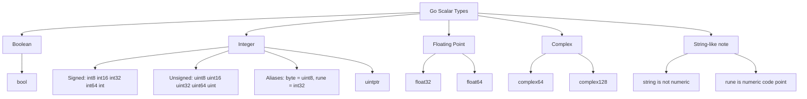
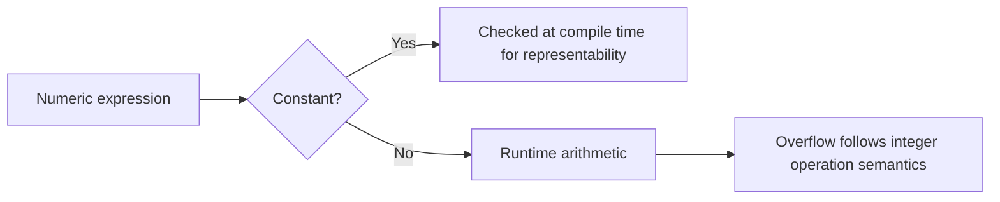
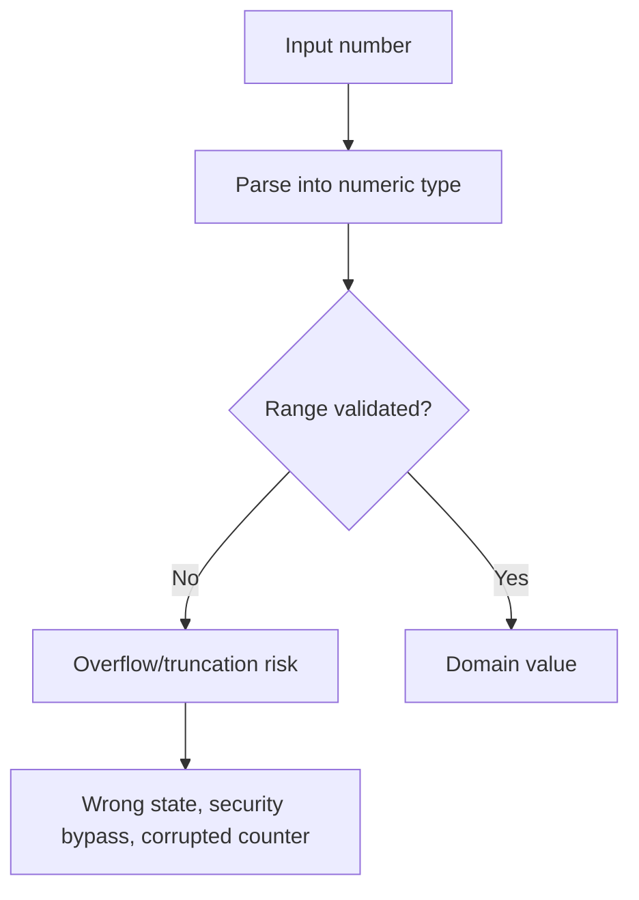
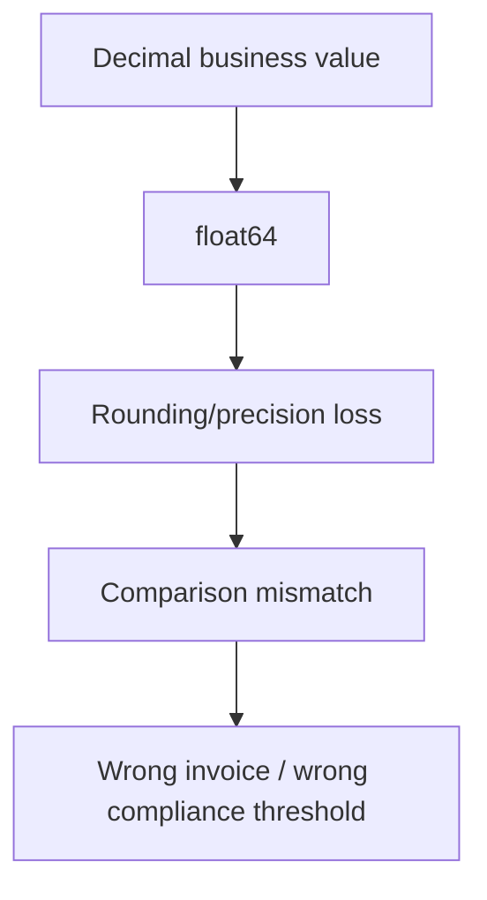
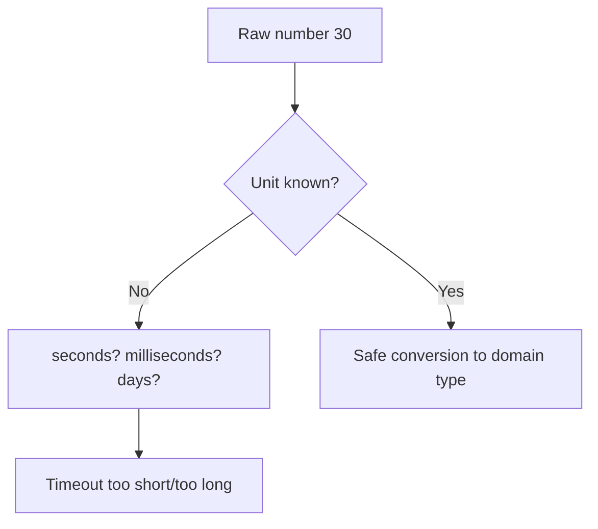
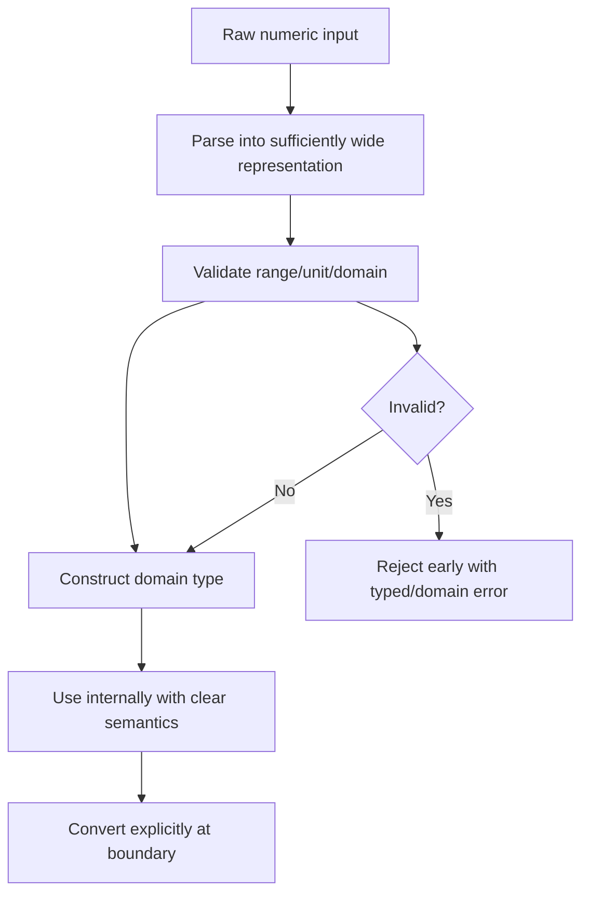

# learn-go-data-model-part-004.md

# Part 004 — Boolean, Integer, Float, Complex: Numeric Foundations

> Seri: `learn-go-data-model`  
> Bagian: `004 / 034`  
> Target pembaca: Java software engineer yang ingin memahami Go data model pada level production engineering.  
> Fokus: numeric type semantics, correctness, overflow, precision, portability, dan domain modeling.  
> Baseline: Go 1.26.x.  

---

## 0. Posisi Part Ini dalam Seri

Pada part sebelumnya kita membahas:

1. `part-000`: peta besar Go data model.
2. `part-001`: defined type, alias, underlying type, assignability, convertibility.
3. `part-002`: zero value, valid state, invariant design.
4. `part-003`: constants, untyped values, `iota`, compile-time semantics.

Part ini masuk ke kelompok **scalar data model**, terutama:

```text
bool
integer family
floating-point family
complex family
```

Tujuannya bukan menghafal daftar tipe, karena daftar itu pendek. Tujuannya adalah memahami:

```text
representation
→ operation semantics
→ conversion rule
→ overflow/precision behavior
→ portability risk
→ domain modeling consequence
→ API contract
→ testing strategy
```

Dalam production system, bug numerik biasanya bukan karena developer tidak tahu `int64`. Bug muncul karena salah memilih representasi, salah boundary conversion, salah asumsi overflow, salah rounding, salah menganggap `float64` cocok untuk money, atau salah memakai `uint` karena “tidak mungkin negatif”.

---

## 1. Referensi Resmi

Materi ini mengacu pada sumber resmi berikut:

- Go Language Specification — numeric types, constants, arithmetic operators, conversions, comparability: <https://go.dev/ref/spec>
- Go 1.26 Release Notes — baseline versi seri: <https://go.dev/doc/go1.26>
- Go Release History — status minor release Go 1.26.x: <https://go.dev/doc/devel/release>
- Go `math` package — `NaN`, `Inf`, `IsNaN`, `IsInf`: <https://pkg.go.dev/math>
- Go `math/bits` package — low-level integer bit operations: <https://pkg.go.dev/math/bits>
- Go `math/big` package — arbitrary precision arithmetic: <https://pkg.go.dev/math/big>
- Go `strconv` package — numeric parsing/formatting: <https://pkg.go.dev/strconv>

Catatan: Go 1.26 mempertahankan Go 1 compatibility promise; rules dasar numeric type tetap stabil. Perubahan besar numeric semantics jarang terjadi karena akan berisiko memecahkan kompatibilitas bahasa.

---

## 2. Mental Model Utama: Number Is Not Just Number

Di Java, kita terbiasa dengan:

```java
byte, short, int, long
float, double
boolean
char
BigInteger, BigDecimal
```

Di Go, tipe numerik terlihat mirip, tetapi mental model-nya berbeda:

```go
bool

int8, int16, int32, int64
uint8, uint16, uint32, uint64
int, uint, uintptr

byte   // alias for uint8
rune   // alias for int32

float32, float64
complex64, complex128
```

Perbedaan penting:

1. `byte` dan `rune` adalah alias, bukan defined type baru.
2. `int` dan `uint` ukurannya implementation-specific: 32-bit atau 64-bit tergantung architecture.
3. `uintptr` bukan pointer aman dan bukan integer domain biasa.
4. Integer runtime overflow tidak panic.
5. Floating-point mengikuti karakteristik IEEE 754-like behavior yang membawa `NaN`, `Inf`, signed zero, precision loss.
6. Untyped constants bisa punya presisi sangat besar di compile time, tetapi harus representable saat diberi tipe.
7. Go tidak melakukan implicit numeric conversion antar tipe numerik berbeda.

Contoh:

```go
var a int32 = 10
var b int64 = 20

// invalid: mismatched types int32 and int64
// c := a + b

c := int64(a) + b
_ = c
```

Ini berbeda dari sebagian numeric promotion di Java. Go sengaja memaksa conversion eksplisit agar boundary precision dan size terlihat.

---

## 3. Taxonomy Numeric Types Go



Tipe numerik tidak sekadar “storage size”. Setiap tipe membawa kontrak:

| Type | Meaning biasa | Hidden risk |
|---|---|---|
| `int` | natural machine integer | portability, DB/API width mismatch |
| `int64` | stable signed 64-bit integer | overflow tetap mungkin |
| `uint` | unsigned machine integer | subtraction/wrap bugs |
| `uint64` | unsigned 64-bit integer | JSON/JS precision boundary |
| `uintptr` | pointer-sized integer for unsafe operations | GC/lifetime unsafety |
| `float64` | approximate real number | precision, NaN, Inf, equality trap |
| `complex128` | pair of float64 | niche use, serialization boundary |

---

## 4. Boolean: `bool` Bukan Integer

Go `bool` hanya memiliki dua nilai:

```go
true
false
```

Tidak ada implicit conversion dari integer ke boolean.

```go
var n int = 1

// invalid
// if n { }

if n != 0 {
    // explicit condition
}
```

Ini bagus untuk correctness. Banyak bug C-style terjadi karena angka diperlakukan sebagai condition tanpa intensi eksplisit.

### 4.1 Java Comparison

Java juga tidak mengizinkan `if (1)`, sehingga bagian ini cukup familiar untuk Java engineer. Namun Go lebih sederhana karena tidak memiliki boxed `Boolean`, tidak ada `null Boolean`, dan tidak ada truthy/falsy semantics.

```go
var enabled bool // false zero value
```

Zero value `bool` adalah `false`. Ini terlihat aman, tetapi bisa menipu pada config.

Contoh risk:

```go
type Config struct {
    EnableTLS bool
}
```

Masalah:

```text
false bisa berarti:
1. user explicitly disabled TLS
2. field tidak diisi
3. default zero value karena parsing gagal
```

Jika perbedaannya penting, gunakan model tri-state:

```go
type OptionalBool struct {
    Set   bool
    Value bool
}
```

Atau pointer di boundary DTO:

```go
type ConfigDTO struct {
    EnableTLS *bool `json:"enableTLS"`
}
```

Lalu convert ke domain config yang valid.

### 4.2 Boolean Naming

Boolean harus menyatakan predicate, bukan action ambiguous.

Kurang baik:

```go
type User struct {
    Delete bool
}
```

Lebih baik:

```go
type User struct {
    Deleted bool
}
```

Atau:

```go
type User struct {
    IsDeleted bool
}
```

Dalam Go, prefix `Is`, `Has`, `Can`, `Should`, `Allow`, `Enable` sering membantu.

Namun jangan overdo jika field sudah jelas:

```go
type Feature struct {
    Enabled bool
}
```

### 4.3 Boolean Parameter Smell

Boolean parameter sering membuat call site kabur.

```go
SendEmail(user, true)
```

Apa arti `true`?

Lebih baik:

```go
type SendOptions struct {
    DryRun bool
}

SendEmail(user, SendOptions{DryRun: true})
```

Atau domain type:

```go
type DryRun bool

const (
    RealSend DryRun = false
    TestSend DryRun = true
)

SendEmail(user, TestSend)
```

Tetapi jangan terlalu banyak wrapper kalau domain-nya sederhana. Prinsipnya:

```text
boolean local variable: usually fine
boolean config field: fine if default clear
boolean public API parameter: suspicious
boolean representing workflow state: often wrong model
```

---

## 5. Integer Family

Go integer types:

```go
int8   int16   int32   int64   int
uint8  uint16  uint32  uint64  uint
uintptr
```

Alias:

```go
type byte = uint8
type rune = int32
```

Ranges:

| Type | Range |
|---|---|
| `int8` | -128 to 127 |
| `int16` | -32768 to 32767 |
| `int32` | -2147483648 to 2147483647 |
| `int64` | -9223372036854775808 to 9223372036854775807 |
| `uint8` | 0 to 255 |
| `uint16` | 0 to 65535 |
| `uint32` | 0 to 4294967295 |
| `uint64` | 0 to 18446744073709551615 |

`int` and `uint` are either 32 or 64 bits, depending on architecture. Do not design external contracts around `int`.

### 5.1 `int`: Convenient, Not Stable External Contract

Use `int` for:

```text
- indexes
- lengths
- loop counters
- local arithmetic where machine word is natural
- return value of len/cap
```

Example:

```go
for i := 0; i < len(items); i++ {
    process(items[i])
}
```

Avoid `int` for:

```text
- database IDs
- wire protocol fields
- persisted values
- cross-language API schemas
- financial amount
- public JSON schema that promises numeric width
```

Better:

```go
type UserID int64

type Account struct {
    ID UserID `json:"id"`
}
```

Why? Because `int` width can differ by architecture. Your laptop may be 64-bit, but cross-compilation, embedded targets, or legacy platforms can behave differently.

### 5.2 `int32` vs `rune`

`rune` is alias for `int32`, semantically used for Unicode code points.

```go
var x int32 = 65
var r rune = 'A'

fmt.Println(x == r) // true, same alias identity behavior
```

But semantically:

```go
var codePoint rune = '世'
var score int32 = 95
```

Use `rune` when the number represents a Unicode code point.

### 5.3 `uint8` vs `byte`

`byte` is alias for `uint8`, semantically used for raw bytes.

```go
var b byte = 0xff
var n uint8 = 255

fmt.Println(b == n) // true
```

Use:

```go
[]byte
```

for buffers, binary payloads, hash output, network packets, file chunks.

Use `uint8` when the value is numerically meaningful as an 8-bit unsigned integer, not byte-oriented data.

---

## 6. Integer Overflow

Runtime integer overflow in Go wraps according to unsigned arithmetic for unsigned values, and signed integer operations are deterministically computed by the signed integer representation. Go programs may rely on this behavior; unlike Java's `Math.addExact`, normal arithmetic does not panic.

Example:

```go
var x uint8 = 255
x++
fmt.Println(x) // 0
```

For signed integer:

```go
var x int8 = 127
x++
fmt.Println(x) // -128
```

This is legal.

### 6.1 Compile-Time Constant Overflow Is Different

```go
const x int8 = 128 // invalid: 128 overflows int8
```

But:

```go
var x int8 = 127
x++ // runtime overflow, allowed
```

Mental model:



### 6.2 Production Risk

Classic counter bug:

```go
type RetryCount uint8

func (r RetryCount) Next() RetryCount {
    return r + 1
}
```

After 255, it wraps to 0. If 0 means “not retried”, your state machine is corrupted.

Better:

```go
type RetryCount uint8

const MaxRetryCount RetryCount = 10

func (r RetryCount) Next() (RetryCount, bool) {
    if r >= MaxRetryCount {
        return r, false
    }
    return r + 1, true
}
```

### 6.3 Checked Arithmetic Pattern

For signed addition:

```go
func AddInt64Checked(a, b int64) (int64, bool) {
    if (b > 0 && a > math.MaxInt64-b) || (b < 0 && a < math.MinInt64-b) {
        return 0, false
    }
    return a + b, true
}
```

For unsigned addition:

```go
func AddUint64Checked(a, b uint64) (uint64, bool) {
    c := a + b
    if c < a {
        return 0, false
    }
    return c, true
}
```

Or use `math/bits` for low-level operations when appropriate:

```go
sum, carry := bits.Add64(a, b, 0)
if carry != 0 {
    return 0, false
}
return sum, true
```

This is useful in crypto, encoding, database sequence handling, high-performance storage, or custom numeric libraries.

---

## 7. Signed vs Unsigned: Do Not Use `uint` Just Because Negative Is Invalid

A common mistake:

```go
type Age uint
```

It looks logical: age cannot be negative.

But unsigned arithmetic introduces wrap hazards:

```go
var age uint = 0
age--
fmt.Println(age) // huge number
```

For domain values, signed integers plus validation are often safer:

```go
type Age int

func NewAge(v int) (Age, error) {
    if v < 0 || v > 150 {
        return 0, fmt.Errorf("invalid age: %d", v)
    }
    return Age(v), nil
}
```

Use unsigned types when:

```text
- binary protocol requires unsigned width
- bitmask/flags
- hashing
- checksum
- low-level system programming
- exact hardware/register representation
- math/bits usage
```

Avoid unsigned for:

```text
- business counters unless boundary checked
- age
- quantity unless protocol requires it
- money
- pagination offset
- retry count unless carefully bounded
```

### 7.1 The Reverse Loop Trap

Bad:

```go
for i := uint(len(items) - 1); i >= 0; i-- {
    fmt.Println(items[i])
}
```

This never terminates because `i >= 0` is always true for unsigned.

Correct using `int`:

```go
for i := len(items) - 1; i >= 0; i-- {
    fmt.Println(items[i])
}
```

But this panics if `len(items) == 0` because `len(items)-1` is `-1`, not panic, but loop starts `i := -1` and condition false. This is okay in Go with `int`.

A robust idiom:

```go
for i := len(items); i > 0; i-- {
    item := items[i-1]
    fmt.Println(item)
}
```

This works for empty slices too.

---

## 8. `uintptr`: The Dangerous One

`uintptr` is an integer type large enough to hold the bit pattern of a pointer. It is needed for `unsafe` and low-level operations.

But it is **not** a safe pointer.

Key mental model:

```text
unsafe.Pointer keeps pointer-ness visible to GC.
uintptr is just an integer.
```

If you convert pointer to `uintptr`, the garbage collector does not treat the `uintptr` as a live pointer.

Dangerous pattern:

```go
p := uintptr(unsafe.Pointer(obj))
// time passes, GC may run
q := unsafe.Pointer(p)
_ = q
```

This can be invalid because the object may have moved conceptually in future implementations or become unreachable. Current Go GC is non-moving for heap objects, but code must follow unsafe pointer rules, not implementation comfort.

Use `uintptr` only when:

```text
- required by syscall/unsafe APIs
- conversion happens in a single expression when required
- you understand GC visibility rules
- reviewed as unsafe code
```

Never use it for domain IDs because it “looks pointer sized”.

---

## 9. Numeric Conversion: Explicit, Sometimes Lossy

Go requires explicit conversion between different numeric types:

```go
var a int32 = 10
var b int64 = int64(a)
_ = b
```

Conversion can lose information:

```go
var x int64 = 300
var y int8 = int8(x)
fmt.Println(y) // 44 because 300 modulo 256 = 44 in int8 representation
```

This does not panic.

### 9.1 Boundary Conversion Must Be Audited

Bad:

```go
func Limit(n int64) int {
    return int(n)
}
```

On 32-bit systems this can truncate. Even on 64-bit systems, the contract is unclear.

Better:

```go
func Limit(n int64) (int, error) {
    if n < 0 || n > int64(math.MaxInt) {
        return 0, fmt.Errorf("limit out of range: %d", n)
    }
    return int(n), nil
}
```

For API input:

```go
func ParsePageSize(raw int64) (int, error) {
    const maxPageSize = 500

    if raw <= 0 || raw > maxPageSize {
        return 0, fmt.Errorf("invalid page size: %d", raw)
    }
    return int(raw), nil
}
```

This makes the external integer domain and internal index domain explicit.

---

## 10. Floating-Point: Approximate, Not Decimal

Go has:

```go
float32
float64
```

`float64` is usually the default floating-point type.

Use floating-point for:

```text
- measurement
- scientific computation
- approximate score
- probability
- signal data
- geometry
- telemetry value
- average/percentile after careful definition
```

Avoid for:

```text
- money
- exact decimal quantity
- accounting
- legal/regulatory amount
- ID
- version
- counter
```

### 10.1 Floating-Point Cannot Represent Most Decimal Fractions Exactly

```go
fmt.Println(0.1 + 0.2) // not exactly 0.3 internally
```

Do not compare floats with `==` unless you are intentionally checking identity-like cases such as exact zero from a controlled operation.

Use tolerance:

```go
func AlmostEqual(a, b, epsilon float64) bool {
    diff := math.Abs(a - b)
    return diff <= epsilon
}
```

But tolerance is domain-specific. A single epsilon is often wrong across scales.

Relative tolerance pattern:

```go
func AlmostEqualRelative(a, b, relTol, absTol float64) bool {
    diff := math.Abs(a - b)
    if diff <= absTol {
        return true
    }
    return diff <= relTol*math.Max(math.Abs(a), math.Abs(b))
}
```

### 10.2 `NaN`

`NaN` means “not a number”. In Go:

```go
x := math.NaN()
fmt.Println(x == x) // false
```

This can break assumptions:

```go
func Deduplicate(values []float64) map[float64]struct{} {
    out := make(map[float64]struct{})
    for _, v := range values {
        out[v] = struct{}{}
    }
    return out
}
```

Since `NaN != NaN`, map behavior involving NaN keys can surprise you. Go permits float keys because floats are comparable, but comparability does not mean domain-safe equality.

Use `math.IsNaN`:

```go
if math.IsNaN(score) {
    return fmt.Errorf("invalid score: NaN")
}
```

### 10.3 `Inf`

```go
pos := math.Inf(1)
neg := math.Inf(-1)

fmt.Println(math.IsInf(pos, 1))  // true
fmt.Println(math.IsInf(neg, -1)) // true
```

`Inf` can appear through division by zero in floating-point operations:

```go
x := 1.0 / 0.0
fmt.Println(x) // +Inf
```

Note: integer division by zero panics at runtime.

### 10.4 Signed Zero

Floating-point has `+0` and `-0`.

```go
var x float64 = -0.0
fmt.Println(x == 0.0) // true
```

They compare equal but can behave differently in operations such as reciprocal:

```go
fmt.Println(1 / math.Copysign(0, 1))  // +Inf
fmt.Println(1 / math.Copysign(0, -1)) // -Inf
```

Most business systems should normalize or reject values if signed zero matters unexpectedly.

### 10.5 Float in JSON

JSON numbers are decimal text. Go `encoding/json` decodes into `float64` when decoding into `interface{}` unless configured differently. This can lose precision for large integers.

Bad pattern:

```go
var payload map[string]any
json.Unmarshal(data, &payload)
id := payload["id"].(float64)
```

Large integer IDs can be corrupted.

Better:

```go
type Request struct {
    ID int64 `json:"id"`
}
```

Or for dynamic payload:

```go
dec := json.NewDecoder(r)
dec.UseNumber()
```

Then parse intentionally.

---

## 11. Decimal and Money

Go standard library does not include a fixed-point decimal type analogous to Java `BigDecimal`.

For money, common choices:

### 11.1 Minor Unit Integer

```go
type Currency string

type Money struct {
    Currency Currency
    Minor    int64 // cents, rupiah minor unit, etc.
}
```

Pros:

```text
- exact
- fast
- easy to compare
- easy to store in DB numeric/bigint
- avoids float rounding
```

Cons:

```text
- currency minor unit differs
- some currencies have 0, 2, or 3 decimal minor units
- FX conversion still needs decimal/rounding policy
```

### 11.2 Decimal Library

Use when:

```text
- arbitrary decimal scale required
- accounting rules require decimal arithmetic
- interest/rate calculations need controlled rounding
```

But choose library carefully and define:

```text
- rounding mode
- scale
- serialization format
- database mapping
- comparison semantics
- performance expectations
```

### 11.3 `math/big`

Go standard library provides arbitrary precision arithmetic in `math/big`, including `big.Int`, `big.Rat`, and `big.Float`.

Use when:

```text
- exact rational computation
- arbitrary precision integer
- cryptography/math tooling
- controlled precision needed
```

But `math/big` uses mutable values. Copying and aliasing require discipline.

Example trap:

```go
a := big.NewInt(10)
b := a
b.Add(b, big.NewInt(5))
fmt.Println(a) // 15, because a and b point to same Int
```

Safer:

```go
a := big.NewInt(10)
b := new(big.Int).Set(a)
b.Add(b, big.NewInt(5))
fmt.Println(a) // 10
fmt.Println(b) // 15
```

---

## 12. Complex Numbers

Go has built-in complex types:

```go
complex64   // float32 real + float32 imaginary
complex128  // float64 real + float64 imaginary
```

Example:

```go
var z complex128 = complex(3, 4)
fmt.Println(real(z)) // 3
fmt.Println(imag(z)) // 4
```

Literal:

```go
z := 3 + 4i
```

Use cases:

```text
- signal processing
- FFT
- scientific computing
- electrical engineering models
- mathematical libraries
```

Avoid in ordinary business domain. Complex numbers are built in, but they are not commonly appropriate for backend systems.

Serialization can be awkward because JSON has no native complex number type. You need explicit representation:

```go
type ComplexDTO struct {
    Real float64 `json:"real"`
    Imag float64 `json:"imag"`
}
```

---

## 13. Untyped Numeric Constants Revisited

Part 003 introduced constants. Here we connect them to numeric types.

```go
const x = 1 << 100
```

This is valid as an untyped integer constant.

But:

```go
// invalid if assigned to int64
// var y int64 = x
```

Untyped constants allow expressive compile-time arithmetic:

```go
const (
    KiB = 1024
    MiB = KiB * 1024
    GiB = MiB * 1024
)
```

But when used in a typed context, representability applies:

```go
var size int64 = GiB
```

### 13.1 Constants Can Hide Type Until Boundary

```go
const timeoutSeconds = 30

func SetTimeout(seconds int32) {}

SetTimeout(timeoutSeconds) // ok if representable
```

But:

```go
var timeoutSeconds = 30
SetTimeout(timeoutSeconds) // invalid if timeoutSeconds inferred as int
```

Untyped constants are flexible. Variables are typed.

---

## 14. Numeric Parsing and Formatting

Boundary data usually arrives as text.

Use `strconv`:

```go
n, err := strconv.ParseInt(raw, 10, 64)
if err != nil {
    return 0, err
}
```

For unsigned:

```go
n, err := strconv.ParseUint(raw, 10, 64)
```

For float:

```go
f, err := strconv.ParseFloat(raw, 64)
```

Avoid `fmt.Sscanf` for critical parsing unless format is truly complex. `strconv` is clearer and usually faster.

### 14.1 Parse Boundary into Wide Type, Then Validate Domain

```go
func ParseRetryCount(raw string) (RetryCount, error) {
    n, err := strconv.ParseInt(raw, 10, 64)
    if err != nil {
        return 0, fmt.Errorf("invalid retry count: %w", err)
    }
    if n < 0 || n > int64(MaxRetryCount) {
        return 0, fmt.Errorf("retry count out of range: %d", n)
    }
    return RetryCount(n), nil
}
```

Do not parse directly into a narrow domain type without validation.

---

## 15. Numeric Type Selection Matrix

| Domain | Recommended representation | Avoid |
|---|---|---|
| Slice index | `int` | `uint` |
| Length/capacity | `int` | persisted `int` contract |
| Database numeric ID | `int64` or domain-defined `type ID int64` | `int`, `float64` |
| UUID | `[16]byte` or UUID type | `string` everywhere without validation |
| Money | `int64` minor unit or decimal type | `float64` |
| Retry count | small signed int or domain type with validation | unchecked `uint8` |
| Bit flags | unsigned integer | signed arithmetic flags |
| File size | `int64` or `uint64` depending API | `int` for external file size |
| Duration | `time.Duration` | raw int without unit |
| Percentage | domain type, fixed basis points, or float with policy | ambiguous `float64` |
| Probability | `float64` with `[0,1]` validation | percent integer without docs |
| Score | depends: integer points or float measurement | mixed interpretation |
| Version | struct or string parser | `float64` |
| Postal code | `string` | `int` |
| Phone number | `string` | `int64` |
| Account number | `string` | numeric type |

The last three are important: data made of digits is not automatically numeric data.

```text
numeric-looking identifier != number
```

A postal code can have leading zero. A phone number can have `+`, country code, formatting, and leading zero. A version like `1.10` is not greater/less than `1.2` under float semantics in the way you want.

---

## 16. Domain Types for Numeric Safety

Raw primitives are easy but weak.

Weak model:

```go
func Transfer(fromID int64, toID int64, amount int64) error {
    // ...
}
```

Bug possible:

```go
Transfer(amount, fromID, toID) // same primitive type, compiles if all int64
```

Better:

```go
type AccountID int64

type Money struct {
    Currency string
    Minor    int64
}

func Transfer(from AccountID, to AccountID, amount Money) error {
    // ...
}
```

Still not perfect, but much safer.

### 16.1 Add Constructors for Invariants

```go
type Percentage struct {
    basisPoints int32 // 10000 = 100.00%
}

func NewPercentageBasisPoints(v int32) (Percentage, error) {
    if v < 0 || v > 10000 {
        return Percentage{}, fmt.Errorf("percentage out of range: %d", v)
    }
    return Percentage{basisPoints: v}, nil
}

func (p Percentage) Float64() float64 {
    return float64(p.basisPoints) / 10000
}
```

Benefits:

```text
- internal representation hidden
- boundary validation centralized
- unit documented
- API cannot accidentally pass arbitrary int32 as percentage
```

---

## 17. Unit Semantics: Raw Numbers Are Often Bugs Waiting to Happen

Bad:

```go
type Config struct {
    Timeout int64
}
```

Timeout in what unit?

Better:

```go
type Config struct {
    Timeout time.Duration
}
```

Or if this is JSON boundary:

```go
type ConfigDTO struct {
    TimeoutMillis int64 `json:"timeoutMillis"`
}
```

Then convert:

```go
func (d ConfigDTO) ToConfig() (Config, error) {
    if d.TimeoutMillis <= 0 {
        return Config{}, fmt.Errorf("timeout must be positive")
    }
    return Config{Timeout: time.Duration(d.TimeoutMillis) * time.Millisecond}, nil
}
```

Principle:

```text
inside domain: use type carrying unit
outside boundary: make unit explicit in field name
```

---

## 18. Numeric Equality and Ordering

Integer equality is straightforward if representation is valid.

Float equality is not.

```go
0.1 + 0.2 == 0.3 // usually false expectation trap
```

For sorting floats, define policy for NaN.

Bad:

```go
slices.Sort(scores)
```

If `scores` can contain NaN, ordering may not match business expectation.

Better:

```go
func ValidateScore(v float64) error {
    switch {
    case math.IsNaN(v):
        return fmt.Errorf("score is NaN")
    case math.IsInf(v, 0):
        return fmt.Errorf("score is infinite")
    case v < 0 || v > 100:
        return fmt.Errorf("score out of range")
    default:
        return nil
    }
}
```

Then sort only validated values.

---

## 19. Numeric Values in API Boundaries

### 19.1 JSON and JavaScript Precision

JavaScript represents numbers as double-precision floating point in many contexts. Large `uint64` or `int64` values can lose precision if consumed as JS number.

For large IDs, consider encoding as string:

```go
type Response struct {
    ID string `json:"id"`
}
```

Or document that client must parse as BigInt/string.

### 19.2 OpenAPI Schema

Be explicit:

```yaml
amountMinor:
  type: integer
  format: int64

currency:
  type: string
  example: IDR
```

Avoid ambiguous:

```yaml
amount:
  type: number
```

Unless it is truly decimal/float and rounding policy is specified.

### 19.3 Database Boundary

Mapping examples:

| Go | DB | Note |
|---|---|---|
| `int64` | BIGINT / NUMBER(19) | common ID/counter |
| `int32` | INTEGER / NUMBER(10) | bounded values |
| `float64` | DOUBLE PRECISION | approximate |
| minor money `int64` | BIGINT / NUMBER(19) | exact minor unit |
| decimal library | DECIMAL/NUMERIC | exact decimal |
| bool | BOOLEAN / NUMBER(1) / CHAR | DB dependent |

Do not silently scan DB decimal money into `float64`.

---

## 20. Java-to-Go Numeric Migration Pitfalls

### 20.1 Java `int` vs Go `int`

Java `int` is always 32-bit. Go `int` is implementation-specific 32 or 64-bit.

Migration smell:

```go
type Payload struct {
    Count int `json:"count"`
}
```

If the JSON schema says `int32`, use `int32`. If it says `int64`, use `int64`.

### 20.2 Java `long` vs Go `int64`

Java `long` maps naturally to Go `int64`.

But beware JSON client precision.

### 20.3 Java `BigDecimal`

Do not map blindly to `float64`.

Java:

```java
BigDecimal amount;
```

Go equivalent depends on domain:

```go
Money{Minor: int64(...)}
```

or decimal library / `math/big.Rat` / `math/big.Float` depending requirements.

### 20.4 Java `char`

Java `char` is a UTF-16 code unit. Go `rune` is an alias for `int32` representing a Unicode code point.

Do not mechanically map Java `char` to Go `rune` without checking whether original logic operates on UTF-16 code units, code points, or grapheme clusters.

This will be explored deeper in text parts.

---

## 21. Failure Modeling

### 21.1 Overflow Failure



Examples:

```text
- page size overflows to negative/small value
- retry count wraps to zero
- quota usage wraps around
- amount converts from int64 to int32 silently
- uint subtraction creates huge value
```

### 21.2 Precision Failure



### 21.3 Unit Failure



### 21.4 Boundary Failure

```mermaid
flowchart TD
    A[External JSON] --> B[map[string]any]
    B --> C[float64 default number]
    C --> D[int64 ID precision lost]
    D --> E[Wrong entity lookup]
```

---

## 22. Production Guidelines

### 22.1 Use `int` Locally, Fixed Width Externally

Good:

```go
for i := 0; i < len(records); i++ {
    // i is int
}
```

Good:

```go
type RecordID int64
```

Avoid:

```go
type RecordID int
```

### 22.2 Avoid `uint` for Business Non-Negativity

Prefer:

```go
type Quantity int64

func NewQuantity(v int64) (Quantity, error) {
    if v < 0 {
        return 0, fmt.Errorf("quantity cannot be negative")
    }
    return Quantity(v), nil
}
```

### 22.3 Money Must Be Exact

Prefer:

```go
type Money struct {
    Currency Currency
    Minor    int64
}
```

Avoid:

```go
type Money float64
```

### 22.4 Validate Floats Before Using Them

```go
func ValidateMeasurement(v float64) error {
    if math.IsNaN(v) || math.IsInf(v, 0) {
        return fmt.Errorf("invalid measurement: %v", v)
    }
    return nil
}
```

### 22.5 Do Not Let Raw Numbers Cross Too Many Layers

Bad:

```go
func Handle(timeout int64, amount int64, percentage int64) {}
```

Better:

```go
func Handle(timeout time.Duration, amount Money, discount Percentage) {}
```

---

## 23. Worked Example: Pagination

Bad API:

```go
func ListUsers(limit int, offset int) ([]User, error) {
    // ...
}
```

Problems:

```text
- accepts negative limit
- accepts huge limit
- unit/contract not centralized
- int not external schema-safe
```

Better:

```go
type PageRequest struct {
    Limit  int
    Offset int
}

func NewPageRequest(limit, offset int64) (PageRequest, error) {
    const maxLimit = 500

    if limit <= 0 || limit > maxLimit {
        return PageRequest{}, fmt.Errorf("limit must be between 1 and %d", maxLimit)
    }
    if offset < 0 {
        return PageRequest{}, fmt.Errorf("offset must be non-negative")
    }
    if offset > int64(math.MaxInt) {
        return PageRequest{}, fmt.Errorf("offset too large: %d", offset)
    }

    return PageRequest{
        Limit:  int(limit),
        Offset: int(offset),
    }, nil
}
```

Handler boundary:

```go
func parsePageRequest(r *http.Request) (PageRequest, error) {
    q := r.URL.Query()

    limitRaw := q.Get("limit")
    offsetRaw := q.Get("offset")

    limit, err := strconv.ParseInt(limitRaw, 10, 64)
    if err != nil {
        return PageRequest{}, fmt.Errorf("invalid limit: %w", err)
    }

    offset, err := strconv.ParseInt(offsetRaw, 10, 64)
    if err != nil {
        return PageRequest{}, fmt.Errorf("invalid offset: %w", err)
    }

    return NewPageRequest(limit, offset)
}
```

This pattern separates:

```text
external representation: string query param
parsing representation: int64
validated domain representation: PageRequest with int fields for internal indexing
```

---

## 24. Worked Example: Money

Bad:

```go
type Invoice struct {
    Amount float64 `json:"amount"`
}
```

Problems:

```text
- not exact
- currency missing
- rounding policy missing
- JSON boundary ambiguous
```

Better:

```go
type Currency string

const (
    CurrencyIDR Currency = "IDR"
    CurrencyUSD Currency = "USD"
)

type Money struct {
    currency Currency
    minor    int64
}

func NewMoney(currency Currency, minor int64) (Money, error) {
    if currency == "" {
        return Money{}, fmt.Errorf("currency is required")
    }
    if minor < 0 {
        return Money{}, fmt.Errorf("amount cannot be negative")
    }
    return Money{currency: currency, minor: minor}, nil
}

func (m Money) Currency() Currency { return m.currency }
func (m Money) Minor() int64       { return m.minor }
```

DTO:

```go
type MoneyDTO struct {
    Currency string `json:"currency"`
    Minor    int64  `json:"minor"`
}

func (d MoneyDTO) ToMoney() (Money, error) {
    return NewMoney(Currency(d.Currency), d.Minor)
}
```

This ensures boundary validation.

---

## 25. Worked Example: Bit Flags

Bit flags are a valid use case for unsigned integers.

```go
type Permission uint64

const (
    PermissionRead Permission = 1 << iota
    PermissionWrite
    PermissionDelete
    PermissionApprove
)

func (p Permission) Has(flag Permission) bool {
    return p&flag != 0
}

func (p Permission) Add(flag Permission) Permission {
    return p | flag
}

func (p Permission) Remove(flag Permission) Permission {
    return p &^ flag
}
```

Usage:

```go
var p Permission
p = p.Add(PermissionRead)
p = p.Add(PermissionWrite)

fmt.Println(p.Has(PermissionRead))   // true
fmt.Println(p.Has(PermissionDelete)) // false
```

But beware API readability. Sometimes explicit set/map or policy object is clearer than bit flags.

Use bit flags when:

```text
- permissions are small fixed set
- compact representation matters
- persisted bitmask is acceptable
- operations are well encapsulated
```

Avoid raw bit flags spread across business logic:

```go
if user.Permissions&8 != 0 { ... } // terrible
```

---

## 26. Worked Example: Score

Suppose a compliance risk score is 0 to 100.

Naive:

```go
type RiskScore float64
```

Better:

```go
type RiskScore struct {
    value float64
}

func NewRiskScore(v float64) (RiskScore, error) {
    if math.IsNaN(v) || math.IsInf(v, 0) {
        return RiskScore{}, fmt.Errorf("risk score must be finite")
    }
    if v < 0 || v > 100 {
        return RiskScore{}, fmt.Errorf("risk score out of range: %v", v)
    }
    return RiskScore{value: v}, nil
}

func (s RiskScore) Float64() float64 {
    return s.value
}
```

If exact decimal is required:

```go
type RiskScoreBasisPoint int32 // 10000 = 100.00
```

The right representation depends on whether score is approximate measurement or exact business threshold.

---

## 27. Benchmark Awareness

Numeric type choice can affect performance, but correctness comes first.

Potential performance dimensions:

```text
- 32-bit vs 64-bit arithmetic on target architecture
- cache density for large arrays
- vectorization possibilities
- conversion overhead
- allocation if using big.Int/decimal libraries
- JSON parsing overhead
```

But avoid premature optimization:

```text
Do not use int16 for business entity field just to “save memory” unless you measured object volume and layout.
```

Small types inside structs do not always reduce size because of padding.

Example:

```go
type A struct {
    Flag bool
    Count int64
}
```

This may include padding. Struct layout is part 013, but remember: numeric width selection should include alignment and field order considerations.

---

## 28. Mini Lab 1: Overflow

Create:

```go
package main

import "fmt"

func main() {
    var a uint8 = 255
    a++
    fmt.Println(a)

    var b int8 = 127
    b++
    fmt.Println(b)
}
```

Expected:

```text
0
-128
```

Reflection question:

```text
If this were a retry counter, would this be acceptable?
If this were a protocol byte, would this be acceptable?
```

Same behavior, different domain consequence.

---

## 29. Mini Lab 2: Float Equality

```go
package main

import "fmt"

func main() {
    a := 0.1 + 0.2
    b := 0.3

    fmt.Println(a == b)
    fmt.Printf("%.20f\n", a)
    fmt.Printf("%.20f\n", b)
}
```

Observe representation difference.

Then write:

```go
func AlmostEqual(a, b, epsilon float64) bool {
    if a > b {
        return a-b <= epsilon
    }
    return b-a <= epsilon
}
```

Discuss why epsilon must be domain-specific.

---

## 30. Mini Lab 3: JSON Number Precision

```go
package main

import (
    "encoding/json"
    "fmt"
    "strings"
)

func main() {
    raw := `{"id": 9007199254740993}`

    var m map[string]any
    if err := json.Unmarshal([]byte(raw), &m); err != nil {
        panic(err)
    }
    fmt.Printf("default: %.0f\n", m["id"].(float64))

    dec := json.NewDecoder(strings.NewReader(raw))
    dec.UseNumber()

    var n map[string]any
    if err := dec.Decode(&n); err != nil {
        panic(err)
    }
    fmt.Printf("UseNumber: %v\n", n["id"])
}
```

Reflection:

```text
Why should large IDs often be represented as strings in JSON APIs consumed by JavaScript?
```

---

## 31. Mini Lab 4: Domain Type Safety

Start with:

```go
func Transfer(fromID int64, toID int64, amount int64) error {
    return nil
}
```

Refactor to:

```go
type AccountID int64

type Money struct {
    Currency string
    Minor    int64
}

func Transfer(from AccountID, to AccountID, amount Money) error {
    return nil
}
```

Then add constructor validation for `Money`.

Goal:

```text
Make invalid amount harder to represent.
Make swapped amount/account ID impossible at compile time.
```

---

## 32. PR Review Checklist: Numeric Types

Use this checklist when reviewing Go production code.

### Type Selection

```text
[ ] Is int used only for local indexes/counts, not external/persisted contract?
[ ] Are IDs represented with domain types rather than raw int64 everywhere?
[ ] Are numeric-looking identifiers stored as string if they are not arithmetic values?
[ ] Is uint justified by protocol/bitmask/low-level semantics, not merely non-negativity?
[ ] Is uintptr isolated to unsafe/system boundary only?
```

### Overflow and Conversion

```text
[ ] Are narrowing conversions range-checked?
[ ] Can counters overflow or wrap?
[ ] Is subtraction involving unsigned values safe?
[ ] Are page size, offset, limit, retry count, quota bounded?
[ ] Are constants representable in their target types?
```

### Float Correctness

```text
[ ] Is float avoided for money/accounting/legal amount?
[ ] Are NaN and Inf rejected if domain does not allow them?
[ ] Is float comparison using domain-appropriate tolerance?
[ ] Is sorting/ordering behavior defined for NaN?
[ ] Is JSON number precision considered for large values?
```

### Unit and Domain

```text
[ ] Does each raw number have a clear unit?
[ ] Are durations represented as time.Duration internally?
[ ] Are percentages/rates represented with explicit semantics?
[ ] Is rounding mode documented where needed?
[ ] Are conversion boundaries centralized?
```

### API Boundary

```text
[ ] Does JSON/OpenAPI schema match Go numeric width?
[ ] Are DB numeric types mapped without precision loss?
[ ] Are large IDs safe for JS clients?
[ ] Are query/path params parsed into wide type then validated?
[ ] Are DTO and domain numeric types separated when needed?
```

---

## 33. Common Anti-Patterns

### 33.1 `float64` Money

```go
type Invoice struct {
    Amount float64
}
```

Problem:

```text
approximate binary floating point is not exact decimal accounting
```

### 33.2 `uint` for Age

```go
type Age uint
```

Problem:

```text
underflow/wrap risk; validation is still needed
```

### 33.3 `int` in External Schema

```go
type Event struct {
    Sequence int `json:"sequence"`
}
```

Problem:

```text
architecture-dependent width; weak cross-language contract
```

### 33.4 Raw Timeout

```go
type Config struct {
    Timeout int64
}
```

Problem:

```text
unit unclear
```

### 33.5 Untyped Boolean-Like Number

```go
if status == 1 {
    // active
}
```

Better:

```go
type Status int

const (
    StatusUnknown Status = iota
    StatusActive
    StatusSuspended
)
```

### 33.6 Blind Conversion

```go
limit := int(req.Limit)
```

Problem:

```text
could truncate on some architectures or allow invalid domain value
```

---

## 34. Mental Model Summary



The mature Go engineer does not ask only:

```text
Which numeric type compiles?
```

They ask:

```text
What is the domain?
What range is valid?
What unit is represented?
Can it overflow?
Can it lose precision?
Can it be absent?
Can external clients represent it safely?
Should this primitive be hidden behind a domain type?
```

---

## 35. Key Takeaways

1. `bool` is simple, but boolean config and public boolean parameters can hide ambiguity.
2. `int` is excellent for local indexing, but weak for external contracts.
3. `uint` should not be chosen only because a domain value cannot be negative.
4. Runtime integer overflow does not panic; design checked boundaries yourself.
5. Numeric conversion is explicit but can still be lossy.
6. `uintptr` is unsafe-boundary material, not a general numeric type.
7. `float64` is approximate; it is not a money type.
8. `NaN`, `Inf`, and signed zero are real production concerns when accepting floats.
9. Large JSON integers can lose precision in dynamic/JavaScript-facing systems.
10. Domain-specific numeric types prevent entire classes of bugs.
11. Units should be encoded in types or explicit field names.
12. Correctness comes before width micro-optimization.

---

## 36. Preparation for Part 005

Part 005 will go deeper into **Numeric Correctness: Money, Counter, ID, Duration, Version, Score**.

Part 004 gave the foundation:

```text
bool / integer / float / complex semantics
```

Part 005 will apply it to domain modeling:

```text
money
counter
ID
version
duration
rate
percentage
score
quota
sequence
```

The next part is where numeric type choice becomes business correctness and regulatory defensibility.

---

## 37. Series Status

```text
Current part: 004
Last planned part: 034
Status: not finished
```

Seri belum selesai. Lanjutkan ke:

```text
learn-go-data-model-part-005.md
```

<!-- NAVIGATION_FOOTER -->
<div class="page-nav">
<a href="./learn-go-data-model-part-003.md">⬅️ Part 003 — Constants, Untyped Values, `iota`, dan Compile-Time Semantics</a>
<a href="./index.md">📚 Kategori</a>
<a href="../../index.md">🏠 Home</a>
<a href="./learn-go-data-model-part-005.md">Go Data Model — Part 005: Numeric Correctness — Money, Counter, ID, Duration, Version, Score ➡️</a>
</div>
