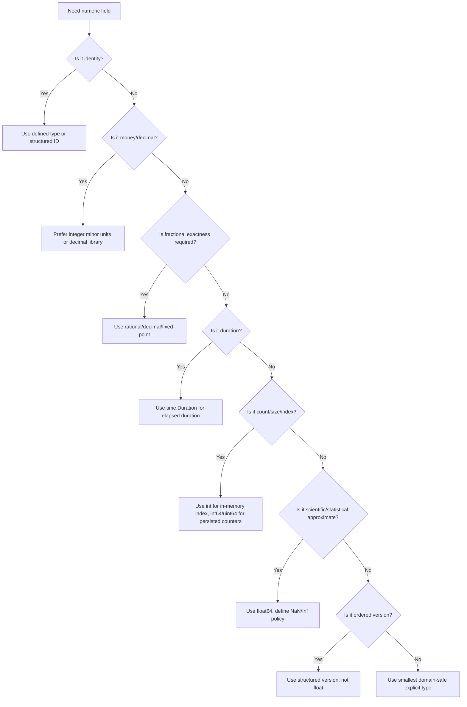
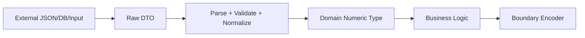
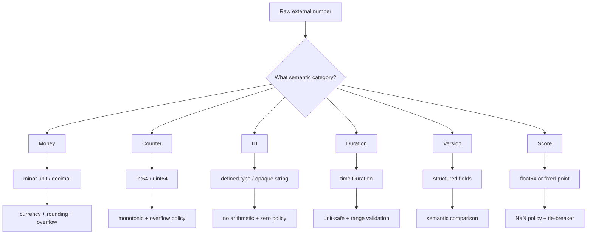
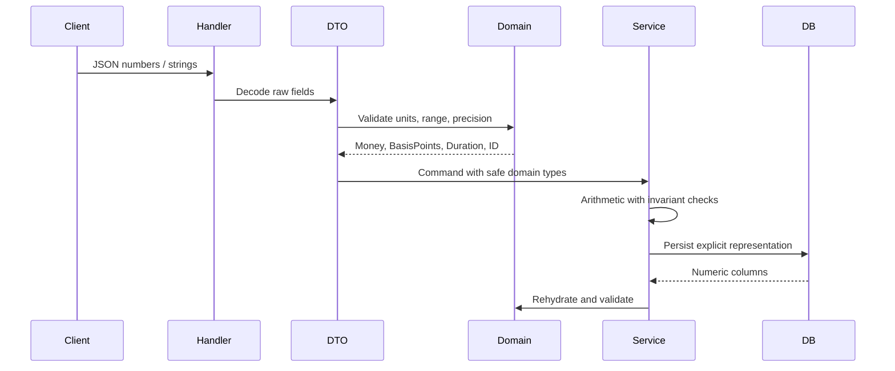

# learn-go-data-model-part-005.md

# Go Data Model — Part 005: Numeric Correctness — Money, Counter, ID, Duration, Version, Score

> Seri: `learn-go-data-model`  
> Part: `005 / 034`  
> Target pembaca: Java software engineer yang ingin memahami Go pada level production engineering handbook  
> Baseline: Go 1.26.x  
> Fokus: memilih, merancang, memvalidasi, menyimpan, membandingkan, dan mengirim data numerik dengan benar.

---

## 0. Posisi Part Ini dalam Seri

Part sebelumnya membahas fondasi numeric type: `int`, `uint`, fixed-width integer, float, overflow, conversion, `NaN`, `Inf`, signed zero, dan perbedaan typed vs untyped numeric value.

Part ini naik satu layer: **numeric correctness**.

Artinya, kita tidak lagi bertanya:

```text
Tipe angka apa saja yang tersedia di Go?
```

Kita bertanya:

```text
Untuk domain tertentu, representasi angka apa yang menjaga invariant,
aman terhadap overflow, stabil lintas boundary, mudah divalidasi,
dan tidak menimbulkan bug finansial, legal, compliance, ranking,
quota, pagination, timeout, atau versioning?
```

Dalam production system, angka jarang hanya “angka”. Angka biasanya adalah:

```text
- money amount
- tax amount
- rate
- percentage
- counter
- sequence number
- identifier
- duration
- deadline offset
- retry attempt
- priority
- rank
- version
- revision
- score
- quantity
- capacity
- size
- byte length
- page number
- limit
- offset
- shard number
- epoch
- checksum
```

Semua bentuk ini punya aturan domain yang berbeda. Memakai `int` atau `float64` karena “praktis” sering menjadi sumber bug.

---

## 1. Prinsip Utama: Numeric Type adalah Domain Contract

### 1.1 Mental model

Di Java, engineer sering membuat class/value object untuk domain number:

```java
record Money(BigDecimal amount, Currency currency) {}
record UserId(long value) {}
record Percentage(BigDecimal value) {}
```

Di Go, temptation-nya adalah memakai primitive langsung:

```go
amount := 10000
userID := int64(42)
rate := 0.15
```

Itu cepat, tetapi contract-nya hilang.

Lebih baik berpikir begini:

```text
Numeric representation = storage + arithmetic rule + boundary rule + invariant.
```

Contoh:

```text
Money
  storage     : int64 minor unit
  arithmetic : checked add/subtract/multiply-by-ratio
  boundary   : JSON string or integer minor unit
  invariant  : currency fixed, scale fixed, no float

Counter
  storage     : uint64 or int64 depending boundary
  arithmetic : monotonic increment with overflow guard
  boundary   : usually decimal string or int64 if safe
  invariant  : never negative, may saturate or fail on overflow

Version
  storage     : struct { Major, Minor, Patch uint32 }
  arithmetic : comparison lexicographic, not arithmetic addition
  boundary   : semantic string
  invariant  : stable ordering, no leading lossy conversion
```

### 1.2 Numeric smells

Jika codebase punya pola berikut, numeric correctness perlu diaudit:

```go
var amount float64
var id int
var version float64
var retryCount int
var timeout int
var percentage float64
var status int
var currencyAmount int
var score float64
```

Tidak semuanya salah. Tetapi semuanya harus ditanya:

```text
- Apakah unit-nya jelas?
- Apakah range-nya jelas?
- Apakah zero valid?
- Apakah negatif valid?
- Apakah overflow harus wrap, panic, saturate, atau error?
- Apakah boundary JSON/DB mempertahankan presisi?
- Apakah comparison-nya arithmetic, lexical, semantic, atau domain-specific?
```

---

## 2. Decision Tree: Memilih Numeric Representation



---

## 3. Money: Jangan Pakai `float64` untuk Uang

### 3.1 Masalah utama

`float64` adalah binary floating-point. Banyak decimal fraction tidak dapat direpresentasikan secara exact dalam binary.

Contoh klasik:

```go
package main

import "fmt"

func main() {
	fmt.Println(0.1 + 0.2)
	fmt.Println((0.1 + 0.2) == 0.3)
}
```

Output umum:

```text
0.30000000000000004
false
```

Untuk scientific computation, ini normal. Untuk uang, pajak, denda, fee, refund, dan settlement, ini berbahaya.

### 3.2 Representasi aman: minor unit integer

Untuk banyak sistem pembayaran, cara paling kuat adalah menyimpan nilai dalam minor unit:

```text
USD 10.25 -> 1025 cents
IDR 10000 -> 10000 rupiah, karena IDR tidak memakai decimal minor unit dalam praktik umum
JPY 500 -> 500 yen
```

Contoh Go:

```go
type Currency string

const (
	CurrencyUSD Currency = "USD"
	CurrencyIDR Currency = "IDR"
	CurrencyJPY Currency = "JPY"
)

type Money struct {
	minor    int64
	currency Currency
}

func NewMoneyMinor(currency Currency, minor int64) (Money, error) {
	if currency == "" {
		return Money{}, fmt.Errorf("currency is required")
	}
	return Money{minor: minor, currency: currency}, nil
}

func (m Money) Currency() Currency { return m.currency }
func (m Money) Minor() int64       { return m.minor }
```

### 3.3 Kenapa field dibuat unexported?

```go
type Money struct {
	minor    int64
	currency Currency
}
```

Bukan:

```go
type Money struct {
	Minor    int64
	Currency Currency
}
```

Karena exported field membiarkan caller membuat state yang mungkin invalid:

```go
m := Money{Minor: 1000, Currency: ""}
```

Untuk domain type yang membawa invariant, lebih aman gunakan constructor-like function dan method.

### 3.4 Addition harus currency-safe

```go
func (m Money) Add(other Money) (Money, error) {
	if m.currency != other.currency {
		return Money{}, fmt.Errorf("currency mismatch: %s vs %s", m.currency, other.currency)
	}

	v, ok := checkedAddInt64(m.minor, other.minor)
	if !ok {
		return Money{}, fmt.Errorf("money overflow")
	}

	return Money{minor: v, currency: m.currency}, nil
}

func checkedAddInt64(a, b int64) (int64, bool) {
	if b > 0 && a > math.MaxInt64-b {
		return 0, false
	}
	if b < 0 && a < math.MinInt64-b {
		return 0, false
	}
	return a + b, true
}
```

Jangan membuat:

```go
func (m Money) Add(other Money) Money {
	return Money{minor: m.minor + other.minor, currency: m.currency}
}
```

Karena:

```text
- currency mismatch tidak dicegah
- overflow tidak dicegah
- caller tidak tahu operasi bisa gagal
```

### 3.5 Multiplication by rate

Money sering dikalikan rate:

```text
subtotal * taxRate
principal * interestRate
amount * discountRate
```

Jangan langsung:

```go
tax := int64(float64(amount.Minor()) * 0.11)
```

Masalahnya:

```text
- binary floating-point precision
- rounding tidak eksplisit
- audit sulit
- behavior bisa berubah saat formula berubah
```

Lebih baik representasikan rate sebagai basis points atau rational.

#### Basis point

```text
1%    = 100 basis points
0.01% = 1 basis point
11%   = 1100 basis points
```

```go
type BasisPoints int64

func ApplyBasisPoints(amount Money, bp BasisPoints) (Money, error) {
	// amount.minor * bp / 10000
	// Need checked multiply and explicit rounding policy.
	product, ok := checkedMulInt64(amount.minor, int64(bp))
	if !ok {
		return Money{}, fmt.Errorf("money multiplication overflow")
	}

	// Example: round half away from zero.
	minor := divRoundHalfAwayFromZero(product, 10_000)
	return Money{minor: minor, currency: amount.currency}, nil
}
```

#### Explicit rounding policy

Rounding is domain policy. Jangan disembunyikan.

```go
type RoundingMode int

const (
	RoundDown RoundingMode = iota
	RoundUp
	RoundHalfAwayFromZero
	RoundHalfToEven
)
```

Dalam sistem finansial, rounding sering ditentukan oleh regulasi, kontrak, atau accounting policy. Treat it as business rule, not implementation detail.

### 3.6 Decimal library vs `math/big`

Go standard library menyediakan `math/big` untuk arbitrary-precision arithmetic: `big.Int`, `big.Rat`, dan `big.Float`. Itu berguna untuk exact integer/rational/high-precision computation, tetapi bukan selalu ergonomic sebagai decimal money type.

Untuk money, pilihan umum:

```text
1. int64 minor unit
   - paling sederhana
   - cepat
   - mudah disimpan di DB
   - bagus jika scale fixed per currency

2. decimal library
   - bagus untuk arbitrary decimal scale
   - lebih cocok untuk accounting/finance dengan banyak scale
   - perlu dependency governance

3. math/big.Rat
   - exact rational
   - bagus untuk formula dan intermediate calculation
   - bisa menghasilkan denominator besar
   - perlu explicit decimal output/rounding

4. math/big.Int fixed-point custom
   - kuat tetapi butuh discipline tinggi
```

### 3.7 Money boundary design

#### JSON sebagai integer minor unit

```json
{
  "amount_minor": 1025,
  "currency": "USD"
}
```

Kelebihan:

```text
- presisi aman
- mudah divalidasi
- tidak ambigu
```

Kekurangan:

```text
- caller harus tahu minor unit
- tidak human-friendly
```

#### JSON sebagai decimal string

```json
{
  "amount": "10.25",
  "currency": "USD"
}
```

Kelebihan:

```text
- human-friendly
- aman dari JSON number precision issue
```

Kekurangan:

```text
- parsing lebih kompleks
- scale harus divalidasi
```

#### Hindari JSON number untuk money besar/presisi tinggi

```json
{
  "amount": 10.25
}
```

Ini tampak nyaman, tetapi berisiko ketika melewati JavaScript, DB adapter, gateway, logging pipeline, atau schema evolution.

---

## 4. Percentage, Rate, Ratio

### 4.1 Jangan samakan semua fractional number

```text
Percentage = usually human display: 12.5%
Rate       = multiplier or per-unit measure: 0.125
Ratio      = numerator / denominator
BasisPoint = 1/100 of one percent
```

Salah satu bug umum: field bernama `rate` tetapi caller mengirim `12.5`, sementara service menganggap `0.125`.

### 4.2 Representasi yang lebih aman

```go
type BasisPoints int32

const (
	OnePercent BasisPoints = 100
	OneHundredPercent BasisPoints = 10_000
)

func NewBasisPoints(v int32) (BasisPoints, error) {
	if v < 0 || v > int32(OneHundredPercent) {
		return 0, fmt.Errorf("basis points out of range: %d", v)
	}
	return BasisPoints(v), nil
}
```

Untuk ratio umum:

```go
type Ratio struct {
	num int64
	den int64
}

func NewRatio(num, den int64) (Ratio, error) {
	if den == 0 {
		return Ratio{}, fmt.Errorf("denominator must not be zero")
	}
	if den < 0 {
		num = -num
		den = -den
	}
	return Ratio{num: num, den: den}, nil
}
```

### 4.3 Ratio comparison tanpa float

Jangan membandingkan ratio dengan convert ke float jika exactness penting.

```go
func (r Ratio) Less(other Ratio) bool {
	// r.num/r.den < other.num/other.den
	// Need overflow-safe cross multiplication for large values.
	return r.num*other.den < other.num*r.den
}
```

Untuk nilai besar, cross multiplication bisa overflow. Solusi:

```text
- gunakan math/big.Int untuk comparison
- batasi range num/den
- normalize/reduce ratio
- gunakan checked multiplication
```

---

## 5. Counter: Monotonic, Saturating, Failing, or Wrapping?

### 5.1 Counter bukan cuma integer

Counter punya semantic:

```text
- Can it be negative?
- Can it reset?
- Is it monotonic?
- What happens at overflow?
- Is it persisted?
- Is it distributed?
- Is it eventually consistent?
- Is it user-visible?
```

Contoh counter:

```text
- retry attempt
- failed login attempt
- API quota usage
- event sequence
- Kafka offset-like number
- Prometheus counter
- database revision
- message delivery count
```

### 5.2 `int` vs `int64` vs `uint64`

Rule praktis:

```text
Use int:
  - in-memory length/index/count yang dekat dengan len/cap/slice
  - loop local
  - not persisted
  - not protocol field

Use int64:
  - persisted counter
  - JSON/API counter
  - database integer
  - distributed system boundary
  - negative value possible or easier interop needed

Use uint64:
  - bit-level/protocol/counter where unsigned is intrinsic
  - hash/checksum/sequence space
  - very large monotonic counter
  - but be careful with JSON/DB/language interop
```

### 5.3 Overflow policy

Ada empat policy umum:

```text
1. wrap
   - value silently wraps around
   - cocok untuk hash, checksum, some low-level ring sequence
   - buruk untuk money, quota, retry, version

2. fail
   - return error if overflow
   - cocok untuk domain correctness

3. saturate
   - clamp to Max
   - cocok untuk approximate metrics, rate limiter ceilings, display

4. panic
   - cocok untuk programmer error internal invariant
   - buruk untuk user input boundary
```

### 5.4 Checked increment

```go
type Counter int64

func (c Counter) Inc() (Counter, error) {
	if c == Counter(math.MaxInt64) {
		return 0, fmt.Errorf("counter overflow")
	}
	return c + 1, nil
}
```

### 5.5 Saturating increment

```go
func (c Counter) SaturatingInc() Counter {
	if c == Counter(math.MaxInt64) {
		return c
	}
	return c + 1
}
```

### 5.6 Atomic counter

Untuk shared counter:

```go
type AtomicCounter struct {
	v atomic.Int64
}

func (c *AtomicCounter) Inc() (int64, error) {
	for {
		old := c.v.Load()
		if old == math.MaxInt64 {
			return 0, fmt.Errorf("counter overflow")
		}
		if c.v.CompareAndSwap(old, old+1) {
			return old + 1, nil
		}
	}
}
```

Catatan: atomic correctness bukan domain correctness. Atomic hanya menjawab race. Ia tidak menjawab apakah overflow, reset, monotonicity, atau distributed consistency benar.

---

## 6. ID: Identifier Bukan Angka untuk Dihitung

### 6.1 ID smell

```go
func LoadUser(id int64) {}
func LoadOrder(id int64) {}
```

Bug yang mungkin terjadi:

```go
var orderID int64 = 100
LoadUser(orderID) // compiles
```

Gunakan defined type:

```go
type UserID int64
type OrderID int64

func LoadUser(id UserID) {}
func LoadOrder(id OrderID) {}
```

Sekarang:

```go
var orderID OrderID = 100
LoadUser(orderID) // compile error
```

Ini adalah contoh “compiler as reviewer”.

### 6.2 ID sebaiknya tidak punya arithmetic API

Walaupun underlying type-nya `int64`, jangan perlakukan ID sebagai number biasa.

```go
type UserID int64

func (id UserID) Next() UserID { return id + 1 } // often wrong outside sequence generator
```

Lebih aman:

```go
func (id UserID) IsZero() bool { return id == 0 }
func (id UserID) String() string { return strconv.FormatInt(int64(id), 10) }
```

### 6.3 Zero ID policy

Tentukan apakah `0` valid.

```text
Option A: 0 invalid
  - useful for DB autoincrement IDs
  - zero value can mean “not persisted”

Option B: 0 valid
  - useful for protocol fields where zero is legitimate
  - need separate validity marker if optional
```

Contoh:

```go
type UserID int64

func NewUserID(v int64) (UserID, error) {
	if v <= 0 {
		return 0, fmt.Errorf("invalid user id: %d", v)
	}
	return UserID(v), nil
}
```

### 6.4 String ID vs numeric ID

Numeric ID:

```text
Pros:
- compact
- sortable if monotonic
- DB efficient
- easy indexing

Cons:
- enumeration risk
- JSON precision issue for very large values
- cross-service type confusion
```

String ID:

```text
Pros:
- safe for JSON/JavaScript
- can encode type prefix
- easier external API stability
- avoids numeric precision issue

Cons:
- larger
- slower compare/index than integer
- validation required
```

Example:

```go
type UserID string

func NewUserID(s string) (UserID, error) {
	if !strings.HasPrefix(s, "usr_") {
		return "", fmt.Errorf("invalid user id prefix")
	}
	return UserID(s), nil
}
```

### 6.5 Public API recommendation

For external APIs, prefer opaque string IDs unless there is strong reason not to:

```json
{
  "user_id": "usr_01JZ8Q9R6RZP9R6X6JX4T8F0TN"
}
```

For internal DB primary key, numeric can still be fine:

```sql
user_id BIGINT PRIMARY KEY
```

Bridge them intentionally:

```go
type InternalUserID int64
type PublicUserID string
```

---

## 7. Duration: Time Length Bukan Timestamp

### 7.1 Gunakan `time.Duration` untuk elapsed duration

`time.Duration` adalah signed integer duration dengan nanosecond resolution.

```go
var timeout time.Duration = 5 * time.Second
```

Jangan:

```go
timeout := 5000 // milliseconds? seconds? unknown
```

### 7.2 Boundary config

Bad:

```yaml
timeout: 5000
```

Better:

```yaml
timeout: 5s
```

Go:

```go
func ParseTimeout(s string) (time.Duration, error) {
	d, err := time.ParseDuration(s)
	if err != nil {
		return 0, err
	}
	if d <= 0 {
		return 0, fmt.Errorf("timeout must be positive")
	}
	if d > 30*time.Second {
		return 0, fmt.Errorf("timeout too large")
	}
	return d, nil
}
```

### 7.3 Duration vs deadline vs timestamp

```text
Duration:
  5 seconds, 30 minutes, 24 hours

Timestamp:
  2026-06-22T10:00:00Z

Deadline:
  operation must finish before a timestamp

TTL:
  item expires duration after creation or at absolute expiry time
```

Do not use one field for all.

```go
type JobLease struct {
	AcquiredAt time.Time
	TTL        time.Duration
}

func (l JobLease) ExpiresAt() time.Time {
	return l.AcquiredAt.Add(l.TTL)
}
```

### 7.4 Avoid custom int duration unless boundary-specific

Acceptable at boundary:

```go
type Request struct {
	TimeoutMillis int64 `json:"timeout_ms"`
}
```

Internal model:

```go
type Command struct {
	Timeout time.Duration
}
```

Convert at edge:

```go
func (r Request) ToCommand() (Command, error) {
	if r.TimeoutMillis <= 0 {
		return Command{}, fmt.Errorf("timeout_ms must be positive")
	}
	return Command{Timeout: time.Duration(r.TimeoutMillis) * time.Millisecond}, nil
}
```

### 7.5 Calendar duration is not always `time.Duration`

`24*time.Hour` is not always “tomorrow at same local clock time” when daylight saving time exists. For elapsed time, use `time.Duration`. For calendar rules, use `time.Time.AddDate` and explicit `Location`.

This matters for:

```text
- billing cycle
- compliance deadline
- SLA day count
- renewal date
- subscription month
- legal due date
```

---

## 8. Version: Jangan Pakai Float

### 8.1 Classic bug

```text
1.10 > 1.9 semantically
```

Tetapi jika versi diperlakukan sebagai float:

```text
1.10 == 1.1
1.9 > 1.10 as float comparison
```

Version bukan number arithmetic. Version adalah structured ordered value.

### 8.2 Semantic version struct

```go
type Version struct {
	Major uint32
	Minor uint32
	Patch uint32
}

func (v Version) Compare(o Version) int {
	switch {
	case v.Major != o.Major:
		return cmp.Compare(v.Major, o.Major)
	case v.Minor != o.Minor:
		return cmp.Compare(v.Minor, o.Minor)
	case v.Patch != o.Patch:
		return cmp.Compare(v.Patch, o.Patch)
	default:
		return 0
	}
}
```

### 8.3 Version is compatibility data

Version appears in:

```text
- API version
- schema version
- event version
- config version
- migration version
- document revision
- optimistic locking revision
```

Each has different semantics.

```text
API version:
  compatibility surface

Schema version:
  migration/decoder selection

Event version:
  consumer compatibility

Revision:
  concurrency control
```

Do not reuse one numeric type for all.

### 8.4 Revision number

```go
type Revision int64

func NewRevision(v int64) (Revision, error) {
	if v < 0 {
		return 0, fmt.Errorf("revision must not be negative")
	}
	return Revision(v), nil
}

func (r Revision) Next() (Revision, error) {
	if r == Revision(math.MaxInt64) {
		return 0, fmt.Errorf("revision overflow")
	}
	return r + 1, nil
}
```

Revision is arithmetic. Semantic version is structured comparison. Keep them separate.

---

## 9. Score, Ranking, Priority

### 9.1 Score may be approximate, but ordering must be defined

Scores appear in:

```text
- search ranking
- fraud risk
- ML model output
- priority queue
- severity scoring
- quality score
- match score
```

Often `float64` is acceptable. But you must define:

```text
- valid range
- NaN policy
- Inf policy
- rounding/display policy
- tie-breaker
- stable ordering requirement
```

### 9.2 NaN breaks ordinary ordering

```go
x := math.NaN()
fmt.Println(x == x) // false
fmt.Println(x < 1)  // false
fmt.Println(x > 1)  // false
```

If score can become NaN, sorting can become unstable or logically broken.

### 9.3 Score wrapper

```go
type Score float64

func NewScore(v float64) (Score, error) {
	if math.IsNaN(v) {
		return 0, fmt.Errorf("score must not be NaN")
	}
	if math.IsInf(v, 0) {
		return 0, fmt.Errorf("score must be finite")
	}
	if v < 0 || v > 1 {
		return 0, fmt.Errorf("score out of range: %f", v)
	}
	return Score(v), nil
}
```

### 9.4 Stable ranking

Bad:

```go
sort.Slice(items, func(i, j int) bool {
	return items[i].Score > items[j].Score
})
```

If scores equal, output may depend on input order. For API response, this can cause flaky tests and nondeterministic pagination.

Better:

```go
sort.Slice(items, func(i, j int) bool {
	if items[i].Score != items[j].Score {
		return items[i].Score > items[j].Score
	}
	return items[i].ID < items[j].ID
})
```

For float score, avoid direct equality if computation can introduce small differences. Consider quantized integer score:

```go
type ScoreMicros int64 // 1.0 = 1_000_000
```

This gives deterministic ordering and easier storage.

---

## 10. Quantity, Capacity, Size

### 10.1 Unit must be part of the contract

Bad:

```go
type UploadLimit struct {
	MaxSize int64
}
```

Better:

```go
type Bytes int64

type UploadLimit struct {
	MaxSize Bytes
}
```

Or at boundary:

```go
type UploadLimitRequest struct {
	MaxSizeBytes int64 `json:"max_size_bytes"`
}
```

### 10.2 Binary vs decimal units

```text
KB often means 1000 bytes
KiB means 1024 bytes
MB often means 1000^2 bytes
MiB means 1024^2 bytes
```

Be explicit in config and docs.

```go
const (
	KiB Bytes = 1024
	MiB Bytes = 1024 * KiB
	GiB Bytes = 1024 * MiB
)
```

### 10.3 Size validation

```go
func NewBytes(v int64) (Bytes, error) {
	if v < 0 {
		return 0, fmt.Errorf("size must not be negative")
	}
	return Bytes(v), nil
}
```

### 10.4 `len` returns `int`

Go’s `len` returns `int`. For slice/string/map length, use `int` locally.

```go
n := len(buf) // int
```

For persisted or API boundary, convert intentionally:

```go
size := int64(len(buf))
```

On 64-bit platforms this is usually safe. On 32-bit, `int` max is smaller. If your system handles very large buffers or file sizes, use explicit `int64` at boundaries.

---

## 11. Sentinel Number Anti-Pattern

### 11.1 Common examples

```go
const NotFound = -1
const Unlimited = -1
const Unknown = 0
const DefaultTimeout = 0
```

Sentinel numbers can be valid, but they need strict boundary design.

### 11.2 Why sentinel numbers are dangerous

```text
- unclear meaning outside local context
- can collide with valid domain values
- leaks implementation detail into API
- makes validation ambiguous
- makes zero value ambiguous
- hard to evolve
```

### 11.3 Prefer explicit type state

Bad:

```go
type Limit int

const Unlimited Limit = -1
```

Better:

```go
type Limit struct {
	value     int
	unlimited bool
}

func NewLimit(v int) (Limit, error) {
	if v <= 0 {
		return Limit{}, fmt.Errorf("limit must be positive")
	}
	return Limit{value: v}, nil
}

func UnlimitedLimit() Limit {
	return Limit{unlimited: true}
}
```

Or use pointer/optional-like field at boundary:

```go
type SearchRequest struct {
	Limit *int `json:"limit,omitempty"`
}
```

But do not let pointer optionality leak everywhere. Convert into domain type near boundary.

---

## 12. Boundary Validation Pattern

### 12.1 Layered model



### 12.2 Example: API request

External request:

```json
{
  "amount_minor": 10000,
  "currency": "IDR",
  "discount_bp": 1250,
  "timeout_ms": 5000,
  "limit": 100
}
```

Raw DTO:

```go
type CreateInvoiceRequest struct {
	AmountMinor int64  `json:"amount_minor"`
	Currency    string `json:"currency"`
	DiscountBP  int32  `json:"discount_bp"`
	TimeoutMS   int64  `json:"timeout_ms"`
	Limit       int    `json:"limit"`
}
```

Domain command:

```go
type CreateInvoiceCommand struct {
	Amount   Money
	Discount BasisPoints
	Timeout  time.Duration
	Limit    Limit
}
```

Conversion:

```go
func (r CreateInvoiceRequest) ToCommand() (CreateInvoiceCommand, error) {
	amount, err := NewMoneyMinor(Currency(r.Currency), r.AmountMinor)
	if err != nil {
		return CreateInvoiceCommand{}, fmt.Errorf("amount: %w", err)
	}

	discount, err := NewBasisPoints(r.DiscountBP)
	if err != nil {
		return CreateInvoiceCommand{}, fmt.Errorf("discount_bp: %w", err)
	}

	if r.TimeoutMS <= 0 || r.TimeoutMS > 30_000 {
		return CreateInvoiceCommand{}, fmt.Errorf("timeout_ms out of range")
	}
	timeout := time.Duration(r.TimeoutMS) * time.Millisecond

	limit, err := NewLimit(r.Limit)
	if err != nil {
		return CreateInvoiceCommand{}, fmt.Errorf("limit: %w", err)
	}

	return CreateInvoiceCommand{
		Amount:   amount,
		Discount: discount,
		Timeout:  timeout,
		Limit:    limit,
	}, nil
}
```

The important design point:

```text
Raw number is accepted only at the edge.
Domain logic sees named types with validated invariants.
```

---

## 13. Checked Arithmetic Utilities

### 13.1 Why not rely on runtime overflow panic?

Go integer operations can overflow at runtime according to fixed-width integer semantics. For domain-critical arithmetic, do not rely on accidental wrap behavior.

### 13.2 Checked add for int64

```go
func CheckedAddInt64(a, b int64) (int64, bool) {
	if b > 0 && a > math.MaxInt64-b {
		return 0, false
	}
	if b < 0 && a < math.MinInt64-b {
		return 0, false
	}
	return a + b, true
}
```

### 13.3 Checked subtract

```go
func CheckedSubInt64(a, b int64) (int64, bool) {
	if b < 0 && a > math.MaxInt64+b {
		return 0, false
	}
	if b > 0 && a < math.MinInt64+b {
		return 0, false
	}
	return a - b, true
}
```

### 13.4 Checked multiply

```go
func CheckedMulInt64(a, b int64) (int64, bool) {
	if a == 0 || b == 0 {
		return 0, true
	}
	if a == math.MinInt64 && b == -1 {
		return 0, false
	}
	if b == math.MinInt64 && a == -1 {
		return 0, false
	}

	v := a * b
	if v/b != a {
		return 0, false
	}
	return v, true
}
```

### 13.5 Using `math/bits` for unsigned arithmetic

For unsigned low-level code, `math/bits` provides carry/overflow-aware operations.

```go
sum, carry := bits.Add64(a, b, 0)
if carry != 0 {
	return 0, fmt.Errorf("uint64 overflow")
}
```

Use this for:

```text
- hash/math internals
- big integer implementation
- protocol arithmetic
- high-performance checked unsigned arithmetic
```

---

## 14. JSON Precision and Numeric Interop

### 14.1 JSON number is not enough as a contract

JSON itself has “number”, but implementations vary. JavaScript represents numbers as IEEE 754 double. Large integers above `2^53-1` cannot be represented exactly in JavaScript Number.

If your Go API returns:

```json
{
  "id": 9223372036854775807
}
```

A JavaScript client may lose precision.

### 14.2 Safer choices

For large IDs:

```json
{
  "id": "9223372036854775807"
}
```

For money:

```json
{
  "amount_minor": 10000,
  "currency": "IDR"
}
```

Or:

```json
{
  "amount": "10000",
  "currency": "IDR"
}
```

For percentage:

```json
{
  "discount_bp": 1250
}
```

For duration:

```json
{
  "timeout_ms": 5000
}
```

Or config-friendly:

```json
{
  "timeout": "5s"
}
```

### 14.3 Versioning boundary fields

Once exposed, changing numeric representation is breaking.

Breaking:

```json
{ "amount": 10.25 }
```

To:

```json
{ "amount_minor": 1025 }
```

Better initial design:

```json
{
  "amount": {
    "minor": 1025,
    "currency": "USD"
  }
}
```

Or:

```json
{
  "amount": "10.25",
  "currency": "USD"
}
```

---

## 15. Database Numeric Boundary

### 15.1 Common mapping

```text
Go int64       -> BIGINT
Go int32       -> INTEGER
Money minor    -> BIGINT + currency
Decimal string -> DECIMAL/NUMERIC or TEXT depending DB strategy
time.Duration  -> BIGINT milliseconds/nanoseconds or interval-like DB type
Version        -> TEXT or separate integer columns
Score          -> DOUBLE PRECISION or fixed integer score
```

### 15.2 Money in DB

Recommended simple schema:

```sql
amount_minor BIGINT NOT NULL,
currency CHAR(3) NOT NULL
```

For complex decimal accounting:

```sql
amount NUMERIC(38, 9) NOT NULL,
currency CHAR(3) NOT NULL
```

If using `NUMERIC`, define:

```text
- precision
- scale
- rounding policy
- driver scan strategy
- string representation
- migration compatibility
```

### 15.3 Do not let DB `NULL` become accidental zero

Bad:

```go
var discountBP int32
row.Scan(&discountBP)
```

If DB value is nullable, use explicit null handling:

```go
var discount sql.NullInt32
row.Scan(&discount)

if discount.Valid {
	bp, err := NewBasisPoints(discount.Int32)
	// ...
}
```

Or define a custom nullable domain type.

---

## 16. Numeric Domain Types: Design Patterns

### 16.1 Defined scalar type

Use when invariant is light and operations are simple:

```go
type RetryAttempt int

type PageLimit int

type UserID int64
```

### 16.2 Struct wrapper

Use when invariant needs multiple fields or optional state:

```go
type Money struct {
	minor    int64
	currency Currency
}
```

### 16.3 Opaque type with constructor

Use when invalid values must be prevented:

```go
type Port uint16

func NewPort(v int) (Port, error) {
	if v < 1 || v > 65535 {
		return 0, fmt.Errorf("invalid port: %d", v)
	}
	return Port(v), nil
}
```

### 16.4 Boundary DTO + domain type

Use for external input:

```go
type Request struct {
	Port int `json:"port"`
}

type Config struct {
	Port Port
}
```

### 16.5 Phantom-like separation through type names

```go
type CustomerID int64
type AccountID int64
type InvoiceID int64
```

This prevents cross-entity bugs without runtime cost.

---

## 17. Production Numeric Checklist

For every numeric field, answer these:

```text
Identity
- Is this value an ID, count, amount, ratio, score, version, or duration?
- Is arithmetic meaningful?

Unit
- What unit does it represent?
- Is the unit encoded in name/type?
- Is conversion explicit?

Range
- Minimum?
- Maximum?
- Is zero valid?
- Are negative values valid?

Precision
- Is exactness required?
- Is approximation acceptable?
- Is rounding explicit?

Overflow
- Can operation overflow?
- Should overflow wrap, fail, saturate, or panic?

Boundary
- How is it represented in JSON?
- How is it represented in DB?
- Can JavaScript clients preserve it?
- Can logs preserve it?

Comparison
- Is equality exact?
- Is ordering total?
- What about NaN/Inf?
- Is tie-breaking stable?

Compatibility
- If public, can representation evolve?
- Is semantic versioning affected?

Concurrency
- Can multiple goroutines mutate it?
- Is atomic enough, or is higher-level invariant needed?
```

---

## 18. Mini Labs

### Lab 1: Money type

Implement:

```go
type Money struct {
	minor    int64
	currency Currency
}
```

Required:

```text
- constructor validates currency
- Add checks currency and overflow
- Sub checks currency and overflow
- ApplyBasisPoints with explicit rounding mode
- JSON output as {"amount_minor":...,"currency":"..."}
```

Test:

```text
- currency mismatch
- max int overflow
- negative amount if allowed
- zero value behavior
- JSON roundtrip
```

### Lab 2: ID safety

Create:

```go
type UserID int64
type OrderID int64
```

Then prove compile-time protection:

```go
func LoadUser(UserID) {}
func LoadOrder(OrderID) {}
```

Attempt passing `OrderID` to `LoadUser` and observe compile error.

### Lab 3: Duration boundary

Implement config parsing:

```yaml
timeout: 5s
retry_delay: 250ms
max_age: 24h
```

Rules:

```text
- timeout > 0 and <= 30s
- retry_delay >= 10ms and <= 5s
- max_age must be calendar-safe if business-day based
```

### Lab 4: Ranking determinism

Given:

```go
type Item struct {
	ID    string
	Score float64
}
```

Implement stable ordering:

```text
- reject NaN
- reject Inf
- higher score first
- tie-break by ID ascending
```

### Lab 5: Sentinel removal

Refactor:

```go
const Unlimited = -1

type Config struct {
	Limit int
}
```

Into a domain-safe type:

```go
type Limit struct {
	value     int
	unlimited bool
}
```

---

## 19. Common Anti-Patterns

### 19.1 Float money

```go
amount := 10.25
```

Problem:

```text
- not exact
- rounding hidden
- audit weak
```

### 19.2 Generic `int` for external IDs

```go
func GetUser(id int) {}
```

Problem:

```text
- platform-width dependent
- no domain separation
- weak boundary contract
```

### 19.3 Version as float

```go
version := 1.10
```

Problem:

```text
- equals 1.1
- loses semantic ordering
```

### 19.4 Timeout as naked integer

```go
Timeout: 5000
```

Problem:

```text
- unit ambiguous
- conversion repeated
```

### 19.5 Sentinel `-1` everywhere

```go
if limit == -1 { ... }
```

Problem:

```text
- unclear
- leaks special state
- invalid values spread
```

### 19.6 Atomic counter as business invariant

```go
atomic.AddInt64(&quota, 1)
```

Problem:

```text
- atomicity does not mean quota correctness
- no overflow policy
- no distributed consistency
```

---

## 20. Java Engineer Translation Table

| Java instinct | Go production alternative | Reason |
|---|---|---|
| `BigDecimal` for all money | `int64` minor unit or decimal library | Simpler if scale fixed |
| `long id` everywhere | `type UserID int64` | Compiler catches cross-ID bugs |
| `double score` | `type Score float64` + validation | Reject NaN/Inf, define range |
| `Duration.ofMillis(5000)` | `5 * time.Second` | Unit-safe internal representation |
| `int version = 2` | `SchemaVersion`, `Revision`, or structured `Version` | Different version semantics |
| `-1 means unlimited` | explicit `Limit` type | Avoid sentinel leakage |
| Runtime validation only | constructor-like function + unexported fields | Preserve invariant after creation |
| Primitive DTO reused as domain | DTO-to-domain conversion | Edge validation and clean core |

---

## 21. Design Heuristics

### 21.1 Use primitive locally, domain type at boundary

Inside tight local loop:

```go
for i := 0; i < len(xs); i++ {
	// int is fine
}
```

At domain boundary:

```go
type PageLimit int
```

### 21.2 Make illegal arithmetic impossible

ID should not be addable casually.

Money should not add across currencies.

Version should not be divided.

Duration should not be mixed with timestamp.

### 21.3 Prefer explicit conversion cost over implicit bug

Go makes numeric conversion explicit. Preserve that spirit in your domain model.

```go
func NewUserID(v int64) (UserID, error)
func (id UserID) Int64() int64
```

### 21.4 Encode units in names or types

Good:

```go
Timeout time.Duration
AmountMinor int64
SizeBytes int64
DiscountBP int32
```

Better:

```go
Timeout Duration
Amount Money
Size Bytes
Discount BasisPoints
```

### 21.5 Validate once, then trust domain object

Bad:

```go
func Process(amount int64, currency string) error {
	if currency == "" { ... }
	// repeated everywhere
}
```

Better:

```go
func Process(amount Money) error {
	// invariant already held
}
```

---

## 22. End-to-End Example: Invoice Numeric Model

```go
type Currency string

const (
	CurrencyIDR Currency = "IDR"
	CurrencyUSD Currency = "USD"
)

type Money struct {
	minor    int64
	currency Currency
}

type BasisPoints int32

type InvoiceID string

type Revision int64

type Invoice struct {
	ID        InvoiceID
	Subtotal  Money
	Discount  BasisPoints
	Tax       BasisPoints
	Revision  Revision
	ExpiresIn time.Duration
}
```

### Why this is better than primitive model

Primitive model:

```go
type Invoice struct {
	ID        string
	Subtotal  float64
	Discount  float64
	Tax       float64
	Revision  int
	ExpiresIn int
}
```

Problems:

```text
- Subtotal precision unclear
- Discount 10 or 0.10 ambiguity
- Tax rounding hidden
- Revision range unclear
- ExpiresIn unit unclear
- ID type not domain separated
```

Domain model:

```text
- Money stores exact minor unit and currency
- BasisPoints makes rate unit explicit
- Revision is not confused with version
- time.Duration preserves unit internally
- InvoiceID can be opaque external ID
```

---

## 23. Mermaid: Numeric Domain Pipeline



---

## 24. Mermaid: Edge-to-Core Numeric Safety



---

## 25. What Top Engineers Pay Attention To

A strong Go engineer does not ask only:

```text
Should I use int or int64?
```

They ask:

```text
What invariant does this number carry?
What unit does it use?
Can it cross a boundary?
Will JavaScript preserve it?
Can the DB represent it?
Can it overflow?
Is zero meaningful?
Can negative happen?
Is arithmetic allowed?
Is comparison total?
Does concurrency change correctness?
Will this public representation survive five years?
```

The top 1% distinction is not knowing more numeric types. It is treating each numeric value as a **contract under change, scale, interop, and failure**.

---

## 26. Part Summary

Key conclusions:

```text
- Money should not use float64.
- Rate/percentage must encode unit explicitly.
- Counter must define overflow policy.
- ID should be a domain type, not generic integer.
- Duration should use time.Duration internally.
- Version should be structured, not float.
- Score must define NaN/Inf/range/tie-break behavior.
- Sentinel numbers should be replaced with explicit state when domain-critical.
- Raw numeric DTO should be converted into validated domain type at boundary.
- Numeric correctness is API design, not just arithmetic.
```

---

## 27. References

- Go Language Specification — numeric types, constants, operators, assignability, conversion: <https://go.dev/ref/spec>
- Go 1.26 Release Notes: <https://go.dev/doc/go1.26>
- Go `math/big` package — arbitrary-precision arithmetic: <https://pkg.go.dev/math/big>
- Go `math` package — floating-point helpers such as `IsNaN`, `IsInf`: <https://pkg.go.dev/math>
- Go `math/bits` package — carry/overflow-aware unsigned arithmetic helpers: <https://pkg.go.dev/math/bits>
- Go `time` package — `time.Duration`, parsing, formatting, calendar behavior: <https://pkg.go.dev/time>
- Go Blog: Constants: <https://go.dev/blog/constants>

---

## 28. Status Seri

Part ini adalah `005 / 034`.

Seri belum selesai.

Part berikutnya:

```text
learn-go-data-model-part-006.md
Text Model I: byte, rune, string, UTF-8, dan Unicode Reality
```

<!-- NAVIGATION_FOOTER -->
<div class="page-nav">
<a href="./learn-go-data-model-part-004.md">⬅️ Part 004 — Boolean, Integer, Float, Complex: Numeric Foundations</a>
<a href="./index.md">📚 Kategori</a>
<a href="../../index.md">🏠 Home</a>
<a href="./learn-go-data-model-part-006.md">Part 006 — Text Model I: `byte`, `rune`, `string`, UTF-8, dan Unicode Reality ➡️</a>
</div>
