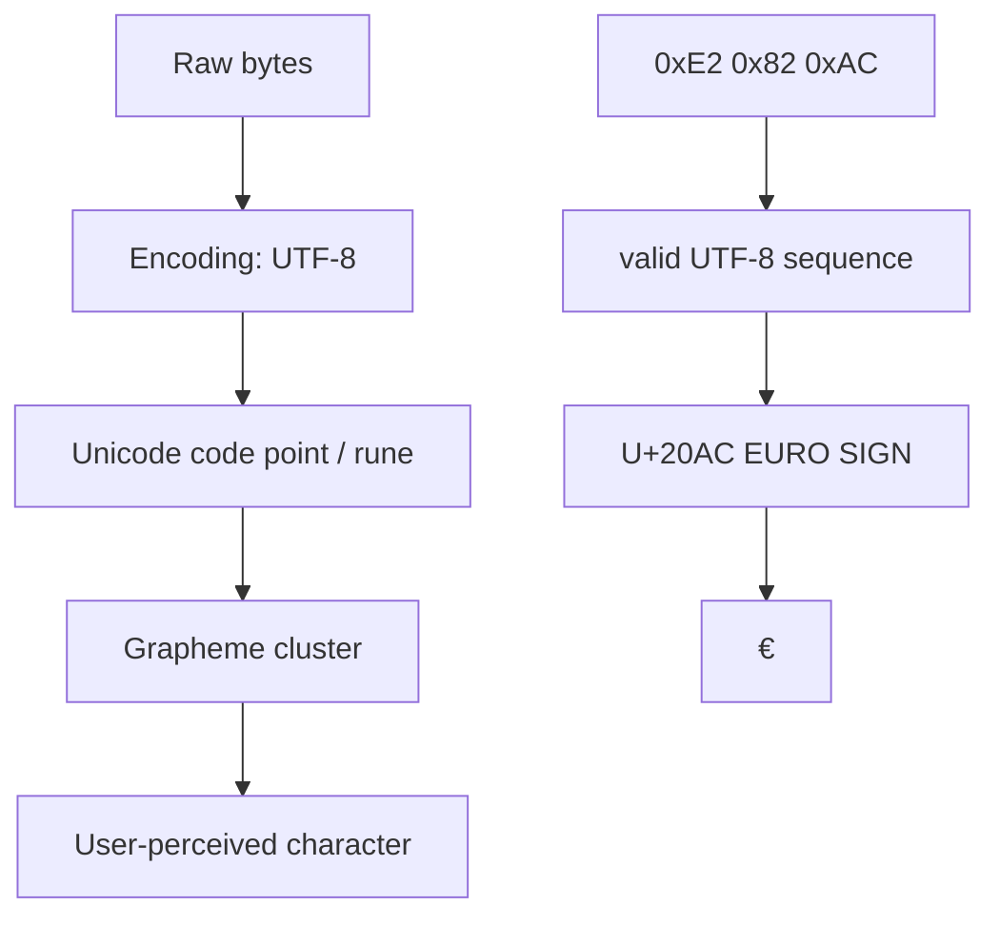
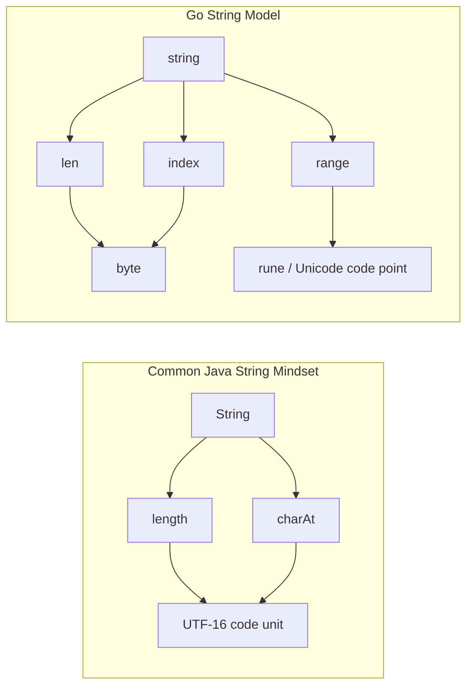
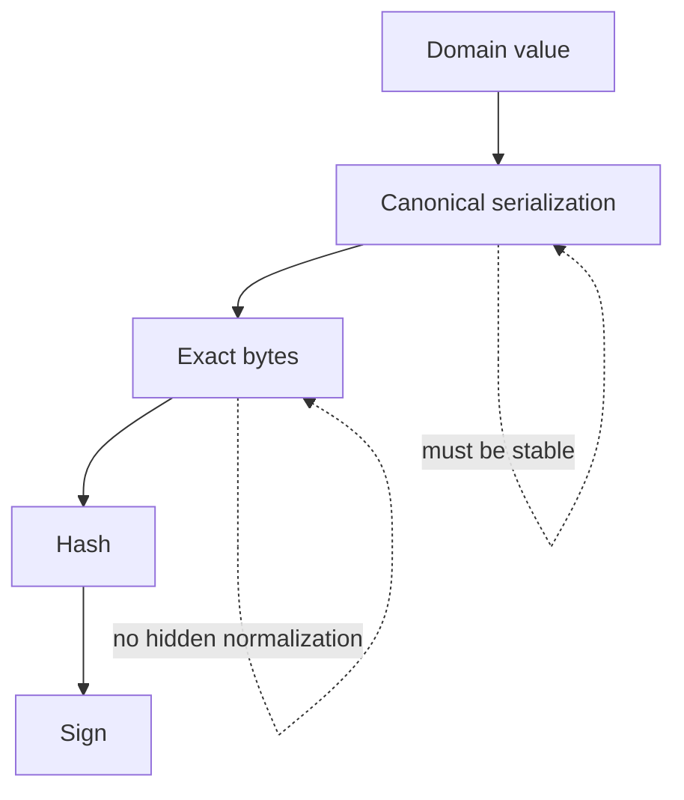
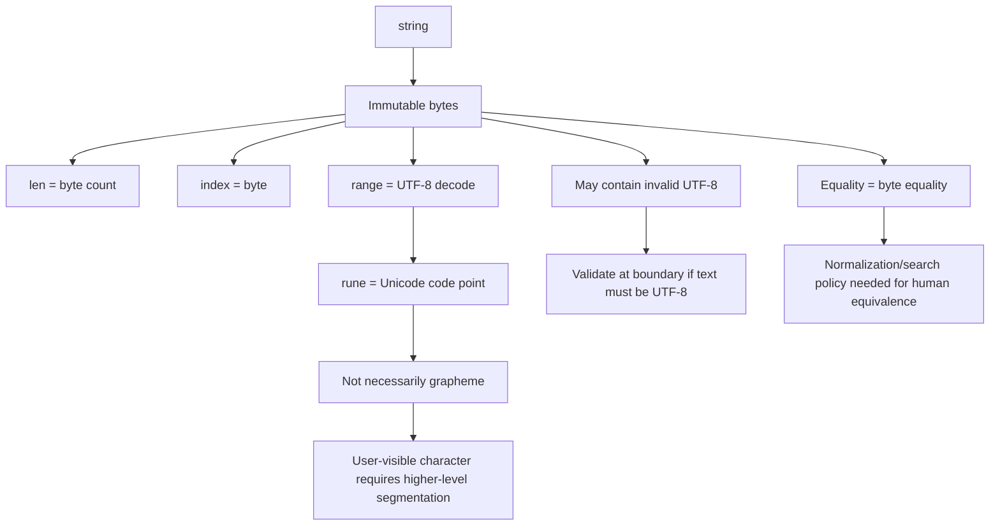

# learn-go-data-model-part-006.md

# Part 006 — Text Model I: `byte`, `rune`, `string`, UTF-8, dan Unicode Reality

> Seri: `learn-go-data-model`  
> Bagian: `006 / 034`  
> Target pembaca: Java software engineer yang ingin memahami Go text model sampai level production engineering.  
> Baseline: Go 1.26.x.  
> Fokus: mental model, correctness, multilingual systems, boundary design, dan bug yang sering muncul ketika string dianggap sebagai “array of characters”.

---

## 0. Ringkasan Cepat

Di Go, `string` **bukan** array of character. `string` adalah **immutable sequence of bytes**.

Secara praktis, Go source code dan string literal umumnya memakai UTF-8, dan operasi `range` terhadap string melakukan decoding UTF-8 menjadi `rune`. Namun, nilai `string` itu sendiri dapat berisi byte apa pun, termasuk byte yang bukan UTF-8 valid.

Mental model yang benar:

```text
string = immutable byte sequence
byte   = alias untuk uint8
rune   = alias untuk int32, biasanya merepresentasikan Unicode code point
len(s) = jumlah byte, bukan jumlah karakter manusia
range  = decode UTF-8 menjadi rune, invalid sequence menjadi RuneError
```

Kesalahan paling mahal dalam production text system biasanya bukan karena tidak tahu syntax, tetapi karena mencampur empat level berbeda:

```text
byte
→ UTF-8 encoded code point
→ Unicode code point / rune
→ grapheme cluster / user-perceived character
```

Contoh sederhana:

```go
s := "é"
fmt.Println(len(s))         // 2 byte dalam UTF-8
fmt.Println(len([]rune(s))) // 1 code point
```

Tetapi:

```go
s1 := "é"       // U+00E9 LATIN SMALL LETTER E WITH ACUTE
s2 := "e\u0301" // U+0065 LATIN SMALL LETTER E + U+0301 COMBINING ACUTE ACCENT

fmt.Println(s1 == s2)         // false
fmt.Println(len([]rune(s1)))  // 1
fmt.Println(len([]rune(s2)))  // 2
```

Bagi manusia, dua string itu bisa terlihat sama. Bagi Go, keduanya byte sequence berbeda.

---

## 1. Kenapa Text Model Penting?

Banyak engineer menganggap string sebagai hal sederhana. Di production system, asumsi itu berbahaya.

Text menyentuh:

- username;
- search query;
- audit trail;
- legal name;
- address;
- email display name;
- report filename;
- CSV export;
- JSON payload;
- database collation;
- token parsing;
- log redaction;
- byte limit API gateway;
- UI length limit;
- signature canonicalization;
- fraud detection;
- identity matching;
- multilingual regulatory documents.

Bug text sering muncul sebagai:

```text
- validasi panjang salah;
- substring memotong di tengah UTF-8 sequence;
- tampilan UI rusak;
- pencarian nama gagal;
- duplicate identity tidak terdeteksi;
- audit trail terlihat sama tetapi byte berbeda;
- signature mismatch;
- JSON/database berbeda encoding assumption;
- log redaction gagal karena normalization berbeda;
- emoji dihitung salah;
- combining mark dianggap karakter terpisah;
- invalid UTF-8 masuk dari boundary eksternal.
```

Di Java, banyak engineer terbiasa dengan `String` sebagai sequence of UTF-16 code units. Di Go, pendekatannya berbeda: `string` lebih dekat ke immutable byte sequence, dengan UTF-8 sebagai convention dan tooling utama.

---

## 2. Baseline Resmi Go

Untuk seri ini, kita menggunakan beberapa fakta resmi:

1. Go specification mendefinisikan string type sebagai set of string values. Nilai string adalah sequence of bytes, dapat kosong, dan jumlah byte tersedia melalui built-in `len`.
2. Go source text direpresentasikan dalam UTF-8.
3. `byte` adalah alias untuk `uint8`.
4. `rune` adalah alias untuk `int32` dan secara konvensi dipakai untuk Unicode code point.
5. `range` atas string menghasilkan index byte dan rune hasil decode UTF-8.
6. Package `unicode/utf8` menyediakan fungsi untuk validasi dan decoding UTF-8.
7. Go blog “Strings, bytes, runes and characters in Go” menekankan bahwa string menyimpan bytes, bukan karakter abstrak.

Referensi:

- Go Language Specification — <https://go.dev/ref/spec>
- Go 1.26 Release Notes — <https://go.dev/doc/go1.26>
- Go Blog: Strings, bytes, runes and characters in Go — <https://go.dev/blog/strings>
- Package `unicode/utf8` — <https://pkg.go.dev/unicode/utf8>
- Go Blog: Text normalization in Go — <https://go.dev/blog/normalization>

---

## 3. Mental Model Utama

### 3.1 Empat Layer Text



Go `string` berada di layer **raw bytes**.

`range` terhadap string membantu naik ke layer **Unicode code point**.

Tetapi Go standard library tidak membuat `len(s)` otomatis menjadi jumlah karakter manusia. Grapheme cluster adalah level berbeda.

---

### 3.2 ASCII Membuat Engineer Terlena

ASCII membuat bug text tersembunyi karena pada ASCII:

```text
1 byte = 1 UTF-8 code unit = 1 Unicode code point = sering 1 karakter visual
```

Contoh:

```go
s := "hello"
fmt.Println(len(s))         // 5
fmt.Println(len([]rune(s))) // 5
```

Maka engineer menyimpulkan salah:

```text
len(string) = jumlah karakter
```

Kesimpulan itu hanya kebetulan benar untuk subset ASCII.

Begitu masuk teks non-ASCII:

```go
samples := []string{
    "é",
    "中",
    "🙂",
    "🇮🇩",
    "e\u0301",
}

for _, s := range samples {
    fmt.Printf("%q bytes=%d runes=%d\n", s, len(s), len([]rune(s)))
}
```

Kemungkinan output konseptual:

```text
"é" bytes=2 runes=1
"中" bytes=3 runes=1
"🙂" bytes=4 runes=1
"🇮🇩" bytes=8 runes=2
"é" bytes=3 runes=2
```

Bagi manusia, `🇮🇩` terlihat seperti satu flag. Secara Unicode, itu terdiri dari dua regional indicator code points. Bagi Go, `len([]rune("🇮🇩")) == 2`.

---

## 4. `byte`: Alias untuk `uint8`

Di Go:

```go
type byte = uint8
```

Artinya `byte` bukan tipe baru. Ia alias untuk `uint8`.

Gunakan `byte` ketika nilai merepresentasikan data mentah, encoding unit, buffer, protocol frame, file content, atau payload.

Gunakan `uint8` ketika nilai merepresentasikan angka 8-bit.

Contoh:

```go
var b byte = 'A'
fmt.Println(b)        // 65
fmt.Printf("%c\n", b) // A
fmt.Printf("%x\n", b) // 41
```

Literal `'A'` adalah rune literal secara semantic, tetapi dapat di-assign ke `byte` jika representable.

---

## 5. `rune`: Alias untuk `int32`

Di Go:

```go
type rune = int32
```

`rune` biasanya dipakai untuk Unicode code point.

Contoh:

```go
var r rune = '中'
fmt.Println(r)         // 20013
fmt.Printf("%U\n", r)  // U+4E2D
fmt.Printf("%c\n", r)  // 中
```

Karena `rune` adalah alias `int32`, nilai `rune` secara teknis dapat menyimpan angka yang bukan valid Unicode scalar value. Jadi `rune` bukan “guaranteed valid character object”. Ia hanya representasi integer yang secara convention dipakai untuk code point.

---

## 6. `string`: Immutable Sequence of Bytes

### 6.1 String Bukan `[]rune`

Kesalahan umum:

```text
string = []rune
```

Yang benar:

```text
string = immutable []byte-like value
```

Contoh:

```go
s := "hello"
fmt.Println(len(s)) // 5 byte
fmt.Println(s[0])   // 104, byte 'h'
```

Indexing string menghasilkan byte, bukan rune.

```go
s := "é"
fmt.Println(len(s)) // 2
fmt.Println(s[0])   // 195 / 0xC3
fmt.Println(s[1])   // 169 / 0xA9
```

`é` dalam UTF-8 adalah dua byte: `0xC3 0xA9`.

---

### 6.2 String Immutable

Anda tidak bisa mengubah byte di dalam string:

```go
s := "hello"
s[0] = 'H' // compile error
```

Untuk memodifikasi, konversi ke `[]byte` atau `[]rune` tergantung operasi:

```go
b := []byte(s)
b[0] = 'H'
s = string(b)
```

Tetapi hati-hati: `[]byte(s)` membuat copy. `string(b)` juga biasanya membuat copy agar immutability string tetap aman.

---

## 7. String Literal vs String Value

### 7.1 Interpreted String Literal

```go
s := "hello\nworld"
```

Escape sequence diproses.

Contoh:

```go
fmt.Println("a\nb")
```

Output:

```text
a
b
```

---

### 7.2 Raw String Literal

```go
s := `hello\nworld`
```

Backslash tidak punya makna khusus. Raw string dapat berisi newline.

```go
fmt.Println(`a\nb`)
```

Output:

```text
a\nb
```

Raw string literal berguna untuk:

```text
- regex;
- SQL query;
- template;
- JSON example;
- Windows path sample;
- multi-line text.
```

Tetapi raw string tidak bisa berisi backtick.

---

## 8. `len(s)` Menghitung Byte

Ini invariant penting:

```go
len(s) == jumlah byte dalam string
```

Bukan jumlah rune.

Bukan jumlah karakter visual.

Contoh:

```go
func main() {
    xs := []string{"A", "é", "中", "🙂", "🇮🇩"}

    for _, s := range xs {
        fmt.Printf("%q len=%d runes=%d\n", s, len(s), len([]rune(s)))
    }
}
```

Output konseptual:

```text
"A" len=1 runes=1
"é" len=2 runes=1
"中" len=3 runes=1
"🙂" len=4 runes=1
"🇮🇩" len=8 runes=2
```

### Production Consequence

Kalau API requirement berkata:

```text
name maximum 100 characters
```

Pertanyaan engineering yang benar:

```text
100 byte?
100 Unicode code point?
100 grapheme cluster?
100 display column?
100 database column unit?
```

Tanpa definisi ini, validasi tidak defensible.

---

## 9. Indexing String Menghasilkan Byte

```go
s := "中"
fmt.Println(len(s))
fmt.Printf("%x %x %x\n", s[0], s[1], s[2])
```

`中` adalah 3 byte dalam UTF-8.

Indexing berguna untuk:

```text
- ASCII protocol parsing;
- byte-level validation;
- binary payload;
- UTF-8 scanner;
- prefix/suffix byte checks;
- hashing;
- signature canonicalization.
```

Indexing tidak cocok untuk:

```text
- mengambil karakter ke-n menurut manusia;
- memotong nama user;
- validasi panjang tampilan;
- case conversion Unicode;
- text cursor UI.
```

---

## 10. `range` atas String Melakukan UTF-8 Decode

```go
s := "Aé中🙂"

for i, r := range s {
    fmt.Printf("byteIndex=%d rune=%q code=%U\n", i, r, r)
}
```

Output konseptual:

```text
byteIndex=0 rune='A' code=U+0041
byteIndex=1 rune='é' code=U+00E9
byteIndex=3 rune='中' code=U+4E2D
byteIndex=6 rune='🙂' code=U+1F642
```

Perhatikan index:

```text
A    starts at byte 0, width 1
é    starts at byte 1, width 2
中   starts at byte 3, width 3
🙂   starts at byte 6, width 4
```

`range` mengembalikan **byte index**, bukan rune index.

---

## 11. Invalid UTF-8 dalam String

String Go boleh berisi byte yang bukan valid UTF-8.

```go
s := string([]byte{0xff, 0xfe, 'A'})
fmt.Println(len(s))

for i, r := range s {
    fmt.Printf("i=%d r=%U\n", i, r)
}
```

Invalid UTF-8 sequence saat di-`range` akan menghasilkan `utf8.RuneError` (`U+FFFD`) dengan width tertentu sesuai decoding rule.

Package `unicode/utf8` menyediakan:

```go
utf8.ValidString(s)
utf8.RuneCountInString(s)
utf8.DecodeRuneInString(s)
utf8.EncodeRune(buf, r)
```

### Production Consequence

Jika boundary sistem Anda mengharuskan valid UTF-8, validasi harus eksplisit:

```go
func ValidateUTF8Field(name string) error {
    if !utf8.ValidString(name) {
        return fmt.Errorf("name must be valid UTF-8")
    }
    return nil
}
```

Jangan menganggap semua string dari file, socket, database, atau legacy system valid UTF-8.

---

## 12. Rune Count Bukan Character Count

```go
s := "🇮🇩"
fmt.Println(len(s))         // 8 bytes
fmt.Println(len([]rune(s))) // 2 runes
```

Tetapi manusia melihat satu flag.

Contoh lain:

```go
s := "e\u0301"
fmt.Println(len(s))         // 3 bytes
fmt.Println(len([]rune(s))) // 2 runes
```

Manusia melihat `é`.

Maka:

```text
rune count != grapheme cluster count
```

Go standard library tidak menyediakan full grapheme cluster segmentation di package standar. Untuk kebutuhan user-facing text segmentation, gunakan library yang mengikuti Unicode Text Segmentation, atau delegasikan ke frontend/UI layer yang memang memiliki text layout engine.

---

## 13. Unicode Normalization

### 13.1 Masalah Canonical Equivalence

Dua byte sequence bisa terlihat sama secara visual.

```go
s1 := "é"       // composed
s2 := "e\u0301" // decomposed

fmt.Println(s1 == s2) // false
fmt.Println([]byte(s1))
fmt.Println([]byte(s2))
```

Output konseptual:

```text
false
[c3 a9]
[65 cc 81]
```

Ini bukan bug Go. Ini realitas Unicode.

### 13.2 Kapan Normalization Dibutuhkan?

Normalization perlu dipikirkan untuk:

```text
- identity matching;
- username uniqueness;
- search indexing;
- deduplication;
- fraud detection;
- audit comparison;
- signature canonicalization;
- legal name matching;
- filename comparison across OS;
- external system integration.
```

Tetapi normalization bukan selalu aman. Beberapa domain harus mempertahankan original text untuk legal/audit reason.

Pattern yang lebih aman:

```text
store original
store normalized/search key separately
compare using canonicalized form where policy says so
render original
```

Contoh model:

```go
type PersonName struct {
    Original string
    SearchKey string
}
```

Ingat: normalization policy adalah domain policy, bukan sekadar technical utility.

---

## 14. Java `String` vs Go `string`

### 14.1 Java Mental Model

Java `String` secara historis dapat dipahami sebagai sequence of UTF-16 code units. Sejak modern Java, internal storage dapat berbeda karena compact strings, tetapi API seperti `length()` tetap menghitung UTF-16 code units, bukan Unicode grapheme cluster.

Java engineer sering membawa asumsi:

```text
String length ≈ character count
char ≈ character
substring by index is text-safe
```

Itu bahkan tidak sepenuhnya benar di Java untuk emoji/supplementary characters, dan makin tidak tepat di Go.

### 14.2 Go Mental Model

Go lebih eksplisit:

```text
len(s)            = byte length
s[i]              = byte
range s           = UTF-8 decoded rune
[]rune(s)         = code point sequence
unicode/utf8      = UTF-8 validation/decoding
normalization     = external/domain-specific concern
visual character  = grapheme cluster, not directly represented by builtin
```

---

## 15. Diagram: Java vs Go Text Thinking



---

## 16. Common Bug: Substring by Byte Boundary

```go
func BadTruncate(s string, n int) string {
    if len(s) <= n {
        return s
    }
    return s[:n]
}
```

Masalah:

```go
fmt.Println(BadTruncate("éclair", 1))
```

`é` butuh dua byte. Memotong satu byte menghasilkan invalid UTF-8.

Versi lebih aman untuk code point limit:

```go
func TruncateRunes(s string, max int) string {
    if max < 0 {
        max = 0
    }

    count := 0
    for i := range s {
        if count == max {
            return s[:i]
        }
        count++
    }
    return s
}
```

Namun ini membatasi rune/code point, bukan grapheme cluster.

Untuk UI text, rune-safe belum tentu visual-safe.

---

## 17. Common Bug: Byte Limit vs Database Limit

Misalnya requirement:

```text
Column NAME VARCHAR2(100 CHAR)
```

atau:

```text
Column NAME VARCHAR(100)
```

atau:

```text
External API max 100 bytes UTF-8
```

Validasi Go harus sesuai boundary nyata.

```go
func ValidateMaxBytes(field string, max int) error {
    if len(field) > max {
        return fmt.Errorf("too long: max %d bytes", max)
    }
    return nil
}
```

Untuk rune:

```go
func ValidateMaxRunes(field string, max int) error {
    if utf8.RuneCountInString(field) > max {
        return fmt.Errorf("too long: max %d Unicode code points", max)
    }
    return nil
}
```

Untuk grapheme cluster, gunakan library segmentasi Unicode atau boundary service/frontend yang tepat.

---

## 18. Common Bug: Assuming Case Conversion Is Simple

ASCII lowercase:

```go
func LowerASCII(b byte) byte {
    if 'A' <= b && b <= 'Z' {
        return b + ('a' - 'A')
    }
    return b
}
```

Ini valid hanya untuk ASCII.

Untuk Unicode-aware lowercase:

```go
strings.ToLower(s)
```

Tetapi bahkan Unicode case mapping punya domain nuance. Contoh klasik termasuk bahasa Turki (`I`, `İ`, `ı`) dan case folding untuk search.

Jangan gunakan lowercase sebagai security canonicalization tanpa policy jelas.

---

## 19. Common Bug: Regex dan Byte/Rune Assumption

Go regexp bekerja pada UTF-8 text. Tetapi pattern, character class, dan boundary semantics harus dipahami.

Contoh anti-pattern:

```go
var usernameRe = regexp.MustCompile(`^[A-Za-z0-9_]+$`)
```

Ini ASCII-only. Itu mungkin benar jika policy memang ASCII-only.

Tetapi jangan menyebutnya “alphanumeric Unicode”.

Untuk Unicode categories, regexp mendukung class seperti `\pL` untuk letter.

```go
var nameRe = regexp.MustCompile(`^[\pL\pM .'\-]+$`)
```

Tetap hati-hati: validasi nama manusia sulit. Regex yang terlalu ketat sering mendiskriminasi nama legal yang sah.

---

## 20. Common Bug: Logging dan Redaction

Misalnya redaction:

```go
strings.ReplaceAll(input, secret, "[REDACTED]")
```

Jika `input` memakai decomposed Unicode dan `secret` memakai composed Unicode, match bisa gagal.

Atau jika input berisi invalid UTF-8, downstream log processor bisa rusak.

Production policy:

```text
- Tentukan apakah log harus valid UTF-8.
- Tentukan apakah field dinormalisasi sebelum redaction.
- Jangan log raw text dari untrusted boundary tanpa sanitization.
- Simpan original payload hanya di secure evidence store jika dibutuhkan.
```

---

## 21. Common Bug: Signature Mismatch Karena Text Canonicalization

Digital signature sangat sensitif terhadap byte.

Jika sistem A sign string sebelum normalization, tetapi sistem B verify setelah normalization, signature gagal.

Rule:

```text
Signing/verifying should operate on canonical byte representation.
```

Jangan sign “string secara abstrak”. Sign byte payload yang canonical dan terdokumentasi.



---

## 22. Choosing Representation: `string`, `[]byte`, `[]rune`

### 22.1 Use `string` For Immutable Text

Gunakan `string` untuk:

```text
- domain text value;
- JSON field;
- map key;
- immutable identifier;
- log message;
- SQL query text;
- configuration text;
- enum-like textual value.
```

### 22.2 Use `[]byte` For Mutable/Raw Data

Gunakan `[]byte` untuk:

```text
- network packet;
- file buffer;
- request body bytes;
- compression/encryption;
- hash input/output;
- mutable processing;
- binary protocol;
- large streaming transformation.
```

### 22.3 Use `[]rune` For Code Point Manipulation

Gunakan `[]rune` jika memang operasi Anda berbasis code point:

```text
- reverse by code point;
- edit code points;
- rune-based parser;
- educational Unicode operation;
- simple code point limit.
```

Tapi jangan otomatis konversi semua string ke `[]rune`; itu membuat allocation dan tetap tidak menyelesaikan grapheme cluster.

---

## 23. String as Map Key

Karena string comparable, string bisa jadi map key.

```go
m := map[string]int{
    "alice": 1,
}
```

Tetapi equality string adalah byte equality.

```go
m := map[string]int{
    "é": 1,
}

fmt.Println(m["e\u0301"]) // 0, key berbeda
```

Untuk search/dedup, gunakan canonical key:

```go
type UserName struct {
    Display string
    Key     string
}
```

Policy harus menjawab:

```text
- Apakah comparison case-sensitive?
- Apakah whitespace collapsed?
- Apakah normalization dilakukan?
- Apakah diacritic diabaikan?
- Apakah confusable character dicegah?
```

---

## 24. Security: Confusable Characters dan Spoofing

Unicode memungkinkan karakter yang terlihat mirip:

```text
Latin a:      a
Cyrillic a:   а
Greek alpha:  α
```

Secara byte dan code point, mereka berbeda.

Dalam sistem identity, authorization, financial, compliance, atau admin console, ini bisa menjadi spoofing vector.

Contoh masalah:

```text
- username admin vs аdmin dengan Cyrillic a;
- tenant name yang terlihat sama;
- approval comment yang menipu reviewer;
- filename mirip;
- audit subject mirip.
```

Mitigasi tergantung domain:

```text
- restrict identifier ke ASCII untuk machine identity;
- gunakan display name terpisah dari login identifier;
- confusable detection untuk high-risk field;
- normalize/casefold sesuai policy;
- tampilkan internal stable ID bersama display label di admin UI;
- audit raw code points untuk field sensitif.
```

---

## 25. Designing Text Domain Types

Alih-alih semua `string`, buat domain type untuk field penting.

```go
type EmailAddress string
type DisplayName string
type Username string
type PostalCode string
type CaseReference string
```

Lalu validasi di constructor-like function.

```go
type Username string

func NewUsername(s string) (Username, error) {
    if s == "" {
        return "", fmt.Errorf("username is required")
    }
    if !utf8.ValidString(s) {
        return "", fmt.Errorf("username must be valid UTF-8")
    }
    if len(s) > 64 {
        return "", fmt.Errorf("username must be at most 64 bytes")
    }
    return Username(s), nil
}
```

Jika policy username machine-facing, mungkin lebih baik ASCII-only:

```go
func NewUsernameASCII(s string) (Username, error) {
    if s == "" {
        return "", fmt.Errorf("username is required")
    }
    for i := 0; i < len(s); i++ {
        c := s[i]
        ok := ('a' <= c && c <= 'z') ||
            ('A' <= c && c <= 'Z') ||
            ('0' <= c && c <= '9') ||
            c == '_' || c == '-'
        if !ok {
            return "", fmt.Errorf("username contains invalid character at byte %d", i)
        }
    }
    return Username(s), nil
}
```

ASCII-only bukan “kurang modern” jika domainnya machine identifier. Yang penting policy eksplisit.

---

## 26. Boundary Policy Matrix

| Boundary | Recommended text policy |
|---|---|
| Public JSON API | require valid UTF-8, document max length unit |
| Internal binary protocol | define exact encoding or bytes-only semantics |
| Database write | validate max byte/char according to column semantics |
| Search index | store normalized searchable form separately |
| Audit trail | preserve original, optionally store canonical form |
| Username/login ID | prefer restricted stable character set |
| Display name | allow broad Unicode, validate UTF-8, avoid over-restriction |
| Signature payload | canonical bytes only |
| Logs | sanitize invalid/control chars, redact before output |
| CSV export | escape properly, define encoding, test Excel/open tool behavior |

---

## 27. Control Characters

Valid UTF-8 does not mean safe text.

Contoh:

```go
s := "hello\nworld"
fmt.Println(utf8.ValidString(s)) // true
```

Tetapi newline mungkin tidak aman untuk:

```text
- log line integrity;
- CSV cell;
- HTTP header;
- filename;
- command line;
- audit display;
- single-line identifier.
```

Validasi text field sering butuh beberapa layer:

```text
valid UTF-8
→ allowed character categories
→ length unit
→ normalization policy
→ control character policy
→ business invariant
```

---

## 28. Whitespace Is Not Simple

Whitespace bukan hanya ASCII space.

Ada:

```text
- space U+0020;
- tab;
- newline;
- carriage return;
- non-breaking space;
- zero-width space;
- ideographic space;
- combining marks;
- format controls.
```

`strings.TrimSpace` menggunakan Unicode definition of space.

Untuk machine identifier, gunakan explicit ASCII trim/validation jika itu policy.

Untuk human text, jangan sembarang collapse whitespace tanpa mempertimbangkan bahasa dan legal input.

---

## 29. Practical Utilities

### 29.1 Validate Required UTF-8 Text

```go
func RequireUTF8(field, value string) error {
    if value == "" {
        return fmt.Errorf("%s is required", field)
    }
    if !utf8.ValidString(value) {
        return fmt.Errorf("%s must be valid UTF-8", field)
    }
    return nil
}
```

### 29.2 Count Runes Without Allocation

Hindari:

```go
len([]rune(s))
```

Jika hanya perlu count, gunakan:

```go
utf8.RuneCountInString(s)
```

`[]rune(s)` melakukan allocation untuk slice baru.

### 29.3 Safe Prefix by Rune Count

```go
func PrefixRunes(s string, max int) string {
    if max <= 0 {
        return ""
    }

    count := 0
    for i := range s {
        if count == max {
            return s[:i]
        }
        count++
    }
    return s
}
```

### 29.4 Detect Non-ASCII

```go
func IsASCII(s string) bool {
    for i := 0; i < len(s); i++ {
        if s[i] > 0x7f {
            return false
        }
    }
    return true
}
```

### 29.5 Printable Single-Line Log Field

```go
func IsSafeSingleLine(s string) bool {
    if !utf8.ValidString(s) {
        return false
    }
    for _, r := range s {
        switch r {
        case '\n', '\r', '\t':
            return false
        }
        if r < 0x20 || r == 0x7f {
            return false
        }
    }
    return true
}
```

---

## 30. Performance Notes

### 30.1 `range` Does Decoding

```go
for _, r := range s {
    _ = r
}
```

This decodes UTF-8. Good for Unicode code point operations.

For ASCII-only byte scanning:

```go
for i := 0; i < len(s); i++ {
    c := s[i]
    _ = c
}
```

This is often faster and more direct if policy is byte/ASCII.

### 30.2 Avoid Accidental Allocation

This allocates:

```go
runes := []rune(s)
```

This may allocate:

```go
b := []byte(s)
```

Counting runes can avoid allocation:

```go
n := utf8.RuneCountInString(s)
```

### 30.3 Do Not Optimize Before Defining Semantics

Choosing byte scan because faster is wrong if requirement is Unicode code point validation.

Choosing rune scan because “more correct” is wrong if requirement is exact byte protocol parsing.

Correct order:

```text
semantics first
→ boundary contract
→ implementation
→ measurement
→ optimization
```

---

## 31. Text Validation Decision Tree

```mermaid
flowchart TD
    A[Receive text value] --> B{Is it truly text?}
    B -- No, raw payload --> C[Use []byte and binary policy]
    B -- Yes --> D{Require valid UTF-8?}
    D -- Yes --> E[utf8.ValidString]
    D -- No --> F[Document byte semantics]
    E --> G{Machine identifier?}
    G -- Yes --> H[Restrict charset, often ASCII]
    G -- No --> I[Allow Unicode per domain]
    H --> J[Define max length unit]
    I --> J
    J --> K{Need search/dedup?}
    K -- Yes --> L[Canonical search key]
    K -- No --> M[Store original]
    L --> M
    M --> N[Render/serialize safely]
```

---

## 32. Case Study 1: Username Bug

### Problem

A system allows Unicode username and does byte equality:

```text
admin
аdmin
```

The second begins with Cyrillic small letter a.

Both look similar in UI. A reviewer approves an access request for the wrong-looking name.

### Root Cause

```text
- display identity and security identity conflated;
- no confusable character policy;
- no stable internal ID shown;
- username allowed broad Unicode without risk model.
```

### Better Design

```go
type UserID string      // stable internal ID
type Username string    // login identifier, restricted policy
type DisplayName string // human-facing, broader Unicode
```

Admin UI should show:

```text
DisplayName + Username + UserID
```

Security-sensitive lookup should use stable ID, not visual display string.

---

## 33. Case Study 2: Name Search Bug

### Problem

Search for `Jose` does not find `José`. Search for composed `é` does not find decomposed `e + accent`.

### Root Cause

```text
- raw string equality used for search;
- no normalization/search key pipeline;
- original text used directly as index key.
```

### Better Design

```text
Original legal name: preserved exactly
Search key: normalized according to search policy
```

Potential fields:

```go
type PersonName struct {
    Original string
    SearchKey string
}
```

Do not mutate legal original just to make search easier.

---

## 34. Case Study 3: API Limit Bug

### Problem

API documents:

```text
maxLength: 10
```

Backend uses:

```go
if len(name) > 10 { reject }
```

Frontend counts JavaScript string length differently. Database column has character semantics. Users with emoji or CJK names get inconsistent behavior.

### Root Cause

```text
- maxLength unit unspecified;
- byte, JS UTF-16 code unit, database char semantic, and user-perceived characters mixed;
- no boundary contract.
```

### Better Contract

Document explicitly:

```text
name must be valid UTF-8 and at most 100 Unicode code points.
```

or:

```text
payload field must be at most 256 UTF-8 encoded bytes.
```

or:

```text
display label must be at most 30 grapheme clusters.
```

Then implement accordingly.

---

## 35. Mini Lab 1: Inspect Bytes and Runes

Buat file:

```go
package main

import (
    "fmt"
)

func main() {
    samples := []string{
        "hello",
        "é",
        "e\u0301",
        "中",
        "🙂",
        "🇮🇩",
    }

    for _, s := range samples {
        fmt.Printf("\nvalue=%q\n", s)
        fmt.Printf("bytes len=%d bytes=% x\n", len(s), []byte(s))
        fmt.Printf("runes len=%d\n", len([]rune(s)))

        for i, r := range s {
            fmt.Printf("  byteIndex=%d rune=%q code=%U\n", i, r, r)
        }
    }
}
```

Observasi:

```text
- byte length berbeda dari rune count;
- range index adalah byte index;
- flag Indonesia terdiri dari dua rune;
- composed vs decomposed é berbeda bytes dan rune count.
```

---

## 36. Mini Lab 2: Invalid UTF-8

```go
package main

import (
    "fmt"
    "unicode/utf8"
)

func main() {
    s := string([]byte{0xff, 0xfe, 'A'})

    fmt.Printf("bytes=% x\n", []byte(s))
    fmt.Println("valid:", utf8.ValidString(s))

    for i, r := range s {
        fmt.Printf("i=%d r=%q code=%U\n", i, r, r)
    }
}
```

Pertanyaan:

```text
- Apakah string ini valid UTF-8?
- Apa yang terjadi saat range?
- Apakah len berubah?
- Apakah string tetap bisa disimpan sebagai map key?
```

---

## 37. Mini Lab 3: Truncation Bug

```go
package main

import (
    "fmt"
    "unicode/utf8"
)

func BadTruncateBytes(s string, n int) string {
    if len(s) <= n {
        return s
    }
    return s[:n]
}

func PrefixRunes(s string, max int) string {
    count := 0
    for i := range s {
        if count == max {
            return s[:i]
        }
        count++
    }
    return s
}

func main() {
    s := "éclair"

    a := BadTruncateBytes(s, 1)
    b := PrefixRunes(s, 1)

    fmt.Printf("a=%q valid=%v bytes=% x\n", a, utf8.ValidString(a), []byte(a))
    fmt.Printf("b=%q valid=%v bytes=% x\n", b, utf8.ValidString(b), []byte(b))
}
```

---

## 38. Mini Lab 4: Equality vs Visual Similarity

```go
package main

import "fmt"

func main() {
    s1 := "é"
    s2 := "e\u0301"

    fmt.Println("equal:", s1 == s2)
    fmt.Printf("s1 bytes=% x runes=%U\n", []byte(s1), []rune(s1))
    fmt.Printf("s2 bytes=% x runes=%U\n", []byte(s2), []rune(s2))
}
```

Diskusi:

```text
- Kapan equality byte benar?
- Kapan equality byte tidak cukup?
- Apakah original string boleh dinormalisasi?
- Apakah search key perlu dipisahkan?
```

---

## 39. Review Checklist untuk Production PR

Gunakan checklist ini saat review code yang menyentuh text.

```text
[ ] Apakah field ini benar-benar text, bukan raw bytes?
[ ] Apakah valid UTF-8 diwajibkan?
[ ] Apakah length limit didefinisikan sebagai byte, rune, grapheme, atau display width?
[ ] Apakah len(s) dipakai dengan sadar sebagai byte length?
[ ] Apakah indexing s[i] memang byte-level operation?
[ ] Apakah substring/truncation aman terhadap UTF-8 boundary?
[ ] Apakah normalization policy dibutuhkan?
[ ] Apakah original text perlu dipertahankan untuk audit/legal?
[ ] Apakah search/dedup memakai canonical key?
[ ] Apakah security-sensitive identifier membatasi charset?
[ ] Apakah confusable Unicode diperhitungkan untuk field high-risk?
[ ] Apakah control character policy jelas?
[ ] Apakah log output aman dari newline/control character injection?
[ ] Apakah JSON/database/API boundary punya encoding dan length contract?
[ ] Apakah conversion string ↔ []byte dilakukan sadar terhadap allocation?
[ ] Apakah []rune dipakai karena perlu code point manipulation, bukan reflex?
[ ] Apakah test mencakup ASCII, CJK, emoji, combining mark, invalid UTF-8?
```

---

## 40. Anti-Pattern Summary

### Anti-pattern 1: `len(s)` untuk jumlah karakter manusia

```go
if len(name) > 30 {
    return errTooLong
}
```

Valid hanya jika policy-nya max 30 bytes.

---

### Anti-pattern 2: Byte substring untuk user-visible text

```go
label := name[:10]
```

Bisa memotong UTF-8 sequence.

---

### Anti-pattern 3: Semua Unicode diizinkan untuk login ID

```text
“support internationalization” ≠ semua field harus menerima semua Unicode
```

Display name dan security identifier harus dipisahkan.

---

### Anti-pattern 4: Normalisasi original legal text tanpa audit policy

```text
Original text sering harus disimpan persis seperti input/source document.
```

Gunakan search key terpisah.

---

### Anti-pattern 5: Menganggap `rune` adalah grapheme

```go
len([]rune("🇮🇩")) == 2
```

Manusia melihat satu flag.

---

### Anti-pattern 6: Menganggap valid UTF-8 berarti aman

Valid UTF-8 masih bisa mengandung newline, tab, zero-width, bidi control, atau confusable characters.

---

## 41. Design Heuristics

### 41.1 Machine Identifier

Contoh:

```text
username, tenant slug, permission code, role code, API key label, feature flag key
```

Rekomendasi:

```text
- ASCII restricted;
- lowercase canonical;
- explicit allowed characters;
- byte length limit;
- no invisible/control characters;
- unique stable key;
- display label terpisah jika perlu Unicode.
```

---

### 41.2 Human Display Text

Contoh:

```text
display name, address, comment, title, legal name
```

Rekomendasi:

```text
- require valid UTF-8;
- allow broad Unicode;
- avoid over-restrictive regex;
- define max length unit;
- sanitize for output context;
- preserve original;
- optional normalized search key.
```

---

### 41.3 Protocol Text

Contoh:

```text
HTTP header value, CSV field, SQL literal, signature base string
```

Rekomendasi:

```text
- define exact byte encoding;
- canonicalize before signing/hash;
- escape by context;
- reject/control invalid chars;
- test round-trip.
```

---

## 42. What Top Engineers Internalize

Top engineer tidak hanya tahu bahwa Go string adalah bytes. Mereka tahu kapan itu penting.

Mereka membedakan:

```text
- storage representation;
- semantic representation;
- display representation;
- comparison representation;
- search representation;
- security representation;
- wire representation;
- database representation.
```

Satu text field bisa punya beberapa bentuk:

```go
type LegalName struct {
    Original string // exact source value
    SearchKey string // normalized/casefolded policy form
}
```

Atau:

```go
type LoginIdentity struct {
    UserID      string // stable internal ID
    Username    string // restricted login key
    DisplayName string // human-facing label
}
```

Yang membedakan engineer kuat dari engineer biasa adalah kemampuan bertanya:

```text
Apa unit kebenaran field ini?
Byte?
Rune?
Grapheme?
Canonical form?
Display form?
Exact raw evidence?
```

---

## 43. Hubungan dengan Part Berikutnya

Part ini membahas model konseptual text.

Part berikutnya, `learn-go-data-model-part-007.md`, akan masuk ke sisi operasional dan performance:

```text
- strings package;
- bytes package;
- strings.Builder;
- bytes.Buffer;
- string ↔ []byte conversion;
- allocation behavior;
- streaming text processing;
- large payload handling;
- unsafe string/byte conversion caveats.
```

Dengan kata lain:

```text
Part 006: apa sebenarnya text di Go?
Part 007: bagaimana memproses text secara efisien dan aman?
```

---

## 44. Final Mental Model

Simpan model ini:



Dan aturan singkat:

```text
Use string for immutable text.
Use []byte for raw/mutable bytes.
Use rune for Unicode code point.
Never assume len(s) means characters.
Never assume visual equality means byte equality.
Never define text limits without specifying the unit.
```

---

## 45. Referensi

- Go Language Specification: <https://go.dev/ref/spec>
- Go 1.26 Release Notes: <https://go.dev/doc/go1.26>
- Go Blog — Strings, bytes, runes and characters in Go: <https://go.dev/blog/strings>
- Package `unicode/utf8`: <https://pkg.go.dev/unicode/utf8>
- Go Blog — Text normalization in Go: <https://go.dev/blog/normalization>
- Unicode Consortium: <https://home.unicode.org/>

---

## Status Seri

Seri belum selesai.

Progress saat ini:

```text
[x] part 000 — Orientation
[x] part 001 — Type System Core
[x] part 002 — Zero Value, Initialization, Valid State
[x] part 003 — Constants, Untyped Values, iota
[x] part 004 — Boolean, Integer, Float, Complex
[x] part 005 — Numeric Correctness
[x] part 006 — Text Model I
[ ] part 007 — Text Model II
...
[ ] part 034 — Production Case Studies
```


<!-- NAVIGATION_FOOTER -->
<div class="page-nav">
<a href="./learn-go-data-model-part-005.md">⬅️ Go Data Model — Part 005: Numeric Correctness — Money, Counter, ID, Duration, Version, Score</a>
<a href="./index.md">📚 Kategori</a>
<a href="../../index.md">🏠 Home</a>
<a href="./learn-go-data-model-part-007.md">Text Model II: `strings`, `bytes`, `strings.Builder`, `bytes.Buffer`, dan Boundary Efisiensi ➡️</a>
</div>
