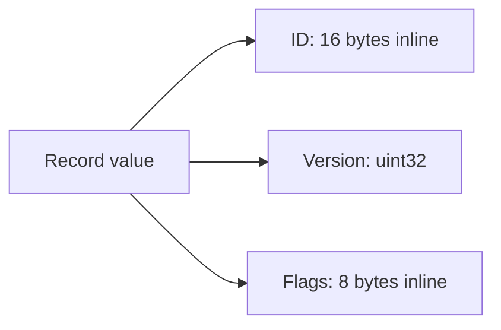
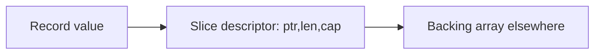
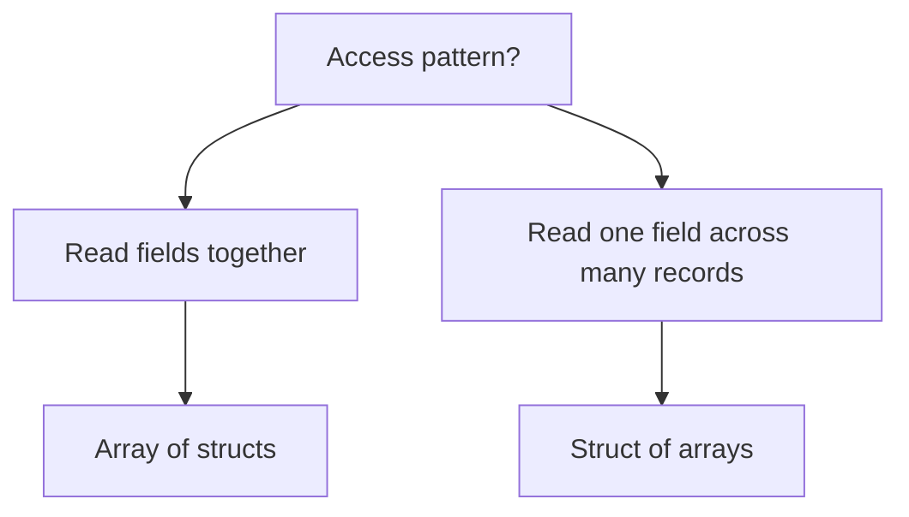

# learn-go-data-model-part-008.md

# Part 008 — Array: Fixed-Size Value, Copy Semantics, Memory Layout

> Seri: `learn-go-data-model`  
> Bagian: `008 / 034`  
> Topik: Array sebagai fixed-size value, bukan dynamic collection  
> Target pembaca: Java software engineer yang ingin memahami Go sampai level production/runtime/API-design  
> Baseline versi: Go 1.26.x

---

## 0. Posisi Part Ini Dalam Seri

Part sebelumnya membahas text model: `string`, `[]byte`, `strings`, `bytes`, builder, buffer, dan boundary efisiensi. Untuk memahami `[]byte` secara benar, kita harus memahami fondasinya: **array**.

Di Go, slice lebih sering dipakai daripada array. Tetapi secara mental model, array adalah struktur dasar yang menjelaskan banyak hal:

```text
array
  ↓ backing storage
slice
  ↓ view descriptor over array
append/copy/slicing
  ↓ aliasing, capacity, mutation, memory retention
API ownership contract
```

Karena itu part ini tidak diperlakukan sebagai topik kecil. Array adalah pintu masuk untuk memahami:

- value semantics;
- fixed-size data;
- copy cost;
- comparability;
- memory layout;
- cache locality;
- pointer-to-array;
- array sebagai field struct;
- array sebagai key map;
- slice backing array;
- binary/protocol-safe modeling;
- API design saat ukuran data adalah bagian dari kontrak.

---

## 1. Core Thesis

Di Java, kata “array” biasanya berarti object di heap yang diakses melalui reference:

```java
byte[] digest = new byte[32];
```

Variabel `digest` menyimpan reference ke object array. Passing ke method menyalin reference-nya, bukan isi array-nya.

Di Go, array adalah **value**:

```go
var digest [32]byte
```

Variabel `digest` menyimpan array itu sendiri. Assignment, parameter passing, dan return value secara semantic menyalin array.

Perbedaan ini sangat besar.

```mermaid
flowchart TD
    A[Java byte[] variable] --> B[Reference to heap array object]
    C[Go [32]byte variable] --> D[The array value itself]

    B --> E[Method call copies reference]
    D --> F[Function call copies array value unless pointer used]
```

Mental model utama:

```text
Java array variable ≈ reference to array object
Go array variable   ≈ fixed-size value containing all elements
Go slice variable   ≈ descriptor referencing backing array
```

---

## 2. Apa Itu Array di Go?

Menurut Go specification, array type dinyatakan sebagai:

```go
[N]T
```

Artinya:

- `N` adalah panjang array;
- `T` adalah element type;
- panjang array adalah bagian dari type;
- panjang array harus constant expression yang dapat direpresentasikan sebagai non-negative integer;
- array selalu berdimensi tetap;
- array value berisi semua elemennya.

Contoh:

```go
var a [3]int
var b [4]int
```

`a` dan `b` memiliki type berbeda:

```go
[3]int != [4]int
```

Ini bukan detail syntax. Ini berarti ukuran array adalah bagian dari kontrak type.

```go
func process3(x [3]int) {}

func example() {
    var a [3]int
    var b [4]int

    process3(a) // ok
    // process3(b) // compile error
}
```

Array berbeda dari slice:

```go
[3]int // array of exactly 3 ints
[]int  // slice of ints, length dynamic at runtime
```

---

## 3. Array Length Adalah Bagian Dari Type

Ini salah satu perbedaan paling penting dari Java.

Di Java:

```java
int[] a = new int[3];
int[] b = new int[4];
```

`a` dan `b` sama-sama bertipe `int[]`. Panjang adalah property runtime object.

Di Go:

```go
var a [3]int
var b [4]int
```

`a` bertipe `[3]int`, `b` bertipe `[4]int`. Panjang adalah bagian dari compile-time type.

Dampaknya:

```go
func hashSHA256(x [32]byte) {}
func hashSHA512(x [64]byte) {}
```

Compiler bisa mencegah salah ukuran:

```go
var sha256Digest [32]byte
var sha512Digest [64]byte

hashSHA256(sha256Digest) // ok
// hashSHA256(sha512Digest) // compile error
```

Ini adalah domain modeling yang kuat.

Ukuran data menjadi invariant type-level.

---

## 4. Zero Value Array

Zero value dari array adalah array dengan semua elemen berisi zero value dari element type.

```go
var a [4]int
fmt.Println(a) // [0 0 0 0]

var b [3]string
fmt.Println(b) // ["" "" ""]

var c [2]*User
fmt.Println(c) // [<nil> <nil>]
```

Jika element type adalah struct, setiap field juga zero value.

```go
type Point struct {
    X int
    Y int
}

var points [2]Point
// points == [2]Point{{0, 0}, {0, 0}}
```

Zero value array selalu valid secara memory. Tapi belum tentu valid secara domain.

Contoh:

```go
type AESKey [32]byte

var k AESKey
```

Secara memory valid. Secara security/domain mungkin tidak valid karena semua byte nol bukan key yang boleh dipakai.

Jadi pertanyaan production-nya:

```text
Apakah zero array meaningful, usable, atau harus ditolak di boundary?
```

---

## 5. Composite Literal Array

Array bisa dibuat dengan composite literal.

```go
a := [3]int{10, 20, 30}
```

Jika jumlah elemen ditulis eksplisit, jumlah initializer tidak boleh melebihi panjang.

```go
x := [3]int{1, 2}       // [1 2 0]
y := [3]int{1, 2, 3}    // [1 2 3]
// z := [3]int{1,2,3,4} // compile error
```

Go juga mendukung `...` untuk menghitung panjang dari initializer:

```go
a := [...]string{"draft", "submitted", "approved"}
```

Type `a` adalah `[3]string`, bukan `[]string`.

Ini sering berguna untuk static table kecil:

```go
var allowedTransitions = [...]Transition{
    {From: Draft, To: Submitted},
    {From: Submitted, To: Approved},
    {From: Submitted, To: Rejected},
}
```

Tetapi hati-hati: jika API menerima slice, literal array ini perlu dislice:

```go
allowedTransitions[:] // []Transition view over array
```

---

## 6. Indexed Composite Literal

Array literal dapat memakai index eksplisit.

```go
var asciiClass = [128]byte{
    '0': 1,
    '1': 1,
    '2': 1,
    '3': 1,
    '4': 1,
    '5': 1,
    '6': 1,
    '7': 1,
    '8': 1,
    '9': 1,
}
```

Ini berguna untuk lookup table kecil.

Contoh:

```go
func isASCIIDigit(b byte) bool {
    if b >= 128 {
        return false
    }
    return asciiClass[b] == 1
}
```

Dibanding `switch` atau map, array lookup table bisa sangat cepat dan predictable untuk domain kecil seperti ASCII, byte classifier, hex decoder, base64 table, protocol state, atau finite automata.

Namun ini bukan berarti array lookup selalu lebih baik. Pertanyaan yang benar:

```text
Apakah key space kecil, bounded, padat, dan integer-indexable?
```

Jika iya, array table bisa cocok.

Jika tidak, map lebih tepat.

---

## 7. Array Assignment Menyalin Isi

Array assignment menyalin seluruh isi array.

```go
a := [3]int{1, 2, 3}
b := a

b[0] = 99

fmt.Println(a) // [1 2 3]
fmt.Println(b) // [99 2 3]
```

`b := a` bukan berbagi storage. Ini copy.

```mermaid
flowchart LR
    A[a: [3]int] --> A0[1]
    A --> A1[2]
    A --> A2[3]

    B[b := a] --> B0[1]
    B --> B1[2]
    B --> B2[3]

    B0 --> C[b[0] = 99]
```

Setelah modifikasi:

```text
a = [1, 2, 3]
b = [99, 2, 3]
```

Ini berlawanan dengan Java:

```java
int[] a = {1, 2, 3};
int[] b = a;
b[0] = 99;
// a[0] is also 99
```

Di Java assignment menyalin reference. Di Go assignment array menyalin array value.

---

## 8. Function Parameter Array Juga Copy

Array yang dikirim sebagai parameter akan dicopy secara semantic.

```go
func mutate(a [3]int) {
    a[0] = 99
}

func example() {
    x := [3]int{1, 2, 3}
    mutate(x)
    fmt.Println(x) // [1 2 3]
}
```

Fungsi menerima salinan.

Kalau ingin mutate caller array, gunakan pointer:

```go
func mutate(a *[3]int) {
    a[0] = 99
}

func example() {
    x := [3]int{1, 2, 3}
    mutate(&x)
    fmt.Println(x) // [99 2 3]
}
```

Atau lebih umum, gunakan slice:

```go
func mutate(a []int) {
    a[0] = 99
}

func example() {
    x := [3]int{1, 2, 3}
    mutate(x[:])
    fmt.Println(x) // [99 2 3]
}
```

Perbedaan pointer-to-array dan slice akan dibahas detail nanti, tapi ringkasnya:

```text
*[N]T gives exact size + mutability
[]T gives variable length view + mutability
[N]T gives exact size + copy semantics
```

---

## 9. Return Array Juga Value Semantics

Fungsi bisa return array.

```go
func identityMatrix2() [2][2]int {
    return [2][2]int{
        {1, 0},
        {0, 1},
    }
}
```

Secara semantic, array dikembalikan sebagai value. Compiler dapat melakukan optimisasi copy, tetapi API contract tetap value.

Untuk ukuran kecil dan fixed, ini sangat baik.

Contoh domain:

```go
type SHA256Digest [32]byte

func SumPayload(payload []byte) SHA256Digest {
    // crypto/sha256.Sum256 returns [32]byte
    return SHA256Digest(sha256.Sum256(payload))
}
```

Di sini return by value justru desirable:

- digest kecil;
- fixed size;
- immutable-style;
- comparable;
- bisa jadi map key;
- tidak ada aliasing dengan internal buffer.

---

## 10. Array Comparability

Array comparable jika element type-nya comparable.

```go
a := [3]int{1, 2, 3}
b := [3]int{1, 2, 3}

fmt.Println(a == b) // true
```

Array dengan panjang berbeda tidak bisa dibandingkan karena type berbeda:

```go
var a [3]int
var b [4]int
// fmt.Println(a == b) // compile error
```

Array of slice tidak comparable:

```go
var x [2][]int
var y [2][]int
// fmt.Println(x == y) // compile error: []int not comparable
```

Ini membuat array sangat berguna untuk fixed binary identifiers:

```go
type Digest [32]byte

type CacheKey struct {
    TenantID string
    Digest   Digest
}

var cache map[CacheKey]Result
```

`Digest` bisa menjadi bagian dari key karena `[32]byte` comparable.

Slice tidak bisa:

```go
// map[[]byte]Result // invalid: slice is not comparable
```

Untuk `[]byte` key, kita biasanya perlu canonical conversion ke string atau fixed array, tergantung kasus.

---

## 11. Array Sebagai Map Key

Karena comparable, array dapat menjadi map key.

```go
type SessionToken [32]byte

var sessions map[SessionToken]Session
```

Ini lebih aman daripada string jika token adalah bytes mentah.

Keuntungan:

- ukuran fixed;
- tidak perlu encoding hex/base64 untuk internal map;
- equality by byte content;
- tidak bisa panjang salah;
- zero allocation untuk key jika sudah array.

Contoh:

```go
func LookupSession(sessions map[SessionToken]Session, token []byte) (Session, bool) {
    if len(token) != 32 {
        return Session{}, false
    }

    var key SessionToken
    copy(key[:], token)

    session, ok := sessions[key]
    return session, ok
}
```

Perhatikan ownership boundary:

```go
copy(key[:], token)
```

Kita menyalin bytes input ke fixed array agar key tidak bergantung pada slice caller.

---

## 12. Array dan Slice: Hubungan Fundamental

Slice adalah descriptor yang menunjuk ke segmen array.

```go
a := [5]int{10, 20, 30, 40, 50}
s := a[1:4]
```

`a` adalah array. `s` adalah slice view ke elemen `a[1]`, `a[2]`, `a[3]`.

```mermaid
flowchart TD
    subgraph Array a [Backing array: a]
        A0[0:10]
        A1[1:20]
        A2[2:30]
        A3[3:40]
        A4[4:50]
    end

    S[slice s]
    S --> P[pointer to a[1]]
    S --> L[len = 3]
    S --> C[cap = 4]

    P --> A1
```

Modifikasi slice memodifikasi array:

```go
s[0] = 99
fmt.Println(a) // [10 99 30 40 50]
```

Karena `s[0]` adalah `a[1]`.

Ini adalah akar dari banyak bug slice aliasing.

Part 009 dan 010 akan masuk detail slice. Part ini cukup membangun fondasinya:

```text
slice does not own elements by itself;
slice views an underlying array.
```

---

## 13. Full Slice Expression dari Array

Go mendukung slicing dengan tiga index:

```go
s := a[low:high:max]
```

Length:

```text
len = high - low
```

Capacity:

```text
cap = max - low
```

Contoh:

```go
a := [5]int{10, 20, 30, 40, 50}
s := a[1:3:3]

fmt.Println(s)      // [20 30]
fmt.Println(len(s)) // 2
fmt.Println(cap(s)) // 2
```

Full slice expression berguna untuk membatasi kapasitas agar `append` tidak menimpa bagian array setelah view.

```go
a := [5]int{10, 20, 30, 40, 50}
s := a[1:3:3]

s = append(s, 999)
fmt.Println(a) // [10 20 30 40 50]
fmt.Println(s) // [20 30 999]
```

Karena capacity `s` hanya 2, append harus membuat backing array baru.

Tanpa full slice expression:

```go
a := [5]int{10, 20, 30, 40, 50}
s := a[1:3]

s = append(s, 999)
fmt.Println(a) // [10 20 30 999 50]
```

Ini salah satu bug paling mahal dalam pipeline data.

---

## 14. Pointer to Array

Pointer to array memiliki type `*[N]T`.

```go
var a [32]byte
p := &a // *[32]byte
```

Kita bisa indexing pointer-to-array secara langsung:

```go
p[0] = 1
```

Secara semantic ini shorthand untuk:

```go
(*p)[0] = 1
```

Pointer-to-array berguna saat:

- ukuran harus exact;
- tidak ingin copy array besar;
- caller harus memberi buffer ukuran tertentu;
- protocol frame fixed-size;
- API ingin static guarantee panjang data.

Contoh:

```go
func FillNonce(dst *[12]byte) error {
    _, err := rand.Read(dst[:])
    return err
}
```

Dibanding:

```go
func FillNonce(dst []byte) error {
    if len(dst) != 12 {
        return errors.New("nonce must be 12 bytes")
    }
    _, err := rand.Read(dst)
    return err
}
```

Versi pointer-to-array memindahkan sebagian validasi ke type system.

Namun API pointer-to-array kurang fleksibel. Caller dengan `[]byte` harus convert/copy atau memakai unsafe bila ingin zero-copy. Jadi gunakan saat exact-size contract benar-benar penting.

---

## 15. Array Pointer Conversion dari Slice

Go mendukung konversi dari slice ke pointer-to-array dengan syarat panjang slice cukup. Jika panjang tidak cukup, terjadi panic runtime.

Contoh:

```go
func first16(b []byte) (*[16]byte, bool) {
    if len(b) < 16 {
        return nil, false
    }
    return (*[16]byte)(b[:16]), true
}
```

Setelah berhasil, pointer menunjuk ke backing array slice.

```go
func example() {
    b := []byte("abcdefghijklmnopxxxx")

    block, ok := first16(b)
    if !ok {
        return
    }

    block[0] = 'X'
    fmt.Println(string(b)) // Xbcdefghijklmnopxxxx
}
```

Ini bukan copy. Ini view typed sebagai pointer-to-array.

Kegunaan:

- parsing fixed header;
- crypto block processing;
- binary protocol;
- SIMD-ish chunking;
- avoiding temporary fixed array allocation.

Risiko:

- aliasing tetap ada;
- perubahan melalui pointer memodifikasi slice;
- lifetime mengikuti backing array;
- butuh guard `len(b) >= N`;
- API lebih tajam dan harus didokumentasikan.

Jika ingin copy independent:

```go
func copyFirst16(b []byte) ([16]byte, bool) {
    if len(b) < 16 {
        return [16]byte{}, false
    }

    var out [16]byte
    copy(out[:], b[:16])
    return out, true
}
```

---

## 16. Array Dalam Struct

Array bisa menjadi field struct.

```go
type Record struct {
    ID      [16]byte
    Version uint32
    Flags   [8]byte
}
```

Array field disimpan inline di dalam struct value.



Berbeda dengan slice field:

```go
type Record struct {
    ID []byte
}
```

Slice field hanya descriptor; elemen berada di backing array terpisah.



Konsekuensi array field:

- struct lebih besar;
- copy struct menyalin array field;
- tidak ada allocation tambahan untuk elemen array;
- lebih cache-local;
- ukuran fixed menjadi bagian dari type;
- cocok untuk digest, UUID raw bytes, fixed protocol header, small static buffer.

Konsekuensi slice field:

- struct lebih kecil;
- copy struct menyalin descriptor saja;
- data bisa shared;
- ukuran runtime dynamic;
- perlu ownership policy.

---

## 17. Layout, Alignment, dan Padding

Array element disimpan secara contiguous.

Untuk `[N]T`, ukuran konseptualnya kira-kira:

```text
N * sizeof(T)
```

Dengan catatan alignment mengikuti aturan platform dan compiler.

Contoh:

```go
type A struct {
    X byte
    Y [3]byte
    Z uint32
}
```

`[3]byte` inline dan contiguous.

Kita bisa mengukur dengan `unsafe.Sizeof`, `unsafe.Alignof`, dan `unsafe.Offsetof` untuk memahami layout, tetapi jangan membuat business logic bergantung pada layout kecuali sedang menulis kode low-level yang benar-benar butuh.

Contoh lab:

```go
package main

import (
    "fmt"
    "unsafe"
)

type Record struct {
    A byte
    B [3]byte
    C uint32
}

func main() {
    var r Record
    fmt.Println("sizeof Record:", unsafe.Sizeof(r))
    fmt.Println("alignof Record:", unsafe.Alignof(r))
    fmt.Println("offset A:", unsafe.Offsetof(r.A))
    fmt.Println("offset B:", unsafe.Offsetof(r.B))
    fmt.Println("offset C:", unsafe.Offsetof(r.C))
}
```

Production note:

```text
Use layout awareness for performance and interop review.
Do not casually encode external binary protocol by assuming struct memory layout.
```

Untuk binary protocol, explicit encoding/decoding biasanya lebih aman daripada raw struct reinterpretation.

---

## 18. Array of Struct vs Struct of Arrays

Array membantu memahami data-oriented design.

Array of structs:

```go
type Point struct {
    X float64
    Y float64
}

var points [1024]Point
```

Memory shape:

```text
X,Y | X,Y | X,Y | X,Y | ...
```

Struct of arrays:

```go
type Points struct {
    X [1024]float64
    Y [1024]float64
}
```

Memory shape:

```text
X,X,X,X,...
Y,Y,Y,Y,...
```

Jika algoritma selalu membaca `X` dan `Y` bersama, array-of-structs nyaman dan cache-friendly.

Jika algoritma hanya membaca semua `X`, struct-of-arrays bisa lebih cache-efficient.



Di Go application backend biasa, hal ini jarang menjadi keputusan pertama. Tetapi untuk high-throughput parsing, telemetry aggregation, compression, protocol processing, numeric computation, atau in-memory index, layout bisa menentukan performa.

---

## 19. Array Untuk Fixed Protocol Fields

Array sangat cocok untuk data yang secara domain fixed length.

Contoh:

```go
type Header struct {
    Magic   [4]byte
    Version byte
    Flags   byte
}
```

Atau:

```go
type UUID [16]byte

type SHA256Digest [32]byte

type IPv6Address [16]byte
```

Keuntungan:

```text
wrong length becomes compile-time impossible after parsing
```

Boundary function:

```go
func ParseUUIDBytes(b []byte) (UUID, error) {
    if len(b) != 16 {
        return UUID{}, fmt.Errorf("uuid must be 16 bytes, got %d", len(b))
    }

    var id UUID
    copy(id[:], b)
    return id, nil
}
```

Setelah parsing berhasil, seluruh internal code tidak perlu lagi mengecek panjang.

```go
func UseUUID(id UUID) {
    // no len check needed
}
```

Ini pola penting:

```text
validate dynamic data once at boundary
convert to fixed-size domain type
make invalid state unrepresentable inside core
```

---

## 20. Array Untuk Small Buffer

Kadang array digunakan sebagai small stack-friendly temporary buffer.

Contoh:

```go
func formatSmall(dst []byte, n uint64) []byte {
    var buf [20]byte // enough for uint64 decimal
    i := len(buf)

    if n == 0 {
        return append(dst, '0')
    }

    for n > 0 {
        i--
        buf[i] = byte('0' + n%10)
        n /= 10
    }

    return append(dst, buf[i:]...)
}
```

Array lokal kecil dapat membantu menghindari allocation heap jika tidak escape.

Tetapi jangan menganggap otomatis stack. Escape analysis menentukan. Jika pointer/slice ke array lokal keluar dari function, backing array bisa escape ke heap.

Contoh berisiko:

```go
func bad() []byte {
    var buf [16]byte
    return buf[:] // backing array must outlive function; escapes
}
```

Compiler akan membuatnya aman, tetapi mungkin heap allocation terjadi.

Correctness tidak rusak, tetapi cost berubah.

---

## 21. Array dan Escape Analysis

Array lokal bisa berada di stack jika tidak escape.

```go
func sum() int {
    a := [4]int{1, 2, 3, 4}
    total := 0
    for _, v := range a {
        total += v
    }
    return total
}
```

Array ini kemungkinan bisa berada di stack atau bahkan dioptimisasi lebih jauh.

Jika kita return pointer:

```go
func makeArray() *[4]int {
    a := [4]int{1, 2, 3, 4}
    return &a
}
```

`a` harus escape karena caller masih memakai array setelah function selesai.

Go membuat ini aman.

Jangan membawa mental model C “return pointer to local variable pasti dangling”. Di Go, compiler/runtime menjaga lifetime. Yang perlu kita pedulikan adalah allocation/performance.

Untuk melihat escape:

```bash
go build -gcflags='-m=2' ./...
```

Di Windows PowerShell:

```powershell
go build -gcflags="-m=2" ./...
```

---

## 22. Array Copy Cost

Karena array adalah value, copy cost bergantung ukuran.

```go
func process(a [1024 * 1024]byte) {
    // semantic copy of 1 MiB array
}
```

Ini biasanya buruk sebagai API.

Gunakan pointer atau slice:

```go
func processArray(a *[1024 * 1024]byte) {}
func processBytes(b []byte) {}
```

Tapi jangan overcorrect.

Array kecil sangat wajar dicopy:

```go
type Digest [32]byte
func Verify(d Digest) bool { ... }
```

Rule of thumb:

```text
Small fixed immutable-ish value: pass array by value.
Large mutable/fixed buffer: pass *[N]T.
Variable-length data: pass []T.
```

Tetapi keputusan final harus mempertimbangkan profiling, API semantics, dan ownership.

---

## 23. Array vs Slice Dalam API

Pertanyaan API utama:

```text
Apakah panjang adalah bagian dari kontrak compile-time?
```

Jika iya, array atau pointer-to-array mungkin cocok.

Jika tidak, slice lebih idiomatis.

### 23.1 Return Fixed Digest

```go
func Sum(data []byte) [32]byte
```

Bagus karena digest selalu 32 byte.

### 23.2 Accept Request Payload

```go
func Handle(payload []byte) error
```

Bagus karena payload variable length.

### 23.3 Fill Exact Nonce

```go
func FillNonce(dst *[12]byte) error
```

Bagus jika API ingin caller menyediakan exact buffer.

### 23.4 Parse Header From Stream

```go
func ParseHeader(header [8]byte) (Header, error)
```

Bagus jika caller sudah punya exact header.

Atau:

```go
func ParseHeaderBytes(b []byte) (Header, error) {
    if len(b) < 8 {
        return Header{}, io.ErrUnexpectedEOF
    }
    var header [8]byte
    copy(header[:], b[:8])
    return ParseHeader(header)
}
```

Layering yang baik:

```text
outer boundary accepts flexible []byte
inner core uses exact [N]byte domain value
```

---

## 24. Array vs Slice Untuk Ownership

Array by value memberi ownership jelas:

```go
type Token [32]byte

func NewToken(src []byte) (Token, error) {
    if len(src) != 32 {
        return Token{}, errors.New("invalid token length")
    }
    var t Token
    copy(t[:], src)
    return t, nil
}
```

Setelah `Token` dibuat, caller tidak bisa mengubah token lewat `src`.

Slice menyimpan potensi aliasing:

```go
type BadToken []byte

func NewBadToken(src []byte) BadToken {
    return BadToken(src) // shares backing array
}
```

Caller bisa mutate:

```go
src := make([]byte, 32)
t := NewBadToken(src)
src[0] = 99 // token changed
_ = t
```

Jika memakai slice untuk owned data, copy eksplisit:

```go
func NewOwnedBytes(src []byte) []byte {
    out := make([]byte, len(src))
    copy(out, src)
    return out
}
```

Array fixed type membuat ownership jauh lebih jelas untuk data kecil fixed-size.

---

## 25. Multidimensional Array

Go mendukung array of array.

```go
var matrix [2][3]int
```

Artinya:

```text
[2] of [3]int
```

Access:

```go
matrix[0][1] = 42
```

Composite literal:

```go
m := [2][3]int{
    {1, 2, 3},
    {4, 5, 6},
}
```

Memory-nya contiguous sebagai nested arrays.

```text
row0: 1 2 3 | row1: 4 5 6
```

Karena panjang bagian dari type:

```go
func determinant2(m [2][2]float64) float64 {
    return m[0][0]*m[1][1] - m[0][1]*m[1][0]
}
```

Untuk matrix dinamis, slice lebih tepat:

```go
[][]float64      // jagged; rows can have different lengths
[]float64       // flat row-major buffer
```

Untuk performance-heavy numeric code, flat slice sering lebih predictable daripada `[][]T`.

---

## 26. Array of Pointers vs Pointer-Free Array

Array element type memengaruhi GC scanning.

Pointer-free:

```go
var buf [4096]byte
var counters [1024]uint64
```

Pointer-containing:

```go
var users [1024]*User
var names [1024]string // string contains pointer-like data internally
```

GC harus memperhatikan pointer-bearing data. Dalam aplikasi biasa ini bukan alasan utama memilih type, tetapi untuk struktur data besar dan high-throughput, pointer density memengaruhi GC pressure.

Pola umum:

```text
pointer-free arrays/slices reduce GC scan work
pointer-heavy arrays/slices increase object graph complexity
```

Akan dibahas lebih detail di part 029.

---

## 27. Array dan Range

`range` bisa digunakan pada array.

```go
a := [3]int{10, 20, 30}

for i, v := range a {
    fmt.Println(i, v)
}
```

Penting: range value `v` adalah copy dari elemen.

```go
a := [3]int{10, 20, 30}

for _, v := range a {
    v = 99
}

fmt.Println(a) // [10 20 30]
```

Untuk mutate:

```go
for i := range a {
    a[i] = 99
}
```

Ada juga subtlety: ranging over array value dapat menyalin array. Untuk array besar, gunakan pointer atau slice.

```go
for i, v := range &a {
    _ = i
    _ = v
}
```

Dalam praktik, jika data besar, biasanya sudah memakai slice.

---

## 28. Array dan Method Receiver

Karena kita bisa mendefinisikan type berbasis array:

```go
type Digest [32]byte
```

Kita bisa menambahkan method.

```go
func (d Digest) IsZero() bool {
    return d == Digest{}
}

func (d Digest) Hex() string {
    return hex.EncodeToString(d[:])
}
```

Receiver by value cocok untuk small immutable value.

Untuk mutation:

```go
func (d *Digest) Clear() {
    for i := range d {
        d[i] = 0
    }
}
```

Karena `d` adalah `*Digest`, indexing tetap bisa langsung:

```go
d[i] = 0
```

Desain penting:

```text
Value receiver communicates value-like behavior.
Pointer receiver communicates mutation or avoiding copy.
```

Untuk fixed identifiers, biasanya hindari mutating methods kecuali ada alasan jelas.

---

## 29. Array dan String/Text Boundary

Array sering dipakai untuk fixed byte data yang perlu ditampilkan sebagai text.

Contoh:

```go
type Digest [32]byte

func (d Digest) String() string {
    return hex.EncodeToString(d[:])
}
```

Namun hati-hati dengan `String()` untuk data sensitif.

Untuk token/secret:

```go
type SecretKey [32]byte

func (SecretKey) String() string {
    return "<redacted>"
}
```

Jangan membuat `fmt.Printf("%v", key)` membocorkan secret.

Untuk explicit debug:

```go
func (k SecretKey) DebugHexForTestOnly() string {
    return hex.EncodeToString(k[:])
}
```

API production harus membedakan:

```text
identifier display is useful
secret display is dangerous
```

---

## 30. Array dan JSON

Package `encoding/json` memperlakukan array sebagai JSON array.

```go
type Payload struct {
    Digest [4]byte `json:"digest"`
}
```

Output default kira-kira:

```json
{"digest":[1,2,3,4]}
```

Untuk digest/token, sering yang diinginkan adalah hex/base64 string, bukan numeric array.

Maka buat custom marshaling:

```go
type Digest [32]byte

func (d Digest) MarshalText() ([]byte, error) {
    dst := make([]byte, hex.EncodedLen(len(d)))
    hex.Encode(dst, d[:])
    return dst, nil
}

func (d *Digest) UnmarshalText(text []byte) error {
    if len(text) != hex.EncodedLen(len(d)) {
        return fmt.Errorf("digest hex length must be %d", hex.EncodedLen(len(d)))
    }
    _, err := hex.Decode(d[:], text)
    return err
}
```

`encoding/json` dapat memakai text marshaling untuk string-like representation dalam banyak konteks.

Part 026 akan membahas encoding secara detail. Di part ini cukup pahami:

```text
array internal representation does not have to equal external representation
```

---

## 31. Array dan Database Boundary

Database jarang menyimpan Go array secara langsung. Biasanya fixed bytes disimpan sebagai:

- `BINARY(16)` / `BYTEA` / `RAW(16)`;
- hex string;
- UUID native type;
- base64 string;
- numeric columns untuk structured fields.

Pattern:

```go
type UUID [16]byte

func ParseUUIDDB(src []byte) (UUID, error) {
    if len(src) != 16 {
        return UUID{}, fmt.Errorf("uuid raw length must be 16, got %d", len(src))
    }
    var id UUID
    copy(id[:], src)
    return id, nil
}
```

Jangan membiarkan `[]byte` mentah menyebar ke core domain jika panjangnya sebenarnya fixed.

```text
DB boundary: dynamic bytes
Core domain: fixed array type
API response: canonical text
```

---

## 32. Array dan Security

Array sering menyimpan material sensitif:

```go
type Key [32]byte
```

Pertimbangan:

- zero value key mungkin harus invalid;
- logging harus redacted;
- comparison mungkin perlu constant-time untuk secret;
- copying secret memperbanyak jejak memory;
- clearing memory tidak selalu mudah dijamin secara total karena compiler/runtime optimisasi;
- jangan expose slice mutable ke internal key tanpa ownership policy.

Comparison biasa:

```go
if k1 == k2 { ... }
```

Untuk secret, gunakan constant-time comparison pada byte slice:

```go
if subtle.ConstantTimeCompare(k1[:], k2[:]) == 1 {
    // equal
}
```

Array comparable bukan berarti selalu aman untuk security comparison.

```text
Data equality and side-channel-safe equality are different concerns.
```

---

## 33. Common Bugs

### 33.1 Mengira Array Assignment Berbagi Data

```go
a := [2]int{1, 2}
b := a
b[0] = 99

// a unchanged
```

Jika butuh shared mutation, gunakan pointer atau slice.

### 33.2 Mengirim Array Besar By Value

```go
func Process(buf [1 << 20]byte) {}
```

Ini copy besar secara semantic.

Gunakan:

```go
func Process(buf *[1 << 20]byte) {}
// or
func Process(buf []byte) {}
```

### 33.3 Memakai Slice Untuk Fixed Identifier Tanpa Copy

```go
type Token []byte
```

Berisiko aliasing dan panjang salah.

Lebih baik:

```go
type Token [32]byte
```

### 33.4 JSON Array Tidak Sesuai External Contract

```go
type Digest [32]byte
```

Default JSON mungkin numeric array, padahal API contract ingin hex string.

Solusi: custom marshaling/text marshaling.

### 33.5 Membandingkan Secret Dengan `==`

```go
if key1 == key2 { ... }
```

Secara correctness equality benar, tapi secara side-channel bisa tidak sesuai threat model. Gunakan constant-time comparison untuk secret.

### 33.6 Menganggap Pointer-to-Array Conversion dari Slice Melakukan Copy

```go
p := (*[16]byte)(b[:16])
```

Ini tidak copy. Ini alias backing array.

---

## 34. Decision Matrix

| Situation | Recommended Type | Reason |
|---|---:|---|
| SHA-256 digest | `[32]byte` or named type | Fixed size, comparable, value-like |
| UUID raw bytes | `[16]byte` or named type | Exact size, map key possible |
| Request payload | `[]byte` | Variable length |
| Mutable buffer from caller | `[]byte` | Flexible and idiomatic |
| Exact-size mutable nonce buffer | `*[12]byte` | Compile-time length contract |
| Static lookup table | `[N]T` | Fast bounded index |
| Large matrix with fixed dimensions | `[R][C]T` or flat slice | Depends on API/perf needs |
| JSON external digest | string via marshal/text | Human/API friendly |
| Secret key | named `[N]byte` with redacted String | Prevent accidental leakage |
| Map key from bytes | `[N]byte` if fixed | Comparable and stable |

---

## 35. Java Engineer Translation Table

| Java Concept | Go Equivalent | Important Difference |
|---|---|---|
| `byte[]` | `[]byte` | Go slice is descriptor over array; Java array variable is reference |
| fixed byte array object | `[N]byte` | Go array length is part of type |
| passing `byte[]` | passing `[]byte` | Both can mutate underlying data, but mechanics differ |
| assigning `byte[]` | assigning `[]byte` | Both share underlying data/reference-like behavior |
| assigning Go `[N]byte` | no exact Java equivalent | Copies all elements |
| Java object identity | Go array value | Array equality can be by content |
| `Arrays.equals(a,b)` | `a == b` for comparable arrays | Only works for same `[N]T` and comparable T |
| `ByteBuffer` fixed view | `[]byte` / `*[N]byte` | Go ownership must be explicit |

---

## 36. Mental Model Diagram

```mermaid
flowchart TD
    A[Data requirement]
    A --> B{Length fixed by domain?}
    B -->|No| C[Use slice []T]
    B -->|Yes| D{Small value-like data?}
    D -->|Yes| E[Use named array type [N]T]
    D -->|No| F{Need mutation without copy?}
    F -->|Yes| G[Use *[N]T or []T with validation]
    F -->|No| H[Use [N]T by value if copy acceptable]

    E --> I[Comparable, map key, no aliasing]
    G --> J[Exact size but aliasing/mutation]
    C --> K[Dynamic length but ownership must be documented]
```

---

## 37. Production Design Pattern: Boundary-to-Core Conversion

This is one of the most important patterns involving arrays.

```mermaid
flowchart LR
    A[External input: []byte/string] --> B[Validate length/format]
    B --> C[Copy into named [N]byte]
    C --> D[Core domain uses fixed type]
    D --> E[External output via canonical encoding]
```

Example:

```go
type Digest [32]byte

func ParseDigestHex(s string) (Digest, error) {
    if len(s) != 64 {
        return Digest{}, fmt.Errorf("digest hex length must be 64, got %d", len(s))
    }

    var d Digest
    if _, err := hex.Decode(d[:], []byte(s)); err != nil {
        return Digest{}, err
    }
    return d, nil
}

func (d Digest) Hex() string {
    return hex.EncodeToString(d[:])
}
```

Core code:

```go
func AuthorizeByDigest(d Digest) Decision {
    // no length validation needed here
}
```

This is the engineering value:

```text
Validation disappears from the middle of the system because the type carries the invariant.
```

---

## 38. Mini Lab 1 — Observe Copy Semantics

Create `array-copy/main.go`:

```go
package main

import "fmt"

func mutateValue(a [3]int) {
    a[0] = 99
}

func mutatePointer(a *[3]int) {
    a[0] = 88
}

func mutateSlice(s []int) {
    s[0] = 77
}

func main() {
    a := [3]int{1, 2, 3}

    mutateValue(a)
    fmt.Println("after value:", a)

    mutatePointer(&a)
    fmt.Println("after pointer:", a)

    mutateSlice(a[:])
    fmt.Println("after slice:", a)
}
```

Expected:

```text
after value: [1 2 3]
after pointer: [88 2 3]
after slice: [77 2 3]
```

Learning:

```text
[N]T copies
*[N]T mutates original
[]T mutates backing array
```

---

## 39. Mini Lab 2 — Array as Map Key

```go
package main

import "fmt"

type Digest [4]byte

func main() {
    m := map[Digest]string{}

    d1 := Digest{1, 2, 3, 4}
    d2 := Digest{1, 2, 3, 4}

    m[d1] = "found"

    fmt.Println(d1 == d2)
    fmt.Println(m[d2])
}
```

Expected:

```text
true
found
```

Learning:

```text
Array equality is content equality when element type is comparable.
```

---

## 40. Mini Lab 3 — Full Slice Expression

```go
package main

import "fmt"

func main() {
    a := [5]int{10, 20, 30, 40, 50}

    s1 := a[1:3]
    s1 = append(s1, 999)
    fmt.Println("after s1 append:", a)

    b := [5]int{10, 20, 30, 40, 50}

    s2 := b[1:3:3]
    s2 = append(s2, 999)
    fmt.Println("after s2 append:", b)
    fmt.Println("s2:", s2)
}
```

Expected:

```text
after s1 append: [10 20 30 999 50]
after s2 append: [10 20 30 40 50]
s2: [20 30 999]
```

Learning:

```text
capacity controls whether append can reuse backing array.
```

---

## 41. Mini Lab 4 — Pointer-to-Array From Slice

```go
package main

import "fmt"

func main() {
    b := []byte("abcdefghijklmnopxxxx")

    block := (*[16]byte)(b[:16])
    block[0] = 'X'

    fmt.Println(string(b))
}
```

Expected:

```text
Xbcdefghijklmnopxxxx
```

Learning:

```text
Pointer-to-array conversion aliases the slice backing array.
```

---

## 42. Mini Lab 5 — Escape Analysis

```go
package main

func localArray() int {
    a := [4]int{1, 2, 3, 4}
    return a[0]
}

func escapingArray() []int {
    a := [4]int{1, 2, 3, 4}
    return a[:]
}

func main() {
    _ = localArray()
    _ = escapingArray()
}
```

Run:

```bash
go build -gcflags='-m=2' .
```

PowerShell:

```powershell
go build -gcflags="-m=2" .
```

Observe which values escape.

Learning:

```text
Go makes lifetime safe, but escape changes allocation behavior.
```

---

## 43. Review Checklist

Use this checklist when reviewing Go code involving arrays.

### 43.1 Type Choice

```text
[ ] Is the length truly fixed by domain/protocol?
[ ] Should this be [N]T, *[N]T, or []T?
[ ] Is a named array type useful for domain safety?
[ ] Is array length part of public API compatibility?
```

### 43.2 Copy Semantics

```text
[ ] Is the array small enough to pass/return by value?
[ ] Is a large array being copied accidentally?
[ ] Is a struct with array fields copied frequently?
[ ] Would pointer-to-array or slice be more appropriate?
```

### 43.3 Ownership and Aliasing

```text
[ ] Are external []byte inputs copied into array when ownership is needed?
[ ] Is pointer-to-array conversion from slice documented as aliasing?
[ ] Does append to slice risk mutating an underlying array unexpectedly?
[ ] Should full slice expression be used to cap capacity?
```

### 43.4 Comparability and Keys

```text
[ ] Is array used as map key only when element type is comparable?
[ ] Is equality by content intended?
[ ] For secrets, is constant-time comparison needed instead of ==?
```

### 43.5 Boundary Representation

```text
[ ] Does JSON output match API contract?
[ ] Are fixed bytes represented externally as hex/base64/string if needed?
[ ] Is database conversion validating exact length?
[ ] Are zero arrays valid or rejected?
```

### 43.6 Security

```text
[ ] Are secret arrays redacted in String/Marshal/logging paths?
[ ] Is zero value key invalid if required?
[ ] Are unnecessary copies of secret data avoided?
[ ] Is side-channel-safe comparison required?
```

---

## 44. Practical Heuristics

```text
Use [N]T when:
- N is intrinsic to the domain.
- Data is small and value-like.
- Equality by content is useful.
- Map key usage is needed.
- You want to eliminate repeated len checks inside core logic.
```

```text
Use *[N]T when:
- N is intrinsic to the domain.
- The value is large or mutable.
- Caller provides exact-size buffer.
- You want compile-time size contract without copying.
```

```text
Use []T when:
- Length is dynamic.
- You need idiomatic collection operations.
- You need to accept arbitrary payloads.
- You are modeling a view over data.
- Flexibility matters more than fixed-size guarantee.
```

```text
Avoid [N]T when:
- N is just an arbitrary current limit, not a real invariant.
- The data is large and copied often.
- Public API would become rigid unnecessarily.
- A slice with validation is clearer.
```

---

## 45. How This Prepares Part 009

Part 009 will discuss slices. The key preparation from this part:

```text
A slice is not a dynamic array object.
A slice is a descriptor over an underlying array.
```

After this part, slice behavior becomes easier to reason about:

- why `append` may or may not mutate existing data;
- why `copy` matters;
- why nil slice and empty slice differ;
- why capacity matters;
- why subslicing can retain large memory;
- why API ownership must be explicit.

---

## 46. Summary

Array in Go is a fixed-size value.

The most important facts:

```text
1. [N]T length is part of the type.
2. Array assignment copies elements.
3. Function parameter array copies elements.
4. Pointer-to-array avoids copy and preserves exact-size type contract.
5. Slice is a view over an underlying array.
6. Array is comparable if element type is comparable.
7. Array can be a map key.
8. Array field is stored inline in struct.
9. Array is excellent for fixed-size domain data.
10. Slice is better for variable-length collections.
```

For Java engineers, the critical unlearning is:

```text
Go [N]T is not Java T[].
Go []T is closer to a view/reference-like dynamic sequence,
but even that is not exactly Java array or Java List.
```

The engineering goal is not to “use arrays more”. The goal is to know when fixed-size value semantics give stronger correctness than flexible dynamic data.

---

## 47. References

- Go Language Specification — array types, slice types, composite literals, assignability, comparability: https://go.dev/ref/spec
- Effective Go — arrays, slices, composite literals, allocation with `new` and `make`: https://go.dev/doc/effective_go
- Go 1.26 Release Notes — baseline version and compatibility context: https://go.dev/doc/go1.26
- Go Release History — Go 1.26.x release line: https://go.dev/doc/devel/release
- Package `unsafe` — `Sizeof`, `Alignof`, `Offsetof`: https://pkg.go.dev/unsafe
- Go GC Guide — object graph and GC cost background: https://go.dev/doc/gc-guide
- Package `crypto/subtle` — constant-time comparison functions: https://pkg.go.dev/crypto/subtle


<!-- NAVIGATION_FOOTER -->
<div class="page-nav">
<a href="./learn-go-data-model-part-007.md">⬅️ Text Model II: `strings`, `bytes`, `strings.Builder`, `bytes.Buffer`, dan Boundary Efisiensi</a>
<a href="./index.md">📚 Kategori</a>
<a href="../../index.md">🏠 Home</a>
<a href="./learn-go-data-model-part-009.md">Part 009 — Slice I: Descriptor, Backing Array, `len`/`cap`, dan Aliasing ➡️</a>
</div>
