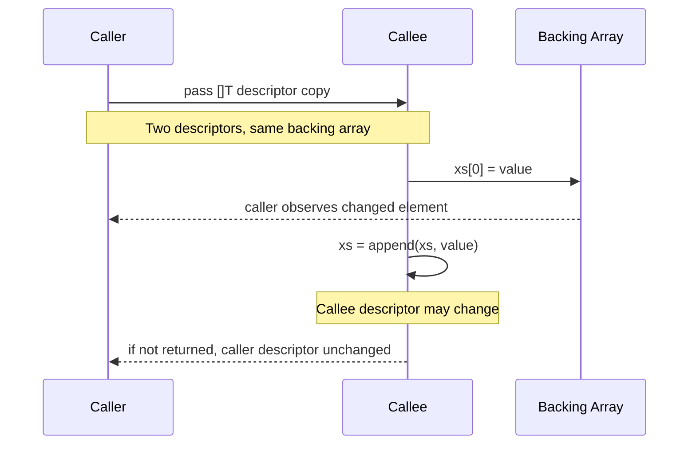

# learn-go-data-model-part-009.md

# Part 009 — Slice I: Descriptor, Backing Array, `len`/`cap`, dan Aliasing

> Seri: `learn-go-data-model`  
> Bagian: `009 / 034`  
> Target pembaca: Java software engineer yang ingin memahami Go pada level data model, runtime behavior, API design, correctness, dan performance engineering.  
> Baseline versi: Go 1.26.x.  

---

## 0. Posisi Part Ini dalam Seri

Kita sudah membahas:

```text
part-000  Orientation: Go data model untuk Java engineer
part-001  Type system core
part-002  Zero value, initialization, invariant
part-003  Constants, untyped values, iota
part-004  Numeric foundations
part-005  Numeric correctness
part-006  Text model I
part-007  Text model II
part-008  Array
```

Sekarang kita masuk ke **slice**.

Di Go, slice adalah salah satu tipe paling sering dipakai, tetapi juga salah satu sumber bug paling halus. Banyak engineer tahu cara memakai `append`, `len`, dan `range`, tetapi tidak benar-benar memahami **ownership**, **aliasing**, **capacity leak**, dan **backing array sharing**.

Part ini adalah fondasi Slice I. Kita belum fokus ke operasi delete/insert/filter/reuse yang akan dibahas di part berikutnya. Di sini kita fokus pada model dasarnya:

```text
slice value
→ descriptor
→ backing array
→ len/cap
→ nil vs empty
→ slicing
→ full slice expression
→ append
→ aliasing
→ ownership contract
```

---

## 1. Core Thesis

Slice bukan array dinamis seperti `ArrayList` di Java.

Slice adalah **small value descriptor** yang menunjuk ke segmen dari sebuah **backing array**.

Secara konseptual:

```go
type SliceHeaderConceptual struct {
    Data pointer // alamat elemen pertama yang terlihat oleh slice
    Len  int     // jumlah elemen yang terlihat
    Cap  int     // jumlah elemen yang dapat dicapai dari Data sampai akhir backing array
}
```

Ini bukan definisi yang boleh dipakai sebagai API aman. Ini hanya mental model.

Implikasinya besar:

```text
Assign slice       → descriptor dicopy, backing array tetap sama
Pass slice to func → descriptor dicopy, backing array tetap sama
Modify element     → backing array berubah, semua alias melihat perubahan
Append             → bisa menulis ke backing array lama atau membuat backing array baru
Reslice            → membuat descriptor baru ke backing array yang sama
```

Dalam Java, `List<T>` biasanya dipahami sebagai object reference ke object collection. Dalam Go, `[]T` adalah value kecil yang membawa pointer ke data.

---

## 2. Definisi Formal Singkat

Menurut Go specification, slice type merepresentasikan set semua slice dari array dengan element type tertentu. Slice adalah descriptor untuk contiguous segment dari underlying array. Nilai uninitialized slice adalah `nil`.

Bentuk type-nya:

```go
[]T
```

Contoh:

```go
var xs []int
fmt.Println(xs == nil) // true
fmt.Println(len(xs))   // 0
fmt.Println(cap(xs))   // 0
```

Perhatikan: `nil` slice tetap bisa dipakai untuk banyak operasi read-like:

```go
var xs []int

fmt.Println(len(xs)) // 0
fmt.Println(cap(xs)) // 0

xs = append(xs, 10)
fmt.Println(xs) // [10]
```

Tetapi tidak bisa di-index:

```go
var xs []int
_ = xs[0] // panic: index out of range
```

---

## 3. Slice vs Array: Perbedaan Fundamental

Array:

```go
var a [3]int = [3]int{10, 20, 30}
```

Slice:

```go
var s []int = []int{10, 20, 30}
```

Perbedaan utama:

| Aspek | Array | Slice |
|---|---|---|
| Type menyimpan length? | Ya, `[3]int` berbeda dari `[4]int` | Tidak, `[]int` |
| Copy assignment | Copy seluruh elemen | Copy descriptor |
| Ukuran value | sebesar semua elemen | kecil, fixed-size descriptor |
| Dapat grow langsung? | Tidak | Bisa dengan `append` |
| Comparable? | Ya jika element comparable | Tidak, kecuali dibandingkan dengan `nil` |
| Zero value | semua elemen zero | `nil` slice |
| Umum dipakai untuk API variable length? | Jarang | Sangat umum |

Contoh copy array:

```go
a := [3]int{1, 2, 3}
b := a
b[0] = 99

fmt.Println(a) // [1 2 3]
fmt.Println(b) // [99 2 3]
```

Contoh copy slice descriptor:

```go
s := []int{1, 2, 3}
t := s
t[0] = 99

fmt.Println(s) // [99 2 3]
fmt.Println(t) // [99 2 3]
```

Ini adalah titik pertama yang harus masuk ke memori: **copy slice bukan copy elemen**.

---

## 4. Diagram Mental Model Slice

```mermaid
flowchart LR
    S1[Slice s\nptr -> a[1]\nlen=3\ncap=4]
    BA[Backing array\nindex: 0 1 2 3 4\nvalue: A B C D E]

    S1 --> BA
```

Misalnya:

```go
a := [5]string{"A", "B", "C", "D", "E"}
s := a[1:4]

fmt.Println(s)      // [B C D]
fmt.Println(len(s)) // 3
fmt.Println(cap(s)) // 4, dari index 1 sampai akhir array
```

Slice `s` melihat elemen `a[1]`, `a[2]`, `a[3]`, tetapi kapasitasnya sampai `a[4]`.

```text
array:   [ A | B | C | D | E ]
index:     0   1   2   3   4
slice s:       [ B | C | D ]
len:            3 visible elements
cap:            B C D E = 4 reachable slots
```

---

## 5. Membuat Slice

Ada beberapa cara umum.

### 5.1 Slice literal

```go
xs := []int{1, 2, 3}
```

Ini membuat backing array dan slice descriptor yang menunjuk ke array tersebut.

### 5.2 Dari array

```go
a := [5]int{10, 20, 30, 40, 50}
s := a[1:4]

fmt.Println(s) // [20 30 40]
```

### 5.3 Dari slice lain

```go
s := []int{10, 20, 30, 40, 50}
t := s[1:4]

fmt.Println(t) // [20 30 40]
```

`s` dan `t` berbagi backing array.

### 5.4 Dengan `make`

```go
xs := make([]int, 3)
fmt.Println(xs)      // [0 0 0]
fmt.Println(len(xs)) // 3
fmt.Println(cap(xs)) // 3
```

Dengan capacity eksplisit:

```go
xs := make([]int, 0, 10)
fmt.Println(len(xs)) // 0
fmt.Println(cap(xs)) // 10
```

Interpretasi production:

```text
make([]T, len)       → data sudah punya len elemen aktif
make([]T, 0, cap)    → buffer kosong, siap append sampai cap
make([]T, len, cap)  → len elemen aktif, cap total reserved
```

Kesalahan umum:

```go
xs := make([]int, 10)
xs = append(xs, 1)

fmt.Println(xs) // [0 0 0 0 0 0 0 0 0 0 1]
```

Jika maksudnya menyiapkan capacity, pakai:

```go
xs := make([]int, 0, 10)
xs = append(xs, 1)

fmt.Println(xs) // [1]
```

---

## 6. `len` dan `cap`: Dua Angka yang Tidak Boleh Dicampur

`len(s)` adalah jumlah elemen yang **valid untuk diakses**.

`cap(s)` adalah jumlah elemen yang **dapat dicapai oleh slice descriptor sebelum perlu backing array baru**.

```go
s := make([]int, 2, 5)
fmt.Println(len(s)) // 2
fmt.Println(cap(s)) // 5

s[0] = 10
s[1] = 20
// s[2] = 30 // panic: index out of range
```

Walaupun capacity 5, elemen index 2 belum termasuk length. Untuk menambah elemen, gunakan append:

```go
s = append(s, 30)
fmt.Println(s)      // [10 20 30]
fmt.Println(len(s)) // 3
fmt.Println(cap(s)) // 5
```

Mental model:

```text
len = legal index boundary
cap = possible append boundary before allocation
```

Jangan pernah memakai `cap` untuk loop access:

```go
for i := 0; i < cap(s); i++ {
    _ = s[i] // panic saat i >= len(s)
}
```

---

## 7. Nil Slice vs Empty Slice

Ada tiga bentuk yang sering terlihat:

```go
var a []int          // nil slice
b := []int{}         // non-nil empty slice
c := make([]int, 0)  // non-nil empty slice
```

Perbandingan:

```go
fmt.Println(a == nil) // true
fmt.Println(b == nil) // false
fmt.Println(c == nil) // false

fmt.Println(len(a), cap(a)) // 0 0
fmt.Println(len(b), cap(b)) // 0 0
fmt.Println(len(c), cap(c)) // 0 0
```

Dalam banyak operasi, nil slice dan empty slice sama:

```go
for _, x := range a {
    fmt.Println(x) // tidak dieksekusi
}

a = append(a, 1)
```

Tetapi berbeda dalam beberapa boundary:

```go
type Response struct {
    Items []string `json:"items"`
}

json.Marshal(Response{Items: nil})       // {"items":null}
json.Marshal(Response{Items: []string{}}) // {"items":[]}
```

Production rule:

```text
Internal representation:
  nil slice often acceptable as zero value.

External API representation:
  choose deliberately: null vs [] is a contract.
```

Untuk API publik, sering lebih baik return empty slice daripada nil jika semantic-nya “tidak ada item, tetapi field adalah collection”.

```go
func ListUsers(ctx context.Context) ([]User, error) {
    // Better for caller ergonomics:
    return []User{}, nil
}
```

Namun internal code bisa memanfaatkan nil slice supaya zero value natural.

---

## 8. Slice Expression

Bentuk dasar:

```go
s[low:high]
```

Membuat slice baru dari `low` inclusive sampai `high` exclusive.

```go
xs := []int{10, 20, 30, 40, 50}
ys := xs[1:4]

fmt.Println(ys) // [20 30 40]
```

Batas default:

```go
xs[:3] // low default 0
xs[2:] // high default len(xs)
xs[:]  // full visible range
```

Penting: slicing tidak copy elemen.

```go
xs := []int{10, 20, 30, 40, 50}
ys := xs[1:4]

ys[0] = 999
fmt.Println(xs) // [10 999 30 40 50]
```

---

## 9. Full Slice Expression: `s[low:high:max]`

Bentuk penuh:

```go
s[low:high:max]
```

Hasilnya:

```text
len = high - low
cap = max - low
```

Contoh:

```go
xs := []int{10, 20, 30, 40, 50}
ys := xs[1:3:3]

fmt.Println(ys)      // [20 30]
fmt.Println(len(ys)) // 2
fmt.Println(cap(ys)) // 2
```

Mengapa ini penting?

Karena `cap` menentukan apakah `append` bisa menulis ke backing array yang sama.

Tanpa full slice:

```go
xs := []int{10, 20, 30, 40, 50}
ys := xs[1:3] // len=2, cap=4
ys = append(ys, 999)

fmt.Println(xs) // [10 20 30 999 50]
fmt.Println(ys) // [20 30 999]
```

Dengan full slice:

```go
xs := []int{10, 20, 30, 40, 50}
ys := xs[1:3:3] // len=2, cap=2
ys = append(ys, 999)

fmt.Println(xs) // [10 20 30 40 50]
fmt.Println(ys) // [20 30 999]
```

Full slice expression adalah alat untuk **membatasi capacity exposure**.

Production use case:

```go
func Head(xs []Item, n int) []Item {
    if n > len(xs) {
        n = len(xs)
    }
    return xs[:n:n] // caller append tidak overwrite tail milik xs
}
```

Ini tidak membuat deep copy, tetapi mencegah append dari hasil slice menulis ke elemen setelah `n` di backing array lama.

---

## 10. `append`: Operasi yang Kelihatan Sederhana tetapi Semantik-nya Dalam

`append` mengembalikan slice baru.

```go
s = append(s, x)
```

Jangan lupa assignment balik ke `s`.

Salah:

```go
s := []int{1, 2}
append(s, 3) // compile error: result of append not used
```

Benar:

```go
s := []int{1, 2}
s = append(s, 3)
```

Kenapa return value penting?

Karena append bisa:

1. memakai backing array lama, atau
2. membuat backing array baru.

```mermaid
flowchart TD
    A[append(s, x)] --> B{len(s)+1 <= cap(s)?}
    B -- yes --> C[write into existing backing array]
    B -- no --> D[allocate new backing array]
    D --> E[copy old visible elements]
    E --> F[write new element]
    C --> G[return new slice descriptor]
    F --> G
```

Contoh backing array sama:

```go
s := make([]int, 0, 3)
s = append(s, 1)
t := append(s, 2)
u := append(s, 3)

fmt.Println(s) // [1]
fmt.Println(t) // [1 3] ?
fmt.Println(u) // [1 3]
```

Mari bedah:

```go
s := make([]int, 0, 3)
s = append(s, 1) // backing: [1 _ _], s len=1 cap=3

t := append(s, 2) // backing: [1 2 _], t len=2 cap=3
u := append(s, 3) // backing: [1 3 _], u len=2 cap=3, overwrite posisi index 1
```

`t` dan `u` berbagi backing array. Karena `u` menulis index 1, `t` ikut berubah.

Ini bug nyata.

---

## 11. Aliasing: Masalah Utama Slice

Aliasing terjadi saat dua atau lebih reference/descriptor mengarah ke storage yang sama.

Pada slice:

```go
a := []int{1, 2, 3, 4}
b := a[1:3]

b[0] = 99
fmt.Println(a) // [1 99 3 4]
```

Aliasing tidak selalu buruk. Ia adalah sumber efisiensi. Tetapi harus explicit dalam kontrak.

Masalah muncul ketika caller atau callee tidak sadar bahwa mereka berbagi data.

---

## 12. Bug Pattern: Returning Subslice of Large Buffer

Contoh:

```go
func FindToken(payload []byte) []byte {
    // Misalnya payload berukuran 10 MB.
    start, end := locateToken(payload)
    return payload[start:end]
}
```

Masalah:

```text
Returned token mungkin hanya 32 byte,
tetapi backing array-nya masih payload 10 MB.
Selama token hidup, payload besar tidak bisa di-GC.
```

Solusi jika token harus hidup lebih lama:

```go
func FindToken(payload []byte) []byte {
    start, end := locateToken(payload)
    token := payload[start:end]
    return append([]byte(nil), token...)
}
```

Atau Go modern:

```go
return bytes.Clone(token)
```

Untuk `[]T` umum:

```go
out := append([]T(nil), in...)
```

atau:

```go
out := slices.Clone(in)
```

Rule:

```text
Subslice is a view, not a copy.
If lifetime exceeds source ownership, clone.
```

---

## 13. Bug Pattern: Callee Mutates Caller Slice Elements

```go
func Normalize(xs []string) {
    for i := range xs {
        xs[i] = strings.TrimSpace(xs[i])
    }
}

names := []string{" alice ", " bob "}
Normalize(names)
fmt.Println(names) // [alice bob]
```

Ini valid jika function contract adalah mutating.

Tetapi bahaya jika tidak jelas:

```go
func SortedNames(names []string) []string {
    sort.Strings(names)
    return names
}
```

Caller mungkin mengira function ini membuat sorted copy, padahal input ikut berubah.

Lebih aman:

```go
func SortedNames(names []string) []string {
    out := append([]string(nil), names...)
    sort.Strings(out)
    return out
}
```

Naming guideline:

```text
Normalize(xs []T)          → likely mutates
Normalized(xs []T) []T     → likely returns copy
Sort(xs []T)               → mutates
Sorted(xs []T) []T         → returns copy
```

Go standard library sendiri memakai pola ini di beberapa tempat: operasi sort biasanya mutating, sedangkan package `slices` menyediakan helper yang perlu dibaca contract-nya dengan teliti.

---

## 14. Bug Pattern: Append to Subslice Overwrites Tail

```go
func main() {
    xs := []string{"A", "B", "C", "D"}
    head := xs[:2]

    head = append(head, "X")

    fmt.Println(xs)   // [A B X D]
    fmt.Println(head) // [A B X]
}
```

Mengapa?

```text
xs backing: [A B C D]
head: ptr=A, len=2, cap=4
append(head, X) writes at index 2 of same backing array
```

Solusi 1: full slice expression.

```go
head := xs[:2:2]
head = append(head, "X")

fmt.Println(xs)   // [A B C D]
fmt.Println(head) // [A B X]
```

Solusi 2: clone.

```go
head := append([]string(nil), xs[:2]...)
head = append(head, "X")
```

Pilih berdasarkan ownership:

```text
Need view but prevent append overwrite → full slice expression
Need independent lifetime/mutation     → clone
```

---

## 15. Slice Header Copy vs Element Copy

Saat slice dipassing ke function:

```go
func ChangeFirst(xs []int) {
    xs[0] = 999
}

func main() {
    xs := []int{1, 2, 3}
    ChangeFirst(xs)
    fmt.Println(xs) // [999 2 3]
}
```

Karena descriptor dicopy, tetapi backing array sama.

Namun mengganti slice descriptor di callee tidak mengganti caller descriptor:

```go
func AppendLocal(xs []int) {
    xs = append(xs, 4)
}

func main() {
    xs := []int{1, 2, 3}
    AppendLocal(xs)
    fmt.Println(xs) // biasanya [1 2 3]
}
```

Jika ingin caller menerima perubahan length, return slice:

```go
func AppendValue(xs []int, v int) []int {
    return append(xs, v)
}

xs = AppendValue(xs, 4)
```

Atau gunakan pointer to slice, tapi jarang perlu:

```go
func AppendValue(xs *[]int, v int) {
    *xs = append(*xs, v)
}
```

Guideline:

```text
Prefer returning the updated slice.
Use *slice only when the slice descriptor itself is part of mutable object state
or when API shape explicitly models mutation of the slice variable.
```

---

## 16. Pointer to Slice: Kapan Perlu, Kapan Tidak

Banyak Java engineer awalnya memakai `*[]T` karena mengira slice harus dipassing by reference agar efisien. Itu biasanya keliru.

Slice sudah descriptor kecil. Passing `[]T` murah.

Gunakan `[]T` jika:

```text
- function membaca elemen
- function mengubah elemen
- function mungkin append tetapi return hasil baru
```

Gunakan `*[]T` hanya jika:

```text
- function memang harus mengganti len/cap/pointer caller tanpa return
- slice adalah field internal yang dimutasi oleh method
- ada alasan API yang sangat jelas
```

Contoh lebih idiomatik:

```go
func Add(xs []int, v int) []int {
    return append(xs, v)
}
```

Kurang idiomatik kecuali ada alasan:

```go
func Add(xs *[]int, v int) {
    *xs = append(*xs, v)
}
```

---

## 17. Slice of Value vs Slice of Pointer

Dua bentuk:

```go
[]User
[]*User
```

Tidak ada yang selalu benar. Pilihan tergantung semantics.

### 17.1 `[]User`

Cocok jika:

```text
- User adalah value-like data
- ingin locality lebih baik
- ingin mengurangi pointer chasing
- ingin mengurangi GC scan pressure
- mutation dikontrol lewat index/owner
```

Contoh:

```go
type User struct {
    ID   UserID
    Name string
}

users := []User{{ID: "u1", Name: "Alice"}}
```

### 17.2 `[]*User`

Cocok jika:

```text
- object besar dan sering dipindah tanpa copy
- identity object penting
- shared mutable object memang disengaja
- nil element punya semantic
- polymorphism lewat interface/pointer receiver diperlukan
```

Tetapi punya risiko:

```text
- nil elements
- mutation aliasing
- pointer chasing
- lebih banyak object heap
- lebih banyak GC work
```

Production heuristic:

```text
Default to []T for small/medium immutable-ish records.
Move to []*T only with a semantic or measured performance reason.
```

---

## 18. Range over Slice

```go
xs := []int{10, 20, 30}
for i, v := range xs {
    fmt.Println(i, v)
}
```

Penting: `v` adalah copy dari element.

```go
type User struct {
    Name string
}

users := []User{{Name: "Alice"}, {Name: "Bob"}}

for _, u := range users {
    u.Name = strings.ToUpper(u.Name)
}

fmt.Println(users) // [{Alice} {Bob}], tidak berubah
```

Benar:

```go
for i := range users {
    users[i].Name = strings.ToUpper(users[i].Name)
}
```

Untuk slice of pointer:

```go
users := []*User{{Name: "Alice"}, {Name: "Bob"}}

for _, u := range users {
    u.Name = strings.ToUpper(u.Name)
}

fmt.Println(users[0].Name) // ALICE
```

Karena `u` adalah copy pointer, tetapi menunjuk object yang sama.

---

## 19. Range Variable Address Trap

Historically, mengambil alamat range variable dapat menyebabkan bug karena variable loop yang sama dipakai ulang. Di Go modern, ada perubahan semantics untuk loop variables pada Go 1.22 untuk mengurangi class bug tertentu. Namun secara engineering handbook, guideline yang tetap aman adalah: **jangan bergantung pada alamat range variable copy; ambil alamat elemen lewat index jika butuh pointer ke elemen slice**.

Buruk secara intent:

```go
var ptrs []*User
for _, u := range users {
    ptrs = append(ptrs, &u) // pointer ke variable loop/copy, bukan elemen slice
}
```

Benar:

```go
var ptrs []*User
for i := range users {
    ptrs = append(ptrs, &users[i])
}
```

Mengapa tetap perlu guideline ini?

Karena bahkan ketika loop variable semantics lebih aman untuk closure capture, `u` tetap copy dari elemen. Jika tujuan adalah pointer ke elemen dalam backing array, gunakan `&users[i]`.

---

## 20. Slice dan Equality

Slice tidak comparable kecuali terhadap `nil`.

```go
var xs []int
fmt.Println(xs == nil) // ok

ys := []int{}
// fmt.Println(xs == ys) // compile error
```

Untuk membandingkan isi:

```go
slices.Equal(a, b)
```

Untuk bytes:

```go
bytes.Equal(a, b)
```

Jangan gunakan `reflect.DeepEqual` secara sembarangan karena nil slice dan empty slice dianggap berbeda.

```go
var a []int = nil
b := []int{}

fmt.Println(reflect.DeepEqual(a, b)) // false
fmt.Println(slices.Equal(a, b))      // true
```

Interpretasi:

```text
DeepEqual cocok untuk inspeksi struktur mentah.
slices.Equal lebih cocok untuk semantic equality sequence.
```

---

## 21. Slice dan JSON Boundary

```go
type Payload struct {
    Items []string `json:"items"`
}
```

Nil slice:

```json
{"items":null}
```

Empty slice:

```json
{"items":[]}
```

Dengan `omitempty`:

```go
type Payload struct {
    Items []string `json:"items,omitempty"`
}
```

Baik nil maupun empty length 0 biasanya akan dihilangkan.

API design consequence:

```text
null       → absent/unknown/not loaded? or no collection?
[]         → loaded, known empty collection
omitted    → field not part of response / default / not requested
```

Jangan biarkan encoder menentukan semantic tanpa keputusan desain.

---

## 22. Slice Ownership Contract

Setiap function yang menerima atau mengembalikan slice harus punya kontrak ownership, meskipun tidak tertulis eksplisit.

Pertanyaan wajib:

```text
1. Apakah function boleh membaca slice setelah return?
2. Apakah function boleh menyimpan slice?
3. Apakah function boleh mengubah elemen?
4. Apakah function boleh append?
5. Apakah returned slice berbagi backing array dengan input?
6. Apakah caller boleh memodifikasi returned slice?
7. Apakah nil slice valid?
8. Apakah empty slice punya semantic berbeda dari nil?
```

Contoh kontrak aman:

```go
// ParseIDs parses ids from b. It does not retain b after returning.
func ParseIDs(b []byte) ([]ID, error)
```

Contoh kontrak retention:

```go
// NewBuffer creates a Buffer using b as its initial storage.
// The caller must not modify b after passing it to NewBuffer.
func NewBuffer(b []byte) *Buffer
```

Contoh defensive copy:

```go
type TokenStore struct {
    token []byte
}

func NewTokenStore(token []byte) *TokenStore {
    return &TokenStore{token: append([]byte(nil), token...)}
}

func (s *TokenStore) Token() []byte {
    return append([]byte(nil), s.token...)
}
```

Tanpa defensive copy:

```go
type TokenStore struct {
    token []byte
}

func NewTokenStore(token []byte) *TokenStore {
    return &TokenStore{token: token} // caller can mutate internal state
}

func (s *TokenStore) Token() []byte {
    return s.token // caller can mutate internal state
}
```

---

## 23. Input Slice: Borrow, Consume, Retain, Own

Gunakan taxonomy ini.

### 23.1 Borrow

Function hanya membaca selama call.

```go
func Sum(xs []int) int
```

Contract:

```text
- does not retain xs
- does not mutate xs
- caller keeps ownership
```

### 23.2 Mutate

Function mengubah elemen.

```go
func NormalizeInPlace(xs []User)
```

Contract:

```text
- does not retain xs
- mutates visible elements
- caller keeps storage ownership
```

### 23.3 Consume

Function boleh mengubah/reuse input sebagai buffer.

```go
func Encode(dst []byte, v Value) []byte
```

Contract:

```text
- dst is append target
- returned slice must be used
- caller should not rely on old dst length/content beyond contract
```

### 23.4 Retain

Function menyimpan slice untuk dipakai setelah return.

```go
func NewReader(b []byte) *Reader
```

Contract harus jelas:

```text
- copy b internally, or
- retain b and require caller not to mutate
```

### 23.5 Own

Function mengambil ownership storage.

```go
func NewPacketOwned(b []byte) Packet
```

Contract:

```text
- caller must not use b afterward except as allowed
- callee may mutate/reuse/free logically
```

Go tidak punya borrow checker. Jadi ownership adalah **API discipline**.

---

## 24. Output Slice: View, Copy, Mutable, Immutable-by-Convention

Saat mengembalikan slice, pilih semantic.

### 24.1 View

```go
func (p Packet) Header() []byte {
    return p.buf[:headerLen]
}
```

Masalah: caller bisa mutate internal buffer.

Jika view read-only tidak bisa dipaksa oleh type system Go untuk `[]byte`.

Alternatif:

```go
func (p Packet) HeaderCopy() []byte {
    return append([]byte(nil), p.buf[:headerLen]...)
}
```

Atau gunakan `string` untuk immutable byte/text-like data jika tepat.

### 24.2 Copy

```go
func (p Packet) Bytes() []byte {
    return append([]byte(nil), p.buf...)
}
```

Aman, tetapi alokasi.

### 24.3 Mutable output

```go
func (b *Builder) Bytes() []byte
```

Jika returned slice menjadi invalid setelah next mutation, dokumentasikan.

### 24.4 Immutable by convention

```go
func (c Config) AllowedRoles() []Role
```

Jika return internal slice, caller bisa mutate. Jangan mengandalkan convention untuk security-sensitive state.

---

## 25. Capacity Exposure sebagai API Leak

Misalnya:

```go
func Prefix(xs []int) []int {
    return xs[:2]
}
```

Caller:

```go
xs := []int{1, 2, 3, 4}
p := Prefix(xs)
p = append(p, 99)

fmt.Println(xs) // [1 2 99 4]
```

Jika function ingin return view tetapi tidak ingin append menulis tail:

```go
func Prefix(xs []int) []int {
    return xs[:2:2]
}
```

Ini membatasi capacity. Namun caller masih bisa mutate visible elements:

```go
p[0] = 777
fmt.Println(xs) // [777 2 3 4]
```

Jika tidak boleh mutate sama sekali, clone.

```go
func PrefixCopy(xs []int) []int {
    return append([]int(nil), xs[:2]...)
}
```

---

## 26. Preallocation: Benar dan Salah

Preallocation mengurangi allocation saat jumlah elemen kira-kira diketahui.

Benar:

```go
func IDs(users []User) []UserID {
    ids := make([]UserID, 0, len(users))
    for _, u := range users {
        ids = append(ids, u.ID)
    }
    return ids
}
```

Salah:

```go
func IDs(users []User) []UserID {
    ids := make([]UserID, len(users))
    for _, u := range users {
        ids = append(ids, u.ID)
    }
    return ids // len menjadi 2x, awalnya zero values
}
```

Benar untuk fill by index:

```go
func IDs(users []User) []UserID {
    ids := make([]UserID, len(users))
    for i, u := range users {
        ids[i] = u.ID
    }
    return ids
}
```

Pilih pattern:

```text
Known exact size and fill all positions → make([]T, n), assign by index
Unknown/filtered size but upper bound known → make([]T, 0, upperBound), append
```

---

## 27. Slice as Buffer

Pattern umum:

```go
buf := make([]byte, 0, 4096)
buf = append(buf, header...)
buf = append(buf, body...)
buf = append(buf, checksum...)
```

Fungsi encoding sering menerima `dst []byte`:

```go
func AppendRecord(dst []byte, r Record) []byte {
    dst = append(dst, r.ID[:]...)
    dst = strconv.AppendInt(dst, r.AmountCents, 10)
    return dst
}
```

Manfaat:

```text
- caller controls allocation/reuse
- function composable
- no hidden buffer allocation if capacity enough
```

Pattern ini banyak di Go karena slice adalah descriptor yang murah dan `append` bisa menjadi primitive builder.

---

## 28. Slice dan Concurrency

Slice sendiri bukan synchronized.

Masalah utama:

```text
- dua goroutine menulis elemen yang sama
- satu goroutine append sementara yang lain membaca
- append reallocate sehingga satu goroutine melihat backing lama, lainnya baru
- shared backing array dari subslice tidak disadari
```

Contoh hazard:

```go
xs := make([]int, 0, 10)

go func() {
    xs = append(xs, 1)
}()

go func() {
    xs = append(xs, 2)
}()
```

Ini data race pada descriptor dan mungkin backing array.

Lebih aman:

```go
type SafeList struct {
    mu sync.Mutex
    xs []int
}

func (l *SafeList) Add(v int) {
    l.mu.Lock()
    defer l.mu.Unlock()
    l.xs = append(l.xs, v)
}

func (l *SafeList) Snapshot() []int {
    l.mu.Lock()
    defer l.mu.Unlock()
    return append([]int(nil), l.xs...)
}
```

Snapshot return clone supaya caller tidak melihat mutable internal slice.

---

## 29. Slice dan GC Retention

Slice menyimpan pointer ke backing array. Selama slice hidup, backing array hidup.

Kasus:

```go
large := make([]byte, 100<<20) // 100 MiB
small := large[:10]
large = nil

runtime.GC()
// backing array 100 MiB masih hidup karena small menunjuk ke dalamnya
_ = small
```

Jika hanya butuh 10 byte:

```go
small := append([]byte(nil), large[:10]...)
large = nil
```

Untuk slice of pointer, retention juga berarti object yang direferensikan tetap bisa tertahan jika masih ada pointer di backing array yang reachable.

Ini akan dibahas lebih detail di part 010 dan part 029.

---

## 30. `copy` Builtin Preview

Part ini bukan fokus operasi, tetapi `copy` penting untuk memahami ownership.

```go
dst := make([]int, len(src))
copy(dst, src)
```

`copy` mengembalikan jumlah element yang dicopy.

```go
n := copy(dst, src)
```

Jika panjang berbeda, copy minimum dari keduanya.

```go
dst := make([]int, 2)
src := []int{1, 2, 3}
n := copy(dst, src)

fmt.Println(dst) // [1 2]
fmt.Println(n)   // 2
```

Clone idiom:

```go
clone := append([]T(nil), src...)
```

atau:

```go
clone := slices.Clone(src)
```

---

## 31. Java Comparison: `ArrayList<T>` vs Go `[]T`

Java `ArrayList<T>`:

```text
- object with fields: Object[] elementData, int size, modCount, etc.
- variable holds reference to ArrayList object
- add mutates object
- pass reference means callee can mutate same list object
```

Go `[]T`:

```text
- small descriptor value: pointer, len, cap
- variable directly stores descriptor
- append returns new descriptor
- element mutation affects shared backing array
- descriptor mutation must be returned or stored through pointer/field
```

Mapping mental model:

| Java | Go equivalent-ish | Caveat |
|---|---|---|
| `ArrayList<T>` variable | `[]T` variable | Go variable is descriptor value, not object reference |
| `list.add(x)` | `s = append(s, x)` | must assign returned slice |
| `list.subList(a,b)` | `s[a:b]` | both view shared storage, but different APIs |
| `new ArrayList<>(list)` | `slices.Clone(s)` | shallow copy elements |
| `Collections.unmodifiableList` | no direct equivalent for `[]T` | need copy or API convention |

---

## 32. Mermaid: Slice Assignment and Mutation



---

## 33. Design Checklist: Receiving Slice

Saat membuat function dengan parameter `[]T`, jawab:

```text
[ ] Apakah nil slice valid input?
[ ] Apakah empty slice valid input?
[ ] Apakah function mutate elemen?
[ ] Apakah function append ke slice?
[ ] Apakah function retain slice setelah return?
[ ] Jika retain, apakah function clone input?
[ ] Jika return subslice, apakah capacity perlu dibatasi?
[ ] Apakah caller boleh mutate returned slice?
[ ] Apakah slice element adalah pointer-heavy dan berdampak GC?
[ ] Apakah API perlu membedakan nil vs empty di JSON/DB boundary?
```

---

## 34. Design Checklist: Returning Slice

```text
[ ] Apakah return nil atau empty?
[ ] Apakah returned slice independent copy?
[ ] Apakah returned slice view ke internal buffer?
[ ] Apakah returned slice boleh di-append caller?
[ ] Apakah append caller bisa merusak storage internal/tail?
[ ] Apakah returned slice boleh dimutasi caller?
[ ] Apakah perlu defensive copy untuk security-sensitive data?
[ ] Apakah perlu full slice expression untuk capacity control?
[ ] Apakah dokumentasi menjelaskan lifetime?
```

---

## 35. Common Anti-Patterns

### 35.1 Mengira slice assignment copy semua elemen

```go
b := a
```

Ini hanya copy descriptor.

### 35.2 Return internal slice dari struct

```go
func (s *Store) Items() []Item {
    return s.items
}
```

Caller bisa mutate internal state.

### 35.3 Append ke subslice tanpa memahami capacity

```go
head := xs[:n]
head = append(head, x)
```

Bisa overwrite tail.

### 35.4 Preallocate length padahal ingin capacity

```go
xs := make([]T, n)
xs = append(xs, v)
```

Biasanya salah.

### 35.5 Menyimpan subslice kecil dari buffer besar

```go
return payload[start:end]
```

Bisa retain buffer besar.

### 35.6 Mengandalkan nil vs empty tanpa kontrak

```go
return nil, nil
```

Mungkin benar internal, tetapi bisa merusak API JSON semantic.

### 35.7 Pointer to slice tanpa alasan

```go
func F(xs *[]T)
```

Biasanya return `[]T` lebih idiomatik.

---

## 36. Production Pattern: Safe Immutable-Like Collection Field

Misalnya config authorization:

```go
type Policy struct {
    allowedRoles []Role
}

func NewPolicy(allowedRoles []Role) Policy {
    return Policy{
        allowedRoles: append([]Role(nil), allowedRoles...),
    }
}

func (p Policy) AllowedRoles() []Role {
    return append([]Role(nil), p.allowedRoles...)
}
```

Kenapa defensive copy dua arah?

```text
Constructor copy:
  caller tidak bisa mutate internal state setelah construction.

Getter copy:
  caller tidak bisa mutate internal state setelah membaca.
```

Untuk security/authorization, ini sering wajib.

---

## 37. Production Pattern: Append-to-Destination API

```go
func AppendCSVRow(dst []byte, fields []string) []byte {
    for i, f := range fields {
        if i > 0 {
            dst = append(dst, ',')
        }
        dst = appendEscapedCSVField(dst, f)
    }
    dst = append(dst, '\n')
    return dst
}
```

Caller:

```go
buf := make([]byte, 0, 64*1024)
for _, row := range rows {
    buf = AppendCSVRow(buf, row)
}
```

Keuntungan:

```text
- allocation reuse
- streaming-friendly
- caller controls buffer lifetime
- explicit append contract
```

---

## 38. Production Pattern: Snapshot for Concurrent Readers

```go
type Registry struct {
    mu    sync.RWMutex
    items []Item
}

func (r *Registry) Snapshot() []Item {
    r.mu.RLock()
    defer r.mu.RUnlock()
    return append([]Item(nil), r.items...)
}
```

Dengan snapshot copy, caller bisa iterasi tanpa lock dan tanpa race terhadap mutation internal.

Trade-off:

```text
+ simple correctness
+ avoids exposing internal slice
- allocation and copy cost per snapshot
```

Alternatif untuk high read volume bisa pakai immutable snapshot + atomic pointer, tetapi itu masuk part concurrency-safe data.

---

## 39. Micro Lab 1: Prediksi Output

Kode:

```go
func main() {
    xs := []int{1, 2, 3, 4}
    a := xs[:2]
    b := append(a, 99)

    fmt.Println(xs)
    fmt.Println(a)
    fmt.Println(b)
}
```

Prediksi:

```text
xs = [1 2 99 4]
a  = [1 2]
b  = [1 2 99]
```

Alasan:

```text
a len=2 cap=4, append menulis index 2 backing array yang sama.
```

---

## 40. Micro Lab 2: Perbaiki agar Tidak Overwrite Tail

Kode awal:

```go
func FirstTwo(xs []int) []int {
    return xs[:2]
}
```

Caller:

```go
xs := []int{1, 2, 3, 4}
y := FirstTwo(xs)
y = append(y, 99)
fmt.Println(xs) // rusak: [1 2 99 4]
```

Perbaikan view + capacity limit:

```go
func FirstTwo(xs []int) []int {
    return xs[:2:2]
}
```

Perbaikan independent copy:

```go
func FirstTwoCopy(xs []int) []int {
    return append([]int(nil), xs[:2]...)
}
```

Pilih berdasarkan semantic.

---

## 41. Micro Lab 3: Defensive Copy untuk Token

Buruk:

```go
type Session struct {
    token []byte
}

func NewSession(token []byte) Session {
    return Session{token: token}
}

func (s Session) Token() []byte {
    return s.token
}
```

Lebih aman:

```go
type Session struct {
    token []byte
}

func NewSession(token []byte) Session {
    return Session{token: append([]byte(nil), token...)}
}

func (s Session) Token() []byte {
    return append([]byte(nil), s.token...)
}
```

Security-sensitive data sebaiknya tidak mengekspos mutable internal slice.

---

## 42. Micro Lab 4: Nil vs Empty API

```go
type ListResponse struct {
    Items []string `json:"items"`
}
```

Tentukan policy:

```text
Case A: items not loaded      → omitted? null?
Case B: loaded but no result  → []
Case C: source unavailable    → error field? null?
```

Jangan menjadikan `nil` slice sebagai kebetulan output API. Jadikan explicit semantic decision.

---

## 43. Mental Model Final

Slice adalah **view + growth window** di atas array.

```text
view          = ptr + len
append window = cap - len
storage       = backing array
alias risk    = multiple descriptors share storage
ownership     = API contract, not enforced by compiler
```

Kalau hanya mengingat satu hal:

```text
A slice is not the data. A slice is a descriptor pointing at data.
```

Kalau mengingat dua hal:

```text
Copying a slice copies the descriptor, not the elements.
Appending may or may not allocate a new backing array.
```

Kalau mengingat tiga hal:

```text
Returned subslices can leak memory, expose mutation, and allow append overwrite unless capacity is controlled or data is cloned.
```

---

## 44. Review Checklist untuk PR

Saat review kode Go yang memakai slice, cari ini:

```text
[ ] Ada `make([]T, n)` lalu `append`? Mungkin harus `make([]T, 0, n)`.
[ ] Ada return internal slice dari struct? Perlu copy?
[ ] Ada subslice dari buffer besar? Perlu clone?
[ ] Ada append ke subslice? Perlu full slice expression?
[ ] Ada function mutate slice tanpa nama/dokumentasi jelas?
[ ] Ada pointer-to-slice? Benar-benar perlu?
[ ] Ada range over []struct lalu mutate copy? Harus pakai index?
[ ] Ada JSON nil vs empty ambiguity?
[ ] Ada slice shared antar goroutine tanpa sync/snapshot?
[ ] Ada []pointer tanpa alasan semantic/performance jelas?
```

---

## 45. Apa yang Akan Dibahas di Part 010

Part berikutnya akan masuk ke operasi slice yang lebih praktis dan rawan bug:

```text
- append growth heuristic
- copy builtin secara detail
- delete preserving order
- delete without preserving order
- insert
- filter in-place
- reslicing to zero
- clear references for GC
- memory retention leak
- slices package helpers
- batch processing patterns
```

Part 009 memberi model dasar. Part 010 akan memberi toolkit operasi produksi.

---

## 46. Referensi

Referensi utama:

1. The Go Programming Language Specification — Slice types, slice expressions, append/copy built-ins, comparability.  
   https://go.dev/ref/spec
2. Go Blog — Go Slices: usage and internals.  
   https://go.dev/blog/slices-intro
3. Package `slices`.  
   https://pkg.go.dev/slices
4. Go 1.26 Release Notes.  
   https://go.dev/doc/go1.26
5. Package `bytes`, terutama `bytes.Clone` dan operasi byte slice.  
   https://pkg.go.dev/bytes
6. Package `encoding/json`, untuk nil slice vs empty slice output.  
   https://pkg.go.dev/encoding/json

---

# Status Seri

Seri belum selesai.

```text
Selesai: part-000 sampai part-009
Berikutnya: part-010 — Slice II: Growth, Copy, Delete, Insert, Filter, Reuse, Leak
Sisa: part-010 sampai part-034
```

<!-- NAVIGATION_FOOTER -->
<div class="page-nav">
<a href="./learn-go-data-model-part-008.md">⬅️ Part 008 — Array: Fixed-Size Value, Copy Semantics, Memory Layout</a>
<a href="./index.md">📚 Kategori</a>
<a href="../../index.md">🏠 Home</a>
<a href="./learn-go-data-model-part-010.md">Slice II: Growth, Copy, Delete, Insert, Filter, Reuse, dan Leak ➡️</a>
</div>
