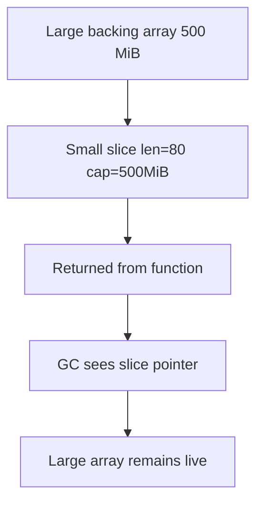
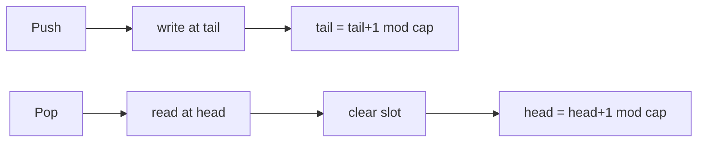
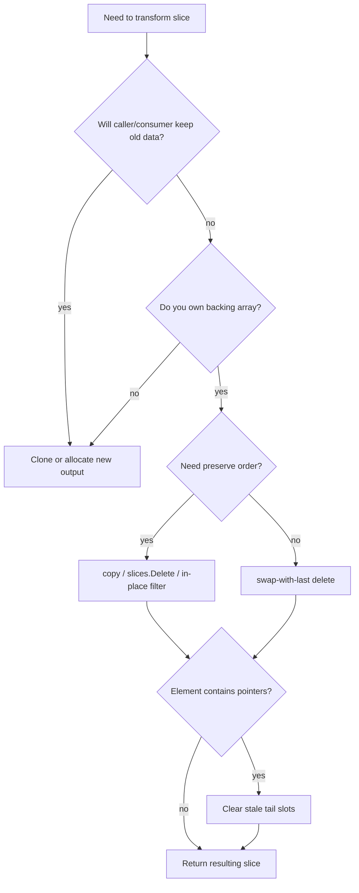

# learn-go-data-model-part-010.md
# Slice II: Growth, Copy, Delete, Insert, Filter, Reuse, dan Leak

> Seri: `learn-go-data-model`  
> Bagian: `010 / 034`  
> Target pembaca: Java software engineer yang ingin memahami Go data model sampai level production-grade engineering.  
> Fokus: operasi slice setelah memahami descriptor/backing array pada part 009.

---

## 0. Executive Summary

Pada part sebelumnya, kita sudah membangun mental model bahwa slice bukan array dan bukan `List` seperti di Java. Slice adalah descriptor kecil yang menunjuk ke backing array:

```text
slice = pointer to backing array + length + capacity
```

Part ini membahas konsekuensi praktis dari model tersebut. Banyak bug slice di Go bukan karena developer tidak tahu `append`, tetapi karena tidak menyadari bahwa operasi-operasi umum seperti delete, insert, filter, reuse, dan sub-slicing dapat mempertahankan backing array besar, mempertahankan pointer lama sehingga GC tidak bisa membebaskan object, atau mengubah data yang masih dipakai caller lain.

Inti dari part ini:

```text
Slice operation correctness = value result + backing array ownership + capacity exposure + GC visibility.
```

Dengan kata lain, saat melihat operasi slice, jangan hanya tanya:

```text
Apakah elemen yang terlihat benar?
```

Tanya juga:

```text
1. Apakah backing array masih dibagi dengan pihak lain?
2. Apakah capacity memungkinkan append merusak data lain?
3. Apakah slice kecil menahan array besar di memory?
4. Apakah elemen pointer yang sudah dihapus masih membuat object hidup?
5. Apakah caller tahu siapa yang memiliki hak mutate?
```

---

## 1. Prerequisite Mental Model dari Part 009

Sebelum masuk ke operasi lanjutan, kunci dulu model ini:

```go
s := []int{10, 20, 30, 40}
```

Secara konseptual:

```text
s
+-----+-----+-----+
| ptr | len | cap |
+-----+-----+-----+
   |
   v
backing array: [10, 20, 30, 40]
```

Ketika slice dicopy:

```go
a := []int{1, 2, 3}
b := a
```

Yang dicopy adalah descriptor-nya, bukan backing array-nya:

```text
a descriptor ----+
                 |
                 v
              [1, 2, 3]
                 ^
                 |
b descriptor ----+
```

Maka:

```go
b[0] = 99
fmt.Println(a) // [99 2 3]
```

Inilah sebabnya semua operasi part ini harus dipahami dari sisi **visible length** dan **hidden capacity/backing ownership**.

---

## 2. Apa yang Sebenarnya Dilakukan `append`

`append` terlihat sederhana:

```go
s = append(s, x)
```

Namun secara mental, `append` melakukan salah satu dari dua hal:

```mermaid
flowchart TD
    A[append(s, x)] --> B{len(s) < cap(s)?}
    B -- yes --> C[Use existing backing array]
    C --> D[Write x at index len]
    D --> E[Return new slice descriptor]
    B -- no --> F[Allocate larger backing array]
    F --> G[Copy old elements]
    G --> H[Write x]
    H --> I[Return descriptor to new array]
```

Pseudocode konseptual:

```go
func conceptualAppend(s []T, x T) []T {
    if len(s) < cap(s) {
        // same backing array
        s2 := s[:len(s)+1]
        s2[len(s)] = x
        return s2
    }

    // new backing array
    newArray := allocateLargerArray()
    copy(newArray, s)
    newArray[len(s)] = x
    return newArray[:len(s)+1]
}
```

Detail growth factor adalah implementation detail runtime, bukan kontrak bahasa. Yang merupakan kontrak penting untuk desain adalah:

```text
append boleh mengembalikan slice dengan backing array yang sama, atau backing array baru.
```

Konsekuensi production:

```go
func Add(xs []int, x int) {
    xs = append(xs, x) // caller tidak melihat perubahan len
}
```

Ini bug klasik. Slice descriptor diterima by value. Jika ingin caller melihat hasil, return slice baru:

```go
func Add(xs []int, x int) []int {
    return append(xs, x)
}
```

Pola benar:

```go
items = Add(items, item)
```

Rule:

```text
Setiap fungsi yang bisa mengubah length/capacity slice harus mengembalikan slice.
```

---

## 3. `append` dan Aliasing Bug

Contoh:

```go
a := []int{1, 2, 3, 4}
b := a[:2]
c := append(b, 99)

fmt.Println(a)
fmt.Println(b)
fmt.Println(c)
```

Hasil konseptual:

```text
a = [1 2 99 4]
b = [1 2]
c = [1 2 99]
```

Kenapa? Karena `b` punya capacity yang masih menjangkau backing array `a`.

```text
backing array: [1, 2, 3, 4]
                ^
                |
                b len=2 cap=4
```

`append(b, 99)` masih cukup capacity, sehingga menulis di index 2 backing array yang sama.

### Full slice expression sebagai capacity firewall

```go
a := []int{1, 2, 3, 4}
b := a[:2:2] // len=2, cap=2
c := append(b, 99)

fmt.Println(a) // [1 2 3 4]
fmt.Println(c) // [1 2 99]
```

`a[:2:2]` membatasi capacity `b` menjadi 2, sehingga `append` harus allocate backing array baru.

Mental model:

```text
s[low:high:max]
len = high - low
cap = max - low
```

Use case:

```go
func Prefix(xs []byte, n int) []byte {
    if n > len(xs) {
        n = len(xs)
    }
    return xs[:n:n] // caller cannot append into hidden tail
}
```

Checklist:

```text
Kalau mengembalikan subslice ke caller dan tidak ingin caller append ke tail internal,
gunakan full slice expression atau clone.
```

---

## 4. Preallocation: `make([]T, 0, n)` vs `make([]T, n)`

Dua bentuk ini sering tertukar:

```go
xs := make([]int, 0, 10)
```

Artinya:

```text
len = 0
cap = 10
visible elements = none
append writes from index 0
```

Sedangkan:

```go
xs := make([]int, 10)
```

Artinya:

```text
len = 10
cap = 10
visible elements = 10 zero values
append writes from index 10
```

Bug:

```go
ids := make([]int64, len(rows))
for _, row := range rows {
    ids = append(ids, row.ID)
}
```

Hasilnya punya `len(rows)` zero values di depan.

Benar jika ingin append:

```go
ids := make([]int64, 0, len(rows))
for _, row := range rows {
    ids = append(ids, row.ID)
}
```

Benar jika ingin assign by index:

```go
ids := make([]int64, len(rows))
for i, row := range rows {
    ids[i] = row.ID
}
```

Decision table:

| Intent | Pattern |
|---|---|
| Build gradually with append | `make([]T, 0, expected)` |
| Fill known positions | `make([]T, n)` |
| Reuse existing buffer | `buf = buf[:0]` |
| Avoid leaking old backing array | `buf = nil` or clone smaller output |

---

## 5. `copy`: Explicit Element Copy

`copy(dst, src)` copies elements from `src` into `dst` and returns number copied.

```go
n := copy(dst, src)
```

Rules:

```text
- Copies up to min(len(dst), len(src)).
- Works with overlapping slices.
- Does not change len or cap.
- Destination must already have enough length, not just capacity.
```

Bug:

```go
dst := make([]byte, 0, len(src))
copy(dst, src) // copies 0 bytes because len(dst) == 0
```

Correct:

```go
dst := make([]byte, len(src))
copy(dst, src)
```

Or idiomatic clone:

```go
dst := append([]byte(nil), src...)
```

Since modern Go also provides `slices.Clone` for generic slice cloning:

```go
dst := slices.Clone(src)
```

### Clone as ownership transfer

Use clone when crossing trust or ownership boundary:

```go
func NewToken(raw []byte) Token {
    return Token{raw: slices.Clone(raw)}
}
```

Without clone:

```go
func NewToken(raw []byte) Token {
    return Token{raw: raw} // caller can mutate Token internals
}
```

Bug:

```go
raw := []byte("secret")
tok := NewToken(raw)
raw[0] = 'X'
// token changed if constructor retained raw directly
```

Rule:

```text
If you store caller-provided slice beyond the call, either document ownership transfer or clone.
```

---

## 6. Delete Pattern: Preserving Order

Canonical order-preserving delete:

```go
func DeleteAt[T any](xs []T, i int) []T {
    copy(xs[i:], xs[i+1:])
    var zero T
    xs[len(xs)-1] = zero
    return xs[:len(xs)-1]
}
```

Why zero the last element?

If `T` contains pointers, the last slot of backing array may still hold a reference to the deleted object. Even though it is outside visible length, the backing array still exists and GC can still see the pointer.

Example without zeroing:

```go
type Session struct {
    UserID string
    Blob   []byte
}

sessions = append(sessions[:i], sessions[i+1:]...)
```

This may leave duplicated last reference in the backing array tail.

Safer generic pattern:

```go
func DeleteAt[T any](xs []T, i int) []T {
    if i < 0 || i >= len(xs) {
        panic("index out of range")
    }
    copy(xs[i:], xs[i+1:])
    var zero T
    xs[len(xs)-1] = zero
    return xs[:len(xs)-1]
}
```

### Using `slices.Delete`

Modern Go has the `slices` package:

```go
xs = slices.Delete(xs, i, i+1)
```

However, you still need to understand what happens conceptually:

```text
Delete shifts elements left and returns shorter slice.
```

In current Go, the standard `slices` helpers are designed with GC hygiene in mind for operations that remove elements, but as an engineer you should still know why clearing stale references matters. Do not treat helper functions as magic.

---

## 7. Delete Pattern: Not Preserving Order

If order does not matter, deleting can be O(1):

```go
func DeleteAtUnordered[T any](xs []T, i int) []T {
    if i < 0 || i >= len(xs) {
        panic("index out of range")
    }

    last := len(xs) - 1
    xs[i] = xs[last]

    var zero T
    xs[last] = zero

    return xs[:last]
}
```

Use case:

```text
- active connection table
- work queue where order irrelevant
- random sampling pool
- entity component systems
- in-memory indexes where stable order not required
```

Do not use if:

```text
- output order is externally visible
- deterministic test expected
- index corresponds to sorted order
- order encodes priority
```

Mermaid decision:

```mermaid
flowchart TD
    A[Need to delete element] --> B{Must preserve order?}
    B -- yes --> C[copy left / slices.Delete]
    B -- no --> D[swap with last + shrink]
    C --> E[O(n-i)]
    D --> F[O(1)]
```

---

## 8. Delete Range

Order-preserving delete range:

```go
func DeleteRange[T any](xs []T, from, to int) []T {
    if from < 0 || to < from || to > len(xs) {
        panic("invalid range")
    }

    n := copy(xs[from:], xs[to:])

    var zero T
    for i := from+n; i < len(xs); i++ {
        xs[i] = zero
    }

    return xs[:from+n]
}
```

Example:

```go
xs := []int{1, 2, 3, 4, 5, 6}
xs = DeleteRange(xs, 2, 5)
fmt.Println(xs) // [1 2 6]
```

Using standard helper:

```go
xs = slices.Delete(xs, from, to)
```

Production caution:

```text
Range delete usually has boundary bugs. Validate from/to before mutation.
```

---

## 9. Insert Pattern

Insert one element while preserving order:

```go
func InsertAt[T any](xs []T, i int, v T) []T {
    if i < 0 || i > len(xs) {
        panic("index out of range")
    }

    xs = append(xs, v)       // grow by one
    copy(xs[i+1:], xs[i:])   // shift right
    xs[i] = v
    return xs
}
```

But note subtle issue: after `append(xs, v)`, if `v` contains references and shifting overwrites, this is okay, but the temporary `v` at end is overwritten by copy. The final result is correct.

Alternative with explicit zero append:

```go
func InsertAt[T any](xs []T, i int, v T) []T {
    if i < 0 || i > len(xs) {
        panic("index out of range")
    }

    var zero T
    xs = append(xs, zero)
    copy(xs[i+1:], xs[i:])
    xs[i] = v
    return xs
}
```

Insert multiple:

```go
func InsertMany[T any](xs []T, i int, values ...T) []T {
    if i < 0 || i > len(xs) {
        panic("index out of range")
    }
    if len(values) == 0 {
        return xs
    }

    oldLen := len(xs)
    xs = append(xs, values...)
    copy(xs[i+len(values):], xs[i:oldLen])
    copy(xs[i:], values)
    return xs
}
```

Checklist:

```text
- Is insertion order-preserving?
- Is index allowed at len(xs)?
- Can values alias xs?
- Is capacity growth acceptable?
- Is this operation frequent enough to need a different data structure?
```

If you are inserting near the front frequently, slice may be the wrong structure.

---

## 10. Filter In-Place

Filter without allocating a new backing array:

```go
func FilterInPlace[T any](xs []T, keep func(T) bool) []T {
    out := xs[:0]
    for _, x := range xs {
        if keep(x) {
            out = append(out, x)
        }
    }

    var zero T
    for i := len(out); i < len(xs); i++ {
        xs[i] = zero
    }

    return out
}
```

Example:

```go
nums := []int{1, 2, 3, 4, 5}
nums = FilterInPlace(nums, func(n int) bool { return n%2 == 1 })
fmt.Println(nums) // [1 3 5]
```

Why `out := xs[:0]`?

```text
Reuse same backing array, start visible length at 0, append kept elements.
```

Mermaid model:

```mermaid
flowchart LR
    A[Original slice len=N] --> B[out := xs[:0]]
    B --> C[Scan original visible elements]
    C --> D[Append kept elements to front]
    D --> E[Clear stale tail]
    E --> F[Return out]
```

Trade-off:

| Strategy | Allocation | Mutates input backing array | Good for |
|---|---:|---:|---|
| In-place filter | Low | Yes | internal buffers, performance path |
| New slice filter | Higher | No | API boundaries, immutable-style logic |

New slice version:

```go
func FilterCopy[T any](xs []T, keep func(T) bool) []T {
    out := make([]T, 0, len(xs))
    for _, x := range xs {
        if keep(x) {
            out = append(out, x)
        }
    }
    return out
}
```

Decision:

```text
Use in-place filter only when you own the slice/backing array.
```

---

## 11. Reuse with `s[:0]`

Common high-throughput pattern:

```go
buf := make([]byte, 0, 4096)

for {
    buf = buf[:0]
    buf = append(buf, header...)
    buf = append(buf, payload...)
    process(buf)
}
```

This avoids repeated allocation.

But reuse has risks:

```go
func processLater(b []byte) {
    queue = append(queue, b) // stores descriptor only
}

buf = buf[:0]
buf = append(buf, "first"...)
processLater(buf)

buf = buf[:0]
buf = append(buf, "second"...)
processLater(buf)
```

Both queued slices may point to the same backing array. The first message can be overwritten.

Correct if storing beyond current iteration:

```go
processLater(slices.Clone(buf))
```

Rule:

```text
Reuse buffer only when all consumers finish before reuse.
```

This is ownership/lifetime issue, not syntax issue.

---

## 12. Reslicing to Zero vs Setting Nil

Two common reset patterns:

```go
xs = xs[:0]
```

and:

```go
xs = nil
```

They mean different things.

| Operation | Keeps backing array? | Capacity retained? | Good for |
|---|---:|---:|---|
| `xs = xs[:0]` | Yes | Yes | reuse buffer |
| `xs = nil` | No, if no other refs | No | release memory |

Example:

```go
buf := make([]byte, 0, 64<<20) // 64 MiB
buf = buf[:0]                  // still retains 64 MiB capacity
```

If no longer needed:

```go
buf = nil
```

But note: setting one slice variable to nil does not free memory if another slice still references the same backing array.

```go
a := make([]byte, 64<<20)
b := a[:1]
a = nil
// backing array still retained by b
```

---

## 13. Memory Retention Leak from Subslice

Classic production bug:

```go
func FirstLine(file []byte) []byte {
    i := bytes.IndexByte(file, '\n')
    if i < 0 {
        return file
    }
    return file[:i]
}
```

If `file` is 500 MiB and first line is 80 bytes, returned slice of 80 bytes retains the 500 MiB backing array.

Fix:

```go
func FirstLine(file []byte) []byte {
    i := bytes.IndexByte(file, '\n')
    if i < 0 {
        return slices.Clone(file)
    }
    return slices.Clone(file[:i])
}
```

Or for string:

```go
line := strings.Clone(bigString[:i])
```

Mental model:



Review heuristic:

```text
If returning a small slice/string derived from a large buffer, clone it unless retaining the large buffer is intentional.
```

---

## 14. Clearing References for GC

Consider:

```go
type Request struct {
    UserID string
    Body   []byte
}

queue := []*Request{r1, r2, r3, r4}
queue = queue[1:]
```

The visible queue no longer includes `r1`, but the old backing array may still hold pointer to `r1` in slot 0 depending on how it is retained. More common in delete/filter patterns, stale references in tail remain.

For long-lived buffers of pointer elements, clear removed slots:

```go
var zero *Request
queue[0] = zero
queue = queue[1:]
```

For pop front, better pattern may be ring buffer rather than repeatedly reslicing.

### Pop back

```go
func PopBack[T any](xs []T) ([]T, T, bool) {
    if len(xs) == 0 {
        var zero T
        return xs, zero, false
    }

    last := len(xs) - 1
    v := xs[last]

    var zero T
    xs[last] = zero

    return xs[:last], v, true
}
```

Why zero before shrink?

```text
Because the backing array slot remains allocated and may be scanned by GC.
```

---

## 15. Stack and Queue with Slice

### Stack

Push:

```go
stack = append(stack, x)
```

Pop:

```go
func Pop[T any](xs []T) ([]T, T, bool) {
    if len(xs) == 0 {
        var zero T
        return xs, zero, false
    }
    i := len(xs) - 1
    v := xs[i]
    var zero T
    xs[i] = zero
    return xs[:i], v, true
}
```

Slice is excellent for stack.

### Queue naive pop-front

```go
x := q[0]
q = q[1:]
```

Problem:

```text
- Retains old backing array.
- Capacity shrinks from front but old array remains.
- Can retain popped elements if not cleared.
```

Safer pop front:

```go
func PopFront[T any](q []T) ([]T, T, bool) {
    if len(q) == 0 {
        var zero T
        return q, zero, false
    }
    v := q[0]
    var zero T
    q[0] = zero
    return q[1:], v, true
}
```

But for high-throughput queue, use ring buffer.

Simplified ring buffer idea:

```text
array capacity fixed/growing
head index
tail index
size
```

Mermaid:



Slice alone is not always the right abstraction.

---

## 16. Batch Processing Pattern

Slices are often used to batch database rows, events, messages, or IDs.

Bad pattern:

```go
var batch []Event
for event := range events {
    batch = append(batch, event)
    if len(batch) == 1000 {
        send(batch)
        batch = batch[:0]
    }
}
```

This is only safe if `send(batch)` completes synchronously and does not retain the slice.

If `send` is async or stores it:

```go
sendAsync(slices.Clone(batch))
batch = batch[:0]
```

Alternative allocate new batch after send:

```go
sendAsync(batch)
batch = make([]Event, 0, 1000)
```

Decision:

| Consumer behavior | Safe reset |
|---|---|
| Synchronous, does not retain | `batch = batch[:0]` |
| Async, may retain | clone or allocate new batch |
| Unknown third-party consumer | clone |

Boundary rule:

```text
Do not reuse a slice after handing it to code that may retain it.
```

---

## 17. Slice and API Ownership Contracts

Every slice parameter or return value should have implicit or explicit ownership semantics.

### Borrowing input

```go
func Sum(xs []int) int
```

Contract:

```text
Does not retain xs.
Does not mutate xs.
```

### Mutating input in-place

```go
func SortUsers(users []User)
```

Contract:

```text
Mutates order of users.
Does not retain users.
```

### Retaining input

```go
func NewStore(keys []Key) *Store
```

Must decide:

```go
func NewStore(keys []Key) *Store {
    return &Store{keys: slices.Clone(keys)}
}
```

or document:

```text
NewStore takes ownership of keys. Caller must not mutate keys after passing it.
```

In most public APIs, clone is safer unless performance strongly dictates ownership transfer.

### Returning internal slice

Bad:

```go
func (s *Store) Keys() []Key {
    return s.keys
}
```

Caller can mutate internal state.

Safer:

```go
func (s *Store) Keys() []Key {
    return slices.Clone(s.keys)
}
```

Or iterator/callback pattern if allocation matters:

```go
func (s *Store) RangeKeys(fn func(Key) bool) {
    for _, k := range s.keys {
        if !fn(k) {
            return
        }
    }
}
```

---

## 18. Slice of Values vs Slice of Pointers

Two common forms:

```go
[]User
[]*User
```

Trade-off:

| Aspect | `[]User` | `[]*User` |
|---|---|---|
| Locality | Better | Worse |
| Per-element heap allocation | Usually lower | Often higher |
| Mutation sharing | Copy unless address used | Shared pointed objects |
| GC scan | Depends on fields | More pointer scanning |
| Nil element possible | No | Yes |
| Stable pointer identity | Harder | Natural |

Use `[]User` when:

```text
- User is small/medium value object
- bulk processing matters
- no optional nil element needed
- identity is external field, not memory address
```

Use `[]*User` when:

```text
- objects are large and copied often
- identity/mutation sharing is required
- nil is meaningful
- polymorphic object graph exists
```

But avoid automatically using pointers because Java trained you that objects are references. In Go, pointer-heavy data models can hurt locality and increase GC work.

---

## 19. Range Loop and Mutation

Range over slice copies each element into iteration variable:

```go
for _, user := range users {
    user.Active = true // modifies copy if []User
}
```

Correct:

```go
for i := range users {
    users[i].Active = true
}
```

For slice of pointers:

```go
for _, user := range users {
    user.Active = true // modifies pointed object
}
```

But nil pointer risk:

```go
for _, user := range users {
    if user == nil {
        continue
    }
    user.Active = true
}
```

Rule:

```text
Range variable is a copy. Mutate through index for []T, through pointer for []*T.
```

---

## 20. Append While Ranging

This is legal but often unclear.

```go
for _, x := range xs {
    if x%2 == 0 {
        xs = append(xs, x)
    }
}
```

Range evaluates the slice expression once at loop start. Appending may grow `xs`, but the loop iteration count is based on the original length.

This can be acceptable, but in production code it often deserves an explicit two-phase design:

```go
var extra []int
for _, x := range xs {
    if x%2 == 0 {
        extra = append(extra, x)
    }
}
xs = append(xs, extra...)
```

Why?

```text
- clearer intent
- less aliasing surprise
- easier to test
- easier to reason about capacity reallocation
```

---

## 21. Stable Output Ordering

Slice preserves order. Map does not guarantee iteration order. A common pattern is map for membership/index, slice for stable output.

```go
seen := make(map[UserID]struct{})
out := make([]UserID, 0, len(input))

for _, id := range input {
    if _, ok := seen[id]; ok {
        continue
    }
    seen[id] = struct{}{}
    out = append(out, id)
}
```

This is a powerful production pattern:

```text
map = fast lookup
slice = deterministic order
```

Useful for:

```text
- API response order
- audit log deterministic rendering
- test stable output
- migration reports
- reconciliation job result
```

---

## 22. Sorting Slices

Modern Go provides generic `slices` helpers:

```go
slices.Sort(nums)
slices.SortFunc(users, func(a, b User) int {
    return strings.Compare(a.Email, b.Email)
})
```

Sorting mutates the slice in-place.

API implication:

```go
func SortedUsers(users []User) []User {
    out := slices.Clone(users)
    slices.SortFunc(out, func(a, b User) int {
        return strings.Compare(a.Email, b.Email)
    })
    return out
}
```

If function name is `SortUsers`, mutation is expected. If function name is `SortedUsers`, returning a sorted copy is more natural.

Naming matters.

---

## 23. Capacity Trimming

Sometimes a slice has small length but huge capacity.

```go
small := big[:10]
```

Capacity may remain huge. Options:

### Clone

```go
small = slices.Clone(small)
```

### Append clone idiom

```go
small = append([]T(nil), small...)
```

### Clip capacity

```go
small = slices.Clip(small)
```

`Clip` reduces capacity to length, but understand the semantics: depending on implementation and data, clipping is a capacity control operation, not a universal deep-copy guarantee across all conceptual boundaries. If your goal is to prevent mutation through shared backing array with certainty, clone is clearer.

Use clone for ownership isolation:

```go
out := slices.Clone(in[:n])
```

Use clip when you want to reduce excess capacity while preserving elements:

```go
xs = slices.Clip(xs)
```

---

## 24. Slice of Bytes as Mutable Text/Blob Buffer

`[]byte` is commonly used for:

```text
- network buffers
- JSON encoding output
- file reads
- crypto input/output
- compression buffers
- log formatting
```

Key rule:

```text
[]byte is mutable. string is immutable.
```

When converting:

```go
s := string(b)
```

You get a string value. Treat it as a boundary conversion. Do not assume zero-copy unless using explicit unsafe APIs, and do not use unsafe conversion unless you can prove lifetime and immutability.

For APIs:

```go
func ParseToken(raw []byte) (Token, error) {
    raw = bytes.TrimSpace(raw)
    if len(raw) == 0 {
        return Token{}, ErrEmptyToken
    }
    return Token{raw: slices.Clone(raw)}, nil
}
```

Clone because token stores raw.

---

## 25. Production Anti-Patterns

### Anti-pattern 1: Ignoring returned slice

```go
append(xs, x) // compile error if result unused
```

But subtler:

```go
func Add(xs []T, x T) {
    xs = append(xs, x)
}
```

Caller does not get new descriptor.

### Anti-pattern 2: Returning internal slice

```go
func (c *Cache) Entries() []Entry {
    return c.entries
}
```

Caller can mutate cache internals.

### Anti-pattern 3: Subslice of huge buffer

```go
return payload[:32]
```

May retain huge payload.

### Anti-pattern 4: Delete pointer elements without clearing tail

```go
xs = append(xs[:i], xs[i+1:]...)
```

May retain removed object longer than expected.

### Anti-pattern 5: Reusing batch after async handoff

```go
sendAsync(batch)
batch = batch[:0]
```

May corrupt async consumer data.

### Anti-pattern 6: Using slice as queue forever

```go
q = q[1:]
```

May retain backing array and degrade memory behavior.

### Anti-pattern 7: Assuming append always reallocates

```go
child := parent[:n]
child = append(child, x) // may mutate parent
```

Use `parent[:n:n]` or clone.

---

## 26. Java Engineer Translation Layer

| Java concept | Go equivalent | Important difference |
|---|---|---|
| `ArrayList<T>` | `[]T` | Slice has exposed capacity/backing aliasing model |
| `new ArrayList<>(n)` | `make([]T, 0, n)` | Length remains zero |
| `list.add(x)` | `xs = append(xs, x)` | Must assign returned slice |
| `list.subList(a,b)` | `xs[a:b]` | Shares backing array; can retain large array |
| `Collections.sort(list)` | `slices.Sort` / `SortFunc` | Mutates in-place |
| Defensive copy | `slices.Clone` | Required at ownership boundaries |
| `clear()` | `xs = xs[:0]` or `xs = nil` | Reuse vs release memory differs |

Important unlearning:

```text
A Go slice is not an owning collection object.
It is a view over an array.
```

This means Go forces you to think about ownership that Java collections often hide behind object identity.

---

## 27. Mermaid: Slice Operation Decision Model



---

## 28. Production Recipes

### 28.1 Safe append helper

```go
func AppendCloned[T any](xs []T, values ...T) []T {
    out := make([]T, 0, len(xs)+len(values))
    out = append(out, xs...)
    out = append(out, values...)
    return out
}
```

Use when you must not mutate input backing array.

### 28.2 Safe public getter

```go
type Registry struct {
    handlers []Handler
}

func (r *Registry) Handlers() []Handler {
    return slices.Clone(r.handlers)
}
```

### 28.3 Internal mutable view

```go
func (r *Registry) appendHandler(h Handler) {
    r.handlers = append(r.handlers, h)
}
```

Internal method can mutate because receiver owns the slice.

### 28.4 Stable dedup

```go
func DedupStable[T comparable](xs []T) []T {
    seen := make(map[T]struct{}, len(xs))
    out := make([]T, 0, len(xs))

    for _, x := range xs {
        if _, ok := seen[x]; ok {
            continue
        }
        seen[x] = struct{}{}
        out = append(out, x)
    }

    return out
}
```

### 28.5 In-place stable dedup

```go
func DedupStableInPlace[T comparable](xs []T) []T {
    seen := make(map[T]struct{}, len(xs))
    out := xs[:0]

    for _, x := range xs {
        if _, ok := seen[x]; ok {
            continue
        }
        seen[x] = struct{}{}
        out = append(out, x)
    }

    var zero T
    for i := len(out); i < len(xs); i++ {
        xs[i] = zero
    }

    return out
}
```

Only use in-place if caller expects mutation.

---

## 29. Mini Lab 1: Predict Backing Array Mutation

Predict output:

```go
func main() {
    a := []int{1, 2, 3, 4}
    b := a[:2]
    b = append(b, 9)
    fmt.Println(a)
    fmt.Println(b)
}
```

Expected:

```text
[1 2 9 4]
[1 2 9]
```

Then modify:

```go
b := a[:2:2]
```

Expected:

```text
[1 2 3 4]
[1 2 9]
```

Lesson:

```text
Capacity controls whether append can mutate shared tail.
```

---

## 30. Mini Lab 2: Copy Bug

Bug:

```go
func CloneBad(src []byte) []byte {
    dst := make([]byte, 0, len(src))
    copy(dst, src)
    return dst
}
```

Fix:

```go
func CloneGood(src []byte) []byte {
    dst := make([]byte, len(src))
    copy(dst, src)
    return dst
}
```

Or:

```go
func CloneGood(src []byte) []byte {
    return slices.Clone(src)
}
```

Lesson:

```text
copy uses len(dst), not cap(dst).
```

---

## 31. Mini Lab 3: Memory Retention

Write a function that returns first 10 bytes from a huge input.

Bad:

```go
func Head10(b []byte) []byte {
    if len(b) > 10 {
        return b[:10]
    }
    return b
}
```

Safe:

```go
func Head10(b []byte) []byte {
    if len(b) > 10 {
        return slices.Clone(b[:10])
    }
    return slices.Clone(b)
}
```

Lesson:

```text
Small slice can retain huge backing array.
```

---

## 32. Mini Lab 4: Delete and GC Hygiene

Implement delete for pointer slice:

```go
func DeletePtrAt[T any](xs []*T, i int) []*T {
    if i < 0 || i >= len(xs) {
        panic("index out of range")
    }
    copy(xs[i:], xs[i+1:])
    xs[len(xs)-1] = nil
    return xs[:len(xs)-1]
}
```

Then compare with:

```go
xs = append(xs[:i], xs[i+1:]...)
```

Lesson:

```text
The visible result may be the same, but memory lifetime behavior can differ.
```

---

## 33. Production Review Checklist

When reviewing slice-heavy code, ask:

```text
[ ] Does every append result get assigned or returned?
[ ] Does a function that may grow/shrink slice return the resulting slice?
[ ] Is preallocation using correct len/cap intent?
[ ] Is copy destination length correct?
[ ] Are subslices returned from large buffers cloned when needed?
[ ] Is full slice expression used to prevent append into hidden capacity?
[ ] Are removed pointer elements cleared for GC hygiene?
[ ] Is in-place filter/delete only used when backing array is owned?
[ ] Is async handoff protected from buffer reuse?
[ ] Is public getter returning a clone instead of internal slice?
[ ] Is slice used as queue where ring buffer would be better?
[ ] Is ordering requirement explicit?
[ ] Is nil vs empty slice behavior intentional for JSON/API?
[ ] Is []T vs []*T chosen based on locality/identity/GC, not habit?
```

---

## 34. Key Takeaways

```text
1. Slice operation is not just about visible elements.
2. Always reason about backing array ownership.
3. append may reuse or replace backing array.
4. copy uses destination length, not capacity.
5. Deleting pointer elements should clear stale slots.
6. Small subslices can retain huge arrays.
7. Reuse with s[:0] is powerful but unsafe across async/retained boundaries.
8. Clone at ownership boundaries.
9. Full slice expression is a capacity firewall.
10. Slice is a view, not an owning collection object.
```

---

## 35. How This Connects to Next Part

Part 010 completes operational slice mechanics. The next part, `learn-go-data-model-part-011.md`, moves to `map`:

```text
slice = ordered view over array
map   = hash table with key comparability rules and intentionally unspecified iteration order
```

The core shift will be:

```text
from memory-contiguous sequence semantics
to key-based lookup semantics
```

We will cover:

```text
- map as reference-like runtime structure
- nil map read/write behavior
- key comparability
- comma-ok lookup
- zero value ambiguity
- delete semantics
- iteration nondeterminism
- concurrency hazard
- Java HashMap vs Go map
```

---

## References

- Go Language Specification — Slice types, slice expressions, append, copy: https://go.dev/ref/spec
- Go 1.26 Release Notes: https://go.dev/doc/go1.26
- Go Blog — Go Slices: usage and internals: https://go.dev/blog/slices-intro
- Package `slices`: https://pkg.go.dev/slices
- Package `bytes`: https://pkg.go.dev/bytes
- Package `strings`: https://pkg.go.dev/strings
- Go GC Guide: https://go.dev/doc/gc-guide
- Effective Go: https://go.dev/doc/effective_go


<!-- NAVIGATION_FOOTER -->
<div class="page-nav">
<a href="./learn-go-data-model-part-009.md">⬅️ Part 009 — Slice I: Descriptor, Backing Array, `len`/`cap`, dan Aliasing</a>
<a href="./index.md">📚 Kategori</a>
<a href="../../index.md">🏠 Home</a>
<a href="./learn-go-data-model-part-011.md">Part 011 — Map I: Hash Table Semantics, Key Rules, `nil` Map, Iteration ➡️</a>
</div>
