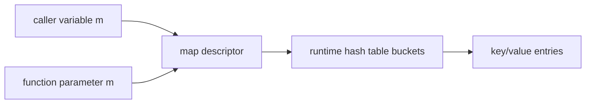
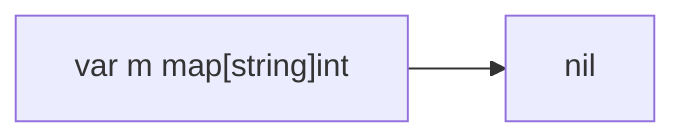
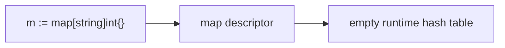
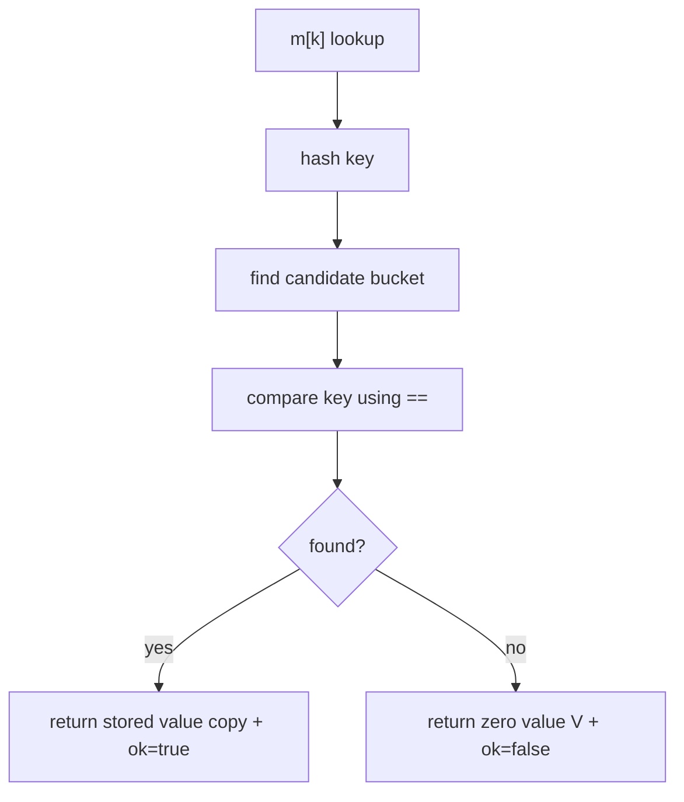
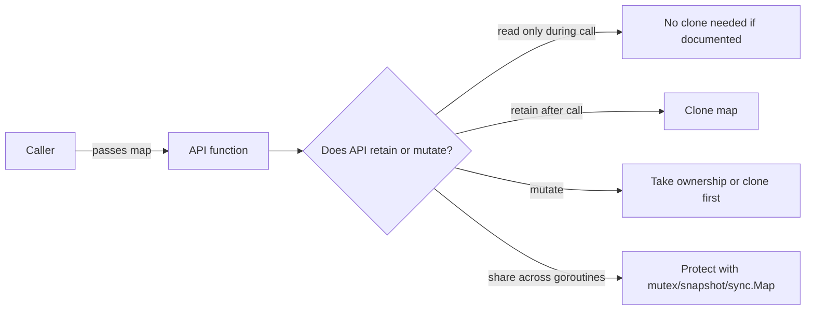

# learn-go-data-model-part-011.md

# Part 011 — Map I: Hash Table Semantics, Key Rules, `nil` Map, Iteration

> Seri: `learn-go-data-model`  
> Bagian: `011 / 034`  
> Target pembaca: Java software engineer yang ingin memahami Go data model pada level production engineering  
> Fokus: `map[K]V` sebagai struktur data built-in, bukan sekadar “HashMap versi Go”

---

## 0. Posisi Part Ini dalam Seri

Pada part sebelumnya kita membahas `slice`: descriptor kecil yang menunjuk ke backing array, memiliki `len`/`cap`, dan membawa risiko aliasing. Sekarang kita masuk ke `map`, yaitu built-in associative container Go.

Di Java, developer terbiasa memikirkan:

```java
Map<String, User> users = new HashMap<>();
```

Sebagai object heap biasa dengan identity, method, implementation class, dan iterator object.

Di Go, map terlihat sederhana:

```go
users := map[string]User{}
```

Namun secara mental model, map di Go memiliki beberapa sifat penting:

```text
map[K]V
= built-in hash table
= reference-like value
= zero value nil
= key harus comparable
= lookup key yang tidak ada menghasilkan zero value V
= iteration order tidak dijamin
= tidak aman untuk concurrent read/write tanpa sinkronisasi
```

Part ini belum membahas semua pattern produksi map seperti set, multimap, secondary index, cache, counter, dan memory tuning. Itu akan dibahas di part 012. Part ini fokus pada **semantik dasar yang harus benar dulu**.

---

## 1. Tujuan Pembelajaran

Setelah part ini, kamu harus bisa menjawab dengan yakin:

1. Apa sebenarnya `map[K]V` di Go?
2. Mengapa map disebut reference-like walaupun Go tetap pass-by-value?
3. Apa perbedaan `nil map`, empty map, dan populated map?
4. Mengapa read dari nil map aman tetapi write ke nil map panic?
5. Mengapa key map harus comparable?
6. Mengapa slice, map, dan function tidak bisa menjadi key map?
7. Mengapa lookup map yang key-nya tidak ada mengembalikan zero value?
8. Kapan wajib memakai comma-ok idiom?
9. Apa konsekuensi iteration order yang tidak dijamin?
10. Mengapa concurrent map access bisa fatal?
11. Bagaimana membedakan map sebagai internal data structure vs API contract?
12. Apa bedanya `map[string]User` vs `map[string]*User`?
13. Bagaimana membandingkan map Go dengan `HashMap`, `ConcurrentHashMap`, dan `LinkedHashMap` Java?
14. Apa checklist review PR yang memakai map?

---

## 2. Map dalam Go: Definisi Mental

Map adalah koleksi pasangan key-value.

```go
var m map[string]int
```

Tipe di atas berarti:

```text
key type   = string
value type = int
```

Map diakses dengan operator index:

```go
count := m["alice"]
```

Map diupdate dengan assignment:

```go
m["alice"] = 3
```

Entry dihapus dengan built-in `delete`:

```go
delete(m, "alice")
```

Namun tiga baris di atas belum cukup untuk memahami map secara benar. Yang lebih penting:

```text
Map bukan struct yang kamu instantiate dengan constructor.
Map bukan slice.
Map bukan pointer eksplisit.
Map bukan interface.
Map bukan ordered dictionary.
Map bukan immutable.
Map bukan safe concurrent collection.
Map adalah built-in runtime data structure dengan syntax khusus.
```

---

## 3. Bentuk Tipe Map

Syntax formal:

```go
map[KeyType]ValueType
```

Contoh:

```go
map[string]int
map[int64]User
map[UserID]UserProfile
map[[16]byte]Session
map[Status][]Order
map[string]map[string]string
```

`KeyType` harus comparable. `ValueType` bebas; bisa comparable atau tidak.

Valid:

```go
map[string][]byte
map[string]map[string]int
map[string]func()
```

Karena value tidak harus comparable.

Invalid:

```go
map[[]byte]int      // invalid: slice tidak comparable
map[map[string]int]int // invalid: map tidak comparable
map[func()]int      // invalid: function tidak comparable
```

---

## 4. Map adalah Reference-Like Value

Go pass-by-value. Ini tetap berlaku untuk map.

```go
func add(m map[string]int) {
    m["x"] = 1
}

func main() {
    m := make(map[string]int)
    add(m)
    fmt.Println(m["x"]) // 1
}
```

Pertanyaan penting:

> Kalau Go pass-by-value, mengapa perubahan di function terlihat oleh caller?

Karena value map yang dicopy bukan seluruh isi hash table. Value map adalah descriptor/header yang menunjuk ke runtime hash table internal.

Secara konseptual:



Saat parameter map dicopy, descriptor-nya dicopy, tetapi kedua descriptor menunjuk ke hash table yang sama.

Mental model yang berguna:

```text
Passing map copies the handle, not the table.
Mutating through the handle mutates the shared table.
Reassigning the handle only changes that local variable.
```

Contoh:

```go
func mutate(m map[string]int) {
    m["a"] = 1
}

func replace(m map[string]int) {
    m = map[string]int{"b": 2}
}

func main() {
    m := map[string]int{}
    mutate(m)
    fmt.Println(m) // map[a:1]

    replace(m)
    fmt.Println(m) // still map[a:1]
}
```

`mutate` mengubah table yang sama. `replace` hanya mengganti local descriptor `m`.

---

## 5. `nil` Map vs Empty Map

Zero value dari map adalah `nil`.

```go
var m map[string]int

fmt.Println(m == nil) // true
```

`nil map` belum menunjuk ke hash table.



Empty map yang sudah dibuat:

```go
m := map[string]int{}
n := make(map[string]int)
```

Keduanya bukan nil.



Perbandingan perilaku:

| Operasi | nil map | empty map |
|---|---:|---:|
| `m == nil` | `true` | `false` |
| `len(m)` | `0` | `0` |
| read `m[k]` | aman | aman |
| comma-ok `v, ok := m[k]` | aman | aman |
| `delete(m, k)` | aman | aman |
| `range m` | aman, 0 iterasi | aman, 0 iterasi |
| write `m[k] = v` | panic | aman |

Contoh:

```go
var m map[string]int

fmt.Println(len(m))       // 0
fmt.Println(m["missing"]) // 0

delete(m, "x")            // ok

m["x"] = 1                // panic: assignment to entry in nil map
```

Ini salah satu jebakan map paling umum.

---

## 6. Kenapa Read dari Nil Map Aman, Write Panic?

Read dari nil map dianggap seperti read dari empty map:

```go
var m map[string]int
v := m["x"] // zero value int = 0
```

Tidak ada table, tidak ada entry, maka hasilnya zero value.

Write membutuhkan runtime table untuk menyimpan entry. Karena nil map belum punya table, assignment tidak bisa dilakukan.

```go
m["x"] = 1 // panic
```

Solusi:

```go
m = make(map[string]int)
m["x"] = 1
```

Atau literal:

```go
m := map[string]int{
    "x": 1,
}
```

---

## 7. Zero Value Ambiguity

Map lookup biasa:

```go
v := m[k]
```

Kalau key ada dan value-nya zero value, hasilnya sama dengan kalau key tidak ada.

Contoh:

```go
scores := map[string]int{
    "alice": 0,
}

fmt.Println(scores["alice"]) // 0
fmt.Println(scores["bob"])   // 0
```

Dua kondisi berbeda menghasilkan nilai sama:

```text
key exists with value 0
key does not exist
```

Maka gunakan comma-ok idiom:

```go
score, ok := scores["alice"]
if !ok {
    // key does not exist
}
_ = score
```

Ini bukan hanya idiom. Ini correctness boundary.

---

## 8. Comma-Ok Idiom

Map lookup memiliki dua bentuk:

```go
v := m[k]
v, ok := m[k]
```

Bentuk kedua mengembalikan boolean apakah key ada.

```go
profile, ok := profiles[userID]
if !ok {
    return ErrUserNotFound
}
return profile, nil
```

Gunakan comma-ok ketika:

```text
- zero value V adalah nilai valid
- absence memiliki makna domain
- kamu perlu membedakan “not configured” vs “configured as zero”
- kamu sedang implement cache
- kamu sedang implement authorization decision
- kamu membaca map dengan value bool
- kamu sedang melakukan aggregation yang zero value bisa valid
```

Contoh authorization:

```go
type Permission string

const (
    PermissionRead  Permission = "read"
    PermissionWrite Permission = "write"
)

allowed := map[Permission]bool{
    PermissionRead: true,
    // PermissionWrite intentionally absent
}

v := allowed[PermissionWrite]
fmt.Println(v) // false
```

Apakah `false` berarti explicitly denied atau tidak ada entry?

Untuk policy engine, beda ini penting. Desain yang lebih eksplisit:

```go
type Decision int

const (
    DecisionUnknown Decision = iota
    DecisionAllow
    DecisionDeny
)

decisions := map[Permission]Decision{
    PermissionRead: DecisionAllow,
}

decision, ok := decisions[PermissionWrite]
if !ok {
    decision = DecisionUnknown
}
```

---

## 9. Map Key Harus Comparable

Map memakai hash + equality untuk menemukan key. Karena itu key harus bisa dibandingkan dengan `==`.

Comparable type di Go meliputi:

```text
- boolean
- integer
- floating-point
- complex
- string
- pointer
- channel
- interface, jika dynamic value comparable
- struct, jika semua field comparable
- array, jika element comparable
```

Tidak comparable:

```text
- slice
- map
- function
- struct yang punya field tidak comparable
- array yang element-nya tidak comparable
```

Valid:

```go
type UserID string

m1 := map[UserID]int{}

type Pair struct {
    A string
    B int
}

m2 := map[Pair]string{}

type Digest [32]byte

m3 := map[Digest]bool{}

_, _, _ = m1, m2, m3
```

Invalid:

```go
type BadKey struct {
    Tags []string
}

// map[BadKey]int // compile error
```

Karena `Tags []string` tidak comparable.

---

## 10. Slice Tidak Bisa Menjadi Key: `[]byte` Case

Kasus nyata: ingin membuat map dari payload bytes.

Invalid:

```go
// seen := map[[]byte]bool{} // invalid
```

Karena slice adalah descriptor ke backing array dan tidak comparable.

Solusi tergantung domain:

### 10.1 Convert ke string

```go
seen := map[string]bool{}

b := []byte("abc")
seen[string(b)] = true
```

Ini membuat key immutable string. Tetapi conversion dari `[]byte` ke string membuat copy, kecuali compiler/runtime bisa melakukan optimisasi tertentu pada konteks sangat spesifik. Jangan desain correctness bergantung pada zero-copy.

### 10.2 Hash ke array fixed-size

```go
sum := sha256.Sum256(b) // [32]byte
seen := map[[32]byte]bool{}
seen[sum] = true
```

Ini sering lebih tepat untuk payload besar.

### 10.3 Canonical domain key

```go
type RequestID string
type ContentDigest [32]byte

byRequest := map[RequestID]Record{}
byDigest := map[ContentDigest]Record{}
```

Domain key eksplisit lebih baik daripada “asal bisa jadi map key”.

---

## 11. Struct sebagai Key

Struct bisa menjadi key jika semua field comparable.

```go
type TenantUser struct {
    TenantID string
    UserID   string
}

sessions := map[TenantUser]Session{}
sessions[TenantUser{TenantID: "t1", UserID: "u1"}] = Session{}
```

Ini pattern bagus untuk composite key.

Namun hati-hati:

```go
type QueryKey struct {
    TenantID string
    Filters  []string // invalid for map key
}
```

Jika key memiliki list/filter, kamu harus canonicalize:

```go
type QueryKey struct {
    TenantID     string
    FilterDigest [32]byte
}
```

Atau encode ke string canonical:

```go
type QueryKey string
```

Tetapi pastikan encoding tidak ambigu:

```text
tenant=ab, user=c
tenant=a, user=bc
```

Jika digabung asal `tenant + user`, bisa collision semantic.

Gunakan separator yang tidak ambigu atau length-prefix/canonical encoding.

---

## 12. Interface sebagai Key: Bisa, Tapi Hati-Hati

Interface type comparable secara statis, tetapi runtime value di dalamnya harus comparable. Jika dynamic value tidak comparable, operasi map bisa panic.

Contoh:

```go
m := map[any]string{}

m["x"] = "ok"
m[123] = "ok"

// m[[]int{1, 2}] = "boom" // panic: hash of unhashable type []int
```

Masalahnya bukan compile-time, tetapi runtime.

Karena itu `map[any]V` sebagai public API sering berbahaya. Ia menggeser error dari compile-time ke runtime.

Lebih baik:

```go
type AttributeKey string

attrs := map[AttributeKey]string{}
```

Atau untuk heterogeneous metadata:

```go
type AttributeValue struct {
    Kind  AttributeKind
    Text  string
    Int64 int64
    Bool  bool
}
```

Daripada:

```go
map[string]any
```

`map[string]any` masih berguna di boundary dinamis seperti JSON, tetapi jangan menjadikannya domain model internal tanpa alasan kuat.

---

## 13. Map Literal

Map literal:

```go
codes := map[string]int{
    "ok":       200,
    "created": 201,
    "failed":  500,
}
```

Empty literal:

```go
m := map[string]int{}
```

Nil declaration:

```go
var m map[string]int
```

Perbedaannya besar:

```go
var a map[string]int       // nil
b := map[string]int{}      // non-nil empty
c := make(map[string]int)  // non-nil empty

fmt.Println(a == nil) // true
fmt.Println(b == nil) // false
fmt.Println(c == nil) // false
```

Nested map literal:

```go
permissions := map[string]map[string]bool{
    "admin": {
        "read":  true,
        "write": true,
    },
    "viewer": {
        "read": true,
    },
}
```

Nested map update butuh inner map diinisialisasi.

```go
m := map[string]map[string]int{}

tenant := "t1"
if m[tenant] == nil {
    m[tenant] = map[string]int{}
}
m[tenant]["count"]++
```

Kalau tidak:

```go
// m[tenant]["count"]++
// panic: assignment to entry in nil map
```

---

## 14. `make(map[K]V, hint)`

Map biasanya dibuat dengan `make`:

```go
m := make(map[string]int)
```

Bisa memberi capacity hint:

```go
m := make(map[string]int, 10_000)
```

Hint bukan length. Setelah dibuat:

```go
m := make(map[string]int, 10_000)
fmt.Println(len(m)) // 0
```

Hint memberi runtime informasi perkiraan jumlah entry agar alokasi awal lebih efisien.

Gunakan hint ketika kamu tahu skala input:

```go
func indexUsers(users []User) map[UserID]User {
    byID := make(map[UserID]User, len(users))
    for _, u := range users {
        byID[u.ID] = u
    }
    return byID
}
```

Jangan over-engineer dengan hint yang tidak berdasar. Tetapi untuk transformasi slice besar ke map, `len(slice)` sebagai hint hampir selalu masuk akal.

---

## 15. `len(m)`

`len` pada map mengembalikan jumlah entry.

```go
m := map[string]int{
    "a": 1,
    "b": 2,
}

fmt.Println(len(m)) // 2
```

Pada nil map:

```go
var m map[string]int
fmt.Println(len(m)) // 0
```

`len(m)` bukan capacity. Go tidak expose capacity map.

Ini berbeda dengan slice:

```go
len(s)
cap(s)
```

Map tidak punya `cap(m)`.

---

## 16. `delete`

`delete(m, k)` menghapus entry.

```go
delete(m, "alice")
```

Jika key tidak ada, no-op.

```go
delete(m, "missing") // ok
```

Jika map nil, no-op.

```go
var m map[string]int
delete(m, "x") // ok
```

`delete` tidak mengembalikan apakah key sebelumnya ada.

Jika butuh tahu:

```go
old, ok := m[k]
if ok {
    delete(m, k)
}
_ = old
```

Atau desain operasi domain:

```go
func RemoveUser(m map[UserID]User, id UserID) (User, bool) {
    u, ok := m[id]
    if !ok {
        return User{}, false
    }
    delete(m, id)
    return u, true
}
```

---

## 17. Map Assignment: Value Copy

Ketika kamu menyimpan value ke map, value dicopy ke entry map.

```go
type User struct {
    Name string
    Age  int
}

u := User{Name: "Alice", Age: 30}
m := map[string]User{
    "alice": u,
}

u.Age = 31

fmt.Println(m["alice"].Age) // 30
```

Map menyimpan copy dari `u`.

Saat mengambil value dari map:

```go
v := m["alice"]
v.Age = 40
fmt.Println(m["alice"].Age) // still 30
```

`v` adalah copy.

Untuk update struct value dalam map:

```go
v := m["alice"]
v.Age = 40
m["alice"] = v
```

Tidak bisa langsung assign field:

```go
// m["alice"].Age = 40 // compile error
```

Kenapa? Map entry tidak addressable. Runtime map bisa relocate/grow entry. Go mencegah kamu mengambil address field dari entry map.

Jika butuh mutasi sering, pertimbangkan:

```go
map[string]*User
```

Namun ini membawa konsekuensi aliasing, nil pointer, GC pressure, dan shared mutation.

---

## 18. `map[K]V` vs `map[K]*V`

Ini salah satu keputusan desain paling penting.

### 18.1 `map[K]V`

```go
users := map[UserID]User{}
```

Karakteristik:

```text
- value disimpan by copy
- lookup menghasilkan copy
- update butuh read-modify-write
- lebih sedikit pointer chasing jika V kecil dan pointer-free
- lebih aman dari accidental shared mutation
- tidak bisa punya nil value kecuali V sendiri bisa nil
```

Cocok untuk:

```text
- small immutable-ish value object
- snapshot
- config
- metadata kecil
- counter/stat
- index read-mostly
```

### 18.2 `map[K]*V`

```go
users := map[UserID]*User{}
```

Karakteristik:

```text
- map menyimpan pointer
- lookup menghasilkan pointer ke object yang sama
- mutasi field mudah
- value bisa nil
- shared mutation mudah terjadi
- object tambahan di heap
- GC harus scan pointer graph
```

Cocok untuk:

```text
- entity besar yang memang mutable
- object dengan identity kuat
- state machine object
- cache object yang diupdate in-place
- ingin membedakan missing key vs key with nil value, walau ini harus hati-hati
```

Contoh jebakan:

```go
users := map[UserID]*User{
    "u1": nil,
}

u, ok := users["u1"]
fmt.Println(ok)     // true
fmt.Println(u == nil) // true
```

Ada tiga state:

```text
missing
present with nil
present with non-nil
```

Ini kadang berguna, tapi sering membuat API lebih rumit.

Production guideline:

```text
Jangan pilih map[K]*V hanya karena malas read-modify-write.
Pilih pointer jika domain memang butuh identity/mutation/large object semantics.
```

---

## 19. Iteration dengan `range`

Map bisa diiterasi:

```go
for k, v := range m {
    fmt.Println(k, v)
}
```

Namun order iterasi tidak dijamin.

Ini berarti kode berikut salah jika mengandalkan output stabil:

```go
func keys(m map[string]int) []string {
    out := make([]string, 0, len(m))
    for k := range m {
        out = append(out, k)
    }
    return out
}
```

`out` bisa berbeda urutan antar run.

Untuk output stabil:

```go
func sortedKeys(m map[string]int) []string {
    out := make([]string, 0, len(m))
    for k := range m {
        out = append(out, k)
    }
    sort.Strings(out)
    return out
}
```

Pada Go modern, package `maps` menyediakan helper iterator seperti `maps.Keys`, tetapi urutan tetap mengikuti iteration semantics map. Jika butuh stabil, tetap sort.

Contoh:

```go
keys := slices.Sorted(maps.Keys(m))
```

Dengan catatan: gunakan sesuai versi Go dan API package yang tersedia.

---

## 20. Mengapa Iteration Order Tidak Dijamin?

Map adalah hash table. Urutan internal bucket bukan bagian dari kontrak bahasa.

Go sengaja tidak menjanjikan order agar:

```text
- runtime bebas mengubah implementasi
- programmer tidak membangun dependency tersembunyi
- grow/rehash tidak harus preserve order
- map tetap fokus sebagai unordered associative container
```

Java punya beberapa tipe:

```text
HashMap       -> tidak menjamin order
LinkedHashMap -> insertion order
TreeMap       -> sorted order
ConcurrentHashMap -> concurrent map dengan weakly consistent iterator
```

Go built-in map lebih dekat ke `HashMap`, tetapi dengan kontrak bahasa yang lebih eksplisit: jangan bergantung pada order.

Kalau butuh ordered map, built-in map saja tidak cukup. Biasanya desainnya:

```go
type Ordered[K comparable, V any] struct {
    values map[K]V
    order  []K
}
```

Atau gunakan sorted keys saat output.

---

## 21. Mutasi Saat Iterasi

Go mengizinkan delete selama range map.

```go
for k := range m {
    if shouldRemove(k) {
        delete(m, k)
    }
}
```

Namun menambah entry selama iterasi memiliki semantik yang tidak boleh dijadikan dasar logika kompleks. Entry yang ditambahkan mungkin terlihat atau tidak terlihat dalam iterasi tersebut.

Guideline:

```text
- Delete during range: acceptable untuk filtering map
- Insert during range: hindari untuk logic utama
- Jika perlu transformasi kompleks, buat map baru
```

Contoh aman:

```go
for k, v := range m {
    if v == 0 {
        delete(m, k)
    }
}
```

Contoh lebih baik untuk transformasi:

```go
next := make(map[string]int, len(m))
for k, v := range m {
    if v > 0 {
        next[k] = normalize(v)
    }
}
m = next
```

---

## 22. Map Tidak Aman untuk Concurrent Read/Write

Built-in map tidak safe untuk concurrent mutation.

Contoh berbahaya:

```go
m := map[string]int{}

go func() {
    for {
        m["x"]++
    }
}()

go func() {
    for {
        _ = m["x"]
    }
}()
```

Ini data race. Pada runtime tertentu bisa memunculkan fatal error seperti concurrent map read/write.

Solusi:

### 22.1 Mutex

```go
type Counter struct {
    mu sync.Mutex
    m  map[string]int
}

func NewCounter() *Counter {
    return &Counter{m: make(map[string]int)}
}

func (c *Counter) Inc(k string) {
    c.mu.Lock()
    defer c.mu.Unlock()
    c.m[k]++
}

func (c *Counter) Get(k string) int {
    c.mu.Lock()
    defer c.mu.Unlock()
    return c.m[k]
}
```

### 22.2 RWMutex

```go
type Registry struct {
    mu sync.RWMutex
    m  map[string]Handler
}

func (r *Registry) Get(k string) (Handler, bool) {
    r.mu.RLock()
    defer r.mu.RUnlock()
    h, ok := r.m[k]
    return h, ok
}

func (r *Registry) Put(k string, h Handler) {
    r.mu.Lock()
    defer r.mu.Unlock()
    r.m[k] = h
}
```

### 22.3 Copy-on-write Snapshot

Untuk read-mostly config:

```go
type ConfigStore struct {
    v atomic.Value // stores map[string]string
}

func NewConfigStore() *ConfigStore {
    s := &ConfigStore{}
    s.v.Store(map[string]string{})
    return s
}

func (s *ConfigStore) Get(k string) (string, bool) {
    m := s.v.Load().(map[string]string)
    v, ok := m[k]
    return v, ok
}

func (s *ConfigStore) Replace(next map[string]string) {
    clone := make(map[string]string, len(next))
    for k, v := range next {
        clone[k] = v
    }
    s.v.Store(clone)
}
```

Syarat penting: setelah map dipublish sebagai snapshot, jangan dimutasi lagi.

### 22.4 `sync.Map`

`sync.Map` ada, tetapi bukan default replacement untuk `map + mutex`.

Gunakan `sync.Map` untuk pola yang sesuai seperti:

```text
- banyak goroutine read/write key yang berbeda
- cache append-only/read-mostly tertentu
- ingin menghindari lock contention spesifik
```

Untuk sebagian besar domain structure, `map + mutex` lebih jelas, type-safe, dan mudah direview.

---

## 23. Map, Race, dan Ownership

Masalah concurrency pada map sebenarnya masalah ownership.

Pertanyaan review:

```text
Siapa pemilik map ini?
Bolehkah caller menyimpan reference dan mutate?
Apakah map ini immutable setelah dibuat?
Apakah map ini dilindungi mutex?
Apakah map ini dipublish ke goroutine lain?
Apakah method mengembalikan internal map?
```

Contoh anti-pattern:

```go
type Store struct {
    data map[string]string
}

func (s *Store) Data() map[string]string {
    return s.data
}
```

Caller bisa mutate internal state:

```go
store.Data()["admin"] = "true"
```

Lebih aman:

```go
func (s *Store) Snapshot() map[string]string {
    out := make(map[string]string, len(s.data))
    for k, v := range s.data {
        out[k] = v
    }
    return out
}
```

Atau expose query method:

```go
func (s *Store) Get(k string) (string, bool) {
    v, ok := s.data[k]
    return v, ok
}
```

---

## 24. Map sebagai API Boundary

Map sangat nyaman, tetapi public API berbasis map sering terlalu lemah.

Contoh lemah:

```go
func Authorize(attrs map[string]string) bool
```

Masalah:

```text
- key string typo tidak ketahuan compile-time
- required key tidak jelas
- allowed values tidak jelas
- tidak ada invariant
- caller tidak tahu ownership map
- mudah dipakai sebagai “misc bag”
```

Lebih kuat:

```go
type AuthorizationRequest struct {
    SubjectID SubjectID
    Resource  ResourceRef
    Action    Action
    Context   AuthorizationContext
}
```

Map masih bisa dipakai di bawah:

```go
type AuthorizationContext struct {
    attributes map[AttributeKey]AttributeValue
}
```

Lalu expose method:

```go
func (c AuthorizationContext) Get(k AttributeKey) (AttributeValue, bool) {
    v, ok := c.attributes[k]
    return v, ok
}
```

Guideline:

```text
Map bagus sebagai internal index.
Struct lebih bagus sebagai public contract ketika shape data diketahui.
```

---

## 25. Map dan JSON

Map sering muncul pada JSON dynamic object:

```go
var payload map[string]any
```

Ini berguna untuk boundary dinamis, tetapi hati-hati:

```text
- number JSON ke interface biasanya menjadi float64 pada encoding/json klasik
- nested object menjadi map[string]any
- array menjadi []any
- tidak ada compile-time schema
- key typo tidak terdeteksi
- validation harus eksplisit
```

Untuk payload yang shape-nya diketahui, lebih baik struct:

```go
type CreateUserRequest struct {
    Email string `json:"email"`
    Name  string `json:"name"`
}
```

Untuk metadata bebas:

```go
type Event struct {
    Type       string         `json:"type"`
    Attributes map[string]any `json:"attributes"`
}
```

Tetapi boundary validation harus jelas:

```go
func ValidateAttributes(attrs map[string]any) error {
    for k, v := range attrs {
        if k == "" {
            return errors.New("attribute key is empty")
        }
        switch v.(type) {
        case string, float64, bool, nil:
            // accepted
        default:
            return fmt.Errorf("unsupported attribute %q", k)
        }
    }
    return nil
}
```

---

## 26. Map dan Zero Value Value-Type

Pertimbangkan:

```go
map[string]int
map[string]bool
map[string]time.Time
map[string]User
```

Semua punya zero value yang mungkin valid.

### 26.1 `map[string]int`

```go
count := counts[k]
```

Untuk counter, ini bagus:

```go
counts[k]++
```

Tidak perlu comma-ok karena missing berarti zero count.

### 26.2 `map[string]bool`

Untuk set:

```go
seen[k] = true

if seen[k] {
    // present
}
```

Namun jika value bool punya domain meaning, gunakan comma-ok.

### 26.3 `map[string]time.Time`

Zero time bisa ambiguous:

```go
t := deadlines[userID]
if t.IsZero() {
    // missing? or explicitly no deadline?
}
```

Lebih jelas:

```go
t, ok := deadlines[userID]
if !ok {
    // no deadline entry
}
```

### 26.4 `map[string]User`

Zero `User{}` bisa valid atau invalid tergantung invariant.

Jika missing user adalah error:

```go
u, ok := users[id]
if !ok {
    return User{}, ErrUserNotFound
}
return u, nil
```

---

## 27. Map Equality

Map tidak comparable, kecuali dibandingkan dengan nil.

```go
var m map[string]int
fmt.Println(m == nil) // ok
```

Invalid:

```go
// a := map[string]int{}
// b := map[string]int{}
// fmt.Println(a == b) // compile error
```

Untuk membandingkan map, gunakan helper.

Manual:

```go
func equalStringInt(a, b map[string]int) bool {
    if len(a) != len(b) {
        return false
    }
    for k, av := range a {
        bv, ok := b[k]
        if !ok || av != bv {
            return false
        }
    }
    return true
}
```

Package `maps` menyediakan `maps.Equal` untuk value comparable.

```go
equal := maps.Equal(a, b)
```

Untuk value non-comparable, gunakan `maps.EqualFunc` jika tersedia pada versi Go yang dipakai.

---

## 28. Cloning Map

Assignment map hanya copy descriptor.

```go
a := map[string]int{"x": 1}
b := a

b["x"] = 2

fmt.Println(a["x"]) // 2
```

Untuk clone:

```go
func clone(m map[string]int) map[string]int {
    out := make(map[string]int, len(m))
    for k, v := range m {
        out[k] = v
    }
    return out
}
```

Package `maps` menyediakan `maps.Clone`.

```go
b := maps.Clone(a)
```

Namun clone ini shallow. Jika value adalah pointer/slice/map, inner object tetap shared.

Contoh:

```go
a := map[string][]int{
    "x": {1, 2},
}
b := maps.Clone(a)

b["x"][0] = 99
fmt.Println(a["x"][0]) // 99
```

Karena slice value dicopy sebagai descriptor, backing array tetap sama.

Deep clone harus domain-specific.

---

## 29. Map dan Memory Retention

Menghapus entry dengan `delete` menghapus referensi dari map entry secara semantik. Tetapi kapasitas internal map tidak otomatis mengecil sesuai jumlah entry.

Jika map pernah sangat besar lalu tinggal sedikit, map bisa tetap memegang struktur internal besar. Untuk mengurangi footprint, buat map baru:

```go
func compact(m map[string]User) map[string]User {
    out := make(map[string]User, len(m))
    for k, v := range m {
        out[k] = v
    }
    return out
}
```

Guideline:

```text
- Untuk map jangka pendek: biarkan GC membersihkan map saat tidak dipakai.
- Untuk map jangka panjang yang pernah spike besar: pertimbangkan rebuild/compact.
- Jangan optimasi sebelum profiling, tetapi pahami failure mode-nya.
```

---

## 30. Map Key Design

Key map bukan hanya tipe teknis. Key adalah domain identity.

Lemah:

```go
map[string]User
```

Lebih kuat:

```go
type UserID string
map[UserID]User
```

Lemah:

```go
map[string]Permission
```

Lebih kuat:

```go
type RoleID string
type PermissionName string

map[RoleID]map[PermissionName]Decision
```

Composite:

```go
type TenantUserKey struct {
    TenantID TenantID
    UserID   UserID
}

map[TenantUserKey]UserAccess
```

Key yang baik:

```text
- comparable
- immutable secara semantic
- canonical
- tidak ambiguous
- merepresentasikan identity domain
- tidak bergantung pada pointer address kecuali identity memang object address
```

Pointer sebagai key:

```go
map[*User]Session
```

Valid, tetapi equality berdasarkan address, bukan isi object. Ini jarang cocok untuk domain ID.

---

## 31. Pointer sebagai Key

Pointer comparable. Maka ini valid:

```go
m := map[*User]string{}
```

Namun dua object dengan isi sama tetapi alamat berbeda adalah key berbeda.

```go
a := &User{ID: "u1"}
b := &User{ID: "u1"}

m[a] = "first"
m[b] = "second"

fmt.Println(len(m)) // 2
```

Jika domain identity adalah `User.ID`, gunakan:

```go
map[UserID]string
```

Pointer key cocok jika:

```text
- identity memang object instance
- internal graph/traversal
- memoization berdasarkan node pointer
- compiler/runtime/tooling internal style
```

Untuk aplikasi bisnis, pointer key sering smell.

---

## 32. Floating Point sebagai Key

Float comparable, jadi valid:

```go
map[float64]string{}
```

Tetapi sering buruk untuk domain key karena precision dan NaN.

`NaN` tidak sama dengan dirinya sendiri:

```go
nan := math.NaN()
fmt.Println(nan == nan) // false
```

Menggunakan NaN sebagai key bisa membuat lookup sulit dipahami.

Guideline:

```text
- Hindari float sebagai map key untuk domain business.
- Canonicalize menjadi integer unit, string, atau struct key.
- Untuk geospatial/grid, gunakan cell ID atau quantized integer.
```

Contoh:

```go
type PriceCents int64
map[PriceCents][]Order
```

Bukan:

```go
map[float64][]Order
```

---

## 33. Map dan Deterministic Output

Karena iteration order tidak stabil, semua output eksternal harus distabilkan jika order penting.

Contoh response API:

```go
func ResponseFromMap(m map[string]int) []Item {
    items := make([]Item, 0, len(m))
    for k, v := range m {
        items = append(items, Item{Key: k, Value: v})
    }
    sort.Slice(items, func(i, j int) bool {
        return items[i].Key < items[j].Key
    })
    return items
}
```

Untuk testing golden file:

```go
got := ResponseFromMap(m)
// stable because sorted
```

Tanpa sorting, test bisa flaky.

---

## 34. Map dan Security/Compliance

Untuk regulatory/enforcement system, map sering dipakai untuk:

```text
- permission lookup
- state transition rule
- case attribute bag
- SLA calendar
- module registry
- validation errors
- audit metadata
```

Failure mode map bisa menjadi compliance issue:

| Failure | Dampak |
|---|---|
| missing key dianggap false allow/deny tanpa eksplisit | authorization bug |
| iteration nondeterministic | audit/report output berubah-ubah |
| `map[string]any` tanpa validation | corrupt domain model |
| internal map diexpose | caller bisa mutate policy |
| concurrent access race | inconsistent decision |
| string key typo | rule tidak aktif |
| zero value ambiguity | false not found / false default |

Untuk policy/security decision, desain map harus fail-closed.

Contoh buruk:

```go
func Can(action string, allowed map[string]bool) bool {
    return allowed[action]
}
```

Jika action typo atau missing, hasil false. Ini terlihat aman, tetapi tidak membedakan deny vs misconfiguration.

Lebih baik:

```go
type Decision int

const (
    DecisionInvalid Decision = iota
    DecisionAllow
    DecisionDeny
)

func Decide(action Action, rules map[Action]Decision) (Decision, error) {
    d, ok := rules[action]
    if !ok {
        return DecisionInvalid, fmt.Errorf("missing rule for action %q", action)
    }
    if d == DecisionInvalid {
        return DecisionInvalid, fmt.Errorf("invalid rule for action %q", action)
    }
    return d, nil
}
```

---

## 35. Java `HashMap` vs Go `map`

| Aspek | Java `HashMap` | Go `map` |
|---|---|---|
| Bentuk | class | built-in type |
| Construction | `new HashMap<>()` | `make(map[K]V)` / literal |
| Nil/null state | reference bisa `null` | zero value map adalah `nil` |
| Missing key | `get` returns `null` | lookup returns zero value V |
| Presence check | `containsKey` | comma-ok |
| Key rule | `equals`/`hashCode` | comparable + runtime hash/equality |
| Iteration order | tidak dijamin | tidak dijamin |
| Ordered alternative | `LinkedHashMap`, `TreeMap` | custom/sorted keys |
| Concurrent variant | `ConcurrentHashMap` | `sync.Map` atau map + lock |
| Method API | method calls | built-in operations |
| Generic constraint | any object type | key must be comparable |
| Mutable key issue | mutable object hash risk | key type comparable; semantic mutability tetap bisa jadi masalah |
| Value update | object reference mutability umum | map entry value copy; struct field tidak addressable |

Perbedaan paling penting untuk Java engineer:

```text
Go map missing key tidak mengembalikan nil secara umum.
Go map entry bukan addressable.
Go map assignment hanya copy descriptor.
Go map key equality mengikuti ==, bukan equals/hashCode custom.
```

---

## 36. Common Anti-Patterns

### 36.1 Menganggap missing key sama dengan zero value domain

```go
if limits[userID] == 0 {
    // unlimited?
}
```

Lebih baik:

```go
limit, ok := limits[userID]
if !ok {
    return defaultLimit, nil
}
```

### 36.2 Public API `map[string]any` untuk data yang schema-nya diketahui

```go
func CreateUser(payload map[string]any) error
```

Lebih baik:

```go
type CreateUserRequest struct {
    Email Email
    Name  string
}
```

### 36.3 Mengembalikan internal map

```go
func (c *Config) All() map[string]string {
    return c.values
}
```

Lebih baik return clone.

### 36.4 Mengandalkan urutan range

```go
for k := range m {
    return k // nondeterministic
}
```

### 36.5 Mutasi map lintas goroutine tanpa lock

```go
go func() { m["x"] = 1 }()
go func() { fmt.Println(m["x"]) }()
```

### 36.6 Menggunakan pointer key untuk domain identity

```go
map[*User]Permission
```

Padahal identity sebenarnya `UserID`.

### 36.7 Nested map tanpa init inner map

```go
m[a][b] = c // panic jika m[a] nil
```

---

## 37. Production Design Rules

### Rule 1 — Treat map as unordered

Jika output harus deterministic, sort key atau sort result.

### Rule 2 — Use typed key for domain identity

```go
type CaseID string
map[CaseID]Case
```

Lebih baik daripada `map[string]Case`.

### Rule 3 — Use comma-ok when absence matters

```go
v, ok := m[k]
```

Jangan mengandalkan zero value jika missing punya makna berbeda.

### Rule 4 — Do not expose mutable internal maps

Return clone atau expose query method.

### Rule 5 — Protect map with ownership or synchronization

Single goroutine owner, mutex, copy-on-write, atau `sync.Map` sesuai pola.

### Rule 6 — Prefer struct over map for known schema

Map untuk dynamic/associative data, bukan pengganti model.

### Rule 7 — Clone before storing if caller may mutate input

```go
func NewConfig(values map[string]string) Config {
    return Config{values: maps.Clone(values)}
}
```

### Rule 8 — Be explicit about nil vs empty map in API

Dokumentasikan apakah nil diterima dan bagaimana diperlakukan.

---

## 38. Mermaid Diagram: Map Operation Mental Model



---

## 39. Mermaid Diagram: Map Ownership Boundary



---

## 40. Mini Lab 1: Zero Value Ambiguity

Prediksi output:

```go
package main

import "fmt"

func main() {
    m := map[string]int{
        "alice": 0,
    }

    fmt.Println(m["alice"])
    fmt.Println(m["bob"])

    _, okAlice := m["alice"]
    _, okBob := m["bob"]

    fmt.Println(okAlice)
    fmt.Println(okBob)
}
```

Jawaban:

```text
0
0
true
false
```

Pelajaran:

```text
Value lookup saja tidak cukup jika zero value valid.
```

---

## 41. Mini Lab 2: Nil Map

Prediksi:

```go
package main

import "fmt"

func main() {
    var m map[string]int

    fmt.Println(m == nil)
    fmt.Println(len(m))
    fmt.Println(m["x"])

    delete(m, "x")

    m["x"] = 1
}
```

Jawaban:

```text
true
0
0
panic: assignment to entry in nil map
```

---

## 42. Mini Lab 3: Map Assignment Shares Table

Prediksi:

```go
package main

import "fmt"

func main() {
    a := map[string]int{"x": 1}
    b := a

    b["x"] = 2
    b["y"] = 3

    fmt.Println(a)
}
```

Output secara isi:

```text
map[x:2 y:3]
```

Urutan print map tidak boleh dijadikan kontrak.

---

## 43. Mini Lab 4: Map Entry Value Copy

Prediksi:

```go
package main

import "fmt"

type User struct {
    Name string
    Age  int
}

func main() {
    m := map[string]User{
        "a": {Name: "Alice", Age: 30},
    }

    u := m["a"]
    u.Age = 40

    fmt.Println(m["a"].Age)
}
```

Jawaban:

```text
30
```

Karena `u` adalah copy.

---

## 44. Mini Lab 5: Stable Keys

Implementasi stable keys:

```go
func StableKeys(m map[string]int) []string {
    keys := make([]string, 0, len(m))
    for k := range m {
        keys = append(keys, k)
    }
    sort.Strings(keys)
    return keys
}
```

Gunakan saat:

```text
- response API harus deterministic
- test golden file
- audit report
- config diff
- migration script
```

---

## 45. Mini Lab 6: Safe Registry

Implementasi registry sederhana:

```go
type Handler func(context.Context) error

type Registry struct {
    mu       sync.RWMutex
    handlers map[string]Handler
}

func NewRegistry() *Registry {
    return &Registry{
        handlers: make(map[string]Handler),
    }
}

func (r *Registry) Register(name string, h Handler) error {
    if name == "" {
        return errors.New("handler name is empty")
    }
    if h == nil {
        return errors.New("handler is nil")
    }

    r.mu.Lock()
    defer r.mu.Unlock()

    if _, exists := r.handlers[name]; exists {
        return fmt.Errorf("handler %q already registered", name)
    }

    r.handlers[name] = h
    return nil
}

func (r *Registry) Get(name string) (Handler, bool) {
    r.mu.RLock()
    defer r.mu.RUnlock()

    h, ok := r.handlers[name]
    return h, ok
}

func (r *Registry) Names() []string {
    r.mu.RLock()
    defer r.mu.RUnlock()

    names := make([]string, 0, len(r.handlers))
    for name := range r.handlers {
        names = append(names, name)
    }
    sort.Strings(names)
    return names
}
```

Poin penting:

```text
- map tidak diexpose
- mutation dilindungi lock
- output names stable
- duplicate key ditolak eksplisit
- nil handler ditolak
```

---

## 46. Production Checklist

Gunakan checklist ini saat review PR yang memakai map.

### 46.1 Type and Key

```text
[ ] Key type comparable?
[ ] Key merepresentasikan domain identity dengan jelas?
[ ] Perlu defined type daripada string/int mentah?
[ ] Composite key tidak ambiguous?
[ ] Tidak memakai pointer key kecuali identity memang address?
[ ] Tidak memakai float key tanpa canonicalization?
```

### 46.2 Nil and Initialization

```text
[ ] Nil map tidak di-write?
[ ] Constructor/init membuat map jika akan dimutasi?
[ ] Nested map inner map diinisialisasi?
[ ] API mendokumentasikan nil map diterima/tidak?
```

### 46.3 Lookup Semantics

```text
[ ] Comma-ok dipakai jika zero value valid?
[ ] Missing key dibedakan dari present zero value?
[ ] Authorization/config/policy fail-closed?
[ ] Bool map tidak menyembunyikan unknown vs false?
```

### 46.4 Mutation and Ownership

```text
[ ] Internal map tidak diexpose langsung?
[ ] Input map diclone jika disimpan?
[ ] Output map diclone jika caller tidak boleh mutate internal state?
[ ] map[K]V vs map[K]*V dipilih dengan alasan jelas?
[ ] Shallow clone cukup atau butuh deep clone?
```

### 46.5 Iteration

```text
[ ] Tidak bergantung pada order range?
[ ] Output external distabilkan dengan sorting jika perlu?
[ ] Test tidak flaky karena map order?
[ ] Insert selama range tidak dipakai untuk logic kompleks?
```

### 46.6 Concurrency

```text
[ ] Tidak ada concurrent read/write tanpa sync?
[ ] Map punya owner jelas?
[ ] Mutex/RWMutex/atomic snapshot/sync.Map dipilih sesuai pola?
[ ] Snapshot map tidak dimutasi setelah publish?
[ ] Race test dipertimbangkan?
```

### 46.7 Performance and Memory

```text
[ ] make hint dipakai untuk transformasi besar?
[ ] Map jangka panjang yang pernah spike dipertimbangkan compact/rebuild?
[ ] Value pointer density dipertimbangkan?
[ ] Large key/value copy cost dipahami?
[ ] Benchmark/profiling dipakai sebelum optimasi kompleks?
```

---

## 47. Ringkasan Mental Model

Map di Go harus dipahami sebagai:

```text
unordered associative container
+ reference-like descriptor
+ key comparable
+ value copy semantics
+ nil zero value
+ missing key returns zero value
+ comma-ok for existence
+ no guaranteed iteration order
+ no built-in concurrent safety
```

Untuk Java engineer, pergeseran mental terbesar adalah:

```text
Java:
Map adalah object dengan method, null behavior, equals/hashCode, dan implementation class.

Go:
map adalah built-in language type dengan operasi khusus,
key equality berdasarkan ==,
missing value menghasilkan zero value,
dan ownership/concurrency harus didesain eksplisit.
```

---

## 48. Apa yang Tidak Dibahas di Part Ini

Agar tidak terlalu melebar, part ini belum masuk detail pattern berikut:

```text
- set dengan map[T]struct{}
- multimap
- counter map
- grouping map
- secondary index
- nested map pattern advanced
- cache dengan TTL
- map memory/performance microbenchmark
- maps package deep usage
- sync.Map deep dive
```

Itu akan menjadi fokus `part-012`.

---

## 49. Referensi Resmi

- Go Language Specification — Map types, index expressions, comparison operators, range clauses  
  https://go.dev/ref/spec
- Go 1.26 Release Notes  
  https://go.dev/doc/go1.26
- Go Release History  
  https://go.dev/doc/devel/release
- Effective Go — Maps  
  https://go.dev/doc/effective_go
- Package `maps`  
  https://pkg.go.dev/maps
- Package `sync` — `Map`, `Mutex`, `RWMutex`  
  https://pkg.go.dev/sync
- Go Memory Model  
  https://go.dev/ref/mem

---

## 50. Status Seri

Selesai:

```text
part-000  Orientation
part-001  Type system core
part-002  Zero value and invariants
part-003  Constants and iota
part-004  Numeric foundations
part-005  Numeric correctness
part-006  Text model I
part-007  Text model II
part-008  Array
part-009  Slice I
part-010  Slice II
part-011  Map I
```

Berikutnya:

```text
part-012  Map II: Production Patterns, Set, Multimap, Index, Cache, Counter
```

Seri belum selesai. Masih ada part 012 sampai part 034.

<!-- NAVIGATION_FOOTER -->
<div class="page-nav">
<a href="./learn-go-data-model-part-010.md">⬅️ Slice II: Growth, Copy, Delete, Insert, Filter, Reuse, dan Leak</a>
<a href="./index.md">📚 Kategori</a>
<a href="../../index.md">🏠 Home</a>
<a href="./learn-go-data-model-part-012.md">Part 012 — Map II: Production Patterns, Set, Multimap, Index, Cache, Counter ➡️</a>
</div>
