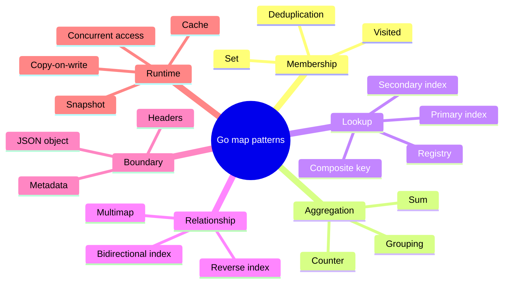
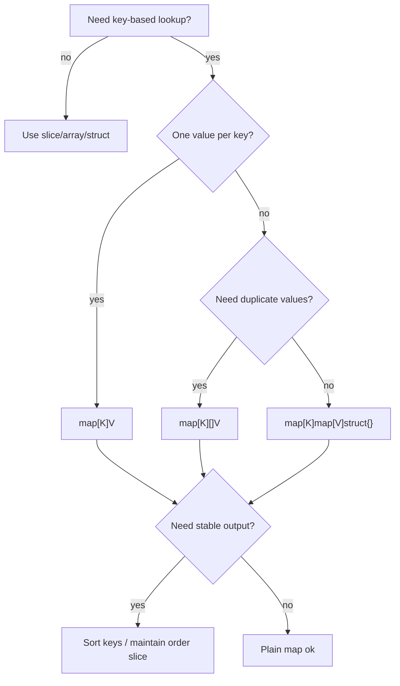
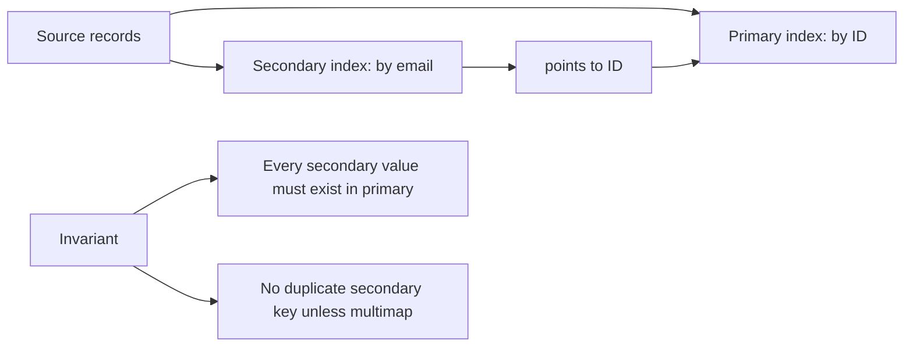

# learn-go-data-model-part-012.md

# Part 012 — Map II: Production Patterns, Set, Multimap, Index, Cache, Counter

> Seri: `learn-go-data-model`  
> Bagian: `012 / 034`  
> Target pembaca: Java software engineer yang ingin memahami Go data model pada level production engineering  
> Fokus: memakai `map` sebagai building block produksi, bukan sekadar associative array

---

## 0. Posisi Part Ini dalam Seri

Pada part 011 kita membahas semantik fundamental `map`:

```text
map[K]V
= unordered associative container
= reference-like descriptor
= key harus comparable
= nil map safe untuk read/delete/range tetapi panic untuk write
= missing key menghasilkan zero value V
= comma-ok membedakan missing vs present zero
= range order tidak dijamin
= tidak safe untuk concurrent read/write tanpa sinkronisasi
```

Part ini membahas pattern produksi yang dibangun di atas map.

Fokusnya:

```text
- set
- counter
- grouping
- multimap
- nested map
- secondary index
- bidirectional index
- cache sederhana
- deduplication
- registry
- aggregation
- stable output
- maps package
- ownership
- memory/GC
- kapan map mentah tidak cukup
```

Kita tidak akan mengulang definisi dasar map. Kita akan memakai aturan dasar tersebut untuk mengambil keputusan desain.

---

## 1. Mental Model: Map sebagai Index, Bukan Hanya Container

Cara paling produktif memahami map di sistem nyata:

```text
Map adalah index dari identity/canonical key ke sesuatu.
```

Bukan sekadar:

```text
key -> value
```

Tapi:

```text
domain identity -> domain fact/state/object/decision
```

Contoh:

```go
map[UserID]User
map[CaseID]CaseSnapshot
map[Permission]Decision
map[Status][]CaseID
map[TenantUserKey]AccessGrant
map[ContentDigest]BlobMetadata
```

Kalau key tidak punya makna domain yang jelas, map akan berubah menjadi “kantong serbaguna” yang sulit divalidasi.

---

## 2. Taxonomy Pattern Map



Satu built-in type `map[K]V` bisa menjadi banyak struktur data. Tetapi setiap pattern punya invariant berbeda.

---

## 3. Pattern 1 — Set

Go tidak punya built-in `Set`. Pattern umum:

```go
map[T]struct{}
```

Contoh:

```go
type UserID string

seen := make(map[UserID]struct{})

seen["u1"] = struct{}{}

_, ok := seen["u1"]
fmt.Println(ok) // true
```

Mengapa `struct{}`?

```text
struct{} adalah empty struct.
Secara semantic, kita hanya peduli membership.
Value tidak membawa informasi.
```

Alternatif:

```go
map[T]bool
```

Contoh:

```go
seen := map[UserID]bool{}
seen["u1"] = true

if seen["u1"] {
    // seen
}
```

Kapan `map[T]bool` baik?

```text
- kode lebih readable untuk simple membership
- value false tidak dipakai
- map bersifat internal dan kecil
```

Kapan `map[T]struct{}` lebih tepat?

```text
- ingin menegaskan value tidak bermakna
- menghindari ambiguity true/false
- set besar
- ingin API semantics jelas: presence-only
```

### 3.1 Set Helper Generic

```go
type Set[T comparable] map[T]struct{}

func NewSet[T comparable](values ...T) Set[T] {
    s := make(Set[T], len(values))
    for _, v := range values {
        s.Add(v)
    }
    return s
}

func (s Set[T]) Add(v T) {
    s[v] = struct{}{}
}

func (s Set[T]) Remove(v T) {
    delete(s, v)
}

func (s Set[T]) Contains(v T) bool {
    _, ok := s[v]
    return ok
}

func (s Set[T]) Len() int {
    return len(s)
}
```

Perhatikan receiver by value. `Set[T]` adalah map alias-like defined type; copying map descriptor tetap menunjuk table yang sama.

### 3.2 Set dengan Stable Output

Karena map unordered, set tidak punya urutan.

```go
func (s Set[T]) Values() []T {
    out := make([]T, 0, len(s))
    for v := range s {
        out = append(out, v)
    }
    return out
}
```

Output tidak stabil. Untuk `string`:

```go
func SortedStringSetValues(s Set[string]) []string {
    out := make([]string, 0, len(s))
    for v := range s {
        out = append(out, v)
    }
    sort.Strings(out)
    return out
}
```

Untuk generic ordered type, kita butuh constraint ordered. Tanpa dependency eksternal, kamu bisa batasi per tipe atau menerima comparator.

```go
func SortedValues[T comparable](s Set[T], less func(a, b T) bool) []T {
    out := make([]T, 0, len(s))
    for v := range s {
        out = append(out, v)
    }
    sort.Slice(out, func(i, j int) bool {
        return less(out[i], out[j])
    })
    return out
}
```

---

## 4. Pattern 2 — Deduplication

Dedup slice dengan preserve first occurrence:

```go
func UniqueUserIDs(in []UserID) []UserID {
    seen := make(map[UserID]struct{}, len(in))
    out := make([]UserID, 0, len(in))

    for _, id := range in {
        if _, ok := seen[id]; ok {
            continue
        }
        seen[id] = struct{}{}
        out = append(out, id)
    }

    return out
}
```

Invariant:

```text
- output order mengikuti input order
- hanya first occurrence dipertahankan
- seen dipakai sebagai membership index
```

Failure mode:

```text
- jika key belum canonical, dedup salah
- jika UserID string tidak dinormalisasi, " U1 " dan "u1" dianggap beda
```

Canonicalization:

```go
func NormalizeUserID(s string) (UserID, error) {
    s = strings.TrimSpace(s)
    if s == "" {
        return "", errors.New("empty user id")
    }
    return UserID(strings.ToLower(s)), nil
}
```

Dedup harus dilakukan setelah canonicalization.

---

## 5. Pattern 3 — Counter Map

Counter:

```go
counts := make(map[Status]int)

for _, c := range cases {
    counts[c.Status]++
}
```

Ini idiomatic karena missing key menghasilkan zero value `0`.

Counter adalah salah satu kasus di mana zero value ambiguity justru membantu.

### 5.1 Counter dengan Domain Type

```go
type Status string

const (
    StatusOpen   Status = "open"
    StatusClosed Status = "closed"
)

func CountByStatus(cases []Case) map[Status]int {
    counts := make(map[Status]int)
    for _, c := range cases {
        counts[c.Status]++
    }
    return counts
}
```

### 5.2 Counter Overflow

Jika jumlah bisa besar, gunakan `int64` atau `uint64` sesuai domain.

```go
counts := make(map[Status]int64)
```

Namun jangan otomatis memakai `uint64`. Counter yang dipakai dalam arithmetic dengan signed values bisa membuat bug conversion.

### 5.3 Complete Counter Output

Jika output harus selalu mencantumkan semua status termasuk zero, jangan hanya range map.

```go
func CountByStatusComplete(cases []Case) map[Status]int {
    counts := map[Status]int{
        StatusOpen:   0,
        StatusClosed: 0,
    }
    for _, c := range cases {
        counts[c.Status]++
    }
    return counts
}
```

Atau output struct eksplisit:

```go
type StatusCount struct {
    Status Status
    Count  int
}
```

Dengan order stabil.

---

## 6. Pattern 4 — Sum/Aggregation Map

Aggregation:

```go
totals := make(map[AccountID]int64)

for _, tx := range transactions {
    totals[tx.AccountID] += tx.AmountCents
}
```

Ini mirip counter, tetapi value bukan hanya increment by 1.

Invariant penting:

```text
- unit value jelas: cents, bytes, milliseconds, points
- overflow dipertimbangkan
- negative value allowed or not
- key sudah canonical
```

Lebih baik:

```go
type MoneyCents int64

type AccountTotal struct {
    AccountID AccountID
    Total     MoneyCents
}
```

Daripada menyebar `int64` tanpa semantic.

---

## 7. Pattern 5 — Grouping Map

Grouping:

```go
groups := make(map[Status][]Case)

for _, c := range cases {
    groups[c.Status] = append(groups[c.Status], c)
}
```

Ini idiomatic karena append ke nil slice valid.

Ketika key belum ada:

```go
groups[c.Status] // nil []Case
append(nil, c)   // []Case{c}
```

### 7.1 Grouping IDs, Bukan Object Besar

Jika `Case` besar, pertimbangkan group ID:

```go
groups := make(map[Status][]CaseID)

for _, c := range cases {
    groups[c.Status] = append(groups[c.Status], c.ID)
}
```

Ini mengurangi copy dan output lebih ringan.

### 7.2 Grouping dengan Stable Order

Order dalam tiap group mengikuti order input jika append linear.

Tetapi order group key tidak stabil.

Untuk output:

```go
type StatusGroup struct {
    Status Status
    Cases  []Case
}

func GroupCasesStable(cases []Case, statuses []Status) []StatusGroup {
    groups := make(map[Status][]Case)

    for _, c := range cases {
        groups[c.Status] = append(groups[c.Status], c)
    }

    out := make([]StatusGroup, 0, len(statuses))
    for _, st := range statuses {
        out = append(out, StatusGroup{
            Status: st,
            Cases:  groups[st],
        })
    }

    return out
}
```

Untuk domain enum, urutan eksplisit sering lebih baik daripada sort string.

---

## 8. Pattern 6 — Multimap

Multimap adalah map dari key ke banyak value.

```go
map[K][]V
```

Contoh:

```go
byRole := make(map[RoleID][]UserID)

for _, grant := range grants {
    byRole[grant.RoleID] = append(byRole[grant.RoleID], grant.UserID)
}
```

Invariant yang harus dipilih:

```text
- Apakah value boleh duplicate?
- Apakah order value penting?
- Apakah removal sering?
- Apakah membership lookup value perlu cepat?
```

Jika duplicate tidak boleh, gunakan nested set:

```go
map[RoleID]map[UserID]struct{}
```

Contoh:

```go
byRole := make(map[RoleID]map[UserID]struct{})

func AddGrant(index map[RoleID]map[UserID]struct{}, role RoleID, user UserID) {
    users := index[role]
    if users == nil {
        users = make(map[UserID]struct{})
        index[role] = users
    }
    users[user] = struct{}{}
}
```

Trade-off:

| Bentuk | Cocok untuk | Kelemahan |
|---|---|---|
| `map[K][]V` | append, preserve order, output list | membership/removal O(n), duplicate mungkin |
| `map[K]map[V]struct{}` | membership cepat, no duplicate | lebih banyak map, order tidak stabil |
| `map[K]Set[V]` | domain lebih jelas | butuh type helper |
| `map[K][]V + sort/unique` | batch build lalu query | perlu finalize step |

---

## 9. Pattern 7 — Nested Map

Nested map:

```go
map[TenantID]map[UserID]UserAccess
```

Contoh:

```go
type AccessIndex map[TenantID]map[UserID]Access

func (idx AccessIndex) Put(tenant TenantID, user UserID, access Access) {
    users := idx[tenant]
    if users == nil {
        users = make(map[UserID]Access)
        idx[tenant] = users
    }
    users[user] = access
}

func (idx AccessIndex) Get(tenant TenantID, user UserID) (Access, bool) {
    users := idx[tenant]
    if users == nil {
        return Access{}, false
    }
    access, ok := users[user]
    return access, ok
}
```

Nested map sering muncul untuk:

```text
- tenant -> user -> permission
- module -> action -> decision
- country -> region -> configuration
- case type -> status -> transition rule
```

### 9.1 Alternative: Composite Key

Daripada nested map:

```go
type TenantUserKey struct {
    TenantID TenantID
    UserID   UserID
}

map[TenantUserKey]Access
```

Perbandingan:

| Desain | Cocok untuk |
|---|---|
| nested map | sering query semua user dalam tenant |
| composite key | query direct by pair, struktur lebih flat |
| nested set | membership berdasarkan dua level |
| composite key + secondary index | butuh direct lookup dan group lookup |

Composite key lebih sederhana jika kamu hanya lookup `(tenant, user)`.

Nested map lebih baik jika operasi utama adalah:

```go
for user, access := range idx[tenant] {
    // list all access in tenant
}
```

---

## 10. Pattern 8 — Primary Index

Primary index:

```go
map[UserID]User
```

Membangun index dari slice:

```go
func IndexUsers(users []User) (map[UserID]User, error) {
    byID := make(map[UserID]User, len(users))

    for _, u := range users {
        if u.ID == "" {
            return nil, errors.New("user id is empty")
        }
        if _, exists := byID[u.ID]; exists {
            return nil, fmt.Errorf("duplicate user id %q", u.ID)
        }
        byID[u.ID] = u
    }

    return byID, nil
}
```

Poin production:

```text
- validasi empty key
- deteksi duplicate
- hint len(users)
- return error, jangan silent overwrite
```

Silent overwrite anti-pattern:

```go
byID[u.ID] = u // duplicate terakhir menang tanpa diketahui
```

Kadang last-write-wins memang diinginkan, tetapi harus eksplisit:

```go
func IndexUsersLastWins(users []User) map[UserID]User
```

Nama function harus mencerminkan collision policy.

---

## 11. Pattern 9 — Secondary Index

Secondary index adalah index tambahan dari attribute non-primary ke ID/object.

Contoh:

```go
byID := map[UserID]User{}
byEmail := map[Email]UserID{}
```

Build:

```go
func BuildUserIndexes(users []User) (UserIndexes, error) {
    idx := UserIndexes{
        ByID:    make(map[UserID]User, len(users)),
        ByEmail: make(map[Email]UserID, len(users)),
    }

    for _, u := range users {
        if u.ID == "" {
            return UserIndexes{}, errors.New("empty user id")
        }
        if u.Email == "" {
            return UserIndexes{}, fmt.Errorf("empty email for user %q", u.ID)
        }

        if _, exists := idx.ByID[u.ID]; exists {
            return UserIndexes{}, fmt.Errorf("duplicate user id %q", u.ID)
        }
        if _, exists := idx.ByEmail[u.Email]; exists {
            return UserIndexes{}, fmt.Errorf("duplicate email %q", u.Email)
        }

        idx.ByID[u.ID] = u
        idx.ByEmail[u.Email] = u.ID
    }

    return idx, nil
}

type UserIndexes struct {
    ByID    map[UserID]User
    ByEmail map[Email]UserID
}
```

Invariant:

```text
Every ByEmail value must point to existing ByID key.
Every unique email appears at most once.
Indexes must be updated atomically together.
```

Jika index mutable, bungkus dalam type dengan method agar invariant tidak bocor.

---

## 12. Pattern 10 — Reverse Index

Forward relation:

```go
userRoles := map[UserID][]RoleID{}
```

Reverse index:

```go
roleUsers := map[RoleID][]UserID{}
```

Build both:

```go
func BuildRoleIndexes(grants []Grant) RoleIndexes {
    idx := RoleIndexes{
        UserRoles: make(map[UserID][]RoleID),
        RoleUsers: make(map[RoleID][]UserID),
    }

    for _, g := range grants {
        idx.UserRoles[g.UserID] = append(idx.UserRoles[g.UserID], g.RoleID)
        idx.RoleUsers[g.RoleID] = append(idx.RoleUsers[g.RoleID], g.UserID)
    }

    return idx
}

type RoleIndexes struct {
    UserRoles map[UserID][]RoleID
    RoleUsers map[RoleID][]UserID
}
```

Masalah:

```text
- duplicate grant bisa menghasilkan duplicate role/user
- removal harus update dua map
- invariant mudah rusak jika map diexpose
```

Untuk mutable role index, lebih baik encapsulate.

```go
type RoleIndex struct {
    userRoles map[UserID]map[RoleID]struct{}
    roleUsers map[RoleID]map[UserID]struct{}
}
```

Method:

```go
func NewRoleIndex() *RoleIndex {
    return &RoleIndex{
        userRoles: make(map[UserID]map[RoleID]struct{}),
        roleUsers: make(map[RoleID]map[UserID]struct{}),
    }
}

func (idx *RoleIndex) Grant(user UserID, role RoleID) {
    roles := idx.userRoles[user]
    if roles == nil {
        roles = make(map[RoleID]struct{})
        idx.userRoles[user] = roles
    }
    roles[role] = struct{}{}

    users := idx.roleUsers[role]
    if users == nil {
        users = make(map[UserID]struct{})
        idx.roleUsers[role] = users
    }
    users[user] = struct{}{}
}

func (idx *RoleIndex) Revoke(user UserID, role RoleID) {
    if roles := idx.userRoles[user]; roles != nil {
        delete(roles, role)
        if len(roles) == 0 {
            delete(idx.userRoles, user)
        }
    }

    if users := idx.roleUsers[role]; users != nil {
        delete(users, user)
        if len(users) == 0 {
            delete(idx.roleUsers, role)
        }
    }
}
```

---

## 13. Pattern 11 — Bidirectional One-to-One Index

Contoh username unik dan ID unik:

```go
type UserDirectory struct {
    byID       map[UserID]User
    idByEmail  map[Email]UserID
}
```

Register:

```go
func (d *UserDirectory) Add(u User) error {
    if _, exists := d.byID[u.ID]; exists {
        return fmt.Errorf("duplicate id %q", u.ID)
    }
    if _, exists := d.idByEmail[u.Email]; exists {
        return fmt.Errorf("duplicate email %q", u.Email)
    }

    d.byID[u.ID] = u
    d.idByEmail[u.Email] = u.ID
    return nil
}
```

Update email harus hati-hati:

```go
func (d *UserDirectory) ChangeEmail(id UserID, next Email) error {
    u, ok := d.byID[id]
    if !ok {
        return fmt.Errorf("user %q not found", id)
    }
    if otherID, exists := d.idByEmail[next]; exists && otherID != id {
        return fmt.Errorf("email %q already used", next)
    }

    delete(d.idByEmail, u.Email)
    u.Email = next
    d.byID[id] = u
    d.idByEmail[next] = id

    return nil
}
```

Invariant:

```text
byID[id].Email == email
idByEmail[email] == id
```

Jika ada concurrent access, semua update harus dalam satu critical section.

---

## 14. Pattern 12 — Registry

Registry adalah map dari nama/type/key ke handler/strategy.

```go
type Handler func(context.Context, Request) (Response, error)

type Registry struct {
    handlers map[CommandName]Handler
}
```

Constructor:

```go
func NewRegistry() *Registry {
    return &Registry{
        handlers: make(map[CommandName]Handler),
    }
}
```

Register:

```go
func (r *Registry) Register(name CommandName, h Handler) error {
    if name == "" {
        return errors.New("empty command name")
    }
    if h == nil {
        return errors.New("nil handler")
    }
    if _, exists := r.handlers[name]; exists {
        return fmt.Errorf("handler %q already registered", name)
    }
    r.handlers[name] = h
    return nil
}
```

Lookup:

```go
func (r *Registry) Get(name CommandName) (Handler, bool) {
    h, ok := r.handlers[name]
    return h, ok
}
```

Production rule:

```text
Registry should reject duplicate registration unless override is an explicit feature.
```

Silent override can hide wiring bugs.

---

## 15. Pattern 13 — Validation Error Map

Common pattern:

```go
map[string][]string
```

Example:

```go
type FieldErrors map[string][]string

func (e FieldErrors) Add(field string, message string) {
    e[field] = append(e[field], message)
}

func (e FieldErrors) HasErrors() bool {
    return len(e) > 0
}
```

Better with domain type:

```go
type FieldName string
type ValidationMessage string

type FieldErrors map[FieldName][]ValidationMessage
```

Stable output:

```go
func (e FieldErrors) Fields() []FieldName {
    fields := make([]FieldName, 0, len(e))
    for f := range e {
        fields = append(fields, f)
    }
    sort.Slice(fields, func(i, j int) bool {
        return fields[i] < fields[j]
    })
    return fields
}
```

Boundary concern:

```text
Map output order tidak stabil.
Untuk API error response, sort field atau output sebagai stable slice.
```

---

## 16. Pattern 14 — Cache Sederhana

Map bisa menjadi cache:

```go
type Cache[K comparable, V any] struct {
    values map[K]V
}
```

Tetapi cache produksi bukan sekadar map.

Pertanyaan invariant:

```text
- Apakah cache concurrent?
- Ada TTL?
- Ada max size?
- Ada negative caching?
- Ada cache stampede protection?
- Apakah value immutable?
- Apakah cache miss function idempotent?
- Apakah stale value acceptable?
```

### 16.1 Non-Concurrent Memoization

```go
func Memoize[K comparable, V any](fn func(K) (V, error)) func(K) (V, error) {
    cache := make(map[K]V)

    return func(k K) (V, error) {
        if v, ok := cache[k]; ok {
            return v, nil
        }

        v, err := fn(k)
        if err != nil {
            var zero V
            return zero, err
        }

        cache[k] = v
        return v, nil
    }
}
```

Ini hanya aman jika dipakai single goroutine atau dilindungi externally.

### 16.2 Concurrent Cache dengan Mutex

```go
type SafeCache[K comparable, V any] struct {
    mu     sync.RWMutex
    values map[K]V
}

func NewSafeCache[K comparable, V any]() *SafeCache[K, V] {
    return &SafeCache[K, V]{
        values: make(map[K]V),
    }
}

func (c *SafeCache[K, V]) Get(k K) (V, bool) {
    c.mu.RLock()
    defer c.mu.RUnlock()

    v, ok := c.values[k]
    return v, ok
}

func (c *SafeCache[K, V]) Put(k K, v V) {
    c.mu.Lock()
    defer c.mu.Unlock()

    c.values[k] = v
}
```

### 16.3 TTL Cache Minimal

```go
type Entry[V any] struct {
    Value     V
    ExpiresAt time.Time
}

type TTLCache[K comparable, V any] struct {
    mu     sync.Mutex
    now    func() time.Time
    values map[K]Entry[V]
}

func NewTTLCache[K comparable, V any](now func() time.Time) *TTLCache[K, V] {
    if now == nil {
        now = time.Now
    }
    return &TTLCache[K, V]{
        now:    now,
        values: make(map[K]Entry[V]),
    }
}

func (c *TTLCache[K, V]) Put(k K, v V, ttl time.Duration) {
    c.mu.Lock()
    defer c.mu.Unlock()

    c.values[k] = Entry[V]{
        Value:     v,
        ExpiresAt: c.now().Add(ttl),
    }
}

func (c *TTLCache[K, V]) Get(k K) (V, bool) {
    c.mu.Lock()
    defer c.mu.Unlock()

    e, ok := c.values[k]
    if !ok {
        var zero V
        return zero, false
    }

    if !e.ExpiresAt.IsZero() && !c.now().Before(e.ExpiresAt) {
        delete(c.values, k)
        var zero V
        return zero, false
    }

    return e.Value, true
}
```

Ini masih minimal. Belum ada max size, eviction policy, singleflight, metrics, cleanup background, atau memory bound.

Production warning:

```text
Map cache tanpa bound dapat menjadi memory leak.
```

---

## 17. Pattern 15 — Negative Cache

Negative cache menyimpan “tidak ditemukan” agar tidak memukul backend terus-menerus.

Jangan pakai `map[K]V` jika missing dan negative value perlu dibedakan.

Gunakan explicit entry:

```go
type LookupEntry[V any] struct {
    Value V
    Found bool
}
```

Cache:

```go
type LookupCache[K comparable, V any] struct {
    values map[K]LookupEntry[V]
}
```

Dengan ini ada tiga state:

```text
- tidak ada di cache
- ada di cache: backend found
- ada di cache: backend not found
```

Contoh:

```go
entry, cached := c.values[k]
if cached {
    if !entry.Found {
        return zero, ErrNotFound
    }
    return entry.Value, nil
}
```

Jangan menyamakan:

```go
value zero == not found
```

Terutama untuk authorization, config, profile, dan reference data.

---

## 18. Pattern 16 — Map as State Transition Table

Untuk finite state machine:

```go
type State string
type Event string

type TransitionKey struct {
    From  State
    Event Event
}

var transitions = map[TransitionKey]State{
    {From: "draft", Event: "submit"}: "submitted",
    {From: "submitted", Event: "approve"}: "approved",
}
```

Lookup:

```go
func NextState(from State, event Event) (State, bool) {
    next, ok := transitions[TransitionKey{From: from, Event: event}]
    return next, ok
}
```

Untuk regulatory workflow, missing transition harus explicit error:

```go
func MustTransition(from State, event Event) (State, error) {
    next, ok := transitions[TransitionKey{From: from, Event: event}]
    if !ok {
        return "", fmt.Errorf("transition not allowed: %s + %s", from, event)
    }
    return next, nil
}
```

Invariant:

```text
- key composite harus jelas
- missing transition berarti not allowed atau misconfiguration?
- output harus auditable
- transition table sebaiknya immutable setelah init
```

---

## 19. Pattern 17 — Permission Matrix

Map cocok untuk permission matrix kecil/menengah.

```go
type Role string
type Action string
type Decision int

const (
    DecisionUnknown Decision = iota
    DecisionAllow
    DecisionDeny
)

type PermissionMatrix map[Role]map[Action]Decision
```

Lookup:

```go
func (m PermissionMatrix) Decide(role Role, action Action) (Decision, error) {
    actions := m[role]
    if actions == nil {
        return DecisionUnknown, fmt.Errorf("unknown role %q", role)
    }

    d, ok := actions[action]
    if !ok {
        return DecisionUnknown, fmt.Errorf("missing decision for role %q action %q", role, action)
    }

    if d == DecisionUnknown {
        return DecisionUnknown, fmt.Errorf("invalid unknown decision for role %q action %q", role, action)
    }

    return d, nil
}
```

Jangan:

```go
return matrix[role][action] == true
```

Itu menyembunyikan:

```text
- role tidak ada
- action tidak ada
- explicit deny
- default deny
- misconfiguration
```

Untuk security system, unknown harus observable.

---

## 20. Pattern 18 — Map of Functions

Map dari command ke function:

```go
var commands = map[string]func(context.Context) error{
    "sync":  runSync,
    "clean": runClean,
}
```

Valid, tapi function value bisa nil.

Saat register:

```go
if fn == nil {
    return errors.New("nil function")
}
```

Lookup:

```go
fn, ok := commands[name]
if !ok {
    return fmt.Errorf("unknown command %q", name)
}
if fn == nil {
    return fmt.Errorf("command %q has nil handler", name)
}
return fn(ctx)
```

Map of functions bagus untuk dispatch kecil. Untuk dispatch kompleks, pertimbangkan interface strategy:

```go
type Command interface {
    Name() CommandName
    Run(context.Context) error
}
```

---

## 21. Pattern 19 — Map for Enum Metadata

```go
var statusLabels = map[Status]string{
    StatusOpen:   "Open",
    StatusClosed: "Closed",
}
```

Masalah: jika enum bertambah, map bisa lupa diupdate.

Buat validator:

```go
var allStatuses = []Status{
    StatusOpen,
    StatusClosed,
}

func StatusLabel(s Status) (string, error) {
    label, ok := statusLabels[s]
    if !ok {
        return "", fmt.Errorf("missing label for status %q", s)
    }
    return label, nil
}

func ValidateStatusMetadata() error {
    for _, s := range allStatuses {
        if _, ok := statusLabels[s]; !ok {
            return fmt.Errorf("missing label for status %q", s)
        }
    }
    return nil
}
```

Test:

```go
func TestStatusMetadataComplete(t *testing.T) {
    if err := ValidateStatusMetadata(); err != nil {
        t.Fatal(err)
    }
}
```

---

## 22. Pattern 20 — Map for Batch Join

Misal ada cases dan users. Daripada nested loop O(n*m), build index.

```go
func AttachOwners(cases []Case, users []User) ([]CaseWithOwner, error) {
    usersByID := make(map[UserID]User, len(users))
    for _, u := range users {
        if _, exists := usersByID[u.ID]; exists {
            return nil, fmt.Errorf("duplicate user id %q", u.ID)
        }
        usersByID[u.ID] = u
    }

    out := make([]CaseWithOwner, 0, len(cases))
    for _, c := range cases {
        owner, ok := usersByID[c.OwnerID]
        if !ok {
            return nil, fmt.Errorf("owner %q not found for case %q", c.OwnerID, c.ID)
        }
        out = append(out, CaseWithOwner{
            Case:  c,
            Owner: owner,
        })
    }

    return out, nil
}
```

Complexity:

```text
Nested loop: O(n*m)
Map join: O(n+m) average
```

But correctness depends on:

```text
- duplicate detection
- missing foreign key handling
- stable output policy
```

---

## 23. Pattern 21 — Frequency and Top-N

Frequency:

```go
freq := make(map[string]int)

for _, word := range words {
    freq[word]++
}
```

Top-N requires sorting:

```go
type Pair struct {
    Word  string
    Count int
}

pairs := make([]Pair, 0, len(freq))
for word, count := range freq {
    pairs = append(pairs, Pair{Word: word, Count: count})
}

sort.Slice(pairs, func(i, j int) bool {
    if pairs[i].Count != pairs[j].Count {
        return pairs[i].Count > pairs[j].Count
    }
    return pairs[i].Word < pairs[j].Word
})
```

Tie-breaker penting untuk deterministic output.

---

## 24. Pattern 22 — Sparse Matrix / Two-Dimensional Lookup

Composite key:

```go
type Cell struct {
    Row int
    Col int
}

matrix := map[Cell]float64{}
matrix[Cell{Row: 10, Col: 20}] = 3.14
```

Nested map:

```go
matrix := map[int]map[int]float64{}
```

Trade-off:

| Bentuk | Cocok |
|---|---|
| composite key | sparse random lookup, sederhana |
| nested map | scan row/column sering |
| dense slice | row/col range compact dan besar |
| custom structure | performance critical |

Jangan otomatis memakai map untuk dense matrix. Slice/array lebih locality-friendly.

---

## 25. Pattern 23 — Stable Map Serialization

Map JSON object secara semantik unordered. Tetapi untuk golden test, signing, hashing, audit file, dan diff, kamu perlu canonical representation.

Jangan hash hasil range map langsung.

Salah:

```go
for k, v := range m {
    h.Write([]byte(k))
    h.Write([]byte(v))
}
```

Benar:

```go
keys := make([]string, 0, len(m))
for k := range m {
    keys = append(keys, k)
}
sort.Strings(keys)

for _, k := range keys {
    h.Write([]byte(k))
    h.Write([]byte{0})
    h.Write([]byte(m[k]))
    h.Write([]byte{0})
}
```

Gunakan encoding yang tidak ambiguous.

---

## 26. Package `maps`

Standard library menyediakan package `maps` untuk helper map generic.

Contoh umum:

```go
clone := maps.Clone(original)
same := maps.Equal(a, b)
```

Konsep penting:

```text
- maps.Clone adalah shallow clone
- maps.Equal memerlukan value comparable
- maps.DeleteFunc dapat menghapus entry berdasarkan predicate
- maps.Copy menyalin entry dari src ke dst
- maps.Keys/maps.Values di Go modern bekerja dengan iterator; jika butuh slice sorted, kombinasikan dengan slices.Collect/Sorted sesuai API versi
```

Contoh `maps.DeleteFunc`:

```go
maps.DeleteFunc(values, func(k string, v int) bool {
    return v == 0
})
```

Contoh clone dengan ownership:

```go
func NewConfig(values map[string]string) Config {
    return Config{
        values: maps.Clone(values),
    }
}
```

Tetapi ingat:

```go
a := map[string][]int{"x": {1, 2}}
b := maps.Clone(a)

b["x"][0] = 99
fmt.Println(a["x"][0]) // 99
```

Shallow clone tidak memutus backing array slice value.

---

## 27. Map and `clear`

Go memiliki built-in `clear` untuk map dan slice.

Untuk map:

```go
clear(m)
```

Ini menghapus semua entry dari map.

Perbedaan:

```go
m = nil       // map variable menjadi nil
m = map[K]V{} // map baru kosong
clear(m)     // map yang sama dikosongkan
```

`clear(nilMap)` aman.

Gunakan `clear` ketika:

```text
- ingin reuse map object
- ingin menghapus semua entry
- ownership jelas
```

Namun jika map pernah sangat besar dan ingin mengurangi memory footprint, membuat map baru bisa lebih baik daripada clear, tergantung runtime behavior dan profiling.

```go
m = make(map[K]V)
```

---

## 28. Memory and GC Considerations

Map memiliki overhead. Untuk jumlah data kecil, slice linear scan bisa lebih cepat dan lebih hemat.

Contoh:

```go
type Pair struct {
    Key   string
    Value int
}
```

Untuk 5-10 item, ini mungkin cukup:

```go
func lookup(pairs []Pair, key string) (int, bool) {
    for _, p := range pairs {
        if p.Key == key {
            return p.Value, true
        }
    }
    return 0, false
}
```

Map lebih cocok saat:

```text
- lookup sering
- data cukup besar
- key uniqueness penting
- membership test dominan
- O(1) average lookup dibutuhkan
```

Slice lebih cocok saat:

```text
- data kecil
- order penting
- scan selalu dibutuhkan
- allocation harus minimal
- cache locality lebih penting
```

Pointer-heavy map:

```go
map[string]*BigObject
```

Bisa meningkatkan GC scan dan pointer chasing. Kadang lebih baik:

```go
map[string]int // index into []BigObject
```

Contoh:

```go
objects := []BigObject{}
byID := map[ObjectID]int{}
```

Lookup:

```go
idx, ok := byID[id]
if !ok {
    return BigObject{}, false
}
return objects[idx], true
```

Trade-off:

```text
- map value kecil
- objects contiguous
- update/delete lebih kompleks
```

---

## 29. When Map Is the Wrong Structure

Map bukan solusi universal.

Gunakan struktur lain jika:

### 29.1 Butuh order insertion

Gunakan slice + map:

```go
type OrderedSet[T comparable] struct {
    seen  map[T]struct{}
    order []T
}
```

### 29.2 Butuh sorted range

Gunakan sorted slice, tree, atau sort keys on demand.

### 29.3 Butuh range query

Map tidak bisa query key between A and B. Butuh tree/index lain.

### 29.4 Butuh prefix lookup

Gunakan trie/radix tree atau sorted slice dengan binary search.

### 29.5 Butuh LRU/LFU

Map saja tidak cukup. Butuh linked list/heap/counter.

### 29.6 Butuh bounded concurrent cache

Map + mutex saja belum cukup. Butuh eviction, TTL, singleflight, metrics, cleanup.

### 29.7 Butuh deterministic iteration sebagai core behavior

Buat ordered abstraction, jangan expose map.

---

## 30. Ordered Set Example

```go
type OrderedSet[T comparable] struct {
    seen  map[T]struct{}
    order []T
}

func NewOrderedSet[T comparable]() *OrderedSet[T] {
    return &OrderedSet[T]{
        seen: make(map[T]struct{}),
    }
}

func (s *OrderedSet[T]) Add(v T) bool {
    if _, ok := s.seen[v]; ok {
        return false
    }
    s.seen[v] = struct{}{}
    s.order = append(s.order, v)
    return true
}

func (s *OrderedSet[T]) Contains(v T) bool {
    _, ok := s.seen[v]
    return ok
}

func (s *OrderedSet[T]) Values() []T {
    out := make([]T, len(s.order))
    copy(out, s.order)
    return out
}
```

Deletion preserving order is more expensive:

```go
func (s *OrderedSet[T]) Remove(v T) bool {
    if _, ok := s.seen[v]; !ok {
        return false
    }
    delete(s.seen, v)

    for i, x := range s.order {
        if x == v {
            copy(s.order[i:], s.order[i+1:])
            var zero T
            s.order[len(s.order)-1] = zero
            s.order = s.order[:len(s.order)-1]
            break
        }
    }

    return true
}
```

Trade-off jelas: membership O(1), insertion order stable, removal O(n).

---

## 31. Concurrent Map Choices

Pilihan:

```text
- map + Mutex
- map + RWMutex
- copy-on-write snapshot
- single goroutine owner
- sync.Map
```

### 31.1 Map + Mutex

Default paling jelas.

```go
type Store[K comparable, V any] struct {
    mu sync.Mutex
    m  map[K]V
}
```

### 31.2 Map + RWMutex

Cocok jika read jauh lebih sering dan critical section read tidak mahal.

```go
type Store[K comparable, V any] struct {
    mu sync.RWMutex
    m  map[K]V
}
```

### 31.3 Copy-on-Write Snapshot

Cocok untuk config/read-mostly.

```go
type SnapshotStore[K comparable, V any] struct {
    v atomic.Value // stores map[K]V
}
```

Syarat: map yang sudah dipublish immutable.

### 31.4 Single Goroutine Owner

Cocok jika semua mutasi dapat diserialkan melalui channel/event loop.

```text
all map access happens in one goroutine
```

### 31.5 `sync.Map`

`sync.Map` adalah concurrent map khusus. Ia safe untuk multiple goroutines, tetapi API-nya memakai `any`, sehingga type safety lebih lemah.

Gunakan jika pattern cocok, misalnya read-mostly cache atau key disjoint high contention.

Jangan default ke `sync.Map` hanya karena “concurrent”.

---

## 32. Encapsulation Pattern

Jangan expose map mentah jika invariant penting.

Buruk:

```go
type Policy struct {
    Rules map[Action]Decision
}
```

Caller bisa:

```go
policy.Rules["delete"] = DecisionAllow
```

Lebih baik:

```go
type Policy struct {
    rules map[Action]Decision
}

func NewPolicy(rules map[Action]Decision) (*Policy, error) {
    clone := maps.Clone(rules)

    for action, decision := range clone {
        if action == "" {
            return nil, errors.New("empty action")
        }
        if decision == DecisionUnknown {
            return nil, fmt.Errorf("unknown decision for action %q", action)
        }
    }

    return &Policy{rules: clone}, nil
}

func (p *Policy) Decide(action Action) (Decision, bool) {
    d, ok := p.rules[action]
    return d, ok
}
```

---

## 33. Mermaid: Choosing Map Pattern



---

## 34. Mermaid: Index Consistency



---

## 35. Mini Lab 1 — Set

Implement set of `CaseID`:

```go
type CaseID string
type CaseSet map[CaseID]struct{}

func (s CaseSet) Add(id CaseID) {
    s[id] = struct{}{}
}

func (s CaseSet) Contains(id CaseID) bool {
    _, ok := s[id]
    return ok
}

func (s CaseSet) Remove(id CaseID) {
    delete(s, id)
}
```

Question:

```text
Apakah zero value CaseSet usable untuk Add?
```

Jawaban:

```text
Tidak. CaseSet zero value adalah nil map. Add akan panic.
```

Jika ingin zero-value usable, harus ubah desain:

```go
type CaseSet struct {
    values map[CaseID]struct{}
}
```

Tetapi method `Add` tetap harus lazy init:

```go
func (s *CaseSet) Add(id CaseID) {
    if s.values == nil {
        s.values = make(map[CaseID]struct{})
    }
    s.values[id] = struct{}{}
}
```

Trade-off: type menjadi struct, bukan map alias.

---

## 36. Mini Lab 2 — Duplicate Detection

Apa bug di sini?

```go
func IndexUsers(users []User) map[UserID]User {
    out := make(map[UserID]User, len(users))
    for _, u := range users {
        out[u.ID] = u
    }
    return out
}
```

Bug:

```text
Duplicate ID silently overwritten.
Empty ID accepted.
```

Fix:

```go
func IndexUsers(users []User) (map[UserID]User, error) {
    out := make(map[UserID]User, len(users))
    for _, u := range users {
        if u.ID == "" {
            return nil, errors.New("empty user id")
        }
        if _, exists := out[u.ID]; exists {
            return nil, fmt.Errorf("duplicate user id %q", u.ID)
        }
        out[u.ID] = u
    }
    return out, nil
}
```

---

## 37. Mini Lab 3 — Stable Error Output

Given:

```go
errs := map[string][]string{
    "email": {"invalid"},
    "name":  {"required"},
}
```

Jangan range langsung untuk response jika order harus stabil.

Implement:

```go
type FieldError struct {
    Field    string
    Messages []string
}

func StableFieldErrors(errs map[string][]string) []FieldError {
    fields := make([]string, 0, len(errs))
    for field := range errs {
        fields = append(fields, field)
    }
    sort.Strings(fields)

    out := make([]FieldError, 0, len(fields))
    for _, field := range fields {
        messages := append([]string(nil), errs[field]...)
        out = append(out, FieldError{
            Field:    field,
            Messages: messages,
        })
    }
    return out
}
```

Copy `messages` jika output tidak boleh alias internal map value.

---

## 38. Mini Lab 4 — Multimap Without Duplicates

```go
type RoleUsers map[RoleID]map[UserID]struct{}

func (m RoleUsers) Add(role RoleID, user UserID) {
    users := m[role]
    if users == nil {
        users = make(map[UserID]struct{})
        m[role] = users
    }
    users[user] = struct{}{}
}

func (m RoleUsers) Users(role RoleID) []UserID {
    users := m[role]
    out := make([]UserID, 0, len(users))
    for user := range users {
        out = append(out, user)
    }
    sort.Slice(out, func(i, j int) bool {
        return out[i] < out[j]
    })
    return out
}
```

Caveat:

```text
RoleUsers zero value nil map tidak usable untuk Add.
```

Constructor:

```go
func NewRoleUsers() RoleUsers {
    return make(RoleUsers)
}
```

---

## 39. Mini Lab 5 — Snapshot Store

Read-mostly config:

```go
type ConfigSnapshot map[string]string

type ConfigStore struct {
    value atomic.Value // ConfigSnapshot
}

func NewConfigStore() *ConfigStore {
    s := &ConfigStore{}
    s.value.Store(ConfigSnapshot{})
    return s
}

func (s *ConfigStore) Get(key string) (string, bool) {
    m := s.value.Load().(ConfigSnapshot)
    v, ok := m[key]
    return v, ok
}

func (s *ConfigStore) Replace(next map[string]string) {
    clone := make(ConfigSnapshot, len(next))
    for k, v := range next {
        clone[k] = v
    }
    s.value.Store(clone)
}
```

Invariant:

```text
Once stored, ConfigSnapshot must never be mutated.
```

Jika dilanggar, pembaca concurrent bisa race.

---

## 40. Production Checklist

### 40.1 Pattern Fit

```text
[ ] Apakah map memang struktur yang tepat?
[ ] Apakah butuh order/range/prefix/LRU yang map tidak sediakan?
[ ] Apakah data kecil sehingga slice lebih sederhana?
[ ] Apakah key-based lookup dominan?
```

### 40.2 Key Design

```text
[ ] Key typed secara domain, bukan string/int mentah jika risk tinggi?
[ ] Key canonical sebelum masuk map?
[ ] Composite key tidak ambiguous?
[ ] Float/pointer/interface key dihindari kecuali benar-benar tepat?
```

### 40.3 Collision and Duplicate Policy

```text
[ ] Duplicate key ditolak, merge, atau last-write-wins?
[ ] Policy terlihat dari nama function/API?
[ ] Silent overwrite dihindari untuk data penting?
```

### 40.4 Ownership

```text
[ ] Input map diclone jika disimpan?
[ ] Output map diclone jika internal state harus dilindungi?
[ ] Shallow clone cukup?
[ ] Slice/map/pointer value tidak bocor tanpa sengaja?
```

### 40.5 Zero and Missing

```text
[ ] Missing vs present zero dibedakan jika domain butuh?
[ ] Negative cache tidak memakai zero value ambiguity?
[ ] Permission/policy unknown tidak disamakan dengan deny/allow diam-diam?
```

### 40.6 Determinism

```text
[ ] External output tidak bergantung pada range map?
[ ] Golden test stabil?
[ ] Hash/signature/canonical representation sort key?
[ ] Tie-breaker sort eksplisit?
```

### 40.7 Concurrency

```text
[ ] Ada owner map yang jelas?
[ ] Map mutable dilindungi lock/channel/snapshot?
[ ] sync.Map dipilih karena pattern cocok, bukan karena malas lock?
[ ] Snapshot immutable setelah publish?
```

### 40.8 Memory/Performance

```text
[ ] make hint dipakai untuk index besar?
[ ] Map jangka panjang tidak tumbuh tanpa batas?
[ ] Cache punya bound/TTL/eviction strategy jika perlu?
[ ] Pointer-heavy map dipertimbangkan dampak GC-nya?
[ ] Map vs slice sudah dipilih berdasarkan ukuran dan pola akses?
```

### 40.9 Invariant Encapsulation

```text
[ ] Index ganda diupdate atomically?
[ ] Bidirectional map tidak diexpose mentah?
[ ] Registry menolak duplicate/nil handler?
[ ] Enum metadata punya completeness test?
```

---

## 41. Ringkasan Mental Model

Map pattern yang baik bukan hanya soal syntax. Ia harus menjawab:

```text
Apa key-nya?
Apa invariant-nya?
Apa arti missing?
Apa collision policy-nya?
Siapa owner-nya?
Apakah output harus stable?
Apakah concurrent?
Apakah memory bounded?
Apakah map masih struktur yang tepat?
```

Untuk Java engineer, analoginya:

```text
Go map kira-kira seperti HashMap built-in,
tetapi tanpa method object,
tanpa equals/hashCode custom,
tanpa ordered variant built-in,
tanpa concurrent safety,
dan dengan zero-value/missing semantics yang khas Go.
```

Kekuatan map Go justru muncul ketika dipakai sebagai primitive kecil untuk membangun struktur domain yang eksplisit.

---

## 42. Apa yang Tidak Dibahas di Part Ini

Part ini masih belum membahas detail internal runtime hash map, bucket layout, evacuation, atau microbenchmark mendalam. Itu akan lebih relevan di part performance/memory.

Kita juga belum membahas struct layout secara detail. Itu masuk part 013.

---

## 43. Referensi Resmi

- Go Language Specification — Map types, index expressions, range clauses, comparison operators  
  https://go.dev/ref/spec
- Go 1.26 Release Notes  
  https://go.dev/doc/go1.26
- Go Release History  
  https://go.dev/doc/devel/release
- Package `maps`  
  https://pkg.go.dev/maps
- Package `sync` — `Map`, `Mutex`, `RWMutex`  
  https://pkg.go.dev/sync
- Package `sync/atomic`  
  https://pkg.go.dev/sync/atomic
- Package `slices`  
  https://pkg.go.dev/slices
- Go Memory Model  
  https://go.dev/ref/mem

---

## 44. Status Seri

Selesai:

```text
part-000  Orientation
part-001  Type system core
part-002  Zero value and invariants
part-003  Constants and iota
part-004  Numeric foundations
part-005  Numeric correctness
part-006  Text model I
part-007  Text model II
part-008  Array
part-009  Slice I
part-010  Slice II
part-011  Map I
part-012  Map II
```

Berikutnya:

```text
part-013  Struct I: Field Layout, Alignment, Padding, Embedding
```

Seri belum selesai. Masih ada part 013 sampai part 034.


<!-- NAVIGATION_FOOTER -->
<div class="page-nav">
<a href="./learn-go-data-model-part-011.md">⬅️ Part 011 — Map I: Hash Table Semantics, Key Rules, `nil` Map, Iteration</a>
<a href="./index.md">📚 Kategori</a>
<a href="../../index.md">🏠 Home</a>
<a href="./learn-go-data-model-part-013.md">Part 013 — Struct I: Field Layout, Alignment, Padding, Embedding ➡️</a>
</div>
