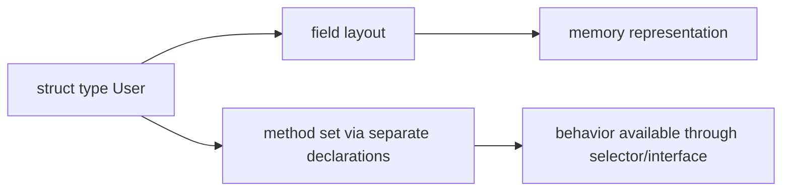
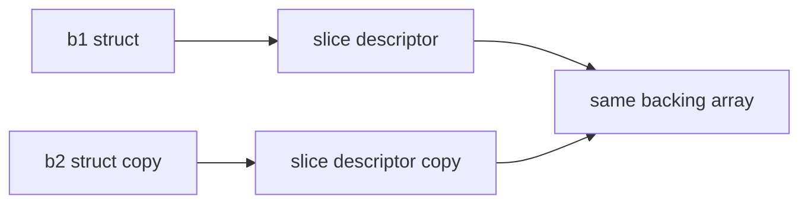
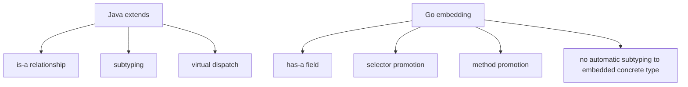
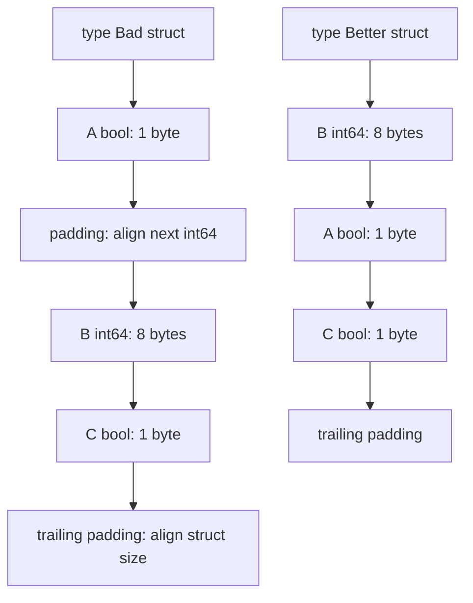
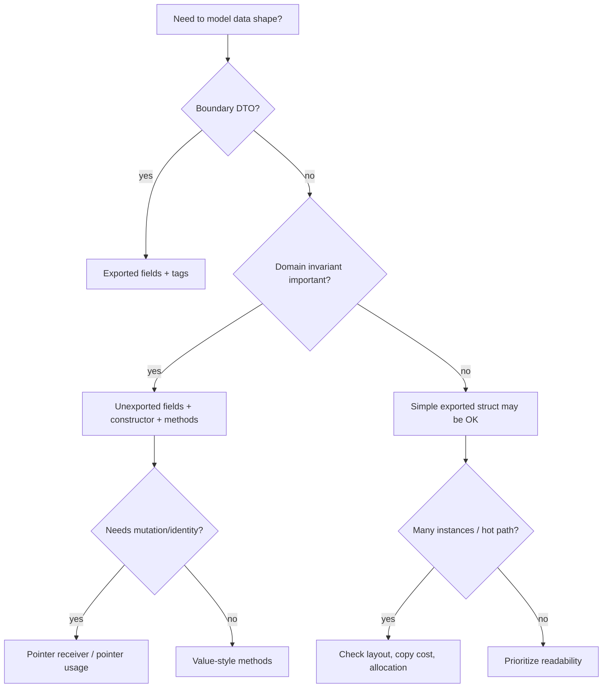

# learn-go-data-model-part-013.md

# Part 013 — Struct I: Field Layout, Alignment, Padding, Embedding

> Seri: `learn-go-data-model`  
> Bagian: `013 / 034`  
> Target pembaca: Java software engineer yang ingin memahami Go data model pada level production engineering  
> Fokus: `struct` sebagai data layout, bukan class; field order, alignment, padding, embedding, promoted fields, tags, dan API boundary

---

## 0. Posisi Part Ini dalam Seri

Kita sudah membahas scalar, text, array, slice, dan map. Sekarang kita masuk ke tipe komposit yang menjadi pusat domain modeling di Go: `struct`.

Untuk Java engineer, godaan pertama adalah menganggap struct sebagai “class tanpa method inheritance”. Itu kurang tepat.

Mental model yang lebih benar:

```text
Go struct
= ordered sequence of named fields
= value type
= has memory layout
= copied by value
= can have methods via receiver
= can embed other types
= can carry metadata via tags
= has no inheritance
= has no constructor
= has no implicit object identity
```

Di Java, class biasanya dipikirkan sebagai:

```text
identity + heap object + fields + methods + inheritance + constructor + reference semantics
```

Di Go, `struct` harus dipikirkan sebagai:

```text
data shape + layout + value semantics + explicit method set + explicit pointer use
```

Part ini fokus pada bentuk dan layout. Mutability, receiver, dan method set akan dibahas lebih dalam pada part 014.

---

## 1. Tujuan Pembelajaran

Setelah part ini, kamu harus bisa menjawab:

1. Apa itu struct dalam Go secara formal dan praktis?
2. Mengapa urutan field struct penting?
3. Apa itu alignment dan padding?
4. Mengapa dua struct dengan field sama tetapi urutan beda adalah type berbeda?
5. Mengapa struct adalah value dan assignment melakukan copy?
6. Kapan copy struct berbahaya?
7. Apa itu empty struct?
8. Apa itu anonymous field dan embedding?
9. Apa bedanya embedding dengan inheritance Java?
10. Apa itu promoted field dan promoted method?
11. Apa itu struct tag?
12. Mengapa struct tag tidak otomatis memberi behavior?
13. Bagaimana exported/unexported field memengaruhi API dan serialization?
14. Kapan memakai struct literal keyed vs unkeyed?
15. Apa checklist PR untuk struct production-grade?

---

## 2. Struct sebagai Ordered Fields

Struct dideklarasikan dengan field list:

```go
type User struct {
    ID    UserID
    Email Email
    Name  string
}
```

Struct adalah tipe dengan field terurut. Urutan field adalah bagian dari definisi type.

Dua struct anonymous ini berbeda type karena urutan field berbeda:

```go
var a struct {
    A int
    B string
}

var b struct {
    B string
    A int
}

// a = b // compile error
```

Untuk named type:

```go
type A struct {
    X int
    Y string
}

type B struct {
    X int
    Y string
}
```

`A` dan `B` adalah defined type berbeda walaupun underlying struct-nya sama. Assignment langsung tidak bisa tanpa conversion eksplisit jika aturan conversion terpenuhi.

---

## 3. Struct Bukan Class

Go struct tidak punya:

```text
- constructor khusus
- inheritance
- access modifier per field selain exported/unexported berdasarkan kapitalisasi
- implicit this
- method declaration di dalam body struct
- virtual method dispatch dari struct itu sendiri
- annotation system seperti Java
```

Go struct bisa punya method, tetapi method dideklarasikan terpisah:

```go
type User struct {
    ID    UserID
    Email Email
}

func (u User) IsAnonymous() bool {
    return u.ID == ""
}
```

Method receiver bukan bagian dari field layout.

Mental model:



---

## 4. Struct adalah Value

Assignment struct melakukan copy seluruh value.

```go
type Point struct {
    X int
    Y int
}

p1 := Point{X: 1, Y: 2}
p2 := p1

p2.X = 99

fmt.Println(p1.X) // 1
fmt.Println(p2.X) // 99
```

Ini berbeda dengan Java:

```java
Point p2 = p1; // copy reference, not object
```

Di Go:

```text
p2 := p1
= copy field values
```

Namun jika field di dalam struct adalah reference-like type, yang dicopy adalah descriptor/pointer-nya.

```go
type Batch struct {
    Items []string
}

b1 := Batch{Items: []string{"a", "b"}}
b2 := b1

b2.Items[0] = "x"

fmt.Println(b1.Items[0]) // x
```

Struct value dicopy, tetapi slice field di dalamnya tetap menunjuk backing array yang sama.

Diagram:



Jadi “struct copy” bukan selalu “deep copy”.

---

## 5. Field Addressability

Field dari addressable struct variable bisa dimodifikasi:

```go
u := User{Name: "Alice"}
u.Name = "Alicia"
```

Field dari pointer ke struct bisa diakses tanpa explicit dereference:

```go
p := &u
p.Name = "Ally" // shorthand for (*p).Name
```

Tetapi field dari non-addressable temporary tidak bisa dimodifikasi:

```go
func user() User {
    return User{Name: "Alice"}
}

// user().Name = "Bob" // compile error
```

Map entry struct juga tidak addressable:

```go
m := map[string]User{
    "a": {Name: "Alice"},
}

// m["a"].Name = "Bob" // compile error
```

Harus read-modify-write:

```go
u := m["a"]
u.Name = "Bob"
m["a"] = u
```

Atau map menyimpan pointer:

```go
mp := map[string]*User{
    "a": {Name: "Alice"},
}
mp["a"].Name = "Bob"
```

Trade-off pointer akan dibahas di part pointer dan struct receiver.

---

## 6. Struct Literal

Keyed literal:

```go
u := User{
    ID:    "u1",
    Email: "a@example.com",
    Name:  "Alice",
}
```

Unkeyed literal:

```go
p := Point{1, 2}
```

Guideline:

```text
- Untuk public/exported struct dari package lain, gunakan keyed literal.
- Untuk struct kecil internal seperti Point{X,Y}, unkeyed bisa diterima jika stabil dan jelas.
- Untuk domain/API struct, keyed literal jauh lebih aman.
```

Mengapa keyed literal lebih aman?

```go
type Config struct {
    Host string
    Port int
}
```

Jika nanti berubah:

```go
type Config struct {
    Host string
    TLS  bool
    Port int
}
```

Unkeyed literal lama bisa rusak atau salah makna.

Package tooling Go bahkan punya analyzer untuk composite literal unkeyed pada struct dari package lain karena fragile.

---

## 7. Zero Value Struct

Zero value struct adalah struct dengan semua field zero value.

```go
type RetryPolicy struct {
    MaxAttempts int
    Backoff     time.Duration
}

var p RetryPolicy

fmt.Println(p.MaxAttempts) // 0
fmt.Println(p.Backoff)     // 0s
```

Pertanyaan desain:

```text
Apakah zero RetryPolicy valid?
Apakah MaxAttempts=0 berarti no retry, unlimited retry, atau invalid?
```

Jika zero value ambiguous, desain tipe lebih eksplisit.

```go
type RetryPolicy struct {
    MaxAttempts int
    Backoff     time.Duration
}

func NewRetryPolicy(maxAttempts int, backoff time.Duration) (RetryPolicy, error) {
    if maxAttempts < 0 {
        return RetryPolicy{}, errors.New("max attempts must be non-negative")
    }
    if backoff < 0 {
        return RetryPolicy{}, errors.New("backoff must be non-negative")
    }
    return RetryPolicy{
        MaxAttempts: maxAttempts,
        Backoff:     backoff,
    }, nil
}
```

Atau gunakan config defaulting:

```go
func (p RetryPolicy) WithDefaults() RetryPolicy {
    if p.MaxAttempts == 0 {
        p.MaxAttempts = 3
    }
    if p.Backoff == 0 {
        p.Backoff = 100 * time.Millisecond
    }
    return p
}
```

Tapi hati-hati: ini membuat user tidak bisa menyatakan explicit zero jika zero adalah value valid.

---

## 8. Field Order Matters for Type Identity and Layout

Field order memengaruhi:

```text
- type identity untuk anonymous struct
- memory layout
- padding
- unsafe.Offsetof
- binary compatibility jika dipakai untuk unsafe/binary layout
- readability
```

Contoh dua struct dengan field sama tetapi beda order:

```go
type A struct {
    Flag bool
    ID   int64
    Code int32
}

type B struct {
    ID   int64
    Code int32
    Flag bool
}
```

Secara domain mungkin sama, tetapi layout bisa berbeda.

---

## 9. Alignment dan Padding

CPU umumnya mengakses data lebih efisien jika address field memenuhi alignment tertentu. Go compiler menyisipkan padding antar field agar setiap field berada pada offset yang sesuai.

Contoh konseptual pada arsitektur umum 64-bit:

```go
type Bad struct {
    A bool  // 1 byte
    B int64 // 8 bytes
    C bool  // 1 byte
}
```

Layout konseptual:

```text
offset 0: A bool
offset 1-7: padding
offset 8-15: B int64
offset 16: C bool
offset 17-23: trailing padding
```

Total bisa 24 byte.

Reorder:

```go
type Better struct {
    B int64
    A bool
    C bool
}
```

Layout konseptual:

```text
offset 0-7: B int64
offset 8: A bool
offset 9: C bool
offset 10-15: trailing padding
```

Total bisa 16 byte.

Jangan hafal angka tanpa mengukur karena ukuran/alignment bergantung arsitektur dan tipe. Gunakan `unsafe.Sizeof`, `unsafe.Alignof`, dan `unsafe.Offsetof` untuk observasi.

---

## 10. Mengukur Layout dengan `unsafe`

Contoh:

```go
package main

import (
    "fmt"
    "unsafe"
)

type Bad struct {
    A bool
    B int64
    C bool
}

type Better struct {
    B int64
    A bool
    C bool
}

func main() {
    fmt.Println("Bad size:", unsafe.Sizeof(Bad{}))
    fmt.Println("Bad.A offset:", unsafe.Offsetof(Bad{}.A))
    fmt.Println("Bad.B offset:", unsafe.Offsetof(Bad{}.B))
    fmt.Println("Bad.C offset:", unsafe.Offsetof(Bad{}.C))

    fmt.Println("Better size:", unsafe.Sizeof(Better{}))
    fmt.Println("Better.B offset:", unsafe.Offsetof(Better{}.B))
    fmt.Println("Better.A offset:", unsafe.Offsetof(Better{}.A))
    fmt.Println("Better.C offset:", unsafe.Offsetof(Better{}.C))
}
```

Catatan penting:

```text
- unsafe.Sizeof(x) mengembalikan ukuran value x, bukan objek yang direferensikan oleh field pointer/slice/map/string.
- unsafe.Offsetof hanya untuk field selector.
- Hasil layout adalah implementation detail untuk platform tertentu.
```

Untuk slice field:

```go
type Payload struct {
    Data []byte
}

fmt.Println(unsafe.Sizeof(Payload{}))
```

Ukuran ini hanya mencakup slice descriptor di struct, bukan backing array `Data`.

---

## 11. Padding Bukan Selalu Musuh

Field reorder untuk mengurangi padding bisa berguna pada struct besar yang jumlah instance-nya banyak.

Namun jangan buta mengurutkan field hanya berdasarkan ukuran jika merusak readability atau domain grouping.

Pertimbangkan:

```text
- Apakah struct muncul jutaan kali?
- Apakah struct berada di hot path?
- Apakah memory footprint terbukti masalah?
- Apakah field grouping domain lebih penting?
- Apakah reorder merusak public API compatibility?
```

Untuk struct public, reorder field dapat memecahkan kode yang memakai unkeyed literal dari package lain. Karena itu public exported struct harus didesain hati-hati.

---

## 12. False Sharing dan Field Layout

Pada concurrent code, field layout bisa menyebabkan false sharing: dua goroutine sering menulis field berbeda tetapi berada di cache line yang sama.

Contoh konseptual:

```go
type Counters struct {
    A atomic.Int64
    B atomic.Int64
}
```

Jika goroutine 1 sering update `A` dan goroutine 2 sering update `B`, keduanya bisa saling mengganggu pada cache line.

Solusi kadang memakai padding manual, tetapi ini advanced dan harus berbasis profiling/benchmark.

```go
type PaddedCounter struct {
    Value atomic.Int64
    _     [56]byte // contoh konseptual, jangan copy tanpa memahami target arch
}
```

Production guideline:

```text
Jangan menambah padding manual kecuali ada bukti contention/false sharing.
```

---

## 13. Empty Struct

`struct{}` adalah struct tanpa field.

```go
var x struct{}
fmt.Println(unsafe.Sizeof(x)) // biasanya 0
```

Use case:

### 13.1 Set value

```go
seen := map[string]struct{}{}
seen["x"] = struct{}{}
```

### 13.2 Signal channel

```go
done := make(chan struct{})
close(done)
```

### 13.3 Marker type

```go
type NoBody struct{}
```

### 13.4 Zero allocation-ish semantic value

Empty struct menyatakan “keberadaan cukup, tidak ada payload”.

Namun jangan overuse. Jika `bool` lebih readable, pakai `bool`.

---

## 14. Anonymous Struct

Go memungkinkan anonymous struct tanpa named type:

```go
point := struct {
    X int
    Y int
}{
    X: 1,
    Y: 2,
}
```

Use case:

```text
- local grouping kecil
- test table
- one-off JSON helper
- internal temporary data
```

Contoh test table:

```go
tests := []struct {
    name string
    in   string
    want bool
}{
    {name: "empty", in: "", want: false},
    {name: "valid", in: "abc", want: true},
}
```

Jangan pakai anonymous struct untuk domain object yang muncul berulang. Beri nama agar semantic terlihat.

---

## 15. Anonymous Field dan Embedding

Field struct biasanya punya nama:

```go
type User struct {
    ID UserID
}
```

Go juga punya anonymous field, sering disebut embedded field:

```go
type AuditRecord struct {
    CreatedAt time.Time
    UpdatedAt time.Time
}

type User struct {
    AuditRecord
    ID    UserID
    Email Email
}
```

`AuditRecord` di dalam `User` adalah embedded field. Nama field-nya secara implicit adalah `AuditRecord`.

Akses:

```go
u := User{}
u.CreatedAt = time.Now()
```

`CreatedAt` adalah promoted field dari embedded `AuditRecord`.

Akses eksplisit tetap bisa:

```go
u.AuditRecord.CreatedAt = time.Now()
```

---

## 16. Embedding Bukan Inheritance

Java inheritance:

```java
class Admin extends User {}
```

Membawa subtype relationship. `Admin` adalah `User`.

Go embedding:

```go
type Admin struct {
    User
}
```

Tidak berarti `Admin` adalah `User`.

```go
func SendEmail(u User) {}

var a Admin
// SendEmail(a) // compile error
SendEmail(a.User)
```

Embedding memberi field/method promotion, bukan subtype inheritance.

Mental model:



Jika ingin polymorphism di Go, gunakan interface.

---

## 17. Promoted Fields

Embedded field dapat mempromosikan field/method sehingga bisa diakses langsung.

```go
type Address struct {
    City string
}

type Customer struct {
    Address
    Name string
}

func main() {
    c := Customer{}
    c.City = "Jakarta"          // promoted field
    c.Address.City = "Bandung"  // explicit path
}
```

Promoted bukan berarti field dipindah. Field tetap berada di `Address`.

Selector `c.City` adalah shorthand jika tidak ambiguous.

---

## 18. Ambiguity dalam Promotion

Jika dua embedded fields punya field dengan nama sama:

```go
type A struct {
    Name string
}

type B struct {
    Name string
}

type C struct {
    A
    B
}
```

Akses:

```go
var c C
// c.Name // ambiguous selector
c.A.Name = "a"
c.B.Name = "b"
```

Go menolak selector ambiguous. Ini bagus karena mencegah resolusi diam-diam seperti diamond inheritance problem.

---

## 19. Embedded Pointer Field

Embedding bisa berupa pointer:

```go
type Logger struct{}

func (Logger) Info(msg string) {}

type Service struct {
    *Logger
}
```

Jika `Logger` nil:

```go
var s Service
// s.Info("x") // panic jika method butuh dereference receiver atau call melalui nil pointer bermasalah
```

Embedded pointer memberi promotion, tetapi juga membawa nil risk.

Guideline:

```text
- Embed pointer jika lifecycle/nil semantics jelas.
- Untuk dependency seperti logger/db/client, sering lebih baik named field eksplisit.
```

Buruk:

```go
type Service struct {
    *sql.DB
}
```

Lebih jelas:

```go
type Service struct {
    db *sql.DB
}
```

Embedding dependency sering membuat API surface bocor.

---

## 20. Embedding untuk Composition

Embedding berguna jika kamu ingin compose behavior secara eksplisit.

Contoh:

```go
type ReaderWithStats struct {
    io.Reader
    BytesRead int64
}

func (r *ReaderWithStats) Read(p []byte) (int, error) {
    n, err := r.Reader.Read(p)
    r.BytesRead += int64(n)
    return n, err
}
```

Di sini embedding `io.Reader` memungkinkan `ReaderWithStats` membawa reader dan menambah behavior.

Namun untuk domain model, jangan pakai embedding hanya agar “terasa seperti inheritance”.

---

## 21. Struct Tags

Struct field bisa punya tag string:

```go
type User struct {
    ID    UserID `json:"id" db:"id"`
    Email Email  `json:"email" db:"email"`
}
```

Tag adalah metadata string yang melekat pada field. Tag tidak melakukan apa-apa sendiri. Package seperti `encoding/json`, ORM, validator, atau reflection-based library membaca tag tersebut.

Tag diakses via reflection:

```go
t := reflect.TypeOf(User{})
field, _ := t.FieldByName("Email")
fmt.Println(field.Tag.Get("json")) // email
```

Mental model:

```text
Struct tag = passive metadata.
Behavior datang dari package yang membaca tag.
```

---

## 22. Tag Governance

Struct tag mudah menjadi tempat coupling banyak layer:

```go
type User struct {
    ID UserID `json:"id" db:"user_id" validate:"required" form:"id" xml:"id"`
}
```

Risiko:

```text
- domain model tercemar transport/persistence concern
- perubahan DB/JSON memaksa ubah domain type
- tag conflict tidak terdeteksi compile-time
- refactor field bisa lupa update tag
```

Guideline:

```text
- DTO/request/response boleh punya json tag.
- Persistence model boleh punya db tag.
- Domain model sebaiknya minim tag kecuali memang boundary type.
- Jangan campur semua concern dalam satu struct jika lifecycle-nya berbeda.
```

---

## 23. Exported vs Unexported Field

Field yang diawali huruf besar exported:

```go
type User struct {
    ID    UserID
    Email Email
}
```

Field huruf kecil unexported:

```go
type user struct {
    id    UserID
    email Email
}
```

Untuk exported struct dengan unexported field:

```go
type User struct {
    id    UserID
    email Email
}
```

Package lain tidak bisa mengisi field tersebut langsung.

```go
func NewUser(id UserID, email Email) (User, error) {
    if id == "" {
        return User{}, errors.New("empty id")
    }
    if email == "" {
        return User{}, errors.New("empty email")
    }
    return User{id: id, email: email}, nil
}
```

Accessor:

```go
func (u User) ID() UserID {
    return u.id
}

func (u User) Email() Email {
    return u.email
}
```

Ini membantu menjaga invariant.

Trade-off:

```text
Exported fields:
+ easy literal/serialization
+ simple DTO
- invariant mudah dilanggar

Unexported fields:
+ invariant terlindungi
+ constructor/factory bisa validasi
- lebih verbose
- serialization/reflection butuh handling khusus
```

---

## 24. Struct dan JSON

`encoding/json` hanya marshal exported fields secara default.

```go
type User struct {
    ID    string `json:"id"`
    email string `json:"email"`
}
```

`email` tidak keluar karena unexported.

Jika butuh invariant dan JSON, sering lebih baik pisahkan DTO:

```go
type User struct {
    id    UserID
    email Email
}

type UserResponse struct {
    ID    UserID `json:"id"`
    Email Email  `json:"email"`
}

func NewUserResponse(u User) UserResponse {
    return UserResponse{
        ID:    u.ID(),
        Email: u.Email(),
    }
}
```

Boundary mapping terlihat verbose, tetapi menjaga domain model tidak bocor.

---

## 25. Struct Comparability

Struct comparable jika semua field comparable.

```go
type Point struct {
    X int
    Y int
}

fmt.Println(Point{1, 2} == Point{1, 2}) // true
```

Tidak comparable:

```go
type Batch struct {
    Items []string
}

// Batch{} == Batch{} // compile error
```

Struct comparable bisa jadi map key:

```go
type TenantUserKey struct {
    TenantID TenantID
    UserID   UserID
}

m := map[TenantUserKey]Access{}
```

Ini sangat berguna untuk composite key.

---

## 26. Struct with Mutex: Do Not Copy After Use

Beberapa struct punya field yang tidak boleh dicopy setelah dipakai, misalnya `sync.Mutex`.

```go
type SafeCounter struct {
    mu sync.Mutex
    n  int
}
```

Jika `SafeCounter` dicopy setelah `mu` dipakai, behavior bisa rusak.

```go
c1 := SafeCounter{}
c1.Inc()

c2 := c1 // dangerous: copies mutex state
```

Guideline:

```text
- Struct yang mengandung Mutex biasanya dipakai via pointer.
- Hindari value receiver untuk type dengan Mutex.
- Jangan return copy dari struct dengan lock.
- Gunakan go vet copylocks warning.
```

---

## 27. No-Copy Semantic Marker

Beberapa codebase memakai marker untuk mencegah copy via vet pattern.

Konsep:

```go
type noCopy struct{}

func (*noCopy) Lock()   {}
func (*noCopy) Unlock() {}
```

Lalu:

```go
type Resource struct {
    _ noCopy
    // fields
}
```

Ini bukan runtime enforcement. Ini membantu tooling mendeteksi copy jika analyzer digunakan.

Gunakan dengan hati-hati dan ikuti pola umum di ecosystem.

---

## 28. Struct Size dan API Passing

Struct kecil bisa nyaman dipass by value.

```go
type Point struct {
    X, Y int
}
```

Struct besar atau mutable lebih sering pakai pointer.

```go
type Large struct {
    Data [4096]byte
}
```

Tetapi jangan otomatis semua struct pakai pointer. Pointer membawa:

```text
- possible nil
- shared mutation
- heap escape possibility
- GC pointer graph
- more indirection
```

Value membawa:

```text
- copy cost
- clearer ownership
- easier immutability style
- less aliasing
```

Rule praktis:

```text
Use value for small immutable-like data.
Use pointer for mutation, large objects, identity, or methods that must avoid copy.
Measure hot paths.
```

---

## 29. Struct as Domain Type

Contoh domain struct yang baik:

```go
type CaseID string
type CaseStatus string

type Case struct {
    id     CaseID
    status CaseStatus
}

func NewCase(id CaseID) (Case, error) {
    if id == "" {
        return Case{}, errors.New("empty case id")
    }
    return Case{
        id:     id,
        status: "draft",
    }, nil
}

func (c Case) ID() CaseID {
    return c.id
}

func (c Case) Status() CaseStatus {
    return c.status
}
```

State transition:

```go
func (c Case) Submit() (Case, error) {
    if c.status != "draft" {
        return Case{}, fmt.Errorf("cannot submit case in status %q", c.status)
    }
    c.status = "submitted"
    return c, nil
}
```

Ini value-style domain model: transition menghasilkan copy baru. Untuk aggregate mutable besar, pointer receiver bisa lebih cocok. Itu part 014.

---

## 30. Struct as DTO

DTO biasanya exported fields + tags.

```go
type CreateCaseRequest struct {
    ApplicantID string `json:"applicant_id"`
    CaseType    string `json:"case_type"`
}
```

DTO bukan domain invariant final. Validasi/mapping tetap perlu:

```go
func (r CreateCaseRequest) ToCommand() (CreateCaseCommand, error) {
    if strings.TrimSpace(r.ApplicantID) == "" {
        return CreateCaseCommand{}, errors.New("applicant_id is required")
    }
    if strings.TrimSpace(r.CaseType) == "" {
        return CreateCaseCommand{}, errors.New("case_type is required")
    }
    return CreateCaseCommand{
        ApplicantID: ApplicantID(r.ApplicantID),
        CaseType:    CaseType(r.CaseType),
    }, nil
}
```

---

## 31. Struct as Config

Config struct sering punya zero/default issue.

```go
type ServerConfig struct {
    Host         string
    Port         int
    ReadTimeout  time.Duration
    WriteTimeout time.Duration
}
```

Apply defaults explicitly:

```go
func (c ServerConfig) WithDefaults() ServerConfig {
    if c.Host == "" {
        c.Host = "127.0.0.1"
    }
    if c.Port == 0 {
        c.Port = 8080
    }
    if c.ReadTimeout == 0 {
        c.ReadTimeout = 5 * time.Second
    }
    if c.WriteTimeout == 0 {
        c.WriteTimeout = 5 * time.Second
    }
    return c
}
```

Validate:

```go
func (c ServerConfig) Validate() error {
    if c.Port < 1 || c.Port > 65535 {
        return fmt.Errorf("invalid port %d", c.Port)
    }
    if c.ReadTimeout < 0 {
        return errors.New("read timeout must be non-negative")
    }
    if c.WriteTimeout < 0 {
        return errors.New("write timeout must be non-negative")
    }
    return nil
}
```

Pattern:

```text
decode -> defaults -> validate -> freeze/use
```

---

## 32. Struct as Event

Event payload should be explicit and versionable.

```go
type CaseSubmittedEvent struct {
    EventID   EventID   `json:"event_id"`
    CaseID    CaseID    `json:"case_id"`
    SubmittedAt time.Time `json:"submitted_at"`
    ActorID   UserID    `json:"actor_id"`
}
```

Avoid:

```go
map[string]any
```

For core event schema. Map can be used for extension attributes, but keep core fields typed.

```go
type CaseSubmittedEvent struct {
    EventID EventID `json:"event_id"`
    CaseID  CaseID  `json:"case_id"`
    Ext     map[string]any `json:"ext,omitempty"`
}
```

---

## 33. Struct Layout Diagram



---

## 34. Struct Design Decision Flow



---

## 35. Mini Lab 1 — Predict Copy Behavior

```go
type Profile struct {
    Name string
    Tags []string
}

func main() {
    a := Profile{
        Name: "Alice",
        Tags: []string{"admin", "active"},
    }
    b := a

    b.Name = "Bob"
    b.Tags[0] = "viewer"

    fmt.Println(a.Name)
    fmt.Println(a.Tags[0])
}
```

Jawaban:

```text
Alice
viewer
```

Reasoning:

```text
Name string field copied as string descriptor to immutable data.
Assigning b.Name changes only b's string descriptor.
Tags slice descriptor copied, but both descriptors point to same backing array.
Mutating element through b.Tags mutates shared array.
```

---

## 36. Mini Lab 2 — Map Entry Not Addressable

Mengapa ini gagal?

```go
m := map[string]Profile{
    "a": {Name: "Alice"},
}

m["a"].Name = "Bob"
```

Karena map entry tidak addressable. Solusi:

```go
p := m["a"]
p.Name = "Bob"
m["a"] = p
```

Atau gunakan pointer jika memang ingin shared mutable entity:

```go
m := map[string]*Profile{
    "a": {Name: "Alice"},
}
m["a"].Name = "Bob"
```

---

## 37. Mini Lab 3 — Composite Key

Buat key untuk map access per tenant-user.

```go
type TenantID string
type UserID string

type TenantUserKey struct {
    TenantID TenantID
    UserID   UserID
}

type Access struct {
    CanRead  bool
    CanWrite bool
}

access := map[TenantUserKey]Access{}

access[TenantUserKey{
    TenantID: "t1",
    UserID:   "u1",
}] = Access{CanRead: true}
```

Karena semua field key comparable, struct bisa menjadi map key.

---

## 38. Mini Lab 4 — Struct Tag Reflection

```go
type UserDTO struct {
    ID    string `json:"id" db:"id"`
    Email string `json:"email" db:"email"`
}

func main() {
    t := reflect.TypeOf(UserDTO{})
    f, ok := t.FieldByName("Email")
    if !ok {
        panic("field not found")
    }

    fmt.Println(f.Tag.Get("json"))
    fmt.Println(f.Tag.Get("db"))
}
```

Output:

```text
email
email
```

Pelajaran:

```text
Tag hanya metadata. Reflection/package lain yang memutuskan maknanya.
```

---

## 39. Mini Lab 5 — Embedding Ambiguity

```go
type A struct {
    Name string
}

type B struct {
    Name string
}

type C struct {
    A
    B
}

func main() {
    c := C{}
    // c.Name = "x"
    c.A.Name = "a"
    c.B.Name = "b"
}
```

`c.Name` ambiguous. Go tidak memilih salah satu.

---

## 40. Common Anti-Patterns

### 40.1 Menggunakan embedding sebagai inheritance

```go
type Admin struct {
    User
}
```

Lalu menganggap `Admin` otomatis bisa dipakai sebagai `User`. Tidak bisa.

### 40.2 Exported domain fields tanpa invariant

```go
type Account struct {
    BalanceCents int64
}
```

Caller bisa set negative jika tidak dijaga.

### 40.3 Semua field pointer “agar optional”

```go
type Request struct {
    Name *string
    Age  *int
    Flag *bool
}
```

Ini bisa benar untuk PATCH semantics, tetapi buruk sebagai default. Pointer menambah nil handling dan GC overhead.

### 40.4 Struct tag semua concern dalam satu model

```go
type User struct {
    ID string `json:"id" db:"user_id" validate:"required" form:"id" xml:"id"`
}
```

Ini mungkin DTO boundary, tetapi sering buruk sebagai domain entity.

### 40.5 Field reorder public struct tanpa mempertimbangkan compatibility

Unkeyed literal downstream bisa rusak.

### 40.6 Copy struct dengan lock

```go
type Store struct {
    mu sync.Mutex
    m  map[string]string
}

func (s Store) Get(k string) string { // bad: copies mutex
    s.mu.Lock()
    defer s.mu.Unlock()
    return s.m[k]
}
```

Gunakan pointer receiver.

---

## 41. Production Guidelines

### 41.1 Untuk Domain Struct

```text
- Gunakan defined type untuk ID/status/value penting.
- Pertimbangkan unexported fields jika invariant penting.
- Constructor/factory validasi input.
- Jangan expose mutable internal slice/map tanpa clone.
- Pisahkan domain struct dari DTO jika tag/coupling mulai berat.
```

### 41.2 Untuk DTO Struct

```text
- Exported fields.
- JSON tags jelas.
- Hindari business invariant tersembunyi.
- Validasi setelah decode.
- Mapping ke command/domain type eksplisit.
```

### 41.3 Untuk Config Struct

```text
- Pisahkan defaulting dan validation.
- Dokumentasikan zero value.
- Hati-hati membedakan unset vs explicit zero.
- Hindari pointer field kecuali butuh tri-state.
```

### 41.4 Untuk Hot Path Struct

```text
- Perhatikan size, padding, pointer density.
- Jangan reorder hanya karena teori; ukur.
- Pertimbangkan slice of struct vs struct of slices.
- Hindari pointer jika value kecil dan immutable-like.
```

### 41.5 Untuk Embedded Struct

```text
- Embed untuk composition behavior yang memang ingin dipromosikan.
- Jangan embed dependency hanya agar method ikut bocor.
- Waspadai ambiguous selector.
- Waspadai nil embedded pointer.
```

---

## 42. PR Review Checklist

### 42.1 Shape and Semantics

```text
[ ] Struct punya nama yang mencerminkan domain?
[ ] Field type cukup kuat atau masih primitive obsession?
[ ] Field exported/unexported sesuai invariant?
[ ] Zero value valid, meaningful, atau invalid secara eksplisit?
[ ] Constructor/factory diperlukan?
```

### 42.2 Layout and Copy

```text
[ ] Struct dicopy tanpa sadar?
[ ] Ada slice/map/pointer field yang membuat copy menjadi shallow?
[ ] Ada sync.Mutex/atomic/resource yang tidak boleh dicopy?
[ ] Struct besar dipass by value di hot path?
[ ] Field order menimbulkan padding besar pada banyak instance?
```

### 42.3 Boundary

```text
[ ] DTO/domain/persistence struct tidak tercampur berlebihan?
[ ] Struct tag sesuai layer?
[ ] JSON exported field behavior dipahami?
[ ] omitempty/zero value sudah dipertimbangkan?
```

### 42.4 Embedding

```text
[ ] Embedding bukan dipakai sebagai inheritance palsu?
[ ] Promoted fields/methods tidak membuat API membingungkan?
[ ] Embedded pointer tidak bisa nil tanpa guard?
[ ] Dependency tidak diexpose tanpa sengaja?
```

### 42.5 API Compatibility

```text
[ ] Public struct field addition/reorder dipertimbangkan?
[ ] Caller dianjurkan keyed literal?
[ ] Unkeyed literal tidak digunakan untuk struct dari package lain?
[ ] Unexported field addition tidak merusak intended usage?
```

---

## 43. Ringkasan Mental Model

Struct di Go adalah:

```text
ordered fields
+ value semantics
+ explicit layout
+ optional method set
+ optional embedding
+ optional passive metadata tags
```

Bukan:

```text
Java class
- no inheritance
- no constructor mechanism
- no implicit object identity
- no annotation behavior by itself
```

Kalau kamu memahami struct sebagai data layout dengan invariant, kamu akan lebih mudah mengambil keputusan:

```text
value vs pointer
exported vs unexported
DTO vs domain
embedding vs named field
copy vs alias
layout vs readability
tag vs explicit mapping
```

---

## 44. Apa yang Tidak Dibahas di Part Ini

Part ini belum membahas secara mendalam:

```text
- value receiver vs pointer receiver
- method set detail
- mutability contract
- interface satisfaction impact
- immutable-style value object vs mutable aggregate
```

Itu akan menjadi fokus `part-014`.

---

## 45. Referensi Resmi

- Go Language Specification — Struct types, selectors, promoted fields, composite literals, comparability  
  https://go.dev/ref/spec
- Go 1.26 Release Notes  
  https://go.dev/doc/go1.26
- Package `unsafe` — `Sizeof`, `Alignof`, `Offsetof`  
  https://pkg.go.dev/unsafe
- Package `reflect` — `StructField`, `StructTag`, `VisibleFields`  
  https://pkg.go.dev/reflect
- Effective Go — Composite literals, embedding, methods  
  https://go.dev/doc/effective_go
- Go vet / gopls analyzers — unkeyed composite literal warning and copylocks-related checks  
  https://go.dev/gopls/analyzers

---

## 46. Status Seri

Selesai:

```text
part-000  Orientation
part-001  Type system core
part-002  Zero value and invariants
part-003  Constants and iota
part-004  Numeric foundations
part-005  Numeric correctness
part-006  Text model I
part-007  Text model II
part-008  Array
part-009  Slice I
part-010  Slice II
part-011  Map I
part-012  Map II
part-013  Struct I
```

Berikutnya:

```text
part-014  Struct II: Value Receiver, Pointer Receiver, Mutability Contract
```

Seri belum selesai. Masih ada part 014 sampai part 034.


<!-- NAVIGATION_FOOTER -->
<div class="page-nav">
<a href="./learn-go-data-model-part-012.md">⬅️ Part 012 — Map II: Production Patterns, Set, Multimap, Index, Cache, Counter</a>
<a href="./index.md">📚 Kategori</a>
<a href="../../index.md">🏠 Home</a>
<a href="./learn-go-data-model-part-014.md">Part 014 — Struct II: Value Receiver, Pointer Receiver, Mutability Contract ➡️</a>
</div>
