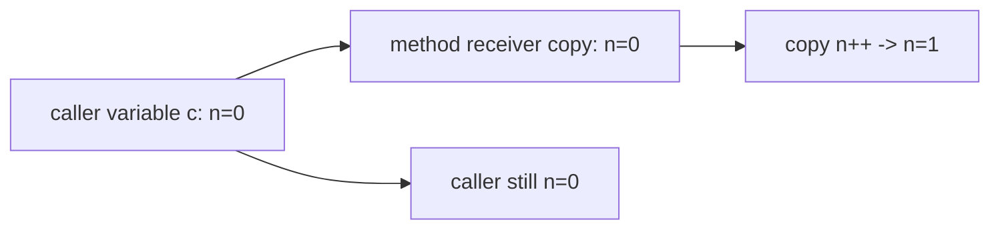
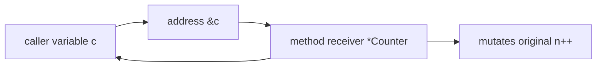
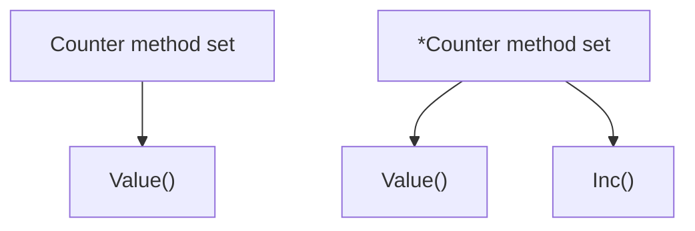
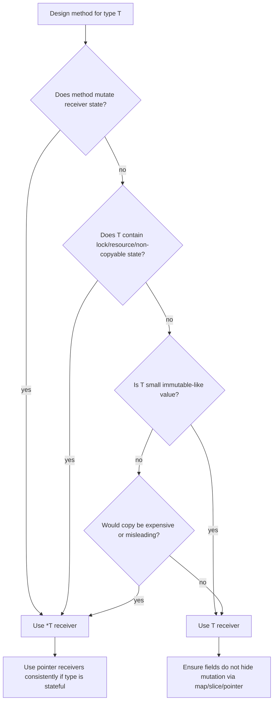
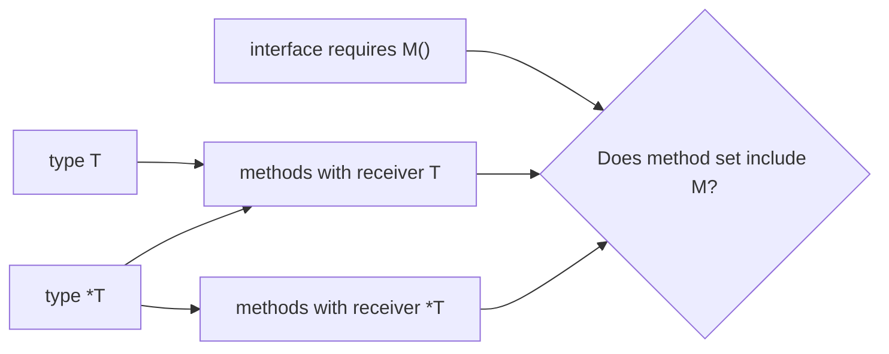

# learn-go-data-model-part-014.md

# Part 014 — Struct II: Value Receiver, Pointer Receiver, Mutability Contract

> Seri: `learn-go-data-model`  
> Bagian: `014 / 034`  
> Target pembaca: Java software engineer yang ingin memahami Go data model pada level production engineering  
> Fokus: method receiver, method set, mutation semantics, copy cost, interface satisfaction, dan kontrak mutability

---

## 0. Posisi Part Ini dalam Seri

Part 013 membahas `struct` sebagai data layout:

```text
struct
= ordered fields
= value type
= field layout
= alignment/padding
= embedding
= tags
= exported/unexported fields
```

Part ini membahas **behavior yang ditempelkan pada data** melalui method receiver.

Di Go, method tidak berada “di dalam class”. Method dideklarasikan terpisah:

```go
type Counter struct {
    n int
}

func (c Counter) Value() int {
    return c.n
}

func (c *Counter) Inc() {
    c.n++
}
```

Dua bentuk receiver tersebut adalah pusat dari desain mutability Go:

```text
value receiver   -> method menerima copy value
pointer receiver -> method menerima pointer ke value asli
```

Namun ini bukan hanya soal “bisa mutate atau tidak”. Receiver memengaruhi:

```text
- method set
- interface satisfaction
- copy cost
- aliasing
- nil possibility
- escape/allocation possibility
- concurrency safety
- API readability
- zero value usability
- long-term compatibility
```

---

## 1. Tujuan Pembelajaran

Setelah part ini, kamu harus bisa menjawab:

1. Apa bedanya function dan method di Go?
2. Apa sebenarnya receiver?
3. Apa efek value receiver terhadap copy dan mutation?
4. Apa efek pointer receiver terhadap mutation dan aliasing?
5. Mengapa method dengan pointer receiver bisa dipanggil pada variable value?
6. Mengapa method pointer receiver tidak bisa selalu dipanggil pada map entry?
7. Apa itu method set?
8. Mengapa `T` dan `*T` bisa satisfy interface yang berbeda?
9. Kapan value receiver tepat?
10. Kapan pointer receiver tepat?
11. Mengapa mixed receiver sering menjadi smell?
12. Apa hubungan receiver dengan immutable value object?
13. Apa hubungan receiver dengan mutable aggregate?
14. Bagaimana receiver memengaruhi race condition?
15. Bagaimana mendesain API agar mutability contract jelas?

---

## 2. Function vs Method

Function biasa:

```go
func Distance(a, b Point) float64 {
    dx := a.X - b.X
    dy := a.Y - b.Y
    return math.Sqrt(float64(dx*dx + dy*dy))
}
```

Method:

```go
func (p Point) DistanceTo(q Point) float64 {
    dx := p.X - q.X
    dy := p.Y - q.Y
    return math.Sqrt(float64(dx*dx + dy*dy))
}
```

Receiver:

```go
(p Point)
```

Receiver membuat function tersebut menjadi method dari type `Point`.

Pemanggilan:

```go
d := p.DistanceTo(q)
```

Secara mental, ini seperti:

```go
d := Point.DistanceTo(p, q) // konseptual, bukan syntax Go
```

Receiver hanyalah parameter khusus yang diberi syntax method call.

---

## 3. Receiver Bukan `this` Java

Java:

```java
class Counter {
    private int n;

    void inc() {
        this.n++;
    }
}
```

`this` selalu reference ke object.

Go:

```go
type Counter struct {
    n int
}

func (c Counter) IncValue() {
    c.n++
}

func (c *Counter) IncPointer() {
    c.n++
}
```

Pada value receiver, `c` adalah copy.

Pada pointer receiver, `c` adalah pointer.

Perbedaan fundamental:

```text
Java this:
- selalu reference
- object identity implisit
- method call mutability bergantung body method

Go receiver:
- eksplisit value atau pointer
- copy vs alias terlihat di signature
- mutability contract lebih terlihat
```

---

## 4. Value Receiver: Method Menerima Copy

Contoh:

```go
type Counter struct {
    n int
}

func (c Counter) Inc() {
    c.n++
}

func (c Counter) Value() int {
    return c.n
}

func main() {
    c := Counter{}
    c.Inc()
    fmt.Println(c.Value()) // 0
}
```

Mengapa 0?

```text
c.Inc()
-> receiver c dicopy ke parameter method
-> c.n++ mengubah copy
-> original tidak berubah
```

Diagram:



Value receiver cocok untuk method yang:

```text
- tidak memodifikasi receiver
- receiver kecil
- receiver immutable-like
- method menghitung/menurunkan value baru
- ingin aman dari accidental mutation
```

---

## 5. Pointer Receiver: Method Menerima Address

Contoh:

```go
type Counter struct {
    n int
}

func (c *Counter) Inc() {
    c.n++
}

func (c Counter) Value() int {
    return c.n
}

func main() {
    c := Counter{}
    c.Inc()
    fmt.Println(c.Value()) // 1
}
```

`Inc` menerima pointer ke original.



Pointer receiver cocok untuk method yang:

```text
- harus memodifikasi receiver
- receiver besar dan copy mahal
- receiver mengandung sync.Mutex/atomic/resource
- receiver merepresentasikan identity/stateful object
- nil receiver ingin menjadi bagian dari contract
- method harus preserve internal sharing
```

---

## 6. Automatic Addressing dan Dereferencing

Go memberi kemudahan method call.

Jika method punya pointer receiver:

```go
func (c *Counter) Inc() {
    c.n++
}
```

Kamu bisa panggil pada variable value yang addressable:

```go
var c Counter
c.Inc()
```

Compiler memperlakukan ini seperti:

```go
(&c).Inc()
```

Jika method punya value receiver:

```go
func (c Counter) Value() int {
    return c.n
}
```

Kamu bisa panggil pada pointer:

```go
p := &c
fmt.Println(p.Value())
```

Compiler memperlakukan ini seperti:

```go
(*p).Value()
```

Namun aturan ini bekerja saat value addressable atau pointer dereference aman secara semantic.

---

## 7. Tidak Semua Value Addressable

Pointer receiver method butuh address. Variable lokal addressable:

```go
c := Counter{}
c.Inc() // ok
```

Map entry tidak addressable:

```go
m := map[string]Counter{
    "a": {},
}

// m["a"].Inc() // compile error
```

Karena map entry bisa berpindah saat runtime map grow/rehash. Go tidak membolehkan mengambil address entry.

Solusi read-modify-write:

```go
c := m["a"]
c.Inc()
m["a"] = c
```

Atau simpan pointer:

```go
m := map[string]*Counter{
    "a": {},
}
m["a"].Inc()
```

Trade-off `map[K]*V`:

```text
+ easy mutation
+ identity/reference semantics
- nil value possible
- shared mutable state
- more heap objects
- more GC work
```

---

## 8. Method Set: Konsep Kunci Interface

Method set menentukan method apa yang dimiliki suatu type untuk interface satisfaction.

Untuk defined type `T`:

```text
method set of T
= methods declared with receiver T
```

Untuk pointer `*T`:

```text
method set of *T
= methods declared with receiver T
+ methods declared with receiver *T
```

Contoh:

```go
type Counter struct {
    n int
}

func (c Counter) Value() int {
    return c.n
}

func (c *Counter) Inc() {
    c.n++
}
```

Maka:

```text
Counter has:
- Value()

*Counter has:
- Value()
- Inc()
```

Diagram:



---

## 9. Interface Satisfaction

Interface:

```go
type Valuer interface {
    Value() int
}

type Incrementer interface {
    Inc()
}
```

Dengan `Counter` di atas:

```go
var c Counter
var p *Counter = &c

var _ Valuer = c  // ok
var _ Valuer = p  // ok

// var _ Incrementer = c // compile error
var _ Incrementer = p // ok
```

Mengapa?

```text
Counter method set hanya punya Value.
*Counter method set punya Value dan Inc.
```

Jadi pointer receiver mengubah siapa yang bisa satisfy interface.

Ini sering menjadi bug desain API.

---

## 10. Method Call Bisa, Interface Assignment Belum Tentu

Ini jebakan penting.

```go
type Incrementer interface {
    Inc()
}

type Counter struct {
    n int
}

func (c *Counter) Inc() {
    c.n++
}

func main() {
    var c Counter

    c.Inc() // ok, compiler auto-addresses because c is addressable

    var i Incrementer
    // i = c // compile error
    i = &c  // ok
}
```

Kenapa `c.Inc()` bisa tetapi `i = c` tidak?

Karena method call punya rule auto-addressing untuk addressable value, tetapi interface satisfaction berdasarkan method set type `Counter`, bukan apakah compiler bisa mengambil address variable tertentu.

Mental model:

```text
Method call syntax is convenient.
Interface satisfaction is type-level.
```

---

## 11. Receiver dan Addressability Matrix

| Expression | Addressable? | Bisa call pointer receiver? |
|---|---:|---:|
| local variable `c` | yes | yes |
| pointer `&c` | yes | yes |
| struct field of addressable variable `s.C` | yes | yes |
| slice element `s[i]` | yes | yes |
| array element of addressable array | yes | yes |
| map entry `m[k]` | no | no |
| function return `NewCounter()` value | no | no |
| composite literal assigned to variable | yes | yes |
| composite literal temporary `Counter{}` | no for method call requiring pointer | usually no |

Example:

```go
[]Counter{{}}[0].Inc() // depends on addressability of expression; avoid clever code
```

Practical rule:

```text
Jika butuh pointer receiver, simpan value di variable addressable atau pakai pointer eksplisit.
Jangan desain API yang bergantung pada addressability expression yang membingungkan.
```

---

## 12. Value Receiver dengan Reference-Like Fields

Value receiver copy tidak selalu berarti no mutation.

```go
type Bag struct {
    items []string
}

func (b Bag) Add(x string) {
    b.items = append(b.items, x)
}
```

Apakah original berubah?

It depends.

```go
func main() {
    b := Bag{items: make([]string, 0, 10)}
    b.Add("x")
    fmt.Println(len(b.items)) // 0
}
```

Length field pada slice descriptor receiver copy berubah, original descriptor tidak.

Tetapi jika method memodifikasi element:

```go
func (b Bag) SetFirst(x string) {
    b.items[0] = x
}
```

Maka backing array original berubah:

```go
b := Bag{items: []string{"a"}}
b.SetFirst("x")
fmt.Println(b.items[0]) // x
```

Karena slice descriptor copy masih menunjuk backing array sama.

Value receiver dengan map field:

```go
type Registry struct {
    handlers map[string]Handler
}

func (r Registry) Register(name string, h Handler) {
    r.handlers[name] = h
}
```

Walaupun receiver by value, map descriptor copy menunjuk table yang sama. Original map content berubah.

Ini sering membingungkan.

Rule:

```text
Value receiver prevents receiver field reassignment from affecting original.
It does not deep-copy referenced data inside fields.
```

---

## 13. Mutability Contract Harus Berdasarkan Semantik, Bukan Hanya Receiver

Receiver memberi signal, tetapi bukan jaminan total.

Contoh misleading:

```go
type Config struct {
    Values map[string]string
}

func (c Config) Set(k, v string) {
    c.Values[k] = v
}
```

Signature value receiver terlihat non-mutating, tetapi map content berubah.

Lebih jujur:

```go
func (c *Config) Set(k, v string) {
    c.Values[k] = v
}
```

Atau buat immutable:

```go
func (c Config) With(k, v string) Config {
    next := Config{
        Values: maps.Clone(c.Values),
    }
    next.Values[k] = v
    return next
}
```

Kontrak mutability harus menjawab:

```text
- Apakah method mengubah observable state receiver?
- Apakah method mengubah referenced data di dalam receiver?
- Apakah method aman dipanggil concurrent?
- Apakah method mengembalikan copy/snapshot?
```

---

## 14. Kapan Memakai Value Receiver

Gunakan value receiver jika mayoritas benar:

```text
- type kecil
- immutable-like
- no sync primitives
- no resource ownership
- method tidak memodifikasi observable state
- copy murah
- value dan pointer sama-sama boleh satisfy read-only interface
```

Contoh:

```go
type Point struct {
    X int
    Y int
}

func (p Point) DistanceTo(q Point) float64 {
    dx := p.X - q.X
    dy := p.Y - q.Y
    return math.Sqrt(float64(dx*dx + dy*dy))
}
```

Contoh domain value object:

```go
type Money struct {
    cents int64
}

func NewMoneyCents(cents int64) Money {
    return Money{cents: cents}
}

func (m Money) Add(n Money) Money {
    return Money{cents: m.cents + n.cents}
}

func (m Money) Cents() int64 {
    return m.cents
}
```

`Money.Add` tidak mutate `m`; ia menghasilkan value baru.

---

## 15. Kapan Memakai Pointer Receiver

Gunakan pointer receiver jika salah satu benar:

```text
- method memodifikasi receiver
- receiver besar dan copy mahal
- receiver mengandung Mutex/RWMutex/atomic/resource
- receiver mengandung cache/lazy initialization
- receiver harus preserve identity
- receiver punya internal mutable state
- consistency lebih baik jika semua method receiver pointer
```

Contoh:

```go
type Counter struct {
    n int64
}

func (c *Counter) Inc() {
    c.n++
}

func (c *Counter) Value() int64 {
    return c.n
}
```

Mengapa `Value` pointer juga, padahal tidak mutate?

Karena consistency: jika `Inc` butuh pointer, biasanya semua method pada type stateful itu pointer agar tidak ada accidental copy.

---

## 16. Mixed Receiver Anti-Pattern

Mixed receiver:

```go
type Cache struct {
    mu sync.Mutex
    m  map[string]string
}

func (c Cache) Len() int {
    c.mu.Lock()
    defer c.mu.Unlock()
    return len(c.m)
}

func (c *Cache) Set(k, v string) {
    c.mu.Lock()
    defer c.mu.Unlock()
    c.m[k] = v
}
```

`Len` value receiver mencopy mutex. Ini berbahaya.

Better:

```go
func (c *Cache) Len() int {
    c.mu.Lock()
    defer c.mu.Unlock()
    return len(c.m)
}
```

Guideline:

```text
If any method needs pointer receiver because the type is mutable/stateful/non-copyable,
strongly consider pointer receiver for all methods.
```

Mixed receiver masih bisa valid untuk small immutable types, tetapi jarang perlu.

---

## 17. Struct dengan `sync.Mutex`

Buruk:

```go
type SafeMap struct {
    mu sync.Mutex
    m  map[string]string
}

func (s SafeMap) Get(k string) (string, bool) {
    s.mu.Lock()
    defer s.mu.Unlock()

    v, ok := s.m[k]
    return v, ok
}
```

Ini mencopy `SafeMap`, termasuk `sync.Mutex`.

Benar:

```go
func (s *SafeMap) Get(k string) (string, bool) {
    s.mu.Lock()
    defer s.mu.Unlock()

    v, ok := s.m[k]
    return v, ok
}
```

Constructor:

```go
func NewSafeMap() *SafeMap {
    return &SafeMap{
        m: make(map[string]string),
    }
}
```

Go documentation untuk `sync.Mutex` menyatakan zero value adalah unlocked mutex dan mutex tidak boleh dicopy setelah first use. Receiver by value pada type yang mengandung mutex bertentangan dengan aturan ini.

---

## 18. Receiver dan Nil Pointer

Pointer receiver method bisa dipanggil pada nil pointer jika method body menangani nil.

```go
type Node struct {
    Value int
    Next  *Node
}

func (n *Node) IsNil() bool {
    return n == nil
}

func main() {
    var n *Node
    fmt.Println(n.IsNil()) // true
}
```

Tetapi ini panic:

```go
func (n *Node) ValueOrZero() int {
    return n.Value // panic if n == nil
}
```

Jika nil receiver bagian dari API contract, dokumentasikan dan test.

Contoh valid:

```go
func (n *Node) Len() int {
    if n == nil {
        return 0
    }
    return 1 + n.Next.Len()
}
```

Jangan menerima nil receiver diam-diam jika itu menyembunyikan bug.

---

## 19. Receiver Name

Receiver name biasanya pendek, tetapi bermakna.

```go
func (u User) EmailAddress() Email {
    return u.email
}
```

Jangan gunakan `this` atau `self` sebagai default.

Buruk:

```go
func (this User) EmailAddress() Email
```

Go style lebih sering memakai satu atau dua huruf berdasarkan type:

```go
func (c *Cache) Get(k string) (string, bool)
func (r *Registry) Register(...)
func (p Point) DistanceTo(q Point) float64
```

Untuk type dengan banyak method, receiver name konsisten.

---

## 20. Method on Non-Struct Types

Method bisa didefinisikan pada defined type apa pun yang bukan pointer/interface type alias tertentu sesuai aturan spec.

Contoh:

```go
type UserID string

func (id UserID) IsZero() bool {
    return id == ""
}
```

Numeric domain type:

```go
type MoneyCents int64

func (m MoneyCents) Add(n MoneyCents) MoneyCents {
    return m + n
}
```

Slice defined type:

```go
type UserIDs []UserID

func (ids UserIDs) Contains(target UserID) bool {
    for _, id := range ids {
        if id == target {
            return true
        }
    }
    return false
}
```

Map defined type:

```go
type Headers map[string]string

func (h Headers) Get(k string) (string, bool) {
    v, ok := h[k]
    return v, ok
}
```

Caveat: receiver by value pada slice/map defined type tetap copy descriptor, bukan deep copy.

---

## 21. Method Set dan Embedding

Embedding dapat mempromosikan methods.

```go
type Logger struct{}

func (Logger) Info(msg string) {}

type Service struct {
    Logger
}
```

`Service` mendapatkan promoted method `Info`.

```go
var s Service
s.Info("started")
```

Namun method set rules dengan embedding pointer/value bisa kompleks.

Practical guideline:

```text
- Jangan memakai embedding hanya untuk “inherit methods”.
- Pahami API surface yang ikut dipromosikan.
- Untuk dependency, named field sering lebih jelas.
```

Example safer:

```go
type Service struct {
    logger Logger
}

func (s *Service) Start() {
    s.logger.Info("started")
}
```

---

## 22. Method Values vs Method Expressions

Method value:

```go
c := &Counter{}
f := c.Inc
f()
```

`f` menangkap receiver `c`.

Method expression:

```go
f := (*Counter).Inc
c := &Counter{}
f(c)
```

Perbedaan:

```text
method value      -> receiver sudah diikat
method expression -> receiver menjadi parameter eksplisit
```

Ini berguna untuk callback, but can capture mutable state.

Contoh hazard:

```go
type Job struct {
    ID string
}

func (j *Job) Run() {
    fmt.Println(j.ID)
}

jobs := []*Job{{ID: "a"}, {ID: "b"}}

var funcs []func()
for _, job := range jobs {
    funcs = append(funcs, job.Run) // captures each receiver pointer
}
```

Method value menyimpan receiver. Jika receiver mutable, hasil call nanti mengikuti state saat call, bukan saat capture, kecuali kamu copy value.

---

## 23. Receiver dan Escape

Pointer receiver tidak otomatis berarti heap allocation. Escape analysis menentukan apakah value harus pindah ke heap.

Contoh:

```go
func f() {
    var c Counter
    c.Inc()
}
```

`c` bisa tetap stack jika tidak escape.

Namun pointer receiver bisa meningkatkan peluang escape jika pointer disimpan atau dikembalikan.

```go
func NewCounter() *Counter {
    var c Counter
    return &c // escapes to heap
}
```

Value receiver tidak otomatis bebas allocation jika field/method body membuat allocation.

Guideline:

```text
Jangan memilih receiver hanya berdasarkan tebakan allocation.
Gunakan go test -bench -benchmem dan go build -gcflags=-m untuk hot path.
```

---

## 24. Receiver dan Concurrency

Receiver tidak membuat method concurrent-safe.

```go
type Counter struct {
    n int
}

func (c *Counter) Inc() {
    c.n++
}
```

Ini tidak safe jika dipanggil dari banyak goroutine.

```go
go c.Inc()
go c.Inc()
```

Butuh synchronization:

```go
type SafeCounter struct {
    mu sync.Mutex
    n  int
}

func (c *SafeCounter) Inc() {
    c.mu.Lock()
    defer c.mu.Unlock()
    c.n++
}

func (c *SafeCounter) Value() int {
    c.mu.Lock()
    defer c.mu.Unlock()
    return c.n
}
```

Value receiver bisa membantu immutable style:

```go
type Snapshot struct {
    Values map[string]string
}
```

Tetapi jika map tidak diclone, tetap race.

Immutable snapshot harus deep enough:

```go
func NewSnapshot(values map[string]string) Snapshot {
    return Snapshot{Values: maps.Clone(values)}
}
```

Dan jangan expose mutable map langsung jika ingin benar-benar immutable.

---

## 25. Immutable-Style Value Object

Contoh:

```go
type Email struct {
    local  string
    domain string
}

func ParseEmail(s string) (Email, error) {
    parts := strings.Split(s, "@")
    if len(parts) != 2 || parts[0] == "" || parts[1] == "" {
        return Email{}, fmt.Errorf("invalid email %q", s)
    }
    return Email{
        local:  parts[0],
        domain: strings.ToLower(parts[1]),
    }, nil
}

func (e Email) String() string {
    return e.local + "@" + e.domain
}

func (e Email) Domain() string {
    return e.domain
}
```

Characteristics:

```text
- unexported fields
- constructor validates
- value receiver
- no mutation method
- safe to copy
- comparable if fields comparable
```

This is a strong Go pattern for domain value object.

---

## 26. Mutable Aggregate

Contoh:

```go
type Case struct {
    id     CaseID
    status Status
    events []DomainEvent
}

func NewCase(id CaseID) (*Case, error) {
    if id == "" {
        return nil, errors.New("empty case id")
    }
    return &Case{
        id:     id,
        status: StatusDraft,
    }, nil
}

func (c *Case) Submit(actor UserID) error {
    if c.status != StatusDraft {
        return fmt.Errorf("cannot submit case in status %q", c.status)
    }
    c.status = StatusSubmitted
    c.events = append(c.events, DomainEvent{
        Type:    "case_submitted",
        ActorID: actor,
    })
    return nil
}

func (c *Case) Status() Status {
    return c.status
}
```

Characteristics:

```text
- pointer receiver
- identity
- internal mutable state
- event list mutation
- constructor returns pointer
- copying would be semantically wrong
```

For mutable aggregate, use pointer consistently.

---

## 27. Copy-on-Write Value Method

Value receiver can return modified copy:

```go
type Query struct {
    Limit  int
    Offset int
}

func (q Query) WithLimit(limit int) Query {
    q.Limit = limit
    return q
}

func (q Query) WithOffset(offset int) Query {
    q.Offset = offset
    return q
}
```

Usage:

```go
q := Query{}
q2 := q.WithLimit(100).WithOffset(200)
```

Original unchanged.

Caveat: if struct has slice/map fields, copy-on-write must clone those fields before mutation.

```go
type Headers struct {
    values map[string]string
}

func (h Headers) With(k, v string) Headers {
    next := Headers{values: maps.Clone(h.values)}
    if next.values == nil {
        next.values = make(map[string]string)
    }
    next.values[k] = v
    return next
}
```

---

## 28. Fluent API: Be Careful

Pointer fluent API:

```go
func (b *Builder) WithName(name string) *Builder {
    b.name = name
    return b
}
```

This mutates.

Value fluent API:

```go
func (q Query) WithLimit(limit int) Query {
    q.Limit = limit
    return q
}
```

This returns new value.

Do not make it ambiguous.

Bad:

```go
q.WithLimit(10) // if returns value but caller ignores, no effect
```

For value-style API, docs/examples should show assignment:

```go
q = q.WithLimit(10)
```

For pointer-style builder, use pointer receiver consistently.

---

## 29. Receiver Consistency Rules

Practical rules:

### Rule 1 — If method mutates, use pointer receiver

```go
func (c *Counter) Inc()
```

### Rule 2 — If type contains sync.Mutex/atomic/resource, use pointer receiver

```go
func (s *Store) Get(...)
```

### Rule 3 — If type is small immutable value, use value receiver

```go
func (m Money) Add(n Money) Money
```

### Rule 4 — If one method requires pointer due to mutability/non-copyability, prefer all pointer receivers

```go
func (c *Cache) Get(...)
func (c *Cache) Set(...)
func (c *Cache) Len(...)
```

### Rule 5 — Avoid receiver choice based only on “performance intuition”

Measure if it matters.

### Rule 6 — Receiver choice is part of public API

Changing receiver can affect interface satisfaction.

---

## 30. Receiver Choice and API Compatibility

Suppose public type:

```go
type Reader struct{}

func (r Reader) Read(p []byte) (int, error) {
    return 0, io.EOF
}
```

Both `Reader` and `*Reader` implement `io.Reader`.

If you change to pointer receiver:

```go
func (r *Reader) Read(p []byte) (int, error) {
    return 0, io.EOF
}
```

Now only `*Reader` implements `io.Reader`. Code assigning `Reader{}` to `io.Reader` breaks.

Receiver changes can be breaking changes.

Guideline:

```text
For exported types, receiver choice is API design, not implementation detail.
```

---

## 31. Interface Design with Mutability

Read-only interface:

```go
type UserView interface {
    ID() UserID
    Email() Email
}
```

If methods have value receiver, both `User` and `*User` implement it.

Mutable interface:

```go
type UserMutator interface {
    ChangeEmail(Email) error
}
```

This likely requires pointer receiver, so only `*User` implements it.

Good separation:

```go
type CaseView interface {
    ID() CaseID
    Status() Status
}

type CaseMutator interface {
    Submit(actor UserID) error
}
```

This makes mutability explicit.

---

## 32. Method Receiver and Generics

Generic type can have methods:

```go
type Set[T comparable] map[T]struct{}

func (s Set[T]) Add(v T) {
    s[v] = struct{}{}
}

func (s Set[T]) Contains(v T) bool {
    _, ok := s[v]
    return ok
}
```

But zero value `Set[T]` is nil map. `Add` will panic on zero value.

A zero-value usable set needs struct wrapper:

```go
type Set2[T comparable] struct {
    values map[T]struct{}
}

func (s *Set2[T]) Add(v T) {
    if s.values == nil {
        s.values = make(map[T]struct{})
    }
    s.values[v] = struct{}{}
}

func (s *Set2[T]) Contains(v T) bool {
    _, ok := s.values[v]
    return ok
}
```

Receiver choice interacts with zero value design.

---

## 33. Pointer Receiver and Nil Map/Slice Initialization

Lazy initialization requires pointer receiver if you need update field descriptor.

```go
type Bag struct {
    items []string
}

func (b *Bag) Add(x string) {
    b.items = append(b.items, x)
}
```

If value receiver:

```go
func (b Bag) Add(x string) {
    b.items = append(b.items, x)
}
```

It updates only receiver copy's slice descriptor. Original `b.items` length may not change.

For map field:

```go
type Dict struct {
    values map[string]string
}

func (d *Dict) Set(k, v string) {
    if d.values == nil {
        d.values = make(map[string]string)
    }
    d.values[k] = v
}
```

Pointer receiver is required to assign initialized map back to struct field.

---

## 34. Table: Receiver Decision

| Situation | Prefer | Why |
|---|---|---|
| small value object | value | copy cheap, immutable semantics |
| method mutates field | pointer | must affect original |
| method mutates map/slice contents only | usually pointer | semantic honesty |
| type has `sync.Mutex` | pointer | avoid copy |
| type owns file/socket/db tx | pointer | identity/resource |
| large struct hot path | pointer or redesign | avoid copy, measure |
| DTO with getters only | value or none | simple data carrier |
| config immutable snapshot | value + deep clone boundary | safe sharing |
| builder | pointer | fluent mutation |
| copy-on-write query | value | returns modified copy |
| interface read-only | value may broaden satisfaction | both T and *T implement |
| interface mutating | pointer | only *T implements |

---

## 35. Mermaid: Receiver Selection



---

## 36. Mermaid: Interface Satisfaction



Simplified rule:

```text
T has only value receiver methods.
*T has both value and pointer receiver methods.
```

---

## 37. Mini Lab 1 — Predict Value Receiver Mutation

```go
type Counter struct {
    n int
}

func (c Counter) Inc() {
    c.n++
}

func main() {
    c := Counter{}
    c.Inc()
    fmt.Println(c.n)
}
```

Output:

```text
0
```

Reason:

```text
Inc modifies receiver copy.
```

---

## 38. Mini Lab 2 — Slice Field in Value Receiver

```go
type Bag struct {
    items []string
}

func (b Bag) SetFirst(x string) {
    b.items[0] = x
}

func (b Bag) Append(x string) {
    b.items = append(b.items, x)
}

func main() {
    b := Bag{items: make([]string, 1, 4)}
    b.items[0] = "a"

    b.SetFirst("x")
    fmt.Println(b.items) // ?

    b.Append("y")
    fmt.Println(b.items) // ?
}
```

Expected:

```text
[x]
[x]
```

`SetFirst` mutates shared backing array. `Append` changes receiver copy's slice descriptor length, original length remains 1.

But backing array may contain `"y"` beyond original len. This is exactly why value receiver with slice fields can be subtle.

---

## 39. Mini Lab 3 — Interface Satisfaction

```go
type Incrementer interface {
    Inc()
}

type Counter struct{}

func (c *Counter) Inc() {}

func main() {
    var c Counter
    c.Inc()

    var _ Incrementer = &c
    // var _ Incrementer = c
}
```

Why final line fails?

```text
Counter method set does not include pointer receiver method Inc.
*Counter method set includes Inc.
```

---

## 40. Mini Lab 4 — Map Entry

```go
type Counter struct {
    n int
}

func (c *Counter) Inc() {
    c.n++
}

func main() {
    m := map[string]Counter{
        "a": {},
    }

    // m["a"].Inc()
}
```

Why fails?

```text
m["a"] is not addressable, so compiler cannot auto-take address for pointer receiver.
```

Fix:

```go
c := m["a"]
c.Inc()
m["a"] = c
```

Or:

```go
m := map[string]*Counter{
    "a": {},
}
m["a"].Inc()
```

---

## 41. Mini Lab 5 — Immutable Money

```go
type Money struct {
    cents int64
}

func NewMoney(cents int64) Money {
    return Money{cents: cents}
}

func (m Money) Add(n Money) Money {
    return Money{cents: m.cents + n.cents}
}

func (m Money) Cents() int64 {
    return m.cents
}
```

This design:

```text
- uses value receiver
- hides field
- returns new value
- is safe to copy
```

If overflow matters, `Add` should validate or use checked arithmetic.

---

## 42. Mini Lab 6 — Mutable Case Aggregate

```go
type Case struct {
    id     CaseID
    status Status
}

func (c *Case) Submit() error {
    if c.status != StatusDraft {
        return fmt.Errorf("invalid transition from %s", c.status)
    }
    c.status = StatusSubmitted
    return nil
}
```

This design:

```text
- uses pointer receiver
- mutates aggregate
- should avoid copying Case after use
- may need synchronization if shared across goroutines
```

---

## 43. Common Anti-Patterns

### 43.1 Pointer receiver everywhere by reflex

```go
func (p *Point) XCoord() int
```

If `Point` is tiny and immutable-like, value receiver is clearer.

### 43.2 Value receiver on stateful type

```go
func (c Cache) Get(k string) (string, bool)
```

If `Cache` has lock/map/resource, pointer receiver is safer.

### 43.3 Mixed receiver without reason

```go
func (s Store) Get(...)
func (s *Store) Set(...)
```

This can copy state unexpectedly.

### 43.4 Value receiver that mutates map/slice field

```go
func (r Registry) Register(...)
```

Even if it works, it lies semantically.

### 43.5 Returning internal mutable field from value receiver

```go
func (c Config) Values() map[string]string {
    return c.values
}
```

This exposes internal map.

### 43.6 Ignoring returned value from immutable-style method

```go
q.WithLimit(10) // no effect if WithLimit returns Query
```

### 43.7 Changing receiver type in public API carelessly

Can break interface satisfaction.

---

## 44. Production Guidelines

### 44.1 Be Honest About Mutation

If method changes observable state, use pointer receiver or return a new value clearly.

```go
func (b *Bag) Add(x string)
func (q Query) WithLimit(n int) Query
```

### 44.2 Keep Receiver Consistent Per Type

If type is mutable or non-copyable, use pointer receivers consistently.

### 44.3 Do Not Copy Locks

Any type with `sync.Mutex`, `sync.RWMutex`, atomic fields, condition variables, or similar primitives should not be copied after use.

### 44.4 Use Value Receiver for Value Objects

Great for money, point, ID wrappers, parsed immutable domain values.

### 44.5 Separate View and Mutation Interfaces

```go
type View interface { Status() Status }
type Mutator interface { Submit() error }
```

### 44.6 Document Concurrency

Receiver choice does not imply thread safety.

```go
// Safe for concurrent use.
```

or

```go
// Not safe for concurrent use.
```

### 44.7 Clone Reference-Like Fields for Immutability

If value object contains map/slice/pointer, value receiver alone is not enough.

---

## 45. PR Review Checklist

### 45.1 Receiver Choice

```text
[ ] Does method mutate receiver?
[ ] Does receiver contain map/slice/pointer fields that are mutated?
[ ] Does receiver contain lock/resource/atomic field?
[ ] Is receiver large enough that copy matters?
[ ] Is receiver intended as immutable value object?
[ ] Are receiver types consistent across methods?
```

### 45.2 Interface Impact

```text
[ ] Does T or *T need to satisfy an interface?
[ ] Would pointer receiver accidentally prevent T from satisfying read-only interface?
[ ] Would receiver change be breaking for public API?
[ ] Are compile-time assertions included for important interfaces?
```

### 45.3 Copy and Alias

```text
[ ] Does value receiver create shallow copy hazard?
[ ] Are map/slice fields cloned when needed?
[ ] Are internal mutable fields exposed?
[ ] Is copy-on-write implemented deep enough?
```

### 45.4 Concurrency

```text
[ ] Is method safe for concurrent use?
[ ] Is lock copied accidentally?
[ ] Does method mutate shared state?
[ ] Are snapshots immutable after publish?
```

### 45.5 Nil

```text
[ ] Can pointer receiver be nil?
[ ] Is nil receiver handled intentionally?
[ ] Does method panic clearly or return error?
```

### 45.6 API Clarity

```text
[ ] Does method name imply mutation?
[ ] Does immutable method return new value?
[ ] Are examples showing assignment where required?
[ ] Is receiver name consistent and idiomatic?
```

---

## 46. Ringkasan Mental Model

Receiver choice di Go adalah desain kontrak.

```text
value receiver:
- copy receiver
- good for small immutable-like values
- broadens interface satisfaction
- does not deep-copy reference-like fields

pointer receiver:
- shares receiver
- required for mutation
- avoids large copy
- required for non-copyable/stateful types
- narrows interface satisfaction to *T for pointer methods
- introduces nil/aliasing/concurrency considerations
```

Untuk Java engineer:

```text
Jangan berpikir receiver sebagai this otomatis.
Pikirkan receiver sebagai parameter pertama yang eksplisit:
T  berarti copy value.
*T berarti pointer ke value.
```

Itu membuat mutability di Go lebih terlihat, tetapi juga menuntut disiplin.

---

## 47. Apa yang Tidak Dibahas di Part Ini

Part ini belum membahas pointer secara umum:

```text
- addressability lebih luas
- nil pointer detail
- pointer as optionality
- pointer and escape analysis deep dive
- pointer to slice/map/channel
```

Itu akan dibahas di part 016.

Part berikutnya masih tentang struct, tetapi dari sisi domain modeling:

```text
DTO, entity, config, option, event, validation boundary, tag leakage.
```

---

## 48. Referensi Resmi

- Go Language Specification — Method declarations, method sets, selectors, addressability  
  https://go.dev/ref/spec
- Go Wiki — MethodSets  
  https://go.dev/wiki/MethodSets
- Effective Go — Methods, pointers vs values  
  https://go.dev/doc/effective_go
- Go 1.26 Release Notes  
  https://go.dev/doc/go1.26
- Package `sync` — `Mutex`, `RWMutex`, and copy-after-use constraints  
  https://pkg.go.dev/sync
- Go Memory Model  
  https://go.dev/ref/mem
- Go vet/gopls analyzers — copylocks and related checks  
  https://go.dev/gopls/analyzers

---

## 49. Status Seri

Selesai:

```text
part-000  Orientation
part-001  Type system core
part-002  Zero value and invariants
part-003  Constants and iota
part-004  Numeric foundations
part-005  Numeric correctness
part-006  Text model I
part-007  Text model II
part-008  Array
part-009  Slice I
part-010  Slice II
part-011  Map I
part-012  Map II
part-013  Struct I
part-014  Struct II
```

Berikutnya:

```text
part-015  Struct III: Domain Modeling, DTO, Entity, Config, Option, Event
```

Seri belum selesai. Masih ada part 015 sampai part 034.


<!-- NAVIGATION_FOOTER -->
<div class="page-nav">
<a href="./learn-go-data-model-part-013.md">⬅️ Part 013 — Struct I: Field Layout, Alignment, Padding, Embedding</a>
<a href="./index.md">📚 Kategori</a>
<a href="../../index.md">🏠 Home</a>
<a href="./learn-go-data-model-part-015.md">Part 015 — Struct III: Domain Modeling, DTO, Entity, Config, Option, Event ➡️</a>
</div>
