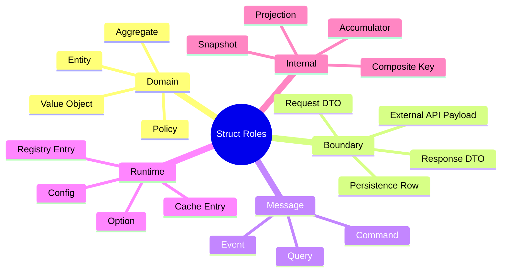
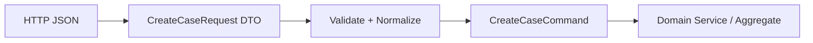
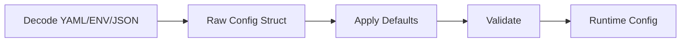
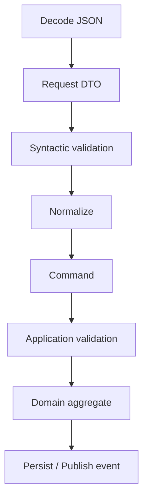
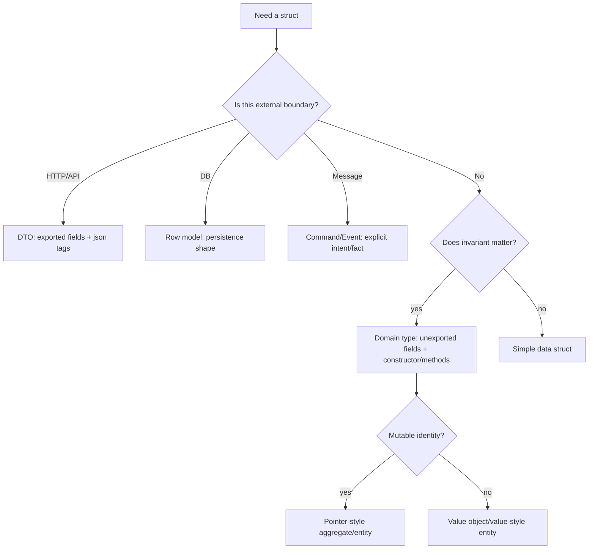
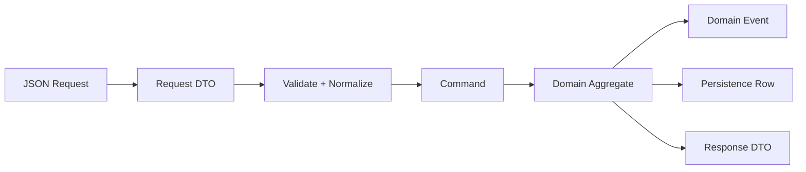

# learn-go-data-model-part-015.md

# Part 015 — Struct III: Domain Modeling, DTO, Entity, Config, Option, Event

> Seri: `learn-go-data-model`  
> Bagian: `015 / 034`  
> Target pembaca: Java software engineer yang ingin memahami Go data model pada level production engineering  
> Fokus: memakai `struct` untuk modeling produksi: domain, DTO, entity, config, command, event, option, validation, dan boundary contract

---

## 0. Posisi Part Ini dalam Seri

Dua part sebelumnya membahas struct dari dua sisi teknis:

```text
part-013:
struct sebagai data layout
- field order
- alignment
- padding
- embedding
- tag
- exported/unexported field

part-014:
struct dengan behavior
- value receiver
- pointer receiver
- method set
- interface satisfaction
- mutability contract
```

Part ini menyatukan keduanya ke dalam desain sistem nyata.

Di produksi, pertanyaan yang lebih penting bukan:

```text
Bagaimana menulis struct?
```

Melainkan:

```text
Struct ini merepresentasikan apa?
Siapa boleh membuatnya?
Apakah state-nya valid?
Apakah ini domain object, DTO, persistence model, config, command, event, atau internal index?
Apakah field boleh exported?
Apakah tag transport/persistence boleh masuk?
Apakah struct ini stabil sebagai public API?
Apakah zero value valid?
Apakah mutation allowed?
Apakah copy allowed?
```

Part ini akan menjadi jembatan dari “syntax struct” ke “data modeling handbook”.

---

## 1. Tujuan Pembelajaran

Setelah part ini, kamu harus bisa:

1. Membedakan value object, entity, DTO, command, event, config, option, dan persistence model.
2. Mendesain struct yang menjaga invariant, bukan hanya menampung field.
3. Menentukan kapan field harus exported atau unexported.
4. Menentukan kapan struct harus value-style atau pointer-style.
5. Memahami kapan JSON/DB tag boleh berada di struct.
6. Menghindari tag leakage dari transport/persistence ke domain.
7. Mendesain request/response DTO yang evolvable.
8. Mendesain command/event payload yang stabil dan audit-friendly.
9. Mendesain config struct dengan defaulting dan validation yang jelas.
10. Mendesain option pattern tanpa membuat API terlalu magic.
11. Menghindari “anemic but chaotic model”.
12. Membuat checklist PR untuk struct modeling.

---

## 2. Mental Model: Struct sebagai Contract

Struct bukan hanya kumpulan field.

Struct adalah kontrak tentang:

```text
- shape data
- allowed states
- ownership
- mutability
- serialization boundary
- compatibility promise
- lifecycle
```

Contoh yang terlihat sederhana:

```go
type User struct {
    ID    string
    Email string
}
```

Pertanyaan produksinya:

```text
Apakah ID boleh kosong?
Apakah Email sudah normalized?
Apakah Email valid?
Apakah User boleh dibuat langsung dari JSON?
Apakah User ini domain entity atau response DTO?
Apakah ID string bisa tertukar dengan CaseID?
Apakah field bisa dimutasi caller?
Apakah zero User{} valid?
```

Jika pertanyaan-pertanyaan ini tidak dijawab, struct menjadi sumber bug diam-diam.

---

## 3. Taxonomy Struct Produksi



Satu `struct` bisa dipakai untuk banyak hal, tetapi jangan mencampur role tanpa sadar.

---

## 4. Role 1 — Value Object

Value object merepresentasikan nilai, bukan identity.

Contoh:

```go
type Email struct {
    local  string
    domain string
}
```

Dua email dengan local/domain sama dianggap nilai yang sama secara semantic.

Value object biasanya:

```text
- immutable-like
- small
- safe to copy
- value receiver
- unexported fields jika invariant penting
- constructor/parser memvalidasi
- zero value bisa invalid atau special, harus jelas
```

Contoh implementasi:

```go
type Email struct {
    local  string
    domain string
}

func ParseEmail(s string) (Email, error) {
    s = strings.TrimSpace(s)
    parts := strings.Split(s, "@")
    if len(parts) != 2 {
        return Email{}, fmt.Errorf("invalid email %q", s)
    }

    local := parts[0]
    domain := strings.ToLower(parts[1])

    if local == "" || domain == "" {
        return Email{}, fmt.Errorf("invalid email %q", s)
    }

    return Email{
        local:  local,
        domain: domain,
    }, nil
}

func (e Email) String() string {
    if e.local == "" && e.domain == "" {
        return ""
    }
    return e.local + "@" + e.domain
}

func (e Email) Domain() string {
    return e.domain
}

func (e Email) IsZero() bool {
    return e.local == "" && e.domain == ""
}
```

### 4.1 Why not `type Email string`?

Kadang cukup:

```go
type Email string
```

Dengan validator:

```go
func ParseEmail(s string) (Email, error) {
    s = strings.TrimSpace(s)
    if !strings.Contains(s, "@") {
        return "", fmt.Errorf("invalid email")
    }
    return Email(strings.ToLower(s)), nil
}
```

Pilih struct jika:

```text
- ada canonical components
- ada derived behavior
- butuh normalization kuat
- ingin menghindari arbitrary string construction
```

Pilih defined string jika:

```text
- format cukup sederhana
- storage/serialization harus string langsung
- invariant bisa dijaga di boundary
```

---

## 5. Value Object: Money

Money adalah contoh klasik.

Buruk:

```go
type Invoice struct {
    Amount float64
}
```

Lebih aman:

```go
type Money struct {
    currency Currency
    cents    int64
}

type Currency string

func NewMoney(currency Currency, cents int64) (Money, error) {
    if currency == "" {
        return Money{}, errors.New("currency is required")
    }
    return Money{
        currency: currency,
        cents:    cents,
    }, nil
}

func (m Money) Currency() Currency {
    return m.currency
}

func (m Money) Cents() int64 {
    return m.cents
}

func (m Money) Add(n Money) (Money, error) {
    if m.currency != n.currency {
        return Money{}, fmt.Errorf("currency mismatch: %s vs %s", m.currency, n.currency)
    }
    return Money{
        currency: m.currency,
        cents:    m.cents + n.cents,
    }, nil
}
```

Pertanyaan lanjutan:

```text
- Apakah negative money allowed?
- Apakah overflow checked?
- Apakah rounding ada?
- Apakah currency minor unit selalu 2 digit?
```

Topik money sudah disentuh di part numeric correctness; di sini fokusnya struct sebagai penjaga invariant.

---

## 6. Role 2 — Entity

Entity punya identity. Dua entity dengan field sama belum tentu entity yang sama jika identity berbeda.

```go
type UserID string

type User struct {
    id    UserID
    email Email
    name  string
}

func NewUser(id UserID, email Email, name string) (User, error) {
    if id == "" {
        return User{}, errors.New("user id is required")
    }
    if email.IsZero() {
        return User{}, errors.New("email is required")
    }
    name = strings.TrimSpace(name)
    if name == "" {
        return User{}, errors.New("name is required")
    }

    return User{
        id:    id,
        email: email,
        name:  name,
    }, nil
}

func (u User) ID() UserID {
    return u.id
}

func (u User) Email() Email {
    return u.email
}

func (u User) Name() string {
    return u.name
}
```

Entity bisa value-style atau pointer-style.

### 6.1 Value-Style Entity

```go
func (u User) Rename(name string) (User, error) {
    name = strings.TrimSpace(name)
    if name == "" {
        return User{}, errors.New("name is required")
    }
    u.name = name
    return u, nil
}
```

Kelebihan:

```text
- easier snapshot
- fewer aliasing bugs
- good for small immutable-ish entity
```

Kekurangan:

```text
- caller harus assign hasil
- event tracking/mutation internal lebih sulit
```

### 6.2 Pointer-Style Entity

```go
func (u *User) Rename(name string) error {
    name = strings.TrimSpace(name)
    if name == "" {
        return errors.New("name is required")
    }
    u.name = name
    return nil
}
```

Kelebihan:

```text
- natural mutation
- cocok untuk aggregate
- identity lebih jelas
```

Kekurangan:

```text
- aliasing
- concurrency risk
- nil pointer possibility
- harder snapshot discipline
```

---

## 7. Role 3 — Aggregate

Aggregate adalah entity yang menjaga invariant lintas beberapa field/child object.

Contoh case workflow:

```go
type CaseID string
type CaseStatus string

const (
    CaseStatusDraft     CaseStatus = "draft"
    CaseStatusSubmitted CaseStatus = "submitted"
    CaseStatusApproved  CaseStatus = "approved"
    CaseStatusRejected  CaseStatus = "rejected"
)

type Case struct {
    id      CaseID
    status  CaseStatus
    ownerID UserID
    events  []DomainEvent
}
```

Constructor:

```go
func NewCase(id CaseID, ownerID UserID) (*Case, error) {
    if id == "" {
        return nil, errors.New("case id is required")
    }
    if ownerID == "" {
        return nil, errors.New("owner id is required")
    }

    return &Case{
        id:      id,
        ownerID: ownerID,
        status:  CaseStatusDraft,
    }, nil
}
```

Behavior:

```go
func (c *Case) Submit(actor UserID) error {
    if actor == "" {
        return errors.New("actor is required")
    }
    if c.status != CaseStatusDraft {
        return fmt.Errorf("cannot submit case in status %q", c.status)
    }

    c.status = CaseStatusSubmitted
    c.events = append(c.events, DomainEvent{
        Type:    "case_submitted",
        CaseID:  c.id,
        ActorID: actor,
        At:      time.Now().UTC(),
    })

    return nil
}
```

Expose events safely:

```go
func (c *Case) PullEvents() []DomainEvent {
    out := append([]DomainEvent(nil), c.events...)
    c.events = nil
    return out
}
```

Aggregate struct should usually not expose fields directly because invariant is the point.

---

## 8. Role 4 — DTO: Request

Request DTO is a transport boundary.

```go
type CreateCaseRequest struct {
    ApplicantID string `json:"applicant_id"`
    CaseType    string `json:"case_type"`
    Description string `json:"description"`
}
```

DTO fields are usually exported because encoders/decoders need access.

But DTO is not domain.

Map to command:

```go
func (r CreateCaseRequest) ToCommand() (CreateCaseCommand, error) {
    applicantID := ApplicantID(strings.TrimSpace(r.ApplicantID))
    if applicantID == "" {
        return CreateCaseCommand{}, errors.New("applicant_id is required")
    }

    caseType := CaseType(strings.TrimSpace(r.CaseType))
    if caseType == "" {
        return CreateCaseCommand{}, errors.New("case_type is required")
    }

    description := strings.TrimSpace(r.Description)

    return CreateCaseCommand{
        ApplicantID: applicantID,
        CaseType:    caseType,
        Description: description,
    }, nil
}
```

Pattern:

```text
HTTP JSON -> Request DTO -> Validate/Normalize -> Command -> Domain
```

Diagram:



---

## 9. Request DTO: Missing vs Explicit Zero

For PATCH/update, zero value ambiguity matters.

Bad:

```go
type UpdateUserRequest struct {
    Name string `json:"name"`
    Age  int    `json:"age"`
}
```

If `Age` is 0, is it missing or explicitly set to 0?

Option 1: pointer fields for tri-state:

```go
type UpdateUserRequest struct {
    Name *string `json:"name,omitempty"`
    Age  *int    `json:"age,omitempty"`
}
```

Meaning:

```text
nil -> field absent
non-nil -> field present with value
```

But pointer fields have cost:

```text
- nil handling
- more allocations sometimes
- less ergonomic
- validation more complex
```

Option 2: custom optional type:

```go
type Optional[T any] struct {
    value T
    set   bool
}

func Some[T any](v T) Optional[T] {
    return Optional[T]{value: v, set: true}
}

func None[T any]() Optional[T] {
    return Optional[T]{}
}

func (o Optional[T]) IsSet() bool {
    return o.set
}

func (o Optional[T]) Value() (T, bool) {
    return o.value, o.set
}
```

But JSON integration requires custom unmarshal if you want generic optional at boundary.

Practical guideline:

```text
For PATCH DTO, pointer fields are acceptable if documented and localized to boundary.
Do not let pointer-heavy PATCH DTO leak into domain model.
```

---

## 10. Role 5 — DTO: Response

Response DTO should be stable, explicit, and client-oriented.

```go
type CaseResponse struct {
    ID        string `json:"id"`
    Status    string `json:"status"`
    Applicant string `json:"applicant"`
    CreatedAt string `json:"created_at"`
}
```

Mapping:

```go
func NewCaseResponse(c CaseView) CaseResponse {
    return CaseResponse{
        ID:        string(c.ID()),
        Status:    string(c.Status()),
        Applicant: string(c.ApplicantID()),
        CreatedAt: c.CreatedAt().UTC().Format(time.RFC3339),
    }
}
```

Do not expose domain struct directly as API response just because fields match today.

Why?

```text
- response schema has compatibility contract
- domain fields can change for internal reasons
- JSON tags can leak into domain
- sensitive fields may accidentally expose
- zero/nil representation may differ
```

---

## 11. Role 6 — Persistence Row Model

Database row model:

```go
type UserRow struct {
    ID        string
    Email     string
    Name      string
    CreatedAt time.Time
}
```

Mapping to domain:

```go
func (r UserRow) ToDomain() (User, error) {
    email, err := ParseEmail(r.Email)
    if err != nil {
        return User{}, err
    }

    return NewUser(UserID(r.ID), email, r.Name)
}
```

Mapping from domain:

```go
func NewUserRow(u User) UserRow {
    return UserRow{
        ID:    string(u.ID()),
        Email: u.Email().String(),
        Name:  u.Name(),
    }
}
```

Avoid making persistence row the domain model by default.

Why?

```text
- DB nullability != domain optionality
- DB column names != domain concepts
- DB joins/projections may not equal aggregate
- migration changes can pollute domain
- domain invariant should not depend on scanner behavior
```

---

## 12. Role 7 — Command

Command represents intent to change state.

```go
type CreateCaseCommand struct {
    ApplicantID ApplicantID
    CaseType    CaseType
    Description string
}
```

Command should be validated enough that handler can rely on it.

Constructor:

```go
func NewCreateCaseCommand(applicantID ApplicantID, caseType CaseType, description string) (CreateCaseCommand, error) {
    if applicantID == "" {
        return CreateCaseCommand{}, errors.New("applicant id is required")
    }
    if caseType == "" {
        return CreateCaseCommand{}, errors.New("case type is required")
    }

    return CreateCaseCommand{
        ApplicantID: applicantID,
        CaseType:    caseType,
        Description: strings.TrimSpace(description),
    }, nil
}
```

Handler:

```go
func (h *CreateCaseHandler) Handle(ctx context.Context, cmd CreateCaseCommand) (CaseID, error) {
    // use cmd as validated intent
}
```

Command differs from DTO:

```text
DTO speaks transport.
Command speaks application intent.
```

---

## 13. Role 8 — Event

Event represents something that already happened.

```go
type CaseSubmittedEvent struct {
    EventID     EventID   `json:"event_id"`
    CaseID      CaseID    `json:"case_id"`
    SubmittedBy UserID    `json:"submitted_by"`
    SubmittedAt time.Time `json:"submitted_at"`
    Version     int       `json:"version"`
}
```

Event design rules:

```text
- past tense name
- immutable after creation
- includes event identity if needed
- includes occurrence time
- version schema explicitly if persisted/published
- stable serialization
- avoid map[string]any for core facts
```

Event constructor:

```go
func NewCaseSubmittedEvent(caseID CaseID, actor UserID, at time.Time) (CaseSubmittedEvent, error) {
    if caseID == "" {
        return CaseSubmittedEvent{}, errors.New("case id is required")
    }
    if actor == "" {
        return CaseSubmittedEvent{}, errors.New("actor is required")
    }
    if at.IsZero() {
        at = time.Now().UTC()
    }

    return CaseSubmittedEvent{
        EventID:     NewEventID(),
        CaseID:      caseID,
        SubmittedBy: actor,
        SubmittedAt: at.UTC(),
        Version:     1,
    }, nil
}
```

For audit/regulatory systems, event structs should be boring, explicit, and stable.

---

## 14. Role 9 — Query

Query represents read intent.

```go
type SearchCasesQuery struct {
    ApplicantID ApplicantID
    Status      CaseStatus
    Limit       int
    Offset      int
}
```

Defaulting/validation:

```go
func (q SearchCasesQuery) Normalize() (SearchCasesQuery, error) {
    if q.Limit == 0 {
        q.Limit = 50
    }
    if q.Limit < 0 || q.Limit > 500 {
        return SearchCasesQuery{}, fmt.Errorf("invalid limit %d", q.Limit)
    }
    if q.Offset < 0 {
        return SearchCasesQuery{}, fmt.Errorf("invalid offset %d", q.Offset)
    }
    return q, nil
}
```

Query struct often works well as value-style.

Copy-on-write helper:

```go
func (q SearchCasesQuery) WithLimit(limit int) SearchCasesQuery {
    q.Limit = limit
    return q
}
```

---

## 15. Role 10 — Config

Config struct should separate:

```text
- raw decoded config
- defaulted config
- validated config
- runtime component
```

Example:

```go
type ServerConfig struct {
    Host         string
    Port         int
    ReadTimeout  time.Duration
    WriteTimeout time.Duration
}
```

Defaults:

```go
func (c ServerConfig) WithDefaults() ServerConfig {
    if c.Host == "" {
        c.Host = "127.0.0.1"
    }
    if c.Port == 0 {
        c.Port = 8080
    }
    if c.ReadTimeout == 0 {
        c.ReadTimeout = 5 * time.Second
    }
    if c.WriteTimeout == 0 {
        c.WriteTimeout = 5 * time.Second
    }
    return c
}
```

Validation:

```go
func (c ServerConfig) Validate() error {
    if c.Port < 1 || c.Port > 65535 {
        return fmt.Errorf("invalid port %d", c.Port)
    }
    if c.ReadTimeout < 0 {
        return errors.New("read timeout must be non-negative")
    }
    if c.WriteTimeout < 0 {
        return errors.New("write timeout must be non-negative")
    }
    return nil
}
```

Build:

```go
func NewServerConfig(raw ServerConfig) (ServerConfig, error) {
    c := raw.WithDefaults()
    if err := c.Validate(); err != nil {
        return ServerConfig{}, err
    }
    return c, nil
}
```

Pipeline:



Important question:

```text
Can user explicitly set zero?
```

If yes, plain zero-defaulting may be wrong. Use pointer/optional for raw config.

---

## 16. Role 11 — Option Struct

Option struct is useful when function has many optional parameters.

```go
type ClientOptions struct {
    Timeout    time.Duration
    RetryCount int
    UserAgent  string
}
```

Function:

```go
func NewClient(baseURL string, opts ClientOptions) (*Client, error) {
    if baseURL == "" {
        return nil, errors.New("base URL is required")
    }

    opts = opts.withDefaults()
    if err := opts.validate(); err != nil {
        return nil, err
    }

    return &Client{
        baseURL: baseURL,
        timeout: opts.Timeout,
    }, nil
}
```

Defaults:

```go
func (o ClientOptions) withDefaults() ClientOptions {
    if o.Timeout == 0 {
        o.Timeout = 5 * time.Second
    }
    if o.RetryCount == 0 {
        o.RetryCount = 3
    }
    if o.UserAgent == "" {
        o.UserAgent = "my-client"
    }
    return o
}
```

Pros:

```text
- simple
- inspectable
- easy to serialize/test
- explicit
```

Cons:

```text
- zero value ambiguity
- adding fields changes struct
- caller can construct invalid options unless validation happens
```

---

## 17. Role 12 — Functional Options

Functional option pattern:

```go
type ClientOption func(*ClientOptions)

func WithTimeout(timeout time.Duration) ClientOption {
    return func(o *ClientOptions) {
        o.Timeout = timeout
    }
}

func WithRetryCount(n int) ClientOption {
    return func(o *ClientOptions) {
        o.RetryCount = n
    }
}
```

Constructor:

```go
func NewClient(baseURL string, options ...ClientOption) (*Client, error) {
    if baseURL == "" {
        return nil, errors.New("base URL is required")
    }

    opts := ClientOptions{
        Timeout:    5 * time.Second,
        RetryCount: 3,
        UserAgent:  "my-client",
    }

    for _, apply := range options {
        if apply == nil {
            return nil, errors.New("nil client option")
        }
        apply(&opts)
    }

    if err := opts.validate(); err != nil {
        return nil, err
    }

    return &Client{
        baseURL: baseURL,
        timeout: opts.Timeout,
    }, nil
}
```

Pros:

```text
- extensible
- good for libraries
- avoids giant constructors
- defaults centralized
```

Cons:

```text
- less transparent than struct literal
- harder to serialize/inspect
- option order can matter if not careful
- can be overused
```

Use functional options when:

```text
- public library API
- many optional settings
- future extensibility important
- options may require validation logic
```

Use option struct when:

```text
- internal application code
- config needs to be loaded from file/env
- inspectability matters
```

---

## 18. Role 13 — Internal Composite Key

Struct as map key:

```go
type TenantUserKey struct {
    TenantID TenantID
    UserID   UserID
}
```

Use:

```go
access := map[TenantUserKey]Access{}
```

Composite key should be:

```text
- comparable
- canonical
- small
- unambiguous
- named by domain relationship
```

Bad:

```go
key := tenantID + ":" + userID
```

Unless canonical encoding is guaranteed.

Composite key struct is clearer and compiler-checked.

---

## 19. Role 14 — Snapshot

Snapshot is immutable-ish representation at a point in time.

```go
type CaseSnapshot struct {
    ID        CaseID
    Status    CaseStatus
    OwnerID   UserID
    UpdatedAt time.Time
}
```

Snapshot usually has exported fields if used as read model/DTO internal. But if it contains mutable reference-like fields, clone them.

```go
type ConfigSnapshot struct {
    values map[string]string
}

func NewConfigSnapshot(values map[string]string) ConfigSnapshot {
    return ConfigSnapshot{
        values: maps.Clone(values),
    }
}

func (s ConfigSnapshot) Get(k string) (string, bool) {
    v, ok := s.values[k]
    return v, ok
}

func (s ConfigSnapshot) Values() map[string]string {
    return maps.Clone(s.values)
}
```

A snapshot that exposes internal map is not really immutable.

---

## 20. Role 15 — Accumulator

Accumulator is temporary mutable struct used during computation.

```go
type StatusAccumulator struct {
    counts map[CaseStatus]int
}

func NewStatusAccumulator() *StatusAccumulator {
    return &StatusAccumulator{
        counts: make(map[CaseStatus]int),
    }
}

func (a *StatusAccumulator) Add(c Case) {
    a.counts[c.Status()]++
}

func (a *StatusAccumulator) Result() []StatusCount {
    out := make([]StatusCount, 0, len(a.counts))
    for status, count := range a.counts {
        out = append(out, StatusCount{Status: status, Count: count})
    }
    sort.Slice(out, func(i, j int) bool {
        return out[i].Status < out[j].Status
    })
    return out
}
```

Accumulator should usually stay internal. Do not make it part of public API unless it is a deliberate builder/collector.

---

## 21. Exported vs Unexported: Decision Framework

Use exported fields when:

```text
- struct is simple DTO
- struct is config intended for literal construction
- struct is test data holder
- struct is public data carrier with weak invariant
- encoding/json or similar needs direct access
```

Use unexported fields when:

```text
- invariant matters
- invalid state is dangerous
- mutation must be controlled
- internal representation may change
- domain object should not be built arbitrarily
```

Hybrid:

```go
type PageRequest struct {
    Limit  int
    Offset int
}
```

Could be exported because invalid limit is not catastrophic if validation always happens at handler.

But:

```go
type Policy struct {
    rules map[Action]Decision
}
```

Should be unexported because invalid/mutated rules can affect authorization.

---

## 22. Constructor, Factory, Parser

Go has no constructor syntax. Use functions.

### 22.1 `NewX`

Use when constructing runtime object/entity/config.

```go
func NewPolicy(rules map[Action]Decision) (*Policy, error)
```

### 22.2 `ParseX`

Use when converting from string/text.

```go
func ParseEmail(s string) (Email, error)
```

### 22.3 `MustX`

Use sparingly for package-level constants/test setup.

```go
func MustParseEmail(s string) Email {
    e, err := ParseEmail(s)
    if err != nil {
        panic(err)
    }
    return e
}
```

### 22.4 `FromX`

Use for explicit boundary mapping.

```go
func UserFromRow(row UserRow) (User, error)
func NewUserResponse(u User) UserResponse
```

Naming should reveal source and validation.

---

## 23. Validation Boundary

Do not validate randomly everywhere. Define validation stages.

Example HTTP pipeline:



Validation categories:

```text
syntactic:
- required field
- string length
- numeric range
- parseable date

semantic/application:
- applicant exists
- user has permission
- state transition allowed
- duplicate not allowed

domain invariant:
- entity cannot enter invalid state
- money currency must match
- deadline must be after submission
```

Struct design should reflect where validation happens.

---

## 24. Tag Leakage

Struct tags are convenient:

```go
type Case struct {
    ID        CaseID `json:"id" db:"case_id" validate:"required"`
    Status    Status `json:"status" db:"status"`
    CreatedAt time.Time `json:"created_at" db:"created_at"`
}
```

But if this is domain entity, it now knows about:

```text
- JSON representation
- DB column names
- validation framework
```

This can be okay for small apps, but in complex systems it creates coupling.

Alternative:

```text
Domain:
Case

Transport:
CaseResponse
CreateCaseRequest

Persistence:
CaseRow
```

Mapping is explicit.

Cost:

```text
more code
```

Benefit:

```text
cleaner lifecycle, less accidental coupling, safer evolution
```

---

## 25. The “One Struct for Everything” Trap

Common anti-pattern:

```go
type User struct {
    ID        string `json:"id" db:"id"`
    Email     string `json:"email" db:"email"`
    Password  string `json:"password,omitempty" db:"password_hash"`
    CreatedAt string `json:"created_at" db:"created_at"`
}
```

Used for:

```text
- HTTP request
- HTTP response
- DB row
- domain entity
- internal service call
```

Problems:

```text
- password accidentally serialized
- DB hash field confused with request password
- CreatedAt string instead of time.Time in domain
- validation unclear
- tag conflict
- field required in one context but optional in another
- compatibility changes entangled
```

Better:

```go
type CreateUserRequest struct {
    Email    string `json:"email"`
    Password string `json:"password"`
}

type UserResponse struct {
    ID        string `json:"id"`
    Email     string `json:"email"`
    CreatedAt string `json:"created_at"`
}

type UserRow struct {
    ID           string
    Email        string
    PasswordHash []byte
    CreatedAt    time.Time
}

type User struct {
    id           UserID
    email        Email
    passwordHash PasswordHash
    createdAt    time.Time
}
```

More types, fewer accidental states.

---

## 26. Anemic but Chaotic Model

Anemic model means data structs without behavior. In Go, plain data structs are not automatically bad. The problem is chaotic model:

```text
- many exported fields
- validation scattered
- mutation anywhere
- no clear boundary
- same struct used for all layers
- no invariant owner
```

Good Go code can use simple structs, but it should still have clear ownership.

Example acceptable anemic DTO:

```go
type CaseResponse struct {
    ID     string `json:"id"`
    Status string `json:"status"`
}
```

Example dangerous anemic domain:

```go
type Case struct {
    ID     string
    Status string
}

caseObj.Status = "approved" // from anywhere, no transition check
```

Better:

```go
type Case struct {
    id     CaseID
    status CaseStatus
}

func (c *Case) Approve(actor UserID) error {
    if c.status != CaseStatusSubmitted {
        return fmt.Errorf("cannot approve from %s", c.status)
    }
    c.status = CaseStatusApproved
    return nil
}
```

---

## 27. Compatibility of Public Structs

Exported struct fields are compatibility promises.

If you expose:

```go
type ClientConfig struct {
    Timeout time.Duration
}
```

Users can write:

```go
cfg := ClientConfig{Timeout: time.Second}
```

Adding a field is usually okay for keyed literals:

```go
type ClientConfig struct {
    Timeout time.Duration
    Retries int
}
```

But unkeyed literals break or change meaning:

```go
ClientConfig{time.Second}
```

Therefore:

```text
- Encourage keyed literals for public structs.
- Avoid exposing struct fields if invariant may evolve.
- Consider option struct if config is intended for public construction.
- Consider functional options if you need more evolution control.
```

---

## 28. Struct Evolution Rules

### 28.1 Adding Field

Safe-ish if users use keyed literals and field has safe zero value.

Risky if:

```text
- unkeyed literals exist
- zero value changes behavior
- field is required but cannot be enforced
```

### 28.2 Renaming Field

Breaking.

### 28.3 Removing Field

Breaking.

### 28.4 Changing Field Type

Breaking.

### 28.5 Exporting Previously Unexported Field

Usually additive but can freeze internal representation.

### 28.6 Making Exported Field Unexported

Breaking.

### 28.7 Adding Method

Usually safe, except interface embedding/name conflicts in rare cases.

### 28.8 Changing Receiver

Can break interface satisfaction.

---

## 29. Security-Sensitive Structs

For auth/security/policy, avoid loose maps and exported mutable rules.

Bad:

```go
type Policy struct {
    Rules map[string]bool
}
```

Better:

```go
type Policy struct {
    rules map[Action]Decision
}

func NewPolicy(rules map[Action]Decision) (*Policy, error) {
    if len(rules) == 0 {
        return nil, errors.New("policy must have rules")
    }

    clone := maps.Clone(rules)
    for action, decision := range clone {
        if action == "" {
            return nil, errors.New("empty action")
        }
        if decision == DecisionUnknown {
            return nil, fmt.Errorf("unknown decision for action %q", action)
        }
    }

    return &Policy{rules: clone}, nil
}

func (p *Policy) Decide(action Action) (Decision, error) {
    d, ok := p.rules[action]
    if !ok {
        return DecisionUnknown, fmt.Errorf("missing rule for action %q", action)
    }
    return d, nil
}
```

Security structs should make unknown state explicit.

---

## 30. Regulatory/Audit-Oriented Structs

For audit-heavy systems, event and audit structs should be explicit.

```go
type AuditEntry struct {
    ID          AuditID   `json:"id"`
    ActorID     UserID    `json:"actor_id"`
    Action      string    `json:"action"`
    ResourceID  string    `json:"resource_id"`
    ResourceType string   `json:"resource_type"`
    OccurredAt  time.Time `json:"occurred_at"`
    CorrelationID string  `json:"correlation_id"`
}
```

Guidelines:

```text
- Include actor
- Include action
- Include resource identity
- Include timestamp in UTC
- Include correlation/request ID
- Include stable event schema version if persisted long-term
- Avoid arbitrary map for core audit fields
- Use extension map only for non-core metadata
```

Extension metadata:

```go
type AuditEntry struct {
    ID        AuditID          `json:"id"`
    ActorID   UserID           `json:"actor_id"`
    Action    AuditAction      `json:"action"`
    Metadata  map[string]string `json:"metadata,omitempty"`
}
```

Clone metadata on construction:

```go
func NewAuditEntry(actor UserID, action AuditAction, metadata map[string]string) (AuditEntry, error) {
    if actor == "" {
        return AuditEntry{}, errors.New("actor is required")
    }
    if action == "" {
        return AuditEntry{}, errors.New("action is required")
    }

    return AuditEntry{
        ID:       NewAuditID(),
        ActorID:  actor,
        Action:   action,
        Metadata: maps.Clone(metadata),
    }, nil
}
```

---

## 31. Error Payload Struct

Error response DTO:

```go
type ErrorResponse struct {
    Code      string       `json:"code"`
    Message   string       `json:"message"`
    Fields    []FieldError `json:"fields,omitempty"`
    RequestID string       `json:"request_id,omitempty"`
}

type FieldError struct {
    Field   string `json:"field"`
    Message string `json:"message"`
}
```

Why slice, not map?

```text
- stable order
- duplicate messages allowed
- easier client rendering
- avoids map iteration nondeterminism
```

Internally you can collect errors in map, then convert to stable slice.

---

## 32. Struct for Internal State vs External Schema

Internal state struct:

```go
type caseState struct {
    status CaseStatus
    dirty  bool
}
```

External schema struct:

```go
type CaseResponse struct {
    Status string `json:"status"`
}
```

Keep them separate if:

```text
- internal state has flags
- external schema must be stable
- internal representation may change
- external schema hides sensitive fields
```

---

## 33. Struct and `omitempty`

`omitempty` can be dangerous.

```go
type Response struct {
    Count int `json:"count,omitempty"`
}
```

If `Count == 0`, field omitted. But zero might be meaningful.

Example:

```json
{}
```

Client cannot distinguish:

```text
count absent
count present as 0
```

Prefer no `omitempty` for meaningful zero:

```go
type Response struct {
    Count int `json:"count"`
}
```

Use pointer/optional only if absence is meaningful:

```go
type Response struct {
    Count *int `json:"count,omitempty"`
}
```

This will be covered deeper in encoding part, but modeling decision starts here.

---

## 34. Struct and Time

Time fields should be explicit:

```go
type CaseSubmittedEvent struct {
    SubmittedAt time.Time `json:"submitted_at"`
}
```

Guidelines:

```text
- Store/process in UTC unless domain requires local zone.
- Avoid string time inside domain.
- Parse at boundary.
- Format at boundary.
- Zero time should be invalid or explicit sentinel.
```

Bad domain:

```go
type Case struct {
    CreatedAt string
}
```

Better:

```go
type Case struct {
    createdAt time.Time
}
```

DTO can format if needed.

---

## 35. Struct and Collections

If struct owns slice/map fields, decide ownership.

Bad:

```go
type Group struct {
    Members []UserID
}
```

Caller can mutate:

```go
group.Members[0] = "admin"
```

Safer:

```go
type Group struct {
    members []UserID
}

func NewGroup(members []UserID) Group {
    return Group{
        members: append([]UserID(nil), members...),
    }
}

func (g Group) Members() []UserID {
    return append([]UserID(nil), g.members...)
}
```

If performance matters, you can document returned slice ownership, but default safe design should avoid accidental mutation.

---

## 36. Struct and Map Fields

Similar issue:

```go
type Config struct {
    Values map[string]string
}
```

Safer:

```go
type Config struct {
    values map[string]string
}

func NewConfig(values map[string]string) Config {
    return Config{
        values: maps.Clone(values),
    }
}

func (c Config) Get(k string) (string, bool) {
    v, ok := c.values[k]
    return v, ok
}

func (c Config) Values() map[string]string {
    return maps.Clone(c.values)
}
```

Remember: struct copy with map field is shallow.

---

## 37. Dependency Struct

Service struct:

```go
type CaseService struct {
    repo   CaseRepository
    clock  Clock
    logger Logger
}
```

Constructor:

```go
func NewCaseService(repo CaseRepository, clock Clock, logger Logger) (*CaseService, error) {
    if repo == nil {
        return nil, errors.New("repo is required")
    }
    if clock == nil {
        clock = SystemClock{}
    }
    if logger == nil {
        logger = NoopLogger{}
    }

    return &CaseService{
        repo:   repo,
        clock:  clock,
        logger: logger,
    }, nil
}
```

Avoid exported dependency fields:

```go
type CaseService struct {
    Repo CaseRepository
}
```

Unless the type is meant as simple wiring container. Usually services should preserve invariants.

---

## 38. Struct Embedding in Modeling

Embedding can help with shared fields:

```go
type AuditFields struct {
    CreatedAt time.Time
    UpdatedAt time.Time
}

type CaseRow struct {
    ID string
    AuditFields
}
```

But use carefully in domain:

```go
type Case struct {
    AuditFields
}
```

This promotes `CreatedAt`/`UpdatedAt` and makes them directly accessible if exported.

If audit fields should be controlled, prefer named unexported field:

```go
type Case struct {
    audit AuditFields
}
```

---

## 39. Package Boundary

Struct design is package design.

Inside package:

```go
type caseRecord struct {
    id     CaseID
    status CaseStatus
}
```

Outside package:

```go
type Case struct {
    id     CaseID
    status CaseStatus
}
```

If fields unexported, package owns invariant.

External users interact through methods:

```go
func (c Case) ID() CaseID
func (c Case) Status() CaseStatus
```

This is how Go often replaces Java private fields/getters, but with package-level visibility rather than class-level visibility.

---

## 40. Mermaid: Struct Role Decision



---

## 41. Mermaid: Boundary Mapping



Key idea:

```text
Different structs for different contracts.
Mapping is not waste; mapping is boundary control.
```

---

## 42. Mini Lab 1 — Split One Struct into Roles

Bad struct:

```go
type User struct {
    ID        string `json:"id" db:"id"`
    Email     string `json:"email" db:"email"`
    Password  string `json:"password,omitempty" db:"password_hash"`
    CreatedAt string `json:"created_at" db:"created_at"`
}
```

Refactor:

```go
type CreateUserRequest struct {
    Email    string `json:"email"`
    Password string `json:"password"`
}

type UserResponse struct {
    ID        string `json:"id"`
    Email     string `json:"email"`
    CreatedAt string `json:"created_at"`
}

type UserRow struct {
    ID           string
    Email        string
    PasswordHash []byte
    CreatedAt    time.Time
}

type User struct {
    id           UserID
    email        Email
    passwordHash PasswordHash
    createdAt    time.Time
}
```

Lesson:

```text
More structs can mean fewer invalid states.
```

---

## 43. Mini Lab 2 — Config Defaults Bug

Given:

```go
type Config struct {
    Timeout time.Duration
}

func (c Config) WithDefaults() Config {
    if c.Timeout == 0 {
        c.Timeout = 5 * time.Second
    }
    return c
}
```

Question:

```text
Can caller explicitly configure no timeout?
```

Answer:

```text
Not with this representation, because zero means default.
```

Alternative:

```go
type RawConfig struct {
    Timeout *time.Duration
}

type Config struct {
    Timeout time.Duration
}

func NewConfig(raw RawConfig) Config {
    timeout := 5 * time.Second
    if raw.Timeout != nil {
        timeout = *raw.Timeout
    }
    return Config{Timeout: timeout}
}
```

Now nil means absent, zero means explicit zero.

---

## 44. Mini Lab 3 — Event Version

Design event:

```go
type CaseApprovedEvent struct {
    EventID    EventID   `json:"event_id"`
    CaseID     CaseID    `json:"case_id"`
    ApprovedBy UserID    `json:"approved_by"`
    ApprovedAt time.Time `json:"approved_at"`
    Version    int       `json:"version"`
}
```

Why include version?

```text
If event is persisted/published long-term, schema evolution needs explicit strategy.
```

---

## 45. Mini Lab 4 — Safe Collection Field

Bad:

```go
type Team struct {
    Members []UserID
}
```

Safe:

```go
type Team struct {
    members []UserID
}

func NewTeam(members []UserID) Team {
    return Team{
        members: append([]UserID(nil), members...),
    }
}

func (t Team) Members() []UserID {
    return append([]UserID(nil), t.members...)
}
```

---

## 46. Mini Lab 5 — Policy Struct

Bad:

```go
type Policy struct {
    Rules map[Action]bool
}
```

Better:

```go
type Decision int

const (
    DecisionUnknown Decision = iota
    DecisionAllow
    DecisionDeny
)

type Policy struct {
    rules map[Action]Decision
}

func NewPolicy(rules map[Action]Decision) (*Policy, error) {
    clone := maps.Clone(rules)
    for action, decision := range clone {
        if action == "" {
            return nil, errors.New("empty action")
        }
        if decision == DecisionUnknown {
            return nil, fmt.Errorf("unknown decision for action %q", action)
        }
    }
    return &Policy{rules: clone}, nil
}
```

---

## 47. Common Anti-Patterns

### 47.1 One struct for all layers

DTO + DB + domain + response in one struct.

### 47.2 Exported mutable domain fields

Allows invariant bypass.

### 47.3 Excessive pointer fields

Using `*string`, `*int`, `*bool` everywhere without tri-state requirement.

### 47.4 `map[string]any` as domain model

Acceptable at dynamic boundary, dangerous in core domain.

### 47.5 Tag pile-up

`json`, `db`, `validate`, `form`, `xml`, `yaml` all on core domain type.

### 47.6 Validation only in DTO

Domain can still be constructed invalid internally.

### 47.7 Config zero ambiguity

Zero means both absent and explicit zero.

### 47.8 Event without version/time/identity

Hard to audit and evolve.

### 47.9 Returning internal slices/maps

Breaks encapsulation.

### 47.10 Functional options for simple internal config

Can hide simple data and make debugging harder.

---

## 48. Production Guidelines

### 48.1 Use Role-Specific Structs

```text
Request DTO != Command != Domain Entity != DB Row != Response DTO
```

Not always five separate structs, but separate when contracts differ.

### 48.2 Keep Domain Invariants Close

If invalid state is dangerous, use unexported fields and constructor/methods.

### 48.3 Boundary Mapping Is Design, Not Boilerplate

Mapping is where normalization, validation, security filtering, and compatibility live.

### 48.4 Prefer Explicit Types for IDs and Status

```go
type CaseID string
type UserID string
type CaseStatus string
```

Avoid cross-entity mix-up.

### 48.5 Avoid Tag Leakage

Put tags on boundary structs unless domain is intentionally also boundary.

### 48.6 Make Missing vs Zero Explicit

Especially for PATCH, config, JSON, DB null, and policy.

### 48.7 Clone Mutable Inputs/Outputs

For slices/maps in structs, define ownership.

### 48.8 Make Events Boring and Stable

Explicit fields, UTC time, version, no hidden dynamic core facts.

### 48.9 Do Not Over-Abstract Early

Simple exported struct is fine for simple local data. Use stronger modeling where risk justifies it.

---

## 49. PR Review Checklist

### 49.1 Role

```text
[ ] What role does this struct play?
[ ] Is it DTO, command, event, domain, row, config, option, snapshot, or accumulator?
[ ] Is it being reused across incompatible roles?
```

### 49.2 Invariant

```text
[ ] Can invalid state be constructed?
[ ] If yes, is that acceptable?
[ ] Is validation at correct boundary?
[ ] Does domain type protect critical invariant?
```

### 49.3 Field Visibility

```text
[ ] Exported fields justified?
[ ] Unexported fields need constructor/accessors?
[ ] Does field visibility match package ownership?
```

### 49.4 Tags

```text
[ ] Are tags appropriate for this struct role?
[ ] Are domain types polluted by transport/persistence tags?
[ ] Does omitempty hide meaningful zero?
```

### 49.5 Mutability and Ownership

```text
[ ] Are slice/map fields cloned on input/output?
[ ] Is mutation controlled?
[ ] Is value vs pointer style deliberate?
[ ] Is copy safe?
```

### 49.6 Compatibility

```text
[ ] Is struct exported?
[ ] Are future fields likely?
[ ] Are callers expected to use keyed literals?
[ ] Does adding a field require defaulting?
```

### 49.7 Boundary

```text
[ ] Does DTO map to command/domain explicitly?
[ ] Does row map to domain explicitly?
[ ] Are sensitive fields excluded from response?
[ ] Is time parsed/formatted at boundary?
```

### 49.8 Audit/Security

```text
[ ] Unknown policy state explicit?
[ ] Event has identity/time/version if persisted?
[ ] Audit struct includes actor/action/resource/correlation?
[ ] map[string]any avoided for core facts?
```

---

## 50. Ringkasan Mental Model

Struct produksi harus didesain berdasarkan role:

```text
Value Object:
- value semantics
- validation/parser
- immutable-like

Entity/Aggregate:
- identity
- invariant
- controlled mutation

DTO:
- external schema
- exported fields
- tags
- boundary validation

Command:
- intent to change state
- application-level input

Event:
- fact that happened
- stable, versioned, audit-friendly

Config:
- defaults + validation
- zero ambiguity handled

Option:
- construction customization
- explicit trade-off between option struct and functional options

Row:
- persistence shape
- mapping to/from domain
```

Pertanyaan inti:

```text
Struct ini milik layer mana?
Siapa boleh membuatnya?
Siapa boleh mengubahnya?
Apa state invalid-nya?
Apa boundary contract-nya?
```

Jika pertanyaan itu dijawab, struct menjadi alat desain sistem. Jika tidak, struct menjadi kantong field.

---

## 51. Apa yang Tidak Dibahas di Part Ini

Part ini menyelesaikan tiga bagian utama tentang struct:

```text
part-013: layout
part-014: receiver/mutability
part-015: modeling roles
```

Part berikutnya akan masuk ke pointer secara khusus:

```text
- addressability
- nil
- indirection
- optionality
- pointer to struct/slice/map/channel
- mutation channel
- performance myth
- escape
```

---

## 52. Referensi Resmi

- Go Language Specification — Struct types, composite literals, method declarations, selectors  
  https://go.dev/ref/spec
- Effective Go — Composite literals, methods, embedding, allocation with `new`, constructors by convention  
  https://go.dev/doc/effective_go
- Go 1.26 Release Notes  
  https://go.dev/doc/go1.26
- Package `encoding/json`  
  https://pkg.go.dev/encoding/json
- Package `time`  
  https://pkg.go.dev/time
- Package `maps`  
  https://pkg.go.dev/maps
- Go Blog — Errors are values  
  https://go.dev/blog/errors-are-values

---

## 53. Status Seri

Selesai:

```text
part-000  Orientation
part-001  Type system core
part-002  Zero value and invariants
part-003  Constants and iota
part-004  Numeric foundations
part-005  Numeric correctness
part-006  Text model I
part-007  Text model II
part-008  Array
part-009  Slice I
part-010  Slice II
part-011  Map I
part-012  Map II
part-013  Struct I
part-014  Struct II
part-015  Struct III
```

Berikutnya:

```text
part-016  Pointer: Addressability, Nil, Indirection, Optionality, Escape
```

Seri belum selesai. Masih ada part 016 sampai part 034.


<!-- NAVIGATION_FOOTER -->
<div class="page-nav">
<a href="./learn-go-data-model-part-014.md">⬅️ Part 014 — Struct II: Value Receiver, Pointer Receiver, Mutability Contract</a>
<a href="./index.md">📚 Kategori</a>
<a href="../../index.md">🏠 Home</a>
<a href="./learn-go-data-model-part-016.md">Part 016 — Pointer: Addressability, Nil, Indirection, Optionality, Escape ➡️</a>
</div>
