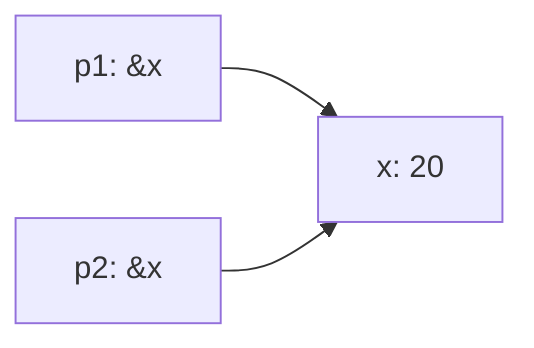
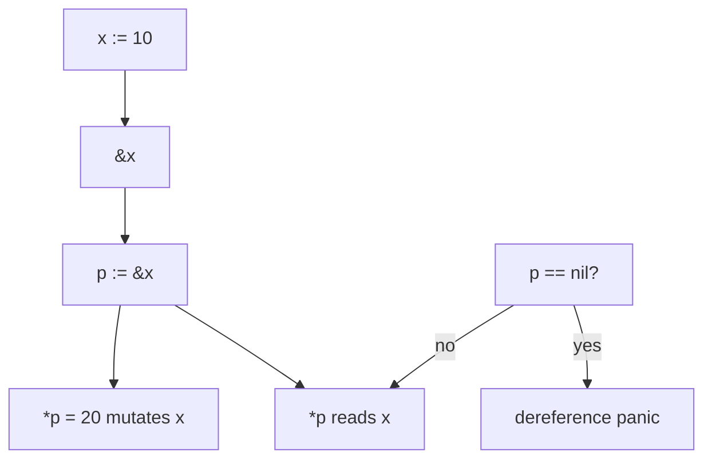
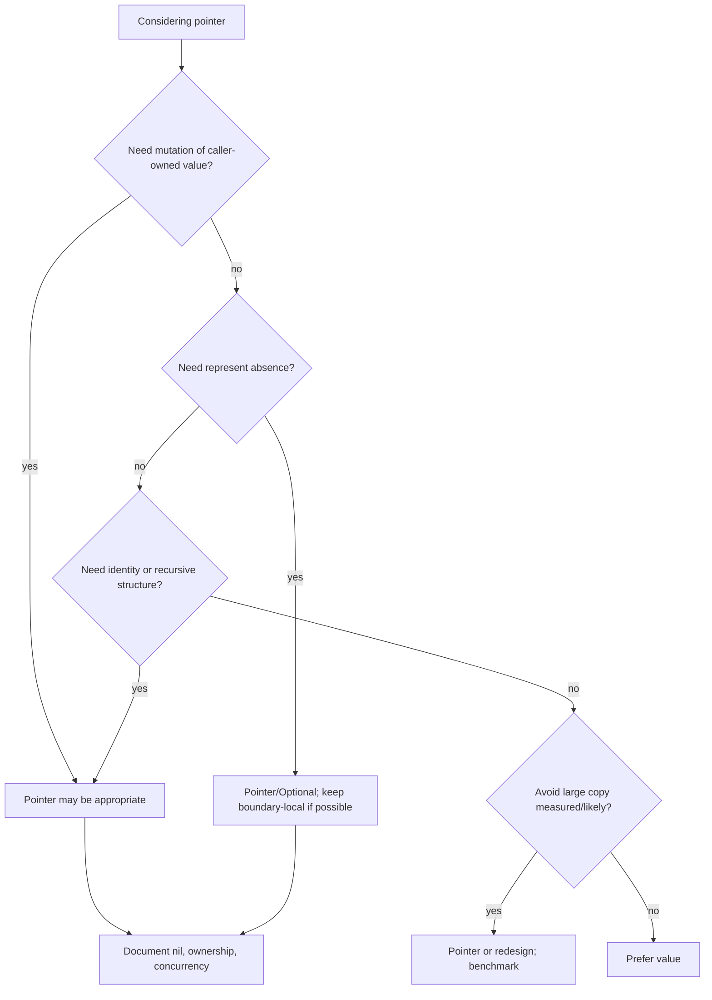

# learn-go-data-model-part-016.md

# Part 016 — Pointer: Addressability, Nil, Indirection, Optionality, Escape

> Seri: `learn-go-data-model`  
> Bagian: `016 / 034`  
> Target pembaca: Java software engineer yang ingin memahami Go data model pada level production engineering  
> Fokus: pointer sebagai address, indirection, mutation channel, optionality, ownership signal, dan runtime consequence

---

## 0. Posisi Part Ini dalam Seri

Kita sudah membahas:

```text
part-013: struct sebagai layout
part-014: receiver sebagai mutability contract
part-015: struct sebagai domain/DTO/config/event model
```

Sekarang kita masuk ke pointer secara khusus.

Untuk Java engineer, pointer Go sering membingungkan karena Java reference terlihat mirip, tetapi semantic-nya berbeda.

Java:

```text
Object variable biasanya reference.
Tidak ada address-of operator.
Tidak ada explicit dereference.
null adalah nilai universal untuk reference type.
Semua object class ada di heap secara konseptual.
```

Go:

```text
Value bisa disimpan langsung.
Pointer adalah value yang berisi address.
Address diambil dengan &.
Dereference dilakukan dengan *.
nil hanya untuk pointer/slice/map/channel/function/interface.
Tidak semua value addressable.
Pointer tidak otomatis berarti heap.
Pointer tidak punya arithmetic.
```

Pointer di Go bukan “C pointer bebas”. Pointer Go adalah alat untuk:

```text
- indirect access
- mutation of caller-owned value
- avoiding large copy
- expressing optional presence
- preserving identity
- sharing state deliberately
- enabling recursive data structures
- interacting with APIs requiring addressability
```

Namun pointer juga membawa risiko:

```text
- nil panic
- aliasing
- hidden mutation
- data race
- escape/heap allocation
- GC pointer scanning
- unclear ownership
```

---

## 1. Tujuan Pembelajaran

Setelah part ini, kamu harus bisa menjawab:

1. Apa itu pointer di Go?
2. Apa beda value, variable, address, dan pointer?
3. Apa itu addressability?
4. Kapan boleh memakai `&x`?
5. Kapan expression tidak addressable?
6. Apa yang terjadi saat dereference `*p`?
7. Apa arti `nil` pointer?
8. Apa beda pointer ke struct, slice, map, channel, interface?
9. Kapan pointer cocok untuk optionality?
10. Kapan pointer optionality menjadi smell?
11. Mengapa pointer bukan selalu optimization?
12. Apa hubungan pointer dengan escape analysis?
13. Mengapa pointer bisa memperbesar GC cost?
14. Bagaimana pointer memengaruhi API ownership?
15. Bagaimana Go 1.26 memperluas `new` dengan initial value expression?

---

## 2. Pointer dalam Satu Kalimat

Pointer adalah value yang menyimpan address dari value lain.

```go
x := 10
p := &x

fmt.Println(*p) // 10
```

Diagram:

```mermaid
flowchart LR
    X["variable x\nvalue: 10"] <-- "points to" P["variable p\nvalue: address of x"]
```

`&x` berarti ambil address dari `x`.

`*p` berarti access value yang ditunjuk oleh `p`.

---

## 3. Pointer Type

Jika `T` adalah type, maka `*T` adalah pointer to `T`.

```go
var p *int
var u *User
var s *[]string
var m *map[string]int
var c *chan int
```

Zero value pointer adalah `nil`.

```go
var p *int
fmt.Println(p == nil) // true
```

Pointer type berbeda dari pointee type:

```go
var x int = 10
var p *int = &x

// x = p // invalid
x = *p // ok
```

---

## 4. Address-of Operator `&`

```go
x := 42
p := &x
```

`p` berisi address dari variable `x`.

Address-of hanya bisa dipakai pada addressable expression.

Valid:

```go
x := 1
_ = &x

s := []int{1, 2}
_ = &s[0]

type User struct {
    Name string
}
u := User{Name: "Alice"}
_ = &u.Name
```

Invalid:

```go
// _ = &42
// _ = &(x + 1)
// _ = &time.Now()
// _ = &m["key"] // map entry not addressable
```

Exception: composite literal boleh langsung diambil address-nya.

```go
p := &User{Name: "Alice"}
```

Ini sangat umum.

---

## 5. Dereference Operator `*`

Dereference pointer:

```go
x := 42
p := &x

fmt.Println(*p) // 42

*p = 100
fmt.Println(x) // 100
```

`*p = 100` mengubah value yang ditunjuk oleh `p`.

Jika `p == nil`, dereference panic:

```go
var p *int
fmt.Println(*p) // panic
```

Pointer dereference adalah salah satu tempat runtime panic paling umum.

---

## 6. Addressability

Addressability adalah konsep formal: apakah sebuah expression punya lokasi memory stabil yang bisa diambil address-nya.

Addressable:

```text
- variable
- pointer dereference
- slice indexing
- array indexing of addressable array
- struct field of addressable struct
- composite literal via special rule
```

Not addressable:

```text
- constants
- function return values
- map entries
- result of arithmetic
- conversion result
- string indexing result
```

Examples:

```go
x := 1
_ = &x // ok

_ = &[]int{1, 2}[0] // ok: slice element

m := map[string]int{"a": 1}
// _ = &m["a"] // invalid

func makeUser() User {
    return User{}
}
// _ = &makeUser().Name // invalid
```

Why map entry is not addressable?

```text
Runtime map may move entries during growth/evacuation.
Exposing address of entry would make pointer unstable.
```

---

## 7. Pointer and Struct

Pointer to struct is extremely common.

```go
type User struct {
    Name string
}

u := User{Name: "Alice"}
p := &u

fmt.Println((*p).Name)
fmt.Println(p.Name) // shorthand
```

Go allows selector shorthand:

```go
p.Name
```

Instead of:

```go
(*p).Name
```

Mutation:

```go
p.Name = "Bob"
fmt.Println(u.Name) // Bob
```

Pointer to struct is useful when:

```text
- method mutates struct
- struct is large
- identity matters
- struct contains lock/resource
- nil can represent absence
- recursive structure
```

But pointer to struct also means:

```text
- possible nil
- shared mutation
- aliasing
- race if shared across goroutines
```

---

## 8. Pointer Is a Value Too

Pointer itself is copied by value.

```go
x := 10
p1 := &x
p2 := p1

*p2 = 20

fmt.Println(*p1) // 20
fmt.Println(x)   // 20
```

`p1` and `p2` are two pointer values pointing to same `x`.

Diagram:



Passing pointer to function copies pointer value:

```go
func set(p *int) {
    *p = 99
}

x := 1
set(&x)
fmt.Println(x) // 99
```

The pointer was copied, but both copies point to the same int.

---

## 9. Pointer Reassignment vs Pointee Mutation

Important distinction:

```go
func mutate(p *int) {
    *p = 2
}

func replace(p *int) {
    y := 3
    p = &y
}
```

Use:

```go
x := 1
p := &x

mutate(p)
fmt.Println(x) // 2

replace(p)
fmt.Println(x) // still 2
```

`replace` changes local copy of pointer `p`, not caller's pointer variable.

If you want to replace caller's pointer variable, you need pointer to pointer:

```go
func replace(pp **int) {
    y := 3
    *pp = &y
}

var p *int
replace(&p)
fmt.Println(*p) // 3
```

Pointer-to-pointer is rare in idiomatic Go application code. Usually return new pointer instead.

Better:

```go
func newValue() *int {
    y := 3
    return &y
}
```

---

## 10. `new`

Classic Go:

```go
p := new(int)
fmt.Println(*p) // 0
```

`new(T)` allocates zero value of type `T` and returns `*T`.

Equivalent conceptually to:

```go
var x T
return &x
```

But usable as expression.

Example:

```go
u := new(User)
u.Name = "Alice"
```

Most Go code prefers composite literal for structs:

```go
u := &User{Name: "Alice"}
```

### 10.1 Go 1.26: `new` with Initial Value Expression

Go 1.26 extends `new` to support an initial value expression.

Conceptually:

```go
p := new(int64(300))
```

This creates a new variable initialized with `int64(300)` and returns `*int64`.

This is useful for simple pointer values, especially optional fields in tests/config/DTO construction.

Example:

```go
timeout := new(5 * time.Second) // *time.Duration
enabled := new(true)            // *bool
name := new("alice")            // *string
```

Before this, people often wrote helpers:

```go
func Ptr[T any](v T) *T {
    return &v
}
```

With Go 1.26, many simple uses can use `new(value)` directly, assuming the project targets Go 1.26+.

Guideline:

```text
Use &T{...} for struct composite literals.
Use new(T) for zero pointer allocation when appropriate.
Use new(value) for simple initialized pointer if Go 1.26+ baseline is guaranteed.
Do not use pointer optionality just because new(value) is convenient.
```

---

## 11. `new` vs `make`

`new` returns pointer to zero/initialized value.

```go
p := new(int) // *int
```

`make` initializes slice/map/channel and returns the value itself.

```go
s := make([]int, 0, 10)        // []int
m := make(map[string]int)      // map[string]int
c := make(chan int, 1)         // chan int
```

Wrong mental model:

```text
make allocates, new allocates, same thing.
```

Better:

```text
new(T) -> *T
make(T) -> initialized T for slice/map/channel only
```

Example:

```go
pm := new(map[string]int)
fmt.Println(*pm == nil) // true
```

This gives pointer to nil map. Usually not useful.

You probably want:

```go
m := make(map[string]int)
```

Pointer to map is rarely needed.

---

## 12. Pointer to Slice

Slice is already descriptor with pointer/len/cap. Passing `[]T` copies descriptor.

```go
func appendValue(s []int) {
    s = append(s, 1)
}
```

Caller length may not change:

```go
s := []int{}
appendValue(s)
fmt.Println(len(s)) // 0
```

Return updated slice:

```go
func appendValue(s []int) []int {
    return append(s, 1)
}
```

Pointer to slice:

```go
func appendValue(s *[]int) {
    *s = append(*s, 1)
}
```

Use:

```go
s := []int{}
appendValue(&s)
fmt.Println(len(s)) // 1
```

Pointer to slice is useful when:

```text
- function must modify slice descriptor itself
- method on struct needs update slice field
- custom decoder/unmarshal pattern
```

But often returning slice is clearer.

Avoid:

```go
func Process(s *[]Item)
```

Unless mutation of descriptor is part of contract.

---

## 13. Pointer to Map

Map is already reference-like. Passing map can mutate entries.

```go
func set(m map[string]int) {
    m["x"] = 1
}
```

Caller sees mutation.

Pointer to map needed only if you must replace or initialize caller's map variable:

```go
func initMap(pm *map[string]int) {
    if *pm == nil {
        *pm = make(map[string]int)
    }
}
```

But usually better:

```go
func ensureMap(m map[string]int) map[string]int {
    if m == nil {
        return make(map[string]int)
    }
    return m
}
```

Pointer to map is rare in idiomatic API. It often indicates unclear ownership.

---

## 14. Pointer to Channel

Channel is reference-like. Passing channel copies channel value that refers to runtime channel.

Pointer to channel is almost never needed.

```go
func send(ch chan<- int) {
    ch <- 1
}
```

Use directional channels instead of pointer to channel for API clarity:

```go
func producer(out chan<- Event)
func consumer(in <-chan Event)
```

Pointer to channel only if replacing caller's channel variable, which is rare and usually better expressed by return.

---

## 15. Pointer to Interface: Usually Wrong

Interface value already contains dynamic type/value. Pointer to interface is almost always a smell.

Bad:

```go
func Handle(x *any)
```

Why bad?

```text
- *interface is not pointer to dynamic concrete value
- adds extra nil states
- rarely needed
- makes API confusing
```

If you need mutate concrete value, use concrete pointer or interface with method.

```go
type Decoder interface {
    Decode(v any) error
}
```

JSON style uses `any` because decoder needs a pointer concrete value inside interface:

```go
var u User
err := json.Unmarshal(data, &u)
```

`&u` is `*User` stored in interface parameter `any`, not `*any`.

---

## 16. Nil Pointer

Nil pointer means pointer points to no value.

```go
var u *User
fmt.Println(u == nil) // true
```

Accessing field through nil pointer panics:

```go
fmt.Println(u.Name) // panic
```

Nil pointer can be useful for optional relationship:

```go
type User struct {
    Manager *User
}
```

But nil must be handled:

```go
func (u *User) ManagerName() string {
    if u == nil || u.Manager == nil {
        return ""
    }
    return u.Manager.Name
}
```

Be careful: returning empty string may hide absence. Better sometimes:

```go
func (u *User) ManagerName() (string, bool) {
    if u == nil || u.Manager == nil {
        return "", false
    }
    return u.Manager.Name, true
}
```

---

## 17. Pointer as Optionality

Pointer fields can encode optional values:

```go
type UpdateUserRequest struct {
    Name *string `json:"name,omitempty"`
    Age  *int    `json:"age,omitempty"`
}
```

Meaning:

```text
nil -> absent
non-nil -> present
```

Useful for:

```text
- PATCH request
- config raw input
- optional external API fields
- database nullable scan target sometimes
```

But pointer optionality has costs:

```text
- nil checks everywhere
- possible heap allocation
- awkward construction
- harder equality
- GC pointer scanning
- domain model becomes nullable-heavy
```

Guideline:

```text
Use pointer optionality at boundaries.
Avoid spreading pointer optionality into core domain unless absence is intrinsic.
```

---

## 18. Optionality Alternative: Explicit Optional Type

```go
type Optional[T any] struct {
    value T
    set   bool
}

func Some[T any](v T) Optional[T] {
    return Optional[T]{value: v, set: true}
}

func None[T any]() Optional[T] {
    return Optional[T]{}
}

func (o Optional[T]) IsSet() bool {
    return o.set
}

func (o Optional[T]) Value() (T, bool) {
    return o.value, o.set
}
```

Pros:

```text
- no nil
- works for any T
- explicit set bit
- value can itself be zero
```

Cons:

```text
- JSON integration needs custom logic
- more verbose
- not idiomatic everywhere
```

Good for internal application/domain where set/unset must be explicit.

---

## 19. Pointer as Mutation Channel

Function can mutate caller's value through pointer:

```go
func NormalizeEmail(email *string) error {
    if email == nil {
        return errors.New("email is nil")
    }
    *email = strings.ToLower(strings.TrimSpace(*email))
    if *email == "" {
        return errors.New("email is empty")
    }
    return nil
}
```

But mutation channel can make code harder to reason about.

Alternative:

```go
func NormalizeEmail(email string) (string, error) {
    email = strings.ToLower(strings.TrimSpace(email))
    if email == "" {
        return "", errors.New("email is empty")
    }
    return email, nil
}
```

Prefer return values when:

```text
- transformation is simple
- no identity/state needs mutation
- pure function is clearer
```

Use pointer mutation when:

```text
- method mutates aggregate
- decode/unmarshal fills existing object
- performance requires reuse and is measured
- API convention expects destination pointer
```

---

## 20. Pointer as Identity

If two variables point to the same object, mutation through either is visible.

```go
u := &User{Name: "Alice"}
a := u
b := u

a.Name = "Bob"
fmt.Println(b.Name) // Bob
```

Pointer identity can be checked:

```go
fmt.Println(a == b) // true
```

Pointer equality compares addresses, not contents.

```go
x := &User{Name: "Alice"}
y := &User{Name: "Alice"}

fmt.Println(x == y) // false
```

Use pointer identity when domain truly has object identity in memory. For business identity, prefer ID fields.

```go
map[UserID]User
```

not:

```go
map[*User]Permissions
```

unless in-memory graph identity is the intended key.

---

## 21. Recursive Data Structures

Pointer required for recursive structs.

Invalid:

```go
// type Node struct {
//     Value int
//     Next  Node
// }
```

This has infinite size.

Valid:

```go
type Node struct {
    Value int
    Next  *Node
}
```

Tree:

```go
type Tree struct {
    Value int
    Left  *Tree
    Right *Tree
}
```

Nil naturally represents no child.

---

## 22. Pointer and Interface Nil Trap Preview

This part focuses on pointer, but pointer interacts with interface nil in a dangerous way.

```go
var u *User = nil
var x any = u

fmt.Println(u == nil) // true
fmt.Println(x == nil) // false
```

Why?

```text
x contains dynamic type *User and dynamic value nil.
The interface itself is not nil.
```

This will be covered deeply in part 017 and 019.

For now remember:

```text
nil pointer inside interface != nil interface
```

---

## 23. Pointer and Escape Analysis

Pointer does not automatically mean heap, and value does not automatically mean stack.

Example likely stack:

```go
func f() {
    x := 1
    p := &x
    *p = 2
}
```

`x` can remain stack because pointer does not escape.

Example escape:

```go
func ptr() *int {
    x := 1
    return &x
}
```

`x` must outlive function, so compiler moves it to heap.

Example storing pointer globally:

```go
var global *int

func f() {
    x := 1
    global = &x // x escapes
}
```

Check with:

```bash
go build -gcflags=-m ./...
```

But don't overfit escape output. Compiler evolves.

---

## 24. Pointer and GC Cost

Pointer fields must be scanned by GC.

Struct with many pointers:

```go
type PointerHeavy struct {
    A *A
    B *B
    C *C
    D []byte
    M map[string]string
}
```

Struct with fewer pointers:

```go
type Compact struct {
    AID int64
    BID int64
    Flags uint32
    Data [16]byte
}
```

Pointer-heavy object graphs can increase:

```text
- GC scan work
- cache misses
- allocation count
- indirection
- race risk
```

But pointers can reduce copying large values.

Trade-off:

```text
Pointer reduces copying but increases aliasing and GC graph.
Value increases copying but improves locality and ownership clarity.
```

Measure hot paths.

---

## 25. Pointer Is Not Always Faster

Common myth:

```text
Use pointer for performance.
```

Counterexamples:

```text
- small struct copied by value can be faster than pointer chasing
- pointer can cause heap escape
- pointer can increase GC scan
- pointer can hurt cache locality
- pointer can introduce synchronization need
```

Example:

```go
type Point struct {
    X, Y int
}

func Distance(a, b Point) int {
    dx := a.X - b.X
    dy := a.Y - b.Y
    return dx*dx + dy*dy
}
```

Passing `Point` by value is usually fine.

Pointer appropriate:

```go
type Big struct {
    Data [4096]byte
}

func Process(b *Big) {}
```

But for large data, also consider whether struct should be redesigned to hold slice/reference to buffer.

---

## 26. Pointer and Ownership

Every pointer parameter should raise ownership questions:

```text
Can callee mutate?
Can callee retain pointer after return?
Can caller mutate concurrently?
Can pointer be nil?
Who owns lifetime?
```

Examples:

```go
func Process(u *User) error
```

Ambiguous.

Better naming/docs:

```go
func ValidateUser(u User) error
func UpdateUser(u *User) error
func NewUserSnapshot(u *User) UserSnapshot
```

If function retains pointer:

```go
type Registry struct {
    users []*User
}

func (r *Registry) Add(u *User) {
    r.users = append(r.users, u)
}
```

Document whether caller may mutate `u` afterward. Often better to copy.

---

## 27. Pointer and Concurrency

Sharing pointer across goroutines shares mutable state.

```go
u := &User{Name: "Alice"}

go func() {
    u.Name = "Bob"
}()

go func() {
    fmt.Println(u.Name)
}()
```

This is race without synchronization.

Solutions:

```text
- don't share mutable pointer
- copy value per goroutine
- protect with mutex
- use immutable snapshot
- send ownership through channel
```

Ownership transfer:

```go
jobs := make(chan *Job)

go func() {
    job := &Job{ID: "j1"}
    jobs <- job // ownership transferred by convention
}()
```

But channel send does not enforce exclusive ownership. It is design discipline.

---

## 28. Pointer Receiver and Nil Method Contract

Pointer receiver method may define nil behavior.

Example linked list length:

```go
type Node struct {
    Next *Node
}

func (n *Node) Len() int {
    if n == nil {
        return 0
    }
    return 1 + n.Next.Len()
}
```

This is okay because nil means empty list.

But for most domain objects:

```go
func (u *User) Email() Email {
    if u == nil {
        return Email{}
    }
    return u.email
}
```

This may hide bug. Better to let panic or return explicit error depending API.

Guideline:

```text
Nil receiver handling should be semantically meaningful, not defensive habit.
```

---

## 29. Pointer to Local Variable Is Safe

In C, returning pointer to local stack variable is unsafe. In Go, it is safe because compiler escape analysis will move value to heap if needed.

```go
func NewInt(v int) *int {
    return &v
}
```

This is safe.

Before Go 1.26, generic helper was common:

```go
func Ptr[T any](v T) *T {
    return &v
}
```

Now Go 1.26 `new(value)` can replace simple cases, but `Ptr` may still be useful for older versions or style consistency.

---

## 30. Pointer and Equality

Pointer values are comparable.

```go
a := &User{Name: "Alice"}
b := a
c := &User{Name: "Alice"}

fmt.Println(a == b) // true
fmt.Println(a == c) // false
```

Pointer equality answers:

```text
Do these pointers point to the same address?
```

Not:

```text
Do these objects have same content?
```

For content equality, implement method or use field comparison if comparable.

```go
func (u User) Equal(v User) bool {
    return u.id == v.id && u.email == v.email
}
```

---

## 31. Pointer to Array

Array by value copies entire array. Pointer to array avoids copy and preserves length in type.

```go
func fill(buf *[16]byte) {
    for i := range buf {
        buf[i] = byte(i)
    }
}
```

Use:

```go
var b [16]byte
fill(&b)
```

Pointer to array is useful in low-level code, fixed buffers, cryptographic/block operations, and avoiding slice capacity ambiguity.

But most application code uses slice:

```go
func fill(buf []byte)
```

---

## 32. Pointer and Method Receiver Revisited

Pointer receiver:

```go
func (u *User) Rename(name string) error
```

Means:

```text
method may mutate User
caller must have addressable User or *User
only *User has this method in method set
```

Value receiver:

```go
func (u User) Name() string
```

Means:

```text
method gets copy
safe for small immutable read
both User and *User have method via method set rules
```

Receiver choice is pointer API design.

---

## 33. Pointer in Struct Fields

Common patterns:

### 33.1 Optional child

```go
type Employee struct {
    Manager *Employee
}
```

### 33.2 Dependency

```go
type Service struct {
    repo *Repository
}
```

Often better as interface:

```go
type Service struct {
    repo Repository
}
```

Where `Repository` is interface.

### 33.3 Large object reference

```go
type CacheEntry struct {
    Value *LargeValue
}
```

### 33.4 Mutable shared state

```go
type Session struct {
    state *SessionState
}
```

Each pattern needs ownership semantics.

---

## 34. Avoid Pointer Fields for Required Values

Bad:

```go
type User struct {
    ID    *UserID
    Email *Email
}
```

If ID and Email are required, pointers create unnecessary invalid states.

Better:

```go
type User struct {
    id    UserID
    email Email
}
```

Pointer fields for required values cause:

```text
- nil checks everywhere
- possible partial object
- more allocations/GC
- unclear ownership
```

Use pointer only if absence is valid or needed for boundary tri-state.

---

## 35. Pointer and JSON

Boundary DTO optional:

```go
type PatchUserRequest struct {
    Name *string `json:"name,omitempty"`
}
```

Construction before Go 1.26 often:

```go
name := "Alice"
req := PatchUserRequest{Name: &name}
```

With helper:

```go
req := PatchUserRequest{Name: Ptr("Alice")}
```

With Go 1.26:

```go
req := PatchUserRequest{Name: new("Alice")}
```

But careful with `omitempty`: nil field omitted; non-nil pointer to zero value included.

```go
req := PatchUserRequest{Name: new("")}
```

This means present empty string. That may be useful for validation.

---

## 36. Pointer and Database Null

Database nullable field can be represented by:

```text
- pointer field
- sql.NullString/sql.NullInt64
- custom nullable type
```

Example pointer:

```go
type UserRow struct {
    DeletedAt *time.Time
}
```

But scanning directly into pointer can be awkward depending DB library.

`database/sql` provides nullable types:

```go
sql.NullString
sql.NullTime
```

Domain should not automatically use pointer just because DB column nullable. Map DB null to domain optional semantic explicitly.

---

## 37. Pointer and API Stability

Changing field from value to pointer is breaking:

```go
type Config struct {
    Timeout time.Duration
}
```

To:

```go
type Config struct {
    Timeout *time.Duration
}
```

Breaks callers and changes semantics.

Public struct field pointer-ness is API contract.

Similarly, function parameter change:

```go
func Process(User)
```

to:

```go
func Process(*User)
```

Changes nil possibility, mutation contract, interface implementation, and call sites.

---

## 38. Pointer and Copying Structs

Struct with pointer field copy shares pointee.

```go
type Session struct {
    State *State
}

a := Session{State: &State{Count: 1}}
b := a

b.State.Count = 2
fmt.Println(a.State.Count) // 2
```

If you need deep copy:

```go
func (s Session) Clone() Session {
    out := s
    if s.State != nil {
        state := *s.State
        out.State = &state
    }
    return out
}
```

Deep copy is domain-specific. Generic deep copy is often reflection-heavy and semantically wrong.

---

## 39. Pointer and Lifetime of Range Variables

Classic bug pattern involved taking address of range variable.

Modern Go versions changed loop variable semantics for modules targeting Go 1.22+, but you should still understand the concept and avoid clever address capture.

Dangerous pattern historically:

```go
var ptrs []*User
for _, u := range users {
    ptrs = append(ptrs, &u)
}
```

In older semantics, `u` reused, so pointers all pointed to same loop variable. Newer Go creates per-iteration variables in many contexts, but code clarity is still better with index:

```go
var ptrs []*User
for i := range users {
    ptrs = append(ptrs, &users[i])
}
```

This points to actual slice elements.

Guideline:

```text
If you need pointer to element, use index form.
```

---

## 40. Pointer to Slice Element and Append Hazard

Pointer to slice element can become stale if slice append reallocates.

```go
s := []int{1, 2}
p := &s[0]

s = append(s, 3, 4, 5, 6, 7)

*p = 99
fmt.Println(s[0]) // maybe still 1 if append reallocated
```

If append reallocated, `p` points to old backing array, not current `s[0]`.

Guideline:

```text
Do not keep pointers to slice elements across append that may reallocate.
```

If you need stable addresses:

```text
- preallocate enough capacity
- store pointers to separately allocated objects
- use indices instead of pointers
- avoid append after taking element pointers
```

---

## 41. Pointer and `unsafe.Pointer`

Normal Go pointer does not allow arithmetic. `unsafe.Pointer` exists for low-level operations.

This part does not teach unsafe. It will be covered later.

For now:

```text
Do not convert pointer to uintptr and keep it.
Do not do pointer arithmetic in application code.
Do not use unsafe to avoid understanding ownership.
```

---

## 42. Mermaid: Pointer Operation Model



---

## 43. Mermaid: Pointer Decision Flow



---

## 44. Mini Lab 1 — Basic Pointer

Predict:

```go
func main() {
    x := 1
    p := &x
    q := p

    *q = 2

    fmt.Println(x)
    fmt.Println(*p)
}
```

Output:

```text
2
2
```

`p` and `q` point to same `x`.

---

## 45. Mini Lab 2 — Reassign Pointer Parameter

Predict:

```go
func replace(p *int) {
    y := 2
    p = &y
}

func main() {
    x := 1
    p := &x
    replace(p)
    fmt.Println(*p)
}
```

Output:

```text
1
```

`replace` only changes local pointer copy.

---

## 46. Mini Lab 3 — Mutate Through Pointer Parameter

```go
func set(p *int) {
    *p = 2
}

func main() {
    x := 1
    set(&x)
    fmt.Println(x)
}
```

Output:

```text
2
```

---

## 47. Mini Lab 4 — Pointer to Map Not Needed

```go
func set(m map[string]int) {
    m["x"] = 1
}

func main() {
    m := map[string]int{}
    set(m)
    fmt.Println(m["x"])
}
```

Output:

```text
1
```

Map descriptor copy still points to same table.

---

## 48. Mini Lab 5 — Optional Field

```go
type Patch struct {
    Name *string
}

func main() {
    a := Patch{}
    b := Patch{Name: new("")}
    c := Patch{Name: new("Alice")}

    fmt.Println(a.Name == nil)
    fmt.Println(b.Name == nil, *b.Name == "")
    fmt.Println(c.Name == nil, *c.Name)
}
```

Expected:

```text
true
false true
false Alice
```

Meaning:

```text
a: absent
b: present empty string
c: present "Alice"
```

---

## 49. Mini Lab 6 — Pointer to Slice Element Hazard

```go
func main() {
    s := []int{1}
    p := &s[0]

    s = append(s, 2, 3, 4, 5, 6)

    *p = 99
    fmt.Println(s[0])
}
```

Output is not a safe contract to rely on because append may reallocate. The key lesson:

```text
Pointer to slice element should not be kept across append that may reallocate.
```

---

## 50. Common Anti-Patterns

### 50.1 Pointer everywhere “because faster”

Bad default. Measure.

### 50.2 Pointer fields for required data

Creates nil invalid states.

### 50.3 Pointer to map/slice/channel in public API without strong reason

Usually unclear ownership.

### 50.4 Pointer to interface

Almost always wrong.

### 50.5 Returning internal pointer

```go
func (u *User) EmailPtr() *Email {
    return &u.email
}
```

Allows external mutation if Email mutable or if pointer used incorrectly.

### 50.6 Keeping pointer to slice element across append

Can point to old backing array.

### 50.7 Nil receiver defensive silence

Returning zero from nil domain object can hide bugs.

### 50.8 Shared pointer without synchronization

Data race.

### 50.9 Pointer as map key for business identity

Use domain ID instead.

### 50.10 Assuming pointer means heap or stack

Escape analysis decides.

---

## 51. Production Guidelines

### 51.1 Prefer Value Unless Pointer Has a Job

Pointer should have a reason:

```text
- mutation
- optionality
- identity
- avoid large copy
- recursive structure
- resource ownership
```

### 51.2 Keep Optional Pointers at Boundaries

Patch/config/external APIs may need pointer fields. Domain often should use explicit types or validated values.

### 51.3 Document Nil Semantics

Can parameter be nil? What happens?

```go
func NewService(repo Repository) (*Service, error) // repo nil invalid
func (n *Node) Len() int // nil means empty list
```

### 51.4 Avoid Exposing Mutable Internals

Return values/snapshots, not internal pointers/slices/maps unless intended.

### 51.5 Be Careful with Pointer in Concurrent Code

Pointer sharing is state sharing.

### 51.6 Do Not Use Pointer Just to Avoid Typing Return Value

Pure transformations are often clearer as return values.

### 51.7 Use `new(value)` Judiciously in Go 1.26+

Great for tests/options. Not a reason to overuse pointer optionality.

---

## 52. PR Review Checklist

### 52.1 Pointer Necessity

```text
[ ] Why is this pointer needed?
[ ] Mutation?
[ ] Optionality?
[ ] Identity?
[ ] Large copy avoidance?
[ ] Recursive structure?
[ ] Resource/lifecycle?
```

### 52.2 Nil

```text
[ ] Can it be nil?
[ ] Is nil checked?
[ ] Is nil a valid semantic state?
[ ] Does nil hide a bug?
```

### 52.3 Ownership

```text
[ ] Can callee retain pointer?
[ ] Can callee mutate pointee?
[ ] Can caller mutate after passing?
[ ] Is cloning needed?
```

### 52.4 Concurrency

```text
[ ] Is pointer shared across goroutines?
[ ] Is pointee immutable?
[ ] Is there synchronization?
[ ] Are data races possible?
```

### 52.5 API Boundary

```text
[ ] Is pointer field part of public struct?
[ ] Does it encode optionality or just convenience?
[ ] Would Optional/sql.NullX/custom type be clearer?
[ ] Is pointer-to-interface avoided?
```

### 52.6 Performance

```text
[ ] Is pointer chosen based on measurement or clear size/mutation reason?
[ ] Could pointer cause escape?
[ ] Could pointer increase GC pressure?
[ ] Would value improve locality?
```

### 52.7 Collections

```text
[ ] Pointer to slice/map/channel justified?
[ ] Pointer to slice element kept across append?
[ ] Map entry address attempted?
[ ] Slice/map fields cloned if ownership requires?
```

---

## 53. Ringkasan Mental Model

Pointer di Go adalah explicit indirection.

```text
&T -> address of addressable T
*T -> value pointed to by pointer
nil -> no pointee
```

Pointer is useful but not free.

```text
Pros:
- mutation
- identity
- optionality
- avoid copy
- recursive structures

Cons:
- nil
- aliasing
- race risk
- escape possibility
- GC scanning
- ownership ambiguity
```

Untuk Java engineer:

```text
Java reference is the default object model.
Go pointer is an explicit design choice.
```

Jangan pakai pointer karena “terbiasa object reference”. Pakai pointer karena kontrak datanya memang membutuhkan indirection.

---

## 54. Apa yang Tidak Dibahas di Part Ini

Part berikutnya akan membahas `nil` secara khusus:

```text
- nil pointer
- nil slice
- nil map
- nil channel
- nil function
- nil interface
- typed nil inside interface
- JSON behavior
- API contract
```

Pointer adalah satu bagian dari nil story. Di Go, `nil` jauh lebih luas dan sering menjadi sumber bug mahal.

---

## 55. Referensi Resmi

- Go Language Specification — Pointer types, address operators, addressability, method calls, composite literals  
  https://go.dev/ref/spec
- Go 1.26 Release Notes  
  https://go.dev/doc/go1.26
- Effective Go — Pointers vs values, allocation with `new`, composite literals  
  https://go.dev/doc/effective_go
- Go FAQ — allocation, stack vs heap concepts  
  https://go.dev/doc/faq
- Go Memory Model  
  https://go.dev/ref/mem
- Package `unsafe`  
  https://pkg.go.dev/unsafe
- Package `encoding/json`  
  https://pkg.go.dev/encoding/json

---

## 56. Status Seri

Selesai:

```text
part-000  Orientation
part-001  Type system core
part-002  Zero value and invariants
part-003  Constants and iota
part-004  Numeric foundations
part-005  Numeric correctness
part-006  Text model I
part-007  Text model II
part-008  Array
part-009  Slice I
part-010  Slice II
part-011  Map I
part-012  Map II
part-013  Struct I
part-014  Struct II
part-015  Struct III
part-016  Pointer
```

Berikutnya:

```text
part-017  Nil: The Most Expensive Small Word in Go
```

Seri belum selesai. Masih ada part 017 sampai part 034.


<!-- NAVIGATION_FOOTER -->
<div class="page-nav">
<a href="./learn-go-data-model-part-015.md">⬅️ Part 015 — Struct III: Domain Modeling, DTO, Entity, Config, Option, Event</a>
<a href="./index.md">📚 Kategori</a>
<a href="../../index.md">🏠 Home</a>
<a href="./learn-go-data-model-part-017.md">Part 017 — Nil: The Most Expensive Small Word in Go ➡️</a>
</div>
