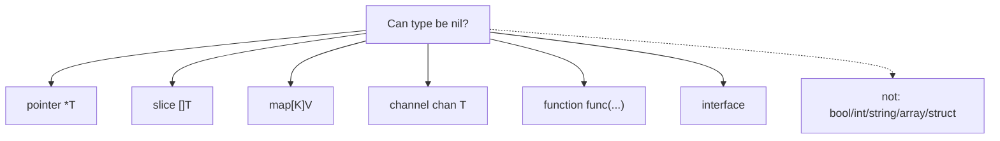
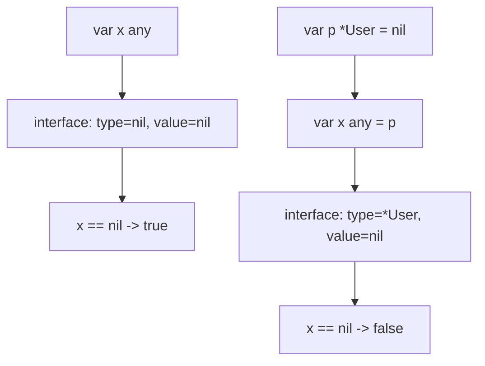
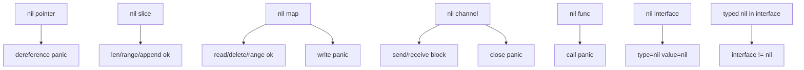
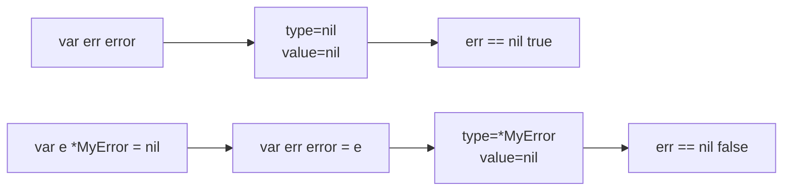

# learn-go-data-model-part-017.md

# Part 017 — Nil: The Most Expensive Small Word in Go

> Seri: `learn-go-data-model`  
> Bagian: `017 / 034`  
> Target pembaca: Java software engineer yang ingin memahami Go data model pada level production engineering  
> Fokus: `nil` sebagai zero value untuk beberapa type category, typed nil, interface nil trap, boundary behavior, dan API contract

---

## 0. Posisi Part Ini dalam Seri

Part 016 membahas pointer. Di sana kita melihat bahwa zero value pointer adalah `nil`.

Namun `nil` di Go bukan hanya pointer.

`nil` bisa menjadi zero value untuk:

```text
- pointer
- slice
- map
- channel
- function
- interface
```

Tetapi `nil` tidak berlaku untuk:

```text
- bool
- integer
- float
- complex
- string
- array
- struct
```

Untuk Java engineer, `nil` sering terasa seperti `null`. Tetapi `nil` Go lebih rumit karena:

```text
Java null:
- universal null reference untuk reference types

Go nil:
- predeclared identifier
- zero value untuk beberapa type category
- tidak punya type sendiri
- harus memiliki expected type
- interface nil punya representasi khusus
- typed nil inside interface bisa membuat x != nil walaupun dynamic value nil
```

Part ini penting karena banyak bug Go produksi bukan karena orang tidak tahu syntax, tetapi karena salah membaca `nil`.

---

## 1. Tujuan Pembelajaran

Setelah part ini, kamu harus bisa menjawab:

1. Apa itu `nil` di Go?
2. Mengapa `nil` bukan nilai universal untuk semua type?
3. Mengapa `nil` butuh type context?
4. Apa beda nil pointer, nil slice, nil map, nil channel, nil function, dan nil interface?
5. Mengapa read dari nil map aman tetapi write panic?
6. Mengapa append ke nil slice valid?
7. Mengapa send/receive pada nil channel block selamanya?
8. Mengapa call nil function panic?
9. Apa itu typed nil?
10. Mengapa `var err error = (*MyError)(nil)` membuat `err != nil`?
11. Bagaimana menghindari nil interface trap?
12. Apa beda nil slice dan empty slice dalam JSON?
13. Bagaimana mendesain API dengan nil contract yang jelas?
14. Kapan nil acceptable dan kapan harus ditolak?
15. Bagaimana membuat checklist PR terkait nil?

---

## 2. Nil dalam Satu Kalimat

`nil` adalah zero value untuk type yang secara semantic menyimpan reference/descriptor ke sesuatu yang mungkin tidak ada.

Contoh:

```go
var p *int
var s []int
var m map[string]int
var ch chan int
var fn func()
var x any

fmt.Println(p == nil)  // true
fmt.Println(s == nil)  // true
fmt.Println(m == nil)  // true
fmt.Println(ch == nil) // true
fmt.Println(fn == nil) // true
fmt.Println(x == nil)  // true
```

Tapi ini invalid:

```go
// var i int = nil
// var b bool = nil
// var str string = nil
// var arr [3]int = nil
// var st struct{} = nil
```

---

## 3. Nil Tidak Punya Type Sendiri

`nil` membutuhkan context type.

Valid:

```go
var p *int = nil
var s []int = nil
var m map[string]int = nil
```

Invalid:

```go
// x := nil
```

Compiler tidak tahu `nil` ini tipe apa.

Kamu bisa memberi type context:

```go
var x any = nil
```

Atau:

```go
p := (*int)(nil)
s := []int(nil)
m := map[string]int(nil)
```

`nil` bisa dikonversi ke nil-able type tertentu.

---

## 4. Nil-Able Type Categories



Important:

```text
Slice/map/channel/function/interface are not pointers syntactically,
but their zero value can be nil.
```

---

## 5. Nil Pointer

```go
var p *int
fmt.Println(p == nil) // true
```

Dereference panic:

```go
fmt.Println(*p) // panic
```

Pointer field optional:

```go
type Employee struct {
    Manager *Employee
}
```

Nil manager can mean no manager. But nil must be part of contract.

Bad:

```go
func (e *Employee) ManagerName() string {
    return e.Manager.Name // panic if Manager nil
}
```

Better:

```go
func (e *Employee) ManagerName() (string, bool) {
    if e == nil || e.Manager == nil {
        return "", false
    }
    return e.Manager.Name, true
}
```

But be careful: `e == nil` handling should be semantic, not defensive habit.

---

## 6. Nil Slice

Zero value of slice is nil.

```go
var s []int

fmt.Println(s == nil) // true
fmt.Println(len(s))   // 0
fmt.Println(cap(s))   // 0
```

Append works:

```go
s = append(s, 1)
fmt.Println(s)        // [1]
fmt.Println(s == nil) // false
```

Range works:

```go
for _, v := range s {
    fmt.Println(v)
}
```

No iteration.

Nil slice is very useful because it behaves like empty slice for most operations.

---

## 7. Nil Slice vs Empty Slice

```go
var nilSlice []int
emptySlice := []int{}

fmt.Println(nilSlice == nil)   // true
fmt.Println(emptySlice == nil) // false

fmt.Println(len(nilSlice))     // 0
fmt.Println(len(emptySlice))   // 0
```

Most internal code should not care.

But boundary behavior can differ.

### 7.1 JSON

With `encoding/json`:

```go
type Response struct {
    Items []string `json:"items"`
}

json.Marshal(Response{Items: nil})        // {"items":null}
json.Marshal(Response{Items: []string{}}) // {"items":[]}
```

This matters for API clients.

Production guideline:

```text
For API responses, decide whether empty collection should be [] or null.
Most APIs should prefer [] for collections.
```

You can normalize:

```go
func EmptyIfNil[T any](s []T) []T {
    if s == nil {
        return []T{}
    }
    return s
}
```

Or set during response mapping:

```go
items := make([]ItemResponse, 0, len(domainItems))
```

---

## 8. Nil Slice and `omitempty`

```go
type Response struct {
    Items []string `json:"items,omitempty"`
}
```

Both nil slice and empty slice are omitted because `len == 0`.

```json
{}
```

This may be undesirable if clients expect `items: []`.

Guideline:

```text
Do not use omitempty for collection fields if clients need stable shape.
```

---

## 9. Nil Map

Zero value map is nil.

```go
var m map[string]int

fmt.Println(m == nil) // true
fmt.Println(len(m))   // 0
```

Read is safe:

```go
fmt.Println(m["x"]) // zero value int = 0
```

Comma-ok safe:

```go
v, ok := m["x"]
fmt.Println(v, ok) // 0 false
```

Delete safe:

```go
delete(m, "x")
```

Range safe:

```go
for k, v := range m {
    _, _ = k, v
}
```

Write panics:

```go
m["x"] = 1 // panic: assignment to entry in nil map
```

Why?

```text
Read treats nil map like empty map.
Write needs initialized runtime hash table.
```

---

## 10. Nil Map vs Empty Map

```go
var nilMap map[string]int
emptyMap := map[string]int{}

fmt.Println(nilMap == nil)   // true
fmt.Println(emptyMap == nil) // false
fmt.Println(len(nilMap))     // 0
fmt.Println(len(emptyMap))   // 0
```

JSON difference:

```go
type Response struct {
    Meta map[string]string `json:"meta"`
}
```

Nil map:

```json
{"meta":null}
```

Empty map:

```json
{"meta":{}}
```

API response usually prefers `{}` for object-like maps, but it depends on contract.

---

## 11. Nil Channel

Zero value channel is nil.

```go
var ch chan int
fmt.Println(ch == nil) // true
```

Send to nil channel blocks forever:

```go
ch <- 1 // blocks forever
```

Receive from nil channel blocks forever:

```go
v := <-ch // blocks forever
_ = v
```

Close nil channel panics:

```go
close(ch) // panic
```

Nil channels are useful in `select` to disable cases dynamically.

```go
var timeout <-chan time.Time

if enableTimeout {
    timeout = time.After(1 * time.Second)
}

select {
case <-done:
    return
case <-timeout:
    return
}
```

If `timeout` is nil, that case is disabled.

This is powerful but can be dangerous if accidental nil channel causes goroutine leak/deadlock.

---

## 12. Nil Function

Function value can be nil.

```go
var fn func()
fmt.Println(fn == nil) // true
```

Calling nil function panics:

```go
fn() // panic
```

Common pattern with optional callback:

```go
type Hooks struct {
    OnStart func()
}

func (h Hooks) Start() {
    if h.OnStart != nil {
        h.OnStart()
    }
}
```

Alternative: no-op default.

```go
func noop() {}

func NewHooks(h Hooks) Hooks {
    if h.OnStart == nil {
        h.OnStart = noop
    }
    return h
}
```

Guideline:

```text
If callback optional, nil check is fine.
If callback required, validate at construction.
```

---

## 13. Nil Interface

An interface value is nil only when both dynamic type and dynamic value are nil.

Conceptually interface value has two parts:

```text
(type, value)
```

Nil interface:

```go
var x any
fmt.Println(x == nil) // true
```

Conceptual:

```text
(type=nil, value=nil)
```

Non-nil interface containing nil pointer:

```go
var p *int = nil
var x any = p

fmt.Println(p == nil) // true
fmt.Println(x == nil) // false
```

Conceptual:

```text
(type=*int, value=nil)
```

This is the infamous typed nil trap.

---

## 14. Interface Nil Diagram



Key rule:

```text
Interface nil check checks the interface container, not only dynamic value.
```

---

## 15. Typed Nil with Error

Most expensive nil bug in Go:

```go
type MyError struct {
    Message string
}

func (e *MyError) Error() string {
    return e.Message
}

func do() error {
    var e *MyError = nil
    return e
}

func main() {
    err := do()
    fmt.Println(err == nil) // false
}
```

Why?

```text
do returns error interface.
The returned interface contains dynamic type *MyError and dynamic value nil.
So interface itself is non-nil.
```

Then:

```go
if err != nil {
    fmt.Println(err.Error()) // may panic if Error dereferences nil receiver
}
```

This can be catastrophic.

---

## 16. Fixing Typed Nil Error

Bad:

```go
func do() error {
    var e *MyError = nil
    return e
}
```

Good:

```go
func do() error {
    var e *MyError = nil
    if e == nil {
        return nil
    }
    return e
}
```

Better: avoid typed nil error variable if no error.

```go
func do() error {
    if ok {
        return nil
    }
    return &MyError{Message: "failed"}
}
```

Rule:

```text
Return nil directly for no error.
Do not return typed nil as error/interface.
```

---

## 17. Typed Nil with Custom Interfaces

Same issue beyond `error`.

```go
type Reader interface {
    Read([]byte) (int, error)
}

type MyReader struct{}

func (*MyReader) Read(p []byte) (int, error) {
    return 0, io.EOF
}

func makeReader() Reader {
    var r *MyReader = nil
    return r
}

func main() {
    r := makeReader()
    fmt.Println(r == nil) // false
}
```

If nil means no reader, return nil interface:

```go
func makeReader() Reader {
    return nil
}
```

If nil pointer reader is meaningful, document very carefully. Usually avoid.

---

## 18. Nil Receiver and Interface

Pointer receiver method can be called through interface even if dynamic pointer is nil.

```go
type Describer interface {
    Describe() string
}

type User struct {
    Name string
}

func (u *User) Describe() string {
    if u == nil {
        return "<nil user>"
    }
    return u.Name
}

var u *User = nil
var d Describer = u

fmt.Println(d == nil)       // false
fmt.Println(d.Describe())   // <nil user>
```

This is valid if nil receiver is intentionally handled.

But for most domain objects, this can hide bugs.

---

## 19. Detecting Nil Inside Interface

You can use reflection to detect nil dynamic value, but this should not be normal application flow.

```go
func IsNil(x any) bool {
    if x == nil {
        return true
    }

    v := reflect.ValueOf(x)
    switch v.Kind() {
    case reflect.Chan, reflect.Func, reflect.Interface, reflect.Map, reflect.Pointer, reflect.Slice:
        return v.IsNil()
    default:
        return false
    }
}
```

Caveats:

```text
- reflection can panic if misused
- it hides API design problems
- it treats typed nil as nil, which may or may not be desired
```

Better design:

```text
Avoid accepting any/interface when nil semantics matter.
Return explicit bool.
Return concrete pointer where nil is meaningful.
Return nil interface directly.
```

---

## 20. Nil and `any`

`any` is alias for `interface{}`.

```go
var x any
```

All interface nil rules apply.

Dangerous API:

```go
func Handle(x any) {
    if x == nil {
        return
    }
    // x may still contain typed nil
}
```

If `Handle` must reject nil dynamic values, use reflection or typed API.

But ask first:

```text
Why does this API accept any?
Can it accept a concrete type?
Can it accept a typed interface?
```

---

## 21. Nil and Generics

Generic zero value:

```go
func Zero[T any]() T {
    var zero T
    return zero
}
```

For `T = *User`, zero is nil pointer.

For `T = []int`, zero is nil slice.

For `T = int`, zero is 0.

Can you compare generic value to nil?

```go
func IsNil[T any](v T) bool {
    // return v == nil // invalid
    return false
}
```

Not all `T` can be nil or comparable to nil.

You need constraints, but expressing “nil-able types” generically is non-trivial. Usually avoid generic nil helper unless necessary.

For pointer-only:

```go
func IsNilPointer[T any](p *T) bool {
    return p == nil
}
```

For slices:

```go
func IsNilSlice[T any](s []T) bool {
    return s == nil
}
```

Be explicit.

---

## 22. Nil and Comparability

Nil-able types comparison:

```go
p == nil  // pointer
s == nil  // slice
m == nil  // map
ch == nil // channel
fn == nil // function
i == nil  // interface
```

But slice/map/function cannot be compared to non-nil values.

```go
// s1 == s2 // invalid
// m1 == m2 // invalid
// fn1 == fn2 // invalid
```

Only comparison allowed is to nil.

Pointers and channels are comparable to each other:

```go
p1 == p2
ch1 == ch2
```

Interfaces comparable depending dynamic value.

---

## 23. Nil and Zero Value Design

Nil can be a feature when zero value is useful.

Example `bytes.Buffer` has useful zero value without nil pointer.

Example slice:

```go
var items []Item
items = append(items, item)
```

Zero value nil slice is useful.

Example map:

```go
var counts map[string]int
// counts["x"]++ // panic
```

Zero value nil map is not write-ready.

Design question:

```text
Should my type's zero value be usable?
```

For struct wrapping map:

```go
type Counter struct {
    counts map[string]int
}
```

Make zero value usable with lazy init:

```go
func (c *Counter) Inc(k string) {
    if c.counts == nil {
        c.counts = make(map[string]int)
    }
    c.counts[k]++
}
```

This requires pointer receiver.

---

## 24. Nil Contract in API

Every API accepting nil-able type should define nil behavior.

Examples:

```go
func Process(items []Item) error
```

Questions:

```text
Is nil slice equivalent to empty?
Does function retain slice?
Does function mutate elements?
```

Document if not obvious:

```go
// Process treats a nil slice the same as an empty slice.
// It does not retain items after returning.
func Process(items []Item) error
```

For map:

```go
// NewConfig treats nil values as an empty config.
func NewConfig(values map[string]string) Config
```

For pointer:

```go
// NewService returns an error if repo is nil.
func NewService(repo Repository) (*Service, error)
```

For channel:

```go
// Run blocks until done is closed. Passing nil done disables cancellation.
func Run(done <-chan struct{}) error
```

Nil channel semantics must be explicit.

---

## 25. Nil as Sentinel

Nil often represents absence.

```go
func FindUser(id UserID) (*User, error)
```

Possible outcomes:

```text
(*User, nil)        found
(nil, ErrNotFound)  not found
(nil, err)          failure
(nil, nil)          ambiguous, avoid
```

Avoid `(nil, nil)` unless strongly documented.

For not found, alternatives:

```go
func FindUser(id UserID) (User, bool, error)
```

or:

```go
func FindUser(id UserID) (User, error) // ErrNotFound
```

Pointer return is not the only way to model absence.

---

## 26. Nil and Error Return Design

Common Go convention:

```go
value, err := do()
if err != nil {
    return zero, err
}
```

Rules:

```text
- If err != nil, other return values may be zero/partial unless documented.
- If err == nil, returned value should be valid.
- Do not return typed nil error.
- Avoid returning nil, nil when caller expects object or error.
```

Bad:

```go
func LoadConfig() (*Config, error) {
    if notFound {
        return nil, nil
    }
    ...
}
```

Better:

```go
func LoadConfig() (*Config, error) {
    if notFound {
        return nil, ErrConfigNotFound
    }
    ...
}
```

Or:

```go
func LoadConfig() (Config, bool, error)
```

---

## 27. Nil and JSON API Design

For JSON response:

```go
type Response struct {
    Items []Item            `json:"items"`
    Meta  map[string]string `json:"meta"`
}
```

Decide:

```text
nil slice -> null or []?
nil map -> null or {}?
nil pointer field -> null or omitted?
omitempty -> omit zero/nil?
```

Recommended for many APIs:

```text
collections -> [] not null
objects/maps -> {} not null if logically empty
optional scalar -> omit or null based on contract
```

Mapping:

```go
func NewResponse(items []Item, meta map[string]string) Response {
    if items == nil {
        items = []Item{}
    }
    if meta == nil {
        meta = map[string]string{}
    }
    return Response{Items: items, Meta: meta}
}
```

---

## 28. Nil and Database Boundary

Database null is not always Go nil.

Representations:

```text
SQL NULL string:
- *string
- sql.NullString
- custom nullable type

SQL NULL time:
- *time.Time
- sql.NullTime
- custom type
```

Do not blindly map DB nullable to domain pointer. Ask:

```text
Is absence valid in domain?
Is it unknown, not applicable, not yet set, or deleted?
```

Different meanings should have different modeling.

Example:

```go
type DeletedAt struct {
    time time.Time
    set  bool
}
```

or simply:

```go
deletedAt *time.Time
```

depending complexity.

---

## 29. Nil and Authorization/Policy

Nil in policy must be fail-closed.

Bad:

```go
func Can(action Action, rules map[Action]bool) bool {
    return rules[action]
}
```

If `rules` nil, returns false for every action. That might appear safe, but it hides misconfiguration.

Better:

```go
func NewPolicy(rules map[Action]Decision) (*Policy, error) {
    if len(rules) == 0 {
        return nil, errors.New("policy has no rules")
    }
    ...
}
```

For security:

```text
nil config should usually be invalid, not silently default.
missing rule should be error, not just deny, if misconfiguration matters.
```

Fail-closed does not mean fail-silent.

---

## 30. Nil and Concurrency

Nil channel can intentionally disable select case.

```go
var input <-chan Event

if enabled {
    input = source.Events()
}

select {
case e := <-input:
    handle(e)
case <-ctx.Done():
    return ctx.Err()
}
```

If `enabled == false`, input case disabled.

But accidental nil channel can deadlock.

Checklist:

```text
- Could this channel be nil?
- If nil, should operation block forever?
- Is nil used to disable select case?
- Is close(nil) possible?
```

For maps/slices shared across goroutines, nil itself is less issue than shared mutation. But nil initialization race can happen:

```go
if m == nil {
    m = make(map[string]int)
}
m[k]++
```

If multiple goroutines do this without lock, race.

---

## 31. Nil and Testing

Tests should cover nil behavior explicitly.

Examples:

```go
func TestProcessNilSlice(t *testing.T) {
    if err := Process(nil); err != nil {
        t.Fatal(err)
    }
}
```

```go
func TestNewServiceNilRepo(t *testing.T) {
    svc, err := NewService(nil)
    if err == nil {
        t.Fatal("expected error")
    }
    if svc != nil {
        t.Fatal("expected nil service")
    }
}
```

Typed nil error test:

```go
func TestDoReturnsNilError(t *testing.T) {
    err := doOK()
    if err != nil {
        t.Fatalf("expected nil error, got %[1]T %[1]v", err)
    }
}
```

---

## 32. Nil and Panic Policy

Should nil cause panic or error?

Use error when nil is plausible caller input:

```go
func NewService(repo Repository) (*Service, error) {
    if repo == nil {
        return nil, errors.New("repo is required")
    }
    ...
}
```

Panic can be acceptable when nil indicates programmer bug and API is internal/low-level:

```go
func MustUse(nonNil *Thing) {
    if nonNil == nil {
        panic("nil Thing")
    }
}
```

But avoid hidden nil panic far away from source. Validate early if boundary receives nil.

---

## 33. Nil Object Pattern?

In Java, Null Object pattern is common. In Go, sometimes no-op implementation is better than nil.

Example logger:

```go
type Logger interface {
    Info(msg string)
}

type NoopLogger struct{}

func (NoopLogger) Info(msg string) {}
```

Constructor:

```go
func NewService(logger Logger) *Service {
    if logger == nil {
        logger = NoopLogger{}
    }
    return &Service{logger: logger}
}
```

This avoids nil checks everywhere.

But don't use Null Object to hide required dependency absence.

---

## 34. Nil and `defer`

Nil function defer panics when deferred call executes.

```go
var cleanup func()
defer cleanup() // panic later
```

Safer:

```go
if cleanup != nil {
    defer cleanup()
}
```

Common pattern:

```go
cleanup, err := setup()
if err != nil {
    return err
}
defer cleanup()
```

Ensure setup never returns nil cleanup with nil error unless documented.

Better:

```go
func setup() (func(), error) {
    return func() {}, nil
}
```

No-op cleanup avoids nil.

---

## 35. Nil and Method Values

Method value can capture nil receiver.

```go
var u *User
f := u.Name
```

If method value creation or call requires dereference, this can panic depending method/selector behavior. Keep code simple: avoid taking method values from possibly nil receiver unless intentionally supported.

Better:

```go
if u != nil {
    f := u.Name
    _ = f
}
```

---

## 36. Nil and Embedded Pointer

```go
type Logger struct{}

func (*Logger) Info(string) {}

type Service struct {
    *Logger
}
```

Zero value:

```go
var s Service
s.Info("x") // may panic or call with nil receiver depending method
```

Embedding pointer can create surprising nil promoted methods.

Guideline:

```text
Avoid embedded pointer dependencies unless nil behavior is intentional.
Prefer named field and constructor validation/defaulting.
```

---

## 37. Mermaid: Nil Behavior Matrix



---

## 38. Mermaid: Interface Nil



---

## 39. Mini Lab 1 — Nil Slice

Predict:

```go
func main() {
    var s []int
    fmt.Println(s == nil)
    fmt.Println(len(s))
    s = append(s, 1)
    fmt.Println(s == nil)
    fmt.Println(s)
}
```

Output:

```text
true
0
false
[1]
```

---

## 40. Mini Lab 2 — Nil Map

Predict:

```go
func main() {
    var m map[string]int
    fmt.Println(m == nil)
    fmt.Println(len(m))
    fmt.Println(m["x"])
    delete(m, "x")
    m["x"] = 1
}
```

Output before panic:

```text
true
0
0
panic: assignment to entry in nil map
```

---

## 41. Mini Lab 3 — Nil Channel Select

```go
func main() {
    var ch <-chan int
    done := make(chan struct{})

    go func() {
        time.Sleep(10 * time.Millisecond)
        close(done)
    }()

    select {
    case v := <-ch:
        fmt.Println(v)
    case <-done:
        fmt.Println("done")
    }
}
```

Output:

```text
done
```

Nil channel case is disabled.

---

## 42. Mini Lab 4 — Nil Function

```go
func main() {
    var fn func()
    if fn != nil {
        fn()
    }
    fmt.Println("ok")
}
```

Output:

```text
ok
```

Without nil check, panic.

---

## 43. Mini Lab 5 — Typed Nil Error

```go
type MyError struct{}

func (*MyError) Error() string {
    return "my error"
}

func do() error {
    var e *MyError = nil
    return e
}

func main() {
    err := do()
    fmt.Println(err == nil)
    fmt.Printf("%T\n", err)
}
```

Output:

```text
false
*main.MyError
```

---

## 44. Mini Lab 6 — JSON Nil vs Empty

```go
type Response struct {
    Items []string          `json:"items"`
    Meta  map[string]string `json:"meta"`
}

func main() {
    a, _ := json.Marshal(Response{})
    b, _ := json.Marshal(Response{
        Items: []string{},
        Meta:  map[string]string{},
    })

    fmt.Println(string(a))
    fmt.Println(string(b))
}
```

Expected:

```json
{"items":null,"meta":null}
{"items":[],"meta":{}}
```

---

## 45. Common Anti-Patterns

### 45.1 Returning typed nil as interface

```go
var e *MyError = nil
return e
```

### 45.2 `(nil, nil)` return

```go
return nil, nil
```

For object lookup, ambiguous.

### 45.3 Nil map write

```go
var m map[string]int
m["x"] = 1
```

### 45.4 Assuming nil slice equals empty slice at JSON boundary

Internal yes-ish, external not necessarily.

### 45.5 Silent nil policy config

Nil security config should not silently allow/deny without observable error.

### 45.6 Pointer optionality everywhere

Core domain becomes nullable swamp.

### 45.7 Nil channel accidental deadlock

Send/receive on nil channel blocks forever.

### 45.8 Nil callback call

Optional function field must be checked or defaulted.

### 45.9 Pointer-to-interface nil confusion

`*interface{}` adds unnecessary nil states.

### 45.10 Overusing reflection IsNil

Often hides poor API design.

---

## 46. Production Guidelines

### 46.1 Define Nil Contract

For every nil-able parameter/field/return:

```text
nil accepted?
nil equivalent to empty?
nil means absent?
nil means disabled?
nil means invalid?
nil means no-op?
```

### 46.2 Prefer Empty Collections in API Responses

Usually:

```json
[]
{}
```

Instead of:

```json
null
```

For collection/object fields, unless null has explicit meaning.

### 46.3 Return Nil Interface Directly

For no error:

```go
return nil
```

Not typed nil.

### 46.4 Avoid Ambiguous Nil Returns

Prefer:

```go
(value, bool, error)
```

or sentinel error.

### 46.5 Use Nil Channel Intentionally

Nil channel is good for disabling select case. Bad as accidental uninitialized channel.

### 46.6 Keep Boundary Optionality Local

Use pointer fields in PATCH DTO/config raw input. Convert into domain commands/types.

### 46.7 Validate Required Dependencies

Do not let nil dependency panic much later.

### 46.8 Clone/Normalize Nil Slices/Maps for Boundary

If external contract says empty, normalize before marshal.

---

## 47. PR Review Checklist

### 47.1 Nil-Able Fields

```text
[ ] Which fields can be nil?
[ ] Is nil semantic documented?
[ ] Is nil required for optionality or just convenience?
[ ] Does nil leak into domain unnecessarily?
```

### 47.2 Parameters

```text
[ ] Can caller pass nil?
[ ] If nil invalid, is it rejected early?
[ ] If nil accepted, does test cover it?
```

### 47.3 Returns

```text
[ ] Any typed nil returned as interface/error?
[ ] Any ambiguous nil, nil?
[ ] Is absence modeled clearly?
```

### 47.4 Collections

```text
[ ] nil slice/map accepted as empty internally?
[ ] JSON response normalized to []/{} if required?
[ ] omitempty not hiding meaningful empty?
```

### 47.5 Channel/Function

```text
[ ] Nil channel intentional?
[ ] Nil channel cannot deadlock accidentally?
[ ] Nil function callback checked/defaulted?
[ ] close(nil) impossible?
```

### 47.6 Interface

```text
[ ] Interface nil trap possible?
[ ] error implementation can return typed nil?
[ ] any/interface parameter actually needed?
```

### 47.7 Security

```text
[ ] Nil policy/config fail observable?
[ ] Missing rules not silently ignored?
[ ] Nil dependency cannot disable enforcement accidentally?
```

---

## 48. Ringkasan Mental Model

`nil` in Go is not one thing.

```text
nil pointer    -> no pointee; dereference panic
nil slice      -> empty-like; append ok; JSON null
nil map        -> empty-like for read; write panic; JSON null
nil channel    -> send/receive block; close panic
nil function   -> call panic
nil interface  -> only nil when type and value are nil
typed nil      -> nil dynamic value inside non-nil interface
```

Most important rule:

```text
Nil is part of your API contract.
If you don't define it, callers will define it for you accidentally.
```

For Java engineer:

```text
Do not map Java null intuition directly to Go nil.
Go nil is typed-contextual and category-specific.
The interface nil trap has no exact Java equivalent.
```

---

## 49. Apa yang Tidak Dibahas di Part Ini

Part ini fokus pada `nil` secara luas.

Part berikutnya akan masuk ke interface:

```text
part-018 — Interface I: Structural Typing, Method Set, Implicit Satisfaction
```

Kita akan membahas bagaimana interface menjadi contract behavior di Go, mengapa interface kecil lebih kuat, dan bagaimana interface satisfaction berbeda dari Java `implements`.

---

## 50. Referensi Resmi

- Go Language Specification — Predeclared identifiers, zero values, pointer/slice/map/channel/function/interface types, comparison  
  https://go.dev/ref/spec
- Go 1.26 Release Notes  
  https://go.dev/doc/go1.26
- Effective Go — Slices, maps, errors, interfaces  
  https://go.dev/doc/effective_go
- Go Blog — The Laws of Reflection  
  https://go.dev/blog/laws-of-reflection
- Go Blog — Errors are values  
  https://go.dev/blog/errors-are-values
- Package `encoding/json`  
  https://pkg.go.dev/encoding/json
- Package `reflect`  
  https://pkg.go.dev/reflect

---

## 51. Status Seri

Selesai:

```text
part-000  Orientation
part-001  Type system core
part-002  Zero value and invariants
part-003  Constants and iota
part-004  Numeric foundations
part-005  Numeric correctness
part-006  Text model I
part-007  Text model II
part-008  Array
part-009  Slice I
part-010  Slice II
part-011  Map I
part-012  Map II
part-013  Struct I
part-014  Struct II
part-015  Struct III
part-016  Pointer
part-017  Nil
```

Berikutnya:

```text
part-018  Interface I: Structural Typing, Method Set, Implicit Satisfaction
```

Seri belum selesai. Masih ada part 018 sampai part 034.


<!-- NAVIGATION_FOOTER -->
<div class="page-nav">
<a href="./learn-go-data-model-part-016.md">⬅️ Part 016 — Pointer: Addressability, Nil, Indirection, Optionality, Escape</a>
<a href="./index.md">📚 Kategori</a>
<a href="../../index.md">🏠 Home</a>
<a href="./learn-go-data-model-part-018.md">Part 018 — Interface I: Structural Typing, Method Set, Implicit Satisfaction ➡️</a>
</div>
