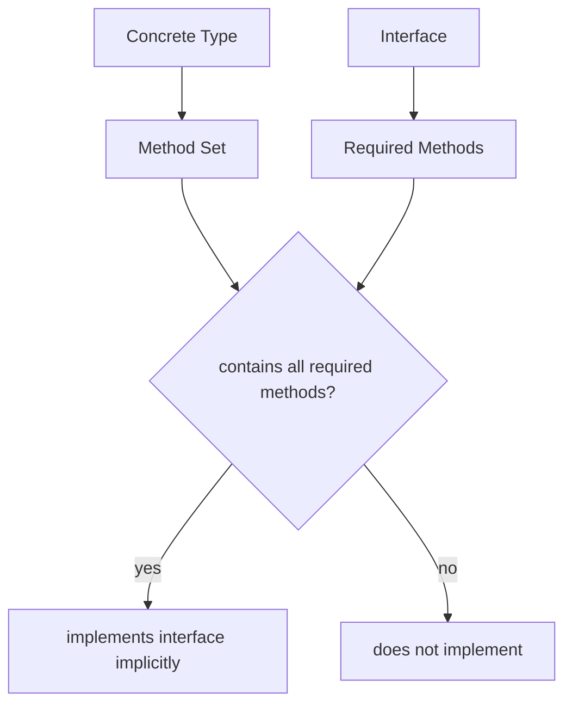
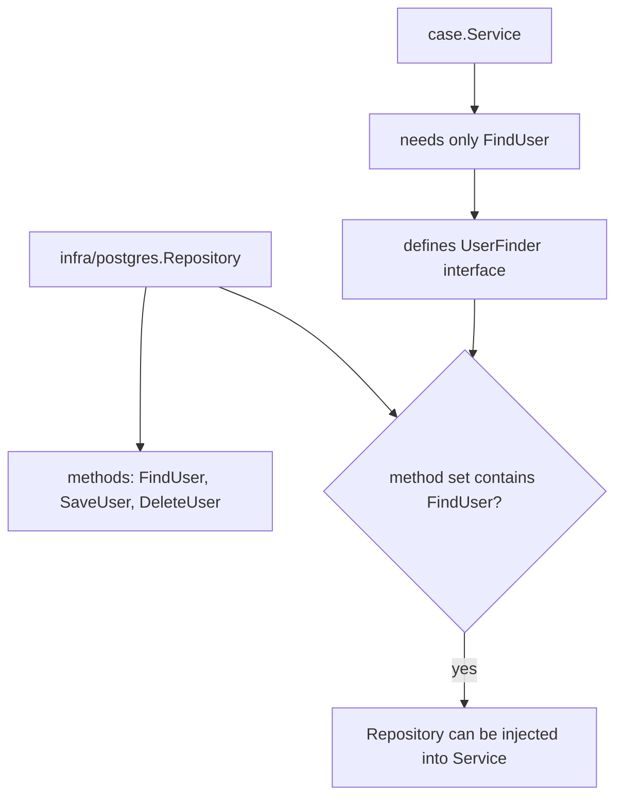
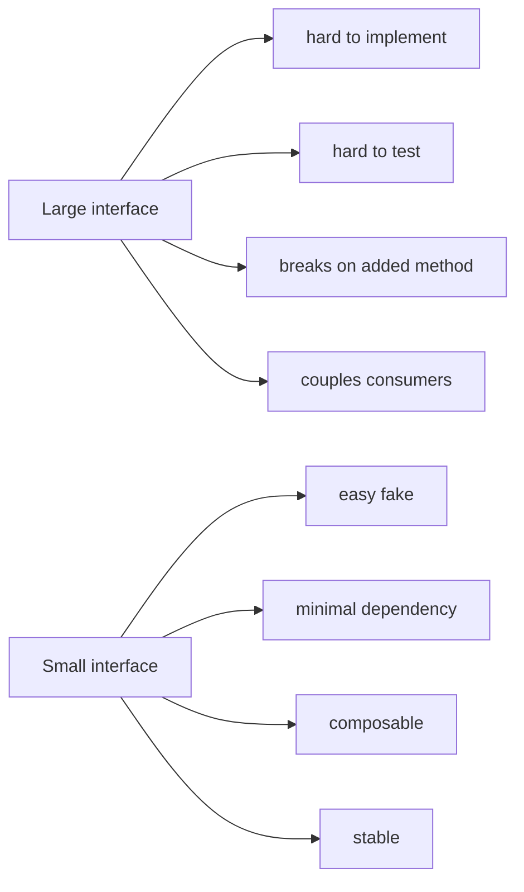

# learn-go-data-model-part-018.md

# Part 018 — Interface I: Structural Typing, Method Set, Implicit Satisfaction

> Seri: `learn-go-data-model`  
> Bagian: `018 / 034`  
> Target pembaca: Java software engineer yang ingin memahami Go data model pada level production engineering  
> Fokus: interface sebagai behavioral contract, structural typing, method set, implicit satisfaction, small interface, dan API boundary

---

## 0. Posisi Part Ini dalam Seri

Kita sudah membahas:

```text
part-013..015: struct sebagai layout, behavior receiver, dan modeling role
part-016: pointer
part-017: nil
```

Sekarang kita masuk ke salah satu konsep paling penting di Go: `interface`.

Untuk Java engineer, kata “interface” terdengar familiar, tetapi Go interface berbeda secara fundamental.

Java:

```java
interface Reader {
    int read(byte[] p);
}

class FileReader implements Reader {
    ...
}
```

Go:

```go
type Reader interface {
    Read(p []byte) (n int, err error)
}

type FileReader struct{}

func (r *FileReader) Read(p []byte) (int, error) {
    return 0, io.EOF
}
```

Tidak ada `implements`.

Di Go:

```text
A type implements an interface implicitly if its method set contains the interface methods.
```

Ini disebut structural typing.

---

## 1. Tujuan Pembelajaran

Setelah part ini, kamu harus bisa menjawab:

1. Apa itu interface di Go?
2. Mengapa Go interface bersifat structural, bukan nominal?
3. Apa itu implicit satisfaction?
4. Apa hubungan interface dengan method set?
5. Mengapa receiver value vs pointer memengaruhi interface satisfaction?
6. Mengapa interface kecil lebih idiomatic?
7. Apa itu consumer-side interface?
8. Mengapa interface di return value sering smell?
9. Kapan interface harus didefinisikan oleh consumer, bukan producer?
10. Apa fungsi `any`?
11. Apa beda empty interface dan meaningful interface?
12. Apa itu interface pollution?
13. Bagaimana compile-time assertion digunakan?
14. Bagaimana membandingkan Go interface dengan Java interface?
15. Bagaimana mendesain interface production-grade?

---

## 2. Interface dalam Satu Kalimat

Interface adalah type yang mendefinisikan satu set method.

```go
type Reader interface {
    Read(p []byte) (n int, err error)
}
```

Sebuah type satisfy interface jika memiliki method yang sesuai.

```go
type StringReader struct {
    s string
}

func (r *StringReader) Read(p []byte) (int, error) {
    return copy(p, r.s), io.EOF
}
```

`*StringReader` satisfy `Reader` karena method set `*StringReader` punya `Read([]byte) (int, error)`.

Tidak perlu menulis:

```go
// implements Reader
```

---

## 3. Structural Typing vs Nominal Typing

Java interface cenderung nominal:

```java
class FileReader implements Reader {}
```

Class harus mendeklarasikan hubungan.

Go interface structural:

```go
type Reader interface {
    Read([]byte) (int, error)
}
```

Jika suatu type punya method `Read([]byte) (int, error)`, type itu satisfy `Reader`.

Tidak peduli apakah type tersebut tahu ada interface `Reader`.

Diagram:



Konsekuensi besar:

```text
Producer tidak harus tahu semua consumer interface.
Consumer bisa mendefinisikan interface kecil sesuai kebutuhan.
```

---

## 4. Method Set Recap

Dari part 014:

Untuk type `T`:

```text
method set of T
= methods with receiver T
```

Untuk `*T`:

```text
method set of *T
= methods with receiver T
+ methods with receiver *T
```

Contoh:

```go
type Counter struct {
    n int
}

func (c Counter) Value() int {
    return c.n
}

func (c *Counter) Inc() {
    c.n++
}
```

Method set:

```text
Counter:
- Value()

*Counter:
- Value()
- Inc()
```

Interface:

```go
type Valuer interface {
    Value() int
}

type Incrementer interface {
    Inc()
}
```

Satisfaction:

```go
var c Counter

var _ Valuer = c
var _ Valuer = &c

// var _ Incrementer = c // compile error
var _ Incrementer = &c
```

Ini bukan detail kecil. Ini memengaruhi public API.

---

## 5. Method Signature Harus Sama Persis

Interface method matching tidak berdasarkan nama saja. Signature harus cocok.

```go
type Reader interface {
    Read([]byte) (int, error)
}
```

Tidak satisfy:

```go
type BadReader struct{}

func (BadReader) Read([]byte) int {
    return 0
}
```

Tidak satisfy karena return type beda.

Tidak satisfy:

```go
func (BadReader) Read(string) (int, error) {
    return 0, nil
}
```

Parameter beda.

Satisfy:

```go
type GoodReader struct{}

func (GoodReader) Read(p []byte) (int, error) {
    return 0, io.EOF
}
```

Parameter names tidak bagian dari type identity, tetapi type dan order parameter/return harus match.

---

## 6. Interface Value vs Interface Type

Interface type:

```go
type Reader interface {
    Read([]byte) (int, error)
}
```

Interface value:

```go
var r Reader
```

Interface value bisa menyimpan concrete value yang satisfy interface.

```go
var r Reader = strings.NewReader("hello")
```

Conceptually:

```text
interface value = (dynamic type, dynamic value)
```

Runtime representation akan dibahas lebih dalam di part 019.

Untuk sekarang, cukup pahami:

```text
Interface type describes required behavior.
Interface value holds a concrete value implementing that behavior.
```

---

## 7. Interface Naming Convention

Go convention untuk single-method interface sering:

```text
Method + er
```

Examples dari standard library:

```go
type Reader interface {
    Read(p []byte) (n int, err error)
}

type Writer interface {
    Write(p []byte) (n int, err error)
}

type Closer interface {
    Close() error
}

type Stringer interface {
    String() string
}
```

Composite:

```go
type ReadCloser interface {
    Reader
    Closer
}
```

Jangan memaksakan suffix `I` seperti `IReader` atau prefix `Interface`.

Bad:

```go
type IUserRepository interface{}
```

Go style:

```go
type UserRepository interface{}
```

Atau lebih kecil:

```go
type UserFinder interface {
    FindUser(context.Context, UserID) (User, error)
}
```

---

## 8. Small Interface Pattern

Go interface sebaiknya kecil.

Classic:

```go
type Reader interface {
    Read([]byte) (int, error)
}
```

Satu method cukup kuat.

Kecil berarti:

```text
- mudah diimplementasikan
- mudah di-test
- mudah di-compose
- tidak memaksa concrete type punya method yang tidak dibutuhkan
- consumer bisa meminta behavior minimal
```

Bad large interface:

```go
type UserService interface {
    CreateUser(context.Context, CreateUserCommand) (UserID, error)
    UpdateUser(context.Context, UpdateUserCommand) error
    DeleteUser(context.Context, UserID) error
    FindUser(context.Context, UserID) (User, error)
    SearchUsers(context.Context, SearchUsersQuery) ([]User, error)
    ExportUsers(context.Context) ([]byte, error)
    ImportUsers(context.Context, []byte) error
}
```

If a consumer only needs find:

```go
type UserFinder interface {
    FindUser(context.Context, UserID) (User, error)
}
```

Consumer depends on less.

---

## 9. Consumer-Side Interface

In Go, interfaces are often defined where they are consumed, not where concrete type is produced.

Producer package:

```go
package userrepo

type Repository struct{}

func (r *Repository) FindByID(ctx context.Context, id UserID) (User, error) {
    ...
}
```

Consumer package:

```go
package casesvc

type UserFinder interface {
    FindByID(context.Context, userrepo.UserID) (userrepo.User, error)
}

type Service struct {
    users UserFinder
}
```

`casesvc` defines exactly what it needs.

Benefit:

```text
- producer remains concrete
- consumer controls dependency shape
- avoids giant producer-defined interface
- easier testing
```

Java mindset often puts interface next to implementation. Go often does the opposite.

---

## 10. Accept Interfaces, Return Concrete Types?

Common Go guideline:

```text
Accept interfaces, return concrete types.
```

Meaning:

```go
func NewService(repo UserFinder) *Service
```

Accept behavior needed.

Return concrete:

```go
func NewService(...) *Service
```

Not:

```go
func NewService(...) ServiceInterface
```

Why return concrete?

```text
- caller gets full concrete API
- easier evolution
- avoids hiding useful methods
- avoids unnecessary abstraction
- caller can define its own interface if needed
```

This is not absolute. Some factories return interface intentionally, but default should be concrete.

Bad default:

```go
func NewRepository(db *sql.DB) UserRepository
```

Better often:

```go
func NewRepository(db *sql.DB) *Repository
```

Consumer can depend on interface.

---

## 11. Interface Pollution

Interface pollution is creating interfaces without a real abstraction need.

Bad:

```go
type UserService interface {
    Create(...)
    Update(...)
    Delete(...)
}

type userService struct{}

func NewUserService() UserService {
    return &userService{}
}
```

If there is only one implementation and no consumer-defined need, this may add noise.

Signs of pollution:

```text
- interface has same methods as concrete type
- interface lives beside implementation but only used by constructor return
- tests mock giant interface instead of small consumer behavior
- interface exists “because Java”
- interface makes navigation harder
```

Better:

```go
type Service struct {
    ...
}

func NewService(...) *Service {
    return &Service{...}
}
```

Define interface later at consumer boundary.

---

## 12. Empty Interface / `any`

Empty interface:

```go
interface{}
```

Since Go 1.18, `any` is alias for `interface{}`.

```go
func Print(v any) {
    fmt.Println(v)
}
```

`any` means:

```text
any type
```

It has zero required methods.

Use cases:

```text
- truly dynamic value
- formatting/logging
- JSON dynamic data
- generic container boundary before type assertion
- reflection-based API
```

But `any` throws away compile-time information.

Bad domain model:

```go
type Event struct {
    Data map[string]any
}
```

Maybe okay at edge, but core facts should be typed.

Better:

```go
type CaseSubmittedEvent struct {
    CaseID      CaseID
    SubmittedBy UserID
    SubmittedAt time.Time
}
```

Use `any` when dynamic nature is real, not because modeling is hard.

---

## 13. Interface Embedding

Interfaces can embed other interfaces.

```go
type Reader interface {
    Read([]byte) (int, error)
}

type Writer interface {
    Write([]byte) (int, error)
}

type ReadWriter interface {
    Reader
    Writer
}
```

A type satisfies `ReadWriter` if it satisfies both `Reader` and `Writer`.

Standard style:

```go
type ReadCloser interface {
    Reader
    Closer
}
```

Composition works best with small interfaces.

---

## 14. Interface with Unexported Methods

A package can define interface with unexported method:

```go
package token

type sealed interface {
    token()
}
```

Only types in same package can implement it because unexported method name is package-qualified.

This pattern can “seal” an interface.

Use sparingly.

For public APIs, unexported method in exported interface prevents external implementation:

```go
type Token interface {
    String() string
    token()
}
```

This may be intentional for closed hierarchies, but can surprise users.

---

## 15. Interface and Nil

From part 017:

```go
var r io.Reader
fmt.Println(r == nil) // true

var sr *strings.Reader = nil
var r2 io.Reader = sr
fmt.Println(r2 == nil) // false
```

Interface nil trap matters for interface API design.

If a function returns interface:

```go
func OpenReader() io.Reader
```

Never return typed nil concrete pointer as interface.

Good:

```go
func OpenReader(enabled bool) io.Reader {
    if !enabled {
        return nil
    }
    return strings.NewReader("data")
}
```

Bad:

```go
func OpenReader() io.Reader {
    var r *bytes.Reader = nil
    return r
}
```

---

## 16. Interface and Typed Nil Compile-Time Assertion

Compile-time assertion:

```go
var _ io.Reader = (*MyReader)(nil)
```

This line does not create runtime value for use. It asserts `*MyReader` implements `io.Reader`.

Example:

```go
type MyReader struct{}

func (*MyReader) Read(p []byte) (int, error) {
    return 0, io.EOF
}

var _ io.Reader = (*MyReader)(nil)
```

If method signature breaks, compile fails.

For value receiver:

```go
var _ fmt.Stringer = MyValue{}
```

Use assertion for important contracts, especially when implementation must satisfy standard interfaces.

Do not overuse for every obvious local interface.

---

## 17. Interface in Tests

Instead of defining giant interface in production for tests, define small interface where needed.

Production consumer:

```go
type UserFinder interface {
    FindUser(context.Context, UserID) (User, error)
}

type Service struct {
    users UserFinder
}
```

Test fake:

```go
type fakeUserFinder struct {
    users map[UserID]User
}

func (f fakeUserFinder) FindUser(ctx context.Context, id UserID) (User, error) {
    u, ok := f.users[id]
    if !ok {
        return User{}, ErrUserNotFound
    }
    return u, nil
}
```

No mocking framework required.

---

## 18. Interface vs Function Parameter

Sometimes one-method interface can be replaced by function type.

Interface:

```go
type Clock interface {
    Now() time.Time
}
```

Function:

```go
type NowFunc func() time.Time

func (f NowFunc) Now() time.Time {
    return f()
}
```

Or direct function field:

```go
type Service struct {
    now func() time.Time
}
```

Constructor:

```go
func NewService(now func() time.Time) *Service {
    if now == nil {
        now = time.Now
    }
    return &Service{now: now}
}
```

Use interface when:

```text
- behavior has multiple methods
- domain concept deserves name
- implementations carry state
- composition with other interfaces useful
```

Use function when:

```text
- exactly one operation
- lightweight injection
- no stateful abstraction needed
```

---

## 19. Interface vs Generics

Both interface and generics provide abstraction, but different kinds.

Interface:

```go
type Stringer interface {
    String() string
}

func PrintAll(values []Stringer) {
    for _, v := range values {
        fmt.Println(v.String())
    }
}
```

This uses dynamic dispatch and homogeneous interface slice.

Generics:

```go
func Contains[T comparable](values []T, target T) bool {
    for _, v := range values {
        if v == target {
            return true
        }
    }
    return false
}
```

Generics preserve concrete type.

Use interface for behavior:

```text
anything that can Read/Write/Close/String
```

Use generics for type-parametric algorithms/data structures:

```text
sets, maps helpers, slices algorithms, containers
```

We'll go deeper in part 021/022.

---

## 20. Interface and Allocation

Assigning concrete value to interface may cause allocation depending on size, escape, and compiler decisions.

Do not design solely based on fear.

But know:

```text
interface value stores dynamic type + dynamic value
large/non-pointer values may be boxed
escaping interface can cause heap allocation
interface dispatch can inhibit inlining in some cases
```

Performance-sensitive code should measure:

```bash
go test -bench=. -benchmem
go build -gcflags=-m ./...
```

Correctness/API design first; optimize measured hot paths.

---

## 21. Interface and Method Granularity

Compare:

```go
type Repository interface {
    CreateUser(...)
    FindUser(...)
    DeleteUser(...)
    CreateCase(...)
    FindCase(...)
    DeleteCase(...)
}
```

This is not cohesive.

Better:

```go
type UserCreator interface {
    CreateUser(context.Context, CreateUserCommand) (UserID, error)
}

type UserFinder interface {
    FindUser(context.Context, UserID) (User, error)
}

type CaseFinder interface {
    FindCase(context.Context, CaseID) (Case, error)
}
```

Then compose only where needed:

```go
type UserStore interface {
    UserCreator
    UserFinder
}
```

Do not create micro-interface for every method blindly. Create interface around consumer needs.

---

## 22. Interface and Package Boundaries

Package design principle:

```text
Concrete types at lower-level packages.
Small interfaces at higher-level consumers.
```

Example:

```text
infra/postgres.UserRepository concrete
application/case.Service consumes UserFinder
```

This prevents infra package from declaring giant interfaces for every possible use.

Directory mental model:

```text
producer package:
- exports concrete implementation

consumer package:
- declares small interface dependency

wiring package:
- connects concrete to consumer
```

---

## 23. Interface as Capability

Interface should represent capability.

Good:

```go
type Reader interface {
    Read([]byte) (int, error)
}
```

Capability: can read.

Good:

```go
type Authorizer interface {
    Decide(context.Context, AuthorizationRequest) (Decision, error)
}
```

Capability: can decide authorization.

Bad:

```go
type Manager interface {
    DoEverything(...)
}
```

Name vague, capability unclear.

Ask:

```text
What can this thing do?
What exact behavior does consumer require?
```

---

## 24. Interface and Domain Language

Good interface names encode domain language.

```go
type CaseTransitionPolicy interface {
    CanTransition(from Status, event Event) (Decision, error)
}
```

or:

```go
type TransitionDecider interface {
    DecideTransition(context.Context, TransitionRequest) (TransitionDecision, error)
}
```

Avoid generic enterprise names:

```go
type CaseManager interface{}
type CaseProcessor interface{}
type CaseHandler interface{}
```

Unless they are truly accurate.

---

## 25. Interface and Error Semantics

Interface methods should define error semantics.

```go
type UserFinder interface {
    FindUser(context.Context, UserID) (User, error)
}
```

Questions:

```text
What error for not found?
Can it return zero User with nil error?
Can it return partial User with error?
Is context cancellation returned as context.Canceled?
```

Better doc:

```go
// FindUser returns ErrUserNotFound if no user exists for id.
// It returns a non-zero User only when err is nil.
type UserFinder interface {
    FindUser(context.Context, UserID) (User, error)
}
```

Interface is not only method shape. It is behavior contract.

---

## 26. Interface and Context

Many production interfaces include `context.Context` for cancellation/deadline/request scope.

```go
type CaseRepository interface {
    FindByID(ctx context.Context, id CaseID) (Case, error)
}
```

Guideline:

```text
- context first parameter
- do not store context in struct
- pass context through call chain
- respect cancellation where applicable
```

But not every pure in-memory value method needs context.

Bad:

```go
func (m Money) Add(ctx context.Context, n Money) Money
```

Context belongs to operations that may block, call external systems, or need request-scoped values.

---

## 27. Interface and Side Effects

Interface should make side effects clear through naming.

```go
type UserNotifier interface {
    NotifyUser(context.Context, UserNotification) error
}
```

This likely sends email/push/etc.

For read-only:

```go
type UserReader interface {
    FindUser(context.Context, UserID) (User, error)
}
```

For mutation:

```go
type UserWriter interface {
    SaveUser(context.Context, User) error
}
```

Avoid hiding side effects behind names like:

```go
Process
Handle
Do
```

unless domain context makes them clear.

---

## 28. Interface and Versioning

Public interfaces are harder to evolve than structs in some ways.

Adding method to interface is breaking for all implementers.

```go
type Store interface {
    Get(string) (string, bool)
}
```

Adding:

```go
Set(string, string)
```

breaks every type implementing `Store`.

Therefore:

```text
Keep public interfaces small.
Prefer composing new interface instead of expanding existing one.
```

Example:

```go
type Getter interface {
    Get(string) (string, bool)
}

type Setter interface {
    Set(string, string)
}

type Store interface {
    Getter
    Setter
}
```

---

## 29. Interface and Mocking

Java-style mocking often creates huge interfaces.

Go-friendly testing often uses:

```text
- small consumer interface
- fake implementation
- function injection
- in-memory concrete
```

Example fake:

```go
type fakeAuthorizer struct {
    decision Decision
    err      error
}

func (f fakeAuthorizer) Decide(ctx context.Context, req AuthorizationRequest) (Decision, error) {
    return f.decision, f.err
}
```

This is often clearer than generated mocks for small behavior.

Generated mocks can be useful for large legacy interfaces, but that often signals interface is too large.

---

## 30. Interface and `io.Reader` as Model

`io.Reader` is canonical:

```go
type Reader interface {
    Read(p []byte) (n int, err error)
}
```

Why it is powerful:

```text
- tiny
- behavior-based
- implemented by files, buffers, network connections, strings, compressors
- composable
- consumer only needs read capability
```

`io.Reader` teaches Go interface philosophy:

```text
Small capability beats large hierarchy.
```

---

## 31. Interface and `fmt.Stringer`

```go
type Stringer interface {
    String() string
}
```

Any type with `String() string` can be formatted specially.

```go
type UserID string

func (id UserID) String() string {
    return string(id)
}
```

Be careful with `String()`:

```text
- should be for human/debug representation
- not necessarily stable serialization
- avoid leaking secrets
```

Do not use `String()` as security-sensitive canonical encoding unless explicitly designed.

---

## 32. Interface and `error`

`error` is interface:

```go
type error interface {
    Error() string
}
```

Any type with `Error() string` implements error.

```go
type ValidationError struct {
    Field string
    Msg   string
}

func (e ValidationError) Error() string {
    return e.Field + ": " + e.Msg
}
```

This simple interface enables rich error types.

But typed nil trap applies strongly to `error`.

Error-specific design deeper in part 020.

---

## 33. Interface and Authorization Example

Bad broad interface:

```go
type SecurityService interface {
    Login(...)
    Logout(...)
    CheckPermission(...)
    ListRoles(...)
    SyncUsers(...)
}
```

Consumer that only needs authorization should depend on:

```go
type Authorizer interface {
    Decide(context.Context, AuthorizationRequest) (AuthorizationDecision, error)
}
```

Domain:

```go
type AuthorizationDecision struct {
    Allowed bool
    Reason  string
}
```

Better yet, avoid bool ambiguity:

```go
type Decision int

const (
    DecisionUnknown Decision = iota
    DecisionAllow
    DecisionDeny
)
```

Interface contract:

```go
// Decide returns DecisionUnknown with an error when policy cannot be evaluated.
type Authorizer interface {
    Decide(context.Context, AuthorizationRequest) (Decision, error)
}
```

This is stronger than `Can(...) bool`.

---

## 34. Interface and Repository Example

Producer:

```go
type PostgresUserRepository struct {
    db *sql.DB
}

func (r *PostgresUserRepository) FindUser(ctx context.Context, id UserID) (User, error) {
    ...
}

func (r *PostgresUserRepository) SaveUser(ctx context.Context, u User) error {
    ...
}
```

Consumer A only reads:

```go
type UserFinder interface {
    FindUser(context.Context, UserID) (User, error)
}
```

Consumer B saves:

```go
type UserSaver interface {
    SaveUser(context.Context, User) error
}
```

The concrete repository can satisfy both without declaring anything.

---

## 35. Compile-Time Assertions

Use:

```go
var _ UserFinder = (*PostgresUserRepository)(nil)
```

or:

```go
var _ fmt.Stringer = UserID("")
```

Patterns:

```go
var _ Interface = (*Type)(nil) // pointer receiver implementation
var _ Interface = Type{}       // value receiver implementation
```

Do this when:

```text
- important public contract
- compiler error should be near implementation
- interface satisfaction is non-obvious
```

Do not use it as noise for every local fake.

---

## 36. Mermaid: Consumer-Side Interface



---

## 37. Mermaid: Interface Size



---

## 38. Mini Lab 1 — Interface Satisfaction

```go
type Namer interface {
    Name() string
}

type User struct {
    name string
}

func (u User) Name() string {
    return u.name
}

func main() {
    var u User
    var p *User = &u

    var _ Namer = u
    var _ Namer = p
}
```

Both pass because value receiver method belongs to method set of `User` and `*User`.

---

## 39. Mini Lab 2 — Pointer Receiver Satisfaction

```go
type Renamer interface {
    Rename(string)
}

type User struct {
    name string
}

func (u *User) Rename(name string) {
    u.name = name
}

func main() {
    var u User

    u.Rename("Alice") // ok, auto-addressing

    // var _ Renamer = u  // compile error
    var _ Renamer = &u // ok
}
```

Method call auto-addressing is not same as interface satisfaction.

---

## 40. Mini Lab 3 — Consumer Interface

Given:

```go
type UserRepository struct{}

func (r *UserRepository) FindUser(context.Context, UserID) (User, error) { ... }
func (r *UserRepository) SaveUser(context.Context, User) error { ... }
func (r *UserRepository) DeleteUser(context.Context, UserID) error { ... }
```

Consumer only needs lookup.

Define:

```go
type UserFinder interface {
    FindUser(context.Context, UserID) (User, error)
}
```

Do not depend on full repository if not needed.

---

## 41. Mini Lab 4 — Typed Nil Interface

```go
type Describer interface {
    Describe() string
}

type User struct{}

func (*User) Describe() string {
    return "user"
}

func makeDescriber() Describer {
    var u *User = nil
    return u
}

func main() {
    d := makeDescriber()
    fmt.Println(d == nil)
}
```

Output:

```text
false
```

Because interface contains dynamic type `*User`.

---

## 42. Mini Lab 5 — Function vs Interface

Clock as interface:

```go
type Clock interface {
    Now() time.Time
}
```

Clock as function:

```go
type NowFunc func() time.Time

func (f NowFunc) Now() time.Time {
    return f()
}
```

Direct function:

```go
type Service struct {
    now func() time.Time
}
```

Question:

```text
Which one should you use?
```

Answer:

```text
If only one operation and no domain concept, function field is often enough.
If behavior is a named capability or has multiple implementations with state, interface is clearer.
```

---

## 43. Common Anti-Patterns

### 43.1 Interface beside every struct

```go
type ServiceInterface interface {
    Method()
}

type Service struct{}
```

Without consumer need, this is noise.

### 43.2 Returning interface by default

```go
func NewService() ServiceInterface
```

Often restricts caller unnecessarily.

### 43.3 Giant repository/service interface

Forces consumers to depend on methods they do not need.

### 43.4 `any` as escape hatch

Using `map[string]any` for core domain because modeling is hard.

### 43.5 Interface names too vague

```go
Manager
Processor
Handler
```

without clear capability.

### 43.6 Adding method to public interface casually

Breaking change for implementers.

### 43.7 Ignoring pointer receiver method set

`T` vs `*T` interface satisfaction surprise.

### 43.8 Interface with unclear error contract

Method shape exists, behavior undefined.

### 43.9 Mock-driven interface design

Creating broad interfaces only because mocking tool needs them.

### 43.10 Pointer-to-interface

Almost always unnecessary and confusing.

---

## 44. Production Guidelines

### 44.1 Define Interfaces at Consumer Boundary

Let consumers state what they need.

### 44.2 Keep Interfaces Small

One to three methods often enough. Larger can be valid, but must be cohesive.

### 44.3 Return Concrete Types by Default

Let callers choose abstraction.

### 44.4 Use Compile-Time Assertions for Important Contracts

```go
var _ io.Reader = (*MyReader)(nil)
```

### 44.5 Document Behavioral Contract

Not just method signatures.

### 44.6 Avoid `any` in Core Domain

Use typed structs and interfaces.

### 44.7 Be Conscious of Receiver Choice

Receiver choice affects method set and interface satisfaction.

### 44.8 Prefer Capability Names

`Reader`, `Writer`, `Authorizer`, `UserFinder`, `CaseLoader`.

### 44.9 Compose Interfaces Instead of Expanding

Adding methods to public interfaces breaks implementers.

---

## 45. PR Review Checklist

### 45.1 Necessity

```text
[ ] Is this interface needed now?
[ ] Who consumes it?
[ ] Is there more than one meaningful implementation or test fake?
[ ] Could a concrete type be returned instead?
```

### 45.2 Size and Cohesion

```text
[ ] Does interface represent one capability?
[ ] Are all methods needed by same consumer?
[ ] Can it be split into smaller interfaces?
[ ] Is interface name precise?
```

### 45.3 Location

```text
[ ] Is interface defined near consumer?
[ ] Is producer exporting unnecessary broad interface?
[ ] Does package boundary remain clean?
```

### 45.4 Method Set

```text
[ ] Does intended type satisfy interface as T or *T?
[ ] Receiver choice deliberate?
[ ] Compile-time assertion needed?
```

### 45.5 Nil and Error

```text
[ ] Can method return typed nil interface/error?
[ ] Is nil return meaningful?
[ ] Are not-found/cancel/timeout errors defined?
```

### 45.6 Evolution

```text
[ ] Is interface public?
[ ] What happens if a method must be added later?
[ ] Can composition handle future capabilities?
```

### 45.7 Testing

```text
[ ] Can tests use small fake?
[ ] Is generated mock hiding interface bloat?
[ ] Would function injection be simpler?
```

### 45.8 Domain Correctness

```text
[ ] Does interface expose bool where tri-state decision is needed?
[ ] Does interface accept any/map[string]any unnecessarily?
[ ] Does method name reveal side effects?
```

---

## 46. Ringkasan Mental Model

Go interface adalah behavioral contract berbasis method set.

```text
Interface satisfaction:
- implicit
- structural
- compile-time checked
- based on method set
```

Go interface yang baik biasanya:

```text
- kecil
- consumer-owned
- capability-oriented
- behaviorally documented
- composed when needed
```

Untuk Java engineer:

```text
Jangan port pola “interface untuk setiap class”.
Di Go, concrete type dulu, interface muncul di boundary kebutuhan.
```

Interface bukan dekorasi arsitektur. Interface adalah cara mengurangi dependency ke capability minimal.

---

## 47. Apa yang Tidak Dibahas di Part Ini

Part ini membahas interface dari sisi type system dan design.

Part berikutnya akan membahas runtime behavior:

```text
part-019 — Interface II: Runtime Representation, Boxing, Type Assertion, Type Switch
```

Di sana kita akan membahas:

```text
- dynamic type/value
- interface representation
- boxing
- allocation possibility
- type assertion
- type switch
- typed nil deep dive
- interface equality
- reflection boundary
```

---

## 48. Referensi Resmi

- Go Language Specification — Interface types, method sets, assignability, type assertions  
  https://go.dev/ref/spec
- Go Wiki — MethodSets  
  https://go.dev/wiki/MethodSets
- Effective Go — Interfaces and methods  
  https://go.dev/doc/effective_go
- Go Blog — The Laws of Reflection  
  https://go.dev/blog/laws-of-reflection
- Go Blog — Errors are values  
  https://go.dev/blog/errors-are-values
- Package `io`  
  https://pkg.go.dev/io
- Package `fmt`  
  https://pkg.go.dev/fmt
- Go 1.26 Release Notes  
  https://go.dev/doc/go1.26

---

## 49. Status Seri

Selesai:

```text
part-000  Orientation
part-001  Type system core
part-002  Zero value and invariants
part-003  Constants and iota
part-004  Numeric foundations
part-005  Numeric correctness
part-006  Text model I
part-007  Text model II
part-008  Array
part-009  Slice I
part-010  Slice II
part-011  Map I
part-012  Map II
part-013  Struct I
part-014  Struct II
part-015  Struct III
part-016  Pointer
part-017  Nil
part-018  Interface I
```

Berikutnya:

```text
part-019  Interface II: Runtime Representation, Boxing, Type Assertion, Type Switch
```

Seri belum selesai. Masih ada part 019 sampai part 034.

<!-- NAVIGATION_FOOTER -->
<div class="page-nav">
<a href="./learn-go-data-model-part-017.md">⬅️ Part 017 — Nil: The Most Expensive Small Word in Go</a>
<a href="./index.md">📚 Kategori</a>
<a href="../../index.md">🏠 Home</a>
<a href="./learn-go-data-model-part-019.md">Part 019 — Interface II: Runtime Representation, Boxing, Type Assertion, Type Switch ➡️</a>
</div>
