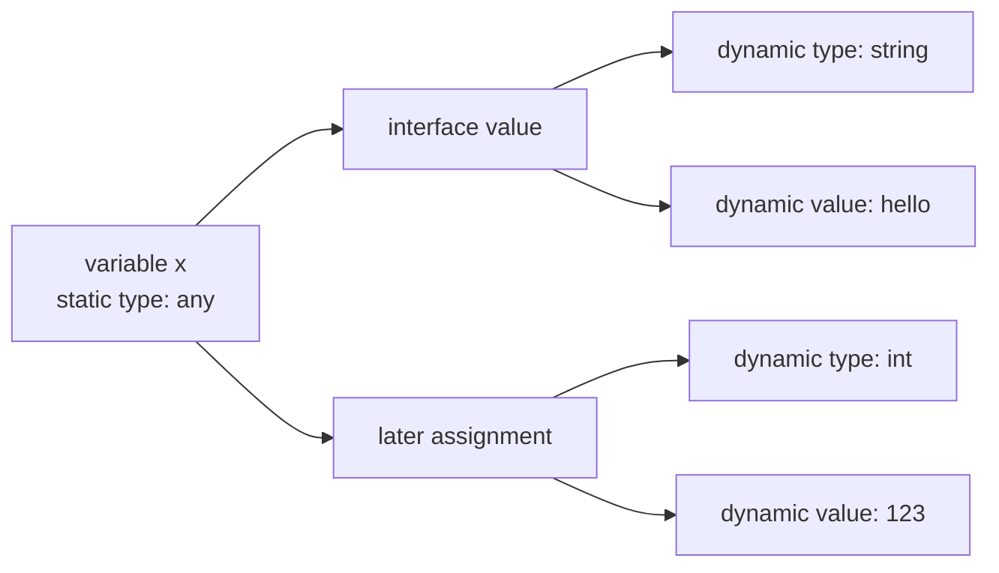
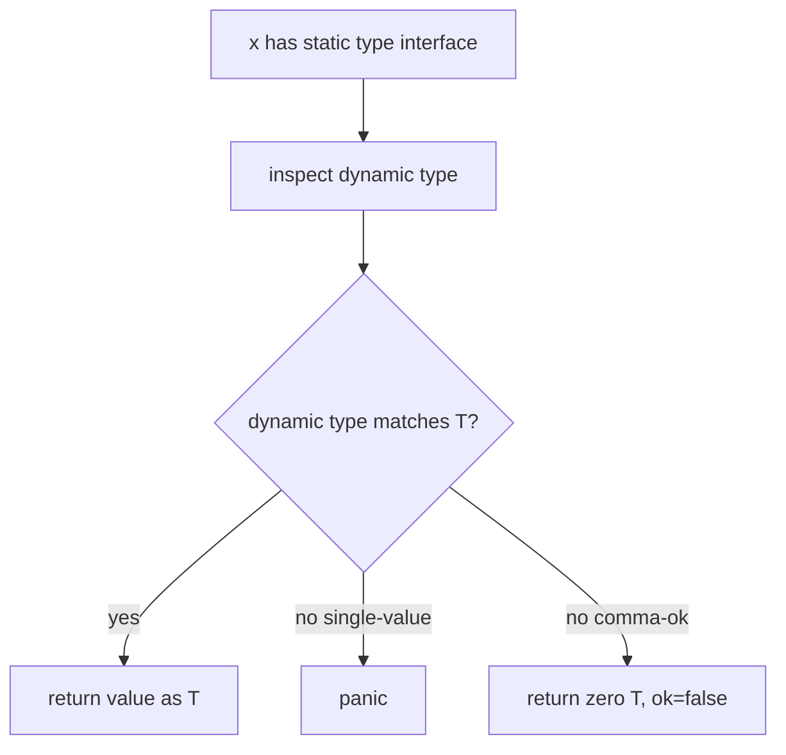
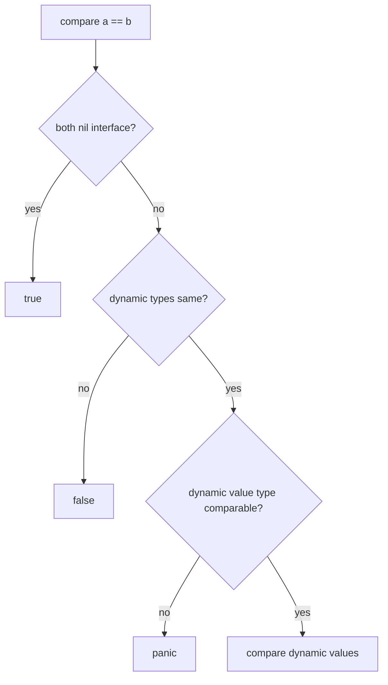

# learn-go-data-model-part-019.md

# Part 019 — Interface II: Runtime Representation, Boxing, Type Assertion, Type Switch

> Seri: `learn-go-data-model`  
> Bagian: `019 / 034`  
> Target pembaca: Java software engineer yang ingin memahami Go data model pada level production engineering  
> Fokus: interface value at runtime, dynamic type/value, boxing, allocation possibility, type assertion, type switch, typed nil, equality, dan reflection boundary

---

## 0. Posisi Part Ini dalam Seri

Part 018 membahas interface sebagai type system dan design tool:

```text
- structural typing
- implicit satisfaction
- method set
- small interface
- consumer-side interface
- interface pollution
```

Part ini masuk lebih dalam ke runtime behavior.

Jika part 018 menjawab:

```text
Apakah type T satisfy interface I?
```

Part ini menjawab:

```text
Apa yang terjadi saat value concrete dimasukkan ke interface?
Bagaimana type assertion bekerja?
Mengapa typed nil terjadi?
Kapan interface comparison panic?
Apa biaya abstraction interface?
Kapan type switch tepat?
Apa batas antara interface, generics, dan reflection?
```

Untuk Java engineer, interface Go tidak sama dengan Java interface dispatch. Go interface value membawa informasi runtime tentang concrete dynamic type dan dynamic value.

---

## 1. Tujuan Pembelajaran

Setelah part ini, kamu harus bisa:

1. Memahami interface value sebagai pasangan dynamic type dan dynamic value.
2. Menjelaskan mengapa `var x any = (*User)(nil)` membuat `x != nil`.
3. Memahami boxing secara konseptual saat concrete value masuk interface.
4. Membedakan static type dan dynamic type.
5. Menggunakan type assertion dengan aman.
6. Menggunakan type switch dengan benar.
7. Memahami kapan type assertion panic.
8. Memahami comma-ok form.
9. Mengetahui kapan interface equality valid dan kapan panic.
10. Menjelaskan allocation possibility saat memakai interface.
11. Memahami interface slice `[]any` bukan `[]T`.
12. Menghindari overuse `any`.
13. Menentukan kapan memakai interface vs type switch vs generics vs reflection.
14. Membuat checklist PR untuk runtime interface usage.

---

## 2. Interface Value: Dynamic Type + Dynamic Value

Interface value secara konseptual menyimpan dua hal:

```text
dynamic type
dynamic value
```

Contoh:

```go
var x any = 42
```

Conceptual:

```text
x = (type=int, value=42)
```

Contoh:

```go
var s fmt.Stringer = UserID("u1")
```

Conceptual:

```text
s = (type=UserID, value="u1")
```

Interface nil:

```go
var x any
```

Conceptual:

```text
x = (type=nil, value=nil)
```

Typed nil inside interface:

```go
var p *User = nil
var x any = p
```

Conceptual:

```text
x = (type=*User, value=nil)
```

Karena dynamic type tidak nil, interface value tidak nil.

---

## 3. Static Type vs Dynamic Type

Static type adalah type yang diketahui compiler dari variable/expression.

Dynamic type adalah concrete type yang disimpan di interface value saat runtime.

```go
var x any = "hello"
```

Static type of `x`:

```text
any
```

Dynamic type inside `x`:

```text
string
```

Jika diubah:

```go
x = 123
```

Static type tetap:

```text
any
```

Dynamic type sekarang:

```text
int
```

Diagram:



Interface memungkinkan dynamic type berubah selama assignment valid terhadap static interface type.

---

## 4. Interface Assignment

Assignment concrete ke interface:

```go
var r io.Reader
r = strings.NewReader("abc")
```

`strings.NewReader("abc")` menghasilkan `*strings.Reader`, yang punya method `Read`, sehingga satisfy `io.Reader`.

Conceptual:

```text
r = (type=*strings.Reader, value=pointer to reader)
```

Assignment value type:

```go
var x any
x = Point{X: 1, Y: 2}
```

Conceptual:

```text
x = (type=Point, value=copy of Point{1,2})
```

Penting:

```text
Assigning to interface copies the concrete value into interface representation conceptually.
If concrete value is pointer, pointer value is copied.
If concrete value is struct, struct value is copied/boxed.
```

---

## 5. Boxing: Conceptual Meaning

“Boxing” bukan istilah formal spec utama Go seperti di Java, tetapi berguna sebagai mental model.

Saat concrete value dimasukkan ke interface, value tersebut dikemas bersama type information.

```go
var x any = 10
```

Conceptually:

```text
box int(10) into interface any
```

Saat mengambil kembali:

```go
i := x.(int)
```

Conceptually:

```text
unbox as int if dynamic type is int
```

Namun jangan menyamakan mentah-mentah dengan Java autoboxing. Di Go, interface value menyimpan dynamic type/value dan compiler/runtime memilih representasi serta allocation sesuai implementasi.

---

## 6. Copy Behavior Saat Masuk Interface

Struct value masuk interface sebagai copy.

```go
type Counter struct {
    N int
}

func main() {
    c := Counter{N: 1}
    var x any = c

    c.N = 2

    fmt.Println(x.(Counter).N) // 1
}
```

Karena interface menyimpan copy dari value saat assignment.

Pointer masuk interface sebagai pointer copy:

```go
c := &Counter{N: 1}
var x any = c

c.N = 2

fmt.Println(x.(*Counter).N) // 2
```

Karena dynamic value adalah pointer ke object yang sama.

---

## 7. Interface and Mutability

Interface tidak membuat value immutable.

Jika dynamic value adalah pointer:

```go
var x any = &Counter{N: 1}

c := x.(*Counter)
c.N = 99
```

Original pointed object mutated.

Jika dynamic value adalah map:

```go
m := map[string]int{"a": 1}
var x any = m

x.(map[string]int)["a"] = 2

fmt.Println(m["a"]) // 2
```

Map descriptor copied, same runtime table.

Jika dynamic value adalah slice:

```go
s := []int{1, 2}
var x any = s

x.([]int)[0] = 99

fmt.Println(s[0]) // 99
```

Slice descriptor copied, same backing array.

Interface value copies the outer value; reference-like fields/values still share underlying data.

---

## 8. Type Assertion

Type assertion syntax:

```go
v := x.(T)
```

Meaning:

```text
Assert that interface value x has dynamic type T
or implements interface T if T is interface.
```

Example:

```go
var x any = "hello"

s := x.(string)
fmt.Println(s)
```

If dynamic type is not `string`, panic:

```go
var x any = 123
s := x.(string) // panic
_ = s
```

Use comma-ok form:

```go
s, ok := x.(string)
if !ok {
    // not a string
}
```

This avoids panic.

---

## 9. Type Assertion to Concrete Type

```go
var x any = UserID("u1")

id, ok := x.(UserID)
if !ok {
    return errors.New("not UserID")
}
```

Exact dynamic type must match.

If:

```go
type UserID string
var x any = "u1"
```

Then:

```go
_, ok := x.(UserID) // false
```

Because dynamic type is `string`, not `UserID`.

Type identity matters.

---

## 10. Type Assertion to Interface Type

If target type is interface, assertion checks whether dynamic value implements that interface.

```go
var x any = strings.NewReader("abc")

r, ok := x.(io.Reader)
fmt.Println(ok) // true
_ = r
```

Dynamic type `*strings.Reader` implements `io.Reader`.

Another:

```go
type Stringer interface {
    String() string
}

var x any = UserID("u1")
s, ok := x.(Stringer)
```

This depends on whether `UserID` has `String() string` method.

---

## 11. Type Assertion on Nil Interface

```go
var x any

s, ok := x.(string)
fmt.Println(s, ok) // "" false
```

Single-value form panics:

```go
var x any
s := x.(string) // panic
```

Because interface has no dynamic type.

---

## 12. Type Switch

Type switch:

```go
switch v := x.(type) {
case nil:
    fmt.Println("nil")
case string:
    fmt.Println("string", v)
case int:
    fmt.Println("int", v)
case fmt.Stringer:
    fmt.Println("stringer", v.String())
default:
    fmt.Printf("unknown %T\n", v)
}
```

In each case, `v` has type of that case.

If case is concrete:

```go
case string:
    // v is string
```

If case is interface:

```go
case fmt.Stringer:
    // v is fmt.Stringer
```

Default:

```go
default:
    // v has same type as switch expression interface
```

Type switch is useful at dynamic boundaries.

---

## 13. Type Switch Ordering

Order matters when interface cases overlap.

```go
switch v := x.(type) {
case io.Reader:
    fmt.Println("reader")
case io.ReadCloser:
    fmt.Println("readcloser")
}
```

If value implements `io.ReadCloser`, first case `io.Reader` matches first, so `io.ReadCloser` case never reached.

Better:

```go
switch v := x.(type) {
case io.ReadCloser:
    fmt.Println("readcloser")
case io.Reader:
    fmt.Println("reader")
}
```

Put more specific interfaces before broader interfaces.

---

## 14. Type Switch and Typed Nil

```go
var p *User = nil
var x any = p

switch v := x.(type) {
case nil:
    fmt.Println("nil interface")
case *User:
    fmt.Println("user pointer", v == nil)
}
```

Output:

```text
user pointer true
```

Because `x` is not nil interface; it contains dynamic type `*User`.

---

## 15. Type Assertion vs Type Conversion

Assertion:

```go
var x any = int64(10)
v := x.(int64)
```

Conversion:

```go
var i int64 = 10
v := int(i)
```

Invalid:

```go
var x any = int64(10)
// v := int(x) // invalid: x static type any
```

Need assertion then conversion:

```go
i64, ok := x.(int64)
if !ok {
    return errors.New("not int64")
}
i := int(i64)
_ = i
```

Do not confuse assertion with conversion.

Assertion asks:

```text
What dynamic type is inside interface?
```

Conversion asks:

```text
Can this value be converted to another type?
```

---

## 16. Interface Equality

Interface values can be compared with `==` if their dynamic values are comparable.

```go
var a any = 10
var b any = 10

fmt.Println(a == b) // true
```

Dynamic types same and values equal.

Different dynamic types:

```go
var a any = int(10)
var b any = int64(10)

fmt.Println(a == b) // false
```

Even if numerically similar, dynamic type differs.

Comparable pointer:

```go
u := &User{}
var a any = u
var b any = u

fmt.Println(a == b) // true
```

Non-comparable dynamic value causes panic:

```go
var a any = []int{1}
var b any = []int{1}

fmt.Println(a == b) // panic
```

This is critical.

---

## 17. Interface Equality Rule

For interface comparison:

```text
- If both interfaces nil -> equal.
- If dynamic types differ -> not equal.
- If dynamic types same -> compare dynamic values.
- If dynamic value type is not comparable -> panic.
```

Example:

```go
func Equal(a, b any) bool {
    return a == b // may panic
}
```

Unsafe for arbitrary `any`.

Safer if you require comparable generic:

```go
func Equal[T comparable](a, b T) bool {
    return a == b
}
```

Or use reflect carefully, but know semantics differ.

---

## 18. Interface Slice Is Not Covariant

In Java, arrays are covariant and generics have variance concepts. In Go:

```go
[]string is not []any
```

Invalid:

```go
strings := []string{"a", "b"}
// var values []any = strings // compile error
```

Need explicit copy:

```go
values := make([]any, len(strings))
for i, s := range strings {
    values[i] = s
}
```

Why?

```text
[]string layout is contiguous strings.
[]any layout is contiguous interface values.
They are different memory representations.
```

Also type safety:

If `[]string` were `[]any`, someone could insert `int`.

---

## 19. Interface and Map/Slice Values

Interface can hold map/slice, but comparison hazards remain.

```go
var x any = []int{1, 2}
fmt.Printf("%T\n", x) // []int
```

Type assertion:

```go
s, ok := x.([]int)
```

But:

```go
x == nil // false
```

Because interface has dynamic type `[]int`, even if slice itself nil:

```go
var s []int = nil
var x any = s

fmt.Println(s == nil) // true
fmt.Println(x == nil) // false
```

Typed nil trap applies to all nil-able dynamic types, not only pointers.

---

## 20. Typed Nil for Slice/Map/Func/Chan

Examples:

```go
var s []int = nil
var x any = s
fmt.Println(x == nil) // false

var m map[string]int = nil
var y any = m
fmt.Println(y == nil) // false

var fn func() = nil
var z any = fn
fmt.Println(z == nil) // false
```

Because interface has dynamic type.

If function expects `any` and wants to reject nil dynamic values, `x == nil` is insufficient.

---

## 21. Detecting Typed Nil with Reflection

```go
func IsNil(x any) bool {
    if x == nil {
        return true
    }

    v := reflect.ValueOf(x)
    switch v.Kind() {
    case reflect.Chan, reflect.Func, reflect.Interface, reflect.Map, reflect.Pointer, reflect.Slice:
        return v.IsNil()
    default:
        return false
    }
}
```

Use sparingly.

Better:

```text
Avoid any if typed nil matters.
Use concrete typed parameter.
Use explicit bool.
Validate at boundary.
```

Reflection is appropriate for generic dynamic frameworks, not ordinary business logic.

---

## 22. Interface and Reflection

Reflection begins with interface.

```go
t := reflect.TypeOf(x)
v := reflect.ValueOf(x)
```

For:

```go
var x any = UserID("u1")
```

Then:

```text
TypeOf(x) -> main.UserID
ValueOf(x) -> value containing UserID("u1")
```

If `x` is nil interface:

```go
var x any
reflect.TypeOf(x)  // nil
reflect.ValueOf(x) // zero Value
```

Reflect can inspect and manipulate values, but settable/addressability rules still apply.

Detailed reflection is part 024. Here, remember:

```text
Reflection extracts dynamic type/value from interface.
```

---

## 23. Interface and `fmt`

`fmt` functions accept `any`:

```go
fmt.Println(v)
fmt.Printf("%T %v\n", v, v)
```

`fmt` uses reflection and interfaces like `fmt.Stringer`, `error`, `fmt.Formatter`.

If a type implements `String() string`, `fmt` may use it.

Be careful:

```go
func (u User) String() string {
    return u.Email // could leak PII
}
```

Stringer is convenient but can leak sensitive data if used in logs.

---

## 24. Interface and `error`

`error` is interface:

```go
type error interface {
    Error() string
}
```

Typed nil error:

```go
func do() error {
    var e *MyError = nil
    return e
}
```

Bad because `error` interface is non-nil.

Error type assertion:

```go
var err error = &ValidationError{Field: "email"}

ve, ok := err.(*ValidationError)
```

Modern error matching usually uses:

```go
errors.As(err, &ve)
errors.Is(err, ErrNotFound)
```

This will be detailed in part 020.

---

## 25. Interface Dispatch

Calling method through interface uses dynamic dispatch.

```go
var r io.Reader = strings.NewReader("abc")
n, err := r.Read(buf)
```

Runtime calls method implementation for dynamic type `*strings.Reader`.

This is similar in spirit to virtual dispatch, but Go's interface model is structural and dynamic pair-based.

Performance note:

```text
Interface dispatch can inhibit inlining and add indirection.
But it is usually not bottleneck unless in hot path.
Measure before replacing good design with concrete coupling.
```

---

## 26. Interface and Allocation Possibility

Cases where interface use may allocate:

```text
- concrete value boxed into interface and escapes
- large value stored in interface
- interface passed to variadic ...any and escapes
- reflection-heavy paths
```

Example:

```go
fmt.Println(x)
```

Arguments go through `...any`.

Does it allocate? It depends on compiler/runtime/context. Measure:

```bash
go test -bench=. -benchmem
go build -gcflags=-m ./...
```

Guideline:

```text
Do not avoid interfaces everywhere.
Do avoid unnecessary interface{} in hot inner loops if profiling shows cost.
```

---

## 27. Interface in Collections

Slice of interface:

```go
values := []any{1, "x", UserID("u1")}
```

This is heterogeneous.

But if all values are same type, prefer typed slice:

```go
[]UserID
```

Bad:

```go
[]any
```

for homogeneous domain data. It loses type safety and adds assertion cost.

Use `[]any` for:

```text
- logging/formatting args
- dynamic JSON-like data
- plugin boundaries
- reflection-based frameworks
```

---

## 28. `any` Boundary Normalization

If receiving dynamic payload:

```go
func Handle(attrs map[string]any) error {
    for k, v := range attrs {
        switch v := v.(type) {
        case string:
            _ = v
        case float64:
            _ = v
        case bool:
            _ = v
        case nil:
            _ = v
        default:
            return fmt.Errorf("attribute %q has unsupported type %T", k, v)
        }
    }
    return nil
}
```

Convert dynamic data into typed domain as early as possible.

```text
dynamic boundary -> validate -> typed command/domain
```

Do not let `map[string]any` spread through core.

---

## 29. Type Switch as Boundary Tool

Type switch is appropriate when:

```text
- input is genuinely dynamic
- handling depends on runtime type
- boundary must normalize supported types
- implementing formatter/encoder/visitor-like logic
```

Example:

```go
func AttributeFromAny(v any) (AttributeValue, error) {
    switch v := v.(type) {
    case nil:
        return AttributeValue{Kind: AttributeNull}, nil
    case string:
        return AttributeValue{Kind: AttributeString, String: v}, nil
    case bool:
        return AttributeValue{Kind: AttributeBool, Bool: v}, nil
    case float64:
        return AttributeValue{Kind: AttributeNumber, Number: v}, nil
    default:
        return AttributeValue{}, fmt.Errorf("unsupported attribute type %T", v)
    }
}
```

Bad use:

```go
func Process(x any) {
    switch v := x.(type) {
    case User:
    case Order:
    case Invoice:
    }
}
```

If all types are known domain commands, prefer interface or explicit command handlers.

---

## 30. Type Switch vs Interface Method

Bad polymorphism with type switch:

```go
func Area(shape any) float64 {
    switch s := shape.(type) {
    case Circle:
        return math.Pi * s.Radius * s.Radius
    case Rectangle:
        return s.Width * s.Height
    default:
        panic("unknown shape")
    }
}
```

Better if behavior belongs to type:

```go
type Shape interface {
    Area() float64
}

func Area(s Shape) float64 {
    return s.Area()
}
```

But type switch can be better when:

```text
- operation is external to types
- cannot add methods to types
- closed set transformation
- serialization/deserialization boundary
```

---

## 31. Type Switch vs Generics

Bad generic candidate:

```go
func First(values any) any {
    switch v := values.(type) {
    case []string:
        return v[0]
    case []int:
        return v[0]
    default:
        panic("unsupported")
    }
}
```

Better:

```go
func First[T any](values []T) (T, bool) {
    if len(values) == 0 {
        var zero T
        return zero, false
    }
    return values[0], true
}
```

Use generics for type-parametric same operation.

Use type switch when behavior truly differs by type at runtime.

---

## 32. Type Switch vs Reflection

Type switch handles known cases:

```go
switch v := x.(type) {
case string:
case int:
case bool:
}
```

Reflection handles arbitrary types:

```go
v := reflect.ValueOf(x)
```

Use reflection when:

```text
- types unknown at compile time
- need inspect struct fields/tags
- building serialization/validation framework
```

Do not use reflection for ordinary polymorphism.

---

## 33. Interface with Uncomparable Dynamic Type as Map Key

Map key type can be interface:

```go
m := map[any]string{}
```

But inserting non-comparable dynamic key panics:

```go
m[[]int{1}] = "x" // panic: hash of unhashable type []int
```

Because interface key is comparable statically, but dynamic value must be hashable/comparable.

Avoid `map[any]V` unless you tightly control key types.

Better:

```go
type AttributeKey string
map[AttributeKey]Value
```

---

## 34. Interface and JSON Decoding

`encoding/json` into `any` commonly yields:

```text
JSON object -> map[string]any
JSON array  -> []any
JSON string -> string
JSON number -> float64 by default
JSON bool   -> bool
JSON null   -> nil
```

Example:

```go
var v any
json.Unmarshal(data, &v)
```

After that, use type assertions/type switch.

But for known schema, decode into struct.

```go
var req CreateCaseRequest
json.Unmarshal(data, &req)
```

Dynamic decode is useful at boundary, but typed decode is safer.

---

## 35. Interface and `[]byte`/`string` Surprises

If a function accepts `any` and handles string:

```go
func Normalize(v any) string {
    switch v := v.(type) {
    case string:
        return v
    default:
        return fmt.Sprint(v)
    }
}
```

`[]byte("abc")` is not string.

```go
Normalize([]byte("abc"))
```

Default `fmt.Sprint` may output `[97 98 99]`.

Need explicit case:

```go
case []byte:
    return string(v)
```

Dynamic boundaries must list supported types carefully.

---

## 36. Interface and Pointer vs Value Dynamic Type

```go
type User struct {
    Name string
}

func (u User) String() string {
    return u.Name
}

var a any = User{Name: "Alice"}
var b any = &User{Name: "Bob"}

fmt.Printf("%T\n", a) // main.User
fmt.Printf("%T\n", b) // *main.User
```

Type assertion:

```go
_, ok := a.(User)  // true
_, ok = a.(*User)  // false

_, ok = b.(*User)  // true
_, ok = b.(User)   // false
```

Even if pointer can call value receiver methods, dynamic type remains exact.

For interface assertion:

```go
_, ok := a.(fmt.Stringer) // true
_, ok = b.(fmt.Stringer)  // true
```

Because both implement Stringer due to method set.

---

## 37. Interface and Method Set at Runtime

If target of assertion is interface, method set matters.

```go
type Renamer interface {
    Rename(string)
}

type User struct {
    Name string
}

func (u *User) Rename(name string) {
    u.Name = name
}

var a any = User{}
var b any = &User{}

_, ok := a.(Renamer) // false
_, ok = b.(Renamer)  // true
```

Because `User` method set does not include pointer receiver method.

---

## 38. Interface and Variadic `...any`

Many APIs use:

```go
func Log(args ...any)
```

Call:

```go
Log("user", id, "status", status)
```

Each argument becomes interface value.

Do not pass `[]T` directly as `...any`.

Invalid:

```go
xs := []string{"a", "b"}
// Log(xs...) // compile error because []string not []any
```

Need convert:

```go
args := make([]any, len(xs))
for i, x := range xs {
    args[i] = x
}
Log(args...)
```

This conversion boxes each element.

---

## 39. Interface and API Clarity

Compare:

```go
func Publish(topic string, payload any) error
```

vs:

```go
func PublishCaseSubmitted(ctx context.Context, e CaseSubmittedEvent) error
```

The `any` version is flexible but weak:

```text
- no compile-time schema
- runtime type errors
- serialization behavior unclear
- evolution unclear
```

Use `any` when framework-level genericity is real. Use typed payloads for domain APIs.

---

## 40. Mermaid: Type Assertion Flow



---

## 41. Mermaid: Interface Equality



---

## 42. Mini Lab 1 — Dynamic Type

```go
var x any = UserID("u1")

fmt.Printf("%T\n", x)

_, ok1 := x.(UserID)
_, ok2 := x.(string)

fmt.Println(ok1, ok2)
```

Output:

```text
main.UserID
true false
```

Even if underlying type is string, dynamic type is UserID.

---

## 43. Mini Lab 2 — Struct Copy Into Interface

```go
type Counter struct {
    N int
}

func main() {
    c := Counter{N: 1}
    var x any = c

    c.N = 2

    fmt.Println(x.(Counter).N)
}
```

Output:

```text
1
```

Interface got copy of Counter.

---

## 44. Mini Lab 3 — Pointer Into Interface

```go
type Counter struct {
    N int
}

func main() {
    c := &Counter{N: 1}
    var x any = c

    c.N = 2

    fmt.Println(x.(*Counter).N)
}
```

Output:

```text
2
```

Interface stores pointer value to same object.

---

## 45. Mini Lab 4 — Typed Nil

```go
var s []int = nil
var x any = s

fmt.Println(s == nil)
fmt.Println(x == nil)
fmt.Printf("%T\n", x)
```

Output:

```text
true
false
[]int
```

---

## 46. Mini Lab 5 — Interface Equality Panic

```go
var a any = []int{1}
var b any = []int{1}

fmt.Println(a == b)
```

Result:

```text
panic
```

Because dynamic type `[]int` is not comparable.

---

## 47. Mini Lab 6 — Type Switch Order

```go
var x any = io.NopCloser(strings.NewReader("abc"))

switch x.(type) {
case io.Reader:
    fmt.Println("reader")
case io.ReadCloser:
    fmt.Println("readcloser")
}
```

Output:

```text
reader
```

Because first matching case wins. Put `io.ReadCloser` first if you need specificity.

---

## 48. Common Anti-Patterns

### 48.1 Using `any` to avoid modeling

```go
func Process(payload any)
```

when payload shape is known.

### 48.2 Single-value type assertion on untrusted input

```go
s := x.(string)
```

Use comma-ok at boundaries.

### 48.3 Ignoring typed nil

```go
if x == nil
```

when x may be interface holding typed nil.

### 48.4 Comparing arbitrary `any`

```go
return a == b
```

Can panic.

### 48.5 `[]T` to `[]any` assumption

They are different types/layouts.

### 48.6 Type switch replacing polymorphism

If behavior belongs to types, use interface method.

### 48.7 Reflection for known type cases

Use type switch or concrete types.

### 48.8 Interface key map with arbitrary dynamic key

`map[any]V` can panic for non-comparable dynamic key.

### 48.9 Returning typed nil as interface/error

Classic production bug.

### 48.10 Over-abstracting hot path without measurement

Interface cost may matter in hot loops, but measure before contorting design.

---

## 49. Production Guidelines

### 49.1 Keep Dynamic Boundaries Narrow

Use `any` at boundary, convert to typed data quickly.

### 49.2 Use Comma-Ok Assertions at Boundaries

Never trust external/dynamic input.

### 49.3 Prefer Interface Methods Over Type Switch for Polymorphism

If you own the types and behavior belongs to them.

### 49.4 Prefer Generics for Same Algorithm Over Many Types

Avoid type switch when type parameter solves it.

### 49.5 Avoid Arbitrary Interface Equality

Use comparable constraints or explicit domain equality.

### 49.6 Understand Pointer vs Value Dynamic Type

`T` and `*T` are different dynamic types.

### 49.7 Treat Interface Return Values Carefully

Return nil interface directly for absence/no error.

### 49.8 Measure Hot Paths

Interface dispatch/boxing may matter, but avoid premature concrete coupling.

---

## 50. PR Review Checklist

### 50.1 Dynamic Input

```text
[ ] Is any/interface{} necessary?
[ ] Are supported dynamic types listed?
[ ] Are unsupported types rejected clearly?
[ ] Is typed data produced after boundary validation?
```

### 50.2 Assertions

```text
[ ] Single-value assertion only used when guaranteed?
[ ] Comma-ok form used for untrusted input?
[ ] Assertion target exact concrete type understood?
[ ] Interface assertion checks behavior, not exact type?
```

### 50.3 Type Switch

```text
[ ] Cases ordered from specific to broad?
[ ] nil case handled if needed?
[ ] typed nil behavior understood?
[ ] Type switch not replacing better polymorphism/generics?
```

### 50.4 Nil

```text
[ ] Can interface hold typed nil?
[ ] Any typed nil returned as error/interface?
[ ] nil interface vs typed nil tested?
```

### 50.5 Equality

```text
[ ] Interface equality cannot panic?
[ ] Dynamic values comparable?
[ ] Domain equality explicit?
[ ] map[any] keys controlled?
```

### 50.6 Performance

```text
[ ] Interface in hot loop measured?
[ ] Boxing/escape checked if performance-critical?
[ ] []T to []any conversion cost acceptable?
```

### 50.7 API Design

```text
[ ] any not used for known schema?
[ ] Return concrete where appropriate?
[ ] Interface abstraction not hiding required behavior?
```

---

## 51. Ringkasan Mental Model

Interface value di Go adalah dynamic container:

```text
interface value = dynamic type + dynamic value
```

Konsekuensinya:

```text
var x any = nil
-> x == nil true

var p *User = nil
var x any = p
-> x == nil false
-> dynamic type *User, dynamic value nil
```

Type assertion:

```text
x.(T)
-> checks dynamic type or implementation
```

Type switch:

```text
switch x.(type)
-> runtime branching by dynamic type
```

Interface equality:

```text
same dynamic type + comparable dynamic value
or panic if dynamic value not comparable
```

Untuk Java engineer:

```text
Go interface is not just a vtable reference.
It is a typed runtime box around a concrete dynamic value.
```

Jika kamu memahami dynamic type/value, typed nil, assertion, dan equality, banyak bug interface Go menjadi bisa diprediksi.

---

## 52. Apa yang Tidak Dibahas di Part Ini

Part ini membahas interface runtime secara umum.

Part berikutnya:

```text
part-020 — Error as Data: Sentinel, Typed Error, Wrapping, Matching
```

Kita akan membahas `error` sebagai interface dan data contract:

```text
- sentinel error
- typed error
- errors.Is
- errors.As
- errors.Join
- wrapping with %w
- error taxonomy
- transport mapping
```

---

## 53. Referensi Resmi

- Go Language Specification — Interface types, type assertions, type switches, comparison operators  
  https://go.dev/ref/spec
- Go Blog — The Laws of Reflection  
  https://go.dev/blog/laws-of-reflection
- Package `reflect`  
  https://pkg.go.dev/reflect
- Effective Go — Interfaces and type switches  
  https://go.dev/doc/effective_go
- Go Tour — Type switches  
  https://go.dev/tour/methods/16
- Go 1.26 Release Notes  
  https://go.dev/doc/go1.26
- Go Blog — When To Use Generics  
  https://go.dev/blog/when-generics

---

## 54. Status Seri

Selesai:

```text
part-000  Orientation
part-001  Type system core
part-002  Zero value and invariants
part-003  Constants and iota
part-004  Numeric foundations
part-005  Numeric correctness
part-006  Text model I
part-007  Text model II
part-008  Array
part-009  Slice I
part-010  Slice II
part-011  Map I
part-012  Map II
part-013  Struct I
part-014  Struct II
part-015  Struct III
part-016  Pointer
part-017  Nil
part-018  Interface I
part-019  Interface II
```

Berikutnya:

```text
part-020  Error as Data: Sentinel, Typed Error, Wrapping, Matching
```

Seri belum selesai. Masih ada part 020 sampai part 034.

<!-- NAVIGATION_FOOTER -->
<div class="page-nav">
<a href="./learn-go-data-model-part-018.md">⬅️ Part 018 — Interface I: Structural Typing, Method Set, Implicit Satisfaction</a>
<a href="./index.md">📚 Kategori</a>
<a href="../../index.md">🏠 Home</a>
<a href="./learn-go-data-model-part-020.md">Part 020 — Error as Data: Sentinel, Typed Error, Wrapping, Matching ➡️</a>
</div>
