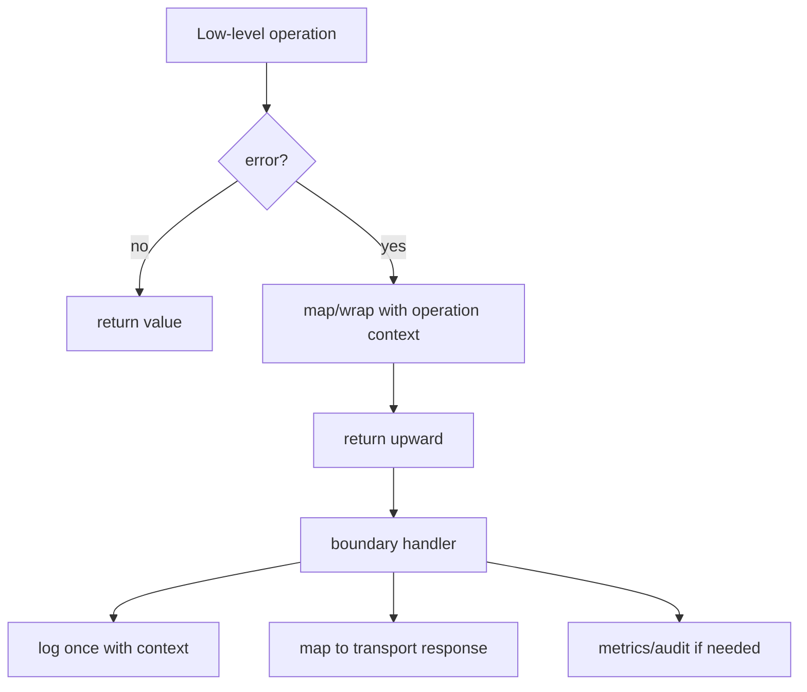
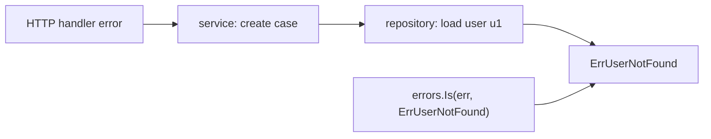

# learn-go-data-model-part-020.md

# Part 020 — Error as Data: Sentinel, Typed Error, Wrapping, Matching

> Seri: `learn-go-data-model`  
> Bagian: `020 / 034`  
> Target pembaca: Java software engineer yang ingin memahami Go data model pada level production engineering  
> Fokus: `error` sebagai interface, data contract, classification, wrapping, matching, observability, dan boundary mapping

---

## 0. Posisi Part Ini dalam Seri

Part 018 dan 019 membahas interface:

```text
part-018:
- interface sebagai structural behavior contract
- method set
- implicit satisfaction
- small interface
- consumer-side interface

part-019:
- interface value runtime
- dynamic type/value
- type assertion
- type switch
- typed nil
- interface equality
```

Sekarang kita masuk ke salah satu interface paling penting di Go:

```go
type error interface {
    Error() string
}
```

Di Go, error bukan exception. Error adalah value.

Ini bukan sekadar slogan. Ini memengaruhi desain API, state machine, transaction boundary, observability, retry, audit trail, HTTP/gRPC mapping, dan reliability.

Untuk Java engineer, transisi mentalnya besar:

```text
Java:
- exception interrupts control flow
- try/catch hierarchy
- checked/unchecked exception debate
- stacktrace as common diagnostic unit

Go:
- error returned explicitly
- caller decides handling at each boundary
- error is data and behavior
- wrapping creates causal chain
- matching uses errors.Is / errors.As
- stacktrace not automatic by default
```

Part ini fokus pada error sebagai data model.

---

## 1. Tujuan Pembelajaran

Setelah part ini, kamu harus bisa:

1. Memahami `error` sebagai interface.
2. Mendesain sentinel error dengan benar.
3. Mendesain typed error dengan benar.
4. Memahami kapan sentinel error tepat dan kapan berbahaya.
5. Memahami kapan typed error tepat.
6. Memakai `fmt.Errorf("%w", err)` untuk wrapping.
7. Memakai `errors.Is` untuk classification.
8. Memakai `errors.As` untuk extraction.
9. Memakai `errors.Join` untuk multiple errors.
10. Menghindari typed nil error.
11. Mendesain error taxonomy untuk domain/application/infrastructure.
12. Memetakan error ke HTTP/gRPC/CLI response.
13. Menentukan kapan error harus di-log, di-wrap, di-redact, atau di-convert.
14. Menghindari string matching.
15. Membuat PR checklist untuk error handling produksi.

---

## 2. Error dalam Satu Kalimat

`error` adalah interface yang punya satu method:

```go
type error interface {
    Error() string
}
```

Any type yang punya method `Error() string` implements `error`.

Contoh:

```go
type ValidationError struct {
    Field string
    Msg   string
}

func (e ValidationError) Error() string {
    return e.Field + ": " + e.Msg
}
```

Use:

```go
func ValidateEmail(email string) error {
    if email == "" {
        return ValidationError{
            Field: "email",
            Msg:   "required",
        }
    }
    return nil
}
```

Error adalah value yang bisa:

```text
- dikembalikan
- dibandingkan
- dibungkus
- diklasifikasi
- diekstrak
- dilog
- dimapping ke transport
```

---

## 3. Error Bukan Exception

Go tidak memakai exception untuk ordinary failure.

Idiomatic Go:

```go
value, err := doSomething()
if err != nil {
    return zero, err
}
```

Java-style exception thinking:

```text
throw deep
catch high
```

Go-style error thinking:

```text
return explicit failure
handle or wrap at boundary
preserve classification
preserve context
avoid surprise control flow
```

Go punya `panic`, tetapi panic bukan error handling umum. Panic untuk programmer bug, impossible state, atau unrecoverable internal invariant violation; bukan untuk normal file not found, validation failed, permission denied, timeout, etc.

---

## 4. Error Return Contract

Common convention:

```go
func Do(ctx context.Context, input Input) (Output, error)
```

Contract yang harus jelas:

```text
if err == nil:
    Output valid

if err != nil:
    Output may be zero or partial unless documented
```

Bad ambiguous API:

```go
func FindUser(id UserID) (*User, error) {
    if notFound {
        return nil, nil
    }
}
```

Caller must guess:

```text
nil user and nil error means what?
```

Better:

```go
func FindUser(id UserID) (User, error) {
    if notFound {
        return User{}, ErrUserNotFound
    }
    return user, nil
}
```

Or:

```go
func FindUser(id UserID) (User, bool, error) {
    if notFound {
        return User{}, false, nil
    }
    return user, true, nil
}
```

Choose based on domain.

---

## 5. Nil Error Rule

No error must be returned as nil interface.

Good:

```go
return nil
```

Bad:

```go
var e *MyError = nil
return e
```

Because `error` is interface; typed nil pointer inside error interface makes `err != nil`.

Example:

```go
type MyError struct{}

func (*MyError) Error() string {
    return "my error"
}

func do() error {
    var e *MyError = nil
    return e
}

func main() {
    err := do()
    fmt.Println(err == nil) // false
}
```

Rule:

```text
Never return typed nil as error.
If no error, return nil directly.
```

---

## 6. Sentinel Error

Sentinel error is a package-level error value used for comparison/classification.

```go
var ErrUserNotFound = errors.New("user not found")
```

Use:

```go
func FindUser(id UserID) (User, error) {
    if missing {
        return User{}, ErrUserNotFound
    }
    return user, nil
}
```

Caller:

```go
u, err := repo.FindUser(ctx, id)
if errors.Is(err, ErrUserNotFound) {
    // handle not found
}
if err != nil {
    return err
}
```

Use `errors.Is`, not `err == ErrUserNotFound`, because error may be wrapped.

---

## 7. Sentinel Error Design

Good sentinel:

```go
var ErrUserNotFound = errors.New("user not found")
var ErrUnauthorized = errors.New("unauthorized")
var ErrConflict = errors.New("conflict")
```

Properties:

```text
- stable identity
- package-level var
- message is human/debug text
- classification is represented by variable identity
```

Do not create sentinel dynamically:

```go
func ErrNotFound() error {
    return errors.New("not found")
}
```

Every call returns a different error value.

Better:

```go
var ErrNotFound = errors.New("not found")
```

---

## 8. Sentinel Error Trade-Off

Pros:

```text
- simple
- easy classification
- works well for common categories
- no custom type needed
```

Cons:

```text
- carries no structured context
- exported sentinel becomes API contract
- too many sentinels create taxonomy mess
- direct equality fails after wrapping unless using errors.Is
```

Use sentinel for stable categories:

```text
not found
already exists
unauthorized
forbidden
conflict
invalid state
timeout/canceled sometimes via context errors
```

Do not create sentinel for every unique message.

---

## 9. Typed Error

Typed error carries structured fields.

```go
type ValidationError struct {
    Field string
    Code  string
    Msg   string
}

func (e ValidationError) Error() string {
    return fmt.Sprintf("%s: %s", e.Field, e.Msg)
}
```

Use:

```go
return ValidationError{
    Field: "email",
    Code:  "required",
    Msg:   "email is required",
}
```

Caller extracts:

```go
var ve ValidationError
if errors.As(err, &ve) {
    fmt.Println(ve.Field, ve.Code)
}
```

If error type has pointer receiver:

```go
type ParseError struct {
    Offset int
    Msg    string
}

func (e *ParseError) Error() string {
    return fmt.Sprintf("offset %d: %s", e.Offset, e.Msg)
}
```

Extract:

```go
var pe *ParseError
if errors.As(err, &pe) {
    fmt.Println(pe.Offset)
}
```

---

## 10. Value Error vs Pointer Error

Value error:

```go
type ValidationError struct {
    Field string
    Msg   string
}

func (e ValidationError) Error() string { ... }
```

Both `ValidationError` and `*ValidationError` implement error.

Pointer error:

```go
type ParseError struct {
    Offset int
    Msg    string
}

func (e *ParseError) Error() string { ... }
```

Only `*ParseError` implements error.

Guideline:

```text
Use value error if small, immutable, and nil is not meaningful.
Use pointer error if large, contains optional fields, or should avoid copy.
Avoid returning typed nil pointer error.
```

For most structured errors, pointer is common, but be disciplined.

---

## 11. Error Message vs Error Type

`Error() string` is for humans/logging/debugging.

Do not parse it.

Bad:

```go
if strings.Contains(err.Error(), "not found") {
    ...
}
```

Better:

```go
if errors.Is(err, ErrNotFound) {
    ...
}
```

or:

```go
var ve *ValidationError
if errors.As(err, &ve) {
    ...
}
```

Error string can change. Error classification should be stable.

---

## 12. Wrapping Error with `%w`

Wrap lower-level error with context:

```go
if err != nil {
    return fmt.Errorf("load user %s: %w", id, err)
}
```

`%w` makes wrapped error discoverable by `errors.Is` and `errors.As`.

Example:

```go
err := fmt.Errorf("load user %s: %w", id, ErrUserNotFound)

fmt.Println(errors.Is(err, ErrUserNotFound)) // true
```

Without `%w`:

```go
err := fmt.Errorf("load user %s: %v", id, ErrUserNotFound)

fmt.Println(errors.Is(err, ErrUserNotFound)) // false
```

Use `%w` for causal wrapping. Use `%v` when intentionally not preserving matching.

---

## 13. Wrap with Context, Not Noise

Bad:

```go
if err != nil {
    return fmt.Errorf("error occurred: %w", err)
}
```

Adds no useful context.

Good:

```go
if err != nil {
    return fmt.Errorf("query user by id %s: %w", id, err)
}
```

Good context answers:

```text
what operation?
which key/resource?
which boundary?
what input category?
```

Avoid leaking sensitive data:

```go
return fmt.Errorf("login failed for password %q: %w", password, err) // bad
```

---

## 14. Error Chain

Wrapping creates chain:

```text
"handle request"
  wraps "load user u1"
    wraps ErrUserNotFound
```

Code:

```go
err := ErrUserNotFound
err = fmt.Errorf("load user %s: %w", id, err)
err = fmt.Errorf("handle create case: %w", err)
```

`errors.Is` traverses chain:

```go
errors.Is(err, ErrUserNotFound) // true
```

`errors.As` traverses chain:

```go
var ve *ValidationError
errors.As(err, &ve)
```

---

## 15. `errors.Is`

Use `errors.Is` for classification.

```go
if errors.Is(err, ErrUserNotFound) {
    return nil
}
```

It checks:

```text
- direct equality where applicable
- Unwrap chain
- custom Is method if implemented
- joined errors
```

Prefer:

```go
errors.Is(err, target)
```

over:

```go
err == target
```

in public/propagated error handling.

---

## 16. `errors.As`

Use `errors.As` to extract typed error.

```go
var ve *ValidationError
if errors.As(err, &ve) {
    fmt.Println(ve.Field)
}
```

Important:

```text
Second argument must be pointer to variable of target type.
```

For value error:

```go
var ve ValidationError
if errors.As(err, &ve) {
    ...
}
```

For pointer error:

```go
var pe *ParseError
if errors.As(err, &pe) {
    ...
}
```

Common mistake:

```go
// errors.As(err, ValidationError{}) // invalid
```

---

## 17. Custom `Is`

A type can define custom matching.

```go
type DomainError struct {
    Code    ErrorCode
    Message string
}

func (e *DomainError) Error() string {
    return e.Message
}

func (e *DomainError) Is(target error) bool {
    t, ok := target.(*DomainError)
    if !ok {
        return false
    }
    return e.Code == t.Code
}
```

Then:

```go
var ErrInvalidState = &DomainError{Code: "invalid_state"}

err := &DomainError{
    Code:    "invalid_state",
    Message: "cannot approve draft case",
}

fmt.Println(errors.Is(err, ErrInvalidState)) // true
```

Use carefully. Custom `Is` changes matching semantics.

---

## 18. Custom `Unwrap`

A custom error can wrap another error:

```go
type OperationError struct {
    Op  string
    Err error
}

func (e *OperationError) Error() string {
    return e.Op + ": " + e.Err.Error()
}

func (e *OperationError) Unwrap() error {
    return e.Err
}
```

Then:

```go
err := &OperationError{
    Op:  "load user",
    Err: ErrUserNotFound,
}

errors.Is(err, ErrUserNotFound) // true
```

Most code can use `fmt.Errorf("%w")`, but custom wrapper is useful when context should be structured.

---

## 19. `errors.Join`

`errors.Join` combines multiple errors.

```go
err := errors.Join(err1, err2, err3)
```

If all args nil, result is nil.

`errors.Is` can match any joined error:

```go
err := errors.Join(ErrInvalidEmail, ErrInvalidName)

errors.Is(err, ErrInvalidEmail) // true
```

Use cases:

```text
- validation with multiple independent failures
- cleanup where multiple resources failed
- batch operation partial failures
```

Avoid using join when order/structure matters deeply; create structured error type instead.

---

## 20. Multi-Validation Error

Example:

```go
var errs []error

if email == "" {
    errs = append(errs, FieldError{Field: "email", Code: "required"})
}
if name == "" {
    errs = append(errs, FieldError{Field: "name", Code: "required"})
}

return errors.Join(errs...)
```

But for API response, structured validation collection may be better:

```go
type ValidationErrors struct {
    Fields []FieldError
}

func (e ValidationErrors) Error() string {
    return fmt.Sprintf("%d validation error(s)", len(e.Fields))
}
```

Then mapping to response is easier.

---

## 21. Error Taxonomy

Production systems need error taxonomy.

Common layers:

```text
Domain errors:
- invalid state
- business rule violation
- not allowed
- invariant violation

Application errors:
- not found
- conflict
- authorization denied
- validation failed
- dependency unavailable

Infrastructure errors:
- DB connection
- timeout
- network failure
- serialization failure
- message broker failure

Transport errors:
- HTTP status mapping
- gRPC status code
- CLI exit code
```

Do not let low-level infrastructure errors leak unclassified to external boundary.

---

## 22. Domain Error Example

```go
type ErrorCode string

const (
    CodeInvalidState ErrorCode = "invalid_state"
    CodeForbidden    ErrorCode = "forbidden"
    CodeConflict     ErrorCode = "conflict"
)

type DomainError struct {
    Code    ErrorCode
    Message string
}

func (e *DomainError) Error() string {
    return e.Message
}

func (e *DomainError) Is(target error) bool {
    t, ok := target.(*DomainError)
    if !ok {
        return false
    }
    return e.Code == t.Code
}

var ErrInvalidState = &DomainError{Code: CodeInvalidState}
var ErrForbidden = &DomainError{Code: CodeForbidden}
var ErrConflict = &DomainError{Code: CodeConflict}
```

Use:

```go
return &DomainError{
    Code:    CodeInvalidState,
    Message: fmt.Sprintf("cannot approve case in status %q", status),
}
```

Classification:

```go
if errors.Is(err, ErrInvalidState) {
    ...
}
```

---

## 23. Validation Error Example

```go
type FieldError struct {
    Field string
    Code  string
    Msg   string
}

func (e FieldError) Error() string {
    return e.Field + ": " + e.Msg
}

type ValidationErrors struct {
    Fields []FieldError
}

func (e ValidationErrors) Error() string {
    return fmt.Sprintf("%d validation error(s)", len(e.Fields))
}

func (e ValidationErrors) Is(target error) bool {
    return target == ErrValidation
}

var ErrValidation = errors.New("validation error")
```

Mapping:

```go
var ves ValidationErrors
if errors.As(err, &ves) {
    // produce 400 with field errors
}
```

Or:

```go
if errors.Is(err, ErrValidation) {
    ...
}
```

Need careful implementation if using both `Is` and `As`.

---

## 24. Repository Error Mapping

Infrastructure:

```go
row := db.QueryRowContext(ctx, query, id)
if err := row.Scan(&...); err != nil {
    if errors.Is(err, sql.ErrNoRows) {
        return User{}, ErrUserNotFound
    }
    return User{}, fmt.Errorf("query user %s: %w", id, err)
}
```

Rule:

```text
Map infrastructure-specific errors at repository boundary.
Do not make application layer know sql.ErrNoRows unless application is DB-specific.
```

This creates clean application contract.

---

## 25. Context Errors

Context package exposes stable errors:

```go
context.Canceled
context.DeadlineExceeded
```

Use:

```go
if errors.Is(err, context.Canceled) {
    ...
}
if errors.Is(err, context.DeadlineExceeded) {
    ...
}
```

Do not wrap and hide cancellation incorrectly.

```go
return fmt.Errorf("call payment service: %w", err)
```

Still allows matching.

At boundary, map:

```text
context.Canceled -> client canceled / appropriate status
context.DeadlineExceeded -> timeout
```

---

## 26. Temporary/Retryable Error

You may need classify retryable errors.

Avoid old-style ad-hoc string matching.

Option 1: interface capability:

```go
type Retryable interface {
    Retryable() bool
}
```

Typed error:

```go
type DependencyError struct {
    Service string
    Err     error
    retryable bool
}

func (e *DependencyError) Error() string {
    return fmt.Sprintf("%s dependency error: %v", e.Service, e.Err)
}

func (e *DependencyError) Unwrap() error {
    return e.Err
}

func (e *DependencyError) Retryable() bool {
    return e.retryable
}
```

Check:

```go
var r Retryable
if errors.As(err, &r) && r.Retryable() {
    ...
}
```

Option 2: code-based taxonomy:

```go
type ErrorCode string
const CodeDependencyUnavailable ErrorCode = "dependency_unavailable"
```

Choose one consistent approach.

---

## 27. Error Logging Rule

Common mistake: log and return at every layer.

Bad:

```go
if err != nil {
    log.Printf("failed to query user: %v", err)
    return err
}
```

Then upper layers also log, producing duplicates.

Better:

```text
- wrap with context at lower/mid layers
- log once at boundary where request/job/message is handled
- include correlation/request ID in log context
```

Example:

```go
if err != nil {
    return fmt.Errorf("query user %s: %w", id, err)
}
```

Boundary:

```go
if err != nil {
    logger.Error("request failed", "error", err, "request_id", reqID)
    writeError(w, err)
    return
}
```

---

## 28. Error Redaction

Error messages may contain sensitive data.

Bad:

```go
return fmt.Errorf("invalid password %q for user %s", password, email)
```

Better:

```go
return fmt.Errorf("invalid credentials for user %s", email)
```

Even email may be sensitive depending domain. For external response, often use generic message.

Separate:

```text
internal error context
external error response
audit/security-safe fields
```

Do not expose raw DB/network errors to API clients.

---

## 29. HTTP Mapping

Example mapper:

```go
func HTTPStatus(err error) int {
    switch {
    case err == nil:
        return http.StatusOK
    case errors.Is(err, ErrValidation):
        return http.StatusBadRequest
    case errors.Is(err, ErrUserNotFound):
        return http.StatusNotFound
    case errors.Is(err, ErrUnauthorized):
        return http.StatusUnauthorized
    case errors.Is(err, ErrForbidden):
        return http.StatusForbidden
    case errors.Is(err, ErrConflict):
        return http.StatusConflict
    case errors.Is(err, context.DeadlineExceeded):
        return http.StatusGatewayTimeout
    default:
        return http.StatusInternalServerError
    }
}
```

External response:

```go
type ErrorResponse struct {
    Code      string       `json:"code"`
    Message   string       `json:"message"`
    Fields    []FieldError `json:"fields,omitempty"`
    RequestID string       `json:"request_id,omitempty"`
}
```

Do not send `err.Error()` blindly for 500.

---

## 30. gRPC Mapping

In gRPC, errors are mapped to status codes.

Conceptual mapping:

```text
validation -> InvalidArgument
not found -> NotFound
conflict -> AlreadyExists / FailedPrecondition / Aborted depending semantics
unauthorized -> Unauthenticated
forbidden -> PermissionDenied
deadline -> DeadlineExceeded
canceled -> Canceled
dependency unavailable -> Unavailable
unknown -> Internal
```

Keep domain/application error taxonomy independent of gRPC package if you want transport neutrality.

Mapper at transport boundary.

---

## 31. CLI Mapping

CLI may map errors to exit codes.

```text
0 success
1 general failure
2 invalid usage
3 not found
4 permission denied
```

But avoid overcomplicating unless CLI contract requires it.

CLI output:

```text
stderr: human-readable error
exit code: machine-readable coarse status
```

---

## 32. Error and Observability

Good error carries classification and context.

Observability should include:

```text
- operation
- error class/code
- resource ID if safe
- correlation/request ID
- retryable?
- dependency name
- latency
```

But error itself should not become a logging framework.

Pattern:

```go
logger.Error("operation failed",
    "op", "CreateCase",
    "case_id", caseID,
    "error", err,
)
```

Typed errors can expose fields for metrics:

```go
var de *DependencyError
if errors.As(err, &de) {
    metrics.Count("dependency_error", "service", de.Service)
}
```

---

## 33. Error and Audit

Do not equate operational error with audit event.

Example:

```text
authorization denied
```

May be both:

```text
- returned error to caller
- audit event for denied access
```

Design:

```go
decision, err := authorizer.Decide(ctx, req)
if err != nil {
    return fmt.Errorf("authorize request: %w", err)
}
if decision == DecisionDeny {
    audit.RecordDenied(req)
    return ErrForbidden
}
```

Audit should record structured facts, not only `err.Error()`.

---

## 34. Error and Transactions

Within transaction:

```go
err := tx.Do(ctx, func(ctx context.Context) error {
    if err := repo.Save(ctx, entity); err != nil {
        return fmt.Errorf("save entity: %w", err)
    }
    if err := outbox.Add(ctx, event); err != nil {
        return fmt.Errorf("add outbox event: %w", err)
    }
    return nil
})
if err != nil {
    return fmt.Errorf("create case transaction: %w", err)
}
```

Do not swallow root cause.

But do not expose transaction/internal details to external clients. Map at boundary.

---

## 35. Error and Cleanup

Cleanup can fail.

```go
func Use() (err error) {
    f, err := os.Open("file")
    if err != nil {
        return err
    }
    defer func() {
        cerr := f.Close()
        if cerr != nil {
            err = errors.Join(err, fmt.Errorf("close file: %w", cerr))
        }
    }()

    return process(f)
}
```

`errors.Join` helps preserve both process and close errors.

Use with care; named return plus defer can be tricky. Keep readable.

---

## 36. Panic vs Error

Use error for expected operational failure:

```text
- invalid input
- not found
- permission denied
- timeout
- dependency unavailable
- parse failure
```

Use panic for:

```text
- programmer bug
- impossible invariant violation
- corrupted internal state
- misuse of API where recovery is not meaningful
```

Example:

```go
func MustParseTemplate(s string) Template {
    t, err := ParseTemplate(s)
    if err != nil {
        panic(err)
    }
    return t
}
```

`Must` functions are acceptable for initialization/tests when failure indicates programmer/config bug.

---

## 37. Error Message Style

Go error strings conventionally:

```text
- lowercase
- no trailing punctuation
- concise
```

Example:

```go
return errors.New("user not found")
```

Not:

```go
return errors.New("User not found.")
```

When wrapping:

```go
return fmt.Errorf("load user %s: %w", id, err)
```

The final error chain reads naturally:

```text
handle request: load user u1: user not found
```

---

## 38. Error Package Boundary

If package exports error sentinel/type, it becomes API.

```go
var ErrNotFound = errors.New("not found")
```

Consumers may depend on it.

Think before exporting:

```text
Is this classification stable?
Do we want callers to branch on it?
Can we support it long-term?
```

Unexported internal sentinel can be mapped to exported application error.

---

## 39. Error as Data Model

Error data can have fields:

```go
type AppError struct {
    Code      ErrorCode
    Message   string
    Operation string
    Resource  string
    Cause     error
}

func (e *AppError) Error() string {
    if e.Operation == "" {
        return e.Message
    }
    return e.Operation + ": " + e.Message
}

func (e *AppError) Unwrap() error {
    return e.Cause
}
```

Be careful not to create mega-error type that every package abuses.

Good error model balances:

```text
- structured enough for classification
- simple enough to use
- stable at boundaries
- not coupled to transport too early
```

---

## 40. Mermaid: Error Handling Flow



---

## 41. Mermaid: Error Chain



---

## 42. Mini Lab 1 — Sentinel and Wrapping

```go
var ErrNotFound = errors.New("not found")

func load() error {
    return fmt.Errorf("load user: %w", ErrNotFound)
}

func main() {
    err := load()
    fmt.Println(err == ErrNotFound)
    fmt.Println(errors.Is(err, ErrNotFound))
}
```

Output:

```text
false
true
```

---

## 43. Mini Lab 2 — `%v` vs `%w`

```go
err1 := fmt.Errorf("load: %w", ErrNotFound)
err2 := fmt.Errorf("load: %v", ErrNotFound)

fmt.Println(errors.Is(err1, ErrNotFound))
fmt.Println(errors.Is(err2, ErrNotFound))
```

Output:

```text
true
false
```

---

## 44. Mini Lab 3 — Typed Error with `errors.As`

```go
type FieldError struct {
    Field string
}

func (e FieldError) Error() string {
    return e.Field + " invalid"
}

func validate() error {
    return fmt.Errorf("validate request: %w", FieldError{Field: "email"})
}

func main() {
    err := validate()

    var fe FieldError
    if errors.As(err, &fe) {
        fmt.Println(fe.Field)
    }
}
```

Output:

```text
email
```

---

## 45. Mini Lab 4 — Typed Nil Error

```go
type MyError struct{}

func (*MyError) Error() string {
    return "my error"
}

func do() error {
    var e *MyError = nil
    return e
}

func main() {
    err := do()
    fmt.Println(err == nil)
}
```

Output:

```text
false
```

Fix:

```go
func do() error {
    var e *MyError = nil
    if e == nil {
        return nil
    }
    return e
}
```

---

## 46. Mini Lab 5 — `errors.Join`

```go
var ErrEmail = errors.New("invalid email")
var ErrName = errors.New("invalid name")

err := errors.Join(ErrEmail, ErrName)

fmt.Println(errors.Is(err, ErrEmail))
fmt.Println(errors.Is(err, ErrName))
```

Output:

```text
true
true
```

---

## 47. Mini Lab 6 — Mapping Error to HTTP

```go
func status(err error) int {
    switch {
    case err == nil:
        return http.StatusOK
    case errors.Is(err, ErrNotFound):
        return http.StatusNotFound
    case errors.Is(err, ErrValidation):
        return http.StatusBadRequest
    default:
        return http.StatusInternalServerError
    }
}
```

Lesson:

```text
Transport mapping should use error classification, not string matching.
```

---

## 48. Common Anti-Patterns

### 48.1 String matching

```go
strings.Contains(err.Error(), "not found")
```

### 48.2 Losing cause

```go
return fmt.Errorf("load user failed")
```

without wrapping original err.

### 48.3 Wrapping with `%v` when `%w` needed

Breaks `errors.Is/As`.

### 48.4 Log and return everywhere

Creates duplicate noisy logs.

### 48.5 Exposing raw internal error to client

Leaks implementation/security details.

### 48.6 Returning typed nil error

Classic interface nil trap.

### 48.7 `(nil, nil)` ambiguity

Caller cannot distinguish not found vs success.

### 48.8 Creating too many sentinel errors

Unmaintainable taxonomy.

### 48.9 One mega error type for everything

All layers coupled to same abstraction.

### 48.10 Panic for ordinary failures

Breaks explicit control flow.

---

## 49. Production Guidelines

### 49.1 Treat Error as Contract

If callers branch on it, it is API.

### 49.2 Use `errors.Is` for Category

Sentinel/classification.

### 49.3 Use `errors.As` for Data

Typed structured error extraction.

### 49.4 Wrap with Operation Context

```go
return fmt.Errorf("save case %s: %w", id, err)
```

### 49.5 Map at Boundaries

DB errors to repository/application errors. Application errors to HTTP/gRPC/CLI.

### 49.6 Log Once

Usually at request/job/message boundary.

### 49.7 Redact Sensitive Data

Error string may reach logs/clients.

### 49.8 Test Error Matching

Do not only test string.

### 49.9 Avoid Typed Nil

Return `nil` directly.

### 49.10 Prefer Structured Validation Errors

Especially for API responses.

---

## 50. PR Review Checklist

### 50.1 Return Contract

```text
[ ] If err == nil, are other return values valid?
[ ] If err != nil, are other return values documented if partial?
[ ] Any nil, nil ambiguity?
[ ] Any typed nil error risk?
```

### 50.2 Classification

```text
[ ] Does caller need to branch on this error?
[ ] Is sentinel/type/code stable?
[ ] Are errors.Is/errors.As supported?
[ ] Is string matching avoided?
```

### 50.3 Wrapping

```text
[ ] Is lower-level error preserved with %w?
[ ] Is wrapping context useful?
[ ] Does wrapping leak sensitive input?
[ ] Is %v used intentionally?
```

### 50.4 Boundary Mapping

```text
[ ] Infrastructure errors mapped at boundary?
[ ] HTTP/gRPC/CLI mapping uses classification?
[ ] External message safe?
[ ] Internal logs preserve context?
```

### 50.5 Logging/Observability

```text
[ ] Error not logged repeatedly at every layer?
[ ] Boundary logs once with correlation ID?
[ ] Metrics can classify error?
[ ] Audit event separate from error string?
```

### 50.6 Validation

```text
[ ] Multiple validation failures represented clearly?
[ ] Field errors structured?
[ ] errors.Join vs ValidationErrors chosen deliberately?
```

### 50.7 Retry/Timeout

```text
[ ] Retryable classification explicit?
[ ] context.Canceled/DeadlineExceeded preserved?
[ ] Dependency unavailable mapped correctly?
```

### 50.8 Panic

```text
[ ] Panic not used for ordinary operational failure?
[ ] Must function panic acceptable?
[ ] Invariant panic has clear reason?
```

---

## 51. Ringkasan Mental Model

Error di Go adalah data.

```text
error = interface { Error() string }
```

Tetapi production error design membutuhkan lebih dari string:

```text
- category
- context
- cause
- structured fields
- boundary mapping
- observability behavior
```

Core tools:

```text
errors.New      -> simple sentinel/string error
fmt.Errorf %w   -> wrapping
errors.Is       -> classification matching
errors.As       -> typed extraction
errors.Join     -> multiple errors
Unwrap          -> custom causal chain
Is              -> custom matching
```

Untuk Java engineer:

```text
Jangan mencari hierarchy exception besar.
Desain error sebagai explicit return value dengan classification yang stabil dan context yang cukup.
```

Error handling Go yang baik bukan banyak `if err != nil` secara buta. Yang penting adalah:

```text
handle here, wrap here, classify here, map here, or log once at boundary.
```

---

## 52. Apa yang Tidak Dibahas di Part Ini

Part berikutnya akan masuk generics:

```text
part-021 — Generics I: Type Parameters, Constraints, Approximation, Type Sets
```

Kita akan membahas:

```text
- type parameter
- constraint interface
- any
- comparable
- type set
- ~T approximation
- union constraint
- generic function/type
- when not to use generics
```

---

## 53. Referensi Resmi

- Go Language Specification — Error interface, method sets, interface values  
  https://go.dev/ref/spec
- Package `errors`  
  https://pkg.go.dev/errors
- Package `fmt` — Errorf and `%w`  
  https://pkg.go.dev/fmt
- Go Blog — Errors are values  
  https://go.dev/blog/errors-are-values
- Go Blog — Working with Errors in Go 1.13  
  https://go.dev/blog/go1.13-errors
- Go 1.20 Release Notes — `errors.Join`  
  https://go.dev/doc/go1.20
- Package `context`  
  https://pkg.go.dev/context
- Package `database/sql`  
  https://pkg.go.dev/database/sql
- Go 1.26 Release Notes  
  https://go.dev/doc/go1.26

---

## 54. Status Seri

Selesai:

```text
part-000  Orientation
part-001  Type system core
part-002  Zero value and invariants
part-003  Constants and iota
part-004  Numeric foundations
part-005  Numeric correctness
part-006  Text model I
part-007  Text model II
part-008  Array
part-009  Slice I
part-010  Slice II
part-011  Map I
part-012  Map II
part-013  Struct I
part-014  Struct II
part-015  Struct III
part-016  Pointer
part-017  Nil
part-018  Interface I
part-019  Interface II
part-020  Error as Data
```

Berikutnya:

```text
part-021  Generics I: Type Parameters, Constraints, Approximation, Type Sets
```

Seri belum selesai. Masih ada part 021 sampai part 034.

<!-- NAVIGATION_FOOTER -->
<div class="page-nav">
<a href="./learn-go-data-model-part-019.md">⬅️ Part 019 — Interface II: Runtime Representation, Boxing, Type Assertion, Type Switch</a>
<a href="./index.md">📚 Kategori</a>
<a href="../../index.md">🏠 Home</a>
<a href="./learn-go-data-model-part-021.md">Part 021 — Generics I: Type Parameters, Constraints, Approximation, Type Sets ➡️</a>
</div>
