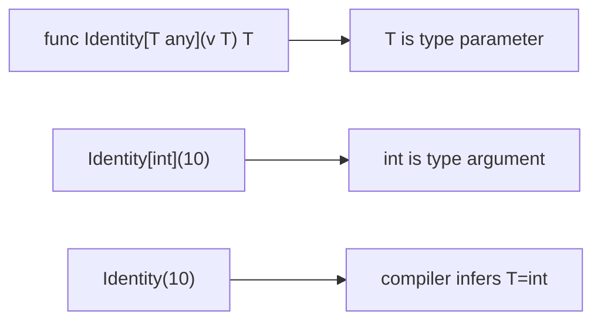
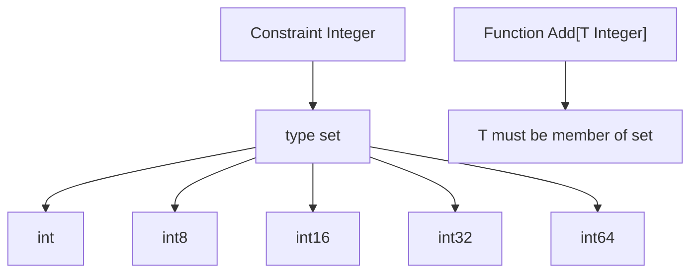
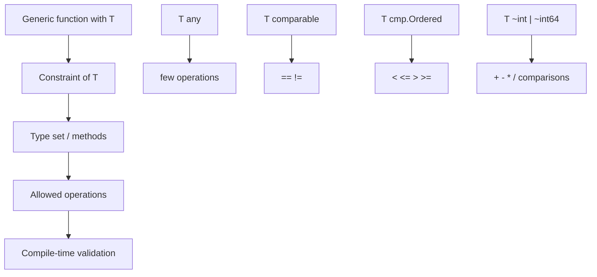
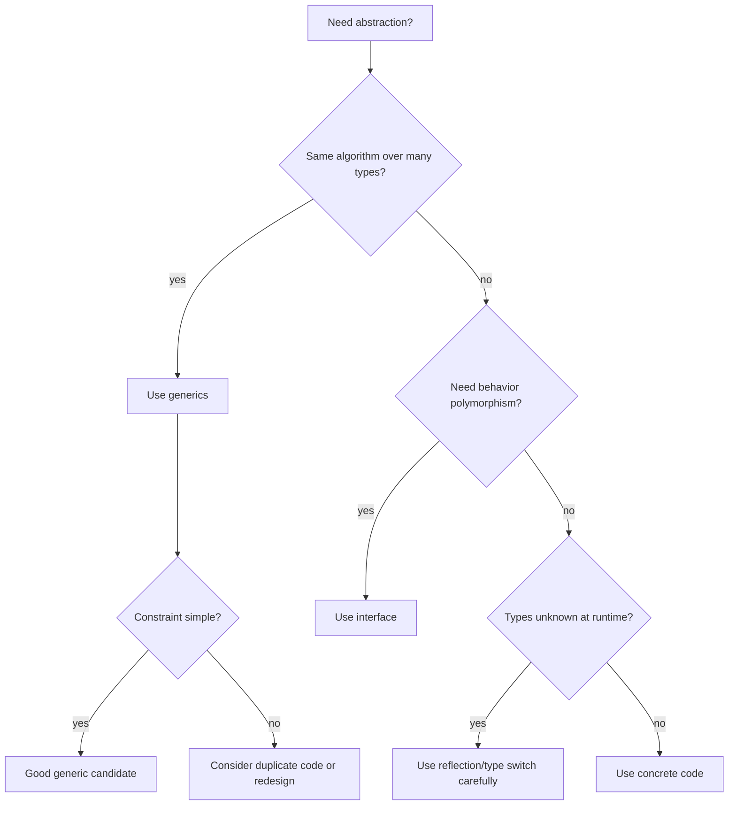

# learn-go-data-model-part-021.md

# Part 021 — Generics I: Type Parameters, Constraints, Approximation, Type Sets

> Seri: `learn-go-data-model`  
> Bagian: `021 / 034`  
> Target pembaca: Java software engineer yang ingin memahami Go data model pada level production engineering  
> Fokus: type parameter, constraint, type set, `any`, `comparable`, union constraint, `~T`, dan kapan generics tidak perlu

---

## 0. Posisi Part Ini dalam Seri

Kita sudah membahas:

```text
part-018: interface sebagai behavioral contract
part-019: interface runtime, boxing, assertion, type switch
part-020: error sebagai interface/data contract
```

Sekarang kita masuk ke generics.

Go generics diperkenalkan di Go 1.18 dan terus berkembang. Pada Go 1.26, generics mendapatkan kelonggaran penting: constraint boleh merujuk ke generic type yang sedang dibatasi pada type parameter list, sehingga pola recursive/self-referential generic constraint tertentu menjadi valid.

Namun inti generics Go tetap sederhana:

```text
Generics memungkinkan function/type ditulis dengan type parameter,
dengan constraint yang menentukan operasi apa yang legal pada type parameter tersebut.
```

Untuk Java engineer, jangan membawa semua intuisi Java generics secara mentah.

Java generics:

```text
- mostly nominal class/interface hierarchy
- type erasure
- wildcard variance (? extends, ? super)
- class-heavy collection APIs
```

Go generics:

```text
- type parameter dengan constraint interface
- constraint mendeskripsikan set of types
- type sets, union, approximation ~T
- no wildcard variance
- no generic methods before Go 1.27; in Go 1.26 methods cannot declare their own type parameters
- works with structural type system
```

Part ini fokus pada konsep dasar dan mental model. Part 022 akan fokus ke generic collections, algorithms, zero value, dan API design.

---

## 1. Tujuan Pembelajaran

Setelah part ini, kamu harus bisa:

1. Menjelaskan apa itu type parameter.
2. Menjelaskan apa itu type argument.
3. Menulis generic function sederhana.
4. Menulis generic type sederhana.
5. Memahami constraint sebagai interface.
6. Memahami `any`.
7. Memahami `comparable`.
8. Memahami type set.
9. Memahami union constraint.
10. Memahami approximation `~T`.
11. Memahami underlying type dalam constraint.
12. Menjelaskan kapan operasi pada type parameter legal.
13. Menjelaskan beda interface biasa dan constraint interface.
14. Menghindari overuse generics.
15. Membandingkan generics, interface, code generation, dan duplicate code.
16. Membuat checklist PR untuk generics.

---

## 2. Generics dalam Satu Kalimat

Generics memungkinkan kita menulis function/type yang bekerja untuk banyak type dengan tetap menjaga static type safety.

Contoh non-generic:

```go
func ContainsString(values []string, target string) bool {
    for _, v := range values {
        if v == target {
            return true
        }
    }
    return false
}

func ContainsInt(values []int, target int) bool {
    for _, v := range values {
        if v == target {
            return true
        }
    }
    return false
}
```

Generic:

```go
func Contains[T comparable](values []T, target T) bool {
    for _, v := range values {
        if v == target {
            return true
        }
    }
    return false
}
```

Use:

```go
Contains([]string{"a", "b"}, "a")
Contains([]int{1, 2, 3}, 2)
```

`T` adalah type parameter. `comparable` adalah constraint.

---

## 3. Type Parameter dan Type Argument

Type parameter:

```go
func Identity[T any](v T) T {
    return v
}
```

`T` adalah placeholder type.

Type argument adalah type konkret yang dipakai saat instantiation.

```go
Identity[int](10)
Identity[string]("hello")
```

Sering type argument bisa diinfer oleh compiler:

```go
Identity(10)      // T inferred as int
Identity("hello") // T inferred as string
```

Mental model:

```text
Type parameter:
- declared by generic function/type
- acts like a type variable

Type argument:
- actual type used when calling/instantiating
```

Diagram:



---

## 4. Generic Function

Basic form:

```go
func Name[T Constraint](arg T) T {
    return arg
}
```

Multiple type parameters:

```go
func Pair[A any, B any](a A, b B) (A, B) {
    return a, b
}
```

Example map transformation:

```go
func MapSlice[A any, B any](values []A, f func(A) B) []B {
    out := make([]B, 0, len(values))
    for _, v := range values {
        out = append(out, f(v))
    }
    return out
}
```

Use:

```go
lengths := MapSlice([]string{"go", "java"}, func(s string) int {
    return len(s)
})
```

---

## 5. Generic Type

Generic struct:

```go
type Box[T any] struct {
    value T
}

func NewBox[T any](v T) Box[T] {
    return Box[T]{value: v}
}

func (b Box[T]) Value() T {
    return b.value
}
```

Use:

```go
b := NewBox("hello")
fmt.Println(b.Value())
```

Generic map-like type:

```go
type Set[T comparable] map[T]struct{}
```

Use:

```go
s := Set[string]{}
s["go"] = struct{}{}
```

Method on generic type uses receiver's type parameters:

```go
func (s Set[T]) Contains(v T) bool {
    _, ok := s[v]
    return ok
}
```

In Go 1.26, methods cannot declare independent type parameters of their own. The method can use type parameters declared by the receiver type, but cannot introduce a new `[U any]` on the method itself.

---

## 6. Constraint

Constraint defines what types can be used as type arguments and what operations are allowed.

```go
func Equal[T comparable](a, b T) bool {
    return a == b
}
```

`comparable` constraint allows `==` and `!=`.

If constraint is `any`:

```go
func EqualBad[T any](a, b T) bool {
    // return a == b // compile error
    return false
}
```

Because not all types are comparable.

This is key:

```text
Operations allowed on T are determined by the constraint.
```

---

## 7. `any`

`any` is alias for `interface{}`.

```go
func Identity[T any](v T) T {
    return v
}
```

Constraint `any` means any type is allowed.

But because any type is allowed, you can do very little with `T`:

```go
func Use[T any](v T) {
    fmt.Println(v) // ok because fmt accepts any
    // _ = v == v  // invalid
    // _ = v + v   // invalid
}
```

Allowed operations for unconstrained `T` are limited:

```text
- assign/pass/return
- take address of variable
- use as any/interface argument
- store in containers
```

Not allowed unless constraint permits:

```text
- ==
- <
- +
- indexing
- field access
- method call
```

---

## 8. `comparable`

`comparable` is predeclared constraint for types that support `==` and `!=`.

```go
func IndexOf[T comparable](values []T, target T) int {
    for i, v := range values {
        if v == target {
            return i
        }
    }
    return -1
}
```

Useful for:

```text
- map keys
- set elements
- equality search
- deduplication
```

Example generic set:

```go
type Set[T comparable] map[T]struct{}

func (s Set[T]) Add(v T) {
    s[v] = struct{}{}
}

func (s Set[T]) Contains(v T) bool {
    _, ok := s[v]
    return ok
}
```

Why comparable?

```go
type Set[T any] map[T]struct{} // invalid: map key must be comparable
```

---

## 9. Custom Constraint Interface

Constraint can be interface:

```go
type Stringer interface {
    String() string
}

func PrintString[T Stringer](v T) {
    fmt.Println(v.String())
}
```

This looks like ordinary interface constraint: type argument must have `String() string`.

Use:

```go
type UserID string

func (id UserID) String() string {
    return string(id)
}

PrintString(UserID("u1"))
```

Constraint interface can specify methods, type sets, or both.

---

## 10. Type Set Mental Model

A constraint describes a set of permitted types.

```go
type Integer interface {
    int | int8 | int16 | int32 | int64
}
```

This means `T` can be one of these types.

```go
func Add[T Integer](a, b T) T {
    return a + b
}
```

Because every type in the set supports `+`, `+` is allowed.

Mental model:



Important:

```text
A constraint is not just a runtime interface.
For generics, interface can describe sets of types.
```

---

## 11. Union Constraint

Union uses `|`.

```go
type SignedInteger interface {
    int | int8 | int16 | int32 | int64
}
```

Unsigned:

```go
type UnsignedInteger interface {
    uint | uint8 | uint16 | uint32 | uint64 | uintptr
}
```

Float:

```go
type Float interface {
    float32 | float64
}
```

Combined:

```go
type Number interface {
    SignedInteger | UnsignedInteger | Float
}
```

Use:

```go
func Sum[T Number](values []T) T {
    var total T
    for _, v := range values {
        total += v
    }
    return total
}
```

---

## 12. Approximation `~T`

`~T` means all types whose underlying type is `T`.

Example:

```go
type StringLike interface {
    ~string
}
```

This includes:

```go
string
type UserID string
type Email string
```

Without `~`:

```go
type OnlyString interface {
    string
}
```

This includes exactly `string`, not defined types with underlying string.

Example:

```go
type UserID string

func JoinStrict[T string](a, b T) T {
    return a + b
}

// JoinStrict(UserID("u"), UserID("1")) // does not compile
```

With approximation:

```go
func JoinLike[T ~string](a, b T) T {
    return a + b
}

id := JoinLike(UserID("u"), UserID("1")) // T = UserID
```

Result type preserved as `UserID`.

---

## 13. Why `~` Matters for Domain Types

Suppose:

```go
type UserID string
type CaseID string
```

If helper constraint is `string`, it excludes domain types.

```go
func IsEmpty[T string](v T) bool {
    return v == ""
}
```

Only accepts `string`.

Better:

```go
func IsEmptyStringLike[T ~string](v T) bool {
    return v == ""
}
```

Accepts `UserID`, `CaseID`, `Email`, etc.

But be careful: accepting all string-like types can be too broad. Sometimes you want domain-specific methods instead.

---

## 14. Constraint with Methods and Type Sets

Constraint can combine type terms and methods.

Example:

```go
type StringLikeWithValidate interface {
    ~string
    Validate() error
}
```

This means permitted type must:

```text
- have underlying type string
- have method Validate() error
```

Use cases are advanced and should be kept readable.

Another common pattern:

```go
type OrderedStringer interface {
    ~string
    String() string
}
```

But ask:

```text
Is this constraint truly useful?
Or am I over-modeling?
```

Complex constraints can become harder than duplicated code.

---

## 15. Operations on Type Parameters

Allowed operation must be valid for every type in the constraint type set.

Example:

```go
type IntOrString interface {
    int | string
}

func Add[T IntOrString](a, b T) T {
    return a + b
}
```

Valid because both int and string support `+`.

But:

```go
func Less[T IntOrString](a, b T) bool {
    return a < b
}
```

Valid because both int and string support `<`.

Now:

```go
type IntOrBool interface {
    int | bool
}

func AddBad[T IntOrBool](a, b T) T {
    // return a + b // invalid: bool does not support +
    var zero T
    return zero
}
```

Compiler enforces operation across all possible type arguments.

---

## 16. Field Access on Type Parameters

Even if all types in a constraint have same field, Go does not generally allow field access through type parameter unless constraint is structured in supported ways. Do not design generics around structural field access like TypeScript.

Bad expectation:

```go
type HasID interface {
    // not field constraint
}

func GetID[T HasID](v T) string {
    // return v.ID // not how Go constraints work
    return ""
}
```

Use method:

```go
type HasID interface {
    ID() string
}

func GetID[T HasID](v T) string {
    return v.ID()
}
```

Go generics are not a general “duck-type fields” system. Use methods for behavior.

---

## 17. Indexing and Composite Constraints

If constraint guarantees slice-like type, indexing can work.

```go
type SliceOf[E any] interface {
    ~[]E
}

func First[S SliceOf[E], E any](s S) (E, bool) {
    if len(s) == 0 {
        var zero E
        return zero, false
    }
    return s[0], true
}
```

This preserves defined slice type:

```go
type UserIDs []UserID

first, ok := First(UserIDs{"u1", "u2"})
```

This style is more advanced. Use when preserving defined slice type matters.

For simple code:

```go
func First[T any](s []T) (T, bool)
```

is often enough.

---

## 18. Deconstructing Type Parameters

Sometimes you want to preserve the input container type.

Simple:

```go
func Clone[T any](s []T) []T {
    return append([]T(nil), s...)
}
```

For defined slice type:

```go
type UserIDs []UserID
```

`Clone(UserIDs{})` returns `[]UserID`, not `UserIDs`, if function accepts `[]T`.

If you want preserve slice type:

```go
func CloneSlice[S ~[]E, E any](s S) S {
    return append(S(nil), s...)
}
```

Use:

```go
type UserIDs []UserID

ids := UserIDs{"u1"}
cloned := CloneSlice(ids) // type UserIDs
```

This is powerful but more complex. Use only when preserving type is important.

---

## 19. Type Inference

Compiler can infer type arguments from function arguments.

```go
func Max[T Ordered](a, b T) T {
    if a < b {
        return b
    }
    return a
}

Max(1, 2)         // T=int
Max("a", "b")     // T=string
```

Sometimes inference fails:

```go
func Zero[T any]() T {
    var zero T
    return zero
}

// Zero() // cannot infer T
Zero[int]()
```

If type parameter appears only in return type, caller must specify it.

---

## 20. Generic Type Instantiation

Generic type requires type argument unless inferred by constructor function.

```go
type Box[T any] struct {
    Value T
}

b := Box[int]{Value: 1}
```

Constructor can infer:

```go
func NewBox[T any](v T) Box[T] {
    return Box[T]{Value: v}
}

b := NewBox(1) // Box[int]
```

This is one reason generic constructors are useful.

---

## 21. Constraint Interface vs Ordinary Interface

Same syntax, different use.

Ordinary interface as value type:

```go
type Reader interface {
    Read([]byte) (int, error)
}

var r Reader
```

Constraint interface with type set:

```go
type Integer interface {
    ~int | ~int64
}
```

Can `Integer` be used as ordinary variable type?

No, interfaces that contain type terms are constraints only, not ordinary value interfaces.

```go
// var x Integer // invalid if Integer contains type terms
```

Mental model:

```text
Method-only interface:
- can be used as value type
- can be used as constraint

Type-set interface:
- used as constraint
- not used as ordinary runtime interface value
```

---

## 22. `constraints` Package?

The standard library does not provide a broad `constraints` package in the main standard library like some external packages historically did. The `cmp` package provides `Ordered` for ordered types in modern Go.

Example:

```go
import "cmp"

func Max[T cmp.Ordered](a, b T) T {
    if a < b {
        return b
    }
    return a
}
```

Use standard packages where available rather than redefining common constraints everywhere.

For custom domain constraints, keep them local and minimal.

---

## 23. Ordered Constraint

Ordered types support `<`, `<=`, `>`, `>=`.

Using `cmp.Ordered`:

```go
func Min[T cmp.Ordered](a, b T) T {
    if a < b {
        return a
    }
    return b
}
```

Use for:

```text
- min/max
- sorting helpers
- clamp
- binary search helpers
```

But be careful with floats:

```text
NaN breaks intuitive ordering.
```

Generic ordered algorithms over floats should document NaN behavior.

---

## 24. Generic Type Alias

Go supports generic type aliases in modern versions.

Example:

```go
type Set[T comparable] = map[T]struct{}
```

Alias means this is exactly the same type as `map[T]struct{}`.

Defined type:

```go
type Set[T comparable] map[T]struct{}
```

Defined type can have methods.

```go
func (s Set[T]) Contains(v T) bool {
    _, ok := s[v]
    return ok
}
```

Choose alias when you only want alternate spelling. Choose defined type when you want domain/method distinction.

---

## 25. Go 1.26 Recursive Generic Constraint Improvement

Go 1.26 lifts a restriction around generic types referring to themselves in type parameter lists. This enables patterns where a generic type's constraint refers to the generic type being constrained.

Conceptual example:

```go
type Adder[A Adder[A]] interface {
    Add(A) A
}

func AddTwo[A Adder[A]](x, y A) A {
    return x.Add(y)
}
```

This kind of pattern is advanced. It can model self-like operations where a type can add another value of same type.

Use carefully. Do not introduce recursive generic constraints in ordinary code unless they clearly simplify a real abstraction.

---

## 26. Generic Methods Limitation in Go 1.26

In Go 1.26, methods may use receiver type parameters, but methods cannot declare their own independent type parameter list.

Allowed:

```go
type Box[T any] struct {
    value T
}

func (b Box[T]) Value() T {
    return b.value
}
```

Not allowed in Go 1.26:

```go
// func (b Box[T]) Map[U any](f func(T) U) Box[U] { ... }
```

Workaround: use top-level generic function.

```go
func MapBox[T any, U any](b Box[T], f func(T) U) Box[U] {
    return Box[U]{value: f(b.value)}
}
```

This is an important difference from Java/C# style generic instance methods.

---

## 27. When Generics Are Useful

Generics are useful for:

```text
- type-safe containers
- algorithms over slices/maps
- eliminating duplicate logic across types
- preserving concrete types
- constraints over operators like ==, <, +
- libraries where caller types vary
```

Examples:

```go
Contains[T comparable]
Clone[S ~[]E, E any]
Set[T comparable]
Min[T cmp.Ordered]
MapSlice[A, B any]
```

---

## 28. When Generics Are Not Useful

Avoid generics when:

```text
- only one concrete type exists
- behavior is better represented by interface method
- type parameter only appears once
- constraint becomes more complex than duplicated code
- code becomes harder to read
- runtime dynamic behavior is truly needed
- you are trying to model class inheritance
```

Bad:

```go
func Save[T any](db *sql.DB, v T) error
```

If function immediately uses reflection/type switch internally, generic may not help.

Bad:

```go
type Service[T any] struct {
    repo T
}
```

If `T` is always one repository type and no generic behavior exists.

---

## 29. Type Parameter Appears Only Once Smell

If type parameter appears only once in function signature, it may be unnecessary.

Suspicious:

```go
func Log[T any](v T) {
    fmt.Println(v)
}
```

Equivalent:

```go
func Log(v any) {
    fmt.Println(v)
}
```

Generics add value when they relate types:

```go
func Map[A any, B any](values []A, f func(A) B) []B
```

Here `A` connects input slice and function input; `B` connects function output and result slice.

---

## 30. Interface vs Generics

Use interface when you need behavior:

```go
type Reader interface {
    Read([]byte) (int, error)
}

func CopyAll(r Reader) ([]byte, error)
```

Use generics when you need same algorithm over many concrete types:

```go
func Contains[T comparable](values []T, target T) bool
```

Use both when appropriate:

```go
type Stringer interface {
    String() string
}

func ToStrings[T Stringer](values []T) []string {
    out := make([]string, 0, len(values))
    for _, v := range values {
        out = append(out, v.String())
    }
    return out
}
```

---

## 31. Generics vs Code Generation

Before generics, Go often used:

```text
- duplicate code
- interface{}
- code generation
```

Generics reduce need for these in common cases.

Still use code generation when:

```text
- generated code must be highly optimized/specialized
- serialization/mapping boilerplate
- protocol/schema-driven code
- reflection avoidance for known schemas
```

Do not use generics to replace all codegen.

---

## 32. Generics vs Reflection

Reflection:

```text
runtime type inspection
works for unknown types
less type-safe
can be slower/panic-prone
```

Generics:

```text
compile-time type abstraction
type-safe
constraints define operations
does not inspect arbitrary fields/tags
```

If you need struct tags, generics alone does not help. You need reflection or code generation.

If you need `Contains` for any comparable type, generics is ideal.

---

## 33. Generics and Zero Value

Generic code often needs zero value:

```go
func First[T any](values []T) (T, bool) {
    if len(values) == 0 {
        var zero T
        return zero, false
    }
    return values[0], true
}
```

This is idiomatic.

Do not return zero alone if absence matters:

```go
func FirstBad[T any](values []T) T {
    if len(values) == 0 {
        var zero T
        return zero
    }
    return values[0]
}
```

Zero value ambiguity applies to generics too. Return `(T, bool)` or `(T, error)`.

---

## 34. Generics and Nil

You cannot generally compare `T` to nil.

```go
func IsNil[T any](v T) bool {
    // return v == nil // invalid
    return false
}
```

Because `T` might be `int`.

Use concrete nil-able type parameter shape:

```go
func IsNilPointer[T any](p *T) bool {
    return p == nil
}

func IsNilSlice[T any](s []T) bool {
    return s == nil
}
```

Avoid generic nil abstraction unless necessary.

---

## 35. Generic Constraint Design

Good constraint:

```go
type Number interface {
    ~int | ~int64 | ~float64
}
```

If used by multiple functions.

Bad constraint kingdom:

```go
type Entity[T any] interface {
    ID() T
    Validate() error
    Save() error
    Delete() error
}
```

Likely overdesigned.

Constraint guidelines:

```text
- keep local if used once
- name only if reused or meaningful
- prefer standard constraints/packages
- avoid large behavioral constraints
- constrain operations you actually need
```

---

## 36. Generic API Compatibility

Changing constraints can be breaking.

Example:

```go
func Do[T any](v T)
```

Changing to:

```go
func Do[T comparable](v T)
```

Breaks callers using non-comparable types.

Changing return type from `[]T` to `S` or vice versa can break.

Generic APIs need compatibility thinking just like ordinary public APIs.

---

## 37. Generic Constraint and Underlying Type

Suppose:

```go
type MyInt int
```

Constraint:

```go
type IntOnly interface {
    int
}
```

Does `MyInt` satisfy?

```text
No.
```

Constraint:

```go
type IntLike interface {
    ~int
}
```

Does `MyInt` satisfy?

```text
Yes, because underlying type is int.
```

This is central to Go generics.

---

## 38. Generic Function Example: Clamp

```go
func Clamp[T cmp.Ordered](v, min, max T) T {
    if v < min {
        return min
    }
    if v > max {
        return max
    }
    return v
}
```

Works for:

```go
Clamp(10, 0, 100)
Clamp("m", "a", "z")
```

But for float NaN, comparisons behave per IEEE rules. Document if relevant.

---

## 39. Generic Function Example: Keys

```go
func Keys[K comparable, V any](m map[K]V) []K {
    keys := make([]K, 0, len(m))
    for k := range m {
        keys = append(keys, k)
    }
    return keys
}
```

Order is not stable because map iteration order is unspecified.

Stable for ordered keys:

```go
func SortedKeys[K cmp.Ordered, V any](m map[K]V) []K {
    keys := Keys(m)
    slices.Sort(keys)
    return keys
}
```

---

## 40. Generic Function Example: GroupBy

```go
func GroupBy[T any, K comparable](values []T, key func(T) K) map[K][]T {
    groups := make(map[K][]T)
    for _, v := range values {
        k := key(v)
        groups[k] = append(groups[k], v)
    }
    return groups
}
```

Use:

```go
byStatus := GroupBy(cases, func(c Case) CaseStatus {
    return c.Status()
})
```

This is good generic use because pattern is reusable and type-safe.

---

## 41. Generic Function Example: Filter

```go
func Filter[T any](values []T, keep func(T) bool) []T {
    out := make([]T, 0, len(values))
    for _, v := range values {
        if keep(v) {
            out = append(out, v)
        }
    }
    return out
}
```

Question:

```text
Should every codebase have generic functional helpers?
```

Answer:

```text
Maybe, but don't force functional style everywhere.
A simple for loop is often clearer in Go.
```

Generics enable helpers; they do not require using them everywhere.

---

## 42. Generic Function Example: Reduce

```go
func Reduce[T any, A any](values []T, initial A, f func(A, T) A) A {
    acc := initial
    for _, v := range values {
        acc = f(acc, v)
    }
    return acc
}
```

Useful sometimes, but can reduce readability for business logic.

Go code often favors explicit loops for clarity.

---

## 43. Generic Type Example: Result

A result type:

```go
type Result[T any] struct {
    value T
    err   error
}

func Ok[T any](v T) Result[T] {
    return Result[T]{value: v}
}

func Err[T any](err error) Result[T] {
    return Result[T]{err: err}
}

func (r Result[T]) Value() (T, error) {
    return r.value, r.err
}
```

This may be useful in some contexts, but Go's built-in multi-return `(T, error)` is usually clearer.

Do not import monadic patterns blindly.

---

## 44. Generic Type Example: Optional

```go
type Optional[T any] struct {
    value T
    set   bool
}

func Some[T any](v T) Optional[T] {
    return Optional[T]{value: v, set: true}
}

func None[T any]() Optional[T] {
    return Optional[T]{}
}

func (o Optional[T]) IsSet() bool {
    return o.set
}

func (o Optional[T]) Value() (T, bool) {
    return o.value, o.set
}
```

Useful for:

```text
- config raw values
- patch semantics
- avoiding pointer optionality internally
```

But JSON integration needs custom logic if used at boundary.

---

## 45. Go Generics Are Not Java Generics

Key differences:

| Topic | Java | Go |
|---|---|---|
| Relationship | nominal class/interface | structural constraints |
| Variance | wildcards `? extends/super` | no wildcard variance |
| Type erasure | yes | implementation-specific, not Java-style model |
| Operators | not generally generic over primitives | constraints can permit operators |
| Primitive types | generics historically boxed/wrapped | type params can use `int`, `string`, etc. |
| Methods | generic methods common | Go 1.26 methods cannot declare own type params |
| Constraint | bounds on classes/interfaces | interface type sets/methods |
| Field access | class-bound possible | use methods; no arbitrary structural fields |
| Runtime type | erased mostly | don't rely on type params for runtime reflection logic |

---

## 46. Mermaid: Constraint Controls Operations



---

## 47. Mermaid: Choose Abstraction



---

## 48. Mini Lab 1 — Contains

```go
func Contains[T comparable](values []T, target T) bool {
    for _, v := range values {
        if v == target {
            return true
        }
    }
    return false
}
```

Question:

```text
Why comparable?
```

Answer:

```text
Because == is used. Not every type supports ==.
```

---

## 49. Mini Lab 2 — `~string`

```go
type UserID string

func IsEmptyStrict[T string](v T) bool {
    return v == ""
}

func IsEmptyLike[T ~string](v T) bool {
    return v == ""
}

func main() {
    id := UserID("")
    // IsEmptyStrict(id) // compile error
    IsEmptyLike(id)     // ok
}
```

Lesson:

```text
~string includes defined types whose underlying type is string.
```

---

## 50. Mini Lab 3 — Zero Value Ambiguity

```go
func First[T any](values []T) T {
    if len(values) == 0 {
        var zero T
        return zero
    }
    return values[0]
}
```

Problem:

```text
Caller cannot distinguish empty slice from first element being zero value.
```

Fix:

```go
func First[T any](values []T) (T, bool) {
    if len(values) == 0 {
        var zero T
        return zero, false
    }
    return values[0], true
}
```

---

## 51. Mini Lab 4 — Preserve Defined Slice Type

```go
type UserIDs []UserID

func CloneA[T any](s []T) []T {
    return append([]T(nil), s...)
}

func CloneB[S ~[]E, E any](s S) S {
    return append(S(nil), s...)
}
```

`CloneA(UserIDs{})` does not accept `UserIDs` directly unless assignable to `[]UserID` depending call context; return is `[]UserID`.

`CloneB(UserIDs{})` returns `UserIDs`.

Lesson:

```text
Use S ~[]E when preserving defined slice type matters.
```

---

## 52. Mini Lab 5 — Type Parameter Only Once

```go
func Print[T any](v T) {
    fmt.Println(v)
}
```

Question:

```text
Does T add value?
```

Answer:

```text
Usually no. func Print(v any) is enough because no relationship between types is preserved.
```

---

## 53. Mini Lab 6 — Generic Set Zero Value

```go
type Set[T comparable] map[T]struct{}

func (s Set[T]) Add(v T) {
    s[v] = struct{}{}
}
```

Question:

```text
Is zero value Set usable?
```

Answer:

```text
No. It is nil map; Add panics.
```

Alternative:

```go
type Set2[T comparable] struct {
    values map[T]struct{}
}

func (s *Set2[T]) Add(v T) {
    if s.values == nil {
        s.values = make(map[T]struct{})
    }
    s.values[v] = struct{}{}
}
```

---

## 54. Common Anti-Patterns

### 54.1 Generics because “advanced”

Generic code without real reuse or type relationship.

### 54.2 `T any` everywhere

If you need operations, use meaningful constraints. If not, maybe `any` parameter is enough.

### 54.3 Complex constraints too early

Start with concrete code. Generalize when repetition is real.

### 54.4 Generic domain service

```go
type Service[T any] struct{}
```

without real type-parametric behavior.

### 54.5 Type switch inside generic

Often defeats purpose.

### 54.6 Reflection inside generic for known types

May indicate wrong abstraction.

### 54.7 Constraint hierarchy explosion

Recreating Java-style inheritance with constraints.

### 54.8 Ignoring zero value ambiguity

Generic functions still need `(T, bool)` or `(T, error)`.

### 54.9 Overusing functional helpers

For loops are fine.

### 54.10 Forgetting method limitation in Go 1.26

Use top-level generic functions when method would need its own type parameter.

---

## 55. Production Guidelines

### 55.1 Start Concrete

Write normal Go first. Generalize when duplication and type relationship are clear.

### 55.2 Use Generics for Algorithms and Containers

Good candidates:

```text
Contains, Set, Clone, GroupBy, Map, Filter, Min/Max
```

### 55.3 Use Interfaces for Behavior

Reader, Writer, Authorizer, Repository capability.

### 55.4 Keep Constraints Small

Constraint should express operations actually used.

### 55.5 Prefer Standard Constraints/Packages

Use `cmp.Ordered`, `slices`, `maps` where appropriate.

### 55.6 Preserve Domain Types When Valuable

Use `~T` carefully.

### 55.7 Avoid Generic Public API Overreach

Generic APIs are compatibility contracts.

### 55.8 Benchmark Hot Generic Helpers

Especially if abstraction is in inner loops.

### 55.9 Keep Readability Higher Than Cleverness

A duplicated 5-line loop may be better than a 5-type-parameter helper nobody understands.

---

## 56. PR Review Checklist

### 56.1 Need

```text
[ ] Is there real reuse across types?
[ ] Does type parameter preserve relationship between input/output?
[ ] Would concrete code be clearer?
[ ] Would interface be more appropriate?
```

### 56.2 Constraint

```text
[ ] Is constraint minimal?
[ ] Are all allowed operations justified?
[ ] Is any too broad?
[ ] Is comparable/ordered required?
[ ] Is ~T needed to include defined domain types?
```

### 56.3 API

```text
[ ] Is generic function/type public?
[ ] Are constraints compatibility-safe?
[ ] Does type inference work well?
[ ] Are type parameters named clearly?
[ ] Does type parameter appear more than once or preserve important type relation?
```

### 56.4 Correctness

```text
[ ] Zero value ambiguity handled?
[ ] Nil not compared generically unless valid?
[ ] Map keys constrained comparable?
[ ] Float ordering/NaN documented if ordered constraint used?
```

### 56.5 Readability

```text
[ ] Is generic code simpler than duplicated code?
[ ] Are constraints not overly clever?
[ ] Would average team member understand it?
[ ] Are examples/tests included?
```

### 56.6 Performance

```text
[ ] Hot path benchmarked if relevant?
[ ] Allocation behavior checked if needed?
[ ] Does generic helper avoid unnecessary []any/interface conversion?
```

---

## 57. Ringkasan Mental Model

Generics Go adalah compile-time type abstraction.

```text
type parameter = type variable
type argument = actual type
constraint = set of permitted types + allowed operations
```

Core tools:

```text
any        -> all types, few operations
comparable -> == and !=, map keys
union |    -> one of several type terms
~T         -> types with underlying type T
methods    -> behavior required by constraint
```

Use generics when they preserve type safety and remove real duplication.

Do not use generics to make Go look like Java/C#/TypeScript.

Untuk Java engineer:

```text
Go generics are not class hierarchy generics.
Think: type sets + operations + concrete algorithms.
```

The best Go generic code often looks boring.

---

## 58. Apa yang Tidak Dibahas di Part Ini

Part ini membahas fondasi generics.

Part berikutnya:

```text
part-022 — Generics II: Generic Collections, Algorithms, Zero Value, API Design
```

Kita akan masuk ke:

```text
- Set, Stack, Queue
- generic map helpers
- iterator-like design
- zero value generic type
- constraint-driven design
- generic vs interface trade-off
- generic vs code generation
- public API stability
```

---

## 59. Referensi Resmi

- Go Language Specification — Type parameters, constraints, interface type sets  
  https://go.dev/ref/spec
- Go Tutorial — Getting started with generics  
  https://go.dev/doc/tutorial/generics
- Go Blog — An Introduction To Generics  
  https://go.dev/blog/intro-generics
- Go Blog — When To Use Generics  
  https://go.dev/blog/when-generics
- Go Blog — All your comparable types  
  https://go.dev/blog/comparable
- Go Blog — Deconstructing Type Parameters  
  https://go.dev/blog/deconstructing-type-parameters
- Go Blog — Generic interfaces  
  https://go.dev/blog/generic-interfaces
- Go Blog — Goodbye core types  
  https://go.dev/blog/coretypes
- Package `cmp`  
  https://pkg.go.dev/cmp
- Package `slices`  
  https://pkg.go.dev/slices
- Package `maps`  
  https://pkg.go.dev/maps
- Go 1.26 Release Notes  
  https://go.dev/doc/go1.26

---

## 60. Status Seri

Selesai:

```text
part-000  Orientation
part-001  Type system core
part-002  Zero value and invariants
part-003  Constants and iota
part-004  Numeric foundations
part-005  Numeric correctness
part-006  Text model I
part-007  Text model II
part-008  Array
part-009  Slice I
part-010  Slice II
part-011  Map I
part-012  Map II
part-013  Struct I
part-014  Struct II
part-015  Struct III
part-016  Pointer
part-017  Nil
part-018  Interface I
part-019  Interface II
part-020  Error as Data
part-021  Generics I
```

Berikutnya:

```text
part-022  Generics II: Generic Collections, Algorithms, Zero Value, API Design
```

Seri belum selesai. Masih ada part 022 sampai part 034.


<!-- NAVIGATION_FOOTER -->
<div class="page-nav">
<a href="./learn-go-data-model-part-020.md">⬅️ Part 020 — Error as Data: Sentinel, Typed Error, Wrapping, Matching</a>
<a href="./index.md">📚 Kategori</a>
<a href="../../index.md">🏠 Home</a>
<a href="./learn-go-data-model-part-022.md">Part 022 — Generics II: Generic Collections, Algorithms, Zero Value, API Design ➡️</a>
</div>
