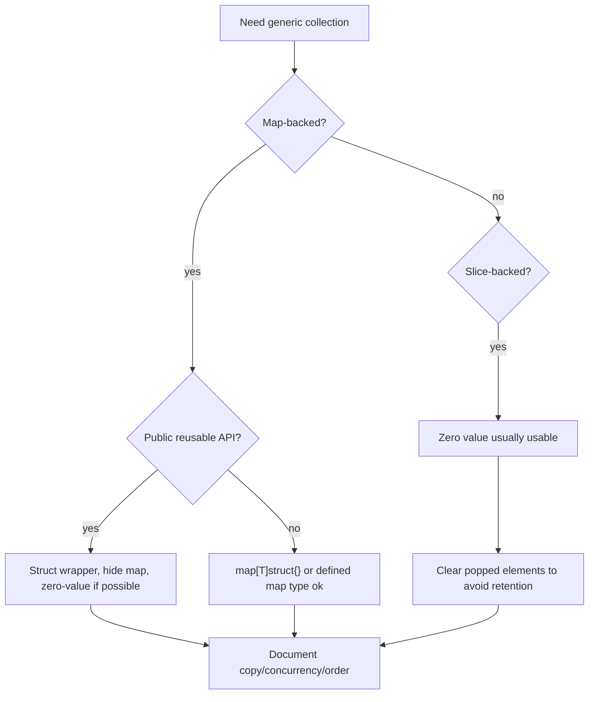
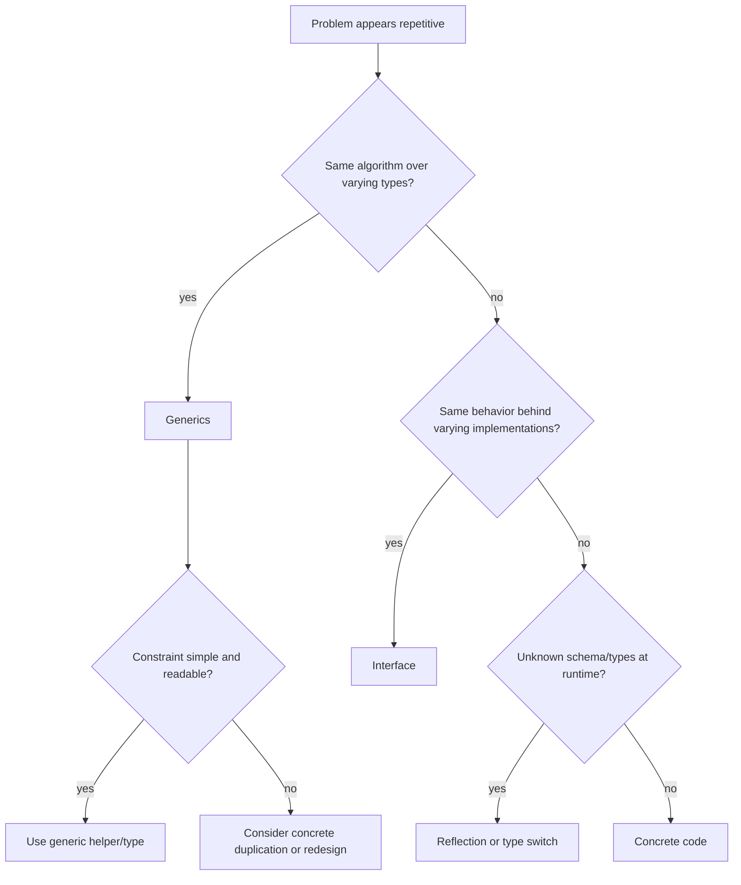

# learn-go-data-model-part-022.md

# Part 022 — Generics II: Generic Collections, Algorithms, Zero Value, API Design

> Seri: `learn-go-data-model`  
> Bagian: `022 / 034`  
> Target pembaca: Java software engineer yang ingin memahami Go data model pada level production engineering  
> Fokus: desain generic collections, algorithms, zero value, constraint ergonomics, API stability, dan trade-off generics vs interface/reflection/codegen

---

## 0. Posisi Part Ini dalam Seri

Part 021 membahas fondasi generics:

```text
- type parameter
- type argument
- constraint
- any
- comparable
- type set
- union
- approximation ~T
- cmp.Ordered
- method limitation di Go 1.26
- kapan generics cocok/tidak cocok
```

Part ini lebih praktis dan production-oriented.

Kita akan membangun dan mengevaluasi generic code seperti:

```text
- Set[T]
- Stack[T]
- Queue[T]
- Optional[T]
- Result[T] trade-off
- Clone/Filter/Map/Reduce
- GroupBy/IndexBy
- map helpers
- constraint design
- zero value usability
- public API stability
- generic vs interface vs reflection vs code generation
```

Tujuannya bukan membuat library generics terbesar, tetapi memahami bagaimana generics memengaruhi data model dan API design.

---

## 1. Tujuan Pembelajaran

Setelah part ini, kamu harus bisa:

1. Mendesain generic `Set[T]` dengan benar.
2. Memahami trade-off zero value usable vs constructor-required.
3. Mendesain generic stack/queue sederhana.
4. Mendesain helper slice/map generic tanpa mengorbankan readability.
5. Menentukan kapan helper generic lebih buruk daripada loop biasa.
6. Mendesain constraint yang minimal dan stabil.
7. Memahami public API compatibility pada generic type/function.
8. Menghindari generic abstraction yang terlalu clever.
9. Memahami interaksi generics dengan nil, zero value, map, slice, pointer.
10. Memilih antara generics, interface, reflection, dan code generation.
11. Membuat PR checklist untuk generic collections/algorithms.

---

## 2. Mental Model: Generics sebagai Type-Safe Reuse

Generic code bagus ketika ada pola yang sama dan type relation yang penting.

Contoh pola yang jelas:

```go
func Contains[T comparable](values []T, target T) bool
```

Type relation:

```text
values element type == target type
```

Ini tidak bisa diekspresikan dengan `any` secara type-safe tanpa assertion.

Generic code buruk ketika tidak ada relation.

```go
func Print[T any](v T) {
    fmt.Println(v)
}
```

Ini tidak lebih baik dari:

```go
func Print(v any) {
    fmt.Println(v)
}
```

Rule awal:

```text
Generics should preserve or express type relationships.
```

---

## 3. Generic Set: Alias vs Defined Type vs Struct

Ada beberapa desain `Set`.

### 3.1 Map Alias

```go
type Set[T comparable] = map[T]struct{}
```

Pros:

```text
- zero overhead
- exactly map
- easy literal
```

Cons:

```text
- cannot attach methods to alias in useful distinct way
- no invariant
- zero value nil map not write-ready
```

### 3.2 Defined Map Type

```go
type Set[T comparable] map[T]struct{}

func NewSet[T comparable](values ...T) Set[T] {
    s := make(Set[T], len(values))
    for _, v := range values {
        s.Add(v)
    }
    return s
}

func (s Set[T]) Add(v T) {
    s[v] = struct{}{}
}

func (s Set[T]) Contains(v T) bool {
    _, ok := s[v]
    return ok
}

func (s Set[T]) Remove(v T) {
    delete(s, v)
}

func (s Set[T]) Len() int {
    return len(s)
}
```

Problem:

```go
var s Set[string]
s.Add("x") // panic: assignment to entry in nil map
```

Defined map type has nil zero value.

### 3.3 Struct Wrapper

```go
type Set[T comparable] struct {
    values map[T]struct{}
}

func (s *Set[T]) Add(v T) {
    if s.values == nil {
        s.values = make(map[T]struct{})
    }
    s.values[v] = struct{}{}
}

func (s *Set[T]) Contains(v T) bool {
    _, ok := s.values[v]
    return ok
}

func (s *Set[T]) Remove(v T) {
    delete(s.values, v)
}

func (s *Set[T]) Len() int {
    return len(s.values)
}
```

Pros:

```text
- zero value usable
- can hide representation
- can add invariants later
```

Cons:

```text
- more verbose
- pointer receiver needed for Add lazy init
- copying Set struct copies map descriptor
```

Production guideline:

```text
For internal simple use, map[T]struct{} or defined map type is fine.
For public reusable collection, struct wrapper gives better zero-value and API control.
```

---

## 4. Set Values and Stable Output

Set is unordered.

```go
func (s *Set[T]) Values() []T {
    out := make([]T, 0, len(s.values))
    for v := range s.values {
        out = append(out, v)
    }
    return out
}
```

Order unstable.

For ordered element types:

```go
func (s *Set[T]) SortedValues(less func(a, b T) bool) []T {
    out := s.Values()
    sort.Slice(out, func(i, j int) bool {
        return less(out[i], out[j])
    })
    return out
}
```

Alternative with `cmp.Ordered` cannot be method with new type parameter in Go 1.26 if `Set[T]` itself is unconstrained. Use top-level function:

```go
func SortedSetValues[T cmp.Ordered](s *Set[T]) []T {
    out := s.Values()
    slices.Sort(out)
    return out
}
```

This is important because Go 1.26 does not support methods declaring their own type parameters.

---

## 5. Set Operations

```go
func Union[T comparable](a, b *Set[T]) Set[T] {
    var out Set[T]

    for _, v := range a.Values() {
        out.Add(v)
    }
    for _, v := range b.Values() {
        out.Add(v)
    }

    return out
}
```

But `Values()` allocates. Better internal iteration method:

```go
func (s *Set[T]) Each(fn func(T) bool) {
    for v := range s.values {
        if !fn(v) {
            return
        }
    }
}
```

Then:

```go
func Union[T comparable](a, b *Set[T]) Set[T] {
    var out Set[T]

    a.Each(func(v T) bool {
        out.Add(v)
        return true
    })
    b.Each(func(v T) bool {
        out.Add(v)
        return true
    })

    return out
}
```

But callback style can be less readable. Sometimes direct access in same package is fine.

For public API, prefer simple methods; optimize later.

---

## 6. Set Copy and Ownership

If `Set[T]` wraps map, copying set struct shares map.

```go
a := Set[string]{}
a.Add("x")

b := a
b.Add("y")

fmt.Println(a.Contains("y")) // true
```

Because map descriptor copied.

If you want clone:

```go
func (s *Set[T]) Clone() Set[T] {
    var out Set[T]
    if len(s.values) == 0 {
        return out
    }
    out.values = make(map[T]struct{}, len(s.values))
    for v := range s.values {
        out.values[v] = struct{}{}
    }
    return out
}
```

Document ownership:

```text
Copying Set value is shallow.
Use Clone for independent set.
```

---

## 7. Generic Stack

Stack using slice:

```go
type Stack[T any] struct {
    values []T
}

func (s *Stack[T]) Push(v T) {
    s.values = append(s.values, v)
}

func (s *Stack[T]) Pop() (T, bool) {
    n := len(s.values)
    if n == 0 {
        var zero T
        return zero, false
    }

    v := s.values[n-1]

    var zero T
    s.values[n-1] = zero // avoid retaining reference
    s.values = s.values[:n-1]

    return v, true
}

func (s *Stack[T]) Peek() (T, bool) {
    n := len(s.values)
    if n == 0 {
        var zero T
        return zero, false
    }
    return s.values[n-1], true
}

func (s *Stack[T]) Len() int {
    return len(s.values)
}
```

Important detail:

```go
var zero T
s.values[n-1] = zero
```

This clears reference for pointer/slice/map/string-like values, helping GC avoid retaining popped value.

Zero value `Stack[T]` is usable because nil slice append works.

---

## 8. Generic Queue

Naive queue:

```go
type Queue[T any] struct {
    values []T
}

func (q *Queue[T]) Push(v T) {
    q.values = append(q.values, v)
}

func (q *Queue[T]) Pop() (T, bool) {
    if len(q.values) == 0 {
        var zero T
        return zero, false
    }

    v := q.values[0]

    var zero T
    q.values[0] = zero
    q.values = q.values[1:]

    return v, true
}
```

Problem:

```text
q.values = q.values[1:] keeps backing array; long-lived queue may retain memory.
```

Better ring buffer for production.

Minimal ring queue:

```go
type RingQueue[T any] struct {
    buf  []T
    head int
    len  int
}

func (q *RingQueue[T]) Len() int {
    return q.len
}

func (q *RingQueue[T]) Push(v T) {
    if q.len == len(q.buf) {
        q.grow()
    }

    idx := (q.head + q.len) % len(q.buf)
    q.buf[idx] = v
    q.len++
}

func (q *RingQueue[T]) Pop() (T, bool) {
    if q.len == 0 {
        var zero T
        return zero, false
    }

    v := q.buf[q.head]
    var zero T
    q.buf[q.head] = zero

    q.head = (q.head + 1) % len(q.buf)
    q.len--

    if q.len == 0 {
        q.head = 0
    }

    return v, true
}

func (q *RingQueue[T]) grow() {
    newCap := 4
    if len(q.buf) > 0 {
        newCap = len(q.buf) * 2
    }

    next := make([]T, newCap)
    for i := 0; i < q.len; i++ {
        next[i] = q.buf[(q.head+i)%len(q.buf)]
    }

    q.buf = next
    q.head = 0
}
```

Zero value usable:

```go
var q RingQueue[int]
q.Push(1)
```

Because `Push` grows from nil buffer.

---

## 9. Generic Optional

Pointer optionality can be replaced internally by:

```go
type Optional[T any] struct {
    value T
    set   bool
}

func Some[T any](v T) Optional[T] {
    return Optional[T]{value: v, set: true}
}

func None[T any]() Optional[T] {
    return Optional[T]{}
}

func (o Optional[T]) IsSet() bool {
    return o.set
}

func (o Optional[T]) Value() (T, bool) {
    return o.value, o.set
}

func (o Optional[T]) Or(defaultValue T) T {
    if !o.set {
        return defaultValue
    }
    return o.value
}
```

Use case:

```go
type RawConfig struct {
    Timeout Optional[time.Duration]
}
```

Benefit:

```text
- distinguishes absent from explicit zero
- no nil
- works for any T
```

Boundary issue:

```text
encoding/json does not automatically understand this semantic unless custom marshal/unmarshal is implemented.
```

Use Optional mostly internal unless you build boundary support.

---

## 10. Generic Result: Usually Not Needed

```go
type Result[T any] struct {
    value T
    err   error
}
```

Go already has:

```go
func Do() (T, error)
```

Result type may be useful for:

```text
- async result channels
- batch result collection
- pipeline stages
```

Example:

```go
type Result[T any] struct {
    Value T
    Err   error
}

func Worker[T any](in <-chan T, out chan<- Result[T], f func(T) (T, error)) {
    for v := range in {
        next, err := f(v)
        out <- Result[T]{Value: next, Err: err}
    }
}
```

But do not replace ordinary `(T, error)` with `Result[T]` everywhere. That often makes Go less idiomatic.

---

## 11. Generic Slice Helpers

### 11.1 Clone

Simple:

```go
func Clone[T any](s []T) []T {
    return append([]T(nil), s...)
}
```

Preserve defined slice type:

```go
func CloneSlice[S ~[]E, E any](s S) S {
    return append(S(nil), s...)
}
```

Use the simple version unless preserving defined slice type matters.

### 11.2 Filter

```go
func Filter[T any](values []T, keep func(T) bool) []T {
    out := make([]T, 0, len(values))
    for _, v := range values {
        if keep(v) {
            out = append(out, v)
        }
    }
    return out
}
```

Potential issue:

```text
Allocates new slice.
May be less readable than explicit loop for business filtering.
```

### 11.3 Map

```go
func Map[A any, B any](values []A, f func(A) B) []B {
    out := make([]B, 0, len(values))
    for _, v := range values {
        out = append(out, f(v))
    }
    return out
}
```

Good for mechanical transformations.

But business mapping often deserves named function:

```go
func NewCaseResponses(cases []Case) []CaseResponse
```

instead of:

```go
Map(cases, NewCaseResponse)
```

Both can be fine; readability decides.

---

## 12. Reduce and Readability

Generic reduce:

```go
func Reduce[T any, A any](values []T, initial A, f func(A, T) A) A {
    acc := initial
    for _, v := range values {
        acc = f(acc, v)
    }
    return acc
}
```

Example:

```go
total := Reduce(orders, Money{}, func(acc Money, o Order) Money {
    next, _ := acc.Add(o.Amount())
    return next
})
```

But this hides error handling badly.

For Go, explicit loop often better:

```go
total := Money{}
for _, o := range orders {
    next, err := total.Add(o.Amount())
    if err != nil {
        return Money{}, err
    }
    total = next
}
```

Guideline:

```text
Generic functional helpers are best for simple pure transformations.
For domain logic with errors, branching, metrics, or audit, prefer explicit loops.
```

---

## 13. Generic IndexBy

Build primary index from slice:

```go
func IndexBy[T any, K comparable](values []T, key func(T) K) (map[K]T, error) {
    out := make(map[K]T, len(values))

    for _, v := range values {
        k := key(v)
        if _, exists := out[k]; exists {
            return nil, fmt.Errorf("duplicate key %v", k)
        }
        out[k] = v
    }

    return out, nil
}
```

Problem:

```text
fmt.Errorf("duplicate key %v") assumes key safe to print.
```

Better with caller-provided duplicate error?

```go
func IndexBy[T any, K comparable](values []T, key func(T) K) (map[K]T, K, bool) {
    out := make(map[K]T, len(values))

    for _, v := range values {
        k := key(v)
        if _, exists := out[k]; exists {
            return nil, k, false
        }
        out[k] = v
    }

    var zero K
    return out, zero, true
}
```

But this API is awkward.

Often domain-specific index is clearer:

```go
func IndexUsersByID(users []User) (map[UserID]User, error)
```

Generic `IndexBy` good for internal utilities but not always best public API.

---

## 14. Generic GroupBy

```go
func GroupBy[T any, K comparable](values []T, key func(T) K) map[K][]T {
    out := make(map[K][]T)
    for _, v := range values {
        k := key(v)
        out[k] = append(out[k], v)
    }
    return out
}
```

Good candidate because pattern is common and type relation clear.

Use:

```go
byStatus := GroupBy(cases, func(c Case) CaseStatus {
    return c.Status()
})
```

Caveat:

```text
Map key order is unstable.
Each group preserves input order.
```

For output API, sort keys or map to stable slice.

---

## 15. Generic Partition

```go
func Partition[T any](values []T, pred func(T) bool) (yes []T, no []T) {
    yes = make([]T, 0)
    no = make([]T, 0)

    for _, v := range values {
        if pred(v) {
            yes = append(yes, v)
        } else {
            no = append(no, v)
        }
    }

    return yes, no
}
```

If performance matters, preallocate:

```go
yes = make([]T, 0, len(values))
no = make([]T, 0, len(values))
```

But that can over-allocate. Choose based on expected distribution.

---

## 16. Generic Map Helpers

### 16.1 Keys

```go
func Keys[K comparable, V any](m map[K]V) []K {
    keys := make([]K, 0, len(m))
    for k := range m {
        keys = append(keys, k)
    }
    return keys
}
```

But standard library `maps.Keys` exists in modern Go and works with iterators. Prefer standard library when it fits.

### 16.2 Values

```go
func Values[K comparable, V any](m map[K]V) []V {
    values := make([]V, 0, len(m))
    for _, v := range m {
        values = append(values, v)
    }
    return values
}
```

Order follows map iteration and is unstable.

### 16.3 Sorted Keys

```go
func SortedKeys[K cmp.Ordered, V any](m map[K]V) []K {
    keys := Keys(m)
    slices.Sort(keys)
    return keys
}
```

Potential float issue:

```text
NaN and ordering semantics need care for float keys.
```

---

## 17. Generic Copy Map

```go
func CloneMap[M ~map[K]V, K comparable, V any](m M) M {
    if m == nil {
        return nil
    }

    out := make(M, len(m))
    for k, v := range m {
        out[k] = v
    }
    return out
}
```

This preserves defined map type.

But clone is shallow.

```go
type M map[string][]int

a := M{"x": {1, 2}}
b := CloneMap(a)

b["x"][0] = 99
fmt.Println(a["x"][0]) // 99
```

Deep clone requires domain-specific logic.

Standard library `maps.Clone` provides common clone behavior. Prefer it unless you need specific type preservation or custom semantics.

---

## 18. Generic DeleteFunc

```go
func DeleteFunc[K comparable, V any](m map[K]V, del func(K, V) bool) {
    for k, v := range m {
        if del(k, v) {
            delete(m, k)
        }
    }
}
```

Standard library `maps.DeleteFunc` exists. Prefer standard library.

Use case:

```go
maps.DeleteFunc(counts, func(k string, v int) bool {
    return v == 0
})
```

---

## 19. Generic Cache: Be Careful

Simple generic cache:

```go
type Cache[K comparable, V any] struct {
    mu     sync.RWMutex
    values map[K]V
}

func (c *Cache[K, V]) Get(k K) (V, bool) {
    c.mu.RLock()
    defer c.mu.RUnlock()

    v, ok := c.values[k]
    return v, ok
}

func (c *Cache[K, V]) Put(k K, v V) {
    c.mu.Lock()
    defer c.mu.Unlock()

    if c.values == nil {
        c.values = make(map[K]V)
    }
    c.values[k] = v
}
```

This is type-safe, but not a production cache unless it has:

```text
- max size
- eviction
- TTL
- metrics
- stampede protection
- lifecycle cleanup
```

Generics make cache typed; they do not solve cache semantics.

---

## 20. Generic TTL Cache Entry

```go
type Entry[V any] struct {
    Value     V
    ExpiresAt time.Time
}

type TTLCache[K comparable, V any] struct {
    mu     sync.Mutex
    now    func() time.Time
    values map[K]Entry[V]
}
```

Methods:

```go
func NewTTLCache[K comparable, V any](now func() time.Time) *TTLCache[K, V] {
    if now == nil {
        now = time.Now
    }

    return &TTLCache[K, V]{
        now:    now,
        values: make(map[K]Entry[V]),
    }
}

func (c *TTLCache[K, V]) Put(k K, v V, ttl time.Duration) {
    c.mu.Lock()
    defer c.mu.Unlock()

    c.values[k] = Entry[V]{
        Value:     v,
        ExpiresAt: c.now().Add(ttl),
    }
}

func (c *TTLCache[K, V]) Get(k K) (V, bool) {
    c.mu.Lock()
    defer c.mu.Unlock()

    e, ok := c.values[k]
    if !ok {
        var zero V
        return zero, false
    }

    if !e.ExpiresAt.IsZero() && !c.now().Before(e.ExpiresAt) {
        delete(c.values, k)
        var zero V
        return zero, false
    }

    return e.Value, true
}
```

Caveat:

```text
No cleanup loop, no max size, no singleflight.
```

Typed cache is not automatically production-ready.

---

## 21. Zero Value Usability

For generic types, zero value usability is a major design decision.

### 21.1 Good zero value: Stack

```go
var s Stack[int]
s.Push(1)
```

Works because nil slice append works.

### 21.2 Bad zero value: Map-backed Set

```go
var s Set[string] // if Set is map type
s.Add("x")        // panic
```

### 21.3 Struct wrapper can make zero usable

```go
type Set[T comparable] struct {
    values map[T]struct{}
}

func (s *Set[T]) Add(v T) {
    if s.values == nil {
        s.values = make(map[T]struct{})
    }
    s.values[v] = struct{}{}
}
```

Guideline:

```text
For public generic collection, make zero value useful if practical.
If not, provide constructor and document zero value behavior.
```

---

## 22. Nil and Generic Collections

Generic code must handle zero/nil carefully.

```go
func IsEmpty[T any](s []T) bool {
    return len(s) == 0
}
```

Works for nil and empty slice.

Map:

```go
func Put[K comparable, V any](m map[K]V, k K, v V) {
    m[k] = v
}
```

Panics if m nil.

Better:

```go
func Put[K comparable, V any](m map[K]V, k K, v V) map[K]V {
    if m == nil {
        m = make(map[K]V)
    }
    m[k] = v
    return m
}
```

But API now requires caller to use returned map.

For methods, struct wrapper can hide this.

---

## 23. Constraints and API Surface

Every constraint is API.

```go
func Unique[T comparable](values []T) []T
```

This excludes `[]T` where T is slice/map/function. Correct because set map needs comparable keys.

If later you want support non-comparable with custom equality:

```go
func UniqueFunc[T any](values []T, equal func(a, b T) bool) []T
```

This is separate API.

Do not over-constrain:

```go
func Clone[T comparable](values []T) []T
```

No equality needed. Should be:

```go
func Clone[T any](values []T) []T
```

Minimal constraints improve usability.

---

## 24. Constraint Naming

Bad:

```go
type MyConstraint interface {
    ~int | ~string
}
```

Name says nothing.

Better:

```go
type OrderedID interface {
    ~string | ~int64
}
```

But even this may be too domain-specific.

For local one-off constraints, inline can be clearer:

```go
func ParseID[T ~string](s string) (T, error)
```

For reused constraints:

```go
type Number interface {
    ~int | ~int64 | ~float64
}
```

Guideline:

```text
Name constraints when they represent reusable concept.
Keep inline when local.
```

---

## 25. Generic Public API Stability

Generic APIs add compatibility dimensions:

```text
- type parameter names less important but affect docs
- constraints are compatibility contract
- return concrete generic type is contract
- zero value behavior is contract
- method set of generic type is contract
```

Changing:

```go
func Do[T any](v T)
```

to:

```go
func Do[T comparable](v T)
```

is breaking.

Changing:

```go
type Set[T comparable] map[T]struct{}
```

to:

```go
type Set[T comparable] struct { ... }
```

is breaking for callers who used map operations directly.

Thus, for public library, choose representation carefully.

---

## 26. Encapsulation for Generic Types

If you expose map-defined Set:

```go
type Set[T comparable] map[T]struct{}
```

Callers can mutate directly:

```go
s["x"] = struct{}{}
delete(s, "x")
```

If you later need invariants, difficult.

Struct wrapper:

```go
type Set[T comparable] struct {
    values map[T]struct{}
}
```

Encapsulates representation.

For application internal code, direct map-defined Set may be fine.

For public reusable API, prefer encapsulation.

---

## 27. Generic Type Copy Semantics

Struct wrapper with map/slice fields still shallow copies.

```go
type Set[T comparable] struct {
    values map[T]struct{}
}

a := Set[string]{}
a.Add("x")

b := a
b.Add("y")

fmt.Println(a.Contains("y")) // true
```

If copying is dangerous, document or prevent via no-copy marker pattern if necessary.

Most collections should document:

```text
A Set value should not be copied after first use.
Use Clone to copy values.
```

This is similar to types containing maps/slices/locks.

---

## 28. Generic Concurrency

Generic collections are not automatically concurrent-safe.

```go
type Set[T comparable] struct {
    values map[T]struct{}
}
```

Concurrent access still race.

Concurrent Set:

```go
type SafeSet[T comparable] struct {
    mu     sync.RWMutex
    values map[T]struct{}
}

func (s *SafeSet[T]) Add(v T) {
    s.mu.Lock()
    defer s.mu.Unlock()

    if s.values == nil {
        s.values = make(map[T]struct{})
    }
    s.values[v] = struct{}{}
}

func (s *SafeSet[T]) Contains(v T) bool {
    s.mu.RLock()
    defer s.mu.RUnlock()

    _, ok := s.values[v]
    return ok
}
```

Warning:

```text
Do not embed sync.Mutex in generic type and use value receiver.
Do not copy SafeSet after use.
```

---

## 29. Generic and Error Handling

Generic helpers with callbacks often need error-aware variants.

Map with error:

```go
func MapErr[A any, B any](values []A, f func(A) (B, error)) ([]B, error) {
    out := make([]B, 0, len(values))
    for _, v := range values {
        b, err := f(v)
        if err != nil {
            return nil, err
        }
        out = append(out, b)
    }
    return out, nil
}
```

But wrapping context is hard generically:

```go
return nil, fmt.Errorf("map element %d: %w", i, err)
```

Maybe useful:

```go
for i, v := range values {
    b, err := f(v)
    if err != nil {
        return nil, fmt.Errorf("map element %d: %w", i, err)
    }
    out = append(out, b)
}
```

However domain-specific loop can provide better context:

```go
return nil, fmt.Errorf("map case %s to response: %w", c.ID(), err)
```

Generic helper may reduce context quality. Be careful.

---

## 30. Generic and Domain Types

Generics can preserve domain types.

Example:

```go
type UserID string
type CaseID string

func NonEmpty[T ~string](v T) bool {
    return strings.TrimSpace(string(v)) != ""
}
```

But too broad:

```go
NonEmpty(CaseID("x"))
NonEmpty(UserID("x"))
NonEmpty("raw")
```

If validation differs by type, use domain-specific parser/method.

```go
func ParseUserID(s string) (UserID, error)
func ParseCaseID(s string) (CaseID, error)
```

Generic string-like helper is okay for low-level utility, not domain authority.

---

## 31. Generic and Method Sets

Generic types can implement interfaces.

```go
type Box[T any] struct {
    value T
}

func (b Box[T]) String() string {
    return fmt.Sprint(b.value)
}

var _ fmt.Stringer = Box[int]{}
```

All instantiated `Box[T]` have `String()`.

Constraint may require methods:

```go
type Stringer interface {
    String() string
}

type StringBox[T Stringer] struct {
    value T
}

func (b StringBox[T]) String() string {
    return b.value.String()
}
```

Be careful with pointer vs value receiver satisfaction for type arguments.

---

## 32. Generic and Interface Values

This is valid:

```go
func ToAnySlice[T any](values []T) []any {
    out := make([]any, len(values))
    for i, v := range values {
        out[i] = v
    }
    return out
}
```

Each `v` is boxed into interface.

Use only at dynamic boundaries.

Do not convert to `[]any` just to pass around homogeneous domain data.

---

## 33. Generic and Allocation

Generic code can allocate due to:

```text
- slice/map creation
- callback captures
- interface conversion inside generic
- escape of returned values
```

Generic itself does not automatically mean allocation-free or allocation-heavy.

Measure:

```bash
go test -bench=. -benchmem
go build -gcflags=-m ./...
```

Especially for generic helpers in hot loops.

---

## 34. Generic and `slices`, `maps`, `cmp`

Modern Go standard library includes generic packages:

```text
cmp    -> Compare, Less, Or, Ordered
slices -> sorting/searching/clone/delete/compact and many slice helpers
maps   -> clone/copy/equal/deletefunc/keys/values and map helpers
```

Prefer standard library where it fits.

Example:

```go
cloned := slices.Clone(values)
slices.Sort(values)
same := maps.Equal(a, b)
keys := maps.Keys(m)
```

In Go 1.21, `slices`, `maps`, and `cmp` were added to the standard library; in current Go they are part of normal generic toolbox.

Do not recreate standard helpers unless you need different semantics.

---

## 35. Generic Iteration and Go 1.23+ Iterators

Modern Go has iterator-related patterns in standard packages. Some standard helpers return iterator sequences rather than slices in newer versions.

Practical guideline:

```text
Use the standard library API as documented for your target Go version.
If you need a slice, collect/sort explicitly with slices helpers where appropriate.
```

For teaching core data model, remember:

```text
map iteration order is still unspecified.
iterator abstraction does not make unordered data ordered.
```

---

## 36. Generic API Documentation

Generic API docs should explain:

```text
- what T/K/V mean
- constraints and why
- zero value behavior
- nil handling
- ordering guarantees
- allocation behavior if important
- concurrency safety
- ownership/copy behavior
```

Example doc:

```go
// Set is a non-concurrent set of comparable values.
// The zero value is ready to use.
// A Set must not be copied after first use; use Clone to create an independent copy.
type Set[T comparable] struct {
    values map[T]struct{}
}
```

This is not over-documentation for public collections.

---

## 37. Generic Example: Non-Concurrent Set Full Version

```go
type Set[T comparable] struct {
    values map[T]struct{}
}

func NewSet[T comparable](values ...T) Set[T] {
    var s Set[T]
    for _, v := range values {
        s.Add(v)
    }
    return s
}

func (s *Set[T]) Add(v T) {
    if s.values == nil {
        s.values = make(map[T]struct{})
    }
    s.values[v] = struct{}{}
}

func (s *Set[T]) Remove(v T) {
    delete(s.values, v)
}

func (s *Set[T]) Contains(v T) bool {
    _, ok := s.values[v]
    return ok
}

func (s *Set[T]) Len() int {
    return len(s.values)
}

func (s *Set[T]) Values() []T {
    out := make([]T, 0, len(s.values))
    for v := range s.values {
        out = append(out, v)
    }
    return out
}

func (s *Set[T]) Clone() Set[T] {
    var out Set[T]
    if len(s.values) == 0 {
        return out
    }

    out.values = make(map[T]struct{}, len(s.values))
    for v := range s.values {
        out.values[v] = struct{}{}
    }
    return out
}
```

Caveat:

```text
Not concurrent-safe.
Values order unspecified.
Copying Set is shallow.
```

---

## 38. Generic Example: OrderedSet

```go
type OrderedSet[T comparable] struct {
    seen  map[T]struct{}
    order []T
}

func (s *OrderedSet[T]) Add(v T) bool {
    if s.seen == nil {
        s.seen = make(map[T]struct{})
    }

    if _, exists := s.seen[v]; exists {
        return false
    }

    s.seen[v] = struct{}{}
    s.order = append(s.order, v)
    return true
}

func (s *OrderedSet[T]) Contains(v T) bool {
    _, ok := s.seen[v]
    return ok
}

func (s *OrderedSet[T]) Values() []T {
    out := make([]T, len(s.order))
    copy(out, s.order)
    return out
}
```

Trade-off:

```text
- insertion order stable
- membership O(1)
- removal needs extra work/O(n) unless tombstone/index design
```

Generics help reuse this pattern for any comparable type.

---

## 39. Generic Example: Top-N Needs Constraint or Comparator

For `cmp.Ordered`:

```go
func Max[T cmp.Ordered](values []T) (T, bool) {
    if len(values) == 0 {
        var zero T
        return zero, false
    }

    max := values[0]
    for _, v := range values[1:] {
        if v > max {
            max = v
        }
    }

    return max, true
}
```

For custom domain ordering:

```go
func MaxFunc[T any](values []T, less func(a, b T) bool) (T, bool) {
    if len(values) == 0 {
        var zero T
        return zero, false
    }

    max := values[0]
    for _, v := range values[1:] {
        if less(max, v) {
            max = v
        }
    }

    return max, true
}
```

Use comparator when type is not naturally ordered or ordering is domain-specific.

---

## 40. Generic Example: Deduplicate

Comparable:

```go
func Unique[T comparable](values []T) []T {
    seen := make(map[T]struct{}, len(values))
    out := make([]T, 0, len(values))

    for _, v := range values {
        if _, ok := seen[v]; ok {
            continue
        }
        seen[v] = struct{}{}
        out = append(out, v)
    }

    return out
}
```

With key function:

```go
func UniqueBy[T any, K comparable](values []T, key func(T) K) []T {
    seen := make(map[K]struct{}, len(values))
    out := make([]T, 0, len(values))

    for _, v := range values {
        k := key(v)
        if _, ok := seen[k]; ok {
            continue
        }
        seen[k] = struct{}{}
        out = append(out, v)
    }

    return out
}
```

Use:

```go
users := UniqueBy(users, func(u User) UserID {
    return u.ID()
})
```

Caveat:

```text
First occurrence wins.
Document collision policy.
```

---

## 41. Generic Example: Batch Result

```go
type ItemResult[T any] struct {
    Index int
    Value T
    Err   error
}

func MapEach[T any, U any](values []T, f func(T) (U, error)) []ItemResult[U] {
    out := make([]ItemResult[U], 0, len(values))

    for i, v := range values {
        u, err := f(v)
        out = append(out, ItemResult[U]{
            Index: i,
            Value: u,
            Err:   err,
        })
    }

    return out
}
```

Useful for batch operations where partial failures matter.

But for transactional all-or-nothing operations, return first error or joined error may be better.

---

## 42. Generic and Domain Repositories: Usually Not

Tempting:

```go
type Repository[T any, ID comparable] interface {
    Find(context.Context, ID) (T, error)
    Save(context.Context, T) error
}
```

This may be useful in infrastructure framework code, but often too abstract for domain.

Why?

```text
- each aggregate has different query needs
- error semantics differ
- transaction semantics differ
- persistence mapping differs
- generic repository often becomes lowest-common-denominator
```

Prefer domain-specific ports:

```go
type UserFinder interface {
    FindUser(context.Context, UserID) (User, error)
}

type CaseStore interface {
    SaveCase(context.Context, *Case) error
}
```

Use generic repository only if your problem truly benefits from uniform CRUD abstraction.

---

## 43. Generic and Authorization Policy: Be Careful

Tempting:

```go
type Policy[S any, R any, A comparable] interface {
    Decide(S, R, A) Decision
}
```

This may become abstract soup.

Often clearer:

```go
type AuthorizationRequest struct {
    Subject Subject
    Resource Resource
    Action Action
}

type Authorizer interface {
    Decide(context.Context, AuthorizationRequest) (Decision, error)
}
```

Generics are not a replacement for domain language.

---

## 44. Generic Builders

Generic builder can be overkill.

Bad:

```go
type Builder[T any] struct {
    value T
}
```

Unless you have real shared building logic.

Better domain-specific:

```go
type UserBuilder struct {
    email string
    name  string
}
```

or plain options/constructor.

---

## 45. Generic and Testing

Generic functions need tests across representative type categories:

```text
- primitive comparable
- defined type with underlying primitive
- struct comparable
- pointer type
- slice element type
- empty/nil input
- zero values
```

Example table:

```go
func TestUniqueString(t *testing.T) {}
func TestUniqueDefinedType(t *testing.T) {}
func TestUniqueStruct(t *testing.T) {}
```

Do not only test `int`.

For constraints with `~string`, test defined string type.

For `cmp.Ordered`, test strings and ints; consider floats/NaN if supported.

---

## 46. Generic Benchmarks

Benchmark generic helper vs explicit loop only if hot path.

```go
func BenchmarkFilterGeneric(b *testing.B) {}
func BenchmarkFilterInline(b *testing.B) {}
```

Measure:

```bash
go test -bench=. -benchmem
```

Things to watch:

```text
- allocations
- callback overhead
- inlining
- interface conversion
- closure capture
```

But do not micro-optimize non-hot business code.

---

## 47. Mermaid: Generic Collection Design



---

## 48. Mermaid: Abstraction Choice



---

## 49. Mini Lab 1 — Set Zero Value

Given:

```go
type Set[T comparable] map[T]struct{}

func (s Set[T]) Add(v T) {
    s[v] = struct{}{}
}
```

What happens?

```go
var s Set[string]
s.Add("x")
```

Answer:

```text
panic: assignment to entry in nil map
```

Fix with constructor or struct wrapper lazy init.

---

## 50. Mini Lab 2 — Stack GC Retention

Why clear popped slot?

```go
v := s.values[n-1]
var zero T
s.values[n-1] = zero
s.values = s.values[:n-1]
```

Answer:

```text
If T contains pointers or references, clearing avoids retaining popped value through backing array.
```

---

## 51. Mini Lab 3 — UniqueBy Collision Policy

```go
users := UniqueBy(users, func(u User) Email {
    return u.Email()
})
```

Question:

```text
If two users have same email, which one wins?
```

Answer:

```text
First occurrence wins in the provided implementation.
```

If duplicate should be error, write `IndexBy` with duplicate detection instead.

---

## 52. Mini Lab 4 — Constraint Too Strong

```go
func Clone[T comparable](values []T) []T {
    return append([]T(nil), values...)
}
```

Problem:

```text
Clone does not need comparable.
This unnecessarily rejects []T where T is slice/map/function.
```

Fix:

```go
func Clone[T any](values []T) []T
```

---

## 53. Mini Lab 5 — `[]T` to `[]any`

```go
func ToAny[T any](values []T) []any {
    out := make([]any, len(values))
    for i, v := range values {
        out[i] = v
    }
    return out
}
```

Lesson:

```text
Conversion requires per-element boxing.
Use only at dynamic boundary.
```

---

## 54. Mini Lab 6 — Preserve Map Type

```go
type Headers map[string]string

func CloneMap[M ~map[K]V, K comparable, V any](m M) M {
    out := make(M, len(m))
    for k, v := range m {
        out[k] = v
    }
    return out
}
```

`CloneMap(Headers{})` returns `Headers`, not plain `map[string]string`.

---

## 55. Common Anti-Patterns

### 55.1 Generic helper hides simple loop

If helper makes business logic harder to read, use loop.

### 55.2 Over-constraining

Using `comparable` when no comparison needed.

### 55.3 Under-constraining

Using `any` then doing unsafe/reflection internally.

### 55.4 Public generic map alias too early

Locks you into representation.

### 55.5 Ignoring zero value

Generic collection panics on zero value unexpectedly.

### 55.6 Generic repository everywhere

Usually weak domain model.

### 55.7 Generic cache without cache semantics

Typed map is not production cache.

### 55.8 Callback-heavy generic code with poor error context

Explicit loops may preserve better context.

### 55.9 Copying generic type with map/lock internals

Shallow copy/race hazards.

### 55.10 Reimplementing standard library helpers

Check `slices`, `maps`, `cmp` first.

---

## 56. Production Guidelines

### 56.1 Prefer Standard Library

Use `slices`, `maps`, and `cmp` where semantics fit.

### 56.2 Make Zero Value Usable or Document Otherwise

Especially for collection types.

### 56.3 Keep Constraints Minimal

Constraint should match operations used.

### 56.4 Preserve Type Only When Useful

`S ~[]E` and `M ~map[K]V` are powerful but more complex.

### 56.5 Document Order

Map-based generic helpers have unstable order.

### 56.6 Document Ownership

Clone shallow/deep semantics, returned slices/maps, copy behavior.

### 56.7 Avoid Generic Domain Soup

Generics support domain model; they do not replace domain language.

### 56.8 Benchmark Hot Helpers

Especially callback-heavy helpers.

### 56.9 Split Error-Aware Variants

`Map` and `MapErr` have different ergonomics.

### 56.10 Use Top-Level Functions for Generic Transformations on Generic Types

Because Go 1.26 methods cannot declare their own type parameters.

---

## 57. PR Review Checklist

### 57.1 Need

```text
[ ] Is generic abstraction solving real duplication?
[ ] Does it preserve important type relationship?
[ ] Would explicit loop be clearer?
[ ] Would interface be better?
[ ] Is standard library helper already available?
```

### 57.2 Constraint

```text
[ ] Constraint minimal?
[ ] comparable only when needed?
[ ] cmp.Ordered only when ordering required?
[ ] ~T used intentionally?
[ ] Domain types accepted/rejected intentionally?
```

### 57.3 Zero/Nil

```text
[ ] Zero value usable?
[ ] Nil slice/map behavior defined?
[ ] Empty result vs nil result intentional?
[ ] Zero value ambiguity handled with bool/error?
```

### 57.4 API Stability

```text
[ ] Public representation hidden if future invariant likely?
[ ] Constraint changes considered breaking?
[ ] Copy behavior documented?
[ ] Concurrency safety documented?
```

### 57.5 Collections

```text
[ ] Map-backed order unspecified?
[ ] Popped/deleted references cleared if needed?
[ ] Clone shallow/deep semantics clear?
[ ] Direct map/slice internals not leaked unintentionally?
```

### 57.6 Error Handling

```text
[ ] Callback errors preserve enough context?
[ ] Batch errors modeled correctly?
[ ] Generic helper not hiding domain-specific error semantics?
```

### 57.7 Performance

```text
[ ] Hot path benchmarked?
[ ] Callback allocation/inlining considered?
[ ] []T to []any conversion avoided unless boundary?
[ ] Reflection avoided unless necessary?
```

---

## 58. Ringkasan Mental Model

Generics paling efektif untuk:

```text
- containers
- slice/map algorithms
- preserving concrete types
- eliminating real duplicate code
- expressing equality/order constraints
```

Generic collection design harus mempertimbangkan:

```text
- zero value usability
- ownership
- shallow copy
- nil behavior
- order guarantee
- concurrency
- constraint minimality
- public API stability
```

Untuk Java engineer:

```text
Jangan mulai dari generic repository/service hierarchy.
Mulai dari concrete Go code.
Tarik generics hanya saat pola type-safe benar-benar muncul.
```

Best generic Go code biasanya:

```text
small
boring
well-constrained
well-documented
easy to delete if not needed
```

---

## 59. Apa yang Tidak Dibahas di Part Ini

Part berikutnya akan membahas:

```text
part-023 — Comparability, Equality, Ordering, Hashability
```

Kita akan masuk ke:

```text
- == semantics
- comparable vs strictly comparable
- map key rules
- struct/array comparability
- interface equality panic
- slices/maps/functions non-comparable
- float NaN
- equality design
- ordering design
- cmp.Compare / slices.SortFunc
```

---

## 60. Referensi Resmi

- Go Language Specification — Type parameters, constraints, map types, comparison operators  
  https://go.dev/ref/spec
- Go Blog — When To Use Generics  
  https://go.dev/blog/when-generics
- Go Blog — Generic interfaces  
  https://go.dev/blog/generic-interfaces
- Go Blog — Deconstructing Type Parameters  
  https://go.dev/blog/deconstructing-type-parameters
- Go Blog — All your comparable types  
  https://go.dev/blog/comparable
- Package `cmp`  
  https://pkg.go.dev/cmp
- Package `slices`  
  https://pkg.go.dev/slices
- Package `maps`  
  https://pkg.go.dev/maps
- Go 1.21 Release Notes — standard `slices`, `maps`, `cmp` packages  
  https://go.dev/doc/go1.21
- Go 1.26 Release Notes  
  https://go.dev/doc/go1.26

---

## 61. Status Seri

Selesai:

```text
part-000  Orientation
part-001  Type system core
part-002  Zero value and invariants
part-003  Constants and iota
part-004  Numeric foundations
part-005  Numeric correctness
part-006  Text model I
part-007  Text model II
part-008  Array
part-009  Slice I
part-010  Slice II
part-011  Map I
part-012  Map II
part-013  Struct I
part-014  Struct II
part-015  Struct III
part-016  Pointer
part-017  Nil
part-018  Interface I
part-019  Interface II
part-020  Error as Data
part-021  Generics I
part-022  Generics II
```

Berikutnya:

```text
part-023  Comparability, Equality, Ordering, Hashability
```

Seri belum selesai. Masih ada part 023 sampai part 034.


<!-- NAVIGATION_FOOTER -->
<div class="page-nav">
<a href="./learn-go-data-model-part-021.md">⬅️ Part 021 — Generics I: Type Parameters, Constraints, Approximation, Type Sets</a>
<a href="./index.md">📚 Kategori</a>
<a href="../../index.md">🏠 Home</a>
<a href="./learn-go-data-model-part-023.md">Part 023 — Comparability, Equality, Ordering, Hashability ➡️</a>
</div>
