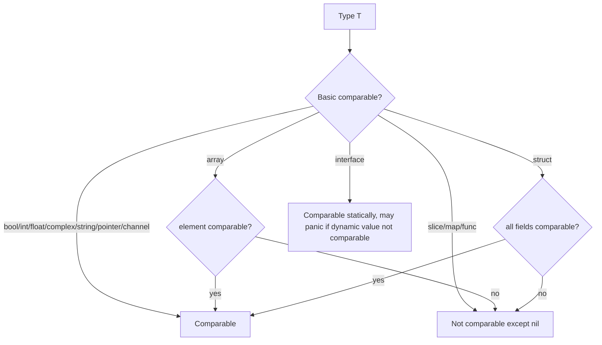
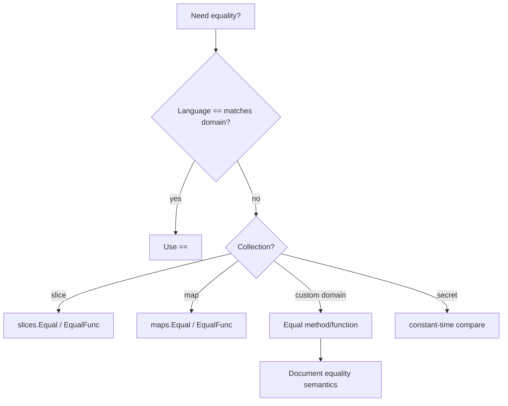

# learn-go-data-model-part-023.md

# Part 023 — Comparability, Equality, Ordering, Hashability

> Seri: `learn-go-data-model`  
> Bagian: `023 / 034`  
> Target pembaca: Java software engineer yang ingin memahami Go data model pada level production engineering  
> Fokus: `==`, `comparable`, equality domain, map key, interface equality, ordering, hashing, NaN, sort/cmp, dan production correctness

---

## 0. Posisi Part Ini dalam Seri

Kita sudah membahas:

```text
part-011..012: map dan key comparability
part-018..019: interface dan interface equality
part-021..022: generics dan comparable constraint
```

Part ini menyatukan semuanya menjadi satu topik besar:

```text
Comparability, Equality, Ordering, Hashability
```

Ini terlihat sederhana karena Go punya operator `==`.

Namun dalam produksi, equality adalah salah satu sumber bug paling halus:

```text
- dua value terlihat sama tetapi type berbeda
- slice/map/function tidak comparable
- interface comparison bisa panic
- float NaN tidak equal dengan dirinya sendiri
- pointer equality bukan content equality
- struct equality bisa tidak sesuai domain equality
- map key harus comparable
- JSON/string canonicalization memengaruhi equality
- ordering tidak sama dengan equality
- hashing harus berbasis key canonical
```

Untuk Java engineer, mindset yang perlu diganti:

```text
Java:
- equals/hashCode bisa dioverride
- object identity vs object equality
- Comparator/Comparable
- HashMap bergantung equals/hashCode

Go:
- == punya aturan bahasa
- tidak ada override operator ==
- map key equality mengikuti aturan ==
- custom equality harus dibuat eksplisit sebagai method/function
- ordering memakai function/comparator, bukan operator overloading
```

---

## 1. Tujuan Pembelajaran

Setelah part ini, kamu harus bisa:

1. Menjelaskan apa arti comparable di Go.
2. Menjelaskan tipe apa saja yang bisa dibandingkan dengan `==`.
3. Menjelaskan tipe apa yang tidak comparable.
4. Menjelaskan beda comparability dan equality domain.
5. Mendesain struct key untuk map.
6. Menghindari interface equality panic.
7. Menjelaskan kenapa `NaN != NaN`.
8. Menjelaskan kenapa pointer equality bukan content equality.
9. Menjelaskan kenapa slice/map/function tidak comparable.
10. Mendesain custom `Equal` method/function.
11. Mendesain ordering dengan `cmp`, `slices.SortFunc`, dan comparator.
12. Menentukan kapan hashing/canonical key dibutuhkan.
13. Menentukan kapan `comparable` constraint tepat.
14. Membuat checklist PR untuk equality/ordering/hashability.

---

## 2. `==` dalam Go

Operator equality:

```go
a == b
a != b
```

Hanya valid untuk comparable types.

Contoh valid:

```go
1 == 1
"abc" == "abc"
true == false
```

Struct comparable:

```go
type Point struct {
    X int
    Y int
}

fmt.Println(Point{1, 2} == Point{1, 2}) // true
```

Array comparable jika element comparable:

```go
fmt.Println([2]int{1, 2} == [2]int{1, 2}) // true
```

Pointer comparable:

```go
a := &Point{1, 2}
b := a
fmt.Println(a == b) // true
```

Invalid:

```go
// []int{1} == []int{1}
// map[string]int{} == map[string]int{}
// func(){} == func(){}
```

Slice, map, dan function hanya bisa dibandingkan dengan `nil`.

---

## 3. Comparable Types

Comparable type adalah type yang bisa dipakai dengan `==` dan `!=`.

Kategori umum comparable:

```text
- bool
- integer
- floating-point
- complex
- string
- pointer
- channel
- interface, dengan syarat dynamic value comparable saat runtime
- array jika element comparable
- struct jika semua field comparable
```

Tidak comparable:

```text
- slice
- map
- function
- array yang element-nya tidak comparable
- struct yang punya field tidak comparable
```

Contoh struct tidak comparable:

```go
type Batch struct {
    Items []string
}

// _ = Batch{} == Batch{} // compile error
```

Karena `Items []string` tidak comparable.

---

## 4. `comparable` Constraint

Generics memakai predeclared constraint `comparable`.

```go
func Contains[T comparable](values []T, target T) bool {
    for _, v := range values {
        if v == target {
            return true
        }
    }
    return false
}
```

`comparable` diperlukan karena function memakai `==`.

Map key juga butuh comparable:

```go
type Set[T comparable] map[T]struct{}
```

Tanpa comparable:

```go
// type Set[T any] map[T]struct{} // invalid
```

`comparable` adalah constraint compile-time untuk type arguments yang bisa dibandingkan dengan `==`.

---

## 5. Strict Comparability vs Interface Runtime Panic

Secara praktis, `comparable` menjaga type parameter bisa dibandingkan. Tetapi interface equality punya detail runtime.

Interface value bisa dibandingkan:

```go
var a any = 1
var b any = 1
fmt.Println(a == b) // true
```

Namun jika dynamic value tidak comparable:

```go
var a any = []int{1}
var b any = []int{1}
fmt.Println(a == b) // panic
```

Karena static type `any` comparable, tetapi dynamic value `[]int` tidak comparable.

Guideline:

```text
Do not compare arbitrary any/interface values unless dynamic values are controlled.
```

For generic equality:

```go
func Equal[T comparable](a, b T) bool {
    return a == b
}
```

This avoids runtime panic for non-comparable `T` at compile time.

---

## 6. Equality Is Not Always Domain Equality

Go `==` compares language-level value equality.

Domain equality may differ.

Example:

```go
type Email string

a := Email("ALICE@example.com")
b := Email("alice@example.com")

fmt.Println(a == b) // false
```

Domain may consider email case-insensitive for domain part or normalized form.

Better:

```go
type Email struct {
    local  string
    domain string
}

func ParseEmail(s string) (Email, error) {
    // normalize
}

func (e Email) Equal(other Email) bool {
    return e.local == other.local && e.domain == other.domain
}
```

Or normalize at construction so `==` works:

```go
type Email string

func ParseEmail(s string) (Email, error) {
    return Email(strings.ToLower(strings.TrimSpace(s))), nil
}
```

If canonicalization is guaranteed, `==` can represent domain equality.

---

## 7. Value Equality vs Identity Equality

Pointer equality checks address.

```go
a := &User{ID: "u1"}
b := &User{ID: "u1"}

fmt.Println(a == b) // false
```

Even though content same.

Domain identity equality:

```go
func SameUser(a, b *User) bool {
    if a == nil || b == nil {
        return a == b
    }
    return a.ID == b.ID
}
```

Better in many cases:

```go
a.ID == b.ID
```

Do not use pointer as identity unless in-memory object identity is intended.

For business entities:

```text
User equality usually based on UserID, not pointer address.
```

---

## 8. Struct Equality

Struct equality compares fields in order using `==`.

```go
type Point struct {
    X int
    Y int
}

Point{1, 2} == Point{1, 2} // true
```

Struct with unexported fields still comparable inside any package if type comparable.

```go
type Money struct {
    currency string
    cents    int64
}
```

If canonical, `==` works:

```go
m1 == m2
```

But be careful with fields like:

```go
type User struct {
    ID        UserID
    UpdatedAt time.Time
}
```

Does equality include `UpdatedAt`? Language `==` does if comparable, but domain may not.

Use explicit method:

```go
func (u User) SameIdentity(v User) bool {
    return u.ID == v.ID
}
```

Or:

```go
func (u User) Equal(v User) bool {
    return u.ID == v.ID &&
        u.Email == v.Email &&
        u.Name == v.Name
}
```

Define what equality means.

---

## 9. Array Equality

Array equality compares all elements.

```go
a := [3]int{1, 2, 3}
b := [3]int{1, 2, 3}

fmt.Println(a == b) // true
```

Array length is part of type.

```go
[3]int{} != [4]int{} // different types; cannot compare directly
```

Array is useful for fixed-size comparable data:

```go
type Digest [32]byte
```

Map key:

```go
seen := map[Digest]struct{}{}
```

For hash/digest keys, array is often better than slice.

```go
sum := sha256.Sum256(data) // [32]byte
seen[sum] = struct{}{}
```

---

## 10. Slice Equality

Slice is not comparable except to nil.

Invalid:

```go
// []int{1, 2} == []int{1, 2}
```

Why?

```text
Slice is descriptor to backing array.
Length/capacity/backing aliasing make equality semantics ambiguous.
```

Use `slices.Equal` for element-wise equality:

```go
slices.Equal([]int{1, 2}, []int{1, 2}) // true
```

For custom equality:

```go
slices.EqualFunc(usersA, usersB, func(a, b User) bool {
    return a.ID == b.ID
})
```

Nil vs empty:

```go
var a []int = nil
b := []int{}

fmt.Println(slices.Equal(a, b)) // true
```

For domain/API, decide whether nil and empty are equal.

---

## 11. Map Equality

Map not comparable except to nil.

Invalid:

```go
// map[string]int{"a": 1} == map[string]int{"a": 1}
```

Use `maps.Equal` when values comparable:

```go
maps.Equal(
    map[string]int{"a": 1},
    map[string]int{"a": 1},
)
```

For custom value equality:

```go
maps.EqualFunc(a, b, func(x, y User) bool {
    return x.ID == y.ID
})
```

Nil vs empty map:

```go
var a map[string]int = nil
b := map[string]int{}

fmt.Println(maps.Equal(a, b)) // true
```

At JSON boundary, nil and empty differ. Equality semantics and serialization semantics are different.

---

## 12. Function Equality

Function values are not comparable except to nil.

```go
var fn func()
fmt.Println(fn == nil) // true
```

Invalid:

```go
// fn1 == fn2
```

Why?

```text
Function equality semantics are not exposed.
Closures may capture state.
```

If you need identify callbacks, store explicit ID separately.

```go
type HandlerRegistration struct {
    ID HandlerID
    Fn func(context.Context) error
}
```

Compare `ID`, not function.

---

## 13. Channel Equality

Channels are comparable.

```go
ch1 := make(chan int)
ch2 := ch1

fmt.Println(ch1 == ch2) // true
```

Equality means same channel object.

Different channels:

```go
a := make(chan int)
b := make(chan int)

fmt.Println(a == b) // false
```

Channel equality is identity equality, not content equality.

---

## 14. Interface Equality Deep Dive

```go
var a any = int(1)
var b any = int(1)
fmt.Println(a == b) // true
```

Different dynamic type:

```go
var a any = int(1)
var b any = int64(1)
fmt.Println(a == b) // false
```

Non-comparable dynamic value:

```go
var a any = []int{1}
var b any = []int{1}
fmt.Println(a == b) // panic
```

Typed nil:

```go
var s []int = nil
var x any = s
fmt.Println(x == nil) // false
```

Rules:

```text
- nil interface equals nil interface
- if dynamic types differ, not equal
- if dynamic types same and comparable, compare dynamic values
- if dynamic type not comparable, panic
```

---

## 15. Float Equality

Floats are comparable.

```go
0.1 + 0.2 == 0.3 // often false due to representation
```

More importantly:

```go
nan := math.NaN()
fmt.Println(nan == nan) // false
```

NaN is not equal to itself.

Implications:

```text
- float as map key can be surprising
- NaN key cannot be looked up by another NaN in intuitive way
- equality over structs containing float can be surprising
- slices.Equal over floats follows ==
```

Example:

```go
m := map[float64]string{}
nan := math.NaN()

m[nan] = "x"
fmt.Println(m[nan]) // may not retrieve as expected because nan != nan
```

Avoid float as domain key. Use canonical integer unit or string/cell ID.

---

## 16. Complex Equality

Complex numbers are comparable.

```go
complex(1, 2) == complex(1, 2)
```

But if real or imaginary part is NaN, NaN rules apply.

```go
z := complex(math.NaN(), 0)
fmt.Println(z == z) // false
```

Rare in business systems, but important in numeric code.

---

## 17. Time Equality

`time.Time` is comparable as a struct, but `==` may include monotonic clock reading and location details.

Often better:

```go
t1.Equal(t2)
```

instead of:

```go
t1 == t2
```

`time.Time.Equal` compares instants in time.

Use `==` for zero check?

```go
t.IsZero()
```

Preferred over comparing to `time.Time{}` in many codebases for clarity.

Guideline:

```text
For time instant equality, use t.Equal(u).
For zero time, use t.IsZero().
```

---

## 18. String Equality and Unicode

String equality compares bytes.

```go
"é" == "e\u0301" // may be false
```

Because Unicode can represent visually same text with different code point sequences.

Go strings are byte sequences; equality is byte equality.

If domain requires Unicode normalization, normalize before comparing/storing.

Examples:

```text
usernames
names
search keys
case-insensitive identifiers
```

Domain equality may require:

```text
- trim
- case fold
- Unicode normalization
- locale-specific rules
```

Do this at boundary/canonicalization layer.

---

## 19. Case-Insensitive Equality

Do not blindly use `strings.ToLower` for all languages.

For simple protocol tokens/ASCII identifiers:

```go
strings.EqualFold(a, b)
```

`EqualFold` performs Unicode case folding.

But for domain-specific identifiers, better canonicalize:

```go
type Username string

func ParseUsername(s string) (Username, error) {
    s = strings.TrimSpace(s)
    s = strings.ToLower(s) // if domain says ASCII/lowercase only
    if s == "" {
        return "", errors.New("empty username")
    }
    return Username(s), nil
}
```

Then `==` works on canonical values.

---

## 20. Hashability and Map Keys

Go does not expose custom `hashCode`.

Map key must be comparable; runtime handles hashing/equality.

Valid key examples:

```go
map[string]User
map[int64]Order
map[UserID]User
map[[32]byte]Blob
map[TenantUserKey]Access
```

Invalid:

```go
map[[]byte]Value
map[map[string]string]Value
map[func()]Value
```

For byte content key:

```go
key := string(bytes)
```

or:

```go
digest := sha256.Sum256(bytes) // [32]byte
```

Choose based on domain and size.

---

## 21. Composite Key Struct

Good:

```go
type TenantUserKey struct {
    TenantID TenantID
    UserID   UserID
}

access := map[TenantUserKey]Access{}
```

Benefits:

```text
- comparable if fields comparable
- no string concatenation ambiguity
- type-safe
- readable
```

Bad:

```go
key := string(tenantID) + ":" + string(userID)
```

Can be okay if canonical encoding guaranteed, but struct key is usually better.

---

## 22. Canonical Key Design

Hashability is not enough. Key must be canonical.

Bad:

```go
map[string]User{
    " Alice ": user1,
    "alice": user2,
}
```

If domain says usernames case-insensitive and trim-insensitive, canonicalize before key.

```go
type Username string

func ParseUsername(s string) (Username, error) {
    s = strings.TrimSpace(strings.ToLower(s))
    if s == "" {
        return "", errors.New("empty username")
    }
    return Username(s), nil
}
```

Then:

```go
map[Username]User{}
```

The key type tells reviewers canonicalization happened.

---

## 23. Equality Method Design

Common pattern:

```go
func (m Money) Equal(n Money) bool {
    return m.currency == n.currency && m.cents == n.cents
}
```

Use method when equality is central to type.

Use function when equality is context-specific:

```go
func SameUserIdentity(a, b User) bool {
    return a.ID() == b.ID()
}

func SameUserProfile(a, b User) bool {
    return a.Email() == b.Email() && a.Name() == b.Name()
}
```

Avoid one ambiguous `Equal` if domain has multiple equality notions.

---

## 24. Equality and Tests

Testing equality should use the right semantics.

Simple comparable:

```go
if got != want {
    t.Fatalf("got %v want %v", got, want)
}
```

Slices:

```go
if !slices.Equal(got, want) {
    t.Fatalf("got %v want %v", got, want)
}
```

Maps:

```go
if !maps.Equal(got, want) {
    t.Fatalf("got %v want %v", got, want)
}
```

Custom:

```go
if !got.Equal(want) {
    t.Fatalf(...)
}
```

For complex structs, `reflect.DeepEqual` exists but has semantics that may not match domain, especially with nil vs empty slices/maps and unexported details. Use intentionally.

---

## 25. `reflect.DeepEqual`

`reflect.DeepEqual` recursively compares values.

Useful for tests and dynamic code, but be careful:

```text
- nil slice and empty slice are not deeply equal
- function values only deeply equal if both nil
- unexported fields considered
- time.Time and other types may have better Equal methods
- domain equality may differ
```

Prefer `slices.Equal`, `maps.Equal`, custom Equal, or cmp libraries in tests if needed.

For production domain logic, avoid `reflect.DeepEqual` as core equality unless you truly want reflection semantics.

---

## 26. Ordering

Ordering means less/greater relation.

Operators:

```go
< <= > >=
```

Available for ordered types:

```text
- integers
- floats
- strings
```

Not for struct, bool, complex, pointer.

Generic ordered constraint:

```go
func Min[T cmp.Ordered](a, b T) T {
    if a < b {
        return a
    }
    return b
}
```

But domain ordering often needs comparator.

---

## 27. `cmp.Compare`

Package `cmp` provides helpers for ordered values.

```go
cmp.Compare(a, b)
```

Returns:

```text
- negative if a < b
- zero if a == b
- positive if a > b
```

Useful in sort functions.

```go
slices.SortFunc(users, func(a, b User) int {
    return cmp.Compare(a.Name(), b.Name())
})
```

For multi-field ordering:

```go
slices.SortFunc(users, func(a, b User) int {
    if c := cmp.Compare(a.LastName(), b.LastName()); c != 0 {
        return c
    }
    if c := cmp.Compare(a.FirstName(), b.FirstName()); c != 0 {
        return c
    }
    return cmp.Compare(a.ID(), b.ID())
})
```

Tie-breaker important for deterministic order.

---

## 28. `slices.SortFunc`

Sort custom type:

```go
slices.SortFunc(cases, func(a, b Case) int {
    if c := cmp.Compare(a.Status(), b.Status()); c != 0 {
        return c
    }
    return cmp.Compare(a.ID(), b.ID())
})
```

Comparator must define a strict weak ordering. In practice:

```text
- return negative if a before b
- zero if equivalent for sorting
- positive if a after b
```

Ensure deterministic tie-breaker if output stability matters.

---

## 29. `slices.SortStableFunc`

If equal elements should preserve original order:

```go
slices.SortStableFunc(items, func(a, b Item) int {
    return cmp.Compare(a.Priority, b.Priority)
})
```

Stable sort matters when:

```text
- previous order has meaning
- multi-pass sorting
- deterministic user-facing output
```

But stable sort may cost more. Use deliberately.

---

## 30. Ordering vs Equality Consistency

Comparator should be consistent with equality notion.

If compare returns 0, values are equivalent for ordering.

Example:

```go
func CompareUserByEmail(a, b User) int {
    return cmp.Compare(a.Email(), b.Email())
}
```

If two users share email but different IDs, compare returns 0. Is that okay?

For sorting list, maybe yes.

For ordered set/tree uniqueness, maybe no.

Use tie-breaker:

```go
func CompareUser(a, b User) int {
    if c := cmp.Compare(a.Email(), b.Email()); c != 0 {
        return c
    }
    return cmp.Compare(a.ID(), b.ID())
}
```

---

## 31. Hashing vs Equality

If you compute your own hash/canonical key, equality and hash must be consistent.

If:

```text
a equals b
```

then:

```text
hash(a) == hash(b)
```

In Go built-in map, runtime handles this for comparable keys.

If you design custom digest key:

```go
type UserKeyDigest [32]byte
```

Ensure digest input is canonical.

Example:

```go
func DigestUserKey(tenant TenantID, email Email) [32]byte {
    h := sha256.New()
    h.Write([]byte(tenant))
    h.Write([]byte{0})
    h.Write([]byte(email.Canonical()))
    var out [32]byte
    copy(out[:], h.Sum(nil))
    return out
}
```

Use unambiguous separators/length-prefix if concatenating.

---

## 32. Equality and Security

String equality for secrets can leak timing information.

For cryptographic secrets, use constant-time compare.

```go
subtle.ConstantTimeCompare(a, b) == 1
```

Use for:

```text
- MAC
- HMAC
- token digest
- password hash comparison via proper password hashing library
```

Do not use normal `==` for raw secret comparison if timing side-channel matters.

For ordinary IDs/status strings, `==` is fine.

---

## 33. Equality and Authorization

Authorization equality must use canonical domain identifiers.

Bad:

```go
if req.Action == "Delete" { ... }
```

If actions are case-insensitive or from external input, canonicalize.

Better:

```go
type Action string

const (
    ActionDelete Action = "delete"
)

func ParseAction(s string) (Action, error) {
    switch strings.ToLower(strings.TrimSpace(s)) {
    case "delete":
        return ActionDelete, nil
    default:
        return "", fmt.Errorf("unknown action %q", s)
    }
}
```

Then:

```go
if action == ActionDelete
```

Policy map:

```go
map[Action]Decision
```

Avoid raw strings in core policy equality.

---

## 34. Equality and Database Boundary

Database may compare differently:

```text
- collation case sensitivity
- trailing spaces
- Unicode normalization
- numeric precision
- timestamp precision/timezone
```

Application equality must not blindly assume DB equality.

Example:

```text
PostgreSQL citext email unique index
```

App should canonicalize email similarly or rely on DB conflict mapping carefully.

Timestamp equality:

```text
DB truncates to microseconds; Go time has nanoseconds.
```

Normalize before comparing in tests or domain.

---

## 35. Equality and JSON Boundary

JSON object order is semantically irrelevant, but raw bytes can differ.

```json
{"a":1,"b":2}
{"b":2,"a":1}
```

Same object semantics, different byte sequence.

If signing/hashing JSON:

```text
Use canonical JSON or canonical data representation.
Do not hash arbitrary marshaled map output unless deterministic contract guaranteed.
```

For API tests, compare decoded structures or canonical output, not raw strings unless order controlled.

---

## 36. Comparability and Public API

If your public type is comparable today:

```go
type ID struct {
    value string
}
```

Callers may use it as map key.

If later you add slice field:

```go
type ID struct {
    value string
    parts []string
}
```

Type becomes non-comparable. Breaking change.

Public type comparability can be an API promise.

Design carefully for ID/key/value object types.

---

## 37. Designing Comparable Value Objects

If you want type to remain comparable:

```text
- fields must all be comparable
- avoid slice/map/function fields
- prefer arrays for fixed bytes
- prefer string canonical representation for variable text
- keep unexported canonical fields
```

Example:

```go
type Email struct {
    canonical string
}
```

Comparable.

Instead of:

```go
type Email struct {
    localParts []string
}
```

Non-comparable.

If you need rich representation, consider storing canonical comparable value plus derived methods.

---

## 38. Designing Non-Comparable Types

Some types should not be comparable.

```go
type Buffer struct {
    data []byte
}
```

Not comparable because equality unclear and data mutable.

Custom method:

```go
func (b Buffer) Equal(other Buffer) bool {
    return bytes.Equal(b.data, other.data)
}
```

If you need map key, use digest/string key.

---

## 39. Generic Equality API

```go
func Equal[T comparable](a, b T) bool {
    return a == b
}
```

This is often too trivial.

More useful:

```go
func EqualFunc[T any](a, b T, eq func(T, T) bool) bool {
    return eq(a, b)
}
```

But also trivial.

Generic equality helpers become useful for containers:

```go
func ContainsFunc[T any](values []T, target T, eq func(T, T) bool) bool {
    for _, v := range values {
        if eq(v, target) {
            return true
        }
    }
    return false
}
```

Use standard `slices.Contains` / `slices.ContainsFunc` where available.

---

## 40. Generic Ordering API

```go
func SortBy[T any, K cmp.Ordered](values []T, key func(T) K) {
    slices.SortFunc(values, func(a, b T) int {
        return cmp.Compare(key(a), key(b))
    })
}
```

Use:

```go
SortBy(users, func(u User) string {
    return u.Name()
})
```

But key function called many times during sorting. If expensive, precompute keys.

Schwartzian transform style:

```go
type keyed[T any, K cmp.Ordered] struct {
    value T
    key   K
}
```

Use only when profiling or key computation expensive.

---

## 41. Mermaid: Comparability Rules



---

## 42. Mermaid: Equality Design



---

## 43. Mini Lab 1 — Struct Comparability

Which compiles?

```go
type A struct {
    X int
    Y string
}

type B struct {
    X int
    Tags []string
}

_ = A{} == A{}
// _ = B{} == B{}
```

Answer:

```text
A comparable.
B not comparable because slice field.
```

---

## 44. Mini Lab 2 — Interface Equality Panic

```go
var a any = []int{1}
var b any = []int{1}

fmt.Println(a == b)
```

Result:

```text
panic: comparing uncomparable type []int
```

---

## 45. Mini Lab 3 — Defined Type Equality

```go
type UserID string

var a UserID = "u1"
var b string = "u1"

// fmt.Println(a == b) // compile error
fmt.Println(string(a) == b)
```

Defined type and underlying type are distinct. Conversion needed.

---

## 46. Mini Lab 4 — NaN

```go
nan := math.NaN()

fmt.Println(nan == nan)

m := map[float64]string{
    nan: "value",
}

fmt.Println(m[nan])
```

Lesson:

```text
NaN != NaN. Avoid float/NaN as domain map key.
```

Map lookup behavior with NaN is surprising; do not rely on it.

---

## 47. Mini Lab 5 — Slice Equality

```go
var a []int = nil
b := []int{}

fmt.Println(a == nil)
fmt.Println(b == nil)
fmt.Println(slices.Equal(a, b))
```

Output:

```text
true
false
true
```

Language nil equality and element-wise slice equality are different concepts.

---

## 48. Mini Lab 6 — Time Equality

```go
t1 := time.Now()
data, _ := t1.MarshalText()

var t2 time.Time
_ = t2.UnmarshalText(data)

fmt.Println(t1 == t2)
fmt.Println(t1.Equal(t2))
```

`==` and `Equal` can differ because of monotonic/location representation. Use `Equal` for instant equality.

---

## 49. Common Anti-Patterns

### 49.1 Using pointer equality for domain identity

```go
if userA == userB
```

when identity is `UserID`.

### 49.2 Comparing arbitrary `any`

Can panic.

### 49.3 Using float as money/key

Precision and NaN issues.

### 49.4 Raw string equality without canonicalization

Usernames/actions/emails from external input.

### 49.5 `reflect.DeepEqual` as domain equality

Often wrong semantics.

### 49.6 Ignoring nil vs empty at boundary

`maps.Equal`/`slices.Equal` may consider nil and empty equal while JSON differs.

### 49.7 Comparator without tie-breaker

Nondeterministic output when equal keys.

### 49.8 Hashing non-canonical representation

Different representation for same domain value creates duplicate keys/signatures.

### 49.9 Changing public comparable type to non-comparable

Breaking API for map key users.

### 49.10 Normal `==` for secrets

Use constant-time comparison when side-channel matters.

---

## 50. Production Guidelines

### 50.1 Define Equality Semantics Per Type

Ask:

```text
Is equality by all fields?
By identity?
By canonical value?
By normalized text?
By instant?
By content?
```

### 50.2 Canonicalize Before Keying

Map keys should be canonical domain values.

### 50.3 Use Struct Composite Keys

Avoid ambiguous string concatenation.

### 50.4 Avoid Float Keys

Use integer units, quantized keys, or canonical string/digest.

### 50.5 Use Standard Helpers

```text
slices.Equal
slices.EqualFunc
maps.Equal
maps.EqualFunc
cmp.Compare
slices.SortFunc
```

### 50.6 Avoid Arbitrary Interface Comparison

Use typed constraints or explicit equality.

### 50.7 Keep Public Key Types Comparable

If type intended as ID/key, avoid adding non-comparable fields.

### 50.8 Use Domain-Specific Comparators

Sorting should reflect business rules and tie-breakers.

### 50.9 Treat Time Carefully

Use `time.Time.Equal`, normalize precision/timezone at boundaries.

### 50.10 Use Constant-Time for Secrets

Security equality is different from ordinary equality.

---

## 51. PR Review Checklist

### 51.1 Comparability

```text
[ ] Is this type intended to be comparable?
[ ] Are all fields comparable?
[ ] Could future fields break comparability?
[ ] Is comparable used as generic constraint only when needed?
```

### 51.2 Equality Semantics

```text
[ ] Does == match domain equality?
[ ] Is custom Equal needed?
[ ] Are multiple equality notions present?
[ ] Is pointer equality avoided for business identity?
```

### 51.3 Collections

```text
[ ] Slice equality uses slices.Equal/EqualFunc?
[ ] Map equality uses maps.Equal/EqualFunc?
[ ] Nil vs empty semantics considered?
[ ] reflect.DeepEqual avoided or used intentionally?
```

### 51.4 Interface

```text
[ ] Any arbitrary interface comparison?
[ ] Could comparison panic due to non-comparable dynamic value?
[ ] Is typed nil relevant?
```

### 51.5 Map Keys

```text
[ ] Key type comparable?
[ ] Key canonical?
[ ] Composite key unambiguous?
[ ] Float key avoided?
[ ] []byte key converted/digested safely?
```

### 51.6 Ordering

```text
[ ] Comparator consistent?
[ ] Tie-breaker present for deterministic output?
[ ] Stable sort needed?
[ ] Float NaN behavior considered?
```

### 51.7 Boundary

```text
[ ] DB collation/precision differs from app equality?
[ ] JSON canonicalization needed for signing/hash?
[ ] Unicode normalization considered?
[ ] Time precision/timezone normalized?
```

### 51.8 Security

```text
[ ] Secret comparison constant-time?
[ ] Error/log does not leak compared secret?
```

---

## 52. Ringkasan Mental Model

Go equality is simple at syntax level but deep at design level.

```text
== is language equality.
Domain equality may require canonicalization or custom Equal.
Map key equality follows ==.
Ordering is separate from equality.
Hashing requires canonical keys.
Interface equality can panic.
Float NaN breaks intuition.
```

Untuk Java engineer:

```text
Tidak ada equals/hashCode override.
Go memaksa kamu memilih:
- pakai == jika semantics cocok
- pakai Equal method/function jika semantics domain berbeda
- pakai canonical comparable key untuk map
```

Best practice:

```text
Make equality boring by making data canonical.
Make non-boring equality explicit.
```

---

## 53. Apa yang Tidak Dibahas di Part Ini

Part berikutnya:

```text
part-024 — Reflection: Type Metadata, Value Mutation, Tags, Dynamic Data
```

Kita akan membahas:

```text
- reflect.Type
- reflect.Value
- Kind vs Type
- addressability/settable
- struct tags
- dynamic data
- reflection panic hazards
- performance
- when reflection is appropriate
```

---

## 54. Referensi Resmi

- Go Language Specification — Comparison operators, map key rules, interface comparison  
  https://go.dev/ref/spec
- Package `cmp`  
  https://pkg.go.dev/cmp
- Package `slices`  
  https://pkg.go.dev/slices
- Package `maps`  
  https://pkg.go.dev/maps
- Package `time` — `Time.Equal`, `IsZero`  
  https://pkg.go.dev/time
- Package `math` — NaN behavior  
  https://pkg.go.dev/math
- Package `crypto/subtle` — constant-time comparison  
  https://pkg.go.dev/crypto/subtle
- Go Blog — All your comparable types  
  https://go.dev/blog/comparable
- Go 1.26 Release Notes  
  https://go.dev/doc/go1.26

---

## 55. Status Seri

Selesai:

```text
part-000  Orientation
part-001  Type system core
part-002  Zero value and invariants
part-003  Constants and iota
part-004  Numeric foundations
part-005  Numeric correctness
part-006  Text model I
part-007  Text model II
part-008  Array
part-009  Slice I
part-010  Slice II
part-011  Map I
part-012  Map II
part-013  Struct I
part-014  Struct II
part-015  Struct III
part-016  Pointer
part-017  Nil
part-018  Interface I
part-019  Interface II
part-020  Error as Data
part-021  Generics I
part-022  Generics II
part-023  Comparability / Equality / Ordering
```

Berikutnya:

```text
part-024  Reflection: Type Metadata, Value Mutation, Tags, Dynamic Data
```

Seri belum selesai. Masih ada part 024 sampai part 034.


<!-- NAVIGATION_FOOTER -->
<div class="page-nav">
<a href="./learn-go-data-model-part-022.md">⬅️ Part 022 — Generics II: Generic Collections, Algorithms, Zero Value, API Design</a>
<a href="./index.md">📚 Kategori</a>
<a href="../../index.md">🏠 Home</a>
<a href="./learn-go-data-model-part-024.md">Part 024 — Reflection: Type Metadata, Value Mutation, Tags, Dynamic Data ➡️</a>
</div>
