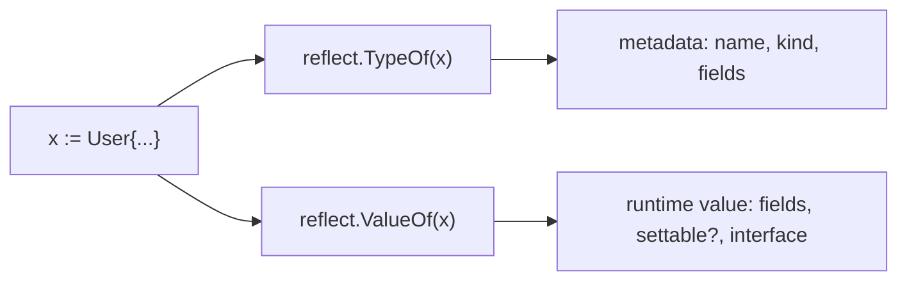
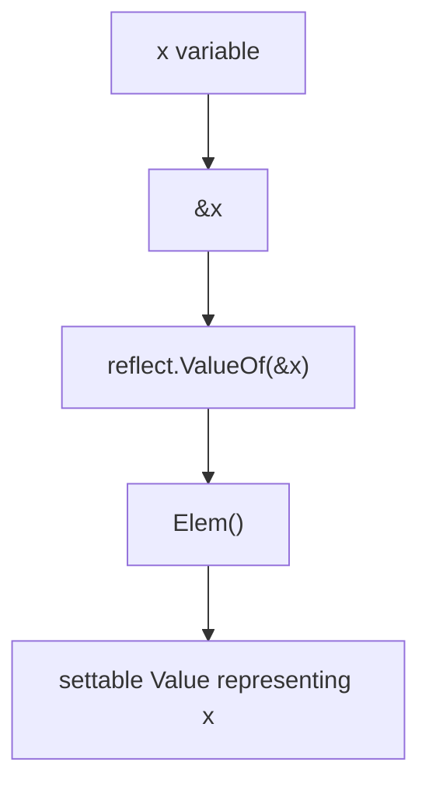
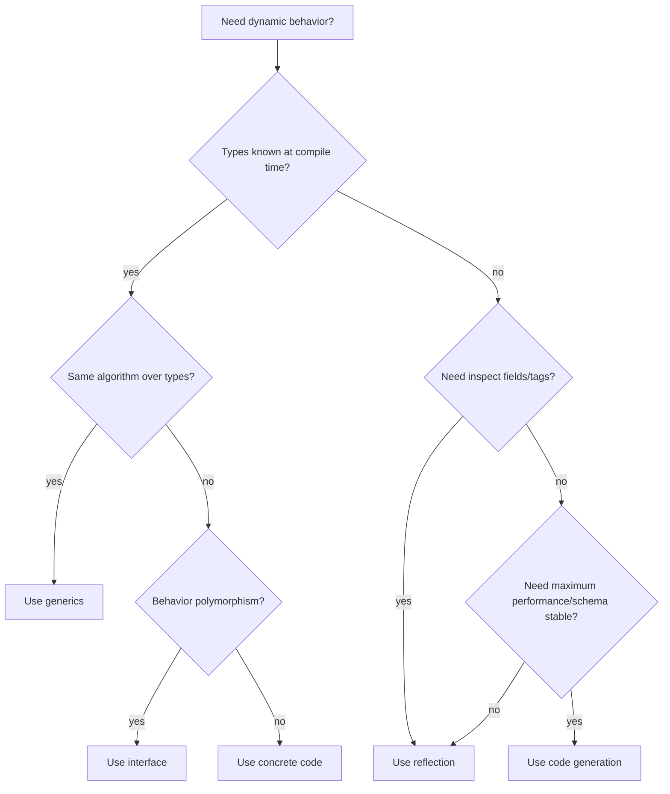
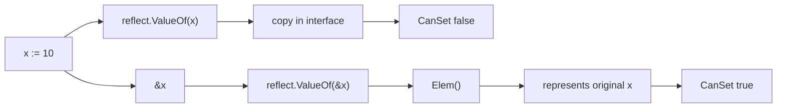

# learn-go-data-model-part-024.md

# Part 024 — Reflection: Type Metadata, Value Mutation, Tags, Dynamic Data

> Seri: `learn-go-data-model`  
> Bagian: `024 / 034`  
> Target pembaca: Java software engineer yang ingin memahami Go data model pada level production engineering  
> Fokus: `reflect.Type`, `reflect.Value`, `Kind`, addressability, settable values, struct tags, dynamic data, panic hazards, performance, dan kapan reflection pantas dipakai

---

## 0. Posisi Part Ini dalam Seri

Kita sudah membahas:

```text
part-018: interface sebagai contract
part-019: interface runtime dynamic type/value
part-020: error sebagai data
part-021..022: generics
part-023: equality/comparability/ordering
```

Reflection adalah lanjutan natural dari interface runtime.

Jika interface menjawab:

```text
Value ini punya dynamic type apa?
Bisakah saya assert ke type tertentu?
```

Reflection menjawab:

```text
Apa metadata type ini?
Apa kind-nya?
Apa fields struct-nya?
Apa method-nya?
Apa tag-nya?
Bisakah value ini saya baca?
Bisakah value ini saya ubah?
Bisakah saya membuat value baru secara dynamic?
```

Reflection adalah metaprogramming runtime. Ia kuat, tetapi harus dipakai dengan disiplin.

Untuk Java engineer, reflection Go mirip secara tujuan dengan Java Reflection, tetapi semantic-nya dipengaruhi oleh:

```text
- interface value dynamic type/value
- addressability
- exported/unexported visibility
- settable Value
- zero Value
- panic-on-misuse style
- no annotation system; struct tags are strings
```

---

## 1. Tujuan Pembelajaran

Setelah part ini, kamu harus bisa:

1. Memahami apa itu reflection di Go.
2. Membedakan `reflect.Type` dan `reflect.Value`.
3. Membedakan `Type` dan `Kind`.
4. Menggunakan `reflect.TypeOf` dan `reflect.ValueOf`.
5. Memahami zero `reflect.Value`.
6. Memahami `CanAddr` dan `CanSet`.
7. Mengubah value via reflection dengan benar.
8. Mengakses field struct dan method.
9. Membaca struct tag.
10. Memahami exported/unexported field limitation.
11. Membuat dynamic decoder/validator sederhana.
12. Menghindari reflection panic.
13. Memahami cost reflection.
14. Menentukan kapan reflection vs generics vs interface vs code generation.
15. Membuat PR checklist untuk reflection.

---

## 2. Reflection dalam Satu Kalimat

Reflection adalah kemampuan program untuk memeriksa struktur dirinya sendiri saat runtime, terutama type dan value.

Di Go, reflection terutama lewat package:

```go
import "reflect"
```

Dua entry point utama:

```go
reflect.TypeOf(x)
reflect.ValueOf(x)
```

Example:

```go
var x any = 42

t := reflect.TypeOf(x)
v := reflect.ValueOf(x)

fmt.Println(t)        // int
fmt.Println(v.Kind()) // int
fmt.Println(v.Int())  // 42
```

Mental model:

```text
interface value -> reflection extracts dynamic type and dynamic value
```

---

## 3. The Three Laws of Reflection

Go Blog “The Laws of Reflection” merangkum tiga hukum:

```text
1. Reflection goes from interface value to reflection object.
2. Reflection goes from reflection object to interface value.
3. To modify a reflection object, the value must be settable.
```

Dalam bentuk praktis:

```go
v := reflect.ValueOf(x) // interface -> reflect.Value
i := v.Interface()      // reflect.Value -> interface
```

Untuk mutate:

```go
p := reflect.ValueOf(&x)
e := p.Elem()
e.SetInt(100)
```

Karena `e` harus settable.

---

## 4. Type vs Value

`reflect.Type` merepresentasikan metadata type.

```go
t := reflect.TypeOf(123)
fmt.Println(t.Name()) // int
fmt.Println(t.Kind()) // int
```

`reflect.Value` merepresentasikan value runtime.

```go
v := reflect.ValueOf(123)
fmt.Println(v.Int()) // 123
```

Difference:

```text
Type:
- what is it?
- name, package path, kind
- fields/methods for structs
- element/key type for containers

Value:
- what value is inside?
- can it be read?
- can it be set?
- can it be indexed/called?
```

Diagram:



---

## 5. Type vs Kind

`Type` is exact type. `Kind` is category.

```go
type UserID string

var id UserID = "u1"

t := reflect.TypeOf(id)

fmt.Println(t.Name()) // UserID
fmt.Println(t.Kind()) // string
```

`Type`:

```text
main.UserID
```

`Kind`:

```text
string
```

Another example:

```go
type Users []User

t := reflect.TypeOf(Users{})

fmt.Println(t.Name()) // Users
fmt.Println(t.Kind()) // slice
```

Mental model:

```text
Type is specific.
Kind is broad runtime category.
```

Kinds include:

```text
Bool, Int, Int8, Int16, Int32, Int64,
Uint, Uint8, Uint16, Uint32, Uint64, Uintptr,
Float32, Float64,
Complex64, Complex128,
Array, Chan, Func, Interface, Map, Pointer, Slice, String, Struct,
UnsafePointer,
Invalid
```

---

## 6. Interface to Reflection Object

```go
var x any = UserID("u1")

t := reflect.TypeOf(x)
v := reflect.ValueOf(x)
```

The static type of `x` is `any`, but `TypeOf` returns dynamic type:

```text
main.UserID
```

Because reflection starts from interface dynamic type/value.

If `x` is nil interface:

```go
var x any

t := reflect.TypeOf(x)  // nil
v := reflect.ValueOf(x) // zero Value
```

Zero `reflect.Value` has `Kind() == Invalid`.

---

## 7. Zero `reflect.Value`

```go
var x any
v := reflect.ValueOf(x)

fmt.Println(v.IsValid()) // false
fmt.Println(v.Kind())    // invalid
```

Many methods panic on zero Value.

Bad:

```go
v.Int() // panic
```

Always check if dynamic input may be nil:

```go
if !v.IsValid() {
    return errors.New("nil value")
}
```

Zero `reflect.Value` is different from a valid nil pointer/slice/map Value.

```go
var p *int = nil
v := reflect.ValueOf(p)

fmt.Println(v.IsValid()) // true
fmt.Println(v.Kind())    // ptr
fmt.Println(v.IsNil())   // true
```

---

## 8. `IsNil`

`Value.IsNil` only applies to certain kinds:

```text
Chan
Func
Map
Pointer
UnsafePointer
Interface
Slice
```

Safe helper:

```go
func IsNilReflect(v reflect.Value) bool {
    if !v.IsValid() {
        return true
    }

    switch v.Kind() {
    case reflect.Chan, reflect.Func, reflect.Map,
        reflect.Pointer, reflect.UnsafePointer,
        reflect.Interface, reflect.Slice:
        return v.IsNil()
    default:
        return false
    }
}
```

Calling `IsNil` on int/string/struct panics.

---

## 9. Going Back: `Interface()`

```go
v := reflect.ValueOf(UserID("u1"))

x := v.Interface()
fmt.Printf("%T %[1]v\n", x)
```

Output:

```text
main.UserID u1
```

Type assertion:

```go
id := x.(UserID)
```

Reflection object -> interface value.

But `Interface()` can panic or be restricted for unexported fields depending how value was obtained.

---

## 10. Addressability and `CanAddr`

```go
x := 10
v := reflect.ValueOf(x)

fmt.Println(v.CanAddr()) // false
```

Why false?

`ValueOf(x)` receives copy of `x` inside interface. That copy is not addressable/settable.

Use pointer:

```go
v := reflect.ValueOf(&x).Elem()

fmt.Println(v.CanAddr()) // true
```

`Elem()` dereferences pointer Value.

Conceptual:



---

## 11. Settability and `CanSet`

Addressable is not always settable, but settable values are addressable.

```go
x := 10

v1 := reflect.ValueOf(x)
fmt.Println(v1.CanSet()) // false

v2 := reflect.ValueOf(&x).Elem()
fmt.Println(v2.CanSet()) // true
```

Set:

```go
v2.SetInt(42)
fmt.Println(x) // 42
```

If you call Set on non-settable value:

```go
v1.SetInt(42) // panic
```

Rule:

```text
To mutate via reflection, pass pointer and call Elem.
```

---

## 12. Mutating Struct Field

```go
type User struct {
    Name string
}

u := User{Name: "Alice"}

v := reflect.ValueOf(&u).Elem()
field := v.FieldByName("Name")

fmt.Println(field.CanSet()) // true

field.SetString("Bob")

fmt.Println(u.Name) // Bob
```

If you pass value, not pointer:

```go
v := reflect.ValueOf(u)
field := v.FieldByName("Name")

fmt.Println(field.CanSet()) // false
```

Because `u` was copied into interface.

---

## 13. Exported vs Unexported Field

Reflection respects package visibility for setting/interface access.

```go
type User struct {
    Name string
    age  int
}
```

From another package, unexported field cannot be set through reflection safely.

Even within same package, reflection has restrictions around unexported fields.

Example:

```go
u := User{Name: "Alice", age: 30}
v := reflect.ValueOf(&u).Elem()

name := v.FieldByName("Name")
age := v.FieldByName("age")

fmt.Println(name.CanSet()) // true
fmt.Println(age.CanSet())  // often false depending context/rules
```

Do not use reflection to break encapsulation. If you need access, design API explicitly.

---

## 14. FieldByName and Field Index

```go
t := reflect.TypeOf(User{})
f, ok := t.FieldByName("Name")
if ok {
    fmt.Println(f.Name)
    fmt.Println(f.Type)
    fmt.Println(f.Tag)
}
```

Value:

```go
v := reflect.ValueOf(User{Name: "Alice"})
name := v.FieldByName("Name")
fmt.Println(name.String())
```

Field by index:

```go
field := t.Field(0)
value := v.Field(0)
```

Use `FieldByName` for readability, but it has lookup cost and ambiguity with embedding.

For repeated operations, cache field indices.

---

## 15. Struct Tags

Struct field can have tag:

```go
type UserDTO struct {
    ID    string `json:"id" validate:"required"`
    Email string `json:"email" validate:"required,email"`
}
```

Read tag:

```go
t := reflect.TypeOf(UserDTO{})
field, _ := t.FieldByName("Email")

jsonName := field.Tag.Get("json")
validateRule := field.Tag.Get("validate")
```

Output:

```text
email
required,email
```

Important:

```text
Struct tags are string metadata.
Language ignores their semantic meaning.
Libraries interpret them.
```

The Go spec says tags are made visible through reflection, participate in struct type identity, but are otherwise ignored by the language.

---

## 16. StructTag Convention

Common tag syntax:

```go
`key:"value" key2:"value2"`
```

Example:

```go
`json:"email,omitempty" db:"email" validate:"required,email"`
```

`reflect.StructTag.Get("json")` parses convention.

If tag malformed:

```go
`json:email`
```

`Get` may return empty. Libraries may ignore or behave unexpectedly.

Guideline:

```text
Treat tags as API.
Test tags for boundary structs.
Avoid tag pile-up on domain structs.
```

---

## 17. Tags and Type Identity

Struct tags are part of struct type identity.

These are different anonymous struct types:

```go
var a struct {
    ID string `json:"id"`
}

var b struct {
    ID string `json:"user_id"`
}

// a = b // not assignable directly due to different type identity
```

However, conversion rules may ignore tags in certain struct conversions when underlying types are otherwise identical. Do not rely on tag conversion tricks for clarity.

Practical lesson:

```text
Tags are not comments. They affect type identity for struct types.
```

---

## 18. Iterating Struct Fields

```go
func PrintFields(x any) error {
    v := reflect.ValueOf(x)
    if !v.IsValid() {
        return errors.New("nil value")
    }

    if v.Kind() == reflect.Pointer {
        if v.IsNil() {
            return errors.New("nil pointer")
        }
        v = v.Elem()
    }

    if v.Kind() != reflect.Struct {
        return fmt.Errorf("expected struct, got %s", v.Kind())
    }

    t := v.Type()
    for i := 0; i < v.NumField(); i++ {
        sf := t.Field(i)
        fv := v.Field(i)

        fmt.Printf("%s %s = %v\n", sf.Name, sf.Type, fv)
    }

    return nil
}
```

Caveat:

```text
Printing fv for unexported fields may be restricted depending operations.
```

---

## 19. Embedded Fields and VisibleFields

Struct embedding complicates field traversal.

```go
type AuditFields struct {
    CreatedAt time.Time
}

type User struct {
    AuditFields
    ID string
}
```

`reflect.VisibleFields(t)` returns visible fields including promoted fields.

```go
fields := reflect.VisibleFields(reflect.TypeOf(User{}))
for _, f := range fields {
    fmt.Println(f.Name, f.Index)
}
```

Useful for serializers/validators that need promoted fields.

But be careful with ambiguity and shadowing.

---

## 20. Kind Switch

Reflection code usually starts with kind switch.

```go
func Describe(x any) string {
    v := reflect.ValueOf(x)
    if !v.IsValid() {
        return "<nil>"
    }

    switch v.Kind() {
    case reflect.String:
        return "string: " + v.String()
    case reflect.Int, reflect.Int8, reflect.Int16, reflect.Int32, reflect.Int64:
        return fmt.Sprintf("int: %d", v.Int())
    case reflect.Bool:
        return fmt.Sprintf("bool: %v", v.Bool())
    case reflect.Struct:
        return "struct: " + v.Type().String()
    default:
        return "kind: " + v.Kind().String()
    }
}
```

Use `Kind` for category-specific operations. Use exact `Type` when domain type matters.

---

## 21. Type Switch vs Reflection

Type switch for known types:

```go
switch v := x.(type) {
case string:
case int:
case User:
}
```

Reflection for unknown arbitrary types:

```go
v := reflect.ValueOf(x)
switch v.Kind() {
case reflect.Struct:
case reflect.Slice:
}
```

Rule:

```text
If supported types are known and finite, prefer type switch.
If shape is unknown/dynamic, reflection may be appropriate.
```

---

## 22. Reflection vs Generics

Generics:

```go
func Contains[T comparable](values []T, target T) bool
```

Reflection:

```go
func ContainsReflect(values any, target any) bool
```

Generics are better when type relation is known at compile time.

Reflection is needed when:

```text
- types unknown until runtime
- inspect struct tags
- generic over arbitrary struct fields
- build framework/library decoder/validator
```

Do not use reflection to implement generic algorithms that generics can express.

---

## 23. Reflection vs Interface

Interface for behavior:

```go
type Validator interface {
    Validate() error
}
```

Reflection for metadata:

```go
`validate:"required,email"`
```

Prefer interface when types can own behavior.

Use reflection when you need external metadata-driven behavior across many struct types.

Example:

```go
func Validate(v any) error
```

can read tags from arbitrary DTO structs.

But domain validation often better as explicit method.

---

## 24. Simple Tag-Based Validator

Example DTO:

```go
type CreateUserRequest struct {
    Email string `validate:"required"`
    Name  string `validate:"required"`
}
```

Validator:

```go
func ValidateRequired(x any) error {
    v := reflect.ValueOf(x)
    if !v.IsValid() {
        return errors.New("nil value")
    }

    if v.Kind() == reflect.Pointer {
        if v.IsNil() {
            return errors.New("nil pointer")
        }
        v = v.Elem()
    }

    if v.Kind() != reflect.Struct {
        return fmt.Errorf("expected struct, got %s", v.Kind())
    }

    t := v.Type()
    var errs []error

    for i := 0; i < v.NumField(); i++ {
        sf := t.Field(i)
        fv := v.Field(i)

        if sf.Tag.Get("validate") != "required" {
            continue
        }

        if isZeroValue(fv) {
            errs = append(errs, fmt.Errorf("%s is required", sf.Name))
        }
    }

    return errors.Join(errs...)
}
```

Helper:

```go
func isZeroValue(v reflect.Value) bool {
    return v.IsZero()
}
```

Caveat:

```text
This is intentionally simplified.
Production validator needs nested structs, slices, custom rules, exported fields, error paths, and tag parsing.
```

---

## 25. `Value.IsZero`

`reflect.Value.IsZero` reports whether value is zero value for its type.

Examples:

```text
"" -> true
0 -> true
nil slice -> true
empty non-nil slice -> false
struct with all zero fields -> true
```

This is useful, but semantics may not match validation.

Example:

```go
Age int `validate:"required"`
```

If age 0 is valid, `IsZero` would wrongly reject.

Validation should be domain-aware.

---

## 26. Dynamic Setter Example

Set exported string field by name:

```go
func SetStringField(ptr any, name string, value string) error {
    v := reflect.ValueOf(ptr)
    if !v.IsValid() || v.Kind() != reflect.Pointer || v.IsNil() {
        return errors.New("expected non-nil pointer")
    }

    e := v.Elem()
    if e.Kind() != reflect.Struct {
        return fmt.Errorf("expected pointer to struct, got pointer to %s", e.Kind())
    }

    f := e.FieldByName(name)
    if !f.IsValid() {
        return fmt.Errorf("field %q not found", name)
    }
    if !f.CanSet() {
        return fmt.Errorf("field %q cannot be set", name)
    }
    if f.Kind() != reflect.String {
        return fmt.Errorf("field %q is %s, not string", name, f.Kind())
    }

    f.SetString(value)
    return nil
}
```

Use:

```go
u := User{}
err := SetStringField(&u, "Name", "Alice")
```

This demonstrates correct pointer + Elem + CanSet checks.

---

## 27. Creating Values Dynamically

Create zero value:

```go
t := reflect.TypeOf(User{})
v := reflect.New(t).Elem()

fmt.Println(v.Type()) // User
```

Set field:

```go
v.FieldByName("Name").SetString("Alice")
```

Convert to interface:

```go
u := v.Interface().(User)
```

Create slice:

```go
sliceType := reflect.SliceOf(reflect.TypeOf(User{}))
s := reflect.MakeSlice(sliceType, 0, 10)
```

Create map:

```go
mapType := reflect.MapOf(reflect.TypeOf(""), reflect.TypeOf(User{}))
m := reflect.MakeMap(mapType)
```

Reflection can build values dynamically, but complexity rises quickly.

---

## 28. Calling Functions Dynamically

```go
fn := func(a int, b int) int {
    return a + b
}

v := reflect.ValueOf(fn)
args := []reflect.Value{
    reflect.ValueOf(1),
    reflect.ValueOf(2),
}

out := v.Call(args)
fmt.Println(out[0].Int()) // 3
```

Caveats:

```text
- wrong argument count/type panics
- slower than direct call
- hard to read
```

Use for frameworks, plugin adapters, test utilities; avoid normal business logic.

---

## 29. Method Lookup

```go
type Greeter struct{}

func (Greeter) Greet(name string) string {
    return "hello " + name
}

v := reflect.ValueOf(Greeter{})
m := v.MethodByName("Greet")

out := m.Call([]reflect.Value{reflect.ValueOf("Go")})
fmt.Println(out[0].String())
```

Method set rules still apply.

Pointer receiver methods require pointer Value:

```go
v := reflect.ValueOf(&Greeter{})
```

---

## 30. Reflection Panic Hazards

Many reflect operations panic if used with wrong kind/state.

Examples:

```text
Value.Int on non-int kind
Value.IsNil on non-nil-able kind
Value.Set on non-settable value
Value.Field on non-struct
Value.Index out of range
Value.Call wrong args
Value.Interface on restricted unexported value
Elem on non-pointer/interface
```

Production reflection code should be defensive:

```text
- check IsValid
- check Kind
- check IsNil where applicable
- check CanSet/CanAddr
- validate argument counts/types
- return error instead of panic
```

---

## 31. Reflection and Performance

Reflection can be slower because:

```text
- runtime type inspection
- dynamic dispatch
- allocation possibility
- interface boxing/unboxing
- less compiler optimization/inlining
- tag parsing/string processing
```

But not all reflection is bad. Reflection at startup/config decode is often fine.

Reflection in hot loops can be expensive.

Patterns:

```text
- cache reflect.Type metadata
- precompute field indices/tags
- avoid FieldByName repeatedly
- use code generation for hot serializers
- use generics for type-safe algorithms
```

Measure:

```bash
go test -bench=. -benchmem
```

---

## 32. Caching Reflection Metadata

Bad repeated lookup:

```go
for _, item := range items {
    v := reflect.ValueOf(item)
    f := v.FieldByName("ID")
    ...
}
```

Better:

```go
type fieldMeta struct {
    index []int
    name  string
}

var cache sync.Map // map[reflect.Type][]fieldMeta
```

Build once per type:

```go
func fieldsFor(t reflect.Type) []fieldMeta {
    if v, ok := cache.Load(t); ok {
        return v.([]fieldMeta)
    }

    fields := buildFields(t)
    actual, _ := cache.LoadOrStore(t, fields)
    return actual.([]fieldMeta)
}
```

Use field index:

```go
fv := v.FieldByIndex(meta.index)
```

This is how many frameworks reduce reflection overhead.

---

## 33. Reflection and Struct Tags in Frameworks

Reflection powers many Go libraries:

```text
- encoding/json
- database mappers
- validators
- config decoders
- dependency injection containers
- ORMs
- test assertion libraries
```

Tag examples:

```go
type UserDTO struct {
    ID    string `json:"id" db:"id" validate:"required"`
    Email string `json:"email" db:"email" validate:"required,email"`
}
```

Risks:

```text
- tag typo not compile-time checked
- tag semantics library-specific
- refactor field name may not update tag
- tag pile-up couples layers
```

Guideline:

```text
Use reflection-based tags at boundaries.
Avoid letting tags become hidden business logic.
```

---

## 34. Reflection and JSON

`encoding/json` uses reflection for struct fields and tags.

Example:

```go
type UserResponse struct {
    ID    string `json:"id"`
    Email string `json:"email,omitempty"`
}
```

Important behavior:

```text
- only exported fields are marshaled/unmarshaled by default
- tags customize field names/options
- zero values interact with omitempty
- nil slice -> null unless omitted
- empty slice -> []
```

Reflection lets json work for arbitrary structs, but cost/semantics must be understood.

For high-performance/strict schemas, code generation or custom marshalers may be used.

---

## 35. Reflection and Database Mapping

Simple mapper idea:

```go
type UserRow struct {
    ID    string `db:"id"`
    Email string `db:"email"`
}
```

A mapper can reflect over fields and tags to bind columns.

Risks:

```text
- runtime errors for missing columns
- type mismatch appears at runtime
- hidden coupling to column names
- slower than explicit scan in hot paths
```

Explicit scan:

```go
err := row.Scan(&u.ID, &u.Email)
```

is verbose but clear and fast.

Use reflection-based DB mapping if productivity outweighs runtime risk and you have tests.

---

## 36. Reflection and Validation

Tag-based validation:

```go
type CreateUserRequest struct {
    Email string `validate:"required,email"`
}
```

Pros:

```text
- centralized
- declarative
- good for DTO syntactic validation
```

Cons:

```text
- tag language not type-checked
- complex business rules awkward
- cross-field validation harder
- reflection cost
```

Domain validation often better explicit:

```go
func NewUser(email Email, name string) (User, error)
```

Boundary validation and domain invariant are different layers.

---

## 37. Reflection and Deep Copy

Generic deep copy via reflection is tempting.

Problems:

```text
- cycles
- unexported fields
- pointers/ownership semantics
- maps/slices
- channels/functions/resources
- domain-specific clone rules
```

Prefer explicit Clone methods for domain types.

```go
func (c Config) Clone() Config {
    return Config{
        values: maps.Clone(c.values),
    }
}
```

Reflection deep copy is framework-level, not default application design.

---

## 38. Reflection and Equality

`reflect.DeepEqual` is reflection-based equality.

It may not match domain semantics:

```text
- nil slice != empty slice
- time.Time should often use Equal
- unexported fields included
- function non-nil values not deeply equal
- map order ignored
```

Use:

```text
slices.Equal
maps.Equal
custom Equal
domain-specific comparator
```

Use `reflect.DeepEqual` mainly in tests/tools when its semantics are acceptable.

---

## 39. Reflection and Unsafe

Reflection sometimes appears with `unsafe` to access unexported fields or optimize.

Avoid this in application code.

```text
If you need unsafe reflection to mutate private fields,
your design boundary is probably wrong.
```

Unsafe reflection may break across Go versions/implementations and violates package encapsulation.

---

## 40. Reflection and Security

Reflection-based mass assignment can be dangerous.

Example:

```go
func Bind(dst any, input map[string]any)
```

If it sets any exported field by name, user may set fields they should not:

```text
Role = "admin"
Approved = true
InternalStatus = "..."
```

Use allowlist:

```go
type CreateUserRequest struct {
    Email string `json:"email"`
    Name  string `json:"name"`
}
```

Map only DTO fields, not domain/admin fields.

Security guideline:

```text
Never bind untrusted input directly into domain/entity structs with privileged fields.
```

---

## 41. Reflection and Error Handling

Reflection APIs often panic. Your wrapper should return errors.

Bad:

```go
func MustSet(dst any, field string, value any) {
    reflect.ValueOf(dst).Elem().FieldByName(field).Set(reflect.ValueOf(value))
}
```

Better:

```go
func SetField(dst any, field string, value any) error {
    // validate pointer, struct, field, CanSet, assignability
}
```

Use panic only for programmer-only initialization helpers if appropriate.

---

## 42. Assignability and Convertibility

When setting reflect value, type must be assignable or convertible.

```go
src := reflect.ValueOf("alice")
dst := field

if src.Type().AssignableTo(dst.Type()) {
    dst.Set(src)
} else if src.Type().ConvertibleTo(dst.Type()) {
    dst.Set(src.Convert(dst.Type()))
} else {
    return fmt.Errorf("cannot assign %s to %s", src.Type(), dst.Type())
}
```

Be careful with conversion:

```text
string -> UserID may be convertible but may bypass validation.
```

For domain types, don't reflect-convert arbitrary raw input into domain type without parser/validator.

---

## 43. Reflection and Dynamic Data Boundary

Dynamic JSON-like input:

```go
map[string]any
```

Reflection can map dynamic keys to struct fields. But robust decoding needs:

```text
- field name/tag matching
- type conversion
- required checks
- unknown field policy
- nested structs
- slices/maps
- error paths
- security allowlist
```

This is why serializers/decoders are complex.

Do not write your own general-purpose decoder casually.

---

## 44. When Reflection Is Appropriate

Reflection is appropriate for:

```text
- serialization/deserialization framework
- validation framework
- ORM/mapper
- config decoder
- dependency injection container
- test assertion tools
- generic logging/introspection
- schema/documentation generation
```

Reflection is usually not appropriate for:

```text
- ordinary domain logic
- performance-critical inner loops
- replacing interfaces
- replacing generics
- bypassing unexported fields
- avoiding explicit mapping
```

---

## 45. Reflection vs Code Generation

Reflection:

```text
+ flexible at runtime
+ less generated code
+ works for arbitrary types
- runtime errors
- slower
- less type-safe
```

Code generation:

```text
+ fast
+ type-specific
+ compile-time errors
+ explicit generated code
- build complexity
- generator maintenance
- regeneration workflow
```

Use codegen for:

```text
- high-performance serialization
- RPC/protobuf
- database access layers
- repetitive mapping with stable schemas
```

Use reflection for:

```text
- dynamic frameworks
- low-frequency config/validation
- tooling
```

---

## 46. Reflection vs Explicit Mapping

Explicit mapping:

```go
func NewUserResponse(u User) UserResponse {
    return UserResponse{
        ID:    string(u.ID()),
        Email: u.Email().String(),
    }
}
```

Reflection mapping:

```go
MapByTags(u, &resp)
```

Explicit mapping is often better for production domain boundaries because:

```text
- visible
- compile-time checked
- easy to review
- can enforce security/redaction
- can handle domain transformation
```

Reflection mapping is useful when repetitive mechanical mapping dominates and risk is controlled.

---

## 47. Mermaid: Reflection Decision



---

## 48. Mermaid: Settable Value



---

## 49. Mini Lab 1 — Type vs Kind

```go
type UserID string

var id UserID = "u1"

t := reflect.TypeOf(id)

fmt.Println(t.String())
fmt.Println(t.Name())
fmt.Println(t.Kind())
```

Expected:

```text
main.UserID
UserID
string
```

---

## 50. Mini Lab 2 — Non-Settable Value

```go
x := 10
v := reflect.ValueOf(x)

fmt.Println(v.CanSet())
v.SetInt(20)
```

Output:

```text
false
panic
```

Fix:

```go
v := reflect.ValueOf(&x).Elem()
v.SetInt(20)
```

---

## 51. Mini Lab 3 — Nil Reflection

```go
var x any
v := reflect.ValueOf(x)

fmt.Println(v.IsValid())
fmt.Println(v.Kind())
```

Output:

```text
false
invalid
```

Many methods on `v` would panic.

---

## 52. Mini Lab 4 — Typed Nil Pointer

```go
var p *int = nil
v := reflect.ValueOf(p)

fmt.Println(v.IsValid())
fmt.Println(v.Kind())
fmt.Println(v.IsNil())
```

Output:

```text
true
ptr
true
```

Nil interface and typed nil pointer are different.

---

## 53. Mini Lab 5 — Struct Tag

```go
type UserDTO struct {
    Email string `json:"email" validate:"required,email"`
}

t := reflect.TypeOf(UserDTO{})
f, _ := t.FieldByName("Email")

fmt.Println(f.Tag.Get("json"))
fmt.Println(f.Tag.Get("validate"))
```

Output:

```text
email
required,email
```

---

## 54. Mini Lab 6 — Dynamic Set Field

```go
type User struct {
    Name string
}

u := User{}

v := reflect.ValueOf(&u).Elem()
f := v.FieldByName("Name")

if f.CanSet() && f.Kind() == reflect.String {
    f.SetString("Alice")
}

fmt.Println(u.Name)
```

Output:

```text
Alice
```

---

## 55. Common Anti-Patterns

### 55.1 Reflection instead of interface

If behavior can be method, use interface.

### 55.2 Reflection instead of generics

If same algorithm over typed containers, use generics.

### 55.3 Reflection for domain mapping by default

Explicit mapping is often safer.

### 55.4 Ignoring CanSet/CanAddr

Leads to panic.

### 55.5 Calling IsNil on wrong Kind

Leads to panic.

### 55.6 Trusting struct tags blindly

Tags are strings, not compile-time checked.

### 55.7 Mass assignment from untrusted input

Security risk.

### 55.8 Reflection in hot loop without caching

Performance risk.

### 55.9 Using unsafe to bypass unexported fields

Encapsulation violation and maintenance risk.

### 55.10 Reflect DeepEqual as business equality

Domain equality may differ.

---

## 56. Production Guidelines

### 56.1 Prefer Static Tools First

Order of preference often:

```text
concrete code -> interface/generics -> codegen -> reflection
```

Reflection when dynamic metadata is truly needed.

### 56.2 Validate Before Reflect Operations

Check:

```text
IsValid
Kind
IsNil
CanSet
CanAddr
AssignableTo
ConvertibleTo
```

### 56.3 Cache Metadata

For repeated reflection over same type, cache field/tag metadata.

### 56.4 Keep Reflection at Boundaries

DTO decode, validation, config, mapping framework. Avoid core domain reflection.

### 56.5 Do Not Bypass Invariants

Do not reflect-set domain unexported fields from raw input.

### 56.6 Treat Tags as Contract

Test tag behavior. Avoid tag pile-up across layers.

### 56.7 Return Errors, Not Panics

Reflection wrapper APIs should handle misuse gracefully unless explicitly Must-style.

### 56.8 Measure Performance

Especially in serializers/mappers/validators.

---

## 57. PR Review Checklist

### 57.1 Necessity

```text
[ ] Is reflection truly needed?
[ ] Would interface solve behavior?
[ ] Would generics solve algorithm?
[ ] Would explicit mapping be safer?
[ ] Would code generation be better for hot path?
```

### 57.2 Safety

```text
[ ] Is IsValid checked?
[ ] Is Kind checked before kind-specific method?
[ ] Is IsNil called only for nil-able kinds?
[ ] Is CanSet checked before Set?
[ ] Is CanAddr checked before Addr?
```

### 57.3 Type Handling

```text
[ ] AssignableTo/ConvertibleTo checked?
[ ] Conversion does not bypass domain validation?
[ ] Pointer vs value handled?
[ ] Nil pointer handled?
```

### 57.4 Struct Tags

```text
[ ] Tags tested?
[ ] Malformed tags handled?
[ ] Tag semantics not hidden business logic?
[ ] Tag pile-up avoided?
```

### 57.5 Security

```text
[ ] No mass assignment into privileged domain fields?
[ ] Allowlist used for untrusted input?
[ ] Sensitive fields not serialized/logged accidentally?
[ ] Unexported fields not bypassed with unsafe?
```

### 57.6 Performance

```text
[ ] Reflection not in hot loop or metadata cached?
[ ] Benchmarked if performance-sensitive?
[ ] FieldByName repeated avoided?
[ ] Allocation checked if necessary?
```

### 57.7 Error Handling

```text
[ ] Reflection panics converted to errors where appropriate?
[ ] Error messages include field/path context?
[ ] Nested errors preserve path?
```

---

## 58. Ringkasan Mental Model

Reflection in Go starts from interface dynamic type/value.

```text
reflect.TypeOf(x)  -> metadata of dynamic type
reflect.ValueOf(x) -> runtime value wrapper
```

Core distinctions:

```text
Type vs Value
Type vs Kind
valid vs zero Value
addressable vs settable
exported vs unexported
tag string vs behavior
```

Most important mutation rule:

```text
To set via reflection:
pass pointer -> ValueOf(ptr) -> Elem() -> field -> CanSet -> Set
```

Reflection is powerful for frameworks and dynamic boundaries, but expensive in complexity.

Untuk Java engineer:

```text
Go reflection is not a default application design tool.
Use it when metadata-driven runtime behavior is truly needed.
```

---

## 59. Apa yang Tidak Dibahas di Part Ini

Part berikutnya:

```text
part-025 — Unsafe, uintptr, Memory Views, and When Not To Be Clever
```

Kita akan membahas:

```text
- unsafe.Pointer
- uintptr
- unsafe.Sizeof/Alignof/Offsetof
- string/[]byte conversion risk
- memory layout
- pointer arithmetic restrictions
- unsafe lifetime hazards
- when unsafe is justified
```

---

## 60. Referensi Resmi

- Go Language Specification — Struct tags, addressability, assignability, type identity  
  https://go.dev/ref/spec
- Package `reflect` — `Type`, `Value`, `StructTag`, `VisibleFields`, `CanSet`, `CanAddr`  
  https://pkg.go.dev/reflect
- Go Blog — The Laws of Reflection  
  https://go.dev/blog/laws-of-reflection
- Package `encoding/json`  
  https://pkg.go.dev/encoding/json
- Go 1.26 Release Notes  
  https://go.dev/doc/go1.26

---

## 61. Status Seri

Selesai:

```text
part-000  Orientation
part-001  Type system core
part-002  Zero value and invariants
part-003  Constants and iota
part-004  Numeric foundations
part-005  Numeric correctness
part-006  Text model I
part-007  Text model II
part-008  Array
part-009  Slice I
part-010  Slice II
part-011  Map I
part-012  Map II
part-013  Struct I
part-014  Struct II
part-015  Struct III
part-016  Pointer
part-017  Nil
part-018  Interface I
part-019  Interface II
part-020  Error as Data
part-021  Generics I
part-022  Generics II
part-023  Comparability / Equality / Ordering
part-024  Reflection
```

Berikutnya:

```text
part-025  Unsafe, uintptr, Memory Views, and When Not To Be Clever
```

Seri belum selesai. Masih ada part 025 sampai part 034.


<!-- NAVIGATION_FOOTER -->
<div class="page-nav">
<a href="./learn-go-data-model-part-023.md">⬅️ Part 023 — Comparability, Equality, Ordering, Hashability</a>
<a href="./index.md">📚 Kategori</a>
<a href="../../index.md">🏠 Home</a>
<a href="./learn-go-data-model-part-025.md">Part 025 — Unsafe, uintptr, Memory Views, and When Not To Be Clever ➡️</a>
</div>
