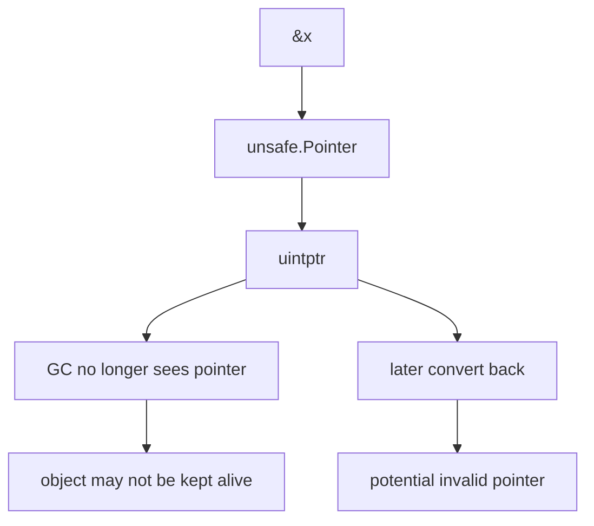
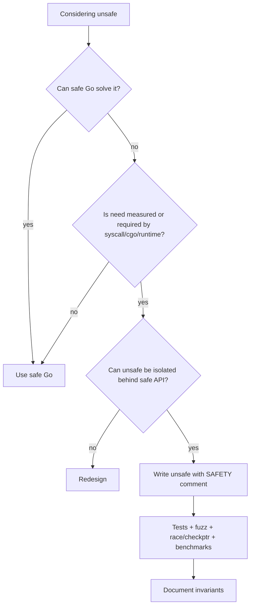

# learn-go-data-model-part-025.md

# Part 025 — Unsafe, uintptr, Memory Views, and When Not To Be Clever

> Seri: `learn-go-data-model`  
> Bagian: `025 / 034`  
> Target pembaca: Java software engineer yang ingin memahami Go data model pada level production engineering  
> Fokus: `unsafe.Pointer`, `uintptr`, layout observation, memory views, zero-copy temptation, lifetime hazards, dan kapan `unsafe` pantas dipakai

---

## 0. Posisi Part Ini dalam Seri

Kita sudah membahas:

```text
part-013: struct layout, alignment, padding
part-016: pointer
part-023: equality/hashability
part-024: reflection
```

Sekarang kita masuk ke area yang harus diperlakukan seperti pisau bedah: `unsafe`.

Go sengaja menyediakan package `unsafe` untuk kebutuhan rendah-level yang tidak bisa diekspresikan dengan type system biasa.

Tetapi nama package-nya bukan kebetulan.

```go
import "unsafe"
```

Artinya:

```text
Kamu sedang keluar dari sebagian jaminan safety Go.
Compiler tidak lagi bisa melindungi kamu sepenuhnya.
Bug bisa muncul sebagai data corruption, GC hazard, alignment issue, security issue, atau portability issue.
```

Untuk Java engineer:

```text
Java unsafe/off-heap intuition tidak langsung sama.
Go punya pointer eksplisit, tetapi tetap garbage-collected.
unsafe bukan “mode cepat” biasa.
unsafe adalah escape hatch untuk runtime/library/system boundary.
```

---

## 1. Tujuan Pembelajaran

Setelah part ini, kamu harus bisa:

1. Menjelaskan apa itu package `unsafe`.
2. Memakai `unsafe.Sizeof`, `Alignof`, dan `Offsetof` untuk observasi layout.
3. Memahami `unsafe.Pointer`.
4. Memahami beda pointer biasa, `unsafe.Pointer`, dan `uintptr`.
5. Menjelaskan mengapa `uintptr` bukan pointer.
6. Menjelaskan lifetime hazard saat pointer dikonversi ke `uintptr`.
7. Memahami kapan pointer arithmetic valid dan kapan berbahaya.
8. Memahami kenapa string/`[]byte` zero-copy conversion berbahaya.
9. Memahami memory view dan aliasing.
10. Mengetahui kapan `unsafe` pantas dipakai.
11. Mengetahui kapan `unsafe` harus ditolak dalam PR.
12. Membuat checklist review unsafe code.

---

## 2. Unsafe dalam Satu Kalimat

`unsafe` adalah package yang memungkinkan operasi yang tidak dijamin aman oleh type system Go.

Contoh:

```go
size := unsafe.Sizeof(int64(0))
align := unsafe.Alignof(int64(0))
```

Contoh lebih berbahaya:

```go
p := unsafe.Pointer(&x)
```

`unsafe.Pointer` dapat dikonversi ke/dari pointer type tertentu dengan aturan khusus.

Ini memungkinkan hal-hal seperti:

```text
- melihat layout memory
- interoperasi low-level
- membangun runtime/library primitif
- melakukan conversion tanpa copy pada kasus tertentu
- mengakses memory dengan offset tertentu
```

Tetapi juga memungkinkan:

```text
- melanggar type safety
- membuat pointer invalid
- membuat GC tidak melihat pointer
- membaca memory salah
- menulis field salah
- mengandalkan layout yang tidak portable
```

---

## 3. `unsafe.Sizeof`

`unsafe.Sizeof(x)` mengembalikan ukuran value `x` dalam bytes.

```go
fmt.Println(unsafe.Sizeof(int64(0))) // biasanya 8
```

Untuk struct:

```go
type Bad struct {
    A bool
    B int64
    C bool
}

fmt.Println(unsafe.Sizeof(Bad{}))
```

Ukuran mencakup padding dalam struct.

Untuk slice:

```go
s := []byte{1, 2, 3}
fmt.Println(unsafe.Sizeof(s))
```

Ini mengukur slice descriptor, bukan backing array.

Untuk string:

```go
str := "hello"
fmt.Println(unsafe.Sizeof(str))
```

Ini mengukur string header, bukan bytes string data.

Rule:

```text
Sizeof measures the value itself, not transitive referenced memory.
```

---

## 4. `unsafe.Alignof`

`unsafe.Alignof(x)` mengembalikan alignment requirement value `x`.

```go
fmt.Println(unsafe.Alignof(int64(0)))
```

Alignment adalah requirement address multiple agar CPU/runtime bisa mengakses value secara benar/efisien.

Struct field layout menambahkan padding agar field memenuhi alignment.

Example:

```go
type Layout struct {
    A byte
    B int64
}

fmt.Println(unsafe.Alignof(Layout{}))
fmt.Println(unsafe.Alignof(Layout{}.B))
```

Alignment bergantung arsitektur dan implementation detail.

Guideline:

```text
Use Alignof to observe, not to hard-code assumptions casually.
```

---

## 5. `unsafe.Offsetof`

`unsafe.Offsetof(x.f)` mengembalikan offset field dalam struct.

```go
type User struct {
    ID   int64
    Flag bool
}

fmt.Println(unsafe.Offsetof(User{}.ID))
fmt.Println(unsafe.Offsetof(User{}.Flag))
```

Useful for:

```text
- studying layout
- low-level serialization
- atomic/cache-line analysis
- runtime/library internals
- interoperability boundary
```

Danger:

```text
If you use offsets to read/write memory manually, layout changes can break code silently.
```

Do not build business logic around offsets.

---

## 6. Layout Observation Example

```go
type Example struct {
    A bool
    B int64
    C int32
}

func main() {
    fmt.Println("size:", unsafe.Sizeof(Example{}))
    fmt.Println("align:", unsafe.Alignof(Example{}))
    fmt.Println("A:", unsafe.Offsetof(Example{}.A))
    fmt.Println("B:", unsafe.Offsetof(Example{}.B))
    fmt.Println("C:", unsafe.Offsetof(Example{}.C))
}
```

Use this to learn layout.

But production guideline:

```text
If your ordinary application depends on exact struct offset, ask why.
```

---

## 7. Ordinary Pointer vs `unsafe.Pointer`

Ordinary pointer:

```go
var p *int
```

Type-safe:

```text
p points to int
*p is int
compiler checks operations
```

`unsafe.Pointer`:

```go
var up unsafe.Pointer
```

Can represent pointer to arbitrary type.

Convert ordinary pointer to unsafe:

```go
x := int64(10)
up := unsafe.Pointer(&x)
```

Convert unsafe pointer to another pointer type:

```go
p := (*int64)(up)
fmt.Println(*p)
```

Danger:

```go
q := (*float64)(up)
fmt.Println(*q) // reinterpret int64 bits as float64; usually wrong
```

`unsafe.Pointer` bypasses type safety.

---

## 8. `uintptr` Is Not Pointer

`uintptr` is an integer type large enough to hold pointer bit pattern.

```go
addr := uintptr(unsafe.Pointer(&x))
```

But:

```text
uintptr is not a pointer.
GC does not treat uintptr as pointer.
Object can move? Go GC currently non-moving for heap objects, but code must not rely on uintptr preserving liveness.
Object can be collected if only uintptr remains.
```

Critical rule:

```text
Do not store uintptr as if it keeps object alive.
```

Bad:

```go
addr := uintptr(unsafe.Pointer(&x))
// later
p := (*int)(unsafe.Pointer(addr))
```

Between conversion and later use, GC may not know `x` must remain live.

---

## 9. Safe-ish Pointer Arithmetic Pattern

If you must do pointer arithmetic, keep conversion in one expression pattern.

Example concept:

```go
p := unsafe.Pointer(uintptr(unsafe.Pointer(base)) + offset)
```

Then immediately convert/use according to valid rules.

But this is only safe if:

```text
- base points to valid object
- offset remains within same allocated object or allowed region
- alignment is correct
- lifetime of base object is preserved
- resulting type is correct
```

Most application code should never do this.

---

## 10. `unsafe.Add`

Modern Go provides `unsafe.Add` for pointer arithmetic.

```go
p2 := unsafe.Add(unsafe.Pointer(p), offset)
```

This is clearer than manual `uintptr` arithmetic.

Still unsafe.

It does not magically validate:

```text
- bounds
- lifetime
- alignment
- type correctness
```

It only expresses pointer addition.

Guideline:

```text
Prefer unsafe.Add over uintptr arithmetic when pointer arithmetic is necessary.
But first ask whether pointer arithmetic is necessary at all.
```

---

## 11. `unsafe.Slice`

`unsafe.Slice(ptr, len)` builds slice from pointer and length.

```go
p := (*byte)(unsafe.Pointer(&buf[0]))
s := unsafe.Slice(p, len(buf))
```

Useful at low-level boundaries.

Danger:

```text
- ptr must point to valid memory for len elements
- memory must remain alive
- length must be correct
- mutation through slice aliases original memory
```

If length wrong, you can read/write outside valid object.

---

## 12. `unsafe.String`, `unsafe.StringData`, `unsafe.SliceData`

Modern Go has helpers:

```go
unsafe.String(ptr *byte, len IntegerType) string
unsafe.StringData(str string) *byte
unsafe.SliceData(slice []T) *T
```

These are for low-level code.

Important:

```text
String data is immutable by language contract.
Do not mutate string data.
Do not create string pointing to mutable memory that will change unless you fully understand consequences.
```

`unsafe.StringData` for empty string may return nil or unspecified pointer semantics depending docs; always follow official docs.

Use these functions only with strict lifetime guarantees.

---

## 13. String and []byte Zero-Copy Temptation

Safe conversion copies:

```go
b := []byte(s)
s := string(b)
```

Unsafe zero-copy conversions can avoid copy but create hazards.

If you make string view over `[]byte` backing array:

```text
string is supposed to be immutable
but []byte can mutate
```

Then string content can appear to change, violating assumptions.

Example concept:

```go
b := []byte("hello")
// unsafe string view over b
// mutate b[0] = 'H'
// string view changes too
```

This can break maps, caches, hashing, logs, security checks.

Rule:

```text
Do not use unsafe string/byte conversions in application code unless data is immutable for entire string lifetime.
```

---

## 14. Why Mutating String Data Is Dangerous

Strings can be:

```text
- backed by read-only memory
- shared
- used as map keys
- assumed immutable by compiler/runtime/library code
```

If you mutate string data through unsafe, you can corrupt invariants.

Never do:

```go
p := unsafe.StringData(s)
*(*byte)(unsafe.Pointer(p)) = 'X' // forbidden/dangerous
```

This can crash or corrupt.

---

## 15. Memory View and Aliasing

Unsafe often creates another view of same memory.

Example:

```go
type Header struct {
    A uint32
    B uint32
}

var h Header
bytes := unsafe.Slice((*byte)(unsafe.Pointer(&h)), unsafe.Sizeof(h))
```

Now `bytes` aliases `h`.

Mutation:

```go
bytes[0] = 1
```

Mutates `h` memory.

Problems:

```text
- endianness
- padding bytes
- alignment
- future layout changes
- pointer fields inside struct
- GC safety
```

Do not serialize structs by raw memory view unless you fully control layout and portability requirements.

---

## 16. Endianness

Raw memory bytes depend on machine endianness.

```go
var x uint32 = 0x01020304
```

Memory could be:

```text
little endian: 04 03 02 01
big endian:    01 02 03 04
```

For binary encoding, prefer:

```go
binary.LittleEndian.PutUint32(buf, x)
binary.BigEndian.PutUint32(buf, x)
```

Do not unsafe-cast numeric structs to bytes for portable formats.

---

## 17. Padding Bytes

Struct padding bytes may contain unspecified data.

```go
type Message struct {
    A byte
    B int64
}
```

There may be padding between A and B.

Raw memory serialization includes padding.

Problems:

```text
- nondeterministic bytes
- possible information leak
- incompatible across architectures/compiler versions
- equality/hash mismatch
```

For wire/disk format, encode fields explicitly.

---

## 18. Alignment Hazards

Reinterpreting arbitrary address as `*T` may violate alignment.

```go
p := (*uint64)(unsafe.Pointer(&buf[1]))
```

`buf[1]` may not be aligned for uint64.

On some architectures, unaligned access can be slow or invalid.

Use encoding/binary for unaligned bytes:

```go
v := binary.LittleEndian.Uint64(buf[1:9])
```

---

## 19. Pointer Fields and GC Hazards

If you reinterpret memory containing pointers as bytes or integers, you can confuse GC if you hide pointers.

Danger patterns:

```text
- storing pointer bits in uintptr long-term
- moving pointer values through non-pointer memory
- writing arbitrary bytes over pointer fields
- constructing fake pointer to object not actually there
```

Go GC needs to know where pointers are.

Unsafe code must preserve GC invariants.

Application code should avoid unsafe memory tricks involving pointer-containing types.

---

## 20. `runtime.KeepAlive`

`runtime.KeepAlive(x)` ensures `x` is considered live until that point.

Useful in low-level code when passing pointer to syscall/C-like boundary or after unsafe pointer conversion.

Conceptual:

```go
p := unsafe.Pointer(&buf[0])
syscallUsingPointer(p)
runtime.KeepAlive(buf)
```

This prevents compiler/GC from considering `buf` dead before syscall completes.

If you do not understand why `KeepAlive` is needed, you probably should not write that unsafe code.

---

## 21. Unsafe and cgo/syscall Boundary

Unsafe is sometimes necessary for:

```text
- syscall
- cgo
- memory-mapped files
- device buffers
- OS APIs
- network/kernel structures
```

But boundary code should be isolated.

Pattern:

```text
internal safe API
    -> small unsafe adapter
        -> syscall/cgo
```

Do not let unsafe pointers leak across your whole application.

---

## 22. Unsafe and Atomic

Atomic operations often require pointer to properly aligned values.

```go
var counter atomic.Int64
counter.Add(1)
```

Prefer typed atomic types from `sync/atomic` over unsafe pointer tricks.

Older low-level code may use:

```go
atomic.AddInt64((*int64)(unsafe.Pointer(p)), 1)
```

Avoid unless maintaining old/runtime-level code.

Use:

```go
atomic.Int64
atomic.Pointer[T]
```

where appropriate.

---

## 23. `atomic.Pointer[T]`

`atomic.Pointer[T]` provides typed atomic pointer.

```go
var p atomic.Pointer[Config]

cfg := &Config{}
p.Store(cfg)

current := p.Load()
```

This avoids many unsafe casts previously used for atomic pointer storage.

Use typed atomics instead of unsafe when possible.

---

## 24. Unsafe and Reflection

Reflection plus unsafe can access unexported fields or manipulate memory.

This is usually a red flag.

Bad motivation:

```text
Need to set private field of another package.
```

Better:

```text
Use public API.
Change package design.
Add explicit constructor/option.
```

Unsafe reflection can break package invariants and future compatibility.

---

## 25. Unsafe and Serialization

Unsafe serialization looks attractive:

```go
func BytesOf[T any](v *T) []byte {
    return unsafe.Slice((*byte)(unsafe.Pointer(v)), unsafe.Sizeof(*v))
}
```

This is wrong as general serializer.

Problems:

```text
- includes padding
- endianness
- pointer fields meaningless outside process
- unexported/runtime representation
- versioning
- alignment
- security leak
```

Use explicit encoding:

```text
encoding/binary
encoding/json
encoding/gob
protobuf
flatbuffers/capnproto if needed
custom explicit format
```

---

## 26. Unsafe and Hashing

Hashing raw memory of struct is dangerous for same reasons:

```text
padding bytes
endianness
pointer addresses
non-canonical representation
```

For stable hash, write canonical fields in fixed order.

```go
func HashUserKey(tenant TenantID, user UserID) [32]byte {
    h := sha256.New()
    h.Write([]byte(tenant))
    h.Write([]byte{0})
    h.Write([]byte(user))
    var out [32]byte
    copy(out[:], h.Sum(nil))
    return out
}
```

Do not hash raw struct memory unless very low-level and controlled.

---

## 27. Unsafe and Map Keys

Never mutate memory underlying a map key.

Example with unsafe string view over mutable bytes:

```text
b -> string view s
m[s] = value
mutate b
```

Now map key's string content effectively changed after hashing/insertion. This violates map invariants and can corrupt behavior.

Rule:

```text
Map keys must be immutable for their lifetime in the map.
```

Unsafe can break this. Do not.

---

## 28. Unsafe and Slices

Constructing slice with wrong length/capacity is catastrophic.

```go
s := unsafe.Slice(ptr, n)
```

If `n` too large:

```text
out-of-bounds read/write
data corruption
panic maybe, but not guaranteed at correct boundary
```

Safe alternative:

```go
s := buf[start:end]
```

Use normal slicing whenever possible.

---

## 29. Unsafe and Lifetime

Unsafe view must not outlive underlying memory.

Bad:

```go
func BytesView() []byte {
    var x uint64 = 123
    return unsafe.Slice((*byte)(unsafe.Pointer(&x)), 8)
}
```

The returned slice points to stack variable no longer valid. Compiler escape/lifetime may change behavior, but concept is invalid.

Correct approach:

```go
func BytesCopy() []byte {
    var x uint64 = 123
    out := make([]byte, 8)
    binary.LittleEndian.PutUint64(out, x)
    return out
}
```

---

## 30. Unsafe and Stack Growth

Goroutine stacks can grow/shrink. Go pointers are managed correctly by runtime, but unsafe integer addresses are not.

If you convert pointer to `uintptr` and keep it, stack movement/lifetime can invalidate assumptions.

Again:

```text
uintptr is not pointer.
```

---

## 31. Unsafe and Portability

Unsafe code can depend on:

```text
- GOARCH word size
- alignment rules
- endianness
- struct layout
- compiler version
- runtime representation
```

If code must be portable, isolate per-platform assumptions.

Use build tags if needed:

```go
//go:build linux && amd64
```

But prefer safe standard library abstractions.

---

## 32. Unsafe and Go Version Compatibility

Unsafe code may rely on implementation details that can change.

Even if code works today:

```text
- future compiler optimization may break assumption
- runtime representation may evolve
- checkptr may detect invalid pointer use
```

Use tests, fuzzing, race detector, and `-d=checkptr` where applicable.

But tools cannot prove unsafe correctness fully.

---

## 33. `checkptr`

Go has pointer checking instrumentation in certain build modes.

Example command:

```bash
go test -gcflags=all=-d=checkptr=2 ./...
```

This can catch some invalid unsafe pointer usage.

It is not a complete proof.

Use it for unsafe-heavy code.

---

## 34. Race Detector and Unsafe

Race detector may not catch all unsafe races, especially if you hide memory access from runtime instrumentation.

Unsafe code can make concurrency bugs harder to detect.

If unsafe code touches shared memory:

```text
- document synchronization
- use atomic/mutex correctly
- benchmark and test under race detector
- keep unsafe region tiny
```

---

## 35. When Unsafe Is Justified

Unsafe may be justified when:

```text
- standard library/runtime-level work
- syscall/cgo interop
- memory-mapped IO
- high-performance serialization with proven constraints
- zero-copy conversion in extremely hot path with immutable lifetime guarantee
- implementing low-level data structure where safe Go cannot meet requirement
- replacing unsafe would create unacceptable measured cost
```

Even then:

```text
- isolate it
- document invariants
- test heavily
- provide safe wrapper
- benchmark before/after
```

---

## 36. When Unsafe Is Not Justified

Unsafe is not justified for:

```text
- avoiding a small allocation without profiling
- writing clever code
- bypassing visibility/invariants
- generic serialization shortcut
- ordinary DTO mapping
- normal business logic
- premature optimization
- code golf
```

If you cannot explain lifetime, aliasing, alignment, and GC safety, do not use unsafe.

---

## 37. Safe Wrapper Pattern

Bad:

```go
// unsafe scattered everywhere
```

Good:

```go
package memview

func BytesViewOfReadOnlyString(s string) []byte {
    // carefully implemented unsafe or not exposed if dangerous
}
```

Better yet, expose safe semantics:

```go
func BytesCopyOfString(s string) []byte {
    return []byte(s)
}
```

If unsafe view is exposed, name it honestly:

```go
func UnsafeBytesView(...)
```

Document:

```text
- returned slice must not be mutated
- must not outlive source
- source must remain immutable
```

But Go cannot enforce this.

---

## 38. Unsafe Documentation Template

Unsafe block should have comment:

```go
// SAFETY:
// - p points to an array of at least n bytes.
// - The memory remains alive for the lifetime of the returned slice.
// - The returned slice is read-only by convention.
// - The caller guarantees no concurrent mutation.
// - Alignment is valid for byte access.
```

If you cannot write this comment, you do not understand the code enough.

---

## 39. Unsafe Code Review Questions

Ask:

```text
What invariant is unsafe relying on?
Who guarantees it?
Can safe Go express this?
What benchmark proves need?
Can this be isolated?
Can misuse be prevented by API?
What happens on 32-bit?
What happens on different endianness?
Does GC see all pointers?
Can object be collected?
Can map key mutate?
Can race detector see access?
Can fuzzing reach this?
```

Unsafe code should make reviewers slower, not impressed.

---

## 40. Example: Safe Layout Observation

This is acceptable:

```go
func PrintLayout[T any](name string, zero T) {
    fmt.Printf("%s size=%d align=%d\n",
        name,
        unsafe.Sizeof(zero),
        unsafe.Alignof(zero),
    )
}
```

This uses unsafe only to observe size/alignment, not to reinterpret memory.

Good use in learning, benchmarking, low-level analysis.

---

## 41. Example: Explicit Binary Encoding Instead of Unsafe

Bad:

```go
type Header struct {
    Version uint16
    Length  uint32
}

func Encode(h Header) []byte {
    return unsafe.Slice((*byte)(unsafe.Pointer(&h)), unsafe.Sizeof(h))
}
```

Good:

```go
func Encode(h Header) []byte {
    buf := make([]byte, 6)
    binary.BigEndian.PutUint16(buf[0:2], h.Version)
    binary.BigEndian.PutUint32(buf[2:6], h.Length)
    return buf
}
```

Benefits:

```text
- no padding
- explicit endian
- stable wire format
- safe
```

---

## 42. Example: []byte to string

Safe:

```go
func BytesToStringCopy(b []byte) string {
    return string(b)
}
```

Unsafe view is dangerous:

```go
func UnsafeBytesToStringView(b []byte) string {
    return unsafe.String(unsafe.SliceData(b), len(b))
}
```

Safety requirements:

```text
- b must not be mutated while string is used
- b memory must remain alive
- string must not be used as map key if b can mutate
```

Most code should use safe copy.

---

## 43. Example: string to []byte

Safe:

```go
func StringToBytesCopy(s string) []byte {
    return []byte(s)
}
```

Unsafe mutable view over string data is not acceptable.

If you need read-only byte iteration, use string indexing/range or copy.

Do not create mutable byte slice pointing to string data.

---

## 44. Unsafe and Memory-Mapped Files

Memory-mapped file APIs may return byte slice backed by OS-managed memory.

Unsafe may be involved in mapping.

Risks:

```text
- file unmapped while slice still used
- concurrent mutation by another process
- alignment if interpreting structs
- endianness
- crash on invalid access
```

Wrap mmap with lifecycle object:

```go
type MMap struct {
    data []byte
}

func (m *MMap) Bytes() []byte
func (m *MMap) Close() error
```

Document that bytes invalid after close.

---

## 45. Unsafe and Off-Heap

Go does not have Java-style official off-heap object model for ordinary Go pointers.

If using memory outside Go heap:

```text
- Go GC does not scan it for pointers
- you must manage lifetime
- you must not store Go pointers in non-Go memory unless rules allow
- finalizers are not reliable as primary lifecycle
```

Prefer Go heap unless there is strong reason.

For high-performance systems, off-heap design is advanced and must be isolated.

---

## 46. Unsafe and `unsafe.StringData`/`SliceData` Edge Cases

Be careful with empty values:

```go
var s string
p := unsafe.StringData(s)
```

Do not assume you can dereference pointer for empty string.

```go
var b []byte
p := unsafe.SliceData(b)
```

Nil/empty behavior must follow docs. Do not dereference if len is zero.

Pattern:

```go
if len(b) > 0 {
    p := unsafe.SliceData(b)
    _ = *p
}
```

---

## 47. Mermaid: Pointer Conversion Risk



---

## 48. Mermaid: Unsafe Decision Flow



---

## 49. Mini Lab 1 — Sizeof Slice

```go
s := make([]byte, 1024)
fmt.Println(unsafe.Sizeof(s))
```

Question:

```text
Does this print 1024?
```

Answer:

```text
No. It prints size of slice descriptor, not backing array.
```

---

## 50. Mini Lab 2 — Struct Padding

```go
type A struct {
    X bool
    Y int64
    Z bool
}

type B struct {
    Y int64
    X bool
    Z bool
}

fmt.Println(unsafe.Sizeof(A{}))
fmt.Println(unsafe.Sizeof(B{}))
```

Likely output differs on common 64-bit platforms because field order changes padding.

Lesson:

```text
Field order affects layout.
Measure per target platform.
```

---

## 51. Mini Lab 3 — uintptr Hazard

```go
func Bad() uintptr {
    x := 42
    return uintptr(unsafe.Pointer(&x))
}
```

Question:

```text
Can caller safely convert returned uintptr back to *int?
```

Answer:

```text
No. uintptr does not keep x alive and x lifetime ended.
```

---

## 52. Mini Lab 4 — Unsafe String View Hazard

```go
b := []byte("hello")
s := unsafe.String(unsafe.SliceData(b), len(b))

b[0] = 'H'

fmt.Println(s)
```

The string may appear changed. This violates string immutability expectations.

Lesson:

```text
Unsafe zero-copy view over mutable bytes is dangerous.
```

---

## 53. Mini Lab 5 — Endianness

```go
var x uint32 = 0x01020304
bytes := unsafe.Slice((*byte)(unsafe.Pointer(&x)), 4)
fmt.Printf("% x\n", bytes)
```

Output depends on architecture endianness. Do not use raw memory for portable binary encoding.

---

## 54. Mini Lab 6 — Padding Leak

```go
type Msg struct {
    A byte
    B int64
}
```

If serialized by raw memory, bytes include padding. Padding may contain unspecified data. Encode fields explicitly instead.

---

## 55. Common Anti-Patterns

### 55.1 Unsafe string/byte conversion for tiny optimization

Without profiling and lifetime proof.

### 55.2 Storing pointer in uintptr

GC/lifetime hazard.

### 55.3 Raw struct serialization

Padding, endian, pointer, versioning problems.

### 55.4 Mutating string data

Breaks immutability and may crash.

### 55.5 Unsafe to bypass unexported fields

Design smell.

### 55.6 Pointer arithmetic across objects

Invalid memory assumptions.

### 55.7 Unsafe scattered across packages

Hard to audit.

### 55.8 No safety comment

Reviewer cannot verify invariants.

### 55.9 Unsafe in business logic

Almost always wrong.

### 55.10 Trusting tests only

Unsafe bugs can be architecture/timing/GC dependent.

---

## 56. Production Guidelines

### 56.1 Avoid Unsafe by Default

Safe Go is fast enough for most application code.

### 56.2 Isolate Unsafe

Keep in small internal package/file with clear API.

### 56.3 Document Safety Invariants

Use `// SAFETY:` comments.

### 56.4 Prefer Standard Library Safe Tools

```text
encoding/binary
bytes
strings
slices
maps
sync/atomic typed APIs
```

### 56.5 Benchmark Before Unsafe Optimization

Need evidence.

### 56.6 Test with Tooling

```bash
go test -race ./...
go test -gcflags=all=-d=checkptr=2 ./...
go test -fuzz=...
```

### 56.7 Keep Portability Explicit

Document architecture assumptions. Use build tags when necessary.

### 56.8 Never Hide Pointers from GC

Do not store pointer bits in integer long-term.

### 56.9 Do Not Serialize Raw Memory

Use explicit canonical encoding.

### 56.10 Prefer Copy Over Catastrophic Alias

A copy is often cheaper than a production corruption incident.

---

## 57. PR Review Checklist

### 57.1 Necessity

```text
[ ] Can safe Go solve this?
[ ] Is there benchmark evidence?
[ ] Is this syscall/cgo/runtime-level boundary?
[ ] Is unsafe isolated?
```

### 57.2 Safety Comment

```text
[ ] Is there a SAFETY comment?
[ ] Does it explain lifetime?
[ ] Does it explain alignment?
[ ] Does it explain aliasing/mutation?
[ ] Does it explain bounds?
[ ] Does it explain GC visibility?
```

### 57.3 Pointer/uintptr

```text
[ ] uintptr not stored long-term?
[ ] Pointer converted to uintptr and back only in valid pattern?
[ ] runtime.KeepAlive needed?
[ ] unsafe.Add used appropriately?
```

### 57.4 Memory View

```text
[ ] Underlying memory remains alive?
[ ] View length correct?
[ ] Mutation rules clear?
[ ] Map key immutability preserved?
[ ] String immutability not violated?
```

### 57.5 Layout

```text
[ ] Endianness handled?
[ ] Padding ignored/zeroed?
[ ] Alignment valid?
[ ] Struct contains no pointer fields if raw bytes used?
[ ] Architecture assumptions documented?
```

### 57.6 Concurrency/GC

```text
[ ] Data race impossible or synchronized?
[ ] GC sees all Go pointers?
[ ] No Go pointers stored in unmanaged memory incorrectly?
[ ] Race/checkptr tests run?
```

### 57.7 API

```text
[ ] Unsafe does not leak to normal callers?
[ ] Safe wrapper prevents misuse?
[ ] Function name indicates unsafe if contract unsafe?
[ ] Documentation says what caller must guarantee?
```

---

## 58. Ringkasan Mental Model

`unsafe` gives power by removing guardrails.

Core tools:

```text
unsafe.Sizeof   -> observe value size
unsafe.Alignof  -> observe alignment
unsafe.Offsetof -> observe field offset
unsafe.Pointer  -> arbitrary pointer conversion bridge
uintptr         -> integer, not pointer
unsafe.Add      -> pointer arithmetic
unsafe.Slice    -> build slice from pointer+len
unsafe.String   -> build string from pointer+len
```

Core dangers:

```text
- lifetime
- aliasing
- alignment
- padding
- endianness
- GC visibility
- string immutability
- map key mutation
- portability
```

Untuk Java engineer:

```text
unsafe is not “faster mode”.
unsafe is “you now share responsibility with compiler/runtime”.
```

Best unsafe code is:

```text
small
isolated
documented
tested
benchmarked
replaceable
boring
```

---

## 59. Apa yang Tidak Dibahas di Part Ini

Part berikutnya:

```text
part-026 — Encoding Data: JSON, XML, CSV, Gob, Binary, Text Marshaling
```

Kita akan membahas:

```text
- encoding/json semantics
- struct tags
- omitempty
- custom MarshalJSON/UnmarshalJSON
- XML/CSV/Gob/binary
- text marshaling
- stable wire contracts
- DTO boundary design
```

---

## 60. Referensi Resmi

- Package `unsafe`  
  https://pkg.go.dev/unsafe
- Go Language Specification — Pointer types, unsafe pointer conversion, struct layout concepts  
  https://go.dev/ref/spec
- Package `runtime` — `KeepAlive`  
  https://pkg.go.dev/runtime#KeepAlive
- Package `encoding/binary`  
  https://pkg.go.dev/encoding/binary
- Package `sync/atomic`  
  https://pkg.go.dev/sync/atomic
- Go 1.26 Release Notes  
  https://go.dev/doc/go1.26

---

## 61. Status Seri

Selesai:

```text
part-000  Orientation
part-001  Type system core
part-002  Zero value and invariants
part-003  Constants and iota
part-004  Numeric foundations
part-005  Numeric correctness
part-006  Text model I
part-007  Text model II
part-008  Array
part-009  Slice I
part-010  Slice II
part-011  Map I
part-012  Map II
part-013  Struct I
part-014  Struct II
part-015  Struct III
part-016  Pointer
part-017  Nil
part-018  Interface I
part-019  Interface II
part-020  Error as Data
part-021  Generics I
part-022  Generics II
part-023  Comparability / Equality / Ordering
part-024  Reflection
part-025  Unsafe
```

Berikutnya:

```text
part-026  Encoding Data: JSON, XML, CSV, Gob, Binary, Text Marshaling
```

Seri belum selesai. Masih ada part 026 sampai part 034.


<!-- NAVIGATION_FOOTER -->
<div class="page-nav">
<a href="./learn-go-data-model-part-024.md">⬅️ Part 024 — Reflection: Type Metadata, Value Mutation, Tags, Dynamic Data</a>
<a href="./index.md">📚 Kategori</a>
<a href="../../index.md">🏠 Home</a>
<a href="./learn-go-data-model-part-026.md">Part 026 — Encoding Data: JSON, XML, CSV, Gob, Binary, Text Marshaling ➡️</a>
</div>
