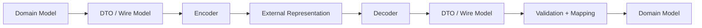
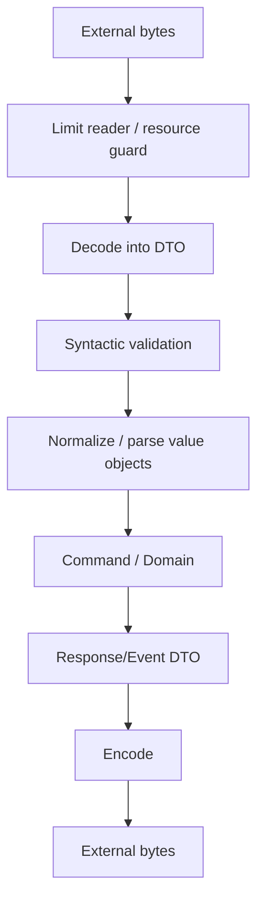
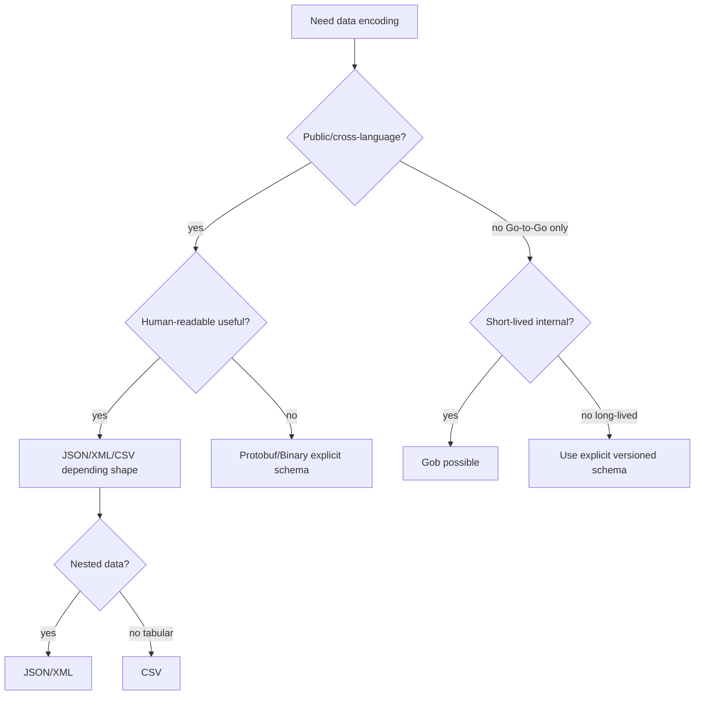

# learn-go-data-model-part-026.md

# Part 026 — Encoding Data: JSON, XML, CSV, Gob, Binary, Text Marshaling

> Seri: `learn-go-data-model`  
> Bagian: `026 / 034`  
> Target pembaca: Java software engineer yang ingin memahami Go data model pada level production engineering  
> Fokus: encoding sebagai boundary contract: JSON, XML, CSV, Gob, binary, text marshaling, custom marshal/unmarshal, DTO, compatibility, security, dan performance

---

## 0. Posisi Part Ini dalam Seri

Kita sudah membahas:

```text
part-006..007: text, string, byte, rune, UTF-8
part-011..012: map semantics
part-013..015: struct layout dan domain/DTO modeling
part-017: nil
part-020: error as data
part-024: reflection dan struct tags
part-025: unsafe dan kenapa raw memory bukan serialization
```

Sekarang kita masuk ke encoding.

Encoding adalah proses mengubah data Go menjadi representasi eksternal:

```text
Go value -> JSON/XML/CSV/Gob/Binary/Text
```

Decoding kebalikannya:

```text
JSON/XML/CSV/Gob/Binary/Text -> Go value
```

Di produksi, encoding bukan sekadar “marshal/unmarshal”.

Encoding adalah kontrak antar boundary:

```text
- API contract
- message schema
- database payload
- config file
- audit log
- cache value
- event payload
- CLI output
- file format
- wire protocol
```

Jika kontrak encoding berubah sembarangan, sistem lain rusak.

---

## 1. Tujuan Pembelajaran

Setelah part ini, kamu harus bisa:

1. Mendesain DTO untuk encoding dengan aman.
2. Memahami `encoding/json` marshal/unmarshal.
3. Memahami exported field, struct tag, `omitempty`, dan `omitzero`.
4. Memahami nil slice/map vs empty slice/map dalam JSON.
5. Menulis custom `MarshalJSON` dan `UnmarshalJSON`.
6. Memakai `encoding.TextMarshaler` / `TextUnmarshaler`.
7. Memahami streaming JSON dengan `Encoder`/`Decoder`.
8. Memahami XML encoding dan keterbatasannya.
9. Memahami CSV sebagai tabular text boundary.
10. Memahami Gob dan kapan tidak cocok.
11. Memahami binary encoding dengan `encoding/binary`.
12. Menghindari raw memory serialization dengan `unsafe`.
13. Mendesain backward/forward compatible payload.
14. Menghindari security leaks dan mass assignment.
15. Membuat checklist PR untuk encoding boundary.

---

## 2. Encoding sebagai Boundary Contract

Encoding adalah boundary.



Golden rule:

```text
Do not expose domain model blindly as wire format.
```

Kenapa?

```text
- domain fields may change
- transport names may differ
- sensitive fields may leak
- nil/zero semantics differ
- backward compatibility matters
- validation boundary differs
- database/entity shape differs from API shape
```

Prefer:

```go
type CreateUserRequest struct {
    Email string `json:"email"`
    Name  string `json:"name"`
}

type UserResponse struct {
    ID    string `json:"id"`
    Email string `json:"email"`
    Name  string `json:"name"`
}
```

Domain:

```go
type User struct {
    id    UserID
    email Email
    name  string
}
```

Mapping is boundary control.

---

## 3. Standard Encoding Packages

Go standard library includes many encoding packages:

```text
encoding/json
encoding/xml
encoding/csv
encoding/gob
encoding/binary
encoding/hex
encoding/base64
encoding/pem
encoding/asn1
```

The `encoding` package defines shared interfaces:

```text
BinaryMarshaler / BinaryUnmarshaler
TextMarshaler / TextUnmarshaler
```

Packages such as JSON/XML/Gob can use these interfaces.

Common rule:

```text
Use explicit, standard, documented encodings.
Do not serialize raw memory.
```

---

## 4. JSON Basics

Marshal:

```go
data, err := json.Marshal(v)
if err != nil {
    return err
}
```

Unmarshal:

```go
var v CreateUserRequest
if err := json.Unmarshal(data, &v); err != nil {
    return err
}
```

Important:

```text
Marshal needs exported fields for struct fields.
Unmarshal needs pointer target.
Struct tags customize field names/options.
```

Example:

```go
type UserResponse struct {
    ID    string `json:"id"`
    Email string `json:"email"`
}
```

Output:

```json
{"id":"u1","email":"a@example.com"}
```

---

## 5. Exported Fields Only

```go
type User struct {
    ID    string `json:"id"`
    email string `json:"email"`
}
```

Marshal:

```json
{"id":"u1"}
```

`email` unexported, ignored by `encoding/json`.

This is one reason domain structs with unexported fields do not directly encode as desired.

Use DTO:

```go
type UserResponse struct {
    ID    string `json:"id"`
    Email string `json:"email"`
}
```

---

## 6. JSON Struct Tags

Common forms:

```go
type UserResponse struct {
    ID        string `json:"id"`
    Email     string `json:"email,omitempty"`
    CreatedAt string `json:"created_at"`
}
```

Tag parts:

```text
json:"name"
json:"name,omitempty"
json:"-"
json:",omitempty"
```

Ignore field:

```go
PasswordHash []byte `json:"-"`
```

Use explicit response DTO rather than relying on `json:"-"` for sensitive domain fields.

Why?

```text
One missed tag can leak data.
```

---

## 7. `omitempty`

`omitempty` omits field if field has empty value.

Empty values include:

```text
false
0
nil pointer
nil interface
array/slice/map/string of length zero
```

Example:

```go
type Response struct {
    Count int `json:"count,omitempty"`
}
```

If Count is 0:

```json
{}
```

Problem:

```text
0 may be meaningful.
```

Guideline:

```text
Do not use omitempty when zero is meaningful.
```

Use pointer if absence is different from zero:

```go
type Response struct {
    Count *int `json:"count,omitempty"`
}
```

Then:

```text
nil -> omitted
new(0) -> {"count":0}
```

With Go 1.26, `new(0)` style initialized pointer is available if project targets Go 1.26+.

---

## 8. `omitzero`

Modern `encoding/json` supports `omitzero` tag option.

Conceptually:

```go
type Event struct {
    At time.Time `json:"at,omitzero"`
}
```

`omitzero` omits a field if it is zero according to the type's zero value, and can use an `IsZero() bool` method when present.

Difference from `omitempty` matters for struct types like `time.Time`.

Traditional `omitempty` does not omit a zero struct merely because all fields are zero. `omitzero` is designed for zero-value semantics.

Guideline:

```text
Use omitempty for JSON-empty semantics.
Use omitzero for Go-zero semantics.
Test both.
```

Do not casually combine tags without understanding output.

---

## 9. Nil Slice/Map vs Empty Slice/Map in JSON

```go
type Response struct {
    Items []string          `json:"items"`
    Meta  map[string]string `json:"meta"`
}
```

Nil values:

```go
Response{}
```

JSON:

```json
{"items":null,"meta":null}
```

Empty values:

```go
Response{
    Items: []string{},
    Meta: map[string]string{},
}
```

JSON:

```json
{"items":[],"meta":{}}
```

For API response, usually prefer:

```json
[]
{}
```

Normalize in mapper:

```go
func NewResponse(items []Item, meta map[string]string) Response {
    if items == nil {
        items = []Item{}
    }
    if meta == nil {
        meta = map[string]string{}
    }
    return Response{Items: items, Meta: meta}
}
```

---

## 10. JSON Unknown Fields

Default `json.Unmarshal` ignores unknown fields.

```json
{"email":"a@example.com","role":"admin"}
```

If DTO lacks `role`, it is ignored.

For strict request decoding:

```go
dec := json.NewDecoder(r.Body)
dec.DisallowUnknownFields()

var req CreateUserRequest
if err := dec.Decode(&req); err != nil {
    return err
}
```

Use strictness for APIs where unknown fields likely indicate client bug or security issue.

But for forward compatibility, sometimes ignoring unknown fields is intentional.

Decision:

```text
Public API request:
- strict may catch bugs
- lenient may allow future expansion

Event/message:
- forward compatibility often requires ignoring unknown fields
```

---

## 11. JSON Numbers

When unmarshaling into `any`, JSON numbers decode as `float64` by default.

```go
var v any
json.Unmarshal([]byte(`{"n":123}`), &v)
```

`v` contains:

```text
map[string]any{"n": float64(123)}
```

Risk:

```text
large integers lose precision
```

Use typed struct:

```go
type Payload struct {
    N int64 `json:"n"`
}
```

Or decoder `UseNumber` for dynamic decoding:

```go
dec := json.NewDecoder(r)
dec.UseNumber()
```

Then numbers decode as `json.Number`.

Parse explicitly:

```go
n, err := num.Int64()
```

---

## 12. JSON `null`

Unmarshal `null` behavior depends target.

Pointer:

```go
var p *int = new(1)
json.Unmarshal([]byte(`null`), &p)
// p == nil
```

Value:

```go
var i int = 10
json.Unmarshal([]byte(`null`), &i)
// i remains? behavior should be tested; null into non-pointer often leaves zero/unchanged depending context
```

For fields:

```go
type Req struct {
    Name *string `json:"name"`
}
```

Missing vs null:

```json
{}
{"name":null}
```

Both result in `Name == nil` with plain pointer field. If you need distinguish missing vs explicit null, you need custom unmarshal or optional wrapper with set/null state.

---

## 13. Missing vs Null vs Zero

PATCH semantics often need tri-state:

```text
missing -> no change
null -> clear value
value -> set value
```

Pointer field gives only two states:

```text
nil -> missing or null
non-nil -> value
```

Custom type:

```go
type OptionalNullable[T any] struct {
    Set   bool
    Null  bool
    Value T
}
```

Custom `UnmarshalJSON`:

```go
func (o *OptionalNullable[T]) UnmarshalJSON(data []byte) error {
    o.Set = true

    if string(data) == "null" {
        o.Null = true
        var zero T
        o.Value = zero
        return nil
    }

    return json.Unmarshal(data, &o.Value)
}
```

But field missing does not call `UnmarshalJSON`, so `Set` remains false.

Use carefully.

---

## 14. Custom `MarshalJSON`

Example domain type:

```go
type UserID string
```

Default JSON is string, fine.

For richer type:

```go
type Money struct {
    currency Currency
    cents    int64
}
```

Custom JSON:

```go
func (m Money) MarshalJSON() ([]byte, error) {
    type moneyJSON struct {
        Currency Currency `json:"currency"`
        Cents    int64    `json:"cents"`
    }

    return json.Marshal(moneyJSON{
        Currency: m.currency,
        Cents:    m.cents,
    })
}
```

Avoid recursive call:

```go
func (m Money) MarshalJSON() ([]byte, error) {
    return json.Marshal(m) // infinite recursion
}
```

Use alias/helper struct.

---

## 15. Custom `UnmarshalJSON`

```go
func (m *Money) UnmarshalJSON(data []byte) error {
    type moneyJSON struct {
        Currency Currency `json:"currency"`
        Cents    int64    `json:"cents"`
    }

    var raw moneyJSON
    if err := json.Unmarshal(data, &raw); err != nil {
        return err
    }

    next, err := NewMoney(raw.Currency, raw.Cents)
    if err != nil {
        return err
    }

    *m = next
    return nil
}
```

Rules:

```text
- pointer receiver required to mutate target
- parse into raw DTO
- validate via constructor
- assign only after success
```

Do not partially mutate receiver before validation succeeds.

---

## 16. Custom JSON for String-Like Value Object

```go
type Email struct {
    canonical string
}

func (e Email) MarshalJSON() ([]byte, error) {
    return json.Marshal(e.String())
}

func (e *Email) UnmarshalJSON(data []byte) error {
    var s string
    if err := json.Unmarshal(data, &s); err != nil {
        return err
    }

    parsed, err := ParseEmail(s)
    if err != nil {
        return err
    }

    *e = parsed
    return nil
}
```

This lets value object validate at decoding boundary.

But be careful:

```text
If Email zero value invalid, decoding missing field won't call UnmarshalJSON.
Request validation still needed.
```

---

## 17. `encoding.TextMarshaler`

Interface:

```go
type TextMarshaler interface {
    MarshalText() (text []byte, err error)
}
```

Unmarshal:

```go
type TextUnmarshaler interface {
    UnmarshalText(text []byte) error
}
```

Useful for types that have canonical text representation.

Example:

```go
func (id UserID) MarshalText() ([]byte, error) {
    return []byte(id), nil
}

func (id *UserID) UnmarshalText(text []byte) error {
    if len(text) == 0 {
        return errors.New("empty user id")
    }
    *id = UserID(text)
    return nil
}
```

JSON, XML, and other packages may use text marshaling for map keys or scalar representations.

---

## 18. Time Encoding

`time.Time` implements text/JSON marshaling.

Default JSON is RFC3339-like string.

```go
type Event struct {
    OccurredAt time.Time `json:"occurred_at"`
}
```

Guidelines:

```text
- use UTC for machine event timestamps unless domain needs local timezone
- avoid custom date formats unless contract requires
- do not store time as string in domain
- parse/format at boundary
- use omitzero/IsZero intentionally
```

For date-only domain, consider custom type:

```go
type Date struct {
    time.Time
}
```

with custom marshal/unmarshal enforcing `YYYY-MM-DD`.

---

## 19. Streaming JSON

For large input/output, use `Encoder`/`Decoder`.

Decode from `io.Reader`:

```go
dec := json.NewDecoder(r)
dec.DisallowUnknownFields()

var req Request
if err := dec.Decode(&req); err != nil {
    return err
}
```

Encode to `io.Writer`:

```go
enc := json.NewEncoder(w)
if err := enc.Encode(resp); err != nil {
    return err
}
```

`Encoder.Encode` writes newline after JSON value.

For APIs, this is usually fine.

For multiple JSON values stream:

```go
for dec.More() {
    var item Item
    if err := dec.Decode(&item); err != nil {
        return err
    }
}
```

Be precise when decoding arrays vs streams.

---

## 20. Preventing Multiple JSON Values

When decoding HTTP body, a malicious/buggy client could send:

```json
{"email":"a"} {"extra":"value"}
```

A single `Decode` may parse first object and leave trailing data.

Pattern:

```go
dec := json.NewDecoder(r.Body)
dec.DisallowUnknownFields()

var req Request
if err := dec.Decode(&req); err != nil {
    return err
}

if dec.Decode(&struct{}{}) != io.EOF {
    return errors.New("request body must contain single JSON value")
}
```

Also limit body size:

```go
r.Body = http.MaxBytesReader(w, r.Body, maxBodyBytes)
```

Encoding is also security boundary.

---

## 21. JSON v2 Experimental Note

Go 1.25 introduced an experimental JSON v2 implementation behind `GOEXPERIMENT=jsonv2`, including `encoding/json/v2` and `encoding/json/jsontext`.

For production library/application targeting stable behavior, be explicit about whether you use stable `encoding/json` or experimental JSON v2.

Guideline for this series:

```text
Use stable encoding/json unless project deliberately opts into jsonv2 experiment.
Document behavior if using experimental packages.
```

Check your target Go version and experiment flags.

---

## 22. XML Basics

Marshal:

```go
data, err := xml.Marshal(v)
```

Unmarshal:

```go
var v T
err := xml.Unmarshal(data, &v)
```

Tags:

```go
type Person struct {
    XMLName xml.Name `xml:"person"`
    ID      string   `xml:"id,attr"`
    Name    string   `xml:"name"`
}
```

Output:

```xml
<person id="u1"><name>Alice</name></person>
```

XML has concepts JSON does not:

```text
- elements
- attributes
- character data
- comments
- namespaces
- nested paths
```

Go XML tags can represent some of these.

---

## 23. XML Gotchas

XML is more complex than JSON.

Issues:

```text
- namespaces are subtle
- attributes vs elements
- mixed content
- order can matter
- entity handling/security
- schema validation not built into encoding/xml
```

For security, be careful with untrusted XML. The standard library does not process external entities like classic XXE style parsers, but XML still has complexity and resource concerns.

For complex XML contracts, write tests with real samples.

---

## 24. CSV Basics

CSV is tabular text.

Read:

```go
r := csv.NewReader(input)
records, err := r.ReadAll()
```

Streaming:

```go
r := csv.NewReader(input)

for {
    rec, err := r.Read()
    if errors.Is(err, io.EOF) {
        break
    }
    if err != nil {
        return err
    }

    // process rec []string
}
```

Write:

```go
w := csv.NewWriter(output)
if err := w.Write([]string{"id", "email"}); err != nil {
    return err
}
w.Flush()
if err := w.Error(); err != nil {
    return err
}
```

Always check `w.Error()` after `Flush`.

---

## 25. CSV to Struct Mapping

CSV has no built-in struct tag mapper in standard library.

You often write explicit mapping:

```go
type UserCSV struct {
    ID    string
    Email string
}

func ParseUserRecord(rec []string) (UserCSV, error) {
    if len(rec) != 2 {
        return UserCSV{}, fmt.Errorf("expected 2 columns, got %d", len(rec))
    }

    return UserCSV{
        ID:    rec[0],
        Email: rec[1],
    }, nil
}
```

For production CSV:

```text
- handle header
- validate column count
- trim if contract says so
- parse numbers/dates
- collect row number in errors
- decide empty vs missing
- handle large files streaming
```

---

## 26. Gob Basics

Gob is Go-specific binary serialization.

```go
var buf bytes.Buffer

enc := gob.NewEncoder(&buf)
if err := enc.Encode(value); err != nil {
    return err
}

dec := gob.NewDecoder(&buf)
if err := dec.Decode(&out); err != nil {
    return err
}
```

Gob is useful for:

```text
- Go-to-Go internal communication
- tests/tools
- simple persistence where only Go reads/writes
```

Gob is not ideal for:

```text
- public wire protocols
- cross-language contracts
- long-term stable storage
- strict schema evolution across many services
```

Use JSON/Protobuf/Avro/etc. for explicit cross-language contracts.

---

## 27. Gob and Type Evolution

Gob transmits type information and can handle some field evolution, but do not treat it as universal schema migration solution.

Risks:

```text
- Go-specific
- type/package name coupling
- less transparent than JSON
- difficult to inspect/debug manually
- compatibility requires tests
```

For long-lived event storage, prefer explicit schema and versioning.

---

## 28. Binary Encoding

`encoding/binary` encodes fixed-size values.

```go
buf := make([]byte, 8)
binary.BigEndian.PutUint64(buf, value)
```

Read:

```go
value := binary.BigEndian.Uint64(buf)
```

For structs:

```go
type Header struct {
    Version uint16
    Length  uint32
}
```

Encode explicitly:

```go
func EncodeHeader(h Header) []byte {
    buf := make([]byte, 6)
    binary.BigEndian.PutUint16(buf[0:2], h.Version)
    binary.BigEndian.PutUint32(buf[2:6], h.Length)
    return buf
}
```

Do not unsafe-cast struct to bytes due to padding/endianness/versioning.

---

## 29. Binary Endianness

Choose endianness explicitly:

```go
binary.BigEndian
binary.LittleEndian
binary.NativeEndian
```

For wire/disk format, prefer BigEndian or LittleEndian explicitly.

Avoid NativeEndian for portable persistent/wire data unless contract says native.

---

## 30. Binary Varint

For compact integer encoding:

```go
buf := make([]byte, binary.MaxVarintLen64)
n := binary.PutUvarint(buf, x)
buf = buf[:n]
```

Read:

```go
x, n := binary.Uvarint(buf)
if n <= 0 {
    return errors.New("invalid varint")
}
```

Useful in custom binary formats.

But if your format grows complex, consider Protobuf/CBOR/MessagePack/etc. depending project constraints.

---

## 31. Text Marshaling for Domain Values

For canonical text domain types:

```go
type CaseID string

func (id CaseID) MarshalText() ([]byte, error) {
    if id == "" {
        return nil, errors.New("empty case id")
    }
    return []byte(id), nil
}

func (id *CaseID) UnmarshalText(text []byte) error {
    if len(text) == 0 {
        return errors.New("empty case id")
    }
    *id = CaseID(text)
    return nil
}
```

Benefits:

```text
- reusable across encoders
- explicit canonical representation
- useful for map keys in JSON
```

Caveat:

```text
UnmarshalText should validate, not blindly assign.
```

---

## 32. Encoding Map Keys

JSON object keys are strings.

Map key types:

```go
map[string]V
```

Natural.

For other key types, `encoding/json` has rules; types implementing text marshaling may be encoded as object keys.

Example:

```go
type UserID string

func (id UserID) MarshalText() ([]byte, error) {
    return []byte(id), nil
}
```

Then:

```go
map[UserID]string{}
```

can have string JSON object keys.

But design question:

```text
Should this be JSON object or array of key/value objects?
```

For stable ordering and duplicate handling, array may be better:

```json
[
  {"user_id":"u1","value":"..."}
]
```

Remember: JSON object key order should not be semantic.

---

## 33. DTO vs Domain for Encoding

Domain:

```go
type User struct {
    id    UserID
    email Email
}
```

Response DTO:

```go
type UserResponse struct {
    ID    string `json:"id"`
    Email string `json:"email"`
}
```

Mapping:

```go
func NewUserResponse(u User) UserResponse {
    return UserResponse{
        ID:    string(u.ID()),
        Email: u.Email().String(),
    }
}
```

This is more verbose but safer.

Use direct domain marshaling only when:

```text
- type is itself a value object with canonical representation
- encoding is intrinsic to type
- no sensitive/internal fields
```

Example:

```go
Email.MarshalText
Money.MarshalJSON
```

---

## 34. Versioning Payloads

For long-lived events/messages:

```go
type CaseSubmittedEventV1 struct {
    Version     int       `json:"version"`
    EventID     string    `json:"event_id"`
    CaseID      string    `json:"case_id"`
    SubmittedAt time.Time `json:"submitted_at"`
}
```

Guidelines:

```text
- additive fields are easiest
- avoid renaming/removing fields
- keep old readers tolerant if possible
- version payload or envelope
- test old payloads
```

Envelope:

```go
type EventEnvelope struct {
    Type    string          `json:"type"`
    Version int             `json:"version"`
    Payload json.RawMessage `json:"payload"`
}
```

Then dispatch by type/version.

---

## 35. `json.RawMessage`

`json.RawMessage` stores raw encoded JSON.

Use cases:

```text
- delayed decoding
- event envelope
- preserve unknown payload
- custom dispatch
```

Example:

```go
type Envelope struct {
    Type    string          `json:"type"`
    Payload json.RawMessage `json:"payload"`
}
```

Decode:

```go
var env Envelope
if err := json.Unmarshal(data, &env); err != nil {
    return err
}

switch env.Type {
case "case_submitted":
    var payload CaseSubmitted
    if err := json.Unmarshal(env.Payload, &payload); err != nil {
        return err
    }
}
```

Use carefully; do not let raw messages avoid validation forever.

---

## 36. Custom Unmarshal with Alias to Avoid Recursion

Pattern:

```go
type User struct {
    Name string `json:"name"`
}

func (u *User) UnmarshalJSON(data []byte) error {
    type Alias User

    var raw Alias
    if err := json.Unmarshal(data, &raw); err != nil {
        return err
    }

    if raw.Name == "" {
        return errors.New("name required")
    }

    *u = User(raw)
    return nil
}
```

Why alias?

```text
Avoid calling User.UnmarshalJSON recursively.
```

---

## 37. Unknown Fields and Compatibility

Strict decoding:

```go
dec.DisallowUnknownFields()
```

Pros:

```text
- catches typos
- reduces accidental ignored data
- security-friendly for admin APIs
```

Cons:

```text
- clients cannot send future fields
- rolling upgrades can be harder
```

Lenient decoding:

```text
- better forward compatibility
- but typos silently ignored
```

Choose per boundary.

Internal event consumers often need forward compatibility. Public mutation APIs often benefit from strictness.

---

## 38. Required Fields

JSON has no built-in required tag in Go stdlib.

```go
type Req struct {
    Email string `json:"email"`
}
```

If missing, Email becomes zero value.

You must validate after decode:

```go
if req.Email == "" {
    return errors.New("email required")
}
```

But zero may be valid for some fields.

For presence detection, use pointer or custom optional type.

---

## 39. Security: Mass Assignment

Bad:

```go
type User struct {
    Email string `json:"email"`
    Role  string `json:"role"`
}

json.Unmarshal(body, &user)
```

Client can set role.

Better:

```go
type CreateUserRequest struct {
    Email string `json:"email"`
    Name  string `json:"name"`
}
```

Then map to command/domain.

Never decode untrusted input directly into domain/entity with privileged fields.

---

## 40. Security: Sensitive Output

Bad:

```go
type User struct {
    ID           string `json:"id"`
    Email        string `json:"email"`
    PasswordHash []byte `json:"password_hash"`
}
```

Even with `json:"-"`, safer to create response DTO that only has allowed fields.

```go
type UserResponse struct {
    ID    string `json:"id"`
    Email string `json:"email"`
}
```

Allowlist beats blocklist for output.

---

## 41. Security: Resource Limits

Decoding untrusted data can consume memory/CPU.

Use:

```text
- http.MaxBytesReader for HTTP body
- io.LimitReader for generic reader
- streaming decoder for large arrays
- context/timeouts at higher layer
- max records/fields for CSV
```

Example:

```go
limited := io.LimitReader(r, 1<<20)
dec := json.NewDecoder(limited)
```

CSV:

```go
reader.FieldsPerRecord = expected
```

---

## 42. Encoding and Error Context

Wrap errors with boundary context.

```go
if err := json.NewDecoder(r.Body).Decode(&req); err != nil {
    return fmt.Errorf("decode create user request: %w", err)
}
```

For row-based CSV:

```go
return fmt.Errorf("parse csv row %d: %w", rowNum, err)
```

For event:

```go
return fmt.Errorf("decode event type %q version %d: %w", env.Type, env.Version, err)
```

Do not expose raw internal error directly to external clients.

---

## 43. Deterministic Encoding

Deterministic output matters for:

```text
- tests
- signing
- hashing
- cache keys
- audit comparison
```

JSON maps may have deterministic key ordering in current `encoding/json` behavior, but do not build protocol semantics on object order. JSON object order should not matter semantically.

For signatures:

```text
Use canonical JSON or explicit canonical format.
```

For cache keys:

```go
type CacheKey struct {
    TenantID TenantID
    UserID   UserID
}
```

Better than marshaling arbitrary map.

---

## 44. Encoding and Floating Point

JSON floats can be problematic:

```text
precision
NaN/Inf unsupported by JSON encoding
rounding
cross-language differences
```

Money should not be float.

Use:

```text
integer minor units
decimal string
structured money object
```

Example:

```go
type MoneyJSON struct {
    Currency string `json:"currency"`
    Cents    int64  `json:"cents"`
}
```

Or decimal string if required:

```json
{"amount":"123.45","currency":"USD"}
```

---

## 45. Encoding and Decimal

Go stdlib has no built-in decimal type.

Options:

```text
- int64 minor units
- string decimal
- third-party decimal library
- database numeric handling at boundary
```

For wire contracts, string decimal avoids binary float issues.

But validate grammar and scale.

---

## 46. Encoding and Enum

Domain:

```go
type CaseStatus string

const (
    CaseStatusDraft     CaseStatus = "draft"
    CaseStatusSubmitted CaseStatus = "submitted"
)
```

Custom unmarshal for validation:

```go
func (s *CaseStatus) UnmarshalText(text []byte) error {
    switch CaseStatus(text) {
    case CaseStatusDraft, CaseStatusSubmitted:
        *s = CaseStatus(text)
        return nil
    default:
        return fmt.Errorf("unknown case status %q", text)
    }
}
```

This prevents invalid enum silently entering DTO/domain.

---

## 47. Encoding and Backward Compatibility

Rules:

```text
Adding optional field -> usually safe
Removing field -> breaking
Renaming field -> breaking
Changing type -> breaking
Changing requiredness -> breaking
Changing null/empty semantics -> often breaking
Changing time format -> breaking
Changing enum values -> can be breaking
```

For public API:

```text
Version if necessary.
Deprecate before removal.
Keep old fields where possible.
```

For events:

```text
Never assume all consumers upgrade together.
```

---

## 48. Encoding and Golden Tests

Golden tests store expected encoded output.

Use for stable contracts:

```text
testdata/user_response_v1.json
testdata/case_submitted_v1.json
```

Test:

```go
got, err := json.MarshalIndent(resp, "", "  ")
if err != nil {
    t.Fatal(err)
}

want := os.ReadFile("testdata/user_response_v1.json")
if diff := cmp.Diff(string(want), string(got)); diff != "" {
    t.Fatal(diff)
}
```

Be careful with map ordering and formatting.

Golden tests help detect accidental contract changes.

---

## 49. Encoding and Fuzzing

Decoders are good fuzz targets.

```go
func FuzzDecodeRequest(f *testing.F) {
    f.Add([]byte(`{"email":"a@example.com"}`))

    f.Fuzz(func(t *testing.T, data []byte) {
        var req CreateUserRequest
        _ = json.Unmarshal(data, &req)
    })
}
```

For custom unmarshalers, fuzzing can catch panics and weird states.

Invariant:

```text
Decode should not panic.
If err == nil, resulting value should pass basic invariants.
```

---

## 50. Encoding and Performance

JSON reflection can allocate.

Performance options:

```text
- stream instead of buffering
- reuse buffers carefully
- avoid map[string]any for known schema
- decode into struct
- avoid unnecessary string/[]byte conversions
- custom marshal for hot types
- code generation/alternative library only after benchmark
```

Measure:

```bash
go test -bench=. -benchmem
```

Do not switch library without:

```text
- correctness tests
- compatibility tests
- security review
- benchmark on real payload
```

---

## 51. Binary vs JSON vs Gob vs CSV Decision Matrix

| Format | Good For | Bad For |
|---|---|---|
| JSON | public APIs, logs, events, human-readable contracts | high-performance binary, exact decimal unless modeled |
| XML | legacy/enterprise contracts, document-like data | simple modern APIs, namespace complexity |
| CSV | tabular exports/imports | nested data, strict types |
| Gob | Go-to-Go internal streams | cross-language/public/long-term storage |
| Binary | compact protocols, fixed formats | ad-hoc schema evolution, debugging |
| Text Marshaling | canonical scalar values | complex nested structures |

---

## 52. Mermaid: Encoding Boundary



---

## 53. Mermaid: Format Choice



---

## 54. Mini Lab 1 — Exported Fields

```go
type User struct {
    ID    string `json:"id"`
    email string `json:"email"`
}

b, _ := json.Marshal(User{ID: "u1", email: "a@example.com"})
fmt.Println(string(b))
```

Output:

```json
{"id":"u1"}
```

Unexported field ignored.

---

## 55. Mini Lab 2 — Nil vs Empty Slice

```go
type R struct {
    Items []string `json:"items"`
}

a, _ := json.Marshal(R{})
b, _ := json.Marshal(R{Items: []string{}})

fmt.Println(string(a))
fmt.Println(string(b))
```

Output:

```json
{"items":null}
{"items":[]}
```

---

## 56. Mini Lab 3 — `omitempty` Meaningful Zero

```go
type R struct {
    Count int `json:"count,omitempty"`
}

b, _ := json.Marshal(R{Count: 0})
fmt.Println(string(b))
```

Output:

```json
{}
```

If zero is meaningful, remove `omitempty`.

---

## 57. Mini Lab 4 — Custom Unmarshal Validation

```go
type Status string

const StatusOpen Status = "open"

func (s *Status) UnmarshalText(text []byte) error {
    switch Status(text) {
    case StatusOpen:
        *s = StatusOpen
        return nil
    default:
        return fmt.Errorf("unknown status %q", text)
    }
}
```

Lesson:

```text
Boundary decoding can enforce enum validity.
```

---

## 58. Mini Lab 5 — CSV Flush Error

```go
w := csv.NewWriter(buf)
_ = w.Write([]string{"id", "email"})
w.Flush()

if err := w.Error(); err != nil {
    return err
}
```

Lesson:

```text
Always check csv.Writer.Error after Flush.
```

---

## 59. Mini Lab 6 — Binary Explicit Endian

```go
buf := make([]byte, 4)
binary.BigEndian.PutUint32(buf, 0x01020304)

fmt.Printf("% x\n", buf)
```

Output:

```text
01 02 03 04
```

Explicit and portable.

---

## 60. Common Anti-Patterns

### 60.1 Encoding domain/entity directly

Leaks internals and couples contracts.

### 60.2 `omitempty` everywhere

Hides meaningful zero.

### 60.3 Ignoring unknown fields unintentionally

Typos/security issue.

### 60.4 Strict decoding where forward compatibility required

Breaks rolling upgrades/events.

### 60.5 `map[string]any` for known schema

Loses type safety.

### 60.6 Raw memory serialization

Padding/endian/pointer/version/security problems.

### 60.7 Float money in JSON

Precision/correctness issue.

### 60.8 No body size limit

DoS risk.

### 60.9 Not checking CSV writer error

Flush error missed.

### 60.10 No golden tests for public payloads

Accidental contract changes.

---

## 61. Production Guidelines

### 61.1 Use DTOs at Boundaries

Input DTO, output DTO, event DTO, row DTO.

### 61.2 Validate After Decode

Decoding only parses shape. It does not prove business validity.

### 61.3 Normalize Collections for API

Prefer `[]`/`{}` over `null` if contract says empty.

### 61.4 Be Explicit About Missing/Null/Zero

Especially PATCH/config.

### 61.5 Use Custom Marshalers for Value Objects

But avoid complex hidden behavior.

### 61.6 Choose Strictness Per Boundary

Strict request, tolerant event consumer, depending compatibility goal.

### 61.7 Limit Untrusted Input

Bytes, rows, nesting, records.

### 61.8 Version Long-Lived Payloads

Events and persisted blobs need version strategy.

### 61.9 Prefer Explicit Binary Encoding

Never raw unsafe struct bytes.

### 61.10 Test Encoding Contracts

Golden tests, fuzz decoders, compatibility samples.

---

## 62. PR Review Checklist

### 62.1 Boundary Model

```text
[ ] Is this DTO separate from domain/entity?
[ ] Are sensitive fields impossible to encode?
[ ] Is input allowlisted?
[ ] Is output allowlisted?
```

### 62.2 JSON Tags

```text
[ ] Field names stable?
[ ] omitempty/omitzero intentional?
[ ] json:"-" used only as extra defense?
[ ] Tags tested?
```

### 62.3 Nil/Zero

```text
[ ] nil slice/map output acceptable?
[ ] zero value meaningful?
[ ] missing/null/zero distinguished if required?
[ ] required fields validated?
```

### 62.4 Decode Strictness

```text
[ ] Unknown field policy deliberate?
[ ] Body size limited?
[ ] Multiple JSON values rejected if needed?
[ ] Numbers decoded safely?
```

### 62.5 Custom Marshalers

```text
[ ] Avoid recursive MarshalJSON/UnmarshalJSON?
[ ] Validate before assigning receiver?
[ ] Pointer receiver used for unmarshal?
[ ] Error context clear?
```

### 62.6 Format Choice

```text
[ ] JSON/XML/CSV/Gob/Binary choice justified?
[ ] Cross-language needs considered?
[ ] Long-term compatibility considered?
[ ] Human readability/debuggability considered?
```

### 62.7 Security

```text
[ ] No mass assignment into privileged struct?
[ ] No raw internal error exposed?
[ ] Resource limits present?
[ ] Secrets redacted?
```

### 62.8 Compatibility

```text
[ ] Additive vs breaking change understood?
[ ] Version field/envelope needed?
[ ] Golden tests updated intentionally?
[ ] Old payload samples tested?
```

---

## 63. Ringkasan Mental Model

Encoding adalah kontrak, bukan detail teknis.

```text
Domain != DTO != wire format
```

JSON/XML/CSV/Gob/Binary punya semantics berbeda:

```text
JSON:
- common API/event format
- tags/reflection
- nil vs empty matters
- numbers need care

XML:
- legacy/document contracts
- namespaces/attributes/mixed content

CSV:
- tabular rows
- explicit parsing/validation

Gob:
- Go-to-Go internal
- not public cross-language contract

Binary:
- compact/explicit
- endian/version/schema must be designed
```

Golden rule:

```text
Decode to DTO -> validate/normalize -> map to domain.
Map domain -> response/event DTO -> encode.
```

Untuk Java engineer:

```text
Jangan mencari annotation-heavy entity yang otomatis menjadi semua format.
Di Go, explicit boundary structs dan mapping sering lebih aman.
```

---

## 64. Apa yang Tidak Dibahas di Part Ini

Part berikutnya:

```text
part-027 — Database Boundary: Null, Decimal, Time, JSON, Enum, ID
```

Kita akan membahas:

```text
- database/sql scan/value
- sql.NullString/NullTime
- pointer vs nullable wrapper
- decimal/numeric
- timestamp precision/timezone
- JSON column
- enum mapping
- ID type mapping
- repository boundary
```

---

## 65. Referensi Resmi

- Package `encoding`  
  https://pkg.go.dev/encoding
- Package `encoding/json`  
  https://pkg.go.dev/encoding/json
- Package `encoding/xml`  
  https://pkg.go.dev/encoding/xml
- Package `encoding/csv`  
  https://pkg.go.dev/encoding/csv
- Package `encoding/gob`  
  https://pkg.go.dev/encoding/gob
- Package `encoding/binary`  
  https://pkg.go.dev/encoding/binary
- Go Blog — JSON and Go  
  https://go.dev/blog/json
- Go Blog — A new experimental Go API for JSON  
  https://go.dev/blog/jsonv2-exp
- Go 1.25 Release Notes — experimental `encoding/json/v2`  
  https://go.dev/doc/go1.25
- Go 1.26 Release Notes  
  https://go.dev/doc/go1.26

---

## 66. Status Seri

Selesai:

```text
part-000  Orientation
part-001  Type system core
part-002  Zero value and invariants
part-003  Constants and iota
part-004  Numeric foundations
part-005  Numeric correctness
part-006  Text model I
part-007  Text model II
part-008  Array
part-009  Slice I
part-010  Slice II
part-011  Map I
part-012  Map II
part-013  Struct I
part-014  Struct II
part-015  Struct III
part-016  Pointer
part-017  Nil
part-018  Interface I
part-019  Interface II
part-020  Error as Data
part-021  Generics I
part-022  Generics II
part-023  Comparability / Equality / Ordering
part-024  Reflection
part-025  Unsafe
part-026  Encoding Data
```

Berikutnya:

```text
part-027  Database Boundary: Null, Decimal, Time, JSON, Enum, ID
```

Seri belum selesai. Masih ada part 027 sampai part 034.

<!-- NAVIGATION_FOOTER -->
<div class="page-nav">
<a href="./learn-go-data-model-part-025.md">⬅️ Part 025 — Unsafe, uintptr, Memory Views, and When Not To Be Clever</a>
<a href="./index.md">📚 Kategori</a>
<a href="../../index.md">🏠 Home</a>
<a href="./learn-go-data-model-part-027.md">Part 027 — Database Boundary: Null, Decimal, Time, JSON, Enum, ID ➡️</a>
</div>
