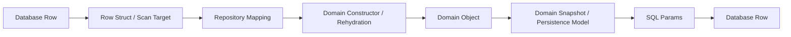
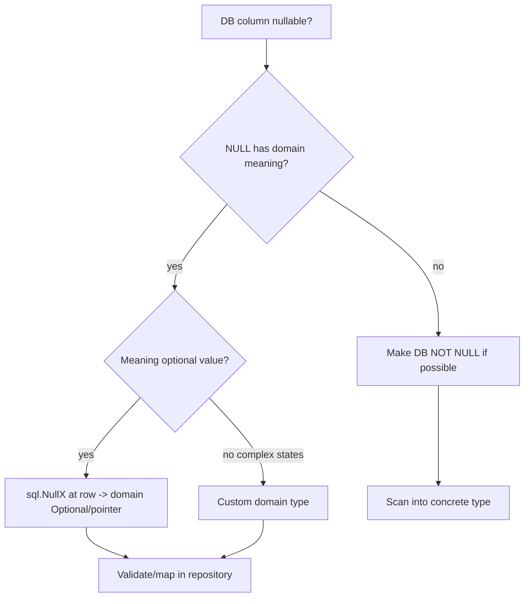
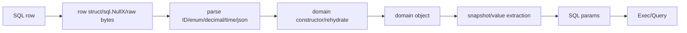

# learn-go-data-model-part-027.md

# Part 027 — Database Boundary: Null, Decimal, Time, JSON, Enum, ID

> Seri: `learn-go-data-model`  
> Bagian: `027 / 034`  
> Target pembaca: Java software engineer yang ingin memahami Go data model pada level production engineering  
> Fokus: database boundary dengan `database/sql`: NULL, decimal, timestamp, JSON column, enum, ID, Scanner/Valuer, row model, repository mapping, dan domain correctness

---

## 0. Posisi Part Ini dalam Seri

Kita sudah membahas:

```text
part-002: zero value dan invariant
part-005: numeric correctness
part-015: domain model, DTO, entity, config, event
part-017: nil
part-020: error as data
part-026: encoding data
```

Sekarang kita masuk ke boundary penting lain: database.

Database boundary bukan sekadar:

```go
row.Scan(&x)
```

Database punya data model sendiri:

```text
- NULL
- numeric/decimal precision
- timestamp/time zone/precision
- enum/check constraint
- UUID/ID
- JSON/JSONB/XML columns
- binary/blob
- collation/case sensitivity
- transaction isolation
- unique constraints
- foreign keys
```

Go punya data model sendiri:

```text
- zero value
- nil pointer/slice/map
- time.Time
- string
- int64/float64
- custom defined types
- struct invariants
```

Part ini membahas bagaimana menerjemahkan dua dunia itu tanpa membuat domain model bocor atau rusak.

---

## 1. Tujuan Pembelajaran

Setelah part ini, kamu harus bisa:

1. Memahami peran `database/sql` sebagai abstraction layer.
2. Membedakan DB row model, DTO, dan domain model.
3. Memahami NULL vs zero value vs absent.
4. Memakai `sql.NullString`, `sql.NullInt64`, `sql.NullTime`, dan nullable wrapper.
5. Menentukan kapan pakai pointer, `sql.NullX`, atau custom nullable type.
6. Memahami decimal/numeric mapping dan kenapa float berbahaya.
7. Memahami timestamp precision/timezone mapping.
8. Memahami JSON column mapping.
9. Memahami enum mapping.
10. Memahami custom ID type di database boundary.
11. Mengimplementasikan `sql.Scanner` dan `driver.Valuer`.
12. Memetakan database error ke application/domain error.
13. Mendesain repository boundary yang menjaga invariant domain.
14. Membuat checklist PR untuk database mapping.

---

## 2. Database Boundary Mental Model

Jangan anggap database row sama dengan domain object.



Layer:

```text
Database row:
- nullable
- column names
- database-specific types

Row struct:
- scan-friendly representation
- sql.NullX / raw []byte / string

Domain model:
- invariants
- value objects
- behavior
- no accidental NULL semantics

DTO/API:
- transport contract
```

Do not collapse all into one struct unless the system is very small and risk acceptable.

---

## 3. `database/sql` Basics

Common query:

```go
row := db.QueryRowContext(ctx, `
    select id, email, name, created_at
    from users
    where id = ?
`, id)

var r userRow
err := row.Scan(&r.ID, &r.Email, &r.Name, &r.CreatedAt)
```

For multiple rows:

```go
rows, err := db.QueryContext(ctx, query, args...)
if err != nil {
    return nil, err
}
defer rows.Close()

for rows.Next() {
    var r userRow
    if err := rows.Scan(&r.ID, &r.Email); err != nil {
        return nil, err
    }
}

if err := rows.Err(); err != nil {
    return nil, err
}
```

Always:

```text
- use context
- close rows
- check rows.Err()
- handle sql.ErrNoRows
```

---

## 4. Row Struct vs Domain Struct

Bad direct domain scan:

```go
type User struct {
    ID    UserID
    Email Email
    Name  string
}

row.Scan(&user.ID, &user.Email, &user.Name)
```

This may bypass validation/invariant.

Better:

```go
type userRow struct {
    ID    string
    Email string
    Name  string
}
```

Then:

```go
func (r userRow) ToDomain() (User, error) {
    id, err := ParseUserID(r.ID)
    if err != nil {
        return User{}, fmt.Errorf("parse user id: %w", err)
    }

    email, err := ParseEmail(r.Email)
    if err != nil {
        return User{}, fmt.Errorf("parse email: %w", err)
    }

    return RehydrateUser(id, email, r.Name)
}
```

This is verbose but protects domain invariants.

---

## 5. NULL vs Zero Value vs Absent

Database NULL means:

```text
unknown / missing / not applicable / not set / intentionally empty
```

But those are different business meanings.

Go zero value:

```text
string -> ""
int -> 0
time.Time -> year 1 zero time
bool -> false
```

Go nil:

```text
pointer/slice/map/interface/channel/function absent-ish
```

Do not map DB NULL blindly to Go zero.

Bad:

```go
var nickname string
row.Scan(&nickname)
```

If DB column is NULL, scanning into string may fail depending driver/database/sql conversion.

Use nullable representation:

```go
var nickname sql.NullString
```

Then decide domain meaning.

---

## 6. Standard Nullable Types

`database/sql` provides nullable types:

```text
sql.NullString
sql.NullBool
sql.NullInt16
sql.NullInt32
sql.NullInt64
sql.NullByte
sql.NullFloat64
sql.NullTime
```

Example:

```go
var nickname sql.NullString

if err := row.Scan(&nickname); err != nil {
    return err
}

if nickname.Valid {
    fmt.Println(nickname.String)
} else {
    fmt.Println("NULL")
}
```

Pattern:

```text
value field + Valid bool
```

This avoids ambiguous zero value.

---

## 7. Pointer vs `sql.NullX`

Option 1: pointer field:

```go
type userRow struct {
    Nickname *string
}
```

Option 2: sql.NullString:

```go
type userRow struct {
    Nickname sql.NullString
}
```

Trade-off:

```text
Pointer:
+ simple for optional data
+ natural nil
- may allocate/awkward scan depending driver
- cannot represent invalid value separately

sql.NullX:
+ explicit Valid bit
+ designed for database/sql scan/value
+ no pointer nil ambiguity
- verbose
- leaks database/sql type if used outside boundary
```

Guideline:

```text
Use sql.NullX in row/persistence boundary.
Map to domain-specific optional type/pointer/value after validation.
Do not spread sql.NullX across domain.
```

---

## 8. Custom Nullable Type

For repeated use, create domain-friendly nullable wrapper.

```go
type Nullable[T any] struct {
    Value T
    Valid bool
}
```

But generic `Nullable[T]` does not automatically implement `sql.Scanner` for all T safely.

For specific domain type:

```go
type NullEmail struct {
    Email Email
    Valid bool
}
```

Implement scan/value if needed:

```go
func (n *NullEmail) Scan(value any) error {
    if value == nil {
        n.Email = Email{}
        n.Valid = false
        return nil
    }

    s, ok := value.(string)
    if !ok {
        b, ok := value.([]byte)
        if !ok {
            return fmt.Errorf("cannot scan %T into NullEmail", value)
        }
        s = string(b)
    }

    email, err := ParseEmail(s)
    if err != nil {
        return err
    }

    n.Email = email
    n.Valid = true
    return nil
}
```

Keep these at boundary package if they couple to database.

---

## 9. Scanner Interface

`sql.Scanner`:

```go
type Scanner interface {
    Scan(src any) error
}
```

If your type implements `Scan`, `database/sql` can scan into it.

Example ID:

```go
type UserID string

func (id *UserID) Scan(src any) error {
    switch v := src.(type) {
    case string:
        parsed, err := ParseUserID(v)
        if err != nil {
            return err
        }
        *id = parsed
        return nil
    case []byte:
        parsed, err := ParseUserID(string(v))
        if err != nil {
            return err
        }
        *id = parsed
        return nil
    default:
        return fmt.Errorf("cannot scan %T into UserID", src)
    }
}
```

Caution:

```text
Scanner can enforce validation, but it couples domain type to database/sql.
```

For pure domain, you may prefer scanning into string then parsing in repository.

---

## 10. driver.Valuer Interface

`driver.Valuer`:

```go
type Valuer interface {
    Value() (driver.Value, error)
}
```

Example:

```go
func (id UserID) Value() (driver.Value, error) {
    if id == "" {
        return nil, errors.New("empty user id")
    }
    return string(id), nil
}
```

Then you can pass `UserID` as SQL parameter.

```go
db.ExecContext(ctx, `insert into users(id) values (?)`, id)
```

Trade-off:

```text
+ convenient
+ validates outbound values
- domain type imports database/sql/driver if implemented directly
```

Alternative: convert in repository:

```go
string(user.ID())
```

Choose based on architecture.

---

## 11. ID Mapping

Database IDs may be:

```text
- UUID string
- ULID string
- bigint sequence
- composite key
- binary UUID
```

Go domain:

```go
type UserID string
type OrderID int64
type TenantUserKey struct {
    TenantID TenantID
    UserID   UserID
}
```

Guideline:

```text
Do not use raw string/int everywhere.
Use defined ID types to prevent mixing.
```

Bad:

```go
func FindUser(ctx context.Context, id string)
func FindTenant(ctx context.Context, id string)
```

Better:

```go
func FindUser(ctx context.Context, id UserID)
func FindTenant(ctx context.Context, id TenantID)
```

At database boundary, convert explicitly.

---

## 12. Decimal / Numeric

Database `DECIMAL` / `NUMERIC` should not be mapped to `float64` for money or exact quantities.

Bad:

```go
var amount float64
```

Problems:

```text
- binary floating precision
- rounding errors
- equality surprises
- JSON representation issues
```

Options:

```text
- int64 minor units: cents, basis points, micros
- string decimal at boundary
- custom decimal type
- third-party decimal library
- database driver-specific numeric type
```

For money:

```go
type Money struct {
    currency Currency
    cents    int64
}
```

DB columns:

```text
currency_code varchar
amount_cents bigint
```

or if DB uses numeric:

```text
amount numeric(19,4)
currency_code char(3)
```

Then parse numeric string carefully.

---

## 13. Decimal as String Boundary

Scan numeric as string if driver supports or via database cast.

```sql
select amount::text from payments
```

Go:

```go
var amountText string
```

Parse:

```go
money, err := ParseMoneyDecimal(currency, amountText)
```

Benefit:

```text
No binary float loss.
```

Need:

```text
- scale validation
- rounding policy
- overflow check
- sign rules
```

---

## 14. Integer Minor Units

Simplest robust money model:

```go
type Money struct {
    currency Currency
    cents    int64
}
```

Database:

```sql
amount_cents bigint not null
currency_code char(3) not null
```

Pros:

```text
- exact
- comparable
- easy sum
- easy index
```

Cons:

```text
- currency with different minor units needs care
- decimal display formatting needed
- fractional units beyond cents need model decision
```

For financial systems, model scale deliberately.

---

## 15. Time Mapping

Database time types differ:

```text
timestamp without time zone
timestamp with time zone
date
time
integer epoch
```

Go:

```go
time.Time
```

Questions:

```text
Is it instant or local civil time?
What precision?
What timezone?
Can it be NULL?
Is zero time valid?
```

Guideline:

```text
For event timestamps, store instants in UTC.
For date-only domain, model Date separately.
For local business time, preserve timezone/location semantics.
```

Do not treat every DB timestamp as same concept.

---

## 16. Timestamp Precision

DB may store microseconds while Go `time.Time` has nanoseconds.

Tests can fail:

```go
got.Equal(want) // false if precision differs
```

Normalize:

```go
t = t.UTC().Truncate(time.Microsecond)
```

or match DB precision.

In repository tests, compare with expected precision.

---

## 17. `time.Time` Monotonic Component

`time.Time` can carry monotonic clock reading from `time.Now()`.

When marshaled/stored/scanned, monotonic part is lost.

Use:

```go
t.Equal(u)
```

for instant comparison.

Normalize before persistence if needed:

```go
func PersistTime(t time.Time) time.Time {
    return t.UTC().Round(0)
}
```

`Round(0)` strips monotonic clock reading.

---

## 18. Nullable Time

Use:

```go
var deletedAt sql.NullTime
```

Map:

```go
if deletedAt.Valid {
    entity.MarkDeletedAt(deletedAt.Time)
}
```

Or domain:

```go
type DeletedAt struct {
    value time.Time
    set   bool
}
```

Do not use zero time to mean NULL unless contract is internal and impossible to confuse.

Bad:

```go
if user.DeletedAt.IsZero()
```

if zero time could come from decode/default and not actual DB NULL.

---

## 19. Date-Only Values

Database `date` should often not be plain `time.Time` in domain unless semantics clear.

Create Date type:

```go
type Date struct {
    year  int
    month time.Month
    day   int
}
```

or wrap time.Time with invariant:

```go
type Date struct {
    t time.Time
}
```

Constructor:

```go
func NewDate(year int, month time.Month, day int) (Date, error) {
    t := time.Date(year, month, day, 0, 0, 0, 0, time.UTC)
    if t.Year() != year || t.Month() != month || t.Day() != day {
        return Date{}, errors.New("invalid date")
    }
    return Date{t: t}, nil
}
```

Boundary converts DB date to Date.

---

## 20. JSON Columns

Databases may store JSON/JSONB.

Options:

```text
- scan as []byte / json.RawMessage
- scan into string
- unmarshal into typed struct
- keep raw for delayed decoding
```

Example row:

```go
type auditRow struct {
    ID       string
    Metadata []byte
}
```

Mapping:

```go
var meta AuditMetadata
if len(r.Metadata) > 0 {
    if err := json.Unmarshal(r.Metadata, &meta); err != nil {
        return Audit{}, fmt.Errorf("decode audit metadata: %w", err)
    }
}
```

Do not let `map[string]any` spread into domain unless data is truly schemaless.

---

## 21. JSON Column Versioning

JSON column often becomes mini-document store.

Version it if long-lived:

```go
type MetadataEnvelope struct {
    Version int             `json:"version"`
    Payload json.RawMessage `json:"payload"`
}
```

Or include version field in object:

```go
type AuditMetadataV1 struct {
    Version int    `json:"version"`
    IP      string `json:"ip"`
}
```

Migration strategy:

```text
- read old versions
- write new version
- backfill optionally
```

Do not assume JSON column schema is not schema.

---

## 22. Enum Mapping

DB enum/check/string column:

```sql
status varchar not null
```

Go:

```go
type CaseStatus string

const (
    CaseStatusDraft     CaseStatus = "draft"
    CaseStatusSubmitted CaseStatus = "submitted"
)
```

Parse:

```go
func ParseCaseStatus(s string) (CaseStatus, error) {
    switch CaseStatus(s) {
    case CaseStatusDraft, CaseStatusSubmitted:
        return CaseStatus(s), nil
    default:
        return "", fmt.Errorf("unknown case status %q", s)
    }
}
```

Repository:

```go
status, err := ParseCaseStatus(r.Status)
if err != nil {
    return Case{}, fmt.Errorf("parse case status: %w", err)
}
```

Never let arbitrary string become domain enum silently.

---

## 23. Enum Scanner/Valuer

You can implement:

```go
func (s *CaseStatus) Scan(src any) error {
    var raw string

    switch v := src.(type) {
    case string:
        raw = v
    case []byte:
        raw = string(v)
    default:
        return fmt.Errorf("cannot scan %T into CaseStatus", src)
    }

    parsed, err := ParseCaseStatus(raw)
    if err != nil {
        return err
    }

    *s = parsed
    return nil
}

func (s CaseStatus) Value() (driver.Value, error) {
    switch s {
    case CaseStatusDraft, CaseStatusSubmitted:
        return string(s), nil
    default:
        return nil, fmt.Errorf("invalid case status %q", s)
    }
}
```

Trade-off:

```text
Convenient but couples enum type to database/sql.
```

For application domain, explicit repository mapping may keep domain cleaner.

---

## 24. Boolean Mapping

DB booleans can be:

```text
boolean
char(1) Y/N
number(1) 0/1
varchar true/false
```

Prefer actual DB boolean where available.

If legacy Y/N:

```go
func ParseYesNo(s string) (bool, error) {
    switch s {
    case "Y":
        return true, nil
    case "N":
        return false, nil
    default:
        return false, fmt.Errorf("invalid yes/no %q", s)
    }
}
```

Do not spread `"Y"`/`"N"` into domain.

---

## 25. Binary/BLOB Mapping

DB binary data maps to `[]byte`.

Important:

```text
database/sql may reuse []byte memory depending driver/RawBytes usage.
Copy if retaining beyond scan lifecycle.
```

`sql.RawBytes` is only valid until next `Next`, `Scan`, or `Close` depending docs.

Safer:

```go
var b []byte
if err := row.Scan(&b); err != nil { ... }

b = append([]byte(nil), b...)
```

if you need keep it.

Do not expose mutable byte slice directly if immutability matters.

---

## 26. Large Text / CLOB

Large text should not always be loaded eagerly.

Questions:

```text
Do we need full content?
Can we stream?
Can query select only listing fields?
Do we need separate table/storage?
```

In Go:

```go
var body string
```

works but can allocate large memory.

For huge data, database driver may support streaming differently; design query/API accordingly.

Avoid selecting CLOB/BLOB in list views.

---

## 27. Unique Constraint Mapping

Database uniqueness errors should map to domain/application conflict.

Pseudo:

```go
_, err := db.ExecContext(ctx, insertUser, ...)
if err != nil {
    if isUniqueViolation(err) {
        return ErrUserAlreadyExists
    }
    return fmt.Errorf("insert user: %w", err)
}
```

`isUniqueViolation` is driver/database-specific.

Do not leak raw driver error to service/controller.

Map at repository boundary.

---

## 28. Foreign Key Constraint Mapping

Foreign key violation may mean:

```text
- referenced entity not found
- invalid state
- concurrent deletion
- data integrity bug
```

Map carefully:

```go
if isForeignKeyViolation(err) {
    return ErrReferencedEntityNotFound
}
```

But include internal context in logs/wrap.

Do not tell external client low-level table/constraint names unless safe.

---

## 29. `sql.ErrNoRows`

For query one:

```go
err := row.Scan(...)
if errors.Is(err, sql.ErrNoRows) {
    return User{}, ErrUserNotFound
}
if err != nil {
    return User{}, fmt.Errorf("scan user %s: %w", id, err)
}
```

Use application/domain sentinel:

```go
var ErrUserNotFound = errors.New("user not found")
```

Then service/controller uses:

```go
errors.Is(err, ErrUserNotFound)
```

Do not require controller to know `sql.ErrNoRows`.

---

## 30. Transactions and Data Mapping

Transaction boundary:

```go
tx, err := db.BeginTx(ctx, nil)
if err != nil {
    return err
}
defer tx.Rollback()

// repository operations using tx

if err := tx.Commit(); err != nil {
    return err
}
```

Mapping errors inside transaction should preserve operation context:

```go
return fmt.Errorf("insert case row: %w", err)
```

But top boundary maps classification.

Also decide:

```text
Does repository own transaction?
Does service/application own transaction?
Do repositories accept DBTX interface?
```

Common small abstraction:

```go
type DBTX interface {
    ExecContext(context.Context, string, ...any) (sql.Result, error)
    QueryContext(context.Context, string, ...any) (*sql.Rows, error)
    QueryRowContext(context.Context, string, ...any) *sql.Row
}
```

Both `*sql.DB` and `*sql.Tx` can satisfy similar shape.

---

## 31. Row Locking and State

Database can enforce concurrency:

```sql
select ... for update
```

But domain should still validate transition.

Pattern:

```text
load row with lock
map to domain
call domain behavior
persist new snapshot
commit
```

Do not update status blindly only because SQL can.

```go
caseObj, err := r.findForUpdate(ctx, tx, id)
if err != nil { ... }

if err := caseObj.Submit(now); err != nil { ... }

if err := r.save(ctx, tx, caseObj); err != nil { ... }
```

---

## 32. Partial Update / PATCH

Database update with nullable fields can confuse:

```text
missing -> no update
null -> set DB NULL
value -> set value
```

Use patch command with explicit presence:

```go
type PatchUserCommand struct {
    Name OptionalNullable[string]
}
```

Repository maps:

```text
if !Name.Set -> omit column
if Name.Null -> set column = NULL
else -> set column = value
```

Do not use zero value alone for PATCH.

---

## 33. SQL Injection and Parameters

Always use parameters, not string concatenation.

Bad:

```go
query := "select * from users where email = '" + email + "'"
```

Good:

```go
row := db.QueryRowContext(ctx,
    "select id from users where email = ?",
    email,
)
```

Placeholder syntax differs by driver/database:

```text
?       MySQL/SQLite style
$1      PostgreSQL style
:name   Oracle/named style depending driver
```

Parameterization is non-negotiable.

---

## 34. Dynamic SQL and Whitelisting

Some SQL parts cannot be parameterized, such as column names/order direction.

Bad:

```go
query := "order by " + req.Sort
```

Use whitelist:

```go
func orderBy(sort string) (string, error) {
    switch sort {
    case "created_at":
        return "created_at", nil
    case "email":
        return "email", nil
    default:
        return "", fmt.Errorf("invalid sort field")
    }
}
```

Direction:

```go
switch dir {
case "asc":
case "desc":
default:
}
```

Then compose from safe constants only.

---

## 35. Collation and Case Sensitivity

Database equality may differ from Go equality.

Example:

```text
DB collation case-insensitive
Go string == case-sensitive
```

Unique index may reject:

```text
Alice@example.com
alice@example.com
```

while Go sees different strings.

Canonicalize in application:

```go
email := ParseEmail(input) // lower/normalize per rules
```

Also align DB constraints with app canonicalization.

---

## 36. Time Zone Boundary

Store instants consistently.

Common approach:

```text
store UTC timestamp
return ISO-8601/RFC3339 with timezone
display local at UI
```

But business rules may use local timezone:

```text
filing deadline at 23:59 Asia/Jakarta
```

Model that separately:

```go
type BusinessDate struct { ... }
type ZonedDateTime struct { ... }
```

Do not solve local business time with blind UTC conversion only.

---

## 37. Repository Mapping Example

Row:

```go
type caseRow struct {
    ID          string
    Status      string
    SubmittedAt sql.NullTime
    Metadata    []byte
}
```

Mapping:

```go
func (r caseRow) ToDomain() (Case, error) {
    id, err := ParseCaseID(r.ID)
    if err != nil {
        return Case{}, fmt.Errorf("parse case id: %w", err)
    }

    status, err := ParseCaseStatus(r.Status)
    if err != nil {
        return Case{}, fmt.Errorf("parse case status: %w", err)
    }

    var submittedAt Optional[time.Time]
    if r.SubmittedAt.Valid {
        submittedAt = Some(r.SubmittedAt.Time.UTC().Round(0))
    }

    var metadata CaseMetadata
    if len(r.Metadata) > 0 {
        if err := json.Unmarshal(r.Metadata, &metadata); err != nil {
            return Case{}, fmt.Errorf("decode case metadata: %w", err)
        }
    }

    return RehydrateCase(id, status, submittedAt, metadata)
}
```

This keeps boundary concerns visible.

---

## 38. Outbound Mapping Example

Domain to SQL params:

```go
func caseInsertParams(c Case) (caseParams, error) {
    metadata, err := json.Marshal(c.Metadata())
    if err != nil {
        return caseParams{}, fmt.Errorf("encode case metadata: %w", err)
    }

    return caseParams{
        ID:       string(c.ID()),
        Status:   string(c.Status()),
        Metadata: metadata,
    }, nil
}
```

Params struct:

```go
type caseParams struct {
    ID       string
    Status   string
    Metadata []byte
}
```

Then exec:

```go
_, err := db.ExecContext(ctx, insertSQL,
    p.ID,
    p.Status,
    p.Metadata,
)
```

---

## 39. Avoid ORM Entity Leakage

If using ORM, still separate:

```text
ORM model != domain model != API DTO
```

ORM tags can pile up:

```go
type User struct {
    ID string `gorm:"primaryKey" json:"id" validate:"required"`
}
```

This couples:

```text
database mapping
JSON API
validation
domain
```

For simple CRUD this may be acceptable; for serious domain/invariant systems, prefer separation.

---

## 40. Database Error Taxonomy

Map DB errors into application error taxonomy:

```text
sql.ErrNoRows -> ErrNotFound
unique violation -> ErrConflict / ErrAlreadyExists
foreign key violation -> ErrInvalidReference / ErrNotFound
serialization/deadlock -> ErrRetryableConflict
timeout/context deadline -> ErrTimeout
connection unavailable -> ErrDependencyUnavailable
scan conversion -> ErrDataCorruption / internal error
```

Scan conversion error often indicates:

```text
schema mismatch
bad data
driver mismatch
bug
```

Treat as internal/operational issue, not user validation.

---

## 41. Retryable Database Errors

Some DB errors may be retryable:

```text
deadlock detected
serialization failure
temporary network issue
connection reset
```

But retry safely only if operation is idempotent or inside retryable transaction pattern.

Do not blindly retry non-idempotent operations.

Classification should be database/driver-specific at infrastructure boundary.

---

## 42. Observability for DB Boundary

Log/metrics should include:

```text
operation name
table/entity
duration
rows affected/count
error classification
retryable?
not raw SQL with secrets
correlation/request id
```

Avoid logging full query args if they contain PII/secrets.

Use structured logs:

```go
logger.Error("db operation failed",
    "op", "FindUser",
    "user_id", id,
    "error", err,
)
```

---

## 43. Testing DB Mapping

Test mapping without real DB:

```go
func TestCaseRowToDomain(t *testing.T) {
    r := caseRow{
        ID:     "case-1",
        Status: "submitted",
    }

    c, err := r.ToDomain()
    if err != nil {
        t.Fatal(err)
    }

    if c.ID() != CaseID("case-1") {
        t.Fatal(...)
    }
}
```

Test invalid DB data:

```go
r := caseRow{Status: "unknown"}
_, err := r.ToDomain()
if err == nil {
    t.Fatal("expected error")
}
```

This catches data corruption/schema drift.

---

## 44. Integration Tests

Mapping tests do not replace DB integration tests.

Integration tests should verify:

```text
- actual scan types
- NULL behavior
- timestamp precision
- decimal precision
- JSON column encoding
- unique constraint mapping
- transaction behavior
```

Use test database/container if possible.

For each repository method:

```text
insert known row -> load -> compare domain
save domain -> query raw row -> verify columns
```

---

## 45. Migration Compatibility

Schema migrations affect Go mapping.

Checklist:

```text
- new NOT NULL column has default/backfill
- nullable -> non-nullable transition safe
- renamed column reflected in queries
- enum/check values updated in parser
- timestamp precision unchanged or code updated
- JSON schema version handled
```

Coordinate code deploy and migration order.

---

## 46. Mermaid: NULL Mapping Decision



---

## 47. Mermaid: Repository Boundary



---

## 48. Mini Lab 1 — `sql.NullString`

```go
var s sql.NullString

// after scanning DB NULL:
fmt.Println(s.Valid)
fmt.Println(s.String)
```

Expected:

```text
false
""
```

Lesson:

```text
String field alone cannot distinguish NULL from empty string.
Valid flag carries NULL semantics.
```

---

## 49. Mini Lab 2 — `sql.ErrNoRows`

```go
err := row.Scan(&id)
if errors.Is(err, sql.ErrNoRows) {
    return ErrUserNotFound
}
```

Lesson:

```text
Map infrastructure sentinel to application/domain sentinel at repository boundary.
```

---

## 50. Mini Lab 3 — Decimal Float Problem

```go
amount := 0.1 + 0.2
fmt.Println(amount == 0.3)
```

Often:

```text
false
```

Lesson:

```text
Do not use float64 for money/exact DB numeric.
```

---

## 51. Mini Lab 4 — Timestamp Precision

```go
now := time.Now().UTC()
dbValue := now.Truncate(time.Microsecond)

fmt.Println(now.Equal(dbValue))
```

May be false if nanoseconds existed.

Lesson:

```text
Normalize to DB precision when comparing persisted times.
```

---

## 52. Mini Lab 5 — Enum Validation

```go
status, err := ParseCaseStatus("deleted")
if err != nil {
    fmt.Println("invalid")
}
_ = status
```

Lesson:

```text
Do not let arbitrary DB string silently become domain enum.
```

---

## 53. Mini Lab 6 — JSON Column

```go
var raw []byte // scanned from JSON column

var meta CaseMetadata
if err := json.Unmarshal(raw, &meta); err != nil {
    return fmt.Errorf("decode metadata: %w", err)
}
```

Lesson:

```text
JSON column still needs schema/version/validation.
```

---

## 54. Common Anti-Patterns

### 54.1 Domain struct equals DB row

Leads to leaked NULL/schema/ORM concerns.

### 54.2 `sql.NullX` spread into domain

Couples domain to database boundary.

### 54.3 Float64 for money/numeric

Precision bug.

### 54.4 Zero time means NULL

Ambiguous.

### 54.5 Arbitrary string enum

Invalid states enter domain.

### 54.6 Raw JSON map in domain

Schemaless data spreads.

### 54.7 Controller knows `sql.ErrNoRows`

Infrastructure leak.

### 54.8 No `rows.Err()` check

Misses iteration errors.

### 54.9 No body/row size thinking for CLOB/BLOB

Memory blow-up.

### 54.10 Dynamic SQL without whitelist

SQL injection risk.

---

## 55. Production Guidelines

### 55.1 Separate Row Model and Domain

Use row structs for scan; map to domain through constructors.

### 55.2 Treat NULL as Semantic

Ask what NULL means. Do not collapse to zero accidentally.

### 55.3 Use Exact Numeric Types

Money/decimal needs int minor units, decimal string, or decimal type.

### 55.4 Normalize Time

UTC/precision/monotonic stripping where appropriate.

### 55.5 Validate Enums and IDs

Parse at boundary.

### 55.6 Keep JSON Columns Versioned

JSON column is schema, even if DB does not enforce it.

### 55.7 Map DB Errors

Translate driver/database-specific errors to application errors.

### 55.8 Use Parameters and Whitelists

Never concatenate untrusted SQL values or identifiers.

### 55.9 Test Boundary Mapping

Unit mapping + integration with real DB behavior.

### 55.10 Keep Domain Free of Persistence Details

Unless intentionally using active record/simple CRUD style.

---

## 56. PR Review Checklist

### 56.1 Row/Domain Separation

```text
[ ] Is scan target separate from domain where needed?
[ ] Are domain constructors/rehydrators used?
[ ] Are invariants checked after scan?
[ ] Are ORM tags not leaking into API/domain unnecessarily?
```

### 56.2 NULL

```text
[ ] Nullable columns represented explicitly?
[ ] NULL vs empty/zero distinction preserved?
[ ] sql.NullX confined to boundary?
[ ] Domain optionality modeled clearly?
```

### 56.3 Numeric

```text
[ ] No float for money/exact numeric?
[ ] Scale/rounding/overflow defined?
[ ] Decimal parsing tested?
[ ] DB numeric precision matches Go model?
```

### 56.4 Time

```text
[ ] UTC/local semantics clear?
[ ] DB precision handled?
[ ] Nullable time explicit?
[ ] Date-only modeled separately if needed?
[ ] Monotonic component not causing comparisons?
```

### 56.5 JSON/Enum/ID

```text
[ ] JSON column schema/version handled?
[ ] Enum strings parsed/validated?
[ ] ID types not raw strings everywhere?
[ ] Scanner/Valuer coupling intentional?
```

### 56.6 Errors

```text
[ ] sql.ErrNoRows mapped?
[ ] Unique/FK/deadlock mapped?
[ ] Driver-specific errors isolated?
[ ] Raw DB error not exposed externally?
```

### 56.7 Query Safety

```text
[ ] Parameters used for values?
[ ] Dynamic identifiers whitelisted?
[ ] rows.Close called?
[ ] rows.Err checked?
[ ] Context used?
```

### 56.8 Testing

```text
[ ] Mapping unit tests include invalid DB data?
[ ] Integration tests cover NULL/time/decimal/json?
[ ] Migration compatibility considered?
[ ] Constraint violations tested?
```

---

## 57. Ringkasan Mental Model

Database boundary is translation, not assignment.

```text
DB row is not domain object.
NULL is not zero value.
DECIMAL is not float64.
timestamp is not just time.Time without semantics.
JSON column is still schema.
enum string must be validated.
ID should be typed.
```

Repository mapping should:

```text
scan -> parse -> validate -> rehydrate domain
domain -> snapshot -> encode -> SQL params
```

Untuk Java engineer:

```text
Jangan membawa pola entity penuh annotation yang otomatis menjadi domain/API/persistence sekaligus.
Di Go, explicit row structs dan mapping sering lebih jelas, lebih aman, dan lebih mudah direview.
```

---

## 58. Apa yang Tidak Dibahas di Part Ini

Part berikutnya:

```text
part-028 — Time as Data: time.Time, Duration, Monotonic Clock, Time Zone
```

Kita akan mendalami:

```text
- time.Time internals/semantics
- instant vs local time vs date-only
- monotonic clock
- Duration
- timezone/location
- parsing/formatting
- deadlines/timeouts
- testing time
```

---

## 59. Referensi Resmi

- Package `database/sql`  
  https://pkg.go.dev/database/sql
- Package `database/sql/driver`  
  https://pkg.go.dev/database/sql/driver
- Package `time`  
  https://pkg.go.dev/time
- Package `encoding/json`  
  https://pkg.go.dev/encoding/json
- Package `errors`  
  https://pkg.go.dev/errors
- Go Wiki — SQLInterface  
  https://go.dev/wiki/SQLInterface
- Go 1.26 Release Notes  
  https://go.dev/doc/go1.26

---

## 60. Status Seri

Selesai:

```text
part-000  Orientation
part-001  Type system core
part-002  Zero value and invariants
part-003  Constants and iota
part-004  Numeric foundations
part-005  Numeric correctness
part-006  Text model I
part-007  Text model II
part-008  Array
part-009  Slice I
part-010  Slice II
part-011  Map I
part-012  Map II
part-013  Struct I
part-014  Struct II
part-015  Struct III
part-016  Pointer
part-017  Nil
part-018  Interface I
part-019  Interface II
part-020  Error as Data
part-021  Generics I
part-022  Generics II
part-023  Comparability / Equality / Ordering
part-024  Reflection
part-025  Unsafe
part-026  Encoding Data
part-027  Database Boundary
```

Berikutnya:

```text
part-028  Time as Data: time.Time, Duration, Monotonic Clock, Time Zone
```

Seri belum selesai. Masih ada part 028 sampai part 034.


<!-- NAVIGATION_FOOTER -->
<div class="page-nav">
<a href="./learn-go-data-model-part-026.md">⬅️ Part 026 — Encoding Data: JSON, XML, CSV, Gob, Binary, Text Marshaling</a>
<a href="./index.md">📚 Kategori</a>
<a href="../../index.md">🏠 Home</a>
<a href="./learn-go-data-model-part-028.md">Part 028 — Time as Data: time.Time, Duration, Monotonic Clock, Time Zone ➡️</a>
</div>
