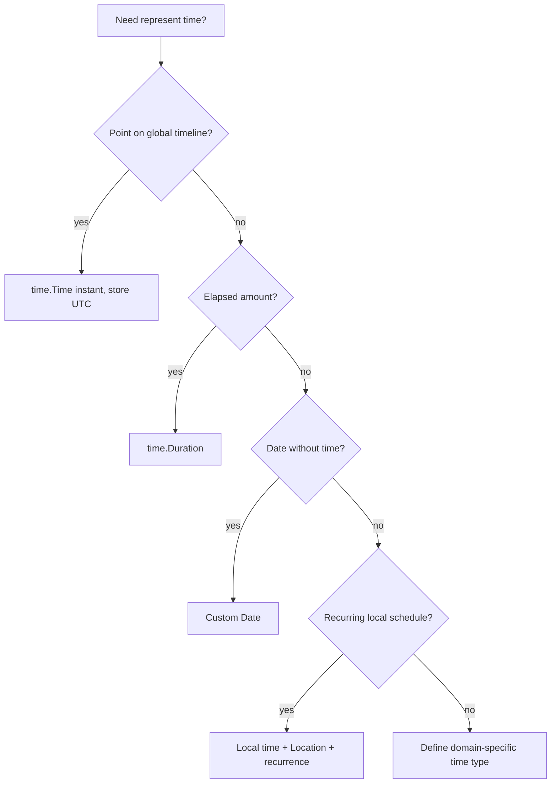
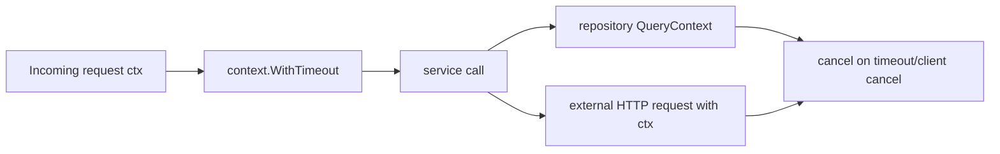

# learn-go-data-model-part-028.md

# Part 028 — Time as Data: time.Time, Duration, Monotonic Clock, Time Zone

> Seri: `learn-go-data-model`  
> Bagian: `028 / 034`  
> Target pembaca: Java software engineer yang ingin memahami Go data model pada level production engineering  
> Fokus: `time.Time`, `time.Duration`, monotonic clock, UTC/local time, date-only, timezone, parsing/formatting, deadline/timeout, testing time, dan production correctness

---

## 0. Posisi Part Ini dalam Seri

Kita sudah membahas:

```text
part-002: zero value dan invariant
part-005: numeric correctness
part-017: nil
part-023: equality dan ordering
part-026: encoding
part-027: database boundary
```

Sekarang kita masuk ke waktu.

Waktu adalah salah satu data type paling berbahaya di sistem produksi karena terlihat sederhana:

```go
time.Now()
```

Tetapi di baliknya ada konsep berbeda:

```text
- instant
- local date
- local time
- timezone
- offset
- duration
- deadline
- timeout
- monotonic clock
- wall clock
- calendar arithmetic
- precision
- serialization
- database storage
```

Untuk Java engineer:

```text
Java:
- Instant
- LocalDate
- LocalDateTime
- ZonedDateTime
- Duration
- Period

Go:
- mostly time.Time + time.Duration
- semantic separation harus kamu desain sendiri
```

Go hanya memberi primitive yang kuat. Domain semantics tetap tanggung jawab kita.

---

## 1. Tujuan Pembelajaran

Setelah part ini, kamu harus bisa:

1. Menjelaskan apa itu `time.Time`.
2. Membedakan instant, local date, local datetime, dan duration.
3. Memahami zero `time.Time`.
4. Memahami monotonic clock dalam `time.Time`.
5. Memahami kapan pakai `t.Equal(u)` vs `t == u`.
6. Memahami `time.Duration`.
7. Memahami timezone dan `time.Location`.
8. Memahami parsing/formatting dengan layout unik Go.
9. Mendesain date-only type.
10. Mendesain deadline/timeout dengan `context`.
11. Menghindari `time.After` misuse di loop.
12. Memahami DB/JSON precision issue.
13. Mendesain testable clock.
14. Membuat checklist PR untuk time handling.

---

## 2. Time dalam Satu Kalimat

`time.Time` merepresentasikan waktu dengan informasi location dan mungkin monotonic clock reading.

```go
now := time.Now()
fmt.Println(now)
```

`time.Duration` merepresentasikan durasi elapsed time dalam nanoseconds.

```go
d := 5 * time.Second
```

Core package:

```go
import "time"
```

Tetapi jangan pikir semua hal waktu cukup dimodelkan dengan `time.Time`.

Pertanyaan pertama:

```text
Apakah ini instant, tanggal lokal, jam lokal, deadline, duration, schedule, atau calendar period?
```

---

## 3. Instant vs Local Date vs Local DateTime

Instant:

```text
A precise point on timeline.
Example: event happened at 2026-06-22T10:00:00Z.
```

Use:

```go
time.Time
```

Local date:

```text
A date on a calendar without time-of-day.
Example: birth date, filing date, business date.
```

Go has no built-in `LocalDate`. You model it.

Local datetime:

```text
Date + time in a local timezone context.
Example: meeting at 2026-06-22 09:00 Asia/Jakarta.
```

Needs `time.Time` with proper `Location` or custom type.

Duration:

```text
Elapsed time amount.
Example: timeout 5 seconds.
```

Use:

```go
time.Duration
```

Calendar period:

```text
1 month, 1 year, next business day.
```

Do not represent month as fixed `time.Duration`, because months vary.

---

## 4. `time.Time` Zero Value

Zero value:

```go
var t time.Time
fmt.Println(t.IsZero()) // true
```

Zero time is:

```text
year 1, month 1, day 1, 00:00:00 UTC-ish representation
```

Do not use zero time as normal business date.

For optional time:

```go
type User struct {
    deletedAt *time.Time
}
```

or:

```go
type OptionalTime struct {
    value time.Time
    set   bool
}
```

At database boundary:

```go
sql.NullTime
```

At JSON boundary, decide omitted/null/string.

---

## 5. `time.Time` Equality

`time.Time` is comparable, but `==` compares full representation, not just instant.

Use:

```go
t1.Equal(t2)
```

for instant equality.

Example:

```go
t1 := time.Now()
data, _ := t1.MarshalText()

var t2 time.Time
_ = t2.UnmarshalText(data)

fmt.Println(t1 == t2)      // may be false
fmt.Println(t1.Equal(t2))  // true
```

Why?

```text
time.Time may contain monotonic clock reading and location representation.
```

Guideline:

```text
Use Equal for instant equality.
Use IsZero for zero check.
Avoid == except when you truly want exact representation equality.
```

---

## 6. Monotonic Clock

`time.Now()` may include monotonic clock reading.

Purpose:

```text
Measure elapsed time robustly even if wall clock changes.
```

Example:

```go
start := time.Now()
doWork()
elapsed := time.Since(start)
```

`time.Since` uses monotonic component if available.

This is good for duration measurement.

But when time is serialized, stored, or parsed, monotonic component is stripped.

```go
t := time.Now()
b, _ := t.MarshalJSON()

var u time.Time
_ = u.UnmarshalJSON(b)
```

`t` may have monotonic; `u` does not.

Therefore:

```go
t == u // may be false
t.Equal(u) // true if same instant
```

---

## 7. Stripping Monotonic Clock

If you need remove monotonic reading:

```go
t = t.Round(0)
```

or through serialization/parsing.

Common persistence normalization:

```go
func NormalizeInstant(t time.Time) time.Time {
    return t.UTC().Round(0)
}
```

If also matching DB precision:

```go
func NormalizeDBTime(t time.Time) time.Time {
    return t.UTC().Round(0).Truncate(time.Microsecond)
}
```

Use only if precision choice is deliberate.

---

## 8. Wall Clock vs Monotonic Time

Wall clock:

```text
calendar time, can jump due to NTP/manual changes/DST
```

Monotonic clock:

```text
always moves forward for measuring elapsed duration
```

Use wall clock for:

```text
timestamps, logs, event occurred_at
```

Use monotonic elapsed measurement for:

```text
timeouts, latency, durations
```

Go helps when using:

```go
start := time.Now()
elapsed := time.Since(start)
```

Do not compute elapsed via stored wall-clock strings.

---

## 9. `time.Duration`

`time.Duration` is an integer nanosecond count.

```go
type Duration int64
```

Use:

```go
timeout := 5 * time.Second
interval := 250 * time.Millisecond
```

Do not write:

```go
timeout := 5
```

Ambiguous int.

Use constants:

```go
const DefaultTimeout = 5 * time.Second
```

Max duration is limited by int64 nanoseconds, roughly hundreds of years. Good enough for timeouts, not for calendar periods.

---

## 10. Duration Is Not Calendar Period

This is wrong for “one month”:

```go
30 * 24 * time.Hour
```

Months vary.

Use calendar arithmetic:

```go
next := t.AddDate(0, 1, 0)
```

For one year:

```go
next := t.AddDate(1, 0, 0)
```

For business rules, define semantics:

```text
1 month after Jan 31 means what?
Last day of next month?
Same day if exists?
30 days?
```

Go's `AddDate` has specific normalization behavior; test edge cases.

---

## 11. `time.Location`

`time.Location` represents timezone rules.

Load:

```go
loc, err := time.LoadLocation("Asia/Jakarta")
if err != nil {
    return err
}
```

Use:

```go
t := time.Date(2026, 6, 22, 9, 0, 0, 0, loc)
```

Convert display:

```go
local := t.In(loc)
```

Important:

```text
t.In(loc) changes representation/location, not instant.
```

Same instant, different local clock display.

---

## 12. UTC as Storage Default

Common production guideline:

```text
Store instants in UTC.
Convert to local timezone at presentation/business boundary.
```

Example:

```go
createdAt := time.Now().UTC()
```

Database:

```text
created_at timestamp/timestamptz depending DB choice
```

JSON:

```json
"created_at": "2026-06-22T10:00:00Z"
```

But not all time data is instant. A birth date should not become midnight UTC and shift across timezone.

---

## 13. Date-Only Type

Go lacks built-in date-only type.

Simple type:

```go
type Date struct {
    t time.Time
}

func NewDate(year int, month time.Month, day int) (Date, error) {
    t := time.Date(year, month, day, 0, 0, 0, 0, time.UTC)

    if t.Year() != year || t.Month() != month || t.Day() != day {
        return Date{}, errors.New("invalid date")
    }

    return Date{t: t}, nil
}

func (d Date) Year() int {
    return d.t.Year()
}

func (d Date) Month() time.Month {
    return d.t.Month()
}

func (d Date) Day() int {
    return d.t.Day()
}
```

Marshal:

```go
func (d Date) MarshalText() ([]byte, error) {
    return []byte(d.t.Format(time.DateOnly)), nil
}
```

Unmarshal:

```go
func (d *Date) UnmarshalText(text []byte) error {
    t, err := time.Parse(time.DateOnly, string(text))
    if err != nil {
        return err
    }

    *d = Date{t: t}
    return nil
}
```

Use date-only for:

```text
birth date
business date
holiday date
report date
filing date
```

---

## 14. Time-Only Type

Go also lacks built-in time-only type.

For schedule like “daily at 09:00”:

```go
type LocalClockTime struct {
    hour   int
    minute int
    second int
}
```

Do not represent as `time.Time` with arbitrary date unless carefully isolated.

For daily job:

```text
time-of-day + location + recurrence rule
```

not instant.

Next run calculation requires timezone and DST thinking.

---

## 15. Parsing and Formatting Layout

Go uses reference time layout:

```text
Mon Jan 2 15:04:05 MST 2006
```

Not `yyyy-MM-dd`.

Examples:

```go
t.Format(time.RFC3339)
```

Custom:

```go
layout := "2006-01-02 15:04:05"
s := t.Format(layout)
```

Parse:

```go
t, err := time.Parse(time.RFC3339, s)
```

Date-only:

```go
d, err := time.Parse(time.DateOnly, "2026-06-22")
```

Go layout mental model:

```text
Write the example date in the exact format you want.
```

---

## 16. `time.Parse` vs `time.ParseInLocation`

`time.Parse` parses time without zone as UTC unless layout includes zone.

```go
t, err := time.Parse("2006-01-02 15:04:05", "2026-06-22 09:00:00")
```

This treats result in UTC.

If string represents local time:

```go
loc, _ := time.LoadLocation("Asia/Jakarta")
t, err := time.ParseInLocation("2006-01-02 15:04:05", "2026-06-22 09:00:00", loc)
```

Use `ParseInLocation` for local time strings.

---

## 17. RFC3339 for APIs

For instant timestamps in APIs, prefer RFC3339/RFC3339Nano.

```go
t.Format(time.RFC3339)
t.Format(time.RFC3339Nano)
```

`time.Time` JSON marshaling uses RFC3339 format.

Guideline:

```text
Use standard timestamp formats.
Avoid custom timestamp format unless contract requires it.
```

If custom format required, isolate in boundary type.

---

## 18. Time Zone Names vs Offsets

Offset:

```text
+07:00
```

Location:

```text
Asia/Jakarta
```

An offset is not a timezone rule set.

Timezone includes historical/future DST/rule changes.

For future scheduled local events, store location name, not only offset.

Example:

```text
Meeting every day at 09:00 Asia/Jakarta
```

Need:

```text
local time 09:00 + location Asia/Jakarta
```

not just UTC instant forever if recurring.

---

## 19. DST and Ambiguous Local Time

Some locations have DST.

Local times can be:

```text
- nonexistent during spring forward
- ambiguous during fall back
```

Even if Indonesia currently does not use DST, global systems must handle it.

If scheduling in arbitrary user timezone:

```text
test DST transitions
store location
define behavior for ambiguous/nonexistent time
```

Use `time.Date` with location and test cases.

---

## 20. Deadlines and Timeouts

Use context:

```go
ctx, cancel := context.WithTimeout(ctx, 5*time.Second)
defer cancel()
```

or:

```go
ctx, cancel := context.WithDeadline(ctx, deadline)
defer cancel()
```

Pass context to operations:

```go
req = req.WithContext(ctx)
db.QueryContext(ctx, query)
```

Do not implement timeout by sleeping in random goroutine when context-aware API exists.

---

## 21. `time.After` in Loops

Potential issue:

```go
for {
    select {
    case <-time.After(time.Second):
        do()
    case <-ctx.Done():
        return
    }
}
```

`time.After` creates a new timer each iteration. In some loops, this can create allocation/timer pressure.

Prefer ticker:

```go
ticker := time.NewTicker(time.Second)
defer ticker.Stop()

for {
    select {
    case <-ticker.C:
        do()
    case <-ctx.Done():
        return
    }
}
```

For one timer reused/reset, use `time.NewTimer` carefully.

---

## 22. Timer Reset Correctness

Timer reset can be tricky.

Basic pattern for stopped/expired timer:

```go
timer := time.NewTimer(timeout)
defer timer.Stop()

select {
case <-timer.C:
    return ErrTimeout
case <-done:
    if !timer.Stop() {
        <-timer.C
    }
}
```

But draining timer channel must avoid deadlock if already drained. Correct timer reset patterns are subtle.

Guideline:

```text
Prefer context.WithTimeout or ticker unless you need manual timer control.
When using Timer.Reset, follow official docs and test heavily.
```

---

## 23. Ticker Lifecycle

Always stop ticker when done:

```go
ticker := time.NewTicker(interval)
defer ticker.Stop()
```

Otherwise ticker resources may leak until GC or longer.

Loop:

```go
for {
    select {
    case <-ticker.C:
        run()
    case <-ctx.Done():
        return ctx.Err()
    }
}
```

For immediate first run:

```go
run()
for {
    select { ... }
}
```

or timer + ticker design.

---

## 24. Clock Injection for Tests

Bad:

```go
func IsExpired(expiresAt time.Time) bool {
    return time.Now().After(expiresAt)
}
```

Hard to test.

Better:

```go
type Clock interface {
    Now() time.Time
}

type SystemClock struct{}

func (SystemClock) Now() time.Time {
    return time.Now()
}
```

Use:

```go
func IsExpired(clock Clock, expiresAt time.Time) bool {
    return !clock.Now().Before(expiresAt)
}
```

Fake:

```go
type FakeClock struct {
    now time.Time
}

func (c FakeClock) Now() time.Time {
    return c.now
}
```

For simple services, function injection works:

```go
now func() time.Time
```

---

## 25. Time in Domain Model

Domain object should not call `time.Now()` internally unless injected or passed.

Bad:

```go
func (c *Case) Submit() {
    c.submittedAt = time.Now()
}
```

Better:

```go
func (c *Case) Submit(now time.Time) error {
    c.submittedAt = NormalizeInstant(now)
    return nil
}
```

Application service decides time:

```go
now := clock.Now()
err := c.Submit(now)
```

This makes tests deterministic and domain pure.

---

## 26. Time and JSON

`time.Time` JSON marshaling:

```json
"2026-06-22T10:00:00Z"
```

Zero time:

```go
type Event struct {
    At time.Time `json:"at,omitempty"`
}
```

Traditional `omitempty` does not omit zero struct in older semantics. Use `omitzero` if target Go supports and contract wants zero omitted, or use pointer.

```go
type Event struct {
    At *time.Time `json:"at,omitempty"`
}
```

For date-only:

```go
type Date struct { ... }
```

with `MarshalText`/`UnmarshalText`.

---

## 27. Time and Database

At DB boundary, decide:

```text
timestamp with time zone vs without
UTC normalization
precision
nullable
date-only
```

Common mapping:

```go
createdAt := time.Now().UTC().Round(0).Truncate(time.Microsecond)
```

But do not blindly truncate unless DB precision requires it.

For nullable:

```go
sql.NullTime
```

For date:

```text
DB date -> Date domain type
```

---

## 28. Time Precision

Different systems have different precision:

```text
Go time.Time: nanoseconds
PostgreSQL timestamp: microseconds
MySQL datetime: configurable fractional seconds
JSON string: can include fractional seconds
JavaScript Date: milliseconds
```

When comparing across systems, normalize precision.

Example:

```go
func TruncateToMillis(t time.Time) time.Time {
    return t.UTC().Round(0).Truncate(time.Millisecond)
}
```

Do not compare raw values from systems with different precision.

---

## 29. Time and Sorting

Sort by time:

```go
slices.SortFunc(events, func(a, b Event) int {
    return a.OccurredAt.Compare(b.OccurredAt)
})
```

`time.Time` has `Compare` method.

If using older style:

```go
if a.Before(b) { ... }
```

For deterministic sorting, add tie-breaker:

```go
slices.SortFunc(events, func(a, b Event) int {
    if c := a.OccurredAt.Compare(b.OccurredAt); c != 0 {
        return c
    }
    return cmp.Compare(a.ID, b.ID)
})
```

---

## 30. Time and Equality in Tests

Avoid:

```go
if got.CreatedAt != want.CreatedAt
```

Use:

```go
if !got.CreatedAt.Equal(want.CreatedAt) {
    t.Fatal(...)
}
```

If precision differs:

```go
got := got.CreatedAt.UTC().Truncate(time.Microsecond)
want := want.CreatedAt.UTC().Truncate(time.Microsecond)

if !got.Equal(want) { ... }
```

For approximate duration:

```go
if diff := got.Sub(want); diff < -time.Second || diff > time.Second {
    t.Fatal(...)
}
```

---

## 31. Expiration Semantics

Expiration check:

```go
func Expired(now, expiresAt time.Time) bool {
    return !now.Before(expiresAt)
}
```

This means expired when:

```text
now >= expiresAt
```

Alternative:

```go
now.After(expiresAt)
```

means expired only when:

```text
now > expiresAt
```

Boundary equality matters.

Define contract:

```text
Token valid until expires_at exclusive.
```

Then use:

```go
now.Before(expiresAt)
```

valid if true.

---

## 32. Inclusive/Exclusive Time Ranges

For ranges, prefer half-open intervals:

```text
[start, end)
```

Meaning:

```go
!t.Before(start) && t.Before(end)
```

Benefits:

```text
- adjacent intervals don't overlap
- easier pagination/windowing
- avoids double-count at boundary
```

Bad:

```text
start <= t <= end
```

can double count between adjacent windows.

---

## 33. Time Window Query

Query events in day local time:

```go
loc, _ := time.LoadLocation("Asia/Jakarta")

startLocal := time.Date(2026, 6, 22, 0, 0, 0, 0, loc)
endLocal := startLocal.AddDate(0, 0, 1)

startUTC := startLocal.UTC()
endUTC := endLocal.UTC()
```

SQL:

```sql
where occurred_at >= $1
  and occurred_at < $2
```

Use half-open interval.

Do not assume day is always 24h in DST zones. `AddDate(0,0,1)` on local time expresses next calendar day better than `24*time.Hour` for local days.

---

## 34. Scheduling vs Timestamp

A scheduled recurring job is not just next timestamp.

Data needed:

```text
- recurrence rule
- timezone/location
- local time
- last run
- misfire policy
```

Example:

```text
Every business day at 09:00 Asia/Jakarta.
```

Need domain model:

```go
type DailySchedule struct {
    LocalTime LocalClockTime
    Location  *time.Location
}
```

Then compute next instant.

Do not store only UTC timestamp if recurrence is local-calendar based.

---

## 35. Time and Caches

TTL:

```go
expiresAt := clock.Now().Add(ttl)
```

Check:

```go
if !clock.Now().Before(expiresAt) {
    expired
}
```

Use monotonic benefit if both values derived from `time.Now()` and not serialized.

If TTL entries are persisted/serialized, monotonic component is lost. Use wall-clock instant semantics.

For in-memory cache, `time.Now().Add(ttl)` is fine.

---

## 36. Time and Distributed Systems

In distributed systems:

```text
clocks differ
NTP adjustments happen
network delay exists
timestamps from other services are not absolute truth
```

Avoid strong correctness based solely on wall-clock comparisons across nodes unless tolerance exists.

Use:

```text
server-generated timestamps
database-generated timestamps if central source desired
logical version/revision for ordering
idempotency keys
leases with safety margins
```

For security tokens, validate with allowed clock skew.

---

## 37. Clock Skew

Token validation:

```go
func Valid(now, notBefore, expiresAt time.Time, skew time.Duration) bool {
    if now.Add(skew).Before(notBefore) {
        return false
    }
    if !now.Add(-skew).Before(expiresAt) {
        return false
    }
    return true
}
```

Skew policy must be explicit.

Too much skew weakens security. Too little causes false rejection.

---

## 38. Time and Logging

Use consistent timestamp format.

Structured loggers often handle time.

Guidelines:

```text
- log UTC instants
- include duration fields as numeric milliseconds or string consistently
- avoid local timezone in machine logs unless required
- do not parse log timestamp for business logic
```

For durations:

```go
logger.Info("request completed",
    "duration_ms", time.Since(start).Milliseconds(),
)
```

---

## 39. Time and Metrics

Metrics should usually record durations as seconds or milliseconds depending system conventions.

Prometheus convention:

```text
duration seconds
```

Example:

```go
duration := time.Since(start).Seconds()
```

Be consistent with units.

Do not expose raw `time.Duration` integer without unit label.

Bad metric:

```text
request_duration = 123456789
```

Good:

```text
request_duration_seconds = 0.123
```

---

## 40. Time and Config

Config durations should use parseable strings:

```yaml
timeout: "5s"
interval: "1m"
```

Parse:

```go
d, err := time.ParseDuration(s)
```

Supported units include:

```text
ns, us/µs, ms, s, m, h
```

No days/months because duration is fixed elapsed time.

For days/months, create custom config type with explicit semantics.

---

## 41. Time and Rate Limit Window

Fixed window:

```text
key + floor(now/window)
```

Sliding window:

```text
timestamps or buckets
```

Token bucket:

```text
refill based on elapsed duration
```

Use monotonic elapsed time for in-process rate limiter:

```go
elapsed := now.Sub(last)
```

If `now` and `last` from `time.Now()`, monotonic helps.

If persisted/distributed, wall clock/skew matters.

---

## 42. Time and Idempotency

Idempotency record expiry:

```text
created_at + ttl
```

DB query:

```sql
delete from idempotency_keys
where created_at < now() - interval '24 hours'
```

Decide source of time:

```text
application clock or database clock?
```

If using DB now, tests and consistency differ.

If using app clock, clock skew across instances matters.

Document source of truth.

---

## 43. Time and Audit

Audit timestamps should be:

```text
server-generated
UTC
high enough precision
immutable
```

Do not trust client-provided timestamp as audit occurred_at.

You may store client timestamp separately:

```text
client_reported_at
```

Audit event:

```go
type AuditEvent struct {
    EventID    AuditEventID
    OccurredAt time.Time // server instant UTC
    ActorID    ActorID
}
```

---

## 44. Time Source Decision

Possible time sources:

```text
application clock
database clock
external authoritative service
client clock
message broker timestamp
```

Each has trade-off.

Application clock:

```text
+ easy
+ testable if injected
- skew across nodes
```

Database clock:

```text
+ centralized for DB writes
- harder to test
- DB dependency
```

Client clock:

```text
+ represents user's observed time
- untrusted
```

Choose per use case.

---

## 45. Time and API Contracts

For API timestamps:

```text
- specify format
- specify timezone/UTC
- specify precision if important
- specify nullable/omitted behavior
```

Example contract:

```text
created_at is an RFC3339 timestamp in UTC.
```

For date:

```text
birth_date is YYYY-MM-DD and has no timezone.
```

Never let clients infer semantics.

---

## 46. Time and Java Interop

Java types mapping:

```text
Instant <-> time.Time instant UTC
LocalDate <-> custom Date / YYYY-MM-DD
LocalDateTime <-> local datetime + location context
ZonedDateTime <-> time.Time with location/zone semantics
Duration <-> time.Duration
Period <-> not time.Duration; calendar arithmetic
```

Do not map Java `LocalDate` to instant midnight UTC blindly.

---

## 47. Mermaid: Time Type Decision



---

## 48. Mermaid: Request Timeout Flow



---

## 49. Mini Lab 1 — `==` vs `Equal`

```go
t1 := time.Now()
b, _ := t1.MarshalText()

var t2 time.Time
_ = t2.UnmarshalText(b)

fmt.Println(t1 == t2)
fmt.Println(t1.Equal(t2))
```

Lesson:

```text
Use Equal for instant equality.
```

---

## 50. Mini Lab 2 — Duration Units

```go
timeout := 5 * time.Second
fmt.Println(timeout.Milliseconds())
```

Lesson:

```text
Always include unit. time.Duration is nanoseconds internally.
```

---

## 51. Mini Lab 3 — Parse Layout

```go
t, err := time.Parse("2006-01-02", "2026-06-22")
fmt.Println(t, err)
```

Lesson:

```text
Go layouts use reference date 2006-01-02 15:04:05.
```

---

## 52. Mini Lab 4 — ParseInLocation

```go
loc, _ := time.LoadLocation("Asia/Jakarta")

a, _ := time.Parse("2006-01-02 15:04:05", "2026-06-22 09:00:00")
b, _ := time.ParseInLocation("2006-01-02 15:04:05", "2026-06-22 09:00:00", loc)

fmt.Println(a.Location())
fmt.Println(b.Location())
```

Lesson:

```text
Use ParseInLocation for local time strings.
```

---

## 53. Mini Lab 5 — Half-Open Range

```go
func InRange(t, start, end time.Time) bool {
    return !t.Before(start) && t.Before(end)
}
```

Lesson:

```text
[start, end) avoids overlap between adjacent windows.
```

---

## 54. Mini Lab 6 — Clock Injection

```go
type Clock interface {
    Now() time.Time
}

type FakeClock struct {
    now time.Time
}

func (c FakeClock) Now() time.Time {
    return c.now
}
```

Lesson:

```text
Inject time source for deterministic tests.
```

---

## 55. Common Anti-Patterns

### 55.1 Using `time.Now()` inside domain method

Hard to test and hides dependency.

### 55.2 Using `==` for time instant equality

Monotonic/location issue.

### 55.3 Treating date-only as midnight UTC instant

Timezone shifts can change date.

### 55.4 Using `24*time.Hour` for local calendar day

DST/local calendar issue.

### 55.5 Float for duration config

Use `time.ParseDuration` or integer with unit.

### 55.6 No timeout/context

Operations can hang.

### 55.7 `time.After` repeatedly in hot loop

Timer pressure.

### 55.8 Not stopping ticker

Resource leak.

### 55.9 No precision normalization across DB/API

Flaky tests and equality bugs.

### 55.10 Trusting client timestamp for audit

Security/integrity issue.

---

## 56. Production Guidelines

### 56.1 Name the Time Concept

Instant, date, duration, schedule, deadline, period.

### 56.2 Store Instants in UTC

Unless domain specifically requires local representation.

### 56.3 Use Custom Types for Date-Only/Time-Only

Avoid accidental timezone conversion.

### 56.4 Use Context for Timeouts

Pass context across IO boundaries.

### 56.5 Inject Clock

For domain/application services.

### 56.6 Use Half-Open Intervals

`[start, end)` for queries/windows.

### 56.7 Normalize Precision at Boundaries

DB/API/JS precision differences.

### 56.8 Use `Equal`, `Before`, `After`, `Compare`

Avoid raw `==` unless exact representation intended.

### 56.9 Be Explicit About Timezone in Contracts

API docs, DB docs, config docs.

### 56.10 Test Edge Cases

DST, leap days, month end, zero time, boundary equality.

---

## 57. PR Review Checklist

### 57.1 Semantics

```text
[ ] Is this instant/date/duration/schedule/deadline?
[ ] Is time zone semantics explicit?
[ ] Is date-only modeled correctly?
[ ] Is calendar period not represented as fixed duration accidentally?
```

### 57.2 Source of Time

```text
[ ] time.Now injected or passed where testability matters?
[ ] audit/server timestamp not client-controlled?
[ ] app vs DB time source deliberate?
```

### 57.3 Equality/Precision

```text
[ ] time.Equal used for instant equality?
[ ] precision normalized for DB/API?
[ ] zero time checked with IsZero?
[ ] monotonic component considered?
```

### 57.4 Parsing/Formatting

```text
[ ] Layout correct?
[ ] ParseInLocation used for local times?
[ ] RFC3339 used for API instants?
[ ] custom format isolated?
```

### 57.5 Context/Timers

```text
[ ] context timeout/deadline used for IO?
[ ] ticker stopped?
[ ] timer reset pattern correct?
[ ] time.After not used in problematic loop?
```

### 57.6 Ranges/Scheduling

```text
[ ] Half-open interval used?
[ ] DST/month-end tested if local calendar involved?
[ ] recurring schedule stores location/rule?
```

### 57.7 Boundary

```text
[ ] DB timestamp type/precision understood?
[ ] JSON nullable/omitted behavior deliberate?
[ ] JavaScript millisecond precision considered?
[ ] client contract documents timezone/format?
```

---

## 58. Ringkasan Mental Model

Time is not one thing.

```text
instant      -> time.Time, usually UTC
duration     -> time.Duration
date-only    -> custom Date
local time   -> local clock + location
schedule     -> recurrence + location + policy
deadline     -> time.Time + context
timeout      -> time.Duration + context
```

Critical Go-specific rules:

```text
time.Now may include monotonic clock.
Use time.Since for elapsed measurement.
Use t.Equal(u) for instant equality.
Use t.IsZero() for zero check.
Use ParseInLocation for local date/time strings.
Use AddDate for calendar arithmetic.
Use context for deadlines/timeouts.
```

Untuk Java engineer:

```text
Go gives fewer named time classes than Java.
That means your domain model must name the missing concepts explicitly.
```

---

## 59. Apa yang Tidak Dibahas di Part Ini

Part berikutnya:

```text
part-029 — Memory, Allocation, Escape, GC Pressure from Data Shape
```

Kita akan membahas:

```text
- stack vs heap
- escape analysis
- allocation source
- slice/map/string allocation
- pointer-heavy vs value-heavy data
- GC pressure
- object lifetime
- pooling trade-off
```

---

## 60. Referensi Resmi

- Package `time`  
  https://pkg.go.dev/time
- Package `context`  
  https://pkg.go.dev/context
- Go Blog — Monotonic Time  
  https://go.dev/blog/monotonic-time
- Package `database/sql` — `NullTime`  
  https://pkg.go.dev/database/sql
- Package `encoding/json` — time encoding through marshal interfaces  
  https://pkg.go.dev/encoding/json
- Go 1.26 Release Notes  
  https://go.dev/doc/go1.26

---

## 61. Status Seri

Selesai:

```text
part-000  Orientation
part-001  Type system core
part-002  Zero value and invariants
part-003  Constants and iota
part-004  Numeric foundations
part-005  Numeric correctness
part-006  Text model I
part-007  Text model II
part-008  Array
part-009  Slice I
part-010  Slice II
part-011  Map I
part-012  Map II
part-013  Struct I
part-014  Struct II
part-015  Struct III
part-016  Pointer
part-017  Nil
part-018  Interface I
part-019  Interface II
part-020  Error as Data
part-021  Generics I
part-022  Generics II
part-023  Comparability / Equality / Ordering
part-024  Reflection
part-025  Unsafe
part-026  Encoding Data
part-027  Database Boundary
part-028  Time as Data
```

Berikutnya:

```text
part-029  Memory, Allocation, Escape, GC Pressure from Data Shape
```

Seri belum selesai. Masih ada part 029 sampai part 034.

<!-- NAVIGATION_FOOTER -->
<div class="page-nav">
<a href="./learn-go-data-model-part-027.md">⬅️ Part 027 — Database Boundary: Null, Decimal, Time, JSON, Enum, ID</a>
<a href="./index.md">📚 Kategori</a>
<a href="../../index.md">🏠 Home</a>
<a href="./learn-go-data-model-part-029.md">Part 029 — Memory, Allocation, Escape, GC Pressure from Data Shape ➡️</a>
</div>
