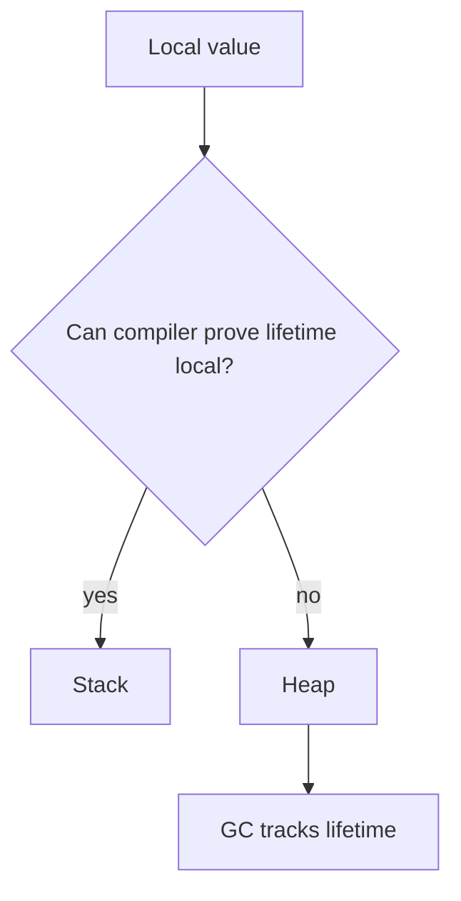
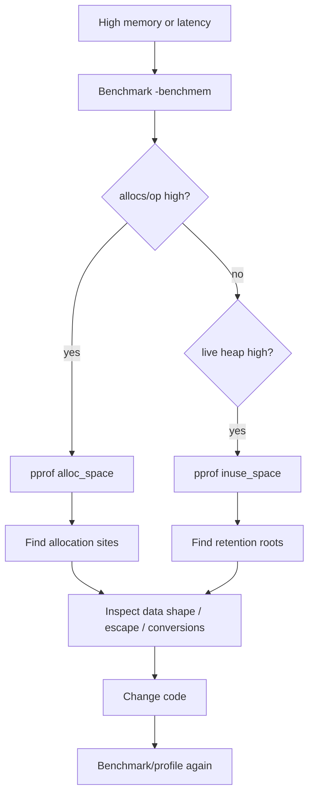
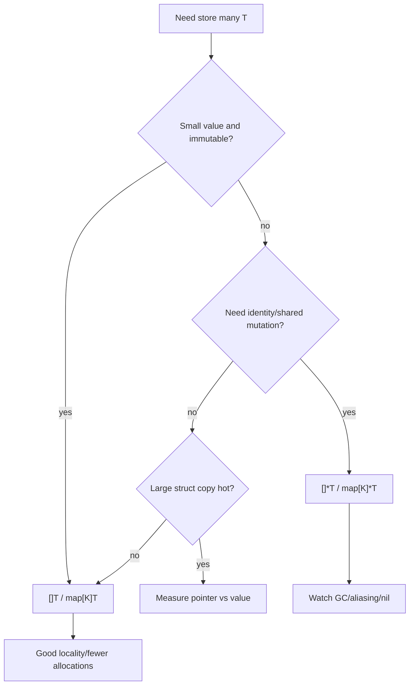

# learn-go-data-model-part-029.md

# Part 029 — Memory, Allocation, Escape, GC Pressure from Data Shape

> Seri: `learn-go-data-model`  
> Bagian: `029 / 034`  
> Target pembaca: Java software engineer yang ingin memahami Go data model pada level production engineering  
> Fokus: stack vs heap, escape analysis, allocation source, object lifetime, pointer density, slice/map/string retention, GC pressure, pooling, profiling, dan data-shape engineering

---

## 0. Posisi Part Ini dalam Seri

Kita sudah membahas banyak data type Go secara terpisah:

```text
part-008..010: array dan slice
part-011..012: map
part-013: struct layout/alignment/padding
part-016: pointer
part-017: nil
part-019: interface runtime/boxing
part-021..022: generics
part-025: unsafe dan memory view
part-028: time
```

Sekarang kita satukan dari sisi memory.

Di Go, performa dan GC pressure sangat dipengaruhi oleh bentuk data:

```text
- apakah data disimpan by value atau pointer?
- apakah object escape ke heap?
- berapa banyak allocation per request?
- berapa banyak pointer yang harus discan GC?
- apakah slice kecil menahan backing array besar?
- apakah substring menahan string besar?
- apakah map berisi pointer-heavy object?
- apakah interface menyebabkan boxing/allocation?
- apakah pooling benar-benar membantu?
```

Untuk Java engineer:

```text
Java:
- hampir semua object user-defined di heap
- primitive vs boxed object penting
- GC scanning object graph
- allocation murah tapi GC pressure nyata

Go:
- value dapat hidup di stack atau heap
- compiler escape analysis menentukan placement
- pointer bukan sekadar reference; pointer density memengaruhi GC scan
- value layout dan slice/map backing storage penting
```

Go bukan manual memory management, tetapi bentuk data tetap sangat menentukan performa.

---

## 1. Tujuan Pembelajaran

Setelah part ini, kamu harus bisa:

1. Membedakan stack dan heap di Go secara praktis.
2. Memahami escape analysis.
3. Membaca output `-gcflags=-m`.
4. Menjelaskan kenapa pointer return tidak selalu buruk.
5. Menjelaskan kenapa pointer-heavy data meningkatkan GC pressure.
6. Memahami allocation dari slice, map, string, interface, closure.
7. Menghindari slice retention leak.
8. Menghindari substring retention problem.
9. Mendesain struct agar cache/GC friendly.
10. Memahami pooling dengan `sync.Pool` dan trade-off-nya.
11. Menggunakan benchmark `-benchmem`.
12. Menggunakan pprof untuk allocation/heap.
13. Membuat PR checklist untuk memory behavior.

---

## 2. Memory dalam Satu Kalimat

Go memory management adalah kombinasi:

```text
compiler escape analysis
stack allocation
heap allocation
garbage collection
runtime allocation strategies
```

Developer tidak memilih langsung:

```text
stack vs heap
```

Compiler memilih berdasarkan apakah value bisa aman hidup di stack atau harus escape ke heap.

Contoh:

```go
func NewPoint(x, y int) *Point {
    p := Point{X: x, Y: y}
    return &p
}
```

`p` kemungkinan escape ke heap karena pointer dikembalikan.

Tapi jangan langsung panik. Heap allocation bukan dosa. Yang penting adalah jumlah, lifetime, dan pointer graph.

---

## 3. Stack vs Heap: Practical View

Stack:

```text
- per goroutine
- grows/shrinks dynamically
- fast allocation/deallocation
- lifetime tied to function call/goroutine stack
- no GC tracing for dead stack frames like heap object graph
```

Heap:

```text
- shared managed memory
- object lives beyond function frame or unknown lifetime
- garbage collected
- allocation still optimized but more expensive than stack
- pointer-containing heap objects increase GC scan work
```

Mental model:



---

## 4. Escape Analysis

Escape analysis decides whether value must live beyond stack frame.

Command:

```bash
go build -gcflags=-m ./...
```

More verbose:

```bash
go build -gcflags='all=-m -m' ./...
```

Example:

```go
type Point struct {
    X, Y int
}

func NewPoint() *Point {
    p := Point{X: 1, Y: 2}
    return &p
}
```

Compiler may report:

```text
moved to heap: p
```

Because returning `&p` means caller may use it after function returns.

---

## 5. Escape Is Not Always Bad

This escapes:

```go
func NewUser(id UserID) *User {
    return &User{id: id}
}
```

That's normal. If object must outlive function, heap is correct.

Bad thinking:

```text
All heap allocations are bad.
```

Better thinking:

```text
Unnecessary high-frequency allocations on hot paths are bad.
Long-lived pointer-heavy object graphs can create GC pressure.
```

Use measurement.

---

## 6. Allocation Sources

Common allocation sources:

```text
- new / &T literal that escapes
- make([]T, ...)
- make(map[K]V, ...)
- append beyond capacity
- string concatenation
- []byte <-> string conversion
- interface boxing that escapes
- closure capturing variables
- goroutine stack/lifetime
- reflection
- fmt package
- JSON marshal/unmarshal
- time formatting/parsing
```

Not all allocations are obvious.

Benchmark:

```bash
go test -bench=. -benchmem
```

Look at:

```text
ns/op
B/op
allocs/op
```

---

## 7. Value vs Pointer

Value:

```go
type Point struct {
    X, Y int
}

func Move(p Point, dx, dy int) Point {
    p.X += dx
    p.Y += dy
    return p
}
```

Pointer:

```go
func MoveInPlace(p *Point, dx, dy int) {
    p.X += dx
    p.Y += dy
}
```

Pointer can avoid copying large structs, but:

```text
- may cause heap escape
- adds indirection
- increases pointer graph
- allows mutation/aliasing
- can hurt cache locality
```

Value copy can be cheap for small structs and improves locality.

Rule:

```text
Use pointer for mutation, large structs, identity, optionality, or avoiding expensive copies.
Use value for small immutable/value objects.
Measure for performance-sensitive code.
```

---

## 8. Pointer Density and GC Scan

GC must scan pointers to find live objects.

Compare:

```go
type UserA struct {
    ID    string
    Email string
    Name  string
}
```

Strings contain pointer-like header to bytes.

Pointer-heavy:

```go
type UserB struct {
    ID    *string
    Email *string
    Name  *string
}
```

More pointers, more nil checks, more allocations, more GC scan work.

For optional fields at boundary, pointers may be valid.

For core domain, pointer-everywhere is often costly and semantically weak.

Guideline:

```text
Avoid pointer fields for required scalar values.
```

---

## 9. Struct Shape and Locality

Array/slice of values:

```go
users := []User{
    {ID: "u1"},
    {ID: "u2"},
}
```

Data stored contiguously in backing array.

Slice of pointers:

```go
users := []*User{
    &User{ID: "u1"},
    &User{ID: "u2"},
}
```

Backing array stores pointers; user objects scattered on heap.

Trade-off:

```text
[]User:
+ better locality
+ fewer allocations
+ less GC pointer chasing if User pointer-light
- copying elements may be more expensive
- mutation can copy accidentally depending use

[]*User:
+ stable identity
+ cheap element copy
+ supports nil
+ mutation shared
- more allocations
- worse locality
- more GC work
```

Do not default to `[]*T`.

---

## 10. Slice Backing Array Retention

Classic leak-like pattern:

```go
func FirstKB(data []byte) []byte {
    return data[:1024]
}
```

If `data` is 100MB, returned 1KB slice keeps entire 100MB backing array alive.

Fix by copy:

```go
func FirstKBCopy(data []byte) []byte {
    out := make([]byte, 1024)
    copy(out, data[:1024])
    return out
}
```

Or:

```go
return append([]byte(nil), data[:1024]...)
```

Rule:

```text
If returning small slice from large buffer, consider copying to release backing array.
```

---

## 11. Slice Delete and GC Retention

Deleting pointer-containing elements:

```go
s = append(s[:i], s[i+1:]...)
```

Old last element may still be referenced in backing array.

For pointer-heavy elements, clear:

```go
copy(s[i:], s[i+1:])
var zero T
s[len(s)-1] = zero
s = s[:len(s)-1]
```

Generic delete:

```go
func DeleteAt[T any](s []T, i int) []T {
    copy(s[i:], s[i+1:])
    var zero T
    s[len(s)-1] = zero
    return s[:len(s)-1]
}
```

Clearing helps GC when `T` contains pointers.

---

## 12. Slice Capacity Control

If you pass subslice to code that appends, it may overwrite original backing array.

Full slice expression:

```go
sub := s[:n:n]
```

This sets capacity to length `n`.

Then append allocates new backing array instead of modifying beyond `n`.

Use when you want isolate append behavior.

Memory angle:

```text
Capacity controls retention and append aliasing.
```

---

## 13. String Retention

Substring may retain large original string data depending implementation and compiler/runtime behavior. Historically this has been a concern.

Example:

```go
func ExtractToken(line string) string {
    return line[:10]
}
```

If `line` is huge and token retained, large string data may be retained.

Defensive copy:

```go
token := strings.Clone(line[:10])
```

Use when retaining small substring from large string long-term.

Guideline:

```text
If substring outlives large source, clone intentionally.
```

---

## 14. []byte to string Conversion

Safe conversion copies:

```go
s := string(b)
```

This allocates new string bytes.

If in hot path, cost can matter.

Avoid unnecessary conversions:

```go
bytes.Equal(b, []byte("ok")) // still creates []byte literal maybe optimized
```

Better for prefix:

```go
bytes.HasPrefix(b, []byte("prefix"))
```

If you need map key:

```go
m[string(b)] = value
```

This copies to immutable string, which is usually correct.

Unsafe zero-copy can corrupt if bytes mutate. Avoid unless invariants are strict.

---

## 15. String Builder

Repeated string concatenation in loop can allocate.

Bad:

```go
s := ""
for _, part := range parts {
    s += part
}
```

Better:

```go
var b strings.Builder
for _, part := range parts {
    b.WriteString(part)
}
s := b.String()
```

If size known:

```go
b.Grow(totalLen)
```

`strings.Builder` avoids repeated allocation/copy.

For bytes, use `bytes.Buffer` or `[]byte` append depending use.

---

## 16. Map Allocation

Map allocates internal buckets.

```go
m := make(map[string]int)
```

If expected size known:

```go
m := make(map[string]int, len(items))
```

This reduces growth allocations.

Example:

```go
counts := make(map[Status]int, len(statuses))
```

But don't over-optimize with wildly huge hints.

Map memory can remain allocated after deletes.

If map shrinks massively and long-lived, rebuild:

```go
next := make(map[K]V, len(m))
for k, v := range m {
    if keep(k, v) {
        next[k] = v
    }
}
m = next
```

---

## 17. Interface Boxing and Escape

Interface value stores dynamic type/value.

```go
func Log(v any) {
    fmt.Println(v)
}
```

Passing values to `any` may box them. If interface escapes, allocation may happen.

Variadic `...any`:

```go
fmt.Sprintf("%v %v", a, b)
```

Often allocates.

Guideline:

```text
Avoid fmt/reflection-heavy formatting in hot paths.
Use typed code in inner loops.
```

But for logs/error messages outside hot path, clarity is fine.

---

## 18. Closure Capture

Closures can cause captured variables to escape.

```go
func MakeAdder(n int) func(int) int {
    return func(x int) int {
        return x + n
    }
}
```

`n` must live as long as returned function.

In loops, closure capture can allocate or create bugs.

```go
for _, v := range values {
    go func() {
        fmt.Println(v)
    }()
}
```

Modern Go fixed common loop variable capture semantics for range variables, but still be explicit when clarity matters:

```go
v := v
go func() {
    fmt.Println(v)
}()
```

Memory angle:

```text
Goroutine + closure may extend lifetime of captured values.
```

---

## 19. Goroutine Lifetime and Memory

Goroutine has stack and references it holds.

Leak pattern:

```go
go func() {
    <-ch // never receives
}()
```

Any captured values remain live.

If goroutine captures large object:

```go
go func() {
    use(big)
    <-never
}()
```

`big` remains live.

Goroutine leaks are memory leaks.

Use context/cancellation and ensure goroutines exit.

---

## 20. JSON Allocation

`encoding/json` uses reflection and allocations.

Hot path considerations:

```text
- decode into struct, not map[string]any
- reuse buffers carefully
- avoid unnecessary intermediate []byte/string
- stream with Encoder/Decoder
- benchmark custom MarshalJSON only if needed
```

Do not switch JSON library casually; correctness/security/compatibility matter.

---

## 21. Reflection Allocation

Reflection can allocate due to:

```text
- Interface() calls
- dynamic value creation
- map/slice building
- tag parsing
- indirect calls
```

Cache metadata:

```text
reflect.Type -> field metadata
```

Avoid reflection in per-item hot loop if possible.

Use code generation or explicit mapping for high-throughput paths.

---

## 22. `sync.Pool`

`sync.Pool` stores temporary objects for reuse.

Example:

```go
var bufPool = sync.Pool{
    New: func() any {
        return new(bytes.Buffer)
    },
}

func Use() {
    b := bufPool.Get().(*bytes.Buffer)
    b.Reset()
    defer bufPool.Put(b)

    // use b
}
```

Use cases:

```text
- temporary buffers
- high allocation hot paths
- objects safe to discard at any time
```

Important:

```text
sync.Pool entries may be dropped by GC.
Do not use as cache.
Objects must be reset before reuse.
Do not put object still referenced elsewhere.
```

---

## 23. Pooling Trade-Off

Pooling can hurt:

```text
- retains memory longer
- increases complexity
- causes data leakage if not reset
- can increase contention
- hides ownership bugs
- may not help if allocation already cheap/stack-allocated
```

Before pool:

```bash
go test -bench=. -benchmem
go test -run=^$ -bench=BenchmarkX -memprofile=mem.out
```

After pool, prove improvement.

Guideline:

```text
Do not introduce sync.Pool without benchmark and reset discipline.
```

---

## 24. Object Reuse and Aliasing

Reusing buffers can cause bugs.

Bad:

```go
buf := pool.Get().([]byte)
defer pool.Put(buf)

return buf // caller now holds pooled buffer
```

Once returned to pool, another goroutine may mutate it.

Rule:

```text
Do not return pooled mutable object unless ownership transfer is explicit and object is not put back.
```

For response body, copy if needed.

---

## 25. Preallocation

Slice preallocation:

```go
out := make([]Item, 0, len(input))
```

Good when output upper bound known.

Map preallocation:

```go
m := make(map[Key]Value, len(input))
```

String builder:

```go
b.Grow(expected)
```

But over-preallocation wastes memory.

Use realistic capacity.

---

## 26. Allocation-Free Is Not Always Better

Avoiding allocation by sharing memory can introduce:

```text
- aliasing bugs
- data races
- retention of large backing arrays
- mutation surprises
- API complexity
```

A copy can be the correct design.

Example:

```go
func (u User) Roles() []Role {
    return append([]Role(nil), u.roles...)
}
```

This allocates but protects invariant.

Performance and correctness must be balanced.

---

## 27. Escape Analysis Examples

Example 1:

```go
func Value() Point {
    return Point{X: 1, Y: 2}
}
```

Likely no heap allocation.

Example 2:

```go
func Pointer() *Point {
    return &Point{X: 1, Y: 2}
}
```

Likely heap allocation.

Example 3:

```go
func Interface() any {
    return Point{X: 1, Y: 2}
}
```

May allocate depending escape.

Example 4:

```go
func Local() int {
    x := 1
    return x + 2
}
```

Stack/register.

Use compiler output to confirm; do not guess blindly.

---

## 28. Reading `-gcflags=-m`

Command:

```bash
go test -gcflags='all=-m' ./...
```

Look for:

```text
moved to heap
escapes to heap
does not escape
inlining call
```

Example messages:

```text
&Point{...} escapes to heap
p does not escape
moved to heap: x
```

Use this to understand hot path code.

Caveat:

```text
Compiler output is noisy and version-dependent.
Use it as diagnostic, not as public contract.
```

---

## 29. Benchmarking Allocations

Benchmark:

```go
func BenchmarkBuildUsers(b *testing.B) {
    for i := 0; i < b.N; i++ {
        _ = BuildUsers(input)
    }
}
```

Run:

```bash
go test -bench=BenchmarkBuildUsers -benchmem
```

Output:

```text
1000000  1200 ns/op  512 B/op  4 allocs/op
```

Interpret:

```text
B/op = bytes allocated per operation
allocs/op = number of heap allocations per operation
```

Try to reduce allocs only if benchmark matters.

---

## 30. Memory Profiles

Generate:

```bash
go test -bench=. -memprofile=mem.out
go tool pprof mem.out
```

For running service:

```go
import _ "net/http/pprof"
```

Then:

```bash
go tool pprof http://localhost:6060/debug/pprof/heap
```

Look at:

```text
alloc_space -> total allocated over time
inuse_space -> currently live heap
alloc_objects -> number of allocated objects
inuse_objects -> live objects
```

Use right view for problem:

```text
High allocation rate -> alloc_space
Memory retention/leak -> inuse_space
```

---

## 31. GC Pressure

GC pressure increases with:

```text
- high allocation rate
- many live heap objects
- pointer-heavy object graph
- long-lived references
- large maps/slices retaining memory
- goroutine leaks
```

GC cost is not just heap size; pointer scanning matters.

Pointer-free large byte slices are different from pointer-rich object graphs.

Example:

```go
[]byte of 100MB
```

large heap, but no pointers inside.

```go
[]*Node of millions
```

many pointers, more scan/pointer chasing.

---

## 32. Pointer-Free Data

Pointer-free structs can reduce GC scan.

Example:

```go
type EventKey struct {
    TenantID uint64
    EventID  uint64
}
```

No pointers.

Compared to:

```go
type EventKey struct {
    TenantID string
    EventID  string
}
```

Strings contain pointers to bytes.

Do not contort domain purely for pointer-free data, but for hot indexes/cache keys, compact pointer-free keys can help.

---

## 33. Struct of Arrays vs Array of Structs

Array of structs:

```go
type Point struct {
    X, Y float64
}

points := []Point{}
```

Struct of arrays:

```go
type Points struct {
    X []float64
    Y []float64
}
```

AoS is natural.

SoA can improve cache/vectorization for numeric workloads.

For typical business apps, AoS is clearer.

For high-performance data processing, data layout matters.

---

## 34. Map Value: Value or Pointer?

Map of values:

```go
m := map[UserID]User{}
```

Retrieval copies value.

Cannot mutate field directly:

```go
// m[id].Name = "x" // invalid
```

Need:

```go
u := m[id]
u.Name = "x"
m[id] = u
```

Map of pointers:

```go
m := map[UserID]*User{}
m[id].Name = "x"
```

Trade-off:

```text
map[K]V:
+ fewer allocations if V inserted by value
+ value ownership clearer
+ less pointer chasing
- copy cost
- update requires reassign

map[K]*V:
+ mutate in place
+ stable identity
+ cheaper map value copy
- more allocations
- nil possibility
- aliasing
- GC work
```

Choose based on semantics and measurement.

---

## 35. Map Key Shape

Good key:

```go
type TenantUserKey struct {
    TenantID TenantID
    UserID   UserID
}
```

If `TenantID`/`UserID` are strings, key has string headers/pointers.

For hot maps, compact key may help:

```go
type TenantUserKey struct {
    TenantHash uint64
    UserHash   uint64
}
```

But hash collision/security/canonicalization risks arise.

Do not replace clear typed keys with hashes unless profiling proves map key cost significant and collision policy is robust.

---

## 36. Channels and Allocation

Channels allocate runtime structures.

```go
ch := make(chan Event, 1024)
```

Buffered channel stores elements in ring buffer.

If element is large struct:

```go
chan LargeStruct
```

Copies large values into channel buffer.

Alternative:

```go
chan *LargeStruct
```

Less copy, more heap/pointer/aliasing.

Guideline:

```text
Small immutable values -> chan T
Large mutable/identity objects -> chan *T may be appropriate
```

Measure and consider ownership.

---

## 37. Context Value Memory

`context.WithValue` can retain large objects for request lifetime.

Bad:

```go
ctx = context.WithValue(ctx, key, largeUserObject)
```

Better:

```go
ctx = context.WithValue(ctx, key, userID)
```

Context values should be small, request-scoped metadata.

Do not store large data/caches in context.

---

## 38. Error Wrapping Memory

Error wrapping creates objects/strings.

```go
return fmt.Errorf("load user %s: %w", id, err)
```

Correct for boundary context.

In extremely hot path, avoid building errors on success path. Errors should be exceptional enough that allocation is fine.

Do not sacrifice error clarity for micro allocation unless measured.

---

## 39. Logging Allocation

Structured logging may allocate depending logger and fields.

Hot debug logs:

```go
logger.Debug("item", "value", expensiveString())
```

If log level disabled but argument evaluated, cost still paid.

Use lazy logging or level check if expensive.

Avoid `fmt.Sprintf` before logger:

```go
logger.Info(fmt.Sprintf("user %s", id))
```

Prefer structured fields.

---

## 40. Data Shape and API Ownership

Getter returning internal slice:

```go
func (u *User) Roles() []Role {
    return u.roles
}
```

No allocation, but exposes mutation.

Safer:

```go
func (u *User) Roles() []Role {
    return append([]Role(nil), u.roles...)
}
```

Allocation but protects invariant.

Alternative visitor:

```go
func (u *User) EachRole(fn func(Role) bool)
```

No allocation but more complex.

Choose based on API safety/performance.

---

## 41. Immutable Data and Sharing

Immutable data can be shared safely.

```go
type Config struct {
    values map[string]string
}
```

If immutable after construction, you can share pointer to Config.

But map is mutable internally. Need discipline:

```go
func NewConfig(values map[string]string) Config {
    return Config{values: maps.Clone(values)}
}

func (c Config) Get(k string) (string, bool) {
    v, ok := c.values[k]
    return v, ok
}
```

Do not expose map.

Copy on input; no mutation after.

---

## 42. Copy-on-Write

For rarely updated shared config:

```go
var current atomic.Pointer[Config]
```

Update:

```go
old := current.Load()
next := old.WithChange(k, v)
current.Store(&next)
```

Readers use immutable config without locks.

Trade-off:

```text
more allocation on write
cheap reads
requires immutability discipline
```

Good for configs/routing tables/policies.

---

## 43. Memory and Generics

Generic containers can be allocation-friendly if they avoid interface boxing.

```go
type Stack[T any] struct {
    values []T
}
```

Compared to:

```go
type Stack struct {
    values []any
}
```

Generic stack stores concrete `T` values, avoiding per-element interface boxing.

Generics can improve type safety and memory shape.

But callback-heavy generic helpers can allocate due to closures.

Measure hot paths.

---

## 44. Memory and Interfaces

Interface slices:

```go
[]io.Reader
[]any
```

store interface values, each with dynamic type/value.

This can be appropriate for polymorphism.

But if all elements are same concrete type, prefer:

```go
[]Concrete
```

or:

```go
[]*Concrete
```

Interface polymorphism has dispatch/boxing/GC implications.

Do not use `[]any` as generic container after Go generics unless truly dynamic.

---

## 45. Memory and Reflection

Reflection-heavy generic mappers/validators allocate and use dynamic paths.

For low-frequency config/API decode, fine.

For high-throughput serialization, consider:

```text
- explicit code
- code generation
- custom marshalers
- cached reflection metadata
```

Reflection cost must be judged by workload.

---

## 46. Memory and Unsafe

Unsafe can avoid copies but can create retention/aliasing/security bugs.

Example:

```text
unsafe []byte -> string view
```

Avoid unless:

```text
- source bytes immutable
- lifetime guaranteed
- map key mutation impossible
- benchmark proves need
```

A safe copy is often better.

---

## 47. Memory Leak Patterns in Go

Go has GC, but memory leaks still happen through references.

Common:

```text
- goroutine blocked forever
- global map never deletes
- cache without eviction
- slice retaining large backing array
- substring retaining large string
- time.Ticker not stopped
- context not canceled
- channel send blocked with captured data
- sync.Pool misuse retaining huge buffers
```

Leak means:

```text
objects remain reachable even though logically unused
```

GC cannot collect reachable garbage.

---

## 48. Cache Design and Memory

Map cache:

```go
cache := map[Key]Value{}
```

Needs:

```text
- max size
- eviction policy
- TTL
- cleanup
- metrics
- memory bound
```

Without bound, cache is memory leak.

Use established cache library or implement carefully.

For values with large slices/maps, consider clone/ownership.

---

## 49. Backpressure and Memory

Unbounded queues cause memory growth.

Bad:

```go
var queue []Job
```

append forever if workers slow.

Use bounded channel:

```go
jobs := make(chan Job, 1000)
```

When full, decide:

```text
block
drop
reject
shed load
spill to disk
```

Data shape and concurrency design meet here.

---

## 50. Large Object Strategy

Large blobs:

```text
[]byte, string, JSON, files, CLOB
```

Guidelines:

```text
- stream when possible
- avoid loading in list endpoints
- avoid copying repeatedly
- copy when needed to release larger buffer
- cap request body size
- store outside hot object graph
```

Do not embed huge blobs in frequently cached domain objects unless needed.

---

## 51. Mermaid: Allocation Diagnostic Flow



---

## 52. Mermaid: Data Shape Choice



---

## 53. Mini Lab 1 — Slice Retention

```go
func KeepSmall(data []byte) []byte {
    return data[:10]
}
```

Problem:

```text
Returned slice keeps entire backing array alive.
```

Fix:

```go
func KeepSmall(data []byte) []byte {
    return append([]byte(nil), data[:10]...)
}
```

---

## 54. Mini Lab 2 — Delete Clears Reference

```go
func DeleteAt[T any](s []T, i int) []T {
    copy(s[i:], s[i+1:])
    var zero T
    s[len(s)-1] = zero
    return s[:len(s)-1]
}
```

Lesson:

```text
Clear removed slot to help GC when T contains pointers.
```

---

## 55. Mini Lab 3 — Map Preallocation

```go
func Count(values []string) map[string]int {
    m := make(map[string]int, len(values))
    for _, v := range values {
        m[v]++
    }
    return m
}
```

Lesson:

```text
Capacity hint can reduce map growth allocations.
```

---

## 56. Mini Lab 4 — `[]T` vs `[]*T`

```go
users := make([]User, 0, n)
ptrs := make([]*User, 0, n)
```

Question:

```text
Which allocates fewer objects?
```

Typical answer:

```text
[]User can store values in one backing array.
[]*User often needs separate User allocations plus pointer array.
```

But if users already exist elsewhere, `[]*User` may be appropriate.

---

## 57. Mini Lab 5 — strings.Builder

```go
var b strings.Builder
b.Grow(1024)

for _, p := range parts {
    b.WriteString(p)
}

s := b.String()
```

Lesson:

```text
Builder avoids repeated string concatenation allocations.
```

---

## 58. Mini Lab 6 — sync.Pool Reset

```go
buf := pool.Get().(*bytes.Buffer)
buf.Reset()
defer pool.Put(buf)
```

Lesson:

```text
Always reset pooled mutable objects before reuse.
```

Also ensure no one uses object after Put.

---

## 59. Common Anti-Patterns

### 59.1 Pointer everywhere

More allocations, nils, aliasing, GC scan.

### 59.2 Returning small subslice of huge buffer

Retains large backing array.

### 59.3 Not clearing deleted slice elements

Retains pointers.

### 59.4 Unbounded cache/map

Reachable memory leak.

### 59.5 Goroutine leak

Captured references stay live.

### 59.6 `sync.Pool` without benchmark

Complexity without proof.

### 59.7 Exposing internal slices/maps

Avoids allocation but breaks invariants.

### 59.8 Reflection/JSON in hot loop without measurement

Allocation and CPU cost.

### 59.9 `fmt.Sprintf` in hot path

Often allocates.

### 59.10 Optimizing by unsafe first

Correctness risk before evidence.

---

## 60. Production Guidelines

### 60.1 Measure First

Use benchmark, pprof, escape analysis.

### 60.2 Prefer Clear Ownership

Know who owns slice/map/buffer and who may mutate.

### 60.3 Use Values for Small Value Objects

Avoid pointer fields for required small scalars.

### 60.4 Copy to Protect Invariants

Allocation can be correct.

### 60.5 Preallocate When Size Known

Slices, maps, builders.

### 60.6 Clear References on Removal

For long-lived slices/queues/stacks.

### 60.7 Bound Caches and Queues

Memory must have limit.

### 60.8 Stop Tickers and Cancel Contexts

Avoid runtime resource leaks.

### 60.9 Keep Hot Path Typed

Avoid `any`, reflection, fmt, JSON if measured hot.

### 60.10 Re-profile After Changes

Memory optimization must be verified.

---

## 61. PR Review Checklist

### 61.1 Allocation

```text
[ ] Any new allocation in hot path?
[ ] Slice/map capacity known and preallocated?
[ ] string concatenation in loop?
[ ] fmt/reflection/json used in hot path?
[ ] Benchmark updated if performance-sensitive?
```

### 61.2 Escape

```text
[ ] New pointers returned/stored intentionally?
[ ] Closure captures large values?
[ ] Goroutine captures large objects?
[ ] Escape analysis checked if needed?
```

### 61.3 Data Shape

```text
[ ] []T vs []*T choice justified?
[ ] map[K]V vs map[K]*V choice justified?
[ ] Required fields not pointer unnecessarily?
[ ] Pointer density acceptable?
```

### 61.4 Retention

```text
[ ] Small subslice of large buffer copied if retained?
[ ] Removed slice elements cleared?
[ ] Substring from large string cloned if retained?
[ ] Large blobs not embedded in hot cached objects?
```

### 61.5 Ownership

```text
[ ] Internal slices/maps not exposed mutably?
[ ] Returned buffers not reused/pool-owned?
[ ] Input cloned if retained beyond call?
[ ] Output cloned if caller must not mutate internals?
```

### 61.6 Long-Lived Structures

```text
[ ] Cache bounded?
[ ] Queue bounded/backpressure defined?
[ ] Map shrink/rebuild needed?
[ ] Ticker stopped?
[ ] Context canceled?
```

### 61.7 Pooling

```text
[ ] sync.Pool benchmark-proven?
[ ] Objects reset?
[ ] No use-after-Put?
[ ] Pool not used as cache?
```

### 61.8 Profiling

```text
[ ] pprof used for real issue?
[ ] alloc_space vs inuse_space understood?
[ ] Optimization result measured?
```

---

## 62. Ringkasan Mental Model

Go memory performance is data-shape performance.

```text
Stack vs heap is compiler decision.
Escape analysis explains why.
GC cost depends on allocation rate, live heap, and pointer graph.
```

Common high-impact rules:

```text
- avoid pointer-everywhere
- avoid retaining large backing arrays accidentally
- preallocate when obvious
- clear references in long-lived slices
- bound caches/queues
- inject ownership rules into APIs
- benchmark before cleverness
```

Untuk Java engineer:

```text
Go is not manual memory management,
but it rewards understanding value layout, allocation, escape, and GC scanning.
```

Best memory optimization is usually:

```text
fewer unnecessary objects
shorter lifetimes
less pointer chasing
clear ownership
measured changes
```

---

## 63. Apa yang Tidak Dibahas di Part Ini

Part berikutnya:

```text
part-030 — Concurrency-Safe Data: Ownership, Copy, Immutability, Sync Boundaries
```

Kita akan membahas:

```text
- data race
- ownership transfer
- immutability
- copy on write
- mutex-protected data
- channel ownership
- atomic pointer
- safe publication
- concurrent maps
```

---

## 64. Referensi Resmi

- Go Optimization Guide / Diagnostics — Escape analysis and profiling concepts  
  https://go.dev/doc/diagnostics
- Package `runtime/pprof`  
  https://pkg.go.dev/runtime/pprof
- Package `net/http/pprof`  
  https://pkg.go.dev/net/http/pprof
- Package `sync` — `Pool`  
  https://pkg.go.dev/sync#Pool
- Package `strings` — `Builder`, `Clone`  
  https://pkg.go.dev/strings
- Package `bytes`  
  https://pkg.go.dev/bytes
- Package `runtime`  
  https://pkg.go.dev/runtime
- Go 1.26 Release Notes  
  https://go.dev/doc/go1.26

---

## 65. Status Seri

Selesai:

```text
part-000  Orientation
part-001  Type system core
part-002  Zero value and invariants
part-003  Constants and iota
part-004  Numeric foundations
part-005  Numeric correctness
part-006  Text model I
part-007  Text model II
part-008  Array
part-009  Slice I
part-010  Slice II
part-011  Map I
part-012  Map II
part-013  Struct I
part-014  Struct II
part-015  Struct III
part-016  Pointer
part-017  Nil
part-018  Interface I
part-019  Interface II
part-020  Error as Data
part-021  Generics I
part-022  Generics II
part-023  Comparability / Equality / Ordering
part-024  Reflection
part-025  Unsafe
part-026  Encoding Data
part-027  Database Boundary
part-028  Time as Data
part-029  Memory / Allocation / Escape / GC Pressure
```

Berikutnya:

```text
part-030  Concurrency-Safe Data: Ownership, Copy, Immutability, Sync Boundaries
```

Seri belum selesai. Masih ada part 030 sampai part 034.


<!-- NAVIGATION_FOOTER -->
<div class="page-nav">
<a href="./learn-go-data-model-part-028.md">⬅️ Part 028 — Time as Data: time.Time, Duration, Monotonic Clock, Time Zone</a>
<a href="./index.md">📚 Kategori</a>
<a href="../../index.md">🏠 Home</a>
<a href="./learn-go-data-model-part-030.md">Part 030 — Concurrency-Safe Data: Ownership, Copy, Immutability, Sync Boundaries ➡️</a>
</div>
