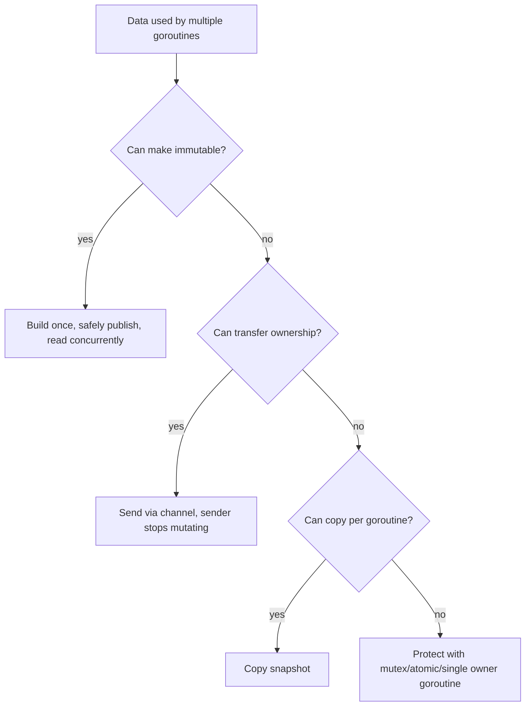

# learn-go-data-model-part-030.md

# Part 030 — Concurrency-Safe Data: Ownership, Copy, Immutability, Sync Boundaries

> Seri: `learn-go-data-model`  
> Bagian: `030 / 034`  
> Target pembaca: Java software engineer yang ingin memahami Go data model pada level production engineering  
> Fokus: data race, ownership, copy, immutability, mutex, channel ownership, atomic pointer, safe publication, concurrent maps, dan data-shape untuk concurrency

---

## 0. Posisi Part Ini dalam Seri

Kita sudah membahas:

```text
part-009..010: slice aliasing dan backing array
part-011..012: map semantics
part-014: value/pointer receiver dan mutability contract
part-016: pointer dan aliasing
part-017: nil
part-023: equality/order/hashability
part-029: memory, allocation, escape, GC pressure
```

Sekarang kita masuk ke data dalam concurrency.

Di Go, concurrency bukan hanya goroutine dan channel. Yang paling penting adalah:

```text
Siapa pemilik data?
Siapa boleh membaca?
Siapa boleh menulis?
Kapan data dipublish ke goroutine lain?
Apakah data immutable?
Apakah data dicopy?
Apakah akses dilindungi mutex/atomic/channel?
Apakah map/slice internal bocor?
```

Untuk Java engineer:

```text
Java:
- synchronized, volatile, concurrent collections
- immutability/final fields
- happens-before memory model
- thread-safe vs not thread-safe collections

Go:
- goroutine murah
- channel sebagai ownership/message boundary
- sync.Mutex/RWMutex untuk shared mutable state
- sync/atomic untuk low-level state
- data race adalah bug
- map/slice biasa tidak otomatis aman
```

Go slogan:

```text
Do not communicate by sharing memory; share memory by communicating.
```

Namun produksi Go tetap sering memakai mutex dan atomics. Kuncinya adalah ownership dan boundary yang jelas.

---

## 1. Tujuan Pembelajaran

Setelah part ini, kamu harus bisa:

1. Menjelaskan apa itu data race.
2. Membedakan race condition dan data race.
3. Mendesain ownership transfer antar goroutine.
4. Memahami kapan copy lebih aman daripada sharing.
5. Mendesain immutable data untuk safe sharing.
6. Memakai mutex sebagai boundary state.
7. Menghindari map/slice concurrent access bug.
8. Memahami channel ownership pattern.
9. Memahami safe publication.
10. Memahami atomic pointer untuk read-mostly data.
11. Memahami copy-on-write config/policy.
12. Memahami `sync.Map` use case.
13. Menggunakan race detector.
14. Membuat PR checklist concurrency-safe data.

---

## 2. Data Race dalam Satu Kalimat

Data race terjadi ketika:

```text
dua goroutine mengakses memory yang sama secara concurrent,
setidaknya satu akses adalah write,
dan tidak ada synchronization yang benar.
```

Contoh:

```go
var n int

go func() {
    n++
}()

go func() {
    n++
}()
```

Ini data race.

Akibat:

```text
- hasil salah
- memory visibility tidak terjamin
- bug muncul sporadis
- race detector bisa mendeteksi banyak kasus
```

Run:

```bash
go test -race ./...
```

---

## 3. Race Condition vs Data Race

Data race:

```text
unsynchronized concurrent memory access
```

Race condition:

```text
hasil bergantung timing/interleaving, bisa terjadi bahkan tanpa data race
```

Example race condition without data race:

```go
// two requests both observe "available"
// both proceed logically
// database unique constraint rejects one
```

Could be protected by DB transaction/constraint, not necessarily Go data race.

This part focuses on data safety in memory, but production correctness needs both.

---

## 4. Shared Mutable State Is the Core Risk

Dangerous shape:

```go
type Store struct {
    users map[UserID]User
}
```

If multiple goroutines call:

```go
store.users[id] = user
u := store.users[id]
```

without lock, race.

Map is not safe for concurrent read/write.

Even concurrent writes can panic:

```text
fatal error: concurrent map writes
```

But do not rely on panic; data race itself is bug.

---

## 5. Ownership Model

Ownership means:

```text
Which goroutine/component is allowed to mutate this data?
```

Patterns:

```text
single owner goroutine
mutex owner
immutable shared data
copy per goroutine
atomic pointer to immutable snapshot
database/external owner
```

Design question:

```text
Can I avoid sharing mutable data?
```

If yes, prefer copy/ownership transfer.

---

## 6. Ownership Transfer by Channel

If one goroutine sends data and stops touching it, receiver owns it.

```go
jobs := make(chan []byte)

go func() {
    buf := make([]byte, 1024)
    // fill buf
    jobs <- buf

    // sender must not mutate buf after sending if receiver owns it
}()
```

Receiver:

```go
buf := <-jobs
process(buf)
```

Rule:

```text
Sending a pointer/slice/map over channel does not copy underlying data.
It transfers access by convention, not by compiler enforcement.
```

If sender continues mutating, race.

---

## 7. Channel Send Is Synchronization, Not Deep Copy

Channel send synchronizes memory visibility:

```text
writes before send are visible after receive
```

But data object is same object if pointer/slice/map.

```go
s := []int{1}
ch <- s
s[0] = 2 // unsafe if receiver reads concurrently
```

The channel synchronizes the send/receive event, not future mutation.

Ownership contract must be explicit.

---

## 8. Copy to Share Safely

If you cannot transfer ownership, copy.

```go
func Publish(data []byte) {
    snapshot := append([]byte(nil), data...)
    go process(snapshot)
}
```

This allows caller to reuse/mutate `data`.

For maps:

```go
func CloneMap[K comparable, V any](m map[K]V) map[K]V {
    out := make(map[K]V, len(m))
    for k, v := range m {
        out[k] = v
    }
    return out
}
```

Shallow copy only. If `V` contains pointers/slices/maps, deeper rules needed.

---

## 9. Immutability

Immutable data can be shared safely.

Example:

```go
type Config struct {
    routes map[string]Route
}
```

Map is mutable internally, so protect:

```go
func NewConfig(routes map[string]Route) *Config {
    copied := make(map[string]Route, len(routes))
    for k, v := range routes {
        copied[k] = v
    }
    return &Config{routes: copied}
}

func (c *Config) Route(path string) (Route, bool) {
    r, ok := c.routes[path]
    return r, ok
}
```

No method mutates `routes`.

But because map is not exported and not returned directly, immutability is by design.

---

## 10. Do Not Expose Mutable Internals

Bad:

```go
func (c *Config) Routes() map[string]Route {
    return c.routes
}
```

Caller can mutate map concurrently.

Better:

```go
func (c *Config) Routes() map[string]Route {
    out := make(map[string]Route, len(c.routes))
    for k, v := range c.routes {
        out[k] = v
    }
    return out
}
```

Or visitor:

```go
func (c *Config) EachRoute(fn func(string, Route) bool) {
    for k, v := range c.routes {
        if !fn(k, v) {
            return
        }
    }
}
```

But if map can mutate concurrently, even iteration needs lock or immutable snapshot.

---

## 11. Mutex as State Boundary

Mutex protects shared mutable state.

```go
type UserCache struct {
    mu    sync.RWMutex
    users map[UserID]User
}

func (c *UserCache) Get(id UserID) (User, bool) {
    c.mu.RLock()
    defer c.mu.RUnlock()

    u, ok := c.users[id]
    return u, ok
}

func (c *UserCache) Put(u User) {
    c.mu.Lock()
    defer c.mu.Unlock()

    if c.users == nil {
        c.users = make(map[UserID]User)
    }
    c.users[u.ID()] = u
}
```

Rule:

```text
All access to protected fields must happen while holding the correct lock.
```

The mutex and data should live together.

---

## 12. Do Not Copy Mutex

Types containing mutex must not be copied after first use.

Bad:

```go
cache2 := cache1
```

This copies mutex and map pointer. Dangerous.

Use pointer receiver:

```go
func (c *UserCache) Get(...)
func (c *UserCache) Put(...)
```

Document:

```text
UserCache must not be copied after first use.
```

Tools:

```bash
go vet -copylocks ./...
```

---

## 13. Lock Granularity

Coarse lock:

```go
one mutex protects entire cache
```

Pros:

```text
simple
harder to misuse
```

Cons:

```text
contention under high concurrency
```

Fine-grained locks/sharding:

```text
N shards each with mutex+map
```

Pros:

```text
less contention
```

Cons:

```text
more complex
risk of deadlock/order bugs
```

Start simple. Shard only if profiling shows contention.

---

## 14. Returning Data Under Lock

Bad:

```go
func (c *Cache) GetRoles(id UserID) []Role {
    c.mu.RLock()
    defer c.mu.RUnlock()

    return c.roles[id]
}
```

Caller receives slice alias to internal data after lock released.

Fix:

```go
func (c *Cache) GetRoles(id UserID) []Role {
    c.mu.RLock()
    defer c.mu.RUnlock()

    return append([]Role(nil), c.roles[id]...)
}
```

Or keep data immutable.

Rule:

```text
Do not return mutable internal references protected by a lock unless ownership and synchronization are explicit.
```

---

## 15. Locking and Callbacks

Danger:

```go
func (c *Cache) Each(fn func(UserID, User)) {
    c.mu.RLock()
    defer c.mu.RUnlock()

    for id, u := range c.users {
        fn(id, u)
    }
}
```

If callback calls back into cache, deadlock possible.

Safer:

```go
func (c *Cache) Snapshot() map[UserID]User {
    c.mu.RLock()
    defer c.mu.RUnlock()

    out := make(map[UserID]User, len(c.users))
    for k, v := range c.users {
        out[k] = v
    }
    return out
}
```

Then caller iterates outside lock.

---

## 16. RWMutex Trade-Off

`sync.RWMutex` allows multiple readers or one writer.

Good when:

```text
many readers
few writers
read section non-trivial
```

But RWMutex is not always faster than Mutex.

Potential issues:

```text
more complex
writer waiting behavior
read lock overhead
temptation to hold read lock too long
```

Use `sync.Mutex` unless read-heavy profile justifies RWMutex or semantics are clearer.

---

## 17. Map Concurrency

Plain map safe cases:

```text
single goroutine only
read-only after safe publication
all access under lock
```

Not safe:

```text
concurrent read/write without lock
concurrent writes without lock
```

Read-only immutable map after construction:

```go
m := buildMap()
publish(m)
// no future writes
```

Can be read concurrently if safely published and never mutated.

Safe publication still matters.

---

## 18. Safe Publication

Safe publication means other goroutines see fully initialized data.

Ways:

```text
- create before starting goroutine
- send through channel
- store under mutex then read under same mutex
- atomic store/load
- sync.Once
```

Example:

```go
cfg := NewConfig(routes)

go func(c *Config) {
    use(c)
}(cfg)
```

Starting goroutine after construction publishes `cfg` to that goroutine.

Atomic:

```go
var current atomic.Pointer[Config]
current.Store(cfg)

cfg := current.Load()
```

---

## 19. Atomic Values

`sync/atomic` provides low-level atomic operations.

Typed atomics:

```go
var n atomic.Int64
n.Add(1)
fmt.Println(n.Load())
```

Atomic is good for simple counters/flags.

But do not use atomics to build complex shared state unless you understand memory ordering and invariants.

For compound state, use mutex or immutable snapshot.

---

## 20. Atomic Pointer to Immutable Snapshot

Read-mostly config:

```go
type Config struct {
    routes map[string]Route
}

var current atomic.Pointer[Config]
```

Publish:

```go
cfg := NewConfig(routes) // immutable
current.Store(cfg)
```

Read:

```go
cfg := current.Load()
route, ok := cfg.Route(path)
```

Update:

```go
old := current.Load()
next := old.WithRoute(path, route) // returns new immutable copy
current.Store(next)
```

This is copy-on-write.

Pros:

```text
lock-free reads
consistent snapshot
simple reader code
```

Cons:

```text
copy cost on write
must enforce immutability
```

---

## 21. `atomic.Value`

`atomic.Value` can store/load consistently typed values.

```go
var v atomic.Value

v.Store(config)
cfg := v.Load().(*Config)
```

Rules:

```text
all stored values must have same concrete type
do not store nil directly
```

Typed `atomic.Pointer[T]` is often clearer for pointers.

Use `atomic.Value` for immutable snapshots if pointer type not enough.

---

## 22. sync.Once

`sync.Once` safely initializes once.

```go
var once sync.Once
var cfg *Config

func ConfigInstance() *Config {
    once.Do(func() {
        cfg = LoadConfig()
    })
    return cfg
}
```

`Once` provides synchronization.

Do not implement double-checked locking manually unless you really know memory model.

---

## 23. Concurrent Map Options

Options:

```text
1. map + Mutex
2. sharded map + Mutex
3. sync.Map
4. immutable map + atomic pointer
5. single owner goroutine
```

Choose based on access pattern.

`sync.Map` is optimized for specific cases:

```text
- entries written once, read many times
- disjoint key sets accessed concurrently
```

It is not a default replacement for `map`.

For most app caches:

```text
map + mutex
```

is clearer.

---

## 24. Single Owner Goroutine

State owned by one goroutine:

```go
type command struct {
    op   string
    key  string
    val  int
    resp chan int
}

func runStore(cmds <-chan command) {
    m := map[string]int{}

    for cmd := range cmds {
        switch cmd.op {
        case "put":
            m[cmd.key] = cmd.val
        case "get":
            cmd.resp <- m[cmd.key]
        }
    }
}
```

Pros:

```text
no locks around map
serialized state changes
clear ownership
```

Cons:

```text
potential bottleneck
awkward request/response
must handle shutdown/backpressure
```

Good for actors/event loops/state machines, not every map.

---

## 25. Channel Ownership with Buffers

Buffer pool + channel can be safe if ownership clear.

```go
type Buffer struct {
    data []byte
}

free := make(chan *Buffer, 100)
work := make(chan *Buffer, 100)
```

Contract:

```text
owner may mutate buffer
send transfers ownership
receiver must not use after returning to pool/free channel
```

Document lifecycle.

Without discipline, pooled buffers create data races and corruption.

---

## 26. Immutability by Construction

Value object:

```go
type Money struct {
    currency Currency
    cents    int64
}
```

No setters.

Methods return new value:

```go
func (m Money) Add(n Money) (Money, error) {
    if m.currency != n.currency {
        return Money{}, ErrCurrencyMismatch
    }
    return Money{currency: m.currency, cents: m.cents + n.cents}, nil
}
```

This is naturally concurrency-safe.

Small immutable value objects are excellent for concurrent systems.

---

## 27. Copy-on-Write Slice

Immutable list:

```go
type Roles struct {
    values []Role
}

func NewRoles(values []Role) Roles {
    return Roles{values: append([]Role(nil), values...)}
}

func (r Roles) Values() []Role {
    return append([]Role(nil), r.values...)
}

func (r Roles) Add(role Role) Roles {
    next := append([]Role(nil), r.values...)
    next = append(next, role)
    return Roles{values: next}
}
```

Safe but allocates.

For small lists or read-heavy data, this is often fine.

---

## 28. Slice Concurrency Hazards

Slice header has pointer/len/cap. Appending can mutate backing array and header.

Race examples:

```go
s = append(s, x)
```

concurrently with:

```go
_ = s[0]
```

Unsafe without synchronization.

Even if different indices:

```go
s[i] = a
s[j] = b
```

can be safe only if:

```text
- slice header not changing
- indices distinct
- no append/reallocation
- happens-before for visibility if needed
```

Most code should avoid shared mutable slices without lock/ownership partition.

---

## 29. Map and Slice in Struct Methods

If struct has map/slice field:

```go
type Registry struct {
    handlers map[string]Handler
}
```

Even value receiver copies map header only.

```go
func (r Registry) Register(name string, h Handler) {
    r.handlers[name] = h
}
```

This mutates shared map.

Use pointer receiver and lock if mutable:

```go
type Registry struct {
    mu sync.Mutex
    handlers map[string]Handler
}
```

Receiver choice alone does not make map/slice safe.

---

## 30. Interface Values and Concurrency

Interface value copy is small, but dynamic value may point to mutable object.

```go
var x any = &User{}
```

Passing `x` to goroutine shares `*User`.

```go
go use(x)
```

If original goroutine mutates `User`, race.

Interface does not imply immutability.

---

## 31. Context Values and Concurrency

Context is safe for concurrent use, but values inside context may not be.

Bad:

```go
ctx = context.WithValue(ctx, key, map[string]string{})
```

If multiple goroutines mutate that map, race.

Store immutable/small values:

```go
ctx = context.WithValue(ctx, requestIDKey, requestID)
```

---

## 32. Error Values and Concurrency

Most error values are immutable.

But custom error with mutable fields:

```go
type MyError struct {
    Details map[string]string
}
```

If shared and mutated, race.

Prefer immutable error values:

```go
type MyError struct {
    code string
    msg  string
}
```

If details map needed, clone on construction and do not expose.

---

## 33. Logging Fields and Shared Data

Structured log call may capture values immediately or later depending logger implementation.

Avoid passing mutable maps/slices that another goroutine mutates.

```go
logger.Info("state", "items", items)
```

If `items` is mutable and logging async, clone or log stable representation.

---

## 34. Safe Publication of Slices/Maps

Build then publish read-only:

```go
routes := make(map[string]Route)
routes["/"] = home

cfg := NewConfigFromOwnedMap(routes)
current.Store(cfg)
```

After publish:

```text
no mutation to routes
```

Safer constructor copies:

```go
func NewConfig(routes map[string]Route) *Config {
    return &Config{routes: maps.Clone(routes)}
}
```

Then caller may mutate original safely.

---

## 35. Concurrent Read-Only Data

This is safe if truly immutable and safely published:

```go
type Table struct {
    rows []Row
}

func (t *Table) Row(i int) Row {
    return t.rows[i]
}
```

If `rows` never changes after construction, many goroutines can read.

But if `Row` contains pointers/maps/slices to mutable data, deeper immutability matters.

---

## 36. Deep Immutability

Shallow immutable:

```go
type Config struct {
    routes map[string]Route
}
```

If `Route` contains mutable slice:

```go
type Route struct {
    middleware []Middleware
}
```

Copying map is not enough. Need copy route internals too.

Deep immutability requires:

```text
- clone maps/slices on input
- not expose mutable internals
- immutable element types
- no hidden pointer mutation
```

---

## 37. Data Race Detector

Run:

```bash
go test -race ./...
```

For binaries:

```bash
go run -race ./cmd/app
go build -race ./cmd/app
```

Race detector finds races that occur during execution. It cannot find unexecuted paths.

Use with:

```text
unit tests
integration tests
stress tests
load tests
```

Race detector has overhead, not for normal production deployment.

---

## 38. Common Race Detector Findings

Patterns:

```text
- map read/write
- shared error/result variable written by goroutine
- loop/captured variable misuse
- unsafely updated metrics/counters
- shared buffer reuse
- test parallelism sharing globals
- time.Timer/Ticker state misuse
```

Fix by:

```text
ownership
copy
mutex
channel
atomic
test isolation
```

Do not suppress race; redesign.

---

## 39. Data Race in Tests

Parallel tests can race through globals.

Bad:

```go
var now = time.Now

func TestA(t *testing.T) {
    t.Parallel()
    now = fakeNow
}
```

Another test also mutates `now`.

Better:

```go
type Service struct {
    now func() time.Time
}
```

Per-test instance.

Avoid package-level mutable test hooks when tests run in parallel.

---

## 40. Package-Level Variables

Global mutable variables are concurrency hazards.

Bad:

```go
var config map[string]string
```

Better:

```go
type App struct {
    config *Config
}
```

If global needed:

```go
var current atomic.Pointer[Config]
```

or protected by mutex.

Prefer explicit dependency injection over mutable globals.

---

## 41. API Design: Thread-Safe or Not?

Document concurrency contract.

Example:

```go
// Cache is safe for concurrent use.
type Cache struct { ... }
```

or:

```go
// Builder is not safe for concurrent use.
type Builder struct { ... }
```

Do not leave callers guessing.

If type has mutation methods and internal state, decide intentionally.

Many builders are not thread-safe; caches often are.

---

## 42. Method Receiver and Concurrency

Value receiver copies struct. If struct contains mutex, bad.

```go
type Counter struct {
    mu sync.Mutex
    n  int
}

func (c Counter) Inc() { // bad: copies mutex
    c.mu.Lock()
    defer c.mu.Unlock()
    c.n++
}
```

Use pointer receiver:

```go
func (c *Counter) Inc() {
    c.mu.Lock()
    defer c.mu.Unlock()
    c.n++
}
```

Also do not copy `Counter` after use.

---

## 43. Atomic Counter

For simple counter:

```go
type Counter struct {
    n atomic.Int64
}

func (c *Counter) Inc() {
    c.n.Add(1)
}

func (c *Counter) Value() int64 {
    return c.n.Load()
}
```

Good.

But for compound invariant:

```go
type Stats struct {
    success atomic.Int64
    total   atomic.Int64
}
```

Reading both may not be consistent snapshot.

Use mutex if consistency across fields matters.

---

## 44. Compound Invariants Need Lock

Example:

```go
type Account struct {
    balance int64
    limit   int64
}
```

Invariant:

```text
balance >= -limit
```

Atomic balance alone may not protect compound check/update.

Use mutex:

```go
func (a *Account) Withdraw(amount int64) error {
    a.mu.Lock()
    defer a.mu.Unlock()

    if a.balance-amount < -a.limit {
        return ErrInsufficientFunds
    }

    a.balance -= amount
    return nil
}
```

Atomics are not replacement for transactions/invariants.

---

## 45. Memory Model Practical Rule

You do not need to memorize entire memory model for normal code.

Practical happens-before tools:

```text
- mutex unlock happens-before subsequent lock
- channel send happens-before receive
- channel close happens-before receive of close
- atomic operations provide synchronization per docs
- goroutine start sees values passed to it
- sync.Once synchronizes initialization
```

If you share data without one of these, be suspicious.

---

## 46. Safe Shutdown and Ownership

Concurrent data often leaks during shutdown.

Pattern:

```go
ctx, cancel := context.WithCancel(parent)
defer cancel()

var wg sync.WaitGroup
wg.Add(1)
go func() {
    defer wg.Done()
    worker(ctx)
}()

cancel()
wg.Wait()
```

Ensure goroutines stop before closing shared resources.

Closing channel:

```text
sender/owner closes channel
receivers do not close shared channel
```

---

## 47. Closing Channels

Rule:

```text
The goroutine that owns sending side closes channel.
```

Bad:

```go
receiver closes channel while sender may send
```

causes panic.

For multiple senders, coordinate with WaitGroup and close after all senders exit.

```go
go func() {
    wg.Wait()
    close(out)
}()
```

Channel close is a lifecycle signal, not memory cleanup.

---

## 48. Backpressure

Concurrency-safe data also needs bounded memory.

Unbounded goroutines:

```go
for _, item := range items {
    go process(item)
}
```

Can explode memory.

Use worker pool / semaphore:

```go
sem := make(chan struct{}, maxConcurrent)

for _, item := range items {
    sem <- struct{}{}
    go func(item Item) {
        defer func() { <-sem }()
        process(item)
    }(item)
}
```

Or bounded jobs channel.

Ownership and memory limit together.

---

## 49. Concurrent Data and Error Aggregation

Shared error variable race:

```go
var err error

go func() {
    err = do()
}()
```

Use channel:

```go
errCh := make(chan error, 1)

go func() {
    errCh <- do()
}()

err := <-errCh
```

For multiple goroutines, use errgroup or channel aggregation with synchronization.

If collecting slice of errors, protect with mutex or send results to one collector.

---

## 50. Concurrent Appends

Bad:

```go
var results []Result

for _, item := range items {
    go func(item Item) {
        results = append(results, process(item))
    }(item)
}
```

Race on slice header/backing array.

Fix with channel:

```go
out := make(chan Result)

go workers send results

for r := range out {
    results = append(results, r)
}
```

Single collector owns slice.

Or preallocate and write unique index:

```go
results := make([]Result, len(items))

for i, item := range items {
    i, item := i, item
    go func() {
        results[i] = process(item)
    }()
}
```

This can be safe if each goroutine writes distinct index and no one reads until WaitGroup done.

---

## 51. Concurrent Map Build

Option 1: single collector:

```go
pairs := make(chan Pair)

go workers send Pair

m := make(map[Key]Value)
for p := range pairs {
    m[p.Key] = p.Value
}
```

Option 2: mutex:

```go
var mu sync.Mutex
m := make(map[Key]Value)

go func() {
    mu.Lock()
    m[k] = v
    mu.Unlock()
}()
```

Option 3: shard.

Pick based on simplicity and throughput.

---

## 52. Mermaid: Ownership Decision



---

## 53. Mermaid: Shared State Boundary


---

## 54. Mini Lab 1 — Map Race

```go
m := map[string]int{}

go func() {
    m["a"] = 1
}()

go func() {
    _ = m["a"]
}()
```

Run with:

```bash
go test -race
```

Lesson:

```text
Plain map needs synchronization for concurrent read/write.
```

---

## 55. Mini Lab 2 — Slice Append Race

```go
var s []int

go func() {
    s = append(s, 1)
}()

go func() {
    s = append(s, 2)
}()
```

Race on slice header/backing array.

Fix with mutex or single owner collector.

---

## 56. Mini Lab 3 — Safe Index Writes

```go
results := make([]int, len(items))

for i, item := range items {
    i, item := i, item
    wg.Add(1)
    go func() {
        defer wg.Done()
        results[i] = process(item)
    }()
}

wg.Wait()
```

This can be safe because each goroutine writes unique index and no concurrent append/header mutation.

Still ensure no concurrent read until after `Wait`.

---

## 57. Mini Lab 4 — Copy Before Return

```go
func (c *Cache) Items() []Item {
    c.mu.RLock()
    defer c.mu.RUnlock()

    return append([]Item(nil), c.items...)
}
```

Lesson:

```text
Do not return internal mutable slice protected by lock.
```

---

## 58. Mini Lab 5 — Atomic Snapshot

```go
var current atomic.Pointer[Config]

current.Store(NewConfig(routes))

cfg := current.Load()
route, ok := cfg.Route("/home")
_ = route
_ = ok
```

Lesson:

```text
Atomic pointer works well with immutable snapshots.
```

---

## 59. Mini Lab 6 — sync.Once

```go
var once sync.Once
var value *Config

func Get() *Config {
    once.Do(func() {
        value = Load()
    })
    return value
}
```

Lesson:

```text
sync.Once safely publishes initialized value.
```

---

## 60. Common Anti-Patterns

### 60.1 Sharing slice/map without lock

Classic race.

### 60.2 Returning internal mutable data

Caller mutates without lock.

### 60.3 Assuming channel copies data deeply

It does not.

### 60.4 Atomic for compound state

Breaks invariants.

### 60.5 Copying mutex-containing struct

Invalid synchronization.

### 60.6 sync.Map as default map

Usually map+mutex is clearer.

### 60.7 Global mutable test hook

Parallel test races.

### 60.8 Unbounded goroutines/queues

Memory/backpressure issue.

### 60.9 Pool buffer used after Put

Data corruption/race.

### 60.10 No concurrency contract in docs

Callers guess thread safety.

---

## 61. Production Guidelines

### 61.1 Choose Ownership First

Before choosing mutex/channel/atomic, decide ownership.

### 61.2 Prefer Immutable Snapshots for Read-Mostly Data

Atomic pointer + immutable data is powerful.

### 61.3 Use Mutex for Compound Mutable State

Simple and correct.

### 61.4 Use Channels for Ownership Transfer and Coordination

Not for every shared state problem.

### 61.5 Copy at Boundaries

When sharing mutable slices/maps/buffers, copy unless ownership transfer is explicit.

### 61.6 Keep Locks Close to Data

Mutex and protected fields in same struct.

### 61.7 Do Not Expose Protected Internals

Return copies or immutable views.

### 61.8 Run Race Detector

Especially for new concurrency code.

### 61.9 Bound Concurrency

Workers/semaphores/backpressure.

### 61.10 Document Thread Safety

Every shared type should say safe or not safe for concurrent use.

---

## 62. PR Review Checklist

### 62.1 Ownership

```text
[ ] Who owns this data?
[ ] Can multiple goroutines access it?
[ ] Is mutation allowed?
[ ] Is ownership transferred or shared?
```

### 62.2 Synchronization

```text
[ ] All shared mutable access protected?
[ ] Lock covers every read/write?
[ ] Atomic only used for simple/snapshot state?
[ ] Channel ownership contract clear?
```

### 62.3 Maps/Slices

```text
[ ] Map not read/written concurrently without protection?
[ ] Slice not appended concurrently?
[ ] Internal slices/maps not returned directly?
[ ] Copies made where needed?
```

### 62.4 Immutability

```text
[ ] Immutable object really deeply immutable?
[ ] Constructor copies mutable inputs?
[ ] Methods do not mutate?
[ ] Getters do not expose mutable internals?
```

### 62.5 Mutex/Atomic

```text
[ ] Type with mutex not copied?
[ ] Pointer receivers used?
[ ] Lock not held across unknown callback?
[ ] Compound invariant protected by lock?
```

### 62.6 Goroutines/Channels

```text
[ ] Goroutines have shutdown path?
[ ] Channel close owner clear?
[ ] Backpressure bounded?
[ ] Captured values safe/lifetime understood?
```

### 62.7 Testing

```text
[ ] Race detector run?
[ ] Parallel tests isolated?
[ ] Stress/concurrency tests cover path?
[ ] No package-level mutable test state?
```

---

## 63. Ringkasan Mental Model

Concurrency-safe data starts with ownership.

```text
No sharing -> no race.
Immutable sharing -> safe.
Ownership transfer -> safe if sender stops mutating.
Shared mutable state -> needs synchronization.
```

Go data structures are not magically concurrent-safe:

```text
map: not safe for concurrent read/write
slice: append/header mutation not safe
pointer: shares object
interface: may contain pointer to mutable object
channel: synchronizes send/receive, not future mutation
```

Common safe patterns:

```text
- copy before sharing
- immutable value objects
- mutex-protected state
- single owner goroutine
- atomic pointer to immutable snapshot
- bounded worker/collector ownership
```

Untuk Java engineer:

```text
Go concurrency is not just goroutines.
The real skill is designing data ownership and synchronization boundaries.
```

---

## 64. Apa yang Tidak Dibahas di Part Ini

Part berikutnya:

```text
part-031 — API Design with Types: Public Contract, Compatibility, Evolvability
```

Kita akan membahas:

```text
- type as API contract
- exported/unexported types
- constructor/invariant
- option pattern
- compatibility rules
- semantic versioning implications
- avoiding leaky abstractions
```

---

## 65. Referensi Resmi

- Go Memory Model  
  https://go.dev/ref/mem
- Package `sync`  
  https://pkg.go.dev/sync
- Package `sync/atomic`  
  https://pkg.go.dev/sync/atomic
- Data Race Detector  
  https://go.dev/doc/articles/race_detector
- Effective Go — Concurrency  
  https://go.dev/doc/effective_go#concurrency
- Go Blog — Share Memory By Communicating  
  https://go.dev/blog/codelab-share
- Go 1.26 Release Notes  
  https://go.dev/doc/go1.26

---

## 66. Status Seri

Selesai:

```text
part-000  Orientation
part-001  Type system core
part-002  Zero value and invariants
part-003  Constants and iota
part-004  Numeric foundations
part-005  Numeric correctness
part-006  Text model I
part-007  Text model II
part-008  Array
part-009  Slice I
part-010  Slice II
part-011  Map I
part-012  Map II
part-013  Struct I
part-014  Struct II
part-015  Struct III
part-016  Pointer
part-017  Nil
part-018  Interface I
part-019  Interface II
part-020  Error as Data
part-021  Generics I
part-022  Generics II
part-023  Comparability / Equality / Ordering
part-024  Reflection
part-025  Unsafe
part-026  Encoding Data
part-027  Database Boundary
part-028  Time as Data
part-029  Memory / Allocation / Escape / GC Pressure
part-030  Concurrency-Safe Data
```

Berikutnya:

```text
part-031  API Design with Types: Public Contract, Compatibility, Evolvability
```

Seri belum selesai. Masih ada part 031 sampai part 034.


<!-- NAVIGATION_FOOTER -->
<div class="page-nav">
<a href="./learn-go-data-model-part-029.md">⬅️ Part 029 — Memory, Allocation, Escape, GC Pressure from Data Shape</a>
<a href="./index.md">📚 Kategori</a>
<a href="../../index.md">🏠 Home</a>
<a href="./learn-go-data-model-part-031.md">Part 031 — API Design with Types: Public Contract, Compatibility, Evolvability ➡️</a>
</div>
