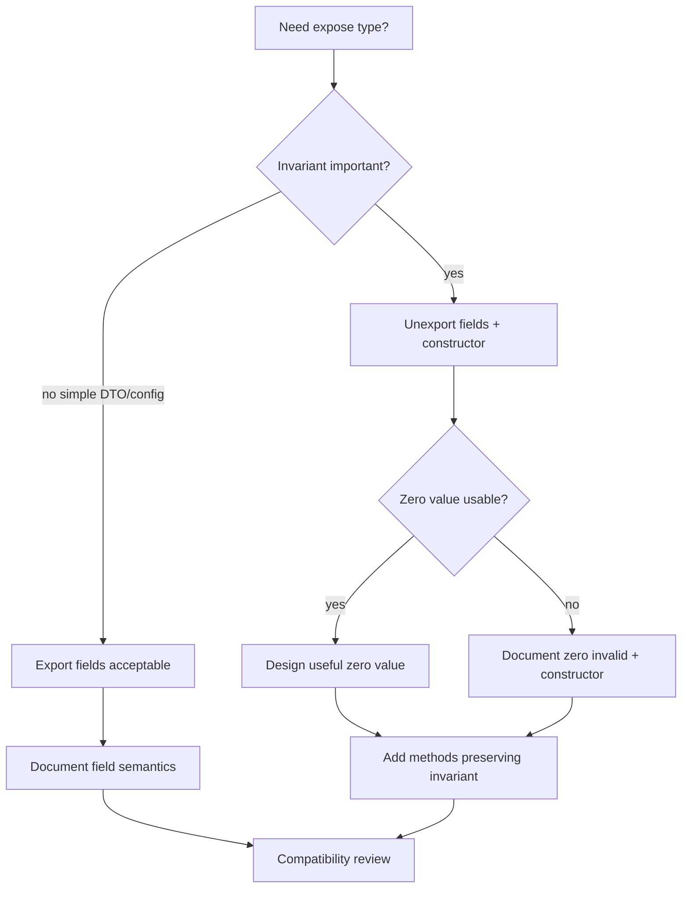
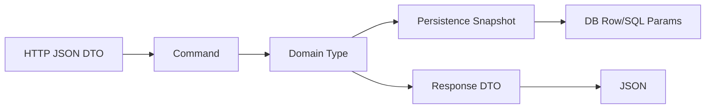

# learn-go-data-model-part-031.md

# Part 031 — API Design with Types: Public Contract, Compatibility, Evolvability

> Seri: `learn-go-data-model`  
> Bagian: `031 / 034`  
> Target pembaca: Java software engineer yang ingin memahami Go data model pada level production engineering  
> Fokus: type sebagai API contract, exported/unexported design, constructor, invariant, option pattern, compatibility, evolvability, dan API yang sulit disalahgunakan

---

## 0. Posisi Part Ini dalam Seri

Kita sudah membahas data model Go dari sisi:

```text
- type system
- zero value
- constants
- numeric correctness
- text
- array/slice/map
- struct/pointer/nil/interface
- error/generics/reflection/unsafe
- encoding/database/time/memory/concurrency
```

Sekarang kita masuk ke level yang lebih strategis:

```text
Bagaimana semua keputusan type itu menjadi API contract?
```

Di Go, API design sangat dipengaruhi oleh data shape:

```go
type UserID string
type User struct { ... }
type Config struct { ... }
type Option func(*options)
type Repository interface { ... }
```

Setelah type diexport, ia menjadi janji kepada caller.

Public type adalah kontrak jangka panjang.

Untuk Java engineer, ini mirip dengan public class/interface signature, tetapi Go punya karakteristik sendiri:

```text
- exported berdasarkan huruf kapital
- field exported bisa dimutasi langsung
- unexported field menjaga invariant
- interface satisfaction implicit
- zero value sering diharapkan berguna
- compatibility sangat dipengaruhi method set dan struct fields
- package API lebih penting daripada class hierarchy
```

---

## 1. Tujuan Pembelajaran

Setelah part ini, kamu harus bisa:

1. Mendesain public type yang menjaga invariant.
2. Memilih exported vs unexported type/field/method.
3. Mendesain constructor yang jelas.
4. Menentukan kapan zero value harus usable.
5. Mendesain option pattern tanpa overengineering.
6. Memahami compatibility impact dari perubahan type.
7. Mendesain interface yang kecil dan evolvable.
8. Menentukan kapan return concrete vs interface.
9. Mendesain config type yang aman.
10. Mendesain DTO/domain/public API boundary.
11. Menghindari leaky abstractions.
12. Membuat API yang sulit disalahgunakan.
13. Membuat PR checklist untuk API design with types.

---

## 2. Type Adalah Contract

Setiap exported declaration adalah contract.

```go
package user

type User struct {
    ID    string
    Email string
}
```

Caller bisa:

```go
u := user.User{}
u.ID = ""
u.Email = "not email"
```

Jika field exported, caller bisa membuat invalid state.

Jika invariant penting, jangan expose raw fields.

Better:

```go
type User struct {
    id    UserID
    email Email
}

func NewUser(id UserID, email Email) (User, error) {
    if id == "" {
        return User{}, ErrInvalidUserID
    }
    if email.IsZero() {
        return User{}, ErrInvalidEmail
    }
    return User{id: id, email: email}, nil
}

func (u User) ID() UserID {
    return u.id
}

func (u User) Email() Email {
    return u.email
}
```

Now construction goes through invariant boundary.

---

## 3. Exported vs Unexported

Go export rule:

```text
Identifier starting with uppercase letter is exported.
lowercase is package-private.
```

Examples:

```go
type User struct{}     // exported
type userRow struct{}  // unexported

func NewUser() User    // exported
func parseUser() User  // unexported
```

Use exported identifiers for package API.

Use unexported identifiers for implementation details.

Design question:

```text
Do callers need to name this type/function/field?
```

If not, keep unexported.

---

## 4. Exported Struct Fields Are Public Mutable API

```go
type Config struct {
    Timeout time.Duration
    Logger  *slog.Logger
}
```

Caller can mutate anytime:

```go
cfg.Timeout = -1
cfg.Logger = nil
```

This may be okay for simple configuration structs.

But for invariant-rich types:

```go
type Money struct {
    Currency string
    Cents    int64
}
```

Exporting fields may allow invalid currency.

Better:

```go
type Money struct {
    currency Currency
    cents    int64
}
```

Expose methods:

```go
func (m Money) Currency() Currency
func (m Money) Cents() int64
```

Guideline:

```text
Export fields for dumb data/config/DTO where mutation is acceptable.
Hide fields for domain types with invariants.
```

---

## 5. Constructor as Invariant Gate

Constructor:

```go
func NewEmail(s string) (Email, error)
```

or parser:

```go
func ParseEmail(s string) (Email, error)
```

Example:

```go
type Email struct {
    canonical string
}

func ParseEmail(s string) (Email, error) {
    s = strings.TrimSpace(s)
    if s == "" {
        return Email{}, ErrEmptyEmail
    }
    // normalize/validate
    return Email{canonical: strings.ToLower(s)}, nil
}
```

Callers cannot build invalid Email because field unexported.

Constructor must:

```text
- validate
- normalize
- set all required fields
- avoid partial state
- return error for invalid input
```

---

## 6. Zero Value Design

Go culture values useful zero values.

Examples:

```go
var b bytes.Buffer
b.WriteString("hello")
```

```go
var mu sync.Mutex
mu.Lock()
mu.Unlock()
```

But not every type must have valid zero value.

Question:

```text
Can zero value be meaningfully usable?
```

If yes, design it.

If no, make invalid zero value safe to detect and document constructor requirement.

Example:

```go
type Email struct {
    canonical string
}
```

Zero Email likely invalid.

Methods should handle:

```go
func (e Email) IsZero() bool {
    return e.canonical == ""
}
```

Avoid panics on zero unless misuse is severe and documented.

---

## 7. Zero Value for Config

Config often benefits from defaulting.

```go
type ServerConfig struct {
    Addr         string
    ReadTimeout time.Duration
}

func (c ServerConfig) withDefaults() ServerConfig {
    if c.Addr == "" {
        c.Addr = ":8080"
    }
    if c.ReadTimeout == 0 {
        c.ReadTimeout = 5 * time.Second
    }
    return c
}
```

But zero value can be ambiguous:

```text
ReadTimeout 0 means default?
or no timeout?
```

If both needed, use pointer/optional:

```go
type ServerConfig struct {
    ReadTimeout Optional[time.Duration]
}
```

or explicit field:

```go
DisableReadTimeout bool
ReadTimeout time.Duration
```

Be deliberate.

---

## 8. Public Struct Config Pattern

Good for simple APIs:

```go
type ClientConfig struct {
    BaseURL    string
    Timeout    time.Duration
    RetryCount int
    Logger     *slog.Logger
}

func NewClient(cfg ClientConfig) (*Client, error) {
    cfg = cfg.withDefaults()

    if cfg.BaseURL == "" {
        return nil, errors.New("base url required")
    }
    if cfg.Timeout < 0 {
        return nil, errors.New("timeout cannot be negative")
    }

    return &Client{cfg: cfg}, nil
}
```

Copy config inside client:

```go
type Client struct {
    cfg ClientConfig
}
```

Do not keep pointer to mutable config unless intended.

---

## 9. Functional Option Pattern

Option pattern:

```go
type ClientOption func(*clientOptions)

type clientOptions struct {
    timeout time.Duration
    logger  *slog.Logger
}

func WithTimeout(timeout time.Duration) ClientOption {
    return func(o *clientOptions) {
        o.timeout = timeout
    }
}

func WithLogger(logger *slog.Logger) ClientOption {
    return func(o *clientOptions) {
        o.logger = logger
    }
}

func NewClient(baseURL string, opts ...ClientOption) (*Client, error) {
    o := clientOptions{
        timeout: 5 * time.Second,
        logger:  slog.Default(),
    }

    for _, opt := range opts {
        opt(&o)
    }

    if o.timeout < 0 {
        return nil, errors.New("timeout cannot be negative")
    }

    return &Client{baseURL: baseURL, timeout: o.timeout, logger: o.logger}, nil
}
```

Useful when:

```text
- many optional settings
- defaults matter
- want backward-compatible extension
- avoid huge constructor signatures
```

Overkill when only 1–2 options.

---

## 10. Option Pattern Pitfalls

Bad option:

```go
func WithConfig(cfg *Config) Option {
    return func(o *options) {
        o.config = cfg
    }
}
```

If caller mutates cfg later, client behavior changes.

Better copy:

```go
func WithConfig(cfg Config) Option {
    return func(o *options) {
        o.config = cfg.withDefaults()
    }
}
```

Bad option validation delayed too far:

```go
WithTimeout(-1)
```

May be accepted silently.

Options should either:

```text
- validate in constructor after apply
- return error option pattern if needed
```

Error-returning option:

```go
type Option func(*options) error
```

Use only if validation needs external parsing.

---

## 11. Required vs Optional Parameters

Do not hide required values in options.

Bad:

```go
client, err := NewClient(WithBaseURL(url))
```

BaseURL is required, so make it positional:

```go
client, err := NewClient(url, WithTimeout(5*time.Second))
```

Rule:

```text
Required parameters explicit.
Optional parameters options/config.
```

---

## 12. Return Concrete, Accept Interface

Common Go guideline:

```text
Accept interfaces, return concrete types.
```

Example:

```go
func NewClient(...) *Client
```

Return concrete so caller can use all methods and future additions.

Accept interface for dependencies:

```go
func NewService(repo UserRepository, clock Clock) *Service
```

But define interface at consumer side.

```go
type UserRepository interface {
    FindUser(context.Context, UserID) (User, error)
}
```

Avoid returning interface unless:

```text
- multiple implementations hidden intentionally
- API contract must hide concrete type
- plugin boundary
```

---

## 13. Interface Compatibility

Adding method to exported interface is breaking.

```go
type Store interface {
    Get(string) (Value, bool)
}
```

Later:

```go
type Store interface {
    Get(string) (Value, bool)
    Put(string, Value)
}
```

Breaks all implementers.

Therefore:

```text
Keep exported interfaces small.
Avoid exporting interfaces prematurely.
```

Prefer concrete type with methods if package owns implementation.

Callers can define their own interface subset.

---

## 14. Struct Compatibility

Adding exported field to struct is usually source-compatible for composite literals using named fields:

```go
User{ID: "u1"}
```

But breaking for unkeyed literals:

```go
User{"u1", "email"}
```

To discourage unkeyed literals for public struct, unexport fields or document.

Changing field type/name is breaking.

Removing field is breaking.

Adding unexported field to exported struct can break unkeyed literals from other packages? External packages cannot set unexported fields in composite literals directly if any unexported fields are involved. But representation changes can still affect comparability and behavior.

Guideline:

```text
Avoid encouraging unkeyed literals for exported structs.
Use constructors for invariant-rich types.
```

---

## 15. Method Set Compatibility

Adding method to concrete exported type is usually compatible.

But adding method can affect interface satisfaction or naming conflicts rarely.

Removing/renaming method is breaking.

Changing receiver from value to pointer affects method set.

Example:

```go
func (u User) String() string
```

Both `User` and `*User` implement `fmt.Stringer`.

Change to:

```go
func (u *User) String() string
```

Now `User` no longer implements `fmt.Stringer`.

This can be breaking.

Receiver choice is API.

---

## 16. Comparability as API

If exported type is comparable:

```go
type UserID struct {
    value string
}
```

Callers may use:

```go
map[UserID]User
```

If later you add slice field:

```go
type UserID struct {
    value string
    parts []string
}
```

Type becomes non-comparable, breaking callers.

If type is intended as key, preserve comparability.

For IDs/value objects:

```text
prefer comparable fields
avoid slices/maps/functions
```

---

## 17. Nil Semantics as API

If function accepts pointer:

```go
func NewUser(email *Email)
```

Caller asks:

```text
Can nil be passed?
What does nil mean?
```

If nil invalid, avoid pointer:

```go
func NewUser(email Email)
```

If optional:

```go
func WithEmail(email Email)
```

or:

```go
type OptionalEmail struct { ... }
```

Document nil behavior.

Do not use nil to mean multiple things.

---

## 18. Slice/Map Ownership as API

Function parameter:

```go
func NewConfig(routes map[string]Route) *Config
```

Questions:

```text
Does NewConfig retain map?
Does it copy?
Can caller mutate after passing?
```

Safer:

```go
func NewConfig(routes map[string]Route) *Config {
    return &Config{routes: maps.Clone(routes)}
}
```

Document:

```text
NewConfig copies routes.
```

Return slice:

```go
func (c *Config) Routes() []Route
```

Does caller own result? Can mutate?

Prefer copies or immutable contract.

---

## 19. Error Contract

Errors are part of API.

```go
var ErrNotFound = errors.New("not found")
```

If exported, callers may rely on:

```go
errors.Is(err, ErrNotFound)
```

Do not change casually.

For typed errors:

```go
type ValidationError struct {
    Field string
    Code  string
}
```

Fields become API.

Changing field name/type is breaking.

Design error taxonomy deliberately.

---

## 20. Context Parameter Contract

For operations that can block or do IO:

```go
func (s *Service) FindUser(ctx context.Context, id UserID) (User, error)
```

Convention:

```text
ctx first parameter
do not store context in struct
respect cancellation/deadline
```

Bad:

```go
type Service struct {
    ctx context.Context
}
```

Context is request-scoped, not object-scoped.

---

## 21. Time Source Contract

APIs that need current time can:

```go
func Submit(now time.Time) error
```

or service injects clock:

```go
type Clock interface {
    Now() time.Time
}
```

Avoid hidden `time.Now()` in domain if deterministic behavior/testability matters.

Time source is part of API design.

---

## 22. Generic API Design

Generic public API constraints are contract.

```go
func Unique[T comparable](values []T) []T
```

Cannot later support non-comparable without new API.

Use minimal constraint:

```go
func Clone[T any](values []T) []T
```

Do not use `comparable` unless needed.

For public generic types:

```go
type Set[T comparable] struct { ... }
```

Document:

```text
zero value behavior
copy behavior
concurrency safety
order guarantee
```

---

## 23. Option Generic Overuse

Avoid generic services without real value:

```go
type Repository[T any, ID comparable] interface {
    Find(context.Context, ID) (T, error)
    Save(context.Context, T) error
}
```

May be useful in infrastructure library, but often weak for domain.

Domain-specific API:

```go
type UserRepository interface {
    FindUser(context.Context, UserID) (User, error)
    SaveUser(context.Context, User) error
}
```

Types should express domain language, not generic CRUD when domain semantics differ.

---

## 24. Package Boundary

Go API is package-level, not class-level.

A package should expose a coherent vocabulary.

Bad package:

```text
utils
common
helpers
```

with random types.

Better:

```text
user
authz
billing
caseworkflow
```

Public types in package should form a small language.

Example:

```go
package money

type Money
type Currency
func New(...)
func Parse(...)
```

Keep implementation details unexported.

---

## 25. Naming Types

Good names encode role:

```go
UserID
Email
Money
Clock
Store
Repository
Validator
Policy
Decision
```

Avoid vague:

```go
Data
Info
Manager
Helper
Common
Util
```

But don't overname tiny local types.

Name according to caller perspective.

---

## 26. Constructors: New vs Parse vs Must

Use `New` when constructing from already typed/validated pieces:

```go
func NewMoney(currency Currency, cents int64) (Money, error)
```

Use `Parse` when input is string/text:

```go
func ParseEmail(s string) (Email, error)
```

Use `Must` only for programmer/config constants:

```go
func MustParseEmail(s string) Email {
    e, err := ParseEmail(s)
    if err != nil {
        panic(err)
    }
    return e
}
```

Do not use Must for user input.

---

## 27. Rehydration Constructor

Domain loaded from database may need constructor that bypasses some creation rules but still enforces invariants.

```go
func RehydrateUser(id UserID, email Email, status UserStatus, createdAt time.Time) (User, error) {
    if id.IsZero() {
        return User{}, ErrInvalidUserID
    }
    if status.IsZero() {
        return User{}, ErrInvalidStatus
    }
    return User{
        id: id,
        email: email,
        status: status,
        createdAt: createdAt,
    }, nil
}
```

Keep unexported if only repository package needs it.

If repository in different package, consider internal package or persistence mapper.

---

## 28. Builder Pattern

Builder can be useful for complex test data or optional construction.

```go
type UserBuilder struct {
    id    UserID
    email Email
}

func NewUserBuilder() UserBuilder {
    return UserBuilder{
        id: MustParseUserID("user-test"),
        email: MustParseEmail("test@example.com"),
    }
}

func (b UserBuilder) WithEmail(email Email) UserBuilder {
    b.email = email
    return b
}

func (b UserBuilder) Build() (User, error) {
    return NewUser(b.id, b.email)
}
```

Use mostly in tests. Avoid making production API require builder unless object truly complex.

---

## 29. Fluent APIs in Go

Go usually avoids excessive fluent chaining.

Java style:

```java
User.builder().email("a").name("b").build()
```

Go often:

```go
u, err := NewUser(id, email, name)
```

or config:

```go
client, err := NewClient(url, WithTimeout(5*time.Second))
```

Fluent mutation can hide errors.

Prefer explicit error returns.

---

## 30. Leaky Abstractions

Leaky type:

```go
type User struct {
    SQLRowID int64
    JSONTags map[string]any
    HTTPStatus int
}
```

Mixes DB, JSON, HTTP into domain.

Better separate:

```text
DB row type
domain type
API response type
transport error mapper
```

If type imports many unrelated packages, smell.

---

## 31. DTO Boundary

Input DTO:

```go
type CreateUserRequest struct {
    Email string `json:"email"`
    Name  string `json:"name"`
}
```

Command:

```go
type CreateUserCommand struct {
    Email Email
    Name  string
}
```

Domain:

```go
type User struct { ... }
```

Response DTO:

```go
type UserResponse struct {
    ID    string `json:"id"`
    Email string `json:"email"`
}
```

This looks verbose but each type has one responsibility.

---

## 32. Public API and Validation

Where validate?

```text
DTO decode: syntactic validation
Command construction: parse/normalize
Domain constructor: invariant
Service: use-case rules
Repository: DB data integrity mapping
```

Do not assume JSON tags or DB constraints replace domain invariants.

---

## 33. Backward Compatibility: Function Signatures

Changing function signature is breaking.

```go
func NewClient(url string) (*Client, error)
```

to:

```go
func NewClient(url string, timeout time.Duration) (*Client, error)
```

breaking.

Option pattern avoids this:

```go
func NewClient(url string, opts ...Option) (*Client, error)
```

You can add new `WithX` later.

For public APIs likely to grow, options help.

---

## 34. Backward Compatibility: Struct Fields

Public config struct can evolve by adding fields:

```go
type Config struct {
    Timeout time.Duration
}
```

Add:

```go
Logger *slog.Logger
```

Usually okay for named literals:

```go
Config{Timeout: time.Second}
```

But callers using unkeyed literals break.

Avoid encouraging unkeyed literals in docs.

For public config, named fields are normal.

---

## 35. Backward Compatibility: Interfaces

Exported interface is hardest to evolve.

Adding a method breaks implementers.

Prefer:

```go
type Client struct { ... }
```

with methods.

If you need interface, keep minimal:

```go
type Reader interface {
    Read([]byte) (int, error)
}
```

Small standard-library style interfaces are stable.

---

## 36. Backward Compatibility: Enums

String enum:

```go
type Status string

const (
    StatusDraft Status = "draft"
)
```

Adding new status may break callers with exhaustive switch default behavior.

Caller:

```go
switch status {
case StatusDraft:
default:
    return fmt.Errorf("unknown status")
}
```

For public APIs, document whether new enum values may appear.

For internal domain, exhaustive switch can be good.

---

## 37. Compatibility and JSON Tags

Changing JSON field name is breaking.

```go
Email string `json:"email"`
```

to:

```go
Email string `json:"email_address"`
```

breaks clients.

If need transition:

```go
type Request struct {
    Email        string `json:"email"`
    EmailAddress string `json:"email_address"`
}
```

or custom unmarshal supporting both, then emit one canonical field.

Version when necessary.

---

## 38. Compatibility and Database Types

Changing ID type:

```go
type UserID string
```

to:

```go
type UserID int64
```

is breaking across API, DB, JSON, tests, maps.

Type choices are architectural.

Think early about:

```text
external IDs
internal IDs
opaque IDs
string vs numeric
sortability
privacy
cross-service compatibility
```

---

## 39. API That Is Hard to Misuse

Good API prevents invalid calls.

Bad:

```go
func Transfer(from string, to string, amount int64, currency string) error
```

Caller can swap strings, pass negative amount, invalid currency.

Better:

```go
func Transfer(from AccountID, to AccountID, amount Money) error
```

Now compiler prevents mixing account IDs with other strings, and Money constructor enforces non-negative/currency.

Type system as safety tool.

---

## 40. Avoid Boolean Parameter Ambiguity

Bad:

```go
func NewReport(includeDrafts bool, exportCSV bool)
```

Call:

```go
NewReport(true, false)
```

What do booleans mean?

Better:

```go
type ReportOptions struct {
    IncludeDrafts bool
    Format ReportFormat
}
```

or explicit options:

```go
NewReport(WithDrafts(), WithFormat(ReportFormatCSV))
```

For domain commands:

```go
type GenerateReportCommand struct {
    IncludeDrafts bool
    Format ReportFormat
}
```

---

## 41. Avoid Stringly Typed API

Bad:

```go
func Authorize(action string, resource string) bool
```

Better:

```go
type Action string
type ResourceType string

func Authorize(action Action, resource Resource) bool
```

Even better with parse/const:

```go
const ActionDelete Action = "delete"
```

This reduces typos and makes refactor safer.

---

## 42. Avoid `any` in Public API Unless Truly Dynamic

Bad:

```go
func Publish(topic string, payload any) error
```

If payload schema known.

Better:

```go
func PublishCaseSubmitted(ctx context.Context, event CaseSubmittedEvent) error
```

Use `any` for:

```text
- framework extension point
- logging args
- dynamic plugin boundary
- truly schemaless data
```

For application API, typed payload is clearer.

---

## 43. Avoid Map as Object

Bad:

```go
func CreateUser(fields map[string]any) error
```

Better:

```go
type CreateUserCommand struct {
    Email Email
    Name  string
}
```

Map loses:

```text
- required fields
- type safety
- autocomplete
- compile-time checks
- validation locality
```

Use map only for genuinely dynamic attributes.

---

## 44. Documentation as Contract

Exported identifiers need doc comments.

```go
// UserID uniquely identifies a user within the system.
// The zero value is invalid.
type UserID string
```

Doc should include:

```text
- meaning
- zero value behavior
- concurrency safety
- ownership/copy behavior
- error behavior
- compatibility notes if important
```

Godoc is API surface.

---

## 45. Concurrency Contract in Docs

Example:

```go
// Cache is safe for concurrent use.
type Cache struct { ... }
```

or:

```go
// Builder is not safe for concurrent use.
type Builder struct { ... }
```

If not documented, callers guess.

If type has methods mutating internal state, decide and document.

---

## 46. Ownership Contract in Docs

Example:

```go
// NewConfig copies routes; callers may mutate routes after this call.
func NewConfig(routes map[string]Route) *Config
```

or:

```go
// NewBuffer takes ownership of b. The caller must not use b after this call.
func NewBuffer(b []byte) *Buffer
```

Ownership docs prevent aliasing bugs.

---

## 47. Error Contract in Docs

```go
// FindUser returns ErrUserNotFound if no user exists with id.
func (r *Repository) FindUser(ctx context.Context, id UserID) (User, error)
```

This tells caller they can use:

```go
errors.Is(err, ErrUserNotFound)
```

If errors are intentionally opaque, say so.

---

## 48. Module and Internal Packages

Go has `internal` package mechanism.

```text
/project/internal/foo
```

Only parent tree can import it.

Use internal for implementation types that should not become public API.

Example:

```text
user/
  user.go
internal/userdb/
  row.go
```

This protects architecture boundaries.

---

## 49. Semantic Import Versioning

For Go modules, major version v2+ usually uses module path suffix:

```text
example.com/lib/v2
```

Breaking API changes require major version.

Therefore, public type design affects module versioning.

Avoid exporting too much too early.

---

## 50. Deprecation

Use doc comment:

```go
// Deprecated: Use NewClient instead.
func NewLegacyClient(...) *Client
```

Go tooling recognizes `Deprecated:` in comments.

Deprecation path:

```text
add replacement
mark deprecated
keep for compatibility
remove in next major if needed
```

---

## 51. Testing API Contracts

Tests should lock important contracts:

```text
zero value behavior
constructor validation
JSON tags
error matching
concurrency safety
ownership copy
```

Example:

```go
func TestConfigCopiesRoutes(t *testing.T) {
    routes := map[string]Route{"/": home}
    cfg := NewConfig(routes)

    routes["/"] = other

    got, _ := cfg.Route("/")
    if got != home {
        t.Fatal("config did not copy routes")
    }
}
```

Test behavior, not only implementation.

---

## 52. API Review Heuristics

Ask:

```text
Can caller construct invalid value?
Can caller mutate internal state?
Can caller ignore error?
Can caller confuse parameters?
Can caller pass nil?
Can caller rely on something we may change?
Can we add features later without breaking?
Is this type too tied to DB/JSON/HTTP?
```

Good API makes correct usage obvious.

---

## 53. Mermaid: API Type Design Flow



---

## 54. Mermaid: Boundary Types



---

## 55. Mini Lab 1 — Exported Field Invariant Leak

```go
type Email struct {
    Value string
}

e := Email{Value: "not email"}
```

Problem:

```text
Caller can construct invalid Email.
```

Fix:

```go
type Email struct {
    canonical string
}

func ParseEmail(s string) (Email, error)
```

---

## 56. Mini Lab 2 — Comparable API Break

```go
type ID struct {
    value string
}
```

Caller:

```go
m := map[ID]string{}
```

Later adding:

```go
parts []string
```

breaks comparability.

Lesson:

```text
Comparability can be public contract.
```

---

## 57. Mini Lab 3 — Required Option Smell

```go
NewClient(WithBaseURL(url))
```

Problem:

```text
BaseURL is required but hidden as option.
```

Better:

```go
NewClient(url, WithTimeout(...))
```

---

## 58. Mini Lab 4 — Interface Evolution

```go
type Store interface {
    Get(string) (Value, bool)
}
```

Adding `Put` breaks implementers.

Lesson:

```text
Exported interfaces are harder to evolve than concrete types.
```

---

## 59. Mini Lab 5 — Ownership Copy

```go
func NewConfig(routes map[string]Route) *Config {
    return &Config{routes: maps.Clone(routes)}
}
```

Lesson:

```text
Copy mutable input if you need immutable internal state.
```

---

## 60. Mini Lab 6 — Boolean Parameter Smell

```go
NewReport(true, false)
```

Better:

```go
NewReport(ReportOptions{
    IncludeDrafts: true,
    Format: ReportFormatPDF,
})
```

Lesson:

```text
Named fields/options make call sites self-documenting.
```

---

## 61. Common Anti-Patterns

### 61.1 Exported fields on invariant-rich type

Invalid state construction.

### 61.2 Constructor that does not validate

Fake safety.

### 61.3 Required parameter as option

Hidden requiredness.

### 61.4 Interface exported too early

Hard to evolve.

### 61.5 Returning interface unnecessarily

Hides concrete functionality and complicates use.

### 61.6 `any` public API for known schema

Loses type safety.

### 61.7 Stringly typed IDs/actions/statuses

Typos and invalid values.

### 61.8 Exposing internal map/slice

Mutation/aliasing bugs.

### 61.9 Mixing DB/JSON/domain tags in one type

Leaky abstraction.

### 61.10 No documentation for zero/concurrency/ownership

Caller guesses.

---

## 62. Production Guidelines

### 62.1 Hide Invariants Behind Constructors

Unexport fields for domain/value objects.

### 62.2 Keep DTOs Dumb and Explicit

Export fields where they are pure boundary data.

### 62.3 Required Positional, Optional Config/Options

Do not hide required values.

### 62.4 Accept Interfaces at Consumer Boundary

Define small interfaces where used.

### 62.5 Return Concrete Types by Default

Easier to evolve.

### 62.6 Avoid Exporting Interfaces Prematurely

Let callers define minimal interfaces.

### 62.7 Document Zero Value

Usable or invalid.

### 62.8 Document Ownership and Concurrency

Especially for maps/slices/buffers/caches.

### 62.9 Think Compatibility Before Exporting

Export less.

### 62.10 Use Types to Prevent Misuse

ID types, enum types, value objects, command structs.

---

## 63. PR Review Checklist

### 63.1 Export Surface

```text
[ ] Does this identifier need to be exported?
[ ] Are unexported details hidden?
[ ] Is package vocabulary coherent?
[ ] Could internal package be used?
```

### 63.2 Invariant

```text
[ ] Can caller create invalid value?
[ ] Constructor validates/normalizes?
[ ] Zero value behavior documented?
[ ] Methods preserve invariant?
```

### 63.3 Fields and Ownership

```text
[ ] Exported fields safe to mutate?
[ ] Maps/slices copied if retained?
[ ] Getters avoid exposing mutable internals?
[ ] Ownership transfer documented?
```

### 63.4 Function Signature

```text
[ ] Required params explicit?
[ ] Optional params config/options?
[ ] Boolean params replaced with named config if unclear?
[ ] Nil behavior documented?
```

### 63.5 Interfaces

```text
[ ] Interface small?
[ ] Interface defined at consumer side?
[ ] Adding methods later unlikely?
[ ] Return concrete unless hiding required?
```

### 63.6 Compatibility

```text
[ ] Public struct comparability considered?
[ ] JSON tags stable?
[ ] Error sentinels/types stable?
[ ] Generic constraints minimal?
[ ] Receiver change impact considered?
```

### 63.7 Boundary Separation

```text
[ ] Domain separate from DTO/DB row?
[ ] No tag pile-up?
[ ] No transport/persistence leak into domain?
[ ] Mapping explicit?
```

### 63.8 Documentation

```text
[ ] Exported declarations have doc comments?
[ ] Concurrency safety stated?
[ ] Error behavior stated?
[ ] Deprecation comment if replacing old API?
```

---

## 64. Ringkasan Mental Model

In Go, type design is API design.

```text
Exported type = contract.
Exported field = caller mutation rights.
Constructor = invariant gate.
Interface = future compatibility risk.
Struct shape = memory/equality/encoding behavior.
Error = branchable API.
```

Good API design:

```text
makes invalid state hard
makes correct usage obvious
keeps boundary types separate
documents ownership/concurrency
exports less
evolves without breaking
```

Untuk Java engineer:

```text
Jangan mencari class hierarchy besar.
Pikirkan package vocabulary kecil dengan types yang menjaga invariant dan mudah digunakan.
```

---

## 65. Apa yang Tidak Dibahas di Part Ini

Part berikutnya:

```text
part-032 — Testing Data Semantics: Equality, Fuzzing, Golden, Property, Boundary
```

Kita akan membahas:

```text
- testing equality semantics
- boundary tests
- fuzzing parsers/decoders
- golden files
- property-style tests
- testdata
- compatibility tests
```

---

## 66. Referensi Resmi

- Effective Go — Names, Interfaces, Constructors, Allocation  
  https://go.dev/doc/effective_go
- Go Code Review Comments  
  https://go.dev/wiki/CodeReviewComments
- Go Modules: Semantic Import Versioning  
  https://go.dev/blog/v2-go-modules
- Go Spec — Exported identifiers, method sets, assignability, type identity  
  https://go.dev/ref/spec
- Package `context`  
  https://pkg.go.dev/context
- Go 1.26 Release Notes  
  https://go.dev/doc/go1.26

---

## 67. Status Seri

Selesai:

```text
part-000  Orientation
part-001  Type system core
part-002  Zero value and invariants
part-003  Constants and iota
part-004  Numeric foundations
part-005  Numeric correctness
part-006  Text model I
part-007  Text model II
part-008  Array
part-009  Slice I
part-010  Slice II
part-011  Map I
part-012  Map II
part-013  Struct I
part-014  Struct II
part-015  Struct III
part-016  Pointer
part-017  Nil
part-018  Interface I
part-019  Interface II
part-020  Error as Data
part-021  Generics I
part-022  Generics II
part-023  Comparability / Equality / Ordering
part-024  Reflection
part-025  Unsafe
part-026  Encoding Data
part-027  Database Boundary
part-028  Time as Data
part-029  Memory / Allocation / Escape / GC Pressure
part-030  Concurrency-Safe Data
part-031  API Design with Types
```

Berikutnya:

```text
part-032  Testing Data Semantics: Equality, Fuzzing, Golden, Property, Boundary
```

Seri belum selesai. Masih ada part 032 sampai part 034.


<!-- NAVIGATION_FOOTER -->
<div class="page-nav">
<a href="./learn-go-data-model-part-030.md">⬅️ Part 030 — Concurrency-Safe Data: Ownership, Copy, Immutability, Sync Boundaries</a>
<a href="./index.md">📚 Kategori</a>
<a href="../../index.md">🏠 Home</a>
<a href="./learn-go-data-model-part-032.md">Part 032 — Testing Data Semantics: Equality, Fuzzing, Golden, Property, Boundary ➡️</a>
</div>
